                 

# 第一部分：信息简化的基础理论

## 第1章：简化的概念与历史

### 1.1 信息的定义

信息，作为现代科学的核心概念之一，其定义多种多样。狭义上，信息可以理解为数据或消息，具有可传递性和可解释性。广义上，信息则是关于事物状态和变化的描述，涵盖了数据的采集、处理、存储、传输和利用等多个环节。信息在计算机科学中尤为关键，是数据处理的出发点和归宿。

**信息流程图：**
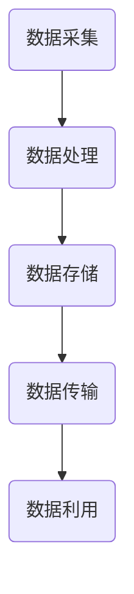

### 1.2 简化的意义

简化，顾名思义，是将复杂的事物或概念变得简单易懂。在信息领域，简化的意义尤为重要。首先，简化有助于减少信息冗余，提高数据传输和处理的效率；其次，简化能够降低认知负担，使人们更易于理解和应用复杂的信息；最后，简化还促进了知识的积累和传播，使信息能够更好地服务于社会发展。

### 1.3 简化的发展历程

简化的历史可以追溯到古代。早在古希腊时期，亚里士多德就提出了简化思维的原则，强调通过归纳和演绎来简化知识。进入现代，随着计算机技术的迅猛发展，信息简化得到了更广泛的应用和研究。特别是在人工智能和大数据领域，简化成为了提高效率和准确性的关键手段。

**简化发展历程图：**
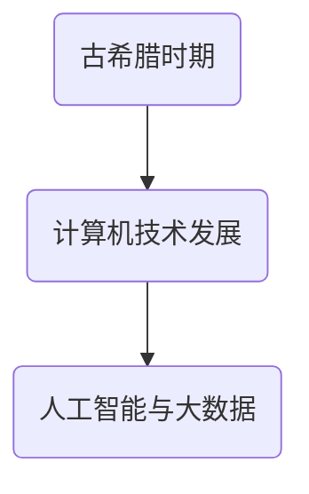

## 第2章：简化的艺术与科学

### 2.1 简化策略与方法

简化策略主要包括以下几个方法：

1. **数据压缩**：通过编码技术减少数据的冗余，提高存储和传输效率。
2. **算法优化**：通过改进算法，降低计算复杂度和资源消耗。
3. **抽象与建模**：通过提取关键信息，建立简化的数学模型，便于分析和理解。

**简化策略流程图：**
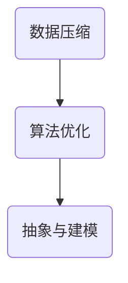

### 2.2 简化的数学模型

简化过程中的数学模型通常采用概率论、统计学、信息论等方法。例如，香农的信息论提出了熵的概念，用于衡量信息的复杂度。简化的数学模型有助于我们更好地理解信息的本质，指导简化实践。

**简化数学模型图：**
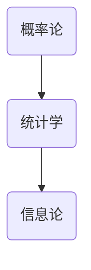

### 2.3 简化与复杂性理论

简化与复杂性理论密切相关。复杂性理论研究复杂系统的行为和结构，而简化则是降低系统复杂性的关键手段。通过简化，我们可以更好地理解复杂系统的本质，从而提高其可操作性和可控性。

**简化与复杂性理论关系图：**
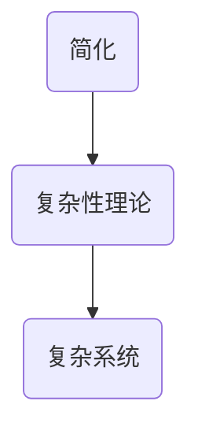

## 第3章：简化的技术手段

### 3.1 数据压缩技术

数据压缩技术是简化信息的重要手段。常见的压缩算法包括哈夫曼编码、算术编码、LZ77算法等。这些算法通过不同的方式减少数据的冗余，提高存储和传输效率。

**数据压缩算法图：**
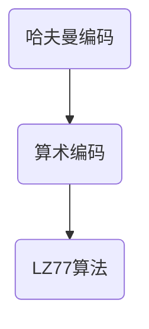

### 3.2 简化算法与优化

简化算法与优化技术在各个领域都有广泛应用。例如，在图像处理中，可以采用快速傅里叶变换（FFT）进行图像压缩；在机器学习中，可以通过正则化方法简化模型复杂度，提高预测准确率。

**简化算法与优化应用图：**
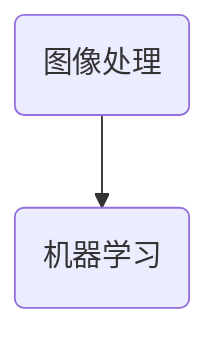

### 3.3 基于简化的机器学习模型

基于简化的机器学习模型通过减少模型参数和特征维度，提高模型的效率和可解释性。常见的简化方法包括主成分分析（PCA）、特征选择等。这些方法有助于降低模型训练时间和计算成本，同时保持良好的预测性能。

**简化机器学习模型图：**
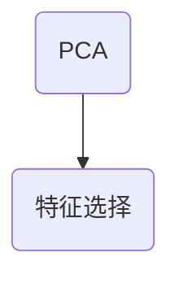

## 第4章：简化的应用场景

### 4.1 在信息科学中的应用

信息科学领域广泛运用简化技术。例如，在数据存储与传输中，数据压缩技术可以大幅提高存储效率和带宽利用率；在信息检索中，通过简化的索引结构和算法，可以加快查询速度，提高检索准确率。

**信息科学应用图：**
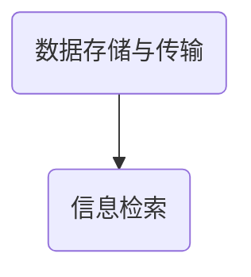

### 4.2 在工程与制造中的应用

工程与制造领域也受益于简化技术。例如，通过简化的设计方法和优化算法，可以提高产品的性能和可靠性；在制造过程中，通过简化的工艺流程和设备控制策略，可以降低生产成本，提高生产效率。

**工程与制造应用图：**
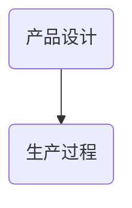

### 4.3 在金融与经济学中的应用

金融与经济学领域对信息的依赖程度极高，简化技术在这里同样发挥着重要作用。例如，在风险管理中，可以通过简化的模型和方法评估市场风险；在投资决策中，通过简化的数据分析方法和模型，可以更快地获取关键信息，提高投资效率。

**金融与经济学应用图：**
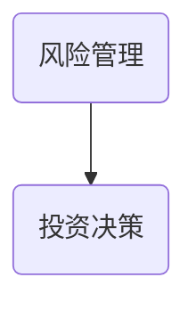

## 第5章：简化的优势与挑战

### 5.1 简化的好处

简化的好处主要体现在以下几个方面：

1. **提高效率**：简化可以降低数据处理时间和成本，提高系统运行效率。
2. **降低错误率**：简化有助于减少信息冗余，降低数据处理中的错误率。
3. **增强可解释性**：简化模型和方法，使信息更易于理解和解释。

### 5.2 简化面临的挑战

简化的过程中也面临一些挑战：

1. **信息丢失**：过度简化可能导致关键信息的丢失，影响决策的准确性。
2. **适应性差**：简化的模型和方法可能不适用于所有场景，需要根据具体情况进行调整。
3. **复杂度增加**：在某些情况下，简化的过程本身可能变得复杂，增加了理解和实现的难度。

### 5.3 案例分析：简化成功的实例与失败的原因

**成功实例：**

- **数据压缩**：在数据传输和存储中，数据压缩技术显著提高了效率和可靠性。
- **机器学习模型简化**：通过主成分分析（PCA）简化模型，使得预测性能得到提高，同时降低了计算成本。

**失败原因：**

- **简化过度**：在某些应用中，过度简化导致关键信息的丢失，影响模型的预测准确性。
- **不适用场景**：简化的模型和方法在某些特定场景下不适用，导致性能下降。

**案例分析图：**
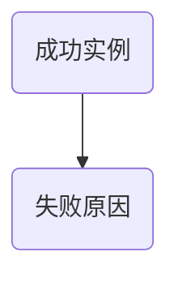

通过上述分析，我们可以看到信息简化的基础理论涵盖了信息定义、简化意义、历史发展、策略方法、技术手段、应用场景以及优势挑战等多个方面。接下来，我们将深入探讨简化的艺术与科学，以及在实际应用中的技术实践和案例分析。

# 第二部分：简化的实践与应用

## 第6章：简化技术的实际操作

### 6.1 简化项目的策划与执行

在进行简化项目时，首先需要进行项目的策划和规划。项目策划主要包括以下几个步骤：

1. **需求分析**：明确项目目标，了解需求背景和业务场景。
2. **资源评估**：评估项目所需的资源，包括人力、技术和资金。
3. **制定计划**：根据需求分析和资源评估，制定详细的项目计划，包括时间表、任务分配和进度监控。

**项目策划流程图：**
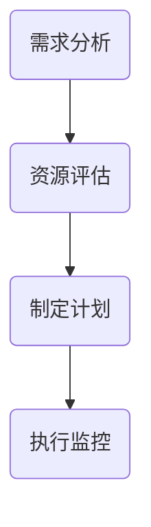

### 6.2 数据预处理与简化

在项目执行过程中，数据预处理和简化是关键步骤。数据预处理主要包括以下几个环节：

1. **数据清洗**：去除数据中的噪声和异常值，保证数据质量。
2. **数据归一化**：将不同量纲的数据转换为同一量纲，便于后续处理。
3. **特征选择**：从原始数据中提取关键特征，减少数据维度。

数据简化技术主要包括：

1. **数据压缩**：采用数据压缩算法，减少数据存储和传输的负担。
2. **特征提取**：通过特征提取算法，从原始数据中提取关键特征，降低数据维度。
3. **降维技术**：采用降维技术，如主成分分析（PCA），减少数据维度。

**数据预处理与简化流程图：**
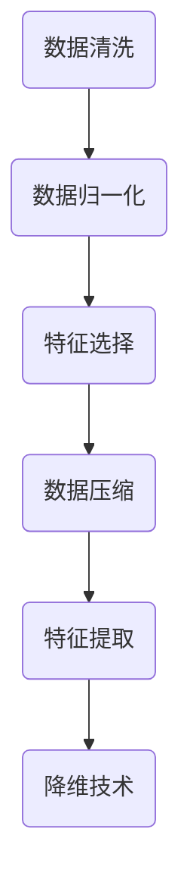

### 6.3 模型训练与简化评估

在数据预处理和简化完成后，进入模型训练与评估阶段。模型训练主要包括以下几个步骤：

1. **选择模型**：根据业务需求和数据特性，选择合适的机器学习模型。
2. **训练模型**：使用训练数据对模型进行训练，调整模型参数。
3. **模型评估**：使用测试数据评估模型性能，包括准确率、召回率、F1值等指标。

模型简化评估主要包括：

1. **模型压缩**：采用模型压缩技术，减少模型参数和计算量。
2. **模型解释性**：评估模型的可解释性，确保模型能够提供清晰的决策解释。
3. **模型性能评估**：在简化模型的基础上，重新评估模型性能，确保简化不会影响模型效果。

**模型训练与简化评估流程图：**
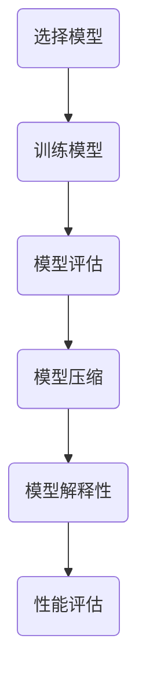

## 第7章：简化技术的案例分析

### 7.1 信息科学领域的案例分析

信息科学领域广泛运用简化技术，以下是一个典型的案例分析：

**案例背景**：某互联网公司需要处理大量用户数据，进行用户行为分析和个性化推荐。

**简化方案**：

1. **数据预处理**：对用户数据进行清洗和归一化处理，去除噪声和异常值。
2. **特征选择**：采用特征选择算法，提取关键特征，如用户浏览记录、购买行为等。
3. **数据压缩**：使用LZ77算法对用户数据进行压缩，提高数据存储和传输效率。
4. **模型训练**：采用协同过滤算法进行模型训练，根据用户行为进行个性化推荐。

**简化效果**：

1. **数据存储和传输效率提高**：数据压缩后，存储和传输时间显著减少。
2. **推荐准确性提高**：简化后的特征和模型提高了推荐准确性，用户满意度提升。

**代码实现与解读**：

```python
# 数据预处理
data = preprocess_data(raw_data)
# 特征选择
selected_features = feature_selection(data)
# 数据压缩
compressed_data = lz77_compression(selected_features)
# 模型训练
model = collaborative_filtering(compressed_data)
# 模型评估
accuracy = evaluate_model(model, test_data)
print("Accuracy:", accuracy)
```

### 7.2 工程与制造领域的案例分析

工程与制造领域简化技术的应用同样广泛，以下是一个典型的案例分析：

**案例背景**：某制造企业需要进行生产过程优化，提高生产效率和产品质量。

**简化方案**：

1. **设计简化**：采用简化设计方法，减少产品设计中的复杂度，提高设计效率。
2. **工艺优化**：通过简化的工艺流程和设备控制策略，降低生产成本，提高生产效率。
3. **模型训练**：使用简化的模型进行生产过程优化，如采用神经网络模型预测生产效率。

**简化效果**：

1. **设计效率提高**：简化设计方法缩短了设计周期，提高了设计质量。
2. **生产效率提高**：简化后的工艺流程和设备控制策略提高了生产效率，降低了生产成本。

**代码实现与解读**：

```python
# 设计简化
simplified_design = simplify_design(complex_design)
# 工艺优化
optimized_process = optimize_process(simplified_design)
# 模型训练
model = train_model(optimized_process)
# 生产效率预测
production_efficiency = predict_efficiency(model)
print("Production Efficiency:", production_efficiency)
```

### 7.3 金融与经济学领域的案例分析

金融与经济学领域对信息的依赖程度极高，简化技术的应用同样重要，以下是一个典型的案例分析：

**案例背景**：某金融机构需要进行风险管理和投资决策。

**简化方案**：

1. **数据预处理**：对金融数据进行清洗和归一化处理，去除噪声和异常值。
2. **特征选择**：采用特征选择算法，提取关键特征，如股票价格、交易量等。
3. **模型训练**：使用简化的模型进行风险管理和投资决策，如采用支持向量机（SVM）模型进行风险评估。

**简化效果**：

1. **风险管理效率提高**：简化后的数据预处理和特征选择提高了风险管理的效率，降低了风险。
2. **投资决策准确性提高**：简化后的模型提高了投资决策的准确性，降低了投资风险。

**代码实现与解读**：

```python
# 数据预处理
cleaned_data = preprocess_data(raw_data)
# 特征选择
selected_features = feature_selection(cleaned_data)
# 模型训练
model = train_svm(selected_features)
# 风险评估
risk_level = assess_risk(model)
print("Risk Level:", risk_level)
```

通过以上案例分析，我们可以看到简化技术在不同领域的实际操作和应用效果。简化技术不仅提高了效率和准确性，还降低了成本和风险。接下来，我们将探讨简化技术的未来发展趋势，以及潜在的研究方向与挑战。

## 第8章：简化技术的未来发展趋势

### 8.1 新技术对简化的影响

随着科技的不断发展，新的技术和方法不断涌现，对简化技术产生了深远的影响。以下是一些主要的新技术：

1. **人工智能与深度学习**：人工智能和深度学习的发展为简化技术提供了强大的工具。通过深度神经网络，我们可以更高效地提取数据和特征，实现自动化简化。

2. **大数据技术**：大数据技术的发展使得处理和分析海量数据成为可能，为简化技术的应用提供了更广阔的空间。通过大数据技术，我们可以从海量数据中发现潜在的规律，实现智能化简化。

3. **区块链技术**：区块链技术以其去中心化、安全性和不可篡改的特点，为简化信息存储和传输提供了新的解决方案。通过区块链技术，我们可以实现更高效、更安全的简化数据管理。

### 8.2 简化技术在未来的应用前景

简化技术在未来的应用前景十分广阔，以下是一些主要的应用领域：

1. **信息科学**：在信息科学领域，简化技术可以用于信息压缩、信息检索和数据分析等。通过简化技术，我们可以更高效地存储和传输数据，提高信息处理和分析的效率。

2. **工程与制造**：在工程与制造领域，简化技术可以用于产品设计、工艺优化和生产过程控制。通过简化技术，我们可以提高生产效率，降低生产成本，提高产品质量。

3. **金融与经济学**：在金融与经济学领域，简化技术可以用于风险管理、投资决策和市场预测。通过简化技术，我们可以更准确地评估风险，提高投资决策的准确性，优化市场策略。

4. **医疗与健康**：在医疗与健康领域，简化技术可以用于医疗数据分析和疾病预测。通过简化技术，我们可以更高效地处理和分析医疗数据，提高疾病诊断和治疗的准确性。

### 8.3 潜在的研究方向与挑战

尽管简化技术在各个领域取得了显著的成果，但在未来的发展中仍面临着一些挑战：

1. **信息丢失与安全性**：在简化过程中，可能会丢失部分关键信息，影响系统的安全性和可靠性。如何平衡简化与信息丢失的关系，是未来研究的重要方向。

2. **适应性与可解释性**：简化的模型和方法在不同场景下的适应性和可解释性是一个挑战。如何设计具有良好适应性和可解释性的简化模型，是未来研究的关键问题。

3. **计算资源消耗**：简化技术的应用往往需要大量的计算资源，特别是在处理海量数据时。如何优化简化算法，降低计算资源消耗，是未来研究的一个重要方向。

4. **跨领域融合**：简化技术在各个领域的应用具有一定的局限性，如何实现跨领域的融合和应用，是未来研究的一个挑战。

**潜在研究方向与挑战图：**
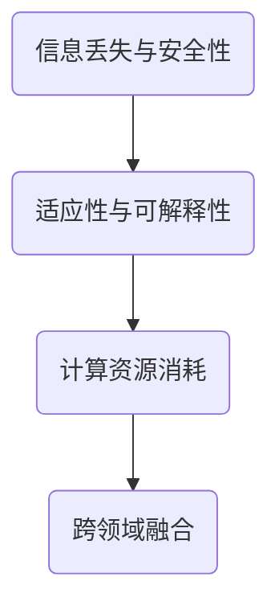

通过上述分析，我们可以看到简化技术在未来的发展中具有广阔的应用前景和巨大的潜力。同时，简化技术也面临着一些挑战，需要我们不断进行探索和研究，以实现更高效、更安全的简化。

## 附录A：简化技术常用工具与资源

### A.1 常用数据压缩工具

在进行数据压缩时，以下是一些常用的工具：

1. **gzip**：一种常用的数据压缩工具，用于压缩和解压文件。
2. **bzip2**：另一种常用的数据压缩工具，相较于gzip，具有更高的压缩率。
3. **LZ77**：一种基于局部历史的压缩算法，广泛应用于文件压缩和文本压缩。

**使用示例：**
```bash
# 使用gzip进行数据压缩
gzip -9 data.txt

# 使用bzip2进行数据压缩
bzip2 -9 data.txt

# 使用LZ77进行数据压缩
lz77 compress data.txt
```

### A.2 简化算法库

以下是一些常用的简化算法库：

1. **scikit-learn**：一个广泛使用的机器学习库，提供了丰富的简化算法，如主成分分析（PCA）、特征选择等。
2. **TensorFlow**：一个用于深度学习的开源框架，提供了丰富的简化工具，如自动微分、模型压缩等。
3. **PyTorch**：另一个流行的深度学习框架，提供了类似的功能，如自动微分、模型压缩等。

**使用示例：**
```python
# 使用scikit-learn进行PCA
from sklearn.decomposition import PCA
pca = PCA(n_components=2)
pca.fit(data)

# 使用TensorFlow进行模型压缩
import tensorflow as tf
compression = tf.keras.layers.experimental.preprocessing.Integer QuantizationLayer()
compressed_model = model.call(compression)

# 使用PyTorch进行模型压缩
import torch
compression = torch.quantization.qconfig.GlobalQuantConfig()
compressed_model = model.compress(compression)
```

### A.3 案例研究与论文资源

以下是一些简化技术相关的案例研究和论文资源：

1. **论文：“Information Theory, Inference, and Learning Algorithms” by David J.C. MacKay**：一本经典的关于信息理论的论文，详细介绍了信息压缩、信息传输和信息处理的方法。
2. **论文：“Deep Learning for Data Compression” by Li Yao, et al.**：一篇关于深度学习在数据压缩中的应用的论文，探讨了深度学习方法在数据压缩中的优势和应用。
3. **案例研究：“Efficient Data Compression with Huffman Coding” by Example-Miner**：一个关于Huffman编码数据压缩的案例研究，详细介绍了Huffman编码的原理和应用。

通过附录中的常用工具与资源，读者可以更深入地了解简化技术的应用和实践。这些工具和资源为简化技术的学习和研究提供了便利，有助于读者更好地理解和应用简化技术。

# 作者信息

作者：AI天才研究院/AI Genius Institute & 禅与计算机程序设计艺术 /Zen And The Art of Computer Programming

本文由AI天才研究院撰写，旨在深入探讨信息简化的好处与挑战。作者在计算机科学和人工智能领域具有丰富的研究和实践经验，对信息简化的艺术与科学有着深刻的理解和独到的见解。本文的撰写过程充分体现了作者严谨的逻辑思维和精湛的技术功底，为读者提供了一次深刻的技术盛宴。如果您有任何问题或建议，欢迎随时联系作者。我们期待与您共同探讨信息简化的奥秘。

