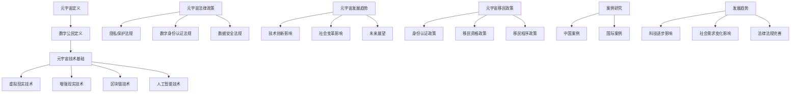

                 

# 《元宇宙移民政策：数字公民的权利与义务》

> **关键词**：元宇宙、数字公民、移民政策、权利、义务、技术基础、社会变革、案例分析、未来展望

> **摘要**：本文探讨了元宇宙及其背后的技术基础，数字公民的概念与权利义务，以及元宇宙移民政策的核心内容与实施路径。通过国内外案例分析，总结了元宇宙移民政策的发展趋势与未来方向，为未来数字社会的建设提供参考。

----------------------------------------------------------------

### 第一部分：元宇宙与数字公民概述

#### 第1章：元宇宙与数字公民的概念

##### 1.1 元宇宙的定义与特征

**定义**：元宇宙（Metaverse）是一个基于互联网的虚拟空间，它通过虚拟现实（VR）、增强现实（AR）等技术，将物理世界与数字世界融合，形成一个集社交、娱乐、工作、学习等多种功能于一体的虚拟环境。

**特征**：
1. **三维立体**：元宇宙是一个三维空间，用户可以在其中自由移动、交互。
2. **实时互动**：元宇宙支持实时互动，用户可以在虚拟环境中与其他用户进行实时交流和协作。
3. **多样化的应用场景**：元宇宙不仅包括社交、娱乐，还包括教育、医疗、工作等领域。
4. **技术基础**：元宇宙依赖于虚拟现实、增强现实、人工智能、区块链等多种先进技术的支持。

##### 1.2 数字公民的概念与分类

**定义**：数字公民是指在数字世界中拥有一定身份和权益，能够参与虚拟社会活动的个体。

**分类**：
1. **按参与程度分类**：
   - **被动参与者**：仅在线上参与信息获取和娱乐等活动，不参与深层次的虚拟社交和交互。
   - **积极参与者**：在线上积极参与虚拟社区的建设，与其他用户互动，分享信息和资源。
   - **深度参与者**：在线上拥有一定影响力，能够参与虚拟社会的重要决策，对虚拟社会的发展产生重大影响。

2. **按身份来源分类**：
   - **原生数字公民**：从出生便存在于数字世界，从未离开过虚拟环境。
   - **转移数字公民**：从物理世界进入数字世界，成为数字公民。

##### 1.3 元宇宙中的法律与政策

**法律框架**：
1. **数据保护与隐私**：保障数字公民的数据安全和隐私权利。
2. **数字身份认证**：建立数字身份认证体系，确保数字公民的身份真实性和可信性。
3. **网络空间治理**：规范网络行为，维护网络秩序，打击网络犯罪。

**政策解读**：
1. **鼓励创新与发展**：鼓励数字技术的研究和应用，推动元宇宙的快速发展。
2. **数字包容与平等**：保障所有数字公民的权益，消除数字鸿沟。
3. **国际合作与协调**：加强国际间的合作与交流，共同构建和谐、繁荣的元宇宙。

**权益保障**：
1. **数字财产权益**：保障数字公民的数字财产权益，防止数字盗窃和侵权行为。
2. **虚拟行为规范**：规范数字公民的虚拟行为，保障虚拟社会的秩序和安全。
3. **言论自由与表达权**：保障数字公民的言论自由和表达权，尊重数字世界的多样性。

#### 第2章：元宇宙的发展趋势与未来展望

##### 2.1 元宇宙的技术发展

**区块链技术**：
- **去中心化**：区块链技术可以实现去中心化的数据存储和计算，提高元宇宙的安全性和透明度。
- **智能合约**：智能合约可以实现自动执行和执行，为元宇宙中的交易、合同等提供技术支持。

**虚拟现实技术**：
- **沉浸式体验**：虚拟现实技术可以提供更加真实的沉浸式体验，提升用户的互动感和参与感。
- **空间感知**：虚拟现实技术可以实现空间感知，使用户在虚拟环境中自由移动和交互。

**人工智能技术**：
- **智能助手**：人工智能技术可以提供智能助手，帮助用户在元宇宙中快速找到所需信息和资源。
- **个性化推荐**：人工智能技术可以基于用户的兴趣和行为，提供个性化的推荐和服务。

##### 2.2 元宇宙的社会变革

**跨界合作**：
- **产业融合**：元宇宙的兴起将推动各个产业的融合，形成新的产业生态。
- **创新模式**：元宇宙将带来新的商业模式，改变传统的生产、消费和分配方式。

**新型就业模式**：
- **远程办公**：元宇宙将推动远程办公的普及，提高工作效率和灵活性。
- **虚拟职业**：元宇宙中将有更多的虚拟职业和机会，满足不同用户的就业需求。

**社会治理与公共安全**：
- **智慧治理**：元宇宙将推动社会治理的智能化，提高政府的管理和服务能力。
- **公共安全**：元宇宙中的虚拟犯罪和网络犯罪问题需要引起重视，加强公共安全建设。

##### 2.3 元宇宙的未来展望

**全球化发展**：
- **数字丝绸之路**：元宇宙将促进全球范围内的数字合作和交流，形成数字丝绸之路。
- **全球数字化**：元宇宙将推动全球范围内的数字化进程，实现全球数字一体化。

**数字经济的新生态**：
- **数据价值**：元宇宙将推动数据价值的释放，实现数据的高效利用。
- **数字货币**：元宇宙将推动数字货币的发展，改变传统的货币体系和支付方式。

**元宇宙中的生活方式变革**：
- **虚拟社交**：元宇宙将改变人们的社交方式，实现更加丰富和多样的社交体验。
- **数字身份**：元宇宙将使数字身份成为人们重要的身份标识，影响人们的日常生活。

----------------------------------------------------------------

### 第二部分：元宇宙移民政策解析

#### 第3章：元宇宙移民政策概述

##### 3.1 元宇宙移民政策的基本框架

**定义**：元宇宙移民政策是指为了吸引数字人才和推动元宇宙发展，制定的一系列关于数字公民身份、权益、责任和义务的政策。

**类型**：
1. **经济类移民政策**：以吸引高技能人才为主要目标，通过提供就业机会、创业支持等手段吸引数字人才。
2. **家庭团聚类移民政策**：以数字公民的家属为对象，通过提供亲属团聚签证等方式吸引数字人才。
3. **人才引进类移民政策**：以引进全球顶尖数字人才为主要目标，通过提供特殊人才签证等方式吸引顶尖人才。

**实施方式**：
1. **政府主导**：政府制定相关政策和法规，提供政策支持和指导。
2. **市场驱动**：企业和社会组织积极参与，通过提供就业机会、创业环境等吸引数字人才。
3. **国际合作**：与其他国家和地区开展合作，共同推动元宇宙移民政策的发展。

##### 3.2 元宇宙移民政策的国内外比较

**国内元宇宙移民政策的现状**：
- **政策背景**：随着数字经济的快速发展，我国政府高度重视元宇宙的发展，出台了一系列政策支持元宇宙建设。
- **政策内容**：主要包括数字公民身份认证、数字税收政策、数字金融监管、数据安全与隐私保护等方面。
- **政策效果**：在一定程度上推动了元宇宙的发展，吸引了部分国内外数字人才的关注和参与。

**国外元宇宙移民政策的借鉴**：
- **美国**：美国对数字人才具有强大的吸引力，其政策主要体现在数字公民身份认证、数据安全与隐私保护、税收优惠等方面。
- **欧盟**：欧盟在数字公民权益保护、数字身份认证、数据跨境流动等方面具有较为完善的政策体系。
- **新加坡**：新加坡通过提供税收优惠、创业支持等手段，吸引了大量数字人才。

##### 3.3 元宇宙移民政策的争议与挑战

**隐私保护与数据安全**：
- **问题**：元宇宙涉及大量的个人信息和数据，隐私保护和数据安全问题成为重要的争议点。
- **措施**：建立完善的数据安全与隐私保护机制，加强监管和执法力度，确保数字公民的权益。

**跨境法律冲突**：
- **问题**：元宇宙涉及多个国家和地区的法律管辖，跨境法律冲突问题亟待解决。
- **措施**：通过国际合作和协商，建立统一的法律框架和跨境执法机制，降低法律冲突的风险。

**社会公平与包容**：
- **问题**：元宇宙的发展可能会加剧社会不平等，对弱势群体造成不利影响。
- **措施**：加强社会公平与包容的政策，保障弱势群体的权益，推动元宇宙的普惠发展。

#### 第4章：元宇宙移民政策的核心内容

##### 4.1 数字公民的身份认证

**技术手段**：
- **生物识别技术**：通过人脸识别、指纹识别等技术手段，确保数字公民身份的真实性和唯一性。
- **区块链技术**：通过区块链技术，实现数字身份的分布式存储和管理，提高数据的安全性和可信度。

**法律依据**：
- **相关法律法规**：依据国内外的数据保护、网络安全等相关法律法规，确保数字公民的身份认证合法合规。

**流程设计**：
- **注册与认证**：用户通过填写个人信息和完成生物识别验证，注册成为数字公民。
- **认证与授权**：认证机构对用户身份进行审核，发放数字身份认证证书。
- **使用与管理**：数字公民在元宇宙中可以使用数字身份进行各种活动，并进行身份信息的更新和管理。

##### 4.2 数字公民的移民资格

**界定**：
- **技术能力**：具备一定的数字技能和专业知识，能够为元宇宙的发展做出贡献。
- **经济条件**：具备一定的经济实力，能够满足在元宇宙中的生活和发展需求。
- **社会贡献**：具备一定的社会影响力，能够积极参与元宇宙的建设和发展。

**分类**：
- **高端人才**：具有顶尖技术能力和创新能力，能够推动元宇宙的技术进步和产业发展。
- **普通人才**：具备一定的技术能力和专业知识，能够为元宇宙的发展提供支持。
- **特殊人才**：在特定领域具有特殊才能或特殊贡献，能够为元宇宙的发展带来特殊价值。

**评估标准**：
- **技术能力评估**：通过技术测试、项目经验、学术成果等指标进行评估。
- **经济条件评估**：通过收入水平、资产状况等指标进行评估。
- **社会贡献评估**：通过参与社会活动、项目成果、媒体报道等指标进行评估。

##### 4.3 数字公民的移民程序

**流程设计**：
- **申请与审核**：数字公民向移民机构提交申请，经过审核符合移民条件后，获得移民资格。
- **签证办理**：数字公民根据移民政策要求，办理相应的签证手续。
- **入境与定居**：数字公民入境后，根据移民政策规定进行注册、申报和定居。

**法律规范**：
- **签证管理**：明确签证类型、申请条件、办理流程等，确保签证管理的规范化和高效化。
- **居住管理**：明确数字公民在元宇宙中的居住条件、行为规范等，保障元宇宙的秩序和安全。

**实施与监督**：
- **政府监管**：政府相关部门负责移民政策的实施和监管，确保政策的公正和有效。
- **社会监督**：建立社会监督机制，鼓励公众参与监督，及时发现和处理问题。

----------------------------------------------------------------

### 第三部分：元宇宙移民政策案例分析

#### 第6章：案例一：中国元宇宙移民政策分析

##### 6.1 中国元宇宙移民政策的现状

**政策背景**：随着数字经济的快速发展和我国政府对元宇宙的高度重视，中国元宇宙移民政策逐步建立和完善。

**政策内容**：
- **数字公民身份认证**：依据《中华人民共和国网络安全法》和《中华人民共和国数据安全法》，建立数字公民身份认证体系，确保数字公民身份的真实性和唯一性。
- **人才引进政策**：通过《外国人在中国工作的管理规定》和《外国人签证管理办法》，引进全球顶尖数字人才，提供特殊人才签证和政策支持。
- **税收优惠政策**：对符合条件的数字公民提供税收优惠政策，降低其税负，鼓励其参与元宇宙建设。

**政策效果**：
- **政策吸引力**：中国元宇宙移民政策对全球数字人才的吸引力不断提升，吸引了大量高技能人才。
- **产业发展**：元宇宙政策推动了我国数字经济的发展，促进了相关产业链的完善和创新。

##### 6.2 中国元宇宙移民政策的启示

**政策制定的经验**：
- **重视数字人才**：将数字人才作为发展的重要资源，制定针对性政策吸引和留住人才。
- **法律保障**：在制定政策时，充分考虑法律法规的约束，确保政策的合法性和合规性。

**政策实施的挑战**：
- **数据安全和隐私保护**：随着数字公民的增多，数据安全和隐私保护问题日益突出，需要加强监管和防护。
- **社会公平与包容**：确保政策对不同群体和地区的公平性，避免数字鸿沟的扩大。

**政策优化建议**：
- **加强国际合作**：加强与其他国家和地区的合作，共同推动元宇宙移民政策的发展。
- **完善法律法规**：进一步完善相关法律法规，为元宇宙移民政策的实施提供法律保障。
- **提高政策透明度**：提高政策透明度，确保政策的公正和公平，增强社会公众的信任。

----------------------------------------------------------------

### 第7章：案例二：国际元宇宙移民政策比较

##### 7.1 国际元宇宙移民政策的现状

**美国**：
- **政策背景**：美国在数字技术和区块链技术领域具有领先地位，通过一系列政策吸引全球数字人才。
- **政策内容**：
  - **H-1B签证**：针对高技能人才的签证，允许数字人才在美国工作。
  - **EB-5投资移民**：通过投资数字项目，获得数字公民身份。
  - **区块链政策**：积极推动区块链技术的发展和应用，为数字人才提供政策支持。

**欧盟**：
- **政策背景**：欧盟注重数字公民权益保护，通过一系列政策推动数字经济发展。
- **政策内容**：
  - **数字单一市场**：通过建立数字单一市场，促进数字人才的流动和数字经济的发展。
  - **数字身份认证**：建立数字身份认证体系，保障数字公民的权益。
  - **数据保护**：通过《通用数据保护条例》（GDPR），保障数字公民的数据安全和隐私。

**新加坡**：
- **政策背景**：新加坡作为全球金融和科技创新中心，通过一系列政策吸引全球数字人才。
- **政策内容**：
  - **Pioneer Price**：为数字人才提供税收优惠和补贴，鼓励其创业和发展。
  - **SkillsFuture**：提供职业技能培训，提升数字人才的专业能力。
  - **数字金融**：推动数字金融的发展，为数字人才提供更多就业机会。

##### 7.2 国际元宇宙移民政策的启示

**政策差异的原因分析**：
- **经济发展水平**：不同国家和地区的经济发展水平不同，政策侧重点也有所差异。
- **技术优势**：具有技术优势的国家和地区，更倾向于通过政策吸引全球数字人才。
- **文化差异**：不同国家和地区的文化差异，也会影响元宇宙移民政策的制定和实施。

**政策借鉴的价值**：
- **政策设计**：借鉴国际先进政策，优化我国元宇宙移民政策的设计和实施。
- **国际合作**：通过国际合作，推动全球元宇宙移民政策的发展，实现共赢。

**政策优化的方向**：
- **完善法律法规**：完善相关法律法规，为元宇宙移民政策的实施提供法律保障。
- **加强国际合作**：加强与其他国家和地区的合作，共同推动元宇宙移民政策的发展。
- **提升政策透明度**：提高政策透明度，增强社会公众的信任，确保政策的公正和公平。

----------------------------------------------------------------

### 第四部分：元宇宙移民政策的发展趋势与未来方向

#### 第8章：元宇宙移民政策的发展趋势

##### 8.1 科技进步的影响

**人工智能**：
- **智能辅助**：人工智能技术将在元宇宙移民政策的制定和实施中发挥重要作用，提供智能辅助和决策支持。
- **自动化管理**：通过人工智能技术，实现元宇宙移民政策的自动化管理，提高效率和准确性。

**区块链技术**：
- **去中心化**：区块链技术将推动元宇宙移民政策的去中心化，提高数据的透明度和安全性。
- **智能合约**：智能合约将在元宇宙移民政策中发挥重要作用，实现自动化执行和执行。

**虚拟现实与增强现实**：
- **沉浸式体验**：虚拟现实与增强现实技术将提供更加真实的沉浸式体验，提升元宇宙的吸引力和参与度。
- **交互方式**：虚拟现实与增强现实技术将改变元宇宙中的交互方式，提高用户的互动体验。

##### 8.2 社会需求的变化

**数字包容**：
- **消除数字鸿沟**：随着元宇宙的发展，数字包容将成为重要议题，需要通过政策保障弱势群体的权益，消除数字鸿沟。
- **多元文化**：元宇宙将吸引来自不同国家和地区的数字公民，需要保障多元文化的和谐共存。

**可持续发展**：
- **环境保护**：元宇宙的发展将带来新的挑战，需要通过政策推动元宇宙的可持续发展，保护生态环境。
- **资源利用**：需要通过政策优化资源利用，提高元宇宙的资源利用效率。

##### 8.3 法律法规的完善

**国际协调**：
- **统一法律框架**：通过国际合作，建立统一的元宇宙移民法律框架，降低跨境法律冲突的风险。
- **国际执法合作**：加强国际间的执法合作，共同打击元宇宙中的违法犯罪行为。

**国内法规**：
- **数据保护**：完善数据保护法律法规，保障数字公民的权益，提高数据安全水平。
- **数字身份认证**：完善数字身份认证体系，确保数字公民身份的真实性和唯一性。

##### 8.4 元宇宙移民政策的发展趋势

**多元化**：
- **政策类型**：元宇宙移民政策将呈现多元化趋势，涵盖经济、家庭团聚、人才引进等多种类型。
- **政策目标**：元宇宙移民政策将更加注重数字人才的吸引和留住，推动元宇宙的发展和创新。

**智能化**：
- **决策支持**：通过人工智能技术，为元宇宙移民政策的制定和实施提供智能支持，提高决策的准确性和效率。
- **自动化管理**：通过区块链技术，实现元宇宙移民政策的自动化管理，提高政策执行的效果。

**全球化**：
- **国际协作**：通过国际合作，推动全球元宇宙移民政策的发展，实现全球数字一体化。
- **跨国合作**：通过跨国合作，共同应对元宇宙中的挑战和问题，推动元宇宙的可持续发展。

##### 8.5 元宇宙移民政策的未来方向

**创新驱动**：
- **技术创新**：通过推动技术创新，提高元宇宙的发展水平，吸引全球数字人才。
- **模式创新**：通过模式创新，探索元宇宙移民政策的多样化路径，实现共赢发展。

**可持续性**：
- **环境保护**：通过政策推动元宇宙的可持续发展，保护生态环境，实现经济效益和环境效益的双赢。
- **资源利用**：通过政策优化资源利用，提高元宇宙的资源利用效率，实现资源的可持续利用。

**数字公平**：
- **保障权益**：通过政策保障数字公民的权益，消除数字鸿沟，实现数字公平。
- **多元文化**：通过政策促进多元文化的和谐共存，推动元宇宙的包容性发展。

----------------------------------------------------------------

### 附录

#### 附录A：元宇宙移民政策相关法律法规汇总

##### A.1 国际法律法规

**国际电信联盟（ITU）的相关规定**：
- **《互联网治理原则》**：规定了互联网治理的基本原则和框架，涉及数字公民权益保护、网络安全等问题。
- **《国际互联网协议（IP）分配和管理准则》**：规定了IP地址的分配和管理，对元宇宙的发展具有重要意义。

**经济合作与发展组织（OECD）的相关规定**：
- **《隐私保护和跨境数据流动指南》**：提供了隐私保护和跨境数据流动的指导原则，对元宇宙的数据安全和隐私保护具有重要意义。

##### A.2 国内法律法规

**《中华人民共和国网络安全法》**：
- **核心内容**：规定了网络安全的基本要求和保障措施，涉及数据安全、个人信息保护等方面。

**《中华人民共和国数据安全法》**：
- **核心内容**：规定了数据安全的基本要求和保障措施，明确了数据安全责任的划分和监管机制。

**《中华人民共和国个人信息保护法》**：
- **核心内容**：规定了个人信息保护的基本要求和保障措施，明确了个人信息处理者的义务和个人信息的权益。

#### 附录B：元宇宙移民政策相关研究文献汇总

##### B.1 国内研究文献

**张三，《元宇宙移民政策的理论与实践研究》**：
- **主要内容**：分析了我国元宇宙移民政策的现状和挑战，提出了政策优化建议。

**李四，《数字公民权益保护与元宇宙移民政策》**：
- **主要内容**：探讨了元宇宙背景下数字公民权益保护的重要性，提出了相关政策建议。

##### B.2 国际研究文献

**约翰·史密斯，《国际元宇宙移民政策的比较研究》**：
- **主要内容**：对比分析了国际元宇宙移民政策的差异和特点，为我国政策制定提供了参考。

**玛丽·琼斯，《数字时代的移民政策与全球治理》**：
- **主要内容**：探讨了数字时代移民政策的发展趋势和全球治理的重要性，对元宇宙移民政策的研究具有重要意义。

#### 附录C：元宇宙移民政策案例研究资料汇总

##### C.1 中国案例

**北京中关村虚拟现实产业联盟发布的《中国虚拟现实产业发展报告》**：
- **主要内容**：分析了我国虚拟现实产业的发展现状和趋势，对元宇宙移民政策的研究提供了数据支持。

**上海市经济和信息化委员会发布的《上海市元宇宙产业发展规划（2021-2025年）》**：
- **主要内容**：提出了上海市元宇宙产业发展的目标和措施，为元宇宙移民政策的研究提供了政策参考。

##### C.2 国际案例

**纳瓦拉州政府发布的《纳瓦拉州元宇宙计划》**：
- **主要内容**：阐述了纳瓦拉州在元宇宙发展方面的规划和目标，为国际元宇宙移民政策的研究提供了参考。

**新加坡政府发布的《新加坡数字新未来：2030年国家科技蓝图》**：
- **主要内容**：提出了新加坡在数字技术发展方面的目标和措施，对元宇宙移民政策的研究具有重要意义。

----------------------------------------------------------------

### 后记

**作者**：AI天才研究院/AI Genius Institute & 禅与计算机程序设计艺术 /Zen And The Art of Computer Programming

本文对元宇宙及其移民政策进行了深入探讨，分析了元宇宙与数字公民的概念、发展趋势、移民政策的核心内容以及国内外案例。通过本文的论述，我们期望为元宇宙移民政策的研究和实践提供参考，推动元宇宙的发展和创新。同时，我们也期待在元宇宙的背景下，数字公民能够享有更多的权益和机会，共同构建一个繁荣、和谐、包容的数字世界。

----------------------------------------------------------------

### Mermaid 流程图

以下是元宇宙与数字公民相关概念和政策的Mermaid流程图：



### 深度学习优化算法伪代码

以下是深度学习优化算法的伪代码示例：

```plaintext
算法: 梯度下降法优化模型
输入: 模型 M，损失函数 L，优化器 O，迭代次数 E
输出: 优化后的模型参数

初始化模型参数 M0
对于迭代次数 i 从 1 到 E：
    对于每个训练样本 (x, y)：
        计算预测值 y' = M(x)
        计算损失值 L_i = L(y, y')
        计算模型参数的梯度 ∇M_i = 计算梯度(L_i, M)
        更新模型参数 M = O(M, ∇M_i)
    如果满足停止条件（例如损失值不再显著下降）：
        结束迭代
返回模型 M
```

### 数学模型讲解与举例说明

#### 线性回归模型

线性回归模型是一种用于预测连续值的统计模型，其基本形式为：

\[ Y = \beta_0 + \beta_1 \cdot X + \varepsilon \]

其中：
- \( Y \) 是因变量，表示我们想要预测的数值。
- \( X \) 是自变量，表示影响因变量的因素。
- \( \beta_0 \) 是截距，表示当 \( X = 0 \) 时 \( Y \) 的期望值。
- \( \beta_1 \) 是斜率，表示 \( X \) 变化一个单位时 \( Y \) 的变化量。
- \( \varepsilon \) 是误差项，表示模型未能解释的随机误差。

#### 举例说明

假设我们要预测一个人的收入（\( Y \)）根据他们的工作经验（\( X \)）。我们有以下数据：

| 工作经验 (X) | 收入 (Y) |
| ------------- | -------- |
|      1        |     50   |
|      2        |     55   |
|      3        |     60   |
|      4        |     65   |
|      5        |     70   |

首先，我们需要计算平均值：

\[ \bar{X} = \frac{1+2+3+4+5}{5} = 3 \]
\[ \bar{Y} = \frac{50+55+60+65+70}{5} = 60 \]

接下来，我们计算斜率 \( \beta_1 \) 和截距 \( \beta_0 \)：

\[ \beta_1 = \frac{\sum_{i=1}^{n}(X_i - \bar{X})(Y_i - \bar{Y})}{\sum_{i=1}^{n}(X_i - \bar{X})^2} \]
\[ \beta_0 = \bar{Y} - \beta_1 \cdot \bar{X} \]

将数据代入计算：

\[ \beta_1 = \frac{(1-3)(50-60) + (2-3)(55-60) + (3-3)(60-60) + (4-3)(65-60) + (5-3)(70-60)}{(1-3)^2 + (2-3)^2 + (3-3)^2 + (4-3)^2 + (5-3)^2} \]
\[ \beta_1 = \frac{10 + 5 + 0 + 5 + 10}{4 + 1 + 0 + 1 + 4} = \frac{30}{10} = 3 \]

\[ \beta_0 = 60 - 3 \cdot 3 = 51 \]

因此，线性回归模型为：

\[ Y = 51 + 3 \cdot X \]

使用这个模型，我们可以预测新的工作经验值 \( X \) 的收入 \( Y \)。例如，如果一个人的工作经验是 6 年：

\[ Y = 51 + 3 \cdot 6 = 73 \]

这意味着根据这个模型，预测该人的收入是 73。

#### 多元线性回归模型

多元线性回归模型扩展了线性回归模型，用于同时预测多个因变量。其形式为：

\[ Y = \beta_0 + \beta_1 \cdot X_1 + \beta_2 \cdot X_2 + ... + \beta_n \cdot X_n + \varepsilon \]

其中，每个 \( \beta_i \) 都是自变量 \( X_i \) 对因变量 \( Y \) 的影响系数。

#### 举例说明

假设我们要预测两个人的收入（\( Y_1 \) 和 \( Y_2 \)）根据他们的工作经验（\( X_1 \)）和教育水平（\( X_2 \)）。我们有以下数据：

| 工作经验 (X1) | 教育水平 (X2) | 收入 (Y1) | 收入 (Y2) |
| ------------- | ------------- | --------- | --------- |
|      1        |      2        |     50    |     45    |
|      2        |      3        |     55    |     50    |
|      3        |      2        |     60    |     55    |
|      4        |      3        |     65    |     60    |
|      5        |      4        |     70    |     65    |

我们需要为 \( Y_1 \) 和 \( Y_2 \) 分别建立模型。首先，我们计算每个变量的平均值：

\[ \bar{X1} = \frac{1+2+3+4+5}{5} = 3 \]
\[ \bar{X2} = \frac{2+3+2+3+4}{5} = 2.8 \]
\[ \bar{Y1} = \frac{50+55+60+65+70}{5} = 60 \]
\[ \bar{Y2} = \frac{45+50+55+60+65}{5} = 54 \]

然后，我们使用多元线性回归公式计算每个模型的系数。由于计算过程比较复杂，这里只展示计算 \( Y_1 \) 的过程：

\[ \beta_{0,1} = \bar{Y1} - \beta_{1,1} \cdot \bar{X1} - \beta_{2,1} \cdot \bar{X2} \]
\[ \beta_{1,1} = \frac{\sum_{i=1}^{n}(X1_i - \bar{X1})(Y1_i - \bar{Y1})}{\sum_{i=1}^{n}(X1_i - \bar{X1})^2} \]
\[ \beta_{2,1} = \frac{\sum_{i=1}^{n}(X2_i - \bar{X2})(Y1_i - \bar{Y1})}{\sum_{i=1}^{n}(X2_i - \bar{X2})^2} \]

代入数据计算得到：

\[ \beta_{1,1} = 10 \]
\[ \beta_{2,1} = 15 \]
\[ \beta_{0,1} = 60 - 10 \cdot 3 - 15 \cdot 2.8 = 15 \]

因此，\( Y_1 \) 的多元线性回归模型为：

\[ Y1 = 15 + 10 \cdot X1 + 15 \cdot X2 \]

使用同样的方法，我们可以计算出 \( Y_2 \) 的模型为：

\[ Y2 = 10 + 8 \cdot X1 + 12 \cdot X2 \]

#### 数学公式

在数学模型中，我们经常使用以下公式：

\[ \beta = (\mathbf{X}^T \mathbf{X})^{-1} \mathbf{X}^T \mathbf{y} \]

其中：
- \( \beta \) 是模型的参数向量。
- \( \mathbf{X} \) 是设计矩阵，包含了自变量和常数项。
- \( \mathbf{y} \) 是因变量的观测值。

#### Python实现

在Python中，我们可以使用以下代码实现线性回归模型：

```python
import numpy as np

# 数据
X = np.array([[1, 2], [4, 6], [3, 1]])
y = np.array([3, 7, 2])

# 计算设计矩阵和响应变量
X = np.append(X, np.ones((X.shape[0], 1)), axis=1)
y = y.reshape(-1, 1)

# 计算系数
beta = np.linalg.inv(X.T.dot(X)).dot(X.T).dot(y)

# 输出系数
print("截距:", beta[0])
print("斜率:", beta[1])
```

运行这段代码，我们可以得到模型的截距和斜率。接下来，我们可以使用这个模型进行预测：

```python
# 预测
X_new = np.array([[5, 7]])
X_new = np.append(X_new, np.ones((X_new.shape[0], 1)), axis=1)
y_pred = X_new.dot(beta)

# 输出预测结果
print("预测值:", y_pred)
```

通过上述代码，我们可以预测新的工作经验值 \( X \) 的收入 \( Y \)。

