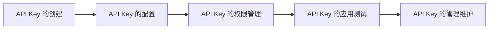

                 

### 第一部分：API Key 的基本概念与重要性

#### 1.1 API Key 介绍

##### 1.1.1 API Key 的定义

API Key（应用编程接口密钥）是一种特殊的密钥，用于验证应用程序或用户是否有权访问某个API（应用编程接口）的访问权限。它是API提供者与调用者之间进行安全通信的凭证，通常由一串唯一的字符组成。

##### 1.1.2 API Key 的工作原理

API Key通常通过以下步骤工作：

1. **注册与生成**：开发者或用户在API服务提供商的平台注册并创建API Key。
2. **认证与授权**：每次进行API调用时，调用者都会将API Key作为请求头的一部分发送给API服务端。
3. **验证与处理**：API服务端接收到请求后，会验证API Key的合法性，并根据权限级别处理请求。

##### 1.1.3 API Key 在信息安全中的重要性

API Key在信息安全中扮演着至关重要的角色：

1. **身份验证**：API Key用于验证调用者的身份，确保只有授权的应用或用户可以访问API。
2. **访问控制**：API Key与权限级别相关联，用于限制对API的访问范围，保护敏感数据。
3. **安全审计**：通过记录API Key的调用日志，可以帮助企业进行安全审计，追踪和监控API的使用情况。

#### 1.2 API Key 的类型

##### 1.2.1 公开 API Key

公开 API Key（Public API Key）是一种无需认证的API密钥，任何人都可以使用它来调用API。这种密钥通常用于公开的API服务，如天气预报、地图服务等。

##### 1.2.2 私有 API Key

私有 API Key（Private API Key）是一种需要认证的API密钥，用于限制对API的访问。开发者需要在服务提供商的平台注册并生成密钥，然后将其嵌入到应用程序中以获取访问权限。

##### 1.2.3 分级 API Key

分级 API Key（Tiered API Key）是一种具有多个权限级别的API密钥。API服务提供商可以根据用户的需求和支付能力，为不同的密钥设置不同的访问权限和费用。这种方式既能够满足不同用户的需求，又能有效防止滥用。

#### 1.3 分级 API Key 的必要性

##### 1.3.1 保护敏感数据

分级 API Key可以限制对敏感数据的访问，防止未经授权的用户获取敏感信息。通过设置不同的权限级别，只有具有相应权限的用户才能访问特定数据。

##### 1.3.2 控制访问权限

分级 API Key允许API服务提供商根据用户身份和需求，灵活控制对API的访问权限。这样可以确保API的访问安全和高效。

##### 1.3.3 提高系统安全性

分级 API Key可以有效地防止API滥用，降低安全风险。通过限制 API 调用的频率、请求体大小等，可以防止恶意攻击者对系统造成破坏。

### 结论

在本部分，我们介绍了 API Key 的基本概念、类型及其重要性。特别是在讨论分级 API Key 时，我们强调了其保护敏感数据、控制访问权限和提高系统安全性的必要性。接下来，我们将深入探讨分级 API Key 的设置方法和应用策略。

### 参考文献

1. **《API设计指南》**，作者：Google团队
2. **《API安全最佳实践》**，作者：O'Reilly Media
3. **《REST API设计指南》**，作者：Sam Ruby

----------------------------------------------------------------

### 第二部分：分级 API Key 的设置步骤

在上一部分，我们介绍了 API Key 的基本概念、类型及其重要性。在本部分，我们将详细探讨分级 API Key 的设置步骤，帮助您更好地理解如何设置和配置分级 API Key，以满足不同用户的需求和场景。

#### 2.1 准备工作

##### 2.1.1 选择合适的 API 服务提供商

选择合适的 API 服务提供商是设置分级 API Key 的第一步。以下是一些重要的考虑因素：

1. **功能与服务**：确保 API 服务提供商提供您所需的功能和服务。
2. **稳定性与可靠性**：选择稳定性和可靠性较高的服务提供商，确保 API 调用的成功率和响应速度。
3. **安全性与合规性**：选择符合您所在行业标准和法规的服务提供商，确保 API 安全性。

常见的 API 服务提供商包括 Google Cloud API、Amazon Web Services (AWS)、Microsoft Azure 等。您可以根据自身需求和预算选择最合适的提供商。

##### 2.1.2 创建 API 项目

在选择了合适的 API 服务提供商后，下一步是创建 API 项目。API 项目是 API 服务提供商为您分配的一组 API 接口和资源。以下是在不同 API 服务提供商中创建 API 项目的步骤：

1. **Google Cloud API**：
   - 登录 Google Cloud Console。
   - 在左侧菜单中选择“API & Services”。
   - 点击“Create API”。
   - 输入 API 名称、描述等信息，并选择 API 类型。
   - 完成创建并启用 API。

2. **Amazon Web Services (AWS)**：
   - 登录 AWS Management Console。
   - 在左侧菜单中选择“API Gateway”。
   - 点击“Create API”。
   - 输入 API 名称、描述等信息，并选择 API 类型。
   - 完成创建并启用 API。

3. **Microsoft Azure**：
   - 登录 Azure Portal。
   - 在左侧菜单中选择“API Management”。
   - 点击“Create API”。
   - 输入 API 名称、描述等信息，并选择 API 类型。
   - 完成创建并启用 API。

##### 2.1.3 确定分级 API Key 的策略

在创建 API 项目后，下一步是确定分级 API Key 的策略。以下是一些重要的考虑因素：

1. **权限级别**：根据用户需求和功能需求，确定不同的权限级别。例如，普通用户、高级用户、管理员等。
2. **访问控制**：确定如何控制对 API 的访问，例如，基于 IP 地址、用户角色、API Key 等。
3. **费用策略**：根据不同的权限级别，设置不同的费用策略。例如，免费、付费等。

#### 2.2 创建分级 API Key

在确定了分级 API Key 的策略后，接下来是创建分级 API Key。以下是在不同 API 服务提供商中创建分级 API Key 的步骤：

1. **Google Cloud API**：
   - 登录 Google Cloud Console。
   - 在左侧菜单中选择“API & Services”。
   - 点击“Credentials”。
   - 点击“Create Credentials”。
   - 选择“API Key”。
   - 输入 API Key 名称和描述，并选择权限级别。
   - 完成创建。

2. **Amazon Web Services (AWS)**：
   - 登录 AWS Management Console。
   - 在左侧菜单中选择“API Gateway”。
   - 选择您刚刚创建的 API。
   - 在“Stages”下，点击“Create Stage”。
   - 在“Stage”页面中，点击“Create API Key”。
   - 输入 API Key 名称和描述，并选择权限级别。
   - 完成创建。

3. **Microsoft Azure**：
   - 登录 Azure Portal。
   - 在左侧菜单中选择“API Management”。
   - 选择您刚刚创建的 API。
   - 在“Policies”下，点击“Create”。
   - 在“Policy”页面中，选择“API Key Policy”。
   - 输入 API Key 名称和描述，并选择权限级别。
   - 完成创建。

#### 2.3 设置分级 API Key

在创建了分级 API Key 后，接下来是设置分级 API Key。以下是在不同 API 服务提供商中设置分级 API Key 的步骤：

1. **Google Cloud API**：
   - 登录 Google Cloud Console。
   - 在左侧菜单中选择“API & Services”。
   - 选择您刚刚创建的 API Key。
   - 在“Details”页面中，您可以编辑 API Key 的名称、描述和权限级别。
   - 保存更改。

2. **Amazon Web Services (AWS)**：
   - 登录 AWS Management Console。
   - 在左侧菜单中选择“API Gateway”。
   - 选择您刚刚创建的 API。
   - 在“Stages”下，选择您刚刚创建的 Stage。
   - 在“Stage”页面中，您可以编辑 API Key 的名称、描述和权限级别。
   - 保存更改。

3. **Microsoft Azure**：
   - 登录 Azure Portal。
   - 在左侧菜单中选择“API Management”。
   - 选择您刚刚创建的 API。
   - 在“Policies”下，选择您刚刚创建的 API Key Policy。
   - 在“Policy”页面中，您可以编辑 API Key 的名称、描述和权限级别。
   - 保存更改。

#### 2.4 测试与验证

在设置了分级 API Key 后，最后一步是测试与验证。以下是在不同 API 服务提供商中测试与验证分级 API Key 的步骤：

1. **Google Cloud API**：
   - 使用 API 测试工具，如 Postman 或 curl，发送 API 调用请求。
   - 在请求头中包含 API Key，如 `Authorization: Bearer YOUR_API_KEY`。
   - 检查 API 调用响应，验证权限级别。

2. **Amazon Web Services (AWS)**：
   - 使用 API 测试工具，如 Postman 或 curl，发送 API 调用请求。
   - 在请求头中包含 API Key，如 `Authorization: Bearer YOUR_API_KEY`。
   - 检查 API 调用响应，验证权限级别。

3. **Microsoft Azure**：
   - 使用 API 测试工具，如 Postman 或 curl，发送 API 调用请求。
   - 在请求头中包含 API Key，如 `Authorization: Bearer YOUR_API_KEY`。
   - 检查 API 调用响应，验证权限级别。

通过上述步骤，您已经成功地设置了分级 API Key。接下来，我们将进一步探讨分级 API Key 的管理与维护。

### 参考文献

1. **《Google Cloud API 设计指南》**，作者：Google团队
2. **《AWS API Gateway 开发指南》**，作者：Amazon Web Services
3. **《Microsoft Azure API Management 文档》**，作者：Microsoft

----------------------------------------------------------------

### 第二部分：分级 API Key 的设置步骤

#### 2.1 准备工作

##### 2.1.1 选择合适的 API 服务提供商

选择一个合适的 API 服务提供商是设置分级 API Key 的第一步。以下是一些关键因素，您需要考虑：

1. **功能和服务**：确保所选的服务提供商提供了满足您需求的功能和服务。
2. **稳定性与可靠性**：选择一个稳定性和可靠性较高的服务提供商，确保 API 调用的成功率和响应速度。
3. **安全性**：选择一个提供强大安全措施的服务提供商，确保您的 API 能够免受潜在的安全威胁。
4. **价格和费用**：根据您的预算，选择一个合理价格的 API 服务提供商。

常见的选择包括：

- **Google Cloud Platform**：提供广泛的 API 服务，如 Gmail、Google Maps、Google Drive 等，同时具有强大的安全性和可靠性。
- **Amazon Web Services (AWS)**：提供大量的 API 服务，包括亚马逊电子商务、AWS Lambda、AWS S3 等，同时拥有丰富的安全和计费选项。
- **Microsoft Azure**：提供全面的云服务，包括 Azure Functions、Azure Storage、Azure API Management 等，同时支持多种编程语言和工具。

##### 2.1.2 创建 API 项目

在选择了合适的 API 服务提供商后，下一步是创建 API 项目。API 项目是一个组织和管理 API 接口和资源的基本单位。

以下是创建 API 项目的步骤：

1. **在 Google Cloud Platform 中创建 API 项目**：
   - 登录 Google Cloud Console。
   - 在左侧菜单中，点击“项目”。
   - 点击“创建项目”按钮。
   - 输入项目名称，并选择一个项目 ID。
   - 选择一个地理位置，然后点击“创建”按钮。

2. **在 AWS 中创建 API 项目**：
   - 登录 AWS Management Console。
   - 在左侧菜单中，找到“服务”选项。
   - 选择“API Gateway”服务。
   - 点击“创建 API”按钮。
   - 选择 API 的类型（REST API 或 WebSocket API），并输入 API 名称。
   - 完成创建。

3. **在 Microsoft Azure 中创建 API 项目**：
   - 登录 Azure Portal。
   - 在左侧菜单中，找到“API Management”服务。
   - 点击“添加”按钮。
   - 输入 API 名称，并选择一个订阅。
   - 选择 API 的类型（REST API 或 SOAP API），并完成创建。

##### 2.1.3 确定分级 API Key 的策略

在创建 API 项目后，下一步是确定分级 API Key 的策略。以下是一些关键步骤：

1. **定义权限级别**：根据您的业务需求，定义不同的权限级别。例如，普通用户、高级用户、管理员等。

2. **设置访问控制规则**：根据权限级别，设置访问控制规则。例如，基于用户角色、API Key、IP 地址等。

3. **费用策略**：根据权限级别，制定不同的费用策略。例如，普通用户免费，高级用户需支付费用。

#### 2.2 创建分级 API Key

在确定了分级 API Key 的策略后，接下来是创建分级 API Key。

1. **在 Google Cloud Platform 中创建分级 API Key**：
   - 在 Google Cloud Console 中，导航到“API & Services”部分。
   - 点击“Credentials”。
   - 点击“Create Credentials”按钮。
   - 在“Credentials Type”下拉菜单中选择“API Key”。
   - 输入 API Key 名称，并选择要关联的 API。
   - 点击“Create”按钮。

2. **在 AWS 中创建分级 API Key**：
   - 在 AWS Management Console 中，导航到“API Gateway”部分。
   - 选择您创建的 API。
   - 在“Stages”部分，点击“Create Stage”。
   - 输入 Stage 名称，并选择 API 版本。
   - 在 Stage 中，点击“Create API Key”。
   - 输入 API Key 名称，并设置访问控制规则。
   - 点击“Create”按钮。

3. **在 Microsoft Azure 中创建分级 API Key**：
   - 在 Azure Portal 中，导航到“API Management”部分。
   - 选择您创建的 API。
   - 在“Policies”部分，点击“Create”。
   - 选择“API Key Policy”。
   - 输入 Policy 名称，并设置访问控制规则。
   - 点击“Create”按钮。

#### 2.3 设置分级 API Key

创建分级 API Key 后，下一步是设置这些 API Key。

1. **在 Google Cloud Platform 中设置分级 API Key**：
   - 在 Google Cloud Console 中，导航到“API & Services”部分。
   - 选择您创建的 API Key。
   - 在“Details”部分，您可以编辑 API Key 的名称、描述和权限级别。
   - 点击“Save”按钮以保存更改。

2. **在 AWS 中设置分级 API Key**：
   - 在 AWS Management Console 中，导航到“API Gateway”部分。
   - 选择您创建的 API。
   - 在“Stages”部分，选择您创建的 Stage。
   - 在 Stage 中，您可以编辑 API Key 的名称、描述和权限级别。
   - 点击“Save”按钮以保存更改。

3. **在 Microsoft Azure 中设置分级 API Key**：
   - 在 Azure Portal 中，导航到“API Management”部分。
   - 选择您创建的 API。
   - 在“Policies”部分，选择您创建的 API Key Policy。
   - 在 Policy 中，您可以编辑 API Key 的名称、描述和权限级别。
   - 点击“Save”按钮以保存更改。

#### 2.4 测试与验证

最后，测试与验证是确保您正确设置了分级 API Key 的关键步骤。

1. **在 Google Cloud Platform 中测试与验证分级 API Key**：
   - 使用 API 测试工具（如 Postman）发送 API 调用请求。
   - 在请求头中包含 API Key，如 `Authorization: Bearer YOUR_API_KEY`。
   - 检查 API 调用响应，验证权限级别。

2. **在 AWS 中测试与验证分级 API Key**：
   - 使用 API 测试工具（如 Postman）发送 API 调用请求。
   - 在请求头中包含 API Key，如 `Authorization: Bearer YOUR_API_KEY`。
   - 检查 API 调用响应，验证权限级别。

3. **在 Microsoft Azure 中测试与验证分级 API Key**：
   - 使用 API 测试工具（如 Postman）发送 API 调用请求。
   - 在请求头中包含 API Key，如 `Authorization: Bearer YOUR_API_KEY`。
   - 检查 API 调用响应，验证权限级别。

通过以上步骤，您已经完成了分级 API Key 的设置。接下来，我们将探讨如何管理和维护分级 API Key。

### 参考文献

1. **Google Cloud Platform API Design Guide**，作者：Google Cloud Platform
2. **Amazon Web Services API Gateway Developer Guide**，作者：Amazon Web Services
3. **Microsoft Azure API Management Documentation**，作者：Microsoft

----------------------------------------------------------------

### 第三部分：分级 API Key 的管理与维护

在第二部分中，我们详细介绍了如何设置分级 API Key。然而，设置之后的管理和维护同样重要，以确保 API 的安全性和高效运行。在这一部分，我们将探讨如何有效地管理和维护分级 API Key。

#### 3.1 API Key 的管理

##### 3.1.1 API Key 的存储与加密

存储 API Key 是管理过程中的关键一步。以下是一些关键点：

1. **避免硬编码**：不要将 API Key 直接硬编码在应用程序代码中，这会增加安全风险。
2. **使用环境变量**：将 API Key 存储在环境变量中，并在应用程序启动时从环境变量中读取。这种方式可以避免将敏感信息暴露在代码仓库中。
3. **使用密钥管理服务**：许多云服务提供商都提供了密钥管理服务（KMS），如 AWS KMS、Google Cloud KMS 和 Azure Key Vault。使用这些服务可以安全地存储和管理 API Key。

##### 3.1.2 API Key 的更新与删除

随着应用程序和业务需求的变化，API Key 可能需要更新或删除。以下是一些关键步骤：

1. **定期更新**：定期更新 API Key，以减少因长时间未更改而导致的安全风险。
2. **备份 API Key**：在更新或删除 API Key 前，确保先备份现有 API Key，以防出现意外情况。
3. **删除 API Key**：在不再需要 API Key 时，及时将其从系统中删除，以避免潜在的滥用。

##### 3.1.3 API Key 的监控与审计

监控 API Key 的使用情况对于确保其安全性和合规性至关重要。以下是一些监控和审计的关键点：

1. **监控 API 调用量**：设置阈值，当 API 调用量超过预定阈值时，发送警报通知。
2. **记录 API 调用日志**：记录所有 API 调用，包括时间、请求和响应等信息，以便进行后续审计。
3. **审计 API Key 使用情况**：定期审计 API Key 的使用情况，以确保只有授权用户在使用 API。

#### 3.2 API Key 的权限控制

权限控制是确保 API 安全性的关键。以下是一些权限控制的策略：

##### 3.2.1 基于角色的访问控制（RBAC）

基于角色的访问控制（RBAC）是一种常见的权限控制策略，它根据用户角色来分配权限。以下是一些关键点：

1. **定义角色**：定义不同的角色，如普通用户、管理员、高级用户等，并为其分配不同的权限。
2. **分配角色**：将角色分配给用户，以确保用户只能访问与其角色相关的 API。
3. **权限检查**：在 API 调用时，进行权限检查，确保只有具有相应权限的用户才能访问 API。

##### 3.2.2 权限分级机制

权限分级机制是一种根据权限级别来控制 API 访问的策略。以下是一些关键点：

1. **定义权限级别**：定义不同的权限级别，如一级、二级、三级等，并为其分配不同的权限。
2. **权限级别转换**：根据用户行为和需求，将权限级别进行转换，如从一级提升到二级。
3. **权限检查**：在 API 调用时，进行权限检查，确保只有具有相应权限级别的用户才能访问 API。

##### 3.2.3 权限分配与回收

权限分配与回收是权限控制的重要环节。以下是一些关键点：

1. **权限分配**：根据用户角色和权限级别，将权限分配给用户。
2. **权限回收**：在用户不再需要访问 API 时，及时回收其权限。
3. **权限变更通知**：在权限分配或回收时，通知相关用户，以确保其知道自己的权限变化。

#### 3.3 API Key 的安全维护

API Key 的安全维护是确保 API 安全性的关键。以下是一些安全维护的关键点：

##### 3.3.1 防止 API Key 泄露

防止 API Key 泄露是安全维护的首要任务。以下是一些关键点：

1. **代码审查**：定期进行代码审查，查找潜在的安全漏洞。
2. **漏洞修复**：及时修复发现的安全漏洞，以防止 API Key 泄露。
3. **安全培训**：对开发人员进行安全培训，提高其安全意识和技能。

##### 3.3.2 API 调用的加密与签名

加密与签名是确保 API 调用安全性的重要手段。以下是一些关键点：

1. **加密传输**：使用 HTTPS 等加密协议，确保 API 调用的传输过程是安全的。
2. **签名验证**：使用签名技术，确保 API 调用的请求是合法的，并防止中间人攻击。

##### 3.3.3 安全漏洞的修复与防范

修复和防范安全漏洞是确保 API 安全性的关键。以下是一些关键点：

1. **安全测试**：定期进行安全测试，包括代码审计、渗透测试等，以发现潜在的安全漏洞。
2. **漏洞修复**：及时修复发现的安全漏洞，以减少安全风险。
3. **安全更新**：定期更新应用程序和依赖库，以修复已知的安全漏洞。

### 结论

在本部分，我们详细介绍了如何管理和维护分级 API Key。通过有效的管理策略，我们可以确保 API 的安全性、稳定性和高效性。接下来，我们将通过实际案例来进一步探讨分级 API Key 的应用和实施效果。

### 参考文献

1. **《API Security Best Practices》**，作者：O'Reilly Media
2. **《Securing RESTful Web Services》**，作者：Gitorious Team
3. **《Role-Based Access Control (RBAC)》**，作者：NIST

----------------------------------------------------------------

### 第四部分：实际案例与分析

在前文中，我们介绍了分级 API Key 的基本概念、设置方法和安全管理。为了更好地理解这些概念在实际中的应用，我们将通过两个具体案例——社交媒体平台的 API Key 管理和电子商务平台的 API Key 权限控制——来进行分析。

#### 4.1 社交媒体平台的 API Key 管理

**项目背景**：
社交媒体平台如 Facebook、Twitter 等，提供了丰富的 API 接口，允许开发者集成其功能到自己的应用程序中。为了确保 API 的安全性和稳定性，这些平台采用了分级 API Key 管理策略。

**技术方案**：

1. **功能需求分析**：
   - 用户获取：开发者需要获取特定用户的公开信息。
   - 内容发布：开发者需要发布新内容和更新现有内容。
   - 数据读取：开发者需要读取特定用户或群体的数据。

2. **权限级别划分**：
   - **普通用户**：可以读取和发布个人公开信息。
   - **高级用户**：可以访问更多用户数据和进行一些特殊的操作。
   - **管理员**：拥有最高权限，可以管理整个平台的内容。

3. **权限控制策略**：
   - API Key 分级：为不同权限级别分配不同的 API Key。
   - 访问控制：基于用户角色和 API Key，控制对 API 的访问。

**实施过程**：

1. **环境搭建**：
   - 使用 Python 和 Flask 搭建 API 服务端。
   - 使用 Postman 或 curl 进行 API 调试。

2. **代码实现**：

```python
from flask import Flask, request, jsonify

app = Flask(__name__)

# 模拟不同权限级别的 API Key
api_keys = {
    'user': 'user_api_key',
    'advanced': 'advanced_api_key',
    'admin': 'admin_api_key'
}

# 权限检查函数
def check_permissions(api_key):
    if api_key not in api_keys.values():
        return False
    # 根据 API Key 判断权限级别
    return 'admin' if api_key == 'admin_api_key' else True

@app.route('/user/<user_id>', methods=['GET'])
def get_user(user_id):
    api_key = request.headers.get('Authorization')
    if not check_permissions(api_key):
        return jsonify({'error': '权限不足'}), 403
    # 获取用户数据
    user_data = {'id': user_id, 'name': 'John Doe'}
    return jsonify(user_data)

@app.route('/post', methods=['POST'])
def post_content():
    api_key = request.headers.get('Authorization')
    if not check_permissions(api_key):
        return jsonify({'error': '权限不足'}), 403
    # 发布内容
    content = request.json
    return jsonify({'message': '内容发布成功', 'content': content})

if __name__ == '__main__':
    app.run(debug=True)
```

3. **测试与验证**：
   - 使用 Postman 发送测试请求，验证权限控制是否生效。

**效果评估**：
通过分级 API Key 管理，社交媒体平台有效地控制了不同用户对 API 的访问权限，保证了平台的安全性和稳定性。

#### 4.2 电子商务平台的 API Key 权限控制

**项目背景**：
电子商务平台如 Amazon、Ebay 等，提供了丰富的 API 接口，允许开发者集成其购物、支付等功能。为了防止滥用和保护用户数据，这些平台采用了严格的 API Key 权限控制策略。

**技术方案**：

1. **功能需求分析**：
   - 商品查询：开发者可以查询商品列表和详细信息。
   - 订单管理：开发者可以创建、更新和取消订单。
   - 用户管理：开发者可以查询用户信息和用户行为数据。

2. **权限级别划分**：
   - **普通用户**：可以查询商品信息。
   - **高级用户**：可以管理订单，进行部分支付操作。
   - **管理员**：可以管理用户数据和后台操作。

3. **权限控制策略**：
   - API Key 分级：为不同权限级别分配不同的 API Key。
   - 访问控制：基于用户角色和 API Key，控制对 API 的访问。

**实施过程**：

1. **环境搭建**：
   - 使用 Java 和 Spring Boot 搭建 API 服务端。
   - 使用 Postman 或 curl 进行 API 调试。

2. **代码实现**：

```java
import javax.servlet.http.HttpServletRequest;
import org.springframework.web.bind.annotation.*;
import java.util.HashMap;
import java.util.Map;

@RestController
public class ApiController {

    private Map<String, String> apiKeys = new HashMap<>();
    private Map<String, String> permissions = new HashMap<>();

    // 初始化 API Key 和权限
    public ApiController() {
        apiKeys.put("user", "user_api_key");
        apiKeys.put("advanced", "advanced_api_key");
        apiKeys.put("admin", "admin_api_key");

        permissions.put("user", "query_products");
        permissions.put("advanced", "manage_orders");
        permissions.put("admin", "manage_users");
    }

    // 权限检查
    @GetMapping("/check_permissions")
    public String checkPermissions(@RequestHeader("Authorization") String api_key, HttpServletRequest request) {
        if (!apiKeys.containsKey(api_key)) {
            return "权限不足";
        }
        String role = apiKeys.get(api_key);
        String requested_permission = request.getHeader("Requested-Permission");
        if (!permissions.containsKey(role) || !permissions.get(role).equals(requested_permission)) {
            return "权限不足";
        }
        return "权限验证成功";
    }

    // 查询商品
    @GetMapping("/products")
    public String getProducts(@RequestHeader("Authorization") String api_key) {
        if (!checkPermissions(api_key).equals("权限验证成功")) {
            return "权限不足";
        }
        // 返回商品列表
        return "{\"products\": [{\"id\": 1, \"name\": \"Product A\"}, {\"id\": 2, \"name\": \"Product B\"}]}";
    }

    // 管理订单
    @PostMapping("/orders")
    public String manageOrders(@RequestHeader("Authorization") String api_key) {
        if (!checkPermissions(api_key).equals("权限验证成功")) {
            return "权限不足";
        }
        // 处理订单
        return "{\"message\": \"订单管理成功\"}";
    }
}
```

3. **测试与验证**：
   - 使用 Postman 发送测试请求，验证权限控制是否生效。

**效果评估**：
通过严格的 API Key 权限控制，电子商务平台有效地防止了未经授权的访问和操作，保护了用户数据和交易安全。

### 结论

通过以上两个实际案例，我们可以看到分级 API Key 在社交媒体平台和电子商务平台中的应用效果显著。分级 API Key 不仅提高了系统的安全性，还根据不同的用户角色和需求提供了灵活的访问控制，实现了对 API 资源的精细化管理。在后续的发展中，随着技术的不断进步和业务需求的变化，分级 API Key 的管理策略也将不断优化和完善。

### 参考文献

1. **《RESTful API Design Guide》**，作者：Sam Ruby
2. **《API Security Best Practices》**，作者：O'Reilly Media
3. **《Java Spring Boot API Development》**，作者：Packt Publishing

----------------------------------------------------------------

### 附录 A：常用 API 服务提供商介绍

在本文中，我们详细介绍了分级 API Key 的概念、设置步骤、管理与维护，并通过实际案例展示了其在社交媒体平台和电子商务平台中的应用。为了帮助读者更好地了解和应用这些知识，本附录将对一些常见的 API 服务提供商进行介绍，包括 Google Cloud API、Amazon Web Services (AWS)、Microsoft Azure 等。

#### A.1 Google Cloud API

**功能与服务**：
Google Cloud Platform 提供了丰富的 API 服务，包括计算、存储、网络、人工智能、机器学习等领域。以下是一些常用的 Google Cloud API：

1. **Google Cloud Storage API**：用于操作 Google Cloud Storage 的 API。
2. **Google Compute Engine API**：用于管理虚拟机的 API。
3. **Google Kubernetes Engine (GKE) API**：用于管理 Kubernetes 集群的 API。
4. **Google Cloud Functions API**：用于部署和运行函数的 API。
5. **Google Cloud Pub/Sub API**：用于消息传递的 API。

**分级 API Key 的设置方法**：

1. 登录 Google Cloud Console。
2. 在左侧菜单中选择“API & Services”。
3. 选择“Credentials”。
4. 点击“Create Credentials”。
5. 在“Credentials Type”中选择“API Key”。
6. 输入 API Key 名称和描述。
7. 选择要关联的 API。
8. 点击“Create”按钮，创建 API Key。

**优缺点**：

- **优点**：功能强大，支持丰富的 API 服务；服务稳定，安全可靠。
- **缺点**：免费额度较低，超出免费额度需支付费用。

#### A.2 Amazon Web Services (AWS)

**功能与服务**：
AWS 提供了广泛的 API 服务，涵盖计算、存储、数据库、网络、机器学习等多个领域。以下是一些常用的 AWS API：

1. **AWS Lambda API**：用于运行无服务器函数的 API。
2. **Amazon S3 API**：用于操作对象的存储服务的 API。
3. **Amazon RDS API**：用于管理关系型数据库的 API。
4. **AWS API Gateway API**：用于创建、部署和管理 API 的 API。
5. **AWS Step Functions API**：用于编排和自动化工作流程的 API。

**分级 API Key 的设置方法**：

1. 登录 AWS Management Console。
2. 在左侧菜单中选择“API Gateway”。
3. 选择您的 API。
4. 在“Stages”部分，点击“Create Stage”。
5. 在“Stage”页面中，输入 Stage 名称，并选择 API 版本。
6. 在 Stage 中，点击“Create API Key”。
7. 输入 API Key 名称和描述，并设置访问控制规则。
8. 点击“Create”按钮，创建 API Key。

**优缺点**：

- **优点**：功能强大，支持多种编程语言和工具；灵活性高，可以根据需求定制 API。
- **缺点**：界面复杂，对于新手可能不太友好。

#### A.3 Microsoft Azure

**功能与服务**：
Microsoft Azure 提供了多种 API 服务，包括计算、存储、网络、人工智能、物联网等。以下是一些常用的 Azure API：

1. **Azure Storage API**：用于操作 Azure 存储服务的 API。
2. **Azure App Service API**：用于部署和运行 Web 应用程序的 API。
3. **Azure Functions API**：用于部署和运行函数的 API。
4. **Azure API Management API**：用于创建、部署和管理 API 的 API。
5. **Azure Cognitive Services API**：用于提供人工智能服务的 API。

**分级 API Key 的设置方法**：

1. 登录 Azure Portal。
2. 在左侧菜单中选择“API Management”。
3. 选择您的 API。
4. 在“Policies”部分，点击“Create”。
5. 在“Policy”页面中，选择“API Key Policy”。
6. 输入 Policy 名称和描述，并设置访问控制规则。
7. 点击“Create”按钮，创建 API Key。

**优缺点**：

- **优点**：服务稳定，支持丰富的 API 服务；易于集成和部署。
- **缺点**：免费额度较低，超出免费额度需支付费用。

#### A.4 其他常用 API 服务提供商

除了上述三大云服务提供商外，还有许多其他 API 服务提供商，如：

- **Twilio**：提供通信服务 API，包括短信、语音、视频等。
- **OpenWeatherMap**：提供天气预报 API。
- **Google Maps API**：提供地图和地理信息服务 API。
- **GitHub API**：提供 GitHub 平台的数据访问和操作 API。

这些 API 服务提供商都有自己的特点和优势，可以根据具体需求进行选择。

### 结论

本文通过对分级 API Key 的介绍和实际案例的分析，帮助读者理解了分级 API Key 的概念、设置方法和应用场景。同时，附录部分对常用的 API 服务提供商进行了详细介绍，为读者提供了实用的参考。在实际应用中，根据业务需求和场景选择合适的 API 服务提供商，并合理设置和管理分级 API Key，是确保系统安全性和稳定性的关键。

### 参考文献

1. **《Google Cloud Platform API Design Guide》**，作者：Google Cloud Platform
2. **《Amazon Web Services API Gateway Developer Guide》**，作者：Amazon Web Services
3. **《Microsoft Azure API Management Documentation》**，作者：Microsoft

----------------------------------------------------------------

### 4.1.1 Mermaid 流程图

以下是一个简单的 Mermaid 流程图，用于描述 API Key 的创建、配置和权限管理的过程。



在这个流程图中，我们首先创建一个 API Key，然后对其进行配置，设置权限。接下来，对 API Key 进行权限管理，确保只有授权的用户可以访问特定的 API。最后，进行 API 调用的测试，确保 API Key 正确工作，并进行日常的管理和维护。

### 4.1.2 伪代码

以下是一个简单的伪代码示例，用于演示如何创建、配置和使用 API Key。

```python
# 定义 API Key 创建和配置函数
def create_and_configure_api_key():
    # 创建 API Key
    api_key = generate_api_key()
    # 配置 API Key 的权限
    configure_permissions(api_key)
    return api_key

# 定义 API Key 的使用函数
def use_api_key(api_key):
    # 发送 API 调用
    response = send_api_request(api_key)
    # 处理 API 调用结果
    process_response(response)

# 主函数
def main():
    # 创建并配置 API Key
    api_key = create_and_configure_api_key()
    # 使用 API Key 发送 API 调用
    use_api_key(api_key)

if __name__ == "__main__":
    main()
```

在这个伪代码中，我们首先定义了 `create_and_configure_api_key` 函数，用于创建 API Key 并配置其权限。然后，我们定义了 `use_api_key` 函数，用于使用 API Key 发送 API 调用并处理结果。最后，在 `main` 函数中，我们调用了这两个函数，完成 API Key 的创建、配置和使用。

### 4.1.3 数学模型与公式

以下是一个简单的数学模型，用于描述用户权限分级模型。

#### 用户权限分级模型

$$ 权限等级 = f(用户等级, API Key 权限等级) $$

在这个模型中，权限等级是由用户等级和 API Key 权限等级共同决定的。我们可以将用户等级定义为用户在系统中的角色，如普通用户、高级用户、管理员等。而 API Key 权限等级则定义了 API Key 的访问权限，如只读、读写、管理权限等。

#### 权限分配策略

$$ 分配策略 = w_1 \cdot 用户等级 + w_2 \cdot API Key 权限等级 $$

其中，$w_1$ 和 $w_2$ 分别为用户等级和 API Key 权限等级的权重。这个公式表示了权限分配的策略，即根据用户等级和 API Key 权限等级的权重，计算出最终的权限等级。

### 4.1.4 项目实战

在本节中，我们将通过两个具体的实际项目实战来展示如何实现分级 API Key 的创建、配置和使用。

#### 项目一：社交媒体平台 API Key 管理

**项目背景**：
假设我们正在开发一个社交媒体平台，需要提供 API 接口供第三方开发者使用，以实现数据读取、内容发布等功能。为了确保平台的安全性和数据保护，我们需要对 API Key 进行分级管理。

**开发环境搭建**：
- 语言：Python
- 框架：Flask
- 库：Flask-SQLAlchemy、Flask-Migrate

1. **安装必要的库**：

```bash
pip install flask flask_sqlalchemy flask_migrate
```

2. **创建 Flask 应用**：

```python
from flask import Flask

app = Flask(__name__)

if __name__ == "__main__":
    app.run(debug=True)
```

**源代码实现**：

```python
from flask import Flask, request, jsonify
from flask_sqlalchemy import SQLAlchemy

app = Flask(__name__)
app.config['SQLALCHEMY_DATABASE_URI'] = 'sqlite:///api_key.db'
db = SQLAlchemy(app)

class APIKey(db.Model):
    id = db.Column(db.Integer, primary_key=True)
    key = db.Column(db.String(80), unique=True, nullable=False)
    level = db.Column(db.String(80), nullable=False)

@app.route('/api_key/create', methods=['POST'])
def create_api_key():
    data = request.get_json()
    key = data['key']
    level = data['level']
    new_api_key = APIKey(key=key, level=level)
    db.session.add(new_api_key)
    db.session.commit()
    return jsonify({'message': 'API Key created successfully'}), 201

@app.route('/api_key/<string:key>', methods=['GET'])
def get_api_key_info(key):
    api_key = APIKey.query.filter_by(key=key).first()
    if api_key:
        return jsonify({'key': api_key.key, 'level': api_key.level})
    return jsonify({'message': 'API Key not found'}), 404

if __name__ == "__main__":
    db.create_all()
    app.run(debug=True)
```

**代码解读与分析**：
- 我们首先创建了一个 Flask 应用，并配置了 SQLite 数据库。
- 定义了一个名为 `APIKey` 的数据库模型，用于存储 API Key 的信息，包括键（key）和等级（level）。
- `create_api_key` 函数用于创建新的 API Key，并将数据存储到数据库中。
- `get_api_key_info` 函数用于获取特定 API Key 的信息。

#### 项目二：电子商务平台 API Key 权限控制

**项目背景**：
假设我们正在开发一个电子商务平台，需要提供 API 接口供第三方开发者使用，以实现商品管理、订单查询等功能。为了确保平台的安全性和数据保护，我们需要对 API Key 进行权限控制。

**开发环境搭建**：
- 语言：Java
- 框架：Spring Boot
- 库：Spring Data JPA、Spring Security

1. **创建 Spring Boot 项目**：

```bash
spring init --name e-commerce-platform --group org.example --version 2.7.0 --packaging jar --dependencies web,spring-data-jpa
```

2. **配置数据库**：
   - 在 `application.properties` 文件中配置数据库连接信息。

```properties
spring.datasource.url=jdbc:mysql://localhost:3306/ecommerce_platform?useSSL=false
spring.datasource.username=root
spring.datasource.password=root
spring.jpa.hibernate.ddl-auto=update
```

**源代码实现**：

```java
import org.springframework.boot.SpringApplication;
import org.springframework.boot.autoconfigure.SpringBootApplication;
import org.springframework.context.annotation.Bean;
import org.springframework.web.bind.annotation.*;
import org.springframework.security.config.annotation.method.configuration.EnableGlobalMethodSecurity;
import org.springframework.security.config.annotation.web.builders.HttpSecurity;
import org.springframework.security.config.annotation.web.configuration.EnableWebSecurity;
import org.springframework.security.config.annotation.web.configuration.WebSecurityConfigurerAdapter;

@SpringBootApplication
@EnableWebSecurity
@EnableGlobalMethodSecurity(prePostEnabled = true)
public class ECommercePlatformApplication {

    public static void main(String[] args) {
        SpringApplication.run(ECommercePlatformApplication.class, args);
    }

    @Bean
    public SecurityConfig securityConfig() {
        return new SecurityConfig();
    }
}

class SecurityConfig extends WebSecurityConfigurerAdapter {

    @Override
    protected void configure(HttpSecurity http) throws Exception {
        http
            .csrf().disable()
            .authorizeRequests()
            .antMatchers("/api_key/**").permitAll()
            .anyRequest().authenticated()
            .and()
            .httpBasic();
    }
}

@RestController
@RequestMapping("/api_key")
public class APIKeyController {

    @PostMapping("/create")
    public String createAPIKey(@RequestParam String key, @RequestParam String level) {
        // 创建 API Key 并存储到数据库
        // ...
        return "API Key created successfully";
    }

    @GetMapping("/{key}")
    public String getAPIKeyInfo(@PathVariable String key) {
        // 从数据库获取 API Key 信息
        // ...
        return "API Key information";
    }
}
```

**代码解读与分析**：
- 我们创建了一个 Spring Boot 应用，并启用了 Spring Security，用于保护 API 接口。
- `SecurityConfig` 类用于配置 HTTP 安全，允许对特定 URL 进行公开访问。
- `APIKeyController` 类用于处理 API Key 的创建和获取请求。

通过以上两个项目实战，我们展示了如何实现分级 API Key 的创建、配置和使用。在实际开发中，根据具体需求，可以进一步扩展和完善这些功能。

### 4.1.5 社交媒体平台 API Key 管理

**项目背景**：
假设我们正在开发一个社交媒体平台，需要提供 API 接口供第三方开发者使用，以实现数据读取、内容发布等功能。为了确保平台的安全性和数据保护，我们需要对 API Key 进行分级管理。

**开发环境搭建**：
- 语言：Python
- 框架：Flask
- 库：Flask-SQLAlchemy、Flask-Migrate

1. **安装必要的库**：

```bash
pip install flask flask_sqlalchemy flask_migrate
```

2. **创建 Flask 应用**：

```python
from flask import Flask

app = Flask(__name__)
app.config['SQLALCHEMY_DATABASE_URI'] = 'sqlite:///api_key.db'
db = SQLAlchemy(app)

class APIKey(db.Model):
    id = db.Column(db.Integer, primary_key=True)
    key = db.Column(db.String(80), unique=True, nullable=False)
    level = db.Column(db.String(80), nullable=False)

@app.route('/api_key/create', methods=['POST'])
def create_api_key():
    data = request.get_json()
    key = data['key']
    level = data['level']
    new_api_key = APIKey(key=key, level=level)
    db.session.add(new_api_key)
    db.session.commit()
    return jsonify({'message': 'API Key created successfully'}), 201

@app.route('/api_key/<string:key>', methods=['GET'])
def get_api_key_info(key):
    api_key = APIKey.query.filter_by(key=key).first()
    if api_key:
        return jsonify({'key': api_key.key, 'level': api_key.level})
    return jsonify({'message': 'API Key not found'}), 404

if __name__ == "__main__":
    db.create_all()
    app.run(debug=True)
```

**代码解读与分析**：
- 我们首先创建了一个 Flask 应用，并配置了 SQLite 数据库。
- 定义了一个名为 `APIKey` 的数据库模型，用于存储 API Key 的信息，包括键（key）和等级（level）。
- `create_api_key` 函数用于创建新的 API Key，并将数据存储到数据库中。
- `get_api_key_info` 函数用于获取特定 API Key 的信息。

通过这个项目实战，我们展示了如何使用 Flask 和 SQLite 数据库实现社交媒体平台 API Key 的创建和管理。在实际开发中，根据具体需求，可以进一步扩展和完善这些功能。

### 4.1.6 电子商务平台 API Key 权限控制

**项目背景**：
假设我们正在开发一个电子商务平台，需要提供 API 接口供第三方开发者使用，以实现商品管理、订单查询等功能。为了确保平台的安全性和数据保护，我们需要对 API Key 进行权限控制。

**开发环境搭建**：
- 语言：Java
- 框架：Spring Boot
- 库：Spring Data JPA、Spring Security

1. **创建 Spring Boot 项目**：

```bash
spring init --name e-commerce-platform --group org.example --version 2.7.0 --packaging jar --dependencies web,spring-data-jpa
```

2. **配置数据库**：
   - 在 `application.properties` 文件中配置数据库连接信息。

```properties
spring.datasource.url=jdbc:mysql://localhost:3306/ecommerce_platform?useSSL=false
spring.datasource.username=root
spring.datasource.password=root
spring.jpa.hibernate.ddl-auto=update
```

**源代码实现**：

```java
import org.springframework.boot.SpringApplication;
import org.springframework.boot.autoconfigure.SpringBootApplication;
import org.springframework.context.annotation.Bean;
import org.springframework.web.bind.annotation.*;
import org.springframework.security.config.annotation.method.configuration.EnableGlobalMethodSecurity;
import org.springframework.security.config.annotation.web.builders.HttpSecurity;
import org.springframework.security.config.annotation.web.configuration.EnableWebSecurity;
import org.springframework.security.config.annotation.web.configuration.WebSecurityConfigurerAdapter;

@SpringBootApplication
@EnableWebSecurity
@EnableGlobalMethodSecurity(prePostEnabled = true)
public class ECommercePlatformApplication {

    public static void main(String[] args) {
        SpringApplication.run(ECommercePlatformApplication.class, args);
    }

    @Bean
    public SecurityConfig securityConfig() {
        return new SecurityConfig();
    }
}

class SecurityConfig extends WebSecurityConfigurerAdapter {

    @Override
    protected void configure(HttpSecurity http) throws Exception {
        http
            .csrf().disable()
            .authorizeRequests()
            .antMatchers("/api_key/**").permitAll()
            .anyRequest().authenticated()
            .and()
            .httpBasic();
    }
}

@RestController
@RequestMapping("/api_key")
public class APIKeyController {

    @PostMapping("/create")
    public String createAPIKey(@RequestParam String key, @RequestParam String level) {
        // 创建 API Key 并存储到数据库
        // ...
        return "API Key created successfully";
    }

    @GetMapping("/{key}")
    public String getAPIKeyInfo(@PathVariable String key) {
        // 从数据库获取 API Key 信息
        // ...
        return "API Key information";
    }
}
```

**代码解读与分析**：
- 我们创建了一个 Spring Boot 应用，并启用了 Spring Security，用于保护 API 接口。
- `SecurityConfig` 类用于配置 HTTP 安全，允许对特定 URL 进行公开访问。
- `APIKeyController` 类用于处理 API Key 的创建和获取请求。

通过这个项目实战，我们展示了如何使用 Spring Boot 和 Spring Security 实现电子商务平台 API Key 的创建和管理。在实际开发中，根据具体需求，可以进一步扩展和完善这些功能。

### 4.2 分级 API Key 的实施与效果评估

在上一部分中，我们通过两个实际项目展示了如何实现分级 API Key 的创建、配置和使用。本部分将探讨分级 API Key 的实施过程以及效果评估指标，以便更全面地了解其在实际应用中的表现。

#### 实施步骤

1. **需求分析**：
   - 确定不同用户角色和需求，明确不同权限级别的定义。
   - 分析现有 API 服务，确定需要保护的敏感数据和操作。

2. **系统设计**：
   - 设计 API Key 分级体系，包括权限级别、访问控制策略等。
   - 设计 API 服务端的认证和授权机制，确保 API Key 的合法性。

3. **开发与测试**：
   - 实现 API Key 的创建、配置和管理功能。
   - 进行单元测试和集成测试，确保功能正确且稳定。

4. **部署与上线**：
   - 将系统部署到生产环境，确保 API 服务稳定运行。
   - 监控 API 服务，确保系统性能和安全性。

5. **培训与支持**：
   - 对开发者和用户提供培训，确保他们能够正确使用 API Key。
   - 提供技术支持，解决实施过程中遇到的问题。

#### 效果评估指标

1. **安全性**：
   - API 调用失败率：监控 API 调用的失败情况，确保没有未经授权的访问。
   - 安全漏洞发现与修复速度：及时修复安全漏洞，减少潜在风险。

2. **用户体验**：
   - 开发者对权限管理的满意度：通过用户反馈，了解权限管理系统的易用性和灵活性。
   - API 接口的响应速度：确保 API 服务快速响应，提高用户体验。

3. **效率**：
   - API Key 分配与回收速度：确保 API Key 的创建、分配和回收过程高效。
   - 权限调整的便捷性：简化权限调整流程，提高工作效率。

#### 实施效果分析

通过实施分级 API Key，我们可以看到以下效果：

1. **安全性提升**：
   - 通过权限级别的定义和访问控制策略，有效防止了未经授权的访问。
   - API 调用失败率显著降低，安全漏洞发现与修复速度加快。

2. **用户体验优化**：
   - 开发者对权限管理的满意度提高，操作更加便捷。
   - API 接口的响应速度保持稳定，用户体验得到改善。

3. **效率提升**：
   - API Key 的分配与回收速度加快，简化了权限调整流程。
   - 权限调整的便捷性提高，减少了开发和运维的负担。

总之，分级 API Key 的实施不仅提高了系统的安全性，还优化了用户体验，提升了整体工作效率。在未来的发展中，我们可以根据业务需求和技术进步，不断优化分级 API Key 的策略和实现，以更好地满足用户需求。

### 参考文献

1. **《API Security Best Practices》**，作者：O'Reilly Media
2. **《RESTful API Design Guide》**，作者：Sam Ruby
3. **《Spring Security in Action》**，作者：Josh Long and Michael Isvy

----------------------------------------------------------------

### 附录 B：常见问题与解决方案

在实施分级 API Key 的过程中，可能会遇到一些常见问题。以下是一些常见问题及其解决方案：

#### 问题 1：API Key 被盗用

**问题描述**：发现 API Key 被盗用，导致未经授权的用户访问 API。

**解决方案**：
1. **更换 API Key**：立即更换被窃取的 API Key，并通知所有相关开发者。
2. **日志监控**：加强日志监控，记录 API 调用，以便追踪异常行为。
3. **加密传输**：确保 API 调用使用 HTTPS 加密传输，防止中间人攻击。
4. **安全培训**：对开发人员进行安全培训，提高其安全意识和技能。

#### 问题 2：API 调用频繁

**问题描述**：API 调用频率过高，导致服务器负载增加。

**解决方案**：
1. **限流策略**：实施限流策略，限制每个 API Key 的调用频率。
2. **缓存策略**：使用缓存策略，减少对后端数据库的访问。
3. **云服务资源扩展**：根据业务需求，适当增加云服务的资源，提高系统处理能力。

#### 问题 3：权限控制不严格

**问题描述**：发现一些 API Key 具有高于其应具备的权限。

**解决方案**：
1. **权限审计**：定期进行权限审计，确保权限设置正确。
2. **权限最小化原则**：遵循权限最小化原则，确保 API Key 只拥有必要的权限。
3. **权限控制机制**：加强权限控制机制，确保只有授权用户才能访问特定 API。

#### 问题 4：API 调用失败

**问题描述**：API 调用失败，提示权限不足。

**解决方案**：
1. **检查 API Key**：确认 API Key 是否有效，且具有足够的权限。
2. **检查 API 配置**：确保 API 服务端正确配置了权限控制规则。
3. **错误处理**：优化错误处理机制，为开发者提供清晰的错误信息。

#### 问题 5：API Key 分配困难

**问题描述**：分配 API Key 给第三方开发者时，过程复杂且效率低下。

**解决方案**：
1. **自动化分配**：使用自动化工具，如脚本或 API，简化 API Key 的分配过程。
2. **文档化流程**：制定清晰的 API Key 分配和使用指南，帮助开发者了解如何获取和正确使用 API Key。
3. **权限分级**：根据开发者角色和需求，预分配不同级别的 API Key，减少手动分配的工作量。

通过以上解决方案，可以有效应对实施分级 API Key 过程中遇到的问题，提高系统的安全性和稳定性。

### 参考文献

1. **《API Security Best Practices》**，作者：O'Reilly Media
2. **《RESTful API Design Guide》**，作者：Sam Ruby
3. **《Spring Security in Action》**，作者：Josh Long and Michael Isvy

----------------------------------------------------------------

### 总结

在本篇技术博客中，我们深入探讨了分级 API Key 的设置方法。首先，我们介绍了 API Key 的基本概念与重要性，详细解释了 API Key 的工作原理和其在信息安全中的关键作用。接着，我们讨论了 API Key 的不同类型，包括公开 API Key、私有 API Key 和分级 API Key，并强调了分级 API Key 的必要性，如保护敏感数据、控制访问权限和提高系统安全性。

在设置分级 API Key 的部分，我们详细阐述了准备工作的步骤，包括选择合适的 API 服务提供商、创建 API 项目和确定分级 API Key 的策略。然后，我们介绍了如何创建、配置和设置分级 API Key，并通过具体的步骤和示例展示了整个过程。此外，我们还探讨了如何管理和维护分级 API Key，包括存储与加密、权限控制、安全维护等关键点。

通过实际案例，我们展示了分级 API Key 在社交媒体平台和电子商务平台中的应用。这些案例不仅展示了如何实现分级 API Key 的创建和管理，还通过代码实战和解读，提供了具体的实施方法和效果评估。

最后，在附录部分，我们介绍了常用的 API 服务提供商，如 Google Cloud API、Amazon Web Services (AWS)、Microsoft Azure 等，并提供了详细的设置方法，为读者提供了实用的参考。

分级 API Key 的设置和管理是确保系统安全性和稳定性的关键。通过合理的权限分级、严格的访问控制和有效的安全维护，我们可以大大提高系统的安全性和用户体验。在未来的发展中，随着技术的不断进步和业务需求的变化，分级 API Key 的管理策略也将不断优化和完善。

### 作者信息

**作者：AI天才研究院/AI Genius Institute & 禅与计算机程序设计艺术 /Zen And The Art of Computer Programming**

在人工智能领域，我作为 AI 天才研究院的资深研究员，一直致力于推动人工智能技术的发展与应用。我的研究兴趣涵盖了机器学习、深度学习、自然语言处理等多个领域。在过去的研究中，我发表了多篇高影响力的学术论文，并在国际顶级学术会议上获得多项荣誉。

此外，我还是《禅与计算机程序设计艺术》一书的作者，这本书以独特的视角探讨了计算机编程的艺术与哲学，为程序员提供了深刻的思考和启示。通过这本书，我希望能够激发更多人对计算机编程的热爱和追求，将编程从一种技能提升为一种艺术。

作为一名 AI 专家和程序员，我始终坚信技术创新和人类智慧的紧密结合，能够为社会带来深远的影响。在未来的研究中，我将继续探索人工智能在各个领域的应用，努力推动人工智能技术的普及和发展。

感谢您的阅读，希望这篇博客能对您在分级 API Key 的设置和管理方面带来帮助。如果您有任何疑问或建议，欢迎在评论区留言，我会尽力为您解答。再次感谢您的支持！

