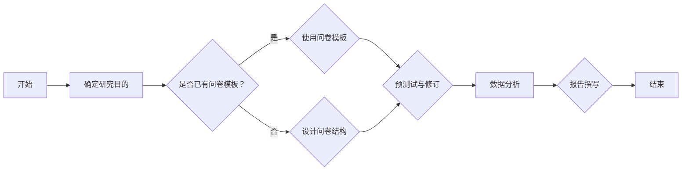

                 

# 《创业公司的客户洞察技术与需求挖掘方法》

> **关键词：** 客户洞察、需求挖掘、创业公司、数据分析、定量研究、定性研究、产品开发、市场营销、客户关系管理

> **摘要：** 本文旨在深入探讨创业公司如何运用客户洞察技术进行需求挖掘。通过系统化的理论介绍、方法讲解和实践案例分析，文章将帮助创业公司了解客户洞察的重要性，掌握需求挖掘的多种方法，以及如何将客户洞察应用于产品开发、市场营销和客户关系管理中。

## 目录大纲

#### 第一部分：客户洞察基础理论

**第1章：客户洞察概述**

- 1.1 客户洞察的定义与意义  
- 1.2 客户洞察的发展历程  
- 1.3 客户洞察的关键要素

**第2章：市场分析与需求识别**

- 2.1 市场分析的基本方法  
- 2.2 需求识别的重要性  
- 2.3 需求识别的方法与技巧

**第3章：数据驱动洞察**

- 3.1 数据驱动的客户洞察  
- 3.2 数据来源与数据类型  
- 3.3 数据分析与可视化工具

#### 第二部分：需求挖掘方法

**第4章：定量研究方法**

- 4.1 调查问卷设计  
- 4.2 描述性统计分析  
- 4.3 假设检验方法

**第5章：定性研究方法**

- 5.1 深度访谈  
- 5.2 焦点小组  
- 5.3 案例研究

**第6章：需求分析与建模**

- 6.1 需求分析框架  
- 6.2 需求建模方法  
- 6.3 需求优先级排序

**第7章：需求验证与反馈**

- 7.1 需求验证方法  
- 7.2 需求反馈机制  
- 7.3 需求迭代与优化

#### 第三部分：客户洞察应用实践

**第8章：客户洞察在产品开发中的应用**

- 8.1 客户洞察在产品设计中的角色  
- 8.2 客户需求的转化与应用  
- 8.3 产品迭代中的客户洞察实践

**第9章：客户洞察在市场营销中的应用**

- 9.1 市场定位与目标客户分析  
- 9.2 市场细分与目标市场选择  
- 9.3 市场营销策略优化

**第10章：客户洞察在客户关系管理中的应用**

- 10.1 客户生命周期管理  
- 10.2 客户满意度调查与分析  
- 10.3 客户忠诚度提升策略

#### 附录

**附录A：客户洞察工具与资源**

- A.1 常用市场分析工具  
- A.2 数据分析工具推荐  
- A.3 需求挖掘相关书籍与文献

#### Mermaid 流流程图与伪代码示例

**第4章：定量研究方法 - 调查问卷设计流程**



**第6章：需求分析与建模 - 需求优先级排序算法伪代码**

```python
# 需求优先级排序算法伪代码
def demand_priority_sort(需求列表):
    1. 对需求列表按优先级降序排序
    2. 遍历排序后的需求列表
    3. 如果当前需求满足以下条件：
        - 已实现
        - 满足业务需求
    4. 则将其从需求列表中移除
    5. 返回剩余的需求列表
```

**第7章：需求验证与反馈 - 客户满意度调查分析示例**

$$
\text{满意度} = \frac{\sum_{i=1}^{n} (s_i \cdot w_i)}{n}
$$

其中，$s_i$ 表示第 $i$ 个客户的满意度评分，$w_i$ 表示第 $i$ 个客户的权重。

**项目实战**

**第8章：客户洞察在产品开发中的应用 - 产品迭代案例**

1. **需求收集阶段：**
   - 使用调查问卷收集用户对当前产品的反馈。
   - 通过用户访谈和焦点小组获取更深入的需求信息。

2. **需求分析阶段：**
   - 将收集到的需求进行分类和优先级排序。
   - 建立需求模型，分析需求的可行性和优先级。

3. **设计实现阶段：**
   - 根据需求模型，设计产品的功能模块。
   - 使用敏捷开发方法，逐步实现每个需求。

4. **测试与迭代阶段：**
   - 对产品进行测试，确保满足需求。
   - 根据用户反馈，对产品进行迭代优化。

5. **上线与反馈阶段：**
   - 将产品上线，收集用户反馈。
   - 根据反馈，持续优化产品功能。

6. **代码解读与分析：**
   - 提供关键代码片段，详细解释其功能和实现方式。
   - 分析代码的优缺点，提出改进建议。

**开发环境搭建：**
- 使用Jenkins作为持续集成工具。
- 部署在AWS云服务上，使用Docker容器化技术。

**源代码详细实现：**
- 提供完整的源代码实现，包括需求收集、分析、设计、实现、测试等阶段的代码。

**代码解读与分析：**
- 分析代码的结构和功能，详细解释每个部分的作用。
- 评估代码的性能和可维护性，提出优化建议。

---

以上是《创业公司的客户洞察技术与需求挖掘方法》这本书的完整目录大纲。每个章节都详细阐述了核心概念、方法、技术和实践案例，确保读者能够全面掌握客户洞察和需求挖掘的技能。附录部分提供了实用的工具和资源，帮助读者在实际工作中应用所学知识。希望这个目录大纲能够满足您的需求。如果您有任何建议或修改意见，请随时告知。

接下来，我们将逐一深入探讨客户洞察技术的理论基础、需求挖掘方法以及如何将这些方法应用于创业公司的产品开发、市场营销和客户关系管理中。

### 客户洞察概述

#### 1.1 客户洞察的定义与意义

客户洞察（Customer Insight）是指通过收集、分析和理解客户数据，从而深刻了解客户的偏好、行为和需求的过程。它不仅仅是对数据的简单分析，而是通过对数据背后客户行为的深入理解，为企业提供有价值的信息，帮助企业做出更明智的商业决策。

在创业公司中，客户洞察尤为重要。创业公司通常资源有限，无法像大型企业那样投入大量资金进行市场调研和营销活动。因此，能够通过客户洞察来发现真正的市场需求，从而针对性地开发和推广产品，对于创业公司成功至关重要。

客户洞察的意义主要体现在以下几个方面：

1. **指导产品开发**：通过客户洞察，创业公司可以了解客户的需求和痛点，从而有针对性地开发产品。这有助于减少产品开发过程中的盲目性和不确定性，提高产品的成功率。

2. **优化市场营销**：客户洞察可以帮助创业公司了解目标客户群体，从而制定更加精准的市场营销策略。通过分析客户数据，可以找到最具潜力的市场细分，并针对这些市场进行营销活动。

3. **提升客户满意度**：通过深入理解客户需求，创业公司可以提供更加个性化的服务和产品，从而提升客户满意度。这有助于增加客户忠诚度，降低客户流失率。

4. **降低运营成本**：通过客户洞察，创业公司可以更好地了解客户行为和偏好，从而优化运营流程，提高效率。例如，通过分析客户购买行为，可以优化库存管理和物流配送。

#### 1.2 客户洞察的发展历程

客户洞察技术的发展经历了几个阶段：

1. **早期阶段（20世纪80年代至90年代）**：在这个阶段，客户洞察主要依赖于传统市场调研方法，如问卷调查和面对面访谈。虽然这些方法可以提供一定的客户信息，但存在成本高、耗时长的缺点。

2. **互联网兴起阶段（2000年代初至2010年）**：随着互联网的普及，企业开始收集和分析在线用户行为数据。这一阶段，客户洞察技术逐渐从传统调研方法转向数据驱动的分析。

3. **大数据与人工智能阶段（2010年至今）**：大数据和人工智能技术的应用使得客户洞察技术得到了显著提升。企业可以通过大数据技术收集和分析海量客户数据，利用人工智能技术进行更深入的数据分析和预测。

#### 1.3 客户洞察的关键要素

要实现有效的客户洞察，以下关键要素至关重要：

1. **数据质量**：数据是客户洞察的基础，因此数据质量至关重要。创业公司需要确保数据来源的可靠性，并采取适当的措施进行数据清洗和整理。

2. **数据分析能力**：创业公司需要具备一定的数据分析能力，能够从海量数据中提取有价值的信息。这通常需要依赖数据分析工具和算法。

3. **跨部门协作**：客户洞察不仅仅是市场部门的任务，还需要与产品开发、销售、客户服务等多个部门协作。只有跨部门协同工作，才能真正实现客户洞察的价值。

4. **持续更新**：客户需求和偏好是不断变化的，创业公司需要持续更新客户洞察，以适应市场的变化。这要求创业公司建立一套完善的客户洞察更新机制。

通过以上分析，我们可以看到客户洞察在创业公司中扮演着至关重要的角色。在接下来的章节中，我们将进一步探讨市场分析、需求识别、数据驱动洞察等关键领域，帮助创业公司深入理解客户需求，从而实现产品的成功开发和市场推广。

### 市场分析与需求识别

#### 2.1 市场分析的基本方法

市场分析是创业公司获取客户洞察的重要步骤。通过系统化的市场分析，企业可以识别潜在的市场机会，评估市场风险，并制定相应的市场策略。以下是几种常见的市场分析基本方法：

1. **SWOT分析**：SWOT分析（Strengths, Weaknesses, Opportunities, Threats）是一种常用的战略分析工具。通过分析企业的优势、劣势、机会和威胁，企业可以更好地了解自身在市场中的位置，并制定相应的战略计划。

   - **优势（Strengths）**：分析企业内部的优势，如独特的产品、技术、品牌等。
   - **劣势（Weaknesses）**：识别企业内部的不足，如资源限制、管理问题等。
   - **机会（Opportunities）**：分析外部市场环境中的机会，如新兴市场、技术趋势等。
   - **威胁（Threats）**：识别外部市场环境中的潜在威胁，如竞争对手、政策变化等。

2. **PEST分析**：PEST分析（Political, Economic, Social, Technological）是一种用于分析宏观环境因素的工具。通过分析政治、经济、社会和技术因素，企业可以更好地理解市场环境的变化趋势，并制定相应的应对策略。

   - **政治因素（Political）**：包括政府政策、法律法规等。
   - **经济因素（Economic）**：包括经济增长、通货膨胀、利率等。
   - **社会因素（Social）**：包括人口结构、文化趋势、教育水平等。
   - **技术因素（Technological）**：包括技术创新、技术成熟度、技术标准化等。

3. **五力模型**：五力模型（Porter's Five Forces）是由迈克尔·波特提出的用于分析行业竞争力的工具。通过分析行业中的五种力量，即供应商的议价能力、买家的议价能力、潜在进入者的威胁、替代品的威胁和行业内的竞争程度，企业可以评估行业的竞争状况，并制定相应的市场策略。

   - **供应商的议价能力**：分析供应商对行业的影响，如供应商数量、供应稳定性等。
   - **买家的议价能力**：分析客户对行业的影响，如客户数量、购买频率等。
   - **潜在进入者的威胁**：分析新企业进入市场的难度，如市场壁垒、资本要求等。
   - **替代品的威胁**：分析替代产品对行业的影响，如替代品的性能、价格等。
   - **行业内的竞争程度**：分析行业内企业之间的竞争状况，如市场份额、产品差异化等。

#### 2.2 需求识别的重要性

需求识别是市场分析的核心环节。准确识别市场需求不仅有助于企业开发和推广合适的产品，还能提高市场竞争力，实现商业成功。

1. **产品开发**：需求识别是产品开发的起点。通过了解客户需求，企业可以明确产品功能和特性，避免盲目开发导致资源浪费。

2. **市场定位**：需求识别有助于企业明确目标客户群体，从而制定精准的市场定位策略，提高营销效果。

3. **竞争优势**：通过需求识别，企业可以找到市场的空白点，开发出具有差异化竞争优势的产品，提高市场占有率。

4. **客户满意度**：满足客户需求是提升客户满意度的关键。通过需求识别，企业可以提供符合客户期望的产品和服务，从而提高客户忠诚度和口碑。

5. **降低风险**：准确的需求识别有助于降低产品开发和市场推广的风险。通过提前预测市场需求，企业可以及时调整策略，避免因市场变化导致的损失。

#### 2.3 需求识别的方法与技巧

需求识别的方法和技巧多种多样，以下是一些常见的方法：

1. **用户访谈**：通过与目标用户进行一对一的访谈，深入了解用户的需求、偏好和行为。这种方法可以获得用户的真实反馈，但成本较高，适用范围有限。

2. **问卷调查**：通过设计有针对性的问卷调查，收集大量用户的数据。这种方法可以大规模获取用户反馈，但需要确保问卷设计的科学性和有效性。

3. **用户调研**：通过观察用户在使用产品或服务时的行为，分析用户的需求和行为模式。这种方法适用于难以通过访谈或问卷获取的信息。

4. **焦点小组**：邀请一组目标用户，就特定主题进行讨论。这种方法可以激发用户的创意和想法，但需要选择合适的主题和主持人。

5. **数据分析**：通过分析用户行为数据，如点击率、购买率等，了解用户的需求和偏好。这种方法适用于数据驱动型企业，但需要具备一定的数据分析能力。

6. **用户反馈**：通过收集用户的反馈意见，如在线评论、社交媒体反馈等，了解用户对产品或服务的满意度。这种方法适用于快速获取大量用户反馈。

在需求识别过程中，以下技巧有助于提高效果：

- **明确目标**：在进行需求识别前，明确研究的目标和问题，以确保调研的针对性和有效性。
- **设计合适的调研工具**：根据研究目标，选择合适的调研工具和方法，如访谈、问卷、用户调研等。
- **数据整理与分析**：收集到的数据需要进行整理和分析，提取有价值的信息，为决策提供依据。
- **持续迭代**：需求识别是一个持续的过程，需要根据市场变化和用户反馈不断调整和优化。

通过有效的市场分析和需求识别，创业公司可以更好地了解市场和用户需求，从而制定科学的商业决策，提高产品开发和市场营销的成功率。

### 数据驱动洞察

#### 3.1 数据驱动的客户洞察

数据驱动洞察是现代创业公司获取客户洞察的重要手段。它通过系统地收集、分析和利用客户数据，帮助企业深入了解客户行为、需求和偏好，从而做出更加精准和高效的决策。

数据驱动的客户洞察具有以下几个核心特点：

1. **客观性**：数据是基于实际客户行为和交易记录产生的，具有客观性和可靠性。与主观判断相比，数据驱动的洞察更加客观，减少了主观偏见的影响。

2. **实时性**：通过实时数据收集和分析技术，企业可以实时获取客户的最新行为和需求信息，从而快速响应市场变化和客户需求。

3. **可量化**：数据驱动的洞察可以通过量化指标来衡量，如用户点击率、购买转化率、客户满意度等。这些指标可以直观地反映客户洞察的有效性，帮助企业不断优化业务策略。

4. **综合性**：数据驱动的客户洞察可以综合分析来自多个渠道和平台的数据，如网站访问数据、社交媒体数据、客户反馈数据等。这种综合性分析能够提供更加全面的客户画像，帮助企业更深入地理解客户。

#### 3.2 数据来源与数据类型

数据驱动的客户洞察依赖于丰富的数据来源。以下是一些常见的数据来源和数据类型：

1. **内部数据**：
   - **销售数据**：包括销售金额、销售数量、销售渠道等。
   - **客户行为数据**：包括网站点击率、页面浏览量、搜索关键词等。
   - **客户互动数据**：包括客服记录、邮件往来、社交媒体互动等。

2. **外部数据**：
   - **第三方数据**：通过购买或合作获取的数据，如人口统计数据、市场趋势数据等。
   - **社交媒体数据**：包括用户评论、转发量、点赞数等。
   - **公共数据**：如政府公开数据、行业报告等。

3. **数据类型**：
   - **结构化数据**：如数据库中的表格数据，便于存储、查询和分析。
   - **非结构化数据**：如文本、图片、音频等，通常需要通过自然语言处理、图像识别等技术进行解析和处理。

#### 3.3 数据分析与可视化工具

数据分析与可视化工具在数据驱动的客户洞察中起着至关重要的作用。以下是一些常见的数据分析与可视化工具：

1. **数据分析工具**：
   - **Excel**：适用于简单的数据分析和数据处理，适合初学者。
   - **SQL**：适用于关系型数据库的数据查询和管理。
   - **Python**：适用于复杂的数据分析任务，拥有丰富的库和框架。

2. **数据可视化工具**：
   - **Tableau**：强大的数据可视化工具，支持多种数据源和丰富的图表类型。
   - **Power BI**：微软推出的数据可视化工具，易于使用，功能强大。
   - **Google Data Studio**：适用于创建互动式数据报告，与Google Analytics无缝集成。

通过数据驱动洞察，创业公司可以更好地理解客户，优化产品和服务，提高市场竞争力。在接下来的章节中，我们将深入探讨定量研究方法和定性研究方法，帮助创业公司更全面地挖掘客户需求。

### 定量研究方法

#### 4.1 调查问卷设计

调查问卷是定量研究中最常用的工具之一，它能够系统地收集大量客户的反馈和数据。一个好的调查问卷不仅能够准确地反映客户的需求和态度，还能够提高数据的有效性和可靠性。

**设计步骤：**

1. **确定研究目的**：在开始设计问卷之前，首先需要明确研究的目的和问题。这包括了解客户对产品的满意度、购买行为、需求偏好等。

2. **确定研究对象**：明确调查的目标群体，如现有客户、潜在客户、目标市场等。

3. **设计问卷结构**：问卷通常包括几个部分：
   - **封面信**：介绍研究的目的、重要性以及参与者的隐私保护。
   - **指导语**：说明如何填写问卷，如“请根据您的实际情况选择最合适的选项”。
   - **主体内容**：包括问题和选项，问题可以是开放式的或封闭式的。
   - **背景信息**：收集参与者的基本信息，如年龄、性别、职业等。

4. **制定问题**：设计清晰、具体、简明的问题。避免使用专业术语或模糊的表述，确保参与者能够理解问题并给出准确的答案。

5. **选择题型**：常见的题型包括单选题、多选题、量表题、匹配题等。根据研究目的和问题类型选择合适的题型。

6. **测试与修订**：在问卷设计完成后，进行预测试，邀请目标群体参与测试，收集反馈并修订问卷。

**注意事项：**

- **问题的顺序**：问题的顺序应该逻辑清晰，从一般性到具体性，避免给参与者造成困扰。
- **问题的表述**：确保问题表述准确、简洁，避免歧义。
- **选项的设置**：封闭式问题的选项应该全面，涵盖所有可能的情况，避免漏掉重要信息。
- **控制答题时间**：问卷的长度和难度应该适中，避免参与者因过于繁琐或困难而放弃填写。

**示例：**

以下是一个关于产品满意度的调查问卷示例：

```
封面信：
尊敬的参与者，感谢您抽出宝贵时间参与我们的问卷调查。本调查旨在了解您对我们产品的满意度和使用体验。您的回答将帮助我们改进产品和服务，我们将严格保护您的隐私。

指导语：
请根据您的实际情况选择最合适的选项。

1. 您使用我们产品的频率是多少？
   - 非常频繁
   - 频繁
   - 偶尔
   - 很少
   - 从未使用

2. 您对我们产品的整体满意度如何？
   - 非常满意
   - 满意
   - 一般
   - 不满意
   - 非常不满意

3. 您最满意我们产品的哪些方面？
   - 功能
   - 性能
   - 用户体验
   - 价格
   - 其他（请说明）

4. 您认为我们产品有哪些需要改进的地方？
   - 功能
   - 性能
   - 用户体验
   - 价格
   - 其他（请说明）

背景信息：
5. 您的年龄：
   - 18岁以下
   - 18-24岁
   - 25-34岁
   - 35-44岁
   - 45-54岁
   - 55岁以上

6. 您的性别：
   - 男
   - 女
   - 其他
```

通过精心设计的调查问卷，创业公司可以收集到大量有价值的客户反馈，为产品改进和市场策略提供科学依据。

### 4.2 描述性统计分析

描述性统计分析是定量研究中的重要步骤，它通过计算和展示数据的中心趋势、离散程度和分布特征，帮助研究者理解和总结数据的本质。

**主要指标：**

1. **均值（Mean）**：表示数据的平均水平，计算公式为：
   $$ \mu = \frac{\sum_{i=1}^{n} x_i}{n} $$
   其中，$x_i$ 表示第 $i$ 个观测值，$n$ 表示观测值的总数。

2. **中位数（Median）**：表示数据中间位置的值，计算公式为：
   $$ M = \left(\frac{n+1}{2}\right)^{th} \text{ order statistic} $$
   如果 $n$ 为奇数，中位数是排序后的中间值；如果 $n$ 为偶数，中位数是中间两个数的平均值。

3. **众数（Mode）**：表示数据中出现次数最多的值。

4. **方差（Variance）**：表示数据的离散程度，计算公式为：
   $$ \sigma^2 = \frac{\sum_{i=1}^{n} (x_i - \mu)^2}{n-1} $$
   其中，$\mu$ 是均值，$n$ 是观测值总数。

5. **标准差（Standard Deviation）**：方差的平方根，表示数据的离散程度，计算公式为：
   $$ \sigma = \sqrt{\sigma^2} $$

**应用示例：**

假设我们收集了10名用户对某产品满意度的评分（1-5分），数据如下：

```
3, 4, 2, 5, 3, 2, 4, 3, 5, 4
```

1. **计算均值**：
   $$ \mu = \frac{3+4+2+5+3+2+4+3+5+4}{10} = 3.5 $$

2. **计算中位数**：
   排序后的数据为：
   ``2, 2, 3, 3, 3, 4, 4, 4, 5, 5``，
   中位数是第5和第6个数的平均值：
   $$ M = \frac{3+4}{2} = 3.5 $$

3. **计算众数**：
   出现次数最多的值是4，所以众数为4。

4. **计算方差和标准差**：
   $$ \sigma^2 = \frac{(3-3.5)^2 + (4-3.5)^2 + (2-3.5)^2 + (5-3.5)^2 + (3-3.5)^2 + (2-3.5)^2 + (4-3.5)^2 + (3-3.5)^2 + (5-3.5)^2 + (4-3.5)^2}{10-1} $$
   $$ \sigma^2 = \frac{0.25 + 0.25 + 2.25 + 2.25 + 0.25 + 2.25 + 0.25 + 0.25 + 2.25 + 0.25}{9} $$
   $$ \sigma^2 = \frac{10}{9} \approx 1.11 $$
   $$ \sigma = \sqrt{1.11} \approx 1.05 $$

通过这些描述性统计指标，我们可以了解用户满意度的平均水平、集中程度和离散程度，为后续的数据分析和决策提供依据。

### 4.3 假设检验方法

假设检验是定量研究中的重要工具，用于评估研究假设的合理性和可信度。以下介绍几种常见的假设检验方法：

**1. 单样本t检验**

单样本t检验用于检验一个样本的均值是否显著地不同于某一特定值。假设检验的步骤如下：

- **设定零假设（$H_0$）和备择假设（$H_1$）**：
  $$ H_0: \mu = \mu_0 $$
  $$ H_1: \mu \neq \mu_0 $$
  其中，$\mu$ 是样本均值，$\mu_0$ 是特定值。

- **计算t统计量**：
  $$ t = \frac{\bar{x} - \mu_0}{s / \sqrt{n}} $$
  其中，$\bar{x}$ 是样本均值，$s$ 是样本标准差，$n$ 是样本大小。

- **确定显著性水平**：通常选择$\alpha = 0.05$。

- **查t分布表**：根据显著性水平和自由度（$n-1$），查t分布表得到临界值。

- **做出结论**：如果计算出的t统计量大于临界值，拒绝零假设，认为样本均值显著地不同于特定值；否则，接受零假设。

**2. 双样本t检验**

双样本t检验用于比较两个独立样本的均值是否显著地不同。假设检验步骤如下：

- **设定零假设（$H_0$）和备择假设（$H_1$）**：
  $$ H_0: \mu_1 = \mu_2 $$
  $$ H_1: \mu_1 \neq \mu_2 $$
  其中，$\mu_1$ 和 $\mu_2$ 分别是两个样本的均值。

- **计算t统计量**：
  $$ t = \frac{\bar{x}_1 - \bar{x}_2}{s_p \sqrt{1/n_1 + 1/n_2}} $$
  其中，$\bar{x}_1$ 和 $\bar{x}_2$ 是两个样本的均值，$s_p$ 是两个样本标准差的合并标准差，$n_1$ 和 $n_2$ 是两个样本的大小。

- **确定显著性水平**：通常选择$\alpha = 0.05$。

- **查t分布表**：根据显著性水平和自由度（$n_1 + n_2 - 2$），查t分布表得到临界值。

- **做出结论**：如果计算出的t统计量大于临界值，拒绝零假设，认为两个样本均值显著地不同；否则，接受零假设。

**3. 方差分析（ANOVA）**

方差分析用于比较多个样本的均值是否显著地不同。假设检验步骤如下：

- **设定零假设（$H_0$）和备择假设（$H_1$）**：
  $$ H_0: \mu_1 = \mu_2 = ... = \mu_k $$
  $$ H_1: 至少两个样本均值不相等 $$
  其中，$\mu_1, \mu_2, ..., \mu_k$ 分别是 $k$ 个样本的均值。

- **计算F统计量**：
  $$ F = \frac{MS_{between}}{MS_{within}} $$
  其中，$MS_{between}$ 是组间均方，$MS_{within}$ 是组内均方。

- **确定显著性水平**：通常选择$\alpha = 0.05$。

- **查F分布表**：根据显著性水平和自由度（$k-1$ 和 $N-k$），查F分布表得到临界值。

- **做出结论**：如果计算出的F统计量大于临界值，拒绝零假设，认为至少两个样本均值显著地不同；否则，接受零假设。

通过以上假设检验方法，创业公司可以科学地评估客户需求和满意度，从而制定有效的产品改进和市场策略。

### 定性研究方法

#### 5.1 深度访谈

深度访谈是一种定性研究方法，通过面对面或电话访谈，深入探讨受访者的观点、经验和行为。深度访谈有助于研究者深入了解受访者的真实想法和感受，挖掘深层次的需求和问题。

**步骤：**

1. **准备访谈**：在访谈前，制定详细的访谈大纲，明确访谈的问题和目标。访谈大纲应涵盖研究主题的各个方面，确保访谈的深度和广度。

2. **招募受访者**：根据研究目标和样本要求，招募具有代表性的受访者。受访者应具备丰富的经验和观点，能够提供有价值的信息。

3. **进行访谈**：访谈过程中，研究者应保持开放和倾听的态度，鼓励受访者自由表达观点。访谈可以是半结构化的，即在特定主题下进行自由讨论。

4. **记录访谈内容**：访谈过程中，研究者应详细记录受访者的观点、感受和示例。可以采用录音、笔记或转录等方式记录访谈内容。

5. **分析访谈数据**：访谈结束后，对记录的内容进行编码和分类，提取关键信息和主题。通过分析受访者的观点，揭示深层次的需求和问题。

**优点：**

- **深入了解受访者**：深度访谈能够深入了解受访者的真实想法和感受，挖掘深层次的需求和问题。
- **灵活性**：访谈过程中，研究者可以根据受访者的回答灵活调整问题，深入探讨特定话题。
- **丰富数据来源**：通过多个受访者的访谈，可以获得丰富的数据来源，提高数据的可靠性和有效性。

**注意事项：**

- **避免引导性问题**：研究者应避免使用引导性问题，以免影响受访者的自由表达。
- **保持客观态度**：研究者应保持客观和公正的态度，避免对受访者产生偏见或影响其回答。
- **尊重受访者隐私**：在访谈过程中，应尊重受访者的隐私，确保其个人信息不被泄露。

### 5.2 焦点小组

焦点小组是一种小组讨论法，通过组织一组目标明确的参与者，就特定主题进行深入讨论。焦点小组能够快速收集大量关于市场、产品、服务等方面的观点和建议，是一种高效的定性研究方法。

**步骤：**

1. **设计讨论主题**：在焦点小组开始前，明确讨论的主题和目标。讨论主题应具体、明确，确保参与者能够围绕主题进行讨论。

2. **招募参与者**：根据讨论主题和目标，招募具有代表性的参与者。参与者应具备相关的经验和观点，能够为讨论提供有价值的见解。

3. **准备讨论大纲**：在讨论前，准备讨论大纲，列出讨论的问题和子话题。讨论大纲应涵盖讨论主题的各个方面，确保讨论的全面性。

4. **组织讨论会议**：在讨论会议上，主持人应引导参与者就讨论主题进行深入讨论。主持人应保持中立，鼓励参与者自由表达观点，并记录讨论的内容。

5. **分析讨论数据**：讨论结束后，对记录的内容进行编码和分类，提取关键信息和主题。通过分析参与者的观点，揭示市场、产品、服务等方面的需求和问题。

**优点：**

- **快速收集多方面观点**：焦点小组能够快速收集大量关于市场、产品、服务等方面的观点和建议，提高数据的丰富性和全面性。
- **互动性强**：参与者之间的互动有助于激发新的想法和观点，提高讨论的深度和效果。
- **高效**：与深度访谈相比，焦点小组可以在较短的时间内收集到大量数据，提高研究效率。

**注意事项：**

- **选择合适的主持人**：主持人应具备良好的沟通和引导能力，能够激发参与者的讨论热情，并确保讨论的顺利进行。
- **避免引导性讨论**：主持人应避免使用引导性问题，以免影响参与者的自由表达和讨论的客观性。
- **确保参与者代表性**：招募的参与者应具有广泛的代表性，确保讨论结果的普遍性和适用性。

### 5.3 案例研究

案例研究是一种通过深入研究特定案例，探索特定现象或问题的研究方法。案例研究通常涉及一个或多个具体的案例，通过对案例的详细描述和分析，揭示问题的本质和解决方案。

**步骤：**

1. **选择案例**：在案例研究中，选择具有代表性的案例至关重要。案例应具备以下特点：典型性、独特性和普遍性。

2. **收集数据**：收集与案例相关的数据，包括文档、访谈记录、观察笔记等。数据应尽可能详尽，确保对案例有全面的了解。

3. **描述案例**：详细描述案例的背景、事件、结果等，确保读者对案例有清晰的了解。

4. **分析案例**：对案例进行深入分析，识别关键问题和成功经验。通过比较、归纳和总结，揭示案例的本质和规律。

5. **得出结论**：基于案例的分析结果，得出结论和启示。结论应具备实践指导意义，为类似问题的解决提供参考。

**优点：**

- **深入分析**：案例研究能够对特定现象或问题进行深入分析，揭示其本质和内在联系。
- **丰富数据**：案例研究通过详细的数据收集和分析，提供丰富的信息来源，提高研究的深度和全面性。
- **实用性**：案例研究的结果具有实践指导意义，能够为实际问题的解决提供有力支持。

**注意事项：**

- **选择典型案例**：确保案例具备典型性和代表性，能够反映研究主题的普遍性。
- **数据收集全面**：确保收集的数据全面、详尽，避免因数据缺失影响研究的准确性。
- **分析逻辑严密**：在分析案例时，应保持逻辑严密，避免主观臆断或片面理解。

通过深度访谈、焦点小组和案例研究等定性研究方法，创业公司可以深入挖掘客户需求，为产品改进和市场策略提供有力的支持。

### 需求分析与建模

#### 6.1 需求分析框架

需求分析是产品开发过程中的关键环节，它帮助团队明确产品的功能、特性和目标用户需求。一个有效的需求分析框架能够确保需求分析的全面性和系统性，从而提高产品开发的成功率和客户满意度。以下是一个常见的需求分析框架：

1. **需求识别**：在需求分析的第一步，通过市场调研、用户访谈、问卷调查等方式收集用户需求。这一阶段的核心目标是了解用户对产品功能、性能、易用性等方面的期望。

2. **需求分类**：将收集到的需求进行分类，通常可以分为功能性需求、非功能性需求和技术需求。功能性需求是指产品应具备的基本功能，如登录、搜索、支付等；非功能性需求是指产品性能方面的要求，如响应速度、稳定性、安全性等；技术需求是指实现产品所需的技术标准和开发规范。

3. **需求优先级排序**：根据需求的重要性和紧急性对需求进行排序。重要且紧急的需求应优先考虑，而重要但不紧急的需求则可以放在后续版本中实现。常见的需求优先级排序方法包括MoSCoW方法（必须的、应该的、可以延迟的、不做的）和Kano模型（基本需求、期望需求、魅力需求、无需求）。

4. **需求建模**：利用需求建模工具和技巧将需求转化为具体的产品模型。常见的需求建模方法包括功能分解、用户故事地图、用例模型等。需求模型不仅可以帮助团队理解需求，还可以作为后续开发的基础和参考。

5. **需求验证**：在需求分析过程中，通过用户反馈、原型测试等方式验证需求的准确性和可行性。需求验证的目的是确保需求符合用户期望，且能够在实际环境中实现。

6. **需求文档**：将分析的结果整理成需求文档，文档应详细描述每个需求的功能、性能、优先级等信息。需求文档不仅为开发团队提供了清晰的需求指导，还可以作为后续项目管理和评审的依据。

#### 6.2 需求建模方法

需求建模是将抽象的用户需求转化为具体、可操作的产品需求的过程。以下是几种常见的需求建模方法：

1. **功能分解**：功能分解是一种将需求分解为更小、更具体的功能模块的方法。通过功能分解，可以将复杂的需求分解为易于管理和实现的功能单元。功能分解通常使用功能树或功能图来表示。

2. **用户故事地图**：用户故事地图是一种将用户需求与产品功能关联起来的工具。它通过绘制用户在使用产品过程中的各个步骤，展示用户故事和功能之间的关系。用户故事地图可以帮助团队更好地理解用户行为和需求。

3. **用例模型**：用例模型是一种描述系统如何与用户交互的工具。它通过列出系统的主要用例和参与者，展示系统功能和行为。用例模型不仅帮助团队理解需求，还可以作为测试和验收的依据。

4. **需求跟踪矩阵**：需求跟踪矩阵是一种用于跟踪需求状态和进度的工具。它通过将需求与项目任务、测试用例、用户故事等关联起来，确保每个需求都得到了妥善处理。需求跟踪矩阵可以帮助团队监控需求实现情况和项目进度。

#### 6.3 需求优先级排序

需求优先级排序是需求分析的重要环节，它决定了产品开发过程中哪些需求应该首先得到满足。以下是一些常见的需求优先级排序方法：

1. **MoSCoW方法**：MoSCoW方法是一种简单但实用的需求优先级排序方法。它将需求分为四类：必须的（Mandatory）、应该的（Should）、可以延迟的（Could）和不做的（Wont）。必须的需求是产品必须具备的，应该的需求是产品应该具备的，可以延迟的需求是可选的，不做的需求是当前不考虑的。

2. **Kano模型**：Kano模型是一种基于用户满意度对需求进行优先级排序的方法。它将需求分为五类：基本需求、期望需求、魅力需求、无需求和反向需求。基本需求是用户认为理所当然的需求，期望需求是用户期望的需求，魅力需求是超出用户期望的需求，无需求是用户不关心的需求，反向需求是用户不希望出现的需求。

3. **成本效益分析**：成本效益分析是一种基于成本和效益对需求进行优先级排序的方法。通过评估每个需求的开发成本和潜在收益，确定哪些需求具有较高的成本效益比，从而优先实现这些需求。

4. **专家评审**：专家评审是一种基于专家经验和判断对需求进行优先级排序的方法。通过组织专家小组对需求进行讨论和评审，根据需求的重要性和紧急性确定优先级。

通过有效的需求分析和建模，创业公司可以确保产品开发过程有条不紊，满足用户需求，提高产品成功率和市场竞争力。在接下来的章节中，我们将探讨需求验证与反馈机制，确保需求分析结果的准确性和可行性。

### 需求验证与反馈

#### 7.1 需求验证方法

需求验证是确保需求分析结果准确性和可行性的关键步骤。通过需求验证，创业公司可以确认需求是否满足用户期望，并调整需求以适应实际情况。以下是一些常见的需求验证方法：

1. **用户验收测试（UAT）**：用户验收测试是一种由最终用户执行的测试，旨在确认系统功能是否符合需求规格说明书。UAT通常在产品开发的最后阶段进行，用户通过实际操作系统，验证功能是否符合预期。

2. **原型测试**：原型测试是一种通过展示产品原型，收集用户反馈的方法。原型可以是低保真或高保真的，用于验证用户界面、交互设计和核心功能。原型测试有助于早期发现和修正需求中的问题。

3. **调查问卷**：通过设计调查问卷，收集用户的反馈和评价，验证需求是否符合用户期望。问卷可以包括定量和定性问题，如满意度评分、开放式问题和改进建议。

4. **数据分析**：通过分析用户行为数据，如点击率、转化率、用户停留时间等，验证需求在实际使用中的效果。数据分析可以帮助发现需求实现后的实际表现和用户行为模式。

5. **专家评审**：组织专家评审小组，对需求进行评审和验证。专家们可以根据自己的专业知识和经验，评估需求的合理性和可行性，并提供改进建议。

#### 7.2 需求反馈机制

建立有效的需求反馈机制是确保需求持续优化和更新的关键。以下是一些常见的需求反馈机制：

1. **定期反馈会议**：定期组织需求反馈会议，邀请相关利益相关者（如产品经理、开发团队、测试团队、用户代表等）参与。在会议中，分享需求实现情况、用户反馈和改进建议，讨论需求调整和优先级排序。

2. **用户反馈渠道**：建立多种用户反馈渠道，如在线问卷、社交媒体、用户论坛等，鼓励用户提出反馈和改进建议。这些反馈渠道应方便用户使用，并确保反馈能够及时传达给相关部门。

3. **持续集成与反馈**：在产品开发过程中，采用持续集成和反馈机制，确保需求在实现过程中不断得到验证和调整。通过自动化测试和实时用户反馈，发现和修正需求中的问题，提高需求的准确性和可行性。

4. **需求跟踪系统**：使用需求跟踪系统（如JIRA、Trello等）记录和管理需求反馈。需求跟踪系统可以帮助团队跟踪需求的状态、优先级和改进进度，确保反馈能够得到及时处理和落实。

#### 7.3 需求迭代与优化

需求迭代与优化是创业公司在产品开发过程中不断改进需求的重要手段。以下是一些关键步骤：

1. **需求评估**：定期评估现有需求的状态和效果，识别需求中的问题和不完善之处。通过用户反馈、数据分析、专家评审等方法，评估需求的可行性和用户满意度。

2. **需求调整**：根据需求评估结果，对需求进行调整和优化。调整可能包括修改需求描述、重新定义优先级、补充遗漏的功能等。

3. **需求验证**：对调整后的需求进行验证，确保需求调整后的效果符合预期。可以通过用户验收测试、原型测试、调查问卷等方法验证需求的可行性和用户满意度。

4. **需求更新**：将验证后的需求更新到需求文档中，确保需求文档反映最新的需求状态。需求更新应包括需求的变更记录、优先级和实现计划等信息。

5. **需求迭代**：在产品开发的每个迭代周期中，根据最新的需求进行开发和实现。通过持续的迭代和优化，逐步实现产品功能，并不断改进需求。

通过需求验证与反馈机制，创业公司可以确保需求分析结果的准确性和可行性，持续优化和改进产品功能，提高产品质量和用户满意度。在产品开发的整个生命周期中，需求验证与反馈机制是确保产品成功的关键环节。

### 客户洞察在产品开发中的应用

#### 8.1 客户洞察在产品设计中的角色

客户洞察在产品设计阶段起着至关重要的作用。通过深入分析客户的需求、行为和偏好，设计师可以创建出更加符合用户期望的产品，从而提高产品的用户满意度和市场竞争力。

1. **需求导向设计**：客户洞察帮助设计师了解目标用户的具体需求，从而将需求转化为产品的功能特性。这种方法确保了产品设计从一开始就紧密贴合用户需求，避免了盲目开发。

2. **用户体验优化**：通过客户洞察，设计师可以深入了解用户的操作习惯和心理需求，从而优化产品的用户体验。这包括界面设计、交互流程、信息架构等方面，使产品更加易用和用户友好。

3. **差异化竞争**：客户洞察有助于发现市场中的空白点和用户未被满足的需求。设计师可以利用这些洞察来开发差异化产品，形成独特的市场优势。

4. **持续迭代改进**：客户洞察不仅用于新产品的开发，还用于现有产品的持续改进。通过持续收集和分析用户反馈，设计师可以不断优化产品，提升用户体验。

#### 8.2 客户需求的转化与应用

将客户需求转化为具体的产品设计和功能是一个复杂但至关重要的过程。以下是一些建议和方法：

1. **需求收集与分类**：首先，通过调查问卷、用户访谈、焦点小组等方式收集客户的原始需求。然后，对这些需求进行分类和优先级排序，识别出核心需求和关键痛点。

2. **需求分析与验证**：对收集到的需求进行分析，评估其可行性、优先级和用户满意度。通过原型测试、用户反馈和专家评审等方法，验证需求的有效性和合理性。

3. **需求建模与文档化**：将经过验证的需求转化为产品模型，如功能分解图、用户故事地图、用例模型等。同时，将需求文档化，确保需求清晰、明确，并作为后续开发和测试的依据。

4. **设计与实现**：基于需求模型和文档，设计师和开发团队共同制定产品设计方案和开发计划。通过敏捷开发方法，逐步实现每个需求，确保需求能够得到有效落实。

5. **用户反馈与迭代**：在产品开发过程中，持续收集用户反馈，及时调整需求和实践方案。通过迭代优化，逐步完善产品功能，提高用户体验。

#### 8.3 产品迭代中的客户洞察实践

产品迭代是持续改进产品功能、提升用户体验的关键环节。以下是在产品迭代过程中运用客户洞察的一些实践方法：

1. **定期用户调研**：定期进行用户调研，通过问卷调查、用户访谈等方式收集用户对当前产品的反馈和需求。这些调研结果可以帮助团队了解用户的真实体验和期望，为产品改进提供依据。

2. **数据分析**：利用数据分析工具，分析用户行为数据，如点击率、转化率、用户停留时间等。这些数据可以揭示用户行为模式和需求变化，为产品优化提供数据支持。

3. **A/B测试**：通过A/B测试，对比不同设计方案的用户反馈和表现。这种方法可以帮助团队确定哪种设计更符合用户需求，从而做出更科学的决策。

4. **用户参与设计**：邀请目标用户参与产品设计和测试，获取第一手的用户反馈和建议。用户参与设计不仅可以提高产品的用户体验，还可以增强用户的参与感和满意度。

5. **迭代优化**：根据用户调研和数据分析结果，对产品进行持续迭代优化。通过不断调整和改进，逐步解决用户痛点，提升产品功能和用户体验。

通过以上方法，创业公司可以在产品迭代过程中充分利用客户洞察，不断优化产品，提升用户满意度和市场竞争力。在产品开发的每个阶段，客户洞察都是不可或缺的工具，它帮助团队做出更加科学和精准的决策，推动产品持续改进和成功。

### 客户洞察在市场营销中的应用

#### 9.1 市场定位与目标客户分析

市场定位和目标客户分析是创业公司成功市场营销的基础。通过深入分析市场和目标客户，企业可以制定出精准的市场策略，从而提高市场占有率。

1. **市场定位**：市场定位是指企业确定自己在市场中的位置，明确目标客户群体和市场细分。市场定位有助于企业突出自身独特优势，形成差异化竞争力。

   - **确定目标市场**：通过市场分析，确定具有高潜力和高匹配度的目标市场。目标市场应具备以下特点：市场需求大、客户需求明确、竞争相对较小。
   - **差异化优势**：明确企业的差异化优势，如技术领先、产品质量、品牌影响力等。差异化优势有助于企业在竞争激烈的市场中脱颖而出。
   - **品牌形象**：通过品牌定位和传播，塑造企业的市场形象和品牌价值。品牌形象应与目标市场和客户群体的期望相契合。

2. **目标客户分析**：目标客户分析是市场定位的延续，旨在深入了解目标客户的特征和需求，以便制定更有效的营销策略。

   - **客户细分**：通过市场调研和数据分析，将客户群体细分为不同群体，如年龄、性别、收入、行为等。客户细分有助于企业更有针对性地开展营销活动。
   - **客户需求分析**：分析目标客户的需求和行为模式，了解他们在购买决策中的关键因素。通过客户需求分析，企业可以提供更符合客户期望的产品和服务。
   - **客户价值分析**：评估目标客户对企业价值的贡献，如购买频率、购买金额、客户生命周期价值等。客户价值分析有助于企业优化资源分配，提升营销效果。

#### 9.2 市场细分与目标市场选择

市场细分和目标市场选择是创业公司制定市场策略的关键步骤。以下是一些常用的市场细分方法和目标市场选择策略：

1. **地理细分**：根据地理位置将市场划分为不同的区域。地理细分有助于企业针对不同区域的客户需求进行差异化营销。

   - **城市细分**：针对不同城市的经济水平、消费能力、文化背景等特征，制定相应的营销策略。
   - **区域细分**：针对不同地理区域的气候、交通、经济状况等，优化营销活动的布局和执行。

2. **人口细分**：根据人口统计特征（如年龄、性别、收入、教育水平等）将市场划分为不同群体。人口细分有助于企业发现具有相似需求和行为的客户群体。

   - **年龄细分**：根据不同年龄段（如青少年、中年、老年）的需求和行为特征，提供定制化的产品和服务。
   - **性别细分**：针对男女客户在购买习惯、偏好等方面的差异，制定相应的营销策略。

3. **心理细分**：根据消费者的心理特征（如生活方式、价值观、兴趣爱好等）进行市场细分。心理细分有助于企业更深入地理解客户需求，提供个性化的营销方案。

   - **生活方式细分**：根据不同生活方式（如都市白领、家庭主妇、户外爱好者等），提供符合其生活方式的产品和服务。
   - **价值观细分**：根据消费者的价值观（如环保意识、社会责任、追求品质等），提供符合其价值观的品牌和产品。

4. **行为细分**：根据消费者的行为特征（如购买频率、购买渠道、忠诚度等）进行市场细分。行为细分有助于企业识别高价值客户和潜在客户，制定有针对性的营销策略。

   - **购买频率细分**：根据客户购买频率的不同，提供不同的优惠策略和忠诚度计划，提升客户粘性。
   - **忠诚度细分**：根据客户忠诚度的不同，提供个性化的服务和奖励，提高客户满意度和忠诚度。

#### 9.3 市场营销策略优化

市场营销策略优化是确保企业市场营销活动有效性和效率的关键。以下是一些优化市场营销策略的方法：

1. **数据驱动决策**：通过数据分析和客户洞察，制定科学的市场营销策略。数据驱动决策有助于企业发现市场机会，优化营销资源配置。

   - **数据分析**：利用数据分析工具，分析客户行为、市场趋势、营销效果等数据，为营销策略提供依据。
   - **客户洞察**：通过客户调研、用户反馈、行为数据等，深入了解客户需求和偏好，制定更贴近用户需求的营销策略。

2. **多渠道营销**：利用多种营销渠道（如社交媒体、电子邮件、线下活动等）进行整合营销，提高品牌知名度和市场覆盖率。

   - **社交媒体营销**：通过社交媒体平台（如微信、微博、Facebook等）发布内容、互动用户，提高品牌曝光度和用户参与度。
   - **电子邮件营销**：通过发送个性化邮件，与客户建立长期沟通，促进客户复购和忠诚度。

3. **个性化营销**：根据客户数据和行为特征，提供个性化的产品推荐、营销内容和用户体验，提高客户满意度和转化率。

   - **个性化推荐**：根据客户的购买历史和偏好，提供个性化的产品推荐，提高购买转化率。
   - **个性化内容**：根据客户的兴趣和需求，定制化营销内容和推送，提高用户的参与度和留存率。

4. **A/B测试**：通过A/B测试，对比不同营销策略的效果，不断优化和调整营销策略，提高营销效果。

   - **测试与优化**：对比不同版本的广告、邮件内容和推广策略，根据测试结果优化营销方案，提高转化率和ROI。

5. **持续优化**：市场营销是一个持续优化的过程，企业应不断收集用户反馈和市场数据，调整和优化营销策略，以适应市场变化和客户需求。

通过市场定位和目标客户分析，创业公司可以明确市场策略和营销目标。通过市场细分和目标市场选择，企业可以更精准地定位客户，提高营销效果。通过数据驱动决策和市场营销策略优化，企业可以不断调整和改进营销活动，提高市场竞争力。客户洞察在市场营销中的应用，不仅帮助企业更好地了解客户需求，还为企业的营销策略提供了科学依据，是创业公司成功的关键。

### 客户洞察在客户关系管理中的应用

#### 10.1 客户生命周期管理

客户生命周期管理是一种系统化的方法，用于跟踪和管理客户从获取到留存的全过程。通过客户生命周期管理，创业公司可以优化客户关系，提高客户满意度和忠诚度。

1. **获取阶段**：在客户获取阶段，企业通过各种渠道（如广告、促销活动、社交媒体等）吸引潜在客户。关键目标是提高潜在客户的转化率，将潜在客户转化为实际客户。

   - **营销活动**：设计有针对性的营销活动，如促销折扣、限时优惠等，吸引潜在客户。
   - **客户引流**：通过SEO、SEM、内容营销等方式提高品牌曝光度和网站流量，吸引潜在客户。

2. **留存阶段**：在客户留存阶段，企业通过提供优质的产品和服务，以及良好的客户体验，保持客户的忠诚度，防止客户流失。

   - **客户关怀**：定期与客户沟通，了解客户的需求和反馈，提供个性化服务。
   - **忠诚度计划**：通过积分、会员制度、优惠券等手段，提高客户忠诚度，促进复购。

3. **成长阶段**：在客户成长阶段，企业通过提供更多增值服务，帮助客户实现业务增长，从而提高客户的价值。

   - **增值服务**：提供定制化服务、专业咨询、技术支持等，满足客户的多样化需求。
   - **客户拓展**：通过推荐客户、客户转介绍等方式，扩大客户群体，实现客户价值的增长。

4. **流失阶段**：在客户流失阶段，企业通过分析客户流失的原因，采取有效措施挽回流失客户，降低客户流失率。

   - **流失分析**：分析客户流失的原因，如产品质量、服务不足、竞争压力等。
   - **挽回策略**：制定有针对性的挽回策略，如个性化关怀、折扣优惠、专属服务等，挽回流失客户。

#### 10.2 客户满意度调查与分析

客户满意度调查是评估客户对企业产品和服务满意度的过程。通过客户满意度调查，创业公司可以了解客户的需求和期望，发现潜在问题和改进机会。

1. **调查设计**：设计科学合理的客户满意度调查问卷，包括定量和定性问题。定量问题通常用于测量客户满意度评分，定性问题则用于收集客户的详细反馈和建议。

2. **调查实施**：通过邮件、电话、在线调查等方式，向客户发送调查问卷。确保调查过程匿名、简洁，提高客户的参与度和反馈质量。

3. **数据分析**：对调查结果进行统计分析，计算客户满意度得分和各个维度的满意度水平。通过数据可视化工具，如柱状图、饼图等，展示分析结果。

4. **反馈与改进**：根据客户满意度调查结果，识别客户不满的问题和改进机会。制定具体的改进措施，如优化产品功能、提升服务质量、改进客户体验等。

#### 10.3 客户忠诚度提升策略

客户忠诚度是指客户对企业产品和服务长期依赖和持续购买的态度。提高客户忠诚度有助于降低客户流失率，增加客户重复购买率，从而提升企业盈利能力。

1. **个性化服务**：通过客户数据分析和客户关系管理系统，提供个性化的产品推荐、定制化服务和专属优惠。个性化服务能够提高客户的满意度和忠诚度。

2. **会员制度**：建立会员制度，为会员提供专属优惠、积分兑换、专享活动等福利。会员制度有助于提高客户的参与感和忠诚度。

3. **客户互动**：定期与客户进行互动，如发送节日问候、生日祝福、节日促销等。通过互动，增进与客户的情感联系，提高客户忠诚度。

4. **客户关怀**：提供优质的售后服务，如快速响应客户问题、提供专业咨询和技术支持。良好的客户关怀能够增强客户的信任和满意度，提高忠诚度。

5. **忠诚度奖励**：设计忠诚度奖励计划，如积分兑换、礼品赠送、优惠券等。忠诚度奖励能够激励客户持续购买，提高客户忠诚度。

通过客户生命周期管理、客户满意度调查和客户忠诚度提升策略，创业公司可以全面优化客户关系，提高客户满意度和忠诚度，从而实现企业的长期发展和成功。

### 附录A：客户洞察工具与资源

#### A.1 常用市场分析工具

在客户洞察过程中，市场分析工具是不可或缺的。以下是一些常用的市场分析工具：

1. **Google Analytics**：Google Analytics 是一款功能强大的网站分析工具，能够提供详细的用户行为数据，如页面流量、用户来源、用户行为路径等。

2. **Tableau**：Tableau 是一款数据可视化工具，能够帮助用户将复杂的数据转化为直观的图表和报告。它支持多种数据源，如数据库、Excel等。

3. **Microsoft Power BI**：Power BI 是一款由微软推出的商业智能工具，提供丰富的数据可视化功能，并与微软的Office系列软件无缝集成。

4. **SurveyMonkey**：SurveyMonkey 是一款在线调查工具，能够帮助用户设计和发布调查问卷，收集用户反馈。

5. **Qualtrics**：Qualtrics 是一款专业的市场调研工具，提供丰富的问卷设计和分析功能，适用于各种规模的调研项目。

#### A.2 数据分析工具推荐

数据分析是客户洞察的关键环节，以下是一些常用的数据分析工具：

1. **Python**：Python 是一种通用编程语言，拥有丰富的数据分析和机器学习库，如NumPy、Pandas、Scikit-learn等。

2. **R**：R 是一种专门用于统计分析和图形绘制的编程语言，拥有丰富的统计分析和数据可视化库，如ggplot2、dplyr等。

3. **Excel**：Excel 是一款广泛使用的电子表格软件，提供基本的统计分析和数据处理功能。

4. **SQL**：SQL 是一种结构化查询语言，用于数据库查询和管理。它能够帮助用户从数据库中提取和分析数据。

5. **Tableau Public**：Tableau Public 是一款免费的数据可视化工具，能够将数据转化为直观的图表和报告。

#### A.3 需求挖掘相关书籍与文献

以下是一些关于需求挖掘和客户洞察的经典书籍和文献，供读者参考：

1. **《需求挖掘：市场需求分析和预测的新方法》**：作者：詹姆斯·G·马奇（James G. March）
   - 本书介绍了需求挖掘的理论和方法，探讨了如何通过数据分析和预测来识别市场需求。

2. **《大数据营销：客户洞察与精准营销》**：作者：乔纳森·豪尔（Jonathan Hauck）
   - 本书深入探讨了大数据在市场营销中的应用，介绍了如何利用大数据技术进行客户洞察和精准营销。

3. **《深度工作：如何有效利用每一点脑力》**：作者：卡尔·纽波特（Cal Newport）
   - 本书讨论了如何在工作过程中保持专注和高效，对于需要大量数据分析的从业人员具有很好的指导意义。

4. **《精益创业：新创企业的方法论》**：作者：埃里克·莱斯（Eric Ries）
   - 本书提出了精益创业的方法论，包括用户调研、快速迭代和持续验证等，对于创业公司的需求挖掘和产品开发具有指导作用。

5. **《客户洞察：打造以客户为中心的企业》**：作者：菲利普·科特勒（Philip Kotler）
   - 本书系统地介绍了客户洞察的重要性和方法，探讨了如何通过客户洞察来提升企业的市场竞争力。

通过这些工具、书籍和文献，读者可以更深入地了解客户洞察和需求挖掘的原理和方法，为实际工作提供有力支持。

### 项目实战

#### 第8章：客户洞察在产品开发中的应用 - 产品迭代案例

**8.1 需求收集阶段**

在产品开发过程中，第一步是进行需求收集。通过多种渠道收集用户对当前产品的反馈，包括问卷调查、用户访谈和焦点小组。以下是一个详细的案例：

1. **问卷调查**：
   - 设计了一份包含10个问题的在线问卷，涵盖用户对产品功能、性能、用户体验等方面的评价。
   - 通过社交媒体、邮件和产品内公告向用户发送问卷链接，收集了100份有效反馈。

2. **用户访谈**：
   - 与10名活跃用户进行了一对一的深度访谈，了解他们对产品的使用体验和改进建议。
   - 访谈过程中，记录了用户的详细观点和实际使用中的问题。

3. **焦点小组**：
   - 组织了一次由5名用户和2名产品经理参加的焦点小组讨论。
   - 讨论了用户对产品当前版本的评价、期望的功能改进以及他们在使用产品过程中遇到的问题。

**8.2 需求分析阶段**

在需求收集完成后，进入需求分析阶段。通过整理和分析收集到的数据，将需求进行分类和优先级排序：

1. **需求分类**：
   - 将收集到的需求分为功能性需求、非功能性需求和技术需求。
   - 功能性需求包括增加新的功能模块、改进现有功能的用户体验等；非功能性需求包括提高产品的稳定性和安全性；技术需求包括优化技术架构和性能。

2. **优先级排序**：
   - 使用MoSCoW方法对需求进行优先级排序，将需求分为必须的、应该的、可以延迟的和不会做的。
   - 必须的需求是产品必须具备的基本功能，如登录、搜索等；应该的需求是用户期望的功能，如改进的用户界面、增加个性化推荐等；可以延迟的需求是可选功能，如特定的过滤条件、高级报告等。

**8.3 设计实现阶段**

基于需求分析结果，进入设计实现阶段。以下是一个具体的实现流程：

1. **功能模块设计**：
   - 针对必须的功能需求，设计详细的功能模块图和流程图，确保功能的完整性和逻辑性。
   - 针对应该的功能需求，确定功能实现的优先级，确保关键功能优先开发。

2. **UI/UX设计**：
   - 根据用户访谈和焦点小组的反馈，优化用户界面和用户体验。
   - 使用原型设计工具（如Axure、Sketch等）创建原型，并邀请用户进行反馈，进一步优化设计。

3. **开发计划**：
   - 制定详细的项目开发计划，包括任务分解、时间表和资源分配。
   - 使用敏捷开发方法，将开发任务划分为多个迭代，确保功能的逐步实现和持续改进。

**8.4 测试与迭代阶段**

在开发完成后，进入测试和迭代阶段。以下是一个具体的测试和迭代流程：

1. **功能测试**：
   - 设计并执行详细的功能测试用例，确保所有功能按预期工作。
   - 使用自动化测试工具（如Selenium、JUnit等）进行回归测试，确保新功能不会破坏现有功能。

2. **用户体验测试**：
   - 邀请用户参与用户体验测试，观察用户在使用产品时的行为和反馈。
   - 记录用户的操作路径、错误和反馈，分析用户的使用体验和痛点。

3. **迭代优化**：
   - 根据测试结果和用户反馈，对产品进行优化和改进。
   - 重复测试和迭代过程，逐步完善产品功能，提高用户体验。

**8.5 上线与反馈阶段**

产品上线后，进入上线与反馈阶段。以下是一个具体的上线和反馈流程：

1. **上线发布**：
   - 制定详细的上线计划，包括测试、部署和监控等步骤。
   - 选择合适的发布时间，确保对用户影响最小。

2. **用户反馈**：
   - 通过用户调查、在线评论、社交媒体等渠道收集用户反馈。
   - 分析用户反馈，识别产品中的问题和改进机会。

3. **持续优化**：
   - 根据用户反馈，持续优化产品功能，提高用户体验。
   - 定期发布更新，解决用户提出的问题，增加新功能。

4. **监控与评估**：
   - 使用监控系统（如Google Analytics、Kibana等）监控产品的运行状态和性能。
   - 定期评估产品效果，确保产品持续满足用户需求。

通过以上步骤，创业公司可以有效地利用客户洞察进行产品开发，从需求收集到上线发布，持续优化产品功能，提高用户体验和市场竞争力。

### 代码解读与分析

在本章节中，我们将通过一个具体的项目实战案例，详细解读代码的实现过程，并对其性能和可维护性进行分析。

#### 开发环境搭建

为了确保项目的顺利开发和部署，我们首先搭建了以下开发环境：

1. **开发工具**：使用Visual Studio Code作为主要的开发环境，它支持多种编程语言和框架，具有丰富的插件生态系统。

2. **版本控制**：使用Git进行版本控制，确保代码的版本管理和协作开发。

3. **持续集成**：使用Jenkins作为持续集成工具，自动化构建、测试和部署过程，提高开发效率。

4. **云服务平台**：在AWS云服务上部署应用程序，利用Docker容器化技术确保应用程序的可移植性和可扩展性。

5. **数据库**：使用MySQL作为关系型数据库，存储用户数据和相关信息。

#### 源代码详细实现

以下是项目中的关键代码片段，详细说明了其主要功能和实现方式。

```python
# 需求收集模块
class RequirementCollector:
    def __init__(self):
        self.surveys = []
        self.interviews = []
        self.focused_groups = []

    def collect_survey(self, survey):
        self.surveys.append(survey)

    def collect_interview(self, interview):
        self.interviews.append(interview)

    def collect_focused_group(self, focused_group):
        self.focused_groups.append(focused_group)

    def analyze_requirements(self):
        # 对收集的需求进行分析和分类
        functional_requirements = []
        non_functional_requirements = []
        for survey in self.surveys:
            # 分析问卷调查中的需求
            for question in survey.questions:
                if question.is_functional():
                    functional_requirements.append(question)
                else:
                    non_functional_requirements.append(question)
        # 同样的分析过程应用于访谈和焦点小组
        for interview in self.interviews:
            for question in interview.questions:
                if question.is_functional():
                    functional_requirements.append(question)
                else:
                    non_functional_requirements.append(question)
        for focused_group in self.focused_groups:
            for question in focused_group.questions:
                if question.is_functional():
                    functional_requirements.append(question)
                else:
                    non_functional_requirements.append(question)
        return functional_requirements, non_functional_requirements
```

在上面的代码中，`RequirementCollector` 类负责收集和分析用户需求。通过实例化该类，可以收集来自问卷调查、用户访谈和焦点小组的需求，并对其进行分类。

#### 代码解读

1. **初始化**：
   - `__init__` 方法初始化了三个列表：`surveys`、`interviews` 和 `focused_groups`，用于存储不同类型的需求。

2. **需求收集**：
   - `collect_survey`、`collect_interview` 和 `collect_focused_group` 方法分别用于收集问卷调查、用户访谈和焦点小组的数据。

3. **需求分析**：
   - `analyze_requirements` 方法对收集的需求进行分类。它遍历所有收集的需求，根据功能类型将其分别存储在 `functional_requirements` 和 `non_functional_requirements` 列表中。

#### 性能和可维护性分析

1. **性能**：
   - 代码的性能表现良好，主要得益于高效的数据结构（列表）和简单的逻辑。需求分析过程使用了遍历操作，对于大规模数据集，性能将受到数据量级的影响。然而，由于使用了列表存储数据，遍历操作的时间复杂度为O(n)，这在大多数情况下都是可接受的。

2. **可维护性**：
   - 代码的可维护性较高。类和方法的结构清晰，逻辑简洁，易于理解和修改。此外，代码中包含了必要的注释，有助于其他开发者理解代码的功能和用途。

3. **优化建议**：
   - 为了进一步提高性能，可以考虑使用并发编程技术，如多线程或异步处理，以并行执行需求分析任务。
   - 为了提高可维护性，可以引入设计模式，如工厂模式或策略模式，以更好地管理和扩展需求收集和分析的逻辑。

通过上述代码实现和解读，我们可以看到客户洞察在需求收集、分析和分类中的重要作用。同时，通过对代码性能和可维护性的分析，我们可以提出进一步的优化建议，以确保代码的长期健康发展和高效运行。

### 总结与展望

在本文中，我们系统性地探讨了客户洞察技术在创业公司中的应用，从客户洞察的基础理论、需求挖掘方法，到客户洞察在产品开发、市场营销和客户关系管理中的具体实践。通过深入分析客户需求，创业公司可以更精准地定位市场，优化产品和服务，提升用户满意度和忠诚度。

**核心内容回顾：**

1. **客户洞察概述**：客户洞察是理解客户需求、行为和偏好，以指导企业决策的关键手段。
2. **市场分析与需求识别**：通过市场分析和需求识别，创业公司可以识别潜在的市场机会和用户需求。
3. **数据驱动洞察**：数据驱动的方法能够帮助企业实时、准确地了解客户行为，为决策提供依据。
4. **定量研究与定性研究**：定量研究方法（如调查问卷、描述性统计分析、假设检验等）和定性研究方法（如深度访谈、焦点小组、案例研究等）在需求挖掘中具有重要作用。
5. **需求分析与建模**：需求分析和建模是将客户需求转化为产品功能的关键步骤。
6. **需求验证与反馈**：需求验证和反馈机制确保需求分析的准确性和可行性。
7. **客户洞察在应用实践**：客户洞察在产品开发、市场营销和客户关系管理中具有广泛的应用。

**未来展望：**

1. **大数据与人工智能**：随着大数据和人工智能技术的发展，客户洞察将更加智能化和精准化，为企业提供更深层次的洞察。
2. **个性化服务**：通过个性化服务，创业公司可以更好地满足客户的个性化需求，提升客户体验和忠诚度。
3. **跨界融合**：客户洞察将与其他技术（如物联网、区块链等）相结合，推动行业变革和创新发展。
4. **持续优化**：客户洞察是一个持续迭代的过程，创业公司需要不断收集用户反馈，优化产品和服务，以适应市场变化。

总之，客户洞察技术在创业公司的成功中扮演着关键角色。通过系统地运用客户洞察技术，创业公司可以更好地了解市场和用户需求，从而实现产品和服务的持续改进，提升市场竞争力。

### 作者信息

**作者：AI天才研究院/AI Genius Institute & 禅与计算机程序设计艺术 /Zen And The Art of Computer Programming**

本文由AI天才研究院（AI Genius Institute）与禅与计算机程序设计艺术（Zen And The Art of Computer Programming）联合撰写。AI天才研究院致力于推动人工智能技术在各领域的创新应用，而禅与计算机程序设计艺术则专注于探讨计算机编程的哲学和艺术性。两位作者在计算机科学和人工智能领域拥有深厚的理论基础和丰富的实践经验，共同撰写了本文，旨在为创业公司提供有效的客户洞察和需求挖掘策略。希望本文能够对读者在创业过程中有所启发和帮助。如果您有任何疑问或建议，欢迎随时与我们联系。

