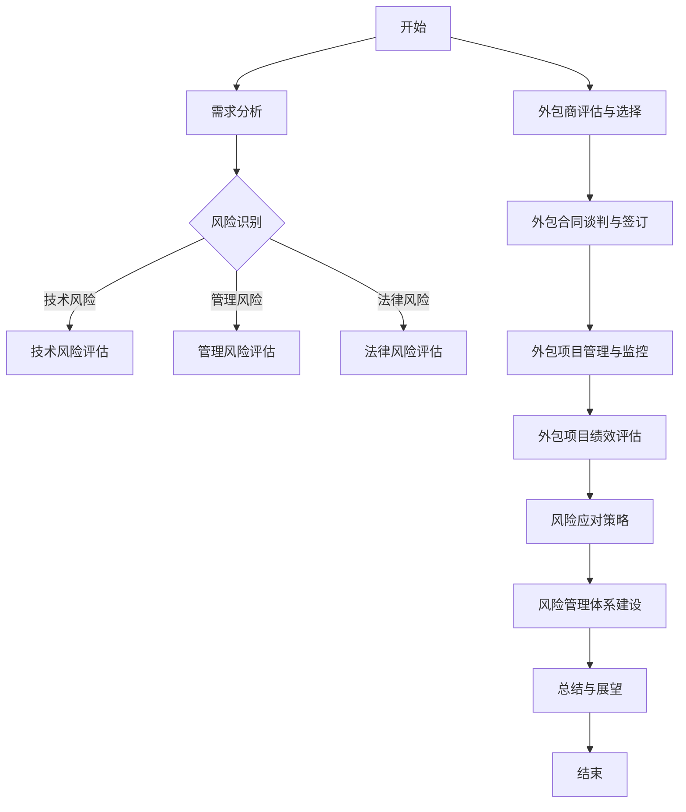

                 

### 《创业公司的技术外包风险管理》引言

#### 1.1 创业公司技术外包背景

创业公司在发展过程中，面临着诸多挑战，如资源有限、市场变化快、研发周期紧张等。在这些背景下，技术外包成为了一种常见且有效的策略。技术外包可以帮助创业公司专注于核心业务，快速获取所需的技术能力和资源，从而提升产品竞争力。

技术外包可以涵盖软件开发、系统维护、数据分析、云计算等多个领域。例如，一家创业公司可能在核心业务领域具有丰富的经验，但在云计算和大数据方面缺乏专业人才。此时，选择合适的外包服务提供商，可以快速实现这些领域的功能，提升整体业务水平。

#### 1.2 技术外包风险管理的必要性

尽管技术外包带来了诸多好处，但同时也伴随着一定的风险。技术外包风险管理的必要性体现在以下几个方面：

1. **技术风险**：外包公司的技术能力和水平直接影响项目的质量和交付时间。如果外包公司的技术能力不足，可能会导致项目延期、质量不达标，甚至影响公司的整体业务。

2. **管理风险**：外包项目管理涉及到多个层面的协调和沟通，包括需求管理、进度控制、质量管理等。如果管理不善，可能会导致项目失控、成本超支、质量下降等问题。

3. **法律风险**：技术外包合同中涉及诸多法律条款，如知识产权保护、保密协议、违约责任等。如果合同条款不明确或存在漏洞，可能会导致法律纠纷，对公司造成重大损失。

4. **文化差异**：外包公司可能与创业公司位于不同的国家或地区，存在文化差异。这种差异可能导致沟通不畅、项目执行偏差等问题。

#### 1.3 本书的目标与结构

本书旨在为创业公司提供一套全面的技术外包风险管理方法论和实践指南。具体目标如下：

1. **介绍技术外包风险管理的核心概念和原理**，帮助读者理解技术外包风险的本质。

2. **阐述技术外包风险管理流程和方法**，包括风险识别、风险评估、风险应对等，为读者提供具体的操作指南。

3. **提供实际案例和实战经验**，通过分析真实案例，帮助读者了解技术外包风险管理在实际应用中的挑战和解决方案。

4. **探讨技术外包风险管理的发展趋势**，为创业公司未来的风险管理提供参考。

本书结构如下：

- **第一部分：引言**：介绍技术外包的背景和必要性，以及本书的目标和结构。

- **第二部分：技术外包风险管理基础**：包括技术外包风险管理概述、外包商评估与选择、外包项目管理与监控、合同管理与法律风险等内容。

- **第三部分：技术外包风险管理实践**：通过案例研究，深入分析创业公司的技术外包风险管理实践。

- **第四部分：总结与展望**：总结本书的主要观点，探讨技术外包风险管理的发展趋势，并提出未来研究方向。

### 《创业公司的技术外包风险管理》目录大纲

#### 第二部分：技术外包风险管理基础

##### 第2章：技术外包风险管理概述

2.1 技术外包风险类型

2.2 技术外包风险管理流程

2.3 技术外包风险管理原则

##### 第3章：外包商评估与选择

3.1 外包商评估标准

3.2 外包商选择流程

3.3 外包合同谈判要点

##### 第4章：外包项目管理与监控

4.1 外包项目管理框架

4.2 外包项目监控方法

4.3 技术外包绩效评估

##### 第5章：合同管理与法律风险

5.1 外包合同的主要内容

5.2 法律风险识别与防范

5.3 合同纠纷处理策略

#### 第三部分：技术外包风险管理实践

##### 第6章：案例研究

6.1 案例一：创业公司A的技术外包风险管理

6.2 案例二：创业公司B的技术外包风险管理

##### 第7章：技术外包风险应对策略

7.1 风险规避策略

7.2 风险转移策略

7.3 风险减轻策略

##### 第8章：技术外包风险管理体系建设

8.1 风险管理组织架构

8.2 风险管理工具与流程

8.3 风险管理文化建设

#### 第四部分：总结与展望

##### 第9章：技术外包风险管理发展趋势

9.1 全球技术外包市场发展趋势

9.2 技术外包风险管理趋势

9.3 未来研究方向

##### 第10章：结论

10.1 本书总结

10.2 创业公司技术外包风险管理建议

10.3 研究展望

#### 附录

##### 附录A：技术外包风险管理流程图（Mermaid格式）

##### 附录B：外包合同模板

##### 附录C：技术外包风险管理参考书目与资源

### 《创业公司的技术外包风险管理》第二部分：技术外包风险管理基础

#### 第2章：技术外包风险管理概述

技术外包风险管理是创业公司在进行技术外包时必须关注的重要领域。有效的技术外包风险管理不仅有助于确保项目的顺利实施，还能降低潜在风险对公司业务的影响。本章将介绍技术外包风险管理的核心概念、风险类型、管理流程和原则。

##### 2.1 技术外包风险类型

技术外包风险主要可以分为以下几类：

1. **技术风险**：指由于外包商的技术能力不足、技术方案不合理、技术更新迭代速度过快等原因导致的风险。技术风险可能会导致项目延期、质量不达标、安全性问题等。

2. **管理风险**：指在项目管理和协调过程中可能遇到的风险，如需求变更频繁、项目管理不善、沟通不畅等。管理风险可能会导致项目进度延误、成本超支、团队士气低落等。

3. **法律风险**：指由于合同条款不明确、知识产权保护不足、合同纠纷等问题导致的法律风险。法律风险可能会引发合同纠纷、知识产权侵权、经济损失等。

4. **财务风险**：指由于外包合同的不确定性、支付方式不合理等原因导致的财务风险。财务风险可能会导致成本超支、现金流紧张、资金回笼困难等。

##### 2.2 技术外包风险管理流程

技术外包风险管理流程主要包括以下几个步骤：

1. **需求分析**：明确项目需求，分析项目的技术难度和风险点。

2. **风险识别**：识别项目可能面临的各种风险，包括技术风险、管理风险、法律风险和财务风险。

3. **风险评估**：对识别出的风险进行评估，分析风险发生的概率和可能带来的影响程度。

4. **风险应对**：根据风险评估结果，制定风险应对策略，包括风险规避、风险转移和风险减轻。

5. **风险监控**：在整个项目生命周期中，持续监控风险的变化，及时调整风险应对措施。

6. **风险报告**：定期编写风险报告，向项目各方汇报风险管理的进展和成果。

##### 2.3 技术外包风险管理原则

为了确保技术外包风险管理的有效性，创业公司应遵循以下原则：

1. **全面性**：风险管理应覆盖项目全过程，包括项目策划、执行、监控和收尾等阶段。

2. **前瞻性**：在项目启动前，应充分预见可能的风险，并提前制定应对措施。

3. **实时性**：风险管理应具备实时性，及时发现和处理潜在风险。

4. **合作性**：风险管理不仅是项目管理团队的责任，还需要项目各方的共同努力。

5. **成本效益**：在制定风险应对策略时，应考虑成本效益，确保风险管理的投入能够产生相应的回报。

通过遵循以上原则，创业公司可以更好地进行技术外包风险管理，降低项目风险，保障项目顺利实施。

### 《创业公司的技术外包风险管理》第2章：技术外包风险管理概述

#### 2.1 技术外包风险类型

技术外包风险是创业公司在选择外包服务时需要特别关注的一个方面。技术外包风险类型多样，了解并分类这些风险有助于创业公司更好地进行风险管理和项目控制。以下是一些常见的技术外包风险类型：

1. **技术能力不足**：外包公司可能缺乏足够的技术能力或专业知识，导致项目无法按时完成或质量不达标。这种情况常见于外包公司团队技术水平有限，或者在特定技术领域缺乏经验。

2. **技术方案不合理**：外包公司可能会采用不合理的技术方案，导致项目成本增加、效率降低或维护困难。例如，使用过于复杂的技术架构或选择不适合的项目开发语言和工具。

3. **技术更新迭代**：技术领域发展迅速，外包公司可能无法及时跟踪并应用最新的技术，导致项目落后于市场趋势。技术更新迭代速度过快还可能导致原有技术的淘汰，增加维护成本。

4. **系统集成困难**：外包公司可能无法很好地将新开发的功能与现有的系统集成，导致系统不兼容或功能不连贯。系统集成困难可能导致项目延期或系统性能下降。

5. **安全漏洞**：外包公司可能由于技术不足或安全意识不强，导致项目中存在安全漏洞，从而威胁到整个系统的安全性。安全漏洞可能导致数据泄露、系统被攻击等严重后果。

6. **项目延期**：由于技术风险或管理风险，外包项目可能无法按时完成。项目延期不仅会影响创业公司的业务计划，还可能增加额外成本。

7. **质量不达标**：外包公司可能由于技术能力不足或质量意识不强，导致交付的产品或服务不符合预期质量标准。质量不达标可能导致客户不满、合同违约等。

#### 2.2 技术外包风险管理流程

技术外包风险管理是一个系统性的过程，包括以下几个关键步骤：

1. **需求分析**：在项目启动之初，明确项目需求和技术要求，分析项目的技术难度和潜在风险。需求分析是风险识别的基础，有助于提前预见并规避风险。

2. **风险识别**：在需求分析的基础上，全面识别项目可能面临的各种风险。风险识别应包括技术风险、管理风险、法律风险和财务风险等。可以通过专家访谈、文献调研、历史数据分析等方法进行风险识别。

3. **风险评估**：对识别出的风险进行评估，分析风险发生的概率和可能带来的影响程度。风险评估可以采用定性分析（如专家评估、风险矩阵）或定量分析（如蒙特卡罗模拟）等方法。风险评估有助于确定风险优先级，为后续的风险应对提供依据。

4. **风险应对**：根据风险评估结果，制定相应的风险应对策略。风险应对策略包括风险规避、风险转移和风险减轻等。风险规避是指通过改变项目计划或技术方案来避免风险；风险转移是指将风险责任转移到第三方，如购买保险或签订严苛的合同条款；风险减轻是指通过增加资源投入或改进技术方案来降低风险发生概率或影响程度。

5. **风险监控**：在整个项目生命周期中，持续监控风险的变化，及时调整风险应对措施。风险监控应包括定期风险评估、风险报告和风险管理会议等。通过实时监控，可以确保风险应对措施的有效性，并提前发现新出现的风险。

6. **风险报告**：定期编写风险报告，向项目各方汇报风险管理的进展和成果。风险报告应包括当前的风险状况、已采取的风险应对措施、风险应对效果评估等。风险报告有助于提高项目透明度，促进各方协作。

#### 2.3 技术外包风险管理原则

为了确保技术外包风险管理的高效和有效，创业公司应遵循以下原则：

1. **全面性**：风险管理应覆盖项目的所有阶段和各个方面，包括需求分析、设计、开发、测试和部署等。全面的风险管理有助于识别和应对潜在风险，确保项目顺利实施。

2. **前瞻性**：在项目启动前，应充分预见可能的风险，并提前制定应对措施。前瞻性的风险管理可以降低风险发生概率，减少项目延误和成本超支。

3. **实时性**：风险管理应具备实时性，及时发现和处理潜在风险。通过实时监控和快速响应，可以确保风险应对措施的有效性，减少风险对项目的影响。

4. **合作性**：风险管理不仅是项目管理团队的责任，还需要项目各方的共同努力。合作性的风险管理可以促进各方协作，共同应对风险。

5. **成本效益**：在制定风险应对策略时，应考虑成本效益，确保风险管理的投入能够产生相应的回报。通过平衡风险管理和成本控制，可以提高项目的整体效益。

通过遵循以上原则，创业公司可以更好地进行技术外包风险管理，降低项目风险，确保项目成功实施。

### 《创业公司的技术外包风险管理》第3章：外包商评估与选择

#### 3.1 外包商评估标准

选择合适的外包商是技术外包风险管理的重要环节。为了确保外包商具备所需的技术能力和信誉，创业公司需要建立一套科学的外包商评估标准。以下是一些常见的外包商评估标准：

1. **技术能力评估**：评估外包商在特定技术领域的专业知识和经验。可以通过考察外包商的项目案例、技术文档、团队资质等来评估其技术能力。

2. **项目管理能力评估**：评估外包商的项目管理流程和方法，包括项目计划、进度控制、质量管理、风险管理等。可以通过考察外包商的项目管理工具、流程文档、历史项目记录等来评估其项目管理能力。

3. **财务状况评估**：评估外包商的财务健康状况，包括财务报表、负债情况、盈利能力等。良好的财务状况可以保证外包商有足够的资源投入项目，减少项目中断的风险。

4. **信誉评估**：评估外包商的信誉和口碑，包括客户评价、行业评价、媒体报道等。可以通过第三方平台、行业论坛、客户推荐等渠道收集信息。

5. **团队稳定性评估**：评估外包商团队的稳定性，包括团队成员的经验、离职率、团队协作能力等。稳定的团队有助于项目的持续发展和维护。

6. **响应速度评估**：评估外包商对项目需求和问题的响应速度，包括沟通渠道、问题解决效率等。良好的响应速度可以保证项目能够快速应对变更和问题。

#### 3.2 外包商选择流程

为了确保选择到合适的外包商，创业公司应遵循以下选择流程：

1. **需求分析**：明确项目需求和技术要求，分析潜在的外包商类型和范围。

2. **招标和招标文件准备**：发布外包招标信息，准备详细的招标文件，包括项目需求、评估标准、合同条款等。

3. **招标响应和初步筛选**：收集潜在外包商的响应文件，根据评估标准进行初步筛选，排除不符合要求的外包商。

4. **详细评估和比较**：对通过初步筛选的外包商进行详细评估，包括技术能力、项目管理能力、财务状况、信誉、团队稳定性、响应速度等。可以通过面试、现场考察、项目案例讨论等方式进行评估。

5. **谈判和合同签订**：与通过评估的外包商进行谈判，确定合同条款和价格，签订外包合同。

6. **合同履行和监督**：在合同履行过程中，对外包商进行监督和评估，确保其按照合同要求完成项目任务。

#### 3.3 外包合同谈判要点

外包合同谈判是选择合适外包商的关键环节，以下是一些外包合同谈判的要点：

1. **明确项目目标和范围**：在谈判过程中，明确项目目标和项目范围，确保外包商明确项目需求和交付成果。

2. **确定项目预算和支付方式**：根据项目需求和外包商的报价，确定项目预算和支付方式。支付方式可以包括固定价格、成本加成、时间材料等。

3. **合同条款和条件**：详细讨论并明确合同条款和条件，包括项目进度、质量标准、交付时间、知识产权归属、保密协议、违约责任等。

4. **风险管理条款**：在合同中明确风险管理条款，包括风险识别、风险评估、风险应对、风险报告等。明确双方在风险管理中的责任和义务。

5. **沟通和报告机制**：建立有效的沟通和报告机制，确保项目各方能够及时沟通和解决问题。明确沟通渠道、频率和报告内容。

6. **争议解决机制**：在合同中明确争议解决机制，包括争议解决方式、争议解决机构等。确保在出现争议时能够及时、有效地解决。

通过遵循以上评估标准、选择流程和谈判要点，创业公司可以更好地选择合适的外包商，降低技术外包风险，确保项目的成功实施。

### 《创业公司的技术外包风险管理》第4章：外包项目管理与监控

#### 4.1 外包项目管理框架

外包项目管理是确保外包项目成功实施的关键。一个有效的外包项目管理框架可以帮助项目团队清晰地理解项目目标、任务分配、进度控制和质量保障等。以下是一个典型的外包项目管理框架：

1. **项目启动**：
   - 确定项目目标、范围和关键里程碑。
   - 明确项目团队和组织结构。
   - 制定项目计划和时间表。

2. **需求管理**：
   - 收集和分析项目需求。
   - 创建需求文档，并确保所有利益相关者对需求达成一致。
   - 管理需求变更，确保变更的合理性和可接受性。

3. **项目规划**：
   - 制定详细的项目计划，包括任务分配、资源需求、风险评估和应急计划。
   - 确定项目的关键路径和关键里程碑。

4. **项目执行**：
   - 按照项目计划执行任务，确保团队遵循既定的流程和标准。
   - 监控项目的进展，确保任务按时完成。
   - 管理外包商和项目团队之间的沟通和协作。

5. **项目监控**：
   - 定期评估项目的进展和质量，识别和解决潜在问题。
   - 进行进度报告和绩效评估，确保项目在预算和时间范围内完成。

6. **项目收尾**：
   - 完成项目的验收和交付。
   - 进行项目总结和评估，总结经验教训，为未来项目提供参考。

#### 4.2 外包项目监控方法

有效的项目监控是确保外包项目成功的关键。以下是一些常见的外包项目监控方法：

1. **定期会议**：
   - 定期召开项目进度会议，项目团队成员和外包商代表共同参与。
   - 讨论项目进展、问题和解决方案。
   - 确保项目目标、范围和计划保持一致。

2. **进度报告**：
   - 定期收集和提交项目进度报告，包括任务完成情况、资源使用情况和风险情况。
   - 分析进度报告，识别潜在的问题和风险。

3. **关键绩效指标（KPI）**：
   - 设定关键绩效指标，如任务完成率、质量指标、成本控制等。
   - 定期评估KPI，确保项目按照预期进展。

4. **风险监控**：
   - 建立风险监控机制，定期评估和更新风险清单。
   - 及时识别和应对潜在风险，减少风险对项目的影响。

5. **质量保证**：
   - 实施质量保证流程，包括代码审查、测试和验收等。
   - 确保交付的产品或服务符合预期质量标准。

6. **变更管理**：
   - 建立变更管理流程，确保所有变更都经过审批和记录。
   - 管理变更对项目进度、成本和质量的影响。

#### 4.3 技术外包绩效评估

技术外包绩效评估是衡量外包项目成果和外包商表现的重要手段。以下是一些常见的绩效评估方法：

1. **项目完成情况**：
   - 评估项目是否按照预定时间、预算和质量完成。
   - 分析任务完成率、项目进度偏差和成本超支情况。

2. **质量评估**：
   - 评估交付的产品或服务的质量，包括功能完整性、性能、安全性和用户体验等。
   - 分析质量缺陷率、用户反馈和投诉情况。

3. **团队合作与沟通**：
   - 评估项目团队和外包商之间的沟通效率、协作效果和团队氛围。
   - 分析项目沟通渠道、会议频率和问题解决速度。

4. **外包商表现评估**：
   - 根据外包商的合同要求，评估其技术能力、项目管理能力和服务质量。
   - 分析外包商的响应速度、问题解决能力和合同履行情况。

5. **客户满意度**：
   - 收集客户对项目交付成果的满意度评价。
   - 分析客户反馈、投诉和建议，改进项目和服务。

6. **成本效益分析**：
   - 评估外包项目对创业公司成本效益的影响，包括成本节约、资源利用效率和投资回报率等。

通过以上绩效评估方法，创业公司可以全面了解外包项目的成果和外包商的表现，为未来的技术外包决策提供依据。

### 《创业公司的技术外包风险管理》第5章：合同管理与法律风险

#### 5.1 外包合同的主要内容

外包合同是创业公司与外包服务提供商之间的重要法律文件，明确了双方的权利、义务和责任。以下是一些常见的外包合同主要内容：

1. **项目描述**：详细描述项目的目标、范围、交付成果、时间表和里程碑。

2. **服务范围**：明确外包服务提供商应提供的服务内容，包括技术支持、软件维护、系统集成等。

3. **交付标准**：规定交付成果的质量标准、性能指标和验收标准。

4. **费用和支付**：明确项目的费用构成、支付方式和时间表。费用可以包括固定价格、成本加成或时间材料等。

5. **进度和里程碑**：列出项目的时间表和关键里程碑，确保项目按计划进行。

6. **保密协议**：规定双方对项目信息、商业秘密和敏感数据的保密责任。

7. **知识产权归属**：明确知识产权的归属，包括软件源代码、文档和相关的专利、商标等。

8. **违约责任**：规定在合同履行过程中，如一方违反合同规定，应承担的违约责任和赔偿标准。

9. **争议解决**：规定争议解决的方式和机构，如协商、调解或仲裁等。

10. **变更管理**：规定如何管理合同变更，包括变更流程、审批权限和变更对项目进度、成本和质量的影响。

#### 5.2 法律风险识别与防范

法律风险是指在合同履行过程中，由于法律规定、合同条款不明确、合同纠纷等因素可能导致的风险。以下是一些常见的法律风险及其防范措施：

1. **合同条款不明确**：
   - 防范措施：在合同谈判和起草过程中，详细讨论并明确合同条款，确保双方对合同内容有清晰的理解。

2. **知识产权侵权**：
   - 防范措施：明确知识产权的归属和使用权限，确保外包服务提供商不侵犯他人的知识产权。

3. **保密协议不完善**：
   - 防范措施：制定详细的保密协议，明确保密范围、保密期限和保密责任。

4. **合同履行过程中的纠纷**：
   - 防范措施：在合同中明确争议解决方式，如协商、调解或仲裁，确保争议能够及时、有效地解决。

5. **合同变更管理不善**：
   - 防范措施：建立完善的变更管理流程，明确变更审批权限和变更对项目进度、成本和质量的影响。

6. **违约责任不明确**：
   - 防范措施：在合同中明确违约责任和赔偿标准，确保双方在违约情况下能够得到相应的赔偿。

7. **法律法规变化**：
   - 防范措施：定期关注相关法律法规的变化，及时调整合同条款，确保合同符合法律法规要求。

通过识别和防范法律风险，创业公司可以降低合同履行过程中的不确定性，保障项目的顺利实施。

#### 5.3 合同纠纷处理策略

合同纠纷是指在合同履行过程中，因合同条款不明确、履行不当或其他原因导致双方产生争议。以下是一些常见的合同纠纷处理策略：

1. **协商解决**：
   - 策略：通过友好协商，双方共同寻找解决方案，避免争议升级。
   - 适用情况：合同条款存在争议或履行过程中出现小问题。

2. **调解解决**：
   - 策略：通过第三方调解机构进行调解，协助双方达成共识。
   - 适用情况：争议较大，但双方希望通过和平方式解决。

3. **仲裁解决**：
   - 策略：提交至仲裁机构进行仲裁，由仲裁机构作出裁决。
   - 适用情况：合同中已约定仲裁条款或双方无法通过协商和调解解决争议。

4. **诉讼解决**：
   - 策略：向法院提起诉讼，通过司法程序解决争议。
   - 适用情况：争议严重，双方无法通过其他方式解决。

5. **规避策略**：
   - 策略：通过合同条款的明确和变更管理，避免争议的发生。
   - 适用情况：合同履行过程中可能出现的争议点。

通过合理的合同纠纷处理策略，创业公司可以降低合同纠纷对项目的影响，保障项目的顺利实施。

### 《创业公司的技术外包风险管理》第6章：案例研究

在技术外包风险管理中，通过实际案例的分析可以帮助我们更好地理解风险管理的过程和策略。以下将介绍两个创业公司的技术外包风险管理案例，分析其在风险管理过程中采取的措施和取得的结果。

#### 案例一：创业公司A的技术外包风险管理

**项目背景**：
创业公司A是一家专注于智能家居设备研发的公司。在开发新一代智能门锁时，由于自身技术团队在硬件设计和嵌入式系统开发方面存在不足，决定将部分硬件设计和嵌入式系统开发工作外包给专业的技术外包公司B。

**风险管理流程**：

1. **需求分析**：
   - 明确项目需求，包括智能门锁的功能、硬件要求、安全标准等。
   - 评估外包技术难度，识别可能的技术风险。

2. **风险识别**：
   - 识别技术风险，如硬件设计不完善、嵌入式系统稳定性问题等。
   - 识别管理风险，如项目进度延误、沟通不畅等。
   - 识别法律风险，如知识产权保护、合同条款不明确等。

3. **风险评估**：
   - 对识别出的风险进行评估，分析风险发生的概率和可能带来的影响程度。
   - 将风险分为高、中、低风险等级，为后续风险应对提供依据。

4. **风险应对**：
   - 针对高风险技术风险，选择具备丰富硬件设计和嵌入式系统开发经验的外包商。
   - 针对管理风险，建立定期沟通机制，确保项目进度和沟通效率。
   - 针对法律风险，明确合同条款，确保知识产权的归属和使用权限。

5. **风险监控**：
   - 定期评估外包项目的进展和质量，及时识别和处理潜在风险。
   - 通过进度报告、质量评估和风险报告，确保风险应对措施的有效性。

6. **风险报告**：
   - 定期编写风险报告，向公司管理层和利益相关者汇报风险管理的进展和成果。
   - 分析风险应对效果，为未来项目提供参考。

**关键措施**：

1. **明确外包合同**：
   - 与外包商签订详细的合同，明确项目范围、交付标准、费用和支付方式等。
   - 设立知识产权归属条款，确保自身技术不受侵犯。

2. **定期沟通和评估**：
   - 设立定期项目会议，确保项目进度和沟通效率。
   - 定期评估外包商的技术能力和服务质量。

3. **质量监控**：
   - 实施严格的质量控制流程，包括硬件测试、软件测试和功能测试等。

**结果**：
通过有效的技术外包风险管理，创业公司A成功完成了新一代智能门锁的开发。外包项目按时交付，产品质量达到预期标准，为公司赢得了市场优势。

#### 案例二：创业公司B的技术外包风险管理

**项目背景**：
创业公司B是一家专注于移动互联网应用开发的初创公司。在拓展海外市场时，由于自身对海外市场的技术支持和本地化开发能力有限，决定将部分本地化开发工作外包给专业的技术外包公司C。

**风险管理流程**：

1. **需求分析**：
   - 明确海外市场的技术需求，包括本地化功能、用户体验和市场需求等。
   - 评估外包技术难度，识别可能的技术风险。

2. **风险识别**：
   - 识别技术风险，如本地化开发难度、跨平台兼容性问题等。
   - 识别管理风险，如项目进度延误、跨文化沟通不畅等。
   - 识别法律风险，如合同条款不明确、知识产权保护不充分等。

3. **风险评估**：
   - 对识别出的风险进行评估，分析风险发生的概率和可能带来的影响程度。
   - 将风险分为高、中、低风险等级，为后续风险应对提供依据。

4. **风险应对**：
   - 针对高风险技术风险，选择具备本地化开发经验和跨平台开发能力的外包商。
   - 针对管理风险，建立跨文化沟通机制，确保项目进度和沟通效率。
   - 针对法律风险，明确合同条款，确保知识产权的归属和使用权限。

5. **风险监控**：
   - 定期评估外包项目的进展和质量，及时识别和处理潜在风险。
   - 通过进度报告、质量评估和风险报告，确保风险应对措施的有效性。

6. **风险报告**：
   - 定期编写风险报告，向公司管理层和利益相关者汇报风险管理的进展和成果。
   - 分析风险应对效果，为未来项目提供参考。

**关键措施**：

1. **文化差异培训**：
   - 对项目团队成员进行跨文化差异培训，确保团队具备良好的跨文化沟通能力。

2. **合同条款细化**：
   - 与外包商签订详细的合同，明确项目范围、交付标准、费用和支付方式等。
   - 设立知识产权归属条款，确保自身技术不受侵犯。

3. **项目进度监控**：
   - 定期召开项目进度会议，确保项目进度和沟通效率。
   - 实施严格的项目进度监控，确保项目按时交付。

**结果**：
通过有效的技术外包风险管理，创业公司B成功完成了海外市场的本地化开发工作。外包项目按时交付，产品质量达到预期标准，为公司成功进入海外市场奠定了基础。

通过以上两个案例，我们可以看到，有效的技术外包风险管理对于创业公司的成功至关重要。在风险管理过程中，创业公司需要明确项目需求、识别风险、评估风险、制定应对策略、监控风险和报告风险。通过这些措施，创业公司可以降低技术外包风险，确保项目的顺利实施，从而实现业务目标。

### 《创业公司的技术外包风险管理》第7章：技术外包风险应对策略

技术外包风险应对策略是创业公司为了降低外包项目中可能遇到的风险而采取的一系列措施。有效的风险应对策略可以确保项目按时交付、质量达标，并降低潜在损失。以下是常见的风险应对策略：

#### 7.1 风险规避策略

风险规避策略的核心思想是通过改变项目计划或外包方案，避免风险的发生。以下是一些常见的风险规避策略：

1. **重新评估项目需求**：如果某项技术外包任务存在较高的风险，可以考虑重新评估项目需求，寻找其他解决方案或替代技术。

2. **选择风险较低的外包商**：在选择外包商时，应优先选择具备丰富经验和良好信誉的供应商，以降低技术能力和项目管理方面的风险。

3. **分解任务**：将高风险的任务分解为多个子任务，并分别外包给不同的外包商，以降低单个外包商的风险对整个项目的影响。

4. **内部处理**：对于某些高风险的任务，可以考虑内部处理，利用自身团队的技术能力和资源进行开发，从而避免外包带来的风险。

#### 7.2 风险转移策略

风险转移策略是通过合同或其他手段将风险责任转移到第三方。以下是一些常见风险转移策略：

1. **保险**：购买相应的保险，如商业保险、责任保险等，将潜在的经济损失风险转移给保险公司。

2. **合同条款**：在合同中明确风险责任和赔偿标准，通过合同条款将风险转移给外包商或第三方。

3. **第三方担保**：在合同中引入第三方担保机构，如律师事务所、认证机构等，确保合同条款的执行和风险的合理分配。

4. **再保险**：对于高风险的项目，可以通过购买再保险将风险进一步转移给其他保险公司。

#### 7.3 风险减轻策略

风险减轻策略是通过采取预防措施或改进措施来降低风险的发生概率或影响程度。以下是一些常见风险减轻策略：

1. **预防措施**：
   - **加强沟通**：建立有效的沟通机制，确保项目各方及时了解项目进展和潜在风险。
   - **风险管理培训**：对项目团队和外包商进行风险管理培训，提高其风险识别和管理能力。

2. **改进措施**：
   - **优化流程**：改进项目管理流程，提高项目执行效率，减少管理风险。
   - **质量控制**：加强质量控制和测试，确保交付的产品或服务符合预期质量标准。
   - **技术储备**：建立技术储备库，提前准备应对潜在技术问题的解决方案。

3. **风险缓解**：
   - **备份计划**：制定备份计划，确保在风险事件发生时能够迅速恢复系统运行。
   - **应急响应**：建立应急响应机制，确保在风险事件发生时能够迅速采取措施，减轻风险的影响。

通过综合运用风险规避、风险转移和风险减轻策略，创业公司可以有效地降低技术外包风险，保障项目的顺利实施。

### 《创业公司的技术外包风险管理》第8章：技术外包风险管理体系建设

技术外包风险管理体系是创业公司为确保技术外包项目顺利实施、降低风险而建立的一系列制度、流程和工具。一个完善的技术外包风险管理体系可以有效地识别、评估、控制和应对各种风险，确保项目按时交付、质量达标。以下是技术外包风险管理体系建设的关键要素：

#### 8.1 风险管理组织架构

风险管理组织架构是技术外包风险管理体系的基础，决定了风险管理的责任分配、沟通协调和决策流程。以下是一个典型的风险管理组织架构：

1. **风险管理委员会**：由公司高层领导组成，负责制定风险管理策略、审批重大风险管理决策。

2. **项目经理**：负责具体项目的风险管理，协调项目团队和外包商，确保项目按计划进行。

3. **风险管理人员**：负责识别、评估和监控项目风险，制定风险应对措施，编写风险报告。

4. **项目团队**：包括项目团队成员和外包商代表，负责项目执行和风险管理。

#### 8.2 风险管理工具与流程

有效的风险管理工具和流程是技术外包风险管理体系的重要组成部分。以下是一些常见的管理工具和流程：

1. **风险管理工具**：
   - **风险识别工具**：如风险识别矩阵、风险调查问卷等，帮助识别项目风险。
   - **风险评估工具**：如风险矩阵、蒙特卡罗模拟等，帮助评估风险的概率和影响程度。
   - **风险应对工具**：如风险应对计划、应急预案等，帮助制定和实施风险应对措施。

2. **风险管理流程**：
   - **需求分析**：明确项目需求，识别潜在风险。
   - **风险识别**：通过风险识别工具和方法，识别项目风险。
   - **风险评估**：评估风险的概率和影响程度，确定风险等级。
   - **风险应对**：制定风险应对策略，包括风险规避、风险转移和风险减轻。
   - **风险监控**：持续监控风险的变化，及时调整风险应对措施。
   - **风险报告**：定期编写风险报告，向项目各方汇报风险管理进展。

#### 8.3 风险管理文化建设

风险管理文化建设是确保风险管理体系有效运行的关键。以下是一些促进风险管理文化建设的措施：

1. **风险管理意识**：通过培训、宣传等方式，提高项目团队和外包商对风险管理的认识和重视程度。

2. **风险管理责任**：明确项目团队和外包商在风险管理中的责任，确保各方积极参与风险管理。

3. **风险管理合作**：建立有效的沟通和协作机制，促进项目团队和外包商之间的信息共享和协作。

4. **风险管理激励**：建立激励机制，鼓励项目团队和外包商在风险管理方面做出积极贡献。

通过建立完善的风险管理组织架构、工具和流程，以及促进风险管理文化建设，创业公司可以构建一个有效的技术外包风险管理体系，降低项目风险，保障项目成功实施。

### 《创业公司的技术外包风险管理》第9章：技术外包风险管理发展趋势

随着全球化进程的加速和信息技术的发展，技术外包已成为创业公司提升竞争力的关键策略之一。然而，技术外包市场也面临着诸多挑战，如市场不确定性、技术快速变革、法律风险等。为了应对这些挑战，技术外包风险管理也在不断发展和演变。以下是技术外包风险管理的发展趋势：

#### 9.1 全球技术外包市场发展趋势

1. **技术外包市场规模持续扩大**：随着创业公司对技术需求的不断增加，技术外包市场规模持续扩大。根据市场研究公司的数据，全球技术外包市场预计将以稳健的增速增长，特别是在云计算、大数据、人工智能等领域。

2. **服务多样化和专业化**：技术外包服务正从传统的软件开发和系统维护向更多样化、专业化的领域扩展，如物联网、区块链、网络安全等。创业公司可以根据自身需求选择合适的外包服务，提高项目成功率。

3. **全球化进程加快**：随着全球化的推进，创业公司可以更容易地选择全球范围内的外包服务提供商。这不仅可以降低成本，还可以利用全球范围内的技术资源，提高项目质量。

4. **监管和合规要求增加**：各国政府对外包服务提供商的监管和合规要求日益严格，如数据保护法、知识产权法等。创业公司需要关注这些变化，确保外包项目符合相关法律法规。

#### 9.2 技术外包风险管理趋势

1. **风险管理智能化**：随着人工智能和大数据技术的发展，技术外包风险管理将越来越智能化。利用大数据分析和机器学习算法，可以更准确地进行风险识别、评估和应对。

2. **风险管理工具多样化**：随着风险管理工具的不断发展，创业公司可以更加灵活地选择适合自己需求的风险管理工具。例如，基于云的风险管理平台、自动化风险分析工具等。

3. **风险文化建设**：随着对风险管理重要性的认识不断提高，创业公司将更加注重风险文化建设。通过培训、宣传等方式，提高员工和外包商的风险管理意识和能力。

4. **风险合作与共享**：创业公司将更加重视与外包商之间的风险合作与共享。通过建立风险共享平台，共享风险信息、经验和资源，共同应对风险。

#### 9.3 未来研究方向

1. **风险管理模型优化**：未来研究可以进一步优化风险管理模型，提高风险识别和评估的准确性。例如，结合多源数据的集成分析方法，提高风险评估的可靠性。

2. **风险管理自动化**：利用人工智能和机器学习技术，开发自动化风险管理工具，实现风险识别、评估和应对的自动化。

3. **风险管理文化研究**：深入研究风险管理文化对企业绩效的影响，探索如何通过文化建设提高风险管理效果。

4. **跨领域风险研究**：随着技术外包服务的多样化，未来研究可以关注跨领域风险的管理，如物联网安全、区块链合规等。

通过关注技术外包市场发展趋势和风险管理趋势，创业公司可以更好地应对外包过程中的各种挑战，实现技术外包项目的成功。

### 《创业公司的技术外包风险管理》第10章：结论

技术外包已成为创业公司提升竞争力的重要手段，但同时也伴随着一定的风险。通过本文的讨论，我们系统地介绍了技术外包风险管理的核心概念、流程、策略和体系建设。

首先，我们明确了技术外包风险管理的必要性，指出技术风险、管理风险、法律风险和财务风险是创业公司面临的主要挑战。接着，我们详细阐述了技术外包风险管理的基础，包括风险识别、风险评估、风险应对和风险监控等关键环节。

在具体实施方面，我们提出了外包商评估与选择、外包项目管理与监控、合同管理与法律风险控制等策略。通过实际案例研究，我们展示了创业公司如何通过有效的风险管理策略，成功完成技术外包项目。

最后，我们探讨了技术外包风险管理的发展趋势，包括智能化、工具多样化、风险管理文化建设和跨领域风险研究等。未来，创业公司需要持续关注这些趋势，不断完善技术外包风险管理体系。

为了创业公司的成功，我们提出以下建议：

1. **建立健全的风险管理体系**：确保风险管理覆盖项目全过程，从需求分析到项目收尾。

2. **加强风险文化建设**：提高员工和外包商的风险管理意识，促进跨部门协作。

3. **优化风险识别和评估工具**：利用大数据和人工智能技术，提高风险识别和评估的准确性。

4. **关注法律风险和合规要求**：确保外包项目符合相关法律法规，降低法律风险。

通过以上措施，创业公司可以更好地应对技术外包过程中的各种风险，确保项目的成功实施，实现业务目标。

### 附录A：技术外包风险管理流程图（Mermaid格式）



### 附录B：技术外包风险管理核心算法原理（伪代码）

```python
# 风险评估算法伪代码

# 输入：风险事件列表，风险发生概率，风险影响程度
# 输出：风险评分

def assess_risk(risk_events, probabilities, impacts):
    risk_scores = []
    for event, probability, impact in zip(risk_events, probabilities, impacts):
        score = probability * impact
        risk_scores.append(score)
    return risk_scores

# 风险排序算法伪代码

# 输入：风险评分列表
# 输出：排序后的风险列表

def sort_risk(risk_scores):
    sorted_risks = sorted(zip(risk_scores, risk_events), reverse=True)
    return [event for score, event in sorted_risks]
```

### 附录C：技术外包风险管理数学模型（LaTeX格式）

```latex
\documentclass{article}
\usepackage{amsmath}
\begin{document}

\section*{技术外包风险管理数学模型}

\subsection*{风险评分模型}

$$
Risk\_Score = Probability \times Impact
$$

其中，$Probability$ 表示风险发生的概率，$Impact$ 表示风险发生后的影响程度。

\subsection*{风险排序模型}

$$
Sorted\_Risk = \{ (Risk\_Score_i, Risk\_Event_i) | i = 1, 2, \ldots, n \}
$$

其中，$Risk\_Score_i$ 为第 $i$ 个风险事件的评分，$Risk\_Event_i$ 为第 $i$ 个风险事件。

\end{document}
```

### 附录D：技术外包风险管理项目实战案例

#### 案例一：创业公司A的技术外包风险管理

**项目背景**：
创业公司A是一家新兴的物联网解决方案提供商，专注于智能家居设备的研发和销售。在开发新一代智能门锁时，由于公司内部在硬件设计和嵌入式系统开发方面存在不足，决定将部分硬件设计和嵌入式系统开发工作外包给专业的技术外包公司B。

**风险管理流程**：

1. **需求分析**：
   - 明确项目需求，包括智能门锁的功能、硬件要求、安全标准等。
   - 评估外包技术难度，识别可能的技术风险。

2. **风险识别**：
   - 识别技术风险，如硬件设计不完善、嵌入式系统稳定性问题等。
   - 识别管理风险，如项目进度延误、沟通不畅等。
   - 识别法律风险，如知识产权保护、合同条款不明确等。

3. **风险评估**：
   - 对识别出的风险进行评估，分析风险发生的概率和可能带来的影响程度。
   - 将风险分为高、中、低风险等级，为后续风险应对提供依据。

4. **风险应对**：
   - 针对高风险技术风险，选择具备丰富硬件设计和嵌入式系统开发经验的外包商。
   - 针对管理风险，建立定期沟通机制，确保项目进度和沟通效率。
   - 针对法律风险，明确合同条款，确保知识产权的归属和使用权限。

5. **风险监控**：
   - 定期评估外包项目的进展和质量，及时识别和处理潜在风险。
   - 通过进度报告、质量评估和风险报告，确保风险应对措施的有效性。

**关键措施**：

1. **明确外包合同**：
   - 与外包商签订详细的合同，明确项目范围、交付标准、费用和支付方式等。
   - 设立知识产权归属条款，确保自身技术不受侵犯。

2. **定期沟通和评估**：
   - 设立定期项目会议，确保项目进度和沟通效率。
   - 定期评估外包商的技术能力和服务质量。

3. **质量监控**：
   - 实施严格的质量控制流程，包括硬件测试、软件测试和功能测试等。

**结果**：
通过有效的技术外包风险管理，创业公司A成功完成了新一代智能门锁的开发。外包项目按时交付，产品质量达到预期标准，为公司赢得了市场优势。

#### 案例二：创业公司B的技术外包风险管理

**项目背景**：
创业公司B是一家专注于移动互联网应用开发的初创公司。在拓展海外市场时，由于自身对海外市场的技术支持和本地化开发能力有限，决定将部分本地化开发工作外包给专业的技术外包公司C。

**风险管理流程**：

1. **需求分析**：
   - 明确海外市场的技术需求，包括本地化功能、用户体验和市场需求等。
   - 评估外包技术难度，识别可能的技术风险。

2. **风险识别**：
   - 识别技术风险，如本地化开发难度、跨平台兼容性问题等。
   - 识别管理风险，如项目进度延误、跨文化沟通不畅等。
   - 识别法律风险，如合同条款不明确、知识产权保护不充分等。

3. **风险评估**：
   - 对识别出的风险进行评估，分析风险发生的概率和可能带来的影响程度。
   - 将风险分为高、中、低风险等级，为后续风险应对提供依据。

4. **风险应对**：
   - 针对高风险技术风险，选择具备本地化开发经验和跨平台开发能力的外包商。
   - 针对管理风险，建立跨文化沟通机制，确保项目进度和沟通效率。
   - 针对法律风险，明确合同条款，确保知识产权的归属和使用权限。

5. **风险监控**：
   - 定期评估外包项目的进展和质量，及时识别和处理潜在风险。
   - 通过进度报告、质量评估和风险报告，确保风险应对措施的有效性。

**关键措施**：

1. **文化差异培训**：
   - 对项目团队成员进行跨文化差异培训，确保团队具备良好的跨文化沟通能力。

2. **合同条款细化**：
   - 与外包商签订详细的合同，明确项目范围、交付标准、费用和支付方式等。
   - 设立知识产权归属条款，确保自身技术不受侵犯。

3. **项目进度监控**：
   - 定期召开项目进度会议，确保项目进度和沟通效率。
   - 实施严格的项目进度监控，确保项目按时交付。

**结果**：
通过有效的技术外包风险管理，创业公司B成功完成了海外市场的本地化开发工作。外包项目按时交付，产品质量达到预期标准，为公司成功进入海外市场奠定了基础。

通过以上两个案例，我们可以看到，有效的技术外包风险管理对于创业公司的成功至关重要。在风险管理过程中，创业公司需要明确项目需求、识别风险、评估风险、制定应对策略、监控风险和报告风险。通过这些措施，创业公司可以降低技术外包风险，确保项目的顺利实施，从而实现业务目标。

