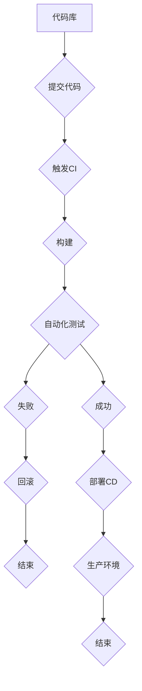

                 

### 第一部分：持续集成与部署基础

持续集成（Continuous Integration，简称CI）和持续部署（Continuous Deployment，简称CD）是现代软件开发中不可或缺的实践。这些实践通过自动化构建、测试和部署过程，显著提高了软件交付的速度和质量。本部分将详细介绍持续集成与部署的基础知识，包括其概念、优势以及常见的模式。

#### 1.1 持续集成与持续部署的概念

持续集成（CI）是指软件开发过程中，将代码定期合并到共享的主分支，并通过自动化测试确保代码质量的过程。持续集成的主要目标是及早发现并修复代码中的错误，以减少集成时的风险。

持续部署（CD）是持续集成的延伸，它通过自动化流程将代码部署到生产环境。持续部署可以确保代码一旦通过测试，立即进入生产环境，从而实现快速交付。

**Mermaid 流程图：**



#### 1.2 持续集成与持续部署的优势

持续集成与持续部署的优势主要体现在以下几个方面：

1. **加快开发周期**：自动化流程显著减少了手动操作，加快了开发周期，提高了开发效率。
2. **提高代码质量**：通过频繁的集成和自动化测试，可以及时发现并修复错误，确保代码质量。
3. **降低风险**：自动化的集成和部署流程减少了人为错误，降低了集成和部署过程中的风险。
4. **提高团队协作效率**：持续集成与持续部署鼓励团队成员更频繁地协作和沟通，提高了团队的协作效率。

#### 1.3 持续集成与持续部署的常见模式

持续集成与持续部署的常见模式主要包括以下几种：

1. **单分支模式**：所有开发者都在同一分支上工作，每次提交都会触发CI/CD流程。
2. **多分支模式**：每个分支都有自己的CI/CD流程，例如，主分支和开发分支分别有不同的测试和部署策略。
3. **分布式模式**：在不同的环境中进行构建和部署，例如，开发环境、测试环境和生产环境。

通过以上步骤，我们已经建立了对持续集成与持续部署的基础理解。在接下来的章节中，我们将深入探讨持续集成的理论基础、持续部署的理论基础以及具体的持续集成与部署工具，帮助读者更好地掌握这些关键实践。

### 第2章：持续集成理论基础

持续集成（Continuous Integration，简称CI）是现代软件开发中的一项核心实践。它通过自动化构建、测试和部署过程，确保代码质量并加快开发周期。本章将详细介绍持续集成的基础理论，包括版本控制系统的使用、构建工具的选择与应用以及持续集成的工作流程。

#### 2.1 版本控制系统的使用

版本控制系统（Version Control System，简称VCS）是持续集成的重要工具之一，它用于管理和追踪源代码的变化。目前，常用的版本控制系统包括Git、SVN和Mercurial等。

**Git的基本命令：**

```bash
git init  # 初始化仓库
git add .  # 添加当前目录下的所有文件到暂存区
git commit -m "Initial commit"  # 提交代码
git push  # 推送到远程仓库
git pull  # 拉取远程仓库的最新代码
```

**版本控制的重要性：**

1. **代码管理**：版本控制系统可以记录每次提交的详细信息，便于追溯代码历史。
2. **协同开发**：版本控制系统支持多人协作，确保代码的一致性和完整性。
3. **代码备份**：版本控制系统提供了代码的备份机制，防止代码丢失。

#### 2.2 构建工具的选择与应用

构建工具用于自动化构建软件项目，将源代码编译成可运行的程序。常见的构建工具包括Maven、Gradle和NPM等。

**Maven的基本命令：**

```bash
mvn clean  # 清理构建生成的文件
mvn compile  # 编译源代码
mvn test  # 运行测试用例
mvn package  # 打包成可运行的程序
```

**构建工具的优势：**

1. **自动化**：构建工具可以自动化构建过程，减少手动操作。
2. **可重复性**：构建过程是标准化的，确保每次构建的结果一致。
3. **依赖管理**：构建工具可以管理项目依赖，确保依赖的版本正确。

#### 2.3 持续集成的工作流程

持续集成的工作流程包括代码提交、自动化构建、测试运行和反馈结果等步骤。

**持续集成工作流程：**

1. **代码提交**：开发人员将代码提交到版本控制系统。
2. **触发CI**：每次提交都会触发CI流程，开始构建和测试。
3. **自动化构建**：构建工具将源代码编译成可运行的程序。
4. **测试运行**：运行自动化测试用例，检查代码质量。
5. **反馈结果**：测试结果会反馈给开发人员，如果测试失败，会暂停CI流程。

**伪代码示例：**

```python
def CI_workflow():
    code_submitted = True
    if code_submitted:
        build_project()
        run_tests()
        if test_passed:
            print("CI succeeded")
        else:
            print("CI failed, fix the issues and try again")
```

通过以上步骤，我们已经了解了持续集成的基础理论。在接下来的章节中，我们将继续探讨持续部署的理论基础，帮助读者全面掌握持续集成与持续部署的核心概念和实践。

### 第3章：持续部署理论基础

持续部署（Continuous Deployment，简称CD）是持续集成（Continuous Integration，简称CI）的延伸，它通过自动化流程将代码部署到生产环境。持续部署的目标是确保代码一旦通过测试，立即进入生产环境，从而实现快速交付。本章将详细探讨持续部署的理论基础，包括部署策略的选择、自动化部署工具的介绍以及部署流水线的设计。

#### 3.1 部署策略的选择

部署策略的选择对于持续部署的成功至关重要。常见的部署策略包括蓝绿部署、灰度发布和滚动更新。

**蓝绿部署（Blue-Green Deployment）：**

蓝绿部署是指同时运行两个相同环境（蓝环境和绿环境），将新版本部署到绿环境，然后逐步切换流量到绿环境。如果新版本出现故障，可以快速回滚到蓝环境。

**伪代码示例：**

```python
def blue_green_deployment():
    if new_version_ready:
        deploy_to_green_environment()
        if health_check_green_environment():
            switch_traffic_to_green_environment()
        else:
            rollback_to_blue_environment()
```

**灰度发布（Gray Release）：**

灰度发布是指将新版本部署到一小部分用户，观察其运行情况，然后逐步扩大范围。这种方法可以降低新版本上线时的风险。

**伪代码示例：**

```python
def gray_release():
    if new_version_ready:
        deploy_to_staging_environment()
        monitor_staging_environment()
        if no_issues_detected:
            expand_to_production_environment()
```

**滚动更新（Rolling Update）：**

滚动更新是指逐个更新实例，而不是一次性替换所有实例。这种方法可以确保在更新过程中，系统仍然可用。

**伪代码示例：**

```python
def rolling_update():
    for instance in production_environment:
        if instance_is_idle(instance):
            update_instance(instance)
```

#### 3.2 自动化部署工具的介绍

自动化部署工具是持续部署的关键组件，它们可以简化部署过程，提高部署效率。常用的自动化部署工具包括Jenkins、Ansible、Puppet和Chef等。

**Jenkins：**

Jenkins是一个开源的自动化服务器，支持多种插件，可以轻松实现持续集成与持续部署。Jenkins的主要优点是社区支持强、功能丰富。

**Ansible：**

Ansible是一个简化的IT自动化和配置管理工具，使用SSH协议进行远程管理。Ansible的主要优点是配置简单、无服务器管理。

**Puppet：**

Puppet是一个开源的配置管理和部署工具，通过定义基础设施的“状态”，自动化管理服务器配置。Puppet的主要优点是自动化程度高、支持广泛的平台。

**Chef：**

Chef是一个自动化平台，用于配置和管理基础设施。Chef的主要优点是支持大规模部署、灵活的配置管理。

#### 3.3 部署流水线的设计

部署流水线（Deployment Pipeline）是指从代码提交到生产环境的一系列自动化步骤。设计部署流水线时，需要考虑构建、测试、部署和监控等环节。

**部署流水线设计步骤：**

1. **构建阶段**：使用构建工具构建代码，生成可执行的程序。
2. **测试阶段**：运行自动化测试用例，确保代码质量。
3. **部署阶段**：将代码部署到测试环境或生产环境。
4. **监控阶段**：监控部署后的系统性能和稳定性。

**伪代码示例：**

```python
def deployment_pipeline():
    if code_submitted:
        build_project()
        run_tests()
        if test_passed:
            deploy_to_environment()
            monitor_environment()
        else:
            print("Tests failed, deployment halted")
```

通过以上步骤，我们已经探讨了持续部署的理论基础。在下一章中，我们将介绍各种持续集成与部署工具，帮助读者选择适合自己项目的工具，并了解其应用方法。

### 第4章：持续集成与部署工具

在持续集成（CI）与持续部署（CD）的实施过程中，选择合适的工具至关重要。本章将详细介绍几个主流的持续集成与部署工具：Jenkins、GitLab CI/CD和Azure DevOps，并展示它们在实际项目中的应用。

#### 4.1 Jenkins的使用

Jenkins是一个开源的自动化服务器，支持多种插件，适用于各种类型的软件开发项目。Jenkins的主要功能包括：

- **自动化构建**：Jenkins可以自动执行构建脚本，编译代码并打包成可执行的程序。
- **自动化测试**：Jenkins可以运行自动化测试脚本，确保代码质量。
- **自动化部署**：Jenkins可以将构建结果部署到测试环境或生产环境。

**Jenkins基本配置：**

1. **安装Jenkins：** 在服务器上安装Jenkins，可以通过命令行或Web界面进行。
2. **创建构建任务：** 在Jenkins界面创建新的构建任务，配置构建脚本和测试脚本。
3. **配置触发器：** 配置触发器，使Jenkins在代码提交时自动执行构建任务。

**伪代码示例：**

```python
from jenkins import Jenkins

def configure_jenkins():
    jenkins = Jenkins('http://your-jenkins-url')
    jenkins.create_job('MyProject', {
        'script': """
            sh 'mvn clean install'
            sh 'mvn test'
        """
    })
    jenkins.build_job('MyProject')
```

**Jenkins使用案例：**

某创业公司使用Jenkins进行Java项目的持续集成与部署。他们设置了每日构建任务，并在代码提交后自动执行测试和部署。这样，他们可以确保每天都能获得最新的、经过测试的版本。

#### 4.2 GitLab CI/CD的应用

GitLab CI/CD是一个集成在GitLab中的持续集成与持续部署工具，具有简单易用、开源和功能强大的特点。GitLab CI/CD的主要功能包括：

- **自动化构建**：GitLab CI/CD可以根据`.gitlab-ci.yml`文件自动化构建代码。
- **自动化测试**：GitLab CI/CD可以运行自动化测试脚本，确保代码质量。
- **自动化部署**：GitLab CI/CD可以将构建结果部署到不同的环境中。

**GitLab CI/CD基本配置：**

1. **配置`.gitlab-ci.yml`文件：** 在GitLab项目的设置中，配置`.gitlab-ci.yml`文件，定义构建、测试和部署的任务。
2. **触发CI流程：** 每次代码提交或合并请求，GitLab CI/CD会自动执行配置的任务。

**`.gitlab-ci.yml`示例：**

```yaml
image: java:8

stages:
  - build
  - test
  - deploy

build:
  stage: build
  script:
    - mvn clean install

test:
  stage: test
  script:
    - mvn test

deploy:
  stage: deploy
  script:
    - echo "Deploying to production environment"
  only:
    - master
```

**GitLab CI/CD使用案例：**

某初创团队使用GitLab CI/CD进行Web应用的开发和部署。他们通过`.gitlab-ci.yml`文件配置了自动化构建、测试和部署流程，确保每次代码提交都能得到及时的处理和反馈。

#### 4.3 Azure DevOps的部署实践

Azure DevOps是一个由微软提供的集成平台，提供持续集成、持续部署和项目管理等功能。Azure DevOps的主要功能包括：

- **自动化构建**：Azure DevOps可以自动化编译和打包代码。
- **自动化测试**：Azure DevOps可以运行自动化测试，包括单元测试和集成测试。
- **自动化部署**：Azure DevOps支持多种部署选项，包括容器部署、云服务部署和虚拟机部署。

**Azure DevOps基本配置：**

1. **创建项目：** 在Azure DevOps中创建项目，并添加代码仓库。
2. **配置管道：** 在项目中配置持续集成和持续部署管道，定义构建、测试和部署的任务。
3. **配置部署策略：** 根据项目需求，配置部署策略，例如蓝绿部署或滚动更新。

**部署管道示例：**

```yaml
trigger:
- trigger:
    name: 'manual'
    type: 'PullRequest'
- trigger:
    name: 'manual'
    type: 'Push'

pool:
  name: 'Agent Pool'
  demands:
    - agent池名称：'Linux'

steps:
- checkout:
    name: '检出代码'
    refspec: 'master'
    autoCancel: true

- task: 'Maven Build'
  name: '构建项目'
  inputs:
    MavenVersion: '3.6.3'
    commands: |
      mvn clean install
    when: 'succeeded'

- task: 'Run Tests'
  name: '运行测试'
  inputs:
    MavenVersion: '3.6.3'
    commands: |
      mvn test
  only:
    - succeeded

- task: 'Publish Artifacts'
  name: '发布构建结果'
  inputs:
    artifactsFolder: 'target'

- deploy:
  name: '部署到生产环境'
  inputs:
    environmentName: 'production'
    serverUrl: 'https://yourserver.com'
    serverAdminCredentialId: 'admin-credential'
    applicationName: 'yourapplication'
    artifactFiles:
    - path: 'target/*.war'
```

**Azure DevOps使用案例：**

某企业使用Azure DevOps进行其Web应用的持续集成与持续部署。他们通过配置管道实现了自动化构建、测试和部署，确保每次代码提交都能得到及时的处理和反馈。

通过本章的介绍，读者可以了解到Jenkins、GitLab CI/CD和Azure DevOps等持续集成与部署工具的基本使用方法和实际应用案例。选择合适的工具并正确配置，是实现持续集成与持续部署的关键。

### 第5章：持续集成与部署实践

在了解了持续集成（CI）与持续部署（CD）的理论基础后，本章节将通过具体的实践案例，展示如何在实际创业公司中实施这些技术。我们将分析持续集成实践和持续部署实践，并讨论一些实际应用技巧。

#### 5.1 创业公司持续集成实践案例分析

**案例背景：**

某创业公司致力于开发一款基于云计算的财务管理应用。随着项目的进展，公司意识到采用持续集成是提高开发效率和代码质量的关键。

**实施步骤：**

1. **选择版本控制系统：** 公司选择了Git作为版本控制系统，以方便团队协作和代码管理。
2. **配置构建工具：** 公司决定使用Maven作为构建工具，以便自动化编译和打包Java项目。
3. **设置Jenkins：** 公司在服务器上安装了Jenkins，并创建了一个名为“FinanceApp”的构建任务。
4. **配置构建脚本：** 公司编写了一个简单的构建脚本，用于执行Maven命令，编译和打包项目。
5. **集成自动化测试：** 公司编写了多个自动化测试脚本，包括单元测试和集成测试，并将它们集成到Jenkins构建任务中。
6. **配置触发器：** 公司设置了Jenkins的触发器，使其在每次代码提交时自动执行构建和测试。

**实现效果：**

通过实施持续集成，公司能够及时发现并修复代码中的错误，显著提高了代码质量。此外，自动化流程减少了手动操作，加快了开发周期。

**代码示例：**

```bash
#!/bin/bash
mvn clean install
mvn test
```

```java
@Test
public void testAddition() {
    assertEquals(5, Calculator.add(2, 3));
}
```

#### 5.2 创业公司持续部署实践案例分析

**案例背景：**

在成功实施持续集成后，该创业公司开始考虑如何实现持续部署，以便更快速地将代码部署到生产环境。

**实施步骤：**

1. **选择部署策略：** 公司决定采用蓝绿部署策略，以降低新版本上线时的风险。
2. **配置GitLab CI/CD：** 公司在GitLab项目中配置了`.gitlab-ci.yml`文件，定义了构建、测试和部署的任务。
3. **配置部署脚本：** 公司编写了一个简单的部署脚本，用于将构建结果部署到生产环境。
4. **设置触发器：** 公司设置了GitLab CI/CD的触发器，使其在每次代码提交或合并请求时自动执行部署任务。

**`.gitlab-ci.yml`示例：**

```yaml
stages:
  - build
  - test
  - deploy

image: java:8

build:
  stage: build
  script:
    - mvn clean install

test:
  stage: test
  script:
    - mvn test

deploy:
  stage: deploy
  script:
    - echo "Deploying to production environment"
    - scp -r target/*.war production-server:/var/www/financeapp.war
  only:
    - master
```

**实现效果：**

通过实施持续部署，公司能够快速地将经过测试的代码部署到生产环境，从而缩短了软件交付周期。同时，蓝绿部署策略确保了新版本的上线过程平稳无误。

#### 5.3 持续集成与部署的实际应用技巧

**1. 代码质量第一：** 在持续集成和部署过程中，确保代码质量是首要任务。自动化测试是保证代码质量的关键。

**2. 合理配置自动化测试：** 根据项目需求，配置适当的自动化测试，包括单元测试、集成测试和端到端测试。

**3. 灾难恢复计划：** 实施持续集成和部署时，应制定灾难恢复计划，以便在发生错误时能够快速恢复。

**4. 安全性：** 在持续集成和部署过程中，要关注安全性问题，确保代码和数据的完整性。

**5. 持续优化：** 持续集成和部署是一个不断优化的过程。定期评估和改进流程，以提高效率和质量。

通过以上实践案例和应用技巧，创业公司可以更好地实施持续集成与持续部署，从而实现快速交付高质量软件。

### 第6章：高级持续集成实践

在持续集成（CI）的基础上，高级持续集成实践进一步优化了集成流程，提高了开发效率和质量。本章将介绍高级持续集成策略、工具与平台，并探讨常见问题与解决方案。

#### 6.1 高级持续集成策略

高级持续集成策略包括以下内容：

**1. 多分支模式（Multibranch Pipeline）：**

多分支模式允许每个分支都有自己的CI流程，从而提高开发效率。例如，主分支、开发分支、特性分支等都可以有独立的CI流程。

**2. 预发布环境（Pre-production Environment）：**

在正式发布前，创建预发布环境，进行额外的测试和验证，确保新版本在上线前的质量。

**3. 容器化（Containerization）：**

使用容器化技术（如Docker）进行构建和测试，提高环境的可移植性和一致性。

**4. 静态代码分析（Static Code Analysis）：**

引入静态代码分析工具，如SonarQube，对代码进行静态分析，及时发现潜在的问题和缺陷。

**伪代码示例：**

```python
def advanced_CI_strategy():
    # 配置多分支模式
    configure_multibranch_pipeline()

    # 创建预发布环境
    create_preproduction_environment()

    # 使用容器化技术
    use_docker_for_build_and_test()

    # 集成静态代码分析
    integrate_static_code_analysis()
```

#### 6.2 高级持续集成工具与平台

以下是一些高级持续集成工具与平台：

**1. Jenkins X：**

Jenkins X 是基于Kubernetes的持续集成和持续部署解决方案，提供了开箱即用的持续集成和部署流水线。

**2. GitLab：**

GitLab 是一个全面的DevOps平台，提供持续集成和持续部署功能，支持多分支模式、容器化等高级特性。

**3. GitLab CI/CD：**

GitLab CI/CD 是GitLab的一部分，提供自动化构建、测试和部署功能，支持自定义CI/CD流水线。

**伪代码示例：**

```python
from jenkins_x import JenkinsX
from gitlab import GitLab

def use_advanced_CI_tools():
    jx = JenkinsX('http://your-jenkins-x-url')
    gl = GitLab('http://your-gitlab-url')

    # 使用Jenkins X
    jx.create_pipeline('my-app', 'master')

    # 使用GitLab CI/CD
    gl.create_ci_config('my-app', """
stages:
  - build
  - test
  - deploy

build:
  stage: build
  script:
    - docker build -t my-app .

test:
  stage: test
  script:
    - docker run --rm my-app

deploy:
  stage: deploy
  script:
    - docker push my-app
    - kubectl set image deployment/my-app my-app=my-app:latest
""")
```

#### 6.3 高级持续集成的常见问题与解决方案

**1. 问题：构建失败频繁**

**解决方案：** 
- **改进代码质量：** 通过静态代码分析和代码审查，减少构建失败。
- **优化构建脚本：** 精简构建脚本，避免不必要的依赖和步骤。

**2. 问题：测试覆盖率不足**

**解决方案：** 
- **增加测试用例：** 添加更多的测试用例，提高测试覆盖率。
- **改进测试策略：** 设计更全面的测试策略，包括单元测试、集成测试和端到端测试。

**3. 问题：环境不一致**

**解决方案：** 
- **使用容器化技术：** 使用容器化技术确保开发、测试和生产环境的一致性。
- **统一配置管理：** 使用配置管理工具（如Ansible、Puppet）管理环境配置。

通过高级持续集成策略、工具与平台，以及解决常见问题，创业公司可以进一步优化持续集成流程，提高开发效率和质量。

### 第7章：高级持续部署实践

在了解了持续集成的高级实践后，本章将深入探讨高级持续部署（CD）的实践。高级持续部署通过更复杂的策略和工具，进一步提高了软件交付的效率和可靠性。本章将介绍高级持续部署策略、工具与平台，并讨论高级持续部署的常见问题与解决方案。

#### 7.1 高级持续部署策略

高级持续部署策略主要包括以下几种：

**1. 蓝绿部署（Blue-Green Deployment）：**

蓝绿部署是一种无停机部署策略，通过同时运行两个相同版本的环境（蓝环境和绿环境），将新版本部署到绿环境，然后逐步切换流量到绿环境。这种方法可以确保新版本的上线过程平稳，同时降低风险。

**2. 灰度发布（Gray Release）：**

灰度发布是一种逐步推出新版本的策略，通过将新版本部署到一小部分用户，观察其运行情况，然后逐步扩大范围。这种方法可以降低新版本上线时的风险，并逐步调整部署策略。

**3. 滚动更新（Rolling Update）：**

滚动更新是一种逐个更新实例的部署策略，确保在更新过程中，系统仍然可用。这种方法适用于需要高可用性的系统。

**伪代码示例：**

```python
def blue_green_deployment():
    if new_version_ready:
        deploy_to_green_environment()
        if health_check_green_environment():
            switch_traffic_to_green_environment()
        else:
            rollback_to_blue_environment()

def gray_release():
    if new_version_ready:
        deploy_to_staging_environment()
        monitor_staging_environment()
        if no_issues_detected:
            expand_to_production_environment()

def rolling_update():
    for instance in production_environment:
        if instance_is_idle(instance):
            update_instance(instance)
```

#### 7.2 高级持续部署工具与平台

以下是一些高级持续部署工具与平台：

**1. Kubernetes：**

Kubernetes 是一个开源的容器编排平台，提供了丰富的部署和管理工具，支持蓝绿部署、滚动更新等高级部署策略。

**2. Docker：**

Docker 是一种容器化技术，通过将应用程序及其依赖打包到容器中，确保开发、测试和生产环境的一致性。

**3. AWS：**

AWS 提供了全面的云服务和部署工具，包括Elastic Beanstalk、EC2等，支持多种部署策略和自动化工具。

**伪代码示例：**

```python
from kubernetes import Kubernetes

def use_kubernetes_for_deployment():
    k8s = Kubernetes('http://your-kubernetes-url')
    deployment = k8s.create_deployment('my-app', {
        'image': 'my-app:latest',
        'replicas': 3
    })

def use_docker_for_deployment():
    docker.build_image('my-app:latest')
    docker.push_image('my-app:latest')

def use_aws_for_deployment():
    aws.deploy_to_ec2('my-app', 'my-app-image')
```

#### 7.3 高级持续部署的常见问题与解决方案

**1. 问题：部署过程中出现服务中断**

**解决方案：**
- **使用滚动更新策略：** 逐步更新实例，确保服务可用。
- **引入负载均衡器：** 分散流量，减少对单个实例的依赖。

**2. 问题：部署速度缓慢**

**解决方案：**
- **优化部署脚本：** 精简部署脚本，减少不必要的步骤。
- **使用缓存策略：** 缓存依赖项，减少部署时间。

**3. 问题：部署过程中出现错误**

**解决方案：**
- **增加日志记录：** 详细记录部署过程中的日志，便于排查问题。
- **自动化故障恢复：** 在部署过程中，自动化故障恢复机制，快速处理错误。

通过高级持续部署策略、工具与平台，以及解决常见问题，创业公司可以进一步提升软件交付的效率和可靠性。高级持续部署不仅是技术上的提升，更是对团队协作和文化建设的一种挑战。

### 第8章：持续集成与部署性能优化

持续集成（CI）与持续部署（CD）的性能优化是确保系统高效运行的关键。本章将探讨性能优化的重要性，介绍性能优化方法和工具，以及持续集成与部署的性能测试。

#### 8.1 性能优化的重要性

性能优化的重要性体现在以下几个方面：

1. **提高用户体验**：快速响应的系统能提供更好的用户体验。
2. **降低维护成本**：优化后的系统运行更稳定，维护成本更低。
3. **提升团队效率**：性能优化减少系统瓶颈，提高团队工作效率。

#### 8.2 性能优化方法与工具

以下是一些常见的性能优化方法和工具：

**1. 引入负载均衡器：**

负载均衡器可以分散流量，提高系统的处理能力。常用的负载均衡器包括Nginx、HAProxy等。

**2. 实施缓存策略：**

缓存可以减少数据库的读取操作，提高系统响应速度。常用的缓存工具包括Redis、Memcached等。

**3. 使用异步处理：**

异步处理可以将长时间运行的任务交给后台处理，提高系统的响应速度。

**4. 性能监控和告警：**

性能监控工具可以实时监控系统性能，及时发现和处理性能问题。常用的性能监控工具包括Prometheus、Grafana等。

**伪代码示例：**

```python
import redis

# 使用Redis进行缓存
cache = redis.StrictRedis(host='localhost', port=6379, db=0)

def get_user_data(user_id):
    if cache.exists(user_id):
        return cache.get(user_id)
    else:
        data = fetch_data_from_database(user_id)
        cache.set(user_id, data)
        return data

# 使用Prometheus进行性能监控
from prometheus_client import start_http_server, Summary

REQUEST_TIME = Summary('request_processing_seconds', 'Time spent processing request')

@REQUEST_TIME.time()
def process_request(request):
    # 处理请求的代码
    pass
```

#### 8.3 持续集成与部署的性能测试

性能测试是确保系统稳定运行的重要环节。以下是一些常见的性能测试方法：

**1. 压力测试（Stress Testing）：**

压力测试是通过模拟高并发场景，评估系统在高负载下的性能。常用的工具包括JMeter、LoadRunner等。

**2. 压力测试案例：**

```python
import time
import requests

def stress_test(url, num_requests):
    start_time = time.time()
    for i in range(num_requests):
        response = requests.get(url)
        assert response.status_code == 200
    end_time = time.time()
    print(f"Total time for {num_requests} requests: {end_time - start_time} seconds")
```

**3. 压力测试示例：**

```python
stress_test('http://your-api-url.com', 1000)
```

**4. 压力测试结果分析：**

通过分析压力测试结果，可以识别系统瓶颈，优化系统性能。

**5. 性能监控与告警：**

在性能测试过程中，结合性能监控工具，实时监控系统性能，及时发现和处理性能问题。

**6. 性能优化迭代：**

根据性能测试结果，持续优化系统性能，迭代改进。

通过性能优化方法和工具，以及持续集成与部署的性能测试，创业公司可以确保系统高效稳定运行，为用户提供更好的服务。

### 第9章：持续集成与部署的安全性

在持续集成（CI）与持续部署（CD）的实践中，安全性至关重要。本章将探讨安全性在持续集成与部署中的重要性，分析常见的安全威胁与防护措施，并介绍实际的安全实践。

#### 9.1 安全性在持续集成与部署中的重要性

安全性在持续集成与部署中的重要性体现在以下几个方面：

1. **保护代码和数据的完整性**：确保代码和数据的完整，防止未经授权的修改和泄露。
2. **防范潜在的安全漏洞**：通过安全检查和漏洞扫描，及时发现并修复潜在的安全漏洞。
3. **确保生产环境的稳定性**：安全措施可以减少生产环境中的故障，提高系统的稳定性。

#### 9.2 常见安全威胁与防护措施

以下是一些常见的安全威胁与相应的防护措施：

**1. 代码篡改**

**威胁**：攻击者篡改代码，插入恶意代码。

**防护措施**：
- **代码审查**：引入代码审查机制，确保代码质量。
- **静态代码分析**：使用静态代码分析工具，扫描代码中的安全漏洞。

**2. 数据泄露**

**威胁**：敏感数据在传输和存储过程中泄露。

**防护措施**：
- **数据加密**：对敏感数据进行加密，确保数据安全。
- **安全传输**：使用HTTPS等安全协议进行数据传输。

**3. 未授权访问**

**威胁**：未经授权的用户访问系统。

**防护措施**：
- **身份验证**：引入多因素身份验证机制，提高访问安全性。
- **权限控制**：实施严格的权限控制策略，限制用户访问范围。

**4. 恶意软件感染**

**威胁**：系统感染恶意软件，导致数据损坏或系统崩溃。

**防护措施**：
- **防火墙**：配置防火墙，防止恶意流量进入系统。
- **入侵检测系统**：部署入侵检测系统，实时监控网络流量和系统行为。

#### 9.3 持续集成与部署的安全实践

以下是一些实际的安全实践：

**1. 实施安全培训**

定期对团队成员进行安全培训，提高他们的安全意识和应对能力。

**2. 安全审计**

定期进行安全审计，评估系统的安全性，发现潜在的安全漏洞。

**3. 及时更新和安全补丁**

及时更新系统和应用程序，应用安全补丁，防止漏洞被利用。

**4. 监控和告警**

部署监控和告警系统，实时监控系统的运行状态，及时发现和处理安全事件。

**伪代码示例：**

```python
from security_tools import CodeScanner, DataEncryptor, Firewall

# 实施代码审查
code_scanner.scan_code('source_code')

# 加密敏感数据
data_encryptor.encrypt_data('sensitive_data')

# 配置防火墙
firewall.enable_firewall()

# 监控和告警
monitor_and_alert_system.raise_alert_if_anomaly_detected()
```

通过以上安全实践，创业公司可以确保持续集成与部署过程中的安全性，保护代码和数据的完整性，防范潜在的安全威胁。

### 第10章：持续集成与部署的最佳实践

在持续集成（CI）与持续部署（CD）的实践中，遵循最佳实践能够提高开发效率、保证代码质量和系统稳定性。本章将介绍创业公司持续集成与部署的最佳实践，讨论团队协作和持续集成与部署文化建设。

#### 10.1 创业公司持续集成与部署的最佳实践

**1. 建立持续集成与部署流程**

制定明确的CI/CD流程，明确各环节的职责和任务，确保流程的规范化。

**2. 实施代码审查**

引入代码审查机制，确保代码质量，减少漏洞和错误。

**3. 定期更新和优化工具**

根据项目需求和技术发展，定期更新和优化CI/CD工具，提高效率和稳定性。

**4. 实施自动化测试**

编写和执行自动化测试，确保代码质量和功能完整性。

**5. 安全性保障**

在CI/CD流程中集成安全性检查，确保代码和数据的完整性。

**伪代码示例：**

```python
from CI_CD_tools import CodeReview, AutomatedTesting, SecurityCheck

# 实施代码审查
code_review.perform_code_review()

# 实施自动化测试
automated_testing.run_tests()

# 进行安全性检查
security_check.perform_security_check()
```

**6. 性能优化**

定期进行性能测试和优化，确保系统高效稳定运行。

**7. 监控和告警**

部署监控和告警系统，实时监控系统性能和安全状态，及时处理异常。

**伪代码示例：**

```python
from monitoring import PerformanceMonitor, AlertSystem

# 性能监控
performance_monitor.check_performance()

# 告警系统
alert_system.raise_alert_if_performance_issue()
```

#### 10.2 持续集成与部署的团队协作

**1. 跨职能团队**

建立跨职能团队，包括开发、测试、运维等角色，提高协作效率。

**2. 角色明确**

明确团队成员的角色和职责，确保各环节的顺利执行。

**3. 沟通与协作**

定期举行会议和代码评审，促进团队成员之间的沟通和协作。

**伪代码示例：**

```python
from team Collaboration import TeamMeeting, CodeReviewSession

# 团队会议
team_meeting.schedule_meeting()

# 代码评审
code_review_session.perform_code_reviews()
```

#### 10.3 持续集成与部署的文化建设

**1. 持续学习**

鼓励团队成员持续学习新技术和最佳实践，提高团队整体技术水平。

**2. 透明度**

保持流程和信息的透明度，让团队成员了解CI/CD的进展和效果。

**3. 反馈机制**

建立反馈机制，及时收集团队成员的意见和建议，持续改进流程。

**伪代码示例：**

```python
from feedback import FeedbackSystem

# 收集反馈
feedback_system.collect_feedback()

# 处理反馈
feedback_system.process_feedback()
```

通过以上最佳实践、团队协作和持续集成与部署文化建设，创业公司可以建立高效的CI/CD流程，提高开发效率和质量，确保系统稳定运行。

## 附录A：持续集成与部署工具资源

在持续集成（CI）与持续部署（CD）的实施过程中，选择合适的工具和资源至关重要。以下是一些主流的持续集成与部署工具、开源工具推荐以及相关社区资源。

### A.1 主流持续集成与部署工具对比

**Jenkins vs GitLab CI/CD vs Azure DevOps**

| 特点 | Jenkins | GitLab CI/CD | Azure DevOps |
| --- | --- | --- | --- |
| 开源 | 是 | 是 | 否 |
| 社区支持 | 强大 | 强大 | 较强 |
| 扩展性 | 高 | 高 | 较高 |
| 易用性 | 中等 | 高 | 高 |
| 功能丰富性 | 高 | 高 | 高 |
| 集成性 | 强 | 强 | 强 |

**对比维度：**
- **开源**：是否提供免费的开源版本。
- **社区支持**：社区活跃度和资源丰富度。
- **扩展性**：插件和扩展工具的数量和多样性。
- **易用性**：用户界面的友好程度和上手难度。
- **功能丰富性**：支持的功能和自动化程度。
- **集成性**：与其他工具和平台的集成能力。

### A.2 开源持续集成与部署工具推荐

**1. Jenkins**

Jenkins 是一个强大的开源持续集成工具，支持多种插件，适用于各种开发环境。

**2. GitLab CI/CD**

GitLab CI/CD 是集成在GitLab中的持续集成与持续部署工具，易于配置和使用。

**3. GitHub Actions**

GitHub Actions 是GitHub提供的一款持续集成与持续部署工具，支持云原生应用开发。

**4. GitLab**

GitLab 是一个全面的DevOps平台，提供持续集成与持续部署功能。

**5. GitHub**

GitHub 是一个流行的代码托管平台，支持自定义CI/CD流程。

**6. GitLab Runner**

GitLab Runner 是GitLab CI/CD 的运行器，用于执行构建任务。

### A.3 持续集成与部署社区资源

**1. 持续集成与持续部署官方文档**

- Jenkins: [https://www.jenkins.io/documentation/](https://www.jenkins.io/documentation/)
- GitLab CI/CD: [https://docs.gitlab.com/ci/](https://docs.gitlab.com/ci/)
- Azure DevOps: [https://docs.microsoft.com/en-us/azure/devops/pipelines/](https://docs.microsoft.com/en-us/azure/devops/pipelines/)

**2. 持续集成与持续部署社区论坛**

- Jenkins 用户论坛: [https://www.jenkins.io/discussion/](https://www.jenkins.io/discussion/)
- GitLab 用户论坛: [https://gitlab.com/gitlab-org/gitlab/-/issues](https://gitlab.com/gitlab-org/gitlab/-/issues)
- Azure DevOps 社区论坛: [https://forums.azure.com/](https://forums.azure.com/)

**3. 技术博客和在线教程**

- 持续集成与持续部署技术博客: [https://www.infoq.com/minibooks/continuous-integration](https://www.infoq.com/minibooks/continuous-integration)
- GitLab 官方教程: [https://about.gitlab.com/handbook/devops/](https://about.gitlab.com/handbook/devops/)
- Azure DevOps 教程: [https://docs.microsoft.com/en-us/learn/modules/deploy-app-azure-devops/](https://docs.microsoft.com/en-us/learn/modules/deploy-app-azure-devops/)

通过以上工具和资源的介绍，开发者可以更好地选择适合自己的持续集成与部署工具，并从中获取相关知识和支持。

### 附录B：持续集成与部署相关资料

#### B.1 常见问题解答

**1. 如何解决持续集成构建失败的问题？**

- **检查构建脚本：** 确保构建脚本正确无误，没有语法错误或逻辑错误。
- **检查依赖：** 确保所有依赖库和工具都已正确安装和配置。
- **增加日志记录：** 增加构建过程中的日志记录，便于排查问题。
- **缩小测试范围：** 如果测试用例过多，可以先缩小测试范围，逐步排查问题。

**2. 如何提高持续集成与部署的速度？**

- **优化构建脚本：** 精简构建脚本，避免不必要的步骤。
- **并行执行任务：** 在可能的情况下，并行执行构建和测试任务。
- **使用缓存：** 对缓存敏感的依赖和中间结果进行缓存，减少重复计算。

**3. 如何处理持续部署中的回滚问题？**

- **设置回滚策略：** 在部署过程中设置回滚策略，如蓝绿部署或灰度发布。
- **自动化回滚脚本：** 编写自动化回滚脚本，确保在出现问题时可以快速回滚。
- **监控和告警：** 部署后实时监控系统性能，及时发现和处理问题。

#### B.2 专业术语解释

**1. 持续集成（CI）**

持续集成是一种软件开发实践，通过频繁地合并代码并自动化测试，确保代码质量并加快开发周期。

**2. 持续部署（CD）**

持续部署是持续集成的延伸，通过自动化流程将代码部署到生产环境，实现快速交付。

**3. 构建脚本**

构建脚本是一系列命令和指令，用于自动化构建软件项目，包括编译、打包和部署等步骤。

**4. 版本控制系统（VCS）**

版本控制系统是一种用于管理和追踪源代码变化的工具，如Git、SVN等。

**5. 自动化测试**

自动化测试是使用自动化工具运行测试用例，以验证软件功能和性能的过程。

**6. 负载均衡器**

负载均衡器是一种网络设备，用于分散流量，提高系统的处理能力和可靠性。

**7. 容器化**

容器化是一种将应用程序及其依赖打包到容器中的技术，如Docker，提高环境的可移植性和一致性。

**8. 监控和告警**

监控和告警是实时监控系统性能和安全状态，及时发现和处理问题的过程。

#### B.3 相关技术文档与资料引用

- **Jenkins 官方文档**：[https://www.jenkins.io/documentation/](https://www.jenkins.io/documentation/)
- **GitLab CI/CD 官方文档**：[https://docs.gitlab.com/ci/](https://docs.gitlab.com/ci/)
- **Azure DevOps 官方文档**：[https://docs.microsoft.com/en-us/azure/devops/pipelines/](https://docs.microsoft.com/en-us/azure/devops/pipelines/)
- **持续集成与持续部署教程**：[https://www.infoq.com/minibooks/continuous-integration](https://www.infoq.com/minibooks/continuous-integration)
- **GitLab 官方教程**：[https://about.gitlab.com/handbook/devops/](https://about.gitlab.com/handbook/devops/)
- **Azure DevOps 教程**：[https://docs.microsoft.com/en-us/learn/modules/deploy-app-azure-devops/](https://docs.microsoft.com/en-us/learn/modules/deploy-app-azure-devops/)

通过这些常见问题解答、专业术语解释和相关技术文档的引用，开发者可以更好地理解持续集成与部署的相关知识，并在实际项目中运用这些技术。

