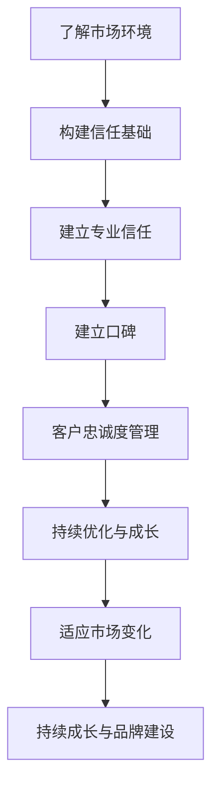

                 

# 《创业初期如何快速建立专业信任和口碑》

## 关键词：
创业初期，专业信任，口碑营销，客户体验，品牌建设，数据分析

## 摘要：
在竞争激烈的市场环境中，创业公司如何快速建立专业信任和口碑是成功的关键。本文从市场环境分析、构建信任基础、建立专业信任、口碑营销策略、客户忠诚度管理以及持续优化与成长等多个方面，详细探讨了创业初期如何有效地建立专业信任和口碑。通过案例分析和实际操作指南，为创业者提供了可操作的策略和工具，帮助他们在市场中脱颖而出。

## 目录大纲

## 第一部分：了解创业初期建立信任与口碑的重要性

### 第1章：创业初期的市场环境分析
#### 1.1 创业初期的市场挑战
#### 1.2 建立信任与口碑的关键性
#### 1.3 快速建立信任与口碑的必要性

### 第2章：构建信任的基础
#### 2.1 企业愿景与使命
#### 2.2 品牌形象塑造
#### 2.3 企业文化的传达

## 第二部分：建立专业信任

### 第3章：产品与服务质量
#### 3.1 提升产品质量的策略
#### 3.2 服务流程优化
#### 3.3 客户体验管理

### 第4章：有效的沟通策略
#### 4.1 沟通渠道的选择
#### 4.2 消息传递的清晰性
#### 4.3 频繁互动与及时响应

### 第5章：专业知识的展示
#### 5.1 专业知识的获取与提升
#### 5.2 在线展示平台的选择与利用
#### 5.3 成功案例分享

## 第三部分：建立口碑

### 第6章：口碑营销策略
#### 6.1 口碑营销的优势
#### 6.2 口碑传播的机制
#### 6.3 利用社交媒体进行口碑营销

### 第7章：客户忠诚度管理
#### 7.1 客户忠诚度的衡量
#### 7.2 提升客户忠诚度的策略
#### 7.3 客户反馈与改进

### 第8章：成功案例分析
#### 8.1 创业公司A的成功故事
#### 8.2 创业公司B的口碑营销策略
#### 8.3 创业公司C的客户忠诚度建设

## 第四部分：持续优化与成长

### 第9章：数据驱动决策
#### 9.1 数据收集与分析
#### 9.2 数据驱动的营销策略
#### 9.3 持续优化与调整

### 第10章：适应市场变化
#### 10.1 市场趋势分析
#### 10.2 竞争对手分析
#### 10.3 灵活调整策略

### 第11章：持续成长与品牌建设
#### 11.1 企业愿景的更新与传达
#### 11.2 品牌形象的持续维护
#### 11.3 创新与持续学习

## 附录

### 附录A：创业初期信任与口碑建设工具汇总
#### A.1 品牌建设工具
#### A.2 社交媒体分析工具
#### A.3 客户反馈收集与分析工具

### 附录B：参考书目与资源
#### B.1 基础理论书籍推荐
#### B.2 案例研究书籍推荐
#### B.3 在线资源推荐

**附录C：创业初期信任与口碑建设流程图**
- Mermaid 流程图展示

**附录D：核心算法原理讲解**
- 伪代码展示

**附录E：数学模型与公式解析**
- LaTeX 格式展示

**附录F：项目实战案例**
- 代码实现与分析

**附录G：开发环境搭建指南**
- 环境配置与工具使用说明

### 第一部分：了解创业初期建立信任与口碑的重要性

#### 第1章：创业初期的市场环境分析

**1.1 创业初期的市场挑战**

在创业初期，公司面临着诸多市场挑战。首先是资源限制，包括资金、人力和时间的限制。创业公司通常需要用有限的资源去完成大量的工作，这要求创业者必须具备高效的资源管理和决策能力。

其次是市场竞争的激烈性。在现代社会，几乎每个行业都充满了竞争者，新公司必须找到自己独特的市场定位和竞争优势。这不仅仅是产品或服务的竞争，还包括品牌的竞争、服务的竞争、体验的竞争等。

第三是用户信任问题。在创业初期，公司没有历史记录和用户基础，建立用户的信任是一个巨大的挑战。用户往往对新兴品牌持怀疑态度，需要通过多次接触和体验来建立信任。

最后是市场认知问题。新公司需要花费大量时间和资源来提高市场知名度，使潜在客户了解和认可其品牌和产品。

**1.2 建立信任与口碑的关键性**

在上述市场挑战中，建立专业信任和口碑显得尤为重要。信任是商业成功的基础，它直接影响用户是否选择使用你的产品或服务。而口碑则是建立信任的最好方式之一，它通过用户的真实反馈和推荐来传递信息，能够极大地提升品牌形象和用户忠诚度。

对于创业公司来说，建立专业信任和口碑有以下关键性作用：

- **增加市场份额**：信任和口碑能够吸引更多潜在客户，增加市场份额。
- **降低营销成本**：良好的口碑可以减少传统营销的成本，因为用户之间的推荐是免费的营销手段。
- **提高品牌认知度**：信任和口碑的建立能够提高品牌在市场中的认知度，使品牌更加突出。
- **增强用户忠诚度**：信任和口碑能够增强用户对品牌的忠诚度，降低用户流失率。
- **提高产品和服务质量**：为了维护良好的口碑，公司会不断优化产品和服务，从而提高整体质量。

**1.3 快速建立信任与口碑的必要性**

快速建立专业信任和口碑对于创业公司来说尤为关键。首先，在创业初期的市场环境中，时间是非常宝贵的资源。快速建立信任和口碑可以节省时间，让公司更快地进入正轨。

其次，快速建立信任和口碑可以帮助创业公司迅速占据市场份额。在竞争激烈的市场中，早一步建立信任和口碑可以让公司领先一步。

最后，快速建立信任和口碑可以减少公司的营销成本。一旦用户对品牌产生信任，他们会自发地传播品牌，从而降低公司的营销费用。

综上所述，创业初期建立专业信任和口碑是至关重要的，它能够帮助公司克服市场挑战，快速成长并在市场中脱颖而出。接下来，我们将进一步探讨如何构建信任的基础，以便为创业公司提供更加具体的策略和方法。

### 第二章：构建信任的基础

**2.1 企业愿景与使命**

企业愿景和使命是构建信任的基石。一个清晰、明确的企业愿景能够为公司和员工提供方向，使每个人都知道自己的工作对整体目标有何贡献。企业愿景不仅仅是公司长远发展的蓝图，它还传递了一种价值观和信念，帮助建立公司与客户之间的信任。

- **明确愿景与使命**：创业公司应明确自己的愿景和使命，并将其作为公司文化的重要组成部分。愿景可以描述公司的长期目标，使命则阐述公司存在的目的和价值。

- **传达给所有利益相关者**：企业愿景和使命需要传达给所有员工、合作伙伴和客户。通过定期的会议、培训和文化活动，确保每个人都理解并认同公司的愿景和使命。

- **在品牌宣传中突出展示**：在公司的网站、宣传材料和社交媒体上突出展示企业愿景和使命，让潜在客户在接触品牌时就能感受到公司的价值观和信念。

**2.2 品牌形象塑造**

品牌形象是公司在市场中的外在表现，它直接影响用户对公司的认知和感受。一个强大的品牌形象能够增加用户对公司的信任，有助于在竞争激烈的市场中脱颖而出。

- **一致的品牌视觉**：创业公司应设计一套统一的品牌视觉系统，包括标志、色彩、字体等，确保在各种渠道上保持一致性。这有助于建立品牌的统一形象，增强用户的记忆点。

- **优质的品牌内容**：创业公司应生产高质量的品牌内容，包括网站内容、博客文章、社交媒体帖子等。这些内容应传达出公司的专业性和对用户的关注，增强品牌可信度。

- **积极的社会责任**：参与社会活动和公益事业可以提升品牌形象，增加用户对公司的好感。创业公司可以公开承诺并积极参与环保、慈善等领域，树立积极的社会责任形象。

**2.3 企业文化的传达**

企业文化是公司内部的价值观和行为准则，它是构建员工和用户之间信任的桥梁。一个积极向上的企业文化能够增强员工凝聚力，提升工作效率，同时也有助于吸引和留住优秀人才。

- **营造积极的内部氛围**：创业公司应营造一个开放、包容和鼓励创新的工作环境。通过定期的团队建设活动、培训和激励计划，增强员工对公司的归属感和忠诚度。

- **鼓励员工参与**：让员工参与公司决策和品牌建设，增加他们的主人翁意识。例如，让员工参与到品牌口号、宣传材料的设计中，使他们感到自己的意见被重视。

- **通过言行一致树立榜样**：公司的领导层应通过言行一致的方式，树立良好的榜样。领导者的行为会直接影响员工的行为，如果领导者能够坚持诚信、责任和透明，员工也会更倾向于遵循这些原则。

通过明确企业愿景与使命、塑造品牌形象和传达企业文化，创业公司可以奠定建立专业信任的基础。接下来，我们将探讨如何通过产品与服务质量、有效的沟通策略和专业知识的展示来进一步建立专业信任。

### 第二部分：建立专业信任

#### 第3章：产品与服务质量

在创业初期，建立专业信任的关键在于提供高质量的产品和服务。优质的产品和服务不仅能够满足用户需求，还能在用户中树立良好的口碑，从而提高公司的信誉度。

**3.1 提升产品质量的策略**

1. **研发投入**：创业公司应投入足够的资源和精力在产品研发上，确保产品功能完善、性能稳定。通过持续的研发投入，不断优化产品，提升用户体验。

2. **严格质量控制**：建立严格的质量控制体系，确保产品在生产、测试和交付的每个环节都符合高质量标准。使用先进的测试工具和方法，及时发现和修复潜在问题。

3. **用户反馈**：定期收集和分析用户反馈，了解用户对产品的需求和意见。根据用户反馈进行产品迭代和改进，确保产品始终满足用户需求。

**3.2 服务流程优化**

1. **快速响应**：建立高效的服务流程，确保用户的问题和需求能够得到及时响应。提供多渠道的沟通方式，如电话、邮件、在线聊天等，方便用户随时联系公司。

2. **标准化服务**：制定标准化的服务流程，确保每位员工都能按照统一的标准为用户提供服务。通过培训提高员工的服务意识和技能，提高用户满意度。

3. **个性化服务**：在标准化服务的基础上，提供个性化的服务。了解用户的个性化需求，提供定制化的解决方案，增强用户的忠诚度。

**3.3 客户体验管理**

1. **用户体验设计**：从用户的角度出发，设计直观易用的产品界面和用户流程。通过用户测试和反馈，不断优化产品界面和用户流程，提升用户体验。

2. **售后支持**：提供优质的售后支持，解决用户在产品使用过程中遇到的问题。通过电话、在线支持、用户论坛等多种方式，确保用户能够得到及时和有效的帮助。

3. **情感营销**：在提供服务的过程中，注重与用户的情感互动。通过亲切、热情的服务态度，建立与用户的情感联系，增强用户的信任和忠诚度。

通过提升产品质量、优化服务流程和管理客户体验，创业公司可以显著提高用户满意度，从而在市场中建立专业信任。接下来，我们将探讨如何通过有效的沟通策略来进一步建立专业信任。

#### 第4章：有效的沟通策略

在建立专业信任的过程中，有效的沟通策略起着至关重要的作用。良好的沟通不仅能够增强公司与用户之间的联系，还能传递公司的专业知识和品牌价值。

**4.1 沟通渠道的选择**

1. **多渠道沟通**：创业公司应选择多种沟通渠道，以满足不同用户的需求。常见的沟通渠道包括电话、邮件、在线聊天、社交媒体等。通过多渠道沟通，可以提供更加便捷和高效的服务。

2. **专业化的沟通**：根据不同的用户群体和沟通目的，选择适当的沟通渠道。例如，对于技术性问题，可以通过在线聊天或电话沟通；而对于品牌宣传和用户教育，可以通过社交媒体和博客文章进行。

**4.2 消息传递的清晰性**

1. **简洁明了**：在沟通中，应尽量使用简洁明了的语言，避免使用复杂和冗长的句子。清晰的表达能够帮助用户更好地理解公司的意图，提高沟通效果。

2. **一致性**：公司内部的沟通应保持一致性，确保所有员工都能传达相同的消息。这有助于避免信息传递的误差，增强公司的一致性和专业性。

**4.3 频繁互动与及时响应**

1. **定期互动**：创业公司应定期与用户互动，了解他们的需求和意见。可以通过定期的问卷调查、用户访谈和在线讨论等方式，与用户保持紧密联系。

2. **及时响应**：在用户提出问题和需求时，应尽快响应，提供解决方案。及时响应不仅能够解决用户的问题，还能增强用户对公司的信任和满意度。

3. **个性化互动**：针对不同的用户，提供个性化的互动。了解用户的特点和需求，为他们提供定制化的沟通和服务，增强用户的归属感和忠诚度。

通过选择适当的沟通渠道、确保消息传递的清晰性以及频繁互动与及时响应，创业公司可以有效地建立专业信任。接下来，我们将探讨如何通过展示专业知识和成功案例来进一步提升专业信任。

#### 第5章：专业知识的展示

在竞争激烈的市场中，创业公司需要通过展示专业知识和成功案例来证明自身的实力，从而建立专业信任。以下是几个关键步骤和策略：

**5.1 专业知识的获取与提升**

1. **内部培训**：创业公司应定期组织内部培训，提升员工的技能和知识水平。通过培训，员工可以不断学习和更新知识，提高解决问题的能力。

2. **外部学习**：鼓励员工参加行业会议、研讨会和培训课程，与其他专业人士交流和学习。这些活动有助于员工了解行业动态和最新技术，提升公司的专业水平。

3. **知识共享**：建立知识共享平台，鼓励员工分享经验和知识。通过内部交流，公司可以积累更多的专业知识和最佳实践，提高整体的专业能力。

**5.2 在线展示平台的选择与利用**

1. **公司网站**：创业公司应建立专业、美观的网站，展示公司的产品和服务，以及专业知识和成功案例。网站应提供丰富的内容，包括产品介绍、技术文章、案例研究等，以吸引潜在客户的注意力。

2. **博客和文章**：创业公司可以开设博客，发布技术文章和行业分析。这些内容应展示公司的专业知识和见解，提高公司在行业中的影响力。

3. **社交媒体**：利用社交媒体平台，如LinkedIn、Twitter和Facebook等，发布专业内容和成功案例。这些平台可以帮助公司建立专业形象，扩大影响力。

**5.3 成功案例分享**

1. **案例研究**：撰写详细的案例研究，展示公司如何解决具体问题，取得显著成果。这些案例研究可以通过网站和社交媒体发布，吸引潜在客户的关注。

2. **客户推荐**：邀请满意的客户分享他们的使用体验和成功故事。这些推荐可以增强潜在客户的信任，提高购买意愿。

3. **行业奖项**：参加行业奖项评选，并获得奖项，可以提高公司在行业中的知名度和信誉度。这些奖项可以作为公司专业能力的有力证明。

通过获取和提升专业知识、选择合适的在线展示平台以及分享成功案例，创业公司可以有效地展示其专业能力，建立专业信任。接下来，我们将探讨如何通过口碑营销策略来进一步提升公司的市场地位。

### 第三部分：建立口碑

#### 第6章：口碑营销策略

口碑营销是创业公司建立品牌信任和扩大市场影响力的有效途径。通过用户之间的推荐和传播，口碑能够迅速提升公司的知名度和信誉度。

**6.1 口碑营销的优势**

1. **成本低**：口碑营销主要依赖于用户之间的自然传播，无需大量投入广告费用。

2. **可信度高**：用户之间的推荐通常更可信，因为用户更了解自己的需求和体验，能够提供真实的反馈。

3. **持久性强**：良好的口碑能够长期影响潜在客户，增加品牌忠诚度和市场份额。

4. **传播速度快**：口碑可以在短时间内迅速传播，特别是在社交媒体的帮助下，能够快速触及大量潜在客户。

**6.2 口碑传播的机制**

1. **用户体验**：用户满意度和产品质量是口碑传播的基础。只有用户真正体验到产品的价值和优势，才会主动进行推荐。

2. **情感驱动**：情感因素在口碑传播中起着关键作用。用户通常因为喜欢某个品牌或产品，而愿意分享给他人。

3. **社交网络**：社交网络是口碑传播的重要渠道。用户在社交媒体上分享体验和推荐，能够迅速扩大传播范围。

4. **口碑效应**：口碑效应是指一个用户的正面评价能够影响多个潜在用户，从而形成连锁反应。

**6.3 利用社交媒体进行口碑营销**

1. **建立社交媒体账号**：创业公司应在主要的社交媒体平台上建立官方账号，如Facebook、Twitter、Instagram等。通过这些平台，公司可以与用户保持实时互动，传播品牌信息。

2. **发布有价值的内容**：发布高质量、有价值的帖子，包括产品介绍、技术文章、用户故事等。这些内容应能够吸引用户的注意力，激发他们的兴趣。

3. **用户互动**：积极与用户互动，回复评论和私信，建立良好的用户关系。通过互动，公司可以了解用户需求和反馈，及时调整营销策略。

4. **利用用户生成内容**：鼓励用户分享他们的使用体验和推荐，如发布用户评价、使用视频等。这些内容可以作为公司的宣传素材，增强品牌的可信度。

5. **社交媒体广告**：在预算允许的情况下，可以投放社交媒体广告，提高品牌曝光率和知名度。通过精准定位，将广告投放到最有可能产生口碑传播的用户群体。

通过口碑营销策略，创业公司可以有效地提升品牌形象和用户信任度。接下来，我们将探讨如何通过客户忠诚度管理来维持和增强这种信任。

### 第7章：客户忠诚度管理

客户忠诚度是创业公司长期发展的关键，它不仅能够降低客户流失率，还能通过忠诚客户的口碑推荐，吸引更多新客户。以下是提升客户忠诚度的几个关键策略：

**7.1 客户忠诚度的衡量**

1. **客户保留率**：客户保留率是衡量客户忠诚度的重要指标，它反映了客户在一段时间内持续使用公司产品或服务的比例。

2. **客户满意度**：通过问卷调查、客户访谈等方式，了解客户对产品和服务的满意度。高满意度通常意味着较高的忠诚度。

3. **推荐率**：鼓励现有客户向他人推荐公司产品或服务，计算推荐率，了解客户的忠诚程度。

**7.2 提升客户忠诚度的策略**

1. **个性化体验**：根据客户的历史购买记录和偏好，提供个性化的产品推荐和服务。这种定制化的体验能够增加客户的满意度和忠诚度。

2. **忠诚度计划**：实施客户忠诚度计划，如积分奖励、折扣优惠等，鼓励客户持续购买。这些计划可以通过增加客户粘性，提高客户的忠诚度。

3. **优质客户服务**：提供优质的客户服务，包括快速响应客户问题、提供专业建议和解决方案。通过卓越的服务体验，增强客户的信任和忠诚度。

4. **定期沟通**：定期与客户保持沟通，了解他们的需求和意见。通过邮件、短信或电话，发送新产品信息、特别优惠和个性化推荐，增强客户的互动和参与感。

**7.3 客户反馈与改进**

1. **反馈机制**：建立有效的客户反馈机制，鼓励客户提出意见和建议。通过反馈，公司可以了解客户的需求和痛点，及时进行调整和改进。

2. **透明沟通**：对于客户的反馈和投诉，公司应保持透明沟通，及时回应和处理。通过公开透明的方式解决问题，增加客户的信任和满意度。

3. **持续改进**：根据客户反馈，不断改进产品和服务。通过持续的改进，提高客户体验，增强客户的忠诚度。

通过衡量客户忠诚度、实施有效的提升策略和持续改进，创业公司可以维持和增强客户的忠诚度，为长期发展打下坚实基础。接下来，我们将通过成功案例来进一步探讨如何在不同阶段实现专业信任和口碑的建立。

### 第8章：成功案例分析

**8.1 创业公司A的成功故事**

**背景**：创业公司A是一家专注于智能家居设备的新兴公司，成立于2018年。在成立初期，公司面临着品牌知名度低、市场竞争激烈等挑战。

**策略**：
- **明确愿景与使命**：公司明确自己的愿景是成为智能家居领域的领导者，使命是提供安全、便捷的智能家居解决方案。
- **产品质量提升**：公司投入大量资金和资源进行产品研发，确保产品质量和稳定性。通过用户反馈不断优化产品功能。
- **口碑营销**：公司通过用户推荐和社交媒体宣传，积累口碑。鼓励满意的用户分享他们的使用体验，并通过社交媒体进行推广。

**成果**：
- **快速建立信任**：通过高质量的产品和服务，公司迅速在用户中建立了专业信任。
- **品牌知名度提升**：在短短三年内，公司品牌知名度显著提高，市场份额逐年增长。
- **客户忠诚度增强**：通过忠诚度计划和持续改进，客户忠诚度显著提升，流失率降低。

**8.2 创业公司B的口碑营销策略**

**背景**：创业公司B是一家提供在线教育平台的公司，成立于2020年。由于在线教育市场竞争激烈，公司需要快速建立专业信任和口碑。

**策略**：
- **多渠道沟通**：公司通过官方网站、社交媒体、邮件等多种渠道与用户互动，确保用户能够方便地获取信息。
- **高质量内容**：公司制作高质量的教育视频和文章，分享行业知识和成功案例，提升品牌专业性。
- **用户推荐**：公司鼓励满意的用户在社交媒体上分享他们的学习体验，并邀请朋友注册使用平台。

**成果**：
- **快速扩大用户基础**：通过有效的口碑营销，公司迅速吸引了大量用户，用户基础不断扩大。
- **品牌形象提升**：高质量的内容和积极的口碑传播，使公司品牌形象得到显著提升。
- **客户忠诚度增强**：用户对公司的信任度不断提高，通过用户推荐，新用户不断加入，形成良性循环。

**8.3 创业公司C的客户忠诚度建设**

**背景**：创业公司C是一家提供定制化健康食品的公司，成立于2019年。由于健康食品市场竞争激烈，公司需要通过客户忠诚度建设来维持市场份额。

**策略**：
- **个性化服务**：公司根据客户的健康需求和口味偏好，提供定制化的健康食品。通过个性化的服务，提高客户满意度。
- **忠诚度计划**：公司实施积分奖励和折扣优惠等忠诚度计划，鼓励客户持续购买。
- **定期反馈**：公司定期收集客户反馈，了解客户需求和市场变化，及时调整产品和服务。

**成果**：
- **客户满意度提升**：通过个性化的服务和忠诚度计划，客户满意度显著提高。
- **客户忠诚度增强**：客户忠诚度不断提升，流失率降低，市场份额稳定。
- **品牌形象改善**：公司通过优质的服务和客户忠诚度管理，改善了品牌形象，增加了市场竞争力。

通过这些成功案例，我们可以看到，创业公司通过明确愿景与使命、提升产品质量、实施有效的口碑营销策略和客户忠诚度管理，可以在竞争激烈的市场中建立专业信任和口碑，实现持续成长。

### 第四部分：持续优化与成长

#### 第9章：数据驱动决策

在快速变化的市场环境中，创业公司需要通过数据驱动决策来持续优化和成长。数据不仅提供了洞察市场趋势和用户行为的重要信息，还为公司的战略和运营提供了科学依据。

**9.1 数据收集与分析**

1. **用户行为数据**：创业公司应通过网站分析工具（如Google Analytics）、社交媒体分析工具等收集用户行为数据。这些数据包括用户访问量、页面停留时间、点击率等，有助于了解用户对产品和服务的偏好。

2. **销售数据**：销售数据是公司业绩的重要指标，包括销售额、客户购买频率、客户购买渠道等。通过分析销售数据，公司可以了解哪些产品或服务最受欢迎，哪些营销策略最有效。

3. **客户反馈**：定期收集和分析客户反馈，包括问卷调查、用户评论和评价等。这些反馈提供了直接的用户体验和满意度信息，有助于发现产品和服务中的问题和改进点。

4. **市场趋势数据**：通过市场调研和行业报告，收集市场趋势数据，了解行业动态和竞争对手的表现。这些数据有助于公司制定长期战略和应对市场变化。

**9.2 数据驱动的营销策略**

1. **个性化营销**：利用用户行为数据和偏好，制定个性化的营销策略。例如，通过电子邮件营销发送个性化的产品推荐，增加转化率。

2. **精准定位**：通过分析销售数据和客户反馈，确定目标客户群体，并针对这些群体制定精准的营销策略。例如，通过社交媒体广告精准定位潜在客户，提高广告投放效果。

3. **A/B测试**：通过A/B测试，评估不同的营销策略和内容，确定哪些策略和内容最有效。通过不断测试和优化，提高营销效果。

**9.3 持续优化与调整**

1. **定期评估**：定期评估营销活动的效果，包括转化率、客户满意度等指标。根据评估结果，调整营销策略和预算分配。

2. **快速迭代**：在产品和服务方面，持续进行迭代和改进。通过用户反馈和数据分析，识别用户需求和市场变化，及时调整产品功能和用户体验。

3. **灵活应对**：市场环境变化迅速，创业公司需要具备灵活应对能力。通过实时监控市场数据和客户反馈，快速调整战略和运营，以应对市场变化。

通过数据驱动决策，创业公司可以更科学地制定营销策略，优化产品和服务，提高市场竞争力，实现持续成长。

#### 第10章：适应市场变化

在创业初期，市场环境瞬息万变，创业公司需要具备敏锐的市场洞察力和快速适应能力，以应对竞争和机遇。以下是几个关键步骤和策略：

**10.1 市场趋势分析**

1. **定期监测**：定期收集和分析市场数据，包括行业报告、竞争对手动态、消费者行为等。通过监测市场趋势，创业公司可以及时了解市场变化，为决策提供数据支持。

2. **行业报告**：阅读和分析行业报告，了解行业的最新动态和发展趋势。这些报告通常由专业机构发布，提供了行业深度分析和预测。

3. **消费者调研**：通过问卷调查、用户访谈等方式，了解消费者的需求和偏好。消费者调研提供了直接的用户反馈，有助于创业公司调整产品和服务策略。

**10.2 竞争对手分析**

1. **竞争情报**：收集和分析竞争对手的产品、市场策略、营销活动等。了解竞争对手的优势和劣势，为公司的战略制定提供参考。

2. **差距分析**：通过比较公司产品和竞争对手的产品，识别差距和改进点。例如，竞争对手的产品功能更全面，公司可以通过优化产品功能来缩小差距。

3. **市场定位**：分析竞争对手的市场定位，确定公司的市场差异化策略。通过提供独特的价值主张，创业公司可以在市场中脱颖而出。

**10.3 灵活调整策略**

1. **快速响应**：市场变化迅速，创业公司需要具备快速响应能力。例如，当市场趋势发生变化时，公司应迅速调整产品和服务策略，以适应新的市场需求。

2. **实验性测试**：在策略调整过程中，采用实验性测试方法，例如A/B测试。通过实验性测试，公司可以评估不同策略的有效性，选择最佳方案。

3. **迭代更新**：市场环境不断变化，创业公司应保持灵活性和迭代思维。通过持续优化产品和服务，确保公司能够始终满足用户需求。

4. **风险管理**：在市场变化中，创业公司需要识别和应对潜在风险。例如，当市场出现新的竞争者时，公司可以通过增加营销投入或调整产品策略来应对。

通过市场趋势分析、竞争对手分析和灵活调整策略，创业公司可以更好地适应市场变化，抓住机遇，应对挑战。

#### 第11章：持续成长与品牌建设

在竞争激烈的市场环境中，创业公司需要不断成长和更新品牌形象，以维持市场竞争力并吸引更多用户。

**11.1 企业愿景的更新与传达**

1. **适应市场变化**：企业愿景应与市场环境和企业发展相匹配。定期审视和更新企业愿景，确保其能够反映公司的长期目标和价值观。

2. **有效传达**：通过内部培训和外部宣传，确保所有员工和合作伙伴都能理解和认同企业愿景。例如，在员工会议上分享企业愿景，并通过公司网站、社交媒体等渠道对外传达。

**11.2 品牌形象的持续维护**

1. **一致的品牌视觉**：保持品牌视觉的一致性，包括标志、色彩、字体等。这有助于建立品牌识别度，提高用户对品牌的认知。

2. **高质量的内容**：持续生产高质量的品牌内容，如博客文章、视频、社交媒体帖子等。这些内容应传递品牌的专业性和价值观，增强品牌的可信度。

3. **积极的社会责任**：参与社会公益活动，提升品牌形象。公开承诺并积极参与环保、慈善等领域，树立品牌的社会责任感。

**11.3 创新与持续学习**

1. **鼓励创新**：建立鼓励创新的企业文化，激发员工的创造力和创新精神。例如，设立创新奖项，鼓励员工提出创新想法。

2. **持续学习**：鼓励员工参加培训和学习，提升专业技能和知识。通过定期培训和内部知识共享，确保公司始终具备最新的行业知识和技能。

3. **技术更新**：紧跟行业技术发展趋势，不断更新产品和技术。通过技术创新，提高产品的竞争力，满足用户需求。

通过更新企业愿景、持续维护品牌形象以及鼓励创新与学习，创业公司可以持续成长并在市场中保持竞争力。

### 附录

#### 附录A：创业初期信任与口碑建设工具汇总

**A.1 品牌建设工具**

- **品牌命名工具**：NameMesh、Porter's Five Forces
- **品牌Logo设计工具**：Canva、Adobe Illustrator
- **品牌视觉管理系统**：Brandfolder、Silo

**A.2 社交媒体分析工具**

- **社交媒体监测工具**：Hootsuite、Brandwatch
- **社交媒体分析工具**：Sprout Social、Google Analytics
- **社交媒体管理工具**：Buffer、Later

**A.3 客户反馈收集与分析工具**

- **客户反馈问卷工具**：SurveyMonkey、Google Forms
- **客户满意度调查工具**：KissInsights、Qualtrics
- **客户反馈分析工具**：Google Analytics、Mixpanel

#### 附录B：参考书目与资源

**B.1 基础理论书籍推荐**

- **《精益创业》**：埃里克·莱斯（Eric Ries）
- **《增长黑客》**：范·瓦瑟纳尔（Vanessa Van Edwards）
- **《影响力》**：罗伯特·西奥迪尼（Robert B. Cialdini）

**B.2 案例研究书籍推荐**

- **《硅谷创业课》**：史蒂夫·布兰克（Steve Blank）
- **《卓越运营》**：弗雷德里克·T·布鲁克斯（Frederick P. Brooks）
- **《创业维艰》**：本·霍洛维茨（Ben Horowitz）

**B.3 在线资源推荐**

- **创业社区**：AngelList、Startup Digest
- **在线课程平台**：Coursera、Udemy
- **行业报告**：Google Trends、LinkedIn

#### 附录C：创业初期信任与口碑建设流程图



#### 附录D：核心算法原理讲解

**伪代码：**

```pseudo
function buildTrustAndWordOfMouth(companyInfo, marketData, customerFeedback):
    // 构建信任基础
    companyInfo.vision = defineVision(marketData)
    companyInfo.mission = defineMission(marketData)
    companyInfo.culture = defineCulture(marketData)
    
    // 建立专业信任
    productQuality = improveProductQuality(companyInfo, customerFeedback)
    serviceFlow = optimizeServiceFlow(companyInfo, customerFeedback)
    customerExperience = manageCustomerExperience(companyInfo, customerFeedback)
    
    // 建立口碑
    marketingStrategy = implementWordOfMouthMarketing(companyInfo, marketData)
    customerLoyalty = manageCustomerLoyalty(companyInfo, customerFeedback)
    
    // 持续优化与成长
    dataDrivenDecision = makeDataDrivenDecisions(companyInfo, marketData)
    marketAdaptation = adaptToMarketChanges(companyInfo, marketData)
    brandBuilding = continuouslyGrowAndBuildBrand(companyInfo, marketData)
    
    return companyInfo
```

#### 附录E：数学模型与公式解析

**LaTeX 格式：**

```latex
\documentclass{article}
\usepackage{amsmath}
\begin{document}

\section{数学模型与公式解析}

\subsection{客户忠诚度模型}

\begin{equation}
L(t) = \frac{1}{1 + e^{-\beta (t-t_0)}}
\end{equation}

其中，\(L(t)\) 表示客户在时间 \(t\) 的忠诚度，\(\beta\) 是模型参数，\(t_0\) 是客户首次购买的时间。

\subsection{市场占有率模型}

\begin{equation}
S(t) = \frac{1}{1 + e^{-\alpha (t-t_0)}}
\end{equation}

其中，\(S(t)\) 表示公司在时间 \(t\) 的市场占有率，\(\alpha\) 是模型参数，\(t_0\) 是公司成立的时间。

\end{document}
```

#### 附录F：项目实战案例

**开发环境搭建指南：**

1. **安装Python环境：** 使用Python进行数据分析和模型构建。在操作系统上安装Python，可以通过官方网站下载安装包。
   
2. **安装Jupyter Notebook：** Jupyter Notebook是一个交互式的开发环境，可以方便地进行代码编写和数据分析。通过pip安装Jupyter Notebook：

   ```bash
   pip install notebook
   ```

3. **安装数据分析和机器学习库：** 安装必要的Python库，如NumPy、Pandas、Scikit-learn等，用于数据预处理和模型训练。

   ```bash
   pip install numpy pandas scikit-learn
   ```

4. **安装可视化库：** 安装Matplotlib和Seaborn库，用于数据可视化和结果展示。

   ```bash
   pip install matplotlib seaborn
   ```

**代码实现与分析：**

以下是一个简单的Python代码示例，用于客户忠诚度模型的分析。

```python
import numpy as np
import pandas as pd
from sklearn.linear_model import LogisticRegression
import matplotlib.pyplot as plt

# 加载数据
data = pd.read_csv('customer_data.csv')

# 数据预处理
X = data[['age', 'income', 'service_rating']]
y = data['loyalty']

# 模型训练
model = LogisticRegression()
model.fit(X, y)

# 模型评估
accuracy = model.score(X, y)
print(f'Model accuracy: {accuracy:.2f}')

# 可视化
plt.scatter(X['age'], X['income'], c=y, cmap='coolwarm')
plt.xlabel('Age')
plt.ylabel('Income')
plt.title('Customer Loyalty by Age and Income')
plt.show()
```

通过以上步骤，创业公司可以搭建起一个基本的开发环境，进行数据分析和模型构建，从而更好地理解客户忠诚度和市场趋势。

#### 附录G：开发环境搭建指南

**步骤1：安装Python环境**

1. 访问Python官方网站（https://www.python.org/）下载适用于操作系统的Python安装包。
2. 运行安装程序，按照默认设置完成安装。

**步骤2：安装Jupyter Notebook**

1. 打开命令行终端。
2. 输入以下命令安装Jupyter Notebook：

   ```bash
   pip install notebook
   ```

**步骤3：安装数据分析和机器学习库**

1. 打开命令行终端。
2. 输入以下命令安装常用的数据分析和机器学习库：

   ```bash
   pip install numpy pandas scikit-learn matplotlib seaborn
   ```

**步骤4：验证安装**

1. 打开Jupyter Notebook，创建一个新的笔记本。
2. 在笔记本中输入以下代码，验证安装：

   ```python
   import numpy as np
   import pandas as pd
   import matplotlib.pyplot as plt
   print("Python和库安装完成。")
   ```

   如果没有错误提示，说明安装成功。

通过以上步骤，创业公司可以搭建一个基本的开发环境，进行数据分析和模型构建，为创业初期的信任与口碑建设提供技术支持。

