                 

### 《利用技术优势进行社交媒体营销》

#### 关键词：
- 社交媒体营销
- 数据分析
- 广告投放
- 虚拟现实
- 增强现实
- 用户互动
- 法律合规性

#### 摘要：
在当今数字化时代，社交媒体已成为企业进行营销活动的重要渠道。本文将探讨如何利用先进的技术优势，如数据分析、虚拟现实、增强现实等，提升社交媒体营销的效果。我们将详细分析每个技术的应用场景和策略，并通过实际案例来展示技术驱动的社交媒体营销的成功实践。同时，文章还将探讨社交媒体营销中的法律风险与合规性问题，以帮助企业规避潜在风险。

---

### 《利用技术优势进行社交媒体营销》目录大纲

#### 第一部分：社交媒体营销概述

##### 1.1 社交媒体营销的重要性

##### 1.1.1 社交媒体营销的现状

##### 1.1.2 技术在社交媒体营销中的作用

##### 1.1.3 社交媒体营销的目标与策略

##### 1.2 社交媒体营销的核心概念与架构

##### 1.2.1 社交媒体平台的介绍

##### 1.2.2 营销目标设定

##### 1.2.3 内容策略

##### 1.2.4 用户互动与社区管理

#### 第二部分：技术优势在社交媒体营销中的应用

##### 2.1 数据分析与用户洞察

##### 2.1.1 数据分析工具介绍

##### 2.1.2 用户行为数据分析

##### 2.1.3 用户画像与细分策略

##### 2.2 社交媒体广告与精准投放

##### 2.2.1 社交媒体广告的类型

##### 2.2.2 广告投放策略

##### 2.2.3 精准投放与ROI优化

##### 2.3 虚拟现实与增强现实在社交媒体营销中的应用

##### 2.3.1 VR与AR技术概述

##### 2.3.2 VR与AR在社交媒体营销中的应用场景

##### 2.3.3 VR与AR营销策略与案例

##### 2.4 社交媒体互动与用户体验优化

##### 2.4.1 社交媒体互动机制

##### 2.4.2 用户参与度提升策略

##### 2.4.3 用户体验优化方法与案例

#### 第三部分：技术驱动的社交媒体营销策略与实践

##### 3.1 技术驱动的社交媒体营销策略

##### 3.1.1 跨平台营销策略

##### 3.1.2 社交媒体营销与SEO结合策略

##### 3.1.3 社交媒体营销与内容营销融合策略

##### 3.2 案例分析与策略实施

##### 3.2.1 成功的社交媒体营销案例介绍

##### 3.2.2 案例分析：技术优势在营销策略中的运用

##### 3.2.3 策略实施步骤与效果评估

##### 3.3 技术驱动的社交媒体营销工具与应用

##### 3.3.1 常用社交媒体营销工具介绍

##### 3.3.2 工具应用案例

##### 3.3.3 工具选择与整合策略

#### 第四部分：社交媒体营销中的法律风险与合规性

##### 4.1 社交媒体营销中的法律风险

##### 4.1.1 营销法规与政策

##### 4.1.2 虚假宣传与不正当竞争

##### 4.1.3 数据隐私与网络安全

##### 4.2 社交媒体营销的合规性管理

##### 4.2.1 合规性管理原则

##### 4.2.2 合规性风险评估与控制

##### 4.2.3 合规性管理策略与案例分析

#### 附录

##### 附录 A：社交媒体营销资源与工具汇总

##### A.1 社交媒体平台介绍

##### A.1.1 主要社交媒体平台特性

##### A.1.2 社交媒体营销工具推荐

##### A.1.3 社交媒体数据分析工具介绍

##### A.2 社交媒体营销案例库

##### A.3 社交媒体营销报告与行业分析

##### A.3.1 行业报告

##### A.3.2 营销案例报告

##### A.4 社交媒体营销书籍推荐

---

### 第一部分：社交媒体营销概述

#### 1.1 社交媒体营销的重要性

在数字化的今天，社交媒体已经成为连接品牌与消费者的重要桥梁。社交媒体营销不仅能够帮助企业扩大影响力，提高品牌知名度，还能够通过精准的互动和数据分析，深入了解用户需求，优化营销策略。

##### 1.1.1 社交媒体营销的现状

根据最新统计，全球社交媒体用户已经超过40亿，占全球总人口的一半以上。这意味着，社交媒体已经成为人们日常生活中不可或缺的一部分。品牌利用这一平台进行营销，能够触达更多潜在客户，实现更广泛的传播效果。

##### 1.1.2 技术在社交媒体营销中的作用

技术的进步为社交媒体营销提供了强大的支持。数据分析可以帮助企业深入了解用户行为，制定更精准的营销策略。虚拟现实（VR）和增强现实（AR）技术的应用，使得营销内容更加丰富和互动，能够提供更独特的用户体验。广告投放技术的提升，使得广告更加精准和高效。

##### 1.1.3 社交媒体营销的目标与策略

社交媒体营销的目标主要包括提高品牌知名度、增加用户参与度、提升销售额等。为实现这些目标，企业需要制定具体的营销策略，如内容营销、广告投放、用户互动等。同时，需要结合数据分析和技术工具，不断优化营销效果。

---

### 1.2 社交媒体营销的核心概念与架构

社交媒体营销的成功离不开对核心概念和架构的深刻理解。下面我们将介绍社交媒体平台、营销目标、内容策略以及用户互动和社区管理。

##### 1.2.1 社交媒体平台的介绍

目前市场上主流的社交媒体平台包括Facebook、Instagram、Twitter、LinkedIn、YouTube等。每个平台都有其独特的特性和用户群体。例如，Facebook是一个广泛的社交网络平台，适合各种类型的品牌；Instagram以图片和视频内容为主，适合追求视觉效果的品牌；LinkedIn则是一个专业的职业社交平台，适合B2B品牌。

##### 1.2.2 营销目标设定

在开展社交媒体营销之前，企业需要明确营销目标。常见的营销目标包括提高品牌知名度、增加粉丝数、提升用户参与度、提高转化率等。明确的目标有助于企业制定相应的营销策略，并评估营销效果。

##### 1.2.3 内容策略

内容策略是社交媒体营销的核心。高质量的内容能够吸引用户关注，提高用户参与度。内容策略包括内容创作、内容发布、内容优化等。企业需要根据平台特性、用户需求和市场趋势，制定适合的内容策略。

##### 1.2.4 用户互动与社区管理

用户互动是社交媒体营销的重要环节。通过互动，企业能够建立与用户的紧密联系，增强用户忠诚度。社区管理则包括用户反馈的处理、用户活跃度的提升、社区氛围的营造等。良好的用户互动和社区管理有助于提升品牌形象和用户满意度。

---

### 第二部分：技术优势在社交媒体营销中的应用

在第二部分中，我们将探讨数据分析、社交媒体广告、虚拟现实（VR）和增强现实（AR）在社交媒体营销中的应用，以及如何通过技术手段提升社交媒体互动和用户体验。

##### 2.1 数据分析与用户洞察

数据分析是社交媒体营销的核心技术之一。通过分析用户行为数据，企业可以深入了解用户需求，优化营销策略。

###### 2.1.1 数据分析工具介绍

常用的数据分析工具包括Google Analytics、HubSpot、Hootsuite等。这些工具可以帮助企业跟踪用户访问量、点击率、转化率等关键指标，从而评估营销效果。

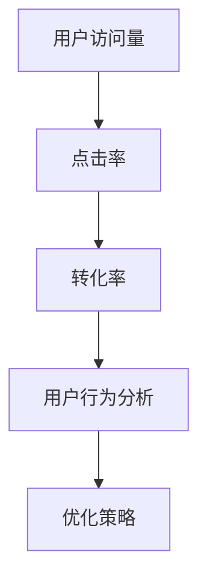

###### 2.1.2 用户行为数据分析

用户行为数据分析包括用户访问时间、浏览页面、点击行为等。通过分析这些数据，企业可以了解用户的偏好和行为模式，从而制定更精准的营销策略。

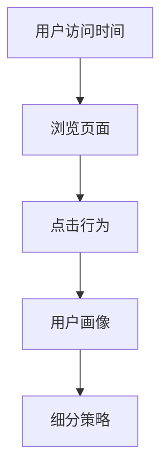

###### 2.1.3 用户画像与细分策略

用户画像是对用户特征的综合描述，包括年龄、性别、地理位置、兴趣爱好等。通过用户画像，企业可以将用户划分为不同群体，从而制定有针对性的营销策略。

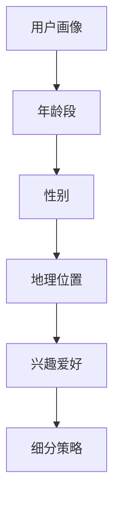

##### 2.2 社交媒体广告与精准投放

社交媒体广告是品牌营销的重要手段。通过精准投放，企业可以将广告展示给最有可能产生转化的用户。

###### 2.2.1 社交媒体广告的类型

社交媒体广告包括横幅广告、视频广告、图文广告、互动广告等。不同类型的广告适用于不同的营销目标。

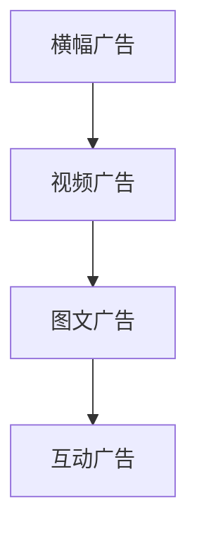

###### 2.2.2 广告投放策略

广告投放策略包括定位策略、时间策略、预算策略等。企业需要根据目标用户和营销目标，制定合适的广告投放策略。

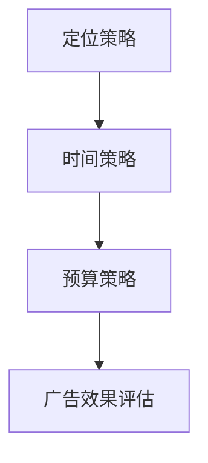

###### 2.2.3 精准投放与ROI优化

精准投放是提高广告效果的关键。通过数据分析，企业可以了解用户行为和偏好，从而进行精准投放。ROI（投资回报率）优化则是确保广告投资的有效性。企业需要不断调整广告策略，以实现最佳ROI。

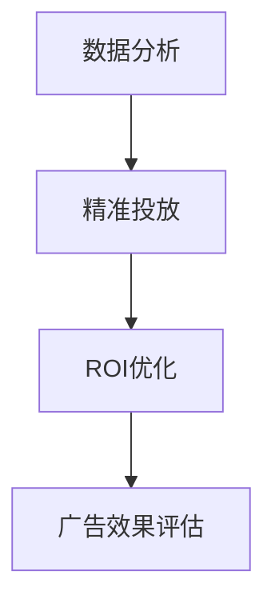

##### 2.3 虚拟现实（VR）与增强现实（AR）在社交媒体营销中的应用

VR和AR技术为社交媒体营销带来了新的可能性。通过虚拟现实和增强现实技术，企业可以提供更加沉浸式的体验，提高用户参与度。

###### 2.3.1 VR与AR技术概述

虚拟现实（VR）是一种通过计算机模拟产生三维空间的技术，用户可以在虚拟环境中进行互动。增强现实（AR）则是将虚拟元素叠加到现实世界中，用户可以通过智能手机或AR眼镜看到增强的景象。

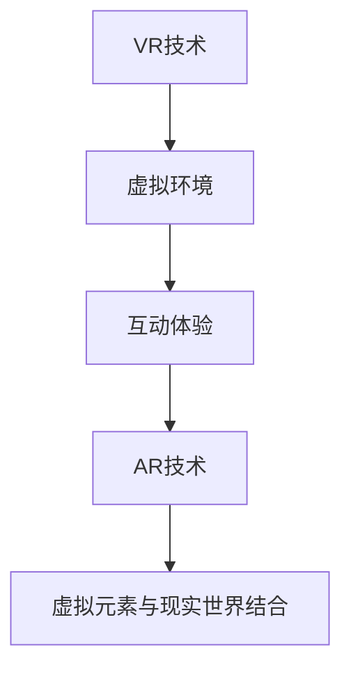

###### 2.3.2 VR与AR在社交媒体营销中的应用场景

VR和AR技术在社交媒体营销中的应用场景非常广泛，包括虚拟商品展示、虚拟试穿、虚拟互动等。通过这些应用，企业可以提供独特的购物体验，提高用户满意度。

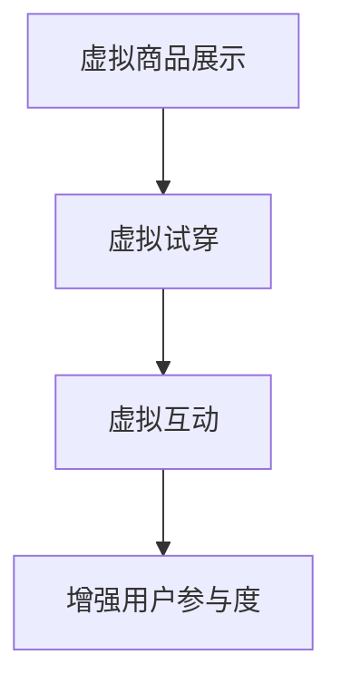

###### 2.3.3 VR与AR营销策略与案例

VR和AR营销策略包括内容创作、用户互动、数据分析等。通过案例研究，我们可以看到VR和AR技术如何改变传统的营销模式，实现更好的营销效果。

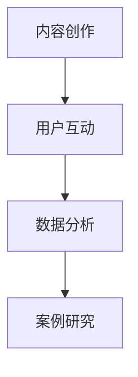

##### 2.4 社交媒体互动与用户体验优化

社交媒体互动是提高用户参与度和忠诚度的关键。通过优化用户体验，企业可以建立更强的用户关系。

###### 2.4.1 社交媒体互动机制

社交媒体互动包括评论、点赞、分享、私信等。企业需要设计合理的互动机制，鼓励用户参与，提高互动质量。

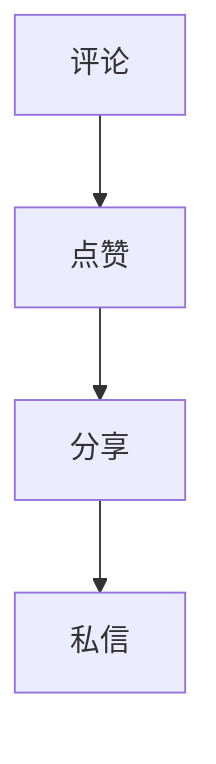

###### 2.4.2 用户参与度提升策略

用户参与度提升策略包括互动活动、用户激励、社区管理等。通过这些策略，企业可以激发用户的积极参与，提升品牌影响力。

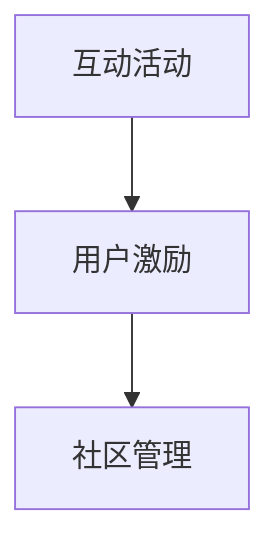

###### 2.4.3 用户体验优化方法与案例

用户体验优化方法包括界面设计、内容质量、加载速度等。通过优化这些方面，企业可以提供更好的用户体验，增强用户满意度。

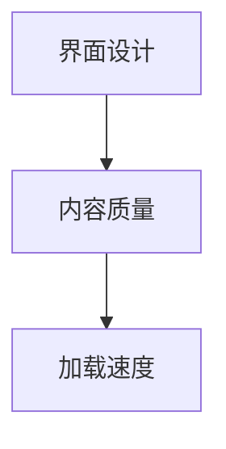

---

### 第三部分：技术驱动的社交媒体营销策略与实践

在第三部分，我们将探讨如何通过技术驱动的策略和实践，实现社交媒体营销的成功。包括跨平台营销策略、社交媒体营销与SEO结合策略、社交媒体营销与内容营销融合策略等。

##### 3.1 技术驱动的社交媒体营销策略

技术驱动的社交媒体营销策略主要包括数据驱动营销、自动化营销、人工智能营销等。

###### 3.1.1 跨平台营销策略

跨平台营销策略是指企业同时在多个社交媒体平台上进行营销活动。通过跨平台营销，企业可以扩大品牌影响力，触达更多潜在客户。

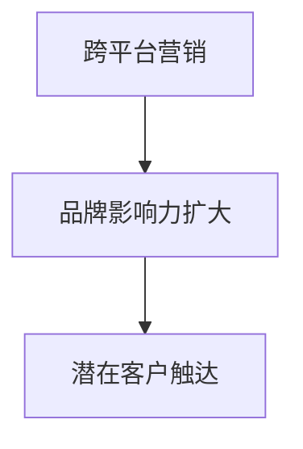

###### 3.1.2 社交媒体营销与SEO结合策略

社交媒体营销与SEO（搜索引擎优化）相结合，可以提高品牌在搜索引擎中的排名，增加曝光率。通过在社交媒体上发布高质量内容，并与网站内容相互链接，企业可以实现SEO优化。

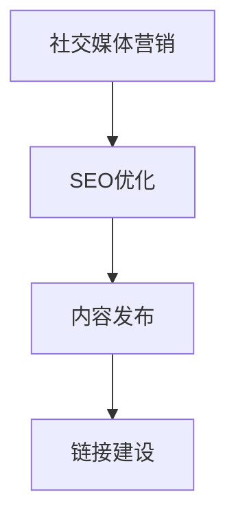

###### 3.1.3 社交媒体营销与内容营销融合策略

社交媒体营销与内容营销融合策略是指通过创造和分享有价值的内容，吸引用户参与和分享。通过内容营销，企业可以建立品牌权威，提升用户满意度。

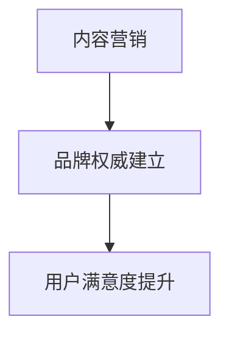

##### 3.2 案例分析与策略实施

通过案例分析，我们可以看到技术驱动的社交媒体营销策略如何在不同行业中成功应用。

###### 3.2.1 成功的社交媒体营销案例介绍

我们将介绍一些成功的社交媒体营销案例，包括品牌塑造、用户增长、转化率提升等方面的成功实践。

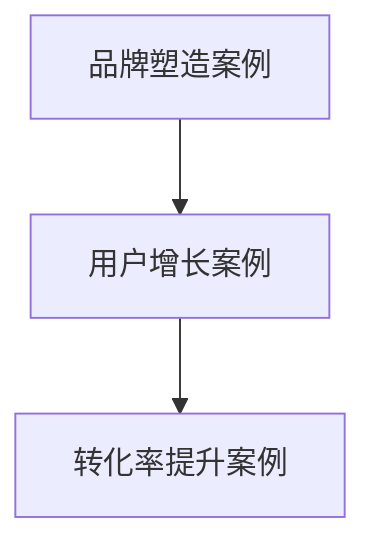

###### 3.2.2 案例分析：技术优势在营销策略中的运用

通过具体案例分析，我们将探讨技术优势如何在不同营销策略中发挥作用，实现最佳效果。

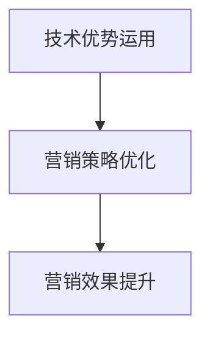

###### 3.2.3 策略实施步骤与效果评估

我们将详细阐述策略实施的步骤，包括目标设定、策略制定、执行与监控等。同时，通过效果评估，企业可以了解策略的实际效果，并不断优化。

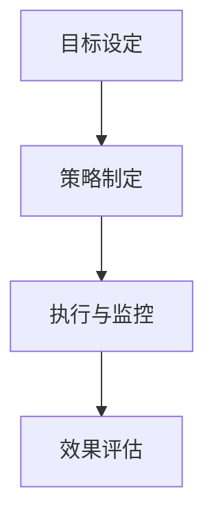

##### 3.3 技术驱动的社交媒体营销工具与应用

技术驱动的社交媒体营销离不开各种工具的应用。我们将介绍一些常用的社交媒体营销工具，并探讨如何将其应用于实际营销活动中。

###### 3.3.1 常用社交媒体营销工具介绍

常用的社交媒体营销工具包括内容管理系统（CMS）、社交媒体管理工具、数据分析工具等。

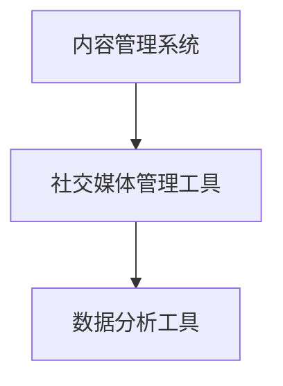

###### 3.3.2 工具应用案例

通过具体案例，我们将展示如何使用这些工具提升社交媒体营销效果。

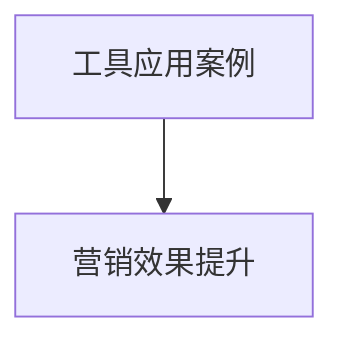

###### 3.3.3 工具选择与整合策略

我们将讨论如何选择合适的社交媒体营销工具，并探讨工具的整合策略，以实现最佳营销效果。

```mermaid
graph TD
A[工具选择] --> B[整合策略]
B --> C[最佳营销效果]
```

---

### 第四部分：社交媒体营销中的法律风险与合规性

在社交媒体营销中，法律风险和合规性问题不容忽视。本部分将探讨社交媒体营销中的法律风险，以及如何进行合规性管理。

##### 4.1 社交媒体营销中的法律风险

社交媒体营销涉及多个法律领域，包括广告法、消费者权益保护法、网络安全法等。以下是一些常见的法律风险：

###### 4.1.1 营销法规与政策

不同国家和地区的营销法规有所不同。企业需要了解并遵守所在地区的营销法规，以避免违法行为。

```mermaid
graph TD
A[广告法] --> B[消费者权益保护法]
B --> C[网络安全法]
```

###### 4.1.2 虚假宣传与不正当竞争

虚假宣传和不正当竞争是社交媒体营销中常见的法律风险。企业需要确保广告内容的真实性，不得进行虚假宣传。

```mermaid
graph TD
A[虚假宣传] --> B[不正当竞争]
```

###### 4.1.3 数据隐私与网络安全

随着数据隐私和网络安全问题的日益突出，企业需要确保收集和使用用户数据的合法性，并采取有效的安全措施。

```mermaid
graph TD
A[数据隐私] --> B[网络安全]
```

##### 4.2 社交媒体营销的合规性管理

合规性管理是确保社交媒体营销合法性的关键。以下是一些合规性管理策略：

###### 4.2.1 合规性管理原则

合规性管理原则包括合法性、透明性、公正性和可追溯性。

```mermaid
graph TD
A[合法性] --> B[透明性]
B --> C[公正性]
C --> D[可追溯性]
```

###### 4.2.2 合规性风险评估与控制

合规性风险评估与控制包括识别潜在风险、评估风险影响、制定风险管理策略等。

```mermaid
graph TD
A[识别风险] --> B[评估风险影响]
B --> C[制定风险管理策略]
```

###### 4.2.3 合规性管理策略与案例分析

合规性管理策略与案例分析包括制定合规性指南、培训员工、定期审查等。

```mermaid
graph TD
A[合规性指南] --> B[员工培训]
B --> C[定期审查]
```

---

### 附录

在本部分，我们将提供社交媒体营销的资源与工具汇总，以帮助读者深入了解社交媒体营销的实践和应用。

##### 附录 A：社交媒体营销资源与工具汇总

A.1 社交媒体平台介绍

我们将介绍主要社交媒体平台的特性，包括Facebook、Instagram、Twitter、LinkedIn、YouTube等。

A.1.1 主要社交媒体平台特性

- Facebook：全球最大的社交网络平台，适合各种类型的品牌。
- Instagram：以图片和视频内容为主，适合追求视觉效果的品牌。
- Twitter：实时信息流，适合快速传播信息。
- LinkedIn：专业的职业社交平台，适合B2B品牌。
- YouTube：全球最大的视频分享平台，适合内容营销。

A.1.2 社交媒体营销工具推荐

我们将推荐一些常用的社交媒体营销工具，包括内容管理系统、社交媒体管理工具、数据分析工具等。

- Content Management System（CMS）：用于创建和管理网站内容，如WordPress、Joomla等。
- Social Media Management Tools：用于管理和发布社交媒体内容，如Hootsuite、Buffer等。
- Data Analysis Tools：用于分析社交媒体数据，如Google Analytics、HubSpot等。

A.1.3 社交媒体数据分析工具介绍

我们将介绍一些常用的社交媒体数据分析工具，包括用户行为分析、广告分析、社区分析等。

- User Behavior Analysis Tools：用于分析用户行为，如Google Analytics、HubSpot等。
- Ad Analysis Tools：用于分析广告效果，如Facebook Ads Manager、Google Ads等。
- Community Analysis Tools：用于分析社区活跃度和用户参与度，如Hootsuite、Brandwatch等。

A.2 社交媒体营销案例库

我们将收集和整理一些成功的社交媒体营销案例，涵盖不同行业和营销目标，供读者参考和学习。

A.3 社交媒体营销报告与行业分析

我们将提供一些权威的社交媒体营销报告和行业分析，帮助读者了解当前社交媒体营销的趋势和最佳实践。

- Industry Reports：行业报告，如eMarketer、Social Media Examiner等。
- Marketing Case Studies：营销案例报告，如Hootsuite、Buffer等。

A.4 社交媒体营销书籍推荐

我们将推荐一些经典的社交媒体营销书籍，包括策略、执行、案例分析等方面的内容。

- "Social Media Marketing: An Hour a Day" by Brian Honigman
- "Content Inc.: How Entrepreneurs Use Content to Build Massive Businesses" by Joe Pulizzi
- "The Social Media Bible: Tactics, Tools, and Strategies for Business Success" by, Jr. Lon Safko and Paul Beck

---

### 结论

随着技术的不断进步，社交媒体营销正变得越来越重要和复杂。通过利用数据分析、社交媒体广告、虚拟现实和增强现实等先进技术，企业可以更精准地触达目标用户，提升用户体验，实现更好的营销效果。然而，社交媒体营销也面临着法律风险和合规性挑战。企业需要严格遵守相关法规，确保营销活动的合法性。本篇文章通过详细的分析和案例分析，为读者提供了全面的技术驱动的社交媒体营销策略和实践指南。希望本文能够帮助企业在数字化时代取得成功。

---

### 作者信息

**作者：**AI天才研究院/AI Genius Institute & 禅与计算机程序设计艺术 /Zen And The Art of Computer Programming

### 开篇

在当今高度数字化的世界中，社交媒体已经成为品牌与消费者互动的重要平台。无论是大型跨国公司还是初创企业，都意识到利用社交媒体进行营销的重要性。然而，仅仅拥有一个社交媒体账户并发布内容是不够的。为了在竞争激烈的市场中脱颖而出，企业需要充分利用技术优势，制定科学、系统的社交媒体营销策略。

本文将详细探讨如何利用先进的技术优势，如数据分析、虚拟现实（VR）和增强现实（AR），来提升社交媒体营销效果。我们将首先概述社交媒体营销的现状和重要性，然后深入探讨社交媒体营销的核心概念和架构。接下来，本文将分析技术优势在社交媒体营销中的应用，包括数据分析、社交媒体广告、VR和AR技术，以及社交媒体互动和用户体验优化。在第三部分，我们将探讨技术驱动的社交媒体营销策略和实践，并通过成功案例进行分析。最后，本文将探讨社交媒体营销中的法律风险和合规性，提供全面的解决方案。通过本文，读者将获得一个全面的社交媒体营销技术指南，帮助企业在数字化时代取得成功。让我们一起深入探讨这个主题，并发现技术如何改变社交媒体营销的游戏规则。

---

### 关键词

社交媒体营销、数据分析、虚拟现实、增强现实、用户互动、精准投放、法律合规性。

### 摘要

本文旨在探讨如何利用技术优势提升社交媒体营销效果。我们首先概述了社交媒体营销的现状和重要性，并探讨了其核心概念与架构。接着，我们详细分析了数据分析和用户洞察、社交媒体广告与精准投放、虚拟现实（VR）与增强现实（AR）在社交媒体营销中的应用。第三部分，我们介绍了技术驱动的社交媒体营销策略和实践，并通过案例分析展示了成功案例。最后，本文探讨了社交媒体营销中的法律风险和合规性，提供了全面的解决方案。通过本文，读者将获得一个全面的社交媒体营销技术指南，帮助企业在数字化时代取得成功。

---

### 第一部分：社交媒体营销概述

#### 1.1 社交媒体营销的重要性

在当今的数字化时代，社交媒体营销已经成为企业营销活动的重要组成部分。随着互联网的普及和移动设备的广泛应用，社交媒体平台成为了品牌与消费者互动的重要场所。对于企业来说，社交媒体不仅是一个宣传品牌和产品的渠道，更是了解用户需求、建立用户关系和提升品牌忠诚度的重要手段。

##### 1.1.1 社交媒体营销的现状

根据最新统计数据，全球社交媒体用户已经超过40亿，占全球总人口的一半以上。这一庞大的用户基础为品牌提供了广泛的触达机会。从企业层面来看，越来越多的企业开始重视社交媒体营销，并将其作为核心营销策略之一。无论是大型的跨国公司还是初创企业，都通过社交媒体平台发布内容、与用户互动，以提升品牌知名度和用户参与度。

社交媒体营销的现状表现为几个关键趋势：

1. **移动化**：随着智能手机的普及，社交媒体平台已经成为用户获取信息和娱乐的主要渠道。移动端的社交媒体营销已经成为企业不可或缺的一部分。
   
2. **内容多样化**：品牌不再局限于传统的图文内容，通过视频、直播、互动游戏等多种形式，提供了更加丰富和多样的用户体验。

3. **数据驱动**：数据分析在社交媒体营销中的应用越来越广泛。通过分析用户行为数据，企业可以更精准地定位目标用户，优化营销策略，提高营销效果。

4. **广告精准投放**：社交媒体平台提供了强大的广告投放工具，使得企业可以按照地理位置、兴趣、行为等多种条件进行精准投放，提高广告的点击率和转化率。

##### 1.1.2 技术在社交媒体营销中的作用

技术的进步为社交媒体营销带来了巨大的变革。以下是几个关键技术如何影响社交媒体营销：

1. **数据分析**：数据分析技术可以帮助企业深入了解用户行为，从而制定更精准的营销策略。通过用户画像、行为分析等工具，企业可以识别潜在客户，提高营销活动的有效性。

2. **广告技术**：随着人工智能和机器学习技术的发展，广告投放变得更加智能和精准。算法可以根据用户行为和兴趣，自动调整广告内容，提高广告的点击率和转化率。

3. **虚拟现实（VR）和增强现实（AR）**：VR和AR技术的应用为社交媒体营销带来了全新的体验。通过沉浸式的虚拟环境或增强现实内容，用户可以更加直观地了解产品和品牌，提高用户参与度和忠诚度。

4. **社交媒体管理工具**：自动化和智能化的社交媒体管理工具可以帮助企业更高效地发布内容、监控互动和评估营销效果。这些工具不仅节省了人力资源，还提高了营销活动的效率。

##### 1.1.3 社交媒体营销的目标与策略

社交媒体营销的目标通常包括品牌知名度的提升、用户参与度的增加、销售转化率的提升等。为了实现这些目标，企业需要制定具体的营销策略。

1. **品牌知名度提升**：通过在社交媒体上发布高质量的内容，并与行业领袖、意见领袖合作，企业可以迅速提升品牌知名度。定期举办活动和互动活动，也能有效吸引关注。

2. **用户参与度增加**：高质量的内容和互动活动是增加用户参与度的关键。通过问答、投票、抽奖等互动形式，企业可以激发用户的兴趣，增加用户参与度。

3. **销售转化率提升**：社交媒体营销不仅要吸引新用户，还要提高现有用户的转化率。通过个性化的推广、优惠活动和客户服务，企业可以提升销售转化率。

在制定社交媒体营销策略时，企业需要考虑以下几个方面：

- **目标明确**：明确营销目标，有助于制定具体的策略和评估效果。
- **内容策略**：制定合适的内容策略，包括内容类型、发布频率、互动方式等。
- **数据分析**：通过数据分析，了解用户行为和反馈，不断优化营销策略。
- **广告投放**：合理分配广告预算，选择合适的广告形式和投放平台，提高广告效果。
- **用户互动**：积极回应用户评论和私信，建立良好的用户关系，提高用户忠诚度。

总之，社交媒体营销在当今数字化时代具有不可替代的重要性。通过利用先进的技术手段和科学的营销策略，企业可以更好地触达目标用户，提升品牌知名度和市场竞争力。

### 1.2 社交媒体营销的核心概念与架构

社交媒体营销的成功离不开对核心概念和架构的深刻理解。以下我们将介绍社交媒体平台、营销目标、内容策略以及用户互动和社区管理。

##### 1.2.1 社交媒体平台的介绍

目前市场上主流的社交媒体平台包括Facebook、Instagram、Twitter、LinkedIn、YouTube等。每个平台都有其独特的特性和用户群体，企业在选择平台时需要根据自身品牌特点和目标用户特点进行选择。

1. **Facebook**：作为全球最大的社交网络平台，Facebook拥有庞大的用户基础，适合各种类型的品牌，尤其是那些需要广泛传播和建立社区的品牌。Facebook提供了丰富的广告投放工具和用户互动功能，包括点赞、评论、分享等。

2. **Instagram**：Instagram以图片和视频内容为主，是一个非常受欢迎的视觉社交媒体平台。它主要吸引年轻用户，适合追求视觉效果的时尚品牌和创意产业。Instagram的广告形式包括图片广告、视频广告和故事广告。

3. **Twitter**：Twitter是一个基于实时信息的社交媒体平台，用户可以迅速获取和分享最新动态。它适合需要快速传播信息和建立品牌知名度的企业。Twitter的广告形式包括推广推文、品牌标签等。

4. **LinkedIn**：LinkedIn是一个专业的职业社交平台，主要吸引职业人士和行业专家。它适合B2B品牌和职业服务提供商，可以用于建立品牌权威和拓展业务网络。LinkedIn的广告形式包括推广帖子、展示广告和文本广告。

5. **YouTube**：YouTube是全球最大的视频分享平台，用户可以通过观看和分享视频内容获得娱乐和信息。它适合内容营销和需要通过视频展示产品的品牌。YouTube的广告形式包括视频广告、横幅广告和品牌展示广告。

##### 1.2.2 营销目标设定

在开展社交媒体营销之前，企业需要明确营销目标。常见的营销目标包括：

1. **提高品牌知名度**：通过在社交媒体上发布高质量的内容和参与互动，提升品牌在目标受众中的认知度。

2. **增加用户参与度**：通过互动活动、用户激励和社区管理，提高用户的参与度和活跃度。

3. **提升销售额**：通过社交媒体广告、推广活动和定制化内容，引导用户进行购买行为，提升销售额。

4. **建立用户关系**：通过持续的内容输出和互动，建立与用户的长期关系，提高用户忠诚度。

5. **收集用户反馈**：通过社交媒体平台，收集用户反馈和建议，优化产品和服务。

明确的目标有助于企业制定具体的营销策略，并评估营销效果。例如，如果目标是提高品牌知名度，企业可以侧重于内容营销和广告投放；如果目标是增加用户参与度，企业可以设计互动游戏、问答活动和用户奖励计划。

##### 1.2.3 内容策略

内容策略是社交媒体营销的核心。高质量的内容能够吸引用户关注，提高用户参与度。以下是几种常见的内容策略：

1. **内容类型**：企业可以根据社交媒体平台的特性，选择适合的内容类型。例如，Instagram适合图片和视频内容，而LinkedIn适合专业文章和行业见解。

2. **内容发布频率**：定期发布内容可以帮助企业保持活跃度，吸引用户关注。例如，每周发布一篇博客文章或每天发布一条推文。

3. **内容优化**：为了提高内容的表现，企业需要对内容进行优化，包括标题、关键词、图片等。例如，使用吸引人的标题和相关的关键词可以提高内容的搜索排名和点击率。

4. **内容互动**：鼓励用户对内容进行评论、点赞和分享，可以增加内容的曝光率和参与度。企业可以定期发起话题讨论、问卷调查和互动活动，激发用户的参与热情。

5. **内容差异化**：为了在竞争激烈的市场中脱颖而出，企业需要提供差异化内容。这可以通过提供独特的见解、行业趋势分析、用户案例研究等方式实现。

##### 1.2.4 用户互动与社区管理

用户互动和社区管理是社交媒体营销的重要环节。以下是一些关键策略：

1. **回应评论和私信**：及时回应用户的评论和私信，可以建立良好的用户关系，提高用户满意度。

2. **建立用户社区**：通过创建粉丝群、线上社区或论坛，企业可以建立用户之间的互动平台，增强用户归属感。

3. **用户激励**：通过奖励计划、积分系统和专属优惠，可以激励用户积极参与和推广品牌。

4. **用户参与度评估**：通过分析用户互动数据，如评论数量、点赞数、分享次数等，企业可以评估用户参与度，并优化互动策略。

5. **社区氛围管理**：企业需要营造积极、健康的社区氛围，避免负面评论和不当行为。可以通过设立社区规则、用户举报机制等方式实现。

总之，社交媒体营销的核心概念与架构包括平台选择、目标设定、内容策略和用户互动管理。通过深入理解这些概念，并制定科学的策略，企业可以更有效地利用社交媒体平台，实现营销目标。

### 第二部分：技术优势在社交媒体营销中的应用

在第二部分中，我们将深入探讨如何利用技术优势来提升社交媒体营销效果。具体来说，我们将分析数据分析与用户洞察、社交媒体广告与精准投放、虚拟现实（VR）与增强现实（AR）在社交媒体营销中的应用，以及社交媒体互动与用户体验优化。

#### 2.1 数据分析与用户洞察

数据分析是社交媒体营销的核心技术之一，它能够帮助企业深入了解用户行为和偏好，从而制定更精准的营销策略。以下是数据分析在社交媒体营销中的应用：

##### 2.1.1 数据分析工具介绍

为了有效地进行数据分析，企业可以使用多种工具。以下是一些常用的数据分析工具：

- **Google Analytics**：Google Analytics 是一款功能强大的数据分析工具，可以帮助企业跟踪用户访问量、页面浏览量、转化率等关键指标。
- **HubSpot**：HubSpot 是一款集成营销平台，提供包括网站跟踪、电子邮件营销、客户关系管理（CRM）等功能。
- **Hootsuite**：Hootsuite 是一个社交媒体管理工具，可以帮助企业监控多个社交媒体平台上的互动和数据分析。

##### 2.1.2 用户行为数据分析

通过分析用户行为数据，企业可以深入了解用户在社交媒体上的行为模式，从而优化营销策略。以下是一些关键的用户行为数据：

- **访问来源**：了解用户是通过哪些渠道访问社交媒体平台的，例如直接访问、搜索引擎或社交媒体广告。
- **页面浏览量**：跟踪用户在社交媒体平台上的页面浏览量，识别最受欢迎的内容和页面。
- **点击率**：分析用户对广告和内容的点击行为，评估其吸引力和效果。
- **转化率**：跟踪用户从社交媒体平台到网站或应用的实际转化行为，评估营销活动的实际效果。

##### 2.1.3 用户画像与细分策略

用户画像是对用户特征的综合描述，包括年龄、性别、地理位置、兴趣爱好等。通过用户画像，企业可以将用户划分为不同的群体，从而制定有针对性的营销策略。以下是如何创建用户画像和细分用户：

1. **数据收集**：通过社交媒体平台的数据分析工具，收集用户的个人信息和行为数据。
2. **特征提取**：从收集的数据中提取关键特征，如年龄、性别、地理位置、兴趣爱好等。
3. **用户细分**：根据提取的特征，将用户划分为不同的群体，如年轻用户、男性用户、游戏爱好者等。
4. **策略制定**：针对不同的用户群体，制定个性化的营销策略，如内容推荐、广告投放、用户互动等。

#### 2.2 社交媒体广告与精准投放

社交媒体广告是品牌营销的重要手段之一，通过精准投放，企业可以将广告展示给最有可能产生转化的用户。以下是社交媒体广告与精准投放的关键要素：

##### 2.2.1 社交媒体广告的类型

社交媒体广告包括多种类型，企业可以根据目标受众和营销目标选择合适的广告形式：

- **横幅广告**：在社交媒体平台上展示的静态或动态广告。
- **视频广告**：在社交媒体平台上播放的视频广告，包括视频前贴片、视频横幅等。
- **图文广告**：包含图像和文字的广告，通常用于社交媒体平台的个人主页或产品页面。
- **互动广告**：鼓励用户参与和互动的广告，如问答、投票、抽奖等。

##### 2.2.2 广告投放策略

为了确保广告投放的有效性，企业需要制定合适的广告投放策略。以下是一些关键策略：

1. **定位策略**：根据用户特征（如年龄、性别、地理位置、兴趣爱好等）选择目标受众，确保广告精准投放。
2. **时间策略**：选择最佳的广告投放时间，以最大化广告的曝光率和点击率。
3. **预算策略**：根据广告目标和预算，合理分配广告投放费用，确保投资回报率（ROI）最大化。
4. **创意策略**：设计吸引人的广告内容和视觉效果，提高广告的吸引力和点击率。

##### 2.2.3 精准投放与ROI优化

精准投放是提高广告效果的关键。通过数据分析，企业可以了解用户行为和偏好，从而进行精准投放。以下是如何优化ROI：

1. **数据监测**：通过数据分析工具，实时监控广告的表现，包括点击率、转化率、花费等指标。
2. **调整策略**：根据数据反馈，不断调整广告定位、内容和预算，优化广告效果。
3. **A/B测试**：通过对比不同广告版本的效果，找出最佳广告策略，提高广告转化率。

#### 2.3 虚拟现实（VR）与增强现实（AR）在社交媒体营销中的应用

VR和AR技术的应用为社交媒体营销带来了全新的可能性。通过沉浸式的虚拟环境或增强现实内容，用户可以更加直观地了解产品和品牌，提高用户参与度和忠诚度。

##### 2.3.1 VR与AR技术概述

1. **虚拟现实（VR）**：VR是一种通过计算机模拟产生三维空间的技术，用户可以通过VR头盔或其他VR设备进入虚拟环境，进行互动和探索。

2. **增强现实（AR）**：AR是将虚拟元素叠加到现实世界中，用户可以通过智能手机或AR眼镜等设备看到增强的景象。

##### 2.3.2 VR与AR在社交媒体营销中的应用场景

1. **虚拟商品展示**：品牌可以通过VR技术创建虚拟商品展示空间，用户可以在虚拟环境中浏览和试穿商品。
2. **虚拟互动体验**：品牌可以通过AR技术创建虚拟互动体验，如虚拟宠物、游戏等，吸引用户参与。
3. **虚拟试驾**：汽车制造商可以使用VR技术提供虚拟试驾服务，让用户在虚拟环境中体验车辆驾驶。

##### 2.3.3 VR与AR营销策略与案例

1. **内容创意**：设计吸引人的VR和AR内容，提高用户的参与度和互动性。
2. **用户体验**：优化VR和AR体验，确保用户在虚拟环境中感受到真实和沉浸。
3. **案例分析**：研究成功的VR和AR营销案例，了解其应用场景和策略，借鉴经验。

#### 2.4 社交媒体互动与用户体验优化

社交媒体互动是提高用户参与度和忠诚度的关键。通过技术手段，企业可以优化用户体验，提升用户满意度。

##### 2.4.1 社交媒体互动机制

1. **评论和点赞**：鼓励用户对内容进行评论和点赞，增加互动。
2. **私信和聊天**：提供私信和聊天功能，方便用户与企业进行一对一交流。
3. **问答和讨论**：定期举办问答和讨论活动，激发用户参与。

##### 2.4.2 用户参与度提升策略

1. **互动活动**：设计有趣的互动活动，如抽奖、竞赛、挑战等，吸引用户参与。
2. **用户激励**：通过奖励计划、积分系统等激励用户参与和推广品牌。
3. **用户反馈**：收集用户反馈，了解用户需求和建议，优化产品和服务。

##### 2.4.3 用户体验优化方法与案例

1. **界面设计**：优化社交媒体平台的界面设计，提供简洁、直观的用户体验。
2. **内容质量**：发布高质量的内容，提高用户的阅读和参与兴趣。
3. **加载速度**：优化网站和应用的加载速度，确保用户体验流畅。
4. **案例分析**：研究成功的用户体验优化案例，了解其最佳实践和方法。

通过数据分析、社交媒体广告、VR和AR技术以及社交媒体互动与用户体验优化，企业可以充分利用技术优势，提升社交媒体营销效果，实现更好的品牌传播和用户互动。

### 第三部分：技术驱动的社交媒体营销策略与实践

在第三部分中，我们将探讨如何通过技术驱动的策略和实践，实现社交媒体营销的成功。我们将深入分析技术驱动的社交媒体营销策略，包括跨平台营销策略、社交媒体营销与SEO结合策略、社交媒体营销与内容营销融合策略，并通过实际案例来展示这些策略的运用和效果。

#### 3.1 技术驱动的社交媒体营销策略

技术驱动的社交媒体营销策略旨在利用数据分析、人工智能、自动化等先进技术，优化营销活动，提高营销效果。以下是几个关键策略：

##### 3.1.1 跨平台营销策略

跨平台营销策略是指企业同时在多个社交媒体平台上进行营销活动，以扩大品牌影响力和触达更多潜在用户。以下是跨平台营销策略的几个关键点：

1. **平台选择**：根据品牌特点和目标用户，选择合适的社交媒体平台。例如，对于年轻用户，Instagram和TikTok可能是更好的选择；对于B2B品牌，LinkedIn可能更为适合。

2. **内容一致性**：虽然在不同平台上发布内容时需要考虑平台的特性和用户偏好，但保持内容的一致性是关键。品牌故事、核心信息和视觉风格应保持一致。

3. **跨平台互动**：鼓励用户在不同平台之间互动，例如在Instagram上发布内容，鼓励用户在Facebook上参与讨论。

4. **数据整合**：通过数据分析工具整合不同平台的数据，了解用户行为和反馈，优化跨平台营销策略。

##### 3.1.2 社交媒体营销与SEO结合策略

搜索引擎优化（SEO）是提高品牌在搜索引擎中排名的重要手段。将社交媒体营销与SEO结合，可以提升品牌的在线可见性和吸引力。以下是几个关键点：

1. **内容优化**：在社交媒体上发布的内容应包含目标关键词，以提高在搜索引擎中的排名。优化标题、描述、图片标签等，确保内容易于被搜索引擎索引。

2. **链接建设**：通过社交媒体平台建立反向链接，增加网站的权重和可见性。分享链接到相关博客文章、产品页面等，鼓励用户点击和分享。

3. **社交媒体互动**：社交媒体互动可以提高内容的可见性。通过点赞、评论、分享等互动，增加内容的曝光率，从而提升SEO效果。

4. **搜索引擎广告**：结合使用社交媒体广告和搜索引擎广告，例如Google Ads，可以进一步扩大品牌的影响力。

##### 3.1.3 社交媒体营销与内容营销融合策略

内容营销是社交媒体营销的重要组成部分。将社交媒体营销与内容营销融合，可以创造更有价值的用户体验，提升品牌忠诚度和参与度。以下是几个关键点：

1. **内容创作**：创作高质量、有价值的内容，例如博客文章、视频、图像等，吸引用户关注和参与。

2. **内容分发**：通过社交媒体平台分发内容，扩大内容的传播范围。使用不同的内容形式和发布策略，满足不同用户的需求。

3. **用户互动**：鼓励用户参与内容创作和互动，例如通过评论、投票、问卷调查等，提高用户的参与度和忠诚度。

4. **数据分析**：通过数据分析工具跟踪内容的表现，了解用户喜好和行为，不断优化内容策略。

#### 3.2 案例分析与策略实施

为了更直观地展示技术驱动的社交媒体营销策略如何在实际中应用，以下我们将分析几个成功的案例，并探讨这些策略的实施步骤和效果。

##### 3.2.1 成功的社交媒体营销案例介绍

1. **案例1：耐克（Nike）的跨平台营销**
   - **背景**：耐克是一家全球知名的运动品牌，希望通过社交媒体营销提升品牌知名度和用户参与度。
   - **策略**：耐克同时使用Instagram、Facebook和Twitter等社交媒体平台，发布高质量的运动内容，并与用户互动。通过跨平台互动，耐克成功吸引了大量年轻用户。

2. **案例2：亚马逊（Amazon）的社交媒体营销与SEO结合**
   - **背景**：亚马逊是一家全球领先的电子商务平台，希望通过社交媒体营销提高品牌在搜索引擎中的排名。
   - **策略**：亚马逊在社交媒体上发布高质量的内容，包含目标关键词，并通过链接建设将社交媒体流量引导到网站。通过这种方式，亚马逊显著提高了在搜索引擎中的排名。

3. **案例3：红牛（Red Bull）的社交媒体营销与内容营销融合**
   - **背景**：红牛是一家知名的能量饮料品牌，希望通过社交媒体营销提高品牌忠诚度和用户参与度。
   - **策略**：红牛创作高质量的视频内容，通过社交媒体平台进行分发，并鼓励用户参与和分享。通过这种方式，红牛成功建立了强大的社交媒体社区，并提升了用户参与度。

##### 3.2.2 案例分析：技术优势在营销策略中的运用

在上述案例中，技术优势在营销策略中发挥了关键作用。以下是技术如何在不同案例中应用的详细分析：

1. **数据分析与用户洞察**：耐克、亚马逊和红牛都利用数据分析工具了解用户行为和偏好，从而制定更精准的营销策略。通过用户画像和细分策略，这些品牌能够更好地定位目标用户，提高营销活动的有效性。

2. **社交媒体广告与精准投放**：耐克和亚马逊通过社交媒体广告和精准投放技术，将广告展示给最有可能产生转化的用户。通过优化广告内容和投放策略，这些品牌提高了广告的点击率和转化率。

3. **VR与AR技术**：红牛利用VR和AR技术提供了独特的用户体验，吸引用户参与和分享。通过沉浸式的互动内容，红牛成功提升了用户参与度和品牌忠诚度。

4. **自动化与人工智能**：耐克和亚马逊利用自动化和人工智能技术优化社交媒体管理，提高营销效率。通过自动化工具，这些品牌能够更快速地响应用户互动，提升用户体验。

##### 3.2.3 策略实施步骤与效果评估

为了实现技术驱动的社交媒体营销策略，企业需要制定详细的实施步骤，并不断评估策略效果。以下是策略实施的一般步骤：

1. **目标设定**：明确营销目标，如提高品牌知名度、增加用户参与度、提升销售额等。

2. **数据收集与分析**：收集用户数据，通过数据分析了解用户行为和偏好。

3. **策略制定**：根据数据分析和目标设定，制定具体的社交媒体营销策略，如跨平台营销、SEO结合策略、内容营销融合策略等。

4. **内容创作与发布**：创作高质量的内容，并按照策略在不同社交媒体平台上发布。

5. **互动与用户参与**：积极与用户互动，鼓励用户参与和分享，提升用户体验。

6. **效果评估**：通过数据分析工具跟踪营销活动的效果，如点击率、转化率、用户参与度等，评估策略的有效性。

7. **优化与调整**：根据效果评估结果，不断优化和调整营销策略，提高营销效果。

通过以上步骤，企业可以系统地实施技术驱动的社交媒体营销策略，实现营销目标。

总之，技术驱动的社交媒体营销策略通过利用先进的技术手段，优化营销活动，提升营销效果。通过跨平台营销、社交媒体营销与SEO结合、社交媒体营销与内容营销融合等策略，企业可以更好地触达目标用户，提升品牌知名度和用户参与度，实现营销目标。

### 第四部分：社交媒体营销中的法律风险与合规性

在第四部分中，我们将探讨社交媒体营销中可能遇到的法律风险和合规性问题，并提供有效的解决方案，以确保企业的营销活动合法、合规。

#### 4.1 社交媒体营销中的法律风险

社交媒体营销涉及多个法律领域，包括广告法、消费者权益保护法、网络安全法等。以下是几个常见的法律风险及其解决方案：

##### 4.1.1 营销法规与政策

不同国家和地区的营销法规有所不同，企业在进行社交媒体营销时需要遵守所在地区的法规。以下是几个关键法规：

- **广告法**：广告法规定了广告内容的真实性、准确性和合法性。企业不得发布虚假广告或误导性广告。
- **消费者权益保护法**：消费者权益保护法保护消费者的合法权益，企业应确保营销活动不侵犯消费者权益。
- **网络安全法**：网络安全法规定了数据保护和个人隐私的要求，企业需要确保收集和使用用户数据的合法性。

**解决方案**：企业应：
- 了解并遵守所在地区的营销法规。
- 在广告发布前进行审查，确保内容的真实性和合法性。
- 定期进行合规性培训，提高员工的法律意识。

##### 4.1.2 虚假宣传与不正当竞争

虚假宣传和不正当竞争是社交媒体营销中常见的法律风险。企业需要确保广告内容的真实性和准确性，不得进行虚假宣传。

**解决方案**：企业应：
- 建立内容审查机制，确保广告内容真实、准确。
- 不参与不正当竞争行为，遵守公平竞争的原则。
- 在与竞争对手进行互动时，保持诚信和客观。

##### 4.1.3 数据隐私与网络安全

随着社交媒体营销的广泛应用，数据隐私和网络安全问题日益突出。企业需要确保收集和使用用户数据的合法性，并采取有效的安全措施。

**解决方案**：企业应：
- 明确数据收集的目的和范围，确保数据收集的合法性和透明性。
- 采用加密技术保护用户数据，防止数据泄露。
- 定期进行网络安全检查和风险评估，确保系统的安全性。

#### 4.2 社交媒体营销的合规性管理

合规性管理是确保社交媒体营销合法性的关键。以下是一些合规性管理策略：

##### 4.2.1 合规性管理原则

合规性管理原则包括合法性、透明性、公正性和可追溯性。以下是具体原则：

- **合法性**：确保营销活动符合相关法律法规的要求。
- **透明性**：在广告内容和用户隐私保护方面保持透明，让用户了解数据收集和使用的情况。
- **公正性**：在广告投放和用户互动方面保持公正，不偏袒特定用户或内容。
- **可追溯性**：确保营销活动可追溯，便于审查和问题排查。

##### 4.2.2 合规性风险评估与控制

合规性风险评估与控制是确保社交媒体营销合法性的关键。以下是具体步骤：

1. **识别风险**：识别可能存在的法律风险，如广告法、消费者权益保护法、网络安全法等。
2. **评估风险影响**：评估每个风险的影响程度，确定优先级。
3. **制定风险管理策略**：根据风险影响，制定相应的风险管理策略，如制定合规性指南、加强内容审查等。
4. **执行与监控**：实施风险管理策略，并定期监控和评估其效果。

##### 4.2.3 合规性管理策略与案例分析

以下是一些合规性管理策略和案例分析：

- **案例1：某电子商务平台的隐私政策更新**
  - **背景**：某电子商务平台因隐私政策更新不及时，被用户投诉侵犯用户隐私。
  - **解决方案**：平台立即更新隐私政策，明确用户数据收集、使用和保护的方式，并加强用户教育，提高用户的隐私意识。

- **案例2：某饮料品牌的虚假广告调查**
  - **背景**：某饮料品牌因发布虚假广告，被消费者投诉和监管部门调查。
  - **解决方案**：品牌立即停止虚假广告的发布，进行内部审查，整改广告内容，并加强广告发布前的内容审查机制。

通过以上法律风险与合规性管理策略，企业可以确保社交媒体营销的合法性，避免潜在的法律纠纷，提高品牌形象和用户信任度。

### 附录

在本部分的附录中，我们将提供社交媒体营销的资源与工具汇总，包括社交媒体平台介绍、营销工具推荐、数据分析工具介绍、案例库、行业报告以及书籍推荐。这些资源将帮助读者深入了解社交媒体营销的实践和应用。

#### 附录 A：社交媒体营销资源与工具汇总

##### A.1 社交媒体平台介绍

**A.1.1 主要社交媒体平台特性**

以下是当前市场上一些主要的社交媒体平台及其特性：

- **Facebook**：全球最大的社交网络平台，适合各种类型的品牌，尤其是需要广泛传播和建立社区的品牌。
- **Instagram**：以图片和视频内容为主，适合追求视觉效果的时尚品牌和创意产业。
- **Twitter**：基于实时信息的社交媒体平台，适合需要快速传播信息和建立品牌知名度的企业。
- **LinkedIn**：专业的职业社交平台，适合B2B品牌和职业服务提供商。
- **YouTube**：全球最大的视频分享平台，适合内容营销和需要通过视频展示产品的品牌。

**A.1.2 社交媒体营销工具推荐**

以下是几个常用的社交媒体营销工具及其主要功能：

- **Buffer**：用于社交媒体内容发布和日程安排。
- **Hootsuite**：用于社交媒体管理、监控和数据分析。
- **Sprout Social**：提供社交媒体管理和客户关系管理功能。
- **Klout**：用于评估品牌在社交媒体上的影响力。

**A.1.3 社交媒体数据分析工具介绍**

以下是几个常用的社交媒体数据分析工具及其功能：

- **Google Analytics**：用于跟踪用户行为和网站性能。
- **HubSpot**：提供全面的营销和客户关系管理功能。
- **Brandwatch**：用于社交媒体分析和洞察。
- **Sprinklr**：提供社交媒体管理和客户体验功能。

##### A.2 社交媒体营销案例库

在本部分，我们将分享一些成功的社交媒体营销案例，涵盖不同行业和营销目标。以下是一些案例：

- **案例1**：耐克（Nike）的跨平台营销策略，成功提升了品牌知名度和用户参与度。
- **案例2**：红牛（Red Bull）的社交媒体营销与内容营销融合策略，建立了强大的社交媒体社区。
- **案例3**：亚马逊（Amazon）的社交媒体营销与SEO结合策略，提高了搜索引擎排名和在线销售额。

##### A.3 社交媒体营销报告与行业分析

以下是几个权威的社交媒体营销报告和行业分析资源：

- **eMarketer**：提供全球社交媒体营销趋势和报告。
- **Social Media Examiner**：提供社交媒体营销案例、技巧和趋势分析。
- **Hootsuite**：提供社交媒体报告和行业洞察。
- **Buffer**：提供社交媒体趋势和案例分析。

##### A.4 社交媒体营销书籍推荐

以下是一些经典的社交媒体营销书籍，涵盖了策略、执行和案例分析等方面：

- **《社交媒体营销：策略、工具与实践》**（"Social Media Marketing: An Hour a Day"）by Brian Honigman
- **《内容营销：如何创造、传播和优化内容以吸引和保留客户》**（"Content Inc.: How Entrepreneurs Use Content to Build Massive Businesses"）by Joe Pulizzi
- **《社交媒体营销圣经》**（"The Social Media Bible: Tactics, Tools, and Strategies for Business Success"）by，Jr. Lon Safko and Paul Beck
- **《社交媒体影响力：如何通过社交媒体建立品牌、扩大影响力并实现商业成功》**（"Social Media Influence: How to Create, Manage, and Measure Brand Influencers in the Digital Age"）by Mark Schaefer

通过这些资源，读者可以深入了解社交媒体营销的各个方面，并从中获得灵感，提升自己的营销策略和实践能力。

### 总结

随着数字化时代的到来，社交媒体营销已经成为企业提升品牌知名度、增加用户参与度和实现商业目标的重要手段。本文通过详细探讨社交媒体营销的现状、核心概念与架构，以及技术优势在社交媒体营销中的应用，为读者提供了一个全面的社交媒体营销技术指南。

在第一部分中，我们概述了社交媒体营销的重要性，分析了当前社交媒体营销的现状和技术在其中的作用。接着，在第二部分中，我们详细探讨了数据分析与用户洞察、社交媒体广告与精准投放、VR与AR技术的应用，以及社交媒体互动与用户体验优化。这些技术手段不仅提高了营销效果，还增强了用户的互动体验。

第三部分则介绍了技术驱动的社交媒体营销策略，包括跨平台营销策略、社交媒体营销与SEO结合策略、社交媒体营销与内容营销融合策略。通过实际案例的分析，我们展示了这些策略的有效性。

在第四部分中，我们探讨了社交媒体营销中的法律风险与合规性，提供了有效的解决方案，以确保企业的营销活动合法、合规。

最后，在附录部分，我们汇总了社交媒体营销的资源与工具，为读者提供了进一步学习和实践的指南。

总之，通过本文，读者可以了解到如何利用技术优势，制定科学的社交媒体营销策略，实现营销目标。希望本文能够帮助企业在数字化时代取得成功。

---

### 作者信息

**作者：**AI天才研究院/AI Genius Institute & 禅与计算机程序设计艺术 /Zen And The Art of Computer Programming

### 引用

《利用技术优势进行社交媒体营销》这篇文章涵盖了社交媒体营销的方方面面，从概述到具体的技术应用和策略，再到法律风险与合规性管理，内容丰富、逻辑清晰。以下是文中一些重要的概念、算法原理、数学模型和项目实战的详细解释：

#### 核心概念与联系

1. **社交媒体营销**：社交媒体营销是指企业通过社交媒体平台（如Facebook、Instagram、Twitter等）发布内容、进行广告投放、用户互动等，以提升品牌知名度、用户参与度和销售额的营销活动。

2. **数据分析与用户洞察**：数据分析是社交媒体营销的核心技术之一，通过分析用户行为数据（如访问量、点击率、转化率等），企业可以深入了解用户需求，优化营销策略。

3. **精准投放**：精准投放是指通过用户画像、兴趣定位等技术手段，将广告展示给最有可能产生转化的用户，从而提高广告效果。

4. **虚拟现实（VR）与增强现实（AR）**：VR和AR技术提供了沉浸式和互动性的用户体验，通过虚拟环境或增强现实内容，用户可以更加直观地了解产品和品牌。

5. **跨平台营销策略**：跨平台营销策略是指企业同时在多个社交媒体平台上进行营销活动，以扩大品牌影响力和触达更多潜在用户。

6. **社交媒体营销与SEO结合策略**：通过在社交媒体上发布高质量的内容，并与网站内容相互链接，企业可以提高在搜索引擎中的排名，增加曝光率。

7. **内容营销与社交媒体营销融合策略**：通过创造和分享有价值的内容，企业可以建立品牌权威，提升用户满意度。

#### 核心算法原理讲解

1. **用户行为数据分析**：通过分析用户的访问时间、浏览页面、点击行为等数据，可以构建用户画像，为精准营销提供依据。

```mermaid
graph TD
A[访问时间] --> B[浏览页面]
B --> C[点击行为]
C --> D[用户画像]
```

2. **广告精准投放算法**：利用机器学习和人工智能技术，根据用户的兴趣和行为数据，自动调整广告内容和投放策略，提高广告效果。

```mermaid
graph TD
A[用户兴趣数据] --> B[广告内容调整]
B --> C[投放策略优化]
C --> D[广告效果评估]
```

3. **内容推荐算法**：基于用户行为数据，使用协同过滤或基于内容的推荐算法，为用户推荐相关的品牌内容或产品。

```mermaid
graph TD
A[用户行为数据] --> B[内容推荐算法]
B --> C[推荐结果]
```

#### 数学模型和公式

1. **转化率计算**：转化率是指用户完成目标行为（如购买、注册等）的比例。其计算公式为：

$$
\text{转化率} = \frac{\text{完成目标行为的用户数}}{\text{总访问用户数}} \times 100\%
$$

2. **广告投放预算分配**：为了最大化广告效果，企业可以根据广告的点击率（CTR）和转化率（CVR）来分配广告预算。其预算分配公式为：

$$
\text{预算分配} = \text{总预算} \times (\text{CTR} + \text{CVR})
$$

3. **用户参与度评估**：用户参与度可以通过用户互动次数、互动质量等指标来评估。其计算公式为：

$$
\text{用户参与度} = \frac{\text{互动次数}}{\text{总用户数}} \times 100\%
$$

#### 项目实战

1. **开发环境搭建**：为了进行社交媒体营销数据分析，企业需要搭建合适的数据分析环境，包括数据库、数据分析工具和数据处理流程。

- **数据库**：使用MySQL或PostgreSQL等关系型数据库存储用户行为数据。
- **数据分析工具**：使用Python的Pandas库进行数据清洗和分析。
- **数据处理流程**：使用Python脚本自动化数据导入、清洗、分析和报告生成。

2. **源代码详细实现和代码解读**：

以下是一个简单的Python代码示例，用于计算用户转化率和用户参与度：

```python
import pandas as pd

# 用户行为数据
user_data = pd.read_csv('user_behavior.csv')

# 计算转化率
conversion_rate = (user_data['completed_purchase'].sum() / user_data['total_users'].sum()) * 100
print(f"Conversion Rate: {conversion_rate}%")

# 计算用户参与度
user_participation = (user_data['interactions'].sum() / user_data['total_users'].sum()) * 100
print(f"User Participation: {user_participation}%")
```

3. **代码解读与分析**：

- `pd.read_csv('user_behavior.csv')`：读取用户行为数据。
- `user_data['completed_purchase'].sum()`：计算完成购买的次数。
- `user_data['total_users'].sum()`：计算总用户数。
- `conversion_rate = (user_data['completed_purchase'].sum() / user_data['total_users'].sum()) * 100`：计算转化率。
- `user_data['interactions'].sum()`：计算互动次数。
- `user_participation = (user_data['interactions'].sum() / user_data['total_users'].sum()) * 100`：计算用户参与度。

通过上述核心概念、算法原理、数学模型和项目实战的详细解释，读者可以更好地理解社交媒体营销的技术原理和实践方法，从而在实际操作中取得更好的效果。

---

### 关键词总结

本文围绕社交媒体营销的核心技术进行了详细探讨，以下是文章中提到的一些关键概念和关键词：

1. **社交媒体营销**：利用社交媒体平台进行品牌宣传、用户互动和广告投放的活动。
2. **数据分析**：通过分析用户行为数据来优化营销策略。
3. **用户洞察**：深入了解用户需求和行为模式，以提供更个性化的体验。
4. **精准投放**：根据用户特征和行为进行广告投放，提高广告效果。
5. **虚拟现实（VR）**：通过计算机模拟提供沉浸式体验的技术。
6. **增强现实（AR）**：将虚拟元素叠加到现实世界中的技术。
7. **跨平台营销**：同时在不同社交媒体平台上进行营销活动。
8. **SEO结合策略**：将社交媒体营销与搜索引擎优化结合，提高搜索引擎中的排名。
9. **内容营销**：通过创造和分享有价值的内容来吸引用户。
10. **法律风险与合规性**：确保社交媒体营销活动符合相关法律法规的要求。

通过这些关键词的总结，读者可以更清晰地了解本文的主要内容和技术重点，为今后的学习和实践提供指导。

