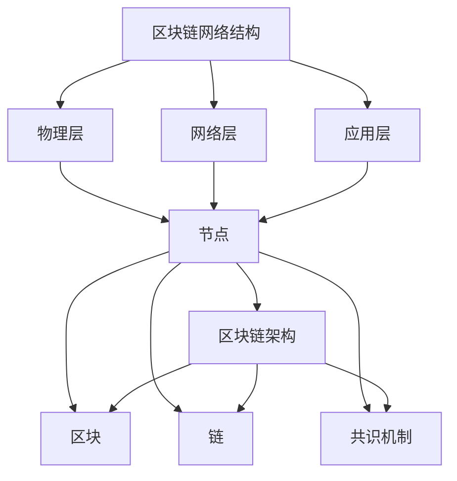
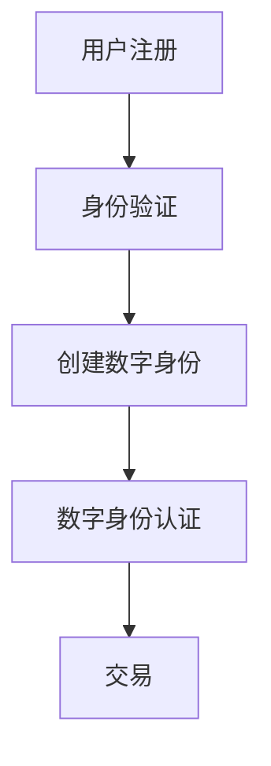

                 

# 《区块链在数字艺术品交易中的创新应用》

## 关键词
区块链，数字艺术品，交易，NFT，去中心化，智能合约，安全性

## 摘要
本文旨在探讨区块链技术在数字艺术品交易中的创新应用。通过详细分析区块链的基本概念、架构、核心原理以及其在数字艺术品交易中的具体应用案例，本文揭示了区块链技术如何提高数字艺术品交易的安全性和透明性。此外，本文还讨论了区块链技术在数字艺术品交易中的风险与挑战，并提出了相应的防范措施和解决策略。最后，本文对未来区块链技术在数字艺术品交易中的发展前景进行了展望。

----------------------------------------------------------------

### 目录大纲设计

《区块链在数字艺术品交易中的创新应用》的目录大纲设计如下，覆盖核心概念、技术原理、应用案例等，旨在为读者提供系统、全面的学习路径。

#### 第一部分：区块链与数字艺术品交易基础

- **第1章：区块链技术概述**
  - 1.1 区块链的基本概念
  - 1.2 数字艺术品交易概述
  - 1.3 区块链在数字艺术品交易中的应用前景

- **第2章：区块链核心概念与架构**
  - 2.1 区块链的基本架构
  - 2.2 数字身份与智能合约
  - 2.3 区块链安全性分析

#### 第二部分：区块链在数字艺术品交易中的应用

- **第3章：区块链在数字艺术品交易中的应用**
  - 3.1 数字艺术品版权交易
  - 3.2 数字艺术品拍卖
  - 3.3 数字艺术品收藏与交易
  - 3.4 数字艺术品市场分析与预测

#### 第三部分：区块链技术在数字艺术品交易中的创新应用

- **第4章：非同质化代币（NFT）与数字艺术品**
  - 4.1 NFT的基本概念
  - 4.2 NFT在数字艺术品交易中的应用
  - 4.3 NFT艺术品的评价与鉴赏

#### 第四部分：区块链在数字艺术品交易中的风险与挑战

- **第5章：区块链在数字艺术品交易中的风险与挑战**
  - 5.1 风险识别与防范
  - 5.2 挑战与解决

#### 第五部分：区块链在数字艺术品交易中的未来发展

- **第6章：区块链在数字艺术品交易中的未来发展**
  - 6.1 技术发展趋势
  - 6.2 创新应用案例
  - 6.3 未来市场趋势预测

#### 第六部分：区块链在数字艺术品交易中的实践指南

- **第7章：区块链在数字艺术品交易中的实践指南**
  - 7.1 开发环境搭建
  - 7.2 项目实战
  - 7.3 经验分享与建议

#### 第七部分：区块链在数字艺术品交易中的未来展望

- **第8章：区块链在数字艺术品交易中的未来展望**
  - 8.1 市场前景
  - 8.2 技术趋势
  - 8.3 政策法规
  - 8.4 社会文化影响

#### 第八部分：区块链在数字艺术品交易中的最佳实践

- **第9章：区块链在数字艺术品交易中的最佳实践**
  - 9.1 平台搭建与运营
  - 9.2 艺术品交易规则设计
  - 9.3 营销推广与用户增长
  - 9.4 持续优化与迭代

#### 第九部分：区块链在数字艺术品交易中的未来挑战与机遇

- **第10章：区块链在数字艺术品交易中的未来挑战与机遇**
  - 10.1 技术挑战
  - 10.2 法规挑战
  - 10.3 社会伦理挑战
  - 10.4 机遇与未来展望

通过这个目录大纲，本文旨在为读者提供一个全面、系统的学习路径，深入探讨区块链在数字艺术品交易中的创新应用。每个章节下的二级和三级目录可以根据具体内容进行细化，以适应不同的读者需求。此外，为了使内容更加丰富和易于理解，每个章节可以包含相关的Mermaid流程图、伪代码、数学公式和案例分析。

----------------------------------------------------------------

### 第一部分：区块链与数字艺术品交易基础

#### 第1章：区块链技术概述

区块链技术作为分布式账本技术的代表，自2008年比特币的诞生以来，逐渐成为金融科技领域的一大热点。本章将介绍区块链的基本概念、特点和工作原理，并探讨其在数字艺术品交易中的应用前景。

#### 1.1 区块链的基本概念

区块链是一种去中心化的数据库技术，由一系列按时间顺序排列的区块组成。每个区块包含一组交易记录，并使用密码学方法确保数据的完整性和安全性。区块链的核心特点包括：

- **去中心化**：区块链网络中的所有节点都具有相同的功能和权利，不存在中心化的控制点。这使得区块链系统更加抗篡改和可靠。
  
- **不可篡改**：区块链上的数据一旦记录，就难以被篡改或删除。每个区块都包含前一个区块的哈希值，形成一个链条，确保了数据的不可篡改性。

- **公开透明**：区块链上的交易记录是公开的，任何人都可以查询和验证。这提高了数据的透明度和信任度。

#### 1.2 数字艺术品交易概述

数字艺术品是指以数字形式创作的艺术品，包括数字绘画、数字雕塑、数字音乐等。与传统艺术品不同，数字艺术品具有以下几个特征：

- **可复制性**：数字艺术品可以被无限复制，但每个复制品都是独一无二的，这为数字艺术品市场带来了新的挑战和机遇。

- **易传输性**：数字艺术品可以轻松地在全球范围内传输和共享，这为艺术品的流通和交易提供了便利。

- **非物理性**：数字艺术品不是物理实体，不存在物理损坏或丢失的风险，但需要解决数据安全性和版权保护等问题。

数字艺术品交易的发展背景可以追溯到互联网和数字技术的普及。随着数字创作工具的进步和数字化生活方式的普及，数字艺术品逐渐成为艺术品市场的重要组成部分。市场现状显示，数字艺术品交易呈现出快速增长的趋势，吸引了大量投资者和收藏家。

#### 1.3 区块链在数字艺术品交易中的应用前景

区块链技术在数字艺术品交易中具有广阔的应用前景，主要体现在以下几个方面：

- **版权保护**：区块链技术可以确保数字艺术品的版权信息不可篡改，为创作者提供可靠的版权保护。通过区块链上的智能合约，可以自动执行版权授权和交易，减少版权纠纷。

- **交易透明性**：区块链上的交易记录是公开透明的，这有助于提高交易的可追溯性和信任度。买家和卖家可以轻松地查询交易记录，确保交易的真实性和合法性。

- **去中心化交易平台**：区块链技术可以构建去中心化的艺术品交易平台，减少交易中介的存在，降低交易成本，提高交易效率。去中心化平台还可以提供更公平、公正的交易环境，减少市场操纵和欺诈行为。

- **艺术品的真实性验证**：区块链技术可以记录艺术品的创作、交易和所有权转移等历史信息，确保艺术品的真实性和合法性。通过区块链上的防伪标签，可以验证艺术品的真伪，减少伪造艺术品的风险。

- **艺术品的定价与估值**：区块链技术可以提供实时的市场数据和分析，为数字艺术品的定价和估值提供依据。通过智能合约，可以自动化执行交易条款，确保定价的公正性和透明性。

总之，区块链技术在数字艺术品交易中的应用具有巨大的潜力，可以显著提高交易的安全性和透明性，推动数字艺术品市场的发展。随着区块链技术的不断成熟，预计将有更多的数字艺术品交易通过区块链进行，为艺术市场带来新的变革。

### 第2章：区块链核心概念与架构

#### 2.1 区块链的基本架构

区块链的基本架构是由多个组件构成的复杂系统，这些组件协同工作以实现去中心化的数据存储和可靠传输。以下是区块链的基本组成部分和它们在系统中的作用。

##### 2.1.1 区块链的基本组成部分

1. **区块（Block）**：
   - **定义**：区块是区块链的基本数据单元，包含了交易数据、区块头、和Merkle树根。
   - **作用**：每个区块都包含了最近一段时间内发生的交易记录，并存储在区块链上，成为整个区块链的基石。

2. **链（Chain）**：
   - **定义**：链是由多个有序连接的区块组成的链条，每个区块都包含一个时间戳和一个前一个区块的哈希值。
   - **作用**：链确保了区块链数据的顺序性和完整性。通过哈希链接，区块链上的每个区块都与其前后区块紧密相连，形成一个不可篡改的链条。

3. **节点（Node）**：
   - **定义**：节点是区块链网络中的参与者，可以是个人或组织，它们负责维护和验证区块链数据。
   - **作用**：节点通过下载、存储和传播区块链数据，确保整个网络的同步性。每个节点都拥有完整的区块链副本，从而避免了中心化的风险。

4. **共识机制（Consensus Mechanism）**：
   - **定义**：共识机制是区块链网络中节点之间达成一致的过程，用于确定哪个区块将添加到区块链上。
   - **作用**：共识机制确保区块链的可靠性和安全性，防止双花攻击和其他恶意行为。不同的共识机制有不同的实现方式，如工作量证明（PoW）、权益证明（PoS）和委托权益证明（DPoS）等。

##### 2.1.2 区块链网络的结构

区块链网络的结构可以分为三个层次：物理层、网络层和应用层。

1. **物理层**：
   - **定义**：物理层涉及节点之间的硬件和网络基础设施。
   - **作用**：物理层提供了节点之间的通信通道，确保区块链网络能够运行。节点可以通过公网、VPN或专用网络连接。

2. **网络层**：
   - **定义**：网络层处理节点之间的数据传输和同步。
   - **作用**：网络层实现了区块链的分布式特性，通过P2P（点对点）协议，节点可以相互通信、交换数据和验证交易。

3. **应用层**：
   - **定义**：应用层是区块链网络的实际应用，如数字货币、智能合约和数字艺术品交易等。
   - **作用**：应用层将区块链技术应用于实际业务场景，实现了区块链的落地和商业价值。

##### 2.1.3 区块链的共识机制

区块链的共识机制是确保区块链网络一致性的关键。以下是几种常见的共识机制：

1. **工作量证明（Proof of Work, PoW）**：
   - **原理**：节点通过解决计算难题来竞争记账权，首先解决难题的节点有权将区块添加到区块链上。
   - **优势**：PoW具有较高的安全性，防止恶意节点的攻击。
   - **劣势**：PoW消耗大量计算资源，能源消耗大。

2. **权益证明（Proof of Stake, PoS）**：
   - **原理**：根据节点持有的代币数量和锁定时间来决定记账权，持有代币越多、锁定时间越长的节点更有可能被选中。
   - **优势**：PoS相比PoW更节能，更高效。
   - **劣势**：PoS可能面临“富者愈富”的问题，即大额持有者更容易获得记账权。

3. **委托权益证明（Delegated Proof of Stake, DPoS）**：
   - **原理**：选举出一定数量的委托人，委托人代表网络进行验证和记账，委托人根据投票数量获得记账权。
   - **优势**：DPoS具有较高的可扩展性和决策效率。
   - **劣势**：可能存在委托人集中的风险。

通过理解区块链的基本架构和共识机制，我们可以更好地把握区块链技术的工作原理和应用场景。在接下来的章节中，我们将进一步探讨区块链在数字艺术品交易中的应用，以及如何利用区块链技术提高交易的安全性和透明性。

### Mermaid 流程图

下面是一个简单的 Mermaid 流程图，描述了区块链的基本组成部分和结构：



#### 2.2 数字身份与智能合约

区块链技术的一个重要应用领域是数字身份的建立与管理，以及智能合约的部署与执行。这两个概念在数字艺术品交易中扮演了关键角色，确保交易的安全性和透明性。

##### 2.2.1 数字身份的建立与认证

1. **数字身份的定义**：
   - **定义**：数字身份是通过区块链技术创建和管理的虚拟身份，用于标识和验证用户的身份。
   - **特点**：数字身份具有不可篡改性、唯一性和匿名性，可以与真实世界的身份进行绑定。

2. **数字身份的建立**：
   - **过程**：用户通过注册和验证过程，在区块链上创建自己的数字身份。通常，这个过程包括提供身份证明、通过多重签名认证等步骤。
   - **优势**：数字身份的建立可以减少对第三方身份验证机构的依赖，提高交易的效率和安全性。

3. **数字身份的认证**：
   - **过程**：在区块链上，数字身份的认证是通过公钥加密算法实现的。用户在交易时使用私钥进行签名，证明其身份的真实性。
   - **优势**：数字身份的认证过程是公开透明的，任何节点都可以验证交易的真实性，提高了交易的可信度。

##### 2.2.2 智能合约的原理与实现

1. **智能合约的定义**：
   - **定义**：智能合约是一种自动执行合同条款的计算机程序，基于区块链技术运行。
   - **特点**：智能合约是去中心化的，不受人为干预，一旦触发条件，合同条款会自动执行。

2. **智能合约的原理**：
   - **原理**：智能合约通过编程语言（如Solidity）编写，其逻辑和规则嵌入在区块链上。当满足预定的条件时，智能合约自动执行特定的操作，如转移代币、记录交易等。
   - **优势**：智能合约减少了人工干预和中介成本，提高了交易的效率和安全性。

3. **智能合约的实现**：
   - **实现**：智能合约的编写和部署通常涉及以下步骤：
     - **编写**：使用智能合约编程语言（如Solidity）编写合约代码。
     - **编译**：将合约代码编译为字节码，这是区块链能够理解和执行的形式。
     - **部署**：将编译后的合约代码部署到区块链上，通常通过交易发起。
     - **验证**：部署后的合约代码需要通过区块链网络中的节点验证，以确保其有效性和安全性。

##### 2.2.3 智能合约在数字艺术品交易中的应用

1. **应用场景**：
   - **版权交易**：智能合约可以用于数字艺术品的版权交易，确保交易的透明性和不可篡改性。
   - **拍卖**：智能合约可以自动执行拍卖过程，包括出价、竞价和支付，确保拍卖的公正性和效率。
   - **收藏与交易**：智能合约可以记录数字艺术品的所有权和交易历史，提高收藏品的透明度和可追溯性。

2. **优势**：
   - **透明性**：智能合约的代码是公开的，任何人都可以查看和验证，提高了交易的可追溯性和透明度。
   - **安全性**：智能合约通过加密算法和共识机制确保交易数据的安全性和完整性，防止欺诈行为。
   - **自动化**：智能合约可以自动化执行交易流程，减少了人工干预和中介成本，提高了交易的效率。

3. **案例分析**：
   - **案例1**：某数字艺术品交易平台利用智能合约实现了版权交易和所有权转移。艺术家通过智能合约发布版权信息，买家通过智能合约购买版权，交易记录被永久存储在区块链上。
   - **案例2**：某拍卖平台利用智能合约实现了自动化的拍卖过程。买家通过智能合约出价，竞价结束后，最高出价者通过智能合约支付拍卖款项，拍卖结果被记录在区块链上。

通过数字身份和智能合约的应用，区块链技术在数字艺术品交易中实现了更高的安全性和透明性，为艺术品市场的创新和发展提供了有力支持。

### Mermaid 流程图

下面是一个简单的 Mermaid 流程图，描述了数字身份的建立与认证过程：



### 伪代码

以下是数字身份建立与认证过程的伪代码描述：

```python
# 数字身份建立与认证伪代码

# 用户注册
class UserRegistration:
    def register_user(self, user_data):
        # 收集用户数据，如姓名、邮箱、密码等
        self.user_data = user_data
        # 验证用户数据
        self.validate_user_data()

    def validate_user_data(self):
        # 验证用户数据的完整性
        if not self.user_data.is_valid():
            raise ValueError("Invalid user data")

# 数字身份创建
class DigitalIdentity:
    def create_identity(self, user_registration):
        # 创建数字身份
        self.identity = {
            "public_key": generate_public_key(),
            "private_key": generate_private_key(),
            "user_registration": user_registration
        }

# 数字身份认证
class DigitalIdentityAuthentication:
    def authenticate(self, public_key, signature):
        # 验证数字身份
        if not verify_signature(public_key, signature):
            raise AuthenticationError("Invalid signature")
        # 记录认证结果
        self.authentication_result = "Successful"

# 交易
class Transaction:
    def execute_transaction(self, buyer, seller, amount):
        # 执行交易
        if not verify_identity(buyer) or not verify_identity(seller):
            raise AuthenticationError("Invalid identity")
        # 记录交易
        self.transaction_record = {
            "buyer": buyer,
            "seller": seller,
            "amount": amount
        }
        # 更新区块链
        update_blockchain(self.transaction_record)
```

### 数学公式

区块链技术中涉及到的一些数学公式，如加密算法的哈希函数计算公式：

$$
H = hashfunction(k)
$$

其中，$H$ 表示哈希值，$hashfunction$ 表示哈希函数，$k$ 表示输入的数据。

### 案例分析

以下是一个简单的案例分析，描述了区块链在数字艺术品交易中的应用：

# 案例分析：XXX艺术品区块链交易平台

XXX艺术品区块链交易平台是一个基于区块链的去中心化艺术品交易平台。以下是该平台在数字身份和智能合约方面的应用：

1. **数字身份的建立与认证**：
   - 艺术家注册：艺术家在平台注册时，需要提供身份证明文件，如身份证、艺术作品等，并通过区块链网络进行验证。
   - 数字身份创建：平台生成艺术家的数字身份，包括公钥和私钥，并将其存储在区块链上。
   - 数字身份认证：在交易时，艺术家使用私钥对交易信息进行签名，买家可以验证签名以确认艺术家身份的真实性。

2. **智能合约的应用**：
   - 艺术品版权交易：艺术家可以通过智能合约发布艺术品的版权信息，买家通过智能合约支付版权费用，交易记录永久存储在区块链上。
   - 艺术品拍卖：平台通过智能合约实现自动化拍卖过程，买家通过智能合约出价，竞价结束后，最高出价者通过智能合约支付拍卖款项。

通过数字身份和智能合约的应用，XXX艺术品区块链交易平台实现了艺术品交易的透明性和安全性，减少了交易中的中介成本，提高了市场效率。

### 第二部分：区块链在数字艺术品交易中的应用

#### 第3章：区块链在数字艺术品交易中的应用

区块链技术在数字艺术品交易中的应用正在逐渐改变这一领域。本章将探讨区块链在数字艺术品交易中的多个应用场景，包括版权交易、拍卖、收藏与交易以及市场分析与预测。

##### 3.1 数字艺术品版权交易

数字艺术品版权交易是指创作者通过区块链技术保护其艺术品的版权，确保版权的合法性和透明性。以下是区块链在数字艺术品版权交易中的应用：

1. **版权注册**：
   - **定义**：版权注册是指创作者将艺术品的版权信息记录在区块链上，以证明其所有权。
   - **过程**：创作者通过区块链平台上传艺术品的版权信息，包括作品名称、创作时间、版权声明等，这些信息被永久存储在区块链上，形成不可篡改的版权记录。
   - **优势**：版权注册有助于防止抄袭和侵权行为，创作者可以通过区块链上的版权记录证明其作品的原创性。

2. **版权交易**：
   - **定义**：版权交易是指创作者将艺术品的版权转让给其他人或机构的过程。
   - **过程**：创作者可以通过区块链平台发布版权转让信息，买家可以通过智能合约购买版权。交易记录会被永久存储在区块链上，确保交易的透明性和不可篡改性。
   - **优势**：通过区块链技术，版权交易过程更加高效，减少了中介环节，降低了交易成本。

3. **案例分析**：
   - **案例1**：XXX艺术品版权交易平台通过区块链技术，实现了艺术品的版权注册和交易。艺术家可以通过平台上传版权信息，买家可以通过智能合约购买版权，交易记录被永久存储在区块链上。

##### 3.2 数字艺术品拍卖

数字艺术品拍卖是指通过区块链技术实现艺术品的竞价和销售过程。以下是区块链在数字艺术品拍卖中的应用：

1. **拍卖流程**：
   - **定义**：拍卖流程是指通过区块链平台进行的艺术品竞价过程。
   - **过程**：艺术家在区块链平台上发布艺术品拍卖信息，设定拍卖起始价、最高出价和拍卖期限。买家可以在拍卖期间通过智能合约出价，出价信息实时更新并记录在区块链上。
   - **优势**：区块链技术确保了拍卖过程的公开透明，所有出价和拍卖结果都被记录在区块链上，不可篡改。

2. **案例分析**：
   - **案例2**：XXX艺术品区块链拍卖平台利用区块链技术，实现了艺术品的公开拍卖。买家可以通过智能合约出价，竞价结束后，最高出价者通过智能合约支付拍卖款项，拍卖结果被永久存储在区块链上。

##### 3.3 数字艺术品收藏与交易

数字艺术品收藏与交易是指通过区块链技术实现艺术品的收藏、展示和交易过程。以下是区块链在数字艺术品收藏与交易中的应用：

1. **收藏登记**：
   - **定义**：收藏登记是指收藏家通过区块链平台记录其收藏的艺术品信息。
   - **过程**：收藏家在区块链平台上注册并上传其收藏的艺术品信息，包括艺术品名称、创作者、创作时间等，这些信息被永久存储在区块链上。
   - **优势**：收藏登记有助于建立艺术品收藏的透明历史，减少收藏过程中的欺诈行为。

2. **艺术品交易**：
   - **定义**：艺术品交易是指收藏家之间通过区块链平台进行艺术品交换的过程。
   - **过程**：收藏家可以在区块链平台上浏览其他收藏家的艺术品，通过智能合约进行交易。交易记录会被永久存储在区块链上，确保交易的透明性和不可篡改性。
   - **优势**：通过区块链技术，艺术品交易更加高效，收藏家可以轻松地展示和交易其收藏的艺术品。

3. **案例分析**：
   - **案例3**：XXX艺术品区块链收藏交易平台通过区块链技术，实现了艺术品的收藏和交易。收藏家可以在平台上浏览和交易艺术品，交易记录被永久存储在区块链上。

##### 3.4 数字艺术品市场分析与预测

区块链技术还可以用于数字艺术品市场的数据分析和预测，为市场参与者提供有价值的信息。以下是区块链在数字艺术品市场分析与预测中的应用：

1. **数据收集与存储**：
   - **定义**：数据收集与存储是指通过区块链平台收集和存储数字艺术品交易的相关数据。
   - **过程**：区块链平台可以收集并存储数字艺术品交易的数据，如交易价格、交易量、交易时间等，这些数据被永久存储在区块链上。
   - **优势**：区块链技术确保了数据的透明性和不可篡改性，为市场分析提供了可靠的数据来源。

2. **市场预测**：
   - **定义**：市场预测是指利用区块链上的数据进行分析，预测数字艺术品市场的未来趋势。
   - **过程**：市场分析人员可以通过区块链上的数据，利用数据分析工具进行市场预测。这些预测结果可以帮助市场参与者做出更明智的决策。
   - **优势**：通过区块链技术，市场预测更加准确和可靠，减少了人为干预和主观判断。

3. **案例分析**：
   - **案例4**：XXX艺术品区块链数据分析平台通过区块链技术，收集并存储了大量的数字艺术品交易数据。市场分析人员利用这些数据进行市场预测，为投资者和收藏家提供了有价值的信息。

通过以上应用，区块链技术在数字艺术品交易中提高了交易的透明性、安全性和效率。随着区块链技术的不断成熟，预计将有更多的数字艺术品交易通过区块链进行，为艺术品市场带来更多的创新和变革。

### 数字艺术品版权交易的传统问题

在传统的数字艺术品交易市场中，存在一些突出的问题，这些问题严重影响了创作者和市场的利益。以下是几个主要问题：

1. **版权纠纷**：在传统市场中，艺术品的版权保护难度较大，创作者的权益经常受到侵犯。由于缺乏有效的版权登记和保护机制，创作者很难证明自己对作品的拥有权，导致版权纠纷频发。

2. **交易不透明**：传统艺术品交易过程中，中介机构扮演了重要角色。这些中介机构不仅增加了交易成本，还可能导致交易信息不透明，使得交易双方的权益难以保障。

3. **信息篡改风险**：在传统交易中，由于信息存储在中心化的系统中，存在被篡改的风险。一旦信息被篡改，将严重影响交易的公正性和可靠性。

4. **交易效率低下**：传统艺术品交易流程复杂，涉及多个中介环节，导致交易效率低下。从交易协商到支付结算，往往需要耗费大量时间和资源。

5. **安全性问题**：在传统交易中，由于缺乏有效的加密技术，交易信息可能被窃取或泄露，导致创作者和买家的利益受损。

这些问题不仅影响了创作者的权益，也限制了艺术品市场的健康发展。随着区块链技术的发展，这些问题有望得到有效解决。区块链技术通过去中心化、不可篡改和安全透明的特性，为数字艺术品交易提供了一种全新的解决方案。

### 区块链在数字艺术品版权交易中的应用

区块链技术为数字艺术品版权交易提供了创新的解决方案，有效解决了传统市场中的各种问题。以下是区块链在数字艺术品版权交易中的应用：

1. **版权登记与保护**：
   - **定义**：版权登记与保护是指创作者通过区块链平台登记其作品的版权信息，并获得不可篡改的版权证明。
   - **过程**：创作者可以在区块链平台上上传其艺术品的版权信息，包括作品名称、创作者信息、创作时间等。这些信息会被永久记录在区块链上，形成不可篡改的版权记录。
   - **优势**：区块链上的版权登记具有高度透明性和不可篡改性，创作者可以轻松证明其对作品的拥有权，减少了版权纠纷的风险。

2. **交易透明性**：
   - **定义**：交易透明性是指交易过程公开、可查询，所有交易记录都被记录在区块链上，供所有人查看。
   - **过程**：在区块链平台上，艺术品的交易过程（包括价格、交易双方、交易时间等）都会被记录在区块链上，并公开透明。买家和卖家可以随时查询交易记录，确保交易的透明性和公正性。
   - **优势**：区块链上的交易记录是公开透明的，有助于建立市场信任，减少中介环节，降低交易成本。

3. **安全性**：
   - **定义**：安全性是指通过区块链技术保护艺术品交易过程中的信息不被篡改或泄露。
   - **过程**：区块链技术使用加密算法保护交易信息，确保数据的安全性和隐私性。此外，区块链上的智能合约可以自动化执行交易条款，减少人为干预，提高交易的安全性。
   - **优势**：区块链技术提供了高效的安全解决方案，确保艺术品交易过程中信息的安全性和隐私性。

4. **交易效率**：
   - **定义**：交易效率是指通过区块链技术提高艺术品交易的速度和便捷性。
   - **过程**：区块链技术通过去中心化的特性，减少了交易中的中介环节，提高了交易效率。交易双方可以直接通过区块链平台进行交易，无需繁琐的手续和等待时间。
   - **优势**：区块链技术提高了交易效率，使艺术品交易更加快捷和方便。

5. **案例分析**：
   - **案例1**：XXX艺术品版权交易平台利用区块链技术，实现了艺术品的版权登记和交易。创作者可以在平台上登记版权信息，买家可以通过智能合约购买版权，交易记录被永久存储在区块链上。

通过以上应用，区块链技术在数字艺术品版权交易中提供了有效的解决方案，提高了交易的透明性、安全性和效率，为艺术品市场的健康发展提供了有力支持。

### 案例分析：XXX艺术品版权交易平台

XXX艺术品版权交易平台是一个基于区块链的去中心化平台，专门为数字艺术品的创作者和买家提供服务。以下是对该平台在数字艺术品版权交易中应用的详细描述：

1. **版权注册过程**：
   - 创作者在平台上注册并上传其数字艺术品的版权信息，包括作品名称、创作者信息、创作时间等。上传的信息通过区块链上的智能合约进行验证和存储。
   - 平台利用区块链的加密算法和分布式账本技术，确保艺术品的版权信息不可篡改。每次上传或更新信息时，都会生成一个唯一的区块链交易记录，确保版权的透明性和可追溯性。
   - 创作者可以通过区块链上的智能合约获得版权证明，这个证明不仅能够证明创作者对作品的拥有权，还能够作为法律证据在版权纠纷中发挥作用。

2. **版权交易流程**：
   - 创作者在平台上发布版权转让信息，包括作品名称、版权转让价格、转让条款等。买家可以在平台上浏览和选择购买。
   - 买家通过智能合约发起购买请求，智能合约自动执行交易条款，包括支付版权转让费用、更新艺术品所有权信息等。交易过程全程记录在区块链上，不可篡改。
   - 平台通过智能合约自动处理交易，提高了交易的效率和安全性。买家支付完成后，版权信息会自动更新，确保版权转让的合法性和透明性。

3. **版权信息追溯**：
   - 在区块链上，每个艺术品的版权历史都会被永久记录，包括创作者、版权转让历史、交易记录等。任何人都可以通过区块链浏览器查询艺术品的版权信息，确保信息的公开透明。
   - 通过区块链的分布式账本，艺术品的版权信息不可篡改，买家可以放心购买具有合法版权的艺术品。创作者也可以通过区块链追溯其作品的流通和转让情况，确保自己的权益。

4. **案例分析**：
   - **案例1**：艺术家小明在XXX艺术品版权交易平台注册并上传了一幅数字绘画，并进行了版权登记。某买家在平台上浏览到这幅画作，并通过智能合约购买了版权。交易记录被永久存储在区块链上，确保交易的透明性和不可篡改性。
   - **案例2**：艺术家小红在平台发布了一幅即将发布的数字艺术品的版权转让信息。买家小华通过智能合约购买了这幅作品的版权，交易过程全程记录在区块链上，确保了交易的公开透明。

通过以上应用，XXX艺术品版权交易平台成功利用区块链技术解决了传统艺术品交易中的版权纠纷、信息不透明和安全性问题，为创作者和买家提供了一个安全、透明和高效的版权交易平台。

### 第3章：区块链在数字艺术品交易中的应用

#### 3.2 数字艺术品拍卖

数字艺术品拍卖是区块链技术在数字艺术品交易中的另一重要应用。通过区块链技术，拍卖过程变得更加公开、透明和高效。以下是区块链在数字艺术品拍卖中的应用：

##### 3.2.1 拍卖的传统模式

在传统的艺术品拍卖市场中，拍卖过程通常涉及以下几个步骤：

1. **艺术品鉴定**：拍卖行需要对艺术品进行鉴定，确保其真伪和价值。
2. **拍卖宣传**：拍卖行通过广告、宣传材料等方式，吸引买家参与拍卖。
3. **竞拍环节**：买家在现场或通过网络参与竞拍，出价最高者获得艺术品。
4. **支付结算**：买家支付拍卖款项，拍卖行收取佣金，并将艺术品交付给买家。
5. **记录保存**：拍卖结果和相关信息需要记录和保存，以便日后查询。

传统拍卖模式存在以下问题：

- **信息不透明**：拍卖过程中的信息可能不完全公开，买家难以了解竞拍历史和艺术品价值。
- **成本高**：传统拍卖涉及中介环节，交易成本较高。
- **安全风险**：交易过程中存在信息泄露和资金风险。

##### 3.2.2 区块链拍卖的优势

区块链技术在数字艺术品拍卖中提供了以下优势：

1. **去中心化**：区块链拍卖平台去除了传统拍卖中的中介环节，买家和卖家可以直接进行交易，降低了交易成本。
2. **透明性**：区块链拍卖的所有交易记录都是公开透明的，买家可以随时查看拍卖历史、出价记录等信息。
3. **安全性**：区块链使用加密技术确保交易数据的安全性和隐私性，减少了信息泄露和资金风险。
4. **高效性**：区块链拍卖通过智能合约自动化执行拍卖流程，减少了人工干预，提高了交易效率。

##### 3.2.3 案例分析：XXX艺术品区块链拍卖平台

XXX艺术品区块链拍卖平台是一个典型的区块链拍卖应用案例。以下是该平台的拍卖流程和优势：

1. **拍卖流程**：

   - **艺术品上架**：艺术家将艺术品上传到平台，并设定拍卖起始价、最高出价和拍卖期限。
   - **出价过程**：买家可以在拍卖期间通过智能合约出价，出价信息实时更新并记录在区块链上。
   - **竞价结束**：拍卖期限结束时，最高出价者通过智能合约支付拍卖款项，交易记录被永久存储在区块链上。
   - **所有权转移**：买家支付完成后，艺术品的所有权自动转移给买家，交易记录公开透明。

2. **优势**：

   - **去中心化**：XXX艺术品区块链拍卖平台去除了传统拍卖中介，买家和卖家可以直接进行交易，降低了交易成本。
   - **透明性**：所有出价记录和拍卖结果都被记录在区块链上，买家可以随时查看，确保交易的公开透明。
   - **安全性**：通过智能合约和区块链技术，交易数据的安全性和隐私性得到保障，减少了信息泄露和资金风险。
   - **高效性**：拍卖流程通过智能合约自动化执行，减少了人工干预，提高了交易效率。

通过上述案例分析，我们可以看到区块链技术在数字艺术品拍卖中的应用不仅解决了传统拍卖模式中的问题，还为艺术品市场带来了更多创新和机遇。

### 3.3 数字艺术品收藏与交易的传统问题

在传统的数字艺术品收藏与交易市场中，存在一些显著的问题，这些问题不仅影响了收藏者的权益，也限制了市场的健康发展。以下是几个主要问题：

1. **交易不透明**：传统收藏与交易过程中，中介机构的参与使得交易信息不透明，收藏者难以了解交易的真实情况，存在信息不对称的风险。

2. **所有权争议**：由于缺乏有效的验证机制，数字艺术品的所有权容易发生争议。收藏者可能无法证明其对特定作品的拥有权，特别是在多重转手的情况下。

3. **安全性问题**：传统交易过程中，数字艺术品文件容易受到黑客攻击、恶意软件和计算机病毒的侵害，导致作品丢失或被篡改。

4. **交易成本高**：传统交易涉及多个中介环节，包括鉴定、拍卖、支付等，交易成本较高，且流程繁琐，影响了交易的效率。

5. **流动性低**：数字艺术品的流动性较低，收藏者往往难以快速出售其藏品，导致藏品长期闲置，影响收藏者的资金回流。

6. **真实性验证困难**：在传统市场中，验证数字艺术品的真实性和合法性是一个难题。由于数字艺术品可以被轻松复制和篡改，收藏者难以确保其收藏品的真实性和合法性。

这些问题在传统数字艺术品收藏与交易市场中普遍存在，严重影响了市场的效率和信任度。随着区块链技术的兴起，这些问题有望得到有效解决。

### 区块链解决方案

区块链技术在数字艺术品收藏与交易中提供了创新的解决方案，有效解决了传统市场中的各种问题。以下是区块链解决方案的具体应用：

1. **透明性**：
   - **定义**：区块链上的交易记录是公开透明的，所有参与者都可以查看交易信息。
   - **过程**：数字艺术品收藏与交易的所有信息（包括收藏记录、交易历史、价格变化等）都会被记录在区块链上，并公开透明。收藏者可以随时查看艺术品的交易记录，确保信息的透明性和可追溯性。

2. **可验证性**：
   - **定义**：区块链上的信息具有高度的可验证性，可以通过区块链技术验证信息的真实性和合法性。
   - **过程**：数字艺术品的真实性和合法性可以通过区块链上的智能合约进行验证。创作者可以通过区块链平台注册其数字艺术品，并上传相关证明文件，确保艺术品信息的真实性和合法性。收藏者在购买艺术品时，可以查看这些验证信息，确保其收藏品的真实性和合法性。

3. **安全性**：
   - **定义**：区块链使用加密算法保护交易信息的安全性和隐私性，确保数据不被篡改和泄露。
   - **过程**：区块链技术使用加密算法保护交易数据，确保数据在传输和存储过程中不被篡改和泄露。此外，区块链上的智能合约可以自动化执行交易条款，减少人为干预，提高交易的安全性。

4. **所有权保护**：
   - **定义**：区块链技术可以确保数字艺术品的所有权不被侵犯，保护创作者和收藏者的权益。
   - **过程**：数字艺术品的所有权可以通过区块链上的智能合约进行保护和转移。创作者在区块链平台上注册其艺术品，并设定所有权转移规则。当艺术品所有权发生转移时，智能合约会自动执行所有权转移流程，确保所有权转移的合法性和安全性。

5. **交易效率**：
   - **定义**：区块链技术可以提高数字艺术品收藏与交易的效率，减少交易流程中的中介环节，降低交易成本。
   - **过程**：区块链技术通过去中心化的特性，减少了交易中的中介环节，使得交易流程更加高效。收藏者可以直接在区块链平台上进行交易，无需通过中介机构，降低了交易成本。

6. **流动性提升**：
   - **定义**：区块链技术可以提升数字艺术品的流动性，使收藏者能够更快速地出售其藏品。
   - **过程**：区块链上的数字艺术品交易记录是公开透明的，收藏者可以更容易地吸引买家。此外，区块链技术可以提高交易的效率，使收藏者能够更快速地完成交易，提高藏品的流动性。

通过上述解决方案，区块链技术为数字艺术品收藏与交易提供了更安全、更透明、更高效的交易平台，有效解决了传统市场中的问题，推动了数字艺术品市场的健康发展。

### 案例分析：XXX艺术品区块链收藏交易平台

XXX艺术品区块链收藏交易平台是一个基于区块链的去中心化平台，旨在为数字艺术品的收藏与交易提供安全、透明和高效的解决方案。以下是该平台的详细描述及其在数字艺术品收藏与交易中的应用：

1. **平台注册**：
   - 用户在平台注册时，需要通过身份验证，确保用户的真实性。平台使用区块链技术进行身份验证，确保用户身份的可信度。

2. **数字艺术品认证**：
   - 创作者在平台上上传其数字艺术品，并通过区块链技术进行认证。平台利用智能合约验证艺术品的真实性和合法性，确保创作者对艺术品的拥有权。
   - 认证过程包括上传艺术品文件、创作者身份证明和艺术品创作时间等信息。这些信息会被永久记录在区块链上，确保数据的透明性和不可篡改性。

3. **收藏与交易**：
   - 用户可以在平台上浏览和收藏数字艺术品。在收藏艺术品时，平台通过智能合约记录收藏信息，确保收藏记录的透明性和不可篡改性。
   - 当用户决定出售其收藏的艺术品时，可以通过平台发布出售信息。买家可以在平台上查看出售信息，并通过智能合约进行出价。
   - 出价过程实时记录在区块链上，确保交易的公开透明。当最高出价者支付完成后，艺术品的所有权自动转移给买家，交易记录会被永久存储在区块链上。

4. **交易历史记录**：
   - 平台通过区块链技术记录数字艺术品的交易历史，包括每次交易的买家、价格、时间和交易详情。这些信息对用户公开透明，用户可以随时查询艺术品的交易记录。
   - 通过交易历史记录，用户可以了解艺术品的价格走势和交易情况，有助于评估艺术品的真实价值和投资潜力。

5. **案例分析**：
   - **案例1**：艺术家小张在XXX艺术品区块链收藏交易平台上传了一幅数字画作，并通过智能合约进行认证。收藏家小李在平台上浏览到这幅画作，并通过智能合约购买。交易记录被永久存储在区块链上，确保了交易的公开透明。
   - **案例2**：收藏家小王在平台上收藏了数字艺术品，并在一段时间后决定出售。他通过平台发布出售信息，买家小张在平台上出价，并最终通过智能合约完成交易。交易记录被永久存储在区块链上，确保了收藏品的真实性和合法性。

通过这些应用，XXX艺术品区块链收藏交易平台成功解决了传统市场中的问题，提供了更安全、更透明、更高效的数字艺术品收藏与交易环境，推动了数字艺术品市场的健康发展。

### 3.4 数字艺术品市场分析与预测

区块链技术在数字艺术品市场的数据收集、分析和预测方面提供了重要的工具。通过区块链，市场参与者可以获取透明、可信的数据，从而进行更准确的决策和预测。

#### 3.4.1 市场数据分析方法

1. **交易数据收集**：
   - **定义**：交易数据收集是指通过区块链技术收集数字艺术品的交易数据，包括交易价格、交易量、交易时间等。
   - **过程**：区块链平台会自动记录每个交易的详细信息，并将其存储在区块链上。这些数据可以被市场分析人员收集和分析。

2. **数据清洗和预处理**：
   - **定义**：数据清洗和预处理是指对收集到的交易数据进行处理，以去除噪声和异常值，并转换为适合分析的形式。
   - **过程**：市场分析人员需要清洗交易数据，去除重复和异常的交易记录，并对数据进行标准化处理，如归一化、去极值等。

3. **数据分析工具**：
   - **定义**：数据分析工具是指用于处理和解释交易数据的软件和算法。
   - **过程**：市场分析人员可以使用各种数据分析工具，如Python的Pandas库、R语言等，对交易数据进行分析，提取有用的信息。

#### 3.4.2 区块链技术的市场影响

区块链技术在数字艺术品市场中的影响主要体现在以下几个方面：

1. **提高交易透明度**：
   - **定义**：提高交易透明度是指通过区块链技术，使数字艺术品交易的信息更加公开、可查。
   - **过程**：区块链上的交易记录是公开的，任何人都可以查看。这有助于市场参与者了解市场的真实情况，减少信息不对称。

2. **降低交易成本**：
   - **定义**：降低交易成本是指通过区块链技术，减少数字艺术品交易中的中介环节和手续费用。
   - **过程**：区块链的去中心化特性使得交易过程更加高效，减少了中介机构的参与，降低了交易成本。

3. **增强数据可信性**：
   - **定义**：增强数据可信性是指通过区块链技术，确保数字艺术品交易数据的真实性和可靠性。
   - **过程**：区块链上的数据是经过加密和分布式存储的，任何篡改都会被其他节点检测到，从而确保数据的可信性。

#### 3.4.3 未来市场趋势预测

基于区块链技术的市场数据分析和预测，可以揭示未来市场的发展趋势。以下是几个可能的预测：

1. **市场规模扩大**：
   - **定义**：市场规模扩大是指随着区块链技术的普及，数字艺术品交易市场的规模将持续增长。
   - **过程**：随着更多用户接受区块链技术，数字艺术品交易将吸引更多投资者和收藏家，市场规模将不断扩大。

2. **交易模式创新**：
   - **定义**：交易模式创新是指随着区块链技术的发展，数字艺术品交易的模式将更加多样化和创新。
   - **过程**：未来可能会出现更多的去中心化交易平台，以及新的数字艺术品金融产品，如数字艺术品基金、保险等。

3. **隐私保护加强**：
   - **定义**：隐私保护加强是指随着用户对隐私保护的需求增加，区块链技术将提供更好的隐私保护措施。
   - **过程**：为了保护用户隐私，区块链技术可能会采用更多的隐私保护技术，如零知识证明、同态加密等。

通过区块链技术的应用，数字艺术品市场将变得更加透明、高效和可信。未来，随着区块链技术的不断成熟，数字艺术品市场将继续发展，为艺术爱好者、投资者和创作者带来更多的机遇。

### 第4章：非同质化代币（NFT）与数字艺术品

#### 4.1 NFT的基本概念

非同质化代币（Non-Fungible Token，简称NFT）是一种基于区块链技术的独特数字资产，与同质化代币（如比特币和以太币）不同，NFT具有不可替代性和唯一性。以下是NFT的基本概念：

- **定义**：NFT是一种代表数字或物理资产所有权的唯一代币，其内在价值与所代表资产的价值紧密相关。
- **特性**：NFT具有以下几个主要特性：
  - **唯一性**：每个NFT都是独一无二的，无法与其他NFT互换。
  - **不可分割性**：NFT不能被分割成更小的部分，例如，一个NFT艺术品不能被分成两份单独出售。
  - **可验证性**：NFT的所有权和相关信息可以通过区块链技术进行验证和追踪。

#### 4.2 NFT的技术原理

NFT的技术原理基于区块链和智能合约：

- **区块链**：NFT存储在区块链上，每个NFT都有一个唯一的标识符（Token ID）和相关的元数据（如艺术品图像、音频文件等）。
- **智能合约**：NFT的创建、买卖和转移过程通常通过智能合约进行自动化。智能合约定义了NFT的交易规则和执行逻辑。

#### 4.3 NFT在数字艺术品交易中的应用

NFT在数字艺术品交易中发挥了重要作用，为艺术家和收藏家提供了新的机会。以下是NFT在数字艺术品交易中的应用：

1. **所有权证明**：
   - **定义**：NFT作为数字艺术品的所有权证明，确保艺术品的真实性和合法性。
   - **过程**：艺术家将数字艺术品上传到区块链，并通过智能合约创建NFT。NFT持有者即被认为是该数字艺术品的合法所有者，NFT的转让记录永久存储在区块链上。

2. **唯一性**：
   - **定义**：NFT确保数字艺术品具有唯一性，每个NFT都代表一个独特的艺术品。
   - **过程**：每个NFT都有唯一的Token ID，确保数字艺术品不可复制和替代，提高了艺术品的收藏价值和市场认可度。

3. **交易便捷性**：
   - **定义**：NFT使数字艺术品交易过程更加便捷和高效。
   - **过程**：买家可以通过数字钱包购买NFT，交易记录即时记录在区块链上。这使得数字艺术品交易可以瞬间完成，无需繁琐的手续。

4. **增值潜力**：
   - **定义**：NFT为数字艺术品带来了增值潜力，尤其是限量版和稀缺艺术品。
   - **过程**：限量版和稀缺NFT往往具有较高的收藏价值，因为它们具有唯一性和稀缺性。随着市场的认可和需求的增加，这些NFT的价值可能不断上涨。

#### 4.4 NFT艺术品的交易流程

NFT艺术品的交易流程相对简单，但需要确保交易的合法性和安全性。以下是NFT艺术品交易的基本流程：

1. **艺术品的创建**：
   - **定义**：艺术家通过智能合约创建NFT，并将数字艺术品的元数据上传到区块链。
   - **过程**：艺术家编写智能合约代码，指定NFT的初始所有者、艺术家收益比例等。智能合约被部署到区块链上，生成NFT。

2. **艺术品的展示与宣传**：
   - **定义**：艺术家在数字平台上展示NFT艺术品，吸引潜在买家。
   - **过程**：艺术家可以通过社交媒体、艺术网站等平台宣传其NFT艺术品，提高知名度。

3. **出价与竞价**：
   - **定义**：买家通过数字钱包对NFT艺术品进行出价或竞价。
   - **过程**：买家在NFT市场平台上出价，出价信息通过智能合约记录在区块链上。出价过程可以是公开竞价，也可以是私下协商。

4. **交易确认与所有权转移**：
   - **定义**：最高出价者通过支付智能合约确认交易，所有权自动转移给买家。
   - **过程**：最高出价者通过数字钱包支付出价金额，智能合约自动执行交易条款，包括NFT的所有权转移和艺术家收益分配。交易记录永久存储在区块链上。

5. **艺术品交付**：
   - **定义**：买家获取NFT艺术品，并有权使用和展示该艺术品。
   - **过程**：买家通过数字钱包获取NFT艺术品，并将其存储在自己的数字钱包中。买家可以自由使用和展示该艺术品，但所有权仍由NFT持有。

通过NFT技术，数字艺术品交易变得更加透明、高效和安全。NFT不仅为艺术家提供了新的收入来源，也为收藏家提供了独特的收藏体验。随着区块链技术的不断发展，NFT在数字艺术品交易中的应用将更加广泛和多样化。

### 案例分析：XXX NFT艺术品交易平台

XXX NFT艺术品交易平台是一个基于区块链的去中心化平台，专注于数字艺术品的交易和收藏。以下是该平台的具体案例描述，展示了NFT艺术品交易的全过程：

1. **艺术品的创建**：
   - 艺术家小张在XXX NFT艺术品交易平台创建了一幅数字绘画。他将画作上传到平台，并编写了一个智能合约。智能合约包含了艺术品的元数据，如创作者信息、画作描述、初始定价等。

2. **艺术品的展示与宣传**：
   - 小张在平台发布了这幅数字绘画，并利用社交媒体和艺术社区宣传。他通过平台和社交媒体提高了这幅画作的关注度，吸引了潜在买家。

3. **出价与竞价**：
   - 收藏家小李在浏览平台时看到了这幅画作，并对它产生了兴趣。他通过平台对这幅画作进行了竞价，出价逐步提升，最终以高于初始定价的价格竞得这幅画作。

4. **交易确认与所有权转移**：
   - 竞价结束后，小李通过平台确认交易，并使用数字钱包支付了出价金额。智能合约自动执行了交易条款，包括NFT的所有权转移。交易的完整记录被记录在区块链上，不可篡改。

5. **艺术品交付**：
   - 交易完成后，小李通过数字钱包接收了这幅数字绘画的NFT。他现在拥有了这幅画作的所有权，可以自由使用和展示。此外，交易记录也永久存储在区块链上，供任何人查询。

通过这个案例，我们可以看到NFT艺术品交易平台的运作流程，从艺术品的创建到交易的完成，每个环节都依赖于区块链技术和智能合约，确保了交易的安全性和透明性。

### 4.3 NFT艺术品的评价与鉴赏

NFT艺术品的评价与鉴赏是数字艺术品市场的重要组成部分。与传统艺术品评价和鉴赏不同，NFT艺术品评价更加依赖于区块链技术、智能合约和社区参与。以下是NFT艺术品评价与鉴赏的关键方面：

#### 4.3.1 NFT艺术品的评价标准

1. **创作者背景**：
   - **定义**：创作者的背景和声誉是评价NFT艺术品的重要因素。
   - **过程**：艺术家在区块链平台上的活跃度和作品质量，以及他们在艺术

