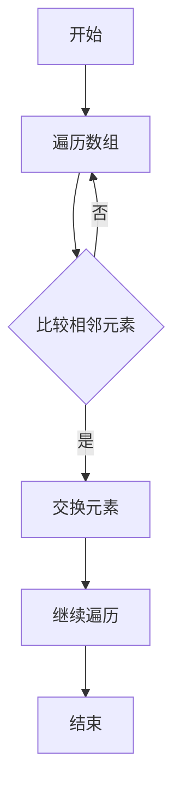

                 

# 《华为2025届校招算法工程师面试真题解密》

## 关键词
- 华为校招
- 算法工程师
- 面试真题
- 数据结构与算法
- 编程实战
- 面试技巧

## 摘要
本文旨在为准备华为2025届校招算法工程师岗位的应聘者提供全面的面试真题解密。通过梳理面试真题概述、深入剖析算法基础知识与原理、详述数学模型与公式，以及实战面试真题解析，本文将帮助读者掌握核心技能，提高面试成功率。此外，文章还特别强调面试技巧与心态调整的重要性，以助力读者在面试中脱颖而出。希望通过本文，能够为您的华为校招面试之旅提供有力支持。

## 《华为2025届校招算法工程师面试真题解密》目录大纲

### 第一部分：面试真题概述

#### 第1章：华为面试真题概述

##### 1.1 华为公司校招背景

**华为校招流程简介**

华为作为中国领先的信息与通信技术（ICT）解决方案提供商，其校招流程通常包括在线申请、在线测评、笔试和面试等多个环节。在线申请主要考察应聘者的基本素质和岗位匹配度；在线测评通常包括编程题、逻辑题和数学题等，重点考察应聘者的逻辑思维和问题解决能力；笔试则是对应聘者专业知识深度和广度的考察；面试环节分为技术面试和综合面试，前者主要考察应聘者的技术能力和项目经验，后者则侧重于综合素质和沟通能力。

**校招重要性和未来职业发展**

华为校招对于应届毕业生而言，是一个进入全球领先科技企业的重要途径。通过华为校招，毕业生不仅能够接触到前沿技术，积累实际工作经验，还能在职业发展初期获得更多的培训和晋升机会。华为注重人才培养，为员工提供丰富的职业发展路径，包括技术路线和管理路线，使得应届毕业生在华为的发展前景广阔。

##### 1.2 华为面试真题特点

**真题来源**

华为面试真题主要来源于实际招聘过程中遇到的典型问题和难点，部分真题也在业界广为流传，成为校招面试的“热门话题”。真题来源的多样性使得应聘者需要具备全面的知识储备和灵活的解题能力。

**难度分析**

华为面试难度相对较高，尤其在算法和数据结构方面。面试真题通常涉及复杂算法设计、动态规划、图论等高级知识，并且对编程实现和逻辑思维有较高要求。同时，面试过程中的压力和紧张感也是一大挑战，需要应聘者具备较强的心理素质。

**面试题类型分布**

华为面试题类型丰富，涵盖了编程题、逻辑题、数学题、系统设计题等。其中，编程题占比最大，重点考察应聘者的代码实现能力和问题解决能力；逻辑题主要考察逻辑推理和思维敏捷性；数学题则注重基础数学知识的运用和计算能力；系统设计题则是对应聘者综合素质的全面考验。

##### 1.3 面试准备建议

**基础知识复习**

应聘者需要全面复习计算机科学的基础知识，包括数据结构、算法、计算机网络、操作系统等。重点掌握常见的算法和数据结构，如排序、搜索、树、图等，以及相关的数学知识，如线性代数、概率与统计等。

**编码能力提升**

提升编程能力是应对华为面试的关键。通过大量的编程练习，熟悉常见编程语言（如C++、Python）和数据结构算法的应用，能够提高解题效率和代码质量。

**面试技巧指导**

掌握面试技巧同样重要。包括提前了解面试流程和题型，熟悉常见的面试问题和回答技巧，进行模拟面试和自我反思等。此外，良好的沟通能力和团队合作精神也是面试中不可忽视的方面。

### 第二部分：算法基础知识与原理

#### 第2章：算法基础知识与原理

##### 2.1 数据结构与算法概述

**常见数据结构**

数据结构是计算机存储、组织数据的方式，常用的数据结构包括数组、链表、栈、队列、树、图等。每种数据结构都有其独特的特点和应用场景。

- **数组**：一种线性数据结构，用于存储固定大小的元素集合。数组提供快速的随机访问能力，但插入和删除操作相对较慢。
- **链表**：由节点组成的线性数据结构，每个节点包含数据和指向下一个节点的指针。链表插入和删除操作较为灵活，但访问特定节点需要遍历链表。
- **栈**：一种后进先出（LIFO）的数据结构，常用于函数调用和递归操作。
- **队列**：一种先进先出（FIFO）的数据结构，常用于任务调度和缓冲区管理。
- **树**：一种层级结构的数据结构，用于表示元素之间的层次关系，常见的树结构包括二叉树、二叉搜索树、平衡树等。
- **图**：一种由节点和边构成的数据结构，用于表示对象之间的复杂关系，常见的图算法包括最短路径、图的连通性等。

**算法复杂度分析**

算法复杂度是衡量算法效率的重要指标，包括时间复杂度和空间复杂度。

- **时间复杂度**：描述算法执行时间与输入规模之间的关系，通常使用大O符号表示。常见的时间复杂度包括常数时间（\(O(1)\)、对数时间（\(O(\log n)\)、线性时间（\(O(n)\)、线性对数时间（\(O(n\log n)\)、平方时间（\(O(n^2)\)等。
- **空间复杂度**：描述算法执行过程中所需额外内存空间与输入规模之间的关系，同样使用大O符号表示。常见空间复杂度包括常数空间（\(O(1)\)、线性空间（\(O(n)\)等。

##### 2.2 数学基础

**线性代数**

线性代数是计算机科学中重要的数学工具，广泛应用于机器学习、图像处理、数据科学等领域。

- **矩阵乘法**：两个矩阵相乘的结果是一个新矩阵，其元素是原矩阵对应元素乘积的和。
- **矩阵求逆**：求一个方阵的逆矩阵，逆矩阵与原矩阵相乘得到单位矩阵。

**概率与统计**

概率与统计在算法分析和人工智能领域中具有重要作用。

- **概率分布**：描述随机事件发生的可能性，常见的概率分布包括二项分布、正态分布、泊松分布等。
- **均值与方差**：均值表示随机变量的平均取值，方差表示随机变量取值的离散程度。

##### 2.3 编程语言基础

**Python/C++基础知识**

Python和C++是两种常用的编程语言，在算法和人工智能领域都有广泛的应用。

- **Python**：Python是一种解释型、面向对象、动态数据类型的语言，具有简洁易读的语法和丰富的库支持。Python在数据科学、机器学习等领域应用广泛。
- **C++**：C++是一种编译型、面向对象、多范式的语言，具有较高的性能和灵活性。C++在系统编程、嵌入式开发等领域具有优势。

**数据结构与算法实现**

掌握常见数据结构和算法的Python和C++实现是应对华为面试的重要基础。

- **Python实现**：Python提供了丰富的标准库和第三方库，可以方便地实现常见的数据结构和算法，如NumPy、Pandas等。
- **C++实现**：C++具有高效的性能和灵活的内存管理，适合实现复杂的数据结构和算法。C++标准库提供了STL（标准模板库），可以方便地使用常见的数据结构和算法。

### 第三部分：核心算法原理讲解

#### 第3章：核心算法原理讲解

##### 3.1 排序算法

排序算法是计算机科学中重要的算法之一，用于将一组数据按特定顺序排列。常见的排序算法包括冒泡排序、快速排序、归并排序等。

**冒泡排序**

冒泡排序是一种简单的排序算法，它重复遍历要排序的数列，一次比较两个元素，如果它们的顺序错误就交换它们的位置。遍历数列的工作是重复地进行，直到没有再需要交换的元素，也就是说该数列已经排序完成。

**伪代码示例**

```plaintext
冒泡排序（arr，n）{
    for i = 0; i < n - 1; i++ {
        for j = 0; j < n - i - 1; j++ {
            if arr[j] > arr[j + 1] {
                交换 arr[j] 和 arr[j + 1]
            }
        }
    }
}
```

**时间复杂度**：\(O(n^2)\)

**空间复杂度**：\(O(1)\)

**适用场景**：冒泡排序适用于数据量较小或者基本有序的数组。对于大数据量的排序，冒泡排序的性能较差。

**Mermaid 流程图示例**



**Python 实现冒泡排序**

```python
def bubble_sort(arr):
    n = len(arr)
    for i in range(n):
        for j in range(0, n-i-1):
            if arr[j] > arr[j+1]:
                arr[j], arr[j+1] = arr[j+1], arr[j]
    return arr

# 测试代码
arr = [64, 25, 12, 22, 11]
sorted_arr = bubble_sort(arr)
print("排序后的数组：", sorted_arr)
```

**代码解读与分析**

在上述代码中，`bubble_sort` 函数实现了冒泡排序算法。冒泡排序是一种简单的排序算法，它重复地遍历要排序的数列，一次比较两个元素，如果它们的顺序错误就把它们交换过来。遍历数列的工作是重复地进行，直到没有再需要交换，也就是说该数列已经排序完成。

- **算法复杂度**：冒泡排序的平均和最坏情况时间复杂度均为 \(O(n^2)\)，其中 \(n\) 是数组的长度。因为每次遍历都会至少交换一次元素，所以至少需要 \(n-1\) 次遍历才能完成排序。
- **空间复杂度**：冒泡排序是原地排序算法，只需要常数级别的临时空间，即 \(O(1)\)。
- **适用场景**：冒泡排序适用于数据量较小或者基本有序的数组。对于大数据量的排序，冒泡排序的性能较差。

**快速排序**

快速排序是一种高效的排序算法，采用分治策略将一个大问题分解为若干个较小的子问题，然后递归解决这些子问题。快速排序通过选择一个基准元素，将数组分为两部分，一部分小于基准元素，另一部分大于基准元素，然后递归地对两部分进行排序。

**伪代码示例**

```plaintext
快速排序（arr，low，high）{
    if low < high {
        pivot = partition(arr，low，high)
        快速排序（arr，low，pivot - 1）
        快速排序（arr，pivot + 1，high）
    }
}

partition（arr，low，high）{
    pivot = arr[high]
    i = low - 1
    for j = low; j < high; j++ {
        if arr[j] < pivot {
            i++
            交换 arr[i] 和 arr[j]
        }
    }
    交换 arr[i + 1] 和 arr[high]
    return i + 1
}
```

**时间复杂度**：\(O(n\log n)\)（平均情况）和 \(O(n^2)\)（最坏情况）

**空间复杂度**：\(O(\log n)\)（递归栈空间）

**适用场景**：快速排序适用于各种类型的数组，是性能较好的排序算法之一。

**Mermaid 流

