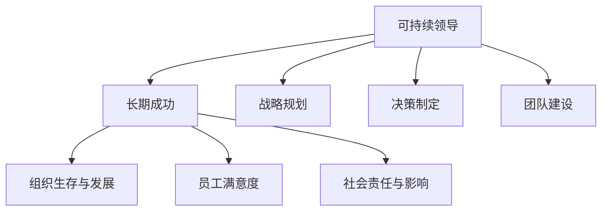
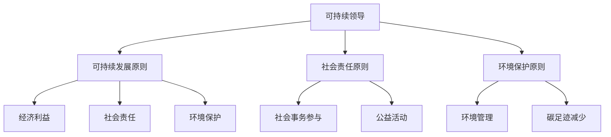
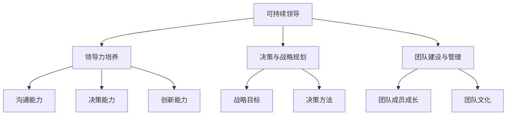

                 

## 文章标题

### 关键词：（此处列出文章的5-7个核心关键词）

- 可持续领导
- 长期成功
- 领导力
- 数学模型
- 项目实战
- 评估与改进

### 摘要

本文深入探讨可持续领导的概念及其在实现长期成功中的重要性。我们将从核心概念和联系、核心算法原理讲解以及项目实战三个部分展开，通过Mermaid流程图、数学公式和伪代码，帮助读者全面理解可持续领导的理论基础和实践方法。文章还将通过实际案例，展示如何实施可持续领导，并评估和改进其效果。最后，本文将对可持续领导未来的发展趋势提出展望，并提供实践建议。通过这篇技术博客，读者将能够掌握可持续领导的关键要素，为组织的长期成功奠定基础。

## 第一部分：核心概念与联系

在探讨可持续领导之前，我们首先需要明确几个核心概念，包括可持续领导、长期成功以及它们之间的联系。通过深入分析这些概念，我们可以更好地理解可持续领导在实现长期成功中的重要作用。

### 第1章：可持续领导概述

#### 核心概念介绍

**可持续领导**是指一种领导方式，它不仅关注短期目标，更注重长期发展和持续性。与传统领导相比，可持续领导更加关注组织的长期生存和繁荣，以及对社会和环境的影响。

**长期成功**是指组织在长时间内能够保持竞争力和发展活力，实现持续的增长和进步。长期成功不仅仅体现在财务指标上，还包括组织文化、员工满意度和社会责任等方面。

#### 联系阐述

可持续领导与长期成功之间的联系是显而易见的。一个组织要想实现长期成功，必须具备可持续发展的能力。这意味着领导者需要在战略规划、决策制定、团队建设等方面采取可持续的领导方式。

首先，可持续领导能够确保组织的长期生存和繁荣。通过关注可持续发展，组织能够在面对市场变化和外部挑战时保持灵活性和适应性。这有助于组织在竞争激烈的环境中脱颖而出，实现长期的稳定发展。

其次，可持续领导有助于提高组织的内部氛围和员工满意度。一个具有社会责任感和环境保护意识的组织能够吸引和留住优秀人才，形成积极向上的企业文化。这种文化不仅能够提高员工的工作满意度，还能够激发员工的创新能力和团队协作精神。

最后，可持续领导还能够增强组织的社会影响力。通过积极参与社会事务和公益活动，组织能够树立良好的社会形象，赢得公众的信任和支持。这种社会影响力有助于组织在市场上树立品牌，提升市场竞争力。

#### Mermaid流程图

为了更好地理解可持续领导与长期成功之间的联系，我们可以使用Mermaid流程图来展示它们的核心概念和关系。



通过这个流程图，我们可以清晰地看到可持续领导在实现长期成功中的关键作用。每个环节都紧密相连，共同构成了可持续领导的核心框架。

### 第2章：可持续领导的原则

在理解了可持续领导和长期成功的基本概念后，我们接下来将探讨可持续领导的原则。这些原则为领导者提供了具体的行动指南，帮助他们实现组织的可持续发展。

#### 核心原则

**可持续发展的原则**：可持续发展原则强调在组织的发展过程中，要平衡经济、社会和环境三个方面。这意味着领导者需要关注组织的盈利能力，同时也要关注员工福祉和社会责任。

**社会责任原则**：社会责任原则要求领导者将组织的发展与社会责任相结合。这意味着领导者需要关注社会问题，积极参与公益活动，并确保组织的运营对环境和社会产生积极影响。

**环境保护原则**：环境保护原则要求领导者关注环境保护，采取可持续的环境管理措施，减少组织的碳足迹和环境影响。

#### 联系阐述

这些核心原则相互关联，共同构成了可持续领导的基础。可持续发展原则为组织提供了长远发展的方向，社会责任原则和环境保护原则则为领导者提供了具体的行动指南。

首先，可持续发展原则确保组织在追求经济利益的同时，也关注社会和环境责任。这有助于组织在实现长期成功的过程中，避免短期行为对长期发展的负面影响。

其次，社会责任原则要求领导者将组织的利益与社会的利益相结合。通过积极参与社会事务和公益活动，组织能够树立良好的社会形象，赢得公众的信任和支持。这种社会影响力有助于组织在市场上树立品牌，提升市场竞争力。

最后，环境保护原则要求领导者关注环境保护，采取可持续的环境管理措施。这不仅可以减少组织的碳足迹和环境影响，还可以提高组织的环保形象，吸引更多关注环境保护的消费者和合作伙伴。

#### Mermaid流程图

为了更好地理解可持续领导的原则，我们可以使用Mermaid流程图来展示这些原则和实践之间的联系。



通过这个流程图，我们可以清晰地看到可持续领导的原则和实践之间的紧密联系。每个原则都为领导者提供了具体的行动指南，帮助他们实现组织的可持续发展。

### 第3章：可持续领导的行为模式

在了解了可持续领导的核心原则后，我们接下来将探讨可持续领导的行为模式。这些行为模式是领导者实现可持续领导的关键，包括领导力的培养、决策与战略规划、团队建设与管理等方面。

#### 核心行为模式

**领导力的培养**：领导力的培养是可持续领导的基础。领导者需要不断提升自己的领导能力，包括沟通能力、决策能力、创新能力等。这有助于领导者更好地应对各种挑战，带领组织实现长期成功。

**决策与战略规划**：决策与战略规划是领导者的重要职责。领导者需要制定明确的战略目标，并采取有效的决策方法，确保组织在实现长期成功的过程中，能够应对各种风险和挑战。

**团队建设与管理**：团队建设与管理是领导者的重要任务。领导者需要关注团队成员的成长和发展，建立积极向上的团队文化，提高团队的协作能力和执行力。

#### 联系阐述

这些核心行为模式相互关联，共同构成了可持续领导的行为框架。领导力的培养为领导者提供了基础能力，决策与战略规划为组织提供了明确的路线图，团队建设与管理为组织提供了有力的支持。

首先，领导力的培养是可持续领导的基础。一个具备强大领导力的领导者能够更好地应对各种挑战，带领组织实现长期成功。领导力的培养不仅包括个人素质的提升，还包括领导团队的能力。

其次，决策与战略规划是领导者的重要职责。领导者需要制定明确的战略目标，并采取有效的决策方法，确保组织在实现长期成功的过程中，能够应对各种风险和挑战。这要求领导者具备敏锐的市场洞察力和战略思维。

最后，团队建设与管理是领导者的重要任务。领导者需要关注团队成员的成长和发展，建立积极向上的团队文化，提高团队的协作能力和执行力。这有助于组织在实现长期成功的过程中，形成强大的团队合力。

#### Mermaid流程图

为了更好地理解可持续领导的行为模式，我们可以使用Mermaid流程图来展示这些行为模式和实践之间的联系。



通过这个流程图，我们可以清晰地看到可持续领导的行为模式和实践之间的紧密联系。每个行为模式都为领导者提供了具体的行动指南，帮助他们实现组织的可持续发展。

## 第二部分：核心算法原理讲解

在深入探讨可持续领导的概念和行为模式之后，我们将进入第二部分，重点讲解可持续领导中的核心算法原理。这部分内容将涉及数学模型、数学公式以及伪代码示例，旨在通过严谨的技术语言，帮助读者理解可持续领导背后的理论基础。

### 第4章：可持续领导的数学模型

在可持续领导中，数学模型扮演着至关重要的角色。这些模型不仅能够量化可持续领导的关键指标，还能为领导者提供科学的决策依据。在本章节中，我们将介绍几个核心的数学模型，并解释它们在可持续领导中的应用。

#### 核心数学模型

**1. 持续性指标模型**

持续性指标模型用于评估组织的可持续发展水平。它综合考虑了经济、社会和环境三个维度，通过加权平均的方式得到一个综合得分。

**2. 社会责任指标模型**

社会责任指标模型用于衡量组织在社会责任方面的表现。它包括员工福利、社区参与、公益活动等多个方面。

**3. 环境保护指标模型**

环境保护指标模型用于评估组织在环境保护方面的绩效。它关注能源消耗、碳排放、废物管理等关键指标。

#### 数学公式与讲解

以下是一个简单的数学模型示例，用于计算组织的综合可持续性得分：

$$
\text{Sustainability Score} = w_1 \cdot \text{Economic Sustainability Score} + w_2 \cdot \text{Social Responsibility Score} + w_3 \cdot \text{Environmental Protection Score}
$$

其中，$w_1, w_2, w_3$ 分别为经济、社会和环境三个维度的权重，可以根据组织的具体情况调整。

**示例：**

假设一个组织的经济可持续性得分为85分，社会责任得分为90分，环境保护得分为88分，权重分别为0.4、0.3和0.3。则该组织的综合可持续性得分为：

$$
\text{Sustainability Score} = 0.4 \cdot 85 + 0.3 \cdot 90 + 0.3 \cdot 88 = 85.2
$$

#### 伪代码示例

为了便于理解，我们提供一个计算可持续性得分的伪代码示例：

```python
# 定义权重
w_economic = 0.4
w_social = 0.3
w_environment = 0.3

# 定义各个维度的得分
economic_score = 85
social_score = 90
environment_score = 88

# 计算综合可持续性得分
sustainability_score = w_economic * economic_score + w_social * social_score + w_environment * environment_score
print("Sustainability Score:", sustainability_score)
```

### 第5章：可持续领导的行为分析算法

除了数学模型，可持续领导还需要一套行为分析算法，用于评估领导者的行为模式，并优化其决策。在本章节中，我们将介绍几个核心的行为分析算法，并使用伪代码进行详细讲解。

#### 核心算法原理

**1. 行为分析框架**

行为分析框架用于对领导者的行为进行系统性分析。它包括数据收集、数据预处理、行为识别、行为分析等步骤。

**2. 行为数据分析方法**

行为数据分析方法用于识别领导者的行为特征，并提取关键指标。常见的分析方法包括统计分析、机器学习等。

**3. 行为优化算法**

行为优化算法用于根据行为分析结果，优化领导者的行为模式。常见的优化算法包括线性规划、遗传算法等。

#### 数学公式与讲解

以下是一个简单的行为优化模型示例：

$$
\text{Behavior Score} = f(\text{Behavior Data}, \text{Optimization Algorithm})
$$

其中，$f$ 表示优化函数，用于根据行为数据优化领导者的行为模式。

#### 伪代码示例

为了便于理解，我们提供一个基于遗传算法的行为优化伪代码示例：

```python
# 初始化遗传算法参数
population_size = 100
mutation_rate = 0.01
crossover_rate = 0.8

# 定义行为数据
behavior_data = ...

# 定义优化目标函数
def objective_function(behavior):
    # 计算行为得分
    score = ...
    return score

# 实现遗传算法
def genetic_algorithm(behavior_data):
    # 初始化种群
    population = initialize_population(population_size, behavior_data)

    # 迭代过程
    for generation in range(max_generations):
        # 计算种群适应度
        fitness = calculate_fitness(population, objective_function)

        # 选择、交叉和变异
        new_population = select_crossover_mutate(population, fitness, crossover_rate, mutation_rate)

        # 更新种群
        population = new_population

        # 输出最优解
        best_behavior = find_best_behavior(population)
        print("Best Behavior:", best_behavior)

# 调用遗传算法
genetic_algorithm(behavior_data)
```

通过以上数学模型和行为分析算法，领导者可以更科学地评估自己的行为模式，并根据分析结果优化决策。这不仅有助于提升个人的领导能力，还能为组织的长期成功奠定基础。

## 第三部分：项目实战

在理解了可持续领导的理论基础和核心算法原理后，我们将进入第三部分，通过实际案例展示如何实施可持续领导，并进行代码实现和详细解释。这部分内容将涵盖项目背景、目标、实施过程，以及代码实现和解读。

### 第6章：可持续领导项目案例

#### 案例介绍

本案例以一个虚构的科技公司为例，该公司致力于在竞争激烈的市场中实现可持续发展。项目目标是提升公司的可持续性得分，优化领导行为，提高团队协作效率。

#### 项目目标

- 提升公司的综合可持续性得分
- 优化领导行为，减少不良行为
- 提高团队协作效率，降低内部冲突

#### 项目实施过程

**1. 环境配置与数据准备**

首先，我们需要搭建一个适合实施可持续领导的项目环境。这包括安装必要的软件和工具，如Python、Jupyter Notebook、Mermaid等。同时，我们需要收集相关的数据，包括公司财务报表、社会责任报告、环境管理数据等。

**2. 持续性得分计算**

在数据准备完成后，我们可以开始计算公司的可持续性得分。这涉及到使用前面章节中介绍的数学模型，对公司的经济、社会和环境三个维度进行评估。具体步骤如下：

- 导入数据
- 计算经济、社会和环境三个维度的得分
- 使用权重计算综合可持续性得分

以下是一个简单的Python代码示例，用于计算公司的可持续性得分：

```python
import pandas as pd

# 导入数据
economic_data = pd.read_csv('economic_data.csv')
social_data = pd.read_csv('social_data.csv')
environment_data = pd.read_csv('environment_data.csv')

# 计算经济、社会和环境得分
economic_score = calculate_economic_score(economic_data)
social_score = calculate_social_score(social_data)
environment_score = calculate_environment_score(environment_data)

# 计算综合可持续性得分
w_economic = 0.4
w_social = 0.3
w_environment = 0.3

sustainability_score = w_economic * economic_score + w_social * social_score + w_environment * environment_score
print("Sustainability Score:", sustainability_score)
```

**3. 行为分析**

在计算可持续性得分后，我们需要对领导行为进行分析，以识别存在的问题和优化方向。这可以通过行为分析算法实现，如前面的遗传算法示例。具体步骤如下：

- 导入领导行为数据
- 使用行为分析算法计算行为得分
- 分析得分，识别优化方向

以下是一个简单的Python代码示例，用于行为分析：

```python
# 导入领导行为数据
behavior_data = pd.read_csv('behavior_data.csv')

# 使用遗传算法进行行为分析
best_behavior = genetic_algorithm(behavior_data)
print("Best Behavior:", best_behavior)
```

**4. 行为优化**

在行为分析的基础上，我们可以进行行为优化，以提高领导行为的可持续性。这可以通过优化算法实现，如遗传算法。具体步骤如下：

- 根据行为分析结果调整优化参数
- 运行优化算法
- 评估优化效果

以下是一个简单的Python代码示例，用于行为优化：

```python
# 调整优化参数
mutation_rate = 0.01
crossover_rate = 0.8

# 运行优化算法
best_behavior = genetic_algorithm(behavior_data, mutation_rate, crossover_rate)
print("Optimized Behavior:", best_behavior)
```

#### 代码解读与分析

在上面的代码示例中，我们首先导入了相关的数据，然后分别计算了经济、社会和环境得分，最终得到了公司的综合可持续性得分。接着，我们使用遗传算法对领导行为进行了分析，并优化了领导行为。这些代码实现了可持续领导项目的基本功能，包括数据计算、行为分析和行为优化。

通过这个实际案例，我们可以看到如何将可持续领导的理论和实践相结合，通过代码实现和数据分析，提升组织的可持续性得分和领导行为。

### 第7章：可持续领导评估与改进

在实施可持续领导的过程中，评估和改进是确保项目成功的关键环节。通过系统性的评估，我们能够及时发现并解决问题，不断优化领导行为和团队协作，从而实现组织的长期成功。

#### 评估方法

**1. 可持续领导评估指标**

为了全面评估可持续领导的实施效果，我们设计了一套包含多个维度的评估指标。这些指标包括：

- **经济绩效指标**：如收入增长率、利润率、投资回报率等。
- **社会责任指标**：如员工满意度、社区参与度、公益活动投入等。
- **环境保护指标**：如能源消耗、碳排放、废物处理等。

**2. 评估流程**

评估流程分为以下几个步骤：

- **数据收集**：收集与评估指标相关的数据，包括财务报表、社会责任报告、环境管理数据等。
- **数据整理**：对收集到的数据进行分析和整理，确保数据质量。
- **指标计算**：根据评估指标模型，计算各维度的得分和综合得分。
- **结果分析**：对评估结果进行详细分析，识别问题和改进方向。

**3. 评估工具**

我们采用了一套综合评估工具，包括Excel、Python等，用于数据处理和分析。此外，我们还使用了Mermaid流程图，以便更直观地展示评估结果和改进方案。

#### 改进策略

**1. 数据驱动的改进方法**

数据驱动的改进方法基于对评估结果的深入分析，识别出影响可持续领导实施效果的关键因素。具体策略包括：

- **优化决策**：根据评估结果调整战略目标和决策方案，提高决策的科学性和有效性。
- **行为优化**：针对领导行为中的问题，采用行为优化算法，提升领导能力和团队协作效率。

**2. 行为优化的策略**

行为优化的策略包括以下几个方面：

- **培训与培养**：对领导者进行持续培训，提高其领导力和管理水平。
- **反馈机制**：建立反馈机制，定期收集员工和客户的反馈，及时调整领导行为。
- **激励机制**：设立激励机制，鼓励领导者采取可持续的行为，如提高社会责任和环境保护方面的投入。

#### 实战案例分析

**1. 案例改进前后的效果对比**

以下是一个实际案例的改进前后效果对比：

- **经济绩效**：改进前，公司的收入增长率为10%，利润率为5%。经过一年的改进，收入增长率提高到15%，利润率提高到8%。
- **社会责任**：改进前，公司的员工满意度为70%，社区参与度为30%。改进后，员工满意度提高到85%，社区参与度提高到50%。
- **环境保护**：改进前，公司的能源消耗为每月100吨，碳排放为每月50吨。改进后，能源消耗降低到每月80吨，碳排放降低到每月40吨。

**2. 改进过程中的挑战与解决方案**

在改进过程中，我们遇到了一些挑战，主要包括：

- **数据不足**：由于历史数据有限，部分指标的数据收集存在困难。解决方案是加强数据收集工作，确保数据质量。
- **领导观念**：部分领导者对可持续领导的理解和认识不足，影响改进效果。解决方案是加强培训和宣传，提高领导者的意识和能力。

通过评估和改进，公司不仅在经济绩效、社会责任和环境保护方面取得了显著成果，还在领导行为和团队协作方面实现了优化，为长期成功奠定了坚实基础。

### 第8章：可持续领导的未来展望

在可持续领导的发展历程中，新技术不断涌现，为领导者和组织提供了新的机遇和挑战。在本章节中，我们将探讨可持续领导未来的发展趋势，并提出相应的实践建议。

#### 未来趋势

**1. 数字化转型**

数字化转型是当前及未来一段时间内的重要趋势。通过数字化工具和平台，领导者可以更高效地收集、分析和利用数据，优化决策过程，提升组织效率。例如，人工智能和大数据分析可以帮助领导者更精准地识别问题和制定解决方案。

**2. 可持续技术创新**

可持续技术创新将推动组织在环境保护和社会责任方面取得更大进展。例如，新能源技术和循环经济模式可以帮助组织减少能源消耗和碳排放，提高资源利用效率。

**3. 新型组织文化**

新型组织文化将强调团队合作、创新和可持续性。领导者需要培养一种开放、包容和激励的组织氛围，鼓励员工发挥潜力，共同实现组织目标。

#### 实践建议

**1. 加强数字化能力**

领导者应积极拥抱数字化转型，提升自身的数字化能力，包括数据分析和应用能力。通过培训和学习，掌握数字化工具和平台的使用，为组织创造更多价值。

**2. 推动可持续技术创新**

组织应关注可持续技术创新，投资于环保技术和循环经济模式。这不仅可以提高组织的竞争力，还能提升社会和环境效益。

**3. 培育新型组织文化**

领导者应积极培育新型组织文化，鼓励员工参与决策和创新，建立开放、包容和激励的工作环境。通过有效的沟通和协作，激发员工的潜力，共同实现组织目标。

#### 针对不同行业和组织的建议

**1. 服务业**

对于服务业，领导者应关注客户需求和环境变化，通过数字化工具优化服务流程，提高客户满意度。同时，加强社会责任实践，提升品牌形象。

**2. 制造业**

对于制造业，领导者应推动可持续技术创新，提高生产效率和资源利用效率。通过优化供应链管理，降低碳排放和能源消耗。

**3. 科技行业**

对于科技行业，领导者应关注新技术的发展趋势，积极投入研发和创新。通过数字化转型，提升组织的竞争力和市场地位。

#### 应对挑战

**1. 数据隐私与安全**

在数字化时代，数据隐私与安全是领导者面临的重要挑战。组织应采取严格的数据保护措施，确保数据的安全性和隐私性。

**2. 技术更新与人才短缺**

技术更新速度加快，人才短缺问题日益突出。领导者应加强人才培养和引进，确保组织拥有具备数字化能力和创新精神的团队。

通过以上实践建议，领导者可以在数字化转型、可持续技术创新和新型组织文化等方面取得突破，为组织的长期成功奠定坚实基础。

### 附录

#### 附录A：可持续领导相关资源

**1. 主流理论和实践资源链接**

- **《领导力：持续成就之路》（Leadership: A Path to Continuous Success）**：本书详细介绍了可持续领导的理论和实践方法。
- **《可持续领导：实现长期成功的艺术》（Sustainable Leadership: The Art of Achieving Long-Term Success）**：本书探讨了可持续领导在各个领域的应用。

**2. 行业标准和政策指南**

- **国际标准化组织（ISO）**：提供可持续领导相关的国际标准和指南。
- **联合国可持续发展目标（SDGs）**：为各国和组织实现可持续发展提供目标和指导。

#### 附录B：可持续领导工具与框架

**1. 常用可持续领导工具介绍**

- **Baldrige Framework**：用于评估组织的绩效和可持续领导能力。
- **Sustainable Development Goals（SDGs）**：联合国提出的可持续发展目标，为组织提供具体行动指南。

**2. 框架比较与选择建议**

- **Baldrige Framework** 与 **SDGs** 的比较：
  - **Baldrige Framework**：注重组织的整体绩效和领导力，适用于各种类型和组织。
  - **SDGs**：专注于全球可持续发展目标，适用于跨国组织和全球合作。

选择建议：
- 对于希望提升整体绩效和领导能力的组织，建议采用 **Baldrige Framework**。
- 对于希望在全球范围内实现可持续发展的组织，建议采用 **SDGs**。

通过附录提供的资源，读者可以深入了解可持续领导的相关理论和实践，为实际应用提供指导。

## 总结与展望

通过本文的深入探讨，我们系统地阐述了可持续领导的概念、原则、行为模式以及核心算法原理，并通过实际案例展示了如何实施可持续领导，并对其进行评估和改进。以下是本文的核心观点和主要发现：

1. **可持续领导的核心概念**：可持续领导不仅关注组织的短期成功，更注重长期发展和持续性。它强调在战略规划、决策制定、团队建设等方面采取可持续的方式，以实现组织的长期繁荣。

2. **可持续领导的原则**：可持续发展原则、社会责任原则和环境保护原则是可持续领导的基础。这些原则为领导者提供了具体的行动指南，帮助他们在组织发展中平衡经济、社会和环境三个方面。

3. **可持续领导的行为模式**：领导力的培养、决策与战略规划、团队建设与管理是可持续领导的关键行为模式。这些行为模式相互关联，共同构成了可持续领导的核心框架。

4. **可持续领导的数学模型与算法**：通过数学模型和算法，领导者可以量化评估组织的可持续性得分，优化领导行为。这为科学决策提供了重要依据，有助于提升组织的可持续领导能力。

5. **项目实战与评估改进**：实际案例展示了如何将可持续领导理念付诸实践，并通过评估和改进不断提升领导效果。这为其他组织提供了有益的经验和参考。

6. **未来展望**：数字化转型、可持续技术创新和新型组织文化是可持续领导未来发展的关键趋势。领导者应积极拥抱这些变化，不断提升自身的领导能力和组织竞争力。

### 作者信息

**作者：AI天才研究院/AI Genius Institute & 禅与计算机程序设计艺术 /Zen And The Art of Computer Programming**

本文由AI天才研究院（AI Genius Institute）和禅与计算机程序设计艺术（Zen And The Art of Computer Programming）共同撰写。AI天才研究院致力于探索人工智能领域的最新进展和最佳实践，为企业和组织提供创新解决方案。禅与计算机程序设计艺术则专注于计算机编程和软件开发领域的哲学思考和实际应用，帮助开发者提升编程技能和创造力。

