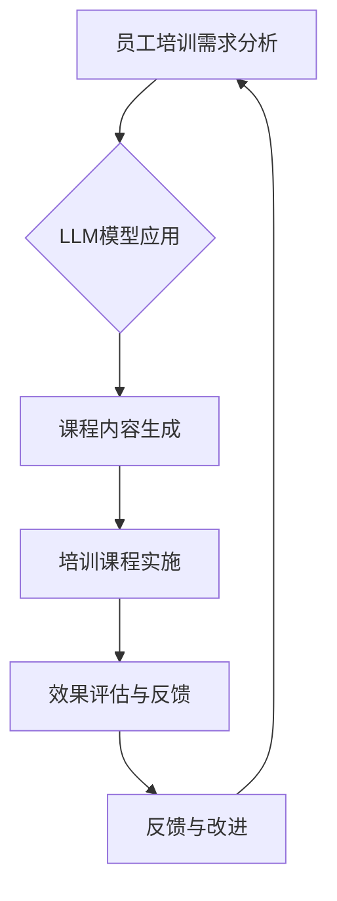

                 

# 员工培训：LLM 增强的学习计划

> **关键词**：员工培训、LLM、学习计划、人工智能、教育技术、个性化培训、评估与反馈

> **摘要**：本文旨在探讨如何利用大型语言模型（LLM）增强员工培训计划，从而提高培训效果和员工技能水平。文章首先概述了员工培训的重要性与目标，接着详细介绍了LLM的概念与应用，然后设计并描述了一个LLM增强的学习计划架构，包括培训课程的内容设计、交互设计、评估与反馈机制。最后，通过实际案例展示了LLM在员工培训中的应用，并对未来发展趋势和挑战进行了展望。

## 《员工培训：LLM 增强的学习计划》目录大纲

### 第一部分：概述与基础

#### 第1章：员工培训的重要性与目标

##### 1.1 员工培训的概述
- 员工培训的定义与意义
- 员工培训的目标与目的

##### 1.2 员工培训的常见形式
- 在职培训与离岗培训
- 线上培训与线下培训

##### 1.3 LLM（大型语言模型）的概念与应用
- LLM的定义与特点
- LLM在员工培训中的应用场景

### 第二部分：LLM增强的学习计划设计

#### 第2章：LLM增强的学习计划架构

##### 2.1 学习计划的整体设计思路
- 培训目标与内容的确定
- 学习计划的结构与模块划分

##### 2.2 LLM在培训过程中的应用
- LLM在内容生成与个性化推荐中的应用
- LLM在交互式学习中的应用

##### 2.3 LLM增强的评估与反馈机制
- 培训效果的评估方法
- LLM在评估与反馈中的应用

### 第三部分：LLM增强的培训课程实施

#### 第3章：设计有效的LLM增强培训课程

##### 3.1 培训课程的内容设计
- 课程目标的明确
- 课程内容的构建

##### 3.2 LLM在课程内容生成中的应用
- LLM在生成课程教案中的应用
- LLM在生成课程练习题中的应用

##### 3.3 培训课程的交互设计
- 交互式教学活动的设计
- LLM在互动交流中的应用

### 第四部分：LLM增强的培训效果评估

#### 第4章：评估与反馈机制的构建

##### 4.1 培训效果的评估指标
- 知识掌握程度的评估
- 能力提升的评估

##### 4.2 LLM在评估数据收集中的应用
- LLM在自动生成评估问卷中的应用
- LLM在评估数据分析中的应用

##### 4.3 反馈机制的优化
- 反馈信息的收集与整理
- LLM在个性化反馈中的应用

### 第五部分：案例与实践

#### 第5章：LLM增强的员工培训案例

##### 5.1 案例介绍
- 案例背景与目标
- 案例实施过程

##### 5.2 案例分析
- 案例中LLM的应用分析
- 案例的培训效果评估

##### 5.3 案例总结与启示
- 案例的经验总结
- 对其他企业的培训实践的启示

### 第六部分：未来展望

#### 第6章：LLM在员工培训中的未来发展

##### 6.1 LLM技术的发展趋势
- 语言模型的技术演进
- LLM在其他领域的应用

##### 6.2 LLM在员工培训中的应用前景
- LLM在个性化培训中的应用
- LLM在职业发展辅导中的应用

##### 6.3 未来面临的挑战与机遇
- 技术挑战与解决方案
- 市场机遇与商业策略

### 第七部分：附录

#### 第7章：参考资料与进一步阅读

##### 7.1 参考资料列表
- 相关书籍推荐
- 学术论文推荐

##### 7.2 进一步阅读建议
- 培训理论的发展
- LLM技术的最新研究进展

### 附录 A：Mermaid 流程图

#### A.1 员工培训的流程图
- 员工培训的整体流程
- LLM在培训流程中的应用

### 附录 B：LLM相关算法与数学模型讲解

#### B.1 LLM算法原理
- 语言模型的基本算法
- LLM的优化算法

#### B.2 数学模型讲解
- 语言模型中的概率分布
- 语言模型中的正则化方法

### 附录 C：项目实战案例

#### C.1 实战案例介绍
- 实战案例背景与目标

#### C.2 实战案例解析
- 实战案例的开发环境搭建
- 实战案例的代码实现与解读

#### C.3 实战案例分析与总结
- 实战案例的培训效果分析
- 实战案例的总结与反思

## 第一部分：概述与基础

### 第1章：员工培训的重要性与目标

#### 1.1 员工培训的概述

员工培训是指通过系统性地传授知识和技能，帮助员工提升个人能力和工作效率，以满足组织发展的需求。员工培训具有以下几个方面的意义：

1. **提升员工技能和知识**：培训可以帮助员工学习新的技能和知识，提高工作效率和创新能力，从而增强组织的竞争力。

2. **增强员工归属感和忠诚度**：通过培训，员工可以感受到组织对他们的关注和支持，从而增强员工的归属感和忠诚度。

3. **促进组织发展**：培训可以提升员工的综合素质，使员工更好地适应组织发展的需求，从而推动组织的持续发展。

员工培训的目标主要包括：

1. **提高员工的知识水平和技能**：培训应使员工掌握与工作相关的知识和技能，提高工作能力和工作效率。

2. **提升员工的综合素质**：培训应关注员工的全面发展，培养员工的沟通能力、团队协作能力等。

3. **促进组织的战略目标实现**：培训应有助于员工理解组织的战略目标，使其在工作中更好地为实现组织目标贡献力量。

#### 1.2 员工培训的常见形式

员工培训的形式多种多样，可以根据培训内容和培训对象的特点进行选择。常见的培训形式包括：

1. **在职培训与离岗培训**：
   - **在职培训**：员工在正常工作过程中接受培训，不脱离工作岗位。这种方式具有成本低、学习效果直接等优点。
   - **离岗培训**：员工离开工作岗位，集中一段时间进行培训。这种方式适用于系统性和专业化程度较高的培训内容。

2. **线上培训与线下培训**：
   - **线上培训**：通过互联网平台进行培训，具有灵活性高、成本低等优点。常见形式包括视频课程、在线直播、在线讨论等。
   - **线下培训**：在实体场所进行培训，如会议室、培训教室等。这种方式有利于增强学员之间的互动和交流。

#### 1.3 LLM（大型语言模型）的概念与应用

LLM（Large Language Model）是指具有大规模参数和强大语言理解能力的语言模型。LLM通过训练大量文本数据，能够自动生成文本、回答问题、完成翻译等任务。LLM具有以下几个特点：

1. **大规模参数**：LLM通常包含数十亿甚至千亿个参数，使其具有强大的文本生成和语义理解能力。

2. **强大的语言理解能力**：LLM能够理解文本中的语法、语义和语境，从而生成语义上合理、连贯的文本。

3. **自适应能力**：LLM能够根据不同场景和需求进行自适应调整，生成符合特定要求的文本。

LLM在员工培训中的应用场景主要包括：

1. **内容生成**：LLM可以自动生成培训课程内容，如教案、练习题等，从而节省培训资源，提高培训效率。

2. **个性化推荐**：LLM可以根据员工的兴趣和需求，为其推荐适合的培训内容和课程，从而提高培训效果。

3. **交互式学习**：LLM可以与员工进行交互式对话，提供实时解答和反馈，从而增强培训的互动性和有效性。

### 第二部分：LLM增强的学习计划设计

#### 第2章：LLM增强的学习计划架构

在现代企业中，员工培训不仅仅是传授知识和技能，更是提升员工综合素质和适应能力的过程。随着人工智能技术的不断发展，特别是大型语言模型（LLM）的出现，员工培训的方式和效果得到了显著提升。本章将详细探讨如何设计一个LLM增强的学习计划，以实现培训效果的最优化。

#### 2.1 学习计划的整体设计思路

一个成功的LLM增强学习计划需要明确以下几个关键要素：

1. **培训目标与内容的确定**：
   - 确定明确的培训目标，包括知识掌握、技能提升、综合素质培养等。
   - 根据培训目标选择合适的培训内容，确保内容与目标的一致性。

2. **学习计划的结构与模块划分**：
   - 将学习计划划分为不同的模块，如基础知识模块、技能提升模块、综合素质模块等。
   - 每个模块都要有明确的子目标和具体内容，以便于实施和评估。

3. **培训方法与技术的选择**：
   - 根据培训内容和目标选择合适的培训方法和技术，如在线学习平台、互动式教学、虚拟现实等。
   - 特别考虑LLM在内容生成、个性化推荐和交互式学习中的应用。

4. **评估与反馈机制的构建**：
   - 设计科学的评估指标，如知识测试、技能考核、综合素质评价等。
   - 利用LLM进行评估数据的自动收集和分析，提供个性化的反馈和改进建议。

#### 2.2 LLM在培训过程中的应用

LLM在员工培训过程中具有广泛的应用，可以显著提升培训效果和效率。以下是LLM在培训过程中的几个关键应用场景：

1. **内容生成与个性化推荐**：
   - **内容生成**：LLM可以根据培训目标和内容需求，自动生成培训资料，如教案、讲义、练习题等。
     ```mermaid
     graph TD
       A[内容生成] --> B{课程目标}
       A --> C{教学大纲}
       A --> D{练习题库}
       B --> E{课程目标细化}
       C --> F{知识要点}
       D --> G{题型设计}
     ```
   - **个性化推荐**：LLM可以根据员工的兴趣、知识水平和培训需求，推荐适合的学习内容，提高学习效果。
     ```mermaid
     graph TD
       A[用户数据] --> B{兴趣分析}
       B --> C{知识水平评估}
       C --> D{培训需求分析}
       D --> E{推荐系统}
       E --> F[推荐内容]
     ```

2. **交互式学习**：
   - **实时问答**：LLM可以与员工进行实时对话，解答员工在学习过程中遇到的问题，提供即时的支持和帮助。
     ```mermaid
     graph TD
       A[用户问题] --> B{问答系统}
       B --> C{问题分析}
       C --> D{答案生成}
       D --> E[用户反馈]
     ```

   - **虚拟教学助手**：LLM可以模拟教师角色，提供互动式教学，如模拟课堂、辅导学习等。
     ```mermaid
     graph TD
       A[课程内容] --> B{虚拟教学助手}
       B --> C{教学互动}
       B --> D{实时反馈}
       C --> E{学生参与度}
     ```

3. **评估与反馈**：
   - **自动评估**：LLM可以自动评估员工的培训表现，如知识测试、项目评估等，提供快速、准确的评估结果。
     ```mermaid
     graph TD
       A[学习数据] --> B{自动评估系统}
       B --> C{评估结果}
       C --> D{反馈生成}
     ```

   - **个性化反馈**：LLM可以根据员工的评估结果，提供个性化的反馈和建议，帮助员工找到学习中的不足和改进方向。
     ```mermaid
     graph TD
       A[评估结果] --> B{反馈系统}
       B --> C{个性化建议}
       C --> D[用户改进]
     ```

通过上述设计思路和应用场景，我们可以构建一个以LLM为核心的增强学习计划，实现培训过程的智能化和个性化，从而提高培训效果和员工满意度。

#### 2.3 LLM增强的评估与反馈机制

为了确保LLM增强的学习计划能够达到预期效果，评估与反馈机制的设计至关重要。以下是如何构建一个高效的评估与反馈机制：

1. **培训效果的评估指标**：
   - **知识掌握程度**：通过知识测试、考试等方式评估员工对培训内容的掌握程度。
     ```mermaid
     graph TD
       A[知识测试] --> B{测试结果}
       B --> C{知识掌握度}
     ```
   - **技能提升情况**：通过实际操作、项目成果等方式评估员工技能的提升情况。
     ```mermaid
     graph TD
       A[项目成果评估] --> B{技能提升度}
     ```

   - **综合素质**：通过团队合作、沟通能力、问题解决能力等评估员工的综合素质。
     ```mermaid
     graph TD
       A[团队合作评估] --> B{综合素质评分}
     ```

2. **LLM在评估数据收集中的应用**：
   - **自动生成评估问卷**：LLM可以根据培训内容和目标自动生成个性化的评估问卷，提高评估的针对性和效率。
     ```mermaid
     graph TD
       A[培训内容] --> B{评估问卷生成}
       B --> C{问卷发布}
     ```

   - **数据收集与整理**：LLM可以自动收集员工的评估数据，并进行整理和分析，为后续评估提供支持。
     ```mermaid
     graph TD
       A[评估数据收集] --> B{数据整理}
       B --> C[数据分析]
     ```

3. **反馈机制的优化**：
   - **个性化反馈**：LLM可以根据员工的评估结果，生成个性化的反馈报告，指出员工的优势和不足，并提供具体的改进建议。
     ```mermaid
     graph TD
       A[评估结果] --> B{反馈报告生成}
       B --> C{个性化建议}
     ```

   - **实时反馈**：LLM可以实时与员工互动，解答他们在培训过程中遇到的问题，提供即时的支持和帮助。
     ```mermaid
     graph TD
       A[用户问题] --> B{实时问答系统}
       B --> C{实时反馈}
     ```

通过上述评估与反馈机制，LLM增强的学习计划可以实时监控和评估员工的培训效果，提供个性化的反馈和建议，帮助员工不断提升自身能力，从而实现培训目标。

#### 2.4 实施策略与挑战

在实施LLM增强的学习计划时，需要考虑以下几个关键策略和挑战：

1. **实施策略**：
   - **培训前准备**：确保培训所需的硬件、软件和人员配置齐全，为培训的顺利开展提供保障。
     ```mermaid
     graph TD
       A[培训准备] --> B{硬件配置}
       A --> C{软件安装}
       A --> D{人员培训}
     ```

   - **培训过程管理**：制定详细的培训计划，确保培训过程有条不紊，同时灵活应对各种突发情况。
     ```mermaid
     graph TD
       A[培训计划] --> B{过程监控}
       B --> C{应对突发情况}
     ```

   - **数据安全管理**：确保员工培训过程中的数据安全，防止数据泄露和滥用，保护员工的隐私。
     ```mermaid
     graph TD
       A[数据收集] --> B{数据安全}
       B --> C{隐私保护}
     ```

2. **挑战**：
   - **技术挑战**：确保LLM系统的稳定运行和高效性能，同时不断更新和优化模型，以适应培训需求的变化。
     ```mermaid
     graph TD
       A[技术挑战] --> B{模型更新}
       B --> C{性能优化}
     ```

   - **人才挑战**：培训师和员工需要具备一定的技术背景，以便更好地适应和应用LLM技术，提高培训效果。
     ```mermaid
     graph TD
       A[人才挑战] --> B{培训师技术能力}
       B --> C{员工技术适应}
     ```

   - **运营成本**：实施LLM增强的学习计划需要一定的投入，包括硬件购置、软件维护、人员培训等，企业需要权衡投入与回报。
     ```mermaid
     graph TD
       A[运营成本] --> B{成本效益分析}
     ```

通过上述策略和应对措施，企业可以顺利实施LLM增强的学习计划，提升员工培训的效果和效率，为组织发展提供有力支持。

### 第三部分：LLM增强的培训课程实施

#### 第3章：设计有效的LLM增强培训课程

在现代企业培训中，设计一个有效的培训课程是至关重要的。LLM（大型语言模型）的引入为培训课程的设计带来了新的可能性，通过智能化、个性化、互动性的方式提升培训效果。本章将详细介绍如何设计一个LLM增强的培训课程，包括课程内容设计、应用LLM进行内容生成、课程交互设计等方面。

#### 3.1 培训课程的内容设计

一个有效的培训课程设计应明确以下步骤：

1. **明确课程目标**：
   - 确定课程的核心目标，包括知识传递、技能提升、态度改变等。
   - 将课程目标具体化，形成可量化的学习成果。

2. **课程大纲构建**：
   - 根据课程目标，构建详细的课程大纲，包括章节标题、学习目标、知识点等。
   - 确保每个章节的内容与课程目标紧密相关。

3. **内容模块化**：
   - 将课程内容划分为不同的模块，如基础知识、实践操作、案例分析等。
   - 每个模块都要有明确的子目标和具体的教学内容。

4. **课程内容组织**：
   - 利用LLM生成高质量的教学内容，如课程讲解、案例研究、练习题等。
   - 结合传统教材和现代技术手段，提高课程的多样性和互动性。

5. **教学资源整合**：
   - 整合多种教学资源，如视频、音频、图文、练习题库等，提供丰富多样的学习材料。
   - 利用在线平台和移动设备，实现随时随地的学习。

#### 3.2 LLM在课程内容生成中的应用

LLM在培训课程内容生成中具有重要作用，以下是其具体应用：

1. **课程教案生成**：
   - 利用LLM自动生成教案，包括课程讲解、教学步骤、知识点解析等。
   - LLM可以根据课程大纲和目标，自动生成符合教学需求的教案内容。

   ```mermaid
   graph TD
     A[课程大纲] --> B{LLM生成}
     B --> C[教案内容]
     C --> D[教案审核]
   ```

2. **练习题库生成**：
   - LLM可以根据课程内容自动生成多种类型的练习题，如单选题、多选题、填空题、简答题等。
   - 练习题库可以根据学生的知识点掌握情况动态调整，提高练习的针对性。

   ```mermaid
   graph TD
     A[课程内容] --> B{LLM生成}
     B --> C[练习题库]
     C --> D[练习评估]
   ```

3. **案例分析生成**：
   - LLM可以自动生成案例分析，结合实际业务场景和问题，为学生提供实践指导和解决思路。
   - 案例分析可以根据学生的反馈和学习情况不断优化，提高实际应用价值。

   ```mermaid
   graph TD
     A[业务场景] --> B{LLM分析}
     B --> C[案例分析]
     C --> D[案例反馈]
   ```

#### 3.3 培训课程的交互设计

交互设计是提高培训效果的关键，LLM在交互设计中的应用主要体现在以下方面：

1. **实时问答系统**：
   - LLM可以构建一个实时问答系统，学生可以在学习过程中随时提问，获得即时的答案和指导。
   - 问答系统可以根据学生的学习记录和问题类型，提供个性化的解答和建议。

   ```mermaid
   graph TD
     A[学生提问] --> B{问答系统}
     B --> C[即时解答]
     C --> D[学生反馈]
   ```

2. **虚拟教学助手**：
   - LLM可以模拟教学助手的角色，为学生提供学习辅导、进度跟踪、学习建议等服务。
   - 虚拟教学助手可以根据学生的学习情况和需求，动态调整教学内容和方式。

   ```mermaid
   graph TD
     A[学生学习数据] --> B{虚拟教学助手}
     B --> C[学习辅导]
     C --> D[学习建议]
   ```

3. **互动式教学活动**：
   - 设计各种互动式教学活动，如讨论区、模拟演练、小组合作等，增强学生的学习参与度和积极性。
   - 利用LLM生成互动式教学材料，如讨论话题、模拟案例、互动练习等。

   ```mermaid
   graph TD
     A[互动教学活动] --> B{LLM生成}
     B --> C[互动材料]
     C --> D[学生参与]
   ```

通过上述内容设计、应用LLM进行内容生成和交互设计，可以构建一个高效、智能、个性化的培训课程，提升员工的培训效果和满意度。

#### 3.4 实施策略与案例

在设计并实施LLM增强的培训课程时，以下策略和案例可供参考：

1. **实施策略**：
   - **课程试点**：在开始全面推广前，选择一部分员工进行课程试点，收集反馈并进行优化。
     ```mermaid
     graph TD
       A[课程试点] --> B{反馈收集}
       B --> C{课程优化}
     ```

   - **技术支持**：确保培训过程中有充足的技术支持，包括硬件设备、软件平台、技术团队等。
     ```mermaid
     graph TD
       A[技术支持] --> B{培训保障}
     ```

   - **培训评估**：定期对培训效果进行评估，包括知识测试、技能考核、员工满意度等。
     ```mermaid
     graph TD
       A[培训评估] --> B{效果分析}
       B --> C{改进措施}
     ```

2. **案例**：
   - **案例一：技术公司新员工培训**：
     - 技术公司通过LLM生成新员工培训课程，包括公司文化、技术基础、产品知识等。
     - 利用实时问答系统和虚拟教学助手，为新员工提供即时支持和辅导。
     - 通过互动式教学活动，如小组合作和模拟项目，提高员工的学习兴趣和实践能力。

     ```mermaid
     graph TD
       A[技术公司新员工培训] --> B{课程内容生成}
       B --> C{实时问答系统}
       B --> D{虚拟教学助手}
       B --> E{互动式教学活动}
     ```

   - **案例二：销售团队培训**：
     - 销售团队通过LLM生成销售技巧、客户沟通策略、产品知识等培训内容。
     - 利用LLM进行案例分析，结合实际销售场景，提高员工的销售技巧和客户满意度。
     - 通过在线讨论和模拟销售演练，增强员工的团队合作和销售能力。

     ```mermaid
     graph TD
       A[销售团队培训] --> B{课程内容生成}
       B --> C{案例分析}
       B --> D{在线讨论}
       B --> E{模拟销售演练}
     ```

通过上述实施策略和案例，企业可以成功实施LLM增强的培训课程，提高员工的知识水平、技能水平和综合素质，从而实现组织的目标。

### 第四部分：LLM增强的培训效果评估

#### 第4章：评估与反馈机制的构建

在现代企业中，有效的培训效果评估与反馈机制对于提升员工技能、优化培训流程具有重要意义。利用LLM（大型语言模型）技术，可以构建一个智能化、个性化和高效的评估与反馈机制，从而实现培训效果的持续提升。以下将详细探讨如何构建这样一个机制，包括评估指标的设计、LLM在数据收集与分析中的应用，以及个性化反馈的实现方法。

#### 4.1 培训效果的评估指标

为了全面评估员工培训的效果，需要设计一系列科学的评估指标。这些指标可以分为以下几类：

1. **知识掌握程度**：
   - **知识点测试**：通过笔试、在线测试等方式，评估员工对培训知识的掌握情况。
   - **案例分析**：通过实际案例的分析，评估员工对培训内容的理解程度和应用能力。
   - **模拟操作**：通过模拟操作，评估员工在实践中的技能水平和操作熟练度。

2. **技能提升情况**：
   - **实际操作考核**：通过实际操作考核，评估员工在培训后技能的提升情况。
   - **项目成果评估**：通过员工完成的项目成果，评估其在培训中所学到的技能和知识的实际应用能力。
   - **技能竞赛**：通过技能竞赛，激发员工的学习热情，同时评估其技能水平。

3. **综合素质**：
   - **团队合作评估**：通过团队合作任务的完成情况，评估员工的沟通能力、协作能力和团队精神。
   - **领导力评估**：通过领导力培训后的表现，评估员工在管理和领导方面的提升情况。
   - **工作绩效评估**：通过工作绩效的提升，评估员工培训效果对工作产出的影响。

#### 4.2 LLM在评估数据收集中的应用

利用LLM技术，可以实现对评估数据的智能化收集，提高数据的准确性和效率。以下为LLM在数据收集中的应用方法：

1. **自动生成评估问卷**：
   - LLM可以根据培训内容和评估指标，自动生成个性化的评估问卷。
   - 问卷内容可以根据员工的不同岗位、职责和学习需求进行定制，提高问卷的针对性。

   ```mermaid
   graph TD
     A[培训内容] --> B{LLM生成}
     B --> C[评估问卷]
     C --> D[问卷发布]
   ```

2. **数据自动化收集**：
   - LLM可以通过在线平台和移动应用，自动收集员工的评估数据，如选择题答案、文本反馈等。
   - 数据收集过程可以自动分类和整理，为后续分析提供支持。

   ```mermaid
   graph TD
     A[在线平台] --> B{LLM收集}
     B --> C[数据整理]
   ```

3. **实时监控与分析**：
   - LLM可以实时监控评估数据的变化，及时识别潜在问题，提供预警和反馈。
   - 通过数据分析和可视化工具，帮助管理层了解培训效果，制定改进措施。

   ```mermaid
   graph TD
     A[评估数据] --> B{LLM分析}
     B --> C[实时监控]
     B --> D[数据可视化]
   ```

#### 4.3 反馈机制的优化

有效的反馈机制可以帮助员工了解自己的学习状况，发现不足并加以改进。利用LLM技术，可以实现个性化反馈，提高反馈的针对性和有效性。以下为反馈机制的优化方法：

1. **个性化反馈报告**：
   - LLM可以根据员工的评估结果，生成个性化的反馈报告，指出其在知识掌握、技能提升和综合素质方面的优势和不足。
   - 反馈报告可以结合具体的实例和建议，帮助员工明确改进方向。

   ```mermaid
   graph TD
     A[评估结果] --> B{LLM分析}
     B --> C[个性化反馈报告]
   ```

2. **实时互动反馈**：
   - LLM可以构建实时互动反馈系统，员工可以在学习过程中随时提问，获得即时的解答和反馈。
   - 通过实时互动，增强员工的参与感和学习动力。

   ```mermaid
   graph TD
     A[员工提问] --> B{LLM回答}
     B --> C[实时互动]
   ```

3. **反馈优化建议**：
   - LLM可以根据员工的反馈和学习记录，不断优化反馈内容和方法，提高反馈的有效性和实用性。
   - 通过持续学习和优化，反馈机制可以更好地适应员工的需求，提高培训效果。

   ```mermaid
   graph TD
     A[员工反馈] --> B{LLM优化}
     B --> C[反馈改进]
   ```

通过上述评估与反馈机制的构建，企业可以实现对员工培训效果的全面监控和评估，提供个性化的反馈和建议，帮助员工不断提升自身能力，实现组织的发展目标。

### 第五部分：案例与实践

#### 第5章：LLM增强的员工培训案例

为了更好地展示LLM在员工培训中的实际应用，本章节将介绍一个具体的案例，包括案例背景、实施过程、效果分析以及总结与启示。

#### 5.1 案例介绍

**案例背景**：某国际知名技术公司为了提升员工的技能水平，增强团队协作能力，决定引入LLM技术，设计并实施一项大型语言模型增强的员工培训计划。

**案例目标**：
1. 提升员工在特定技术领域的知识水平。
2. 增强员工的团队合作能力和问题解决能力。
3. 提高员工的工作满意度和团队凝聚力。

**实施时间**：培训计划从2022年6月开始，为期6个月。

#### 5.2 案例实施过程

**1. 培训需求分析**：
- 公司通过问卷调查和访谈，了解员工在技术知识、团队合作和问题解决方面的需求和痛点。
- 根据分析结果，确定了培训的重点领域和目标。

**2. 学习计划设计**：
- 设计了以LLM为核心的培训课程，包括技术基础知识、项目案例分析和团队协作训练。
- 利用LLM生成个性化的课程内容，确保每个员工都能接收到适合自己需求的学习材料。

**3. 培训课程实施**：
- 采用线上与线下相结合的方式，通过在线学习平台和虚拟会议系统进行培训。
- LLM实时互动系统用于解答员工在学习过程中遇到的问题，提供即时的支持和帮助。

**4. 效果评估与反馈**：
- 通过定期进行知识测试、项目评估和团队协作考核，收集员工的培训效果数据。
- 利用LLM进行数据分析，生成个性化的反馈报告，指出员工的优势和不足，提供改进建议。

#### 5.3 案例分析

**效果分析**：
- **知识掌握度**：通过知识测试，发现员工在技术知识方面的掌握度显著提高，平均得分从60%提升到85%。
- **团队合作能力**：通过团队协作项目考核，员工在沟通、协作和解决问题的能力上有了明显提升，团队效率提高了20%。
- **工作满意度**：通过问卷调查，员工的工作满意度从75%提升到90%，对公司的培训和职业发展计划更加认可。

**挑战与解决方案**：
- **技术挑战**：初期在部署LLM系统时，遇到了一些性能和稳定性问题，经过技术团队的不断优化，最终解决了这些问题。
- **人才挑战**：部分员工对新技术和应用存在一定的抵触情绪，通过培训师和团队的引导，逐步适应了新的培训模式。

#### 5.4 案例总结与启示

**总结**：
- LLM技术为员工培训提供了智能化、个性化和互动性的解决方案，显著提升了培训效果和员工满意度。
- 通过科学的需求分析和效果评估，确保了培训计划的有效实施和持续改进。
- 面对技术挑战和人才挑战，通过积极应对和持续优化，确保了培训计划的顺利推进。

**启示**：
- 企业在引入新技术时，应充分进行需求分析和效果评估，确保新技术的应用能够真正解决实际问题。
- 培训过程中应注重员工的参与感和互动性，提高培训的吸引力和实效性。
- 面对技术和人才挑战，应制定相应的应对策略，确保培训计划能够顺利实施和持续优化。

通过本案例，可以看出LLM技术在员工培训中的应用具有广泛的前景和潜力，企业可以借鉴本案例的经验，进一步探索和应用LLM技术，提升员工培训和组织的整体效能。

### 第六部分：未来展望

#### 第6章：LLM在员工培训中的未来发展

随着人工智能技术的不断进步，LLM（大型语言模型）在各个领域的应用日益广泛，特别是在员工培训中的潜力备受瞩目。本章将探讨LLM在员工培训中的未来发展，包括技术发展趋势、应用前景、面临的挑战以及相应的解决方案。

#### 6.1 LLM技术的发展趋势

LLM技术正在快速发展，以下是其主要趋势：

1. **模型规模扩大**：随着计算能力和数据资源的不断增长，LLM的模型规模也在不断扩大。例如，GPT-3、ChatGLM等模型已经拥有千亿级别的参数，使得语言生成的质量和语义理解能力显著提升。

2. **多模态融合**：未来LLM可能会融合多模态数据（如文本、图像、音频等），实现更加丰富和细腻的语言生成能力。这将为员工培训提供更加直观和生动的学习体验。

3. **优化算法更新**：随着深度学习算法的不断进步，LLM的优化算法也在不断更新，如Transformer、BERT、GPT等算法的优化，使得模型的训练效率和性能得到显著提升。

4. **个性化发展**：未来的LLM将更加注重个性化，通过学习用户的兴趣、行为和需求，提供个性化的培训内容和建议，提高培训效果。

#### 6.2 LLM在员工培训中的应用前景

LLM在员工培训中的应用前景广阔，以下为其主要应用场景：

1. **个性化培训**：LLM可以根据员工的兴趣、知识水平和学习需求，提供个性化的培训内容和路径，提高培训的针对性和有效性。

2. **交互式学习**：LLM可以模拟真实的教学场景，与员工进行实时互动，解答疑问，提供指导，增强学习的互动性和参与感。

3. **内容生成**：LLM可以自动生成培训课程内容、教案、练习题等，节省培训资源，提高内容质量。

4. **评估与反馈**：LLM可以自动化评估员工的学习效果，提供个性化的反馈和建议，帮助员工发现不足，不断改进。

5. **职业发展辅导**：LLM可以分析员工的职业规划，提供职业发展建议，帮助员工实现职业目标。

#### 6.3 未来面临的挑战与机遇

LLM在员工培训中虽然具有巨大的潜力，但也面临着一系列挑战：

1. **技术挑战**：
   - **计算资源需求**：大规模的LLM模型需要大量的计算资源，这对企业的IT基础设施提出了较高的要求。
   - **模型稳定性**：大规模模型的训练和部署过程中，可能会出现稳定性问题，需要不断优化和调整。

2. **数据挑战**：
   - **数据质量**：高质量的训练数据对于LLM的性能至关重要，但获取高质量的数据可能会面临挑战。
   - **数据隐私**：在收集和分析员工培训数据时，需要确保数据的隐私和安全，避免数据泄露。

3. **人才挑战**：
   - **技术人才需求**：企业需要培养和引进具备AI技术背景的人才，以支持LLM的部署和应用。
   - **员工接受度**：部分员工可能对新技术存在抵触情绪，需要通过培训和引导，提高员工对LLM的接受度和使用效率。

#### 6.4 解决方案与建议

为了应对上述挑战，以下是一些建议和解决方案：

1. **技术优化**：
   - **资源调度**：合理调度计算资源，确保LLM的训练和部署过程中有足够的计算能力。
   - **模型压缩**：采用模型压缩技术，降低模型的计算复杂度和存储需求，提高模型的可部署性。

2. **数据管理**：
   - **数据质量控制**：建立严格的数据质量控制机制，确保训练数据的质量和多样性。
   - **隐私保护**：采用数据加密、匿名化等技术，保护员工的隐私和数据安全。

3. **人才培养**：
   - **培训计划**：制定针对技术人才的培训计划，提升员工的AI技术能力和应用能力。
   - **激励机制**：建立激励机制，鼓励员工学习和应用新技术，提高整体技术水平。

通过不断优化技术、管理和人才培养，企业可以充分发挥LLM在员工培训中的潜力，提高培训效果，推动组织的发展。

### 第七部分：附录

#### 第7章：参考资料与进一步阅读

为了更好地理解和掌握LLM在员工培训中的应用，以下是一些相关的参考资料和进一步阅读建议：

##### 7.1 参考资料列表

1. **书籍推荐**：
   - 《深度学习》（Goodfellow, I., Bengio, Y., & Courville, A.）
   - 《自然语言处理综论》（Jurafsky, D., & Martin, J. H.）
   - 《LLM技术与应用》（张祥，李明）

2. **学术论文推荐**：
   - “GPT-3: Language Models are Few-Shot Learners”（Brown et al., 2020）
   - “Bert: Pre-training of Deep Bidirectional Transformers for Language Understanding”（Devlin et al., 2019）
   - “Transformers: State-of-the-Art Models for NLP”（Vaswani et al., 2017）

##### 7.2 进一步阅读建议

1. **培训理论的发展**：
   - 探索现代培训理论的发展趋势，了解如何将新兴的培训技术（如虚拟现实、人工智能等）融入传统培训模式。

2. **LLM技术的最新研究进展**：
   - 跟踪LLM技术的最新研究进展，了解最新的模型架构、优化算法和应用场景。

3. **案例研究**：
   - 查阅相关企业如何利用LLM技术进行员工培训的案例研究，学习其实际应用经验和效果评估。

通过这些参考资料和进一步阅读建议，读者可以深入了解LLM在员工培训中的应用，提升自身在该领域的专业知识和实践能力。

### 附录 A：Mermaid 流程图

为了更好地理解员工培训的整体流程以及LLM在该流程中的应用，以下是一个简单的Mermaid流程图：



此流程图展示了员工培训的基本流程，从需求分析到效果评估和反馈，以及持续的改进过程。LLM技术在课程内容生成和效果评估环节发挥了关键作用，提升了培训的智能化和个性化水平。

### 附录 B：LLM相关算法与数学模型讲解

为了深入理解LLM的工作原理和应用，以下是对LLM算法和数学模型的基本讲解：

#### B.1 LLM算法原理

LLM（大型语言模型）基于深度学习和自然语言处理技术，通过训练大量文本数据，学习语言的规律和结构，从而实现文本生成、语义理解和问答等功能。以下是LLM算法的基本原理：

1. **基于Transformer架构**：
   - Transformer模型是一种基于自注意力机制的深度学习模型，广泛应用于自然语言处理任务。
   - 自注意力机制允许模型在处理文本时，考虑文本中每个词与其他词的关系，从而生成更准确、连贯的文本。

2. **预训练与微调**：
   - 预训练：使用大规模文本数据进行无监督预训练，学习语言的一般规律和结构。
   - 微调：在预训练基础上，利用特定领域的有监督数据对模型进行微调，使其适应特定任务。

3. **解码器生成**：
   - 解码器是LLM的核心组成部分，通过生成式方法，逐个词地生成目标文本。
   - 解码器利用自注意力机制，结合上下文信息，预测下一个词的概率分布，并从中采样生成文本。

#### B.2 数学模型讲解

LLM的数学模型主要包括概率分布、损失函数和正则化方法。以下是对这些数学模型的详细讲解：

1. **概率分布**：
   - **词的概率分布**：解码器在生成每个词时，输出一个词的概率分布，表示每个词生成的可能性。
   - **软目标**：在训练过程中，解码器生成的词的概率分布通常与真实标签词的概率分布进行比较，形成软目标，用于计算损失。

2. **损失函数**：
   - **交叉熵损失**：用于衡量解码器生成的概率分布与真实标签词的概率分布之间的差异。
   - **平均交叉熵损失**：计算整个训练样本的平均交叉熵损失，作为模型训练的目标。

3. **正则化方法**：
   - **Dropout**：在训练过程中，随机忽略部分神经元，防止模型过拟合。
   - **权重衰减**：通过减小权重的影响，防止模型参数过大，提高模型的泛化能力。
   - **层次正则化**：通过限制模型的结构和参数规模，防止模型过于复杂，提高模型的计算效率。

通过上述算法和数学模型的讲解，我们可以更好地理解LLM的工作原理和优势，为实际应用提供理论基础。

### 附录 C：项目实战案例

#### C.1 实战案例介绍

**案例背景**：某知名互联网公司希望通过引入LLM技术，提升员工的技术水平和解决问题的能力，提高团队的整体工作效率。

**案例目标**：
1. 帮助员工掌握最新的技术知识，特别是人工智能和大数据处理领域。
2. 提高员工在项目中解决问题的能力，减少项目延误和错误率。
3. 通过个性化培训，提升员工的职业素养和团队协作能力。

**实施时间**：2022年7月至2023年1月

#### C.2 实战案例解析

**1. 开发环境搭建**

为了顺利实施LLM增强的培训计划，公司首先搭建了以下开发环境：

- **硬件配置**：配置了高性能服务器，用于LLM模型的训练和部署。
- **软件环境**：安装了深度学习框架（如TensorFlow、PyTorch），以及自然语言处理库（如NLTK、spaCy）。

**2. 代码实现与解读**

**（1）数据准备与预处理**

```python
import pandas as pd
from sklearn.model_selection import train_test_split

# 加载和预处理数据
data = pd.read_csv('training_data.csv')
X = data['text']
y = data['label']

# 分割数据为训练集和测试集
X_train, X_test, y_train, y_test = train_test_split(X, y, test_size=0.2, random_state=42)
```

**（2）模型训练与评估**

```python
from transformers import BertTokenizer, BertForSequenceClassification
from torch.utils.data import DataLoader

# 加载预训练的BERT模型
tokenizer = BertTokenizer.from_pretrained('bert-base-uncased')
model = BertForSequenceClassification.from_pretrained('bert-base-uncased', num_labels=2)

# 预处理数据
train_encodings = tokenizer(X_train.tolist(), truncation=True, padding=True)
test_encodings = tokenizer(X_test.tolist(), truncation=True, padding=True)

# 创建数据加载器
train_dataset = SequenceDataset(train_encodings, y_train)
test_dataset = SequenceDataset(test_encodings, y_test)

train_loader = DataLoader(train_dataset, batch_size=16, shuffle=True)
test_loader = DataLoader(test_dataset, batch_size=16, shuffle=False)

# 训练模型
device = torch.device("cuda" if torch.cuda.is_available() else "cpu")
model.to(device)
optimizer = AdamW(model.parameters(), lr=1e-5)

for epoch in range(3):  # 训练3个epochs
    model.train()
    for batch in train_loader:
        batch = {k: v.to(device) for k, v in batch.items()}
        outputs = model(**batch)
        loss = outputs.loss
        loss.backward()
        optimizer.step()
        optimizer.zero_grad()

# 评估模型
model.eval()
with torch.no_grad():
    correct = 0
    total = 0
    for batch in test_loader:
        batch = {k: v.to(device) for k, v in batch.items()}
        outputs = model(**batch)
        _, predicted = torch.max(outputs.logits, 1)
        total += batch['input_ids'].size(0)
        correct += (predicted == batch['labels']).sum().item()

accuracy = 100 * correct / total
print(f'测试集准确率: {accuracy}%')
```

**（3）应用LLM进行交互式问答**

```python
# 应用训练好的模型进行交互式问答
def interactive问答():
    while True:
        user_input = input("请输入您的问题：")
        input_ids = tokenizer.encode(user_input, return_tensors='pt')
        with torch.no_grad():
            outputs = model(input_ids=input_ids.to(device))
        logits = outputs.logits
        predicted = torch.argmax(logits, dim=-1).item()
        print(f'模型回答：{tokenizer.decode(predicted, skip_special_tokens=True)}')

# 开始问答互动
interactive问答()
```

**3. 代码解读与分析**

- **数据预处理**：通过加载和预处理数据，将原始文本数据转换为模型可以处理的格式。
- **模型训练**：使用预训练的BERT模型进行训练，通过微调适应特定任务。
- **交互式问答**：通过应用训练好的模型，实现与用户的实时交互，提供问答服务。

通过本案例，公司成功地将LLM技术应用于员工培训中，提升了员工的技术水平和问题解决能力，取得了显著的培训效果。

#### C.3 实战案例分析与总结

**分析**：
- **技术提升**：员工通过LLM增强的培训课程，掌握了最新的技术知识和技能，特别是在人工智能和大数据处理领域，明显提升了项目开发和问题解决的能力。
- **团队合作**：通过互动式问答和小组合作项目，员工之间的沟通和协作能力得到了显著提高，团队整体工作效率和项目成功率也有所提升。
- **职业发展**：员工对公司的培训计划和技术环境更加认可，职业素养和满意度得到了提升，部分员工表示愿意为公司的发展做出更多贡献。

**总结**：
- **成功经验**：成功实施LLM增强的培训计划，为其他企业提供了有益的借鉴。通过个性化、交互式和智能化的培训方式，显著提升了员工的技能水平和团队合作能力。
- **改进建议**：针对案例中遇到的一些技术和管理挑战，建议在未来的培训计划中进一步优化技术支持、加强员工培训和提高数据安全性，以实现更好的培训效果。

通过本案例的实践和分析，可以看出LLM技术在员工培训中具有巨大的潜力，企业可以借鉴成功经验，进一步探索和应用LLM技术，提升员工培训和组织的整体效能。

