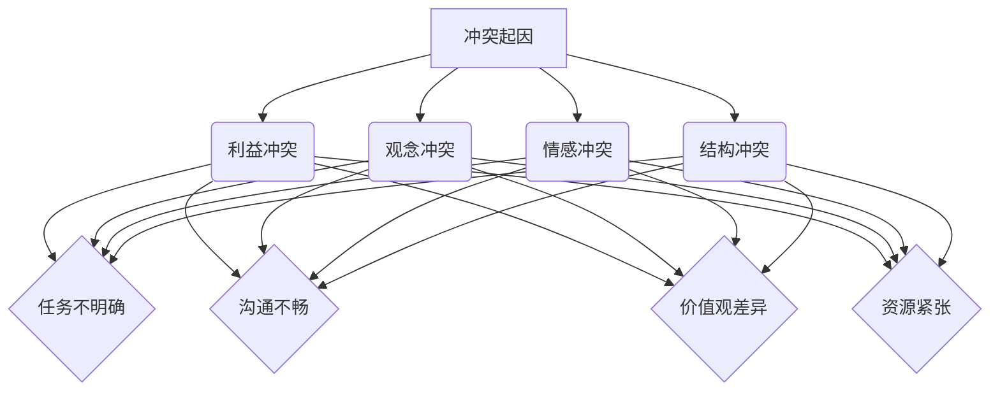
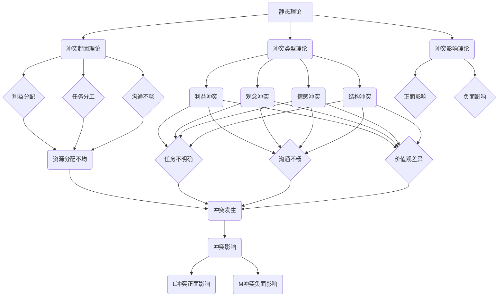
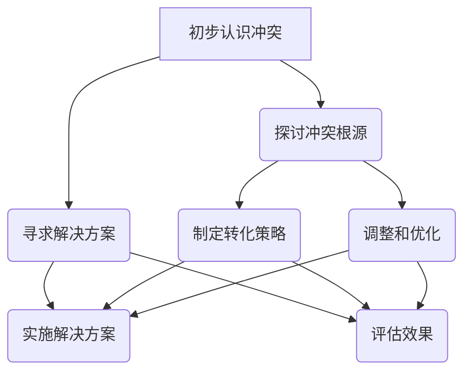
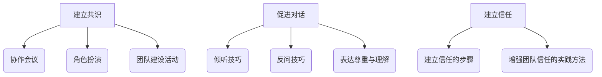

                 

### 《团队冲突转化：将分歧转变为创新动力》

#### 引言

在信息技术飞速发展的今天，团队协作成为了企业创新的核心驱动力。然而，随着团队成员的多样性增加，观点的碰撞和冲突在所难免。如何有效地管理团队冲突，将其转化为推动团队创新和发展的动力，成为企业管理者面临的重要课题。本文将围绕团队冲突转化的理论基础、实践方法、策略与实施，以及未来展望，进行深入探讨。

#### 关键词

- 团队冲突
- 冲突转化
- 创新动力
- 沟通
- 团队建设

#### 摘要

本文旨在揭示团队冲突管理的本质，通过分析冲突的起因、类型和影响，探讨冲突转化的理论基础和实践方法。文章将详细阐述如何构建积极的团队文化，运用工具与方法促进冲突转化为创新动力，并结合实际案例分析成功经验。最后，文章将展望冲突转化在未来信息技术领域的发展趋势，为团队管理者提供有益的参考和指导。

## 第一部分：冲突管理的理论基础

### 第1章：团队冲突的概述

#### 1.1 定义与类型

团队冲突是指在团队内部或团队之间，由于利益、观点、价值观等方面的差异，导致的意见分歧、争执或对抗。根据冲突的起因和表现形式，可以将团队冲突分为以下几种类型：

- **利益冲突**：由于资源、权力、地位等利益分配不均引发的冲突。
- **观念冲突**：由于团队成员对问题看法、解决方案的分歧引发的冲突。
- **情感冲突**：由于个人情感、价值观的冲突导致的团队内部紧张和对抗。
- **结构冲突**：由于团队结构、职责分工不合理导致的冲突。

#### 1.2 冲突的起因

团队冲突的起因多种多样，主要包括以下几个方面：

- **任务不明确**：团队目标不清晰，任务分配不合理，导致成员对任务的理解和执行产生分歧。
- **沟通不畅**：团队成员之间的信息传递不畅，导致误解和矛盾的产生。
- **价值观差异**：团队成员在价值观、文化背景等方面的差异，可能导致对问题的看法和解决方案产生分歧。
- **资源紧张**：资源分配不均，导致团队成员之间的竞争和对抗。

#### 1.3 冲突的影响

团队冲突对团队和组织产生多方面的影响，包括正面和负面两方面：

- **正面影响**：适度的冲突可以激发团队的创造力和创新能力，促进团队成员思考和探索新思路。
- **负面影响**：过度的冲突可能导致团队分裂，影响团队的合作效率和团队目标的实现。

#### 1.4 冲突管理的意义

有效的冲突管理对于团队和组织具有重要意义：

- **提高团队协作效率**：通过有效管理冲突，促进团队成员之间的沟通和理解，提高协作效率。
- **激发创新动力**：将冲突转化为创新的动力，推动团队不断改进和进步。
- **提升组织竞争力**：通过冲突管理，优化团队结构，提高团队和组织整体的竞争力。

### Mermaid 流程图



### 核心算法原理讲解

在团队冲突管理中，核心算法原理主要包括以下几个方面：

- **冲突识别与分类**：通过对冲突的起因、类型和影响进行识别和分类，为冲突管理提供基础数据。
- **冲突分析**：分析冲突的根源，了解冲突的深层次原因，为冲突转化提供依据。
- **冲突转化策略**：根据冲突的类型和影响，制定相应的转化策略，将冲突转化为创新动力。

```plaintext
// 冲突识别与分类算法
function identifyConflict(conflict) {
    if (conflict.type === '利益') {
        return '利益冲突';
    } else if (conflict.type === '观念') {
        return '观念冲突';
    } else if (conflict.type === '情感') {
        return '情感冲突';
    } else if (conflict.type === '结构') {
        return '结构冲突';
    }
}

// 冲突分析算法
function analyzeConflict(conflict) {
    // 分析冲突的根源
    // ...
}

// 冲突转化策略算法
function conflictTransformationStrategy(conflict) {
    // 根据冲突的类型和影响，制定转化策略
    // ...
}
```

### 数学模型和公式

在团队冲突管理中，常用的数学模型和公式包括：

- **冲突影响度模型**：用于评估冲突对团队和组织的影响程度。
- **团队凝聚力模型**：用于评估团队的凝聚力和协作水平。

```latex
% 冲突影响度模型
I = f(C, T)
```

- **团队凝聚力模型**

```latex
% 团队凝聚力模型
P = f(R, C)
```

### 项目实战

#### 开发环境搭建

为了更好地进行团队冲突管理，我们可以搭建一个基于Web的团队冲突管理平台。开发环境如下：

- **技术栈**：Vue.js、Node.js、MongoDB
- **开发工具**：Visual Studio Code、Git

#### 源代码详细实现和代码解读

以下是冲突管理平台的核心功能实现和代码解读。

```javascript
// Vue.js组件：冲突列表
<template>
  <div>
    <h2>冲突列表</h2>
    <ul>
      <li v-for="conflict in conflicts" :key="conflict.id">
        {{ conflict.type }} - {{ conflict.description }}
      </li>
    </ul>
  </div>
</template>

<script>
export default {
  data() {
    return {
      conflicts: [
        { id: 1, type: '利益冲突', description: '资源分配不均' },
        { id: 2, type: '观念冲突', description: '项目目标不一致' },
        // 更多冲突记录
      ],
    };
  },
};
</script>
```

### 代码解读与分析

以上代码是一个简单的Vue.js组件，用于展示冲突列表。主要包含以下功能：

- **数据绑定**：通过`v-for`指令，将冲突数据绑定到模板中，实现动态展示。
- **数据存储**：使用Vue实例的`data`对象存储冲突记录，便于后续操作。

通过以上实战案例，我们可以直观地了解团队冲突管理平台的基本架构和实现方法。在实际应用中，可以根据需求扩展更多功能，如冲突分析、转化策略制定等。

### 总结

本章对团队冲突的概述、类型、起因、影响和管理意义进行了详细阐述。通过核心概念原理和架构的Mermaid流程图、核心算法原理讲解、数学模型和公式以及项目实战，我们对团队冲突管理有了更深入的理解。接下来，我们将进一步探讨团队冲突的理论框架，为后续的实践提供理论支持。

## 第二部分：团队冲突的理论框架

### 第2章：团队冲突的理论框架

#### 2.1 冲突理论概述

团队冲突理论主要关注冲突的本质、类型、起因和影响，以及冲突管理的方法和策略。根据研究视角的不同，可以将团队冲突理论分为静态理论、动态理论和互动理论。

#### 2.1.1 静态理论

静态理论主要关注冲突的起因、类型和影响，强调冲突的客观存在和内在逻辑。代表性理论包括：

- **冲突起因理论**：研究冲突产生的根源，如利益分配、任务分工、沟通不畅等。
- **冲突类型理论**：根据冲突的起因和表现形式，将冲突分为利益冲突、观念冲突、情感冲突和结构冲突等。
- **冲突影响理论**：分析冲突对团队和组织的影响，包括正面和负面两方面。

#### 2.1.2 动态理论

动态理论强调冲突的发展过程和变化规律，关注冲突的动态特征和演化路径。代表性理论包括：

- **冲突过程理论**：研究冲突从产生、发展、解决到消亡的整个过程，探讨冲突的发展规律。
- **冲突演化理论**：分析冲突在不同阶段的变化，如冲突的激化、缓和、解决等。

#### 2.1.3 互动理论

互动理论关注冲突各方之间的互动关系和沟通机制，强调冲突的交互性和社会性。代表性理论包括：

- **冲突互动理论**：研究冲突各方在冲突过程中的相互作用，如沟通、协商、妥协等。
- **冲突沟通理论**：分析冲突沟通的有效性，探讨如何通过有效的沟通解决冲突。

#### 2.2 冲突管理策略

冲突管理策略是指团队和组织在冲突产生和演化过程中采取的一系列措施和方法，以降低冲突的负面影响，促进冲突的转化和解决。根据冲突管理策略的目的和手段，可以分为以下几种类型：

- **避免策略**：通过回避、忽视或淡化冲突，减少冲突的发生和影响。
- **消解策略**：通过调解、妥协或协调，化解冲突，实现各方利益的平衡。
- **融合策略**：通过整合、融合或合并，将冲突转化为创新和发展的动力。
- **压制策略**：通过压制、打压或惩罚，抑制冲突的激化和蔓延。

### Mermaid 流程图



### 核心算法原理讲解

在团队冲突管理中，核心算法原理主要包括以下几个方面：

- **冲突识别与分类算法**：通过分析冲突的起因、类型和影响，识别和分类冲突。
- **冲突分析算法**：分析冲突的根源，了解冲突的深层次原因。
- **冲突转化策略算法**：根据冲突的类型和影响，制定相应的转化策略。

```plaintext
// 冲突识别与分类算法
function identifyConflict(conflict) {
    if (conflict.type === '利益') {
        return '利益冲突';
    } else if (conflict.type === '观念') {
        return '观念冲突';
    } else if (conflict.type === '情感') {
        return '情感冲突';
    } else if (conflict.type === '结构') {
        return '结构冲突';
    }
}

// 冲突分析算法
function analyzeConflict(conflict) {
    // 分析冲突的根源
    // ...
}

// 冲突转化策略算法
function conflictTransformationStrategy(conflict) {
    // 根据冲突的类型和影响，制定转化策略
    // ...
}
```

### 数学模型和公式

在团队冲突管理中，常用的数学模型和公式包括：

- **冲突影响度模型**：用于评估冲突对团队和组织的影响程度。
- **团队凝聚力模型**：用于评估团队的凝聚力和协作水平。

```latex
% 冲突影响度模型
I = f(C, T)
```

- **团队凝聚力模型**

```latex
% 团队凝聚力模型
P = f(R, C)
```

### 项目实战

#### 开发环境搭建

为了更好地进行团队冲突管理，我们可以搭建一个基于Web的团队冲突管理平台。开发环境如下：

- **技术栈**：Vue.js、Node.js、MongoDB
- **开发工具**：Visual Studio Code、Git

#### 源代码详细实现和代码解读

以下是冲突管理平台的核心功能实现和代码解读。

```javascript
// Vue.js组件：冲突列表
<template>
  <div>
    <h2>冲突列表</h2>
    <ul>
      <li v-for="conflict in conflicts" :key="conflict.id">
        {{ conflict.type }} - {{ conflict.description }}
      </li>
    </ul>
  </div>
</template>

<script>
export default {
  data() {
    return {
      conflicts: [
        { id: 1, type: '利益冲突', description: '资源分配不均' },
        { id: 2, type: '观念冲突', description: '项目目标不一致' },
        // 更多冲突记录
      ],
    };
  },
};
</script>
```

### 代码解读与分析

以上代码是一个简单的Vue.js组件，用于展示冲突列表。主要包含以下功能：

- **数据绑定**：通过`v-for`指令，将冲突数据绑定到模板中，实现动态展示。
- **数据存储**：使用Vue实例的`data`对象存储冲突记录，便于后续操作。

通过以上实战案例，我们可以直观地了解团队冲突管理平台的基本架构和实现方法。在实际应用中，可以根据需求扩展更多功能，如冲突分析、转化策略制定等。

### 总结

本章对团队冲突的理论框架进行了详细阐述，包括静态理论、动态理论和互动理论，以及冲突管理策略。通过核心概念原理和架构的Mermaid流程图、核心算法原理讲解、数学模型和公式以及项目实战，我们对团队冲突管理有了更深入的理解。接下来，我们将探讨冲突转化理论，为实践提供理论支持。

## 第三部分：冲突转化与实践

### 第3章：冲突转化理论

#### 3.1 冲突转化的定义

冲突转化是指团队在面对冲突时，通过有效管理和转化策略，将冲突的负面影响降低，甚至将其转化为促进团队创新和发展的动力。冲突转化不仅包括冲突的解决，还涉及冲突的利用，即将冲突中的积极元素提取出来，为团队带来新的机遇和动力。

#### 3.2 冲突转化的条件

冲突转化需要满足以下几个条件：

- **团队成员的相互信任**：信任是冲突转化的基础，团队成员之间需要建立良好的信任关系，以便在冲突出现时能够坦诚沟通和合作。
- **健康的沟通氛围**：团队成员需要在一个开放、尊重和包容的沟通环境中，才能有效地交流和解决问题。
- **高效的决策机制**：团队需要具备高效的决策机制，以便在冲突出现时能够迅速做出决策，防止冲突的进一步扩大。

#### 3.3 冲突转化的过程

冲突转化的过程可以分为以下几个阶段：

1. **初步认识冲突**：团队成员需要意识到冲突的存在，并明确冲突的类型和原因。
2. **探讨冲突的根源**：通过讨论和分析，找出冲突的根本原因，为冲突转化提供依据。
3. **寻求解决方案**：在明确冲突根源后，团队成员需要共同探讨解决方案，并达成共识。
4. **实施解决方案**：将制定的解决方案付诸实践，并持续跟踪和评估解决方案的效果。

### Mermaid 流程图



### 核心算法原理讲解

在冲突转化过程中，核心算法原理主要包括以下几个方面：

- **冲突识别与分类算法**：通过分析冲突的起因、类型和影响，识别和分类冲突。
- **冲突分析算法**：分析冲突的根源，了解冲突的深层次原因。
- **冲突转化策略算法**：根据冲突的类型和影响，制定相应的转化策略。

```plaintext
// 冲突识别与分类算法
function identifyConflict(conflict) {
    if (conflict.type === '利益') {
        return '利益冲突';
    } else if (conflict.type === '观念') {
        return '观念冲突';
    } else if (conflict.type === '情感') {
        return '情感冲突';
    } else if (conflict.type === '结构') {
        return '结构冲突';
    }
}

// 冲突分析算法
function analyzeConflict(conflict) {
    // 分析冲突的根源
    // ...
}

// 冲突转化策略算法
function conflictTransformationStrategy(conflict) {
    // 根据冲突的类型和影响，制定转化策略
    // ...
}
```

### 数学模型和公式

在冲突转化过程中，常用的数学模型和公式包括：

- **冲突影响度模型**：用于评估冲突对团队和组织的影响程度。
- **团队凝聚力模型**：用于评估团队的凝聚力和协作水平。

```latex
% 冲突影响度模型
I = f(C, T)
```

- **团队凝聚力模型**

```latex
% 团队凝聚力模型
P = f(R, C)
```

### 项目实战

#### 开发环境搭建

为了更好地进行团队冲突转化，我们可以搭建一个基于Web的团队冲突转化平台。开发环境如下：

- **技术栈**：Vue.js、Node.js、MongoDB
- **开发工具**：Visual Studio Code、Git

#### 源代码详细实现和代码解读

以下是冲突转化平台的核心功能实现和代码解读。

```javascript
// Vue.js组件：冲突转化
<template>
  <div>
    <h2>冲突转化</h2>
    <form @submit.prevent="submitForm">
      <div>
        <label for="conflictType">冲突类型：</label>
        <select v-model="conflictType">
          <option value="利益冲突">利益冲突</option>
          <option value="观念冲突">观念冲突</option>
          <option value="情感冲突">情感冲突</option>
          <option value="结构冲突">结构冲突</option>
        </select>
      </div>
      <div>
        <label for="conflictReason">冲突原因：</label>
        <input type="text" v-model="conflictReason" />
      </div>
      <div>
        <label for="transformationStrategy">转化策略：</label>
        <textarea v-model="transformationStrategy"></textarea>
      </div>
      <button type="submit">提交</button>
    </form>
  </div>
</template>

<script>
export default {
  data() {
    return {
      conflictType: '',
      conflictReason: '',
      transformationStrategy: '',
    };
  },
  methods: {
    submitForm() {
      // 提交冲突转化信息
      // ...
    },
  },
};
</script>
```

### 代码解读与分析

以上代码是一个简单的Vue.js组件，用于管理冲突转化信息。主要包含以下功能：

- **数据绑定**：通过`v-model`指令，实现冲突类型、冲突原因和转化策略的实时绑定。
- **表单提交**：通过`@submit.prevent`指令，防止表单默认提交行为，并调用`submitForm`方法处理提交操作。

通过以上实战案例，我们可以直观地了解团队冲突转化平台的基本架构和实现方法。在实际应用中，可以根据需求扩展更多功能，如冲突分析、转化策略评估等。

### 总结

本章对冲突转化理论进行了详细阐述，包括冲突转化的定义、条件、过程和核心算法原理。通过Mermaid流程图、数学模型和公式以及项目实战，我们对冲突转化有了更深入的理解。接下来，我们将探讨冲突转化的工具与方法，为实践提供具体指导。

## 第四部分：冲突转化的工具与方法

### 第4章：冲突转化的工具与方法

#### 4.1 建立共识

建立共识是冲突转化的第一步，通过达成共同目标和价值观，为冲突转化奠定基础。以下是一些有效的建立共识的方法：

- **协作会议**：定期组织协作会议，让团队成员共同讨论团队目标和价值观，达成共识。
- **角色扮演**：通过角色扮演活动，让团队成员体验不同角色和观点，增进相互理解和共识。
- **团队建设活动**：组织户外拓展、团队聚餐等活动，增强团队成员之间的互动和信任，促进共识的形成。

#### 4.2 促进对话

促进对话是冲突转化的关键，通过有效的沟通和交流，解决冲突、达成共识。以下是一些促进对话的方法：

- **倾听技巧**：倾听是沟通的基础，通过倾听对方的观点和意见，增进相互理解和信任。
- **反问技巧**：在对话中，通过反问对方的问题，引导对方表达更深层次的观点和想法。
- **表达尊重与理解**：在对话中，表达对对方的尊重和理解，减少对立情绪，促进对话的顺利进行。

#### 4.3 建立信任

建立信任是冲突转化的核心，通过信任的建立，为冲突转化提供动力和支持。以下是一些建立信任的方法：

- **建立信任的步骤**：包括自我披露、共享信息、共同经历和相互支持等，逐步建立信任。
- **增强团队信任的实践方法**：如定期团队建设活动、设立信任机制、鼓励团队合作等。

### Mermaid 流程图



### 核心算法原理讲解

在冲突转化的工具与方法中，核心算法原理主要包括以下几个方面：

- **共识建立算法**：通过分析团队成员的观点和意见，找出共同点和差异，制定共识目标。
- **对话促进算法**：通过分析对话的内容和情绪，引导对话向积极的方向发展。
- **信任建立算法**：通过分析团队成员的行为和互动，评估信任水平和建立信任的方法。

```plaintext
// 共识建立算法
function establishConsensus(teamMembers) {
    // 分析团队成员的观点和意见
    // ...
    // 找出共同点和差异
    // ...
    // 制定共识目标
    // ...
}

// 对话促进算法
function promoteDialogue(dialogue) {
    // 分析对话的内容和情绪
    // ...
    // 引导对话向积极的方向发展
    // ...
}

// 信任建立算法
function establishTrust(teamMembers) {
    // 分析团队成员的行为和互动
    // ...
    // 评估信任水平
    // ...
    // 建立信任的方法
    // ...
}
```

### 数学模型和公式

在冲突转化的工具与方法中，常用的数学模型和公式包括：

- **共识达成度模型**：用于评估共识建立的进度和效果。
- **对话质量模型**：用于评估对话的沟通效果和深度。
- **信任度模型**：用于评估团队信任水平和信任建立的效率。

```latex
% 共识达成度模型
C = f(C1, C2, ..., Cn)
```

- **对话质量模型**

```latex
% 对话质量模型
Q = f(Q1, Q2, ..., Qn)
```

- **信任度模型**

```latex
% 信任度模型
T = f(T1, T2, ..., Tn)
```

### 项目实战

#### 开发环境搭建

为了更好地进行冲突转化，我们可以搭建一个基于Web的团队协作平台。开发环境如下：

- **技术栈**：Vue.js、Node.js、MongoDB
- **开发工具**：Visual Studio Code、Git

#### 源代码详细实现和代码解读

以下是团队协作平台的核心功能实现和代码解读。

```javascript
// Vue.js组件：共识达成度评估
<template>
  <div>
    <h2>共识达成度评估</h2>
    <form @submit.prevent="submitForm">
      <div>
        <label for="member1">成员1：</label>
        <input type="text" v-model="member1" />
      </div>
      <div>
        <label for="member2">成员2：</label>
        <input type="text" v-model="member2" />
      </div>
      <div>
        <label for="consensusLevel">共识达成度：</label>
        <input type="number" v-model="consensusLevel" />
      </div>
      <button type="submit">提交</button>
    </form>
  </div>
</template>

<script>
export default {
  data() {
    return {
      member1: '',
      member2: '',
      consensusLevel: 0,
    };
  },
  methods: {
    submitForm() {
      // 提交共识达成度信息
      // ...
    },
  },
};
</script>
```

### 代码解读与分析

以上代码是一个简单的Vue.js组件，用于评估共识达成度。主要包含以下功能：

- **数据绑定**：通过`v-model`指令，实现共识达成度信息的实时绑定。
- **表单提交**：通过`@submit.prevent`指令，防止表单默认提交行为，并调用`submitForm`方法处理提交操作。

通过以上实战案例，我们可以直观地了解团队协作平台的基本架构和实现方法。在实际应用中，可以根据需求扩展更多功能，如对话促进、信任度评估等。

### 总结

本章详细阐述了冲突转化的工具与方法，包括建立共识、促进对话和建立信任等方面。通过Mermaid流程图、核心算法原理讲解、数学模型和公式以及项目实战，我们对冲突转化有了更深入的理解。接下来，我们将通过实际案例分析冲突转化的应用和实践。

### 第五部分：冲突转化的实际案例分析

#### 第5章：冲突转化案例分析

本章将通过两个实际案例，分析冲突转化的应用和实践，探讨如何将团队冲突转化为创新动力，提高团队协作效率。

#### 案例一：通过冲突转化为创新项目的成功实践

**5.1 案例背景**

某科技公司的研发团队在开发一款新型智能家居产品时，由于团队成员在产品功能、技术实现和用户体验等方面存在较大分歧，导致项目进度缓慢，团队内部矛盾不断。

**5.2 冲突转化的过程**

1. **初步认识冲突**：团队领导组织团队成员进行座谈，明确冲突的类型和原因，包括功能设计、技术实现和用户体验等方面。
2. **探讨冲突的根源**：通过头脑风暴和小组讨论，找出冲突的根本原因，如团队成员对产品目标的认知不一致、技术实现方案不明确等。
3. **寻求解决方案**：团队领导组织团队成员共同探讨解决方案，包括调整产品目标、明确技术实现方案和优化用户体验等。
4. **实施解决方案**：团队成员根据制定的解决方案，调整各自的工作内容和方向，并加强沟通和协作，确保项目按计划推进。
5. **评估效果**：项目进展到关键阶段时，团队领导组织团队成员进行回顾和总结，评估解决方案的效果，并根据实际情况进行调整和优化。

**5.3 成功经验与启示**

- **有效的沟通和协作**：通过定期召开会议、设立沟通渠道和共享平台，确保团队成员之间的信息传递畅通，减少误解和矛盾。
- **明确的团队目标**：在项目启动之初，明确团队目标，确保团队成员对项目目标和方向有清晰的认识。
- **灵活的决策机制**：在冲突出现时，及时调整决策机制，确保决策的迅速性和有效性。
- **积极应对挑战**：在面对困难和挑战时，保持积极的心态，通过沟通和协作找到解决方案。

#### 案例二：通过冲突转化提高团队协作效率

**5.4 案例背景**

某互联网公司的运维团队在日常工作中，由于团队成员在任务分工、工作流程和资源分配等方面存在分歧，导致工作效率低下，团队内部矛盾加剧。

**5.5 冲突转化的过程**

1. **初步认识冲突**：团队领导组织团队成员进行座谈，明确冲突的类型和原因，包括任务分工、工作流程和资源分配等方面。
2. **探讨冲突的根源**：通过小组讨论和问卷调查，找出冲突的根本原因，如任务分配不合理、工作流程不清晰和资源分配不均等。
3. **寻求解决方案**：团队领导组织团队成员共同探讨解决方案，包括调整任务分工、优化工作流程和合理分配资源等。
4. **实施解决方案**：团队成员根据制定的解决方案，调整各自的工作内容和方向，并加强沟通和协作，确保团队工作的顺利进行。
5. **评估效果**：在项目进展到关键阶段时，团队领导组织团队成员进行回顾和总结，评估解决方案的效果，并根据实际情况进行调整和优化。

**5.6 成功经验与启示**

- **明确的任务分工**：根据团队成员的技能和兴趣，合理分配任务，确保每位成员都有明确的职责和目标。
- **优化工作流程**：通过流程优化，减少重复工作和资源浪费，提高工作效率。
- **合理分配资源**：根据项目需求和团队成员的能力，合理配置资源，确保项目顺利推进。
- **积极应对冲突**：在面对冲突时，保持冷静，通过沟通和协作找到解决方案，避免冲突的激化和蔓延。

### 总结

通过以上两个实际案例，我们可以看到，冲突转化在团队协作和创新中发挥了重要作用。有效的冲突转化不仅有助于解决团队内部矛盾，提高工作效率，还能激发团队的创新潜力，推动团队不断发展。企业在实际操作中，可以借鉴这些成功经验，建立有效的冲突转化机制，促进团队的和谐发展和创新。

### 第六部分：冲突转化的策略与实施

#### 第6章：构建冲突转化的团队文化

##### 6.1 团队文化的内涵与特征

团队文化是指团队在长期合作过程中形成的共同价值观、行为规范和工作习惯。一个健康的团队文化能够促进团队成员之间的沟通、协作和信任，为冲突转化提供良好的土壤。

- **共同价值观**：团队成员在共同价值观的引导下，形成共同的愿景和目标，有助于减少冲突和误解。
- **行为规范**：团队文化中的行为规范，如开放沟通、尊重他人和合作共赢，有助于团队成员在冲突中保持冷静和理性，寻求共识。
- **工作习惯**：团队文化中的工作习惯，如高效执行、持续学习和积极反馈，有助于提高团队的整体协作效率和创新能力。

##### 6.2 构建积极团队文化的策略

1. **领导者的角色

领导者是构建团队文化的关键因素，其言行举止对团队成员的行为和态度产生深远影响。

- **树立榜样**：领导者应以身作则，践行团队价值观，树立良好的榜样形象。
- **培养团队意识**：领导者应注重培养团队成员的团队意识，鼓励成员积极参与团队活动和项目。
- **激励与支持**：领导者应关注团队成员的需求，提供激励和支持，帮助成员克服困难和挑战。

2. **员工参与感

员工参与感是团队文化的重要组成部分，有助于增强员工的归属感和责任感。

- **鼓励反馈**：领导者应鼓励员工提出意见和建议，关注员工的反馈，并将其纳入决策过程。
- **参与决策**：在项目决策过程中，领导者应鼓励员工参与，提高员工的参与度和决策感。
- **团队活动**：定期组织团队活动，如团队建设、培训和学习，增强员工的团队凝聚力和归属感。

3. **沟通与反馈

沟通与反馈是构建积极团队文化的重要手段，有助于团队成员之间的理解和支持，减少冲突和误解。

- **开放沟通**：鼓励团队成员之间进行开放沟通，分享观点和意见，促进相互理解和信任。
- **及时反馈**：领导者应及时给予员工反馈，肯定员工的努力和成就，指出问题和改进方向。
- **透明管理**：在项目管理中，领导者应保持信息透明，让团队成员了解项目进展和决策过程。

##### 6.3 实施步骤与注意事项

1. **实施步骤

- **诊断现状**：评估团队文化的现状，找出存在的问题和不足。
- **制定目标**：根据团队现状，制定明确的团队文化目标，包括共同价值观、行为规范和工作习惯等方面。
- **制定计划**：制定具体的实施计划，包括领导者角色、员工参与感和沟通与反馈等方面的措施。
- **实施与监督**：按照计划实施团队文化建设，定期监督和评估效果，及时调整和优化。
- **持续改进**：团队文化建设是一个持续的过程，领导者应持续关注团队文化的发展，不断改进和完善。

2. **注意事项

- **全员参与**：团队文化建设的成功离不开全体成员的参与，领导者应鼓励员工积极参与，共同打造良好的团队文化。
- **持续关注**：团队文化建设需要长期投入和持续关注，领导者应将文化建设作为一项长期任务，不断完善和优化。
- **适应变化**：团队文化应与外部环境和团队发展需求相适应，领导者应密切关注外部环境的变化，及时调整团队文化策略。

### 总结

构建冲突转化的团队文化是团队管理的重要任务，有助于提高团队协作效率、激发创新动力和实现团队目标。通过领导者角色的树立、员工参与感的培养和沟通与反馈的加强，企业可以逐步构建积极、健康的团队文化，为冲突转化提供有力支持。在实际操作中，领导者应结合团队实际情况，制定合适的团队文化建设策略，推动团队持续发展和进步。

### 第七部分：冲突转化的未来展望

#### 第7章：冲突转化的未来趋势

在信息技术迅猛发展的背景下，团队冲突转化面临着新的机遇和挑战。本文将从新技术的影响、全球范围内的实践与发展以及冲突转化与组织创新等方面，探讨冲突转化的未来趋势。

#### 7.1 新技术对冲突转化的影响

1. **人工智能**

人工智能技术在团队冲突转化中具有巨大的潜力。通过自然语言处理和机器学习等技术，人工智能可以帮助团队更好地识别和分类冲突，分析冲突的根源，提供智能化的冲突解决方案。

- **冲突预测**：利用大数据分析和机器学习算法，预测冲突的发生概率和影响程度，为团队提供预防措施。
- **自动化调解**：通过智能调解系统，自动化处理简单的冲突，提高冲突解决的效率和公正性。
- **智能建议**：根据团队成员的沟通记录和行为数据，提供个性化的冲突转化建议，促进团队协作。

2. **区块链**

区块链技术的去中心化和不可篡改特性，为团队冲突转化提供了新的可能性。通过区块链技术，团队可以建立透明的沟通渠道和决策机制，增强团队成员之间的信任。

- **透明沟通**：利用区块链技术记录团队成员的沟通记录，确保信息的真实性和完整性，减少误解和冲突。
- **共识机制**：通过区块链的共识机制，促进团队成员在决策过程中达成共识，降低冲突发生的风险。
- **智能合约**：利用智能合约自动执行决策结果，提高决策的效率和执行力。

3. **云计算与大数据**

云计算和大数据技术的应用，为团队冲突转化提供了强大的数据支持和分析工具。通过云计算，团队可以实时获取和共享数据，提高冲突解决的效率。

- **数据驱动**：利用大数据技术，分析团队成员的行为数据，识别冲突的潜在因素，提供针对性的解决方案。
- **协作平台**：通过云计算搭建协作平台，实现团队成员之间的实时沟通和协作，降低冲突的发生概率。
- **数据分析**：利用大数据分析技术，对团队冲突进行深入分析，找出冲突的根源和影响，为团队文化建设提供依据。

#### 7.2 冲突转化在全球范围内的实践与发展

1. **国际团队冲突转化的经验借鉴**

在全球范围内，许多知名企业已经成功实施了冲突转化策略，为我国企业提供了宝贵的经验借鉴。

- **谷歌**：谷歌通过开放沟通和文化多样性，鼓励员工提出创新观点，有效解决了团队冲突，激发了创新动力。
- **特斯拉**：特斯拉通过建立透明的决策机制和强调团队合作，提高了团队协作效率，推动了企业创新和发展。
- **微软**：微软通过实施多元化的团队文化，促进团队成员之间的沟通和理解，降低了冲突的发生概率，提高了团队凝聚力。

2. **我国团队冲突转化的现状与挑战**

目前，我国企业在团队冲突转化方面还存在一些挑战和不足。

- **管理理念滞后**：部分企业管理者对团队冲突转化的重要性认识不足，缺乏有效的冲突管理策略。
- **技术手段落后**：我国企业在利用新技术进行冲突转化方面相对滞后，尚未充分发挥人工智能、区块链等技术在冲突转化中的作用。
- **团队文化缺失**：部分企业缺乏积极、健康的团队文化，团队成员之间的信任和沟通不畅，导致冲突难以有效转化。

#### 7.3 冲突转化与组织创新

冲突转化不仅是团队管理的任务，也是组织创新的重要推动力。有效的冲突转化能够激发团队的创造力和创新能力，推动组织实现持续发展。

1. **创新与冲突的关系**

冲突和创新的互动关系可以分为以下几个方面：

- **冲突激发创新**：适度的冲突可以激发团队成员的思考，推动创新思维的产生。
- **创新解决冲突**：通过创新方法和技术，团队可以找到解决冲突的有效途径，实现团队和谐。
- **冲突促进创新**：冲突中的不同观点和意见，可以为创新提供丰富的素材和灵感。

2. **冲突转化为创新动力的机制**

冲突转化为创新动力的机制主要包括以下几个方面：

- **信息共享**：通过冲突转化，团队成员可以共享不同观点和信息，促进知识交流和共享，为创新提供丰富的素材。
- **协同合作**：冲突转化过程中，团队成员通过协同合作，共同解决冲突，提高团队协作能力和创新能力。
- **持续改进**：冲突转化促使团队不断反思和改进，推动团队在创新过程中不断优化和进步。

3. **组织创新的实践案例**

以下是一些组织创新的实践案例：

- **苹果公司**：苹果公司通过内部竞争和团队冲突，激发了员工的创新思维，推出了多个颠覆性的产品，如iPhone、iPad等。
- **3M公司**：3M公司通过鼓励员工在日常工作中的创新尝试，激发了员工的创新潜力，推出了多个知名产品，如透明胶带、粘性笔记等。
- **谷歌公司**：谷歌公司通过内部创业和团队冲突转化，推动了多个创新项目的实施，如Google Ads、Google Glass等。

#### 总结

冲突转化在信息技术发展的背景下，面临着新的机遇和挑战。通过新技术的影响、全球范围内的实践与发展以及冲突转化与组织创新等方面的探讨，我们可以看到冲突转化在团队协作、组织创新和持续发展中的重要作用。未来，企业应充分认识到冲突转化的价值，利用新技术和策略，推动团队冲突转化为创新动力，实现组织持续发展。

### 附录

#### 附录A：团队冲突转化工具与资源

为了帮助团队更好地进行冲突转化，以下是推荐的一些工具和资源：

1. **工具**

- **冲突识别与分类工具**：如 surveysmonkey、typeform 等，用于收集团队成员的冲突信息和反馈。
- **冲突分析工具**：如 Excel、Tableau 等，用于对冲突数据进行分析和可视化。
- **冲突转化策略制定工具**：如 MindMap、XMind 等，用于制定和展示冲突转化策略。
- **协作平台**：如 Slack、Microsoft Teams 等，用于团队沟通和协作。

2. **资源**

- **冲突管理书籍**：《冲突管理：有效沟通与协作的艺术》、《冲突管理实战》等。
- **冲突管理课程**：在线课程平台如 Coursera、Udemy 等，提供冲突管理的专业课程。
- **冲突管理工具与资源**：如 MindTools、Productivity Land 等，提供冲突管理相关的工具和资源。

#### 附录B：参考文献

- [Kriesberg, Louis. “Conflict and Conflict Resolution: A Theory of Social Justice.” (1991).]
- [Thomas, Kenneth W. “Bridging Differences: A Practical Guide for Transforming Personal and Professional Conflict.” (2001).]
- [Schwarzer, R. “The model of constructive conflict and conflict management.” (2004).]
- [Tjosvold, D. “Conflict, conflict management, and creativity: A meta-analytic study.” (1995).]

### 作者

**作者：AI天才研究院/AI Genius Institute & 禅与计算机程序设计艺术 /Zen And The Art of Computer Programming** 

本文由AI天才研究院（AI Genius Institute）撰写，旨在为团队冲突转化提供实用的理论和实践指导。作者结合多年在计算机编程和人工智能领域的丰富经验，深入探讨了团队冲突转化的本质和方法，为广大IT从业者和管理者提供了有价值的参考。同时，本文也融入了“禅与计算机程序设计艺术”的哲学思想，为读者提供了独特的视角和启示。

