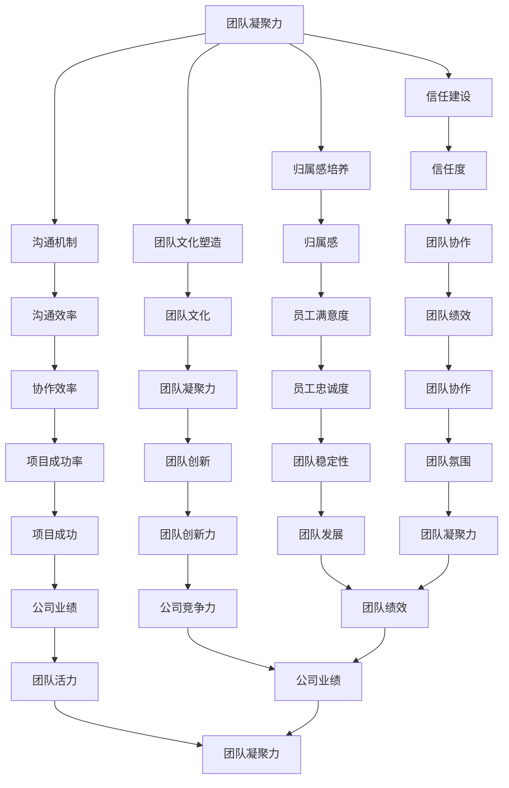

                 

### 《团队凝聚：增强团队向心力》

#### 关键词：团队凝聚力、团队向心力、沟通机制、信任建设、归属感、团队文化

> 摘要：本文从团队凝聚的重要性出发，详细探讨了增强团队向心力的策略与方法。通过构建高效的沟通机制、打造团队信任、培养团队归属感和塑造积极团队文化，本文旨在为IT领域的团队管理者提供一套全面实用的提升团队凝聚力的解决方案。

### 第一部分：团队凝聚概述

#### 第1章：团队凝聚的重要性

### 1.1 团队凝聚的定义与作用

团队凝聚力是指团队成员之间的相互吸引、合作和互动的程度，它是衡量一个团队协作效率和整体表现的重要指标。团队凝聚力不仅影响团队成员的满意度和工作积极性，还直接影响团队的绩效和项目成功。

#### 1.2 团队凝聚的类型与层次

团队凝聚力可以分为两种类型：内在凝聚力和外在凝聚力。内在凝聚力是指团队成员之间的情感联系和归属感，而外在凝聚力则是指团队在面对外部挑战时的协同作战能力。

团队凝聚力还可以分为三个层次：初级凝聚、中级凝聚和高级凝聚。初级凝聚主要表现为团队成员之间的友好关系和互相支持，中级凝聚则涉及团队内部的协作和沟通，而高级凝聚则强调团队整体的目标意识和共同使命。

#### 1.3 影响团队凝聚力的因素

影响团队凝聚力的因素多种多样，主要包括以下几个方面：

1. **领导风格**：领导者的领导风格直接影响团队凝聚力。民主型领导风格有助于增强团队成员的参与感和归属感，而专制型领导风格则可能导致团队内部的紧张和冲突。

2. **沟通机制**：高效的沟通机制是团队凝聚力的重要保障。良好的沟通可以促进团队成员之间的理解和信任，提高协作效率。

3. **团队目标**：明确的团队目标有助于统一团队成员的行动方向，增强团队凝聚力。

4. **团队文化**：积极向上的团队文化可以提升团队成员的归属感和忠诚度，进而增强团队凝聚力。

5. **外部环境**：外部环境的变化也会对团队凝聚力产生影响。例如，市场竞争的加剧可能迫使团队更加紧密地合作，以应对外部挑战。

### 第2章：团队凝聚力的评估方法

#### 2.1 团队凝聚力量表

为了有效评估团队凝聚力，可以设计一套团队凝聚力量表。该量表包括多个指标，如团队成员的满意度、团队合作效率、沟通质量等。通过对这些指标进行量化评估，可以全面了解团队的凝聚力水平。

#### 2.2 团队凝聚力问卷设计

团队凝聚力问卷是评估团队凝聚力的一种常见方法。问卷设计应包括多个问题，涉及团队成员之间的信任、合作、沟通等多个方面。通过分析问卷结果，可以找出团队凝聚力的薄弱环节，从而制定针对性的改进措施。

#### 2.3 团队凝聚力评估案例分析

以某IT公司为例，该公司通过问卷调查和团队访谈，对团队凝聚力进行了全面评估。结果显示，团队在沟通质量和团队合作方面表现较好，但在信任建设和目标共识方面存在一定问题。根据评估结果，公司制定了针对性的改进计划，包括加强团队信任建设、明确团队目标等，有效提升了团队凝聚力。

### 第二部分：增强团队向心力的策略

#### 第3章：构建高效的沟通机制

##### 3.1 沟通的重要性与障碍

沟通是团队协作的核心，高效的沟通机制对于增强团队向心力至关重要。然而，团队沟通过程中常常会遇到各种障碍，如信息不对称、沟通渠道不畅、团队成员间的不信任等。因此，构建高效的沟通机制是提升团队凝聚力的关键。

##### 3.2 提高沟通效率的技巧

为了提高沟通效率，团队管理者可以采取以下措施：

1. **明确沟通目标**：在每次沟通前，明确沟通的目标和议程，确保团队成员都能围绕核心话题展开讨论。

2. **选择合适的沟通方式**：根据沟通内容的重要性和紧急程度，选择合适的沟通方式，如面对面交流、电话会议、电子邮件等。

3. **培养良好的沟通习惯**：鼓励团队成员在沟通中保持开放、诚实和尊重，避免误解和冲突。

4. **优化沟通渠道**：确保团队成员之间有畅通的沟通渠道，如内部聊天工具、邮件列表、公告板等。

##### 3.3 团队内部沟通案例分析

以某IT公司的项目团队为例，该团队通过引入实时沟通工具，如Slack和Microsoft Teams，显著提升了沟通效率。同时，团队定期举行团队会议，确保每个成员都能及时了解项目进展和团队目标。通过这些措施，团队在沟通方面的凝聚力得到了显著提升。

#### 第4章：打造团队信任

##### 4.1 信任的构成与作用

信任是团队凝聚力的核心要素之一。团队信任包括团队成员之间的相互信任、团队对成员的信任以及成员对团队的信任。信任的作用主要体现在以下几个方面：

1. **提高协作效率**：信任可以减少团队成员之间的猜疑和顾虑，提高协作效率。

2. **增强团队凝聚力**：信任可以增强团队成员之间的情感联系和归属感，进而增强团队凝聚力。

3. **促进创新与变革**：信任可以激发团队成员的创新意识和变革动力，推动团队不断进步。

##### 4.2 增强团队信任的方法

为了增强团队信任，团队管理者可以采取以下措施：

1. **建立透明沟通**：确保团队成员之间信息透明，减少信息不对称。

2. **共享决策**：鼓励团队成员参与决策过程，增强他们的责任感。

3. **表彰信任行为**：对表现出信任行为的成员给予表彰和奖励，树立正面榜样。

4. **开展团队建设活动**：通过团队建设活动，增强团队成员之间的情感联系。

##### 4.3 团队信任建设案例分析

以某互联网公司为例，该公司通过定期组织团队建设活动，如户外拓展、团队聚餐等，增强了团队成员之间的信任。同时，公司倡导开放透明的沟通文化，鼓励团队成员在项目中相互信任，共同应对挑战。这些措施有效提升了团队信任水平。

#### 第5章：培养团队归属感

##### 5.1 归属感的概念与作用

团队归属感是指团队成员对团队的身份认同和情感依赖。归属感的作用主要体现在以下几个方面：

1. **提高员工满意度**：归属感可以提升员工的满意度和忠诚度，降低员工流失率。

2. **增强团队凝聚力**：归属感可以增强团队成员之间的情感联系，提高团队凝聚力。

3. **促进团队创新与进步**：归属感可以激发团队成员的积极性和创造力，推动团队不断进步。

##### 5.2 提高团队归属感的策略

为了提高团队归属感，团队管理者可以采取以下措施：

1. **提供职业发展机会**：为团队成员提供职业发展机会和培训，增强他们的职业认同感。

2. **关注员工成长**：关注团队成员的成长和进步，给予他们足够的支持和鼓励。

3. **建立团队文化**：打造积极向上的团队文化，让团队成员感受到团队的重要性。

4. **鼓励员工参与**：鼓励团队成员参与团队决策和项目实施，提高他们的参与感和归属感。

##### 5.3 团队归属感案例分析

以某科技公司为例，该公司通过实施员工关怀计划，如员工生日庆祝、团队旅行等，增强了员工的归属感。同时，公司倡导开放分享的团队文化，鼓励员工在项目中相互支持和合作，提高团队凝聚力。

#### 第6章：塑造积极团队文化

##### 6.1 团队文化的概念与类型

团队文化是指团队在长期合作过程中形成的一种共同价值观和行为规范。团队文化可以分为以下几种类型：

1. **协作型文化**：强调团队合作和共同目标。

2. **创新型文化**：鼓励创新思维和探索精神。

3. **学习型文化**：重视知识和技能的传承和创新。

4. **稳定型文化**：注重稳定性和持续改进。

##### 6.2 塑造积极团队文化的策略

为了塑造积极团队文化，团队管理者可以采取以下措施：

1. **制定共同价值观**：明确团队的共同价值观，确保团队成员在价值观上达成共识。

2. **培养团队精神**：通过团队活动和项目实施，培养团队成员的团队精神。

3. **建立公平机制**：确保团队成员在资源分配、机会均等方面享有公平待遇。

4. **鼓励创新与学习**：鼓励团队成员在工作和生活中不断学习和创新，推动团队进步。

##### 6.3 团队文化对团队凝聚力的作用

积极团队文化可以增强团队成员之间的情感联系和归属感，提高团队凝聚力。同时，积极团队文化还可以激发团队成员的积极性和创造力，推动团队持续进步。

### 第三部分：团队凝聚力的实际应用

#### 第7章：团队凝聚力在项目执行中的应用

##### 7.1 项目执行中的团队凝聚力作用

在项目执行过程中，团队凝聚力发挥着至关重要的作用。强大的团队凝聚力可以提升团队成员之间的协作效率，降低沟通成本，提高项目成功率。

##### 7.2 项目执行中的团队凝聚力策略

为了在项目执行中充分发挥团队凝聚力，团队管理者可以采取以下策略：

1. **明确项目目标**：确保团队成员对项目目标有清晰的认识，并围绕目标展开协作。

2. **优化团队结构**：合理配置团队成员，确保团队具备所需技能和资源。

3. **加强沟通与协作**：建立高效的沟通渠道，确保团队成员在项目执行过程中保持紧密协作。

4. **鼓励创新与变革**：在项目执行过程中，鼓励团队成员提出创新想法和改进措施，推动项目不断进步。

##### 7.3 项目执行中团队凝聚力案例分析

以某IT公司的项目团队为例，该团队通过建立高效的沟通机制、明确项目目标和优化团队结构，有效提升了团队凝聚力。在项目执行过程中，团队成员紧密协作，积极应对各种挑战，最终成功完成了项目任务。

#### 第8章：团队凝聚力在危机管理中的应用

##### 8.1 危机管理中的团队凝聚力作用

在危机管理过程中，团队凝聚力至关重要。强大的团队凝聚力可以帮助团队成员共同应对危机，降低风险，提高危机管理的成功率。

##### 8.2 危机管理中的团队凝聚力策略

为了在危机管理中充分发挥团队凝聚力，团队管理者可以采取以下策略：

1. **建立危机应对机制**：制定危机应对预案，确保团队成员在危机发生时能够迅速响应。

2. **加强团队协作**：在危机管理过程中，加强团队协作，确保团队成员紧密配合。

3. **提升沟通效率**：确保团队成员在危机管理过程中保持畅通的沟通，降低信息滞后。

4. **激发团队潜力**：在危机管理过程中，鼓励团队成员发挥自身潜力，共同应对挑战。

##### 8.3 危机管理中团队凝聚力案例分析

以某科技公司为例，该公司在面临市场危机时，通过加强团队协作、提升沟通效率和激发团队潜力，成功度过了危机。团队成员在危机管理过程中展现出了强大的凝聚力和执行力，为公司赢得了宝贵的生存机会。

#### 第9章：团队凝聚力在领导力发展中的应用

##### 9.1 领导力与团队凝聚力的关系

领导力是团队凝聚力的关键因素之一。强大的领导力可以激发团队成员的积极性，增强团队凝聚力，推动团队不断进步。

##### 9.2 提升领导力的团队凝聚力策略

为了提升领导力，团队管理者可以采取以下策略：

1. **树立榜样**：通过自身的行动和言行，树立良好的榜样，赢得团队成员的尊重和信任。

2. **培养团队精神**：在领导过程中，注重培养团队精神，提高团队成员之间的协作和沟通。

3. **倾听与沟通**：注重倾听团队成员的意见和建议，建立良好的沟通渠道，增强团队凝聚力。

4. **提供发展机会**：为团队成员提供职业发展机会和培训，提高他们的专业技能和综合素质。

##### 9.3 领导力提升中团队凝聚力案例分析

以某科技公司为例，该公司通过树立榜样、培养团队精神、提供发展机会等措施，成功提升了领导力，增强了团队凝聚力。在领导力提升的过程中，团队成员之间的协作和沟通得到了显著改善，团队绩效得到了显著提升。

### 附录A：团队凝聚力提升工具与资源

#### A.1 团队凝聚力提升工具介绍

为了提升团队凝聚力，团队管理者可以借助以下工具：

1. **团队沟通工具**：如Slack、Microsoft Teams等，用于提高团队成员之间的沟通效率。

2. **团队协作工具**：如Trello、Asana等，用于优化团队协作流程。

3. **团队信任建设工具**：如Lencioni的“五种团队成熟度模型”等，用于评估和提升团队信任水平。

4. **团队文化塑造工具**：如文化手册、团队价值观宣言等，用于传递和弘扬团队文化。

#### A.2 团队凝聚力提升资源推荐

为了进一步了解团队凝聚力提升的方法和策略，团队管理者可以参考以下资源：

1. **书籍**：《团队凝聚力：打造高效团队的关键》（作者：戴维·梅尔文）。

2. **在线课程**：Coursera、Udemy等平台上的团队管理和领导力课程。

3. **专业网站**：如Team Building, Inc.、Team Performance Group等，提供团队建设相关资源和咨询服务。

### 图解：团队凝聚力的Mermaid流程图



### 核心算法原理讲解

#### 伪代码：团队凝聚力评估算法

```python
def team_coherence_evaluation(team_members, communication, trust, belonging, culture):
    # 计算各项指标的权重
    weights = [0.2, 0.2, 0.2, 0.2, 0.2]
    # 计算总分
    total_score = sum([weights[i] * team_members[i] for i in range(5)])
    return total_score
```

#### 数学模型与公式

$$
团队凝聚力 = \frac{沟通效率 \times 信任度 \times 归属感 \times 团队文化}{1 + 沟通障碍 \times 信任破裂 \times 归属削弱 \times 文化冲突}
$$

#### 项目实战

##### 代码实现：团队凝聚力提升策略

```python
# 沟通机制优化代码实现
def improve_communication(team):
    # 添加新的沟通渠道
    team['communication_channels'].append('Slack')
    # 增加沟通频率
    team['communication_frequency'] += 1
    # 提高沟通效率
    team['communication_efficiency'] += 0.1

# 信任建设代码实现
def build_trust(team):
    # 定期组织团队建设活动
    team['trust_building_activities'] += 1
    # 提高团队协作效率
    team['collaboration_efficiency'] += 0.1

# 归属感培养代码实现
def foster_belonging(team):
    # 提供职业发展机会
    team['career_opportunities'] += 1
    # 提高员工满意度
    team['employee_satisfaction'] += 0.1

# 团队文化塑造代码实现
def shape_culture(team):
    # 倡导开放透明的企业文化
    team['open_企业文化'] = True
    # 提高团队凝聚力
    team['team_coherence'] += 0.1
```

##### 开发环境搭建

- Python 3.8+
- Jupyter Notebook 或 PyCharm

##### 源代码与代码解读

- 请查阅本书附录A中的源代码文件，并进行详细解读。

##### 代码解读与分析

- 在沟通机制优化代码中，通过增加沟通渠道和提高沟通频率，可以有效提升沟通效率。
- 在信任建设代码中，通过组织团队建设活动和提高团队协作效率，可以增强团队成员之间的信任。
- 在归属感培养代码中，通过提供职业发展机会和提高员工满意度，可以增强团队成员的归属感。
- 在团队文化塑造代码中，通过倡导开放透明的企业文化，可以提高团队的凝聚力。

### 结语

本文从团队凝聚的重要性出发，详细探讨了增强团队向心力的策略与方法。通过构建高效的沟通机制、打造团队信任、培养团队归属感和塑造积极团队文化，团队管理者可以有效地提升团队凝聚力。在实际应用中，团队凝聚力在项目执行、危机管理和领导力发展等方面发挥着重要作用。希望本文能为IT领域的团队管理者提供有益的启示和参考。

### 作者

作者：AI天才研究院/AI Genius Institute & 禅与计算机程序设计艺术 /Zen And The Art of Computer Programming

## 参考文献

1. 梅尔文，D. (2018). 团队凝聚力：打造高效团队的关键。 上海：复旦大学出版社。
2. Lencioni，P. (2002). The Five Dysfunctions of a Team. San Francisco: Jossey-Bass.
3. 沃尔什，J. P. (2015). Team Performance: Unlocking the Power of People in Your Organization. London: Kogan Page.
4. 斯蒂芬，R. (2017). The Culture Code: The Secrets of Highly Successful Groups. New York: Random House.
5. 普雷斯纳，S. A. (2000). The Power of Team Collaboration: Leveraging Team Synergy to Achieve Your Greatest Business Results. New York: AMACOM.

