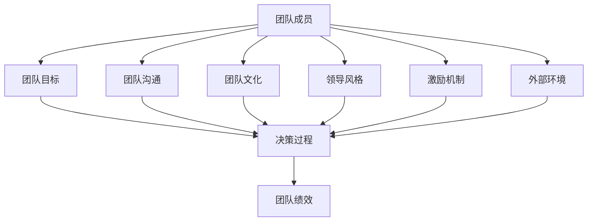

                 

### 《团队动力：激发内在驱动力的方法》

关键词：团队动力、内在驱动力、领导力、团队文化、激励机制、组织变革

摘要：
在当今快速变化和竞争激烈的商业环境中，团队动力成为组织成功的关键因素。本文旨在探讨团队动力的基本概念、内在驱动力的心理学原理，并提出一系列策略来激发团队成员的内在驱动力。我们将详细分析团队动力的构成和影响因素，引入领导力与团队动力的关系，探讨团队文化的构建和激励机制的应用。通过案例分析和实践总结，我们将提供具体的团队动力管理方法和未来发展的展望。

### 《团队动力：激发内在驱动力的方法》目录大纲

---

# 《团队动力：激发内在驱动力的方法》

## 第1章 团队动力的基本概念

### 1.1 团队动力的定义与重要性

### 1.2 团队动力的类型

### 1.3 团队动力的构成因素

### 1.4 团队动力的作用机制

## 第2章 内在驱动力的心理学原理

### 2.1 心理需求理论

#### 2.1.1 马斯洛的需求层次理论

#### 2.1.2 自我决定理论

### 2.2 动机心理学

#### 2.2.1 动机的基本概念

#### 2.2.2 内在动机与外在动机

## 第3章 团队动力模型的构建

### 3.1 团队动力模型的基本结构

### 3.2 团队动力模型的验证与应用

## 第4章 激发团队内在驱动力策略

### 4.1 领导力与团队动力

#### 4.1.1 领导风格与团队动力

#### 4.1.2 领导者的角色与职责

### 4.2 团队文化建设

#### 4.2.1 团队文化的概念与类型

#### 4.2.2 培养积极团队文化的策略

### 4.3 激励机制与团队动力

#### 4.3.1 激励理论在团队管理中的应用

#### 4.3.2 设定激励机制的具体方法

## 第5章 团队动力评估与反馈

### 5.1 团队动力评估的方法

### 5.2 团队动力反馈机制

## 第6章 团队动力在实践中的应用案例

### 6.1 案例一：谷歌团队的内部激励机制

### 6.2 案例二：苹果公司的团队管理策略

## 第7章 团队动力与组织变革

### 7.1 团队动力在组织变革中的作用

### 7.2 团队动力与组织发展

## 第8章 团队动力研究的新趋势

### 8.1 新型团队动力模型的研究

### 8.2 团队动力与新兴技术的结合

## 附录

### 附录A：团队动力模型与心理学理论关系图

### 附录B：团队动力相关研究文献推荐

### 附录C：团队动力管理工具推荐

---

### 第1章 团队动力的基本概念

### 1.1 团队动力的定义与重要性

团队动力（Team Dynamics）是指团队内部成员之间的相互作用、互动关系和相互影响，以及这些关系和影响如何影响团队的整体表现和成员的个体行为。它涵盖了团队成员之间的沟通、协作、冲突解决、领导风格、决策过程等多个方面。团队动力是团队运作的核心，直接关系到团队效率、创新能力和团队文化的形成。

团队动力的定义可以从以下几个方面进行理解：

1. **沟通与合作**：团队动力强调团队成员之间的有效沟通和协作。良好的沟通能够确保信息准确传达，协作则能将团队成员的力量整合，共同完成团队目标。

2. **领导与追随**：团队动力涉及到领导者的行为和影响力，以及团队成员对领导者的追随和响应。有效的领导能够激发团队成员的积极性和创造力。

3. **冲突与解决问题**：在团队运作过程中，冲突是不可避免的。团队动力关注如何通过合理的机制和策略解决冲突，确保团队目标的实现。

4. **团队文化**：团队动力与团队文化密切相关。团队文化是团队成员共同遵循的行为规范和价值观念，它对团队动力有着深远的影响。

团队动力的重要性体现在以下几个方面：

- **提升团队效率**：良好的团队动力能够提高团队成员的工作效率，减少沟通障碍和误解，从而更快地实现团队目标。

- **增强团队创新能力**：通过激发团队成员的内在驱动力，团队动力有助于促进创新思维和合作，从而提高团队的创新能力。

- **构建积极的团队文化**：团队动力有助于建立团结、互信、尊重和支持的团队文化，这是团队长期稳定发展的基石。

- **实现组织战略目标**：团队动力是组织战略实现的关键因素，通过有效的团队动力管理，组织能够更好地实现其战略目标和业务增长。

### 1.2 团队动力的类型

团队动力的类型可以根据不同的维度进行分类，以下是一些常见的分类方式：

1. **按团队目标分类**：

   - **任务型团队**：以完成特定任务为目标，如项目团队。
   - **问题解决型团队**：专注于识别和解决特定问题。
   - **策略规划型团队**：负责制定组织的长期战略和规划。

2. **按团队结构分类**：

   - **功能型团队**：由具有不同专业技能的成员组成，共同完成团队任务。
   - **跨职能团队**：包含来自不同部门或领域的成员，以实现跨部门的合作和协调。

3. **按团队成熟度分类**：

   - **新生团队**：成员之间尚不熟悉，需要时间来建立信任和协作关系。
   - **成熟团队**：成员之间已经建立了深厚的信任和协作基础，能够高效地完成团队任务。

4. **按领导风格分类**：

   - **民主型团队**：团队成员参与决策过程，领导者的角色是协调者和支持者。
   - **专制型团队**：决策权集中在领导者手中，团队成员较少参与决策。

5. **按团队动力状态分类**：

   - **高活力团队**：成员积极性高，互动频繁，创新能力强。
   - **低活力团队**：成员积极性不高，互动较少，创新能力较弱。

每种类型的团队动力都有其特定的特点和挑战，管理者需要根据团队的具体情况来选择合适的团队动力类型和策略。

### 1.3 团队动力的构成因素

团队动力的构成因素是理解团队动力运作机制的关键。以下是几个主要的构成因素：

1. **团队成员**：团队成员是团队动力的核心，他们的个性、能力、经验和动机都会影响团队动力。团队成员之间的相互关系和互动是团队动力的重要基础。

2. **团队领导**：团队领导在团队动力中扮演关键角色，他们的领导风格、决策能力和影响力直接影响团队动力的形成和发展。

3. **团队目标**：团队目标是团队动力的指引，清晰明确的团队目标能够激发团队成员的积极性和协作精神。

4. **团队沟通**：团队沟通是团队动力的重要保障，良好的沟通能够确保信息准确传达，减少误解和冲突。

5. **团队文化**：团队文化是团队动力的软实力，它塑造了团队的行为规范和价值观念，对团队动力有着深远的影响。

6. **激励机制**：激励机制是团队动力的催化剂，合理的激励机制能够激发团队成员的内在驱动力，提高工作积极性和创造力。

7. **外部环境**：外部环境是团队动力的重要影响因素，包括市场竞争、组织文化、政策法规等，这些因素都会对团队动力产生不同程度的影响。

这些构成因素相互作用，共同决定了团队动力的强度和效果。管理者需要全面了解这些因素，并采取相应的策略来优化团队动力。

### 1.4 团队动力的作用机制

团队动力的作用机制是指团队动力如何影响团队的行为和结果。以下是几个关键的作用机制：

1. **激发个体潜力**：良好的团队动力能够激发团队成员的内在驱动力，使他们愿意付出更多努力，发挥更大的潜力。

2. **促进协作与创新**：团队动力有助于团队成员之间的协作和互动，促进创新思维和合作，提高团队的创新能力。

3. **增强团队凝聚力**：通过共同的目标和任务，团队动力能够增强团队成员之间的凝聚力和归属感。

4. **提升决策质量**：团队动力有助于团队成员参与决策过程，从而提高决策的质量和可执行性。

5. **改善团队氛围**：团队动力能够改善团队的工作氛围，减少冲突和误解，提高团队成员的工作满意度和幸福感。

6. **实现组织目标**：团队动力是组织目标实现的关键，通过有效的团队动力管理，组织能够更好地实现其战略目标和业务增长。

了解团队动力的作用机制，有助于管理者更好地设计和实施团队动力策略，提高团队的整体绩效。

### 总结

团队动力是团队运作的核心，它影响着团队效率、创新能力和团队文化。通过理解团队动力的基本概念、类型、构成因素和作用机制，我们可以更好地设计和实施团队动力策略，激发团队成员的内在驱动力，实现团队和组织的目标。在接下来的章节中，我们将深入探讨内在驱动力的心理学原理，构建团队动力模型，并提出一系列策略来激发团队内在驱动力。

## 第2章 内在驱动力的心理学原理

内在驱动力是指个体在没有外部压力或奖励的情况下，出于内在的兴趣、动机或价值观而采取行动的驱动力。内在驱动力与外在驱动力相对，外在驱动力是指个体受到外部奖励、惩罚或其他外部刺激而产生的驱动力。在团队动力的研究中，理解内在驱动力的心理学原理对于激发团队成员的积极性和创造力至关重要。

### 2.1 心理需求理论

心理需求理论是理解内在驱动力的重要理论基础，其中最具代表性的理论是马斯洛的需求层次理论和自我决定理论。

#### 2.1.1 马斯洛的需求层次理论

马斯洛的需求层次理论将人类需求从低到高分为五个层次：生理需求、安全需求、社交需求、尊重需求和自我实现需求。

1. **生理需求**：这是人类最基本的需求，包括食物、水、空气和睡眠等。
2. **安全需求**：人们需要感到身体和心理上的安全，包括工作保障、健康保险和稳定的居住环境。
3. **社交需求**：人们需要与他人建立联系和关系，包括家庭、朋友和社交圈子。
4. **尊重需求**：人们需要得到他人的尊重和认可，包括自尊和受到尊重的待遇。
5. **自我实现需求**：这是人类最高层次的需求，人们需要实现自己的潜能和追求个人成长。

在团队动力中，理解团队成员的不同需求层次有助于领导者提供满足这些需求的工作环境和激励机制。

#### 2.1.2 自我决定理论

自我决定理论由心理学家德西和瑞安提出，强调了自主性、能力和关联性在内在驱动力中的作用。

1. **自主性**：自主性是指个体在行动和决策中感受到的独立和自由。高自主性能够激发个体的内在驱动力，使他们更愿意投入和享受工作。
2. **能力**：能力是指个体在完成任务时所感受到的自信和效能感。当个体能够成功地完成任务，他们会感受到成就感，这进一步增强了他们的内在驱动力。
3. **关联性**：关联性是指个体在行动过程中与他人建立的联系和互动。当个体感到自己是团队不可或缺的一部分，他们会感受到归属感和责任感，从而增强内在驱动力。

在团队动力管理中，领导者应当关注团队成员的自主性、能力和关联性，通过提供灵活的工作环境和机会，增强团队成员的自我效能感，以及鼓励团队成员之间的互动和合作，来激发内在驱动力。

### 2.2 动机心理学

动机心理学是研究个体行为的内在驱动力和外部诱因的学科。动机心理学提供了关于内在动机和外在动机的不同观点和理论。

#### 2.2.1 动机的基本概念

动机是指推动个体采取行动的内在或外在原因。动机可以影响个体的注意、记忆、认知和行为。

1. **内在动机**：内在动机是指个体因为自身兴趣、价值观或内在满足感而采取行动的驱动力。例如，个体喜欢阅读书籍或进行运动，因为这些活动能够带来快乐和满足感。
2. **外在动机**：外在动机是指个体因为外部奖励、惩罚或其他外部诱因而采取行动的驱动力。例如，个体为了获得奖金或避免惩罚而工作。

#### 2.2.2 内在动机与外在动机的比较

内在动机和外在动机在许多方面存在差异：

1. **持久性**：内在动机通常比外在动机更持久。当个体对某项活动有内在兴趣时，他们会持续参与，即使没有外部奖励或惩罚。
2. **自主性**：内在动机通常与高自主性相关，个体能够自由选择和决定是否参与活动。
3. **满意度**：内在动机的活动通常能带来更高的满意度和幸福感，因为个体是出于自身的兴趣和动机而参与。
4. **创造力**：内在动机往往能够激发个体的创造力和创新思维，因为他们能够更自由地探索和尝试新事物。

在团队动力管理中，领导者应当认识到内在动机的重要性，并尽量减少对团队成员的外在动机依赖，通过提供有意义的工作任务、鼓励自我发展和支持个性化需求，来激发团队成员的内在驱动力。

### 总结

内在驱动力是团队动力管理的关键，它直接影响团队成员的积极性、创造力和团队凝聚力。通过理解心理需求理论和动机心理学的基本概念，我们可以更深入地了解如何激发团队成员的内在驱动力。在下一章节中，我们将构建团队动力模型，进一步探讨如何通过理论模型来理解和激发团队动力。

## 第3章 团队动力模型的构建

团队动力模型是理解和分析团队行为和绩效的理论框架。它通过整合心理学、组织行为学和管理学等多个领域的知识，帮助我们深入理解团队动力是如何影响团队的表现和成员的个体行为。在这一章节中，我们将详细阐述团队动力模型的基本结构，并探讨其验证与应用。

### 3.1 团队动力模型的基本结构

团队动力模型通常包括以下几个方面：

1. **团队成员**：团队成员是团队动力模型的核心。团队成员的个性、技能、经验和动机都会影响团队动力的形成。团队成员之间的相互作用和互动是团队动力的重要基础。

2. **团队目标**：团队目标是团队动力模型的指引。清晰明确的团队目标能够激发团队成员的积极性和协作精神，使团队成员能够朝着共同的方向努力。

3. **团队沟通**：团队沟通是团队动力的重要保障。有效的沟通能够确保信息准确传达，减少误解和冲突，促进团队成员之间的协作。

4. **团队文化**：团队文化是团队动力模型的重要组成部分。团队文化塑造了团队的行为规范和价值观念，对团队动力有着深远的影响。

5. **领导风格**：领导风格是团队动力模型中的一个关键因素。不同的领导风格会对团队成员的行为和团队动力产生不同的影响。

6. **激励机制**：激励机制是团队动力模型的催化剂。合理的激励机制能够激发团队成员的内在驱动力，提高工作积极性和创造力。

7. **外部环境**：外部环境是团队动力模型的一个重要变量。外部环境的变化，如市场竞争、政策法规等，都会对团队动力产生影响。

以上各因素相互作用，共同决定了团队动力的强度和效果。团队动力模型的基本结构可以用以下 Mermaid 流程图表示：

### 3.2 团队动力模型的验证与应用

团队动力模型的有效性需要通过实证研究和实践应用来验证。以下是一些常用的验证方法：

1. **问卷调查**：通过设计问卷，收集团队成员对团队动力各个构成因素的评价和反馈，可以评估团队动力的现状和问题。

2. **访谈**：与团队成员进行一对一或小组访谈，深入了解他们对团队动力的感受和看法，有助于发现问卷调查中未能揭示的问题。

3. **行为观察**：通过直接观察团队成员的行为和互动，评估团队动力对团队成员行为和团队绩效的影响。

4. **案例分析**：通过对成功团队的动力实践案例进行分析，总结团队动力的成功因素和关键策略，为其他团队提供借鉴。

在应用团队动力模型时，管理者需要根据团队的具体情况，灵活调整模型中的各个因素，以达到最佳的团队动力效果。以下是一些应用团队动力模型的策略：

1. **明确团队目标**：确保团队目标明确、具体，并与团队成员的个人目标相一致，从而激发团队成员的内在驱动力。

2. **改善团队沟通**：建立有效的沟通机制，确保信息在团队成员之间准确、及时地传递，减少误解和冲突。

3. **塑造积极团队文化**：通过树立团队价值观，培养团队成员之间的信任和尊重，建立积极向上的团队文化。

4. **调整领导风格**：根据团队特点和团队成员的需求，选择合适的领导风格，激发团队成员的积极性和创造力。

5. **设计激励机制**：根据团队成员的不同需求和动机，设计有针对性的激励机制，提高团队成员的工作积极性和满意度。

6. **关注外部环境**：了解和应对外部环境的变化，确保团队动力能够适应外部环境的要求。

通过以上策略，管理者可以有效地构建和优化团队动力模型，提高团队的整体绩效和成员的满意度。

### 总结

团队动力模型是理解和激发团队动力的有力工具。通过构建团队动力模型，我们可以更深入地了解团队动力的构成因素和作用机制，从而采取有效的策略来激发团队成员的内在驱动力，提高团队的整体绩效。在下一章节中，我们将探讨激发团队内在驱动力的策略，帮助管理者在实践中更好地应用团队动力模型。

## 第4章 激发团队内在驱动力的策略

要激发团队的内在驱动力，管理者需要采取一系列科学有效的策略。这些策略不仅包括领导力的运用，还涉及团队文化的建设以及激励机制的设定。以下将详细介绍这些策略，并提供实用的方法和案例。

### 4.1 领导力与团队动力

领导力是激发团队内在动力的重要驱动力，不同领导风格对团队动力有着显著影响。

#### 4.1.1 领导风格与团队动力

1. **专制型领导风格**：
   - 特点：领导者拥有决策权，团队成员参与度较低，工作指令明确。
   - 影响：短期内可能提高工作效率，但长期可能导致团队成员缺乏自主性和创造力。

2. **民主型领导风格**：
   - 特点：领导者鼓励团队成员参与决策，团队成员有较高的自主性和责任感。
   - 影响：有助于提高团队成员的积极性和创造力，增强团队凝聚力。

#### 4.1.2 领导者的角色与职责

1. **激发团队成员潜能**：
   - 领导者应识别和培养团队成员的潜力，提供成长和发展的机会。
   - 例如，通过定期的一对一辅导和职业发展计划，帮助团队成员不断提升。

2. **建立团队信任与支持**：
   - 领导者应建立积极的团队氛围，鼓励成员之间的相互信任和支持。
   - 通过团队建设活动和共享成功的经验，增强团队成员之间的默契和协作。

### 4.2 团队文化建设

团队文化是激发团队内在驱动力的重要基础，积极向上的团队文化能够激发团队成员的热情和创造力。

#### 4.2.1 团队文化的概念与类型

1. **团队文化的定义**：
   - 团队文化是指团队成员共同遵循的价值观、行为准则和工作方式。

2. **团队文化的类型**：
   - **目标导向型**：团队成员专注于实现共同的目标，追求卓越。
   - **创新导向型**：鼓励团队成员提出新的想法和解决方案，注重创新。
   - **学习导向型**：注重团队成员的持续学习和个人成长，提倡知识分享。

#### 4.2.2 培养积极团队文化的策略

1. **制定团队价值观**：
   - 明确团队的核心价值观，如诚实、创新、团队协作等，并将这些价值观融入日常工作。

2. **增强团队沟通与协作**：
   - 通过定期的团队会议、工作坊和小组讨论，促进团队成员之间的沟通与协作。

3. **表彰优秀团队文化实践**：
   - 对表现出色的团队成员和团队给予表彰和奖励，树立榜样。

### 4.3 激励机制与团队动力

激励机制是激发团队内在动力的重要手段，合理的激励机制能够提高团队成员的工作积极性和创造力。

#### 4.3.1 激励理论在团队管理中的应用

1. **马斯洛需求层次理论**：
   - 根据团队成员的不同需求层次，提供相应的激励措施，如提高薪酬、提供培训机会、给予工作上的认可等。

2. **自我决定理论**：
   - 鼓励团队成员的自主性，提供具有挑战性的任务，赋予团队成员更多的责任和权力。

#### 4.3.2 设定激励机制的具体方法

1. **目标设定理论**：
   - 与团队成员共同设定清晰、具体、可量化的目标，并提供必要的资源和支持。

2. **薪酬激励**：
   - 提供有竞争力的薪酬待遇，包括基本工资、绩效奖金、股票期权等。

3. **非物质激励**：
   - 提供非财务激励，如荣誉称号、培训发展机会、工作环境改善等。

### 4.4 案例分析

#### 4.4.1 谷歌团队的内部激励机制

谷歌以其独特的团队文化和内部激励机制著称，以下是谷歌的一些成功实践：

1. **团队文化**：
   - 谷歌倡导开放、创新和学习的团队文化，鼓励员工自由表达观点和尝试新事物。
   - 通过定期的团队建设活动和创新大赛，增强团队成员之间的协作和创造力。

2. **激励机制**：
   - 谷歌提供具有竞争力的薪酬和股票期权，同时注重非物质激励，如提供灵活的工作时间、高质量的福利和工作环境。
   - 谷歌还实行“20%时间”政策，允许员工将20%的工作时间用于个人感兴趣的项目，这种自主性激发了员工的内在驱动力。

#### 4.4.2 苹果公司的团队管理策略

苹果公司在团队管理方面也有其独到之处：

1. **领导风格**：
   - 乔布斯以其强势的领导风格著称，他鼓励团队成员追求卓越，并对产品精益求精。
   - 同时，乔布斯也注重团队成员的自主性和创新，给予他们充分的自由来探索新的想法。

2. **激励机制**：
   - 苹果公司通过提供具有竞争力的薪酬、股票期权和奖金，吸引并留住优秀的员工。
   - 同时，苹果公司注重员工的工作环境和培训发展，确保员工能够持续成长。

### 总结

激发团队的内在驱动力需要多方面的策略，包括领导力、团队文化建设、激励机制等。通过理解不同领导风格的特点和影响，塑造积极向上的团队文化，并设计合理的激励机制，管理者可以有效地激发团队成员的内在驱动力，提高团队的整体绩效和成员的满意度。在下一章节中，我们将探讨如何评估和反馈团队动力，帮助团队持续改进。

## 第5章 团队动力评估与反馈

### 5.1 团队动力评估的方法

评估团队动力是确保团队运作高效、健康的重要环节。以下介绍几种常用的团队动力评估方法：

#### 5.1.1 问卷调查

问卷调查是一种简便且有效的评估方法，可以通过设计问卷收集团队成员对团队动力的感受和评价。问卷可以包括以下几个方面：

- **团队目标明确性**：团队成员是否清楚团队的目标和期望。
- **沟通质量**：团队成员之间的沟通是否顺畅，是否存在误解或冲突。
- **领导风格**：团队成员对领导风格的满意度，以及领导是否具备激励团队成员的能力。
- **团队文化**：团队成员对团队文化的认可度，以及团队文化是否有利于团队动力的发展。

#### 5.1.2 访谈

访谈是一种深入了解团队成员感受和意见的方法。通过与团队成员进行一对一或小组访谈，可以获取更详细、更深入的信息。访谈可以包括以下几个方面：

- **团队成员的个人需求**：了解团队成员在生理、安全、社交、尊重和自我实现等方面的需求。
- **团队互动**：探讨团队成员之间的互动方式，是否存在冲突，以及如何解决冲突。
- **团队目标和绩效**：了解团队成员对团队目标的认同度，以及团队绩效的评估。

#### 5.1.3 行为观察

行为观察是通过直接观察团队成员的行为和工作表现，评估团队动力的方法。这种方法可以提供直接的、客观的数据，包括：

- **工作态度**：团队成员的工作态度，如积极性、责任心和专注度。
- **协作表现**：团队成员在团队工作中的协作情况，如任务分配、沟通协作和冲突解决。
- **创新与学习**：团队成员的创新能力和学习意愿，如提出新想法、改进方法和参与培训。

### 5.2 团队动力反馈机制

有效的团队动力反馈机制可以帮助团队识别问题、改进行为，并持续提升团队动力。以下是一些关键的反馈机制：

#### 5.2.1 反馈的途径

1. **定期反馈会议**：定期组织团队反馈会议，让团队成员分享经验和意见，讨论团队动力的现状和改进方向。

2. **一对一反馈**：领导者与团队成员进行一对一的反馈，深入了解团队成员的需求和意见，提供个性化的建议和指导。

3. **匿名反馈**：提供匿名反馈渠道，让团队成员可以自由表达意见和建议，避免反馈过程中可能出现的不信任或抵触情绪。

#### 5.2.2 反馈的技巧

1. **正面反馈**：在反馈过程中，注重正面反馈，鼓励团队成员的优点和进步，增强他们的自信心和积极性。

2. **具体反馈**：提供具体的反馈，而不是泛泛而谈。例如，指出具体的行为或表现，并提供改进的建议。

3. **建设性反馈**：在提供反馈时，要注重建设性，帮助团队成员找到改进的方法和路径，而不是仅仅指出问题。

4. **开放沟通**：鼓励团队成员开放沟通，听取他们的意见和建议，确保反馈是双向的，而不是单方面的指令。

### 案例分析

#### 5.2.3 案例一：微软的团队动力评估与反馈

微软公司通过一系列机制来评估和反馈团队动力：

1. **定期的团队绩效评估**：微软定期进行团队绩效评估，通过问卷调查和访谈，收集团队成员对团队动力的评价。

2. **匿名反馈渠道**：微软提供匿名反馈渠道，让员工可以自由表达对团队动力的看法和建议。

3. **领导者的定期反馈**：领导者定期与团队成员进行一对一反馈，了解他们的需求和意见，提供个性化的指导和支持。

通过这些机制，微软能够及时发现团队动力方面的问题，并采取相应的改进措施，持续提升团队绩效。

#### 5.2.4 案例二：谷歌的团队动力反馈机制

谷歌公司以其开放、透明的团队文化而闻名，以下是谷歌在团队动力反馈方面的实践：

1. **OKR（目标与关键结果）体系**：谷歌采用OKR体系，定期与团队成员讨论目标完成情况和团队动力现状，确保团队成员对团队目标的清晰理解。

2. **透明沟通**：谷歌鼓励团队成员之间的透明沟通，通过邮件、团队会议等形式，共享信息和经验，促进团队协作。

3. **员工反馈系统**：谷歌提供员工反馈系统，员工可以匿名提交反馈，管理层会定期审查和回复，确保反馈得到关注和解决。

通过这些机制，谷歌能够有效评估和反馈团队动力，激发团队成员的内在驱动力，提高团队的整体绩效。

### 总结

有效的团队动力评估与反馈机制是确保团队高效运作和持续发展的重要手段。通过多种评估方法和反馈机制，团队可以及时发现并解决问题，持续提升团队动力。在下一章节中，我们将通过实际案例深入探讨团队动力在实践中的应用。

## 第6章 团队动力在实践中的应用案例

### 6.1 案例一：谷歌团队的内部激励机制

谷歌公司以其创新的企业文化和内部激励机制而著称，成为全球企业学习的榜样。以下是谷歌在团队动力管理方面的具体实践：

#### 6.1.1 谷歌的团队文化

谷歌的团队文化强调开放、创新和自由探索。谷歌鼓励员工提出新的想法，并给予他们时间和资源去实现这些想法。谷歌的“20%时间”政策就是一个典型例子，员工可以在工作日的20%的时间内自由探索感兴趣的项目，这不仅激发了员工的创新潜力，也带来了诸如Gmail、Google News等创新产品的诞生。

#### 6.1.2 谷歌团队的激励措施

1. **股权激励**：谷歌通过股票期权计划，让员工分享公司成功带来的收益。这种激励方式不仅为员工提供了长期的财务回报，也增强了他们对公司的归属感和责任感。

2. **灵活的工作环境**：谷歌提供灵活的工作时间、远程工作选择和员工福利，如免费的餐饮、健身房和健康护理服务等。这些措施提高了员工的工作满意度和生活质量。

3. **持续的培训与发展**：谷歌注重员工的持续学习和职业发展，提供各种培训课程和研讨会，帮助员工提升技能和知识。

4. **公开的沟通机制**：谷歌采用开放的沟通文化，鼓励员工在内部论坛、邮件和团队会议上表达意见和建议。这种透明的沟通环境有助于建立信任和归属感。

### 6.2 案例二：苹果公司的团队管理策略

苹果公司以其卓越的产品设计和严谨的工作风格而闻名，在团队管理方面也有许多成功的实践：

#### 6.2.1 苹果的领导风格

苹果公司的领导风格以乔布斯为代表，他以其强烈的目标导向和创新精神影响着整个公司。乔布斯强调对产品的极致追求，通过严格的管控和指导，确保团队成员专注于实现共同的目标。他的领导风格虽然强势，但也激发了团队成员的创造力和执行力。

#### 6.2.2 苹果团队的内部激励机制

1. **高额的薪酬和奖金**：苹果提供具有竞争力的薪酬和奖金，确保员工的基本生活需求得到满足。此外，苹果还设有高额的项目奖金，以奖励在特定项目中表现出色的团队成员。

2. **股权激励计划**：苹果公司通过股票期权计划，让员工成为公司的股东，分享公司的成长和成功。

3. **严格的绩效评估体系**：苹果采用严格的绩效评估体系，对员工的工作表现进行全面评估，并提供针对性的反馈和发展建议。

4. **团队建设的活动**：苹果定期组织团队建设活动，如团队旅行、项目分享会议等，增强团队成员之间的沟通和协作。

### 总结

通过这些案例，我们可以看到，谷歌和苹果公司通过不同的团队管理策略，成功激发了团队的内在驱动力。谷歌注重开放和自由的文化，鼓励创新和自由探索；而苹果则通过严格的领导风格和高效的激励机制，确保团队成员专注于实现共同的目标。这些实践不仅提升了团队的整体绩效，也为其他组织提供了宝贵的经验。

在下一章节中，我们将探讨团队动力在组织变革中的作用，并分析团队动力在数字化转型中的应用趋势。

## 第7章 团队动力与组织变革

### 7.1 团队动力在组织变革中的作用

组织变革是指组织为了适应外部环境的变化或实现内部目标而进行的一系列结构、文化、流程等方面的调整。团队动力在组织变革中扮演着至关重要的角色，它不仅影响变革的接受度和执行效率，还关系到变革的最终成功与否。

#### 7.1.1 团队动力与组织适应

组织适应是指组织在面对外部环境变化时，能够迅速调整其结构、策略和行为，以保持竞争优势。团队动力在这个过程中起着关键作用：

1. **增强团队凝聚力**：在组织变革过程中，团队凝聚力能够增强团队成员之间的信任和协作，使团队在面对变革时更加团结一致。

2. **提升创新能力**：团队动力有助于激发团队成员的内在驱动力，促进创新思维和合作，使团队能够迅速适应新环境。

3. **改善沟通与协作**：良好的团队沟通和协作能够确保信息在组织内部的准确传递和有效利用，减少误解和冲突，提高变革的执行效率。

4. **增强变革适应性**：团队动力有助于团队成员在面对变革时保持积极的心态和适应能力，从而更好地应对变革带来的挑战。

#### 7.1.2 团队动力与组织创新

组织创新是指组织在产品、服务、流程、商业模式等方面进行创新，以提升其竞争力和市场地位。团队动力在组织创新中同样发挥着重要作用：

1. **激发内在驱动力**：团队动力能够激发团队成员的内在兴趣和动机，使他们更愿意参与创新活动，提出新的想法和解决方案。

2. **促进跨部门合作**：团队动力有助于不同部门之间的沟通和协作，促进知识的共享和资源的整合，从而推动组织整体创新能力的提升。

3. **鼓励冒险和试错**：团队动力能够营造一个安全、包容的实验环境，使团队成员敢于冒险和尝试新事物，从失败中学习并不断改进。

4. **强化创新文化**：团队动力有助于在组织中建立创新文化，使创新成为团队和组织的核心价值观，从而持续推动组织创新。

### 7.2 团队动力与组织发展

团队动力不仅影响组织变革和创新能力，还直接关系到组织的长期发展。以下是一些具体策略：

1. **构建支持性团队文化**：支持性团队文化能够增强团队成员之间的信任和合作，使团队在面对挑战和变化时更加稳定和灵活。

2. **提供持续发展机会**：为团队成员提供职业发展机会和培训，帮助他们提升技能和知识，从而增强团队的整体实力。

3. **鼓励自我领导**：通过授权和赋能，鼓励团队成员自我管理和自我驱动，提高团队的工作效率和创新能力。

4. **建立有效的激励机制**：设计合理的激励机制，如股权激励、绩效奖金等，激发团队成员的内在驱动力，提高他们的工作积极性和满意度。

### 总结

团队动力在组织变革和组织发展中起着至关重要的作用。通过激发团队的内在驱动力，提升团队凝聚力和创新能力，组织能够更好地适应外部环境的变化，实现长期发展。在下一章节中，我们将探讨团队动力研究的新趋势，包括新型团队动力模型的探索和团队动力与新兴技术的结合。

## 第8章 团队动力研究的新趋势

### 8.1 新型团队动力模型的研究

随着全球化、数字化和信息化的快速发展，团队动力研究也在不断演进。新型团队动力模型应运而生，以满足现代组织对灵活、高效和创新的团队需求。以下是一些新型团队动力模型的研究方向：

#### 8.1.1 多维度团队动力模型

传统的团队动力模型往往关注单一因素，如沟通、领导风格或激励机制。然而，现代团队更加复杂，需要从多个维度综合评估团队动力。多维度团队动力模型综合考虑了团队成员、团队目标、团队沟通、团队文化、领导风格和外部环境等多个因素，提供更全面、更细致的团队动力分析。

#### 8.1.2 跨文化团队动力模型

全球化使得跨文化团队越来越普遍。跨文化团队动力模型旨在理解不同文化背景下的团队动力差异，以及如何通过文化适应和融合来提升团队绩效。这种模型考虑了文化价值观、沟通风格、决策过程和冲突解决等方面的文化因素，为跨文化团队提供有效的管理策略。

#### 8.1.3 虚拟团队动力模型

随着远程工作和虚拟团队的增加，虚拟团队动力模型成为研究热点。虚拟团队动力模型关注如何通过技术手段和沟通策略来保持虚拟团队的凝聚力、协作性和创新能力。这种模型探讨了虚拟团队的特性、虚拟领导者的角色以及技术工具在团队动力管理中的应用。

### 8.2 团队动力与新兴技术的结合

新兴技术的快速发展为团队动力管理带来了新的机遇和挑战。以下是一些团队动力与新兴技术的结合趋势：

#### 8.2.1 人工智能在团队动力管理中的应用

人工智能（AI）在团队动力管理中有着广泛的应用前景。通过自然语言处理（NLP）技术，AI可以帮助分析团队成员的沟通内容，识别潜在的心理问题和行为模式。同时，AI还可以通过数据分析，提供个性化的激励建议和改进方案，提高团队动力管理的效率和效果。

#### 8.2.2 区块链在团队动力管理中的应用

区块链技术具有去中心化、透明和不可篡改的特点，非常适合用于团队动力管理。通过区块链，可以记录和追踪团队成员的贡献和绩效，确保激励机制的公正性和透明度。此外，区块链还可以用于管理共享资源，如知识库和工具库，促进团队内部的知识共享和协作。

#### 8.2.3 虚拟现实（VR）在团队动力管理中的应用

虚拟现实技术为团队提供了全新的协作和沟通环境。通过VR，团队成员可以实时参与虚拟会议、工作坊和培训，提高互动性和参与感。VR还可以用于模拟复杂的团队任务和情境，帮助团队成员提前准备和应对挑战，提高团队的应对能力和应变速度。

### 总结

新型团队动力模型和新兴技术的结合，为团队动力管理提供了新的思路和方法。多维度、跨文化和虚拟团队动力模型有助于更全面地理解和激发团队动力，而人工智能、区块链和虚拟现实等新兴技术则为团队动力管理带来了更多的可能性。随着这些新趋势的发展，团队动力研究将不断深化，为组织的成功提供更强大的支持。

## 附录A：团队动力模型与心理学理论关系图

以下是团队动力模型与心理学理论的关系图，使用Mermaid语法表示：

```mermaid
graph TD
    A[团队动力模型] --> B[团队成员]
    A --> C[团队目标]
    A --> D[团队沟通]
    A --> E[团队文化]
    A --> F[领导风格]
    A --> G[激励机制]
    A --> H[外部环境]
    B --> I[心理需求理论]
    B --> J[自我决定理论]
    B --> K[动机心理学]
    C --> L[目标设定理论]
    D --> M[沟通理论]
    E --> N[文化理论]
    F --> O[领导理论]
    G --> P[激励理论]
    H --> Q[环境理论]
    I --> R[马斯洛需求层次理论]
    I --> S[自我决定理论]
    J --> T[自主性]
    J --> U[能力]
    J --> V[关联性]
    K --> W[马斯洛需求层次理论]
    K --> X[员工激励模型]
    L --> Y[目标设定理论]
    M --> Z[沟通模型]
    N --> AA[文化维度理论]
    O --> BB[领导风格模型]
    P --> CC[激励模型]
    Q --> DD[环境因素模型]
    R --> EE[生理需求]
    R --> FF[安全需求]
    R --> GG[社交需求]
    R --> HH[尊重需求]
    R --> II[自我实现需求]
    S --> JJ[自主性]
    S --> KK[能力]
    S --> LL[关联性]
    T --> MM[自主性]
    U --> NN[能力]
    V --> OO[关联性]
    W --> PP[生理需求]
    W --> QQ[安全需求]
    W --> RR[社交需求]
    W --> SS[尊重需求]
    W --> TT[自我实现需求]
    X --> UU[目标设定]
    X --> VV[奖励机制]
    Y --> WW[目标设定]
    Y --> XX[反馈机制]
    Z --> YY[沟通障碍]
    Z --> ZZ[沟通渠道]
    AA --> AAA[团队价值观]
    AA --> BBB[团队规范]
    BB --> CCC[权威型领导]
    BB --> DDD[民主型领导]
    BB --> EEE[参与型领导]
    CC --> CCC[激励性领导]
    CC --> DDD[支持性领导]
    CC --> EEE[变革型领导]
    DD --> EEE[环境适应性]
    EE --> FFF[内在动机]
    EE --> GGG[外在动机]
    FF --> HHH[生理需求满足]
    FF --> III[安全需求满足]
    FF --> JJJ[社交需求满足]
    FF --> KKK[尊重需求满足]
    FF --> LLL[自我实现需求满足]
    GG --> MMM[信任]
    GG --> NNN[归属感]
    GG --> OOO[合作精神]
    HH --> PPP[自尊]
    HH --> QQ[社会地位]
    HH --> RR[成就感]
    II --> SSS[个人成长]
    II --> TTT[实现自我潜能]
    UU --> UUU[责任感]
    UU --> VVV[自我效能感]
    VV --> WWW[团队凝聚力]
    WWW --> XXX[团队创新]
    XXX --> YYY[团队绩效]
```

这个关系图展示了团队动力模型与多种心理学理论的联系，包括马斯洛的需求层次理论、自我决定理论、动机心理学、目标设定理论、沟通理论、文化理论、领导理论和激励理论。通过这些理论的综合应用，可以更深入地理解和设计有效的团队动力管理策略。

## 附录B：团队动力相关研究文献推荐

1. **Hackman, J. R., & Oldham, G. R. (1976). Work Life: The Quality of Working Life at IBM. New York: Basic Books.**
   - 这本书详细探讨了工作生活的质量，为团队动力管理提供了理论和实践指导。

2. **Schein, E. H. (1990). Organizational Culture and Leadership. San Francisco: Jossey-Bass.**
   - 本书深入探讨了组织文化的概念、类型和影响，对团队文化建设具有重要参考价值。

3. **Deci, E. L., & Ryan, R. M. (2000). The 'What' and 'Why' of Goal Pursuits: Human Needs and the Self-Determination of Behavior. Psychological Inquiry, 11(4), 227-268.**
   - 这篇文章提出了自我决定理论，为理解内在驱动力提供了重要基础。

4. **Maslow, A. H. (1943). A Theory of Human Motivation. Psychological Review, 50(4), 370-396.**
   - 马斯洛的需求层次理论是心理学领域的经典理论，对团队动力管理有深远影响。

5. **Katzenbach, J. R., & Smith, D. K. (1993). The Discipline of Teams. Boston: Harvard Business Review Press.**
   - 本书详细介绍了团队协作的原则和实践，对提升团队动力有实用指导。

6. **Kouzes, J. M., & Posner, B. Z. (2002). The Truth About Leadership: The Leadership Practices Inventory Book. San Francisco: Jossey-Bass.**
   - 本书通过领导实践调查，提供了有效的领导力发展策略。

7. **Latham, G. P., & Locke, E. A. (2007). Enhancing Performance: Setting Motivational Goals. New York: Sage.**
   - 本书探讨了目标设定对绩效和动机的影响，为激励机制设计提供了理论依据。

8. **Schein, E. H. (2010). Organizational Culture and Leadership (4th Edition). San Francisco: Jossey-Bass.**
   - 这是组织文化领域的经典著作，第四版进一步更新了相关理论和实践。

这些文献涵盖了团队动力的多个方面，从理论基础到实践应用，为研究人员和从业者提供了丰富的知识和经验。

## 附录C：团队动力管理工具推荐

在团队动力管理中，使用适当的工具可以帮助团队更高效地工作、沟通和协作。以下是一些推荐的团队动力管理工具：

1. **Trello**：Trello 是一个直观的看板工具，可以帮助团队组织和跟踪项目任务。团队成员可以通过拖放卡片来管理任务，提高团队协作效率。

2. **Slack**：Slack 是一款流行的团队沟通工具，支持即时消息、渠道和视频会议功能。它可以帮助团队保持沟通畅通，确保信息的及时传递。

3. **Asana**：Asana 是一个全面的项目管理工具，提供任务分配、进度跟踪和协作功能。它有助于团队明确任务和责任，提高工作效率。

4. **Miro**：Miro 是一款在线协作白板工具，支持绘图、思维导图和讨论功能。团队成员可以在白板上共同协作，提高创意交流和合作效率。

5. **Google Workspace**：包括Google Docs、Sheets、Slides等，提供文档、表格、演示文稿的协作编辑功能，适合团队进行信息共享和文档管理。

6. **Microsoft Teams**：Microsoft Teams 结合了即时消息、视频会议、文档协作等功能，适合企业团队进行内部沟通和协作。

7. **ScrumGenius**：ScrumGenius 是一款敏捷项目管理工具，适用于Scrum和Kanban方法，可以帮助团队进行任务分配和进度跟踪。

8. **Mentimeter**：Mentimeter 是一款互动式演示和投票工具，可以帮助团队进行实时反馈和参与度评估。

9. **Tableau**：Tableau 是一款数据可视化工具，可以帮助团队将复杂的数据以直观的方式呈现，提高数据理解和决策效率。

10. **Mural**：Mural 是一款在线协作白板工具，支持多种创意协作功能，如头脑风暴、流程图和用户故事地图。

这些工具各具特色，可以根据团队的具体需求和偏好进行选择，以优化团队动力管理。

