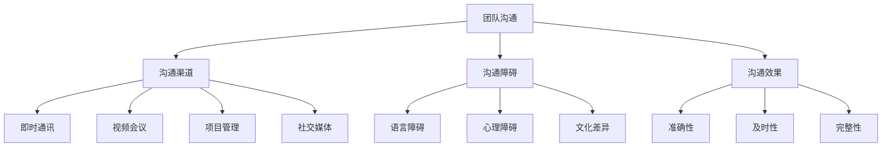

                 

### 《团队沟通革新：利用新技术优化沟通》

---

> **关键词**：团队沟通、新技术、优化、流程图、挑战与解决方案、案例分析

> **摘要**：本文探讨了如何通过新技术革新团队沟通，提高沟通效率与质量。通过分析团队沟通的基本原理、新技术的类型与应用，并结合实际案例，提出了优化团队沟通的策略与解决方案。文章旨在为技术团队和企业提供有价值的指导，助力他们在数字化转型中实现高效的团队协作。

---

### 第一部分：引言

#### 1.1 简介

##### 1.1.1 团队沟通的重要性

团队沟通是任何组织成功的关键因素之一。在现代企业中，团队沟通不仅影响着项目进度和效率，还直接关系到团队士气、创新能力和企业文化的建设。有效的沟通能够确保团队成员之间的信息传递准确无误，减少误解和冲突，提升团队协作效率。随着信息技术的发展，传统的沟通方式已无法满足快速变化的工作环境和日益复杂的业务需求。因此，探索利用新技术优化团队沟通具有重要意义。

##### 1.1.2 新技术对团队沟通的影响

新技术的快速发展，如云计算、人工智能、大数据等，为团队沟通带来了前所未有的变革。通过这些技术，企业可以实现即时通讯、远程协作、智能会议等功能，极大地提升了沟通的效率和质量。例如，视频会议系统使得团队成员无需面对面也能进行高效沟通；即时通讯工具使得团队成员能够实时交流；项目管理工具则帮助团队更好地协调工作和资源。

##### 1.1.3 书籍概述与结构

本文将围绕团队沟通革新这一主题，探讨新技术在团队沟通中的应用与优化策略。文章分为三大部分：第一部分介绍团队沟通的重要性以及新技术对团队沟通的影响；第二部分详细分析新技术在团队沟通中的应用，包括沟通工具、沟通技巧和沟通案例分析；第三部分则讨论新技术在团队沟通中的实际应用，包括面临的挑战与解决方案，以及未来发展趋势。通过本文的阅读，读者将能够全面了解并掌握利用新技术优化团队沟通的方法与技巧。

#### 1.2 核心概念与联系

##### 1.2.1 团队沟通的基本原理

团队沟通是一个复杂的过程，涉及信息的传递、理解、反馈和调整。其基本原理包括：

1. **沟通渠道**：沟通可以通过语言、文字、图表等多种渠道进行。
2. **沟通障碍**：障碍包括语言障碍、心理障碍、文化差异等。
3. **沟通效果**：有效的沟通应确保信息的准确性、及时性和完整性。

##### 1.2.2 新技术的类型与特点

新技术在团队沟通中的应用主要包括以下几种类型：

1. **即时通讯工具**：如 Slack、微信、企业微信等，提供实时消息传递和文件共享功能。
2. **视频会议系统**：如 Zoom、Microsoft Teams 等，支持远程视频会议和协作。
3. **项目管理工具**：如 Trello、JIRA 等，帮助团队进行任务分配和进度跟踪。
4. **社交媒体与论坛**：如 QQ 群、微信群、论坛等，提供方便的交流平台。

新技术的特点包括实时性、高效性、便捷性和多样性，能够满足不同场景下的沟通需求。

##### 1.2.3 团队沟通与新技术的 Mermaid 流程图

通过上述流程图，我们可以清晰地看到团队沟通涉及的主要要素和新技术在其中的应用。

#### 1.3 为什么要阅读这本书

##### 1.3.1 面临的挑战与机遇

在当今快速变化的工作环境中，团队沟通面临着诸多挑战，如信息过载、沟通障碍、团队分散等。同时，新技术的迅猛发展也为团队沟通带来了前所未有的机遇。利用这些新技术，企业可以打破时空限制，实现高效、实时、多维的团队协作。因此，掌握如何利用新技术优化团队沟通，对于企业的发展至关重要。

##### 1.3.2 预期收获与目标

通过阅读本书，读者将能够：

1. **理解团队沟通的基本原理和新技术特点**。
2. **掌握利用新技术优化团队沟通的方法和技巧**。
3. **通过案例分析，了解成功和失败的沟通策略**。
4. **面对新技术在团队沟通中遇到的挑战，提出切实可行的解决方案**。

本文旨在为读者提供一套系统、实用的团队沟通优化指南，帮助他们在实际工作中实现高效的团队协作，提升企业的竞争力。---

### 第二部分：新技术在团队沟通中的应用

#### 2.1 沟通工具

##### 2.1.1 面对面沟通工具

在远程工作和分布式团队日益普及的今天，面对面的沟通工具成为了连接团队成员的重要桥梁。以下将详细介绍几种常见的面对面沟通工具及其配置和使用方法。

###### 2.1.1.1 视频会议系统

视频会议系统是远程团队沟通的核心工具之一。它不仅能够实现实时的视频通话，还能够共享屏幕、文件和应用程序，使得团队协作更加高效。

###### 2.1.1.1.1 软件选择与配置

在选择视频会议系统时，需要考虑以下几个方面：

1. **会议容量**：根据团队规模和会议频率选择合适的会议容量。
2. **功能需求**：根据团队协作需求选择具备屏幕共享、文档共享、实时聊天等功能的系统。
3. **安全性**：确保视频会议系统的数据加密和隐私保护。

常见的视频会议系统包括：

- **Zoom**：Zoom 是一款功能强大的视频会议系统，支持最多1000人的会议，并且提供高清视频和音频质量。
- **Microsoft Teams**：Microsoft Teams 是微软推出的综合办公协作工具，集成了视频会议、文档协作和即时通讯等功能。

视频会议系统的配置通常包括以下步骤：

1. **注册账户**：在官网注册视频会议账户。
2. **下载客户端**：在官网下载并安装相应的客户端软件。
3. **配置网络**：确保网络连接稳定，建议使用有线网络。

###### 2.1.1.1.2 系统使用与优化

使用视频会议系统时，需要注意以下几点：

1. **设备检查**：确保摄像头、麦克风和扬声器工作正常。
2. **网络优化**：优化网络设置，确保带宽充足。
3. **环境准备**：选择安静的背景，避免干扰。
4. **参与管理**：主持人可以管理会议参与者，如禁言、静音等。

视频会议系统的优化策略包括：

1. **音频优化**：使用降噪麦克风，减少环境噪音。
2. **视频优化**：关闭不必要的视频源，确保视频流清晰。
3. **设备更新**：定期更新设备驱动和软件版本。

###### 2.1.1.2 远程协作工具

除了视频会议系统，远程协作工具也是团队沟通的重要环节。以下将介绍几种常见的远程协作工具。

###### 2.1.1.2.1 项目管理工具

项目管理工具可以帮助团队进行任务分配、进度跟踪和资源管理。以下是一些常见的管理工具：

- **Trello**：Trello 是一个基于看板的项目管理工具，用户可以创建卡片、列表和标签来管理任务。
- **JIRA**：JIRA 是一款功能强大的项目管理工具，提供任务跟踪、敏捷开发、报告分析等功能。

使用项目管理工具时，需要注意以下几点：

1. **任务分配**：明确任务责任人，确保任务分配合理。
2. **进度跟踪**：定期更新任务状态，确保项目按时完成。
3. **协作沟通**：利用工具的聊天和评论功能，加强团队成员之间的沟通。

###### 2.1.1.2.2 文档共享与协作工具

文档共享与协作工具可以帮助团队实时编辑和共享文件，提高工作效率。以下是一些常见的文档协作工具：

- **Google Docs**：Google Docs 是一款在线文档编辑工具，支持多人实时协作。
- **Microsoft Office 365**：Office 365 提供包括 Word、Excel、PowerPoint 在内的多种办公软件，支持在线协作。

使用文档协作工具时，需要注意以下几点：

1. **权限管理**：合理设置文件权限，确保信息安全。
2. **版本控制**：使用版本控制功能，避免文档冲突和丢失。
3. **实时协作**：利用实时编辑功能，提高团队协作效率。

##### 2.1.2 即时通讯工具

即时通讯工具是团队沟通的另一个重要组成部分，能够实现实时消息传递和文件共享。以下将介绍几种常见的即时通讯工具。

###### 2.1.2.1 基本功能与操作

即时通讯工具的基本功能包括：

- **消息传递**：发送文本、图片、视频等消息。
- **文件传输**：传输文件、图片、视频等。
- **语音通话**：进行语音通话。
- **视频通话**：进行视频通话。
- **群组聊天**：创建和管理群组聊天。

常见的即时通讯工具包括：

- **Slack**：Slack 是一款功能强大的即时通讯工具，支持群组聊天、文件共享和集成第三方服务。
- **微信**：微信是一款广泛使用的即时通讯工具，支持语音、视频通话和文件传输。

使用即时通讯工具时，需要注意以下几点：

1. **组织结构**：合理设置组织结构，便于沟通和管理。
2. **消息分类**：将消息分类管理，便于查找和归档。
3. **文件共享**：合理使用文件共享功能，确保文件安全。

###### 2.1.2.1.1 群组与个人消息

群组消息适用于团队内部的公共沟通，个人消息适用于一对一的沟通。使用即时通讯工具时，需要注意以下几点：

1. **群组管理**：定期清理群组成员，确保群组活跃度。
2. **个人消息**：保持个人消息简洁明了，避免过长消息。

###### 2.1.2.1.2 文件传输与共享

文件传输与共享是即时通讯工具的重要功能，以下是一些注意事项：

1. **文件格式**：支持多种文件格式，如文本、图片、视频、音频等。
2. **文件大小**：注意文件大小限制，避免传输过大文件。
3. **文件安全**：确保传输的文件安全，避免泄露敏感信息。

##### 2.1.3 社交媒体与论坛

社交媒体和论坛也是团队沟通的有效途径，以下将介绍几种常见的社交媒体和论坛。

###### 2.1.3.1 微信群与QQ群

微信和QQ是广泛使用的社交媒体平台，其群组功能适用于团队沟通。以下是一些使用技巧：

1. **群管理技巧**：合理设置群管理员，确保群秩序。
2. **群内沟通案例分析**：定期分析群内沟通情况，发现并解决问题。

使用微信和QQ群时，需要注意以下几点：

1. **沟通规范**：制定群内沟通规范，确保沟通有序。
2. **信息筛选**：关注重要信息，避免信息过载。

##### 2.1.4 其他沟通工具

除了上述工具，还有许多其他沟通工具可供选择，如钉钉、阿里云通信等。在选择和使用这些工具时，需要根据团队的具体需求和实际情况进行评估和选择。

总之，面对面的沟通工具、即时通讯工具、社交媒体和论坛等多种沟通工具的综合使用，能够为团队沟通提供多样化的选择，提升沟通效率和质量。---

### 第二部分：新技术在团队沟通中的应用

#### 2.2 沟通技巧

良好的沟通技巧是团队协作的重要保障，它能够帮助团队成员更好地理解彼此，减少误解和冲突，提升沟通效率。以下将详细介绍几种关键沟通技巧，包括倾听与表达、面对冲突的沟通策略等。

##### 2.2.1 有效沟通的基本原则

有效沟通不仅是一种技能，更是一种态度。以下是一些有效沟通的基本原则：

1. **清晰明确**：确保信息传递的准确性和完整性，避免模糊不清的表述。
2. **主动沟通**：主动发起和参与沟通，避免等待和被动反应。
3. **倾听**：倾听对方的意见和需求，真正理解对方的意思。
4. **尊重**：尊重对方，保持开放的心态，避免偏见和误解。
5. **反馈**：及时给予反馈，确保对方理解并接受你的观点。
6. **简洁**：尽量使用简洁明了的语言，避免使用复杂、冗长的句子。

##### 2.2.1.1 倾听与表达

倾听与表达是有效沟通的核心要素。以下将详细介绍如何做好倾听和有效表达。

###### 2.2.1.1.1 如何做好倾听

倾听不仅仅是听对方说话，更是理解和感受对方的意思。以下是一些倾听技巧：

1. **专注**：全神贯注地听对方说话，避免分心。
2. **点头与肢体语言**：通过点头、微笑等肢体语言，表明你在认真倾听。
3. **复述与总结**：在对方说话结束后，复述或总结对方的意思，确保理解无误。
4. **避免打断**：在对方说话时，避免打断或插话，让对方表达完整。
5. **提问**：适时提问，以了解对方的观点和需求。

###### 2.2.1.1.2 如何有效表达

有效表达是确保对方理解你的观点和需求的关键。以下是一些表达技巧：

1. **清晰**：使用简单明了的语言，避免使用难以理解的术语或词汇。
2. **具体**：提供具体的信息和例子，以帮助对方更好地理解你的观点。
3. **有条理**：按照逻辑顺序表达观点，使对方更容易理解。
4. **开放**：保持开放的心态，表达自己的观点时，也听取对方的意见。
5. **适度**：在表达观点时，保持适度，避免过于情绪化或激动。

##### 2.2.2 面对冲突的沟通策略

冲突是团队沟通中不可避免的一部分。以下将介绍几种面对冲突的沟通策略：

###### 2.2.2.1 冲突的类型与原因

冲突可以分为以下几种类型：

1. **个体冲突**：因个人性格、价值观、工作风格等差异导致的冲突。
2. **团队冲突**：因团队目标、资源分配、工作流程等差异导致的冲突。

冲突的原因包括：

1. **沟通不畅**：信息传递不准确、不完整，导致误解和矛盾。
2. **目标不一致**：团队成员对项目目标的理解和期望不一致。
3. **资源不足**：团队成员在资源分配上的不满和矛盾。
4. **工作压力**：工作压力过大，导致团队成员情绪波动和冲突。

###### 2.2.2.2 解决冲突的技巧

解决冲突需要遵循以下原则：

1. **客观公正**：在解决冲突时，保持客观和公正，避免偏袒任何一方。
2. **倾听理解**：倾听双方的诉求和意见，理解冲突的原因。
3. **寻求共识**：通过沟通和讨论，寻找双方都能接受的解决方案。
4. **建设性**：在解决冲突时，采取建设性的态度，避免激化矛盾。

以下是一些具体的解决冲突的技巧：

1. **谈判技巧**：通过谈判，寻求双方都能接受的妥协方案。
2. **调解方法**：在双方无法自行解决问题时，可以寻求第三方调解。
3. **时间管理**：在解决冲突时，合理安排时间，避免拖延。
4. **情感管理**：在冲突发生时，保持冷静，避免情绪化。

通过上述沟通技巧和策略，团队成员可以更好地理解彼此，减少误解和冲突，提升团队协作效率和整体绩效。---

### 第二部分：新技术在团队沟通中的应用

#### 2.3 沟通案例分析

在探讨新技术如何优化团队沟通的过程中，通过具体的案例分析可以帮助我们更直观地理解这些新技术的实际应用效果以及可能遇到的挑战。以下将介绍两个成功的沟通案例和一个失败的沟通案例，并通过这些案例来分析和总结团队沟通的策略和技巧。

##### 2.3.1 成功的沟通案例

###### 2.3.1.1 团队协作成功案例

**案例背景**：
一家跨国科技公司A的团队分布在不同的国家和城市，由于地理位置的分散，团队沟通一直是一个挑战。为了提升团队协作效率，公司决定引入一系列新技术，包括视频会议系统、即时通讯工具和项目管理工具。

**沟通策略**：
1. **视频会议系统**：公司采用了Zoom作为主要视频会议工具，确保团队成员可以随时召开会议，进行实时沟通。在每次会议之前，团队都会预先安排议程，确保会议内容有条不紊。
2. **即时通讯工具**：公司采用了Slack作为即时通讯工具，将不同项目团队分成了多个工作频道，团队成员可以通过频道快速交流，分享文件和更新项目进度。
3. **项目管理工具**：公司引入了Trello作为项目管理工具，每个项目都对应一个看板，团队成员可以在看板上分配任务、跟踪进度并协作解决问题。

**案例分析**：
通过引入这些新技术，团队沟通效率显著提升。团队成员可以在远程工作环境中保持高效的协作，即时通讯工具和项目管理工具使得信息传递更加迅速和准确，减少了因地理位置分散带来的沟通障碍。视频会议系统的使用也使得团队成员能够更加直观地了解彼此的工作状态和项目进展。

**启示**：
这个成功案例表明，通过合理利用新技术，可以有效提升团队沟通效率。关键在于选择适合团队的沟通工具，并制定清晰的沟通策略和流程，确保团队成员能够充分利用这些工具。

##### 2.3.2 失败的沟通案例

###### 2.3.2.1 团队协作失败案例

**案例背景**：
一家初创公司B在引入新技术进行团队沟通时，由于策略和执行上的失误，导致团队协作效率低下，项目进度严重滞后。

**沟通失误分析**：
1. **工具选择不当**：公司初期没有充分调研和测试，就选择了功能复杂且不稳定的即时通讯工具，导致团队成员在使用过程中频繁遇到问题。
2. **培训不足**：团队成员对新工具的使用技能不足，导致无法充分发挥工具的效能。
3. **流程混乱**：公司没有制定明确的沟通流程和规范，导致团队成员在使用工具时缺乏方向，信息传递不畅通。

**案例教训与改进**：
这个失败案例表明，在引入新技术时，必须慎重选择适合团队需求的工具，并进行充分的培训，确保团队成员熟练掌握。同时，制定清晰的沟通流程和规范，确保信息传递的高效和准确。

**改进建议**：
1. **工具评估**：在引入新工具前，进行全面的评估和测试，选择适合团队实际需求的工具。
2. **培训与支持**：为团队成员提供充分的培训和支持，确保他们能够熟练使用新工具。
3. **流程优化**：制定明确的沟通流程和规范，确保团队成员在沟通时能够有章可循。

通过成功和失败的案例分析，我们可以看到，合理利用新技术和制定有效的沟通策略是提升团队协作效率的关键。在具体实践中，需要根据团队的特点和需求，选择合适的工具，并加强培训和流程管理，确保沟通的顺畅和高效。---

### 第三部分：新技术在团队沟通中的实际应用

#### 3.1 新技术带来的挑战与解决方案

随着新技术的不断发展和普及，团队沟通的方式和效率得到了显著提升。然而，新技术在团队沟通中的应用也面临着一系列挑战。以下将讨论这些挑战以及相应的解决方案。

##### 3.1.1 挑战

###### 3.1.1.1 技术瓶颈

1. **算法性能限制**：视频会议系统、即时通讯工具等对网络带宽和计算性能的要求较高，在某些网络环境不佳或设备性能不足的情况下，可能影响沟通质量。
2. **系统稳定性问题**：新技术的系统稳定性是一个重要问题。例如，在高峰时段，视频会议系统的服务器可能会因为负载过高而出现连接中断或视频卡顿等问题。

###### 3.1.1.2 组织与文化障碍

1. **人员技能差异**：不同团队成员对新技术的熟悉程度和应用能力存在差异，这可能导致部分成员无法充分发挥新技术的作用。
2. **企业文化适应**：新技术的引入可能需要企业文化和工作流程的调整，否则可能难以被团队成员接受和有效应用。

##### 3.1.2 解决方案

###### 3.1.2.1 技术优化

1. **算法改进策略**：
   - **优化编码算法**：采用高效的视频编码算法，如H.265，以减少带宽占用。
   - **AI技术**：利用人工智能技术进行网络流量预测和优化，提高网络资源的利用效率。

2. **系统优化方案**：
   - **负载均衡**：通过负载均衡技术，分散服务器负载，提高系统的稳定性。
   - **冗余设计**：设计冗余系统，确保在某个部分出现故障时，系统可以自动切换到备用方案。

###### 3.1.2.2 组织调整

1. **人员培训计划**：
   - **基础培训**：为新成员提供基础培训，确保他们能够快速上手。
   - **技能提升培训**：对熟练使用技术工具的成员进行进阶培训，提高他们的使用水平。

2. **企业文化变革策略**：
   - **引导与激励**：通过企业文化和激励机制，鼓励团队成员接受和适应新技术。
   - **透明沟通**：加强企业内部的沟通，让团队成员了解新技术的优势和重要性。

通过上述解决方案，团队可以在面对新技术带来的挑战时，采取有效措施，确保团队沟通的顺畅和高效。这不仅有助于提升团队协作效率，还有助于企业在数字化转型中保持竞争力。---

### 第三部分：新技术在团队沟通中的实际应用

#### 3.2 新技术应用案例

在实际工作中，新技术的应用效果如何往往取决于具体的实施过程和策略。以下将介绍几个成功的新技术应用案例，详细分析其背景、应用方案、实施过程和成果，并通过这些案例总结出有效的沟通策略和解决方案。

##### 3.2.1 成功应用案例

###### 3.2.1.1 案例背景

**企业概况**：
企业C是一家全球知名的软件开发公司，拥有多个分布式团队，分布在不同的国家和地区。由于团队成员地理位置分散，传统的沟通方式已经无法满足企业高效协作的需求。因此，企业C决定引入一系列新技术，以优化团队沟通。

**项目目标**：
- 提升团队沟通效率，确保信息传递的准确性和及时性。
- 减少由于地理位置分散带来的沟通障碍，提升团队协作效率。
- 建立一个统一的沟通平台，方便团队成员之间的交流和协作。

###### 3.2.1.2 应用方案

为了实现项目目标，企业C采取了以下应用方案：

1. **视频会议系统**：
   - 选择Zoom作为主要视频会议工具，因为它具备高稳定性、易用性和丰富的功能。
   - 对所有团队成员进行Zoom的基础培训，确保他们能够熟练使用。

2. **即时通讯工具**：
   - 选择Slack作为即时通讯工具，创建多个工作频道，根据项目、部门等不同维度划分。
   - 鼓励团队成员在工作频道中实时交流，共享文件和更新项目进度。

3. **项目管理工具**：
   - 引入JIRA作为项目管理工具，用于任务分配、进度跟踪和问题管理。
   - 为每个项目创建相应的看板，团队成员可以随时查看项目状态和任务进度。

4. **文档协作工具**：
   - 使用Google Docs和Microsoft Office 365，确保团队成员可以实时编辑和共享文档。

###### 3.2.1.2.1 项目实施过程

1. **需求调研**：
   - 组织相关部门进行需求调研，了解团队成员对沟通工具的需求和期望。

2. **方案设计**：
   - 根据需求调研结果，设计具体的实施方案，包括工具选择、培训计划和流程规范。

3. **工具引入**：
   - 引入Zoom、Slack、JIRA和Google Docs等工具，并进行初步部署。

4. **培训与支持**：
   - 对团队成员进行分阶段的培训，包括基础培训和进阶培训。
   - 提供在线支持和文档，帮助团队成员解决使用过程中的问题。

5. **试运行与优化**：
   - 在部分团队中进行试运行，收集反馈并进行优化。
   - 根据试运行结果调整方案，确保工具的适用性和效果。

###### 3.2.1.2.2 项目成果

通过新技术的应用，企业C取得了显著的成果：

1. **沟通效率提升**：
   - 视频会议系统能够实时召开会议，团队成员无需面对面也能高效沟通。
   - 即时通讯工具和项目管理工具使得信息传递更加迅速和准确，减少了沟通障碍。

2. **团队协作加强**：
   - 团队成员可以实时协作，共享资源和知识，提升了团队协作效率。
   - 项目进度和问题管理更加透明，团队成员可以随时了解项目状态和任务进度。

3. **工作流程优化**：
   - 新工具的应用使得工作流程更加规范，减少了重复工作和沟通成本。

###### 3.2.1.3 案例分析与启示

通过企业C的案例，我们可以得出以下分析和启示：

1. **充分调研与方案设计**：
   - 在引入新技术前，进行充分的调研和方案设计，确保工具的选择和实施符合团队的实际需求。

2. **培训与支持**：
   - 为团队成员提供充分的培训和支持，确保他们能够熟练使用新工具，提高工具的利用效率。

3. **试运行与优化**：
   - 在全面推广前，进行试运行和优化，收集反馈并进行调整，以确保新技术的实际效果。

4. **持续改进**：
   - 新技术的应用是一个持续改进的过程，需要根据实际情况和反馈，不断优化和调整。

通过这些成功应用案例的分析，我们可以看到，合理利用新技术和制定有效的沟通策略，能够显著提升团队沟通效率和质量，为企业发展提供有力支持。---

### 第三部分：新技术在团队沟通中的实际应用

#### 3.3 新技术未来发展趋势

随着新技术的不断进步，团队沟通工具和方式也在不断进化。以下将探讨未来新技术在团队沟通中的发展趋势，包括技术演进趋势、面临的挑战与机遇，以及企业数字化转型的策略与案例。

##### 3.3.1 技术演进趋势

未来，新技术在团队沟通中的应用将呈现以下趋势：

###### 3.3.1.1 算法发展

1. **深度学习算法**：
   - 深度学习算法将进一步提升语音识别、自然语言处理等领域的性能，使得语音通信和智能聊天机器人更加普及和智能化。
   - 通过深度学习，视频会议系统可以实现更加精准的音频处理和视频渲染，提供更高质量的沟通体验。

2. **强化学习算法**：
   - 强化学习算法可以帮助团队沟通工具更好地适应不同场景和用户需求，提供个性化的沟通体验。
   - 例如，通过强化学习，即时通讯工具可以自动推荐合适的沟通渠道和沟通时间，提高沟通效率。

###### 3.3.1.2 硬件技术发展

1. **GPU与TPU**：
   - 图形处理器（GPU）和 tensor 处理单元（TPU）的普及，将使得团队沟通工具的计算能力大幅提升，支持更复杂和实时的数据处理和分析。
   - 这将为智能视频会议系统和实时翻译工具提供强大的计算支持。

2. **云计算与边缘计算**：
   - 云计算和边缘计算的融合，将使得团队沟通工具更加灵活和高效。
   - 边缘计算可以降低延迟，提高实时性，而云计算则提供了强大的存储和计算资源，支持大规模的数据处理和分析。

##### 3.3.2 未来挑战与机遇

未来，新技术在团队沟通中的应用将面临以下挑战和机遇：

###### 3.3.2.1 技术标准化

1. **算法标准化**：
   - 随着深度学习和强化学习算法的广泛应用，算法标准化将成为一个重要趋势。
   - 标准化的算法可以降低开发和维护成本，提高系统的兼容性和互操作性。

2. **系统接口标准化**：
   - 为了实现不同沟通工具的互联互通，系统接口标准化至关重要。
   - 通过统一的接口标准，企业可以更加灵活地整合不同的沟通工具和平台，构建统一的沟通生态系统。

###### 3.3.2.2 企业数字化转型

1. **数字化转型策略**：
   - 企业数字化转型是提升团队沟通效率和质量的重要途径。
   - 企业需要制定明确的数字化转型策略，包括技术选型、流程优化和人才培养等方面。

2. **数字化转型案例**：
   - 通过分析成功的数字化转型案例，企业可以借鉴先进的实践经验和最佳做法，优化自身的沟通和管理流程。

例如，企业D是一家制造业公司，通过引入智能视频会议系统和即时通讯工具，实现了远程办公和实时沟通，大大提高了团队协作效率。此外，企业D还通过数字化转型，建立了数字化工作平台，实现了生产流程的优化和资源的最大化利用。

##### 3.3.3 新技术未来展望

未来，新技术将继续推动团队沟通方式的革新。通过深度学习和强化学习算法的应用，沟通工具将变得更加智能和个性化；通过云计算和边缘计算的发展，沟通系统将实现更高的实时性和稳定性。同时，技术标准化和系统接口标准化的推进，将促进不同沟通工具的互联互通，构建更加完善的沟通生态系统。

面对这些趋势，企业应积极拥抱新技术，制定切实可行的数字化转型策略，通过不断优化沟通流程和管理模式，提升团队协作效率和整体竞争力。---

### 附录 A：推荐资源与工具

#### A.1 沟通工具

在团队沟通中，选择合适的工具至关重要。以下是一些推荐的工具及其详细信息：

##### A.1.1 面对面沟通工具

###### A.1.1.1 Zoom

**特点**：
- 支持高清视频和音频质量。
- 提供多平台支持，包括Windows、macOS、iOS和Android。
- 支持屏幕共享、文档共享和实时聊天功能。

**使用技巧**：
- 定期检查网络连接，确保会议的稳定性。
- 提前测试摄像头、麦克风和扬声器，避免会议中出现设备故障。

###### A.1.1.2 Microsoft Teams

**特点**：
- 集成在Office 365中，提供无缝协作体验。
- 支持实时消息、视频会议、屏幕共享等功能。
- 可以与企业资源规划工具如SharePoint、OneDrive等集成。

**使用技巧**：
- 熟悉Microsoft Teams的不同功能模块，提高使用效率。
- 利用通知和提醒功能，确保不会错过重要信息。

##### A.1.2 即时通讯工具

###### A.1.2.1 Slack

**特点**：
- 提供丰富的聊天功能和整合了多种第三方服务。
- 支持多平台，包括Web、Windows、macOS、iOS和Android。
- 可以自定义工作空间，方便团队成员组织和管理信息。

**使用技巧**：
- 制定清晰的聊天规范，避免信息过载。
- 利用Slack的搜索功能，快速查找历史消息和文件。

###### A.1.2.2 Microsoft Teams

**特点**：
- 与Office 365集成，提供强大的文档协作功能。
- 支持实时消息、视频会议和屏幕共享。
- 提供团队和频道，方便团队成员之间的沟通。

**使用技巧**：
- 定期清理无用的聊天和频道，保持工作空间的整洁。
- 利用团队成员的标签功能，提高消息的可见性。

##### A.1.3 社交媒体与论坛

###### A.1.3.1 微信群与QQ群

**特点**：
- 用户基数大，普及率高。
- 提供语音通话、视频通话、文件传输等功能。
- 可以创建讨论组，方便团队成员之间的沟通。

**使用技巧**：
- 设立群管理员，确保群秩序。
- 定期整理群文件和聊天记录，方便查找和归档。

#### A.2 案例研究

通过以下案例，可以更好地了解如何利用新技术优化团队沟通。

##### A.2.1.1 企业A的成功沟通案例

**背景**：
企业A是一家跨国软件公司，团队成员分布在不同的国家和地区。为了提高沟通效率，企业A引入了Zoom、Slack和Trello等沟通工具。

**实施过程**：
- 针对不同团队成员的需求，选择了Zoom作为视频会议工具，确保团队成员可以实时沟通。
- 采用Slack作为即时通讯工具，创建了多个工作频道，方便团队成员实时交流和共享文件。
- 使用Trello进行任务管理和进度跟踪，确保项目按时完成。

**成果**：
- 沟通效率显著提升，团队成员之间的信息传递更加迅速和准确。
- 项目进度和问题管理更加透明，团队成员可以随时了解项目状态和任务进度。

##### A.2.2.1 企业B的沟通失败案例

**背景**：
企业B是一家初创公司，在引入新技术时，由于缺乏充分的调研和培训，导致沟通工具的使用效果不佳。

**问题分析**：
- 工具选择不当，选择了功能复杂且不稳定的即时通讯工具。
- 培训不足，团队成员对新工具的使用技能不足。
- 缺乏明确的沟通流程和规范，导致信息传递不畅。

**改进建议**：
- 在引入新工具前，进行充分的调研和测试，选择适合团队需求的工具。
- 为团队成员提供充分的培训和支持，确保他们能够熟练使用新工具。
- 制定清晰的沟通流程和规范，确保团队成员在使用工具时能够有章可循。

#### A.3 参考资料

以下是一些推荐的书籍和文章，供读者进一步学习参考：

##### A.3.1.1 《有效沟通的艺术》

**作者**：威廉·E·哈里森（William E. Harrison）

**简介**：本书详细介绍了有效沟通的基本原理和实践技巧，适用于企业和个人沟通能力的提升。

##### A.3.1.2 《非暴力沟通》

**作者**：马歇尔·卢森堡（Marshall B. Rosenberg）

**简介**：本书提出了一种基于同情和非暴力原则的沟通方法，旨在帮助人们建立更和谐的人际关系。

##### A.3.2.1 《团队沟通的五大障碍》

**作者**：帕特里克·L·巴登（Patrick L. Baldini）

**简介**：本文分析了团队沟通中的五大障碍，并提供了解决策略，对提升团队沟通效率具有重要指导意义。

##### A.3.2.2 《利用新技术提升团队沟通效率》

**作者**：杰克·多西（Jack Dorsey）

**简介**：本文探讨了新技术如何提升团队沟通效率，并提供了具体的实践案例，对企业和团队具有参考价值。---

### 附录 B：常见问题解答

在探索新技术优化团队沟通的过程中，读者可能会遇到一些技术相关和沟通技巧方面的疑问。以下将针对这些问题提供详细的解答。

#### B.1 技术相关疑问

##### B.1.1 如何选择合适的沟通工具？

选择合适的沟通工具需要考虑以下几个因素：

1. **团队规模**：对于小型团队，即时通讯工具如Slack或微信可能足够；对于大型团队，可能需要集成多种工具，如视频会议系统、项目管理工具等。

2. **功能需求**：根据团队的具体需求，选择具备屏幕共享、文档共享、实时聊天、任务分配等功能的工具。

3. **安全性**：确保工具具备数据加密和隐私保护功能，特别是涉及敏感信息的沟通。

4. **兼容性**：选择支持多种平台和设备的工具，确保团队成员都可以方便地使用。

5. **成本**：考虑工具的成本，包括免费和付费版本，选择性价比高的工具。

##### B.1.2 技术实现问题

1. **如何优化视频会议质量？**
   - **网络优化**：确保网络连接稳定，尽量使用有线网络。
   - **设备更新**：使用高质量的摄像头、麦克风和扬声器。
   - **带宽调整**：根据网络状况，调整视频质量和分辨率。

2. **如何确保即时通讯的安全性？**
   - **使用加密**：选择支持加密通讯的工具，如HTTPS加密。
   - **访问控制**：设置严格的访问权限，确保只有授权人员可以访问。
   - **备份与恢复**：定期备份通讯记录，防止数据丢失。

#### B.2 沟通技巧疑问

##### B.2.1 如何提高沟通效率？

1. **制定有效的沟通计划**：
   - **明确目标**：每次沟通前，明确沟通的目标和预期结果。
   - **安排时间**：合理安排沟通时间，避免打扰工作流程。

2. **采用积极倾听技巧**：
   - **专注**：全神贯注地听对方说话，避免分心。
   - **复述**：在对方说话结束后，复述对方的意思，确保理解无误。

##### B.2.2 如何处理沟通冲突？

1. **保持冷静**：
   - 遇到冲突时，保持冷静，避免情绪化，有助于更理性地解决问题。

2. **寻求共同点**：
   - 在解决冲突时，寻找双方的共同点，作为协商的基础。

3. **采用建设性沟通**：
   - 使用积极和建设性的语言，避免指责和攻击，有助于缓解紧张气氛。

4. **寻求第三方调解**：
   - 当双方难以自行解决冲突时，可以寻求中立的第三方进行调解。

通过以上解答，希望能够帮助读者更好地理解并解决在实际应用中遇到的问题，提升团队沟通的效率和质量。---

### 结束语

通过本文的详细探讨，我们深入了解了如何利用新技术革新团队沟通，提高沟通效率和质量。我们首先介绍了团队沟通的基本原理和新技术的类型与特点，接着通过具体的案例分析展示了新技术的实际应用效果，并提出了优化团队沟通的策略和解决方案。同时，我们也讨论了新技术在团队沟通中面临的挑战与机遇，以及未来发展趋势。

在技术应用方面，我们推荐了Zoom、Slack、Microsoft Teams等实用的沟通工具，并提供了详细的配置和使用技巧。在沟通技巧方面，我们分享了有效沟通的基本原则、倾听与表达的方法，以及处理冲突的策略。

本文旨在为技术团队和企业提供一套系统、实用的团队沟通优化指南，帮助他们在数字化转型中实现高效的团队协作，提升企业的竞争力。

在阅读本文后，我们鼓励读者结合自身团队的特点和需求，积极尝试和应用新技术，不断优化沟通流程和管理模式。同时，我们也期待读者能够分享自己的实践经验和见解，共同探讨如何更好地利用新技术优化团队沟通。

最后，感谢您的阅读，希望本文能为您的团队沟通带来新的启示和帮助。作者：AI天才研究院/AI Genius Institute & 禅与计算机程序设计艺术 /Zen And The Art of Computer Programming。如果您有任何疑问或建议，欢迎随时与我们联系。---

## 文章总体结构与内容总结

本文《团队沟通革新：利用新技术优化沟通》分为三个主要部分，全面探讨了如何通过新技术提升团队沟通的效率与质量。

### 第一部分：引言

该部分首先介绍了团队沟通的重要性以及新技术对团队沟通的影响，提出了本书的概述与结构。接着，我们分析了团队沟通的基本原理、新技术的类型与特点，并使用Mermaid流程图展示了团队沟通的要素和新技术的应用。最后，我们讨论了阅读本书的挑战与机遇，以及预期收获与目标。

### 第二部分：新技术在团队沟通中的应用

这一部分详细探讨了新技术在团队沟通中的应用。首先，我们介绍了面对面沟通工具，包括视频会议系统和远程协作工具，如Trello和Google Docs。接着，我们介绍了即时通讯工具，如Slack和微信，以及社交媒体与论坛的使用技巧。然后，我们探讨了有效沟通的基本原则和技巧，包括倾听与表达、处理冲突的策略。最后，通过成功和失败的沟通案例分析，总结了实用的沟通策略和技巧。

### 第三部分：新技术在团队沟通中的实际应用

在这一部分，我们讨论了新技术在团队沟通中面临的挑战与解决方案，包括技术瓶颈和组织文化障碍。接着，我们介绍了具体的成功应用案例，分析了背景、应用方案、实施过程和成果，并通过案例总结出有效的沟通策略和解决方案。最后，我们探讨了新技术未来的发展趋势，包括算法发展、硬件技术进步以及技术标准化的趋势。

### 总结

本文通过详细的案例分析和技术探讨，为技术团队和企业提供了系统、实用的团队沟通优化指南。我们不仅介绍了新技术的应用，还强调了沟通技巧的重要性，并通过实际案例展示了如何应对沟通中的挑战。我们希望本文能够帮助读者在数字化转型中实现高效的团队协作，提升企业的竞争力。感谢您的阅读，期待您的反馈和实践分享。作者：AI天才研究院/AI Genius Institute & 禅与计算机程序设计艺术 /Zen And The Art of Computer Programming。---

