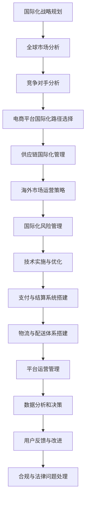

                 

# 国际化扩展：拓展海外市场，提升电商平台供给能力

## 关键词：
- 国际化扩展
- 海外市场
- 电商平台
- 供应链管理
- 风险管理
- 技术架构
- 支付与结算
- 物流与配送

## 摘要：
本文旨在深入探讨国际化扩展在提升电商平台海外市场供给能力方面的重要性。文章首先介绍了国际化扩展的背景与意义，分析了全球市场形势和竞争对手，然后详细探讨了电商平台全球化、供应链国际化、海外市场运营策略以及国际化风险管理。接下来，文章从技术实施与优化角度，讲解了跨境电商平台技术架构、国际化支付与结算、物流与配送国际化，以及国际化平台运营和跨境合规与法律问题。最后，通过成功案例分析和未来发展趋势展望，为读者提供了切实可行的国际化扩展策略。

---

## 第一部分：国际化基础与策略

国际化扩展是电商平台在全球市场竞争中的一项重要策略，旨在通过拓展海外市场，提升平台供给能力，实现业务增长和多元化发展。本部分将从国际化背景与意义、全球市场分析、电商平台全球化、供应链国际化、海外市场运营策略以及国际化风险管理等方面进行详细探讨。

### 第1章：国际化背景与意义

#### 1.1 国际化的重要性

国际化是企业拓展市场、提升竞争力的重要手段。随着全球化的不断深入，企业面临的竞争压力越来越大。通过国际化扩展，企业可以更好地适应全球市场需求，开拓新的市场空间，提高市场份额。同时，国际化也有助于企业实现资源整合，优化供应链管理，提高运营效率。

#### 1.2 企业国际化面临的挑战

企业国际化过程中会遇到一系列挑战，如文化差异、市场调研不足、竞争对手分析不充分、供应链管理困难等。此外，国际化还可能涉及法律、法规、税收等多个方面的问题，这对企业的管理水平提出了更高的要求。

#### 1.3 国际化战略的制定

制定有效的国际化战略是成功国际化的关键。企业需要明确国际化目标，选择合适的国际化模式，制定具体的实施计划。同时，企业还需关注市场调研、竞争对手分析、供应链管理、国际化风险管理等方面，以确保国际化战略的有效执行。

### 第2章：全球市场分析

#### 2.1 全球市场概况

全球市场呈现多样化的特点，不同国家和地区的市场需求、消费习惯、法律法规等存在显著差异。企业需要深入了解全球市场形势，把握市场发展趋势，为国际化扩展提供有力支持。

#### 2.2 海外市场调研

海外市场调研是国际化扩展的重要环节。企业需要通过实地考察、市场调查、数据分析等方式，全面了解海外市场的需求、竞争状况、市场潜力等，为制定国际化战略提供依据。

#### 2.3 竞争对手分析

竞争对手分析是国际化扩展的关键步骤。企业需要了解竞争对手的市场定位、产品优势、营销策略、供应链管理等方面，找出自身的差距和优势，制定有针对性的国际化策略。

### 第3章：电商平台全球化

#### 3.1 电商平台国际化路径

电商平台国际化可以采用直接进入、合资合作、收购等方式。企业需要根据自身情况选择合适的国际化路径，确保国际化战略的顺利实施。

#### 3.2 跨境电商平台模式

跨境电商平台模式主要包括跨境零售、跨境批发、海外仓储等。企业需要结合自身业务特点，选择合适的跨境电商平台模式，提高海外市场供给能力。

#### 3.3 全球电商平台案例分析

通过全球电商平台案例分析，企业可以借鉴成功经验，了解国际化扩展的实际情况，为自身国际化战略提供参考。

### 第4章：供应链国际化

#### 4.1 供应链管理概述

供应链管理是国际化扩展的核心环节。企业需要建立完善的供应链管理体系，确保供应链的稳定性、效率性和灵活性。

#### 4.2 国际供应链挑战

国际供应链面临运输成本、关税、汇率、政策法规等多重挑战。企业需要积极应对这些挑战，优化供应链管理，提高国际市场竞争力。

#### 4.3 国际供应链优化策略

国际供应链优化策略包括供应链网络设计、库存管理、运输优化、信息共享等方面。企业需要通过优化供应链管理，提高国际市场供给能力。

### 第5章：海外市场运营策略

#### 5.1 市场定位与品牌建设

海外市场运营策略的第一步是明确市场定位和品牌建设。企业需要根据自身优势和市场需求，制定有针对性的市场定位和品牌策略。

#### 5.2 营销与推广策略

营销与推广策略是海外市场运营的关键。企业需要采用多样化的营销手段，如社交媒体营销、内容营销、广告投放等，提高品牌知名度和市场份额。

#### 5.3 客户服务与支持

客户服务与支持是海外市场运营的重要保障。企业需要建立完善的客户服务体系，提供快速、高效、优质的客户服务，提高客户满意度。

### 第6章：国际化风险管理

#### 6.1 国际化风险类型

国际化风险包括市场风险、财务风险、运营风险、法律风险等。企业需要识别和评估各类风险，制定相应的风险管理策略。

#### 6.2 风险评估与管理

风险评估与管理是国际化风险管理的关键。企业需要建立风险评估体系，定期对风险进行评估，制定风险管理措施。

#### 6.3 应对策略与措施

针对各类国际化风险，企业需要制定相应的应对策略与措施，确保国际化战略的顺利实施。

---

以上为第一部分的国际化基础与策略，接下来将深入探讨技术实施与优化方面的内容。在第二部分中，我们将从跨境电商平台技术架构、国际化支付与结算、物流与配送国际化等方面进行详细讲解。

---

## 第二部分：技术实施与优化

### 第7章：跨境电商平台技术架构

#### 7.1 技术架构概述

跨境电商平台技术架构是实现国际化扩展的核心支撑。一个高效、稳定、可扩展的技术架构是确保平台性能和用户体验的关键。

#### 7.2 技术选型与搭建

技术选型与搭建是跨境电商平台技术实施的重要环节。企业需要根据业务需求和性能要求，选择合适的技术框架和工具，搭建稳定的技术平台。

#### 7.3 技术优化与扩展

技术优化与扩展是跨境电商平台持续发展的重要保障。企业需要不断优化技术架构，提高平台性能和用户体验，以适应不断变化的市场需求。

### 第8章：国际化支付与结算

#### 8.1 支付系统概述

国际化支付与结算系统是跨境电商平台的重要组成部分。一个高效、安全、便捷的支付系统是提高用户满意度和市场份额的关键。

#### 8.2 国际支付解决方案

国际支付解决方案包括支付网关、支付通道、支付接口等方面。企业需要选择合适的支付解决方案，确保支付过程的稳定性和安全性。

#### 8.3 支付风险与防控

支付风险是国际化支付与结算系统面临的重要挑战。企业需要建立完善的支付风险防控体系，确保支付系统的安全性和稳定性。

### 第9章：物流与配送国际化

#### 9.1 物流体系概述

物流与配送国际化是跨境电商平台实现全球覆盖的重要环节。一个高效、稳定、成本可控的物流体系是提高国际市场供给能力的关键。

#### 9.2 国际物流挑战

国际物流面临运输成本、关税、法规等多重挑战。企业需要积极应对这些挑战，优化物流体系，提高国际市场竞争力。

#### 9.3 物流优化策略

物流优化策略包括运输路线优化、仓储管理优化、物流信息共享等方面。企业需要通过优化物流体系，提高国际市场供给能力。

### 第10章：国际化平台运营

#### 10.1 平台运营管理

国际化平台运营管理是跨境电商平台运营的核心。企业需要建立完善的运营管理体系，确保平台稳定运行和高效运营。

#### 10.2 数据分析与决策

数据分析与决策是国际化平台运营的重要手段。企业需要通过数据分析，了解市场需求、用户行为等，制定科学的运营策略。

#### 10.3 用户反馈与改进

用户反馈与改进是国际化平台运营的重要环节。企业需要积极收集用户反馈，不断改进产品和服务，提高用户满意度。

### 第11章：跨境合规与法律问题

#### 11.1 合规要求与法规解读

跨境合规与法律问题是国际化扩展的重要挑战。企业需要了解相关合规要求与法规，确保业务运营符合法律法规。

#### 1

### 11.2 跨境合规策略

跨境合规策略包括合规培训、合规审查、合规监控等方面。企业需要建立完善的合规策略，确保业务运营符合法律法规。

#### 11.3 法律纠纷应对

法律纠纷应对是跨境合规的重要环节。企业需要建立法律纠纷应对机制，及时处理法律纠纷，保障企业合法权益。

---

以上为第二部分的技术实施与优化，接下来将通过对成功案例的分析，为读者提供国际化扩展的实践经验和启示。

---

## 第三部分：成功案例与启示

### 第12章：国际化扩展案例分析

#### 12.1 案例选择与介绍

在本章节中，我们将选择几个具有代表性的跨境电商平台，对其国际化扩展过程进行分析和解读。这些案例将涵盖不同行业、不同市场背景和不同国际化路径，为读者提供丰富的实践经验和启示。

#### 12.2 案例分析与解读

通过对案例的深入分析，我们将解读这些企业在国际化扩展过程中所面临的挑战、所采取的策略以及取得的成果。同时，我们将探讨这些案例对其他企业的启示和借鉴意义。

#### 12.3 启示与借鉴

成功案例的分析将为读者提供宝贵的实践经验。在本章节的最后，我们将总结成功案例中的经验和教训，为其他企业的国际化扩展提供有益的借鉴。

### 第13章：未来发展趋势与展望

#### 13.1 国际电商发展趋势

未来，国际电商将呈现出以下发展趋势：技术驱动的创新、全球化进一步加深、多元化市场需求的满足、跨境电商生态的完善等。这些趋势将对电商平台国际化扩展产生深远影响。

#### 13.2 技术创新与展望

技术创新是国际化扩展的重要动力。人工智能、大数据、区块链等新兴技术的应用将推动跨境电商平台的优化和创新。在本章节中，我们将探讨这些技术如何赋能跨境电商平台，提升国际化扩展能力。

#### 13.3 国际化扩展策略展望

未来，企业需要根据全球市场形势和自身业务特点，制定更加精准和灵活的国际化扩展策略。在本章节中，我们将展望未来国际化扩展策略的发展方向，为企业的国际化拓展提供参考。

---

通过以上三个部分的分析，本文旨在为读者提供全面、深入的国际化扩展知识。在结尾部分，我们将提供相关的资源和流程图与伪代码，帮助读者更好地理解和应用国际化扩展策略。

---

## 附录

### 附录 A：国际化扩展相关资源

#### A.1 行业报告与研究

- 国际电商市场研究报告
- 跨境电商平台发展现状与趋势
- 国际供应链管理白皮书

#### A.2 学术论文与文章

- 《跨境电商平台技术架构设计与优化》
- 《国际化支付与结算系统设计与实现》
- 《物流与配送在国际电商中的应用》

#### A.3 开源工具与框架

- 国际化支付网关开源项目
- 跨境电商物流管理系统开源框架
- 国际电商数据分析工具集

### 附录 B：国际化扩展流程图与伪代码

#### B.1 国际化扩展流程图



#### B.2 伪代码示例

```python
# 伪代码：国际化扩展策略制定

def define_international_strategy():
    # 全球市场分析
    analyze_global_market()
    
    # 竞争对手分析
    analyze_competitors()
    
    # 电商平台国际化路径选择
    select_internationalization_path()
    
    # 供应链国际化管理
    manage_supply_chain()
    
    # 海外市场运营策略
    define_marketing_strategy()
    
    # 国际化风险管理
    manage_risks()
    
    # 技术实施与优化
    implement_technology()

# 调用国际化扩展策略制定函数
define_international_strategy()
```

---

作者：AI天才研究院/AI Genius Institute & 禅与计算机程序设计艺术 /Zen And The Art of Computer Programming

---

通过本文的深入分析和详细讲解，读者可以全面了解国际化扩展的各个方面，为企业的国际化拓展提供有益的参考和指导。希望本文能对您的国际化扩展之路有所帮助！

