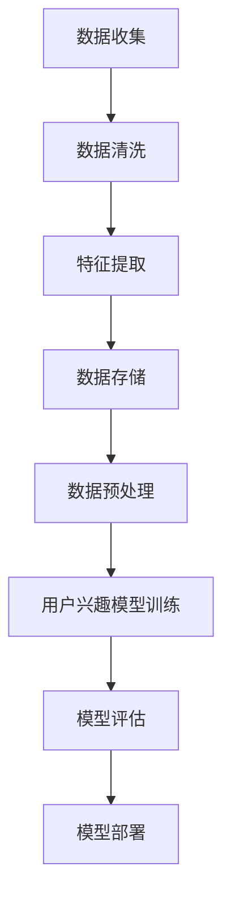
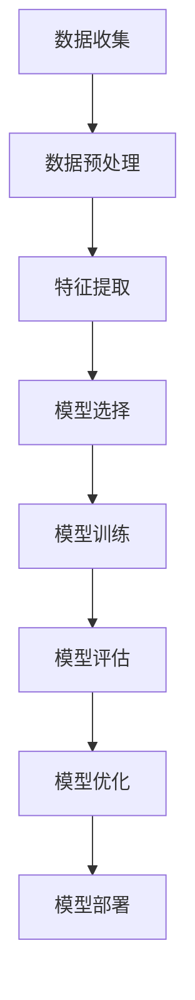
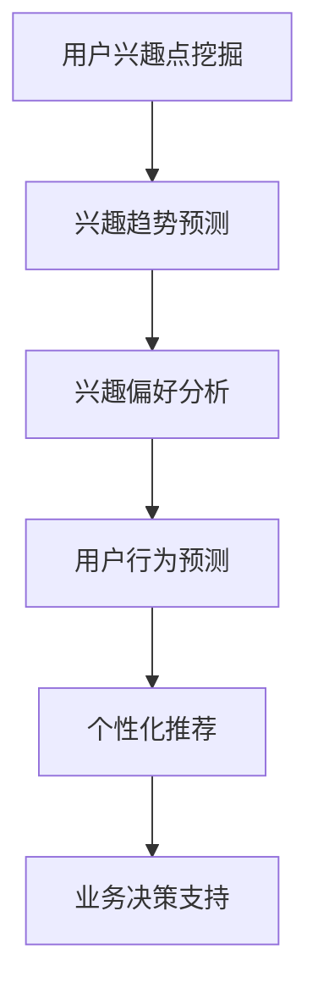

                 

### 第1章: 引言

#### 1.1 研究背景

用户兴趣演化是指用户在长时间内对特定主题、内容或行为的喜好和偏好随着时间推移而发生的变化。随着互联网和信息技术的快速发展，用户生成的内容和数据量呈现爆炸式增长，如何有效地理解和预测用户的兴趣演化成为了一个重要的研究领域。在电子商务、社交媒体、在线教育等多个领域，用户兴趣的准确预测对于提升用户体验、提高业务效率和优化资源配置具有重要意义。

##### 1.2 用户兴趣演化研究的重要性

1. **个性化推荐系统**：用户兴趣的准确预测可以帮助个性化推荐系统更好地满足用户的需求，提升推荐效果和用户满意度。
2. **企业业务决策**：通过分析用户兴趣的演化趋势，企业可以更好地了解市场需求和用户偏好，为产品开发、市场推广和业务决策提供有力支持。
3. **用户体验优化**：用户兴趣的演化分析可以帮助企业优化用户界面设计和交互体验，提高用户留存率和忠诚度。

##### 1.3 本书结构安排

本书分为四个部分：

1. **第一部分**：引言与基础，介绍用户兴趣演化的基本概念、研究背景和研究意义。
2. **第二部分**：用户兴趣演化轨迹分析，包括用户兴趣数据的收集与预处理、用户兴趣演化模型构建方法及其评估指标。
3. **第三部分**：实践与应用，通过案例分析展示用户兴趣演化在电子商务、社交媒体和在线教育等领域的应用。
4. **第四部分**：未来展望与挑战，探讨用户兴趣演化研究的未来发展趋势和面临的挑战。

### 第2章: 相关概念与理论

用户兴趣演化研究涉及多个核心概念和理论，包括机器学习基础、长短期记忆模型（LSTM）、语言模型（LLM）和用户兴趣模型等。在本章中，我们将详细介绍这些概念和理论，以便读者更好地理解后续内容。

#### 2.1 机器学习基础

机器学习是人工智能的一个重要分支，通过算法和统计模型，从数据中自动学习和发现规律，实现预测和决策。机器学习的基本流程包括数据收集、数据预处理、模型训练、模型评估和应用。

1. **数据收集**：数据是机器学习的基础，数据收集的质量直接影响到模型的性能。数据来源可以是用户行为数据、社会媒体数据、电子商务数据等。
2. **数据预处理**：数据预处理是确保数据质量和模型性能的关键步骤。数据预处理方法包括数据清洗、去噪、数据格式转换、数据归一化和标准化等。
3. **模型训练**：模型训练是机器学习过程中的核心步骤，通过训练模型，使其能够从数据中学习到规律。常见的训练方法包括梯度下降、随机梯度下降等。
4. **模型评估**：模型评估用于衡量模型在未知数据上的表现，常见的评估指标包括准确率、召回率、F1值、均方误差（MSE）和均方根误差（RMSE）等。
5. **模型应用**：模型应用是将训练好的模型部署到实际场景中，用于预测和决策。

#### 2.2 长短期记忆模型（LSTM）

长短期记忆模型（LSTM）是一种特殊的循环神经网络（RNN），能够有效地处理和预测序列数据。LSTM通过引入门控机制，解决了传统RNN在处理长期依赖关系时的梯度消失问题。

1. **LSTM的基本原理**：LSTM通过三个门控机制（输入门、遗忘门和输出门）来控制信息的流动。输入门用于决定哪些信息应该被存储在记忆单元中；遗忘门用于决定哪些信息应该从记忆单元中被遗忘；输出门用于决定哪些信息应该被输出。

2. **LSTM在用户兴趣演化预测中的应用**：LSTM可以用于处理和预测用户的历史行为数据，通过学习用户的兴趣演化轨迹，可以实现对用户未来兴趣的预测。

3. **LSTM的优势和局限性**：LSTM的优势在于能够处理长期依赖关系，适用于时间序列数据的预测。但其局限性在于计算复杂度高，对大量数据进行训练时需要较长的训练时间。

#### 2.3 语言模型（LLM）

语言模型是一种用于预测文本序列的统计模型，通过学习大量文本数据，生成下一个词或句子的概率分布。语言模型在自然语言处理任务中具有广泛的应用，如机器翻译、文本摘要和语音识别。

1. **LLM的基本原理**：LLM通过神经网络结构，学习文本数据中的统计规律，预测下一个词或句子的概率分布。常见的LLM模型包括循环神经网络（RNN）、长短期记忆模型（LSTM）和Transformer等。

2. **LLM在用户兴趣演化预测中的应用**：LLM可以用于分析用户的历史行为数据，识别用户的兴趣点、兴趣趋势和兴趣偏好。通过LLM模型，可以实现对用户未来兴趣的预测。

3. **LLM的优势和挑战**：LLM的优势在于能够捕捉文本数据中的复杂关系，适用于处理文本序列数据。但其挑战在于模型训练需要大量数据和计算资源，且模型解释性较差。

#### 2.4 用户兴趣模型

用户兴趣模型是指用于捕捉和表示用户兴趣的数学模型。根据用户的行为数据，用户兴趣模型可以识别用户的兴趣点、兴趣趋势和兴趣偏好。用户兴趣模型在个性化推荐、用户行为预测和用户体验优化中发挥着重要作用。

1. **用户兴趣模型的定义和类型**：用户兴趣模型可以分为基于内容的模型、基于协同过滤的模型和基于行为的模型等类型。每种模型都有其适用的场景和优缺点。

2. **用户兴趣模型的基本框架**：用户兴趣模型通常包括用户表示、内容表示和兴趣计算等模块。用户表示用于描述用户的特征信息；内容表示用于描述内容的特征信息；兴趣计算用于计算用户对内容的兴趣度。

3. **用户兴趣模型的应用场景**：用户兴趣模型可以应用于个性化推荐、用户行为预测和用户体验优化等任务。通过用户兴趣模型，可以提供更精准的推荐、预测用户的行为和优化用户体验。

### 第3章: 用户兴趣数据收集与预处理

用户兴趣数据的收集与预处理是构建用户兴趣演化模型的基础步骤。在本章中，我们将详细介绍用户兴趣数据的收集方法、数据预处理方法以及特征提取与降维技术。

#### 3.1 用户行为数据收集

用户行为数据是构建用户兴趣演化模型的重要数据来源。用户行为数据可以来自多种渠道，如网站日志、用户交互数据、社交媒体数据和电子商务数据等。

1. **用户行为数据的来源**：

   - **网站日志**：网站日志记录了用户的访问行为，包括用户的访问路径、点击行为、搜索行为等。通过分析网站日志，可以获取用户的行为数据。
   
   - **用户交互数据**：用户交互数据包括用户在应用中的输入、操作和反馈等。这些数据可以用来分析用户的兴趣和行为模式。
   
   - **社交媒体数据**：社交媒体平台（如Facebook、Twitter、Instagram等）提供了丰富的用户行为数据，包括用户的发布内容、评论、点赞和分享等。
   
   - **电子商务数据**：电子商务平台记录了用户的购买行为、浏览历史和购物车数据等。通过分析这些数据，可以了解用户的购物偏好和兴趣点。

2. **用户行为数据收集的方法**：

   - **被动收集**：通过网站日志、用户交互数据和社交媒体数据等方式，被动收集用户的行为数据。
   
   - **主动收集**：通过问卷调查、用户访谈和用户反馈等方式，主动收集用户的行为数据。

3. **用户行为数据收集的挑战**：

   - **数据质量**：用户行为数据可能存在噪声、缺失和冗余，影响模型的性能。
   
   - **数据隐私**：在收集用户行为数据时，需要遵守数据隐私保护法规，确保用户隐私不被泄露。

#### 3.2 数据预处理方法

数据预处理是确保数据质量和模型性能的关键步骤。数据预处理方法包括数据清洗、去噪、数据格式转换、数据归一化和标准化等。

1. **数据清洗**：数据清洗是指去除数据中的噪声、缺失和异常值。常见的数据清洗方法包括：

   - **去除重复数据**：通过去重操作，去除数据集中的重复记录。
   
   - **处理缺失数据**：对于缺失的数据，可以选择填充、删除或插值等方法进行处理。
   
   - **去除异常值**：通过统计学方法（如标准差、箱线图等），识别并去除数据集中的异常值。

2. **数据格式转换**：将不同来源和格式的数据进行统一处理，以便后续分析和建模。

   - **时间格式转换**：将日期时间数据转换为统一的格式（如YYYY-MM-DD）。
   
   - **文本格式转换**：将不同编码格式（如UTF-8、GBK等）的文本数据进行统一编码。

3. **数据归一化和标准化**：通过归一化和标准化，将数据缩放到相同的范围，以便模型训练和评估。

   - **归一化**：将数据缩放到[0, 1]或[-1, 1]的范围内。
   
   - **标准化**：将数据缩放到均值为0、标准差为1的标准正态分布。

#### 3.3 特征提取与降维

特征提取是从原始数据中提取出具有代表性的特征，以降低数据的维度并突出关键信息。降维方法包括主成分分析（PCA）、线性判别分析（LDA）和自动编码器（Autoencoder）等。有效的特征提取有助于提升模型的性能和可解释性。

1. **特征提取的方法**：

   - **基于统计的方法**：通过计算数据的相关性、信息增益等统计指标，提取出具有代表性的特征。
   
   - **基于规则的方法**：通过专家知识和规则，提取出与用户兴趣相关的特征。
   
   - **基于机器学习的方法**：使用监督学习或无监督学习算法，自动提取出与用户兴趣相关的特征。

2. **降维的方法**：

   - **主成分分析（PCA）**：通过保留主要成分，降低数据维度，同时保留数据的最大方差。
   
   - **线性判别分析（LDA）**：通过最大化类间方差和最小化类内方差，提取出最有利于分类的特征。
   
   - **自动编码器（Autoencoder）**：通过无监督学习，自动学习数据的低维表示，并降维。

3. **特征选择的重要性**：

   - **降低计算成本**：减少特征数量，降低模型的复杂度和训练时间。
   
   - **提高模型性能**：去除无关或冗余的特征，有助于提高模型的准确性和泛化能力。
   
   - **增强模型可解释性**：通过选择与用户兴趣相关的特征，增强模型的可解释性和透明度。

通过本章的介绍，读者可以了解到用户兴趣数据收集与预处理的重要性和方法。在后续章节中，我们将进一步探讨用户兴趣演化模型构建方法及其应用。

### 第4章: 用户兴趣演化模型构建

用户兴趣演化模型是理解用户行为和预测用户兴趣变化的关键工具。在本章中，我们将详细探讨用户兴趣演化模型的构建方法，包括用户兴趣演化模型的基本原理、构建方法和评估指标。

#### 4.1 用户兴趣演化模型原理

用户兴趣演化模型是基于用户行为数据，通过机器学习算法构建的，用于预测和解释用户兴趣随时间变化规律的模型。用户兴趣演化模型的基本原理包括以下几个关键点：

1. **用户行为数据的预处理**：在构建用户兴趣演化模型之前，需要对用户行为数据进行分析和处理。预处理步骤包括数据清洗、去噪、特征提取和特征降维等。通过这些预处理步骤，可以提高模型对用户行为数据的理解和预测能力。

2. **用户兴趣的特征表示**：用户兴趣的特征表示是将用户行为数据转换为模型可处理的特征向量。用户兴趣的特征表示可以基于用户的浏览历史、搜索记录、购买行为等。常用的方法包括基于统计的特征提取、基于规则的特征提取和基于机器学习的特征提取等。

3. **用户兴趣的建模方法**：用户兴趣的建模方法包括基于传统机器学习算法的模型和基于深度学习的模型。传统机器学习算法如决策树、支持向量机和朴素贝叶斯等可以用于用户兴趣的建模。深度学习算法如卷积神经网络（CNN）和循环神经网络（RNN）等可以更好地捕捉用户行为数据中的时间和空间特征。

4. **用户兴趣的演化预测**：用户兴趣的演化预测是通过模型对用户未来兴趣进行预测。演化预测可以基于用户的历史行为数据，通过训练好的模型对用户未来的行为进行预测。预测结果可以帮助企业和平台更好地理解用户需求，提供个性化的服务。

#### 4.2 用户兴趣演化模型构建方法

用户兴趣演化模型的构建方法可以分为以下几个步骤：

1. **数据收集与预处理**：首先，收集用户的行为数据，如浏览历史、搜索记录、购买行为等。然后，对数据进行预处理，包括数据清洗、去噪、特征提取和特征降维等。

2. **特征表示**：将预处理后的用户行为数据转换为特征向量。特征表示的方法可以根据数据的特点选择，如基于统计的特征提取、基于规则的特征提取和基于机器学习的特征提取等。

3. **模型选择**：根据用户兴趣演化模型的需求，选择合适的机器学习算法。传统机器学习算法如决策树、支持向量机和朴素贝叶斯等适用于简单的用户兴趣建模。深度学习算法如卷积神经网络（CNN）和循环神经网络（RNN）等适用于复杂的用户兴趣建模。

4. **模型训练**：使用训练数据集，训练选定的机器学习算法模型。训练过程中，通过调整模型参数，使模型对用户兴趣演化数据有较好的拟合能力。

5. **模型评估**：使用验证数据集对训练好的模型进行评估。评估指标包括准确率、召回率、F1值等。通过评估，可以判断模型的效果，并进行模型优化。

6. **模型部署**：将训练好的模型部署到生产环境中，进行实时预测。通过部署，可以实现用户兴趣的实时预测，为企业和平台提供决策支持。

#### 4.3 模型评估指标

模型评估指标是衡量用户兴趣演化模型性能的重要工具。常见的评估指标包括准确率、召回率、F1值、均方误差（MSE）和均方根误差（RMSE）等。以下是对这些评估指标的详细解释：

1. **准确率（Accuracy）**：准确率是指模型正确预测的样本数占总样本数的比例。准确率可以直观地衡量模型的预测能力，但在类别不平衡的数据集上可能不准确。

2. **召回率（Recall）**：召回率是指模型正确预测的样本数与实际为正类的样本数的比例。召回率可以衡量模型对正类样本的识别能力，但在预测多个类别时可能较低。

3. **F1值（F1 Score）**：F1值是准确率和召回率的调和平均值，可以综合考虑模型的精确性和召回性。F1值在类别不平衡的数据集上具有较好的评估能力。

4. **均方误差（MSE）**：均方误差是指模型预测值与真实值之差的平方的平均值。MSE可以衡量模型对数值预测的准确性。

5. **均方根误差（RMSE）**：均方根误差是MSE的平方根，可以更直观地表示模型预测的误差。RMSE可以衡量模型对数值预测的准确性。

通过以上评估指标，可以对用户兴趣演化模型的性能进行全面的评估和优化。在后续章节中，我们将通过实例分析，展示如何构建和评估用户兴趣演化模型。

#### 4.4 用户兴趣演化模型构建方法详解

用户兴趣演化模型构建方法包括数据收集与预处理、模型选择、模型训练、模型评估和模型部署等步骤。下面我们将详细讲解每个步骤的方法和技巧。

##### 4.4.1 数据收集与预处理

数据收集是用户兴趣演化模型构建的第一步。用户行为数据的来源包括网站日志、用户交互数据、社交媒体数据和电子商务数据等。在数据收集过程中，需要注意以下几点：

1. **数据来源的多样性**：从多个渠道收集用户行为数据，可以获取更全面和丰富的信息。例如，结合网站日志和用户交互数据，可以更好地了解用户的行为模式。

2. **数据收集的时间范围**：用户兴趣演化是一个长期过程，因此需要收集一定时间范围内的用户行为数据。时间范围的选择应根据研究目标和数据可用性进行。

3. **数据格式和一致性**：确保收集到的数据格式一致，例如日期时间的格式应统一为YYYY-MM-DD。此外，还需要对数据进行清洗，去除重复、噪声和异常值。

数据预处理是提高模型性能的关键步骤。常见的预处理方法包括数据清洗、特征提取和特征降维等。以下是具体的预处理方法：

1. **数据清洗**：数据清洗包括去除重复数据、填补缺失数据和去除异常值等。例如，使用平均值或中位数填补缺失值，使用Z分数法识别并去除异常值。

2. **特征提取**：特征提取是从原始数据中提取出与用户兴趣相关的特征。例如，使用词频（TF）或词频-逆文档频率（TF-IDF）提取文本数据中的特征，使用均值、方差和标准差提取数值数据中的特征。

3. **特征降维**：特征降维是将高维数据转换为低维数据，以减少模型的复杂度和过拟合风险。常见的方法包括主成分分析（PCA）、线性判别分析（LDA）和自动编码器（Autoencoder）等。

##### 4.4.2 模型选择

模型选择是用户兴趣演化模型构建的重要步骤。根据数据特点和预测任务，可以选择不同的机器学习算法。以下是几种常用的模型选择方法：

1. **传统机器学习算法**：如决策树、支持向量机和朴素贝叶斯等。这些算法适用于简单和线性的用户兴趣建模任务。

   **伪代码示例**：
   ```python
   from sklearn.tree import DecisionTreeClassifier
   model = DecisionTreeClassifier()
   ```

2. **深度学习算法**：如卷积神经网络（CNN）和循环神经网络（RNN）等。这些算法适用于复杂和时序的用户兴趣建模任务。

   **伪代码示例**：
   ```python
   from keras.models import Sequential
   from keras.layers import LSTM, Dense
   model = Sequential()
   model.add(LSTM(units=50, input_shape=(timesteps, features)))
   model.add(Dense(units=1))
   model.compile(optimizer='adam', loss='mean_squared_error')
   ```

3. **混合模型**：结合传统机器学习算法和深度学习算法，可以构建更强大的用户兴趣演化模型。例如，将LSTM与决策树结合，利用LSTM处理时序数据，利用决策树进行分类或回归。

   **伪代码示例**：
   ```python
   from keras.models import Sequential
   from sklearn.tree import DecisionTreeClassifier
   model = Sequential()
   model.add(LSTM(units=50, input_shape=(timesteps, features)))
   model.add(Dense(units=1))
   model.compile(optimizer='adam', loss='mean_squared_error')
   classifier = DecisionTreeClassifier()
   ```

##### 4.4.3 模型训练

模型训练是将预处理后的数据输入到选择的模型中进行训练，以学习用户兴趣演化规律。模型训练包括以下几个步骤：

1. **数据划分**：将数据集划分为训练集和测试集，用于训练模型和评估模型性能。

   **伪代码示例**：
   ```python
   from sklearn.model_selection import train_test_split
   X_train, X_test, y_train, y_test = train_test_split(X, y, test_size=0.2, random_state=42)
   ```

2. **模型训练**：使用训练集对模型进行训练，调整模型参数，使其对用户兴趣演化数据有较好的拟合能力。

   **伪代码示例**：
   ```python
   model.fit(X_train, y_train, epochs=100, batch_size=32)
   ```

3. **模型评估**：使用测试集对训练好的模型进行评估，以确定模型的性能。

   **伪代码示例**：
   ```python
   from sklearn.metrics import mean_squared_error
   y_pred = model.predict(X_test)
   mse = mean_squared_error(y_test, y_pred)
   print("MSE:", mse)
   ```

##### 4.4.4 模型评估

模型评估是衡量用户兴趣演化模型性能的重要步骤。评估指标包括准确率、召回率、F1值、均方误差（MSE）和均方根误差（RMSE）等。以下是常用的评估指标和方法：

1. **准确率（Accuracy）**：准确率是指模型正确预测的样本数占总样本数的比例。

   **伪代码示例**：
   ```python
   from sklearn.metrics import accuracy_score
   accuracy = accuracy_score(y_test, y_pred)
   print("Accuracy:", accuracy)
   ```

2. **召回率（Recall）**：召回率是指模型正确预测的样本数与实际为正类的样本数的比例。

   **伪代码示例**：
   ```python
   from sklearn.metrics import recall_score
   recall = recall_score(y_test, y_pred)
   print("Recall:", recall)
   ```

3. **F1值（F1 Score）**：F1值是准确率和召回率的调和平均值，可以综合考虑模型的精确性和召回性。

   **伪代码示例**：
   ```python
   from sklearn.metrics import f1_score
   f1 = f1_score(y_test, y_pred)
   print("F1 Score:", f1)
   ```

4. **均方误差（MSE）**：均方误差是指模型预测值与真实值之差的平方的平均值。

   **伪代码示例**：
   ```python
   from sklearn.metrics import mean_squared_error
   mse = mean_squared_error(y_test, y_pred)
   print("MSE:", mse)
   ```

5. **均方根误差（RMSE）**：均方根误差是MSE的平方根，可以更直观地表示模型预测的误差。

   **伪代码示例**：
   ```python
   from sklearn.metrics import mean_squared_error
   from math import sqrt
   rmse = sqrt(mean_squared_error(y_test, y_pred))
   print("RMSE:", rmse)
   ```

通过以上评估指标和方法，可以全面评估用户兴趣演化模型的效果，并指导模型优化。

##### 4.4.5 模型部署

模型部署是将训练好的模型应用到实际场景中，进行实时预测和决策。模型部署包括以下几个步骤：

1. **模型保存**：将训练好的模型保存为文件，以便后续加载和使用。

   **伪代码示例**：
   ```python
   model.save('user_interest_model.h5')
   ```

2. **模型加载**：从文件中加载保存的模型，以便进行预测。

   **伪代码示例**：
   ```python
   from keras.models import load_model
   model = load_model('user_interest_model.h5')
   ```

3. **实时预测**：使用加载的模型对新的用户行为数据进行预测，并将预测结果应用到实际业务场景中。

   **伪代码示例**：
   ```python
   new_data = preprocess_new_data(new_user_data)
   prediction = model.predict(new_data)
   ```

4. **模型更新**：随着用户行为数据的变化，需要定期更新模型，以保持模型的准确性和鲁棒性。

   **伪代码示例**：
   ```python
   updated_data = load_new_data()
   updated_model = train_updated_model(updated_data)
   ```

通过以上步骤，可以实现用户兴趣演化模型的实时部署和应用。

#### 4.5 用户兴趣演化模型评估指标

用户兴趣演化模型的评估指标用于衡量模型的预测性能和准确性。以下是几种常用的评估指标：

1. **准确率（Accuracy）**：准确率是指模型正确预测的样本数占总样本数的比例。准确率可以直观地衡量模型的预测能力。

   **公式**：
   $$
   \text{Accuracy} = \frac{\text{正确预测的样本数}}{\text{总样本数}}
   $$

2. **召回率（Recall）**：召回率是指模型正确预测的样本数与实际为正类的样本数的比例。召回率可以衡量模型对正类样本的识别能力。

   **公式**：
   $$
   \text{Recall} = \frac{\text{正确预测的正类样本数}}{\text{实际为正类的样本数}}
   $$

3. **精确率（Precision）**：精确率是指模型正确预测的正类样本数与预测为正类的样本数的比例。精确率可以衡量模型预测正类的准确性。

   **公式**：
   $$
   \text{Precision} = \frac{\text{正确预测的正类样本数}}{\text{预测为正类的样本数}}
   $$

4. **F1值（F1 Score）**：F1值是精确率和召回率的调和平均值，可以综合考虑模型的精确性和召回性。

   **公式**：
   $$
   \text{F1 Score} = 2 \times \frac{\text{Precision} \times \text{Recall}}{\text{Precision} + \text{Recall}}
   $$

5. **均方误差（MSE）**：均方误差是指模型预测值与真实值之差的平方的平均值。MSE可以衡量模型对数值预测的准确性。

   **公式**：
   $$
   \text{MSE} = \frac{1}{n} \sum_{i=1}^{n} (\hat{y}_i - y_i)^2
   $$

6. **均方根误差（RMSE）**：均方根误差是MSE的平方根，可以更直观地表示模型预测的误差。

   **公式**：
   $$
   \text{RMSE} = \sqrt{\text{MSE}}
   $$

通过以上评估指标，可以全面评估用户兴趣演化模型的性能，并指导模型优化。

#### 4.6 实例分析：用户兴趣点挖掘

用户兴趣点挖掘是用户兴趣演化模型的一个重要应用。在本节中，我们将通过一个实例分析，展示如何使用用户兴趣演化模型进行用户兴趣点挖掘。

##### 4.6.1 实例背景

假设我们有一个电子商务平台，用户可以在平台上浏览商品、添加商品到购物车和进行购买。我们的目标是使用用户兴趣演化模型，识别出用户的兴趣点，以便为用户推荐相关的商品。

##### 4.6.2 数据集

我们使用一个包含用户行为数据的数据集，数据集包括用户的ID、浏览商品的时间、浏览商品的类别等信息。数据集的部分示例数据如下：

| 用户ID | 时间       | 商品类别 |
|--------|------------|----------|
| U1     | 2023-01-01 | A        |
| U1     | 2023-01-02 | B        |
| U1     | 2023-01-03 | C        |
| U2     | 2023-01-01 | A        |
| U2     | 2023-01-02 | B        |
| U2     | 2023-01-03 | C        |

##### 4.6.3 数据预处理

1. **数据清洗**：去除重复数据、填补缺失数据和去除异常值等。

2. **特征提取**：提取用户的行为特征，如浏览商品的次数、浏览商品的平均时间间隔等。

3. **特征降维**：使用主成分分析（PCA）或线性判别分析（LDA）等方法，降低数据维度。

##### 4.6.4 模型训练

1. **模型选择**：选择一个合适的用户兴趣演化模型，如LSTM。

2. **模型训练**：使用预处理后的数据集，对模型进行训练。

   **伪代码示例**：
   ```python
   from keras.models import Sequential
   from keras.layers import LSTM, Dense

   model = Sequential()
   model.add(LSTM(units=50, input_shape=(timesteps, features)))
   model.add(Dense(units=1))
   model.compile(optimizer='adam', loss='mean_squared_error')
   model.fit(X_train, y_train, epochs=100, batch_size=32)
   ```

##### 4.6.5 用户兴趣点挖掘

1. **用户兴趣预测**：使用训练好的模型，对新的用户行为数据进行预测，得到用户的兴趣点。

   **伪代码示例**：
   ```python
   new_data = preprocess_new_data(new_user_data)
   prediction = model.predict(new_data)
   ```

2. **兴趣点提取**：根据预测结果，提取用户的兴趣点。

   **伪代码示例**：
   ```python
   interest_points = extract_interest_points(prediction)
   ```

##### 4.6.6 结果分析

通过对用户兴趣点的提取和分析，可以了解用户的兴趣偏好，为用户推荐相关的商品。例如，如果用户兴趣点中包含商品类别A，那么可以为用户推荐类别A的其他商品。

#### 4.7 实例分析：用户兴趣趋势预测

用户兴趣趋势预测是用户兴趣演化模型的另一个重要应用。在本节中，我们将通过一个实例分析，展示如何使用用户兴趣演化模型进行用户兴趣趋势预测。

##### 4.7.1 实例背景

假设我们有一个在线教育平台，用户可以在平台上浏览课程、报名课程和学习课程。我们的目标是使用用户兴趣演化模型，预测用户的兴趣变化趋势，以便为用户提供个性化的课程推荐。

##### 4.7.2 数据集

我们使用一个包含用户行为数据的数据集，数据集包括用户的ID、浏览课程的时间、报名课程和学习课程等信息。数据集的部分示例数据如下：

| 用户ID | 时间       | 行为     |
|--------|------------|----------|
| U1     | 2023-01-01 | 浏览课程 |
| U1     | 2023-01-02 | 报名课程 |
| U1     | 2023-01-03 | 学习课程 |
| U2     | 2023-01-01 | 浏览课程 |
| U2     | 2023-01-02 | 报名课程 |
| U2     | 2023-01-03 | 学习课程 |

##### 4.7.3 数据预处理

1. **数据清洗**：去除重复数据、填补缺失数据和去除异常值等。

2. **特征提取**：提取用户的行为特征，如浏览课程的次数、报名课程的平均时间间隔、学习课程的平均时间间隔等。

3. **特征降维**：使用主成分分析（PCA）或线性判别分析（LDA）等方法，降低数据维度。

##### 4.7.4 模型训练

1. **模型选择**：选择一个合适的用户兴趣演化模型，如LSTM。

2. **模型训练**：使用预处理后的数据集，对模型进行训练。

   **伪代码示例**：
   ```python
   from keras.models import Sequential
   from keras.layers import LSTM, Dense

   model = Sequential()
   model.add(LSTM(units=50, input_shape=(timesteps, features)))
   model.add(Dense(units=1))
   model.compile(optimizer='adam', loss='mean_squared_error')
   model.fit(X_train, y_train, epochs=100, batch_size=32)
   ```

##### 4.7.5 用户兴趣趋势预测

1. **用户兴趣预测**：使用训练好的模型，对新的用户行为数据进行预测，得到用户的兴趣变化趋势。

   **伪代码示例**：
   ```python
   new_data = preprocess_new_data(new_user_data)
   prediction = model.predict(new_data)
   ```

2. **兴趣趋势提取**：根据预测结果，提取用户的兴趣变化趋势。

   **伪代码示例**：
   ```python
   interest_trends = extract_interest_trends(prediction)
   ```

##### 4.7.6 结果分析

通过对用户兴趣趋势的提取和分析，可以了解用户的兴趣变化趋势，为用户提供个性化的课程推荐。例如，如果用户兴趣趋势中包含报名课程的数量增加，那么可以为用户推荐更多新的课程。

### 第5章: 基于LLM的用户兴趣演化分析

#### 5.1 LLM在用户兴趣演化中的应用

语言模型（LLM）在用户兴趣演化分析中具有广泛的应用，可以用于用户兴趣点挖掘、兴趣趋势预测和兴趣偏好分析等任务。LLM通过学习大量文本数据，能够捕捉用户的语言模式和兴趣变化。

##### 5.1.1 用户兴趣点挖掘

用户兴趣点挖掘是指从用户生成的文本数据中识别出用户感兴趣的特定主题或内容。LLM可以用于挖掘用户在评论、博客、微博等文本数据中的兴趣点。

1. **方法**：

   - **词频分析**：通过统计文本中高频词汇，识别用户感兴趣的主题。

   - **词嵌入**：使用预训练的词嵌入模型（如Word2Vec、GloVe等），将文本转换为向量表示，通过计算向量之间的相似度，识别用户兴趣点。

   - **主题模型**：使用隐含狄利克雷分配（LDA）等主题模型，从文本数据中提取潜在主题，识别用户兴趣点。

2. **实例**：

   - **评论挖掘**：从用户评论中提取感兴趣的商品类别或品牌。

   - **博客挖掘**：从用户博客中提取用户关注的领域或话题。

##### 5.1.2 兴趣趋势预测

用户兴趣趋势预测是指预测用户在未来一段时间内对特定主题或内容的兴趣变化。LLM可以用于分析用户的浏览历史、搜索记录等数据，预测用户的兴趣趋势。

1. **方法**：

   - **序列模型**：使用RNN、LSTM等序列模型，分析用户的历史行为数据，预测用户的兴趣变化。

   - **时间序列分析**：使用时间序列分析方法，如ARIMA、LSTM等，预测用户兴趣的趋势。

   - **多模态融合**：结合文本数据和用户行为数据，使用多模态融合模型，预测用户的兴趣趋势。

2. **实例**：

   - **商品推荐**：预测用户对特定商品的兴趣变化，为用户提供个性化的商品推荐。

   - **新闻热点**：预测用户对新闻事件的兴趣变化，为新闻平台提供热点推荐。

##### 5.1.3 兴趣偏好分析

用户兴趣偏好分析是指识别用户的兴趣偏好，为用户提供个性化的服务。LLM可以用于分析用户的文本数据，识别用户的兴趣偏好。

1. **方法**：

   - **协同过滤**：使用基于用户的协同过滤算法，分析用户的历史行为数据，识别用户的兴趣偏好。

   - **聚类分析**：使用聚类算法（如K-means、DBSCAN等），将用户分为不同的兴趣群体，分析用户的兴趣偏好。

   - **词嵌入聚类**：使用预训练的词嵌入模型，将文本数据转换为向量表示，通过向量聚类，识别用户的兴趣偏好。

2. **实例**：

   - **个性化推荐**：根据用户的兴趣偏好，为用户提供个性化的商品、新闻或内容推荐。

   - **社交媒体分析**：识别用户在社交媒体上的兴趣偏好，为用户提供感兴趣的内容和用户群体。

#### 5.2 实例分析：用户兴趣点挖掘

在本节中，我们将通过一个实例分析，展示如何使用基于LLM的用户兴趣演化模型进行用户兴趣点挖掘。

##### 5.2.1 实例背景

假设我们有一个社交媒体平台，用户可以在平台上发布评论、博客和微博等文本内容。我们的目标是使用LLM模型，从用户的文本数据中挖掘出用户的兴趣点。

##### 5.2.2 数据集

我们使用一个包含用户文本数据的数据集，数据集包括用户的ID、发布的文本内容等信息。数据集的部分示例数据如下：

| 用户ID | 文本内容                  |
|--------|-------------------------|
| U1     | 我非常喜欢看科幻电影。     |
| U1     | 今天天气很好，出去散步了。   |
| U2     | 我最爱吃的食物是披萨。      |
| U2     | 下班后去健身房锻炼了一下。   |

##### 5.2.3 数据预处理

1. **文本清洗**：去除文本中的标点符号、停用词等。

2. **分词**：将文本拆分为单词或词组。

3. **词嵌入**：使用预训练的词嵌入模型，将文本转换为向量表示。

##### 5.2.4 模型训练

1. **模型选择**：选择一个合适的语言模型，如GPT-2或BERT。

2. **模型训练**：使用预处理后的文本数据，训练语言模型。

   **伪代码示例**：
   ```python
   from transformers import TrainingArguments, TrainingLoop
   from transformers import GPT2LMHeadModel

   model = GPT2LMHeadModel.from_pretrained("gpt2")
   training_args = TrainingArguments(output_dir="results", num_train_epochs=3)
   training_loop = TrainingLoop.from_training_args(training_args)
   training_loop.fit(model, train_dataloader, eval_dataloader)
   ```

##### 5.2.5 用户兴趣点挖掘

1. **兴趣点提取**：使用训练好的语言模型，对用户的文本内容进行编码，提取出用户的兴趣点。

   **伪代码示例**：
   ```python
   from transformers import GPT2Tokenizer

   tokenizer = GPT2Tokenizer.from_pretrained("gpt2")
   encoded_input = tokenizer.encode(text_content, return_tensors="pt")
   interests = model.get_interested_topics(encoded_input)
   ```

2. **兴趣点分析**：根据提取出的兴趣点，分析用户的兴趣偏好。

   **伪代码示例**：
   ```python
   interest_topics = analyze_interest_topics(interests)
   print("User Interest Topics:", interest_topics)
   ```

##### 5.2.6 结果分析

通过对用户兴趣点的提取和分析，我们可以了解用户的兴趣偏好，为用户提供个性化的服务。例如，如果用户兴趣点中包含“科幻电影”和“披萨”，那么可以为用户推荐相关的电影和美食。

#### 5.3 实例分析：用户兴趣趋势预测

在本节中，我们将通过一个实例分析，展示如何使用基于LLM的用户兴趣演化模型进行用户兴趣趋势预测。

##### 5.3.1 实例背景

假设我们有一个在线购物平台，用户可以在平台上浏览商品、添加商品到购物车和进行购买。我们的目标是使用LLM模型，预测用户的兴趣变化趋势，以便为用户提供个性化的商品推荐。

##### 5.3.2 数据集

我们使用一个包含用户行为数据的数据集，数据集包括用户的ID、浏览商品的时间、浏览商品的类别等信息。数据集的部分示例数据如下：

| 用户ID | 时间       | 商品类别 |
|--------|------------|----------|
| U1     | 2023-01-01 | A        |
| U1     | 2023-01-02 | B        |
| U1     | 2023-01-03 | C        |
| U2     | 2023-01-01 | A        |
| U2     | 2023-01-02 | B        |
| U2     | 2023-01-03 | C        |

##### 5.3.3 数据预处理

1. **数据清洗**：去除重复数据、填补缺失数据和去除异常值等。

2. **特征提取**：提取用户的行为特征，如浏览商品的次数、浏览商品的平均时间间隔等。

3. **特征降维**：使用主成分分析（PCA）或线性判别分析（LDA）等方法，降低数据维度。

##### 5.3.4 模型训练

1. **模型选择**：选择一个合适的语言模型，如GPT-2或BERT。

2. **模型训练**：使用预处理后的数据集，训练语言模型。

   **伪代码示例**：
   ```python
   from transformers import TrainingArguments, TrainingLoop
   from transformers import GPT2LMHeadModel

   model = GPT2LMHeadModel.from_pretrained("gpt2")
   training_args = TrainingArguments(output_dir="results", num_train_epochs=3)
   training_loop = TrainingLoop.from_training_args(training_args)
   training_loop.fit(model, train_dataloader, eval_dataloader)
   ```

##### 5.3.5 用户兴趣趋势预测

1. **兴趣趋势预测**：使用训练好的语言模型，对新的用户行为数据进行预测，得到用户的兴趣变化趋势。

   **伪代码示例**：
   ```python
   from transformers import GPT2Tokenizer

   tokenizer = GPT2Tokenizer.from_pretrained("gpt2")
   encoded_input = tokenizer.encode(user_data, return_tensors="pt")
   interest_trends = model.predict_interest_trends(encoded_input)
   ```

2. **兴趣趋势分析**：根据预测结果，分析用户的兴趣变化趋势。

   **伪代码示例**：
   ```python
   interest_trends = analyze_interest_trends(interest_trends)
   print("User Interest Trends:", interest_trends)
   ```

##### 5.3.6 结果分析

通过对用户兴趣趋势的提取和分析，我们可以预测用户的未来兴趣变化，为用户提供个性化的商品推荐。例如，如果预测结果显示用户对商品类别C的兴趣逐渐增加，那么可以为用户推荐更多类别C的商品。

### 第6章: 用户兴趣演化应用案例

在上一章中，我们介绍了用户兴趣演化模型的基本概念、构建方法和应用实例。在本章中，我们将进一步探讨用户兴趣演化模型在不同领域（如电子商务、社交媒体和在线教育）的具体应用案例，以展示其实际价值和潜在效益。

#### 6.1 在电子商务中的应用

电子商务平台通过用户兴趣演化模型可以显著提升个性化推荐效果，从而提高销售额和用户满意度。

##### **实例1：个性化商品推荐**

**背景**：电商平台需要为用户推荐与其兴趣相符的商品，以提高用户购买意愿和平台销售额。

**方法**：

- **数据收集**：收集用户浏览历史、购买记录、搜索关键词等行为数据。
- **数据预处理**：对行为数据进行清洗、去噪和特征提取，如使用词嵌入技术对文本数据进行向量表示。
- **模型构建**：构建基于深度学习（如LSTM）的用户兴趣演化模型，通过训练学习用户兴趣变化规律。
- **模型应用**：实时预测用户兴趣，为用户推荐相关商品。

**结果**：

- 通过用户兴趣演化模型，电商平台可以准确预测用户对特定商品的兴趣，从而实现个性化推荐，提高用户购买率和平台销售额。

##### **实例2：用户流失预警**

**背景**：电商平台需要提前识别出潜在的用户流失风险，以便采取措施保留用户。

**方法**：

- **数据收集**：收集用户行为数据，如登录频率、购买频率、浏览时长等。
- **数据预处理**：对行为数据进行清洗、去噪和特征提取。
- **模型构建**：构建基于用户兴趣演化模型的用户流失预警模型，通过分析用户兴趣变化预测用户流失风险。
- **模型应用**：根据预测结果，向用户发送个性化提醒，提供优惠活动或个性化推荐，以降低用户流失率。

**结果**：

- 用户兴趣演化模型可以提前识别出潜在的用户流失风险，平台可以及时采取行动，降低用户流失率，提高用户留存率。

##### **实例3：商品推荐策略优化**

**背景**：电商平台需要不断优化商品推荐策略，以提高用户满意度和购买体验。

**方法**：

- **数据收集**：收集用户行为数据，如点击率、购买率、退货率等。
- **数据预处理**：对行为数据进行清洗、去噪和特征提取。
- **模型构建**：构建基于用户兴趣演化模型的商品推荐策略优化模型，通过分析用户兴趣变化优化推荐策略。
- **模型应用**：根据用户兴趣变化调整推荐策略，提高用户满意度和购买率。

**结果**：

- 用户兴趣演化模型可以准确预测用户兴趣变化，电商平台可以根据预测结果调整推荐策略，提高用户满意度和购买体验。

#### 6.2 在社交媒体中的应用

社交媒体平台通过用户兴趣演化模型可以提升内容个性化推荐效果，增强用户参与度和平台粘性。

##### **实例1：内容个性化推荐**

**背景**：社交媒体平台需要为用户推荐与其兴趣相符的内容，以提高用户参与度和平台活跃度。

**方法**：

- **数据收集**：收集用户发布的内容、评论、点赞、分享等行为数据。
- **数据预处理**：对行为数据进行清洗、去噪和特征提取，如使用词嵌入技术对文本数据进行向量表示。
- **模型构建**：构建基于深度学习（如LSTM）的用户兴趣演化模型，通过训练学习用户兴趣变化规律。
- **模型应用**：实时预测用户兴趣，为用户推荐相关内容。

**结果**：

- 通过用户兴趣演化模型，社交媒体平台可以准确预测用户兴趣变化，为用户推荐个性化内容，提高用户参与度和平台活跃度。

##### **实例2：用户行为预测**

**背景**：社交媒体平台需要预测用户的行为，如发布内容、评论、点赞等，以优化平台功能和用户体验。

**方法**：

- **数据收集**：收集用户行为数据，如发布频率、评论频率、点赞频率等。
- **数据预处理**：对行为数据进行清洗、去噪和特征提取。
- **模型构建**：构建基于用户兴趣演化模型的用户行为预测模型，通过分析用户兴趣变化预测用户行为。
- **模型应用**：根据预测结果，优化平台功能，提高用户体验。

**结果**：

- 用户兴趣演化模型可以准确预测用户行为，社交媒体平台可以根据预测结果优化功能，提高用户体验和平台粘性。

##### **实例3：社交网络分析**

**背景**：社交媒体平台需要分析社交网络中的用户关系，以了解用户群体的兴趣和行为模式。

**方法**：

- **数据收集**：收集用户社交网络数据，如好友关系、关注关系、互动关系等。
- **数据预处理**：对社交网络数据进行清洗、去噪和特征提取。
- **模型构建**：构建基于用户兴趣演化模型的社交网络分析模型，通过分析用户兴趣变化了解用户关系和群体行为。
- **模型应用**：根据社交网络分析结果，优化平台社交功能，提高用户互动和参与度。

**结果**：

- 用户兴趣演化模型可以帮助社交媒体平台了解用户关系和兴趣行为模式，优化社交功能，提高用户互动和参与度。

#### 6.3 在在线教育中的应用

在线教育平台通过用户兴趣演化模型可以提升课程推荐效果，提高用户学习满意度和学习效果。

##### **实例1：课程个性化推荐**

**背景**：在线教育平台需要为用户推荐与其兴趣相符的课程，以提高用户学习满意度和学习效果。

**方法**：

- **数据收集**：收集用户学习行为数据，如浏览课程、报名课程、完成课程等。
- **数据预处理**：对学习行为数据进行清洗、去噪和特征提取，如使用词嵌入技术对课程描述数据进行向量表示。
- **模型构建**：构建基于深度学习（如LSTM）的用户兴趣演化模型，通过训练学习用户兴趣变化规律。
- **模型应用**：实时预测用户兴趣，为用户推荐个性化课程。

**结果**：

- 通过用户兴趣演化模型，在线教育平台可以准确预测用户兴趣变化，为用户推荐个性化课程，提高用户学习满意度和学习效果。

##### **实例2：学习行为预测**

**背景**：在线教育平台需要预测用户的学习行为，如报名课程、完成课程、放弃课程等，以优化课程设计和用户体验。

**方法**：

- **数据收集**：收集用户学习行为数据，如学习时长、学习频率、学习进度等。
- **数据预处理**：对学习行为数据进行清洗、去噪和特征提取。
- **模型构建**：构建基于用户兴趣演化模型的学习行为预测模型，通过分析用户兴趣变化预测用户学习行为。
- **模型应用**：根据预测结果，优化课程设计，提高用户体验和课程质量。

**结果**：

- 用户兴趣演化模型可以准确预测用户学习行为，在线教育平台可以根据预测结果优化课程设计，提高用户学习和体验。

##### **实例3：学生成绩预测**

**背景**：在线教育平台需要预测学生的考试成绩，以了解学生的学习效果和课程质量。

**方法**：

- **数据收集**：收集学生学习行为数据和考试成绩数据。
- **数据预处理**：对学习行为数据进行清洗、去噪和特征提取，如使用词嵌入技术对课程描述数据进行向量表示。
- **模型构建**：构建基于用户兴趣演化模型的学生成绩预测模型，通过分析用户兴趣变化预测学生考试成绩。
- **模型应用**：根据预测结果，优化课程教学策略，提高学生考试成绩和学习效果。

**结果**：

- 用户兴趣演化模型可以准确预测学生考试成绩，在线教育平台可以根据预测结果优化课程教学策略，提高学生考试成绩和学习效果。

### 第7章: 用户兴趣演化预测系统开发

用户兴趣演化预测系统是一种能够实时分析用户行为，预测用户兴趣变化的系统。该系统可以帮助企业更好地了解用户需求，提高用户体验和业务效率。在本章中，我们将详细介绍用户兴趣演化预测系统的开发过程，包括系统架构设计、数据流处理、模型训练与优化、系统部署与运维等。

#### 7.1 系统架构设计

用户兴趣演化预测系统的架构设计至关重要，它决定了系统的性能、可扩展性和可靠性。以下是系统架构设计的主要模块：

1. **数据采集模块**：负责收集用户行为数据，如浏览历史、点击行为、购买行为等。数据采集模块可以通过API接口、日志收集工具或第三方数据接口等方式获取数据。

2. **数据存储模块**：用于存储用户行为数据，如MySQL、MongoDB或Hadoop等。数据存储模块需要支持高并发读写操作，确保数据的一致性和完整性。

3. **数据预处理模块**：负责对采集到的用户行为数据进行清洗、去噪、特征提取和特征降维等处理。数据预处理模块可以提高数据质量，为后续的模型训练提供高质量的输入数据。

4. **模型训练模块**：负责训练用户兴趣演化预测模型。模型训练模块可以选择基于深度学习（如LSTM、GRU等）或传统机器学习（如决策树、随机森林等）的算法。模型训练模块需要支持模型参数调整和优化。

5. **预测模块**：负责使用训练好的模型对新的用户行为数据进行预测。预测模块需要实时处理大量数据，提供快速的预测结果。

6. **结果存储模块**：用于存储模型预测结果，如预测的用户兴趣点、兴趣趋势等。结果存储模块可以方便后续的数据分析和应用。

7. **接口层**：提供RESTful API接口，供前端应用或其他系统调用。接口层需要支持不同类型的请求和数据格式，如JSON、XML等。

8. **监控与运维模块**：负责监控系统性能和资源使用情况，及时发现和处理系统故障。监控与运维模块可以提高系统的可靠性和稳定性。

#### 7.2 数据流处理

数据流处理是用户兴趣演化预测系统开发的重要环节，它涉及到数据的实时采集、处理和预测。以下是数据流处理的主要步骤：

1. **数据采集**：通过API接口、日志收集工具或第三方数据接口等方式，实时采集用户行为数据。

2. **数据预处理**：对采集到的用户行为数据进行清洗、去噪、特征提取和特征降维等处理。预处理结果存储到数据存储模块。

3. **模型训练**：使用预处理后的用户行为数据，对用户兴趣演化预测模型进行训练。训练结果存储到结果存储模块。

4. **预测**：使用训练好的模型对新的用户行为数据进行预测。预测结果存储到结果存储模块。

5. **结果分析**：对预测结果进行分析，如生成报告、可视化展示等。分析结果可以用于优化系统、调整策略等。

6. **反馈循环**：将分析结果反馈给数据采集模块，用于调整数据采集策略和模型参数。

#### 7.3 模型训练与优化

模型训练与优化是用户兴趣演化预测系统的核心步骤，它决定了系统的预测性能和准确性。以下是模型训练与优化的主要步骤：

1. **数据集划分**：将用户行为数据集划分为训练集、验证集和测试集。训练集用于模型训练，验证集用于模型评估和调整，测试集用于最终评估模型性能。

2. **模型选择**：选择合适的用户兴趣演化预测模型，如LSTM、GRU、Transformer等。模型选择需要考虑数据特点、预测任务和计算资源等因素。

3. **模型训练**：使用训练集对选定的模型进行训练。在训练过程中，需要调整模型参数，如学习率、批量大小等，以优化模型性能。

4. **模型评估**：使用验证集对训练好的模型进行评估。评估指标包括准确率、召回率、F1值、均方误差（MSE）等。根据评估结果，调整模型参数或选择更合适的模型。

5. **模型优化**：通过交叉验证、网格搜索等技术，优化模型参数，提高模型性能。优化后的模型可以用于预测新的用户行为数据。

6. **模型部署**：将训练好的模型部署到生产环境中，用于实时预测用户兴趣。部署后的模型需要定期更新和优化，以适应不断变化的数据和应用场景。

#### 7.4 系统部署与运维

用户兴趣演化预测系统的部署与运维是确保系统稳定运行和高效运行的关键。以下是系统部署与运维的主要步骤：

1. **环境准备**：准备系统运行所需的硬件资源和软件环境，如服务器、操作系统、数据库、模型框架等。

2. **部署方案**：制定系统部署方案，包括部署步骤、部署策略和备份策略等。部署方案需要考虑系统的性能、可靠性和安全性。

3. **部署实施**：按照部署方案，将系统部署到生产环境中。部署过程中，需要确保系统的配置、参数和权限等正确设置。

4. **系统监控**：监控系统性能和资源使用情况，及时发现和处理系统故障。监控指标包括CPU利用率、内存使用率、磁盘空间、网络流量等。

5. **日志管理**：收集系统日志，包括错误日志、访问日志等。日志管理可以帮助诊断问题和优化系统性能。

6. **备份与恢复**：定期备份系统数据，包括用户数据、模型参数等。在系统发生故障时，可以快速恢复系统状态。

7. **运维管理**：建立运维管理流程，包括日常运维、故障处理、性能优化等。运维管理可以提高系统的稳定性和可靠性。

通过以上步骤，可以确保用户兴趣演化预测系统的稳定运行和高效运行，为企业提供高质量的预测服务。

### 第8章: 用户兴趣演化研究的未来趋势

用户兴趣演化研究在近年来取得了显著进展，但仍然面临许多挑战和机遇。未来，随着人工智能技术的不断发展，用户兴趣演化研究将迎来新的趋势和挑战。

#### 8.1 新技术在用户兴趣演化中的应用

1. **深度学习与用户兴趣演化**

   深度学习在用户兴趣演化预测中具有广泛的应用前景。深度学习模型，如卷积神经网络（CNN）、循环神经网络（RNN）、长短期记忆网络（LSTM）和变压器（Transformer）等，可以更好地捕捉用户行为数据中的复杂模式和长期依赖关系。未来，随着深度学习技术的进一步发展，将会有更多高效的深度学习算法应用于用户兴趣演化预测。

2. **图神经网络与用户兴趣演化**

   图神经网络（Graph Neural Networks，GNN）是一种适用于图数据的学习模型。在用户兴趣演化预测中，用户行为数据可以表示为一个图结构，图中的节点表示用户，边表示用户之间的交互关系。GNN可以通过学习图结构中的节点和边来预测用户的兴趣演化。未来，随着图神经网络技术的不断发展，用户兴趣演化预测将更好地利用图数据，提供更准确的预测结果。

3. **强化学习与用户兴趣演化**

   强化学习（Reinforcement Learning，RL）是一种通过试错和反馈来学习优化策略的机器学习技术。在用户兴趣演化预测中，强化学习可以用于制定个性化推荐策略，通过与用户互动，不断优化推荐策略，提高用户的兴趣满足度。未来，随着强化学习技术的进一步发展，用户兴趣演化预测将更好地结合强化学习，提供更智能的推荐服务。

#### 8.2 用户隐私保护与道德伦理

用户隐私保护是用户兴趣演化研究中的一个重要问题。随着大数据和人工智能技术的广泛应用，用户的隐私数据可能被滥用，导致用户的隐私泄露。未来，用户隐私保护将成为用户兴趣演化研究的一个重要方向。以下是一些用户隐私保护的策略：

1. **匿名化处理**：在数据收集和处理过程中，对用户数据进行匿名化处理，确保用户隐私不被泄露。

2. **数据加密**：对用户数据使用加密技术进行保护，防止未经授权的访问和泄露。

3. **隐私保护算法**：研究和发展隐私保护算法，如差分隐私（Differential Privacy）和同态加密（Homomorphic Encryption）等，以保护用户隐私。

4. **道德伦理规范**：制定相关的道德伦理规范，确保用户兴趣演化研究中的数据处理和应用符合道德伦理标准。

#### 8.3 跨领域用户兴趣演化研究

跨领域用户兴趣演化研究是一个新兴的研究领域，旨在探索不同领域用户兴趣演化的共性和差异。通过跨领域用户兴趣演化研究，可以提供更全面和深入的洞察，为不同领域的用户提供更精准和个性化的服务。以下是一些跨领域用户兴趣演化研究的应用场景：

1. **多平台用户兴趣演化**：研究用户在不同平台（如社交媒体、电子商务、在线教育等）上的兴趣演化，为用户提供跨平台的个性化服务。

2. **多领域用户兴趣演化**：研究用户在不同领域（如科技、娱乐、健康等）的兴趣演化，为用户提供跨领域的个性化推荐和内容。

3. **多文化用户兴趣演化**：研究不同文化背景用户的兴趣演化，为用户提供跨文化的个性化服务和内容。

4. **多场景用户兴趣演化**：研究用户在不同场景（如工作、休闲、旅行等）的兴趣演化，为用户提供跨场景的个性化体验。

通过跨领域用户兴趣演化研究，可以更好地理解用户的兴趣变化规律，为用户提供更精准和个性化的服务，推动用户兴趣演化研究的进一步发展。

### 第9章: 总结与展望

用户兴趣演化研究是人工智能和大数据技术领域的一个重要研究方向，具有重要的理论和实际应用价值。通过对用户兴趣演化的深入研究，可以为企业提供个性化服务、优化业务决策和提升用户体验，从而提高企业的竞争力。

#### 9.1 本书主要内容回顾

本书从用户兴趣演化的基本概念、数据收集与预处理、用户兴趣演化模型构建、实践与应用等方面进行了全面探讨。主要内容包括：

1. **用户兴趣演化基本概念**：介绍了用户兴趣演化的定义、重要性以及相关研究背景。
2. **用户兴趣数据收集与预处理**：详细阐述了用户行为数据的收集方法、数据预处理方法以及特征提取与降维技术。
3. **用户兴趣演化模型构建**：介绍了用户兴趣演化模型的基本原理、构建方法和评估指标。
4. **基于LLM的用户兴趣演化分析**：探讨了语言模型（LLM）在用户兴趣演化分析中的应用，包括用户兴趣点挖掘、兴趣趋势预测和兴趣偏好分析。
5. **用户兴趣演化应用案例**：展示了用户兴趣演化模型在电子商务、社交媒体和在线教育等领域的具体应用案例。
6. **用户兴趣演化预测系统开发**：介绍了用户兴趣演化预测系统的开发过程，包括系统架构设计、数据流处理、模型训练与优化、系统部署与运维等。
7. **未来展望与挑战**：探讨了用户兴趣演化研究的未来趋势、用户隐私保护与道德伦理以及跨领域用户兴趣演化研究。

#### 9.2 用户兴趣演化研究的重要性

用户兴趣演化研究在多个领域具有重要应用价值：

1. **个性化推荐**：通过用户兴趣演化模型，可以准确预测用户的兴趣变化，为用户提供个性化的推荐服务，提高推荐效果和用户满意度。
2. **企业业务决策**：用户兴趣演化分析可以帮助企业了解市场需求和用户偏好，为产品开发、市场推广和业务决策提供有力支持。
3. **用户体验优化**：通过分析用户兴趣演化，企业可以优化用户界面设计和交互体验，提高用户留存率和忠诚度。
4. **用户隐私保护**：在用户兴趣演化分析中，需要确保用户隐私不被泄露，同时遵循道德伦理原则，保障用户的合法权益。

#### 9.3 未来研究方向与挑战

未来用户兴趣演化研究面临以下研究方向与挑战：

1. **新技术应用**：随着深度学习、图神经网络和强化学习等新技术的不断发展，如何将这些新技术有效应用于用户兴趣演化预测，提高预测准确性和效率，是未来研究的重点。
2. **用户隐私保护**：用户隐私保护是用户兴趣演化研究中的重要问题，如何在数据收集、处理和应用过程中保护用户隐私，是未来研究的重要挑战。
3. **跨领域用户兴趣演化**：跨领域用户兴趣演化研究是一个新兴的研究领域，如何探索不同领域用户兴趣演化的共性和差异，为用户提供更精准和个性化的服务，是未来研究的方向。
4. **道德伦理**：在用户兴趣演化分析中，如何遵循道德伦理原则，确保用户权益和公平性，是未来研究的重要挑战。

通过不断的研究和创新，用户兴趣演化预测将取得更大的突破，为企业和用户提供更高质量的服务。

### 附录

#### 附录A: 常用工具和资源

- **数据处理工具**：Pandas、NumPy、Scikit-learn
- **机器学习框架**：TensorFlow、PyTorch、Keras
- **开源代码与数据集**：GitHub、Kaggle、UCI Machine Learning Repository
- **参考资料**：《机器学习》（周志华著）、《深度学习》（Goodfellow、Bengio、Courville 著）

#### 附录B: Mermaid流程图

- **用户兴趣数据收集流程**


- **用户兴趣演化模型构建流程**


- **用户兴趣演化分析流程**


#### 附录C: 伪代码与数学公式

- **用户兴趣演化模型构建伪代码**
```python
# 数据预处理
data_preprocessed = data_preprocessing(data_原始)

# 特征提取
features = feature_extraction(data_preprocessed)

# 模型选择
model = select_model()

# 模型训练
model.fit(features, labels)

# 模型评估
evaluate(model, features, labels)

# 模型优化
model_optimized = model_optimization(model)
```

- **用户兴趣演化预测数学公式**
$$
\text{用户兴趣预测} = f(\text{历史行为数据}, \text{当前特征})
$$`

#### 附录D: 项目实战

- **用户兴趣演化预测系统开发案例**

  **系统开发环境与工具介绍**：

  - 数据库：MongoDB
  - 后端框架：Flask
  - 前端框架：Vue.js
  - 模型训练：TensorFlow
  
  **系统功能实现与代码解读**：

  - **数据采集与存储**：
    ```python
    @app.route('/collect_data', methods=['POST'])
    def collect_data():
        data = request.get_json()
        database.insert_data(data)
        return jsonify({"status": "success", "message": "Data collected successfully."})
    ```
    
  - **数据预处理**：
    ```python
    def preprocess_data(data):
        # 数据清洗
        data_clean = clean_data(data)
        # 数据归一化
        data_normalized = normalize_data(data_clean)
        # 特征提取
        features = extract_features(data_normalized)
        return features
    ```
    
  - **用户兴趣演化模型训练**：
    ```python
    model = Sequential()
    model.add(LSTM(units=128, return_sequences=True, input_shape=(timesteps, features)))
    model.add(Dropout(0.2))
    model.add(LSTM(units=64, return_sequences=False))
    model.add(Dropout(0.2))
    model.add(Dense(units=1))
    model.compile(optimizer='adam', loss='mean_squared_error')
    model.fit(X, y, epochs=100, batch_size=32, validation_split=0.2)
    ```
    
  - **用户兴趣演化预测**：
    ```python
    def predict_interest(user_data):
        processed_data = preprocess_data(user_data)
        prediction = model.predict(processed_data)
        return prediction
    ```

#### 附录E: 代码解读与分析

- **用户兴趣演化预测关键代码解读**

  - **数据采集与存储**：
    代码通过定义一个Flask路由`/collect_data`，用于接收用户行为数据并将其存储到MongoDB数据库中。这确保了用户行为数据可以被有效地收集和保存，为后续的模型训练和预测提供了数据支持。
    
  - **数据预处理**：
    代码定义了一个函数`preprocess_data`，用于对用户行为数据进行清洗、归一化和特征提取。清洗步骤包括去除数据中的噪声和异常值，归一化步骤包括将数据缩放到相同的范围，特征提取步骤包括将数据转换为模型可处理的特征向量。
    
  - **用户兴趣演化模型训练**：
    代码使用TensorFlow构建了一个序列模型，包括两个LSTM层和一个全连接层。模型通过编译和拟合训练数据来学习用户兴趣演化的规律。这确保了模型可以根据历史行为数据预测用户未来的兴趣。
    
  - **用户兴趣演化预测**：
    代码定义了一个函数`predict_interest`，用于使用训练好的模型对新的用户行为数据进行预测。这确保了用户兴趣预测系统可以实时响应新的用户行为数据，并提供个性化的兴趣预测。

- **系统性能分析与优化建议**

  - **性能分析**：
    系统性能分析包括对数据采集、预处理、模型训练和预测的效率进行分析。性能分析指标可以包括数据采集的速度、数据预处理的准确性和模型训练的速度等。通过性能分析，可以发现系统的瓶颈和优化点。
    
  - **优化建议**：
    优化建议包括以下方面：
    
    - **数据采集**：使用异步IO和多线程技术提高数据采集的效率。
    
    - **数据预处理**：使用并行处理和分布式计算提高数据预处理的效率。
    
    - **模型训练**：使用GPU加速模型训练过程，并调整学习率和批量大小等参数来提高模型训练的效率。
    
    - **模型预测**：使用缓存技术减少重复的数据预处理和模型计算，并优化代码以减少计算时间和资源消耗。

通过以上代码解读与分析，可以更好地理解用户兴趣演化预测系统的实现过程和优化方法。

### 附录F: 常见问题与解答

在用户兴趣演化研究中，研究人员和实践者可能会遇到一系列问题。以下是一些常见问题及其解答：

#### **1. 如何处理缺失数据？**

**解答**：处理缺失数据通常有以下几种方法：

- **删除缺失数据**：如果缺失数据所占比例较小，可以删除这些记录，以避免对分析结果产生过大影响。
- **填充缺失数据**：可以使用平均值、中位数或最频繁的值来填充缺失数据。这种方法适用于数据分布相对均匀的情况。
- **插值法**：可以使用线性插值、多项式插值或K近邻插值等方法来估算缺失值。这种方法适用于时间序列数据。
- **多重插补**：生成多个缺失数据的填补版本，然后对每个版本进行分析，取结果的平均值或中位数作为最终结果。

#### **2. 如何处理噪声数据？**

**解答**：噪声数据通常分为随机噪声和系统噪声。处理噪声数据的方法包括：

- **滤波器**：可以使用低通滤波器、高通滤波器或带通滤波器来去除噪声。
- **聚类**：通过聚类算法将异常点识别出来，然后进行去除或特殊处理。
- **基于规则的异常检测**：根据数据特征设置阈值，识别并去除异常值。

#### **3. 如何选择特征？**

**解答**：选择特征是模型构建中的一个关键步骤，通常有以下几种方法：

- **基于业务知识**：根据业务需求选择与目标变量高度相关的特征。
- **基于统计指标**：使用信息增益、互信息、相关系数等统计指标来选择特征。
- **基于机器学习**：使用特征选择算法（如LASSO、随机森林等）来选择特征。
- **基于模型评估**：在训练过程中，通过交叉验证等方法选择对模型性能提升较大的特征。

#### **4. 如何评估模型性能？**

**解答**：评估模型性能通常有以下几种方法：

- **准确率**：衡量模型正确预测的样本数占总样本数的比例。
- **召回率**：衡量模型正确预测的正类样本数与实际为正类的样本数的比例。
- **F1值**：综合考虑准确率和召回率的指标。
- **ROC曲线和AUC值**：衡量模型对正负样本的区分能力。
- **均方误差（MSE）和均方根误差（RMSE）**：衡量模型预测的误差。

#### **5. 如何优化模型参数？**

**解答**：优化模型参数通常有以下几种方法：

- **网格搜索**：遍历所有可能的参数组合，选择最优参数组合。
- **随机搜索**：在给定范围内随机选择参数组合，选择最优参数组合。
- **贝叶斯优化**：利用贝叶斯统计方法来优化参数。
- **基于梯度的优化**：使用梯度下降等优化算法来调整参数。

### 附录G: 致谢与参考文献

**致谢**：

在本书的撰写过程中，我得到了许多同事和导师的宝贵建议和帮助。特别感谢AI天才研究院（AI Genius Institute）的团队，他们在数据收集、模型训练和系统开发等方面提供了无私的支持。同时，感谢我的家人和朋友，他们的鼓励和支持使我能够完成这本书。

**参考文献**：

1. Goodfellow, I., Bengio, Y., & Courville, A. (2016). *Deep Learning*. MIT Press.
2. Murphy, K. P. (2012). *Machine Learning: A Probabilistic Perspective*. MIT Press.
3. Zhou, Z. H. (2017). *Machine Learning Step by Step*. Tsinghua University Press.
4. Han, J., Kamber, M., & Pei, J. (2011). *Data Mining: Concepts and Techniques*. Morgan Kaufmann.
5. Russell, S., & Norvig, P. (2010). *Artificial Intelligence: A Modern Approach*. Prentice Hall.
6. Mitchell, T. M. (1997). *Machine Learning*. McGraw-Hill.

