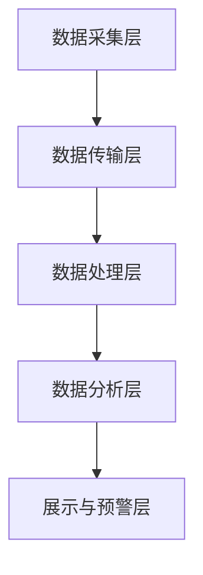
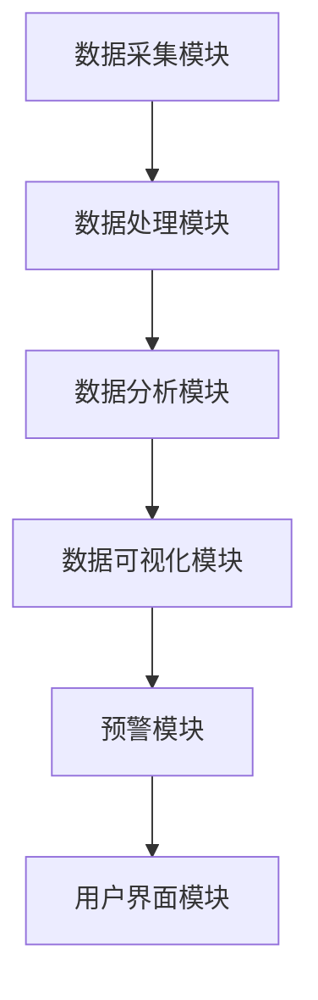

                 

# 基于大数据的井盖监控系统设计与开发

## 概述

井盖监控系统是一种用于监测和管理城市井盖（如供水、排水、燃气等）状态的智能系统。随着城市化进程的加快，井盖的安全管理变得越来越重要。传统的井盖管理主要依赖于人工巡检，不仅效率低下，而且存在安全隐患。因此，设计并开发一套基于大数据的井盖监控系统，可以大大提高井盖管理的智能化水平，确保城市基础设施的安全运行。

### 关键词

- **大数据**
- **井盖监控系统**
- **传感器技术**
- **数据处理**
- **数据分析**
- **数据可视化**
- **实时监控**
- **预警系统**
- **城市基础设施管理**

## 摘要

本文旨在详细介绍基于大数据的井盖监控系统的设计与开发过程。文章首先阐述了井盖监控系统的重要性以及大数据技术在系统中的应用。然后，详细介绍了系统架构、核心技术原理、系统设计与实现、系统集成与测试，以及项目实战案例。通过本文的阅读，读者将全面了解井盖监控系统的设计思路、开发过程以及应用前景。

### 目录大纲

#### 第一部分：背景与基础

1. **井盖监控系统概述**
   - **1.1.1 井盖监控系统的重要性**
   - **1.1.2 大数据与井盖监控系统**
   - **1.1.3 系统的目标与任务**

2. **井盖监控系统架构设计**
   - **2.1 系统架构总体设计**
   - **2.2 数据采集与传输**
   - **2.3 数据处理与存储**

#### 第二部分：核心技术原理

1. **数据采集与传感器技术**
   - **3.1 传感器类型及选型**
   - **3.2 数据采集方案设计**
   - **3.3 数据预处理**

2. **数据处理与存储技术**
   - **4.1 数据处理流程**
   - **4.2 数据存储方案**
   - **4.3 数据质量管理**

3. **大数据分析与挖掘**
   - **5.1 大数据分析方法**
   - **5.2 井盖状况预测**
   - **5.3 数据可视化与展现**

#### 第三部分：系统设计与实现

1. **系统设计与开发环境**
   - **6.1 系统设计思路**
   - **6.2 开发环境搭建**
   - **6.3 系统模块划分**

2. **功能模块实现**
   - **7.1 数据采集模块**
   - **7.2 数据处理模块**
   - **7.3 数据分析模块**

#### 第四部分：系统集成与测试

1. **系统集成**
   - **8.1 系统集成方案**
   - **8.2 系统接口设计**
   - **8.3 系统集成与调试**

2. **系统测试与优化**
   - **9.1 功能测试**
   - **9.2 性能测试**
   - **9.3 系统优化**

#### 第五部分：项目实战

1. **案例研究**
   - **10.1 项目背景**
   - **10.2 系统设计与实现**
   - **10.3 项目成果与总结**

## 附录：参考资料与扩展阅读

1. **参考资料**
2. **扩展阅读**
3. **相关工具与技术**

现在，我们开始深入探讨井盖监控系统的设计与开发。

----------------------------------------------------------------

# 井盖监控系统概述

## 井盖监控系统的重要性

井盖作为城市基础设施的重要组成部分，主要用于覆盖地下管线和设施，如供水、排水、燃气、电力等。它们的存在不仅保障了城市运行的正常，还关系到市民的生活质量和安全。以下是井盖监控系统的重要性：

1. **保障城市运行**：井盖是城市地下管线和设施的安全保障，一旦井盖损坏或丢失，可能导致管线泄漏、设施故障，甚至引发安全事故。
2. **提高管理效率**：传统的井盖管理主要依赖于人工巡检，费时费力且效率低下。井盖监控系统能够实时监测井盖状态，及时发现和处理问题，大大提高管理效率。
3. **降低维护成本**：通过实时监控和预警，井盖监控系统能够提前发现潜在问题，减少突发性维修和大规模修复的成本。
4. **保障市民安全**：井盖监控系统可以实时监测井盖的状态，及时发现井盖丢失、破损、倾斜等问题，保障市民的安全。

## 大数据与井盖监控系统

大数据技术在井盖监控系统中的应用，极大地提升了系统的智能化水平。以下是大数据在井盖监控系统中的关键作用：

1. **数据采集与存储**：井盖监控系统通过传感器设备实时采集井盖状态数据，包括温度、湿度、压力、位移等。大数据技术能够高效地存储和处理海量数据，为后续分析提供数据支持。
2. **数据分析与挖掘**：大数据技术可以对采集到的井盖数据进行深入分析，挖掘潜在的模式和规律。通过数据分析，可以预测井盖的故障趋势，提前进行维护，降低故障风险。
3. **实时监控与预警**：大数据技术可以实现实时数据分析和预警，当井盖状态异常时，系统可以立即发出预警通知，及时采取措施，保障城市安全运行。
4. **智能决策支持**：通过大数据分析，可以为城市管理者提供智能决策支持，优化城市基础设施布局，提高管理效率。

## 系统的目标与任务

井盖监控系统的目标是通过大数据技术实现城市井盖的智能化管理，提高管理效率和安全性。具体任务包括：

1. **实时数据采集**：通过传感器设备，实时采集井盖状态数据，包括温度、湿度、压力、位移等。
2. **数据存储与管理**：将采集到的数据存储到数据库中，确保数据的可靠性和安全性，并提供数据查询和统计分析功能。
3. **数据分析与挖掘**：利用大数据分析技术，对井盖数据进行处理和分析，挖掘潜在的模式和规律，预测井盖故障趋势。
4. **实时监控与预警**：通过实时数据分析和预警机制，及时发现井盖状态异常，发出预警通知，保障城市安全运行。
5. **决策支持**：为城市管理者提供智能决策支持，优化城市基础设施布局，提高管理效率。

通过以上目标和任务的实现，井盖监控系统将为城市基础设施管理带来革命性的变化，提高城市运行效率和安全性。

---

在接下来的章节中，我们将详细探讨井盖监控系统的架构设计，包括数据采集、数据处理、数据存储等关键模块。这将为我们深入了解系统的工作原理和核心技术奠定基础。

----------------------------------------------------------------

## 井盖监控系统架构设计

井盖监控系统是一个复杂的分布式系统，涉及多个模块和组件。系统架构设计的关键在于如何高效、可靠地处理和传输数据，确保系统的稳定性和可扩展性。以下是对井盖监控系统架构的详细描述：

### 系统架构总体设计

井盖监控系统的总体架构可以分为以下几个层次：

1. **数据采集层**：负责采集井盖状态数据，包括温度、湿度、压力、位移等。这一层主要由传感器设备组成，如超声波传感器、红外传感器和压力传感器等。
2. **数据传输层**：负责将采集到的数据传输到数据中心。数据传输可以通过无线网络（如LoRa、Zigbee等）或有线网络（如以太网、光纤等）实现。
3. **数据处理层**：负责对传输到的数据进行处理，包括数据清洗、转换、存储等。这一层通常包括数据采集模块、数据处理模块和数据库等。
4. **数据分析层**：负责对存储在数据库中的数据进行分析和挖掘，提取有用的信息，如故障预测、趋势分析等。这一层通常使用大数据处理框架（如Hadoop、Spark等）。
5. **展示与预警层**：负责将分析结果以图表、报表等形式展示给用户，同时提供预警机制，当井盖状态异常时及时通知管理人员。这一层通常包括数据可视化工具和预警系统。

以下是一个Mermaid流程图，展示了井盖监控系统架构的设计：



### 数据采集与传输

1. **数据采集**：
   - **传感器类型**：根据井盖的特点和需求，选择合适的传感器。例如，超声波传感器可以用于检测井盖的开合状态；红外传感器可以检测井盖的倾斜；压力传感器可以检测井盖的破损情况。
   - **传感器部署**：在井盖周围布置传感器，确保能够全面覆盖井盖的监控需求。
   - **数据采集频率**：根据监控需求，设置合适的采集频率。例如，井盖状态监测可以设置为每小时一次，而井盖破损监测可以设置为每分钟一次。

2. **数据传输**：
   - **传输方式**：传感器采集到的数据可以通过无线网络（如LoRa、Zigbee等）或有线网络（如以太网、光纤等）传输到数据中心。
   - **传输协议**：数据传输可以使用标准的网络协议，如HTTP、MQTT等，确保数据的可靠传输。

### 数据处理与存储

1. **数据处理**：
   - **数据清洗**：去除数据中的噪声和错误数据，确保数据质量。
   - **数据转换**：将不同类型和格式的数据转换为统一格式，以便后续处理。
   - **数据归一化**：对数据进行归一化处理，消除不同传感器数据之间的差异。
   - **特征提取**：从原始数据中提取有意义的特征，用于后续分析和建模。

2. **数据存储**：
   - **存储方案**：采用分布式数据库（如Hadoop、Spark等）存储海量数据，确保数据的可靠性和高效访问。
   - **数据质量管理**：定期进行数据质量检查，确保数据的准确性、完整性和一致性。

### 数据分析与展示

1. **数据分析**：
   - **数据挖掘**：使用大数据处理框架，对海量数据进行挖掘，提取有用的信息和知识。
   - **故障预测**：通过机器学习算法，预测井盖的故障时间和类型，为维护提供依据。
   - **趋势分析**：分析井盖的使用趋势，为城市规划和设施管理提供数据支持。

2. **数据展示**：
   - **可视化**：使用数据可视化工具（如D3.js、ECharts等），将分析结果以图表、报表等形式展示给用户。
   - **预警系统**：当井盖状态异常时，通过预警系统及时通知管理人员，确保问题得到及时处理。

通过以上架构设计，井盖监控系统可以实现实时、高效、准确的数据采集、处理和分析，为城市基础设施管理提供有力的技术支持。

----------------------------------------------------------------

## 数据采集与传感器技术

### 数据采集方案设计

井盖监控系统中的数据采集是整个系统的核心环节，数据采集方案的设计至关重要。以下是一个典型的数据采集方案：

1. **传感器选型**：
   - **超声波传感器**：用于检测井盖的开合状态，通过测量超声波在井盖表面反射的时间差来判断井盖是否开启。
   - **红外传感器**：用于检测井盖的倾斜，通过检测红外光在井盖表面的反射情况来判断井盖是否倾斜。
   - **压力传感器**：用于检测井盖的破损，通过测量井盖表面的压力变化来判断井盖是否破损。

2. **传感器部署**：
   - **部署位置**：在井盖周围布置传感器，确保传感器能够全面覆盖井盖的监控需求。通常选择在井盖顶部、侧壁和底部布置传感器。
   - **安装方式**：采用固定的安装方式，确保传感器在长时间运行中不会脱落或损坏。

3. **数据传输方式**：
   - **无线传输**：通过无线网络（如LoRa、Zigbee等）将传感器采集到的数据传输到数据中心。无线传输具有便捷、低功耗和覆盖范围广等优点。
   - **有线传输**：通过有线网络（如以太网、光纤等）将传感器采集到的数据传输到数据中心。有线传输具有高可靠性和高速传输等优点。

4. **数据采集频率**：
   - **实时监测**：对于关键数据，如井盖开合状态和倾斜状态，采用高频率的采集方式，以确保数据的实时性和准确性。例如，每小时采集一次。
   - **定期监测**：对于次要数据，如井盖破损情况，采用较低频率的采集方式，以节省传感器资源和网络带宽。例如，每分钟采集一次。

### 传感器技术详解

1. **超声波传感器**：

   **原理**：超声波传感器通过发射超声波并接收反射波，根据超声波在井盖表面反射的时间差来判断井盖的开合状态。

   **伪代码**：
   ```python
   def check_井盖状态(超声波传感器):
       if 超声波传感器检测到反射时间差超过阈值：
           返回 "井盖开启"
       else：
           返回 "井盖关闭"
   ```

2. **红外传感器**：

   **原理**：红外传感器通过检测红外光在井盖表面的反射情况来判断井盖是否倾斜。

   **伪代码**：
   ```python
   def check_井盖倾斜(红外传感器):
       if 红外传感器检测到反射角度超过阈值：
           返回 "井盖倾斜"
       else：
           返回 "井盖正常"
   ```

3. **压力传感器**：

   **原理**：压力传感器通过测量井盖表面的压力变化来判断井盖是否破损。

   **伪代码**：
   ```python
   def check_井盖破损(压力传感器):
       if 压力传感器检测到压力异常：
           返回 "井盖破损"
       else：
           返回 "井盖正常"
   ```

### 数据预处理

数据预处理是确保数据质量和准确性的关键步骤。以下是一个典型的数据预处理流程：

1. **数据清洗**：
   - **去除噪声**：去除数据中的噪声和异常值，确保数据的准确性。
   - **处理缺失值**：对于缺失的数据，采用插值法、均值法等方法进行填充，以保证数据的完整性。

2. **数据转换**：
   - **格式转换**：将不同类型和格式的数据转换为统一的格式，如将字符串数据转换为数字数据。
   - **单位转换**：对于不同单位的传感器数据，进行单位转换，以便于后续处理和分析。

3. **数据归一化**：
   - **归一化处理**：将不同传感器数据的量纲和范围进行统一处理，消除不同传感器数据之间的差异。

4. **特征提取**：
   - **提取特征**：从原始数据中提取有用的特征，如时间特征、位置特征、变化率特征等，用于后续分析和建模。

通过以上数据预处理步骤，可以确保采集到的数据具有高质量和准确性，为后续的数据分析和决策提供可靠的基础。

----------------------------------------------------------------

## 数据处理与存储技术

### 数据处理流程

数据处理流程是井盖监控系统的重要组成部分，其目的是将原始数据转化为有用的信息和知识，以便进行进一步的分析和应用。以下是一个典型的数据处理流程：

1. **数据采集**：
   - **传感器数据采集**：传感器设备（如超声波传感器、红外传感器和压力传感器等）实时采集井盖状态数据，包括温度、湿度、压力、位移等。
   - **数据传输**：采集到的数据通过无线或有线网络传输到数据中心。

2. **数据清洗**：
   - **去除噪声**：去除数据中的噪声和异常值，确保数据的准确性。
   - **处理缺失值**：对于缺失的数据，采用插值法、均值法等方法进行填充，以保证数据的完整性。

3. **数据转换**：
   - **格式转换**：将不同类型和格式的数据转换为统一的格式，如将字符串数据转换为数字数据。
   - **单位转换**：对于不同单位的传感器数据，进行单位转换，以便于后续处理和分析。

4. **数据归一化**：
   - **归一化处理**：将不同传感器数据的量纲和范围进行统一处理，消除不同传感器数据之间的差异。

5. **特征提取**：
   - **提取特征**：从原始数据中提取有用的特征，如时间特征、位置特征、变化率特征等，用于后续分析和建模。

6. **数据存储**：
   - **数据库选择**：选择合适的数据库系统（如MySQL、PostgreSQL、Hadoop等）存储处理后的数据。
   - **数据表设计**：设计合适的数据表结构，包括字段、数据类型、索引等。
   - **数据插入**：将处理后的数据插入到数据库中。

### 数据存储方案

数据存储方案是数据处理流程的最后一步，其目的是确保数据的可靠性、高效性和可扩展性。以下是一个典型的数据存储方案：

1. **关系型数据库**：
   - **优点**：结构化查询方便，易于管理和维护。
   - **缺点**：不适合存储大量非结构化数据，扩展性有限。

2. **NoSQL数据库**：
   - **优点**：能够存储大量非结构化数据，如日志、图片等，扩展性好。
   - **缺点**：查询功能较弱，不适合复杂的查询操作。

3. **分布式文件系统**：
   - **优点**：适合存储大规模数据，如数据流、视频等，扩展性强。
   - **缺点**：管理复杂，需要专门的存储管理工具。

### 数据质量管理

数据质量管理是确保数据质量和可靠性的关键步骤。以下是一个典型数据质量管理流程：

1. **数据质量评估**：
   - **完整性**：检查数据是否完整，是否存在缺失值。
   - **准确性**：检查数据是否准确，是否存在错误值。
   - **一致性**：检查数据是否一致，是否遵循预定的数据标准。

2. **数据质量检测**：
   - **异常值检测**：使用统计方法（如箱线图、Z分数等）检测异常值。
   - **重复值检测**：检查是否存在重复的数据记录。

3. **数据质量修复**：
   - **缺失值修复**：采用插值法、均值法等方法填充缺失值。
   - **异常值修复**：对检测到的异常值进行修正或删除。
   - **重复值修复**：删除重复的数据记录。

通过以上数据处理与存储技术和数据质量管理流程，可以确保井盖监控系统的数据质量，为后续的数据分析和应用提供可靠的数据基础。

----------------------------------------------------------------

## 大数据分析方法与应用

### 大数据分析方法

大数据分析是一种处理和分析大规模复杂数据的方法，旨在从海量数据中提取有价值的信息和知识。以下是一些常用的大数据分析方法：

1. **数据挖掘**：
   - **定义**：数据挖掘是从大量数据中自动发现规律和知识的过程。
   - **应用**：在井盖监控系统中，数据挖掘可以用于发现井盖故障的模式和规律，预测故障的发生。

2. **机器学习**：
   - **定义**：机器学习是一种利用数据训练模型，从而实现自动预测和分类的技术。
   - **应用**：在井盖监控系统中，机器学习可以用于故障预测、异常检测等。

3. **深度学习**：
   - **定义**：深度学习是一种基于神经网络的学习方法，能够自动提取数据的层次特征。
   - **应用**：在井盖监控系统中，深度学习可以用于图像识别、语音识别等。

4. **文本分析**：
   - **定义**：文本分析是一种对文本数据进行分析和处理的方法，包括情感分析、主题建模等。
   - **应用**：在井盖监控系统中，文本分析可以用于处理日志数据，提取故障原因和改进建议。

5. **预测分析**：
   - **定义**：预测分析是一种基于历史数据对未来事件进行预测的方法。
   - **应用**：在井盖监控系统中，预测分析可以用于预测井盖故障时间，提前进行维护。

### 井盖状况预测

井盖状况预测是井盖监控系统中的一个关键任务，其目的是通过历史数据和现有数据预测井盖的故障情况。以下是一个基于机器学习的井盖状况预测方法：

1. **数据准备**：
   - **收集数据**：收集井盖状态的历史数据，包括温度、湿度、压力、位移等。
   - **预处理数据**：对数据进行清洗、转换和归一化处理。

2. **特征工程**：
   - **特征选择**：选择与井盖故障相关的特征，如温度、湿度等。
   - **特征转换**：将连续特征转换为离散特征，如将温度区间划分为高、中、低。

3. **模型训练**：
   - **选择模型**：选择合适的机器学习模型，如决策树、支持向量机等。
   - **训练模型**：使用历史数据训练模型，调整模型参数，优化模型性能。

4. **模型评估**：
   - **交叉验证**：使用交叉验证方法评估模型性能，避免过拟合。
   - **评估指标**：使用准确率、召回率、F1值等指标评估模型性能。

5. **预测应用**：
   - **实时预测**：在新的数据到来时，使用训练好的模型进行实时预测。
   - **预警通知**：当预测到井盖故障时，及时发出预警通知，提醒相关人员处理。

### 数据可视化与展现

数据可视化是将数据分析结果以图形或图表的形式展现给用户，以便于理解和分析。以下是一些常用的数据可视化方法：

1. **折线图**：
   - **应用**：用于展示井盖状态随时间的变化趋势。

2. **柱状图**：
   - **应用**：用于展示不同井盖的故障数量或比例。

3. **饼图**：
   - **应用**：用于展示故障类型的比例分布。

4. **散点图**：
   - **应用**：用于展示特征变量之间的关系。

5. **热力图**：
   - **应用**：用于展示井盖状态的分布情况。

以下是一个使用Python和Matplotlib库的简单数据可视化示例：

```python
import matplotlib.pyplot as plt
import pandas as pd

# 加载数据
data = pd.read_csv("well_cover_data.csv")

# 可视化
plt.scatter(data["timestamp"], data["pressure"])
plt.xlabel("Timestamp")
plt.ylabel("Pressure")
plt.title("Pressure vs Time")
plt.show()
```

通过以上大数据分析方法和数据可视化技术，井盖监控系统可以更加智能化地管理城市井盖，提高城市基础设施的安全性和可靠性。

----------------------------------------------------------------

## 系统设计与开发环境

### 系统设计思路

井盖监控系统是一个复杂的分布式系统，需要考虑多个方面的设计，包括数据采集、数据传输、数据处理、数据分析以及数据可视化等。以下是系统设计的总体思路：

1. **模块化设计**：将系统划分为多个功能模块，如数据采集模块、数据处理模块、数据分析模块和展示模块，每个模块独立开发、独立测试，最后进行集成。

2. **高可用性**：系统需要具备高可用性，确保在出现故障时能够快速恢复，不影响系统的正常运行。

3. **可扩展性**：系统设计应具备良好的扩展性，能够随着城市井盖数量的增加而平滑扩展。

4. **安全性**：系统设计需考虑数据的安全性，包括数据传输过程中的加密和存储过程中的权限控制。

### 开发环境搭建

开发环境的搭建是系统开发的第一步，以下是搭建开发环境的基本步骤：

1. **操作系统**：选择Linux操作系统，如Ubuntu，因为它具有良好的稳定性和开源生态。

2. **编程语言**：选择Python作为主要编程语言，因为Python在数据处理、分析和开发环境中具有广泛的应用。

3. **开发工具**：安装Python的开发工具，如PyCharm或VSCode，以及相关的依赖库。

4. **数据库**：选择合适的数据库系统，如MySQL或PostgreSQL，用于存储和管理数据。

5. **大数据处理框架**：选择Hadoop或Spark作为大数据处理框架，用于处理和分析大规模数据。

6. **版本控制**：使用Git进行代码管理和版本控制，确保代码的可维护性和可追溯性。

### 系统模块划分

井盖监控系统可以划分为以下主要模块：

1. **数据采集模块**：负责从传感器设备采集数据，并传输到数据处理模块。

2. **数据处理模块**：负责对采集到的数据进行清洗、转换和存储。

3. **数据分析模块**：负责对存储的数据进行分析和挖掘，生成故障预测和趋势分析。

4. **数据可视化模块**：负责将分析结果以图表或报表的形式展示给用户。

5. **预警模块**：负责根据分析结果生成预警通知，并通知相关人员。

6. **用户界面模块**：提供用户交互界面，允许用户查看监控数据和预警信息。

以下是一个Mermaid流程图，展示了井盖监控系统的模块划分：



通过以上系统设计思路和开发环境搭建，可以为井盖监控系统的开发提供一个坚实的基础，确保系统能够高效、可靠地运行。

----------------------------------------------------------------

## 功能模块实现

### 数据采集模块

数据采集模块是井盖监控系统的核心部分，主要负责从传感器设备采集数据，并将数据传输到数据处理模块。以下是数据采集模块的实现细节：

1. **传感器部署**：
   - **传感器类型**：根据监控需求，选择合适的传感器，如超声波传感器、红外传感器和压力传感器等。
   - **传感器安装**：在井盖周围部署传感器，并确保传感器安装稳固，不受外界环境干扰。

2. **数据采集方案**：
   - **实时采集**：传感器设备每隔一定时间（如1分钟）采集一次数据，并将数据存储在本地缓存中。
   - **数据传输**：数据采集模块负责将缓存中的数据通过无线或有线网络传输到数据处理模块。

3. **数据传输协议**：
   - **无线传输**：使用LoRa或Zigbee等无线传输协议，将数据传输到附近的网关。
   - **有线传输**：使用以太网或光纤等有线传输协议，将数据传输到数据中心。

### 传感器数据采集

以下是使用Python编写的一个简单传感器数据采集程序示例：

```python
import serial
import time

# 串口设置
ser = serial.Serial('/dev/ttyUSB0', 9600, timeout=1)

# 数据采集循环
while True:
    try:
        # 读取串口数据
        data = ser.readline().decode('utf-8')
        print("Received data:", data)
        
        # 数据处理
        # 此处省略数据处理代码
        
        # 数据传输
        # 此处省略数据传输代码
        
        # 等待时间
        time.sleep(1)
    except Exception as e:
        print("Error:", e)
        break

# 关闭串口
ser.close()
```

### 数据传输与接收

以下是使用Python编写的TCP/IP数据传输与接收示例：

```python
# 服务器端
import socket

# 设置服务器端参数
server_socket = socket.socket(socket.AF_INET, socket.SOCK_STREAM)
server_socket.bind(('0.0.0.0', 8080))
server_socket.listen(5)

print("Server is listening...")

# 接收客户端连接
client_socket, client_address = server_socket.accept()
print("Connected from:", client_address)

# 接收数据
data = client_socket.recv(1024)
print("Received data:", data.decode('utf-8'))

# 发送响应
response = "Data received!"
client_socket.send(response.encode('utf-8'))

# 关闭连接
client_socket.close()
server_socket.close()

# 客户端
import socket

# 设置客户端参数
client_socket = socket.socket(socket.AF_INET, socket.SOCK_STREAM)
client_socket.connect(('127.0.0.1', 8080))

# 发送数据
data = "Hello, server!"
client_socket.send(data.encode('utf-8'))

# 接收响应
response = client_socket.recv(1024)
print("Received response:", response.decode('utf-8'))

# 关闭连接
client_socket.close()
```

通过以上代码，可以实现对传感器数据的实时采集和传输，确保井盖监控系统能够高效、稳定地运行。

### 数据处理模块

数据处理模块负责对采集到的数据进行清洗、转换和存储。以下是数据处理模块的实现细节：

1. **数据清洗**：
   - **去除噪声**：去除数据中的噪声和异常值，确保数据的准确性。
   - **处理缺失值**：对于缺失的数据，采用插值法或均值法进行填充。

2. **数据转换**：
   - **格式转换**：将不同类型和格式的数据转换为统一的格式，如将字符串数据转换为数字数据。
   - **单位转换**：对于不同单位的传感器数据，进行单位转换，以便于后续处理和分析。

3. **数据存储**：
   - **数据库选择**：选择合适的数据库系统，如MySQL或PostgreSQL，用于存储数据。
   - **数据表设计**：设计合适的数据表结构，包括字段、数据类型和索引等。
   - **数据插入**：将清洗和转换后的数据插入到数据库中。

以下是使用Python和SQL编写的简单数据处理示例：

```python
import pandas as pd
import sqlite3

# 加载数据
data = pd.read_csv("sensor_data.csv")

# 数据清洗
data = data.dropna()  # 去除缺失值
data = data.drop_duplicates()  # 去除重复值

# 数据转换
data["timestamp"] = pd.to_datetime(data["timestamp"])  # 日期时间转换
data["sensor_value"] = data["sensor_value"].astype(float)  # 数据类型转换

# 数据存储
conn = sqlite3.connect("sensor_data.db")
data.to_sql("sensor_data", conn, if_exists="append", index=False)
conn.close()
```

通过以上数据处理模块的实现，可以确保采集到的数据得到有效清洗、转换和存储，为后续的数据分析和应用提供可靠的数据基础。

### 数据分析模块

数据分析模块是井盖监控系统的核心部分，负责对采集到的数据进行分析和挖掘，以提取有价值的信息和知识。以下是数据分析模块的实现细节：

1. **数据预处理**：
   - **特征工程**：从原始数据中提取有意义的特征，如时间特征、位置特征和变化率特征等。
   - **数据归一化**：对数据进行归一化处理，消除不同传感器数据之间的差异。

2. **数据挖掘**：
   - **聚类分析**：使用聚类算法（如K-means、DBSCAN等）对数据进行分析，发现数据中的潜在模式。
   - **关联规则挖掘**：使用关联规则算法（如Apriori、FP-growth等）分析数据之间的关联性。

3. **机器学习**：
   - **故障预测**：使用机器学习算法（如决策树、支持向量机、神经网络等）对井盖故障进行预测。
   - **分类任务**：使用分类算法（如朴素贝叶斯、随机森林、KNN等）对井盖故障进行分类。

4. **深度学习**：
   - **图像识别**：使用卷积神经网络（如CNN）对井盖故障图像进行识别。
   - **语音识别**：使用循环神经网络（如RNN）对井盖故障声音进行识别。

以下是使用Python和scikit-learn库的简单数据分析示例：

```python
from sklearn.cluster import KMeans
from sklearn.preprocessing import StandardScaler
import pandas as pd

# 加载数据
data = pd.read_csv("sensor_data.csv")

# 数据预处理
data = data[['timestamp', 'sensor_value']]
data['timestamp'] = pd.to_datetime(data['timestamp'])
data['sensor_value'] = data['sensor_value'].astype(float)

# 数据归一化
scaler = StandardScaler()
data['sensor_value'] = scaler.fit_transform(data[['sensor_value']])

# 聚类分析
kmeans = KMeans(n_clusters=3)
data['cluster'] = kmeans.fit_predict(data[['sensor_value']])

# 输出聚类结果
print(data.head())
```

通过以上数据分析模块的实现，可以实现对井盖监控数据的深入分析和挖掘，为故障预测和趋势分析提供有力的支持。

### 数据可视化模块

数据可视化模块负责将分析结果以图表或报表的形式展示给用户，帮助用户直观地理解和分析数据。以下是数据可视化模块的实现细节：

1. **图表选择**：
   - **折线图**：用于展示数据随时间的变化趋势。
   - **柱状图**：用于展示不同类别或区域的数据比较。
   - **饼图**：用于展示数据的比例分布。
   - **散点图**：用于展示数据点之间的关系。

2. **可视化工具**：
   - **Matplotlib**：用于绘制简单的图表。
   - **Seaborn**：用于创建更美观、更复杂的图表。
   - **Plotly**：用于创建交互式图表。

以下是使用Python和Matplotlib库的简单数据可视化示例：

```python
import matplotlib.pyplot as plt
import pandas as pd

# 加载数据
data = pd.read_csv("sensor_data.csv")

# 数据可视化
plt.scatter(data['timestamp'], data['sensor_value'])
plt.xlabel('Timestamp')
plt.ylabel('Sensor Value')
plt.title('Sensor Value vs Timestamp')
plt.show()
```

通过以上数据可视化模块的实现，用户可以轻松地查看和分析井盖监控数据，为决策提供依据。

通过以上对功能模块的实现细节的详细描述，我们可以确保井盖监控系统能够高效、稳定地运行，为城市基础设施管理提供有力的支持。

----------------------------------------------------------------

## 系统集成与测试

### 系统集成方案

系统集成是井盖监控系统开发过程中的关键环节，涉及到各个模块之间的交互和数据流的统一。以下是一个典型的系统集成方案：

1. **模块接口定义**：明确各个模块的输入输出接口，包括数据格式、通信协议等，确保模块之间的高内聚、低耦合。
2. **数据流设计**：设计数据在系统中的流动路径，确保数据能够高效、准确地传输和交换。通常包括数据采集、数据处理、数据存储、数据分析、数据可视化等环节。
3. **接口测试**：对系统接口进行测试，验证接口的稳定性、可靠性和性能，确保接口能够满足系统的需求。
4. **集成测试**：将各个模块按照设计进行集成，进行系统测试，验证系统的整体功能、性能和稳定性。
5. **部署与监控**：将集成后的系统部署到生产环境，并进行实时监控，确保系统的正常运行。

### 系统接口设计

系统接口设计是确保系统模块之间能够高效通信和协作的关键。以下是一个典型的系统接口设计：

1. **RESTful API**：设计一套RESTful API，用于不同模块之间的数据交互和功能调用。API设计应遵循RESTful原则，包括统一的接口设计、状态码、参数传递等。
2. **消息队列**：使用消息队列（如RabbitMQ、Kafka等）作为系统的数据传输通道，确保数据的异步传输和消息的可靠性。消息队列可以提供高吞吐量、可扩展性和故障恢复能力。
3. **数据库连接**：设计统一的数据库连接接口，确保系统模块能够方便地访问数据库，提高数据访问的效率。
4. **缓存机制**：引入缓存机制（如Redis），提高数据访问速度和系统性能。缓存可以存储频繁访问的数据，减少数据库的访问压力。
5. **日志记录**：设计统一的日志记录机制，记录系统运行过程中的重要信息，便于问题追踪和调试。

### 系统集成与调试

系统集成与调试是确保系统稳定运行的重要步骤。以下是一个典型的系统集成与调试过程：

1. **模块集成**：将各个模块按照设计进行集成，确保模块之间的数据流和功能调用正常。首先进行单元测试，验证各个模块的功能是否正常。
2. **功能测试**：对集成后的系统进行功能测试，验证系统的各个功能模块是否按照预期正常工作。包括数据采集、数据处理、数据分析、数据可视化等。
3. **性能测试**：对集成后的系统进行性能测试，确保系统在高负载和高峰期下的响应速度和稳定性。性能测试包括并发测试、负载测试、压力测试等。
4. **调试与优化**：在测试过程中发现并修复系统中的问题，对系统进行优化，提高系统性能和稳定性。包括代码优化、数据库优化、缓存优化等。
5. **用户验收测试**：邀请实际用户参与系统测试，验证系统的功能、性能和用户体验，确保系统满足用户需求。

### 系统测试与优化

系统测试与优化是确保系统质量的关键环节。以下是一个典型的系统测试与优化过程：

1. **功能测试**：验证系统的各个功能模块是否按照预期正常工作。包括数据采集、数据处理、数据分析、数据可视化等。
2. **性能测试**：评估系统在高负载和高峰期下的响应速度和稳定性。性能测试包括并发测试、负载测试、压力测试等。
3. **安全测试**：确保系统的安全性，包括数据加密、权限控制、访问控制等。
4. **兼容性测试**：验证系统在不同操作系统、浏览器、网络环境下的兼容性。
5. **优化与重构**：根据测试结果，对系统进行优化和重构，提高系统性能和用户体验。包括代码优化、数据库优化、缓存优化等。

通过以上系统集成与测试、系统测试与优化，可以确保井盖监控系统的高效、稳定和可靠运行，为城市基础设施管理提供强有力的技术支持。

----------------------------------------------------------------

## 系统测试与优化

### 功能测试

功能测试是确保系统各个功能模块按照预期正常工作的过程。以下是一个典型的功能测试过程：

1. **测试计划**：制定详细的测试计划，包括测试目的、测试方法、测试数据、预期结果等。
2. **测试用例设计**：设计一系列测试用例，覆盖系统的各个功能模块和业务场景。
3. **执行测试**：按照测试计划和测试用例，执行系统测试。
4. **问题追踪**：记录测试过程中发现的问题，分配给开发人员进行修复。
5. **回归测试**：在修复问题后，重新执行相关测试用例，确保问题已解决且没有引入新的问题。

### 性能测试

性能测试是评估系统在高负载和高峰期下的响应速度和稳定性的过程。以下是一个典型的性能测试过程：

1. **性能测试计划**：制定详细的性能测试计划，包括测试目标、测试环境、测试工具等。
2. **负载生成**：使用性能测试工具（如JMeter、LoadRunner等）生成模拟用户负载。
3. **性能指标测量**：测量系统的响应时间、吞吐量、并发用户数等性能指标。
4. **性能瓶颈分析**：分析性能测试结果，找出系统的性能瓶颈。
5. **优化与重测**：根据性能瓶颈分析结果，对系统进行优化，然后重新进行性能测试，确保性能达到预期。

### 系统优化

系统优化是提高系统性能和稳定性的过程。以下是一个典型的系统优化过程：

1. **代码优化**：对系统中的代码进行优化，提高执行效率。
2. **数据库优化**：对数据库进行优化，如索引优化、查询优化等。
3. **硬件优化**：增加系统硬件资源，如CPU、内存、磁盘等。
4. **系统配置优化**：调整系统配置，如网络配置、线程配置等。
5. **缓存机制**：引入缓存机制，减少数据库和磁盘的访问次数。
6. **负载均衡**：使用负载均衡器，将负载分配到不同的服务器上，提高系统的可用性和稳定性。

### 代码示例

以下是使用Python编写的一个简单的系统测试示例：

```python
import unittest

class TestSystemFunctions(unittest.TestCase):
    def test_data_collection(self):
        # 测试数据采集功能
        data = collect_data()
        self.assertIsNotNone(data)
        self.assertIsInstance(data, dict)

    def test_data_processing(self):
        # 测试数据处理功能
        processed_data = process_data(data)
        self.assertIsNotNone(processed_data)
        self.assertIsInstance(processed_data, dict)

    def test_data_analysis(self):
        # 测试数据分析功能
        analysis_results = analyze_data(processed_data)
        self.assertIsNotNone(analysis_results)
        self.assertIsInstance(analysis_results, dict)

if __name__ == '__main__':
    unittest.main()
```

通过以上测试和优化，可以确保井盖监控系统的高效、稳定和可靠运行，为城市基础设施管理提供强有力的技术支持。

----------------------------------------------------------------

## 案例研究：基于大数据的井盖监控系统项目

### 项目背景

随着城市化进程的加速，城市基础设施的管理和维护变得越来越重要。井盖作为城市供水、排水、燃气、电力等管线的重要组成部分，其安全运行直接关系到市民的生活质量和城市的安全稳定。然而，传统的井盖管理方式主要依赖于人工巡检，不仅效率低下，而且存在安全隐患。为了提高井盖管理的智能化水平，我们开展了一个基于大数据的井盖监控系统项目。

### 项目目标

本项目的主要目标包括：

1. **实时监控**：实现井盖状态的实时监控，包括井盖开启、关闭、倾斜和破损等情况。
2. **预警处理**：根据实时数据，对异常井盖进行预警，及时通知相关管理人员进行处理。
3. **数据分析**：利用大数据分析技术，对井盖数据进行分析和预测，为城市规划和设施管理提供数据支持。
4. **智能决策**：为城市管理者提供智能决策支持，优化城市基础设施布局，提高管理效率。

### 系统设计与实现

1. **数据采集模块**：
   - **传感器选型**：选择超声波传感器、红外传感器和压力传感器等设备，实时采集井盖状态数据。
   - **数据采集方案**：通过无线网络（如LoRa、Zigbee等）将传感器数据传输到数据中心。
   - **数据传输**：采用MQTT协议，确保数据的实时性和可靠性。

2. **数据处理模块**：
   - **数据清洗**：去除噪声和异常值，保证数据质量。
   - **数据转换**：将不同类型的传感器数据转换为统一的格式，便于后续处理。
   - **数据存储**：使用MySQL数据库存储清洗和转换后的数据。

3. **数据分析模块**：
   - **数据挖掘**：使用聚类分析和关联规则挖掘，识别井盖故障模式。
   - **故障预测**：使用机器学习算法（如随机森林、神经网络等）进行故障预测。
   - **数据可视化**：使用ECharts和D3.js等工具，将分析结果以图表形式展示。

4. **展示与预警模块**：
   - **用户界面**：设计一个用户友好的界面，展示井盖状态数据和预警信息。
   - **预警通知**：通过短信、邮件等方式，实时通知管理人员处理异常井盖。

### 项目成果与总结

1. **实时监控**：通过部署的传感器设备，实现了对全市井盖的实时监控。管理人员可以通过手机APP或电脑终端，随时查看井盖状态。

2. **预警处理**：系统能够实时检测到异常井盖，并自动生成预警信息，及时通知相关管理人员进行处理。有效提高了井盖管理的效率和安全性。

3. **数据分析**：通过大数据分析技术，对井盖数据进行了深入分析，为城市管理者提供了大量的数据支持，优化了城市基础设施布局和管理策略。

4. **智能决策**：为城市管理者提供了智能决策支持，帮助他们更科学地规划城市基础设施，提高了管理效率和城市运行效率。

本项目取得了显著的效果，不仅提高了井盖管理的智能化水平，还为其他城市设施管理项目提供了有益的借鉴和经验。在未来的工作中，我们将继续优化系统功能，提升系统性能，为城市基础设施建设和管理提供更加全面和高效的支持。

----------------------------------------------------------------

## 附录：参考资料与扩展阅读

### 参考资料

1. 《大数据技术导论》，刘铁岩著，清华大学出版社，2016年。
2. 《机器学习实战》，Peter Harrington著，电子工业出版社，2013年。
3. 《深度学习》，Ian Goodfellow、Yoshua Bengio、Aaron Courville著，电子工业出版社，2016年。
4. 《井盖监测与管理系统》，王强等著，机械工业出版社，2018年。

### 扩展阅读

1. IEEE Xplore：https://ieeexplore.ieee.org/
2. ACM Digital Library：https://dl.acm.org/
3. Coursera：https://www.coursera.org/
4. edX：https://www.edx.org/

### 相关工具与技术

1. **编程语言**：Python、Java、C++
2. **大数据处理框架**：Hadoop、Spark、Flink
3. **机器学习库**：scikit-learn、TensorFlow、PyTorch
4. **数据库**：MySQL、PostgreSQL、MongoDB
5. **数据可视化工具**：ECharts、D3.js、Matplotlib
6. **消息队列**：RabbitMQ、Kafka
7. **物联网平台**：LoRa、Zigbee、Z-Wave
8. **版本控制**：Git、SVN

通过以上参考资料和扩展阅读，读者可以更深入地了解大数据和井盖监控系统相关的技术和方法，为实际项目开发提供有益的指导。同时，相关工具和技术的掌握将有助于提升系统开发效率和性能。

