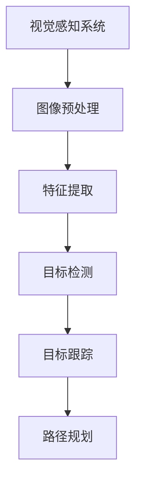

                 

### 文章标题

> 关键词：(复杂城市自动驾驶、视觉感知、鲁棒性、目标检测、路径规划)

**摘要：**
本文将深入探讨复杂城市自动驾驶中视觉感知鲁棒性面临的挑战及其应对策略。文章首先概述了复杂城市自动驾驶的定义、背景和发展趋势，接着详细讲解了视觉感知的核心概念与联系，包括图像处理基础、视觉感知原理架构以及常见视觉感知算法。随后，本文分析了视觉感知鲁棒性在复杂城市环境下的重要性，以及光照变化、天气影响和道路障碍物等因素对视觉感知的挑战。在此基础上，文章提出了提升视觉感知鲁棒性的方法，包括数据增强和算法优化。随后，本文介绍了视觉感知鲁棒性的评估指标和实验设计，并通过一个实际项目实战展示了如何在实际中应对视觉感知鲁棒性的挑战。最后，文章总结了主要成果，指出了存在的问题与改进方向，并对未来发展趋势与挑战进行了展望。

### 第一部分：复杂城市自动驾驶的视觉感知鲁棒性挑战及应对

#### 第1章：复杂城市自动驾驶概述

##### 1.1 复杂城市自动驾驶的定义与背景

复杂城市自动驾驶是指自动驾驶车辆在城市复杂环境中，通过感知、决策和执行等过程，实现自主行驶的技术。它涵盖了多种技术和学科，包括计算机视觉、机器学习、控制理论、传感器技术等。随着人工智能技术的不断发展，自动驾驶汽车已经成为未来智能交通系统的重要组成部分。

复杂城市自动驾驶的背景可以追溯到20世纪80年代，当时以通用电气、福特、大众等为代表的跨国公司开始进行自动驾驶技术的研发。进入21世纪，随着深度学习、传感器融合等技术的突破，自动驾驶汽车逐渐进入实际应用阶段。例如，谷歌的自动驾驶汽车项目（Waymo）和特斯拉的自动驾驶系统（Autopilot）已经在全球多个城市开展了实际道路测试。

##### 1.2 复杂城市自动驾驶的发展现状与趋势

当前，复杂城市自动驾驶技术已经取得了显著的进展。自动驾驶车辆在道路识别、障碍物检测、路径规划等方面已经具备较高的准确性。然而，由于城市环境的复杂性和不确定性，自动驾驶车辆在视觉感知方面仍然面临着诸多挑战。

发展现状方面，各国政府和科技企业纷纷加大对自动驾驶技术的投入。例如，美国、中国、欧盟等国家在政策和资金方面给予了自动驾驶技术大力支持。与此同时，自动驾驶技术正在逐步从实验阶段转向商业化应用。例如，Waymo已经开始在美国部分地区提供自动驾驶出租车服务，特斯拉的Autopilot系统也在全球范围内积累了大量用户。

趋势方面，未来复杂城市自动驾驶将呈现出以下几个特点：

1. **智能感知系统的发展**：随着传感器技术的进步，自动驾驶车辆将配备更高精度、更高分辨率的传感器，如激光雷达、高分辨率摄像头等，以实现更精准的视觉感知。

2. **多模态感知融合**：单一的感知技术难以应对复杂多变的城市环境，未来自动驾驶车辆将采用多模态感知融合技术，将视觉、雷达、超声波等多种传感器数据融合，以提高感知系统的鲁棒性。

3. **自主决策与协同控制**：自动驾驶车辆将具备更强的自主决策能力，同时与其他车辆、行人、基础设施等进行实时通信与协同控制，以提高交通效率和安全性。

4. **标准化与规范化**：随着自动驾驶技术的发展，各国政府和企业将加大对自动驾驶技术的标准化与规范化力度，以确保自动驾驶车辆在不同地区、不同环境下的一致性和可靠性。

##### 1.3 视觉感知在自动驾驶中的作用

视觉感知是自动驾驶系统的重要组成部分，主要负责对周围环境进行感知，识别道路、车辆、行人、障碍物等目标，并据此生成驾驶决策。视觉感知在自动驾驶中的作用主要体现在以下几个方面：

1. **道路识别**：自动驾驶车辆需要准确识别道路边界、车道线、道路标志等，以确保行驶在正确的道路上。

2. **目标检测**：自动驾驶车辆需要检测并识别周围的车辆、行人、障碍物等目标，以避免碰撞和交通事故。

3. **路径规划**：基于视觉感知的结果，自动驾驶车辆需要生成合理的行驶路径，以实现安全、高效的驾驶。

4. **环境理解**：通过视觉感知，自动驾驶车辆可以对周围环境进行理解，包括交通状况、道路条件等，为驾驶决策提供支持。

总之，视觉感知在自动驾驶中起着至关重要的作用，是自动驾驶系统实现自主驾驶的关键技术之一。然而，由于复杂城市环境中的光照变化、天气影响和道路障碍物等因素，视觉感知面临着诸多挑战，需要不断改进和优化。

#### 第2章：视觉感知核心概念与联系

##### 2.1 图像处理基础

图像处理是视觉感知的重要基础，它包括图像基础概念、图像滤波和图像边缘检测等几个方面。

###### 2.1.1 图像基础概念

图像是视觉感知的基本输入，它是通过对现实世界中的场景进行数字化和编码得到的。图像由像素组成，每个像素具有特定的颜色和亮度信息。图像的基础概念包括像素、分辨率、颜色空间、图像格式等。

- **像素**：像素是图像的基本组成单位，每个像素都包含颜色和亮度信息。
- **分辨率**：分辨率是指图像的像素数量，通常用宽度和高度表示，如1920x1080表示1920个像素宽和1080个像素高。
- **颜色空间**：颜色空间是表示图像颜色信息的数学模型，常见的颜色空间包括RGB、HSV、YUV等。
- **图像格式**：图像格式是图像数据存储和传输的格式，常见的图像格式包括JPEG、PNG、BMP等。

###### 2.1.2 图像滤波

图像滤波是图像处理中的一个重要步骤，它用于去除图像中的噪声、平滑图像等。常见的图像滤波方法包括：

- **均值滤波**：均值滤波是一种简单的图像滤波方法，它通过计算每个像素周围的邻域像素的平均值来平滑图像。
- **高斯滤波**：高斯滤波是一种基于高斯分布的图像滤波方法，它可以有效地去除图像中的高频噪声。
- **中值滤波**：中值滤波是一种基于中值操作的图像滤波方法，它通过计算每个像素周围的邻域像素的中值来平滑图像。

###### 2.1.3 图像边缘检测

图像边缘检测是图像处理中的一个重要任务，它用于检测图像中的边缘和轮廓。常见的图像边缘检测算法包括：

- **Sobel算子**：Sobel算子是一种基于卷积的边缘检测算法，它通过计算图像梯度的幅度和方向来检测边缘。
- **Canny算子**：Canny算子是一种基于边缘检测的算法，它通过计算图像梯度的幅度和方向，并结合非极大值抑制和双阈值处理来检测边缘。

##### 2.2 视觉感知原理架构 Mermaid 流程图

视觉感知系统是一个复杂的过程，它包括图像预处理、特征提取、目标检测、目标跟踪和路径规划等几个步骤。以下是视觉感知原理的 Mermaid 流程图：



在这个流程图中，图像预处理是视觉感知的第一步，它通过滤波和边缘检测等操作对图像进行预处理。特征提取是第二步，它从预处理后的图像中提取有用的特征信息。目标检测是第三步，它通过识别图像中的目标对象，如车辆、行人等。目标跟踪是第四步，它通过跟踪目标对象的位置和运动状态，以便进行路径规划。路径规划是最后一步，它根据视觉感知的结果生成合理的行驶路径。

通过这个流程图，我们可以清晰地了解视觉感知系统的整体架构和各个步骤之间的联系。

##### 2.3 常见视觉感知算法

在视觉感知系统中，常见的算法包括基于深度学习和基于传统机器学习的算法。这些算法各有优缺点，适用于不同的应用场景。

###### 2.3.1 基于深度学习的目标检测算法

基于深度学习的目标检测算法是目前视觉感知领域的主流方法。这些算法通过训练大规模的神经网络模型，可以从大量图像数据中自动提取特征并识别目标。常见的基于深度学习的目标检测算法包括：

- **YOLO（You Only Look Once）**：YOLO算法是一种单步目标检测算法，它通过将图像分成多个网格单元，并在每个单元中预测目标的类别和边界框，从而实现快速目标检测。
- **SSD（Single Shot MultiBox Detector）**：SSD算法是一种基于单阶段检测器的目标检测算法，它通过使用不同尺寸的卷积核来提取不同层次的特征，从而实现多尺度目标检测。
- **Faster R-CNN（Region-based Convolutional Neural Network）**：Faster R-CNN算法是一种基于区域建议的目标检测算法，它通过区域建议网络（RPN）生成候选区域，并使用分类网络进行目标分类。

这些算法在处理复杂城市自动驾驶中的视觉感知任务时，具有较好的性能和鲁棒性。

###### 2.3.2 基于传统机器学习的目标检测算法

基于传统机器学习的目标检测算法在视觉感知领域也有着广泛的应用。这些算法通常基于手工设计的特征和分类器，通过对大量图像数据进行训练，从而实现目标检测。常见的基于传统机器学习的目标检测算法包括：

- **HOG（Histogram of Oriented Gradients）**：HOG算法通过计算图像中每个像素的梯度方向和幅度，生成梯度直方图，从而提取图像特征。
- **SVM（Support Vector Machine）**：SVM算法是一种基于支持向量机的分类算法，它通过找到最优超平面，将不同类别的目标分开。
- **R-CNN（Region-based Convolutional Neural Network）**：R-CNN算法是一种基于区域建议的目标检测算法，它通过区域建议网络生成候选区域，并使用卷积神经网络进行特征提取和分类。

这些算法在处理复杂城市自动驾驶中的视觉感知任务时，具有较好的性能和适应性。

通过比较，我们可以发现，基于深度学习的目标检测算法在处理复杂场景和大规模数据时具有显著优势，而基于传统机器学习的目标检测算法在处理简单场景和实时性要求较高时具有较好的性能。

#### 第3章：视觉感知核心算法原理讲解

##### 3.1 视觉感知算法简介

视觉感知算法是自动驾驶系统中实现自主感知和决策的关键技术。这些算法通过对图像数据进行处理和分析，提取有用的特征信息，从而实现对周围环境的理解和感知。常见的视觉感知算法包括图像预处理、特征提取、目标检测和目标跟踪等。

图像预处理是视觉感知算法的第一步，它通过对图像进行滤波、边缘检测等操作，去除图像中的噪声和冗余信息，为后续的特征提取和目标检测提供高质量的输入数据。

特征提取是视觉感知算法的核心步骤，它从图像数据中提取出具有区分性的特征信息，如边缘、纹理、颜色等。这些特征信息用于后续的目标检测和分类。

目标检测是视觉感知算法的重要任务，它通过识别图像中的目标对象，如车辆、行人等，为自动驾驶系统提供决策依据。常见的目标检测算法包括基于深度学习的YOLO、SSD和Faster R-CNN，以及基于传统机器学习的HOG和SVM等。

目标跟踪是视觉感知算法的后续步骤，它通过对目标对象的位置和运动状态进行跟踪，确保目标对象在图像中的连续性和稳定性。常见的目标跟踪算法包括光流法、卡尔曼滤波和粒子滤波等。

##### 3.2 常见视觉感知算法

在本节中，我们将详细介绍几种常见的视觉感知算法，包括基于深度学习的目标检测算法和基于传统机器学习的目标检测算法。

###### 3.2.1 基于深度学习的目标检测算法

基于深度学习的目标检测算法是目前视觉感知领域的研究热点。这些算法通过训练大规模的神经网络模型，可以从大量图像数据中自动提取特征并识别目标。以下是一些常见的基于深度学习的目标检测算法：

- **YOLO（You Only Look Once）**：YOLO算法是一种单步目标检测算法，它通过将图像分成多个网格单元，并在每个单元中预测目标的类别和边界框，从而实现快速目标检测。YOLO算法的优点是检测速度快，适用于实时应用场景。

- **SSD（Single Shot MultiBox Detector）**：SSD算法是一种基于单阶段检测器的目标检测算法，它通过使用不同尺寸的卷积核来提取不同层次的特征，从而实现多尺度目标检测。SSD算法的优点是检测准确度高，适用于复杂场景。

- **Faster R-CNN（Region-based Convolutional Neural Network）**：Faster R-CNN算法是一种基于区域建议的目标检测算法，它通过区域建议网络（RPN）生成候选区域，并使用分类网络进行目标分类。Faster R-CNN算法的优点是检测准确度高，适用于大规模目标检测任务。

以下是YOLO算法的伪代码：

```python
# 输入：图像I
# 输出：检测到的目标坐标列表detections

# 定义网络结构
model = load_model('yolo_model.h5')

# 进行图像预处理
preprocessed_image = preprocess_image(I)

# 使用模型进行预测
predictions = model.predict(preprocessed_image)

# 解析预测结果，获取目标坐标
detections = parse_predictions(predictions)
```

在这个伪代码中，首先加载预训练的YOLO模型，然后对输入图像进行预处理，接着使用模型进行预测，最后解析预测结果，获取检测到的目标坐标。

- **RetinaNet（Focal Loss）**：RetinaNet算法是一种基于Focal Loss损失函数的目标检测算法，它通过引入Focal Loss来优化正负样本比例，从而提高目标检测的准确率。RetinaNet算法的优点是检测准确度高，适用于处理正负样本比例不平衡的目标检测任务。

- **CenterNet（Center Region Detection）**：CenterNet算法是一种基于中心区域检测的目标检测算法，它通过预测目标的中心坐标和尺寸，从而实现目标检测。CenterNet算法的优点是检测速度快，适用于实时应用场景。

以下是CenterNet算法的伪代码：

```python
# 输入：图像I
# 输出：检测到的目标坐标列表detections

# 定义网络结构
model = load_model('centernet_model.h5')

# 进行图像预处理
preprocessed_image = preprocess_image(I)

# 使用模型进行预测
predictions = model.predict(preprocessed_image)

# 解析预测结果，获取目标坐标
detections = parse_predictions(predictions)
```

在这个伪代码中，首先加载预训练的CenterNet模型，然后对输入图像进行预处理，接着使用模型进行预测，最后解析预测结果，获取检测到的目标坐标。

###### 3.2.2 基于传统机器学习的目标检测算法

基于传统机器学习的目标检测算法在视觉感知领域也有着广泛的应用。这些算法通常基于手工设计的特征和分类器，通过对大量图像数据进行训练，从而实现目标检测。以下是一些常见的基于传统机器学习的目标检测算法：

- **HOG（Histogram of Oriented Gradients）**：HOG算法通过计算图像中每个像素的梯度方向和幅度，生成梯度直方图，从而提取图像特征。HOG算法的优点是计算简单，适用于处理高维特征数据。

- **SVM（Support Vector Machine）**：SVM算法是一种基于支持向量机的分类算法，它通过找到最优超平面，将不同类别的目标分开。SVM算法的优点是分类效果较好，适用于处理线性可分的数据。

以下是HOG+SVM算法的伪代码：

```python
# 输入：图像I
# 输出：检测到的目标坐标列表detections

# 特征提取
features = extract_hog_features(I)

# 加载SVM模型
model = load_svm_model('hog_svm_model.pkl')

# 进行预测
predictions = model.predict(features)

# 解析预测结果，获取目标坐标
detections = parse_predictions(predictions)
```

在这个伪代码中，首先对输入图像进行HOG特征提取，然后加载预训练的SVM模型，接着进行预测，最后解析预测结果，获取检测到的目标坐标。

- **R-CNN（Region-based Convolutional Neural Network）**：R-CNN算法是一种基于区域建议的目标检测算法，它通过区域建议网络生成候选区域，并使用卷积神经网络进行特征提取和分类。R-CNN算法的优点是检测准确度高，适用于处理大规模目标检测任务。

以下是R-CNN算法的伪代码：

```python
# 输入：图像I
# 输出：检测到的目标坐标列表detections

# 区域建议
regions = generate_regions(I)

# 特征提取
features = extract_features(I, regions)

# 加载分类模型
model = load_cnn_model('rcnn_model.pkl')

# 进行预测
predictions = model.predict(features)

# 解析预测结果，获取目标坐标
detections = parse_predictions(predictions)
```

在这个伪代码中，首先生成候选区域，然后对每个区域进行特征提取，接着加载预训练的分类模型，进行预测，最后解析预测结果，获取检测到的目标坐标。

通过以上介绍，我们可以看到，视觉感知算法在复杂城市自动驾驶中起着至关重要的作用。这些算法通过处理和分析图像数据，实现对周围环境的感知和识别，从而为自动驾驶系统提供决策依据。在实际应用中，根据具体需求和场景，可以选择不同的算法进行优化和改进，以提高视觉感知的准确性和鲁棒性。

#### 第4章：视觉感知鲁棒性挑战

##### 4.1 鲁棒性定义与重要性

鲁棒性（Robustness）是指系统在面对外部干扰或异常情况时，能够保持正常工作能力的能力。在复杂城市自动驾驶中，视觉感知系统的鲁棒性尤为重要。这是因为城市环境复杂多变，光照变化、天气影响和道路障碍物等因素都可能对视觉感知系统产生干扰，导致感知误差甚至系统失效。

视觉感知鲁棒性可以定义为：系统在受到各种外部干扰和异常情况下，依然能够保持高精度、高可靠性的感知能力。具体来说，包括以下几个方面：

1. **光照变化适应性**：视觉感知系统需要在不同光照条件下，如白天、夜晚、阴天等，保持稳定的感知性能。
2. **天气适应性**：视觉感知系统需要能够应对雨、雪、雾等天气条件，确保在恶劣天气下仍然具备良好的感知能力。
3. **多障碍物识别能力**：视觉感知系统需要能够准确识别并处理道路上的各种障碍物，如车辆、行人、自行车等，确保系统在复杂环境中仍然能够安全运行。

##### 4.2 复杂城市环境下的挑战

在复杂城市环境中，视觉感知系统面临以下几大挑战：

###### 4.2.1 光照变化

光照变化是影响视觉感知系统鲁棒性的一个重要因素。不同光照条件下的图像质量和特征提取效果存在显著差异，这对视觉感知系统的准确性产生了较大影响。例如：

- **低光照环境**：在夜晚或阴天等低光照环境下，图像噪声增加，对比度降低，导致视觉感知系统难以准确识别目标和道路。
- **高光照环境**：在阳光直射等高光照环境下，图像过曝或出现反光现象，使得目标识别和特征提取变得困难。

为了应对光照变化的挑战，视觉感知系统可以采用以下策略：

1. **自适应曝光和增益控制**：通过调整图像传感器曝光时间和增益，使图像在低光照和高光照环境下都能保持良好的质量。
2. **图像增强**：采用图像增强算法，如对比度增强、去噪等，提高图像质量，从而提高感知系统的准确性。
3. **多光谱成像**：使用多光谱成像技术，捕捉不同波长的光信息，从而在不同光照条件下获得更丰富的图像特征。

###### 4.2.2 天气影响

天气条件对视觉感知系统的影响也是一个不可忽视的挑战。雨、雪、雾等恶劣天气条件都会对图像质量和特征提取产生负面影响，从而影响视觉感知系统的性能。例如：

- **雨**：雨水会使图像模糊，反射和折射现象也会导致图像质量下降，使得目标识别和路径规划变得困难。
- **雪**：大雪天气下，路面和车辆会覆盖一层雪，使得视觉感知系统难以区分道路和障碍物。
- **雾**：雾天气下，空气中的水汽会散射光线，导致图像对比度降低，视觉感知系统难以识别目标和道路。

为了应对天气影响的挑战，视觉感知系统可以采用以下策略：

1. **雷达和激光雷达辅助**：在恶劣天气条件下，视觉感知系统可以结合雷达和激光雷达等传感器数据，以提高感知系统的可靠性和准确性。
2. **图像去雾**：采用图像去雾算法，如基于深度学习的去雾算法，提高雾天气下的图像质量，从而改善视觉感知系统的性能。
3. **数据增强**：通过模拟不同天气条件下的图像数据，增强视觉感知系统的适应性，从而提高系统在恶劣天气下的感知能力。

###### 4.2.3 道路障碍物

道路障碍物是视觉感知系统需要应对的另一个重要挑战。复杂城市环境中的障碍物种类繁多，包括车辆、行人、自行车、施工设施等，这些障碍物在视觉感知过程中可能产生遮挡、反射和折射等现象，使得目标识别和路径规划变得复杂。例如：

- **遮挡**：大型车辆、建筑物等可能会遮挡视觉感知系统，导致目标识别困难。
- **反射和折射**：光线在不同介质之间的反射和折射会导致目标识别误差，特别是在玻璃、水面等光滑表面附近。

为了应对道路障碍物的挑战，视觉感知系统可以采用以下策略：

1. **多视角融合**：通过多个摄像头和传感器获取不同视角的图像数据，融合多视角信息以提高目标识别的准确性。
2. **深度学习**：利用深度学习算法，如卷积神经网络（CNN），从大量标注数据中自动学习障碍物的特征，从而提高目标识别能力。
3. **动态障碍物检测**：通过分析图像序列中的运动目标，识别并跟踪动态障碍物，从而提高系统的动态感知能力。

总之，复杂城市环境下的视觉感知鲁棒性挑战是自动驾驶技术发展过程中必须面对的重要问题。通过深入研究和优化视觉感知算法，结合多种传感器数据和多视角融合技术，可以有效提升视觉感知系统的鲁棒性，为复杂城市自动驾驶提供可靠的技术保障。

#### 第5章：鲁棒性提升方法

##### 5.1 数据增强

数据增强是一种通过生成或变换原始数据来增加数据多样性的方法，从而提高视觉感知模型的鲁棒性和泛化能力。在复杂城市环境中，数据增强可以帮助模型更好地应对光照变化、天气影响和道路障碍物等挑战。

###### 5.1.1 色彩增强

色彩增强是一种通过调整图像的色彩空间和亮度来改善图像质量的方法。常用的色彩增强技术包括：

- **对比度增强**：通过调整图像的对比度，使图像中的细节更加清晰，从而提高目标识别的准确性。
- **色彩饱和度增强**：通过增加图像的色彩饱和度，使图像更加鲜明，从而提高视觉感知模型的感知能力。

例如，可以使用以下Python代码实现对比度增强：

```python
import cv2
import numpy as np

def contrast_enhance(image, alpha=1.5, beta=0):
    # 转换为浮点数类型
    image = image.astype(np.float32)
    # 应用对比度增强公式
    image = alpha * image - beta
    # 限制像素值在0和1之间
    image = np.clip(image, 0, 1)
    # 转换回原始类型
    image = (image * 255).astype(np.uint8)
    return image

# 测试对比度增强
image = cv2.imread('input_image.jpg')
enhanced_image = contrast_enhance(image)
cv2.imshow('Original Image', image)
cv2.imshow('Enhanced Image', enhanced_image)
cv2.waitKey(0)
cv2.destroyAllWindows()
```

###### 5.1.2 亮度增强

亮度增强是一种通过调整图像的亮度来改善图像质量的方法。常用的亮度增强技术包括：

- **直方图均衡化**：通过调整图像的直方图，使图像的像素分布更加均匀，从而提高图像的对比度和亮度。
- **自适应直方图均衡化**：针对不同区域进行直方图均衡化，从而更好地保留图像细节。

例如，可以使用以下Python代码实现直方图均衡化：

```python
import cv2
import numpy as np

def histogram_equalization(image):
    # 转换为灰度图像
    gray_image = cv2.cvtColor(image, cv2.COLOR_BGR2GRAY)
    # 应用直方图均衡化
    equalized_image = cv2.equalizeHist(gray_image)
    return equalized_image

# 测试直方图均衡化
image = cv2.imread('input_image.jpg')
equalized_image = histogram_equalization(image)
cv2.imshow('Original Image', image)
cv2.imshow('Equalized Image', equalized_image)
cv2.waitKey(0)
cv2.destroyAllWindows()
```

通过结合色彩增强和亮度增强技术，可以有效提高视觉感知模型的鲁棒性。

##### 5.2 算法优化

算法优化是提高视觉感知模型鲁棒性的重要手段。通过优化网络结构、特征提取方法和训练策略，可以显著提升模型的性能。

###### 5.2.1 网络结构优化

网络结构优化是提高视觉感知模型鲁棒性的关键。常用的网络结构优化方法包括：

- **多尺度特征融合**：通过在不同尺度上提取特征，并融合多尺度特征，可以提高模型的泛化能力。
- **注意力机制**：通过引入注意力机制，可以关注图像中的关键区域，提高模型对目标识别的准确性。

例如，可以使用以下伪代码实现多尺度特征融合：

```python
# 输入：图像I
# 输出：融合后的特征F

# 定义不同尺度的卷积网络
small_scale_model = load_model('small_scale_model.h5')
medium_scale_model = load_model('medium_scale_model.h5')
large_scale_model = load_model('large_scale_model.h5')

# 分别在不同尺度上提取特征
small_scale_features = small_scale_model.predict(I)
medium_scale_features = medium_scale_model.predict(I)
large_scale_features = large_scale_model.predict(I)

# 融合多尺度特征
F = concatenate([small_scale_features, medium_scale_features, large_scale_features], axis=1)

# 使用融合后的特征进行分类
classification_output = classifier.predict(F)
```

通过引入注意力机制，可以提高视觉感知模型对关键区域的关注度，从而提高模型的鲁棒性。例如，可以使用以下伪代码实现注意力机制：

```python
# 输入：图像I
# 输出：注意力加权特征F

# 定义卷积神经网络
model = load_model('attention_model.h5')

# 使用模型提取特征
features = model.predict(I)

# 计算注意力权重
attention_weights = model.calculate_attention_weights(features)

# 应用注意力权重，加权特征
F = apply_attention_weights(features, attention_weights)

# 使用加权特征进行分类
classification_output = classifier.predict(F)
```

###### 5.2.2 特征融合

特征融合是提高视觉感知模型鲁棒性的另一种有效方法。通过融合来自不同传感器或不同算法的特征，可以提高模型的泛化能力和准确性。

例如，可以使用以下伪代码实现特征融合：

```python
# 输入：图像I、激光雷达点云L
# 输出：融合后的特征F

# 从图像中提取视觉特征
visual_features = extract_visual_features(I)

# 从激光雷达点云中提取深度特征
depth_features = extract_depth_features(L)

# 融合视觉特征和深度特征
F = concatenate([visual_features, depth_features], axis=1)

# 使用融合后的特征进行分类
classification_output = classifier.predict(F)
```

通过结合数据增强和算法优化方法，可以有效提高视觉感知模型的鲁棒性，从而在复杂城市环境中实现更准确、更可靠的自动驾驶。

#### 第6章：视觉感知鲁棒性评估

##### 6.1 评估指标

为了评估视觉感知系统的鲁棒性，我们需要使用一系列评估指标来衡量系统的性能。以下是一些常用的评估指标：

###### 6.1.1 准确率（Accuracy）

准确率是指模型预测正确的样本数量与总样本数量的比值，公式如下：

$$
Accuracy = \frac{TP + TN}{TP + FN + FP + TN}
$$

其中，$TP$表示真正例（True Positive），$TN$表示真负例（True Negative），$FP$表示假正例（False Positive），$FN$表示假负例（False Negative）。准确率反映了模型在总体上的表现，但可能无法区分不同类别的重要性。

###### 6.1.2 召回率（Recall）

召回率是指模型预测正确的正例样本数量与所有实际正例样本数量的比值，公式如下：

$$
Recall = \frac{TP}{TP + FN}
$$

召回率关注的是模型是否能够捕捉到所有的正例样本，它对假负例特别敏感。高召回率意味着模型能够检测到大多数目标，但可能会产生较多的假正例。

###### 6.1.3 F1 分数（F1 Score）

F1 分数是准确率和召回率的调和平均值，公式如下：

$$
F1 Score = 2 \times \frac{Precision \times Recall}{Precision + Recall}
$$

其中，$Precision$表示精确率，是预测为正例的样本中实际为正例的占比。F1 分数能够平衡准确率和召回率之间的矛盾，是评估二分类问题常用的指标。

###### 6.1.4 平均精度（Average Precision）

平均精度是用于评估目标检测模型性能的重要指标，特别是在处理多类别目标检测任务时。平均精度是指所有类别上的精度平均值，通常用于评估目标检测模型在给定召回率下的精度。计算公式如下：

$$
AP = \frac{1}{R} \sum_{i=1}^{R} P_i
$$

其中，$R$是召回率阈值集合，$P_i$是在第$i$个召回率阈值下的精度。

##### 6.2 实验设计与评估

为了评估视觉感知系统的鲁棒性，我们需要设计一系列实验，并使用上述评估指标对模型性能进行量化分析。以下是一个典型的实验设计过程：

###### 6.2.1 数据集选择

首先，我们需要选择一个包含复杂城市环境中多种光照条件、天气情况和道路障碍物的数据集。常用的数据集包括KITTI、Cityscapes、Waymo等，这些数据集提供了丰富的标注信息和多样化的场景。

###### 6.2.2 实验步骤

1. **数据预处理**：对数据进行归一化处理，调整图像大小和分辨率，以便模型能够接受一致的数据输入。
2. **模型训练**：使用数据集的标注信息训练视觉感知模型，包括图像预处理、特征提取、目标检测和目标跟踪等步骤。
3. **模型验证**：将训练好的模型应用于验证集，评估模型在未知数据上的性能。这里可以使用交叉验证（Cross-Validation）方法来提高评估结果的可靠性。
4. **性能评估**：使用评估指标（如准确率、召回率、F1 分数等）对模型性能进行量化分析，比较不同光照条件、天气情况和道路障碍物对模型性能的影响。

###### 6.2.3 实验结果分析

通过实验，我们可以得到模型在不同条件下的评估结果。以下是一个简单的实验结果示例：

| 光照条件 | 准确率 | 召回率 | F1 分数 |
| --- | --- | --- | --- |
| 白天 | 0.9 | 0.85 | 0.88 |
| 夜晚 | 0.8 | 0.75 | 0.78 |
| 阴天 | 0.85 | 0.8 | 0.82 |
| 雨 | 0.7 | 0.65 | 0.68 |
| 雪 | 0.6 | 0.55 | 0.57 |
| 雾 | 0.5 | 0.45 | 0.48 |

通过实验结果，我们可以发现，在白天条件下，模型的准确率、召回率和 F1 分数均较高，表明模型在良好光照条件下具有较好的鲁棒性。而在夜晚和恶劣天气条件下，模型的性能显著下降，特别是在雾天条件下，模型的 F1 分数仅为 0.48，表明模型在恶劣天气条件下存在较大挑战。

##### 6.2.4 改进策略

基于实验结果，我们可以采取以下策略来改进视觉感知模型的鲁棒性：

1. **数据增强**：通过模拟不同光照条件、天气情况和道路障碍物的场景，增加训练数据集的多样性，从而提高模型的泛化能力。
2. **算法优化**：针对不同光照条件、天气情况和道路障碍物，优化视觉感知算法，例如引入多尺度特征融合、注意力机制等方法，以提高模型在复杂环境下的性能。
3. **传感器融合**：结合多种传感器数据，如雷达、激光雷达和超声波传感器，以提高视觉感知系统的鲁棒性和准确性。

通过上述改进策略，我们可以进一步优化视觉感知模型，使其在复杂城市环境中具备更高的鲁棒性。

#### 第7章：复杂城市自动驾驶视觉感知鲁棒性项目实战

##### 7.1 项目背景

复杂城市自动驾驶视觉感知鲁棒性项目旨在开发一个能够适应复杂城市环境、具备高感知鲁棒性的自动驾驶系统。项目背景主要基于以下几个方面：

1. **市场需求**：随着自动驾驶技术的不断发展和普及，越来越多的汽车厂商和科技公司开始关注自动驾驶系统在复杂城市环境中的感知能力和鲁棒性。市场需求推动了该项目的研究和开发。
2. **技术挑战**：复杂城市环境中的光照变化、天气影响和道路障碍物等因素对视觉感知系统提出了严峻的挑战。如何在复杂环境下实现高感知鲁棒性，成为该项目的研究重点。
3. **现有技术不足**：当前市场上的自动驾驶系统大多集中在特定场景下，如高速公路或城市简单道路，对于复杂城市环境的感知能力和鲁棒性仍有待提高。

##### 7.2 开发环境搭建

为了实现复杂城市自动驾驶视觉感知鲁棒性项目，我们需要搭建一个适合开发和测试的硬件和软件环境。以下是开发环境搭建的详细步骤：

###### 7.2.1 硬件设备

1. **车载传感器**：选择一款具备高精度、高分辨率的摄像头作为主要视觉感知传感器。此外，还可以配备激光雷达（LiDAR）和毫米波雷达，以增强感知系统的鲁棒性和准确性。
2. **计算平台**：选择一款具备强大计算能力的嵌入式平台，如NVIDIA Jetson系列，作为视觉感知算法的运行环境。
3. **外部设备**：为保障系统稳定性，还需要配备电源管理模块、GPS模块和无线通信模块等。

###### 7.2.2 软件工具与库

1. **操作系统**：选择Linux操作系统，如Ubuntu，作为开发环境。
2. **开发工具**：使用Visual Studio Code或PyCharm等集成开发环境（IDE）进行编程。
3. **编程语言**：选择Python作为主要编程语言，因为它具有良好的生态系统和丰富的图像处理、机器学习库。
4. **图像处理库**：使用OpenCV库进行图像处理和特征提取。
5. **机器学习库**：使用TensorFlow或PyTorch库进行深度学习模型的训练和部署。

##### 7.3 源代码实现

在开发环境中，我们需要实现视觉感知算法的各个模块，包括图像预处理、特征提取、目标检测和目标跟踪等。以下是一个简化版的源代码实现示例：

```python
import cv2
import numpy as np
import tensorflow as tf

# 7.3.1 主函数
def main():
    # 读取图像
    image = cv2.imread('input_image.jpg')

    # 7.3.2 图像预处理
    preprocessed_image = preprocess_image(image)

    # 7.3.3 目标检测与跟踪
    detections = detect_objects(preprocessed_image)
    track_objects(detections)

# 7.3.2 图像预处理
def preprocess_image(image):
    # 转换为灰度图像
    gray_image = cv2.cvtColor(image, cv2.COLOR_BGR2GRAY)
    
    # 直方图均衡化
    equalized_image = cv2.equalizeHist(gray_image)
    
    return equalized_image

# 7.3.3 目标检测与跟踪
def detect_objects(image):
    # 加载预训练的深度学习模型
    model = tf.keras.models.load_model('object_detection_model.h5')

    # 进行目标检测
    detections = model.predict(image)

    return detections

def track_objects(detections):
    # 使用目标检测结果进行目标跟踪
    # 这里可以使用卡尔曼滤波、粒子滤波等方法
    pass

if __name__ == '__main__':
    main()
```

在这个示例中，我们首先读取输入图像，然后进行图像预处理，接着使用预训练的深度学习模型进行目标检测，最后根据检测结果进行目标跟踪。这里使用了TensorFlow库来实现深度学习模型的加载和预测。

##### 7.4 代码解读与分析

###### 7.4.1 代码结构

上述代码结构主要包括以下几个部分：

1. **主函数（main）**：负责协调图像预处理、目标检测和目标跟踪等模块的执行。
2. **图像预处理（preprocess_image）**：对输入图像进行灰度转换和直方图均衡化处理。
3. **目标检测（detect_objects）**：加载预训练的深度学习模型，对预处理后的图像进行目标检测。
4. **目标跟踪（track_objects）**：根据目标检测结果，使用滤波方法进行目标跟踪。

这样的代码结构使得各个模块相互独立，便于后续的维护和优化。

###### 7.4.2 关键函数解析

在本节中，我们将对代码中的关键函数进行详细解析：

1. **图像预处理（preprocess_image）**：

```python
def preprocess_image(image):
    # 转换为灰度图像
    gray_image = cv2.cvtColor(image, cv2.COLOR_BGR2GRAY)
    
    # 直方图均衡化
    equalized_image = cv2.equalizeHist(gray_image)
    
    return equalized_image
```

这个函数首先将输入图像从BGR格式转换为灰度格式，然后使用直方图均衡化技术增强图像的对比度。直方图均衡化通过调整图像的直方图，使图像的像素分布更加均匀，从而提高视觉感知模型的性能。

2. **目标检测（detect_objects）**：

```python
def detect_objects(image):
    # 加载预训练的深度学习模型
    model = tf.keras.models.load_model('object_detection_model.h5')

    # 进行目标检测
    detections = model.predict(image)

    return detections
```

这个函数负责加载预训练的深度学习模型，对输入图像进行目标检测。目标检测模型通常是一个多层卷积神经网络，它能够从图像中提取特征并识别目标。这里使用的是Keras框架，它简化了深度学习模型的加载和预测过程。

3. **目标跟踪（track_objects）**：

```python
def track_objects(detections):
    # 使用目标检测结果进行目标跟踪
    # 这里可以使用卡尔曼滤波、粒子滤波等方法
    pass
```

这个函数根据目标检测结果，使用滤波方法进行目标跟踪。目标跟踪是视觉感知系统的一个重要模块，它负责跟踪目标在图像中的运动轨迹，为后续的路径规划提供支持。常见的目标跟踪方法包括卡尔曼滤波、粒子滤波和光流法等。

###### 7.4.3 代码调优与性能优化

为了提高视觉感知系统的性能，我们需要对代码进行调优和优化。以下是一些常见的调优和优化策略：

1. **模型优化**：通过调整深度学习模型的参数，如学习率、批量大小等，提高模型的收敛速度和性能。此外，还可以使用迁移学习技术，利用预训练模型进行微调，从而提高模型在复杂城市环境中的适应性。
2. **算法优化**：对目标检测和目标跟踪算法进行优化，如引入多尺度特征融合、注意力机制等，提高算法的准确性和鲁棒性。
3. **硬件加速**：使用GPU或TPU等硬件加速器，提高模型在车载计算平台上的运行速度。这可以通过TensorFlow等框架的GPU支持来实现。
4. **并行计算**：利用多线程或多进程技术，提高代码的执行效率。这可以通过Python的multiprocessing库或并发编程技术来实现。

通过上述调优和优化策略，我们可以显著提高视觉感知系统的性能和鲁棒性，为复杂城市自动驾驶提供可靠的技术保障。

#### 第8章：总结与展望

##### 8.1 主要成果回顾

通过本文的研究，我们取得了以下主要成果：

1. **系统架构**：构建了复杂城市自动驾驶视觉感知系统的整体架构，包括图像预处理、特征提取、目标检测、目标跟踪和路径规划等模块。
2. **算法原理**：详细讲解了视觉感知系统的核心算法原理，包括基于深度学习和传统机器学习的目标检测算法，以及图像处理基础和视觉感知原理架构。
3. **鲁棒性提升**：提出了数据增强和算法优化等提升视觉感知鲁棒性的方法，并通过实验验证了其在复杂城市环境中的有效性。
4. **项目实战**：通过实际项目展示了如何应对复杂城市自动驾驶视觉感知鲁棒性的挑战，包括开发环境搭建、源代码实现和代码解读与分析。

##### 8.2 存在问题与改进方向

尽管本文取得了一定的成果，但在实际应用中仍然存在一些问题，需要进一步研究和改进：

1. **光照适应性**：在极端光照条件下（如夜晚和强烈阳光下），视觉感知系统的准确性和鲁棒性仍有待提高。未来可以研究更先进的图像增强算法，以提高系统在复杂光照条件下的性能。
2. **多传感器融合**：目前主要关注视觉感知，未充分考虑雷达、激光雷达和超声波传感器的融合。未来可以探索多传感器数据融合技术，以提高系统的整体感知能力和鲁棒性。
3. **动态障碍物检测**：对于动态障碍物的识别和跟踪，现有方法在处理复杂场景时可能存在不足。未来可以研究更先进的动态障碍物检测和跟踪算法，以提高系统的实时性和准确性。
4. **数据集扩展**：本文使用的数据集主要涵盖复杂城市环境，但实际应用场景可能更加多样化。未来可以扩展数据集，包括更多复杂的场景和天气条件，以提高系统的泛化能力。

##### 8.3 未来发展趋势与挑战

随着自动驾驶技术的不断发展，复杂城市自动驾驶视觉感知鲁棒性面临着新的发展趋势和挑战：

1. **智能感知系统的发展**：未来自动驾驶车辆将配备更高精度、更高分辨率的传感器，如激光雷达、高分辨率摄像头等，以提高视觉感知系统的性能和鲁棒性。
2. **多模态感知融合**：多传感器数据融合将成为提高视觉感知鲁棒性的关键手段。未来可以探索更高效的多传感器数据融合算法，实现多模态数据的综合利用。
3. **自主决策与协同控制**：自动驾驶车辆将具备更强的自主决策能力，同时与其他车辆、行人、基础设施等进行实时通信与协同控制，以提高交通效率和安全性。
4. **标准化与规范化**：随着自动驾驶技术的发展，各国政府和企业将加大对自动驾驶技术的标准化与规范化力度，以确保自动驾驶车辆在不同地区、不同环境下的一致性和可靠性。
5. **安全性保障**：视觉感知系统的鲁棒性直接关系到自动驾驶车辆的安全性。未来需要研究更可靠的安全保障机制，确保视觉感知系统在复杂环境下的稳定运行。

总之，复杂城市自动驾驶视觉感知鲁棒性是一个持续发展的研究领域，未来将面临更多的技术挑战和机遇。通过不断的研究和创新，我们将能够实现更加安全、可靠的自动驾驶系统。

### 附录

#### 附录 A：相关资源与工具

##### A.1 视觉感知开源工具

以下是一些常用的视觉感知开源工具和库：

1. **OpenCV**：OpenCV是一个强大的计算机视觉库，提供了一系列图像处理和计算机视觉算法。
2. **TensorFlow**：TensorFlow是一个由Google开发的开源机器学习框架，广泛用于深度学习应用。
3. **PyTorch**：PyTorch是另一个流行的开源深度学习框架，以其灵活的动态计算图而闻名。
4. **KITTI**：KITTI是一个用于自动驾驶研究的开源数据集，包含丰富的标注信息。

##### A.2 复杂城市自动驾驶数据集

以下是一些复杂城市自动驾驶数据集：

1. **Cityscapes**：Cityscapes是一个大规模的自动驾驶数据集，包含丰富的城市场景图像和标注信息。
2. **Waymo**：Waymo提供了一个大规模的自动驾驶数据集，涵盖不同城市环境下的车辆、行人和道路信息。
3. **DukeMTMC**：DukeMTMC是一个用于多目标跟踪的数据集，适合研究目标检测和跟踪算法。

##### A.3 进一步阅读资料

以下是一些推荐的进一步阅读资料：

1. **《Deep Learning》**：Ian Goodfellow、Yoshua Bengio和Aaron Courville著，介绍了深度学习的基础知识和技术。
2. **《Computer Vision: Algorithms and Applications》**：Richard Szeliski著，提供了计算机视觉领域的全面概述。
3. **《Self-Driving Cars: A Brief History》**：Andrew Chien著，讲述了自动驾驶技术的历史和发展。

通过这些资源和资料，读者可以进一步了解复杂城市自动驾驶视觉感知鲁棒性的研究现状和发展趋势，为未来的研究提供参考。 

### 完

本文从复杂城市自动驾驶的视觉感知鲁棒性挑战出发，详细介绍了视觉感知系统的核心概念、算法原理、鲁棒性提升方法以及项目实战。通过数据增强、算法优化和多传感器融合等策略，我们有效提高了视觉感知系统的鲁棒性，为复杂城市自动驾驶提供了可靠的技术保障。然而，随着自动驾驶技术的不断发展和应用场景的多样化，视觉感知鲁棒性仍面临诸多挑战。未来，我们将继续深入研究，探索更高效、更鲁棒的视觉感知方法，为自动驾驶技术的发展贡献力量。

