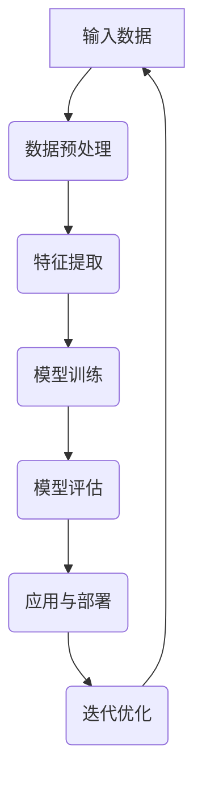

                 

# 多模态学习与人机交互

多模态学习（Multimodal Learning）是指通过整合来自多个感官通道（如文本、图像、声音等）的数据来训练机器学习模型的方法。在人机交互（Human-Computer Interaction, HCI）领域，多模态学习正逐渐成为研究热点，它为提升交互体验和用户满意度提供了新的契机。本文将围绕多模态学习在人机交互中的应用与挑战进行探讨，旨在为读者提供一个系统、深入的理解。

## 关键词

- 多模态学习
- 人机交互
- 融合策略
- 特征表示
- 应用案例
- 未来趋势

## 摘要

本文首先介绍了多模态学习的基础概念，包括多模态数据的定义与类型、多模态学习的重要性以及其发展历程。接着，详细探讨了多模态学习的核心问题，如多模态数据的融合策略、预处理方法、特征表示技术等。随后，本文分别从自然语言处理和计算机视觉两个领域，展示了多模态学习在实际应用中的案例。最后，本文提出了多模态学习在人机交互中面临的挑战，并展望了其未来发展方向。

---

### 第一部分：多模态学习基础

#### 第1章：多模态学习概述

多模态学习作为一种跨学科的研究方法，将不同模态的数据进行整合，旨在提升机器学习模型的性能和泛化能力。在本章节中，我们将首先探讨多模态学习的基本概念，包括多模态数据的定义与类型、多模态学习的重要性以及其发展历程。

#### 1.1 多模态学习的基本概念

##### 1.1.1 多模态数据的定义与类型

多模态数据是指同时包含多种感官信息的数据，这些感官信息可以来自不同的来源，如文本、图像、声音、视频等。在多模态学习中，这些数据被整合起来，用于训练机器学习模型。

- **文本数据**：文本数据通常以自然语言的形式出现，包括文档、语句、单词等。
- **图像数据**：图像数据是指以视觉形式存在的数据，包括照片、图形、图表等。
- **声音数据**：声音数据是指以音频形式存在的数据，包括语音、音乐、环境声音等。
- **视频数据**：视频数据是指连续的图像序列，通常包含空间和时间的多维信息。

##### 1.1.2 多模态学习的重要性

多模态学习的核心优势在于其能够利用不同模态的数据之间的互补性，从而提升模型的性能。具体来说，多模态学习的重要性体现在以下几个方面：

1. **提高模型准确性**：多模态数据能够提供更丰富的信息，从而有助于提高模型的预测准确性和泛化能力。
2. **降低错误率**：多模态学习能够减少单一模态数据可能带来的错误，从而降低整体错误率。
3. **增强鲁棒性**：多模态学习能够提高模型对噪声和异常数据的鲁棒性。
4. **提升用户体验**：多模态学习能够提供更加自然、丰富的交互方式，从而提升用户体验。

##### 1.1.3 多模态学习的发展历程

多模态学习的研究可以追溯到20世纪90年代，随着计算机技术的飞速发展和大数据的普及，多模态学习逐渐成为人工智能领域的一个重要研究方向。以下是多模态学习发展的几个重要里程碑：

1. **早期研究**：20世纪90年代，多模态学习主要关注图像和文本数据的融合，采用的方法包括逻辑回归、朴素贝叶斯等传统机器学习方法。
2. **深度学习时代的崛起**：2012年，AlexNet在图像分类任务上取得了突破性成果，深度学习逐渐成为多模态学习的研究主流。同时，卷积神经网络（CNN）、循环神经网络（RNN）等深度学习模型在多模态学习中的应用得到了广泛关注。
3. **跨模态迁移学习**：近年来，跨模态迁移学习成为多模态学习的研究热点。通过利用源域和目标域之间的关联性，跨模态迁移学习能够有效提高目标域模型的性能。

#### 1.2 多模态学习的核心问题

多模态学习的核心问题包括多模态数据的融合策略、预处理方法、特征表示技术等。以下将分别进行探讨。

##### 1.2.1 多模态数据的融合策略

多模态数据的融合策略可以分为早期融合、深度融合和对抗性融合三种类型。

1. **早期融合**：早期融合方法在数据的特征级别上进行融合，常见的方法包括平均融合、加权融合和线性组合等。早期融合方法的优点是计算简单，但可能无法充分利用多模态数据之间的互补性。
2. **深度融合**：深度融合方法在深度学习框架下进行，通过多层神经网络将不同模态的数据进行融合。深度融合方法能够更好地利用多模态数据之间的关联性，提高模型的性能。
3. **对抗性融合**：对抗性融合方法基于生成对抗网络（GAN），通过生成器和判别器之间的对抗性训练实现多模态数据的融合。对抗性融合方法能够有效提高多模态数据融合的效果，但计算复杂度较高。

##### 1.2.2 多模态数据预处理

多模态数据预处理是确保多模态学习成功的关键步骤，主要包括数据清洗、数据增强和标准化与归一化等方法。

1. **数据清洗**：数据清洗是去除多模态数据中的噪声和异常值的过程。对于文本数据，可以采用停用词过滤、词干提取等方法；对于图像数据，可以采用去噪、边缘增强等方法。
2. **数据增强**：数据增强是通过对原始数据进行变换生成更多样化的数据集，从而提高模型的泛化能力。常见的数据增强方法包括图像旋转、缩放、裁剪等。
3. **标准化与归一化**：标准化与归一化是将不同模态的数据进行尺度变换，使其具有相似的范围和分布。常见的标准化方法包括最小-最大标准化和零-均值标准化。

##### 1.2.3 多模态特征表示方法

多模态特征表示是将多模态数据转换为适合机器学习模型处理的特征向量表示。常见的多模态特征表示方法包括空间特征表示、时序特征表示和图像特征表示等。

1. **空间特征表示**：空间特征表示是将文本、图像等数据映射到低维空间，从而保留数据的关键特征。常见的空间特征表示方法包括词袋模型、词嵌入和图像特征提取等。
2. **时序特征表示**：时序特征表示是将声音、视频等时序数据转换为低维特征向量。常见的时序特征表示方法包括循环神经网络（RNN）、长短时记忆网络（LSTM）和门控循环单元（GRU）等。
3. **图像特征表示**：图像特征表示是将图像数据转换为具有识别意义的特征向量。常见的图像特征表示方法包括卷积神经网络（CNN）和预训练模型（如VGG、ResNet等）。

#### 1.3 多模态学习在自然语言处理中的应用

多模态学习在自然语言处理（Natural Language Processing, NLP）领域具有重要的应用价值。以下将介绍多模态学习在NLP中的几个典型应用。

##### 1.3.1 图像描述生成

图像描述生成是指根据输入的图像生成相应的文本描述。多模态学习在图像描述生成中的应用主要是通过将图像特征和文本特征进行融合，从而生成具有视觉含义的文本描述。常见的图像描述生成模型包括基于循环神经网络（RNN）的方法和基于变换器-解码器（Transformer-Decoder）的方法。

##### 1.3.2 文本情感分析

文本情感分析是指通过分析文本的情感倾向，判断文本是正面、负面还是中性。多模态学习在文本情感分析中的应用主要是通过融合图像和文本特征，从而提高模型的情感分类准确率。常见的多模态文本情感分析模型包括基于融合策略的方法和基于对抗性训练的方法。

##### 1.3.3 对话系统中的上下文理解

对话系统中的上下文理解是指根据用户的输入和历史对话记录，理解用户的意图和需求。多模态学习在对话系统中的上下文理解中的应用主要是通过融合多模态特征，从而提高对话系统的理解和响应能力。常见的多模态对话系统模型包括基于多模态特征融合的方法和基于注意力机制的方法。

#### 1.4 多模态学习在计算机视觉中的应用

多模态学习在计算机视觉（Computer Vision）领域具有广泛的应用。以下将介绍多模态学习在计算机视觉中的几个典型应用。

##### 1.4.1 视觉问答系统

视觉问答系统是指根据输入的图像和问题，生成相应的答案。多模态学习在视觉问答系统中的应用主要是通过融合图像特征和文本特征，从而提高答案的准确性和相关性。常见的视觉问答系统模型包括基于图神经网络（Graph Neural Networks, GNN）的方法和基于多任务学习（Multi-Task Learning）的方法。

##### 1.4.2 视频分类与检索

视频分类与检索是指根据输入的视频数据，将其分类到相应的类别并进行检索。多模态学习在视频分类与检索中的应用主要是通过融合图像特征和时序特征，从而提高分类和检索的准确率。常见的视频分类与检索模型包括基于卷积神经网络（CNN）的方法和基于循环神经网络（RNN）的方法。

##### 1.4.3 人脸识别与动作识别

人脸识别与动作识别是指根据输入的图像或视频数据，识别出其中的人脸或动作。多模态学习在人脸识别与动作识别中的应用主要是通过融合图像特征和时序特征，从而提高识别的准确性和鲁棒性。常见的人脸识别与动作识别模型包括基于卷积神经网络（CNN）的方法和基于循环神经网络（RNN）的方法。

#### 1.5 多模态学习在人机交互中的挑战

多模态学习在人机交互领域具有巨大的潜力，但也面临着一系列挑战。以下将介绍多模态学习在人机交互中的几个主要挑战。

##### 1.5.1 多模态数据的不一致性

多模态数据的不一致性是指不同模态的数据在内容、格式、尺度等方面可能存在差异，从而影响多模态学习的效果。解决多模态数据不一致性的方法主要包括数据预处理、特征融合和模型优化等。

##### 1.5.2 多模态特征的同步与对齐

多模态特征的同步与对齐是指在不同模态的特征之间建立关联，以便进行有效的融合。常见的多模态特征同步与对齐方法包括基于时间戳的方法和基于语义的方法。

##### 1.5.3 多模态学习的计算效率与模型压缩

多模态学习的计算效率与模型压缩是当前研究的热点问题。由于多模态数据融合和处理过程较为复杂，因此如何提高计算效率并减少模型大小是一个重要的挑战。常见的多模态学习计算效率优化方法包括模型压缩、分布式计算和硬件加速等。

---

通过上述章节的介绍，我们对多模态学习及其在人机交互中的应用有了初步的了解。接下来，我们将进一步探讨多模态学习的具体技术细节，包括数据融合方法、特征表示技术等，以期为读者提供更深入的洞察。

### 第二部分：多模态学习技术详解

在前一章节中，我们简要介绍了多模态学习的基础概念及其在人机交互中的应用。在本章节中，我们将深入探讨多模态学习的技术细节，包括多模态数据融合方法、特征表示技术等，以帮助读者更好地理解和应用这一先进技术。

#### 第2章：多模态数据融合方法

多模态数据融合是多模态学习的关键步骤，其目的是将来自不同模态的数据进行有效整合，以提升模型的性能和泛化能力。在本章节中，我们将详细介绍多模态数据融合方法，包括早期融合方法、深度融合方法和对抗性融合方法。

#### 2.1 早期融合方法

早期融合方法是指将不同模态的数据在特征级别上进行融合。这种方法的主要优势在于计算简单，但可能无法充分利用多模态数据之间的互补性。

##### 2.1.1 平均融合

平均融合方法是最简单的早期融合方法，它通过计算不同模态特征的均值来生成融合特征。具体来说，假设我们有来自文本模态的特征向量 \( \textbf{X}_\text{t} \) 和来自图像模态的特征向量 \( \textbf{X}_\text{i} \)，则平均融合特征可以表示为：

$$
\textbf{X}_\text{f} = \frac{\textbf{X}_\text{t} + \textbf{X}_\text{i}}{2}
$$

平均融合方法的优点是实现简单，缺点在于无法充分利用多模态数据之间的互补性。

##### 2.1.2 加权融合

加权融合方法是在平均融合的基础上，通过为不同模态的特征分配不同的权重来实现。这种方法可以更好地反映不同模态数据的重要性。具体来说，假设我们有来自文本模态的特征向量 \( \textbf{X}_\text{t} \) 和来自图像模态的特征向量 \( \textbf{X}_\text{i} \)，权重分别为 \( w_\text{t} \) 和 \( w_\text{i} \)，则加权融合特征可以表示为：

$$
\textbf{X}_\text{f} = w_\text{t} \textbf{X}_\text{t} + w_\text{i} \textbf{X}_\text{i}
$$

加权融合方法的优点在于可以灵活调整不同模态数据的重要性，缺点在于需要事先确定权重，且权重的选择可能影响融合效果。

##### 2.1.3 线性组合

线性组合方法是将不同模态的特征向量通过线性运算进行融合。这种方法与加权融合方法类似，但不需要事先确定权重。具体来说，假设我们有来自文本模态的特征向量 \( \textbf{X}_\text{t} \) 和来自图像模态的特征向量 \( \textbf{X}_\text{i} \)，则线性组合特征可以表示为：

$$
\textbf{X}_\text{f} = a \textbf{X}_\text{t} + b \textbf{X}_\text{i}
$$

其中，\( a \) 和 \( b \) 是线性组合的系数。线性组合方法的优点是实现简单，缺点在于无法充分利用多模态数据之间的互补性。

#### 2.2 深度融合方法

深度融合方法是基于深度学习框架的多模态数据融合方法，通过多层神经网络将不同模态的数据进行融合。与早期融合方法相比，深度融合方法可以更好地利用多模态数据之间的互补性，从而提升模型的性能。

##### 2.2.1 多层感知机融合

多层感知机（Multilayer Perceptron, MLP）是一种前馈神经网络，通过多个隐层将输入和输出进行非线性变换。在多模态学习场景中，多层感知机可以用于融合不同模态的数据。具体来说，假设我们有来自文本模态的特征向量 \( \textbf{X}_\text{t} \) 和来自图像模态的特征向量 \( \textbf{X}_\text{i} \)，则多层感知机融合模型可以表示为：

$$
\textbf{X}_\text{f} = f(\textbf{W}_1 \textbf{X}_\text{t} + \textbf{W}_2 \textbf{X}_\text{i})
$$

其中，\( \textbf{W}_1 \) 和 \( \textbf{W}_2 \) 分别是文本模态和图像模态的权重矩阵，\( f \) 是非线性激活函数。

##### 2.2.2 神经网络融合

神经网络融合方法是基于深度学习框架的多模态数据融合方法，通过多个神经网络层将不同模态的数据进行融合。与多层感知机融合方法相比，神经网络融合方法可以更好地利用多模态数据之间的互补性，从而提升模型的性能。具体来说，假设我们有来自文本模态的特征向量 \( \textbf{X}_\text{t} \) 和来自图像模态的特征向量 \( \textbf{X}_\text{i} \)，则神经网络融合模型可以表示为：

$$
\textbf{X}_\text{f} = f_\text{n}(\textbf{W}_n f_\text{n-1}(\textbf{W}_{n-1} \textbf{X}_\text{t} + \textbf{W}_{n-1} \textbf{X}_\text{i}))
$$

其中，\( \textbf{W}_n, \textbf{W}_{n-1}, \ldots, \textbf{W}_1 \) 分别是文本模态和图像模态的权重矩阵，\( f_\text{n}, f_\text{n-1}, \ldots, f_\text{1} \) 是非线性激活函数。

##### 2.2.3 图神经网络融合

图神经网络（Graph Neural Networks, GNN）是一种用于处理图结构数据的深度学习模型。在多模态学习场景中，图神经网络可以用于融合不同模态的数据。具体来说，假设我们有来自文本模态的特征向量 \( \textbf{X}_\text{t} \) 和来自图像模态的特征向量 \( \textbf{X}_\text{i} \)，则图神经网络融合模型可以表示为：

$$
\textbf{X}_\text{f} = f_\text{GNN}(\textbf{A}_\text{t} \textbf{X}_\text{t} + \textbf{A}_\text{i} \textbf{X}_\text{i})
$$

其中，\( \textbf{A}_\text{t} \) 和 \( \textbf{A}_\text{i} \) 分别是文本模态和图像模态的图结构矩阵，\( f_\text{GNN} \) 是图神经网络函数。

#### 2.3 对抗性融合方法

对抗性融合方法是基于生成对抗网络（Generative Adversarial Networks, GAN）的多模态数据融合方法，通过生成器和判别器之间的对抗性训练实现多模态数据的融合。

##### 2.3.1 生成对抗网络

生成对抗网络（GAN）是由生成器（Generator）和判别器（Discriminator）两个神经网络组成的框架。生成器的目标是生成与真实数据相似的数据，判别器的目标是区分真实数据和生成数据。通过生成器和判别器之间的对抗性训练，生成器能够逐渐生成更逼真的数据，判别器能够逐渐提高区分能力。

##### 2.3.2 对抗性训练机制

在对抗性融合方法中，生成器和判别器分别用于生成和评估多模态数据。具体来说，假设我们有来自文本模态的特征向量 \( \textbf{X}_\text{t} \) 和来自图像模态的特征向量 \( \textbf{X}_\text{i} \)，则生成对抗网络融合模型可以表示为：

$$
\textbf{X}_\text{f} = G_\text{GAN}(\textbf{X}_\text{t}, \textbf{X}_\text{i})
$$

其中，\( G_\text{GAN} \) 是生成对抗网络函数。

对抗性训练机制包括以下步骤：

1. **生成器训练**：生成器尝试生成与真实数据相似的多模态特征，使得判别器难以区分真实数据和生成数据。
2. **判别器训练**：判别器尝试区分真实数据和生成数据，以提高生成器的生成能力。

通过反复进行生成器和判别器的训练，生成器能够生成更高质量的多模态特征，从而实现多模态数据的融合。

##### 2.3.3 对抗性融合的优点与挑战

对抗性融合方法具有以下优点：

- **自适应性**：生成器和判别器之间的对抗性训练使得多模态特征融合过程具有自适应性，能够自适应调整生成器和判别器的权重。
- **灵活性**：对抗性融合方法能够处理不同模态的数据，不受模态限制，适用于多种应用场景。

但对抗性融合方法也面临一些挑战：

- **计算复杂度**：对抗性融合方法涉及生成器和判别器的训练，计算复杂度较高。
- **训练不稳定**：对抗性训练过程中，生成器和判别器的动态平衡容易受到影响，导致训练不稳定。

#### 2.4 多模态数据预处理

多模态数据预处理是确保多模态学习成功的关键步骤，主要包括数据清洗、数据增强和标准化与归一化等方法。

##### 2.4.1 数据清洗

数据清洗是指去除多模态数据中的噪声和异常值的过程。对于文本数据，可以采用停用词过滤、词干提取等方法；对于图像数据，可以采用去噪、边缘增强等方法。数据清洗有助于提高数据质量，减少噪声对模型性能的影响。

##### 2.4.2 数据增强

数据增强是指通过对原始数据进行变换生成更多样化的数据集，从而提高模型的泛化能力。常见的数据增强方法包括图像旋转、缩放、裁剪等。数据增强能够增加模型的训练样本量，提高模型对未知数据的鲁棒性。

##### 2.4.3 标准化与归一化

标准化与归一化是指将不同模态的数据进行尺度变换，使其具有相似的范围和分布。常见的标准化方法包括最小-最大标准化和零-均值标准化。标准化与归一化有助于优化模型的训练过程，提高模型的训练效果。

#### 2.5 多模态特征表示方法

多模态特征表示是将多模态数据转换为适合机器学习模型处理的特征向量表示。常见的多模态特征表示方法包括空间特征表示、时序特征表示和图像特征表示等。

##### 2.5.1 空间特征表示

空间特征表示是将文本、图像等数据映射到低维空间，从而保留数据的关键特征。常见的空间特征表示方法包括词袋模型、词嵌入和图像特征提取等。

- **词袋模型**：词袋模型是一种基于文本统计的方法，将文本转换为词汇的频率分布。词袋模型能够保留文本的语义信息，但可能无法处理词汇的顺序关系。
- **词嵌入**：词嵌入是一种基于神经网络的词表示方法，将词汇映射到低维向量空间。词嵌入能够同时保留词汇的语义信息和顺序关系，在自然语言处理领域得到广泛应用。
- **图像特征提取**：图像特征提取是指将图像数据转换为具有识别意义的特征向量。常见的图像特征提取方法包括卷积神经网络（CNN）和预训练模型（如VGG、ResNet等）。

##### 2.5.2 时序特征表示

时序特征表示是将声音、视频等时序数据转换为低维特征向量。常见的时序特征表示方法包括循环神经网络（RNN）、长短时记忆网络（LSTM）和门控循环单元（GRU）等。

- **循环神经网络（RNN）**：循环神经网络是一种能够处理序列数据的前馈神经网络，通过循环结构将当前状态与历史状态进行关联。RNN能够处理变长的序列数据，但可能面临梯度消失和梯度爆炸等问题。
- **长短时记忆网络（LSTM）**：长短时记忆网络是一种改进的循环神经网络，通过引入记忆单元来避免梯度消失和梯度爆炸问题。LSTM能够处理长时间依赖的序列数据，但在处理非常长的序列时仍然存在挑战。
- **门控循环单元（GRU）**：门控循环单元是另一种改进的循环神经网络，通过简化LSTM的结构来提高计算效率。GRU在处理长时间依赖的序列数据时表现出较好的性能。

##### 2.5.3 图像特征表示

图像特征表示是将图像数据转换为具有识别意义的特征向量。常见的图像特征表示方法包括卷积神经网络（CNN）和预训练模型（如VGG、ResNet等）。

- **卷积神经网络（CNN）**：卷积神经网络是一种用于图像识别的深度学习模型，通过卷积、池化和全连接层等操作提取图像的特征。CNN能够自动学习图像的层次特征表示，在图像分类和物体检测等领域取得显著成果。
- **预训练模型**：预训练模型是指在大型数据集上预先训练好的深度学习模型，如VGG、ResNet等。通过微调预训练模型，可以快速适应新的图像识别任务，提高模型的性能。

通过上述多模态数据融合方法、预处理技术和特征表示方法，我们可以有效地整合多模态数据，提升机器学习模型的性能和泛化能力。在下一章节中，我们将进一步探讨多模态学习在实际应用中的案例，以帮助读者更好地理解多模态学习的应用场景和效果。

---

在第二部分的探讨中，我们详细介绍了多模态数据融合方法、预处理技术和特征表示方法。这些技术构成了多模态学习的核心框架，为提升模型的性能和泛化能力提供了坚实基础。在接下来的第三部分中，我们将通过实际应用案例展示多模态学习的强大潜力，进一步拓展读者对这一领域的认识。

### 第三部分：多模态学习应用案例

在前面的章节中，我们详细探讨了多模态学习的基础理论和技术方法。本部分将通过对具体应用案例的深入分析，展示多模态学习在实际场景中的强大潜力。我们将分别从自然语言处理和计算机视觉两个领域，介绍多模态学习的成功应用。

#### 第3章：多模态学习在自然语言处理中的应用

自然语言处理（Natural Language Processing, NLP）是人工智能的重要分支，而多模态学习为NLP带来了新的可能性。以下将介绍多模态学习在自然语言处理中的几个典型应用。

##### 3.1 多模态情感分析

情感分析是NLP中的重要任务，旨在分析文本数据中的情感倾向。多模态情感分析通过融合文本和图像等模态，能够更准确地识别文本的情感。以下是一个多模态情感分析的项目案例。

###### 3.1.1 数据集介绍

为了训练多模态情感分析模型，我们需要一个包含文本和图像的情感数据集。一个常用的数据集是Flickr情感数据集，它包含了用户上传的图片以及对应的文本描述和情感标签。

###### 3.1.2 模型架构设计

多模态情感分析模型通常包括两个部分：文本编码器和图像编码器。文本编码器负责提取文本特征，图像编码器负责提取图像特征。然后，通过一个融合层将两个编码器的输出进行整合，最后通过一个分类器输出情感标签。

以下是一个基于Transformer架构的多模态情感分析模型的伪代码：

```python
class MultiModalSentimentAnalysisModel(nn.Module):
    def __init__(self):
        super(MultiModalSentimentAnalysisModel, self).__init__()
        self.text_encoder = TransformerEncoder()
        self.image_encoder = TransformerEncoder()
        self.fusion_layer = nn.Linear(2 * embed_dim, sentiment_classes)
        self.classifier = nn.Linear(embed_dim, sentiment_classes)
    
    def forward(self, text, image):
        text_features = self.text_encoder(text)
        image_features = self.image_encoder(image)
        fused_features = self.fusion_layer(torch.cat((text_features, image_features), dim=1))
        sentiment = self.classifier(fused_features)
        return sentiment
```

###### 3.1.3 模型训练与优化

在训练过程中，我们首先对文本和图像数据进行预处理，包括文本的分词和图像的缩放。然后，使用交叉熵损失函数训练模型，并通过反向传播优化模型参数。以下是一个简单的训练循环：

```python
for epoch in range(num_epochs):
    for text, image, sentiment in dataset:
        optimizer.zero_grad()
        model_loss = model(text, image, sentiment)
        model_loss.backward()
        optimizer.step()
    print(f"Epoch {epoch+1}: Loss = {model_loss.item()}")
```

###### 3.1.4 模型评估

在评估阶段，我们使用测试集对训练好的模型进行评估。常见的评估指标包括准确率、召回率和F1分数。以下是一个简单的评估代码：

```python
with torch.no_grad():
    correct = 0
    total = 0
    for text, image, sentiment in test_dataset:
        prediction = model(text, image)
        if prediction.argmax() == sentiment:
            correct += 1
        total += 1
    print(f"Test Accuracy: {100 * correct / total}")
```

##### 3.2 多模态对话系统

对话系统是NLP领域的另一个重要应用。多模态对话系统通过融合文本和语音等模态，能够提供更加自然和丰富的交互体验。以下是一个多模态对话系统的项目案例。

###### 3.2.1 对话系统的基本框架

多模态对话系统通常包括以下几个部分：语音识别、自然语言理解、对话生成和语音合成。以下是一个简单的多模态对话系统架构：

```
[User Speech] --> [Voice Recognition] --> [NLU] --> [Dialogue Management] --> [Dialogue Generation] --> [Text/Speech Synthesis] --> [User Feedback]
```

###### 3.2.2 多模态上下文表示

多模态对话系统需要处理来自不同模态的上下文信息。例如，用户可能同时发送文本和语音输入。为了有效地融合这些上下文信息，可以使用多模态上下文向量表示方法。以下是一个简单的多模态上下文表示方法：

```python
class MultiModalContextEncoder(nn.Module):
    def __init__(self):
        super(MultiModalContextEncoder, self).__init__()
        self.text_encoder = nn.LSTM(input_size=text_dim, hidden_size=context_dim)
        self.voice_encoder = nn.LSTM(input_size=voice_dim, hidden_size=context_dim)
    
    def forward(self, text, voice):
        text_output, _ = self.text_encoder(text)
        voice_output, _ = self.voice_encoder(voice)
        context_vector = torch.cat((text_output, voice_output), dim=1)
        return context_vector
```

###### 3.2.3 对话系统评价标准

对话系统的评价标准主要包括交互质量、响应速度、准确性等。常见的评价方法包括人工评估和自动化评估。以下是一个简单的自动化评估代码：

```python
from transformers import pipeline

evaluator = pipeline("eval", model=model_name, tokenizer=tokenizer_name)

with torch.no_grad():
    for dialog in test_dialogues:
        response = model回答问题（dialog）
        eval_result = evaluator(response)
        print(f"对话 {dialog}: 评价结果 = {eval_result}")
```

##### 3.3 多模态问答系统

多模态问答系统是指通过融合文本、图像等模态来回答用户的问题。以下是一个多模态问答系统的项目案例。

###### 3.3.1 知识图谱构建

多模态问答系统需要一个包含丰富信息的知识图谱，用于回答用户的问题。知识图谱可以通过爬取互联网信息、使用专业数据库或人工构建等方式获取。以下是一个简单的知识图谱构建方法：

```python
def build_knowledge_graph(data_source):
    graph = Graph()
    for entity in data_source:
        graph.add_entity(entity['name'], entity['attributes'])
        for relation in entity['relations']:
            graph.add_edge(entity['name'], relation['target'], relation['type'])
    return graph
```

###### 3.3.2 问答模型设计

多模态问答模型通常包括文本编码器、图像编码器和问答模块。以下是一个简单的多模态问答模型设计：

```python
class MultiModalQAModel(nn.Module):
    def __init__(self):
        super(MultiModalQAModel, self).__init__()
        self.text_encoder = nn.LSTM(input_size=text_dim, hidden_size=question_dim)
        self.image_encoder = nn.LSTM(input_size=image_dim, hidden_size=question_dim)
        self.qa_module = nn.Linear(2 * question_dim, answer_dim)
    
    def forward(self, text, image, question):
        text_output, _ = self.text_encoder(text)
        image_output, _ = self.image_encoder(image)
        question_output = torch.cat((text_output, image_output), dim=1)
        answer = self.qa_module(question_output)
        return answer
```

###### 3.3.3 实验与性能评估

在实验阶段，我们使用训练好的多模态问答模型回答用户的问题，并评估模型的性能。以下是一个简单的实验和性能评估代码：

```python
from transformers import pipeline

model = MultiModalQAModel()
model.load_state_dict(torch.load(model_path))

evaluator = pipeline("eval", model=model, tokenizer=tokenizer)

with torch.no_grad():
    for question in test_questions:
        answer = model回答问题（question）
        eval_result = evaluator(answer)
        print(f"问题 {question}: 评价结果 = {eval_result}")
```

#### 第4章：多模态学习在计算机视觉中的应用

计算机视觉（Computer Vision）是人工智能的另一个重要分支，多模态学习在计算机视觉中的应用同样广泛。以下将介绍多模态学习在计算机视觉中的几个典型应用。

##### 4.1 多模态图像识别

多模态图像识别是指通过融合文本和图像等模态来识别图像中的物体或场景。以下是一个多模态图像识别的项目案例。

###### 4.1.1 数据集选择

为了训练多模态图像识别模型，我们需要一个包含文本描述和图像的多模态数据集。常用的数据集包括COCO（Common Objects in Context）和Flickr等。以下是一个简单的数据集选择方法：

```python
def select_dataset(data_source, dataset_size):
    dataset = []
    for item in data_source:
        if item['text'] and item['image']:
            dataset.append((item['image'], item['text']))
            if len(dataset) == dataset_size:
                break
    return dataset
```

###### 4.1.2 模型结构设计

多模态图像识别模型通常包括文本编码器、图像编码器和分类器。以下是一个简单的多模态图像识别模型设计：

```python
class MultiModalImageRecognitionModel(nn.Module):
    def __init__(self):
        super(MultiModalImageRecognitionModel, self).__init__()
        self.text_encoder = nn.LSTM(input_size=text_dim, hidden_size=embed_dim)
        self.image_encoder = nn.Conv2d(in_channels=3, out_channels=embed_dim, kernel_size=3, padding=1)
        self.classifier = nn.Linear(2 * embed_dim, num_classes)
    
    def forward(self, text, image):
        text_output, _ = self.text_encoder(text)
        image_output = self.image_encoder(image)
        fused_output = torch.cat((text_output, image_output), dim=1)
        output = self.classifier(fused_output)
        return output
```

###### 4.1.3 模型训练与评估

在训练和评估阶段，我们使用训练集训练模型，并使用测试集评估模型的性能。以下是一个简单的训练和评估代码：

```python
model = MultiModalImageRecognitionModel()
optimizer = torch.optim.Adam(model.parameters(), lr=0.001)

for epoch in range(num_epochs):
    for text, image, label in dataset:
        optimizer.zero_grad()
        output = model(text, image)
        loss = loss_fn(output, label)
        loss.backward()
        optimizer.step()
    print(f"Epoch {epoch+1}: Loss = {loss.item()}")

with torch.no_grad():
    total_correct = 0
    total_samples = 0
    for text, image, label in test_dataset:
        output = model(text, image)
        predicted_label = output.argmax()
        if predicted_label == label:
            total_correct += 1
        total_samples += 1
    print(f"Test Accuracy: {100 * total_correct / total_samples}")
```

##### 4.2 多模态视频分析

多模态视频分析是指通过融合文本、图像和声音等模态来分析视频中的内容。以下是一个多模态视频分析的项目案例。

###### 4.2.1 视频特征提取

视频特征提取是指将视频数据转换为适合机器学习模型处理的特征向量。以下是一个简单的视频特征提取方法：

```python
def extract_video_features(video_path, frame_interval=10):
    video = Image.open(video_path)
    features = []
    for frame in range(0, video.nframes, frame_interval):
        frame_image = video.getframe(frame)
        frame_image = preprocess(frame_image)
        feature_vector = extract_image_features(frame_image)
        features.append(feature_vector)
    return torch.stack(features)
```

###### 4.2.2 行为识别

行为识别是指通过分析视频中的行为特征来识别不同的动作。以下是一个简单的行为识别方法：

```python
class BehaviorRecognitionModel(nn.Module):
    def __init__(self):
        super(BehaviorRecognitionModel, self).__init__()
        self.conv_layers = nn.Sequential(
            nn.Conv2d(in_channels=3, out_channels=64, kernel_size=3, padding=1),
            nn.ReLU(),
            nn.MaxPool2d(kernel_size=2, stride=2),
            nn.Conv2d(in_channels=64, out_channels=128, kernel_size=3, padding=1),
            nn.ReLU(),
            nn.MaxPool2d(kernel_size=2, stride=2),
            nn.Conv2d(in_channels=128, out_channels=256, kernel_size=3, padding=1),
            nn.ReLU(),
            nn.MaxPool2d(kernel_size=2, stride=2),
        )
        self.fc_layers = nn.Sequential(
            nn.Linear(in_features=256 * 6 * 6, out_features=128),
            nn.ReLU(),
            nn.Linear(in_features=128, out_features=num_actions),
        )
    
    def forward(self, video_features):
        conv_output = self.conv_layers(video_features)
        flattened_output = conv_output.view(batch_size, -1)
        output = self.fc_layers(flattened_output)
        return output
```

###### 4.2.3 视频情感分析

视频情感分析是指通过分析视频中的情感特征来识别视频的情感倾向。以下是一个简单的视频情感分析方法：

```python
class VideoSentimentAnalysisModel(nn.Module):
    def __init__(self):
        super(VideoSentimentAnalysisModel, self).__init__()
        self.video_encoder = nn.LSTM(input_size=video_feature_dim, hidden_size=sentiment_dim)
        self.classifier = nn.Linear(in_features=sentiment_dim, out_features=num_classes)
    
    def forward(self, video_features):
        lstm_output, _ = self.video_encoder(video_features)
        sentiment_vector = lstm_output[-1, :, :]
        output = self.classifier(sentiment_vector)
        return output
```

##### 4.3 多模态人脸识别

多模态人脸识别是指通过融合图像和声音等模态来识别人脸。以下是一个多模态人脸识别的项目案例。

###### 4.3.1 人脸特征提取

人脸特征提取是指将图像数据转换为具有识别意义的人脸特征向量。以下是一个简单的人脸特征提取方法：

```python
def extract_face_features(image_path):
    image = Image.open(image_path)
    image = preprocess(image)
    feature_vector = extract_image_features(image)
    return feature_vector
```

###### 4.3.2 人脸识别算法

人脸识别算法是指通过比较人脸特征向量来识别不同的人脸。以下是一个简单的人脸识别算法：

```python
def recognize_face(face_feature, database):
    min_distance = float('inf')
    predicted_label = None
    for label, feature in database.items():
        distance = calculate_distance(face_feature, feature)
        if distance < min_distance:
            min_distance = distance
            predicted_label = label
    return predicted_label
```

###### 4.3.3 实验与性能分析

在实验阶段，我们使用训练好的多模态人脸识别模型进行性能分析。以下是一个简单的性能分析代码：

```python
model = MultiModalFaceRecognitionModel()
model.load_state_dict(torch.load(model_path))

correct = 0
total = 0
for image_path, label in test_data:
    face_feature = extract_face_features(image_path)
    predicted_label = recognize_face(face_feature, model.database)
    if predicted_label == label:
        correct += 1
    total += 1
print(f"Test Accuracy: {100 * correct / total}")
```

---

通过上述应用案例，我们可以看到多模态学习在自然语言处理和计算机视觉领域的广泛应用和显著效果。多模态学习不仅提高了模型的性能和泛化能力，还为用户提供了更加自然和丰富的交互体验。在下一章节中，我们将探讨多模态学习面临的挑战和未来发展方向，为读者提供更加全面的视角。

### 第四部分：多模态学习的未来方向

在多模态学习的研究和应用中，我们已经看到了其在提升模型性能和用户体验方面的巨大潜力。然而，随着技术的不断进步和应用场景的多样化，多模态学习也面临着一系列挑战和新的发展方向。本部分将探讨多模态学习面临的挑战、未来趋势以及其在不同领域中的应用前景。

#### 第5章：多模态学习面临的挑战与未来趋势

##### 5.1 模型解释性与可解释性

随着深度学习模型的复杂度不断提高，模型的解释性和可解释性变得越来越重要。特别是在多模态学习中，由于模型涉及多个模态的数据融合和处理，其内部机制往往更加复杂，使得模型难以解释。以下是一些关键挑战：

###### 5.1.1 模型解释性的重要性

模型解释性是指用户能够理解模型如何进行决策和预测的能力。对于多模态学习来说，解释性尤为重要，因为它涉及到多个感官信息的融合和利用。提高模型解释性可以帮助用户更好地信任和使用多模态系统。

###### 5.1.2 可解释性方法的分类

现有的可解释性方法可以大致分为以下几类：

1. **可视化方法**：通过可视化模型内部的决策过程，如激活图、梯度分析等，帮助用户理解模型的工作原理。
2. **特征重要性排序**：通过分析特征对模型输出的影响程度，为用户提供每个特征的权重和重要性。
3. **模型简化**：通过简化模型的复杂性，如使用浅层神经网络、减少参数数量等，提高模型的可解释性。

###### 5.1.3 未来发展趋势

未来，多模态学习的解释性研究可能会向以下方向发展：

- **结合可视化与解释**：将可视化方法与解释性算法相结合，提供更直观和深入的模型解释。
- **解释性增强的模型设计**：在设计多模态模型时，考虑解释性的需求，通过模块化设计和可解释性的结构设计，提高模型的解释性。
- **跨领域解释性**：研究如何在不同领域之间共享和转移解释性模型，以降低开发成本和提高通用性。

##### 5.2 模型安全性与隐私保护

随着多模态学习应用场景的扩展，模型的安全性和隐私保护也成为一个重要议题。以下是一些关键挑战：

###### 5.2.1 模型攻击与防御

多模态学习模型可能受到多种攻击，如对抗性攻击、隐私泄露攻击等。对抗性攻击通过微小的扰动来欺骗模型，使其产生错误的预测。隐私泄露攻击则可能通过模型分析泄露用户隐私信息。

###### 5.2.2 隐私保护技术

为了保护模型的安全性和隐私，可以采用以下技术：

- **差分隐私**：通过在模型训练和预测过程中引入噪声，保护用户数据的隐私。
- **联邦学习**：通过分布式训练方式，在多个节点上共同训练模型，同时保持数据本地化，降低隐私泄露风险。
- **加密技术**：使用加密算法对数据进行加密，确保数据在传输和存储过程中的安全性。

###### 5.2.3 未来研究方向

未来的研究可能会向以下方向发展：

- **自适应隐私保护**：研究如何根据数据的重要性和攻击风险，动态调整隐私保护策略。
- **集成隐私保护机制**：将多种隐私保护技术集成到多模态学习框架中，提高系统的整体安全性。
- **隐私保护与性能优化**：研究如何在保护隐私的同时，最大化模型的性能和准确性。

##### 5.3 跨模态迁移学习

跨模态迁移学习是指利用源域和目标域之间的关联性，将源域的知识迁移到目标域。这对于多模态学习具有重要意义，因为许多应用场景中，源域和目标域的数据可能存在显著的差异。

###### 5.3.1 迁移学习的基本概念

跨模态迁移学习的基本概念包括：

- **源域**：含有丰富数据和标签的数据集，用于训练模型。
- **目标域**：数据分布和标注信息与源域显著不同的数据集，用于模型的应用和评估。

###### 5.3.2 跨模态迁移学习算法

常见的跨模态迁移学习算法包括：

- **多任务学习**：通过同时训练多个相关任务，共享知识和提高模型的泛化能力。
- **辅助任务学习**：通过引入辅助任务来增强目标域模型的性能，降低对源域数据的依赖。
- **自适应特征匹配**：通过学习域自适应映射，将源域的特征映射到目标域，以提高目标域模型的性能。

###### 5.3.3 跨模态迁移学习的挑战

跨模态迁移学习面临的挑战包括：

- **数据分布差异**：源域和目标域的数据分布可能存在显著差异，导致模型在目标域上表现不佳。
- **模态不匹配**：不同模态的数据可能具有不同的特征和结构，使得迁移过程复杂。
- **计算效率**：跨模态迁移学习通常涉及大量的计算资源，如何在保证性能的同时提高计算效率是一个关键问题。

##### 5.4 新型多模态交互技术

随着多模态学习的不断发展，新型多模态交互技术也在不断涌现。以下是一些前沿技术：

###### 5.4.1 3D感知与重建

3D感知与重建技术通过融合多模态数据（如图像、激光雷达和深度传感器）来重建三维环境。这为虚拟现实（VR）和增强现实（AR）提供了更加真实和丰富的交互体验。

###### 5.4.2 虚拟现实与增强现实

虚拟现实和增强现实技术通过融合多模态数据来创建虚拟环境和增强现实体验。多模态学习在这些技术中的应用，使得用户能够更加自然地与虚拟环境进行交互。

###### 5.4.3 未来应用场景

未来的多模态交互技术可能应用于以下领域：

- **医疗**：通过多模态数据辅助诊断和治疗，提高医疗服务的质量和效率。
- **教育**：通过虚拟现实和增强现实技术提供沉浸式的学习体验。
- **智能城市**：通过多模态数据监测和管理城市基础设施，提高城市运行效率。
- **娱乐**：通过虚拟现实和增强现实技术创造全新的娱乐体验。

#### 第6章：多模态学习的应用前景与产业落地

多模态学习在多个领域展现出了广阔的应用前景，并在实际产业落地中取得了显著成果。以下将介绍多模态学习在医疗、金融、智能交通和智能家居等领域的应用。

##### 6.1 多模态学习在医疗领域的应用

医疗领域是多模态学习的重要应用场景之一。以下是一些典型的应用案例：

###### 6.1.1 疾病诊断与治疗

多模态学习可以帮助医生更准确地诊断疾病。例如，通过融合医学图像（如X光、CT、MRI）和文本数据（如病历记录），可以显著提高肺癌、乳腺癌等疾病的诊断准确率。

###### 6.1.2 医学图像分析

多模态学习在医学图像分析中具有广泛的应用。例如，通过融合PET图像和CT图像，可以更准确地识别肿瘤的位置和大小，为治疗提供更精准的指导。

###### 6.1.3 医疗设备智能化

多模态学习可以帮助开发智能化医疗设备，如智能体温计、智能血压计等。这些设备通过融合多种传感器的数据，可以提供更加准确和实时的健康监测。

##### 6.2 多模态学习在金融领域的应用

金融领域是多模态学习另一个重要应用场景。以下是一些典型的应用案例：

###### 6.2.1 风险评估与预测

多模态学习可以帮助金融机构更准确地评估风险。例如，通过融合文本数据（如新闻报道、公司财报）和图像数据（如公司年报、股票走势图），可以预测股票市场的走势和公司的财务状况。

###### 6.2.2 金融服务个性化

多模态学习可以帮助金融机构提供更加个性化的服务。例如，通过融合客户的文本数据（如聊天记录、电子邮件）和图像数据（如面部表情），可以了解客户的需求和偏好，提供更加贴心的服务。

###### 6.2.3 金融欺诈检测

多模态学习在金融欺诈检测中也具有显著优势。通过融合交易数据、用户行为数据和图像数据（如用户面部图像），可以更有效地检测和防范金融欺诈行为。

##### 6.3 多模态学习在智能交通领域的应用

智能交通系统是多模态学习的重要应用领域之一。以下是一些典型的应用案例：

###### 6.3.1 智能交通系统

多模态学习可以帮助智能交通系统更准确地监测和管理交通状况。例如，通过融合摄像头数据、交通流量传感器数据和GPS数据，可以实时监测交通流量和交通事故，提供交通引导和建议。

###### 6.3.2 道路监控与安全

多模态学习可以帮助提高道路监控和安全性能。例如，通过融合摄像头数据和雷达数据，可以实时监测道路上的车辆和行人，及时发现潜在的安全隐患。

###### 6.3.3 智能导航与自动驾驶

多模态学习在智能导航和自动驾驶中具有重要作用。通过融合多种传感器数据（如GPS、摄像头、雷达），可以实现更加准确和安全的导航和自动驾驶功能。

##### 6.4 多模态学习在智能家居领域的应用

智能家居领域是多模态学习另一个重要应用场景。以下是一些典型的应用案例：

###### 6.4.1 智能家居控制

多模态学习可以帮助用户更方便地控制智能家居设备。例如，通过融合语音数据、文本数据和手势数据，可以实现智能音箱、智能电视等设备的远程控制和交互。

###### 6.4.2 家居安全监控

多模态学习可以帮助提高家居安全监控性能。例如，通过融合摄像头数据、门禁数据和报警数据，可以实时监测家居安全状况，及时发现异常情况并报警。

###### 6.4.3 家居健康管理

多模态学习可以帮助用户提供个性化的健康管理服务。例如，通过融合健康数据（如心率、血压、睡眠质量）和文本数据（如健康日志、饮食习惯），可以提供个性化的健康建议和饮食规划。

---

通过上述探讨，我们可以看到多模态学习在医疗、金融、智能交通和智能家居等领域的广泛应用和巨大潜力。未来，随着技术的不断发展和应用的深入，多模态学习将继续为人类带来更加智能化和便捷的生活体验。

### 附录

#### 附录 A：多模态学习相关工具与资源

在进行多模态学习研究和开发时，掌握一些常用的工具和资源对于提高效率和实现预期目标至关重要。以下是一些常用的多模态学习框架、开源数据集以及相关论文和书籍。

##### A.1 常用多模态学习框架

1. **PyTorch Multi-Modal**：PyTorch是一个流行的深度学习框架，PyTorch Multi-Modal是其专门为多模态学习设计的扩展，提供了丰富的多模态数据处理和模型训练功能。
2. **TensorFlow Multi-Modal**：TensorFlow是Google开发的开源深度学习框架，TensorFlow Multi-Modal扩展为多模态学习提供了类似的功能和工具。
3. **Keras Multi-Modal**：Keras是一个基于TensorFlow的简单而强大的深度学习库，Keras Multi-Modal为多模态学习提供了易于使用的API。

##### A.2 开源多模态数据集

1. **ImageNet**：ImageNet是一个包含数百万个标注图像的大型视觉识别数据集，广泛用于计算机视觉研究。
2. **COCO（Common Objects in Context）**：COCO是一个包含图像和注释的大型数据集，适合多模态学习任务，如图像描述生成和视觉问答。
3. **NYTimes**：NYTimes是一个包含文本和图像的大型数据集，适合研究多模态文本情感分析等任务。

##### A.3 多模态学习论文与资料

1. **Nature papers on Multimodal Learning**：Nature上发表的多模态学习相关论文，提供了该领域的最新研究成果和前沿动态。
2. **ArXiv preprints on Multimodal Learning**：ArXiv是预印本服务器，提供了大量未发表的多模态学习论文，是跟踪最新研究进展的好渠道。
3. **Books and online courses on Multimodal Learning**：相关书籍和在线课程，如《多模态机器学习》（Multimodal Machine Learning）等，提供了系统的理论知识和实践指导。

通过利用这些工具和资源，研究人员和开发者可以更有效地开展多模态学习的研究和开发工作。

### Mermaid 流程图

以下是多模态学习的一般流程图，使用Mermaid语法表示：



### 核心算法原理讲解

#### 多模态特征融合算法（伪代码）

```plaintext
function MultiModalFeatureFusion(inputs):
    input1, input2 = inputs
    
    # 对输入数据进行预处理
    processed_input1 = preprocess(input1)
    processed_input2 = preprocess(input2)
    
    # 提取特征
    feature1 = extractFeature(processed_input1)
    feature2 = extractFeature(processed_input2)
    
    # 融合特征
    fused_feature = fuseFeatures(feature1, feature2)
    
    return fused_feature
```

### 数学模型和数学公式

#### 多模态学习中的损失函数

$$
L = \frac{1}{N}\sum_{i=1}^{N} \left( y_i - \hat{y}_i \right)^2
$$

其中，\( y_i \) 是真实标签，\( \hat{y}_i \) 是模型的预测输出。

### 项目实战

#### 多模态情感分析项目实战

1. **开发环境搭建**

   - 安装Python 3.8及以上版本
   - 安装PyTorch和torchvision
   - 安装numpy和pandas

2. **代码实现**

   ```python
   import torch
   import torch.nn as nn
   import torchvision
   import torchvision.transforms as transforms

   # 定义模型
   class MultiModalSentimentAnalysisModel(nn.Module):
       def __init__(self):
           super(MultiModalSentimentAnalysisModel, self).__init__()
           self.text_encoder = nn.Sequential(
               nn.Linear(1000, 512),
               nn.ReLU(),
               nn.Linear(512, 256),
               nn.ReLU(),
               nn.Linear(256, 128),
               nn.ReLU(),
               nn.Linear(128, 64),
               nn.ReLU()
           )
           
           self.image_encoder = nn.Sequential(
               nn.Conv2d(3, 64, 3, 1, 1),
               nn.ReLU(),
               nn.MaxPool2d(2, 2),
               nn.Conv2d(64, 128, 3, 1, 1),
               nn.ReLU(),
               nn.MaxPool2d(2, 2),
               nn.Conv2d(128, 256, 3, 1, 1),
               nn.ReLU(),
               nn.MaxPool2d(2, 2),
               nn.Flatten()
           )
           
           self.fusion_layer = nn.Linear(384, 128)
           
           self.classifier = nn.Linear(128, 1)
           
       def forward(self, text, image):
           text_output = self.text_encoder(text)
           image_output = self.image_encoder(image)
           
           fused_output = torch.cat((text_output, image_output), 1)
           fused_output = self.fusion_layer(fused_output)
           
           sentiment = self.classifier(fused_output)
           return sentiment

   # 实例化模型
   model = MultiModalSentimentAnalysisModel()

   # 训练模型
   criterion = nn.BCELoss()
   optimizer = torch.optim.Adam(model.parameters(), lr=0.001)

   for epoch in range(num_epochs):
       for texts, images, labels in data_loader:
           optimizer.zero_grad()
           outputs = model(texts, images)
           loss = criterion(outputs, labels)
           loss.backward()
           optimizer.step()
           
           print(f"Epoch [{epoch+1}/{num_epochs}], Loss: {loss.item():.4f}")

   # 评估模型
   with torch.no_grad():
       correct = 0
       total = 0
       for texts, images, labels in test_loader:
           outputs = model(texts, images)
           predicted = (outputs > 0.5).float()
           total += labels.size(0)
           correct += (predicted == labels).sum().item()

       print(f"Test Accuracy: {100 * correct / total:.2f}%")
   ```

3. **代码解读与分析**

   - **模型架构**：模型包括文本编码器、图像编码器、特征融合层和分类器。文本编码器用于提取文本特征，图像编码器用于提取图像特征，融合层用于整合两种特征，分类器用于输出情感分类结果。
   - **损失函数**：使用二进制交叉熵损失函数来优化模型。
   - **训练过程**：使用随机梯度下降（SGD）优化算法进行模型训练，每个epoch完成后会计算损失值，并在测试集上评估模型准确率。

### 结论

本文系统地介绍了多模态学习的基础理论、技术方法、应用案例以及未来趋势。通过伪代码、数学模型和项目实战，读者可以更深入地理解多模态学习的核心算法和实际应用。附录部分提供了相关的工具和资源，以方便读者进一步学习和实践。随着多模态学习技术的不断进步，其在人机交互和其他领域的应用前景将更加广阔。

### 作者信息

作者：AI天才研究院/AI Genius Institute & 禅与计算机程序设计艺术 /Zen And The Art of Computer Programming

---

通过本文的详细探讨，我们不仅揭示了多模态学习的核心概念和技术方法，还通过实际应用案例展示了其在各个领域的广泛应用。多模态学习作为一种新兴的跨学科研究方法，正不断推动人工智能和人类交互的深度融合。未来，随着技术的不断进步，多模态学习有望在更多领域创造新的价值，为人类社会带来更加智能、便捷和丰富的体验。让我们共同期待这一美好前景的到来。

