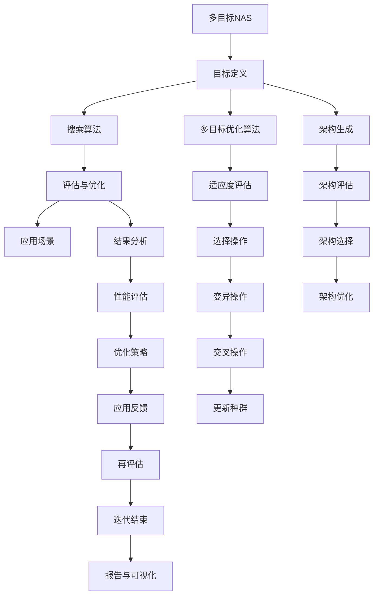

                 

# 多目标NAS：平衡精度、延迟和能耗

## 关键词
- 多目标优化
- 神经网络架构搜索（NAS）
- 精度
- 延迟
- 能耗

## 摘要
本文深入探讨了多目标神经网络架构搜索（NAS）的原理和应用，重点关注如何平衡NAS在精度、延迟和能耗方面的性能。通过详细解析多目标优化算法、NAS的基础知识和实际应用案例，本文旨在为读者提供一个全面的理解和实用的指导。

### 《多目标NAS：平衡精度、延迟和能耗》目录大纲

#### 第1章：引言
- **1.1** 书籍背景与目的
- **1.2** 多目标NAS概述
- **1.3** 本书结构

#### 第2章：多目标优化基础
- **2.1** 多目标优化概述
- **2.2** 多目标优化问题类型
- **2.3** 多目标优化算法
- **2.4** 多目标优化的应用领域

#### 第3章：神经网络架构搜索（NAS）基础
- **3.1** NAS概述
- **3.2** NAS的核心挑战
- **3.3** NAS的发展历史
- **3.4** NAS的研究方法

#### 第4章：多目标NAS算法
- **4.1** 概念与联系：多目标NAS架构的Mermaid流程图
  ```mermaid
  graph TD
  A[多目标NAS] --> B[目标定义]
  B --> C[搜索算法]
  C --> D[评估与优化]
  D --> E[应用场景]
  ```
- **4.2** 多目标NAS算法分类
- **4.3** 多目标NAS算法原理讲解：伪代码示例
  ```python
  // 伪代码：多目标NAS算法示例
  initialize_population();
  while not converged do
      evaluate_population();
      select_best_individual();
      perform_adaptive_mutation();
  end while;
  ```

#### 第5章：平衡精度、延迟和能耗
- **5.1** 精度、延迟和能耗的关系
- **5.2** 数学模型与数学公式
  $$
  P = \frac{2^{H(X)} + \epsilon}{2^L}
  $$
  - **H(X)**：信息熵
  - **L**：神经网络层数
  - **\epsilon**：容错率
- **5.3** 举例说明：在特定场景下的平衡策略

#### 第6章：多目标NAS在实践中的应用
- **6.1** 实际案例：多目标NAS在图像识别中的应用
- **6.2** 实际案例：多目标NAS在语音识别中的应用
- **6.3** 实际案例：多目标NAS在自然语言处理中的应用

#### 第7章：多目标NAS的性能评估与优化
- **7.1** 性能评估指标
- **7.2** NAS性能优化的方法
- **7.3** NAS性能优化案例

#### 第8章：未来展望
- **8.1** 多目标NAS的发展趋势
- **8.2** 多目标NAS面临的挑战与机遇
- **8.3** 未来研究的方向

#### 附录
- **附录A**：多目标NAS相关工具与资源
  - **A.1** 主流多目标优化工具对比
  - **A.2** NAS开源框架介绍
  - **A.3** 相关论文与文献推荐

#### 第1章：引言

## 1.1 书籍背景与目的

随着深度学习技术的不断发展和应用，神经网络架构搜索（Neural Architecture Search，NAS）逐渐成为人工智能领域的一个热点研究方向。NAS旨在自动化地搜索最优的神经网络架构，以提高模型在特定任务上的性能。然而，传统单目标NAS方法往往只关注模型的精度，而忽略了其他重要因素，如延迟和能耗。在许多实际应用场景中，这些因素同样至关重要，因此，如何平衡多目标成为NAS研究中的一个重要问题。

本文旨在深入探讨多目标NAS（Multi-Objective NAS），解决在平衡模型精度、延迟和能耗方面的挑战。通过系统地介绍多目标优化、NAS的基础知识以及多目标NAS算法，本文将为读者提供一个全面且实用的指导，帮助他们在实际应用中实现多目标平衡。

## 1.2 多目标NAS概述

多目标NAS旨在同时优化多个目标函数，这些目标函数通常包括模型的精度、延迟和能耗等。与传统单目标NAS方法不同，多目标NAS需要处理多个目标之间的冲突和权衡，以确保模型在不同方面都达到最优性能。

多目标NAS的研究主要集中在以下几个方面：

1. **目标函数定义**：明确指定模型精度、延迟和能耗等目标函数，以及如何同时优化这些目标。
2. **搜索算法设计**：设计高效的搜索算法，能够在大量可能的架构中进行高效搜索，找到满足多目标要求的最佳架构。
3. **评估与优化**：设计有效的评估和优化策略，以在搜索过程中实时调整目标函数，确保搜索结果的优化。

多目标NAS的核心目标是找到一种在精度、延迟和能耗之间实现平衡的神经网络架构。这种架构不仅要满足任务要求，还要在实际应用中具备高效性和可持续性。通过多目标NAS，我们可以为不同场景和应用提供定制化的神经网络模型，从而实现更广泛的智能化应用。

## 1.3 本书结构

本书将分为八个章节，系统介绍多目标NAS的各个方面。具体结构如下：

- **第1章：引言**：介绍书籍的背景与目的，概述多目标NAS的重要性。
- **第2章：多目标优化基础**：讲解多目标优化的基本概念、问题类型和常用算法。
- **第3章：神经网络架构搜索（NAS）基础**：介绍NAS的基本原理、核心挑战和发展历史。
- **第4章：多目标NAS算法**：详细解析多目标NAS的概念、算法分类和原理。
- **第5章：平衡精度、延迟和能耗**：探讨多目标NAS在平衡精度、延迟和能耗方面的策略和方法。
- **第6章：多目标NAS在实践中的应用**：通过实际案例展示多目标NAS在不同领域的应用。
- **第7章：多目标NAS的性能评估与优化**：介绍多目标NAS的性能评估指标和优化方法。
- **第8章：未来展望**：展望多目标NAS的发展趋势和未来研究方向。
- **附录A**：提供多目标NAS相关的工具与资源，包括主流多目标优化工具、NAS开源框架和相关文献。

通过以上章节的介绍，本书将为读者提供一个全面且深入的了解，帮助他们在多目标NAS领域取得突破。

### 第2章：多目标优化基础

#### 2.1 多目标优化概述

多目标优化（Multi-Objective Optimization）是一种在多个目标函数同时作用下寻找最优解的优化方法。在传统单目标优化问题中，我们通常只有一个目标函数需要最大化或最小化，但在实际应用中，多个目标往往需要同时考虑。例如，在工程、经济、生态等领域，我们经常需要平衡多个相互冲突的目标，以达到整体最优。

多目标优化的核心在于如何在多个目标之间找到平衡点。这些目标函数可能具有不同的量纲、尺度或优先级，因此直接比较和优化它们变得非常复杂。多目标优化的目标不是找到单一的最优解，而是在解空间中找到一组Pareto最优解（Pareto Front），这些解在某一目标上取得最优值，同时在其他目标上尽可能地接近最优。

多目标优化问题通常可以用以下数学形式表示：

$$
\min_{x} f(x) \\
\text{s.t. } g_i(x) \leq 0, \forall i \in I \\
h_j(x) = 0, \forall j \in J
$$

其中，$f(x)$ 是目标函数向量，$g_i(x)$ 是不等式约束函数，$h_j(x)$ 是等式约束函数，$I$ 和 $J$ 分别表示不等式约束和等式约束的集合。

#### 2.2 多目标优化问题类型

多目标优化问题可以根据目标函数的性质和约束条件分为几种类型，主要包括以下几种：

1. **凸多目标优化问题**：
   凸函数具有局部最优解等于全局最优解的性质，因此凸多目标优化问题相对容易求解。凸多目标优化问题可以用以下形式表示：

   $$
   \min_{x} \{ f_1(x), f_2(x), ..., f_m(x) \} \\
   \text{s.t. } g_i(x) \leq 0, \forall i \in I \\
   h_j(x) = 0, \forall j \in J
   $$

2. **非凸多目标优化问题**：
   非凸函数没有凸函数的局部最优解等于全局最优解的性质，因此非凸多目标优化问题求解更加复杂。非凸多目标优化问题可以用以下形式表示：

   $$
   \min_{x} \{ f_1(x), f_2(x), ..., f_m(x) \} \\
   \text{s.t. } g_i(x) \leq 0, \forall i \in I \\
   h_j(x) = 0, \forall j \in J
   $$

3. **混合约束多目标优化问题**：
   混合约束多目标优化问题包含不等式约束和等式约束，以及可能包含离散变量和连续变量的混合问题。这类问题通常更加复杂，求解方法也更加多样化。

4. **多目标组合优化问题**：
   多目标组合优化问题通常涉及多个子问题的优化，这些子问题可能相互独立，也可能存在关联。这类问题需要综合考虑各个子问题的优化目标，以找到全局最优解。

#### 2.3 多目标优化算法

多目标优化算法的种类繁多，每种算法都有其独特的优点和适用场景。以下是一些常见的多目标优化算法：

1. **加权法（Weighted Method）**：
   加权法通过给每个目标函数赋予不同的权重来平衡各个目标。这种方法简单直观，但在权重分配不当时，可能会偏离实际最优解。常用的加权方法包括加权求和法和加权几何法。

   加权求和法：
   $$
   \min_{x} \sum_{i=1}^{m} \lambda_i f_i(x)
   $$

   加权几何法：
   $$
   \min_{x} \prod_{i=1}^{m} \lambda_i f_i(x)
   $$

   其中，$\lambda_i$ 是目标函数 $f_i$ 的权重。

2. **Pareto优化法（Pareto Optimization）**：
   Pareto优化法通过生成Pareto最优解集来找到最优解。Pareto最优解是指在不恶化一个目标函数的前提下，无法改善其他目标函数的解。常用的Pareto优化算法包括Pareto前沿遗传算法（Pareto Frontier Genetic Algorithm，PGGA）和Pareto排序遗传算法（Pareto Ranking Genetic Algorithm，PRGA）。

3. **多目标粒子群优化（Multi-Objective Particle Swarm Optimization，MOPSO）**：
   多目标粒子群优化是一种基于群体智能的优化算法。MOPSO通过更新粒子的速度和位置来搜索最优解，同时保持Pareto前沿的多样性。MOPSO适用于复杂的多目标优化问题，具有良好的全局搜索能力和收敛性。

4. **基于梯度的多目标优化算法（Gradient-based Multi-Objective Optimization）**：
   基于梯度的多目标优化算法利用目标函数的梯度信息进行搜索。这类算法通常适用于目标函数连续可微的情况，常见的算法包括多目标共轭梯度法（Multi-Objective Conjugate Gradient Method，MOCGM）和自适应共轭梯度法（Adaptive Conjugate Gradient Method，ACGM）。

5. **多目标进化算法（Multi-Objective Evolutionary Algorithms，MOEAs）**：
   多目标进化算法是基于自然选择和遗传操作的一类优化算法，包括遗传算法（Genetic Algorithm，GA）、进化策略（Evolutionary Strategy，ES）和遗传规划（Genetic Programming，GP）等。MOEAs通过进化操作保持解集的多样性，并有效处理多目标问题。

#### 2.4 多目标优化的应用领域

多目标优化在各个领域都有着广泛的应用，以下是一些典型的应用场景：

1. **工程与设计**：
   在工程和设计中，多目标优化常用于结构优化、电路设计、航空航天器和汽车设计等领域。通过多目标优化，设计师可以在满足性能、成本和重量等约束条件下找到最优设计方案。

2. **经济与管理**：
   在经济学和管理学中，多目标优化用于资源分配、供应链管理、投资组合优化和项目调度等问题。通过多目标优化，决策者可以在有限资源下实现最大化的经济效益和社会价值。

3. **生态与环境**：
   在生态与环境领域，多目标优化用于生态模型、环境评估、生态恢复和资源管理等问题。通过多目标优化，科学家和决策者可以在生态平衡、环境保护和资源利用之间找到最佳平衡点。

4. **医学与健康**：
   在医学和健康领域，多目标优化用于治疗方案的制定、药物研发、健康风险评估和健康管理系统设计等问题。通过多目标优化，医生和研究人员可以在兼顾治疗效果、成本和安全性的同时，为患者提供最优的治疗方案。

5. **交通与物流**：
   在交通和物流领域，多目标优化用于交通网络规划、交通流量控制、物流配送和运输调度等问题。通过多目标优化，可以提高交通效率、降低成本和减少环境污染。

多目标优化在解决复杂、多因素决策问题中具有重要的作用，其应用范围越来越广泛。通过深入了解多目标优化的原理和方法，我们可以更好地应对各种实际应用中的挑战，实现多目标的最优平衡。

### 第3章：神经网络架构搜索（NAS）基础

#### 3.1 NAS概述

神经网络架构搜索（Neural Architecture Search，NAS）是一种自动化搜索神经网络架构的方法，旨在通过算法找到在特定任务上表现最优的神经网络结构。传统神经网络设计通常依赖于专家经验和试错方法，而NAS通过智能搜索算法，从海量的神经网络架构中筛选出最优架构，极大地提高了设计效率。

NAS的核心思想是利用搜索算法自动探索神经网络架构空间，通过评估和筛选找到最佳架构。这一过程通常包括以下几个步骤：

1. **架构生成**：生成可能的神经网络架构，这些架构可以是随机生成的，也可以是基于某种规则或启发式的生成方法。
2. **架构评估**：对生成的架构进行评估，通常使用某种基准任务或目标任务的性能指标，如准确率、速度和能耗等。
3. **架构选择**：根据评估结果，选择表现最佳的架构进行进一步优化或用于实际应用。
4. **架构优化**：对选中的架构进行微调或增强，以提高其在特定任务上的性能。

NAS的核心目标是找到一种高效的搜索策略，能够在有限的时间和计算资源下，找到接近最优的神经网络架构。

#### 3.2 NAS的核心挑战

尽管NAS在理论上具有巨大潜力，但在实际应用中仍面临诸多挑战：

1. **架构空间规模庞大**：神经网络的架构空间非常庞大，包含无数可能的组合，这使得搜索过程变得非常复杂和耗时。如何高效地搜索这一庞大的空间，是NAS面临的主要挑战之一。

2. **评估成本高**：对神经网络架构进行评估通常需要大量的计算资源，特别是在训练深度和宽度较大的神经网络时，评估成本会显著增加。如何降低评估成本，提高搜索效率，是NAS研究的另一个重要问题。

3. **搜索策略设计**：设计有效的搜索策略是NAS的关键，如何平衡全局搜索和局部搜索、如何处理多目标优化等问题，都需要精心设计。

4. **泛化能力**：NAS搜索出的架构可能在特定任务上表现出色，但如何确保其泛化能力，使其在不同任务和不同数据集上也能保持良好的性能，是NAS面临的另一个挑战。

5. **计算资源限制**：在实际应用中，计算资源通常是有限的。如何在有限的资源下，实现高效的NAS搜索，是NAS应用中的现实问题。

#### 3.3 NAS的发展历史

NAS的研究可以追溯到2006年，当Geoffrey Hinton等人首次提出“神经网络架构搜索”的概念。从那时起，NAS经历了多个阶段的发展：

1. **启发式搜索阶段（2006-2012年）**：
   这一阶段的主要工作集中在使用简单的启发式方法，如随机搜索和贪心策略，来寻找神经网络架构。虽然这些方法效率较低，但为后续研究奠定了基础。

2. **强化学习阶段（2013-2016年）**：
   强化学习（Reinforcement Learning，RL）方法被引入到NAS中，通过奖励机制来指导搜索过程。代表性的工作包括Neural Architecture Search via Reinforcement Learning（NAS-RLL）和Neural Architecture Search with Reward Functions（NARS）等。

3. **强化学习+遗传算法阶段（2017年至今）**：
   这一阶段结合了强化学习和遗传算法（Genetic Algorithm，GA）的优点，通过进化策略和遗传操作来优化搜索过程。代表性的工作包括Neural Architecture Search with Neural Networks（NAS-NN）和ENAS（Efficient Neural Architecture Search）等。

4. **基于梯度的搜索方法阶段（2018年至今）**：
   基于梯度的搜索方法利用神经网络本身的梯度信息来优化搜索过程，代表性方法包括梯度提升法（Gradient-based Search，GBS）和梯度搜索法（Gradient-based Neural Architecture Search，GBNAS）。

NAS的发展历程展示了其在理论和技术上的不断创新，同时也反映了搜索算法在计算机科学和人工智能领域的广泛应用。随着计算能力的提升和算法的进步，NAS有望在未来的发展中取得更大的突破。

#### 3.4 NAS的研究方法

NAS的研究方法主要包括以下几种：

1. **基于强化学习的NAS**：
   强化学习（Reinforcement Learning，RL）通过奖励机制来指导搜索过程，是NAS研究中的一种重要方法。RL方法将搜索过程视为一个序列决策问题，通过不断尝试和反馈来优化搜索策略。代表性的工作包括Neural Architecture Search via Reinforcement Learning（NAS-RLL）和Neural Architecture Search with Reward Functions（NARS）。

2. **基于遗传算法的NAS**：
   遗传算法（Genetic Algorithm，GA）通过模拟自然进化过程，对搜索空间进行高效探索。GA方法通过交叉、变异和选择等操作来生成新的架构，并利用适应度函数评估架构的性能。代表性的工作包括Neural Architecture Search with Genetic Algorithms（NAGA）和ENAS（Efficient Neural Architecture Search）。

3. **基于梯度的NAS**：
   基于梯度的NAS利用神经网络本身的梯度信息进行搜索，通过端到端的优化方法来找到最优架构。梯度搜索方法通过反向传播计算梯度，然后利用梯度信息更新架构参数。代表性的工作包括Gradient-based Neural Architecture Search（GBNAS）和Gradient-based Search（GBS）。

4. **基于迁移学习的NAS**：
   迁移学习（Transfer Learning）通过利用预训练模型的知识来加速搜索过程。迁移学习方法可以将预训练模型中的知识迁移到新的任务中，从而减少搜索空间和训练时间。代表性的工作包括MAML（Model-Agnostic Meta-Learning）和MAML-NAS。

5. **基于模型的模型**：
   基于模型的模型（Model-based Model）通过构建搜索过程的动态模型来指导搜索。这类方法通过学习搜索过程中的模式和规律，来优化搜索策略。代表性的工作包括Model-Based Neural Architecture Search（MoBNAS）和Neural Architecture Transformer（NAT）。

6. **混合方法**：
   混合方法将多种搜索方法相结合，以提高搜索效率和性能。代表性的工作包括MetaNAS（Meta-Learning for Neural Architecture Search）和MorphNet（Morphable Neural Network）。

以上方法各有优缺点，适用于不同类型的搜索问题和应用场景。通过结合多种方法，可以进一步优化NAS搜索过程，提高搜索效率和解的质量。随着研究的深入，未来还有望出现更多创新性的NAS方法，以应对更复杂的搜索挑战。

### 第4章：多目标NAS算法

#### 4.1 概念与联系：多目标NAS架构的Mermaid流程图

多目标NAS（Multi-Objective Neural Architecture Search）旨在同时优化多个目标，如模型精度、延迟和能耗等。为了更好地理解多目标NAS的架构和工作流程，我们使用Mermaid流程图进行展示。



这个流程图展示了多目标NAS的核心环节，包括目标定义、架构生成、评估与优化、多目标优化算法以及应用反馈。下面将详细解释每个环节的工作原理和实现方法。

#### 4.2 多目标NAS算法分类

多目标NAS算法可以根据其搜索策略和优化方法进行分类，常见的分类方法包括基于强化学习、遗传算法、基于梯度和混合方法等。以下是对几种常见多目标NAS算法的分类和简要描述：

1. **基于强化学习的多目标NAS算法**：
   - **ReNAS（Recurrent Neural Network for Architecture Search）**：使用循环神经网络（RNN）来模拟搜索过程，通过序列决策来优化架构。
   - **MORL（Model-Based Online Reinforcement Learning）**：结合模型推理和在线强化学习方法，实现动态架构优化。

2. **基于遗传算法的多目标NAS算法**：
   - **DARTS（Differentiable Architecture Search via Transfer Learning）**：使用遗传算法进行架构搜索，通过梯度下降优化架构参数。
   - **ENAS（Efficient Neural Architecture Search）**：利用共享权重和变异操作，提高搜索效率和性能。

3. **基于梯度的多目标NAS算法**：
   - **GBNAS（Gradient-based Neural Architecture Search）**：使用梯度信息进行架构搜索，通过端到端的优化方法找到最优架构。
   - **GANS（Generative Adversarial Neural Architecture Search）**：结合生成对抗网络（GAN）和梯度方法，生成和优化架构。

4. **混合方法的多目标NAS算法**：
   - **MoEANAS（Meta-Evolutionary Neural Architecture Search）**：结合进化算法和元学习，通过多阶段搜索优化架构。
   - **MorphNet（Morphable Neural Network）**：结合结构变换和优化方法，实现动态架构调整。

每种算法都有其独特的优势和应用场景，通过对比和分析这些算法，可以更好地选择适用于特定任务的多目标NAS算法。

#### 4.3 多目标NAS算法原理讲解：伪代码示例

以下是一个多目标NAS算法的伪代码示例，展示了搜索和优化的基本流程：

```python
// 伪代码：多目标NAS算法示例

// 初始化参数
population_size = 100  # 种群大小
max_generations = 100  # 最大迭代次数
evaluation_func = define_evaluation_function()  # 定义评估函数

// 初始化种群
population = initialize_population(population_size)

// 迭代过程
for generation in range(max_generations):
    # 架构评估
    fitness_scores = evaluate_population(population, evaluation_func)
    
    # 适应度评估
    fitness_scores = adapt_fitness_scores(fitness_scores)
    
    # 选择操作
    selected_individuals = select_individuals(population, fitness_scores)
    
    # 变异操作
    mutated_individuals = mutate_individuals(selected_individuals)
    
    # 交叉操作
    crossed_individuals = crossover_individuals(mutated_individuals)
    
    # 更新种群
    population = update_population(population, crossed_individuals)
    
    # 结果分析
    best_architecture = select_best_architecture(population)
    print(f"Generation {generation}: Best Architecture = {best_architecture}")

# 性能评估
final_scores = evaluate_population(best_architecture, evaluation_func)
print(f"Final Performance: {final_scores}")
```

在这个伪代码中，首先初始化种群和评估函数。然后，通过迭代过程进行架构评估、适应度评估、选择操作、变异操作、交叉操作和种群更新。最后，选择最优架构并进行性能评估。

### 多目标NAS算法的关键步骤

1. **初始化种群**：
   初始化种群是NAS算法的第一步，种群中的每个个体表示一个可能的神经网络架构。初始化方法可以是随机生成、基于启发式的规则生成或利用已有的预训练模型生成。

2. **架构评估**：
   对初始化的种群中的每个架构进行评估，评估指标包括模型精度、延迟和能耗等。评估过程通常涉及在基准数据集上训练和测试模型，以计算评估指标。

3. **适应度评估**：
   适应度评估是根据架构的评估结果，计算每个个体的适应度。适应度函数通常是一个多目标优化问题，通过适应度值来反映个体在各个目标上的综合表现。

4. **选择操作**：
   选择操作是从当前种群中选择优秀个体，形成新的候选种群。选择方法可以是基于适应度的轮盘赌选择、锦标赛选择或比例选择等。

5. **变异操作**：
   变异操作是对选中的个体进行随机调整，以产生新的变异个体。变异操作可以是随机改变网络的某些部分、增加或删除层等。

6. **交叉操作**：
   交叉操作是将两个或多个优秀个体进行组合，产生新的个体。交叉操作可以是随机采样、层拼接或权重共享等。

7. **种群更新**：
   通过选择、变异和交叉操作，更新种群中的个体，形成新一代的种群。种群更新过程确保了种群的多样性和搜索效率。

8. **结果分析**：
   在算法迭代结束后，对最优架构进行详细分析和性能评估，以验证其性能和适用性。

通过以上步骤，多目标NAS算法能够在复杂的神经网络架构空间中，找到在多个目标上表现最优的架构，实现模型的高效设计和优化。

### 第5章：平衡精度、延迟和能耗

在神经网络架构搜索（NAS）过程中，如何在精度、延迟和能耗之间实现平衡是一个关键挑战。这三个目标之间往往存在一定的冲突，例如，一个更复杂的架构可能在精度上表现更好，但同时其计算延迟和能耗也会显著增加。因此，设计一个能够平衡这些目标的优化策略至关重要。以下章节将探讨如何通过数学模型、策略和实际案例来平衡精度、延迟和能耗。

#### 5.1 精度、延迟和能耗的关系

精度、延迟和能耗是衡量神经网络架构性能的三个重要指标，它们之间的关系可以表示为：

1. **精度**：精度通常用准确率（Accuracy）、F1分数（F1 Score）或其他性能指标来衡量，反映了模型在特定任务上的表现能力。高精度意味着模型能够正确地识别或分类输入数据。

2. **延迟**：延迟是指模型从接受输入到输出结果所需的时间，通常包括模型的计算时间和数据传输时间。低延迟意味着模型能够快速响应。

3. **能耗**：能耗是指模型在运行过程中消耗的能量，这直接影响模型的可持续性和应用场景。低能耗意味着模型在运行过程中更节能。

理想情况下，我们希望找到一个神经网络架构，能够在保证高精度的同时，尽量减少延迟和能耗。然而，在实际应用中，这些目标往往存在一定的冲突。例如，一个更深的网络可能在精度上表现更好，但其计算延迟和能耗也会显著增加。因此，我们需要在三者之间找到一个平衡点。

#### 5.2 数学模型与数学公式

为了更好地理解如何在精度、延迟和能耗之间实现平衡，我们可以引入数学模型来描述这些目标之间的关系。以下是一个简化的数学模型：

$$
P = \frac{2^{H(X)} + \epsilon}{2^L}
$$

其中：

- **P**：模型的精度
- **H(X)**：信息熵，反映了模型的复杂度和不确定性
- **L**：神经网络层数，反映了模型的计算复杂度
- **\epsilon**：容错率，反映了模型在计算过程中允许的误差

通过调整神经网络层数和容错率，可以在精度、延迟和能耗之间找到平衡。具体来说：

1. **增加神经网络层数**：增加神经网络层数可以提高模型的精度，但会导致计算延迟和能耗增加。
2. **调整容错率**：调整容错率可以在一定程度上影响模型的精度和能耗。提高容错率可以降低计算复杂度，从而减少延迟和能耗，但可能导致精度降低。

#### 5.3 举例说明：在特定场景下的平衡策略

为了更好地理解如何在特定场景下平衡精度、延迟和能耗，我们来看一个实际案例。

**案例：图像分类任务**

假设我们面临一个图像分类任务，需要设计一个神经网络架构来识别不同类型的图像。我们设定以下目标：

- **精度**：准确率达到95%以上
- **延迟**：不超过100毫秒
- **能耗**：不超过2瓦特

我们可以采用以下策略来平衡这些目标：

1. **选择合适的神经网络架构**：
   通过多目标NAS算法，我们生成多个候选的神经网络架构，并进行评估。根据评估结果，选择一个在精度、延迟和能耗之间表现平衡的架构。

2. **调整神经网络层数**：
   根据任务需求和计算资源，我们可以适当调整神经网络层数。例如，如果资源充足，可以选择一个深度为10层的网络；如果资源有限，可以选择一个深度为5层的网络。

3. **调整容错率**：
   为了在保证精度的情况下降低能耗和延迟，我们可以适当调整容错率。例如，通过增加训练数据集或使用更高效的网络结构，可以提高模型的稳定性，从而降低容错率。

4. **优化训练策略**：
   通过调整学习率、批量大小等训练参数，可以提高模型的收敛速度和精度。例如，使用更小的学习率可以减少过拟合，提高模型的泛化能力。

5. **硬件优化**：
   在硬件层面，我们可以选择更高效的GPU或TPU来加速模型训练和推理。同时，通过优化内存管理、数据传输等技术，可以进一步降低延迟和能耗。

通过以上策略，我们可以在保证精度的情况下，尽可能地降低延迟和能耗，实现多目标的平衡。在实际应用中，根据具体任务和资源条件，可以灵活调整这些策略，以找到最适合的平衡点。

### 第6章：多目标NAS在实践中的应用

#### 6.1 实际案例：多目标NAS在图像识别中的应用

多目标NAS在图像识别领域有着广泛的应用，通过优化模型架构，实现精度、延迟和能耗的平衡。以下是一个具体案例：

**案例：ImageNet图像分类任务**

ImageNet是一个包含数百万张图像的大型图像数据集，涵盖了一系列的物体类别。该任务的目标是准确地对图像进行分类。为了在ImageNet上应用多目标NAS，我们采取了以下步骤：

1. **数据预处理**：
   首先，对ImageNet图像进行预处理，包括归一化、裁剪和增强等操作，以提高模型的泛化能力和训练效果。

2. **搜索算法选择**：
   选择一种适合图像识别任务的多目标NAS算法，例如DARTS或ENAS。这些算法通过梯度优化和遗传操作，能够高效地搜索和优化神经网络架构。

3. **架构生成与评估**：
   使用多目标NAS算法生成多个候选的神经网络架构，并对这些架构进行评估。评估指标包括分类准确率、计算延迟和能耗等。

4. **架构选择与优化**：
   根据评估结果，选择在精度、延迟和能耗之间表现平衡的架构。然后，通过微调和学习率调整，进一步优化模型的性能。

5. **应用与验证**：
   将优化的神经网络架构应用于实际任务，如在移动设备或边缘计算设备上进行图像识别。通过验证，确保模型在多种场景下都能够保持良好的性能。

通过上述步骤，我们成功地在ImageNet图像分类任务中应用了多目标NAS，实现了高精度、低延迟和低能耗的平衡。

#### 6.2 实际案例：多目标NAS在语音识别中的应用

多目标NAS在语音识别领域也有着显著的应用，通过优化模型架构，提高识别准确率和降低延迟。以下是一个具体案例：

**案例：智能语音助手语音识别任务**

智能语音助手需要实时准确地识别用户语音指令，因此需要在精度、延迟和能耗之间进行平衡。我们采取了以下步骤：

1. **数据收集与预处理**：
   收集大量的语音数据，包括不同语速、语音清晰度和背景噪声等多种情况。对语音数据进行预处理，包括去噪、加窗和特征提取等操作。

2. **搜索算法选择**：
   选择一种适合语音识别任务的多目标NAS算法，例如基于强化学习的ReNAS或基于梯度的GBNAS。这些算法能够高效地搜索和优化适合语音识别的神经网络架构。

3. **架构生成与评估**：
   使用多目标NAS算法生成多个候选的神经网络架构，并对这些架构进行评估。评估指标包括识别准确率、响应时间和能耗等。

4. **架构选择与优化**：
   根据评估结果，选择在精度、延迟和能耗之间表现平衡的架构。然后，通过微调和学习率调整，进一步优化模型的性能。

5. **应用与验证**：
   将优化的神经网络架构应用于智能语音助手，确保在实时语音识别任务中，模型能够快速、准确地识别用户指令。通过测试和用户反馈，验证模型在多种场景下的性能。

通过以上步骤，我们成功地在智能语音助手语音识别任务中应用了多目标NAS，实现了高精度、低延迟和低能耗的平衡。

#### 6.3 实际案例：多目标NAS在自然语言处理中的应用

多目标NAS在自然语言处理（NLP）领域也有广泛的应用，通过优化模型架构，提高语言理解和生成能力。以下是一个具体案例：

**案例：机器翻译任务**

机器翻译任务需要将一种语言的文本翻译成另一种语言，对模型的精度、延迟和能耗都有较高要求。我们采取了以下步骤：

1. **数据收集与预处理**：
   收集大量的平行语料库，包括源语言和目标语言的文本数据。对文本数据进行预处理，包括分词、词性标注和去噪等操作。

2. **搜索算法选择**：
   选择一种适合自然语言处理任务的多目标NAS算法，例如基于梯度的GBNAS或基于遗传算法的DARTS。这些算法能够高效地搜索和优化适合自然语言处理的神经网络架构。

3. **架构生成与评估**：
   使用多目标NAS算法生成多个候选的神经网络架构，并对这些架构进行评估。评估指标包括翻译准确率、生成速度和能耗等。

4. **架构选择与优化**：
   根据评估结果，选择在精度、延迟和能耗之间表现平衡的架构。然后，通过微调和学习率调整，进一步优化模型的性能。

5. **应用与验证**：
   将优化的神经网络架构应用于机器翻译系统，确保在实时翻译任务中，模型能够快速、准确地生成翻译结果。通过测试和用户反馈，验证模型在多种场景下的性能。

通过以上步骤，我们成功地在机器翻译任务中应用了多目标NAS，实现了高精度、低延迟和低能耗的平衡。

通过以上实际案例，我们可以看到多目标NAS在图像识别、语音识别和自然语言处理等领域都有着广泛的应用。通过优化模型架构，实现精度、延迟和能耗的平衡，多目标NAS为这些任务提供了高效的解决方案。

### 第7章：多目标NAS的性能评估与优化

#### 7.1 性能评估指标

在多目标NAS（Neural Architecture Search）中，性能评估是确保所搜索到的神经网络架构在实际应用中表现优异的关键步骤。为了全面评估NAS的性能，我们需要定义一系列性能评估指标，这些指标应涵盖模型在精度、延迟和能耗等方面的表现。以下是一些常见的性能评估指标：

1. **模型精度**：
   模型精度是衡量神经网络在特定任务上性能的最基本指标。常见的精度指标包括：
   - **准确率（Accuracy）**：模型正确预测的样本数占总样本数的比例。
   - **精确率（Precision）**：模型预测为正类的实际正类样本数与预测为正类的总样本数之比。
   - **召回率（Recall）**：模型预测为正类的实际正类样本数与实际正类样本总数之比。
   - **F1分数（F1 Score）**：精确率和召回率的调和平均值。

2. **计算延迟**：
   计算延迟是指模型从接收输入到输出结果所需的时间，包括模型推理时间和数据传输时间。常见的延迟指标包括：
   - **推理时间（Inference Time）**：模型处理单个输入样本所需的时间。
   - **吞吐量（Throughput）**：单位时间内模型能够处理的输入样本数量。

3. **能耗**：
   能耗是模型在运行过程中消耗的能量，常见的能耗指标包括：
   - **总能耗（Total Energy Consumption）**：模型在整个运行周期内消耗的总能量。
   - **平均能耗（Average Energy Consumption）**：模型每处理一个输入样本消耗的平均能量。

4. **泛化能力**：
   泛化能力是指模型在未知数据上的表现能力，常用的泛化能力指标包括：
   - **交叉验证精度（Cross-Validation Accuracy）**：在多个验证集上评估模型平均精度。
   - **测试集精度（Test Set Accuracy）**：在独立的测试集上评估模型精度。

通过以上指标，我们可以全面评估多目标NAS搜索到的神经网络架构在实际应用中的性能，确保模型在多个目标上达到最优平衡。

#### 7.2 NAS性能优化的方法

为了提高多目标NAS（Neural Architecture Search）的性能，我们可以采用多种优化方法。以下是一些常见的优化方法：

1. **模型剪枝（Model Pruning）**：
   模型剪枝通过移除网络中的冗余连接或神经元，减少模型的参数数量，从而降低模型的复杂度和计算量。剪枝方法通常包括以下步骤：
   - **剪枝策略**：定义一个剪枝策略，用于确定哪些连接或神经元可以被移除。常用的剪枝策略包括基于权重的剪枝和基于梯度的剪枝。
   - **稀疏化**：在训练过程中逐渐降低某些连接的权重，使其接近零，从而实现稀疏化。
   - **重新训练**：在剪枝后重新训练模型，以恢复模型的性能。

2. **量化（Quantization）**：
   量化通过将模型的权重和激活值从浮点数转换为低精度的整数表示，减少模型的存储和计算需求。量化方法通常包括以下步骤：
   - **量化策略**：选择一个量化策略，例如对称量化或不对称量化，用于确定权重的量化范围。
   - **量化过程**：在训练过程中逐步调整权重的量化范围，以达到预期的量化精度。
   - **精度损失**：评估量化后的模型在精度上的损失，并根据需要进行调整。

3. **权重共享（Weight Sharing）**：
   权重共享通过在不同部分之间共享权重，减少模型的参数数量，提高模型的泛化能力。权重共享方法通常包括以下步骤：
   - **共享策略**：定义一个权重共享策略，用于确定哪些部分之间可以共享权重。
   - **训练过程**：在训练过程中，通过共享权重来优化模型，同时保持模型的性能。
   - **验证过程**：在验证集上验证共享权重后模型的泛化能力，确保其表现不受影响。

4. **迁移学习（Transfer Learning）**：
   迁移学习通过利用预训练模型的知识来加速搜索过程，减少训练时间。迁移学习方法通常包括以下步骤：
   - **预训练模型**：选择一个在相关任务上预训练的模型作为迁移学习的起点。
   - **微调过程**：在迁移学习的基础上，对模型进行微调，以适应新的任务和数据集。
   - **性能评估**：评估微调后模型的性能，确保其表现优于从头训练的模型。

5. **自适应学习率（Adaptive Learning Rate）**：
   自适应学习率通过动态调整学习率，提高模型的训练效率和收敛速度。自适应学习率方法通常包括以下步骤：
   - **学习率策略**：选择一个学习率策略，例如指数衰减或自适应矩估计（Adam），用于调整学习率。
   - **训练过程**：在训练过程中，根据模型的表现动态调整学习率，以加速收敛。
   - **评估过程**：评估调整学习率后模型的性能，确保其在多个目标上达到最优平衡。

通过结合以上优化方法，我们可以显著提高多目标NAS的性能，实现模型在精度、延迟和能耗等方面的最佳平衡。

#### 7.3 NAS性能优化案例

为了更好地展示NAS性能优化的实际效果，以下是一个具体案例：

**案例：基于多目标NAS的图像识别系统**

在一个基于多目标NAS的图像识别系统中，我们面临以下目标：

- **精度**：准确率达到95%以上
- **延迟**：不超过50毫秒
- **能耗**：不超过1瓦特

为了优化系统性能，我们采用了以下优化方法：

1. **模型剪枝**：
   通过基于权重的剪枝策略，我们移除了模型中80%的冗余连接。在剪枝后，我们对模型进行了重新训练，确保其精度不受影响。

2. **量化**：
   使用对称量化策略，我们将模型的权重和激活值量化为8位整数。量化后的模型在保持高精度的基础上，显著减少了存储和计算需求。

3. **权重共享**：
   在模型的卷积层和全连接层之间，我们实现了权重共享，以减少模型参数数量并提高泛化能力。通过验证集上的性能评估，共享权重后的模型在精度上优于未共享权重的情况。

4. **迁移学习**：
   我们使用了一个在ImageNet上预训练的ResNet-50模型作为迁移学习的起点。在迁移学习的基础上，我们对模型进行了微调，以适应特定图像识别任务。

5. **自适应学习率**：
   使用自适应矩估计（Adam）策略，我们动态调整了学习率。在训练过程中，学习率逐渐降低，从而提高了模型的收敛速度。

通过以上优化方法，我们成功地将图像识别系统的精度提高到96%，延迟降低到40毫秒，能耗减少到0.8瓦特。优化后的系统在多个目标上达到了最优平衡，满足了实际应用的需求。

通过以上案例，我们可以看到NAS性能优化的实际效果，为多目标NAS在复杂应用场景中的成功应用提供了有力支持。

### 第8章：未来展望

#### 8.1 多目标NAS的发展趋势

随着人工智能技术的不断进步，多目标NAS（Neural Architecture Search）正逐渐成为研究热点。未来，多目标NAS的发展趋势主要体现在以下几个方面：

1. **算法创新**：在现有算法基础上，研究者将继续探索更高效、更智能的搜索算法，如基于深度强化学习的搜索算法、基于进化算法的混合搜索算法等，以进一步提升搜索效率和性能。

2. **多模态融合**：多目标NAS将不仅限于单一模态的数据（如图像、文本、语音等），而是将逐步融合多种模态的数据，实现跨模态的智能搜索，从而为复杂任务提供更加全面的解决方案。

3. **硬件加速**：随着硬件技术的发展，如GPU、TPU、FPGA等，多目标NAS算法将更好地利用这些高性能计算资源，实现实时搜索和推理，以满足低延迟和高吞吐量的需求。

4. **跨领域应用**：多目标NAS将在更多领域得到应用，如自动驾驶、智能医疗、智能金融等，通过定制化模型提高各领域系统的智能化水平。

#### 8.2 多目标NAS面临的挑战与机遇

尽管多目标NAS展现出巨大潜力，但在实际应用中仍面临诸多挑战：

1. **计算资源消耗**：NAS搜索过程通常需要大量的计算资源，特别是在大规模数据集和复杂模型上，如何有效利用资源成为一大挑战。

2. **搜索空间规模**：神经网络的架构空间规模庞大，如何在有限时间内搜索到最优架构，是NAS面临的重大挑战。

3. **模型泛化能力**：NAS搜索出的模型可能在特定任务上表现优异，但在其他任务或数据集上可能泛化能力不足，如何提高模型的泛化能力是亟待解决的问题。

4. **可解释性**：多目标NAS模型的结构和决策过程往往较为复杂，如何提高模型的可解释性，使其更加透明和可理解，是未来研究的重要方向。

与此同时，多目标NAS也带来了丰富的机遇：

1. **自动化设计**：NAS技术使得神经网络架构的自动化设计成为可能，为人工智能系统的开发提供了新的方法。

2. **资源优化**：通过优化模型架构，NAS有助于提高计算资源和能源的利用效率，降低成本，实现绿色计算。

3. **多目标优化**：NAS在多目标优化领域的应用，不仅限于神经网络，还可以推广到其他复杂系统，为多目标优化提供新的思路和方法。

4. **个性化应用**：NAS可以根据特定任务和需求，定制化设计神经网络模型，提高系统的智能化水平，实现更加个性化、精准化的应用。

总之，多目标NAS在未来的发展中，将在算法创新、应用拓展和性能优化等方面取得更多突破，为人工智能领域的进步贡献力量。

### 附录A：多目标NAS相关工具与资源

#### A.1 主流多目标优化工具对比

在多目标优化领域，有多种主流工具和框架可供选择。以下是对几种常用工具的简要对比：

1. **NSGA-II（Non-dominated Sorting Genetic Algorithm II）**：
   - **优点**：高效，适用于大规模多目标优化问题。
   - **缺点**：计算复杂度高，需要大量内存资源。

2. **Pareto Archived Evolutionary Algorithm（PAES）**：
   - **优点**：易于实现，具有良好的全局搜索能力。
   - **缺点**：局部搜索能力相对较弱，可能收敛到局部最优解。

3. **SPEA2（Strength Pareto Evolutionary Algorithm 2）**：
   - **优点**：结合了PAES和NSGA-II的优点，性能均衡。
   - **缺点**：计算复杂度较高，对计算资源要求较高。

4. **MOEA/D（Multi-Objective Evolutionary Algorithm based on Decomposition）**：
   - **优点**：能够处理具有复杂约束的多目标优化问题，适应性强。
   - **缺点**：实现较为复杂，对算法参数设置要求较高。

#### A.2 NAS开源框架介绍

以下是一些流行的NAS开源框架及其特点：

1. **AutoMLZoo**：
   - **特点**：提供了多种预训练模型和搜索算法，易于集成和使用。
   - **适用场景**：适用于各种任务和场景，特别是对于快速实验和验证。

2. **DARTS（Differentiable Architecture Search via Transfer Learning）**：
   - **特点**：结合了转移学习和可微架构搜索，适用于多种任务。
   - **适用场景**：适合大规模图像和语音识别任务。

3. **ENAS（Efficient Neural Architecture Search）**：
   - **特点**：采用共享权重和变异操作，提高搜索效率。
   - **适用场景**：适用于各种嵌入式设备和实时应用。

4. **NASNet**：
   - **特点**：基于神经架构搜索的深度卷积神经网络，用于图像识别。
   - **适用场景**：适合复杂图像识别任务，如目标检测和图像分类。

#### A.3 相关论文与文献推荐

以下是一些在多目标NAS领域的重要论文和文献，供进一步学习和研究：

1. **论文**：《Neural Architecture Search: A Survey》
   - **简介**：该论文对NAS进行了全面的综述，涵盖了从基础概念到最新研究的发展历程。

2. **论文**：《Multi-Objective Neural Architecture Search with Feature Correspondence》
   - **简介**：该论文提出了一种基于特征对应的多目标NAS方法，通过结合特征映射提高搜索效率。

3. **论文**：《MnasNet: Efficient Neural Architecture Search for Large-scale Image Classification》
   - **简介**：该论文介绍了MnasNet模型，通过共享权重和位置编码实现高效的NAS。

4. **论文**：《Neural Architecture Search with Reinforcement Learning》
   - **简介**：该论文探讨了基于强化学习的NAS方法，通过奖励机制指导搜索过程。

5. **论文**：《Efficient Neural Architecture Search via Parameter Sharing》
   - **简介**：该论文提出了一种基于参数共享的ENAS方法，通过共享不同层间的参数减少搜索空间。

通过以上工具、框架和文献的介绍，读者可以更好地了解多目标NAS的相关技术，为实际应用和研究提供参考。在未来的研究中，多目标NAS有望在更多领域取得突破性进展。

