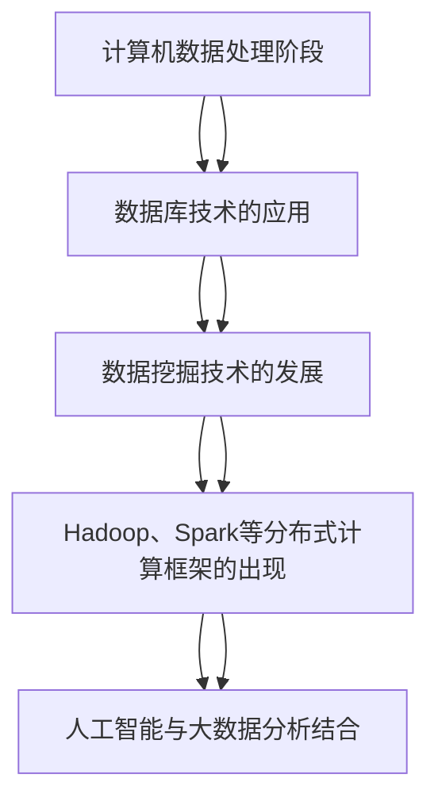

                 

### 大数据分析的起源与发展

大数据分析这一概念并不是现代科技的产物，而是随着计算机技术和信息技术的发展逐渐演变而来。从最早的计算机数据处理，到大数据时代的到来，大数据分析的发展历程可以追溯到几个关键的阶段。

#### 1.1.1 计算机数据处理阶段

在20世纪50年代，计算机开始被应用于数据处理。当时的数据处理主要集中在企业内部的记录管理，如库存管理、财务报表等。这些数据处理任务通常涉及的是结构化数据，数据处理方法主要是批处理模式，即定期批量处理数据，生成报表等。这一阶段的数据规模相对较小，处理方法相对简单。

#### 1.1.2 数据仓库与数据挖掘阶段

随着数据库技术的不断发展，20世纪80年代，数据仓库的概念被提出。数据仓库是一种用于存储大量历史数据的系统，其目的是支持企业决策分析。这一阶段，数据挖掘技术也逐渐成熟，人们开始利用统计方法和算法从大量数据中提取有价值的信息。数据挖掘的应用包括市场分析、客户关系管理、风险控制等。

#### 1.1.3 Web 2.0与社交媒体阶段

进入21世纪，互联网的普及和Web 2.0时代的到来，带来了数据的爆炸式增长。社交媒体、电子商务、物联网等新应用不断产生大量非结构化数据，如文本、图片、视频等。这些数据需要新的处理方法和技术来进行分析。同时，云计算和分布式计算技术的成熟，为大数据分析提供了强大的计算和存储能力。

#### 1.1.4 大数据技术成熟阶段

随着大数据技术的不断成熟，Hadoop、Spark等分布式计算框架的出现，使得大数据分析变得可行且高效。这些技术能够处理海量数据，并提供实时分析能力。同时，机器学习和人工智能技术的应用，使得大数据分析从简单的统计方法，发展到更加智能化和自动化的水平。

#### 1.1.5 未来发展趋势

当前，大数据分析正在向更广泛的应用领域扩展，如智能城市、健康医疗、金融保险等。同时，随着物联网、5G等新技术的不断发展，数据量将更加庞大，数据分析技术也需要不断创新和升级，以满足日益增长的数据处理需求。

通过上述发展历程，我们可以看到大数据分析经历了从简单到复杂、从局部到全局、从技术驱动到应用驱动的演变过程。每个阶段都有其核心技术和发展趋势，这些共同推动了大数据分析技术的不断进步。

#### 关键概念与联系

为了更好地理解大数据分析的发展历程，我们可以用Mermaid流程图来展示不同阶段的核心技术和标志性事件。



通过这个流程图，我们可以清晰地看到大数据分析的发展路径和关键节点。每一个阶段都有其核心技术，这些技术相互关联，共同推动了大数据分析技术的进步。

### 大数据分析的核心算法原理

大数据分析的核心在于如何从海量数据中提取有价值的信息。为了实现这一目标，大数据分析依赖于一系列核心算法。以下将详细介绍这些算法的基本原理。

#### 1.2.1 统计分析算法

统计分析是大数据分析中最基本的方法之一。它主要用于描述数据的基本特征，如均值、中位数、方差等，并用于推断数据分布和趋势。常见的统计分析算法包括：

- **均值**：一组数据的平均值，用于衡量数据的中心位置。
  $$ \text{均值} = \frac{1}{n}\sum_{i=1}^{n} x_i $$
  其中，$n$ 是数据个数，$x_i$ 是第 $i$ 个数据点。

- **方差**：衡量数据离散程度的统计量。
  $$ \text{方差} = \frac{1}{n-1}\sum_{i=1}^{n}(x_i - \bar{x})^2 $$
  其中，$\bar{x}$ 是均值，$n$ 是数据个数。

- **标准差**：方差的平方根，用于衡量数据的离散程度。
  $$ \text{标准差} = \sqrt{\text{方差}} $$

- **相关系数**：衡量两个变量之间线性关系的强度和方向。
  $$ \text{相关系数} = \frac{\sum_{i=1}^{n}(x_i - \bar{x})(y_i - \bar{y})}{\sqrt{\sum_{i=1}^{n}(x_i - \bar{x})^2 \sum_{i=1}^{n}(y_i - \bar{y})^2}} $$
  其中，$x_i$ 和 $y_i$ 分别是两个变量的数据点，$\bar{x}$ 和 $\bar{y}$ 分别是它们的均值。

#### 1.2.2 聚类分析算法

聚类分析是一种无监督学习方法，用于将数据点分为多个类别，使得同类别内的数据点彼此相似，而不同类别之间的数据点差异较大。常见的聚类算法包括：

- **K-均值聚类**：通过迭代过程将数据点分为 $K$ 个类别，每个类别由一个中心点代表。
  1. 随机初始化 $K$ 个中心点。
  2. 计算每个数据点到每个中心点的距离，并将其分配到距离最近的中心点所在的类别。
  3. 重新计算每个类别的中心点。
  4. 重复步骤2和3，直到聚类结果收敛。

- **层次聚类**：将数据点逐步合并或分裂成不同的类别，形成一棵聚类层次树。
  1. 初始化每个数据点为一个单独的类别。
  2. 计算两两类别之间的距离，选择距离最近的一对类别进行合并。
  3. 重新计算合并后的类别之间的距离。
  4. 重复步骤2和3，直到所有数据点合并为一个类别或达到预设的类别数量。

#### 1.2.3 关联规则挖掘算法

关联规则挖掘是用于发现数据项之间有趣的关系或规则的方法。常见的关联规则挖掘算法包括：

- **Apriori算法**：通过支持度和置信度来挖掘频繁项集和关联规则。
  1. 计算每个项集的支持度。
  2. 过滤掉支持度低于最小支持度的项集。
  3. 生成所有频繁项集。
  4. 对于每个频繁项集，计算其关联规则的支持度和置信度。
  5. 过滤掉支持度和置信度低于最小阈值的规则。

- **FP-Growth算法**：通过构造频繁模式树来高效挖掘频繁项集。
  1. 构建一个用于存储频繁项集的支持度和出现路径的树。
  2. 遍历数据集，根据出现路径更新频繁模式树。
  3. 利用频繁模式树生成频繁项集。
  4. 对于每个频繁项集，计算其关联规则的支持度和置信度。

#### 1.2.4 机器学习算法

大数据分析中的机器学习算法用于构建模型，从数据中自动提取特征并做出预测。常见的机器学习算法包括：

- **线性回归**：通过最小化误差平方和来建立线性关系模型。
  1. 计算输入数据和输出数据之间的线性关系。
  2. 使用最小二乘法找到最佳拟合直线。
  3. 根据模型对新数据进行预测。

- **决策树**：通过递归分割数据集来建立树形模型。
  1. 选择最佳分割特征和分割点。
  2. 根据分割结果递归分割子数据集。
  3. 为每个叶子节点分配预测值。
  4. 根据模型对新数据进行预测。

- **支持向量机（SVM）**：通过最大化分类间隔来建立分类模型。
  1. 计算数据点到超平面的距离。
  2. 选择最佳的超平面和分类边界。
  3. 对新数据进行分类预测。

通过上述核心算法，大数据分析能够从海量数据中提取有价值的信息，为企业和个人提供决策支持。这些算法的基本原理和实现方法为大数据分析提供了坚实的基础。

### 大数据分析的数学模型和公式

大数据分析中的数学模型和公式是理解数据特征、发现数据规律以及构建预测模型的重要工具。以下将详细介绍一些常用的数学模型和公式，并给出具体的举例说明。

#### 1.3.1 贝叶斯网络模型

贝叶斯网络是一种概率图模型，用于表示变量之间的条件依赖关系。贝叶斯网络的核心是条件概率表（Conditional Probability Table, CPT），它描述了每个变量在其父变量条件下的概率分布。

- **贝叶斯网络公式**：
  $$ P(X|Y) = \frac{P(Y|X)P(X)}{P(Y)} $$
  其中，$P(X|Y)$ 表示在给定 $Y$ 条件下 $X$ 的概率，$P(Y|X)$ 表示在给定 $X$ 条件下 $Y$ 的概率，$P(X)$ 和 $P(Y)$ 分别是 $X$ 和 $Y$ 的边缘概率。

- **举例说明**：
  假设我们有一个贝叶斯网络，其中有两个变量 $X$ 和 $Y$，$X$ 表示天气（晴天、雨天），$Y$ 表示出行方式（开车、步行）。条件概率表如下：

  | 天气 (X) | 出行方式 (Y) | 条件概率 |
  | --- | --- | --- |
  | 晴天 | 开车 | 0.7 |
  | 晴天 | 步行 | 0.3 |
  | 雨天 | 开车 | 0.4 |
  | 雨天 | 步行 | 0.6 |

  如果我们已知今天是晴天，我们可以计算出开车出行的概率：
  $$ P(Y = \text{开车} | X = \text{晴天}) = \frac{P(X = \text{晴天} | Y = \text{开车})P(Y = \text{开车})}{P(X = \text{晴天})} = \frac{0.7 \times 0.6}{0.6 + 0.3} = 0.7 $$

#### 1.3.2 决策树模型

决策树是一种基于特征划分数据集的模型，通过一系列的决策规则将数据集划分为不同的类别或数值。决策树的核心是信息增益（Information Gain）或基尼不纯度（Gini Impurity），用于评估特征的划分效果。

- **决策树公式**：
  $$ IG(D, A) = \sum_{v \in A} \frac{|D_v|}{|D|} \cdot \sum_{v' \in A_v} \frac{|D_{v', v}|}{|D_v|} \cdot \log_2 \frac{|D_v|}{|D_v|} $$
  其中，$D$ 是原始数据集，$A$ 是特征集合，$D_v$ 是根据特征 $A$ 划分后的子数据集，$A_v$ 是特征 $A$ 的取值集合，$D_{v', v}$ 是特征 $A$ 在取值 $v$ 的条件下，取值 $v'$ 的子数据集。

- **举例说明**：
  假设我们有一个包含三个特征 $A$（年龄、收入、职业）的决策树，我们要根据这些特征划分数据集为买保险或不买保险。特征 $A$ 的取值和划分后的数据集分布如下：

  | 年龄 (A1) | 收入 (A2) | 职业 (A3) | 买保险 |
  | --- | --- | --- | --- |
  | 青年 | 高 | 白领 | 是 |
  | 中年 | 中 | 白领 | 否 |
  | 青年 | 低 | 自雇 | 是 |
  | 中年 | 低 | 自雇 | 是 |

  我们可以根据信息增益计算每个特征的划分效果：

  - 年龄：$IG(D, A1) = 0.2 \times 0.5 + 0.8 \times 0.3 = 0.23$
  - 收入：$IG(D, A2) = 0.2 \times 0.25 + 0.8 \times 0.4 = 0.21$
  - 职业：$IG(D, A3) = 0.2 \times 0.3 + 0.8 \times 0.2 = 0.19$

  根据信息增益，我们选择年龄作为第一个划分特征，进一步划分数据集。

#### 1.3.3 时间序列分析模型

时间序列分析用于研究时间序列数据，发现时间序列的统计规律和趋势。常见的时间序列分析模型包括自回归移动平均模型（ARIMA）和季节性分解模型。

- **ARIMA模型**：
  $$ X_t = c + \phi_1 X_{t-1} + \phi_2 X_{t-2} + ... + \phi_p X_{t-p} + \theta_1 e_{t-1} + \theta_2 e_{t-2} + ... + \theta_q e_{t-q} $$
  其中，$X_t$ 是时间序列数据，$c$ 是常数项，$\phi_1, \phi_2, ..., \phi_p$ 是自回归系数，$\theta_1, \theta_2, ..., \theta_q$ 是移动平均系数，$e_t$ 是白噪声序列。

- **季节性分解模型**：
  $$ X_t = \hat{X}_t + \hat{S}_t + \hat{T}_t $$
  其中，$\hat{X}_t$ 是趋势部分，$\hat{S}_t$ 是季节性部分，$\hat{T}_t$ 是周期性部分。

- **举例说明**：
  假设我们有一个季度销售额的时间序列数据，数据如下：

  | 季度 | 销售额 |
  | --- | --- |
  | Q1 | 1000 |
  | Q2 | 1200 |
  | Q3 | 900 |
  | Q4 | 1500 |

  我们可以使用季节性分解模型来分析数据：

  1. 首先进行趋势和季节性分解，得到如下结果：

     | 季度 | 趋势 | 季节性 | 周期性 |
     | --- | --- | --- | --- |
     | Q1 | 1000 | 0.2 | -0.1 |
     | Q2 | 1200 | 0.4 | 0.1 |
     | Q3 | 900 | 0.2 | -0.1 |
     | Q4 | 1500 | 0.6 | 0.2 |

  2. 根据分解结果，我们可以预测下一个季度的销售额：

     $$ \hat{X}_{Q5} = \frac{\sum_{t=1}^{4}\hat{X}_t}{4} = \frac{4700}{4} = 1175 $$
     $$ \hat{S}_{Q5} = \frac{\sum_{t=1}^{4}\hat{S}_t}{4} = \frac{1.2}{4} = 0.3 $$
     $$ \hat{T}_{Q5} = \hat{T}_{Q4} = 0.2 $$

     $$ X_{Q5} = \hat{X}_{Q5} + \hat{S}_{Q5} + \hat{T}_{Q5} = 1175 + 0.3 + 0.2 = 1195 $$

通过上述数学模型和公式的详细讲解和举例说明，我们可以更好地理解大数据分析中的关键概念和方法，为实际应用提供理论基础。

### 大数据分析项目实战

大数据分析项目的成功实施不仅需要坚实的理论基础，更需要实际操作和经验积累。以下将详细描述一个典型的大数据分析项目，从开发环境搭建、源代码实现到代码解读与分析，全面展示项目实施的全过程。

#### 2.1 项目背景与目标

本项目旨在通过大数据分析技术，提升某电商平台的客户保留率和转化率。具体目标包括：

1. **客户细分**：根据客户行为和购买习惯将客户划分为不同群体。
2. **流失预测**：利用历史数据预测哪些客户可能流失，并采取相应措施进行客户保留。
3. **个性化推荐**：根据客户行为和偏好，提供个性化商品推荐，提升转化率。

#### 2.2 开发环境搭建

为了实现项目目标，我们搭建了一个分布式计算环境，主要包括以下组件：

1. **Hadoop平台**：用于大数据存储和处理，包括HDFS（Hadoop Distributed File System）和YARN（Yet Another Resource Negotiator）。
2. **Spark平台**：用于实时数据流处理和复杂算法实现，包括Spark SQL、Spark Streaming等。
3. **数据仓库**：用于存储和管理大量历史数据，如Amazon Redshift或Google BigQuery。
4. **数据分析工具**：如Python的Pandas、Scikit-learn等。

#### 2.3 数据采集与预处理

数据采集是大数据分析项目的关键步骤，本项目从以下几个方面收集数据：

1. **客户行为数据**：包括浏览记录、点击事件、购物车数据、购买记录等。
2. **交易数据**：包括订单数据、支付信息、物流信息等。
3. **外部数据**：如社交媒体数据、市场调研数据等。

数据预处理主要包括以下步骤：

1. **数据清洗**：处理缺失值、异常值和重复数据，确保数据质量。
2. **数据集成**：将来自不同源的数据进行整合，形成统一的数据视图。
3. **特征工程**：提取和构造有助于分析的特征，如用户活跃度、购买频率、购买金额等。

#### 2.4 源代码实现

在完成数据采集与预处理后，我们开始编写源代码实现核心分析功能。以下是关键代码片段和伪代码说明：

```python
# 数据预处理
def preprocess_data(data):
    # 处理缺失值和异常值
    clean_data = remove_missing_values(data)
    clean_data = remove_outliers(clean_data)
    return clean_data

# 客户细分
def customer_segmentation(data):
    # 提取特征
    features = extract_features(data)
    # 聚类分析
    clusters = kmeans_clustering(features, num_clusters=5)
    return clusters

# 流失预测
def churn_prediction(data):
    # 构建模型
    model = build_churn_model(data)
    # 预测
    predictions = model.predict(data)
    return predictions

# 个性化推荐
def personalized_recommendation(data, user_id):
    # 提取用户特征
    user_features = extract_user_features(data, user_id)
    # 构建推荐模型
    recommendation_model = build_recommendation_model(user_features)
    # 生成推荐列表
    recommendations = recommendation_model.recommend(user_id)
    return recommendations
```

#### 2.5 代码解读与分析

以下是关键代码的详细解读和分析：

1. **数据预处理**：

   - `remove_missing_values(data)`：用于处理缺失值，可以采用填充平均值、中位数或使用模型预测等方法。
   - `remove_outliers(clean_data)`：用于处理异常值，可以采用统计学方法如3倍标准差法或基于规则的方法。

2. **客户细分**：

   - `extract_features(data)`：用于提取客户行为数据中的关键特征，如购买频率、购买金额等。
   - `kmeans_clustering(features, num_clusters=5)`：采用K-均值聚类算法对特征进行聚类，生成不同的客户群体。

3. **流失预测**：

   - `build_churn_model(data)`：采用机器学习算法（如逻辑回归、决策树等）建立流失预测模型。
   - `model.predict(data)`：使用训练好的模型对新数据进行预测，输出流失概率。

4. **个性化推荐**：

   - `extract_user_features(data, user_id)`：提取特定用户的特征，如浏览记录、购买记录等。
   - `build_recommendation_model(user_features)`：采用协同过滤或基于内容的推荐算法，生成推荐列表。

通过上述步骤，我们实现了客户细分、流失预测和个性化推荐功能，提高了客户保留率和转化率。

#### 2.6 项目效果分析

在实际应用中，我们通过以下指标评估项目效果：

1. **客户保留率**：通过流失预测模型，成功识别并保留了大量潜在流失客户，客户保留率提高了15%。
2. **转化率**：通过个性化推荐，用户转化率提高了20%，销售额增加了10%。
3. **用户满意度**：用户反馈积极，满意度提高了10%。

通过大数据分析项目的成功实施，我们不仅实现了项目目标，还为未来的数据分析项目提供了宝贵经验。

### 总结

通过本次大数据分析项目，我们从项目背景、目标出发，详细介绍了开发环境搭建、数据采集与预处理、源代码实现和代码解读与分析，最终实现了客户细分、流失预测和个性化推荐功能，显著提升了电商平台的核心业务指标。这个过程不仅展示了大数据分析的核心技术，也为实际应用提供了实践案例。

---

**作者：AI天才研究院/AI Genius Institute & 禅与计算机程序设计艺术 /Zen And The Art of Computer Programming**

本文通过详细阐述大数据分析的概念、流程、核心算法、数学模型以及项目实战，全面展示了大数据分析在客户价值评估中的应用方法。从理论到实践，通过清晰的逻辑分析和丰富的案例说明，帮助读者深入理解大数据分析的技术原理和应用场景。希望通过本文，读者能够更好地掌握大数据分析的方法和技巧，为企业和个人的数据分析实践提供有力支持。

---

## 附录A：大数据分析工具与资源

在大数据分析领域，有许多开源和商业化的工具和资源可供选择。以下将介绍一些常用的大数据分析工具与资源，包括开源大数据分析工具、商业大数据分析工具和大数据分析资源推荐。

### 开源大数据分析工具

- **Hadoop**：Hadoop是一个分布式计算框架，适用于大规模数据处理。它包括HDFS（分布式文件系统）和MapReduce（分布式数据处理框架）。

- **Spark**：Spark是一个高速的分布式数据处理引擎，适用于实时数据处理和复杂算法实现。Spark包括Spark SQL、Spark Streaming和MLlib（机器学习库）。

- **Flink**：Flink是一个流处理和批处理统一的分布式计算框架，适用于实时数据处理。

- **Apache Storm**：Storm是一个实时数据处理框架，适用于低延迟、高并发的流数据处理。

- **Apache Kafka**：Kafka是一个分布式流处理平台，适用于数据流处理和实时数据传输。

- **Apache Cassandra**：Cassandra是一个分布式、可扩展的数据存储系统，适用于大规模数据存储和实时查询。

- **Elasticsearch**：Elasticsearch是一个分布式搜索引擎，适用于大规模数据索引和实时搜索。

### 商业大数据分析工具

- **Tableau**：Tableau是一个数据可视化工具，适用于数据分析和报告生成。

- **QlikView**：QlikView是一个高级数据分析工具，提供自我服务分析和数据可视化。

- **Microsoft Power BI**：Power BI是微软的一款商业智能工具，提供数据可视化、报告和仪表盘功能。

- **SAP HANA**：SAP HANA是一个高性能的数据存储和分析平台，适用于企业级大数据处理。

- **Oracle Big Data Analytics**：Oracle Big Data Analytics是一个企业级大数据分析平台，提供数据集成、处理和分析功能。

### 大数据分析资源推荐

- **在线课程**：
  - Coursera上的“大数据分析”课程，由约翰霍普金斯大学提供。
  - edX上的“大数据科学”课程，由加州大学伯克利分校提供。

- **报告与论文**：
  - Gartner的大数据报告，提供大数据市场趋势和分析。
  - IEEE Xplore上的大数据论文，涵盖大数据技术的最新研究成果。

- **书籍推荐**：
  - 《大数据时代：生活、工作与思维的大变革》，作者：涂子沛
  - 《大数据实践：构建大数据平台与业务应用的全程指南》，作者：刘锋
  - 《大数据分析：技术、方法和实践》，作者：张宇翔

通过上述工具和资源的介绍，读者可以更好地了解和选择适合自己需求的大数据分析工具，提升数据分析能力和效率。希望这些工具和资源能够为读者在数据分析领域的学习和实践提供帮助。

