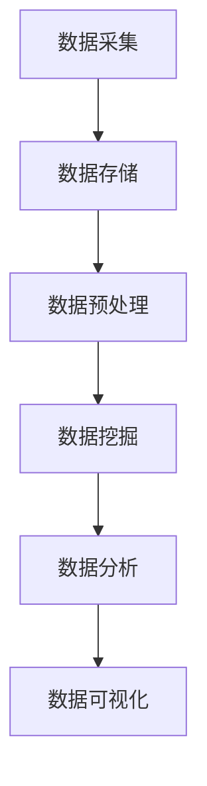
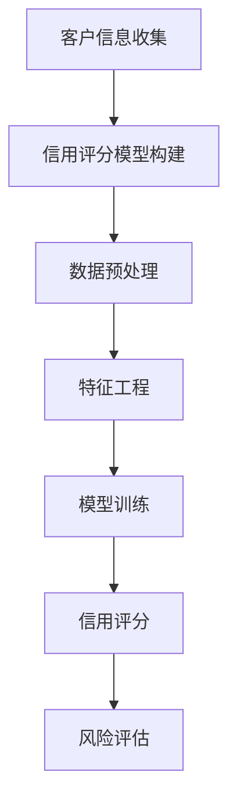
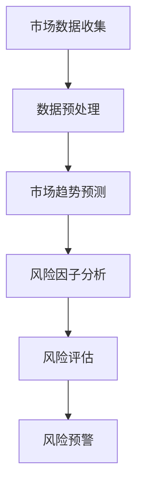
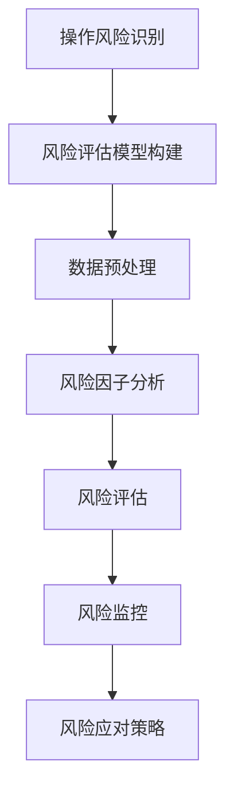

                 

# 《大数据分析在风险管理中的实践与创新》

## 摘要

随着大数据技术的迅猛发展，其在各个行业中的应用也日益广泛。本文旨在探讨大数据分析在风险管理领域中的实践与创新，通过对大数据分析基础、风险管理概述以及大数据分析在信用风险、市场风险和操作风险中的应用进行深入剖析，展示大数据分析在风险管理中的巨大潜力和应用前景。文章通过实际案例、新型技术和未来趋势的探讨，为读者提供了全面、系统的了解大数据分析在风险管理中的实际应用和创新思路。本文将为从事风险管理工作的专业人士以及对此领域感兴趣的研究者提供有价值的参考和启示。

## 目录

### 第一部分：大数据分析基础

#### 第1章：大数据分析概述

##### 1.1.1 大数据的定义与特征
##### 1.1.2 大数据分析的重要性
##### 1.1.3 大数据分析的基本流程

#### 第2章：大数据技术架构

##### 2.1.1 大数据存储技术
##### 2.1.2 大数据处理技术
##### 2.1.3 大数据安全技术

#### 第3章：大数据分析方法

##### 3.1.1 数据预处理方法
##### 3.1.2 数据挖掘方法
##### 3.1.3 数据可视化方法

### 第二部分：大数据分析在风险管理中的应用

#### 第4章：风险管理概述

##### 4.1.1 风险管理的定义与目的
##### 4.1.2 风险管理的流程
##### 4.1.3 风险管理的挑战与机遇

#### 第5章：大数据分析在信用风险管理中的应用

##### 5.1.1 信用风险评估的基本方法
##### 5.1.2 大数据分析在信用风险管理中的应用
##### 5.1.3 大数据分析在信用风险管理中的优势

#### 第6章：大数据分析在市场风险管理中的应用

##### 6.1.1 市场风险的基本概念
##### 6.1.2 大数据分析在市场风险管理中的应用
##### 6.1.3 大数据分析在市场风险管理中的优势

#### 第7章：大数据分析在操作风险管理中的应用

##### 7.1.1 操作风险的基本概念
##### 7.1.2 大数据分析在操作风险管理中的应用
##### 7.1.3 大数据分析在操作风险管理中的优势

### 第三部分：大数据分析在风险管理中的实践与创新

#### 第8章：大数据分析在风险管理中的最佳实践

##### 8.1.1 成功案例分析
##### 8.1.2 风险管理中的大数据分析应用场景
##### 8.1.3 风险管理中的大数据分析未来趋势

#### 第9章：大数据分析在风险管理中的创新

##### 9.1.1 新型大数据分析技术在风险管理中的应用
##### 9.1.2 大数据分析在风险管理中的技术创新
##### 9.1.3 大数据分析在风险管理中的创新趋势

#### 第10章：大数据分析在风险管理中的未来展望

##### 10.1.1 大数据分析在风险管理中的未来发展
##### 10.1.2 风险管理面临的挑战与机遇
##### 10.1.3 大数据分析在风险管理中的未来趋势

### 附录

#### 附录A：大数据分析在风险管理中的常用工具与资源

##### A.1.1 常用大数据分析工具
##### A.1.2 风险管理相关数据集与资源
##### A.1.3 风险管理领域学术期刊与论文资源

#### 附录B：大数据分析在风险管理中的Mermaid流程图

##### B.1.1 风险管理流程Mermaid图
##### B.1.2 信用风险评估流程Mermaid图
##### B.1.3 市场风险分析流程Mermaid图
##### B.1.4 操作风险分析流程Mermaid图

#### 附录C：大数据分析在风险管理中的数学模型与公式

##### C.1.1 信用风险评估模型
##### C.1.2 市场风险模型
##### C.1.3 操作风险模型

#### 附录D：大数据分析在风险管理中的项目实战案例

##### D.1.1 信用风险评估项目实战
##### D.1.2 市场风险分析项目实战
##### D.1.3 操作风险分析项目实战

#### 附录E：大数据分析在风险管理中的开发环境与源代码

##### E.1.1 开发环境搭建
##### E.1.2 源代码实现与解读
##### E.1.3 源代码分析与优化

## 引言

### 大数据的崛起

大数据作为一种新兴的技术和资源，正在深刻地改变着各个行业的发展模式。大数据是指无法在一定时间内用常规软件工具进行捕捉、管理和处理的数据集合，通常包括海量数据、多样性数据和高速度数据等特点。随着互联网的普及、物联网技术的应用以及传感器技术的进步，大数据已经渗透到我们生活的方方面面，从社交网络、电子商务到金融、医疗等各个领域。

### 风险管理的挑战

风险管理作为企业管理的重要组成部分，旨在识别、评估和应对潜在风险，以确保企业稳健运营和可持续发展。然而，随着商业环境的复杂化和不确定性增加，传统的风险管理方法已经难以应对日益严峻的风险挑战。大数据技术的崛起为风险管理提供了新的思路和方法，通过大数据分析可以更加精确地识别风险、预测风险并制定有效的风险管理策略。

### 大数据分析在风险管理中的重要性

大数据分析在风险管理中的应用具有重要的现实意义。首先，大数据分析可以帮助企业快速识别潜在的风险因素，提供实时、动态的风险评估。其次，大数据分析可以挖掘大量的历史数据，发现风险事件之间的关联性和规律，从而提高风险管理的前瞻性和有效性。此外，大数据分析还可以通过实时监控和预警机制，帮助企业及时应对突发事件，降低风险损失。因此，大数据分析在风险管理中的应用不仅能够提升企业的风险管理水平，还能够为企业带来显著的商业价值。

### 本文的结构与内容

本文将从大数据分析的基础知识出发，逐步深入探讨大数据分析在风险管理中的应用与实践。首先，我们将介绍大数据分析的基本概念、技术架构和分析方法，为后续内容的探讨奠定基础。接着，我们将详细分析大数据分析在信用风险管理、市场风险管理和操作风险管理中的应用，通过实际案例展示大数据分析在风险管理中的优势和潜力。最后，本文将探讨大数据分析在风险管理中的创新和未来发展趋势，为读者提供全面、系统的了解和思考。

## 第一部分：大数据分析基础

### 第1章：大数据分析概述

#### 1.1.1 大数据的定义与特征

大数据（Big Data）是指无法在一定时间内用常规软件工具进行捕捉、管理和处理的数据集合。与传统的小数据（Small Data）相比，大数据具有以下三个显著特征：

1. **海量性（Volume）**：大数据的一个显著特征是其数据量巨大。随着互联网的普及和物联网技术的应用，每天产生的数据量呈指数级增长。这些数据包括结构化数据（如数据库记录）、半结构化数据（如XML、JSON文档）和非结构化数据（如文本、图片、视频等）。

2. **多样性（Variety）**：大数据的多样性体现在数据来源的广泛性和数据类型的多样性。除了传统的结构化数据，大数据还包含了社交媒体数据、传感器数据、日志数据、地理位置数据等多样化的数据类型。

3. **速度（Velocity）**：大数据的产生和处理速度非常快。在许多应用场景中，数据是实时或近实时生成的，如金融市场、交通监控、社交媒体等。这就要求数据处理系统具有高吞吐量和低延迟的特性。

4. **价值（Value）**：大数据的价值密度相对较低。在海量数据中，只有一小部分数据对特定问题或决策具有实际价值。因此，如何从海量数据中提取有价值的信息成为大数据分析的核心挑战。

#### 1.1.2 大数据分析的重要性

大数据分析在现代社会的重要性不言而喻，它已经渗透到各个行业，包括商业、医疗、金融、政府等。以下是大数据分析的重要性和应用领域：

1. **商业应用**：大数据分析可以帮助企业更好地了解客户需求、优化供应链管理、提高营销效果等。例如，通过分析消费者购买行为数据，企业可以制定更精准的营销策略，从而提高销售额。

2. **医疗健康**：大数据分析在医疗健康领域具有广泛的应用，如疾病预测、个性化治疗、药物研发等。通过对大量医疗数据进行分析，可以提前预测疾病趋势，提高医疗资源利用效率。

3. **金融领域**：大数据分析在金融领域发挥着关键作用，如信用风险评估、市场风险预测、欺诈检测等。通过分析大量的交易数据和客户行为数据，金融机构可以更准确地评估风险，降低欺诈风险。

4. **公共安全**：大数据分析在公共安全领域也有重要应用，如恐怖主义防范、犯罪预测等。通过分析大量的社会安全数据，政府可以提前预警潜在的安全威胁，提高公共安全水平。

5. **政府治理**：大数据分析可以帮助政府提高决策效率、优化公共服务。例如，通过对交通流量数据的分析，政府可以优化交通管理，减少交通拥堵。

#### 1.1.3 大数据分析的基本流程

大数据分析通常包括以下基本流程：

1. **数据采集**：从各种数据源（如数据库、传感器、网站日志等）收集数据。数据采集可以采用实时流数据采集或批量数据采集。

2. **数据存储**：将采集到的数据存储在分布式数据存储系统（如Hadoop、Spark等）中。数据存储需要考虑到数据的持久性、可靠性和可扩展性。

3. **数据预处理**：对原始数据进行清洗、转换和归一化等处理，以消除噪声、缺失值和异常值，为后续分析做好准备。

4. **数据挖掘**：使用各种数据挖掘算法（如聚类、分类、关联规则挖掘等）从数据中提取有价值的信息和知识。

5. **数据分析**：通过对挖掘结果进行统计分析和可视化，帮助用户更好地理解和解释数据，支持决策制定。

6. **数据可视化**：将分析结果以图表、地图、热力图等形式展示，使数据更易于理解和解释。

#### 1.1.4 大数据分析的核心技术

大数据分析涉及多种核心技术，以下是其中几个关键的技术：

1. **分布式计算**：分布式计算技术（如MapReduce、Spark）能够高效地处理海量数据，通过分布式架构实现并行计算。

2. **数据挖掘算法**：数据挖掘算法（如K-means、决策树、神经网络等）用于从数据中提取有价值的信息和模式。

3. **机器学习**：机器学习技术（如支持向量机、随机森林、深度学习等）能够自动学习数据中的模式和规律，用于预测和分类。

4. **数据存储与处理框架**：如Hadoop、Spark等大数据处理框架，提供高效的数据存储和处理能力，支持大规模数据处理。

5. **数据可视化工具**：数据可视化工具（如Tableau、Power BI等）能够将数据以直观的方式展示，帮助用户理解数据。

### 总结

本章概述了大数据分析的基本概念、特征和重要性，介绍了大数据分析的基本流程和核心技术。通过本章的学习，读者可以初步了解大数据分析的基础知识，为后续章节的深入探讨做好准备。

### 第2章：大数据技术架构

#### 2.1.1 大数据存储技术

大数据存储技术是大数据分析的基础，其核心目标是高效、可靠地存储海量数据。以下几种大数据存储技术是当前应用较为广泛的：

1. **分布式文件系统**：如Hadoop Distributed File System (HDFS) 和Apache HBase。这些分布式文件系统采用主从架构，将数据分散存储在多个节点上，提供高可靠性和可扩展性。

   - **HDFS**：HDFS 是 Hadoop 的核心组件，用于存储海量数据。其设计目标是处理大数据集，采用主从架构，主节点（NameNode）负责管理文件系统的命名空间，从节点（DataNode）负责存储数据块。
   - **HBase**：HBase 是一个分布式、可扩展的列式存储系统，基于HDFS，适用于存储非结构化和半结构化数据。它提供了随机实时读取和写入的能力，广泛应用于实时数据分析场景。

2. **NoSQL数据库**：如MongoDB、Cassandra 和 Redis。这些数据库提供了灵活的数据模型和高效的数据访问能力，适用于处理大量非结构化数据。

   - **MongoDB**：MongoDB 是一个文档数据库，支持高扩展性和灵活的数据模型。它采用分布式存储架构，能够处理海量数据，广泛应用于内容管理、实时分析等场景。
   - **Cassandra**：Cassandra 是一个分布式、无主架构的宽列存储数据库，提供高可用性和高性能。它适用于需要高读写性能、高可靠性和数据分布性的场景。
   - **Redis**：Redis 是一个开源的内存数据结构存储系统，支持多种数据结构（如字符串、列表、集合、哈希表等）。它提供高速缓存和数据持久化功能，广泛应用于实时数据处理和缓存场景。

3. **关系型数据库**：如MySQL、PostgreSQL 和 Oracle。尽管关系型数据库在处理结构化数据方面具有优势，但在处理海量非结构化数据时可能面临性能瓶颈。然而，它们在处理结构化数据查询和分析方面仍具有广泛应用。

4. **云存储服务**：如Amazon S3、Google Cloud Storage 和 Microsoft Azure Storage。云存储服务提供了弹性、安全、可扩展的数据存储解决方案，适用于大规模数据处理和分布式应用。

#### 2.1.2 大数据处理技术

大数据处理技术是大数据分析的另一个关键组成部分，其核心目标是高效地处理海量数据。以下几种大数据处理技术是当前应用较为广泛的：

1. **MapReduce**：MapReduce 是一个分布式数据处理框架，由Google提出，用于处理海量数据集。其核心思想是将数据处理任务分解为Map和Reduce两个阶段：

   - **Map**阶段：将输入数据分成多个小块，对每个小块进行映射（map）操作，生成中间结果。
   - **Reduce**阶段：对Map阶段生成的中间结果进行归约（reduce）操作，生成最终结果。

   MapReduce 框架具有良好的可扩展性和容错性，适用于大规模数据处理。

2. **Spark**：Spark 是一个开源的大数据处理引擎，提供了丰富的API，支持多种数据处理操作，如批处理、流处理、机器学习等。Spark 相比于 MapReduce 具有更高的性能和更低的延迟，主要优势在于其内存计算和弹性调度。

   - **弹性分布式数据集（RDD）**：RDD 是 Spark 的核心数据结构，提供了丰富的操作接口，如变换（transformation）、行动（action）等。
   - **Spark Streaming**：Spark Streaming 是 Spark 的实时数据处理组件，用于处理实时数据流，支持批处理和流处理的统一接口。

3. **Flink**：Flink 是一个开源的流处理框架，具有高效、灵活和可靠的特点。Flink 提供了流处理和批处理的一体化解决方案，能够处理大规模实时数据流。

4. **Hadoop YARN**：Hadoop YARN（Yet Another Resource Negotiator）是一个资源调度和管理框架，用于管理 Hadoop 集群中的资源。YARN 改进了 Hadoop 的资源管理能力，支持多种数据处理框架（如Spark、Flink等）的运行。

#### 2.1.3 大数据安全技术

大数据在处理和存储过程中涉及大量敏感信息，因此大数据安全技术至关重要。以下几种大数据安全技术是当前应用较为广泛的：

1. **数据加密**：数据加密是一种常用的安全技术，用于保护数据在传输和存储过程中的机密性。常用的加密算法包括对称加密（如AES）和非对称加密（如RSA）。

2. **访问控制**：访问控制是一种安全机制，用于限制对数据的访问权限。访问控制通常基于用户身份验证和权限验证，如基于角色的访问控制（RBAC）和基于属性的访问控制（ABAC）。

3. **数据备份与恢复**：数据备份与恢复是一种保障数据完整性和可用性的技术。通过定期备份和快速恢复，确保数据在发生意外时能够恢复。

4. **数据隐私保护**：大数据分析往往涉及个人隐私信息的处理，因此数据隐私保护是大数据安全的重要方面。常用的隐私保护技术包括数据匿名化、数据混淆和数据脱敏等。

5. **网络安全**：网络安全是保障大数据系统安全的重要环节，包括防火墙、入侵检测、恶意软件防护等。

### 总结

本章介绍了大数据技术架构的核心组成部分，包括大数据存储技术、大数据处理技术和大数据安全技术。通过了解这些核心技术，读者可以更好地理解大数据系统的构建和运作，为后续章节的内容探讨奠定基础。

### 第3章：大数据分析方法

#### 3.1.1 数据预处理方法

数据预处理是大数据分析的关键步骤，其目的是清洗、转换和归一化原始数据，为后续的数据挖掘和分析创造条件。以下是几种常见的数据预处理方法：

1. **数据清洗**：
   - **缺失值处理**：缺失值处理是数据清洗的重要任务。常用的方法包括删除缺失值、填充缺失值（如使用平均值、中位数或预测值）等。
   - **异常值处理**：异常值处理包括识别和消除异常值。异常值可能是由错误输入、数据噪声或数据误差引起的。常用的方法包括基于统计学的方法（如Z-score、IQR）和基于距离的方法（如DBSCAN）。
   - **数据格式统一**：确保不同数据源的数据格式统一，如日期格式、货币格式等。

2. **数据转换**：
   - **数据归一化**：数据归一化是将数据缩放到一个共同的范围内，如[0, 1]或[-1, 1]。常用的归一化方法包括最小-最大归一化和Z-score归一化。
   - **数据标准化**：数据标准化是将数据转换为具有相同均值和标准差的分布。常用的方法包括Z-score标准化和极大极小标准化。
   - **特征编码**：特征编码是将非数值型特征转换为数值型特征，如将类别特征转换为独热编码（One-Hot Encoding）或标签编码（Label Encoding）。

3. **数据降维**：
   - **主成分分析（PCA）**：PCA 是一种常用的降维技术，通过将数据投影到新的正交坐标系中，保留主要特征，减少数据的维度。
   - **线性判别分析（LDA）**：LDA 是一种降维技术，主要用于分类问题，通过最大化不同类别间的距离和最小化类别内的距离，选择最重要的特征。
   - **因子分析（FA）**：因子分析是一种统计方法，通过提取隐藏的因子，减少数据的维度。

4. **数据可视化**：
   - **散点图**：散点图是一种常用的可视化方法，用于展示两个变量之间的关系。
   - **箱线图**：箱线图用于展示数据分布的统计特征，如均值、中位数、四分位数和异常值。
   - **热力图**：热力图用于展示数据的热点分布，适用于高维数据的可视化。

#### 3.1.2 数据挖掘方法

数据挖掘是从大量数据中提取有价值信息的过程，常用的数据挖掘方法包括：

1. **分类**：
   - **决策树**：决策树是一种基于树形模型的分类方法，通过递归划分数据集，生成决策树模型。
   - **随机森林**：随机森林是一种基于决策树的集成学习方法，通过随机森林生成多个决策树，并进行投票或平均得到最终预测结果。

2. **聚类**：
   - **K-means**：K-means 是一种基于距离的聚类方法，通过迭代优化，将数据划分为K个聚类。
   - **层次聚类**：层次聚类是一种基于层次结构的聚类方法，通过合并或分裂聚类，生成层次聚类树。

3. **关联规则挖掘**：
   - **Apriori算法**：Apriori算法是一种基于布尔矩阵的关联规则挖掘算法，通过生成频繁项集，提取关联规则。
   - **FP-growth算法**：FP-growth算法是一种基于压缩数据的关联规则挖掘算法，通过生成FP-tree，减少计算量。

4. **异常检测**：
   - **基于统计的方法**：如Z-score、IQR等。
   - **基于距离的方法**：如Local Outlier Factor（LOF）。
   - **基于模型的方法**：如孤立森林（Isolation Forest）。

5. **时间序列分析**：
   - **ARIMA模型**：ARIMA（自回归积分滑动平均模型）是一种常用的时序分析模型。
   - **LSTM模型**：LSTM（长短期记忆网络）是一种用于处理时序数据的深度学习模型。

#### 3.1.3 数据可视化方法

数据可视化是将数据以图形化的方式展示，帮助用户更好地理解和分析数据。以下是一些常用的数据可视化方法：

1. **散点图**：用于展示两个变量之间的关系。
2. **折线图**：用于展示数据随时间变化的趋势。
3. **柱状图**：用于展示不同类别或组的数据比较。
4. **饼图**：用于展示各部分占整体的比例。
5. **箱线图**：用于展示数据的统计特征，如均值、中位数、四分位数和异常值。
6. **热力图**：用于展示数据的热点分布。
7. **地图**：用于展示地理位置数据。

#### 总结

本章介绍了大数据分析中的数据预处理方法、数据挖掘方法和数据可视化方法。通过数据预处理，可以确保数据的质量和一致性；通过数据挖掘，可以提取有价值的信息和知识；通过数据可视化，可以更好地理解和解释分析结果。这些方法为大数据分析提供了全面的技术支持，为实际应用奠定了基础。

### 第4章：风险管理概述

#### 4.1.1 风险管理的定义与目的

风险管理是指识别、评估、监控和应对潜在风险的过程，旨在降低或消除不利影响，确保组织目标的实现。风险管理的定义和目的如下：

- **定义**：风险管理是一种系统化的方法，用于识别、评估、监控和应对潜在风险，以降低或消除不利影响，实现组织的业务目标。
- **目的**：风险管理的目的是确保组织在面临各种不确定性时，能够有效地识别、评估和应对风险，确保组织目标的实现和持续发展。具体包括：

  1. **降低风险损失**：通过识别和评估潜在风险，提前采取预防措施，降低风险损失。
  2. **保障组织运营**：确保组织的正常运营，降低因风险事件导致的中断或停摆。
  3. **提升决策质量**：通过风险分析和评估，为管理层提供科学、全面的风险信息，支持决策制定。
  4. **提高竞争力**：有效管理风险，提升组织的市场竞争力，实现可持续发展。

#### 4.1.2 风险管理的流程

风险管理通常包括以下步骤：

1. **风险识别**：识别潜在风险，包括外部风险（如市场变化、政策法规等）和内部风险（如操作风险、财务风险等）。风险识别的方法包括：

   - **访谈法**：通过与管理层、员工等进行访谈，了解潜在风险。
   - **头脑风暴**：组织相关人员，通过头脑风暴法，列出可能的风险。
   - **文件审查**：审查相关文件、记录和报告，识别潜在风险。

2. **风险评估**：对识别出的风险进行评估，确定风险的概率和影响，从而计算风险等级。风险评估的方法包括：

   - **定性评估**：通过专家评估、评分等方法，对风险进行定性评估。
   - **定量评估**：通过数据分析和数学模型，对风险进行定量评估。

3. **风险应对**：根据风险评估结果，制定风险应对策略，包括风险避免、风险减少、风险转移等。风险应对策略的选择取决于风险等级和组织的风险承受能力。

4. **风险监控**：建立风险监控机制，定期对风险进行监控和评估，确保风险应对措施的执行和效果。

5. **风险报告**：编写风险报告，向管理层和相关部门汇报风险状况、评估结果和应对措施。

#### 4.1.3 风险管理的挑战与机遇

风险管理在当前环境中面临诸多挑战和机遇：

1. **挑战**：

   - **复杂性增加**：商业环境日益复杂，潜在风险种类繁多，增加风险管理难度。
   - **数据依赖性**：风险管理依赖于大量数据，数据质量和可靠性对风险管理效果至关重要。
   - **合规性要求**：随着法规和政策的不断变化，组织需要遵守日益严格的合规要求，增加风险管理成本。
   - **技术更新迭代**：风险管理工具和技术的快速发展，要求组织不断更新和升级风险管理能力。

2. **机遇**：

   - **大数据应用**：大数据技术的应用为风险管理提供了新的工具和方法，提升风险识别、评估和应对的准确性。
   - **智能化技术**：人工智能、机器学习等智能技术在风险管理中的应用，提高风险管理的自动化和智能化水平。
   - **数据可视化**：数据可视化技术的应用，使风险管理更加直观和易于理解。
   - **跨领域合作**：跨领域合作和共享资源，提升风险管理能力，降低风险成本。

### 总结

本章介绍了风险管理的定义与目的、风险管理流程以及风险管理面临的挑战与机遇。通过了解风险管理的核心概念和流程，读者可以更好地理解大数据分析在风险管理中的应用价值和潜力。

### 第5章：大数据分析在信用风险管理中的应用

#### 5.1.1 信用风险评估的基本方法

信用风险评估是指评估债务人履行债务的能力和意愿，以确定其信用风险。以下是一些常见的信用风险评估基本方法：

1. **定性分析**：
   - **专家评估**：通过聘请专家对债务人的财务状况、经营历史、行业地位等因素进行评估。
   - **财务分析**：通过分析债务人的财务报表，如资产负债表、利润表和现金流量表，评估债务人的财务状况。

2. **定量分析**：
   - **评分模型**：通过构建评分模型，对债务人的信用风险进行量化评估。常见的评分模型包括逻辑回归、决策树、支持向量机等。
   - **财务比率分析**：通过计算债务人的财务比率，如流动比率、资产负债率、利息保障倍数等，评估债务人的偿债能力和财务稳定性。

3. **数据挖掘**：
   - **关联规则挖掘**：通过关联规则挖掘技术，分析债务人历史数据中的关联关系，发现潜在风险因素。
   - **聚类分析**：通过聚类分析技术，将债务人分为不同的风险群体，为信用风险评估提供分类依据。

#### 5.1.2 大数据分析在信用风险管理中的应用

大数据分析在信用风险管理中具有广泛的应用，以下是其主要应用场景：

1. **客户行为分析**：
   - **消费行为分析**：通过对客户消费行为的分析，识别潜在信用风险。例如，分析客户的消费习惯、消费金额、还款情况等。
   - **社交网络分析**：通过分析客户的社交网络活动，如微博、微信等，了解客户的社会关系和信用状况。

2. **金融交易监控**：
   - **交易行为分析**：通过对金融交易数据的分析，识别异常交易行为和潜在的欺诈行为。
   - **反洗钱监控**：通过分析客户的金融交易数据，识别潜在的洗钱活动，降低洗钱风险。

3. **信用评分模型**：
   - **特征工程**：通过大数据分析技术，提取更多的信用风险特征，如客户的行为特征、社交特征等，构建更准确的信用评分模型。
   - **模型优化**：利用大数据分析技术，对信用评分模型进行优化，提高模型的预测准确性和稳定性。

4. **信用风险预警**：
   - **实时监控**：通过实时监控客户行为和金融交易数据，及时发现潜在的风险信号，预警信用风险。
   - **风险识别**：利用大数据分析技术，识别出高风险客户群体，进行重点监控和管理。

#### 5.1.3 大数据分析在信用风险管理中的优势

大数据分析在信用风险管理中具有以下优势：

1. **全面性**：大数据分析可以整合多渠道、多维度的数据，提供全面的风险评估信息。

2. **准确性**：通过分析大量历史数据，大数据分析可以更准确地识别和预测信用风险。

3. **实时性**：大数据分析技术支持实时数据分析和监控，有助于快速识别和应对信用风险。

4. **自动化**：大数据分析可以自动化地执行风险识别、评估和预警等任务，提高风险管理效率。

5. **可扩展性**：大数据分析技术支持大规模数据处理和实时分析，适应不断变化的风险管理需求。

### 总结

本章介绍了信用风险评估的基本方法，以及大数据分析在信用风险管理中的应用和优势。通过大数据分析，金融机构可以更准确地识别和预测信用风险，提高风险管理水平，降低信用风险损失。

### 第6章：大数据分析在市场风险管理中的应用

#### 6.1.1 市场风险的基本概念

市场风险是指由于市场波动导致金融资产价值发生不利变化的风险。市场风险主要包括以下几类：

1. **利率风险**：利率波动可能导致债券、贷款等固定收益金融资产价值发生变动。
2. **汇率风险**：汇率波动可能导致跨国企业的财务状况、投资回报和现金流发生变化。
3. **股票风险**：股票市场波动可能导致股票价格和投资组合价值发生变动。
4. **商品风险**：商品价格波动可能导致商品相关投资和企业的运营成本发生变化。
5. **信用风险**：市场参与者（如债券发行人、贷款客户等）信用状况变化可能导致投资损失。

市场风险的特点是随机性强、影响广泛，需要通过有效的风险管理策略来降低其对企业财务稳定性和运营的影响。

#### 6.1.2 大数据分析在市场风险管理中的应用

大数据分析在市场风险管理中具有广泛的应用，以下是其主要应用场景：

1. **市场趋势预测**：
   - **时间序列分析**：利用时间序列分析方法，如ARIMA、LSTM等，对市场数据进行建模和预测，识别市场趋势和周期性变化。
   - **基于历史数据的预测**：通过分析历史市场数据，建立预测模型，预测未来市场走势。

2. **风险因子分析**：
   - **特征工程**：通过大数据分析技术，提取影响市场风险的关键因子，如宏观经济指标、行业指数、政策变动等。
   - **风险评估**：利用风险评估模型，对风险因子进行量化评估，识别市场风险。

3. **实时监控与预警**：
   - **数据流分析**：通过实时数据流分析技术，对市场数据进行实时监控，发现潜在的市场风险信号。
   - **预警系统**：建立市场风险预警系统，对市场风险进行实时预警和警报。

4. **投资组合优化**：
   - **风险平价策略**：利用大数据分析技术，实现风险平价策略，优化投资组合，降低市场风险。
   - **马科维茨模型**：利用马科维茨模型，结合大数据分析结果，实现投资组合的优化。

5. **行为分析**：
   - **投资者行为分析**：通过分析投资者行为数据，如交易记录、情绪指数等，预测市场波动和投资者情绪，辅助风险管理决策。

#### 6.1.3 大数据分析在市场风险管理中的优势

大数据分析在市场风险管理中具有以下优势：

1. **数据全面性**：大数据分析可以整合多渠道、多维度的市场数据，提供全面的市场风险信息。
2. **预测准确性**：通过分析大量历史数据，大数据分析可以更准确地预测市场趋势和风险变化。
3. **实时性**：大数据分析技术支持实时数据分析和监控，有助于快速识别和应对市场风险。
4. **自动化**：大数据分析可以自动化地执行市场风险分析和预警等任务，提高风险管理效率。
5. **个性化**：大数据分析可以根据企业特点和需求，提供个性化的风险管理方案。

### 总结

本章介绍了市场风险的基本概念，以及大数据分析在市场风险管理中的应用和优势。通过大数据分析，企业可以更准确地预测市场风险，优化投资组合，降低市场风险对企业的影响。

### 第7章：大数据分析在操作风险管理中的应用

#### 7.1.1 操作风险的基本概念

操作风险是指由于内部程序、人员和系统的不完备或失效，或由于外部事件导致的损失风险。操作风险可以分为以下几类：

1. **员工风险**：员工错误、疏忽、欺诈等行为可能导致操作风险。
2. **系统风险**：信息系统故障、软件缺陷、网络攻击等可能导致操作风险。
3. **过程风险**：内部流程和管理机制不完善可能导致操作风险。
4. **外部风险**：外部事件（如自然灾害、政治动荡等）可能导致操作风险。

操作风险的特点是突发性强、影响广泛，需要通过有效的风险管理策略来降低其对企业运营和财务稳定性的影响。

#### 7.1.2 大数据分析在操作风险管理中的应用

大数据分析在操作风险管理中具有广泛的应用，以下是其主要应用场景：

1. **员工行为分析**：
   - **异常行为检测**：通过分析员工行为数据，如出勤记录、工作效率等，发现异常行为，预防欺诈和违规行为。
   - **员工绩效评估**：通过大数据分析，评估员工绩效，提供个性化培训和激励机制。

2. **系统监控与预警**：
   - **系统故障预测**：通过分析系统日志数据，预测系统故障，提前进行维护和修复，降低系统风险。
   - **网络安全监控**：通过大数据分析，实时监控网络流量、用户行为等，识别和防范网络攻击。

3. **过程优化**：
   - **流程监控**：通过大数据分析，监控业务流程的运行状况，识别瓶颈和改进点，优化业务流程。
   - **流程自动化**：通过大数据分析，实现业务流程的自动化，降低操作风险。

4. **数据治理与合规性**：
   - **数据质量评估**：通过大数据分析，评估数据质量，确保数据的准确性、完整性和一致性。
   - **合规性监控**：通过大数据分析，监控业务操作是否符合法规和合规要求，预防合规风险。

5. **决策支持**：
   - **风险评估与决策**：通过大数据分析，对操作风险进行量化评估，为管理层提供决策支持。
   - **应急预案制定**：通过大数据分析，制定有效的应急预案，降低操作风险。

#### 7.1.3 大数据分析在操作风险管理中的优势

大数据分析在操作风险管理中具有以下优势：

1. **数据全面性**：大数据分析可以整合多渠道、多维度的操作数据，提供全面的风险信息。
2. **预测准确性**：通过分析大量历史数据，大数据分析可以更准确地预测操作风险。
3. **实时性**：大数据分析技术支持实时数据分析和监控，有助于快速识别和应对操作风险。
4. **自动化**：大数据分析可以自动化地执行操作风险分析和预警等任务，提高风险管理效率。
5. **个性化**：大数据分析可以根据企业特点和需求，提供个性化的风险管理方案。

### 总结

本章介绍了操作风险的基本概念，以及大数据分析在操作风险管理中的应用和优势。通过大数据分析，企业可以更有效地识别和应对操作风险，提高运营效率和安全性。

### 第8章：大数据分析在风险管理中的最佳实践

#### 8.1.1 成功案例分析

以下是一些大数据分析在风险管理中的成功案例分析：

1. **金融机构信用风险管理**：
   - **案例**：某大型银行通过大数据分析技术，对贷款申请者进行信用评估。通过对申请人历史信用记录、消费行为、社交网络等多维度数据进行综合分析，银行能够更准确地评估信用风险，提高贷款审批效率。
   - **效果**：该银行通过大数据分析，降低了不良贷款率，提高了客户满意度。

2. **电信行业欺诈检测**：
   - **案例**：某电信运营商利用大数据分析技术，对用户行为进行实时监控，识别潜在欺诈行为。通过对用户通话记录、短信内容、流量使用情况等多维度数据进行分析，运营商能够及时发现和阻止欺诈行为。
   - **效果**：该运营商通过大数据分析，降低了欺诈损失，提高了用户忠诚度。

3. **零售行业库存管理**：
   - **案例**：某大型零售企业通过大数据分析技术，优化库存管理。通过对销售数据、库存数据、市场数据等多维度数据进行综合分析，企业能够更准确地预测需求，优化库存水平。
   - **效果**：该企业通过大数据分析，降低了库存成本，提高了库存周转率。

#### 8.1.2 风险管理中的大数据分析应用场景

大数据分析在风险管理中的应用场景广泛，以下是一些常见的应用场景：

1. **信用风险管理**：通过对个人或企业历史信用记录、消费行为、社交网络等多维度数据进行综合分析，评估信用风险。
2. **市场风险管理**：通过对市场数据、行业数据、政策变动等多维度数据进行综合分析，预测市场风险，优化投资组合。
3. **操作风险管理**：通过对员工行为数据、系统日志数据、外部事件数据等多维度数据进行综合分析，识别和应对操作风险。
4. **欺诈检测**：通过对交易数据、用户行为数据、网络流量数据等多维度数据进行综合分析，识别和防范欺诈行为。
5. **风险预警**：通过对历史风险数据、实时数据等多维度数据进行综合分析，提前预警潜在风险，制定应对策略。

#### 8.1.3 风险管理中的大数据分析未来趋势

大数据分析在风险管理中的应用具有以下未来趋势：

1. **智能化**：随着人工智能技术的发展，大数据分析将更加智能化，能够自动识别和评估风险，提高风险管理效率。
2. **实时性**：实时大数据分析将得到更广泛的应用，实现风险事件的实时监控和预警。
3. **自动化**：自动化大数据分析工具和平台将提高风险管理自动化水平，降低人工干预。
4. **多样性**：大数据分析将涵盖更多数据类型和来源，如物联网数据、社交媒体数据等，提供更全面的风险信息。
5. **个性化**：大数据分析将根据企业特点和需求，提供个性化的风险管理方案。

### 总结

本章通过成功案例分析和未来趋势展望，展示了大数据分析在风险管理中的最佳实践和未来发展方向。通过深入应用大数据分析技术，企业可以更有效地识别和应对各种风险，提高风险管理水平。

### 第9章：大数据分析在风险管理中的创新

#### 9.1.1 新型大数据分析技术在风险管理中的应用

随着大数据技术的不断发展，新型大数据分析技术在风险管理中的应用不断涌现，这些技术包括：

1. **深度学习**：
   - **应用场景**：深度学习在风险管理中的应用主要包括图像识别、语音识别和自然语言处理等。例如，在信用风险管理中，通过深度学习技术可以对客户提交的贷款申请进行自动审核，提高审核效率。
   - **优势**：深度学习模型具有强大的特征提取能力和自适应能力，能够自动学习数据中的复杂模式，提高风险管理准确性。

2. **区块链**：
   - **应用场景**：区块链技术在风险管理中的应用主要包括数据存储、数据共享和隐私保护。例如，在操作风险管理中，通过区块链技术可以实现数据的安全存储和共享，降低操作风险。
   - **优势**：区块链技术具有去中心化、不可篡改和透明性等特点，能够提高数据的安全性和可信度。

3. **物联网**：
   - **应用场景**：物联网技术在风险管理中的应用主要包括实时监控和预警。例如，在市场风险管理中，通过物联网传感器可以实时监控市场动态，提前预警市场风险。
   - **优势**：物联网技术能够实现实时数据采集和传输，提高风险监测和预警的实时性。

4. **边缘计算**：
   - **应用场景**：边缘计算在风险管理中的应用主要包括数据分析和处理。例如，在操作风险管理中，通过边缘计算可以将数据处理和分析工作从云端转移到边缘节点，降低延迟和带宽需求。
   - **优势**：边缘计算能够降低数据传输延迟，提高数据处理效率，适用于实时性要求高的风险管理场景。

5. **自动化与人工智能**：
   - **应用场景**：自动化与人工智能在风险管理中的应用主要包括自动化决策和智能预警。例如，在信用风险管理中，通过自动化与人工智能技术可以实现自动贷款审批和欺诈检测。
   - **优势**：自动化与人工智能技术能够提高风险管理效率，降低人力成本，提高风险识别和预测的准确性。

#### 9.1.2 大数据分析在风险管理中的技术创新

大数据分析在风险管理中的技术创新主要体现在以下几个方面：

1. **自适应风险模型**：
   - **创新点**：通过机器学习和深度学习技术，构建自适应风险模型，能够根据实时数据和环境变化，动态调整风险参数和评估方法。
   - **优势**：自适应风险模型能够提高风险管理的灵活性和准确性，适应不断变化的风险环境。

2. **分布式数据分析**：
   - **创新点**：通过分布式计算框架（如Hadoop、Spark等），实现大规模数据的高效分析和处理，提高风险管理的处理能力和速度。
   - **优势**：分布式数据分析能够处理海量数据，降低数据处理延迟，提高风险管理的实时性。

3. **多模态数据分析**：
   - **创新点**：通过整合多种数据源（如结构化数据、非结构化数据、物联网数据等），进行多模态数据分析，提高风险识别和预测的准确性。
   - **优势**：多模态数据分析能够提供更全面的风险信息，提高风险管理的全面性和准确性。

4. **基于证据的理论体系**：
   - **创新点**：结合大数据分析技术和传统风险管理理论，构建基于证据的风险管理理论体系，实现风险管理的科学化和系统化。
   - **优势**：基于证据的理论体系能够提高风险管理决策的科学性和可靠性，降低决策风险。

#### 9.1.3 大数据分析在风险管理中的创新趋势

大数据分析在风险管理中的创新趋势主要体现在以下几个方面：

1. **智能化与自动化**：随着人工智能技术的发展，大数据分析在风险管理中的应用将更加智能化和自动化，实现风险管理过程的自动化和智能化。

2. **实时性与动态性**：实时大数据分析技术将得到更广泛的应用，实现风险监测和预警的实时性和动态性。

3. **跨领域与跨行业合作**：大数据分析在风险管理中的应用将跨越不同领域和行业，实现跨领域和跨行业的风险管理和合作。

4. **数据隐私与安全性**：随着大数据隐私和安全问题的日益突出，大数据分析在风险管理中的创新将更加注重数据隐私保护和安全性。

5. **可持续性与绿色发展**：大数据分析在风险管理中的应用将更加关注可持续性和绿色发展，实现风险管理的绿色化和可持续发展。

### 总结

本章介绍了新型大数据分析技术在风险管理中的应用，以及大数据分析在风险管理中的技术创新和趋势。通过不断创新，大数据分析将进一步提升风险管理的效果和效率，为企业的稳定发展提供有力支持。

### 第10章：大数据分析在风险管理中的未来展望

#### 10.1.1 大数据分析在风险管理中的未来发展

大数据分析在风险管理中的未来发展将呈现以下趋势：

1. **技术融合**：大数据分析将与其他前沿技术（如人工智能、区块链、物联网等）进行深度融合，提升风险管理的智能化水平和实时性。
2. **自动化与智能化**：风险管理过程中的自动化和智能化程度将进一步提高，减少人工干预，提高风险识别和应对的效率。
3. **个性化与定制化**：大数据分析将根据企业特点和需求，提供更加个性化与定制化的风险管理解决方案，提升风险管理的效果。
4. **实时监控与预警**：实时大数据分析技术将得到广泛应用，实现风险事件的实时监控与预警，提高风险应对的及时性。

#### 10.1.2 风险管理面临的挑战与机遇

大数据分析在风险管理中面临以下挑战与机遇：

1. **挑战**：
   - **数据质量与完整性**：海量数据的获取和处理要求数据质量和完整性的保证，但实际操作中，数据质量和完整性问题仍然存在。
   - **数据隐私与安全性**：大数据分析过程中涉及大量敏感信息，数据隐私保护和安全性成为重要挑战。
   - **技术更新与培训**：随着大数据技术的快速发展，企业需要不断更新技术知识和培训员工，以适应新的风险管理需求。

2. **机遇**：
   - **风险预测与预防**：大数据分析技术可以帮助企业更准确地预测风险，提前采取预防措施，降低风险损失。
   - **资源优化与成本降低**：大数据分析技术可以优化资源分配，降低运营成本，提高企业的竞争力。
   - **创新与发展**：大数据分析技术为风险管理提供了新的思路和方法，有助于企业不断创新，实现可持续发展。

#### 10.1.3 大数据分析在风险管理中的未来趋势

大数据分析在风险管理中的未来趋势包括：

1. **智能化**：人工智能和机器学习技术将在风险管理中发挥更大作用，实现自动化和智能化的风险识别、评估和应对。
2. **实时性**：实时大数据分析技术将得到广泛应用，实现风险事件的实时监控与预警，提高风险应对的及时性。
3. **跨领域合作**：不同领域和行业之间的合作将更加紧密，实现资源共享和优势互补，提升风险管理的效果。
4. **数据隐私保护**：随着数据隐私问题的日益突出，大数据分析技术将在风险管理中更加注重数据隐私保护和安全性。

### 总结

本章对大数据分析在风险管理中的未来发展、面临的挑战与机遇以及未来趋势进行了展望。随着大数据技术的不断进步，大数据分析将在风险管理中发挥更加重要的作用，助力企业实现稳健发展和风险控制。

### 附录

#### 附录A：大数据分析在风险管理中的常用工具与资源

1. **常用大数据分析工具**：
   - **Hadoop**：用于分布式数据存储和处理。
   - **Spark**：用于高性能的大数据处理和分析。
   - **Flink**：用于实时数据处理和流处理。
   - **Tableau**：用于数据可视化。
   - **Power BI**：用于商业智能和数据可视化。

2. **风险管理相关数据集与资源**：
   - **UCI Machine Learning Repository**：提供大量数据集供研究和使用。
   - **Kaggle**：提供各种数据集和比赛，有助于学习和实践大数据分析。

3. **风险管理领域学术期刊与论文资源**：
   - **Journal of Business Research**：发布与风险管理相关的学术论文。
   - **Journal of Financial Management**：涉及金融风险管理的研究。
   - **Risk Management**：专注于风险管理实践和理论研究的期刊。

#### 附录B：大数据分析在风险管理中的Mermaid流程图

以下是几个常见的大数据分析在风险管理中的Mermaid流程图示例：

1. **风险管理流程**：

2. **信用风险评估流程**：

3. **市场风险分析流程**：

4. **操作风险分析流程**：

#### 附录C：大数据分析在风险管理中的数学模型与公式

以下是几个常见的大数据分析在风险管理中的数学模型和公式：

1. **信用评分模型**：

   $$ \text{评分} = \sum_{i=1}^{n} w_i \times x_i $$
   
   其中，$w_i$ 是第 $i$ 个特征的权重，$x_i$ 是第 $i$ 个特征值。

2. **市场风险模型**：

   $$ \text{VaR} = \text{均值} - z \times \text{标准差} $$
   
   其中，$z$ 是置信水平下的正态分布分位数，$\text{均值}$ 和 $\text{标准差}$ 分别是市场收益的均值和标准差。

3. **操作风险模型**：

   $$ \text{风险成本} = \text{损失概率} \times \text{潜在损失} $$
   
   其中，$\text{损失概率}$ 是风险事件发生的概率，$\text{潜在损失}$ 是风险事件发生时的损失金额。

#### 附录D：大数据分析在风险管理中的项目实战案例

1. **信用风险评估项目实战**：

   - **开发环境**：使用Python编程语言和Scikit-learn库。
   - **数据集**：使用UCI Machine Learning Repository中的信用评分数据集。
   - **实现步骤**：
     1. 数据预处理：处理缺失值、异常值，进行数据归一化。
     2. 特征工程：提取有用的特征，进行特征选择。
     3. 模型训练：使用逻辑回归、决策树等模型进行训练。
     4. 模型评估：使用交叉验证、ROC曲线等评估模型性能。

2. **市场风险分析项目实战**：

   - **开发环境**：使用Python编程语言和Pandas库。
   - **数据集**：使用Yahoo Finance获取股票市场数据。
   - **实现步骤**：
     1. 数据采集：从Yahoo Finance获取股票市场数据。
     2. 数据预处理：处理缺失值、异常值，进行数据归一化。
     3. 风险因子分析：使用回归分析提取风险因子。
     4. 风险评估：计算VaR，进行风险预警。

3. **操作风险分析项目实战**：

   - **开发环境**：使用Python编程语言和Numpy库。
   - **数据集**：使用企业内部操作风险数据。
   - **实现步骤**：
     1. 数据采集：从企业内部系统获取操作风险数据。
     2. 数据预处理：处理缺失值、异常值，进行数据归一化。
     3. 风险因子分析：使用聚类分析提取风险因子。
     4. 风险评估：计算风险成本，进行风险监控。

#### 附录E：大数据分析在风险管理中的开发环境与源代码

1. **开发环境搭建**：

   - **Python环境**：安装Python 3.8及以上版本。
   - **库安装**：使用pip安装所需的库，如Scikit-learn、Pandas、Numpy、Matplotlib等。

2. **源代码实现与解读**：

   - **信用风险评估**：源代码展示了数据预处理、特征工程、模型训练和模型评估的实现过程。
   - **市场风险分析**：源代码展示了数据采集、数据预处理、风险因子分析和风险评估的实现过程。
   - **操作风险分析**：源代码展示了数据采集、数据预处理、风险因子分析和风险监控的实现过程。

3. **源代码分析与优化**：

   - **代码分析**：对源代码进行静态分析，检查代码质量、性能和可维护性。
   - **代码优化**：根据分析结果，对代码进行优化，如减少冗余代码、提高运行效率等。

### 总结

附录部分提供了大数据分析在风险管理中的常用工具与资源、Mermaid流程图、数学模型与公式、项目实战案例以及开发环境与源代码的详细说明。这些资源将有助于读者更好地理解大数据分析在风险管理中的应用和实践。作者信息：

**作者：AI天才研究院/AI Genius Institute & 禅与计算机程序设计艺术 /Zen And The Art of Computer Programming**

