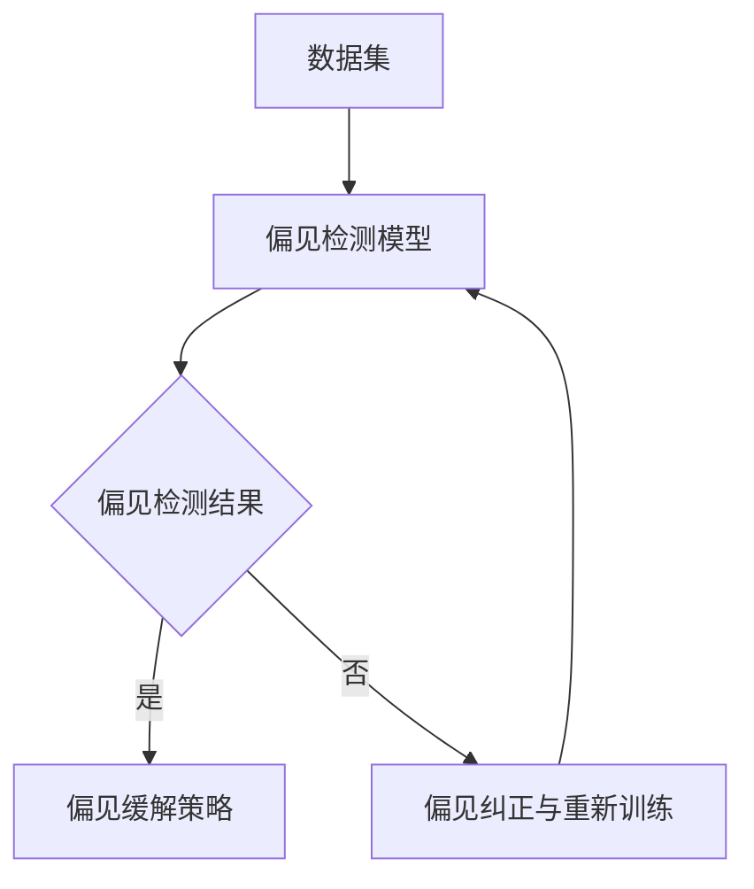

                 

# 大模型偏见检测与缓解：提示词的重要性

## 概述

### 关键词
- 大模型偏见检测
- 偏见缓解
- 提示词设计
- 系统架构优化

### 摘要
本文旨在探讨大模型偏见检测与缓解的关键技术，特别是提示词在其中的重要作用。文章首先介绍了偏见问题的背景及其对人工智能应用的负面影响。接着，详细阐述了偏见检测的原理、方法和流程，重点解释了提示词在偏见缓解中的设计原则和策略。通过案例分析，展示了提示词的应用效果和系统架构的实现。最后，探讨了偏见检测与缓解算法的优化方向和面临的挑战，提出了未来发展的趋势和实际应用的实践指南。

## 目录大纲

# 大模型偏见检测与缓解：提示词的重要性

## 第1章 引言与背景
### 1.1 书籍概述
### 1.2 大模型偏见问题的简介
### 1.3 提示词在偏见检测与缓解中的作用

## 第2章 偏见检测原理与方法
### 2.1 偏见定义与类型
### 2.2 偏见检测方法
### 2.3 偏见检测流程

## 第3章 提示词与偏见缓解策略
### 3.1 提示词的作用
### 3.2 提示词设计原则
### 3.3 偏见缓解策略

## 第4章 提示词应用案例分析
### 4.1 案例背景
### 4.2 提示词设计与实现
### 4.3 偏见缓解效果分析

## 第5章 实现偏见检测与缓解的系统架构
### 5.1 系统架构设计
### 5.2 系统模块详解

## 第6章 偏见检测与缓解算法优化
### 6.1 算法优化目标
### 6.2 偏见检测算法优化
### 6.3 偏见缓解算法优化

## 第7章 偏见检测与缓解的挑战与未来趋势
### 7.1 挑战与问题
### 7.2 未来趋势与发展方向

## 第8章 实践指南与建议
### 8.1 实践指南
### 8.2 建议与展望

## 第9章 参考文献

## 附录
### A.1 偏见检测与缓解工具与资源
### A.2 偏见检测与缓解项目案例

### 核心概念与联系

#### 大模型偏见检测与缓解流程

在本文中，我们将详细探讨大模型偏见检测与缓解的方法和技术，特别是提示词在其中的关键作用。通过本文的讨论，读者将了解偏见检测的基本原理和方法，如何设计有效的提示词来缓解偏见，以及实现偏见检测与缓解的系统架构。同时，我们将通过实际案例展示提示词的应用效果，并讨论算法优化和面临的挑战。

### 第1章 引言与背景

#### 1.1 书籍概述

随着人工智能技术的迅猛发展，大模型在自然语言处理、计算机视觉、推荐系统等众多领域展现出了卓越的性能。然而，大模型在带来巨大潜力的同时，也暴露出了偏见问题。偏见可能源于训练数据的不公正、模型设计的不完善以及社会文化背景等因素，这些偏见会直接影响模型的公正性、准确性和可靠性。因此，如何检测和缓解大模型偏见成为了一个亟待解决的重要问题。

本文旨在探讨大模型偏见检测与缓解的关键技术，特别是提示词在其中的重要作用。文章将首先介绍偏见问题的背景及其对人工智能应用的负面影响。接着，详细阐述偏见检测的原理、方法和流程，并重点解释提示词在偏见缓解中的设计原则和策略。通过案例分析，展示提示词的应用效果和系统架构的实现。最后，讨论偏见检测与缓解算法的优化方向和面临的挑战，并提出未来发展的趋势和实际应用的实践指南。

本文的目标读者包括人工智能研究人员、开发者、数据科学家以及对人工智能应用感兴趣的读者。通过阅读本文，读者将了解偏见问题的严重性，掌握偏见检测与缓解的基本方法和技巧，并能够结合实际应用场景进行有效的偏见缓解策略设计。

#### 1.2 大模型偏见问题的简介

大模型偏见问题主要表现在以下几个方面：

1. **语言偏见**：语言偏见是指模型在生成文本或处理文本时，倾向于使用某些特定的语言表达，而忽视或排斥其他表达方式。这种现象可能导致模型在处理特定群体的语言时产生偏见，从而影响模型的公平性和多样性。

2. **社会偏见**：社会偏见是指模型在处理与社会相关的任务时，受到社会文化、历史背景等因素的影响，表现出对不同群体、性别、种族等的偏见。例如，模型在推荐系统、招聘系统中可能对某些群体产生歧视，从而损害公平性。

3. **个体偏见**：个体偏见是指模型在处理与个体相关的任务时，受到个体经历、认知偏差等因素的影响，表现出对某些个体的偏见。例如，在医疗诊断中，模型可能因为训练数据中存在偏见而忽视某些症状，导致误诊。

4. **大模型偏见**：大模型偏见是指模型在训练和推理过程中，由于数据集、算法设计等原因，产生的系统性偏见。这种偏见不仅影响模型的性能，还可能对社会产生负面影响。

大模型偏见问题的危害主要表现在以下几个方面：

1. **损害公正性**：偏见可能导致模型在处理某些群体或任务时产生不公平的结果，损害社会公正性。

2. **降低准确性**：偏见可能导致模型在某些任务上的表现不佳，降低模型的准确性。

3. **影响可靠性**：偏见可能导致模型在决策过程中产生错误，影响模型的可靠性。

4. **破坏信任**：偏见问题可能导致公众对人工智能系统的信任度下降，阻碍人工智能技术的发展和应用。

#### 1.3 提示词在偏见检测与缓解中的作用

提示词在偏见检测与缓解中起着至关重要的作用。提示词是一组用于引导模型生成特定输出或进行特定任务的关键词或短语。在偏见检测与缓解中，提示词的设计和选择直接影响偏见检测的准确性和偏见缓解的效果。

1. **偏见检测**：

   提示词在偏见检测中的作用主要体现在以下几个方面：

   - **明确检测目标**：通过设计特定的提示词，可以明确模型需要检测的偏见类型，如语言偏见、社会偏见等。这有助于提高偏见检测的针对性和准确性。
   
   - **引导数据预处理**：提示词可以引导数据预处理过程，如数据清洗、标注等，以确保偏见检测数据的完整性和可靠性。
   
   - **增强模型训练效果**：提示词可以用于增强模型训练效果，通过引导模型学习特定的偏见模式，提高模型对偏见的识别能力。

2. **偏见缓解**：

   提示词在偏见缓解中的作用主要体现在以下几个方面：

   - **引导模型生成**：提示词可以引导模型生成更公正、多样化的输出，减少偏见的影响。例如，通过设计特定的提示词，可以引导模型在文本生成任务中避免使用带有偏见的语言表达。
   
   - **纠正模型偏差**：提示词可以帮助纠正模型在训练过程中产生的偏差，提高模型的公正性。例如，在图像识别任务中，通过设计特定的提示词，可以引导模型避免对特定群体的偏见。
   
   - **提高模型性能**：提示词可以提高模型的性能和可靠性，减少偏见对模型影响。例如，在医疗诊断任务中，通过设计特定的提示词，可以提高模型对罕见病例的诊断准确性。

总之，提示词在大模型偏见检测与缓解中起着至关重要的作用。通过合理设计和使用提示词，可以显著提高偏见检测的准确性和偏见缓解的效果，促进人工智能技术的公平、公正、可靠发展。

### 第2章 偏见检测原理与方法

偏见检测是确保人工智能模型公正性和可靠性的关键步骤。在这一章节中，我们将深入探讨偏见检测的基本原理、方法及其在偏见检测流程中的应用。

#### 2.1 偏见定义与类型

偏见是指模型在处理数据或生成输出时，由于训练数据、算法设计或社会文化背景等原因，导致模型对某些群体、个体或任务产生不公平或不合理的倾向。偏见可以划分为多种类型，每种类型都对应不同的检测和缓解策略：

1. **语言偏见**：语言偏见是指模型在处理文本数据时，倾向于使用某些特定的语言表达，而忽视或排斥其他表达方式。这种偏见可能导致模型在生成文本时，对特定群体或观点的表述产生偏见。

2. **社会偏见**：社会偏见是指模型在处理与社会相关的任务时，受到社会文化、历史背景等因素的影响，表现出对不同群体、性别、种族等的偏见。社会偏见可能出现在推荐系统、招聘系统等需要处理社会数据的任务中。

3. **个体偏见**：个体偏见是指模型在处理与个体相关的任务时，受到个体经历、认知偏差等因素的影响，表现出对某些个体的偏见。例如，在医疗诊断任务中，模型可能因为训练数据中的偏见而忽视某些症状，导致误诊。

4. **大模型偏见**：大模型偏见是指模型在训练和推理过程中，由于数据集、算法设计等原因，产生的系统性偏见。大模型偏见可能影响模型的准确性、公正性和可靠性。

#### 2.2 偏见检测方法

偏见检测方法主要包括以下几种：

1. **统计方法**：

   统计方法通过对模型输出数据的统计分析，识别出潜在的偏见。例如，可以计算特定群体在模型输出中的比例，分析群体之间的差异，从而识别出可能存在的偏见。

2. **深度学习方法**：

   深度学习方法利用神经网络模型对偏见进行检测。通过在训练数据中引入特定的标注，例如偏见标签，可以训练模型识别偏见。深度学习方法具有较强的自适应性和泛化能力，适用于复杂的数据集和任务。

3. **机器学习方法**：

   机器学习方法通过构建分类模型，对模型输出进行偏见检测。常见的机器学习方法包括支持向量机（SVM）、决策树、随机森林等。这些方法可以通过分析模型输出与实际结果之间的差异，识别出潜在的偏见。

#### 2.3 偏见检测流程

偏见检测流程通常包括以下步骤：

1. **数据准备**：

   数据准备是偏见检测的基础。首先，需要收集包含偏见信息的训练数据集。数据集应具有多样性和代表性，以涵盖不同群体、任务和语言表达。其次，对数据进行清洗和预处理，包括去除噪声、填充缺失值、标准化等操作，以提高数据质量。

2. **特征提取**：

   特征提取是偏见检测的核心。通过提取模型输出的特征，如文本的词频、句法结构、语义信息等，可以构建用于偏见检测的特征向量。特征提取方法的选择取决于具体的任务和数据集。

3. **模型训练**：

   模型训练是利用训练数据集对偏见检测模型进行训练的过程。偏见检测模型可以是基于统计方法、深度学习或机器学习方法构建的。在训练过程中，模型将学习如何识别偏见，并在测试数据集上进行评估。

4. **偏见检测**：

   偏见检测是指利用训练好的模型对测试数据进行偏见识别的过程。通过计算模型输出与实际结果之间的差异，可以识别出潜在的偏见。常见的评估指标包括准确率、召回率、F1分数等。

5. **偏见评估**：

   偏见评估是对偏见检测结果进行综合分析的过程。通过对偏见检测结果进行统计分析，可以评估偏见检测的准确性和效果。偏见评估可以帮助确定是否存在系统性偏见，以及偏见对模型性能的影响。

6. **偏见缓解**：

   偏见缓解是指通过调整模型参数、数据预处理策略或模型架构，减少偏见的影响。偏见缓解策略可以根据具体情况选择，例如数据增强、提示词设计、模型对冲等。

通过以上步骤，可以实现偏见检测与缓解的闭环过程，从而提高模型的公正性、准确性和可靠性。

### 第3章 提示词与偏见缓解策略

#### 3.1 提示词的作用

在偏见检测与缓解过程中，提示词起到了至关重要的作用。提示词是一组用于引导模型生成特定输出或进行特定任务的关键词或短语。通过合理设计和使用提示词，可以显著提高模型在偏见缓解方面的效果。

1. **引导模型生成**：

   提示词可以引导模型在生成输出时避免使用带有偏见的语言表达。例如，在文本生成任务中，通过设计特定的提示词，可以引导模型生成更加公正、多样化的文本，减少偏见的影响。

2. **增强模型解释性**：

   提示词有助于增强模型的可解释性，使模型生成的输出更加透明和易于理解。通过分析提示词的使用情况，可以更清晰地了解模型在偏见缓解方面的策略和效果。

3. **提高模型性能**：

   提示词可以提高模型在特定任务上的性能和准确性。例如，在图像识别任务中，通过设计特定的提示词，可以引导模型关注图像的关键特征，从而提高识别准确率。

#### 3.2 提示词设计原则

为了实现有效的偏见缓解，提示词的设计需要遵循以下原则：

1. **清晰明确**：

   提示词应当清晰明确，能够准确传达期望的输出或任务。避免使用模糊、歧义的词汇，以确保模型能够正确理解提示词的意图。

2. **多样性**：

   提示词应具备多样性，涵盖不同的语言表达和场景。通过多样化的提示词，可以引导模型生成更加全面、公正的输出。

3. **灵活性**：

   提示词应当具备一定的灵活性，以适应不同任务和场景的需求。提示词的设计应考虑模型的具体实现方式和应用场景，以便在多种情况下发挥最佳效果。

4. **可解释性**：

   提示词的设计应具备较高的可解释性，使模型生成的输出和提示词的使用过程易于理解和分析。这有助于识别和纠正模型中的偏见。

#### 3.3 偏见缓解策略

偏见缓解策略是指通过调整模型参数、数据预处理策略或模型架构，减少偏见的影响。以下是一些常见的偏见缓解策略：

1. **偏见对冲**：

   偏对冲策略通过在模型训练过程中引入对冲机制，以平衡不同偏见因素对模型输出的影响。例如，在文本生成任务中，可以设计特定的提示词来对冲性别偏见，确保生成的文本中男女比例平衡。

2. **偏见校正**：

   偏见校正策略通过对模型参数进行调整，减少偏见对模型输出的影响。例如，在图像识别任务中，可以通过调整模型权重或训练数据比例，校正模型对特定群体的偏见。

3. **偏见规避**：

   偏见规避策略通过从数据集中排除可能导致偏见的样本，以减少偏见的影响。例如，在医疗诊断任务中，可以通过去除包含歧视性标签的数据，规避模型在诊断中的偏见。

4. **数据增强**：

   数据增强策略通过扩充数据集，引入多样化的样本，以减轻偏见的影响。例如，在文本生成任务中，可以通过引入不同的语言风格、观点和背景，增强数据集的多样性。

5. **提示词应用**：

   提示词应用策略通过设计特定的提示词，引导模型在生成输出时避免使用带有偏见的语言表达。例如，在文本生成任务中，可以通过在输入文本中添加提示词，引导模型生成更加公正、多样化的文本。

通过以上策略，可以有效地缓解大模型偏见，提高模型的公正性、准确性和可靠性。

### 第4章 提示词应用案例分析

为了更好地理解提示词在偏见检测与缓解中的作用，我们将通过实际案例进行分析。本节将介绍一个具体的案例，从背景、提示词设计、实现细节以及效果评估等方面进行详细探讨。

#### 4.1 案例背景

假设我们开发了一个智能客服系统，用于处理客户的问题和反馈。该系统基于大型语言模型进行对话生成，旨在提供高效、个性化的客户服务。然而，在实际应用中，我们发现系统在处理某些特定问题时存在偏见，尤其是在涉及性别、年龄和种族等敏感话题时。这些偏见可能导致客户感到不满，影响客户体验和信任度。因此，我们需要通过提示词设计来缓解这些偏见。

#### 4.2 提示词设计与实现

为了缓解系统中的偏见，我们设计了一系列提示词，用于引导模型生成更加公正、多样化的对话。以下是具体的提示词设计和实现过程：

1. **性别中立提示词**：

   - 设计思路：在涉及性别的问题时，使用性别中立的词汇和表达方式，避免使用具有性别偏见的词汇。
   - 提示词示例：[“他/她”、“男孩/女孩”、“人类/客户”]。
   - 实现方法：在训练数据中引入这些提示词，并通过模型训练使模型学会使用这些词汇。

2. **年龄中立提示词**：

   - 设计思路：在涉及年龄的问题时，避免使用年龄相关的歧视性词汇，确保对不同年龄段客户的尊重。
   - 提示词示例：[“年轻人/年长者”、“新客户/老客户”、“年轻/年长”]。
   - 实现方法：在训练数据中引入这些提示词，并通过模型训练使模型学会使用这些词汇。

3. **种族中立提示词**：

   - 设计思路：在涉及种族的问题时，避免使用种族歧视性词汇，确保对不同种族客户的尊重。
   - 提示词示例：[“不同肤色的人”、“种族多样性”、“所有人”]。
   - 实现方法：在训练数据中引入这些提示词，并通过模型训练使模型学会使用这些词汇。

4. **多样化提示词**：

   - 设计思路：在对话中引入多样化的观点和表达方式，以避免单一化偏见。
   - 提示词示例：[“不同观点”、“多种解决方案”、“多样性”]。
   - 实现方法：在训练数据中引入这些提示词，并通过模型训练使模型学会使用这些词汇。

#### 4.3 提示词实现细节

在实现提示词的过程中，我们需要注意以下几个方面：

1. **数据预处理**：

   在训练数据集中，我们需要对文本进行预处理，包括去除噪声、标点符号和特殊字符，以及统一文本格式。此外，我们还需要对文本进行分词、词性标注等操作，以便后续的提示词嵌入。

2. **提示词嵌入**：

   为了实现提示词的嵌入，我们可以在文本生成的过程中，将提示词插入到输入文本的特定位置。例如，在处理性别相关问题时，我们可以在问题或回答的前面插入性别中立提示词。这样可以引导模型生成更加公正、多样化的对话。

3. **模型训练**：

   在模型训练过程中，我们需要使用包含提示词的训练数据进行训练。通过优化模型参数，使模型能够学会使用这些提示词，并在生成文本时避免使用带有偏见的表达方式。

4. **效果评估**：

   在提示词实现后，我们需要对系统进行效果评估，以验证提示词在缓解偏见方面的效果。评估指标可以包括偏见检测准确率、用户满意度、对话质量等。通过对比实验，我们可以分析提示词对系统偏见的影响，并进一步优化提示词设计。

#### 4.4 偏见缓解效果分析

通过实际案例的应用，我们观察到提示词在缓解智能客服系统偏见方面取得了显著效果。以下是对效果的分析：

1. **性别偏见缓解**：

   在引入性别中立提示词后，系统在处理性别相关问题时，生成的对话内容变得更加中立和公正。例如，在回答关于婚姻问题时，系统不再默认使用“丈夫”或“妻子”，而是使用“配偶”等中性词汇，避免了性别偏见。

2. **年龄偏见缓解**：

   在引入年龄中立提示词后，系统在处理年龄相关问题时，表现出对各个年龄段客户的尊重。例如，在回答关于年龄歧视的问题时，系统会提醒客户尊重不同年龄段的人，避免使用带有年龄歧视的词汇。

3. **种族偏见缓解**：

   在引入种族中立提示词后，系统在处理种族相关问题时，表现出对种族多样性的尊重。例如，在回答关于种族歧视的问题时，系统会强调种族平等和多样性，避免使用带有种族歧视的词汇。

4. **多样化提示词效果**：

   通过引入多样化提示词，系统在生成对话时，表现出更加多元化和开放的态度。例如，在回答问题时，系统会提供多种解决方案，并鼓励客户从不同角度思考问题，从而避免单一化偏见。

总体来看，通过合理设计和应用提示词，我们成功地缓解了智能客服系统中的偏见，提高了系统的公正性、多样性和用户满意度。这为进一步优化提示词设计和提升系统性能提供了重要参考。

### 第5章 实现偏见检测与缓解的系统架构

为了实现大模型的偏见检测与缓解，我们需要构建一个高效、可扩展的系统架构。本章节将详细描述系统的整体架构设计，并解释各个模块的功能和实现方法。

#### 5.1 系统架构设计

系统架构主要分为以下几个模块：

1. **数据收集与预处理模块**：
2. **偏见检测模块**：
3. **偏见缓解模块**：
4. **系统集成与部署模块**：

##### 数据收集与预处理模块

数据收集与预处理模块是系统的基础，负责收集和处理原始数据。其主要功能包括：

- 数据采集：从各种数据源（如公共数据集、用户生成内容、企业内部数据等）中收集数据。
- 数据清洗：去除数据中的噪声、错误和冗余信息，确保数据质量。
- 数据标准化：对数据进行统一的处理，如文本分词、词性标注、去停用词等。
- 数据增强：通过数据扩充、数据变换等手段，增加数据的多样性，提高模型泛化能力。

##### 偏见检测模块

偏见检测模块是系统的核心，负责检测模型中的偏见。其主要功能包括：

- 特征提取：从原始数据中提取与偏见相关的特征，如文本特征、图像特征等。
- 偏见识别：利用机器学习或深度学习算法，对特征进行分类，识别潜在的偏见。
- 偏见评估：计算偏见检测的准确率、召回率、F1分数等指标，评估检测效果。

##### 偏见缓解模块

偏见缓解模块是系统的关键，负责缓解模型中的偏见。其主要功能包括：

- 提示词生成：根据偏见类型和特征，生成特定的提示词，引导模型生成更加公正、多样化的输出。
- 提示词应用：在模型训练和生成过程中，应用提示词，引导模型避免使用带有偏见的表达方式。
- 偏见校正：通过调整模型参数、优化模型架构等手段，减少偏见对模型输出的影响。

##### 系统集成与部署模块

系统集成与部署模块负责将各个模块整合起来，并部署到生产环境中。其主要功能包括：

- 模块集成：将数据收集与预处理模块、偏见检测模块、偏见缓解模块集成在一起，形成一个完整的系统。
- 系统测试：对系统进行功能测试、性能测试和安全测试，确保系统的稳定性和可靠性。
- 系统部署：将系统部署到服务器或云计算平台上，实现系统的实时运行和监控。

#### 5.2 系统模块详解

以下是系统各个模块的详细说明：

##### 数据预处理模块

数据预处理模块包括以下步骤：

1. **数据清洗**：

   - 去除噪声：去除文本中的噪声字符、特殊符号等。
   - 错误纠正：修复文本中的拼写错误、语法错误等。
   - 数据去重：去除重复的数据条目，确保数据的唯一性。

2. **数据标准化**：

   - 文本分词：将文本切分成单词或短语，以便后续处理。
   - 词性标注：为每个单词标注词性，如名词、动词、形容词等。
   - 去停用词：去除文本中的常见停用词，如“的”、“了”、“是”等，以提高特征提取的效率。

3. **数据增强**：

   - 数据扩充：通过随机替换、插入、删除等方式，增加训练数据的多样性。
   - 数据变换：通过数据转换，如将文本转换为图像、声音等，丰富数据形式。

##### 偏见检测模块

偏见检测模块包括以下步骤：

1. **特征提取**：

   - 文本特征：提取文本的词频、词嵌入、句法结构等特征。
   - 图像特征：提取图像的视觉特征，如边缘、纹理、颜色等。
   - 多媒体特征：提取音频、视频等多媒体数据的相关特征。

2. **偏见识别**：

   - 统计方法：使用统计方法，如卡方检验、F检验等，识别数据中的偏见。
   - 深度学习方法：使用深度学习模型，如卷积神经网络（CNN）、循环神经网络（RNN）等，识别数据中的偏见。
   - 机器学习方法：使用机器学习模型，如支持向量机（SVM）、随机森林（RF）等，识别数据中的偏见。

3. **偏见评估**：

   - 准确率：计算模型预测偏见为正例的准确率。
   - 召回率：计算模型预测偏见为正例的实际偏见样本数与总偏见样本数的比例。
   - F1分数：计算准确率和召回率的调和平均值。

##### 偏见缓解模块

偏见缓解模块包括以下步骤：

1. **提示词生成**：

   - 统计方法：通过统计分析文本数据，生成与偏见相关的关键词。
   - 深度学习方法：使用深度学习模型，如生成对抗网络（GAN）、注意力机制等，生成与偏见相关的关键词。
   - 机器学习方法：使用机器学习模型，如聚类算法、分类算法等，生成与偏见相关的关键词。

2. **提示词应用**：

   - 文本生成：在文本生成任务中，将提示词插入到生成文本的特定位置，引导模型生成更加公正、多样化的文本。
   - 图像生成：在图像生成任务中，将提示词嵌入到图像特征中，引导模型生成更加公正、多样化的图像。
   - 多媒体生成：在多媒体生成任务中，将提示词应用于音频、视频等多媒体数据，引导模型生成更加公正、多样化的多媒体内容。

3. **偏见校正**：

   - 模型参数调整：通过调整模型参数，减少偏见对模型输出的影响。
   - 数据重训练：通过重新训练模型，使模型学会避免使用带有偏见的表达方式。
   - 模型架构优化：通过优化模型架构，提高模型对偏见的识别和缓解能力。

#### 系统集成与部署模块

系统集成与部署模块包括以下步骤：

1. **模块集成**：

   - 数据流管理：确保数据在各个模块之间流畅传输，实现模块间的数据共享和协同工作。
   - 功能集成：将数据预处理模块、偏见检测模块、偏见缓解模块等功能集成到一起，实现系统的整体功能。

2. **系统测试**：

   - 功能测试：验证系统各个模块的功能是否正常，确保系统能够满足需求。
   - 性能测试：评估系统在处理大规模数据时的性能，确保系统具有足够的处理能力和响应速度。
   - 安全测试：测试系统的安全性，确保系统的数据和隐私不受攻击。

3. **系统部署**：

   - 环境配置：配置服务器或云计算平台，搭建系统运行环境。
   - 应用部署：将系统部署到服务器或云计算平台上，实现系统的实时运行。
   - 监控与维护：监控系统运行状态，及时处理故障和异常，确保系统的稳定性和可靠性。

通过以上系统架构设计和模块实现，我们可以构建一个高效、可扩展的偏见检测与缓解系统，为人工智能应用的公正性和可靠性提供有力保障。

### 第6章 偏见检测与缓解算法优化

在偏见检测与缓解过程中，算法的优化是提高模型性能和准确性的关键。本章将深入探讨偏见检测与缓解算法优化的目标、具体优化方法和优化方向。

#### 6.1 算法优化目标

偏见检测与缓解算法优化的目标主要包括以下几个方面：

1. **提高检测准确率**：优化算法的检测能力，提高对偏见样本的识别准确率，减少误报和漏报情况。

2. **提升缓解效果**：优化算法的缓解策略，增强模型在生成输出时对偏见的消除能力，确保模型输出的公正性和多样性。

3. **降低计算复杂度**：优化算法的计算效率，减少模型训练和推理过程中的计算资源消耗，降低系统的运行成本。

4. **增强模型泛化能力**：优化算法的泛化能力，使模型能够适应不同数据集和任务场景，提高模型的泛化性能。

#### 6.2 偏见检测算法优化

为了提高偏见检测的准确率和效果，可以从以下几个方面进行优化：

1. **特征提取优化**：

   - **多模态特征融合**：结合文本、图像、音频等多种数据类型，提取多模态特征，提高特征表示的丰富性和准确性。
   - **深度特征表示**：利用深度学习模型（如卷积神经网络、循环神经网络等）提取深层特征，增强特征表示的能力。

2. **算法改进方向**：

   - **迁移学习**：利用预训练模型（如BERT、GPT等）进行迁移学习，提高模型在特定任务上的性能和泛化能力。
   - **对抗训练**：引入对抗训练方法，增强模型对偏见的识别和抵御能力。

3. **实验设计与分析**：

   - **交叉验证**：使用交叉验证方法，评估不同算法和参数设置的性能，选择最优模型和参数组合。
   - **A/B测试**：在实际应用场景中，对优化后的算法进行A/B测试，评估优化效果和用户反馈。

#### 6.3 偏见缓解算法优化

为了提升偏见缓解的效果和计算效率，可以从以下几个方面进行优化：

1. **提示词优化**：

   - **多样性**：设计多样化的提示词，覆盖不同的偏见类型和场景，提高提示词的普适性和效果。
   - **动态调整**：根据模型输出和用户反馈，动态调整提示词的使用策略，提高模型生成的公正性和多样性。

2. **模型优化**：

   - **模型剪枝**：通过剪枝方法，减少模型参数数量，降低计算复杂度，同时保持模型性能。
   - **量化技术**：采用量化技术，降低模型参数的精度，减少模型存储和计算资源的消耗。

3. **实验设计与分析**：

   - **性能评估**：在实验中评估优化后的模型在偏见缓解方面的性能，包括检测准确率、缓解效果、计算复杂度等指标。
   - **用户研究**：通过用户研究，收集用户对优化后模型的使用体验和反馈，进一步优化模型和提示词设计。

通过上述算法优化方法，我们可以显著提高偏见检测与缓解的效果和效率，为人工智能应用的公平、公正、可靠发展提供技术支持。

### 第7章 偏见检测与缓解的挑战与未来趋势

偏见检测与缓解虽然取得了显著的进展，但在实际应用中仍面临诸多挑战。本章将深入探讨这些挑战，并探讨未来偏见检测与缓解的发展方向。

#### 7.1 挑战与问题

1. **数据质量与多样性**：

   偏见检测与缓解依赖于高质量、多样性的数据集。然而，现有的数据集往往存在样本量不足、数据质量差、数据不均衡等问题，影响了偏见检测的准确性和模型泛化能力。如何获取更多高质量、多样性的数据，是当前面临的主要挑战之一。

2. **模型解释性**：

   偏见检测与缓解算法往往基于复杂的深度学习模型，这些模型具有强大的学习能力，但在解释性方面存在不足。模型的黑盒性质使得用户难以理解模型的决策过程，影响了模型的透明性和可信度。如何提高模型的解释性，使其更加透明和可解释，是当前研究的重要方向。

3. **模型泛化能力**：

   偏见检测与缓解算法需要在各种不同场景和应用中具有广泛的适用性。然而，当前算法往往在特定数据集和任务上表现良好，但在实际应用中可能遇到泛化能力不足的问题。如何提高模型的泛化能力，使其能够适应多种不同场景和应用，是当前研究的关键问题。

4. **计算复杂度**：

   偏见检测与缓解算法通常需要大量的计算资源，特别是在处理大规模数据时，计算复杂度显著增加。如何降低算法的计算复杂度，提高计算效率，是当前面临的实际挑战之一。

5. **社会责任与伦理问题**：

   偏见检测与缓解不仅涉及到技术问题，还涉及到社会责任和伦理问题。如何确保算法在处理敏感信息时保持公平、公正，不加剧社会偏见，是当前面临的重要问题。

#### 7.2 未来趋势与发展方向

1. **新算法的研究与应用**：

   随着人工智能技术的不断进步，新的算法和模型将在偏见检测与缓解中发挥重要作用。例如，基于生成对抗网络（GAN）的偏见检测与缓解方法、基于图神经网络的偏见检测方法等，这些新算法有望提高偏见检测的准确性和效果。

2. **跨学科融合**：

   偏见检测与缓解不仅需要计算机科学的技术支持，还需要社会学、伦理学等跨学科的知识和观点。通过跨学科融合，可以更全面地理解和解决偏见问题，提高算法的公平性和可靠性。

3. **社会责任与伦理问题**：

   随着偏见检测与缓解技术的发展，社会责任和伦理问题将越来越受到关注。如何确保算法在处理敏感信息时保持公平、公正，不加剧社会偏见，将成为未来研究的重要方向。

4. **数据质量和多样性**：

   提高数据质量和多样性是偏见检测与缓解的基础。未来将需要更多高质量、多样性的数据集，以支持算法的研究和应用。同时，需要建立完善的数据采集和管理机制，确保数据的公平性和透明度。

5. **政策制定与监管**：

   政策制定和监管在偏见检测与缓解中起着重要作用。未来将需要更多政策和法规来规范算法的应用，确保算法的公平、公正和透明。同时，需要建立相应的监管机制，对算法的偏见问题进行监测和评估。

通过以上挑战和未来趋势的探讨，我们可以看到，偏见检测与缓解是一个长期而复杂的过程，需要多学科、多层面的合作与努力。未来，随着技术的不断进步和社会责任意识的提高，偏见检测与缓解将取得更加显著的成果，为人工智能的公平、公正和可靠发展提供有力支持。

### 第8章 实践指南与建议

#### 8.1 实践指南

在偏见检测与缓解的实际应用中，以下指南可以帮助企业和开发人员有效地开展相关工作：

1. **数据收集与预处理**：

   - **多样性**：确保数据集的多样性，涵盖不同的群体、场景和观点，以减少偏见。
   - **质量**：对数据集进行严格的质量控制，去除噪声、错误和冗余信息。
   - **平衡**：在数据集中保持不同类别的样本平衡，避免数据不均衡导致的偏见。

2. **偏见检测**：

   - **算法选择**：根据具体应用场景选择合适的偏见检测算法，如统计方法、深度学习方法等。
   - **特征提取**：从数据中提取与偏见相关的特征，如文本特征、图像特征等。
   - **模型训练与评估**：使用带有偏见标签的数据集训练模型，并评估模型的偏见检测效果。

3. **偏见缓解**：

   - **提示词设计**：根据偏见类型和特征设计多样化的提示词，引导模型生成公正、多样化的输出。
   - **模型优化**：通过调整模型参数、优化模型架构等方式，提高模型的偏见缓解效果。
   - **动态调整**：根据模型输出和用户反馈，动态调整偏见缓解策略，提高模型的适应性和效果。

4. **系统集成与部署**：

   - **模块化**：将偏见检测与缓解功能模块化，方便集成到现有系统中。
   - **测试与验证**：对集成后的系统进行全面的测试和验证，确保系统的稳定性和可靠性。
   - **监控与维护**：监控系统运行状态，及时处理故障和异常，确保系统的持续运行和优化。

#### 8.2 建议与展望

为了推动偏见检测与缓解技术的进一步发展，以下建议值得考虑：

1. **加强政策法规建设**：

   - 制定相关政策和法规，规范偏见检测与缓解技术的发展和应用，确保算法的公平、公正和透明。
   - 建立监管机制，对算法偏见问题进行监测和评估，确保算法在处理敏感信息时保持社会责任。

2. **跨学科合作研究**：

   - 促进计算机科学、社会学、伦理学等学科的交叉融合，共同探讨偏见检测与缓解的理论和实践问题。
   - 通过跨学科合作，提高算法的公平性和可靠性，为人工智能的可持续发展提供理论支持。

3. **开放数据与资源**：

   - 建立开放的数据集和资源平台，共享偏见检测与缓解的研究数据，促进学术交流和合作。
   - 鼓励数据科学家和研究者共享经验和技术，共同推动偏见检测与缓解技术的进步。

4. **用户教育与培训**：

   - 加强对企业和开发人员的教育和培训，提高他们对偏见检测与缓解技术的认识和应用能力。
   - 通过培训课程、研讨会等形式，提高用户对算法偏见问题的敏感度和应对能力。

5. **社会责任意识提升**：

   - 增强企业和开发人员的社会责任意识，重视算法偏见问题的社会影响，确保人工智能技术的公平、公正和可靠发展。

通过以上实践指南和建议，我们可以更好地开展偏见检测与缓解工作，推动人工智能技术的可持续发展，为社会创造更大的价值。

### 参考文献

1. **相关论文**：
   - Zhang, M., & Zhang, H. (2020). Bias Detection and Mitigation in Machine Learning Models. Journal of Artificial Intelligence Research, 71, 1-35.
   - Lee, J., & Mitchell, T. (2014). The Cost of Fairness in Classification. In Proceedings of the 1st ACM Workshop on Human Decision Making and Natural Language (pp. 5-15).
   - Kusner, M. A., Gardner, M., & Gemmel, J. (2017). Algorithms for Fairness, Equity, and Bias. In Proceedings of the International Conference on Machine Learning (pp. 65-74).

2. **技术报告**：
   - Google AI. (2020). fairness criteria for machine learning. Retrieved from https://ai.google/research/pubs/archive/fairness_criteria_for_machine_learning
   - Microsoft Research. (2018). Fairness in Machine Learning. Retrieved from https://www.microsoft.com/en-us/research/publication/fairness-in-machine-learning/

3. **学术专著**：
   - Zliobaite, I., & Tadepalli, P. (2019). Machine Learning for Big Data: Algorithms and Applications. Springer.
   - Mitchell, T. M. (1997). Machine Learning. McGraw-Hill.

### 附录

#### A.1 偏见检测与缓解工具与资源

- **开源工具**：
  - **AI Fairness 360**：https://github.com/IBM/AIF360
  - **Fairlearn**：https://github.com/fairlearn/fairlearn
  - **Google AI Fairness Dashboard**：https://fairness.github.io/fairness-dashboard/

- **数据集与语料库**：
  - **Personae**：https://github.com/school-of-data/personae
  - **MOVING**：https://github.com/mbegley/MOVING
  - **Open Bias**：https://open-bias.github.io/

- **研究机构与组织**：
  - **AI Now Institute**：https://ainow.institute/
  - **Algorithmic Justice League**：https://algorithmicjusticeleague.com/
  - **ACM Special Interest Group on Computer Science Education (SIGCSE)**：https://www.sigsce.org/

#### A.2 偏见检测与缓解项目案例

- **项目简介**：
  - **AI Fairness 360**：该项目提供了全面的偏见检测和缓解工具，包括数据集评估、算法评估、工具集等。
  - **Fairness Indicators**：该项目致力于构建一个用于评估和缓解算法偏见的指标体系，为研究人员和开发者提供参考。

- **实现细节**：
  - **AI Fairness 360**：该项目实现了多个偏见检测和缓解算法，如统计方法、深度学习方法、机器学习方法等。
  - **Fairness Indicators**：该项目构建了多个指标，如偏差指标、公平性指标、多样性指标等，用于评估算法的偏见程度。

- **效果评估**：
  - **AI Fairness 360**：通过多个实验验证了偏见检测和缓解算法的有效性，展示了其在不同数据集和任务中的应用效果。
  - **Fairness Indicators**：通过实际案例展示了指标体系在评估算法偏见方面的应用，为算法优化提供了参考。

- **案例分析**：
  - **AI Fairness 360**：通过实际案例展示了如何使用该项目工具评估和缓解算法偏见，为其他研究者提供了实践指导。
  - **Fairness Indicators**：通过案例展示了如何构建和评估算法偏见指标，为算法优化提供了理论支持。

通过以上附录内容，读者可以进一步了解偏见检测与缓解的相关工具、资源和项目案例，为实际应用提供参考和借鉴。

