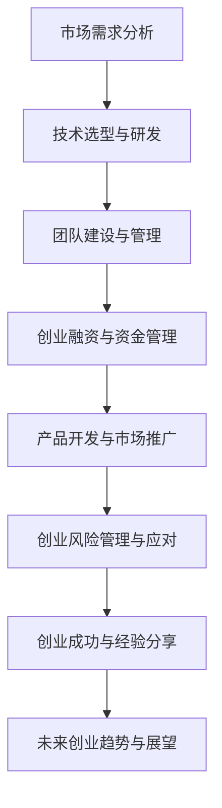

                 

# 大模型创业从狂热到理性的转变

> 关键词：大模型，创业，技术选型，团队建设，风险管理，成功经验

> 摘要：本文将从大模型创业的现状出发，探讨从狂热到理性的转变过程。通过分析市场需求、技术选型、团队建设、风险管理等方面，结合实际案例，阐述创业者在进入大模型领域时如何从理性思考出发，实现创业成功。

## 第一部分：大模型创业基础

### 第1章：大模型与创业概述

#### 1.1 大模型时代的创业机会

在当今科技飞速发展的时代，人工智能（AI）技术取得了显著突破，大模型成为行业的热点。大模型具备处理大规模数据、生成高质量内容、实现自动化决策等能力，为各行业提供了丰富的应用场景。然而，面对这一新兴领域，创业者们往往容易陷入狂热的氛围，忽略理性分析。本文将从狂热到理性的转变，探讨大模型创业的核心问题。

**从狂热到理性的转变**

在创业初期，许多创业者被大模型的技术前景所吸引，盲目跟风，缺乏深入的市场调研和理性分析。然而，成功的大模型创业并非一蹴而就，需要从以下几个方面进行理性思考：

- **市场需求分析**：创业者需要明确目标市场，了解用户需求，确保产品具有市场竞争力。
- **技术选型**：选择适合自身业务需求的大模型框架和算法，进行技术储备和研发。
- **团队建设**：构建具备相关技能和经验的团队，确保项目顺利进行。
- **风险管理**：对创业过程中可能面临的风险进行识别和评估，制定应对策略。

**示例：** 分析特斯拉与英伟达在自动驾驶领域的创业路径。

- **特斯拉**：在成立初期，特斯拉专注于电动汽车市场，凭借卓越的产品性能和用户体验，迅速崭露头角。随后，特斯拉将目光投向自动驾驶技术，通过自主研发和并购，逐渐构建起完整的自动驾驶技术体系。特斯拉的成功离不开其对市场需求和技术趋势的准确把握。

- **英伟达**：英伟达在自动驾驶领域的发展路径与特斯拉有所不同。英伟达以图形处理器（GPU）技术为核心，为自动驾驶车辆提供高性能计算平台。通过战略合作和技术输出，英伟达在自动驾驶领域取得了显著成果。英伟达的成功在于其对技术趋势的敏锐洞察和合理的战略布局。

#### 1.2 大模型核心技术简述

大模型的核心技术主要包括神经网络、深度学习、自然语言处理等。以下将从算法原理、数据处理和建模等方面进行简要介绍。

**核心算法原理**

神经网络是模拟人脑神经元结构和工作方式的计算模型。深度学习是神经网络的一种发展，通过多层神经网络实现复杂的非线性映射。以下是一个简单的神经网络训练过程的伪代码：

```python
# 伪代码：神经网络训练过程
initialize weights
for each epoch:
    for each training example:
        forward_pass(x)
        calculate loss
        backward_pass(loss)
        update weights
```

**数学模型**

在神经网络中，损失函数和反向传播算法是核心组成部分。以下是一个简单的损失函数和反向传播算法的LaTeX描述：

```latex
\begin{align*}
J(\theta) &= \frac{1}{m} \sum_{i=1}^{m} \frac{1}{2} (h_{\theta}(x^{(i)}) - y^{(i)})^2 \\
\delta_{j}^{[l]} &= \frac{\partial J(\theta)}{\partial z_{j}^{[l]}}
\end{align*}
```

**数据处理与建模**

数据处理是构建大模型的基础。以下是一个简单的数据处理流程：

1. 数据收集：收集大规模、高质量的数据集。
2. 数据清洗：去除噪声、填补缺失值、标准化数据。
3. 数据预处理：进行数据归一化、数据增强等操作，提高模型性能。

#### 1.3 创业成功案例分析

创业成功的关键在于市场需求、技术储备、团队建设等方面的综合实力。以下从企业成长策略和行业趋势与机遇两个方面进行介绍。

**企业成长策略**

- **从小规模到大规模市场的扩展**：创业者需要明确目标市场，通过产品差异化、渠道拓展等手段实现从小规模到大规模市场的扩展。例如，谷歌在成立初期专注于搜索引擎技术，通过不断优化算法和拓展市场份额，最终成为全球最大的搜索引擎。

- **跨行业合作与生态构建**：创业者可以与其他行业进行合作，构建生态系统，实现互利共赢。例如，亚马逊通过云计算、人工智能等技术为各行各业提供解决方案，打造了一个庞大的生态系统。

**行业趋势与机遇**

- **AI技术的未来应用领域**：随着AI技术的不断发展，其应用领域将不断拓展。未来，AI技术在医疗、教育、制造、金融等领域将发挥重要作用，为创业者提供丰富的机遇。

- **新兴技术与创业模式**：量子计算、区块链等新兴技术将颠覆现有商业模式，为创业者提供新的发展空间。例如，量子计算在加密算法、优化问题等领域具有巨大潜力，创业者可以探索这一领域的应用。

## 第二部分：大模型创业路径规划

### 第2章：市场需求分析与定位

#### 2.1 市场需求调研

市场需求调研是创业成功的关键一步。以下从方法论和案例两个方面进行介绍。

**方法论**

1. **确定调研目标**：明确调研目的，收集用户需求、市场趋势等信息。

2. **选择调研方法**：包括问卷调查、深度访谈、焦点小组讨论等。

3. **数据收集与分析**：整理调研数据，进行统计分析，识别用户需求和市场趋势。

**案例**

**一家新兴AI创业公司在智能家居领域的市场调研过程**

1. **确定调研目标**：了解智能家居市场的用户需求、竞争状况和发展趋势。

2. **选择调研方法**：采用问卷调查和深度访谈相结合的方式，收集用户反馈和市场数据。

3. **数据收集与分析**：对问卷和访谈数据进行整理和分析，识别用户对智能家居产品的功能需求、价格敏感度、购买渠道等。

#### 2.2 产品定位与差异化

产品定位和差异化是创业成功的关键。以下从产品定位策略和用户需求分析两个方面进行介绍。

**产品定位策略**

1. **明确目标市场**：根据市场需求调研结果，确定目标用户群体和产品定位。

2. **差异化策略**：从功能、性能、用户体验等方面进行差异化，提高产品竞争力。

**用户需求分析**

1. **调研用户需求**：通过问卷调查、用户访谈等方式，了解用户对智能家居产品的功能需求、使用习惯等。

2. **分析用户需求**：对用户需求进行分类和优先级排序，确定产品核心功能和卖点。

### 第3章：技术选型与研发策略

#### 3.1 技术选型原则

技术选型是创业过程中至关重要的一环。以下从框架对比和研发过程管理两个方面进行介绍。

**框架对比**

1. **TensorFlow**：具有丰富的功能和生态系统，支持多种编程语言，适用于大规模分布式训练。

2. **PyTorch**：具有动态图模型，易于调试和优化，适用于实时学习和交互式应用。

**研发过程管理**

1. **敏捷开发方法**：采用敏捷开发，快速迭代产品，提高开发效率。

2. **持续集成与持续部署**：实现代码质量控制和快速上线，降低开发风险。

#### 3.2 研发过程管理

**敏捷开发方法**

1. **需求管理**：明确产品需求，制定开发计划，确保需求清晰、可量化。

2. **迭代开发**：按照一定周期（如两周或一个月）进行迭代，实现快速交付。

**持续集成与持续部署**

1. **代码质量控制**：通过代码审查、自动化测试等手段，确保代码质量。

2. **自动化部署**：实现快速上线，降低部署风险。

## 第三部分：大模型创业实践

### 第4章：创业团队建设与管理

#### 4.1 团队构建策略

团队构建是创业成功的关键。以下从人才招聘与激励、企业文化建设两个方面进行介绍。

**人才招聘与激励**

1. **明确招聘标准**：根据业务需求，确定招聘条件和标准，确保团队具备相应技能和经验。

2. **激励机制**：建立合理的薪酬体系和激励机制，激发员工积极性。

**企业文化建设**

1. **价值观认同**：建立共同价值观，确保团队成员具有一致的目标和使命感。

2. **组织设计**：根据业务需求调整组织架构，确保团队高效协作。

### 第5章：创业融资与资金管理

#### 5.1 融资策略与渠道

融资是创业过程中的重要环节。以下从股权融资与债务融资两个方面进行介绍。

**股权融资与债务融资**

1. **股权融资**：通过出让股份，获取资金支持，适用于初创企业和扩张期。

2. **债务融资**：通过贷款、债券等途径获取资金，适用于稳定经营的企业。

#### 5.2 资金管理与预算规划

**预算编制与执行**

1. **预算编制**：根据业务需求，制定详细的预算计划，确保资金合理使用。

2. **预算执行**：对预算执行情况进行监控和调整，确保预算目标的实现。

## 第四部分：创业风险管理与应对

### 第6章：创业风险识别与评估

#### 6.1 风险类型与识别

创业过程中，风险类型多样，以下从技术风险、市场风险、财务风险三个方面进行介绍。

**技术风险**

1. **技术研发失败**：研发过程中，可能面临技术难题，导致项目无法按期完成。

2. **技术迭代滞后**：技术更新迅速，可能导致产品无法满足市场需求。

**市场风险**

1. **市场竞争加剧**：市场上竞争对手众多，可能导致市场份额下降。

2. **用户需求变化**：用户需求变化可能导致产品定位不准确。

**财务风险**

1. **资金不足**：创业初期，可能面临资金不足的问题，影响项目进展。

2. **成本控制不力**：成本控制不力可能导致资金链断裂。

#### 6.2 风险评估方法

**定量与定性分析**

1. **定量分析**：利用数学模型和方法，对风险进行量化评估。

2. **定性分析**：结合专家意见、历史数据等，对风险进行定性评估。

## 第五部分：创业成功与经验分享

### 第7章：创业经验总结与反思

#### 9.1 成功要素

创业成功的关键要素包括团队协作、领导力、市场洞察力等。以下从团队协作与领导力两个方面进行介绍。

**团队协作**

1. **明确目标**：确保团队成员对项目目标有清晰的认识。

2. **有效沟通**：建立良好的沟通机制，确保信息畅通。

**领导力**

1. **激励团队**：激发员工潜力，提高工作效率。

2. **决策能力**：在关键时刻做出正确决策，引领团队发展。

#### 9.2 反思与建议

**创业失败案例分析**

1. **案例背景**：某AI初创企业在市场竞争中失败。

2. **失败原因**：技术研发滞后、市场定位不准确、资金链断裂。

3. **经验教训**：从失败中吸取经验，为其他创业者提供参考。

## 第六部分：未来创业趋势与展望

### 第10章：未来创业趋势与展望

#### 10.1 行业发展展望

**AI技术的未来应用领域**

1. **医疗**：AI技术在疾病诊断、治疗建议、药物研发等方面具有广泛应用前景。

2. **教育**：AI技术在个性化教学、教育资源优化等方面具有重要价值。

3. **制造**：AI技术在生产优化、质量控制、智能制造等方面具有显著优势。

**新兴技术与创业模式**

1. **量子计算**：量子计算在加密算法、优化问题等领域具有巨大潜力。

2. **区块链**：区块链技术在数据安全、供应链管理等方面具有广泛应用。

## 附录

### 附录 A：资源与工具

**AI开发工具与平台**

- **TensorFlow**：开源机器学习框架，适用于大规模分布式训练。
- **PyTorch**：开源机器学习框架，具有动态图模型。
- **Hugging Face**：开源自然语言处理工具库。

**创业相关资源**

- **创业指南**：提供创业策略、管理技巧、市场营销等方面的指导。
- **投资报告**：分析行业趋势、投资机会、风险评估等。
- **案例研究**：研究成功和失败的创业案例，为创业者提供参考。

### 附录 B：参考文献

- **[1]** 李飞飞，王昊奋，人工智能：一种认知科学视角，清华大学出版社，2018。
- **[2]** Andrew Ng，吴恩达，深度学习，电子工业出版社，2016。
- **[3]** 刘慈欣，三体，重庆出版社，2010。

### 附录 C：Mermaid流程图

**大模型创业流程图**



## 作者信息

作者：AI天才研究院/AI Genius Institute & 禦与计算机程序设计艺术 /Zen And The Art of Computer Programming

---

**文章标题：** 大模型创业从狂热到理性的转变

**文章关键词：** 大模型，创业，技术选型，团队建设，风险管理，成功经验

**文章摘要：** 本文从大模型创业的现状出发，探讨从狂热到理性的转变过程。通过分析市场需求、技术选型、团队建设、风险管理等方面，结合实际案例，阐述创业者在进入大模型领域时如何从理性思考出发，实现创业成功。本文旨在为创业者提供有价值的参考和指导。|>

