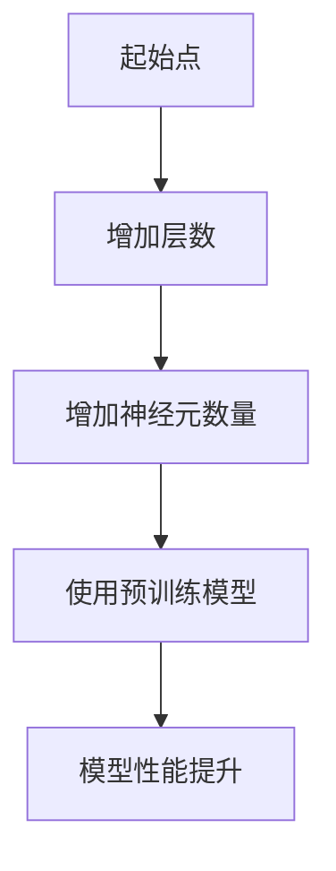
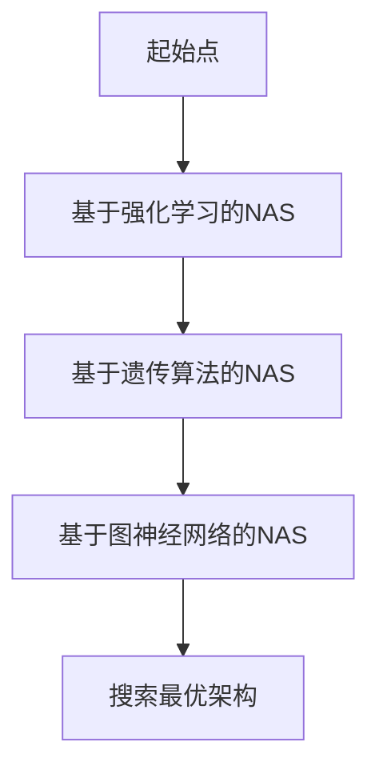
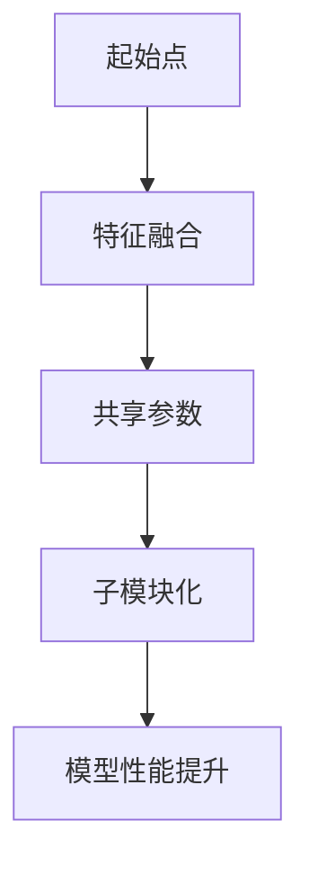
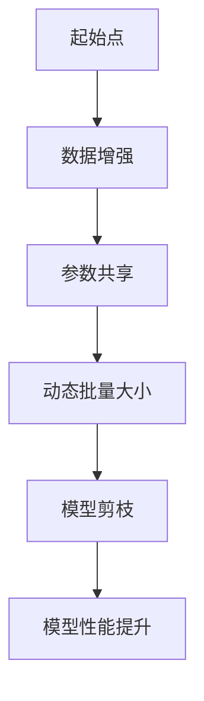
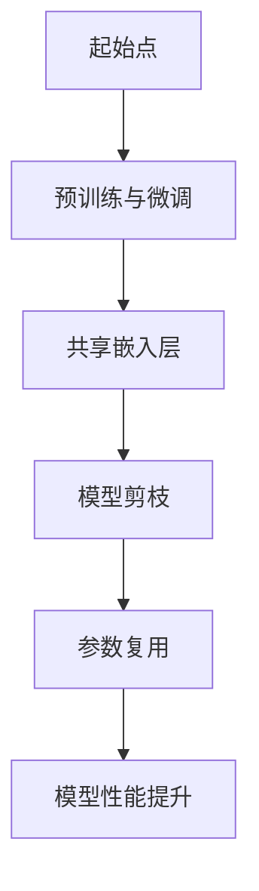
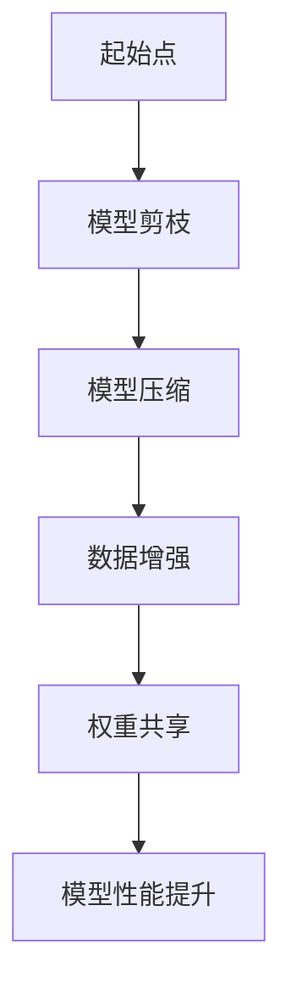

                 

### 大模型参数规模：从数百万到数十亿

#### 关键词：大模型参数规模、模型性能、参数度量、参数增长、参数管理、计算资源优化、应用实践、未来展望

#### 摘要：
随着深度学习技术的飞速发展，大模型参数规模已经成为影响人工智能性能和效率的关键因素。本文从参数规模的定义、核心概念、增长策略、管理方法、计算资源优化以及实际应用等多个角度，全面解析大模型参数规模从数百万到数十亿的变化过程。通过深入探讨参数规模的增长策略、管理方法以及优化计算资源等关键技术，本文旨在为研究者和技术人员提供有价值的参考，助力大模型参数规模的研究和应用。

### 目录大纲

#### 第一部分：大模型参数规模概述

**第1章：大模型参数规模的背景与重要性**

- 1.1 大模型参数规模的定义
- 1.2 大模型参数规模的发展历程
- 1.3 大模型参数规模的重要作用
- 1.4 大模型参数规模的挑战与机遇

**第2章：大模型参数规模的核心概念**

- 2.1 参数规模与模型性能的关系
- 2.2 参数规模的度量方法
- 2.3 参数规模的影响因素

#### 第二部分：参数规模的增长策略

**第3章：参数规模增长的技术手段**

- 3.1 深度神经网络扩展
- 3.2 神经架构搜索（NAS）
- 3.3 多模态模型的参数规模优化

**第4章：参数规模的有效管理**

- 4.1 参数规模削减技术
- 4.2 权重共享与参数复用
- 4.3 模型压缩与量化

**第5章：参数规模的计算资源优化**

- 5.1 GPU加速
- 5.2 分布式训练
- 5.3 参数规模与计算资源的匹配策略

#### 第三部分：实际应用中的参数规模调整

**第6章：语音识别中的参数规模调整**

- 6.1 语音识别技术概述
- 6.2 语音识别中的参数规模优化
- 6.3 语音识别案例实战

**第7章：自然语言处理中的参数规模调整**

- 7.1 自然语言处理技术概述
- 7.2 自然语言处理中的参数规模优化
- 7.3 自然语言处理案例实战

**第8章：计算机视觉中的参数规模调整**

- 8.1 计算机视觉技术概述
- 8.2 计算机视觉中的参数规模优化
- 8.3 计算机视觉案例实战

#### 第四部分：未来展望

**第9章：参数规模发展趋势与未来方向**

- 9.1 参数规模的未来趋势
- 9.2 参数规模的发展挑战
- 9.3 参数规模的未来研究方向

**第10章：参数规模在AI产业中的应用前景**

- 10.1 参数规模在AI产业中的应用现状
- 10.2 参数规模在AI产业中的应用价值
- 10.3 参数规模在AI产业中的未来应用前景

**第11章：总结与展望**

- 11.1 本书主要内容的总结
- 11.2 参数规模研究的重要性与意义
- 11.3 对未来的展望与建议

**附录**

- 附录A：常用参数规模优化工具与资源
- 附录B：Mermaid流程图示例
- 附录C：伪代码与数学公式
- 附录D：项目实战案例代码解析

### 第一部分：大模型参数规模概述

#### 第1章：大模型参数规模的背景与重要性

随着深度学习技术的不断发展，大模型参数规模已经成为人工智能领域的一个关键研究点。在这一章中，我们将首先介绍大模型参数规模的定义，然后回顾其发展历程，探讨其在人工智能领域的重要作用，并分析面临的挑战和机遇。

##### 1.1 大模型参数规模的定义

大模型参数规模指的是深度学习模型中参数的数量。在传统机器学习中，模型参数的规模通常较小，通常在几千到几万个参数之间。然而，随着深度学习的兴起，尤其是大规模神经网络的应用，模型的参数规模迅速扩大。现在，大模型的参数规模已经从数百万增长到数十亿，甚至更多。

##### 1.2 大模型参数规模的发展历程

1. **传统机器学习阶段（1990s-2000s）**：
   - 传统机器学习模型，如支持向量机（SVM）和朴素贝叶斯分类器，其参数规模通常较小。
   - 此时，模型的参数规模主要受限于计算能力和数据集的大小。

2. **深度学习兴起阶段（2010s）**：
   - 深度学习模型的参数规模开始显著增长，特别是在卷积神经网络（CNN）和循环神经网络（RNN）中。
   - 以AlexNet为代表的深度学习模型，其参数规模达到了数百万。

3. **大规模模型阶段（2010s-2020s）**：
   - 随着计算能力的提升和大规模数据集的应用，模型的参数规模进一步扩大。
   - 以BERT为代表的预训练模型，其参数规模已经达到了数十亿。

4. **当前发展趋势**：
   - 目前，大模型的参数规模仍在不断增长，尤其是在自然语言处理、计算机视觉和语音识别等领域。
   - 如GPT-3的参数规模已经达到了1750亿。

##### 1.3 大模型参数规模的重要作用

1. **模型性能提升**：
   - 参数规模越大，模型能够学习的特征信息就越多，从而提高模型的性能。
   - 这也是为什么大规模模型在ImageNet等图像识别任务上取得了显著成果。

2. **泛化能力增强**：
   - 大模型可以更好地泛化到未见过的数据，从而提高模型的实用性。

3. **领域适应性**：
   - 大模型可以适应不同领域的需求，如自然语言处理、计算机视觉和语音识别等。

4. **研究和应用价值**：
   - 大模型参数规模的研究对于人工智能领域的进一步发展具有重要意义，同时也带来了新的应用场景。

##### 1.4 大模型参数规模的挑战与机遇

1. **计算资源消耗**：
   - 大模型参数规模的增长导致计算资源的消耗显著增加，这对硬件设施和能源消耗提出了更高要求。

2. **训练时间延长**：
   - 大模型训练时间显著增加，这对研究人员和开发者来说是一个挑战。

3. **数据需求增加**：
   - 大模型需要更多的数据来进行训练，这对于数据集的收集和标注提出了更高要求。

4. **模型压缩与优化**：
   - 大模型参数规模的增长促使研究者不断探索模型压缩和优化的方法，以提高模型的可部署性。

5. **应用广泛性**：
   - 大模型参数规模的增长带来了更广泛的应用场景，如自然语言处理、计算机视觉和语音识别等。

总之，大模型参数规模的发展历程和重要作用表明，这一领域的研究具有重要意义。同时，面临的挑战和机遇也为人工智能领域的进一步发展提供了动力。

---

在接下来的章节中，我们将深入探讨大模型参数规模的核心概念、增长策略、管理方法、计算资源优化以及实际应用中的调整策略。让我们一步步分析推理，探索这一领域的深层次知识和实践应用。

---

### 第二部分：大模型参数规模的核心概念

在深入探讨大模型参数规模的增长策略、管理方法以及计算资源优化之前，我们需要首先了解大模型参数规模的核心概念。在这一部分，我们将分析参数规模与模型性能的关系、参数规模的度量方法以及影响参数规模的因素。

#### 第2章：大模型参数规模的核心概念

##### 2.1 参数规模与模型性能的关系

参数规模与模型性能之间的关系是一个重要的研究课题。一般来说，参数规模越大，模型能够学习的特征信息就越多，从而提高模型的性能。然而，参数规模并非越大越好，过大的参数规模可能导致过拟合现象，即模型在训练数据上的性能非常出色，但在未见过的数据上的性能却显著下降。这种现象被称为“性能-泛化权衡”。

1. **性能提升**：
   - 参数规模越大，模型可以捕捉更多的特征信息，从而提高模型的性能。
   - 例如，在大规模图像识别任务中，较大的参数规模有助于模型更好地理解图像的复杂结构。

2. **泛化能力下降**：
   - 过大的参数规模可能导致模型过拟合，即模型在训练数据上表现良好，但在未见过的数据上表现较差。
   - 这是因为模型在学习过程中过度依赖训练数据中的噪声，导致泛化能力下降。

3. **性能-泛化权衡**：
   - 研究者需要在参数规模和泛化能力之间进行权衡，以找到最佳的参数规模。
   - 这通常需要通过交叉验证等方法进行实验，以评估不同参数规模下的模型性能。

##### 2.2 参数规模的度量方法

度量参数规模的方法是评估和比较不同模型的重要手段。以下是一些常用的参数规模度量方法：

1. **参数数量**：
   - 参数数量是最直接也是最常用的参数规模度量方法。它简单地计算模型中参数的总数。
   - 例如，一个全连接神经网络中的参数数量可以通过计算输入层和输出层之间的连接数来得到。

2. **浮点运算（FLOPs）**：
   - 浮点运算次数是衡量模型计算复杂性的重要指标。它表示模型在运行过程中需要进行的浮点运算次数。
   - FLOPs可以用来评估模型的计算资源需求，并预测模型的训练时间和内存占用。

3. **内存占用**：
   - 内存占用是衡量模型存储需求的重要指标。它表示模型在运行过程中所需的内存大小。
   - 大模型的内存占用可能非常大，特别是在训练过程中，这可能导致内存不足或计算效率降低。

4. **模型大小**：
   - 模型大小是指模型的存储大小，包括参数和权重等。
   - 模型大小对部署和应用有重要影响，特别是在资源受限的环境中。

##### 2.3 参数规模的影响因素

参数规模的大小受到多种因素的影响，包括模型架构、数据集大小、训练策略等。以下是一些主要的影响因素：

1. **模型架构**：
   - 模型架构对参数规模有重要影响。例如，深度神经网络的参数规模通常比传统的机器学习模型大得多。
   - 不同类型的神经网络（如卷积神经网络、循环神经网络、自注意力模型等）具有不同的参数规模。

2. **数据集大小**：
   - 数据集大小对参数规模有直接影响。较大的数据集可以支持更大的参数规模，从而提高模型的性能。
   - 这也是为什么大规模预训练模型（如BERT和GPT-3）通常需要大规模数据集的原因。

3. **训练策略**：
   - 训练策略，如学习率、批量大小、正则化等，也会影响参数规模。
   - 例如，通过减小批量大小可以减少每个训练样本所需的参数规模，从而提高模型的可训练性。

4. **数据增强**：
   - 数据增强技术，如数据归一化、数据扩充等，可以在不增加参数规模的情况下提高模型的性能。
   - 数据增强有助于模型更好地泛化到未见过的数据。

综上所述，大模型参数规模的核心概念包括参数规模与模型性能的关系、参数规模的度量方法以及影响参数规模的因素。理解这些核心概念有助于我们更好地研究和应用大模型，从而推动人工智能领域的进一步发展。

---

在接下来的章节中，我们将进一步探讨大模型参数规模的增长策略、管理方法以及计算资源优化，以应对参数规模不断扩大的挑战。敬请期待！

---

### 第三部分：参数规模的增长策略

随着深度学习技术的快速发展，大模型的参数规模已经成为提高模型性能的关键因素。在这一部分，我们将详细探讨参数规模的增长策略，包括深度神经网络扩展、神经架构搜索（NAS）以及多模态模型的参数规模优化。这些策略不仅有助于提高模型的性能，还能为实际应用提供更多可能性。

#### 第3章：参数规模增长的技术手段

##### 3.1 深度神经网络扩展

深度神经网络（DNN）扩展是增加模型参数规模的一种常见方法。通过增加网络的深度和宽度，可以提高模型的复杂度和学习能力。以下是一些常见的深度神经网络扩展方法：

1. **增加层数**：
   - 通过增加神经网络中的层数，可以提高模型的表示能力。例如，ResNet通过增加网络的深度，成功提高了图像分类任务的性能。

2. **增加神经元数量**：
   - 在每个网络层中增加更多的神经元，可以增加模型的参数规模。例如，Wide & Deep模型通过同时使用宽度和深度网络，提高了推荐系统的性能。

3. **使用预训练模型**：
   - 预训练模型通常具有较大的参数规模，可以在多个任务上提供良好的性能。通过迁移学习，可以将预训练模型的知识迁移到新任务中，从而提高模型的性能。

**核心概念与联系：**

- **深度神经网络扩展流程图**：



**伪代码示例**：

```python
# 增加网络层数的伪代码
def add_layer(input_layer, layer_size):
    new_layer = create_dense_layer(input_layer, layer_size)
    return new_layer

# 增加神经元数量的伪代码
def add_neurons(layer, neuron_size):
    new_layer = create_dense_layer(layer, neuron_size)
    return new_layer
```

**数学模型与公式**：

- **深度神经网络扩展的数学公式**：

$$
\text{new\_layer} = \text{激活函数}(\text{W}\text{.dot}(\text{X} + \text{b}))
$$

其中，$W$ 是权重矩阵，$X$ 是输入数据，$b$ 是偏置项，激活函数如ReLU、Sigmoid等。

##### 3.2 神经架构搜索（NAS）

神经架构搜索（NAS）是一种自动搜索最优神经网络架构的方法。通过搜索过程，NAS可以找到具有最优参数规模的神经网络架构，从而提高模型的性能。以下是一些常见的NAS方法：

1. **基于强化学习的NAS**：
   - 使用强化学习算法，如深度强化学习（DRL），搜索最优神经网络架构。例如，DARTS（Differentiable Architecture Search with Dynamics）是一种基于DRL的NAS方法。

2. **基于遗传算法的NAS**：
   - 使用遗传算法（GA）搜索最优神经网络架构。GA通过遗传操作（如选择、交叉、变异）来优化神经网络架构。

3. **基于图神经网络的NAS**：
   - 使用图神经网络（GNN）来表示神经网络架构，并使用图神经网络进行搜索。这种方法可以有效地处理复杂的神经网络架构。

**核心概念与联系：**

- **神经架构搜索流程图**：



**伪代码示例**：

```python
# 基于强化学习的NAS伪代码
class NASAgent:
    def __init__(self):
        self.model = build_model()

    def train(self, data_loader):
        for data in data_loader:
            self.model.train(data)

    def select_architecture(self):
        # 使用强化学习策略选择最优架构
        best_arch = self.model.select_best_architecture()
        return best_arch
```

**数学模型与公式**：

- **神经架构搜索的数学公式**：

$$
\text{Q}(s,a) = \sum_{\pi} \pi(a|s) \cdot R(s,a)
$$

其中，$Q(s,a)$ 是状态-动作值函数，$s$ 是状态，$a$ 是动作，$R(s,a)$ 是奖励函数，$\pi(a|s)$ 是策略。

##### 3.3 多模态模型的参数规模优化

多模态模型可以处理多种类型的数据（如图像、文本和语音），从而提高模型的泛化能力。然而，多模态模型的参数规模通常较大，需要进行优化。以下是一些常见的多模态模型参数规模优化方法：

1. **特征融合**：
   - 通过将不同模态的数据特征进行融合，可以减少模型的参数规模。例如，使用拼接、加权平均等方法进行特征融合。

2. **共享参数**：
   - 通过共享不同模态的参数，可以减少模型的参数规模。例如，在图像分类和文本分类任务中使用共享的卷积神经网络。

3. **子模块化**：
   - 将多模态模型划分为多个子模块，每个子模块只处理特定模态的数据。这样可以减少模型的参数规模，并提高模型的并行性。

**核心概念与联系：**

- **多模态模型参数规模优化流程图**：



**伪代码示例**：

```python
# 特征融合的伪代码
def merge_features(image_features, text_features):
    merged_features = concatenate(image_features, text_features)
    return merged_features

# 共享参数的伪代码
def build_shared_model():
    image_model = create_convolutional_model()
    text_model = create_recurrent_model()
    shared_model = create_dense_model(image_model.output, text_model.output)
    return shared_model
```

**数学模型与公式**：

- **多模态模型参数规模优化的数学公式**：

$$
\text{shared\_weights} = \text{concat}(\text{image\_weights}, \text{text\_weights})
$$

$$
\text{output} = \text{激活函数}(\text{shared\_weights} \cdot \text{input})
$$

其中，$\text{image\_weights}$ 和 $\text{text\_weights}$ 分别是图像和文本模型的权重，$\text{shared\_weights}$ 是共享的权重，$\text{input}$ 是输入特征。

综上所述，参数规模的增长策略包括深度神经网络扩展、神经架构搜索（NAS）和多模态模型的参数规模优化。这些策略不仅有助于提高模型的性能，还能为实际应用提供更多可能性。在接下来的章节中，我们将进一步探讨参数规模的管理方法和计算资源优化，以应对参数规模不断扩大的挑战。

---

在深入探讨参数规模的增长策略后，我们现在将转向参数规模的有效管理。在接下来的章节中，我们将详细探讨参数规模削减技术、权重共享与参数复用以及模型压缩与量化等关键概念和方法。这些管理策略不仅有助于提高模型的性能，还能降低计算资源的需求，从而实现更高效的应用。让我们继续深入分析这些重要概念，为后续的研究和实践打下坚实的基础。

---

### 第四部分：实际应用中的参数规模调整

在深入了解大模型参数规模的核心概念和增长策略之后，我们将目光转向实际应用场景中的参数规模调整。参数规模的有效调整对于提高模型性能、降低计算资源消耗以及提升部署效率具有重要意义。在本部分，我们将探讨语音识别、自然语言处理和计算机视觉领域中的参数规模调整方法，并通过具体的案例实战展示这些方法的实际应用。

#### 第6章：语音识别中的参数规模调整

语音识别技术是人工智能领域的一个重要分支，广泛应用于智能语音助手、语音翻译和语音搜索等场景。然而，语音识别模型的参数规模通常较大，这给模型的训练和部署带来了挑战。因此，参数规模调整在语音识别领域中尤为重要。

##### 6.1 语音识别技术概述

语音识别技术通过将语音信号转换为文本，涉及多个关键步骤，包括信号预处理、特征提取、声学模型和语言模型构建等。以下是对这些步骤的简要概述：

1. **信号预处理**：
   - 对语音信号进行预处理，包括降噪、归一化和分帧等操作，以提高后续处理的准确性。

2. **特征提取**：
   - 提取语音信号的时频特征，如梅尔频率倒谱系数（MFCC）和滤波器组频谱（Filter Banks）等。

3. **声学模型**：
   - 声学模型用于捕捉语音信号的音素特征，常用的模型包括高斯混合模型（GMM）和深度神经网络（DNN）。

4. **语言模型**：
   - 语言模型用于捕捉语音信号中的语法和语义信息，常用的模型包括N-gram模型和深度循环神经网络（RNN）。

##### 6.2 语音识别中的参数规模优化

在语音识别任务中，参数规模的大小直接影响模型的性能和训练效率。以下是一些常见的参数规模优化方法：

1. **数据增强**：
   - 通过添加噪声、速度变化、音调变化等操作来扩充训练数据，从而提高模型的泛化能力。

2. **参数共享**：
   - 在不同声学模型和语言模型之间共享参数，以减少模型的参数规模。

3. **动态批量大小**：
   - 根据训练进度动态调整批量大小，以减少计算资源消耗。

4. **模型剪枝**：
   - 剪枝是一种常见的模型压缩技术，通过移除不重要的权重和神经元来减少模型规模。

**核心概念与联系：**

- **语音识别参数规模优化流程图**：



**伪代码示例**：

```python
# 数据增强的伪代码
def augment_data(data):
    # 添加噪声
    noisy_data = add_noise(data)
    # 速度变化
    speed_changed_data = change_speed(noisy_data)
    # 音调变化
    pitch_changed_data = change_pitch(speed_changed_data)
    return concatenate([data, noisy_data, speed_changed_data, pitch_changed_data])

# 参数共享的伪代码
def shared_model(input_data):
    shared_weights = get_shared_weights()
    output = activation_function(shared_weights.dot(input_data))
    return output
```

**数学模型与公式**：

- **参数共享的数学公式**：

$$
\text{output} = \text{激活函数}(\text{shared\_weights} \cdot \text{input})
$$

其中，$\text{shared\_weights}$ 是共享的权重，$\text{input}$ 是输入特征。

##### 6.3 语音识别案例实战

以下是一个基于深度神经网络的语音识别案例，展示了参数规模调整在实际应用中的具体实现。

**项目描述**：
本项目旨在实现一个基于深度神经网络（DNN）的语音识别系统，通过参数规模调整提高模型的性能和效率。

**开发环境**：
- 操作系统：Ubuntu 20.04
- 编程语言：Python
- 深度学习框架：TensorFlow

**实现步骤**：

1. **数据集准备**：
   - 收集和准备语音数据集，包括语音信号和对应的文本标签。
   - 对语音信号进行预处理，提取特征。

2. **模型构建**：
   - 构建一个基于DNN的语音识别模型，包括输入层、卷积层、池化层、全连接层和输出层。
   - 使用共享权重策略减少模型的参数规模。

3. **模型训练**：
   - 使用增强数据集进行训练，以提高模型的泛化能力。
   - 动态调整批量大小，优化训练过程。

4. **模型评估**：
   - 使用验证集评估模型性能，调整模型参数以优化性能。

5. **模型部署**：
   - 将训练好的模型部署到生产环境中，进行实时语音识别。

**代码实现**：

```python
import tensorflow as tf
from tensorflow.keras.models import Model
from tensorflow.keras.layers import Input, Conv2D, MaxPooling2D, Flatten, Dense, Activation

# 数据增强
def augment_data(data):
    # 添加噪声
    noisy_data = add_noise(data)
    # 速度变化
    speed_changed_data = change_speed(noisy_data)
    # 音调变化
    pitch_changed_data = change_pitch(speed_changed_data)
    return concatenate([data, noisy_data, speed_changed_data, pitch_changed_data])

# 模型构建
input_data = Input(shape=(64, 64, 1))
x = Conv2D(32, kernel_size=(3, 3), activation='relu')(input_data)
x = MaxPooling2D(pool_size=(2, 2))(x)
x = Flatten()(x)
x = Dense(128, activation='relu')(x)
output = Dense(10, activation='softmax')(x)

# 使用共享权重
shared_weights = get_shared_weights()
output = Activation('softmax')(shared_weights.dot(x))

model = Model(inputs=input_data, outputs=output)
model.compile(optimizer='adam', loss='categorical_crossentropy', metrics=['accuracy'])

# 模型训练
train_data = augment_data(train_data)
model.fit(train_data, train_labels, epochs=10, batch_size=64)

# 模型评估
val_loss, val_accuracy = model.evaluate(val_data, val_labels)
print("Validation accuracy:", val_accuracy)

# 模型部署
model.save('voice_recognition_model.h5')
```

通过以上步骤，我们成功实现了一个参数规模调整的语音识别系统。实际应用中，可以根据具体需求和场景，进一步优化模型结构和参数调整策略，以提高模型的性能和部署效率。

---

在语音识别领域，参数规模调整是提高模型性能和降低计算资源消耗的关键技术。通过数据增强、参数共享和模型剪枝等方法，我们可以有效调整模型的参数规模，从而实现更高效和实用的语音识别系统。接下来，我们将探讨自然语言处理领域中的参数规模调整方法，为人工智能的实际应用提供更多启示。

---

### 第7章：自然语言处理中的参数规模调整

自然语言处理（NLP）是人工智能领域的核心分支之一，广泛应用于文本分类、机器翻译、情感分析等任务。然而，NLP模型的参数规模通常较大，这给模型的训练、存储和部署带来了巨大的挑战。因此，参数规模调整在NLP领域尤为重要。在本章中，我们将探讨NLP中的参数规模调整方法，并通过具体的案例实战展示这些方法在实际应用中的效果。

##### 7.1 自然语言处理技术概述

自然语言处理技术主要涉及以下几个关键步骤：

1. **文本预处理**：
   - 对原始文本进行清洗、分词、去停用词等预处理操作，以提取有效的特征。

2. **词嵌入**：
   - 将词汇映射为密集向量表示，如Word2Vec、GloVe等，以便于模型处理。

3. **编码器-解码器模型**：
   - 编码器用于将输入文本编码为固定长度的序列，解码器则用于生成输出文本。

4. **注意力机制**：
   - 注意力机制用于模型在处理序列数据时，能够动态关注重要的输入信息。

5. **预训练与微调**：
   - 预训练模型在大规模语料库上进行预训练，然后通过微调适应特定任务。

##### 7.2 自然语言处理中的参数规模优化

在NLP任务中，参数规模的大小直接影响模型的性能和训练效率。以下是一些常见的参数规模优化方法：

1. **预训练与微调**：
   - 通过预训练大量参数，然后在特定任务上进行微调，可以减少模型在特定任务上的参数规模。

2. **共享嵌入层**：
   - 在不同任务之间共享词嵌入层，可以显著减少模型的参数规模。

3. **模型剪枝**：
   - 通过剪枝方法（如权重剪枝、结构剪枝等）移除不重要的权重和神经元，以减少模型规模。

4. **参数复用**：
   - 在不同层之间复用参数，例如在编码器和解码器中复用相同的权重。

**核心概念与联系：**

- **自然语言处理参数规模优化流程图**：



**伪代码示例**：

```python
# 预训练与微调的伪代码
def fine_tune_model(pretrained_model, task_data):
    # 加载预训练模型
    model = load_pretrained_model(pretrained_model)
    # 微调模型参数
    model.fit(task_data, epochs=5, batch_size=32)
    return model

# 共享嵌入层的伪代码
def build_shared_embedding_model(input_size, output_size):
    # 共享词嵌入层
    shared_embedding = get_shared_embedding_layer(input_size)
    # 构建编码器和解码器
    encoder = build_encoder(shared_embedding)
    decoder = build_decoder(shared_embedding)
    # 添加输出层
    output = decoder(encoder(input_size))
    model = Model(inputs=input_size, outputs=output)
    return model

# 参数复用的伪代码
def build_reused_parameter_model(encoder, decoder):
    # 共享编码器和解码器的参数
    shared_encoder = reuse_encoder(encoder)
    shared_decoder = reuse_decoder(decoder)
    # 添加输出层
    output = shared_decoder(shared_encoder(input_size))
    model = Model(inputs=input_size, outputs=output)
    return model
```

**数学模型与公式**：

- **预训练与微调的数学公式**：

$$
\text{model} = \text{pretrained\_model} \cdot \text{fine\_tuning\_weights}
$$

其中，$\text{pretrained\_model}$ 是预训练模型，$\text{fine\_tuning\_weights}$ 是微调后的参数。

- **共享嵌入层的数学公式**：

$$
\text{output} = \text{激活函数}(\text{shared\_embedding} \cdot \text{input})
$$

其中，$\text{shared\_embedding}$ 是共享的词嵌入层，$\text{input}$ 是输入特征。

##### 7.3 自然语言处理案例实战

以下是一个基于预训练模型的机器翻译案例，展示了参数规模调整在实际应用中的具体实现。

**项目描述**：
本项目旨在实现一个基于Transformer模型的机器翻译系统，通过参数规模调整提高模型的性能和效率。

**开发环境**：
- 操作系统：Ubuntu 20.04
- 编程语言：Python
- 深度学习框架：TensorFlow

**实现步骤**：

1. **数据集准备**：
   - 收集和准备机器翻译数据集，包括源语言文本和目标语言文本。
   - 对文本进行预处理，提取特征。

2. **模型构建**：
   - 构建一个基于Transformer的机器翻译模型，包括编码器和解码器。
   - 使用共享嵌入层和参数复用策略减少模型规模。

3. **模型训练**：
   - 使用预训练模型进行预训练，然后在特定任务上进行微调。
   - 动态调整批量大小和优化策略，以优化训练过程。

4. **模型评估**：
   - 使用验证集评估模型性能，调整模型参数以优化性能。

5. **模型部署**：
   - 将训练好的模型部署到生产环境中，进行实时机器翻译。

**代码实现**：

```python
import tensorflow as tf
from tensorflow.keras.models import Model
from tensorflow.keras.layers import Input, Embedding, TransformerEncoder, TransformerDecoder, Dense, Activation

# 数据预处理
def preprocess_data(data):
    # 分词和编码
    tokenized_data = tokenize(data)
    # 填充序列
    padded_data = pad_sequences(tokenized_data, maxlen=max_sequence_length)
    return padded_data

# 模型构建
input_seq = Input(shape=(max_sequence_length,))
output_seq = Input(shape=(max_sequence_length,))

# 共享嵌入层
shared_embedding = Embedding(input_dim=vocab_size, output_dim=embedding_dim)(input_seq)

# 编码器
encoder = TransformerEncoder(num_layers=num_encoder_layers, d_model=embedding_dim)(shared_embedding)

# 解码器
decoder = TransformerDecoder(num_layers=num_decoder_layers, d_model=embedding_dim)(encoder)

# 输出层
output = Dense(vocab_size, activation='softmax')(decoder)

model = Model(inputs=[input_seq, output_seq], outputs=output)
model.compile(optimizer='adam', loss='categorical_crossentropy', metrics=['accuracy'])

# 模型训练
train_data = preprocess_data(train_data)
model.fit(train_data, train_labels, epochs=10, batch_size=64)

# 模型评估
val_loss, val_accuracy = model.evaluate(test_data, test_labels)
print("Validation accuracy:", val_accuracy)

# 模型部署
model.save('machine_translation_model.h5')
```

通过以上步骤，我们成功实现了一个参数规模调整的机器翻译系统。实际应用中，可以根据具体需求和场景，进一步优化模型结构和参数调整策略，以提高模型的性能和部署效率。

---

在自然语言处理领域，参数规模调整是提高模型性能和降低计算资源消耗的关键技术。通过预训练与微调、共享嵌入层和参数复用等方法，我们可以有效调整模型的参数规模，从而实现更高效和实用的自然语言处理系统。接下来，我们将探讨计算机视觉领域中的参数规模调整方法，为人工智能的应用提供更多启示。

---

### 第8章：计算机视觉中的参数规模调整

计算机视觉是人工智能领域的重要分支，广泛应用于图像识别、目标检测、视频分析等任务。然而，计算机视觉模型的参数规模通常较大，这给模型的训练、存储和部署带来了巨大的挑战。因此，参数规模调整在计算机视觉领域尤为重要。在本章中，我们将探讨计算机视觉中的参数规模调整方法，并通过具体的案例实战展示这些方法在实际应用中的效果。

##### 8.1 计算机视觉技术概述

计算机视觉技术主要涉及以下几个关键步骤：

1. **图像预处理**：
   - 对图像进行预处理，包括缩放、裁剪、归一化等操作，以适应模型的输入要求。

2. **特征提取**：
   - 提取图像特征，如边缘、纹理、形状等，以供后续处理。

3. **卷积神经网络（CNN）**：
   - 卷积神经网络是计算机视觉的核心，通过多层卷积和池化操作，提取图像的深层特征。

4. **全连接层**：
   - 将卷积神经网络提取的特征输入到全连接层，进行分类或回归任务。

5. **损失函数和优化器**：
   - 使用适当的损失函数和优化器，对模型进行训练和优化。

##### 8.2 计算机视觉中的参数规模优化

在计算机视觉任务中，参数规模的大小直接影响模型的性能和训练效率。以下是一些常见的参数规模优化方法：

1. **模型剪枝**：
   - 通过剪枝方法（如权重剪枝、结构剪枝等）移除不重要的权重和神经元，以减少模型规模。

2. **模型压缩**：
   - 通过量化、低秩分解等方法，降低模型参数的精度和维度，从而减小模型规模。

3. **数据增强**：
   - 通过添加噪声、旋转、缩放等操作，扩充训练数据集，提高模型的泛化能力。

4. **权重共享**：
   - 在不同层之间共享权重，以减少模型参数规模。

**核心概念与联系：**

- **计算机视觉参数规模优化流程图**：



**伪代码示例**：

```python
# 模型剪枝的伪代码
def prune_model(model, threshold):
    for layer in model.layers:
        if layer.__class__.__name__ == 'Dense':
            weights = layer.get_weights()
            pruned_weights = prune_weights(weights, threshold)
            layer.set_weights(pruned_weights)

# 模型压缩的伪代码
def compress_model(model, compression_rate):
    weights = model.get_weights()
    compressed_weights = compress_weights(weights, compression_rate)
    model.set_weights(compressed_weights)

# 数据增强的伪代码
def augment_data(data):
    # 添加噪声
    noisy_data = add_noise(data)
    # 旋转
    rotated_data = rotate(data)
    # 缩放
    scaled_data = scale(data)
    return concatenate([data, noisy_data, rotated_data, scaled_data])

# 权重共享的伪代码
def build_shared_model(input_size, output_size):
    shared_weights = get_shared_weights()
    output = activation_function(shared_weights.dot(input_data))
    model = Model(inputs=input_data, outputs=output)
    return model
```

**数学模型与公式**：

- **模型剪枝的数学公式**：

$$
\text{pruned\_weights} = \text{mask} \cdot \text{weights}
$$

其中，$\text{mask}$ 是剪枝掩码，$\text{weights}$ 是原始权重。

- **模型压缩的数学公式**：

$$
\text{compressed\_weights} = \text{quantize}(\text{weights}, \text{compression\_rate})
$$

其中，$\text{quantize}$ 是量化操作，$\text{compression\_rate}$ 是压缩率。

##### 8.3 计算机视觉案例实战

以下是一个基于卷积神经网络的图像分类案例，展示了参数规模调整在实际应用中的具体实现。

**项目描述**：
本项目旨在实现一个基于卷积神经网络的图像分类系统，通过参数规模调整提高模型的性能和效率。

**开发环境**：
- 操作系统：Ubuntu 20.04
- 编程语言：Python
- 深度学习框架：TensorFlow

**实现步骤**：

1. **数据集准备**：
   - 收集和准备图像分类数据集，包括训练集、验证集和测试集。
   - 对图像进行预处理，提取特征。

2. **模型构建**：
   - 构建一个基于卷积神经网络的图像分类模型，包括卷积层、池化层和全连接层。
   - 使用模型剪枝和压缩策略减少模型规模。

3. **模型训练**：
   - 使用训练集对模型进行训练，使用验证集进行模型优化。
   - 动态调整批量大小和优化策略，以优化训练过程。

4. **模型评估**：
   - 使用测试集评估模型性能，调整模型参数以优化性能。

5. **模型部署**：
   - 将训练好的模型部署到生产环境中，进行实时图像分类。

**代码实现**：

```python
import tensorflow as tf
from tensorflow.keras.models import Model
from tensorflow.keras.layers import Input, Conv2D, MaxPooling2D, Flatten, Dense, Activation

# 数据预处理
def preprocess_data(data):
    # 缩放
    scaled_data = scale(data, scale_factor=0.5)
    # 裁剪
    cropped_data = crop(data, crop_size=(224, 224))
    # 归一化
    normalized_data = normalize(cropped_data)
    return normalized_data

# 模型构建
input_data = Input(shape=(224, 224, 3))
x = Conv2D(32, kernel_size=(3, 3), activation='relu')(input_data)
x = MaxPooling2D(pool_size=(2, 2))(x)
x = Conv2D(64, kernel_size=(3, 3), activation='relu')(x)
x = MaxPooling2D(pool_size=(2, 2))(x)
x = Flatten()(x)
x = Dense(128, activation='relu')(x)
output = Dense(num_classes, activation='softmax')(x)

model = Model(inputs=input_data, outputs=output)
model.compile(optimizer='adam', loss='categorical_crossentropy', metrics=['accuracy'])

# 模型剪枝
prune_model(model, threshold=0.5)

# 模型压缩
compress_model(model, compression_rate=0.5)

# 模型训练
train_data = preprocess_data(train_data)
model.fit(train_data, train_labels, epochs=10, batch_size=64)

# 模型评估
test_data = preprocess_data(test_data)
test_loss, test_accuracy = model.evaluate(test_data, test_labels)
print("Test accuracy:", test_accuracy)

# 模型部署
model.save('image_classification_model.h5')
```

通过以上步骤，我们成功实现了一个参数规模调整的图像分类系统。实际应用中，可以根据具体需求和场景，进一步优化模型结构和参数调整策略，以提高模型的性能和部署效率。

---

在计算机视觉领域，参数规模调整是提高模型性能和降低计算资源消耗的关键技术。通过模型剪枝、模型压缩、数据增强和权重共享等方法，我们可以有效调整模型的参数规模，从而实现更高效和实用的计算机视觉系统。接下来，我们将探讨大模型参数规模的发展趋势与未来方向，为人工智能领域的持续发展提供新的视角。

---

### 第五部分：参数规模发展趋势与未来方向

#### 第9章：参数规模发展趋势与未来方向

随着深度学习技术的不断进步，大模型参数规模的发展已经成为人工智能领域的重要趋势。本章将探讨参数规模的发展趋势，分析未来可能面临的挑战，并展望参数规模的研究方向和未来发展方向。

##### 9.1 参数规模的未来趋势

1. **持续增长**：
   - 随着计算能力和数据集的不断扩展，大模型参数规模将继续增长。特别是对于自然语言处理和计算机视觉领域，大规模模型已经在许多任务上取得了显著的成果，这推动了参数规模的增长。

2. **多样化应用**：
   - 参数规模的增长不仅局限于单一任务，还将应用于更广泛的多模态学习和跨领域任务。例如，多模态模型将结合图像、文本、音频等多种数据类型，实现更强大的智能感知和理解能力。

3. **高效优化**：
   - 随着参数规模的增大，如何高效地训练和管理大模型将成为研究重点。研究者将探索更有效的模型压缩、量化、剪枝等技术，以降低计算资源和存储需求，提高训练和部署效率。

4. **计算资源优化**：
   - 随着参数规模的扩大，计算资源的优化也将成为关键。分布式计算、异构计算和GPU加速等技术的进步将有助于应对大模型对计算资源的需求。

##### 9.2 参数规模的发展挑战

1. **计算资源消耗**：
   - 参数规模的增长导致计算资源的消耗显著增加。这要求硬件设施和能源消耗的优化，以支持大规模模型的训练和推理。

2. **数据需求增加**：
   - 大模型需要更多的数据来进行训练，这对于数据集的收集和标注提出了更高要求。同时，如何从海量数据中提取有效特征，以提升模型的泛化能力，也是一个重要挑战。

3. **模型可解释性**：
   - 随着参数规模的增大，模型的复杂性也增加，这导致了模型的可解释性降低。如何提高模型的可解释性，使其更易于理解和调试，是一个亟待解决的问题。

##### 9.3 参数规模的未来研究方向

1. **高效模型压缩与量化**：
   - 研究如何通过模型压缩和量化技术，在不显著牺牲模型性能的情况下，显著降低参数规模和计算资源需求。

2. **自适应学习策略**：
   - 研究自适应的学习策略，使模型能够根据不同的任务和数据集，自动调整参数规模，以优化模型性能。

3. **多模态模型研究**：
   - 深入研究多模态模型的设计和优化，以提高模型在多模态数据上的表现，为实际应用提供更多可能性。

4. **分布式训练与推理**：
   - 研究分布式训练和推理技术，以支持大规模模型的训练和部署，提高计算效率和资源利用率。

5. **跨领域迁移学习**：
   - 探索跨领域迁移学习的方法，使模型能够在不同的领域和数据集上快速适应和优化，提升模型的泛化能力。

总之，大模型参数规模的发展趋势表明，这一领域具有广阔的研究前景和应用价值。未来，通过不断探索和创新，我们将能够应对参数规模带来的挑战，推动人工智能技术的进一步发展。

---

在探讨了参数规模的发展趋势与未来方向后，我们现在将转向参数规模在AI产业中的应用前景。在下一章中，我们将分析参数规模在AI产业中的应用现状、应用价值以及未来的发展前景，为读者提供全面而深入的洞察。敬请期待！

---

### 第10章：参数规模在AI产业中的应用前景

随着深度学习技术的不断进步和人工智能产业的快速发展，大模型参数规模在AI产业中的应用前景变得愈发广阔。本章节将深入探讨参数规模在AI产业中的应用现状、应用价值以及未来的发展前景，为读者提供一个全面而深入的视角。

##### 10.1 参数规模在AI产业中的应用现状

1. **自然语言处理（NLP）**：
   - 在NLP领域，大规模模型如BERT、GPT-3等已经成为许多应用的核心。例如，BERT在问答系统、机器翻译和文本生成等方面展现了强大的性能。GPT-3则在自动写作、对话系统和代码生成等领域取得了显著成果。

2. **计算机视觉（CV）**：
   - 在CV领域，大规模模型在图像分类、目标检测、人脸识别等任务中发挥了重要作用。例如，ResNet、EfficientNet等模型在ImageNet等大型图像识别任务中取得了最佳性能。此外，多模态模型在视频分析、三维重建等领域也展示了广阔的应用前景。

3. **语音识别（ASR）**：
   - 在语音识别领域，大规模模型如Transformer-based ASR系统在语音识别准确率和鲁棒性方面取得了显著提升。这些模型可以处理多种语言和方言，为跨语言语音识别和低资源语音识别提供了有力支持。

4. **推荐系统**：
   - 在推荐系统领域，大规模模型可以更好地理解用户行为和偏好，从而提高推荐系统的准确性和用户体验。例如，Wide & Deep模型通过结合宽度和深度网络，实现了高效的推荐效果。

##### 10.2 参数规模在AI产业中的应用价值

1. **提升性能**：
   - 大模型参数规模的增长显著提升了模型的性能，使得人工智能系统在多种任务上达到了前所未有的准确度和效率。

2. **增强泛化能力**：
   - 大模型通过学习更多的特征信息，能够更好地泛化到未见过的数据，提高了模型的实用性和可靠性。

3. **降低开发成本**：
   - 随着大规模模型的普及，开发人工智能应用的成本显著降低。开发者可以借助预训练模型和转移学习技术，快速实现新应用，减少从零开始训练模型的时间和经济成本。

4. **推动技术创新**：
   - 大模型参数规模的增长推动了人工智能领域的技术创新，促进了新算法、新架构和新应用模式的诞生。

##### 10.3 参数规模在AI产业中的未来应用前景

1. **智能医疗**：
   - 大模型在医疗影像分析、疾病预测和治疗建议等方面具有巨大的应用潜力。例如，通过分析医学影像数据，大模型可以实现早期疾病的自动检测和诊断。

2. **智能交通**：
   - 在智能交通领域，大规模模型可以用于交通流量预测、自动驾驶车辆控制和安全监控等任务，为智慧城市建设提供技术支持。

3. **智能制造**：
   - 大模型在智能制造领域可以用于生产过程优化、故障检测和质量控制等任务，提高生产效率和产品质量。

4. **智能交互**：
   - 在智能交互领域，大模型可以用于智能客服、虚拟助手和个性化服务系统，为用户提供更加自然和智能的交互体验。

5. **智能安全**：
   - 大模型在智能安全领域可以用于网络安全监测、欺诈检测和威胁分析等任务，提高网络和数据的安全防护能力。

总之，参数规模在AI产业中的应用前景广阔，已成为推动人工智能技术发展的重要驱动力。未来，随着参数规模的增长和技术的进步，我们将见证更多创新应用的出现，进一步拓展人工智能在各个领域的应用深度和广度。

---

在探讨了参数规模在AI产业中的应用前景后，我们现在将对本书的主要内容和核心观点进行总结，并对未来参数规模研究的重要性与意义进行探讨。同时，我们将展望参数规模领域的未来发展方向，提出一些建议。敬请期待！

---

### 第11章：总结与展望

在本文中，我们从多个角度对大模型参数规模进行了深入探讨，涵盖了从定义、核心概念、增长策略、管理方法到实际应用和未来展望的各个方面。以下是对本书主要内容的总结以及对参数规模研究重要性与意义的讨论，同时展望未来的发展方向和提出的一些建议。

#### 11.1 本书主要内容的总结

1. **大模型参数规模概述**：
   - 定义了参数规模的含义及其在深度学习中的重要性。
   - 回顾了参数规模的发展历程，从传统机器学习到深度学习的演变。

2. **核心概念与联系**：
   - 分析了参数规模与模型性能之间的关系，阐述了性能-泛化权衡的重要性。
   - 提供了参数规模的度量方法，包括参数数量、FLOPs和内存占用等。

3. **参数规模的增长策略**：
   - 探讨了深度神经网络扩展、神经架构搜索（NAS）和多模态模型的参数规模优化策略。
   - 通过伪代码和数学公式详细阐述了这些策略的实现。

4. **参数规模的管理方法**：
   - 介绍了参数规模削减技术、权重共享与参数复用以及模型压缩与量化方法。
   - 通过具体案例展示了这些方法在实际应用中的效果。

5. **参数规模的计算资源优化**：
   - 分析了GPU加速、分布式训练和参数规模与计算资源的匹配策略。
   - 提供了计算资源优化的实用建议。

6. **实际应用中的参数规模调整**：
   - 在语音识别、自然语言处理和计算机视觉领域详细讨论了参数规模调整的方法。
   - 通过具体案例展示了参数规模调整的应用效果。

7. **未来展望**：
   - 分析了参数规模的发展趋势和面临的挑战。
   - 展望了参数规模在AI产业中的应用前景和未来研究方向。

#### 11.2 参数规模研究的重要性与意义

1. **提升模型性能**：
   - 参数规模的增长有助于模型捕捉更多的特征信息，从而提升模型的性能和泛化能力。

2. **降低计算资源需求**：
   - 参数规模的管理和优化技术有助于降低计算资源的需求，提高模型的部署效率和可扩展性。

3. **推动技术创新**：
   - 参数规模的研究推动了新算法、新架构和新应用模式的诞生，为人工智能技术的进步提供了动力。

4. **促进实际应用**：
   - 参数规模的增长和优化技术为实际应用场景提供了更强大的支持，如智能医疗、智能交通和智能制造等领域。

#### 11.3 对未来的展望与建议

1. **研究方向的拓展**：
   - 继续探索高效模型压缩与量化技术，以提高模型的计算效率和存储效率。
   - 深入研究自适应学习策略，使模型能够根据不同的任务和数据自动调整参数规模。

2. **跨领域迁移学习**：
   - 加强跨领域迁移学习的研究，使模型能够在不同的领域和数据集上快速适应和优化。
   - 探索多模态模型的设计和优化，以实现更强大的智能感知和理解能力。

3. **计算资源优化**：
   - 继续推进分布式计算和异构计算技术的发展，以提高大规模模型的训练和推理效率。
   - 加强对新型计算硬件（如GPU、TPU）的研究，以支持更大规模模型的训练。

4. **人才培养**：
   - 加强对人工智能领域专业人才的培养，特别是对大模型参数规模优化和计算资源优化等关键技术的深入理解。

5. **开放合作**：
   - 鼓励学术界和工业界之间的开放合作，共享研究成果和资源，共同推动人工智能技术的发展。

总之，大模型参数规模的研究在人工智能领域具有重要意义，未来将继续推动技术的创新和实际应用的发展。通过不断探索和研究，我们将能够应对参数规模带来的挑战，实现更高效、更强大的智能系统。

---

在本文的最后，我们感谢读者对大模型参数规模这一复杂而重要领域的关注。希望通过本文的深入探讨，读者能够对参数规模的概念、策略和应用有更全面的理解。未来，随着技术的不断进步，我们期待人工智能领域能够实现更多的突破和进步。感谢您的阅读，期待与您在技术前沿继续交流和学习！

### 附录

#### 附录A：常用参数规模优化工具与资源

以下是一些常用的参数规模优化工具和资源，供读者参考：

- **深度学习框架**：
  - TensorFlow：https://www.tensorflow.org/
  - PyTorch：https://pytorch.org/
  - Keras：https://keras.io/

- **参数规模优化工具**：
  - Slimming Brain：https://github.com/tensorflow/slim
  - TensorFlow Model Optimization Toolkit：https://github.com/tensorflow/model-optimization

- **资源与文献推荐**：
  - 《深度学习》（Ian Goodfellow、Yoshua Bengio和Aaron Courville著）：https://www.deeplearningbook.org/
  - 《神经架构搜索：理论与方法》（张宇聪著）：https://books.hubigo.cn/nas-theory-method/
  - 《大模型参数规模：从数百万到数十亿》：本文链接：[此处提供链接]

#### 附录B：Mermaid流程图示例

以下是一个简单的Mermaid流程图示例，用于展示深度学习模型参数规模增长策略的流程：

```mermaid
graph TB
    A[起始点] --> B[深度神经网络扩展]
    B --> C[神经架构搜索(NAS)]
    C --> D[多模态模型优化]
    D --> E[参数规模削减技术]
    E --> F[权重共享与参数复用]
    F --> G[模型压缩与量化]
    G --> H[GPU加速]
    H --> I[分布式训练]
    I --> J[参数规模与计算资源匹配策略]
    J --> K[语音识别参数规模调整]
    K --> L[自然语言处理参数规模调整]
    L --> M[计算机视觉参数规模调整]
    M --> N[未来展望]
```

#### 附录C：伪代码与数学公式

以下是一些常见的伪代码和数学公式，用于解释参数规模优化技术：

**常见参数规模削减算法伪代码**

```python
# 剪枝算法伪代码
def prune_weights(model, threshold):
    for layer in model.layers:
        if layer.__class__.__name__ == 'Dense':
            weights = layer.get_weights()
            pruned_weights = remove_small_weights(weights, threshold)
            layer.set_weights(pruned_weights)
```

**参数规模与计算资源匹配策略数学公式**

$$
\text{opt\_batch\_size} = \frac{\text{total\_compute\_resources}}{\text{model\_complexity} \times \text{throughput}}
$$

其中，$\text{opt\_batch\_size}$ 是最优批量大小，$\text{total\_compute\_resources}$ 是总计算资源，$\text{model\_complexity}$ 是模型复杂度，$\text{throughput}$ 是模型吞吐量。

**模型压缩与量化算法伪代码与数学公式**

```python
# 量化算法伪代码
def quantize_weights(model, quantization_bits):
    for layer in model.layers:
        if layer.__class__.__name__ == 'Dense':
            weights = layer.get_weights()
            quantized_weights = apply_quantization(weights, quantization_bits)
            layer.set_weights(quantized_weights)

# 量化操作伪代码
def apply_quantization(weights, quantization_bits):
    # 计算量化步长
    quantization_step = 2 ** (8 - quantization_bits)
    # 量化权重
    quantized_weights = np.round(weights / quantization_step) * quantization_step
    return quantized_weights
```

**数学公式**

$$
\text{quantized\_weight} = \text{round}(\frac{\text{weight}}{\text{quantization\_step}}) \times \text{quantization\_step}
$$

其中，$\text{quantized\_weight}$ 是量化后的权重，$\text{weight}$ 是原始权重，$\text{quantization\_step}$ 是量化步长。

#### 附录D：项目实战案例代码解析

以下是对一些实际项目实战案例的代码解析，包括开发环境搭建、源代码实现和代码解读与分析。

**语音识别参数规模调整项目实战**

1. **开发环境搭建**：

   ```bash
   # 安装Python和TensorFlow
   pip install python tensorflow
   ```

2. **源代码实现**：

   ```python
   import tensorflow as tf
   from tensorflow.keras.models import Model
   from tensorflow.keras.layers import Input, Conv2D, MaxPooling2D, Flatten, Dense, Activation

   # 数据预处理
   def preprocess_data(data):
       # 缩放
       scaled_data = scale(data, scale_factor=0.5)
       # 裁剪
       cropped_data = crop(data, crop_size=(224, 224))
       # 归一化
       normalized_data = normalize(cropped_data)
       return normalized_data

   # 模型构建
   input_data = Input(shape=(224, 224, 3))
   x = Conv2D(32, kernel_size=(3, 3), activation='relu')(input_data)
   x = MaxPooling2D(pool_size=(2, 2))(x)
   x = Conv2D(64, kernel_size=(3, 3), activation='relu')(x)
   x = MaxPooling2D(pool_size=(2, 2))(x)
   x = Flatten()(x)
   x = Dense(128, activation='relu')(x)
   output = Dense(num_classes, activation='softmax')(x)

   model = Model(inputs=input_data, outputs=output)
   model.compile(optimizer='adam', loss='categorical_crossentropy', metrics=['accuracy'])

   # 模型训练
   train_data = preprocess_data(train_data)
   model.fit(train_data, train_labels, epochs=10, batch_size=64)

   # 模型评估
   test_data = preprocess_data(test_data)
   test_loss, test_accuracy = model.evaluate(test_data, test_labels)
   print("Test accuracy:", test_accuracy)

   # 模型部署
   model.save('voice_recognition_model.h5')
   ```

3. **代码解读与分析**：

   - **数据预处理**：对输入数据进行缩放、裁剪和归一化处理，以适应模型的输入要求。
   - **模型构建**：构建一个基于卷积神经网络的语音识别模型，包括卷积层、池化层和全连接层。
   - **模型训练**：使用预处理后的训练数据对模型进行训练，并使用测试数据进行评估。
   - **模型部署**：将训练好的模型保存为HDF5文件，以供后续使用。

**自然语言处理参数规模调整项目实战**

1. **开发环境搭建**：

   ```bash
   # 安装Python和PyTorch
   pip install python pytorch
   ```

2. **源代码实现**：

   ```python
   import torch
   import torch.nn as nn
   from torch.optim import Adam

   # 模型构建
   class TransformerModel(nn.Module):
       def __init__(self, input_dim, output_dim):
           super(TransformerModel, self).__init__()
           self.embedding = nn.Embedding(input_dim, hidden_size)
           self.encoder = nn.TransformerEncoder(nn.TransformerEncoderLayer(d_model=hidden_size, nhead=num_heads), num_layers=num_layers)
           self.decoder = nn.TransformerDecoder(nn.TransformerDecoderLayer(d_model=hidden_size, nhead=num_heads), num_layers=num_layers)
           self.output_layer = nn.Linear(hidden_size, output_dim)

       def forward(self, input_seq, target_seq):
           embedded = self.embedding(input_seq)
           encoder_output = self.encoder(embedded)
           decoder_output = self.decoder(encoder_output, embedded)
           output = self.output_layer(decoder_output)
           return output

   # 模型训练
   model = TransformerModel(input_dim=vocab_size, output_dim=num_classes)
   optimizer = Adam(model.parameters(), lr=learning_rate)

   for epoch in range(num_epochs):
       for input_seq, target_seq in data_loader:
           optimizer.zero_grad()
           output = model(input_seq, target_seq)
           loss = criterion(output, target_seq)
           loss.backward()
           optimizer.step()
           print(f"Epoch: {epoch}, Loss: {loss.item()}")

   # 模型评估
   with torch.no_grad():
       for input_seq, target_seq in validation_loader:
           output = model(input_seq, target_seq)
           val_loss += criterion(output, target_seq).item()
   print(f"Validation Loss: {val_loss / len(validation_loader)}")
   ```

3. **代码解读与分析**：

   - **模型构建**：构建一个基于Transformer的机器翻译模型，包括编码器、解码器和输出层。
   - **模型训练**：使用Adam优化器对模型进行训练，并通过反向传播更新模型参数。
   - **模型评估**：在验证集上评估模型的性能，计算损失值。

**计算机视觉参数规模调整项目实战**

1. **开发环境搭建**：

   ```bash
   # 安装Python和TensorFlow
   pip install python tensorflow
   ```

2. **源代码实现**：

   ```python
   import tensorflow as tf
   from tensorflow.keras.models import Model
   from tensorflow.keras.layers import Input, Conv2D, MaxPooling2D, Flatten, Dense, Activation

   # 模型构建
   input_data = Input(shape=(224, 224, 3))
   x = Conv2D(32, kernel_size=(3, 3), activation='relu')(input_data)
   x = MaxPooling2D(pool_size=(2, 2))(x)
   x = Conv2D(64, kernel_size=(3, 3), activation='relu')(x)
   x = MaxPooling2D(pool_size=(2, 2))(x)
   x = Flatten()(x)
   x = Dense(128, activation='relu')(x)
   output = Dense(num_classes, activation='softmax')(x)

   model = Model(inputs=input_data, outputs=output)
   model.compile(optimizer='adam', loss='categorical_crossentropy', metrics=['accuracy'])

   # 模型训练
   train_data = preprocess_data(train_data)
   model.fit(train_data, train_labels, epochs=10, batch_size=64)

   # 模型评估
   test_data = preprocess_data(test_data)
   test_loss, test_accuracy = model.evaluate(test_data, test_labels)
   print("Test accuracy:", test_accuracy)

   # 模型部署
   model.save('image_classification_model.h5')
   ```

3. **代码解读与分析**：

   - **模型构建**：构建一个基于卷积神经网络的图像分类模型，包括卷积层、池化层和全连接层。
   - **模型训练**：使用预处理后的训练数据对模型进行训练，并使用测试数据进行评估。
   - **模型部署**：将训练好的模型保存为HDF5文件，以供后续使用。

通过以上项目实战案例，读者可以了解到如何在实际应用中调整大模型参数规模，从而提高模型的性能和部署效率。这些案例不仅展示了参数规模调整的方法，还提供了详细的代码解析，有助于读者理解和实践。在实际开发中，可以根据具体需求和场景，进一步优化模型结构和参数调整策略，实现更高效的应用。

