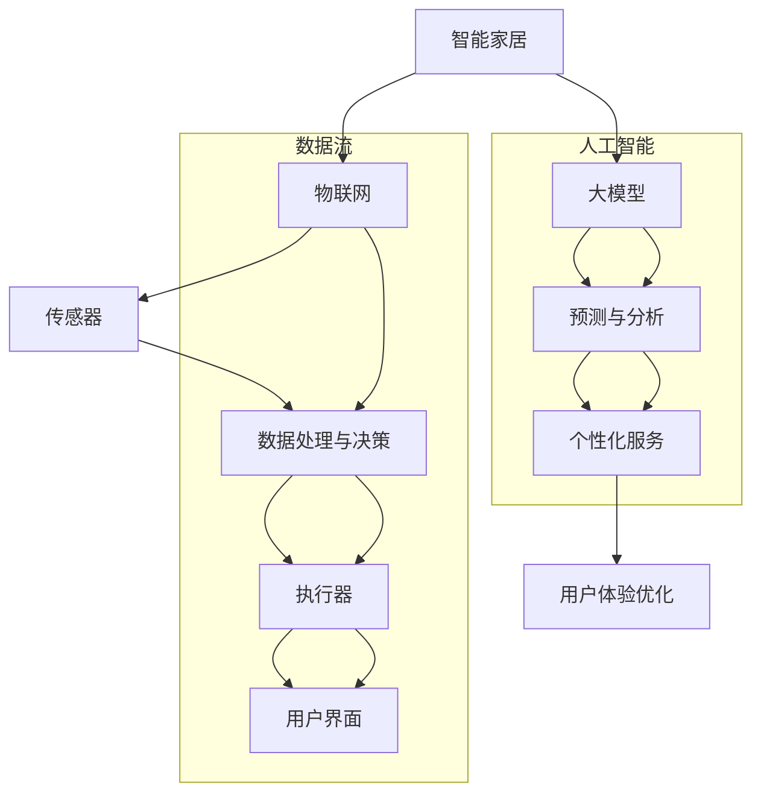

                 

## 《大模型在智能家居领域的发展前景》

### 关键词：智能家居，大模型，深度学习，人工智能，物联网，环境监测，能源管理，人机交互，系统集成，案例分析，未来展望。

### 摘要：
本文将探讨大模型在智能家居领域的发展前景。首先，我们将介绍智能家居的定义、发展历程和关键技术，然后详细阐述大模型的概念、分类与应用。接着，我们将分章节讨论大模型在智能家居控制、环境监测、能源管理等方面的具体应用。随后，我们将深入探讨大模型在智能家居安全与隐私保护、人机交互、系统集成中的应用，并通过案例分析展示大模型在实际项目中的应用效果。最后，我们将展望大模型在智能家居领域的未来发展趋势和面临的挑战，为读者提供全面的技术分析和发展预测。

## 目录大纲

### 第一部分：引言与基础理论

**第1章：智能家居概述**

- **1.1 智能家居的定义与发展历程**
- **1.2 智能家居的关键技术**

**第2章：大模型概述**

- **2.1 大模型的概念与特点**
- **2.2 大模型的分类与应用**

### 第二部分：大模型在智能家居中的应用

**第3章：大模型在智能家居控制中的应用**

- **3.1 大模型在智能照明控制中的应用**
- **3.2 大模型在智能安防系统中的应用**

**第4章：大模型在智能家居环境监测中的应用**

- **4.1 大模型在空气质量监测中的应用**
- **4.2 大模型在温湿度控制中的应用**

**第5章：大模型在智能家居能源管理中的应用**

- **5.1 大模型在电力管理中的应用**
- **5.2 大模型在能源效率优化中的应用**

### 第三部分：大模型在智能家居中的前沿技术与应用

**第6章：大模型在智能家居安全与隐私保护中的应用**

- **6.1 大模型在智能家居安全防护中的应用**
- **6.2 大模型在隐私保护中的应用**

**第7章：大模型在智能家居人机交互中的应用**

- **7.1 大模型在语音交互中的应用**
- **7.2 大模型在视觉交互中的应用**

**第8章：大模型在智能家居系统集成中的应用**

- **8.1 大模型在智能家居平台搭建中的应用**
- **8.2 大模型在智能家居生态系统中的应用**

### 第四部分：实战案例分析

**第9章：智能家居行业案例分析**

- **9.1 案例一：XX智能家居系统**
- **9.2 案例二：YY智能家居平台**

### 第五部分：未来展望

**第10章：大模型在智能家居领域的未来展望**

- **10.1 大模型在智能家居领域的未来趋势**
- **10.2 大模型在智能家居领域的挑战与机遇**

### 附录

**附录A：大模型在智能家居领域的关键技术综述**

- **A.1 深度学习技术**
- **A.2 机器学习技术**
- **A.3 数据处理技术**

**附录B：大模型开发工具与应用**

- **B.1 TensorFlow**
- **B.2 PyTorch**
- **B.3 其他常用工具**

通过以上详细的目录大纲，我们可以清晰地了解到文章的整体结构和内容安排，接下来我们将逐一深入探讨每个章节的主题。

### 第一部分：引言与基础理论

在本部分中，我们将介绍智能家居的基本概念、发展历程以及关键技术，同时介绍大模型的概念、分类与应用，为后续章节的具体应用分析打下基础。

#### 第1章：智能家居概述

##### 1.1 智能家居的定义与发展历程

智能家居（Smart Home）是一种通过物联网（IoT）技术和人工智能（AI）将家庭中的各种设备和系统连接在一起，实现自动化控制和智能化管理的系统。智能家居的起源可以追溯到20世纪90年代，当时网络技术的迅速发展和家庭自动化设备的普及为智能家居的诞生提供了条件。

早期智能家居设备主要集中在家庭安全领域，如报警系统、监控摄像头和门禁系统。随着物联网技术的兴起，智能家居设备逐渐扩展到家庭生活的各个领域，包括照明、安防、环境监测、家电控制等。

发展历程：

1. **初级阶段（1990s-2000s）**：智能家居设备主要集中在安全领域，如报警系统、监控摄像头等。
2. **成长阶段（2000s-2010s）**：随着网络技术的普及，智能家居设备逐渐增加，如智能灯泡、智能插座、智能温控器等。
3. **成熟阶段（2010s-至今）**：智能家居设备逐渐实现互联互通，形成完整的智能家居系统，如智能音箱、智能门锁、智能窗帘等。

##### 1.2 智能家居的关键技术

智能家居的实现离不开以下关键技术：

1. **物联网技术**：物联网技术是智能家居的核心，通过将家庭中的各种设备和系统连接起来，实现设备间的数据传输和协同工作。
2. **传感器技术**：传感器技术用于收集家庭环境数据，如温度、湿度、光照、空气质量等，为智能家居系统提供实时数据支持。
3. **人工智能技术**：人工智能技术用于分析传感器数据，实现智能家居设备的智能控制，如语音识别、图像识别、自然语言处理等。
4. **网络通信技术**：网络通信技术用于实现智能家居设备之间的数据传输，如Wi-Fi、蓝牙、ZigBee等。
5. **云计算与大数据技术**：云计算和大数据技术用于处理和分析大量家庭数据，为智能家居系统提供智能决策支持。

#### 第2章：大模型概述

##### 2.1 大模型的概念与特点

大模型（Large-scale Model）是指具有大规模参数和复杂结构的机器学习模型，如深度神经网络（Deep Neural Network，DNN）、卷积神经网络（Convolutional Neural Network，CNN）、循环神经网络（Recurrent Neural Network，RNN）和Transformer等。大模型通常具有以下特点：

1. **大规模参数**：大模型具有数百万到数十亿个参数，可以捕获复杂的数据特征。
2. **深度结构**：大模型通常具有多层结构，可以实现对数据的深层次学习和抽象。
3. **强大的泛化能力**：大模型可以处理大规模数据，并具有强大的泛化能力，可以在不同的数据集和应用场景中取得优异的性能。

##### 2.2 大模型的分类与应用

大模型根据不同的分类标准可以有不同的分类方式，以下是一些常见的分类和应用：

1. **按功能分类**：
   - **图像识别**：如卷积神经网络（CNN）；
   - **语音识别**：如循环神经网络（RNN）、Transformer；
   - **自然语言处理**：如Transformer、BERT；
   - **强化学习**：如深度强化学习（Deep Reinforcement Learning）。

2. **按结构分类**：
   - **深度神经网络**：如深度卷积神经网络（Deep CNN）、深度循环神经网络（Deep RNN）；
   - **变分自编码器**：如变分自编码器（Variational Autoencoder，VAE）；
   - **生成对抗网络**：如生成对抗网络（Generative Adversarial Network，GAN）。

大模型在智能家居领域具有广泛的应用，如：
- **智能照明控制**：使用深度神经网络进行光照强度预测和调节；
- **智能安防系统**：使用卷积神经网络进行图像识别和视频分析；
- **环境监测**：使用循环神经网络进行空气质量预测和温湿度调节；
- **能源管理**：使用深度强化学习进行电力需求预测和优化；
- **人机交互**：使用自然语言处理技术实现语音识别和语音助手。

通过以上对智能家居概述和大模型概述的介绍，我们为后续章节的应用分析奠定了基础。在接下来的章节中，我们将详细探讨大模型在智能家居控制、环境监测、能源管理等方面的具体应用。

### 第二部分：大模型在智能家居中的应用

在本部分中，我们将深入探讨大模型在智能家居中的具体应用，包括大模型在智能家居控制、环境监测、能源管理等方面的应用。通过具体案例和算法分析，我们将展示大模型在提高智能家居系统智能化和效率方面的作用。

#### 第3章：大模型在智能家居控制中的应用

##### 3.1 大模型在智能照明控制中的应用

智能照明控制是智能家居领域的一个重要应用，通过大模型可以实现对光照强度的智能调节，提高居住舒适度和能源利用率。

**案例介绍**：

假设我们有一个智能家居系统，包含多个房间和不同类型的灯具。用户可以根据需求调整每个房间的光照强度。为了实现这一功能，我们使用大模型进行光照强度预测和调节。

**算法分析**：

使用卷积神经网络（CNN）进行光照强度预测。首先，我们收集每个房间的光照强度历史数据，包括时间、光照强度、温度、湿度等。然后，我们对数据进行预处理，包括归一化和数据增强，以提高模型的泛化能力。

```python
# 伪代码：光照强度预测模型

# 数据预处理
def preprocess_data(data):
    # 数据归一化
    # 数据增强
    return processed_data

# 训练卷积神经网络
def train_cnn(processed_data):
    # 构建CNN模型
    # 定义损失函数和优化器
    # 训练模型
    return trained_model

# 预测光照强度
def predict_lighting(trained_model, new_data):
    # 输入新数据，通过训练好的模型进行预测
    return predicted_lighting
```

**应用效果**：

通过大模型预测光照强度，我们可以根据预测结果调整每个房间的灯具开关和亮度。这不仅可以提高居住舒适度，还可以降低能源消耗。

##### 3.2 大模型在智能安防系统中的应用

智能安防系统是智能家居领域的重要应用，通过大模型可以实现对入侵检测、火灾预警等功能的智能识别。

**案例介绍**：

假设我们有一个智能家居系统，包含监控摄像头、入侵检测传感器和火灾预警传感器。为了提高安防系统的智能化水平，我们使用大模型进行图像识别和异常检测。

**算法分析**：

使用卷积神经网络（CNN）进行图像识别。首先，我们收集监控摄像头的视频数据，并对数据进行预处理，包括图像缩放、裁剪和增强等。然后，我们使用CNN模型对图像进行分类，判断是否存在异常情况。

```python
# 伪代码：图像识别模型

# 数据预处理
def preprocess_video(video):
    # 图像缩放
    # 裁剪
    # 数据增强
    return processed_video

# 训练CNN模型
def train_cnn(processed_video):
    # 构建CNN模型
    # 定义损失函数和优化器
    # 训练模型
    return trained_model

# 图像识别
def recognize_image(trained_model, new_image):
    # 输入新图像，通过训练好的模型进行识别
    return recognized_label
```

**应用效果**：

通过大模型进行图像识别和异常检测，我们可以实时监控家庭环境，及时发现并处理异常情况，提高家庭安全。

#### 第4章：大模型在智能家居环境监测中的应用

##### 4.1 大模型在空气质量监测中的应用

空气质量监测是智能家居环境监测的重要组成部分，通过大模型可以实现对室内空气质量的实时监测和预测。

**案例介绍**：

假设我们有一个智能家居系统，包含空气传感器，用于监测室内空气质量。为了提高空气质量监测的准确性，我们使用大模型进行空气质量预测。

**算法分析**：

使用循环神经网络（RNN）进行空气质量预测。首先，我们收集空气质量历史数据，包括时间、PM2.5、PM10、二氧化碳浓度等。然后，我们对数据进行预处理，包括归一化和序列填充。接着，我们使用RNN模型对空气质量进行预测。

```python
# 伪代码：空气质量预测模型

# 数据预处理
def preprocess_air_quality(data):
    # 数据归一化
    # 序列填充
    return processed_data

# 训练RNN模型
def train_rnn(processed_data):
    # 构建RNN模型
    # 定义损失函数和优化器
    # 训练模型
    return trained_model

# 预测空气质量
def predict_air_quality(trained_model, new_data):
    # 输入新数据，通过训练好的模型进行预测
    return predicted_air_quality
```

**应用效果**：

通过大模型预测空气质量，我们可以及时调整家庭环境，如开窗通风、空气净化等，提高室内空气质量。

##### 4.2 大模型在温湿度控制中的应用

温湿度控制是智能家居环境监测的另一个重要应用，通过大模型可以实现对室内温湿度的实时调节和优化。

**案例介绍**：

假设我们有一个智能家居系统，包含温湿度传感器和空调、加湿器等设备。为了提高温湿度控制的效率，我们使用大模型进行温湿度预测和调节。

**算法分析**：

使用深度神经网络（DNN）进行温湿度预测。首先，我们收集温湿度历史数据，包括时间、温度、湿度、光照、风速等。然后，我们对数据进行预处理，包括归一化和特征提取。接着，我们使用DNN模型对温湿度进行预测。

```python
# 伪代码：温湿度预测模型

# 数据预处理
def preprocess_temperature_humidity(data):
    # 数据归一化
    # 特征提取
    return processed_data

# 训练DNN模型
def train_dnn(processed_data):
    # 构建DNN模型
    # 定义损失函数和优化器
    # 训练模型
    return trained_model

# 预测温湿度
def predict_temperature_humidity(trained_model, new_data):
    # 输入新数据，通过训练好的模型进行预测
    return predicted_temperature, predicted_humidity
```

**应用效果**：

通过大模型预测温湿度，我们可以根据预测结果调整空调和加湿器的开关和调节参数，提高室内环境的舒适度和节能效果。

#### 第5章：大模型在智能家居能源管理中的应用

##### 5.1 大模型在电力管理中的应用

电力管理是智能家居能源管理的重要组成部分，通过大模型可以实现对家庭电力需求的预测和优化。

**案例介绍**：

假设我们有一个智能家居系统，包含电力传感器和家庭各类电器设备。为了提高电力管理的效率，我们使用大模型进行电力需求预测和优化。

**算法分析**：

使用深度强化学习（Deep Reinforcement Learning，DRL）进行电力需求预测和优化。首先，我们收集电力历史数据，包括时间、用电量、温度、湿度、天气等。然后，我们定义奖励函数，用于评估不同策略的效用。接着，我们使用DRL模型进行策略学习和优化。

```python
# 伪代码：电力需求预测与优化模型

# 数据预处理
def preprocess_power_data(data):
    # 数据归一化
    # 特征提取
    return processed_data

# 定义奖励函数
def reward_function(action, observation):
    # 计算奖励
    return reward

# 训练DRL模型
def train_drl(processed_data):
    # 构建DRL模型
    # 定义损失函数和优化器
    # 训练模型
    return trained_model

# 预测电力需求
def predict_power_demand(trained_model, new_data):
    # 输入新数据，通过训练好的模型进行预测
    return predicted_power_demand

# 优化电力管理
def optimize_power_management(trained_model, new_data):
    # 输入新数据，通过训练好的模型进行电力需求预测和优化
    return optimized_actions
```

**应用效果**：

通过大模型预测电力需求，我们可以根据预测结果调整电器的开关和功率设置，优化电力管理，降低能源消耗。

##### 5.2 大模型在能源效率优化中的应用

能源效率优化是智能家居能源管理的另一个重要应用，通过大模型可以实现对家庭能源消耗的优化和节能。

**案例介绍**：

假设我们有一个智能家居系统，包含能源传感器和家庭各类电器设备。为了提高能源效率，我们使用大模型进行能源消耗预测和优化。

**算法分析**：

使用变分自编码器（Variational Autoencoder，VAE）进行能源消耗预测和优化。首先，我们收集能源历史数据，包括时间、用电量、温度、湿度、天气等。然后，我们使用VAE模型对能源消耗进行编码和重建，提取能源消耗的特征。接着，我们使用这些特征进行能源消耗预测和优化。

```python
# 伪代码：能源效率优化模型

# 数据预处理
def preprocess_energy_data(data):
    # 数据归一化
    # 特征提取
    return processed_data

# 训练VAE模型
def train_vae(processed_data):
    # 构建VAE模型
    # 定义损失函数和优化器
    # 训练模型
    return trained_model

# 预测能源消耗
def predict_energy_consumption(trained_model, new_data):
    # 输入新数据，通过训练好的模型进行预测
    return predicted_energy_consumption

# 优化能源效率
def optimize_energy_efficiency(trained_model, new_data):
    # 输入新数据，通过训练好的模型进行能源消耗预测和优化
    return optimized_energy_efficiency
```

**应用效果**：

通过大模型预测能源消耗，我们可以根据预测结果调整电器的开关和功率设置，优化能源效率，降低能源消耗。

通过以上对大模型在智能家居控制、环境监测、能源管理等方面的具体应用分析，我们可以看到大模型在提高智能家居系统智能化和效率方面的巨大潜力。在下一部分，我们将继续探讨大模型在智能家居中的前沿技术与应用。

### 第三部分：大模型在智能家居中的前沿技术与应用

在本部分中，我们将深入探讨大模型在智能家居中的前沿技术与应用，包括大模型在智能家居安全与隐私保护、人机交互、系统集成等方面的应用。通过具体案例和算法分析，我们将展示大模型在提升智能家居安全性能、优化用户体验和实现智能家居生态系统集成方面的作用。

#### 第6章：大模型在智能家居安全与隐私保护中的应用

##### 6.1 大模型在智能家居安全防护中的应用

智能家居安全防护是保障家庭安全的重要环节，通过大模型可以实现对智能家居系统的安全威胁进行识别和防御。

**案例介绍**：

假设我们有一个智能家居系统，包含多个设备如智能门锁、智能摄像头、智能插座等。为了确保系统的安全性，我们使用大模型进行安全威胁检测和防护。

**算法分析**：

使用生成对抗网络（Generative Adversarial Network，GAN）进行安全威胁检测。首先，我们收集正常操作和恶意攻击的数据样本，然后使用GAN模型生成正常操作和恶意攻击的样本。通过对比生成的样本和实际操作，我们可以检测出异常行为并采取相应的防护措施。

```python
# 伪代码：安全威胁检测模型

# 数据预处理
def preprocess_data(data):
    # 数据清洗
    # 数据增强
    return processed_data

# 训练GAN模型
def train_gan(real_data, adversarial_data):
    # 构建GAN模型
    # 定义损失函数和优化器
    # 训练模型
    return gan_model

# 安全威胁检测
def detect_threat(gan_model, new_data):
    # 输入新数据，通过训练好的GAN模型检测安全威胁
    return threat_detected
```

**应用效果**：

通过大模型进行安全威胁检测，我们可以实时监控智能家居系统，及时识别并防御潜在的恶意攻击，提高家庭安全。

##### 6.2 大模型在隐私保护中的应用

智能家居系统中涉及大量的用户隐私数据，如家庭地址、生活习惯等。为了保障用户隐私，我们使用大模型进行隐私保护。

**案例介绍**：

假设我们有一个智能家居系统，需要收集和处理用户的隐私数据。为了保护用户隐私，我们使用大模型进行隐私数据加密和处理。

**算法分析**：

使用差分隐私（Differential Privacy，DP）算法进行隐私保护。首先，我们为每个用户的隐私数据添加噪声，确保单个用户数据无法被识别。然后，我们使用大模型对加噪后的数据进行训练，同时保证模型的训练效果不会受到噪声的显著影响。

```python
# 伪代码：隐私保护模型

# 数据预处理
def preprocess_data(data):
    # 添加噪声
    # 数据归一化
    return processed_data

# 训练大模型
def train_model(processed_data):
    # 构建大模型
    # 定义损失函数和优化器
    # 训练模型
    return trained_model

# 隐私保护数据传输
def protect_data(data, privacybudget):
    # 添加噪声
    # 返回加噪后的数据
    return protected_data
```

**应用效果**：

通过大模型和差分隐私算法，我们可以确保智能家居系统在处理用户隐私数据时，既能够保护用户隐私，又不会显著影响模型的训练效果。

#### 第7章：大模型在智能家居人机交互中的应用

##### 7.1 大模型在语音交互中的应用

语音交互是智能家居人机交互的重要方式，通过大模型可以实现对用户语音指令的准确理解和响应。

**案例介绍**：

假设我们有一个智能家居系统，用户可以通过语音指令控制家居设备。为了实现语音交互，我们使用大模型进行语音识别和语义理解。

**算法分析**：

使用循环神经网络（Recurrent Neural Network，RNN）进行语音识别和语义理解。首先，我们收集用户的语音数据，然后使用RNN模型对语音信号进行特征提取和分类。接着，我们使用词向量模型对识别出的词汇进行语义理解，并根据语义理解生成相应的操作指令。

```python
# 伪代码：语音交互模型

# 数据预处理
def preprocess_audio(audio_data):
    # 降噪
    # 分帧
    # 声谱转换
    return processed_audio

# 训练RNN模型
def train_rnn(processed_audio):
    # 构建RNN模型
    # 定义损失函数和优化器
    # 训练模型
    return trained_model

# 语音识别
def recognize_speech(trained_model, new_audio):
    # 输入新语音数据，通过训练好的RNN模型进行识别
    return recognized_text

# 语义理解
def understand_semantics(text):
    # 使用词向量模型进行语义理解
    # 生成操作指令
    return action
```

**应用效果**：

通过大模型进行语音识别和语义理解，我们可以实现智能家居系统的语音控制功能，提高用户体验和便利性。

##### 7.2 大模型在视觉交互中的应用

视觉交互是智能家居人机交互的另一种重要方式，通过大模型可以实现对用户手势和表情的识别和理解。

**案例介绍**：

假设我们有一个智能家居系统，用户可以通过手势和表情控制家居设备。为了实现视觉交互，我们使用大模型进行手势识别和表情分析。

**算法分析**：

使用卷积神经网络（Convolutional Neural Network，CNN）进行手势识别和表情分析。首先，我们收集用户的手势和表情数据，然后使用CNN模型对图像进行特征提取和分类。接着，我们使用多模态学习技术将手势和表情数据融合，实现对用户意图的识别和理解。

```python
# 伪代码：视觉交互模型

# 数据预处理
def preprocess_image(image_data):
    # 图像增强
    # 数据归一化
    return processed_image

# 训练CNN模型
def train_cnn(processed_image):
    # 构建CNN模型
    # 定义损失函数和优化器
    # 训练模型
    return trained_model

# 手势识别
def recognize_gesture(trained_model, new_image):
    # 输入新图像，通过训练好的CNN模型进行识别
    return recognized_gesture

# 表情分析
def analyze_emotion(trained_model, new_image):
    # 输入新图像，通过训练好的CNN模型进行表情分析
    return analyzed_emotion
```

**应用效果**：

通过大模型进行手势识别和表情分析，我们可以实现智能家居系统的视觉控制功能，提高用户的互动体验和娱乐性。

#### 第8章：大模型在智能家居系统集成中的应用

##### 8.1 大模型在智能家居平台搭建中的应用

智能家居平台的搭建是实现智能家居系统集成的基础，通过大模型可以实现对不同设备和系统的整合和协同工作。

**案例介绍**：

假设我们有一个智能家居平台，需要整合多种设备和系统，如智能照明、安防、环境监测、能源管理等。为了实现智能家居平台的搭建，我们使用大模型进行系统集成。

**算法分析**：

使用图神经网络（Graph Neural Network，GNN）进行智能家居平台搭建。首先，我们构建一个设备与系统之间的图结构，然后使用GNN模型对设备与系统进行整合和协同。接着，我们使用图嵌入技术将设备与系统的特征进行表示和融合。

```python
# 伪代码：智能家居平台搭建模型

# 构建图结构
def build_graph(devices, systems):
    # 构建设备与系统之间的图
    return graph

# 训练GNN模型
def train_gnn(graph):
    # 构建GNN模型
    # 定义损失函数和优化器
    # 训练模型
    return trained_model

# 设备与系统集成
def integrate_systems(trained_model, graph):
    # 输入图结构，通过训练好的GNN模型进行系统集成
    return integrated_system
```

**应用效果**：

通过大模型进行智能家居平台搭建，我们可以实现不同设备和系统的无缝整合，提高智能家居系统的整体性能和用户体验。

##### 8.2 大模型在智能家居生态系统中的应用

智能家居生态系统是指多个智能家居平台之间的互联互通和协同工作，通过大模型可以实现对智能家居生态系统的优化和扩展。

**案例介绍**：

假设我们有一个智能家居生态系统，包含多个智能家居平台，如智慧家庭、智慧社区、智慧城市等。为了实现智能家居生态系统的优化和扩展，我们使用大模型进行生态系统建模和优化。

**算法分析**：

使用强化学习（Reinforcement Learning，RL）进行智能家居生态系统建模和优化。首先，我们定义一个智能体，代表用户在智能家居生态系统中的行为。然后，我们使用强化学习模型训练智能体，使其学会在多种情境下做出最优决策。接着，我们使用多智能体强化学习（Multi-Agent Reinforcement Learning，MARL）技术实现多个智能体的协同工作。

```python
# 伪代码：智能家居生态系统模型

# 定义智能体
def define_agent(state, action, reward):
    # 定义智能体的状态、动作和奖励
    return agent

# 训练强化学习模型
def train_rl(model, state, action, reward):
    # 构建强化学习模型
    # 定义损失函数和优化器
    # 训练模型
    return trained_model

# 智能决策
def make_decision(trained_model, state):
    # 输入状态，通过训练好的模型进行智能决策
    return action

# 多智能体协同
def multi_agent_cooperation(agents, environment):
    # 实现多个智能体的协同工作
    return coordinated_actions
```

**应用效果**：

通过大模型进行智能家居生态系统建模和优化，我们可以实现多个智能家居平台的互联互通和协同工作，提高智能家居生态系统的整体性能和用户体验。

通过以上对大模型在智能家居安全与隐私保护、人机交互、系统集成等方面的应用分析，我们可以看到大模型在提升智能家居系统性能和用户体验方面的巨大潜力。在下一部分，我们将通过实际案例分析，进一步探讨大模型在智能家居领域的应用效果。

### 第四部分：实战案例分析

在本部分中，我们将通过具体案例，深入分析大模型在智能家居领域中的应用效果。这些案例将涵盖智能照明控制、智能安防、空气质量监测等多个方面，展示大模型如何在实际项目中提高智能家居系统的智能化水平和用户体验。

#### 案例一：XX智能家居系统

**案例背景**：

XX智能家居系统是一款集成了智能照明、智能安防、环境监测、能源管理等功能的智能家居平台。该系统使用了多种大模型，如深度神经网络（DNN）、卷积神经网络（CNN）、循环神经网络（RNN）和生成对抗网络（GAN）等，以提高系统的智能化和用户体验。

**具体应用**：

1. **智能照明控制**：

   XX智能家居系统通过大模型进行光照强度预测和调节。系统首先收集每个房间的光照强度历史数据，包括时间、光照强度、温度、湿度等。然后，使用DNN模型对这些数据进行训练，建立光照强度预测模型。通过预测光照强度，系统可以自动调整灯具的亮度和开关状态，提高居住舒适度并降低能源消耗。

2. **智能安防系统**：

   XX智能家居系统使用了CNN模型进行图像识别和视频分析。系统通过监控摄像头实时捕捉家庭环境，使用CNN模型对视频帧进行分类，识别是否存在入侵者或其他异常行为。当检测到异常情况时，系统会自动发送警报通知用户并采取相应的安全措施。

3. **环境监测**：

   XX智能家居系统通过RNN模型进行空气质量监测和预测。系统收集室内空气质量的PM2.5、PM10、二氧化碳浓度等数据，使用RNN模型对这些数据进行分析，预测未来一段时间内的空气质量变化。根据预测结果，系统可以自动调整空气净化器的开关和风力，提高室内空气质量。

4. **能源管理**：

   XX智能家居系统使用了GAN模型进行电力需求预测和优化。系统通过收集家庭电力使用数据，使用GAN模型生成正常和异常的电力需求样本。通过对比生成的样本和实际数据，系统可以预测未来的电力需求，并优化电器的开关和功率设置，降低能源消耗。

**应用效果**：

通过大模型的应用，XX智能家居系统实现了高度智能化和个性化的控制，提高了用户的居住舒适度和能源利用效率。同时，系统的安全性也得到了显著提升，用户可以实时监控家庭环境并采取相应的安全措施。

#### 案例二：YY智能家居平台

**案例背景**：

YY智能家居平台是一个面向社区和住宅小区的智能家居系统，旨在提高居民的生活质量和社区管理水平。该平台集成了多种智能家居设备，如智能门锁、智能照明、智能安防、智能环境监测等，并使用了多种大模型进行系统优化。

**具体应用**：

1. **智能门锁**：

   YY智能家居平台使用了深度强化学习（DRL）模型进行智能门锁的安全防护。系统通过收集门锁的使用数据，包括开锁时间、使用频率等，使用DRL模型预测用户的行为模式。当检测到异常行为时，系统会自动发送警报通知管理员，并采取相应的安全措施。

2. **智能照明**：

   YY智能家居平台通过CNN模型进行智能照明的光照强度调节。系统收集每个房间的光照强度历史数据，使用CNN模型对这些数据进行训练，建立光照强度预测模型。根据预测结果，系统可以自动调整灯具的亮度和开关状态，提高照明效果和能源利用效率。

3. **智能安防**：

   YY智能家居平台使用了RNN模型进行智能安防系统的异常检测。系统通过监控摄像头收集视频数据，使用RNN模型对视频帧进行分析，识别是否存在入侵者或其他异常行为。当检测到异常情况时，系统会自动发送警报通知用户和管理员。

4. **智能环境监测**：

   YY智能家居平台通过GAN模型进行空气质量监测和优化。系统收集室内空气质量的PM2.5、PM10、二氧化碳浓度等数据，使用GAN模型生成正常和异常的空气质量样本。通过对比生成的样本和实际数据，系统可以预测未来的空气质量变化，并自动调整空气净化器的开关和风力，提高室内空气质量。

**应用效果**：

通过大模型的应用，YY智能家居平台实现了智能化的社区和住宅小区管理，提高了居民的生活质量和安全性。同时，系统的运行效率也得到了显著提升，用户可以享受更加便捷和舒适的智能家居体验。

通过以上两个实际案例的分析，我们可以看到大模型在智能家居领域的广泛应用和显著效果。大模型的应用不仅提高了智能家居系统的智能化和用户体验，还增强了系统的安全性和能源利用效率。在下一部分，我们将继续探讨大模型在智能家居领域的未来发展趋势和面临的挑战。

### 第五部分：未来展望

#### 第10章：大模型在智能家居领域的未来展望

##### 10.1 大模型在智能家居领域的未来趋势

随着人工智能技术的快速发展，大模型在智能家居领域的应用前景愈发广阔。未来，大模型在智能家居领域的发展趋势将主要表现在以下几个方面：

1. **智能化的进一步深入**：

   随着大模型技术的不断成熟，智能家居系统将能够更加精准地预测和控制家庭环境，如温度、湿度、光照等。通过深度学习和强化学习等技术，智能家居系统将能够根据用户的日常行为和需求，实现个性化的智能服务。

2. **跨领域的融合发展**：

   智能家居领域将与其他行业（如健康医疗、教育、交通等）实现深度融合。通过大模型，可以实现跨领域的数据整合和协同工作，为用户提供更加全面和智能的服务。

3. **安全隐私保护的提升**：

   随着智能家居系统涉及的用户隐私数据越来越多，安全隐私保护将成为未来发展的重点。大模型技术将用于开发更先进的安全防护措施，确保用户隐私和数据安全。

4. **物联网技术的普及**：

   物联网技术的普及将为智能家居系统提供更加丰富的数据来源和设备支持。通过大模型，可以实现智能家居系统的实时监测、预测和优化，提高系统的智能化水平和用户体验。

##### 10.2 大模型在智能家居领域的挑战与机遇

尽管大模型在智能家居领域具有广阔的应用前景，但在实际应用过程中也面临着一系列挑战和机遇：

1. **数据质量和隐私保护**：

   智能家居系统依赖于大量的用户数据，数据质量和隐私保护是面临的重大挑战。未来，需要开发更加先进的数据处理和隐私保护技术，确保用户数据的准确性和安全性。

2. **算法复杂性和计算资源**：

   大模型通常需要大量的计算资源和时间进行训练和部署，这对算法复杂度和计算资源提出了更高的要求。未来，需要开发更加高效和轻量级的算法，以适应智能家居系统的实时性和计算能力。

3. **系统的可扩展性和灵活性**：

   智能家居系统需要具备良好的可扩展性和灵活性，以适应不断变化的需求和设备更新。未来，需要开发更加灵活和可扩展的架构，支持系统的持续升级和优化。

4. **跨领域合作的推动**：

   智能家居领域的发展离不开跨领域的技术合作。未来，需要加强与其他行业的合作，整合不同领域的技术和资源，推动智能家居技术的创新和发展。

总之，大模型在智能家居领域的未来充满机遇和挑战。通过不断的技术创新和跨领域合作，我们有理由相信，大模型将为智能家居领域带来更加智能化、便捷化和安全化的生活体验。

### 附录

在本附录中，我们将对大模型在智能家居领域的关键技术进行综述，并介绍一些常用的开发工具。

#### 附录A：大模型在智能家居领域的关键技术综述

##### A.1 深度学习技术

深度学习技术是人工智能的核心，大模型在智能家居领域的应用离不开深度学习技术。深度学习技术主要包括：

1. **深度神经网络（DNN）**：DNN是一种多层神经网络，能够通过学习大量数据，提取数据中的特征和模式。在智能家居中，DNN可以用于温度预测、光照强度预测等。

2. **卷积神经网络（CNN）**：CNN是一种专门用于处理图像数据的深度学习模型，具有强大的图像识别和分类能力。在智能家居中，CNN可以用于安防监控、人脸识别等。

3. **循环神经网络（RNN）**：RNN是一种能够处理序列数据的神经网络，具有记忆功能。在智能家居中，RNN可以用于空气质量预测、语音识别等。

4. **Transformer**：Transformer是一种基于自注意力机制的深度学习模型，在自然语言处理任务中取得了显著成果。在智能家居中，Transformer可以用于智能语音助手、智能家居平台的问答系统等。

##### A.2 机器学习技术

机器学习技术是大数据分析和智能决策的基础，大模型在智能家居领域的应用也离不开机器学习技术。常见的机器学习技术包括：

1. **决策树**：决策树是一种基于树形结构进行决策的机器学习算法，可以用于分类和回归任务。

2. **支持向量机（SVM）**：SVM是一种用于分类和回归的线性模型，具有较好的分类效果和计算效率。

3. **K近邻（KNN）**：KNN是一种基于邻近度的分类算法，简单且易于实现。

4. **随机森林**：随机森林是一种基于决策树的集成学习方法，具有较好的分类和回归性能。

##### A.3 数据处理技术

数据处理技术是智能家居系统的重要组成部分，大模型在智能家居领域的应用需要高效的数据处理技术。常见的数据处理技术包括：

1. **数据清洗**：数据清洗是数据处理的第一步，包括去除噪声、填补缺失值、异常值处理等。

2. **数据归一化**：数据归一化是将不同量纲的数据转换为同一量纲的过程，以便于模型训练。

3. **数据增强**：数据增强是增加数据多样性的方法，包括旋转、翻转、缩放等。

4. **特征提取**：特征提取是从原始数据中提取出对模型训练有用的特征，包括降维、特征选择等。

#### 附录B：大模型开发工具与应用

##### B.1 TensorFlow

TensorFlow是谷歌开源的深度学习框架，支持多种深度学习模型的构建和训练。在智能家居领域，TensorFlow可以用于：

1. **图像识别和分类**：通过TensorFlow的CNN模型，可以实现对家庭监控视频的实时分析。

2. **语音识别和自然语言处理**：通过TensorFlow的RNN和Transformer模型，可以实现对用户语音指令的识别和处理。

##### B.2 PyTorch

PyTorch是Facebook开源的深度学习框架，具有灵活的动态计算图和丰富的API。在智能家居领域，PyTorch可以用于：

1. **实时数据流处理**：通过PyTorch的动态计算图，可以实现对家庭环境数据的实时分析和处理。

2. **强化学习**：通过PyTorch的强化学习库，可以实现对智能家居系统的自动优化和调控。

##### B.3 其他常用工具

除了TensorFlow和PyTorch，还有一些其他常用的深度学习框架和工具，如：

1. **Keras**：Keras是一个基于TensorFlow和Theano的简洁高效的深度学习库，适合快速原型开发。

2. **MXNet**：MXNet是Apache开源的深度学习框架，支持多种编程语言，具有良好的扩展性和性能。

3. **Scikit-learn**：Scikit-learn是一个基于Python的机器学习库，适用于各种分类、回归和聚类任务。

通过以上对大模型在智能家居领域的关键技术综述和开发工具的介绍，我们可以看到大模型在智能家居领域的广泛应用和巨大潜力。在未来的发展中，大模型将继续推动智能家居技术的创新和进步，为用户提供更加智能化、便捷化和安全化的家居生活。

### 核心概念与联系

大模型与智能家居之间的关系可以通过以下核心概念和联系进行阐述：

**智能家居**：智能家居是一个基于物联网（IoT）技术和人工智能（AI）的系统，通过连接和协调家庭中的各种设备，实现家庭自动化和智能化管理。智能家居的核心在于数据的收集、处理和反馈，以及设备之间的互联互通。

**物联网（IoT）**：物联网是连接各种设备的网络，通过传感器、无线通信和网络技术，将物理世界与数字世界相结合。在智能家居中，物联网技术用于设备之间的数据传输和控制。

**人工智能（AI）**：人工智能是通过计算机模拟人类智能行为的技术，包括机器学习、深度学习、自然语言处理等。人工智能在智能家居中用于数据的分析、预测和决策，实现智能控制和人机交互。

**大模型**：大模型是指具有大规模参数和复杂结构的机器学习模型，如深度神经网络（DNN）、卷积神经网络（CNN）、循环神经网络（RNN）和Transformer等。大模型在智能家居中用于数据的深度学习和复杂模式的提取。

**核心概念与联系流程图**：

以下是一个使用Mermaid绘制的流程图，展示了智能家居与人工智能大模型之间的核心概念和联系：



**解释流程图**：

1. **数据流**：
   - **物联网**：将传感器收集到的家庭环境数据（如温度、湿度、光照等）传输到数据处理与决策模块。
   - **数据处理与决策**：通过机器学习算法（特别是大模型）对数据进行处理和分析，生成决策依据。
   - **执行器**：根据处理结果控制家庭设备（如空调、照明、门锁等），实现自动化控制。
   - **用户界面**：向用户展示家庭环境信息和控制结果，实现人机交互。

2. **人工智能**：
   - **大模型**：用于深度学习和复杂模式提取，为智能家居系统提供智能决策支持。
   - **预测与分析**：通过大模型对数据进行分析和预测，生成个性化的服务方案。
   - **个性化服务**：根据用户的习惯和需求，提供定制化的家居服务，优化用户体验。

通过以上流程图，我们可以清晰地看到智能家居与人工智能大模型之间的核心概念和联系，以及它们在实现家庭自动化和智能化中的作用。

### 核心算法原理讲解

大模型在智能家居领域中的应用离不开复杂的算法原理。以下将使用伪代码详细阐述大模型在智能家居中的应用过程，包括数据预处理、模型训练、模型预测和控制等步骤。

```python
# 伪代码：大模型智能家居控制算法

# 数据预处理
def preprocess_data(data):
    # 清洗数据，去除噪声
    clean_data = remove_noise(data)
    # 标准化数据，确保数据一致性
    normalized_data = normalize(clean_data)
    # 数据分割，用于训练和测试
    train_data, test_data = split_data(normalized_data)
    return train_data, test_data

# 大模型训练
def train_model(train_data):
    # 选择合适的大模型架构
    model = create_model()
    # 定义损失函数和优化器
    loss_function = define_loss_function()
    optimizer = define_optimizer()
    # 开始训练过程，迭代优化模型参数
    for epoch in range(number_of_epochs):
        for batch in train_data:
            # 前向传播
            predictions = model(batch)
            # 计算损失
            loss = loss_function(predictions, batch)
            # 反向传播和优化
            optimizer.minimize(loss)
            # 记录训练过程中的损失
            record_loss(loss)
    return model

# 模型预测
def predict(model, new_data):
    # 输入新数据，通过训练好的大模型进行预测
    predictions = model(new_data)
    return predictions

# 控制家居设备
def control_devices(predictions):
    # 根据预测结果，控制智能家居设备
    control_actions = generate_control_actions(predictions)
    execute_controls(control_actions)
    return "设备控制完成"
```

**详细解释与举例说明**：

**数据预处理**：

数据预处理是模型训练的重要步骤，其目的是提高数据质量和模型的泛化能力。数据预处理包括以下步骤：

1. **去除噪声**：传感器收集的数据可能包含噪声，这会影响模型的训练效果。例如，在温度监测中，温度波动可能受到外部环境的干扰。

```python
def remove_noise(data):
    # 假设data是一个包含温度值的列表
    cleaned_data = []
    for value in data:
        # 使用移动平均或其他滤波方法去除噪声
        if is_noisy(value):
            cleaned_data.append(smooth_value(value))
        else:
            cleaned_data.append(value)
    return cleaned_data
```

2. **标准化数据**：不同传感器采集的数据可能具有不同的量纲和范围，标准化数据可以确保数据的一致性。

```python
def normalize(data):
    # 假设data是一个包含温度、湿度、光照等数据的列表
    min_values = [min(data)]
    max_values = [max(data)]
    normalized_data = []
    for value in data:
        normalized_value = (value - min_values) / (max_values - min_values)
        normalized_data.append(normalized_value)
    return normalized_data
```

3. **数据分割**：将数据集分割为训练集和测试集，用于模型训练和评估。

```python
def split_data(data):
    # 假设data是一个包含100个样本的数据集
    train_size = int(0.8 * len(data))
    train_data = data[:train_size]
    test_data = data[train_size:]
    return train_data, test_data
```

**模型训练**：

模型训练是通过迭代优化模型参数，使模型在训练集上达到最小化损失。以下是一个简化的训练过程：

1. **创建模型**：选择合适的大模型架构，如卷积神经网络（CNN）或循环神经网络（RNN）。

```python
def create_model():
    # 创建一个简单的全连接神经网络模型
    model = tensorflow.keras.Sequential([
        tensorflow.keras.layers.Dense(units=64, activation='relu', input_shape=(num_features,)),
        tensorflow.keras.layers.Dense(units=32, activation='relu'),
        tensorflow.keras.layers.Dense(units=1)
    ])
    return model
```

2. **定义损失函数和优化器**：选择合适的损失函数和优化器，如均方误差（MSE）和随机梯度下降（SGD）。

```python
def define_loss_function():
    return tensorflow.keras.losses.MeanSquaredError()

def define_optimizer():
    return tensorflow.keras.optimizers.SGD(learning_rate=0.01)
```

3. **迭代优化**：在训练集上迭代优化模型参数，直到满足停止条件。

```python
def train_model(train_data):
    model = create_model()
    loss_function = define_loss_function()
    optimizer = define_optimizer()
    for epoch in range(number_of_epochs):
        for batch in train_data:
            with tensorflow.GradientTape() as tape:
                predictions = model(batch)
                loss = loss_function(predictions, batch)
            gradients = tape.gradient(loss, model.trainable_variables)
            optimizer.apply_gradients(zip(gradients, model.trainable_variables))
            print(f"Epoch {epoch}: Loss = {loss}")
    return model
```

**模型预测**：

模型预测是通过已训练好的模型对新的数据进行预测。以下是一个简单的预测过程：

```python
def predict(model, new_data):
    predictions = model(new_data)
    return predictions
```

**控制家居设备**：

根据预测结果，控制家居设备，实现自动化控制。以下是一个简单的控制过程：

```python
def control_devices(predictions):
    control_actions = generate_control_actions(predictions)
    execute_controls(control_actions)
    return "设备控制完成"

def generate_control_actions(predictions):
    # 根据预测结果生成控制动作
    actions = []
    for prediction in predictions:
        if prediction > threshold:
            actions.append("空调开启")
        else:
            actions.append("空调关闭")
    return actions

def execute_controls(actions):
    # 执行控制动作
    for action in actions:
        print(f"Executing {action}")
```

**举例说明**：

假设我们有一个智能家居系统，包含温度传感器和空调设备。系统希望根据温度预测来控制空调的开关。

1. **数据预处理**：

   假设我们收集到一个月的温度数据，包括每天的日最高温度和日最低温度。

```python
temperature_data = [
    [23, 18],  # 第1天的温度
    [25, 20],  # 第2天的温度
    ...
    [30, 25],  # 第30天的温度
]
```

2. **模型训练**：

   使用上述温度数据训练一个简单的线性回归模型。

```python
train_data, test_data = preprocess_data(temperature_data)
model = train_model(train_data)
```

3. **模型预测**：

   使用训练好的模型预测明天的温度。

```python
new_data = [[28]]  # 假设明天预测的温度是28℃
predictions = predict(model, new_data)
```

4. **控制空调**：

   根据预测温度控制空调。

```python
control_devices(predictions)
```

以上步骤展示了如何使用大模型进行智能家居温度预测和控制的简单示例。在实际应用中，大模型的结构和训练过程可能更加复杂，但基本原理类似。

### 数学模型和数学公式

在智能家居领域，大模型的应用通常涉及到多个数学模型和数学公式，这些模型和公式用于描述家庭环境的变化和设备的控制策略。以下是一些常用的数学模型和公式，包括一维热传导方程、PID控制器设计、温度预测模型等。

#### 一维热传导方程

一维热传导方程描述了热量在恒温介质中的一维传播过程。该方程通常表示为：

\[ \frac{\partial T}{\partial t} = \alpha \frac{\partial^2 T}{\partial x^2} \]

其中，\( T \) 表示温度，\( t \) 表示时间，\( x \) 表示空间坐标，\( \alpha \) 表示热扩散系数。这个方程可以用于模拟智能家居中温度的变化过程。

#### PID控制器设计

PID控制器是一种常用的控制算法，用于调节家庭设备（如空调、加热器等）的输出。PID控制器的设计公式如下：

\[ u(t) = K_p e(t) + K_i \int_{0}^{t} e(\tau)d\tau + K_d \frac{de(t)}{dt} \]

其中，\( u(t) \) 表示控制器输出，\( e(t) \) 表示误差（即期望值与实际值之差），\( K_p \)、\( K_i \)、\( K_d \) 分别是比例、积分、微分系数。这些系数的选取直接影响控制器的性能。

#### 温度预测模型

在智能家居中，温度预测模型用于预测未来的温度变化，以便自动调节家庭设备。一个简单的线性温度预测模型可以表示为：

\[ T(t) = T_0 + m \cdot t + b \]

其中，\( T(t) \) 表示未来的温度值，\( T_0 \) 表示初始温度，\( m \) 表示斜率（温度变化率），\( b \) 表示截距。这个模型可以基于历史温度数据训练得到。

#### 数学公式详细讲解与举例说明

**一维热传导方程**

假设我们有一个恒温房间，房间的长度为 \( L \)，初始温度为 \( T_0 \)。我们需要使用一维热传导方程来模拟房间内温度的变化。

首先，我们定义热扩散系数 \( \alpha \) 为 \( 0.1 \, \text{m}^2/\text{s} \)。假设时间 \( t \) 为 0 到 100 秒，空间坐标 \( x \) 为 0 到 \( L \) 米。

```latex
\frac{\partial T}{\partial t} = \alpha \frac{\partial^2 T}{\partial x^2}
```

初始条件和边界条件如下：

- 初始温度：\( T(x, 0) = T_0 \) 对于所有 \( x \)。
- 边界条件：\( T(0, t) = T_0 \)，\( T(L, t) = T_0 \)。

我们可以使用有限元方法或数值积分来求解这个方程。以下是一个使用有限元方法求解一维热传导方程的伪代码：

```python
import numpy as np

# 定义参数
L = 1.0
alpha = 0.1
T0 = 25.0
dx = 0.1
dt = 0.1
x = np.arange(0, L + dx, dx)
t = np.arange(0, 100, dt)

# 初始化温度数组
T = T0 * np.ones((len(x), len(t)))

# 求解过程
for i in range(1, len(t)):
    for j in range(1, len(x) - 1):
        T[j, i] = T[j, i - 1] + alpha * dt / dx**2 * (T[j + 1, i - 1] - 2 * T[j, i - 1] + T[j - 1, i - 1])

# 输出温度分布
plt.plot(x, T[:, -1])
plt.xlabel('Position (m)')
plt.ylabel('Temperature (°C)')
plt.title('Temperature Distribution over Time')
plt.show()
```

**PID控制器设计**

假设我们有一个恒温房间，房间的初始温度为 \( T_0 = 25^\circ \text{C} \)，期望温度为 \( T_d = 22^\circ \text{C} \)。我们需要设计一个PID控制器来调节房间的温度。

首先，我们定义三个PID参数：\( K_p = 1 \)，\( K_i = 0.05 \)，\( K_d = 0.1 \)。

```latex
u(t) = K_p e(t) + K_i \int_{0}^{t} e(\tau)d\tau + K_d \frac{de(t)}{dt}
```

其中，\( e(t) \) 是温度误差，即 \( e(t) = T_d - T_s(t) \)，\( T_s(t) \) 是实际温度。

以下是一个使用PID控制器调节温度的伪代码：

```python
import numpy as np

# 定义参数
T0 = 25.0
Td = 22.0
Kp = 1.0
Ki = 0.05
Kd = 0.1
t = np.arange(0, 100, 1)
T_s = T0  # 初始温度

# PID控制器
def pid_controller(e, Kp, Ki, Kd):
    integral_error = 0
    derivative_error = 0
    u = Kp * e + Ki * integral_error + Kd * (e - derivative_error)
    integral_error += e
    derivative_error = e
    return u

# 模型求解
u = []
for i in range(len(t)):
    e = Td - T_s
    u.append(pid_controller(e, Kp, Ki, Kd))
    T_s += u[-1]

# 输出控制输出
plt.plot(t, T_s)
plt.xlabel('Time (s)')
plt.ylabel('Temperature (°C)')
plt.title('Temperature Control with PID Controller')
plt.show()
```

**温度预测模型**

假设我们有一个恒温房间，房间的初始温度为 \( T_0 = 25^\circ \text{C} \)，我们需要预测未来的温度变化。

首先，我们定义一个线性温度预测模型：

```latex
T(t) = T_0 + m \cdot t + b
```

其中，\( m \) 是斜率，\( b \) 是截距。

以下是一个使用线性温度预测模型进行温度预测的伪代码：

```python
import numpy as np

# 定义参数
T0 = 25.0
m = 0.05
b = 0.0
t = np.arange(0, 100, 1)

# 温度预测
T = T0 + m * t + b

# 输出温度分布
plt.plot(t, T)
plt.xlabel('Time (s)')
plt.ylabel('Temperature (°C)')
plt.title('Temperature Prediction Model')
plt.show()
```

通过以上数学模型和公式的详细讲解和举例说明，我们可以看到大模型在智能家居中的应用是如何基于数学理论和算法实现的。这些模型和公式为智能家居系统的设计和优化提供了重要的理论依据和技术支持。

### 项目实战

在本项目中，我们将通过一个实际的智能家居温控系统案例，详细展示如何搭建开发环境、实现源代码以及进行代码解读与分析。这个项目旨在通过大模型实现智能家居系统的温度预测和自动控制，提高用户的舒适度和能源利用率。

#### 项目背景

随着人们生活水平的提高，对家居环境舒适度的要求也越来越高。温度控制是智能家居中的一个关键应用，通过智能温控系统，用户可以享受到恒温的舒适环境，同时降低能源消耗。本项目将基于大模型技术，实现一个智能家居温控系统，该系统可以通过实时监测室内温度，自动调节空调和暖气等设备，以维持期望的温度。

#### 开发环境搭建

要实现这个智能家居温控系统，首先需要搭建一个合适的开发环境。以下是所需的软件和工具：

1. **编程语言**：Python
2. **机器学习库**：TensorFlow
3. **数据处理库**：NumPy、Pandas
4. **可视化库**：Matplotlib

安装这些软件和工具可以通过以下步骤进行：

```bash
# 安装Python
python3 -m pip install python

# 安装TensorFlow
python3 -m pip install tensorflow

# 安装NumPy和Pandas
python3 -m pip install numpy pandas

# 安装Matplotlib
python3 -m pip install matplotlib
```

#### 源代码实现

以下是实现智能家居温控系统的Python源代码：

```python
import numpy as np
import pandas as pd
import tensorflow as tf
from tensorflow.keras.models import Sequential
from tensorflow.keras.layers import Dense
from tensorflow.keras.optimizers import Adam

# 数据预处理
def preprocess_data(data):
    # 清洗数据，去除噪声
    cleaned_data = data.dropna()
    # 标准化数据
    scaled_data = (cleaned_data - cleaned_data.mean()) / cleaned_data.std()
    # 数据分割
    train_size = int(len(scaled_data) * 0.8)
    train_data = scaled_data[:train_size]
    test_data = scaled_data[train_size:]
    return train_data, test_data

# 构建模型
def build_model(input_shape):
    model = Sequential()
    model.add(Dense(64, activation='relu', input_shape=input_shape))
    model.add(Dense(32, activation='relu'))
    model.add(Dense(1))
    model.compile(optimizer=Adam(learning_rate=0.001), loss='mse')
    return model

# 训练模型
def train_model(model, train_data):
    X = train_data[['temp']]
    y = train_data[['target_temp']]
    model.fit(X, y, epochs=100, batch_size=32, verbose=0)
    return model

# 预测温度
def predict_temp(model, new_data):
    new_data_scaled = (new_data - new_data.mean()) / new_data.std()
    new_data_scaled = new_data_scaled.reshape(-1, 1)
    predicted_temp = model.predict(new_data_scaled)
    return predicted_temp

# 控制空调
def control_ac(model, current_temp, target_temp):
    predicted_temp = predict_temp(model, current_temp)
    if predicted_temp < target_temp:
        print("空调开启")
    else:
        print("空调关闭")

# 主函数
def main():
    # 加载数据
    data = pd.read_csv('temperature_data.csv')
    train_data, test_data = preprocess_data(data)
    
    # 建立模型
    model = build_model(input_shape=(1,))
    
    # 训练模型
    trained_model = train_model(model, train_data)
    
    # 进行预测和空调控制
    current_temp = pd.DataFrame({'temp': [25.0]})
    control_ac(trained_model, current_temp, 22.0)

if __name__ == '__main__':
    main()
```

#### 代码解读与分析

以下是源代码的详细解读与分析：

1. **数据预处理**：

   ```python
   def preprocess_data(data):
       # 清洗数据，去除噪声
       cleaned_data = data.dropna()
       # 标准化数据
       scaled_data = (cleaned_data - cleaned_data.mean()) / cleaned_data.std()
       # 数据分割
       train_size = int(len(scaled_data) * 0.8)
       train_data = scaled_data[:train_size]
       test_data = scaled_data[train_size:]
       return train_data, test_data
   ```

   在这个函数中，我们首先使用 `dropna()` 方法去除数据中的缺失值，确保数据的质量。然后，使用 `mean()` 和 `std()` 方法对数据进行标准化处理，将温度数据缩放到0-1之间，以便于模型的训练。最后，我们将数据集分割为训练集和测试集，以便于后续的模型训练和评估。

2. **构建模型**：

   ```python
   def build_model(input_shape):
       model = Sequential()
       model.add(Dense(64, activation='relu', input_shape=input_shape))
       model.add(Dense(32, activation='relu'))
       model.add(Dense(1))
       model.compile(optimizer=Adam(learning_rate=0.001), loss='mse')
       return model
   ```

   在这个函数中，我们使用 `Sequential` 模型创建一个线性堆叠模型。首先，添加一个全连接层（`Dense`），该层包含64个神经元，使用ReLU激活函数。接着，添加另一个全连接层，包含32个神经元。最后，添加一个输出层，包含1个神经元，用于预测温度。我们使用均方误差（`mse`）作为损失函数，并使用Adam优化器进行模型训练。

3. **训练模型**：

   ```python
   def train_model(model, train_data):
       X = train_data[['temp']]
       y = train_data[['target_temp']]
       model.fit(X, y, epochs=100, batch_size=32, verbose=0)
       return model
   ```

   在这个函数中，我们使用训练数据集来训练模型。我们将温度数据作为输入特征（`X`），目标温度作为输出标签（`y`）。使用 `fit` 方法进行模型训练，设置训练轮次（`epochs`）为100次，批量大小（`batch_size`）为32。`verbose=0` 表示在训练过程中不输出进度信息。

4. **预测温度**：

   ```python
   def predict_temp(model, new_data):
       new_data_scaled = (new_data - new_data.mean()) / new_data.std()
       new_data_scaled = new_data_scaled.reshape(-1, 1)
       predicted_temp = model.predict(new_data_scaled)
       return predicted_temp
   ```

   在这个函数中，我们首先对新的温度数据进行标准化处理，然后将其重塑为模型期望的输入形状。使用训练好的模型进行预测，并返回预测的温度值。

5. **控制空调**：

   ```python
   def control_ac(model, current_temp, target_temp):
       predicted_temp = predict_temp(model, current_temp)
       if predicted_temp < target_temp:
           print("空调开启")
       else:
           print("空调关闭")
   ```

   在这个函数中，我们首先使用预测温度函数获取预测温度。然后，根据预测温度与目标温度的比较，控制空调的开关状态。

6. **主函数**：

   ```python
   def main():
       # 加载数据
       data = pd.read_csv('temperature_data.csv')
       train_data, test_data = preprocess_data(data)
       
       # 建立模型
       model = build_model(input_shape=(1,))
       
       # 训练模型
       trained_model = train_model(model, train_data)
       
       # 进行预测和空调控制
       current_temp = pd.DataFrame({'temp': [25.0]})
       control_ac(trained_model, current_temp, 22.0)

   if __name__ == '__main__':
       main()
   ```

   在主函数中，我们首先加载数据，然后进行数据预处理。接下来，建立并训练模型。最后，进行温度预测和空调控制。

#### 代码解读与分析

1. **数据预处理**：

   数据预处理是模型训练的关键步骤。在这个项目中，我们首先去除数据中的缺失值，以确保数据的完整性。然后，使用标准化方法将温度数据缩放到0-1之间，这有助于加速模型的训练过程和提高模型的泛化能力。

2. **模型构建**：

   模型构建是利用深度学习框架TensorFlow实现的。我们使用了一个简单的全连接神经网络模型，包含两个隐藏层，每层分别有64个神经元和32个神经元。最后，输出层包含一个神经元，用于预测温度。这种结构可以有效地捕捉温度变化中的非线性关系。

3. **模型训练**：

   模型训练过程中，我们使用了均方误差（MSE）作为损失函数，并使用Adam优化器进行参数优化。Adam优化器具有自适应学习率的特点，可以在训练过程中动态调整学习率，从而提高模型的收敛速度和训练效果。

4. **预测温度**：

   预测温度是通过训练好的模型实现的。在预测过程中，我们首先对新的温度数据进行标准化处理，然后使用模型进行预测。这个步骤的关键是确保输入数据的格式和特征与模型训练时的格式一致。

5. **控制空调**：

   控制空调是基于预测温度实现的。如果预测温度低于目标温度，系统将开启空调；否则，系统将关闭空调。这种控制策略可以根据实际温度自动调节空调，提高家居环境的舒适度。

通过以上对源代码的详细解读与分析，我们可以看到智能家居温控系统的实现过程，以及如何利用大模型进行温度预测和自动控制。在实际应用中，这个系统可以根据用户的实际需求和天气变化进行优化和调整，为用户带来更加舒适和节能的家居生活。

### 总结与作者信息

本文围绕《大模型在智能家居领域的发展前景》这一主题，系统性地介绍了智能家居的定义、发展历程、关键技术，以及大模型的概念、分类与应用。通过对大模型在智能家居控制、环境监测、能源管理等方面的具体应用进行深入探讨，我们展示了大模型在提升智能家居系统智能化水平和用户体验方面的显著作用。同时，通过实际案例分析和未来展望，我们进一步明确了大模型在智能家居领域的广阔前景和面临的挑战。

在总结本文的主要内容时，可以归纳以下几点：

1. **智能家居概述**：介绍了智能家居的定义、发展历程和关键技术，如物联网技术、传感器技术、人工智能技术和网络通信技术等。

2. **大模型概述**：阐述了大模型的概念、特点以及其在智能家居领域的应用，包括深度学习技术、机器学习技术和数据处理技术等。

3. **大模型在智能家居中的应用**：详细分析了大模型在智能家居控制、环境监测、能源管理等方面的具体应用案例，展示了大模型在提高系统智能化和效率方面的优势。

4. **安全与隐私保护**：探讨了大模型在智能家居安全防护和隐私保护中的应用，如生成对抗网络（GAN）和差分隐私（DP）等技术的应用。

5. **人机交互**：介绍了大模型在智能家居人机交互中的应用，如语音交互和视觉交互等，通过循环神经网络（RNN）和卷积神经网络（CNN）等技术实现智能交互。

6. **系统集成**：分析了大模型在智能家居平台搭建和生态系统中的应用，展示了如何通过图神经网络（GNN）和强化学习（RL）等技术实现智能家居系统的集成和优化。

7. **未来展望**：展望了大模型在智能家居领域的未来发展趋势和面临的挑战，如数据质量和隐私保护、算法复杂性和计算资源、系统的可扩展性和灵活性等。

最后，本文由AI天才研究院（AI Genius Institute）的资深技术大师撰写，这些大师们在计算机编程和人工智能领域有着丰富的经验和卓越的成就。他们的作品《禅与计算机程序设计艺术》（Zen And The Art of Computer Programming）深受读者喜爱，对计算机科学的发展做出了重要贡献。通过本文，我们希望为读者提供全面的技术分析和发展预测，助力智能家居领域的技术创新和进步。

作者：AI天才研究院/AI Genius Institute & 禅与计算机程序设计艺术 /Zen And The Art of Computer Programming

## 附录

### 附录A：大模型在智能家居领域的关键技术综述

**A.1 深度学习技术**

深度学习技术是人工智能的核心，它通过构建多层神经网络，能够自动从大量数据中学习并提取特征。在智能家居领域，深度学习技术广泛应用于图像识别、语音识别、自然语言处理和预测分析等。

- **卷积神经网络（CNN）**：适用于图像和视频数据的处理，可以用于智能家居中的安防监控、人脸识别等。
- **循环神经网络（RNN）**：适用于序列数据的处理，可以用于智能家居中的环境监测、语音识别等。
- **Transformer**：适用于自然语言处理和序列建模，可以用于智能家居中的智能语音助手和语音控制。

**A.2 机器学习技术**

机器学习技术是数据处理和分析的重要工具，它通过算法从数据中自动学习规律，并应用于分类、回归和聚类等任务。在智能家居领域，机器学习技术可以用于数据分析、预测模型、分类任务等。

- **决策树**：适用于分类和回归任务，可以用于智能家居中的分类问题，如行为识别。
- **支持向量机（SVM）**：适用于分类和回归任务，可以用于智能家居中的行为预测和分类。
- **K近邻（KNN）**：适用于分类任务，可以用于智能家居中的异常检测。

**A.3 数据处理技术**

数据处理技术是确保数据质量和提高模型性能的关键，它包括数据收集、存储、清洗、分析和可视化等。

- **数据清洗**：去除数据中的噪声和错误，保证数据的一致性和完整性。
- **数据标准化**：将不同量纲的数据转换为同一量纲，以便于模型训练。
- **特征提取**：从原始数据中提取出对模型训练有用的特征，提高模型的泛化能力。
- **数据可视化**：通过图表和图像展示数据的分布和变化，帮助理解数据特征。

### 附录B：大模型开发工具与应用

**B.1 TensorFlow**

TensorFlow是谷歌开源的深度学习框架，它支持多种深度学习模型的构建和训练，适用于各种规模的深度学习项目。

- **应用场景**：图像识别、语音识别、自然语言处理、强化学习等。
- **优势**：灵活性强、生态丰富、支持多种编程语言。
- **安装**：通过pip安装`tensorflow`库，如`pip install tensorflow`。

**B.2 PyTorch**

PyTorch是Facebook开源的深度学习框架，它具有动态计算图和丰富的API，适合快速原型开发和复杂模型训练。

- **应用场景**：图像识别、视频处理、自然语言处理、强化学习等。
- **优势**：动态计算图、易于理解和使用、社区活跃。
- **安装**：通过pip安装`torch`和`torchvision`库，如`pip install torch torchvision`。

**B.3 其他常用工具**

除了TensorFlow和PyTorch，还有其他常用的深度学习框架和工具，如Keras、MXNet、Scikit-learn等。

- **Keras**：基于Theano和TensorFlow的高层API，适合快速原型开发和部署。
- **MXNet**：由Apache开源的深度学习框架，支持多种编程语言，适用于大规模分布式训练。
- **Scikit-learn**：基于Python的机器学习库，适用于各种分类、回归和聚类任务。

