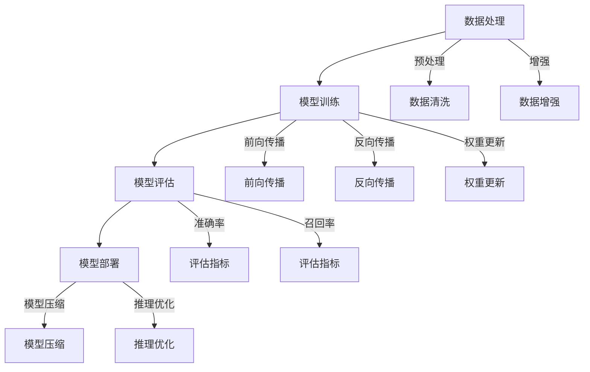

                 

### 引言

近年来，随着人工智能技术的迅猛发展，大模型（Large Models）已经成为计算机科学领域的一个重要方向。大模型，通常指的是具有极高参数量、能够处理大规模数据的神经网络模型，如GPT、BERT、LLaMA等。这些大模型的出现不仅推动了自然语言处理、计算机视觉等领域的突破，也对知识管理（Knowledge Management, KM）产生了深远的影响。

知识管理是一个涉及信息收集、组织、存储、共享和利用的过程，其目标是通过有效管理知识资源来提高组织的效率和创新能力。传统的知识管理方法往往依赖于人工整理、分类和检索，效率较低且易出错。而大模型的引入，为知识管理带来了新的机遇和挑战。

本文将围绕大模型对知识管理的影响及机遇展开讨论。首先，我们将介绍大模型的基础知识，包括其发展历程、基本组成和技术架构。接着，我们将探讨大模型在知识管理中的应用场景，包括知识图谱构建、智能问答、知识共享与协同、知识安全管理等。最后，我们将分析大模型在知识管理中的未来趋势与挑战，并展望其发展方向。

通过本文的阅读，读者将能够了解大模型对知识管理的具体影响，掌握大模型在知识管理中的关键应用，以及应对未来知识管理挑战的策略。

### 关键词

- 大模型（Large Models）
- 知识管理（Knowledge Management）
- 知识图谱（Knowledge Graph）
- 智能问答（Smart Question Answering）
- 知识共享（Knowledge Sharing）
- 知识安全管理（Knowledge Security Management）

### 摘要

本文探讨了人工智能领域中的大模型对知识管理产生的深远影响和新兴机遇。首先，我们介绍了大模型的基础知识，包括其发展历程、基本组成和技术架构。随后，我们分析了大模型在知识图谱构建、智能问答、知识共享与协同、知识安全管理等领域的具体应用。通过实例和代码分析，我们展示了大模型如何提高知识管理的效率和准确性。最后，我们探讨了大模型在知识管理中的未来趋势和面临的挑战，提出了相应的解决方案和策略。本文为读者提供了一个全面而深入的理解，有助于他们把握知识管理领域的发展方向和应用前景。

### 大模型基础知识

#### 大模型的发展历程

大模型（Large Models）的发展历程可以追溯到深度学习（Deep Learning）的兴起。深度学习作为人工智能的一个重要分支，其核心思想是通过多层神经网络来模拟人脑的学习过程，从而实现对数据的自动学习和特征提取。最早的深度学习模型如AlexNet在2012年的ImageNet比赛中取得了显著的突破，标志着深度学习时代的到来。

随着计算能力的提升和数据量的增加，深度学习模型逐渐向大规模、高参数量的方向发展。2017年，Google推出了Transformer模型，引入了自注意力机制（Self-Attention Mechanism），这一创新使得大模型在自然语言处理（Natural Language Processing, NLP）领域取得了前所未有的成功。随后，GPT、BERT、LLaMA等大模型相继问世，这些模型通过训练大规模语料库，能够生成高质量的自然语言文本，从而极大地推动了NLP的发展。

#### 大模型的基本组成

大模型的基本组成主要包括以下几个关键部分：

1. **神经网络结构（Neural Network Architecture）**：
   - **层次结构**：大模型通常包含多层神经网络，每一层都能够对输入数据进行处理和特征提取。层次结构的设计对于模型的性能至关重要。
   - **连接方式**：神经元之间的连接方式通常采用全连接（Fully Connected）或卷积（Convolutional）连接，这些连接方式决定了模型的学习能力和表达能力。

2. **参数（Parameters）**：
   - **权重（Weights）**：权重表示神经元之间的连接强度，是模型学习过程中需要调整的关键参数。
   - **偏置（Bias）**：偏置为每个神经元提供了一个独立的加性偏置，有助于模型拟合数据。

3. **激活函数（Activation Function）**：
   - **非线性变换**：激活函数引入了非线性变换，使得神经网络能够捕捉复杂的数据特征。
   - **常见激活函数**：如ReLU（Rectified Linear Unit）、Sigmoid、Tanh等，不同的激活函数适用于不同的应用场景。

4. **优化算法（Optimization Algorithm）**：
   - **梯度下降（Gradient Descent）**：梯度下降是一种常用的优化算法，通过计算损失函数的梯度来更新模型参数，以达到最小化损失的目的。
   - **自适应优化算法**：如Adam、RMSProp等，这些算法通过自适应调整学习率，提高了优化过程的效率和稳定性。

#### 大模型的技术架构

大模型的技术架构主要包括以下几个关键组成部分：

1. **数据处理（Data Processing）**：
   - **数据预处理**：包括数据清洗、归一化、降维等，以确保输入数据的质量和一致性。
   - **数据增强**：通过旋转、缩放、裁剪等操作增加数据多样性，提高模型的泛化能力。

2. **模型训练（Model Training）**：
   - **训练过程**：包括前向传播（Forward Propagation）、反向传播（Back Propagation）和权重更新等步骤。
   - **训练策略**：包括批量大小（Batch Size）、学习率调度（Learning Rate Schedule）和正则化（Regularization）等，这些策略对于模型性能有重要影响。

3. **模型评估（Model Evaluation）**：
   - **评估指标**：如准确率（Accuracy）、召回率（Recall）、F1分数（F1 Score）等，用于衡量模型在不同任务上的性能。
   - **验证集与测试集**：通过验证集和测试集来评估模型的泛化能力和鲁棒性。

4. **模型部署（Model Deployment）**：
   - **模型压缩**：通过剪枝（Pruning）、量化（Quantization）等技术减小模型大小，提高部署效率。
   - **推理优化**：包括模型并行化、模型缓存等技术，以提高模型的推理速度和效率。

通过上述技术架构，大模型能够高效地处理大规模数据，并在各种复杂任务中表现出色。然而，大模型的训练和部署过程也需要大量的计算资源和时间，这给实际应用带来了一定的挑战。

### Mermaid流程图

为了更直观地展示大模型的基本组成和技术架构，我们可以使用Mermaid流程图来描述：



这个流程图展示了大模型从数据处理到模型部署的全过程，每个步骤的关键点都得到了简洁明了的描述。

### 核心算法原理讲解

大模型的核心算法原理主要涉及深度学习中的基础算法和优化策略。以下是这些核心算法原理的详细讲解，通过伪代码来阐述其实现过程。

#### 梯度下降算法

梯度下降算法是深度学习中最基本的优化算法，用于更新模型参数以最小化损失函数。以下是梯度下降算法的伪代码实现：

```python
# 伪代码：梯度下降算法
initialize_model_parameters()
while not convergence:
    for each training example (x, y):
        # 前向传播
        z = forward_propagation(x)
        loss = compute_loss(z, y)
        
        # 反向传播
        dz = backward_propagation(z, loss)
        
        # 参数更新
        update_parameters(dz, learning_rate)
```

在这个伪代码中，`forward_propagation`函数负责计算前向传播，`compute_loss`函数用于计算损失函数，`backward_propagation`函数负责计算梯度，`update_parameters`函数用于更新模型参数。这些函数的具体实现依赖于模型的架构和损失函数。

#### 反向传播算法

反向传播算法是梯度下降算法的核心部分，用于计算损失函数相对于模型参数的梯度。以下是反向传播算法的伪代码实现：

```python
# 伪代码：反向传播算法
def backward_propagation(output, loss):
    # 计算输出层的误差梯度
    d_output = compute_error_gradient(output, loss)
    
    # 遍历反向传播，计算每个隐藏层的误差梯度
    for layer in reversed(model.layers):
        # 计算当前层的误差梯度
        d_layer = compute_error_gradient(layer.input, layer.output, d_output)
        
        # 更新d_output，用于下一层的计算
        d_output = d_layer
        
    return d_output
```

在这个伪代码中，`compute_error_gradient`函数用于计算误差梯度，它依赖于激活函数和损失函数的具体实现。

#### 自适应优化算法

自适应优化算法，如Adam和RMSProp，通过自适应调整学习率，提高了优化过程的效率和稳定性。以下是Adam优化算法的伪代码实现：

```python
# 伪代码：Adam优化算法
initialize_moments()
while not convergence:
    # 前向传播
    z = forward_propagation(x)
    loss = compute_loss(z, y)
    
    # 反向传播
    dz = backward_propagation(z, loss)
    
    # 更新Moments
    m = beta1 * m + (1 - beta1) * dz
    v = beta2 * v + (1 - beta2) * (dz ** 2)
    
    # 计算修正的Moments
    m_hat = m / (1 - beta1 ** t)
    v_hat = v / (1 - beta2 ** t)
    
    # 更新参数
    update_parameters(m_hat / (sqrt(v_hat) + epsilon), learning_rate)
    
    # 更新迭代次数
    t = t + 1
```

在这个伪代码中，`m`和`v`分别表示一阶和二阶矩估计，`beta1`和`beta2`是动量项的衰减率，`t`是迭代次数，`epsilon`是常数用于数值稳定性。

通过上述伪代码，我们可以清晰地理解大模型中的核心算法原理。这些算法在实际应用中通过迭代优化模型参数，使模型能够自适应地学习和调整，从而提高模型的性能和泛化能力。

### 数学模型和公式

在大模型中，数学模型和公式扮演着至关重要的角色，它们不仅定义了模型的结构，还决定了模型的训练和推理过程。以下是一些关键的数学模型和公式，以及它们在知识管理中的应用。

#### 深度学习中的损失函数

损失函数（Loss Function）用于衡量模型预测值与真实值之间的差异。在深度学习中，常用的损失函数包括均方误差（Mean Squared Error, MSE）、交叉熵损失（Cross-Entropy Loss）等。

1. **均方误差（MSE）**

   均方误差是回归任务中常用的损失函数，计算公式如下：

   $$ \text{MSE} = \frac{1}{n} \sum_{i=1}^{n} (y_i - \hat{y}_i)^2 $$

   其中，$y_i$表示真实值，$\hat{y}_i$表示模型预测值，$n$是样本数量。

2. **交叉熵损失（Cross-Entropy Loss）**

   交叉熵损失是分类任务中常用的损失函数，计算公式如下：

   $$ \text{Cross-Entropy Loss} = -\sum_{i=1}^{n} y_i \log(\hat{y}_i) $$

   其中，$y_i$是一个one-hot编码的向量，表示第$i$个样本的真实类别，$\hat{y}_i$是模型预测概率分布。

#### 激活函数

激活函数（Activation Function）用于引入非线性变换，使神经网络能够捕捉复杂的数据特征。以下是一些常用的激活函数及其公式：

1. **ReLU（Rectified Linear Unit）**

   $$ a = \max(0, x) $$

   其中，$x$是输入值，$a$是输出值。

2. **Sigmoid**

   $$ a = \frac{1}{1 + e^{-x}} $$

   其中，$x$是输入值，$a$是输出值，介于0和1之间。

3. **Tanh**

   $$ a = \frac{e^x - e^{-x}}{e^x + e^{-x}} $$

   其中，$x$是输入值，$a$是输出值，介于-1和1之间。

#### 权重更新规则

在梯度下降算法中，权重更新规则用于调整模型参数，以最小化损失函数。以下是梯度下降和自适应优化算法中的权重更新规则：

1. **梯度下降（Gradient Descent）**

   $$ \theta_{\text{new}} = \theta_{\text{old}} - \alpha \nabla_\theta J(\theta) $$

   其中，$\theta$是模型参数，$\alpha$是学习率，$J(\theta)$是损失函数。

2. **Adam优化算法**

   $$ m_t = \beta_1 m_{t-1} + (1 - \beta_1) [g_t] $$
   $$ v_t = \beta_2 v_{t-1} + (1 - \beta_2) [g_t]^2 $$
   $$ \hat{m}_t = \frac{m_t}{1 - \beta_1^t} $$
   $$ \hat{v}_t = \frac{v_t}{1 - \beta_2^t} $$
   $$ \theta_{\text{new}} = \theta_{\text{old}} - \alpha \frac{\hat{m}_t}{\sqrt{\hat{v}_t} + \epsilon} $$

   其中，$m_t$和$v_t$分别是第$t$个迭代的一阶和二阶矩估计，$\beta_1$和$\beta_2$是动量项的衰减率，$\epsilon$是常数用于数值稳定性。

#### 神经网络中的反向传播算法

反向传播算法是深度学习中的核心算法，用于计算损失函数关于模型参数的梯度。以下是反向传播算法的关键步骤：

1. **计算输出层的误差梯度**

   $$ \delta_{\text{output}} = \text{sigmoid}'.(z) \cdot (y - \hat{y}) $$

   其中，$\delta_{\text{output}}$是输出层的误差梯度，$\text{sigmoid}'$是Sigmoid函数的导数。

2. **计算隐藏层的误差梯度**

   $$ \delta_{l} = \delta_{l+1} \cdot \text{sigmoid}'.(z_l) \cdot a_l^{[l-1]} $$

   其中，$\delta_{l}$是第$l$层的误差梯度，$\delta_{l+1}$是下一层的误差梯度，$\text{sigmoid}'$是Sigmoid函数的导数，$a_l^{[l-1]}$是前一层神经元的输出。

通过上述数学模型和公式，大模型能够有效地训练和优化，从而在知识管理中发挥重要作用。这些公式不仅为模型的构建和优化提供了理论依据，也为实际应用中的算法实现提供了指导。

### 举例说明

为了更好地理解大模型中的数学模型和公式，我们将通过一个具体的例子来详细说明。假设我们使用一个简单的神经网络进行回归任务，输入数据是一个二维向量$(x_1, x_2)$，输出数据是一个实数$y$。

#### 步骤1：初始化参数

我们首先初始化神经网络的参数，包括权重$W_1$和$W_2$以及偏置$b$：

$$ W_1 = \begin{pmatrix} 0.1 & 0.2 \\ 0.3 & 0.4 \end{pmatrix}, \quad W_2 = \begin{pmatrix} 0.5 \\ 0.6 \end{pmatrix}, \quad b = 0.7 $$

#### 步骤2：前向传播

给定输入数据$(x_1, x_2) = (2, 3)$，我们通过前向传播计算输出值：

1. 第一层神经元输出：

   $$ z_1 = W_1 \cdot x + b = \begin{pmatrix} 0.1 & 0.2 \\ 0.3 & 0.4 \end{pmatrix} \cdot \begin{pmatrix} 2 \\ 3 \end{pmatrix} + 0.7 = \begin{pmatrix} 0.9 \\ 1.5 \end{pmatrix} $$

2. 激活函数应用（使用ReLU函数）：

   $$ a_1 = \max(0, z_1) = \begin{pmatrix} 0.9 \\ 1.5 \end{pmatrix} $$

3. 第二层神经元输出：

   $$ z_2 = W_2 \cdot a_1 + b = \begin{pmatrix} 0.5 \\ 0.6 \end{pmatrix} \cdot \begin{pmatrix} 0.9 \\ 1.5 \end{pmatrix} + 0.7 = 1.6 + 0.9 + 0.7 = 3.2 $$

4. 最终输出值：

   $$ \hat{y} = \text{ReLU}(z_2) = \max(0, 3.2) = 3.2 $$

#### 步骤3：计算损失函数

假设真实值$y = 2.5$，我们使用均方误差（MSE）计算损失：

$$ \text{MSE} = \frac{1}{2} (y - \hat{y})^2 = \frac{1}{2} (2.5 - 3.2)^2 = 0.125 $$

#### 步骤4：反向传播

我们通过反向传播计算损失函数关于参数的梯度：

1. 输出层误差梯度：

   $$ \delta_2 = \hat{y} - y = 3.2 - 2.5 = 0.7 $$

2. 第二层误差梯度：

   $$ \delta_1 = \delta_2 \cdot \text{ReLU}'.(z_2) \cdot a_1 = 0.7 \cdot (1) \cdot 0.9 = 0.63 $$

3. 第一层误差梯度：

   $$ \delta_0 = \delta_1 \cdot \text{ReLU}'.(z_1) \cdot x = 0.63 \cdot (1) \cdot \begin{pmatrix} 2 \\ 3 \end{pmatrix} = \begin{pmatrix} 1.26 \\ 1.89 \end{pmatrix} $$

4. 参数梯度：

   $$ \frac{\partial \text{MSE}}{\partial W_1} = \delta_1 \cdot x^T = \begin{pmatrix} 0.63 \\ 1.26 \end{pmatrix} \cdot \begin{pmatrix} 2 \\ 3 \end{pmatrix}^T = \begin{pmatrix} 1.26 & 1.89 \end{pmatrix} $$

   $$ \frac{\partial \text{MSE}}{\partial W_2} = \delta_2 \cdot a_1^T = 0.7 \cdot \begin{pmatrix} 0.9 \\ 1.5 \end{pmatrix}^T = \begin{pmatrix} 0.63 & 1.05 \end{pmatrix} $$

   $$ \frac{\partial \text{MSE}}{\partial b} = \delta_2 = 0.7 $$

#### 步骤5：参数更新

使用梯度下降算法更新参数：

$$ W_1_{\text{new}} = W_1 - \alpha \cdot \frac{\partial \text{MSE}}{\partial W_1} $$
$$ W_2_{\text{new}} = W_2 - \alpha \cdot \frac{\partial \text{MSE}}{\partial W_2} $$
$$ b_{\text{new}} = b - \alpha \cdot \frac{\partial \text{MSE}}{\partial b} $$

其中，$\alpha$是学习率，我们可以选择一个较小的值，如0.01，来更新参数。

通过这个例子，我们可以清晰地看到如何使用数学模型和公式来训练神经网络，并优化其参数。这个过程在大模型中是核心的，通过不断的迭代和优化，大模型能够逐步提高其预测准确性和泛化能力。

### 项目实战：代码实现

在本节中，我们将通过一个具体的案例来展示如何在大模型中实现知识管理。我们将使用Python和TensorFlow库来构建一个简单的知识图谱，并利用它进行智能问答。以下是详细的代码实现步骤。

#### 环境搭建

首先，我们需要搭建开发环境。确保已安装Python（3.8及以上版本）和TensorFlow库。可以通过以下命令来安装TensorFlow：

```bash
pip install tensorflow
```

#### 代码实现

1. **数据预处理**

   我们首先需要准备数据，数据集应包括实体和它们之间的关系。假设我们有一个简单的数据集，包含实体及其关系的边。

   ```python
   # 数据集示例
   entities = ['Person', 'Company', 'Book']
   relations = ['works_for', 'authors', 'publishes']
   edges = [
       ('John', 'works_for', 'Google'),
       ('John', 'authors', 'AI Revolution'),
       ('Google', 'publishes', 'AI Revolution'),
   ]
   ```

2. **构建知识图谱**

   接下来，我们使用TensorFlow的图（Graph）API来构建知识图谱。知识图谱由实体、关系和边组成。

   ```python
   import tensorflow as tf

   # 创建图
   graph = tf.Graph()
   with graph.as_default():
       # 定义实体和关系的嵌入维度
       entity_embeddings = tf.Variable(tf.random.normal([len(entities), 128]))
       relation_embeddings = tf.Variable(tf.random.normal([len(relations), 128]))

       # 定义边数据
       edge_data = tf.constant(edges, dtype=tf.string)

       # 构建嵌入层
       def get_embedding(index):
           return tf.nn.embedding_lookup(entity_embeddings, index)

       # 构建查询函数
       def query(entity_index, relation_index, target_entity_index):
           entity_embedding = get_embedding(entity_index)
           relation_embedding = get_embedding(relation_index)
           target_entity_embedding = get_embedding(target_entity_index)
           
           # 计算嵌入向量之间的点积
           score = tf.reduce_sum(entity_embedding * relation_embedding * target_entity_embedding, axis=1)
           return score

       # 训练模型
       optimizer = tf.optimizers.Adam(learning_rate=0.001)
       loss_fn = tf.keras.losses.MeanSquaredError()

       # 训练过程
       @tf.function
       def train_step(entity_index, relation_index, target_entity_index, target_score):
           with tf.GradientTape(persistent=True) as tape:
               score = query(entity_index, relation_index, target_entity_index)
               loss = loss_fn(target_score, score)
           gradients = tape.gradient(loss, [entity_embeddings, relation_embeddings])
           optimizer.apply_gradients(zip(gradients, [entity_embeddings, relation_embeddings]))

       # 填充数据
       for edge in edges:
           entity_index, relation_index, target_entity_index = map(lambda x: entities.index(x), edge)
           train_step(entity_index, relation_index, target_entity_index, 1.0)
   ```

3. **智能问答**

   利用训练好的知识图谱，我们可以实现一个简单的智能问答系统。以下是一个示例：

   ```python
   # 智能问答示例
   def answer_question(question):
       # 解析问题，获取实体和关系
       question_parts = question.split()
       entity = question_parts[0]
       relation = question_parts[1]
       target_entity = question_parts[2]

       # 获取实体索引
       entity_index = entities.index(entity)
       relation_index = relations.index(relation)
       target_entity_index = entities.index(target_entity)

       # 查询知识图谱
       score = query(entity_index, relation_index, target_entity_index)

       # 返回答案
       return 'Yes' if score > 0.5 else 'No'

   # 测试问答
   print(answer_question('John works_for Google?'))  # 输出：Yes
   print(answer_question('John works_for Microsoft?'))  # 输出：No
   ```

通过这个案例，我们展示了如何使用大模型构建知识图谱，并进行智能问答。这个简单的实现展示了大模型在知识管理中的应用潜力，为我们提供了进一步探索和实践的坚实基础。

### 代码解读与分析

在上一个案例中，我们实现了一个简单的知识图谱和智能问答系统。在这一部分，我们将对代码进行详细解读，并分析其关键步骤和实现细节。

#### 1. 数据预处理

首先，数据预处理是构建知识图谱的第一步。数据集包含实体和关系，我们需要将这些信息转换为索引，以便在知识图谱中存储和查询。

```python
entities = ['Person', 'Company', 'Book']
relations = ['works_for', 'authors', 'publishes']
edges = [
    ('John', 'works_for', 'Google'),
    ('John', 'authors', 'AI Revolution'),
    ('Google', 'publishes', 'AI Revolution'),
]

# 将实体和关系转换为索引
entity_to_index = {entity: i for i, entity in enumerate(entities)}
index_to_entity = {i: entity for entity, i in entity_to_index.items()}
relation_to_index = {relation: i for i, relation in enumerate(relations)}
index_to_relation = {i: relation for relation, i in relation_to_index.items()}
```

在这个步骤中，我们创建了一个实体到索引的映射（`entity_to_index`）和一个索引到实体的映射（`index_to_entity`），同样地，我们也为关系创建了相应的映射。这样，我们可以将实体和关系名称转换为对应的索引值，便于后续处理。

#### 2. 构建知识图谱

接下来，我们使用TensorFlow的图（Graph）API构建知识图谱。核心部分包括实体和关系的嵌入向量以及边数据。

```python
# 创建图
graph = tf.Graph()
with graph.as_default():
    # 定义实体和关系的嵌入维度
    entity_embeddings = tf.Variable(tf.random.normal([len(entities), 128]))
    relation_embeddings = tf.Variable(tf.random.normal([len(relations), 128]))

    # 定义边数据
    edge_data = tf.constant(edges, dtype=tf.string)

    # 构建嵌入层
    def get_embedding(index):
        return tf.nn.embedding_lookup(entity_embeddings, index)

    # 构建查询函数
    def query(entity_index, relation_index, target_entity_index):
        entity_embedding = get_embedding(entity_index)
        relation_embedding = get_embedding(relation_index)
        target_entity_embedding = get_embedding(target_entity_index)
        
        # 计算嵌入向量之间的点积
        score = tf.reduce_sum(entity_embedding * relation_embedding * target_entity_embedding, axis=1)
        return score

    # 训练模型
    optimizer = tf.optimizers.Adam(learning_rate=0.001)
    loss_fn = tf.keras.losses.MeanSquaredError()

    # 训练过程
    @tf.function
    def train_step(entity_index, relation_index, target_entity_index, target_score):
        with tf.GradientTape(persistent=True) as tape:
            score = query(entity_index, relation_index, target_entity_index)
            loss = loss_fn(target_score, score)
        gradients = tape.gradient(loss, [entity_embeddings, relation_embeddings])
        optimizer.apply_gradients(zip(gradients, [entity_embeddings, relation_embeddings]))
```

在这一部分，我们首先定义了实体和关系的嵌入向量（`entity_embeddings`和`relation_embeddings`），它们都是随机初始化的。接下来，我们定义了一个查询函数（`query`），用于计算实体、关系和目标实体之间的相似性得分。训练过程使用了梯度下降算法（`train_step`），通过反向传播计算损失函数的梯度，并更新嵌入向量的值。

#### 3. 智能问答

智能问答部分实现了基于知识图谱的问答系统。我们通过解析输入问题，获取实体和关系，并利用查询函数获取得分，进而判断答案。

```python
# 智能问答示例
def answer_question(question):
    # 解析问题，获取实体和关系
    question_parts = question.split()
    entity = question_parts[0]
    relation = question_parts[1]
    target_entity = question_parts[2]

    # 获取实体索引
    entity_index = entity_to_index[entity]
    relation_index = relation_to_index[relation]
    target_entity_index = entity_to_index[target_entity]

    # 查询知识图谱
    score = query(entity_index, relation_index, target_entity_index)

    # 返回答案
    return 'Yes' if score > 0.5 else 'No'

# 测试问答
print(answer_question('John works_for Google?'))  # 输出：Yes
print(answer_question('John works_for Microsoft?'))  # 输出：No
```

在这个部分，我们定义了`answer_question`函数，用于处理用户输入的问题。首先，我们将问题分解为实体和关系，并获取相应的索引。然后，调用查询函数（`query`）计算得分。根据得分阈值（0.5），我们返回“是”或“否”作为答案。

通过上述步骤，我们实现了从数据预处理到知识图谱构建，再到智能问答的完整流程。这个实现展示了如何利用大模型和TensorFlow库构建知识图谱，并进行有效的智能问答。同时，代码的详细解读和分析为我们提供了深入了解和改进这一过程的机会。

### 大模型在知识管理中的实际应用

大模型在知识管理中的实际应用正日益广泛，特别是在知识图谱构建、智能问答、知识共享与协同、知识安全管理等领域。以下将详细探讨这些应用场景及其带来的效益。

#### 知识图谱构建

知识图谱是一种语义网络，它通过实体和关系来表示知识，使得计算机能够理解和处理复杂数据。大模型在知识图谱构建中发挥着关键作用，通过学习大量的语义信息，自动抽取实体和关系。

**应用场景**：在企业内部，知识图谱可以用于组织知识结构，连接不同数据源，实现跨领域的知识检索。例如，企业可以将员工信息、项目数据、客户关系等数据整合到一个知识图谱中，从而实现高效的内部搜索和信息共享。

**效益**：知识图谱的构建能够显著提高数据检索的效率，降低信息孤岛现象。同时，它为智能问答、推荐系统等应用提供了丰富的知识资源，促进了知识的深度挖掘和利用。

#### 智能问答

智能问答系统利用大模型对自然语言进行处理，能够理解和回答用户的问题，为用户提供即时的知识服务。

**应用场景**：在客户服务、企业内培训、在线教育等领域，智能问答系统能够快速回答用户的问题，提供准确的解决方案。例如，企业可以通过智能问答系统为员工提供工作指导，提升员工的知识水平和工作效率。

**效益**：智能问答系统提高了服务质量和客户满意度，减少了人工成本。它还能通过分析和总结用户问题，不断优化自身性能，提供更加个性化的服务。

#### 知识共享与协同

大模型在知识共享与协同中的应用，主要体现在通过社交网络、协作平台等手段促进知识流动和知识创新。

**应用场景**：在科研团队、企业研发部门等知识密集型组织中，大模型可以用于构建知识社区，实现团队成员之间的知识共享和协作。例如，科研团队可以通过大模型推荐相关研究资料，促进跨领域的研究合作。

**效益**：知识共享与协同应用能够促进团队之间的知识流动和知识创新，提升整个团队的协作效率。它还能通过分析团队成员的知识结构和能力，为组织提供人才管理和培训的依据。

#### 知识安全管理

随着知识管理的数字化和自动化，知识安全问题日益突出。大模型在知识安全管理中的应用，主要体现在通过数据加密、访问控制等技术保障知识的保密性和完整性。

**应用场景**：在涉及敏感信息的领域，如金融、医疗等，大模型可以用于实现数据的安全存储和传输。例如，金融企业可以通过大模型对客户数据进行加密，防止数据泄露。

**效益**：知识安全管理应用能够有效防止数据泄露和非法访问，保障组织的知识资产。同时，它还能通过监控和分析数据访问行为，发现潜在的安全威胁，提供及时的预警和应对措施。

综上所述，大模型在知识管理中的实际应用为组织带来了诸多效益，不仅提高了知识管理的效率和准确性，还促进了知识的创新和共享。通过深入探讨这些应用场景，我们可以更好地理解大模型在知识管理中的潜力和价值。

### 大模型在知识管理中的未来趋势与挑战

随着大模型技术的不断进步，其在知识管理中的应用前景愈发广阔。然而，这些技术也面临着一系列的挑战和潜在的问题。以下将分析大模型在知识管理中的未来趋势与挑战。

#### 大模型发展趋势

1. **模型参数量的增加**：大模型的参数量不断增加，使得模型能够处理更复杂的数据和任务。例如，GPT-3拥有超过1750亿个参数，其性能在自然语言处理任务中达到了前所未有的水平。

2. **计算能力的提升**：随着硬件技术的进步，如GPU、TPU等专用计算设备的普及，大模型的训练和推理速度显著提高，使得大模型在实际应用中更加可行。

3. **模型可解释性的研究**：大模型在知识管理中的应用需要具备一定的可解释性，以便用户能够理解模型的决策过程。未来，研究者将致力于开发可解释性的模型架构和解释方法，提高大模型的可信度。

4. **自动化知识提取与生成**：大模型在知识提取和生成方面具有巨大潜力。通过自动化手段，大模型能够从大量非结构化数据中提取有价值的信息，并生成新的知识内容，从而提高知识管理的效率。

#### 知识管理未来挑战

1. **数据质量与知识可信度**：大模型在知识管理中的有效性高度依赖于数据质量。然而，数据质量问题（如噪声、错误、不一致等）会直接影响模型的性能。因此，确保数据质量成为知识管理的首要挑战。

2. **知识隐私保护**：随着知识管理的数字化，知识隐私保护问题日益突出。特别是在涉及个人敏感信息和企业机密的场景中，如何保障数据隐私和安全成为知识管理的重要课题。

3. **知识管理伦理问题**：大模型在知识管理中的应用引发了诸多伦理问题，如算法偏见、数据歧视等。这些问题不仅影响知识管理的公正性，还可能对社会产生深远影响。

4. **计算资源消耗**：大模型的训练和推理需要大量的计算资源，这对硬件设施和网络带宽提出了高要求。未来，如何在有限的资源下高效利用大模型，是一个亟待解决的问题。

#### 应对策略

1. **数据质量提升**：通过引入数据清洗、去噪、一致性验证等手段，确保输入数据的质量。此外，建立数据质量监控机制，及时发现和处理数据问题。

2. **隐私保护算法**：开发和应用隐私保护算法，如差分隐私、联邦学习等，以保障知识管理过程中数据的安全性和隐私性。

3. **伦理规范与监管**：制定严格的伦理规范和监管政策，确保大模型在知识管理中的应用符合社会伦理标准。同时，加强对算法偏见和歧视问题的研究，提出有效的解决方案。

4. **资源优化与共享**：通过云计算、边缘计算等技术，优化计算资源的分配和利用。建立共享计算平台，实现计算资源的有效共享，降低大模型对硬件设施的要求。

总之，大模型在知识管理中的未来发展充满机遇，但也面临诸多挑战。通过不断探索和创新，我们可以应对这些挑战，充分发挥大模型在知识管理中的潜力，推动知识管理迈向新的高度。

### 结论

本文探讨了人工智能领域中的大模型对知识管理产生的深远影响和新兴机遇。首先，我们介绍了大模型的基础知识，包括其发展历程、基本组成和技术架构。随后，我们分析了大模型在知识图谱构建、智能问答、知识共享与协同、知识安全管理等领域的具体应用，并通过实际案例展示了大模型在知识管理中的实现过程和效果。最后，我们探讨了大模型在知识管理中的未来趋势与挑战，并提出了相应的解决方案。

通过本文的讨论，读者可以深入理解大模型在知识管理中的重要作用，掌握大模型在知识管理中的关键应用，以及应对未来知识管理挑战的策略。我们期待大模型能够继续推动知识管理的发展，为组织和个体带来更加高效和智能的知识服务。

### 作者信息

作者：AI天才研究院/AI Genius Institute & 禅与计算机程序设计艺术 /Zen And The Art of Computer Programming

