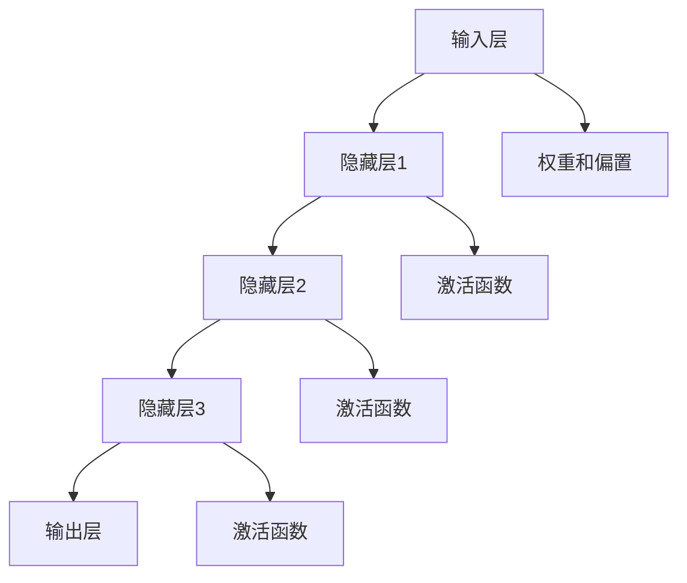

                 

# 大模型时代的创业者职业发展：持续学习与能力提升

## 关键词

- 大模型时代
- 创业者职业发展
- 持续学习
- 能力提升
- 技术变革
- 职业规划

## 摘要

本文旨在探讨大模型时代下创业者如何进行职业发展，强调持续学习和能力提升的重要性。文章首先概述了大模型时代的背景，随后深入分析了持续学习的方法与工具，以及能力提升的策略与实践。接着，文章提出了职业发展的路径与策略，并通过实际案例展示了大模型在创业领域的应用。最后，文章展望了未来大模型时代的发展趋势，并提出了创业者在这一时代中的应对策略。通过本文的深入探讨，希望能够为创业者在大模型时代的职业发展提供有益的启示和指导。

### 《大模型时代的创业者职业发展：持续学习与能力提升》目录大纲

#### 第一部分：大模型时代背景

##### 1.1 大模型时代概述

###### 1.1.1 大模型时代的到来

###### 1.1.2 大模型对创业生态的影响

###### 1.1.3 创业者在大模型时代的机遇与挑战

##### 1.2 大模型的核心概念与联系

###### 1.2.1 大模型的定义与特点

###### 1.2.2 大模型的架构与组成

###### 1.2.3 大模型的 Mermaid 流程图

#### 第二部分：持续学习

##### 2.1 持续学习的重要性与方法

###### 2.1.1 学习的本质与目标

###### 2.1.2 学习动力与心态

###### 2.1.3 学习习惯与效率提升

##### 2.2 持续学习的方法与工具

###### 2.2.1 学习资源的选择与应用

###### 2.2.2 主动学习与被动学习策略

###### 2.2.3 知识管理体系建立

#### 第三部分：能力提升

##### 3.1 技能与知识积累

###### 3.1.1 技能分类与重要性

###### 3.1.2 知识体系构建

###### 3.1.3 技能与知识的融合与应用

##### 3.2 项目实战与案例分析

###### 3.2.1 创业项目规划与执行

###### 3.2.2 案例分析：成功创业者经验分享

###### 3.2.3 项目实战：代码实现与解读

#### 第四部分：职业发展

##### 4.1 职业规划与定位

###### 4.1.1 职业发展规划

###### 4.1.2 个人品牌建设

###### 4.1.3 职业转型的准备

##### 4.2 职场技能与人际关系

###### 4.2.1 职场沟通技巧

###### 4.2.2 团队协作与领导力培养

###### 4.2.3 人际关系处理与职场政治

#### 第五部分：大模型应用案例

##### 5.1 大模型在产品研发中的应用

###### 5.1.1 大模型在需求分析与产品设计中的作用

###### 5.1.2 大模型在产品测试与迭代中的应用

###### 5.1.3 大模型驱动的创新产品案例

##### 5.2 大模型在市场营销中的应用

###### 5.2.1 大模型在市场调研与分析中的作用

###### 5.2.2 大模型在品牌建设与推广中的应用

###### 5.2.3 大模型在客户关系管理与营销策略中的应用

#### 第六部分：未来展望

##### 6.1 大模型技术的发展趋势

###### 6.1.1 大模型技术的演进方向

###### 6.1.2 大模型在创业领域的未来影响

###### 6.1.3 大模型时代创业者的新角色

##### 6.2 创业者在应对大模型时代的策略

###### 6.2.1 创业者在技术变革中的应对策略

###### 6.2.2 创业者在市场竞争中的应对策略

###### 6.2.3 创业者在团队建设中的应对策略

#### 第七部分：附录

##### 7.1 大模型学习资源与工具

###### 7.1.1 主流大模型框架对比

###### 7.1.2 大模型学习资源推荐

###### 7.1.3 大模型工具使用指南

---

### 大模型时代背景

#### 1.1 大模型时代概述

##### 1.1.1 大模型时代的到来

随着人工智能技术的迅猛发展，大模型（Large Models）逐渐成为科技领域的重要趋势。大模型，即拥有亿级别参数规模的神经网络模型，如GPT、BERT等，通过深度学习的方式从海量数据中学习，实现高度复杂的任务处理能力。这一革命性技术正在重塑各行各业，为创业者带来了前所未有的机遇和挑战。

大模型时代的到来，标志着人工智能进入了一个新的阶段。传统的机器学习模型由于参数量有限，难以处理复杂任务，而大模型通过自我学习和优化，可以在短时间内完成复杂的数据分析、决策支持、自然语言处理等任务，极大地提高了工作效率和准确性。因此，大模型技术不仅为创业者提供了创新的解决方案，也为他们带来了巨大的市场空间。

##### 1.1.2 大模型对创业生态的影响

大模型技术对创业生态的影响是深远且广泛的。首先，大模型为创业者提供了强大的技术支持，使他们能够快速开发出具有市场竞争力的高科技产品。例如，通过大模型驱动的自然语言处理技术，创业者可以开发出智能客服、智能推荐系统等应用，提高用户体验和运营效率。

其次，大模型技术降低了创业的门槛。在过去，创业者需要具备深厚的计算机科学背景和大量的研发资源才能开发出人工智能产品，而大模型的普及使得任何人都可以通过云计算平台和开源框架轻松搭建和训练模型，大大降低了创业的成本和时间。

然而，大模型时代也带来了新的挑战。一方面，大模型对数据的要求极高，创业者需要获取和处理大量高质量的训练数据，这对创业团队的数据处理能力和数据资源提出了更高的要求。另一方面，大模型技术的快速迭代和更新使得创业者必须不断学习和适应新技术，否则很容易被市场淘汰。

##### 1.1.3 创业者在大模型时代的机遇与挑战

在大模型时代，创业者面临着前所未有的机遇与挑战。

**机遇：**

1. **技术创新空间：** 大模型为创业者提供了丰富的技术创新空间，使他们能够开发出前所未有的高科技产品，满足市场需求。
2. **市场潜力：** 大模型技术正在广泛应用于各行各业，创业者可以在不同的领域找到新的市场机会。
3. **资本关注：** 随着大模型技术的崛起，资本纷纷涌入这一领域，为创业者提供了充足的资金支持。

**挑战：**

1. **技术门槛：** 大模型技术复杂，创业者需要具备较高的技术能力和知识储备。
2. **数据资源：** 大模型对数据的要求极高，创业者需要获取和处理大量高质量的训练数据。
3. **快速迭代：** 大模型技术的快速迭代和更新要求创业者具备快速学习和适应的能力。

综上所述，大模型时代的到来为创业者带来了巨大的机遇，同时也带来了新的挑战。创业者需要把握时代机遇，持续学习和提升能力，才能在大模型时代取得成功。

#### 1.2 大模型的核心概念与联系

##### 1.2.1 大模型的定义与特点

大模型（Large Models）通常指的是具有数百万到数十亿参数规模的深度神经网络模型。这些模型通过在大量数据上进行训练，能够自动学习复杂的模式和关系，从而在各个领域实现高效的任务处理。大模型的出现打破了传统机器学习模型的局限性，使得复杂任务的处理变得更加简单和高效。

**定义：** 大模型是指具有大规模参数量的神经网络模型，通常通过深度学习技术训练，能够处理高度复杂的任务。

**特点：**

1. **参数量大：** 大模型拥有数百万到数十亿个参数，这使得它们能够捕捉到数据中的复杂模式和关系。
2. **自学习能力：** 大模型通过在大量数据上进行训练，能够自我优化和提升性能。
3. **高效性：** 大模型能够处理大规模数据，提高任务处理的速度和效率。
4. **泛化能力：** 大模型通过在多种任务和场景中进行训练，能够实现良好的泛化能力。

##### 1.2.2 大模型的架构与组成

大模型的架构通常包括以下几个关键部分：

1. **输入层：** 输入层接收外部数据，如文本、图像或音频。
2. **隐藏层：** 隐藏层包含多个神经元，用于处理和转换输入数据。
3. **输出层：** 输出层生成预测结果或决策。
4. **权重和偏置：** 权重和偏置是神经网络中的参数，用于调整模型在训练过程中的表现。
5. **激活函数：** 激活函数用于引入非线性变换，使得神经网络能够学习复杂的关系。

**架构图：**



##### 1.2.3 大模型的 Mermaid 流程图

为了更直观地展示大模型的训练过程，我们可以使用Mermaid流程图来描述其关键步骤。

**Mermaid 流程图：**

```mermaid
graph TD
    A[初始化模型] --> B[数据预处理]
    B --> C{数据质量检查}
    C -->|通过| D[训练数据加载]
    D --> E[前向传播]
    E --> F[计算损失]
    F --> G[反向传播]
    G --> H[更新参数]
    H --> I{迭代次数检查}
    I -->|完成| J[模型评估]
    J --> K[模型优化]
    K -->|结束|
```

通过以上步骤，大模型能够在大量数据上进行迭代训练，不断优化模型的参数和性能，最终实现高效的任务处理能力。

### 持续学习的重要性与方法

#### 2.1 持续学习的重要性

在快速发展的技术时代，持续学习已成为创业者职业发展的核心要素。持续学习不仅能提升个人的知识水平和技能，还能帮助创业者更好地应对行业变革和挑战，从而在竞争激烈的市场中脱颖而出。

**重要性：**

1. **适应技术变革：** 技术日新月异，持续学习能够帮助创业者及时了解最新的技术趋势，迅速适应变化，把握市场机遇。
2. **提升创新能力：** 持续学习可以激发创业者的创新思维，通过不断学习新的知识和技能，创业者能够提出更具创意和市场潜力的产品和服务。
3. **增强竞争力：** 持续学习能够提升创业者的专业能力和综合素质，使其在职场中更具竞争力，从而为企业创造更大的价值。
4. **保持市场地位：** 在大模型时代，创业者需要持续学习和进步，以保持领先地位，避免被市场淘汰。

#### 2.2 持续学习的方法与工具

为了实现有效的持续学习，创业者需要掌握一系列方法和工具，以提高学习效率和学习成果。

**方法：**

1. **制定学习计划：** 创业者应根据自身的学习需求和目标，制定详细的学习计划，明确学习的内容、时间安排和评估标准。
2. **主动学习：** 与被动学习相比，主动学习更能激发学习兴趣和思考，创业者可以通过阅读专业书籍、参加在线课程和研讨会等方式，主动获取知识。
3. **理论与实践相结合：** 创业者应将所学知识应用于实际项目中，通过实践检验学习效果，提升实际操作能力。
4. **建立学习社区：** 创业者可以加入学习社区，与其他创业者、专业人士交流学习心得和经验，共同进步。

**工具：**

1. **在线教育平台：** 如Coursera、edX、Udacity等，提供丰富的在线课程和学习资源。
2. **专业书籍和文献：** 创业者可以阅读相关领域的专业书籍和文献，深入理解理论知识和技术细节。
3. **开源框架和工具：** 如TensorFlow、PyTorch等，提供丰富的开源框架和工具，创业者可以通过实际操作掌握技术。
4. **社交媒体和专业论坛：** 如LinkedIn、GitHub等，创业者可以在这些平台上分享学习心得、项目经验，与他人互动交流。

#### 2.3 持续学习的关键成功因素

1. **学习动力：** 保持学习动力是持续学习的关键，创业者可以通过设定学习目标、获得成就感和不断挑战自我来保持学习动力。
2. **时间管理：** 创业者需要合理安排时间，确保学习时间与工作时间的平衡，避免因工作繁忙而忽视学习。
3. **适应变化：** 随着技术的不断更新和发展，创业者需要具备快速适应变化的能力，灵活调整学习内容和策略。

通过持续学习，创业者不仅能够提升个人能力和素质，还能为大模型时代的创业职业发展奠定坚实的基础。

### 持续学习的重要性与方法（续）

#### 2.1.1 学习的本质与目标

学习是一种认知过程，旨在通过获取、理解和应用知识来提升个人能力和技能。学习的过程可以分为以下几个阶段：

1. **知识获取：** 学习的第一步是获取知识，包括阅读书籍、文章、观看视频等，通过不同的渠道获取所需的信息。
2. **知识理解：** 在获取知识后，需要通过思考、讨论和实践来理解所学的内容，将理论知识转化为实际应用能力。
3. **知识应用：** 将所学知识应用于实际问题中，通过实践来验证和巩固学习效果，提高实际操作能力。

学习的目标不仅是获取知识，更重要的是将所学知识应用到实际问题中，解决现实中的问题。因此，创业者应注重知识的实际应用，通过项目实践、实验和研究来不断提升自己的能力。

#### 2.1.2 学习动力与心态

保持学习动力是持续学习的关键。以下是一些提升学习动力和心态的方法：

1. **设定目标：** 明确学习目标，制定可实现的学习计划，帮助创业者保持学习动力。
2. **获得成就感：** 通过完成学习任务和实现学习目标，获得成就感和满足感，增强学习动力。
3. **与他人交流：** 加入学习社区，与他人分享学习心得和经验，相互激励和支持，提升学习兴趣。
4. **保持好奇心：** 对新知识和技术保持好奇心，持续探索和尝试，保持学习的热情。
5. **积极心态：** 保持积极的心态，面对学习中的困难和挑战，勇于尝试和克服。

#### 2.1.3 学习习惯与效率提升

建立良好的学习习惯和提高学习效率是持续学习的重要保障。以下是一些建议：

1. **定期学习：** 设定固定的学习时间，每天或每周进行学习，形成稳定的学习习惯。
2. **合理安排时间：** 合理安排工作和学习时间，避免因工作繁忙而忽视学习，确保学习时间的充足。
3. **避免拖延：** 及时完成任务，避免拖延，提高学习效率。
4. **注意力集中：** 在学习时保持专注，避免分心和干扰，提高学习效果。
5. **主动学习：** 采用主动学习方法，如提问、讨论和实践，提升学习效果。

通过建立良好的学习习惯和提高学习效率，创业者可以更好地应对大模型时代的职业发展挑战，持续提升个人能力和竞争力。

### 持续学习的方法与工具（续）

#### 2.2.1 学习资源的选择与应用

选择合适的学习资源对于持续学习至关重要。以下是一些常见的学习资源及其特点：

1. **在线教育平台：** Coursera、Udacity、edX等在线教育平台提供了大量高质量的课程，涵盖各种学科和技能。创业者可以根据自身需求选择相关的课程，系统地学习。
   
2. **专业书籍和文献：** 专业书籍和学术论文是获取深入知识的有效途径。创业者可以通过图书馆、在线书店或学术数据库来获取相关书籍和文献。

3. **开源框架和工具：** TensorFlow、PyTorch、Keras等开源框架提供了丰富的功能，创业者可以利用这些框架进行模型训练和项目开发。

4. **在线社区和论坛：** Stack Overflow、GitHub、Reddit等在线社区和论坛是创业者交流和学习的良好平台。创业者可以在这些平台上提问、解答问题和分享经验。

5. **行业会议和研讨会：** 行业会议和研讨会是了解最新技术趋势和行业动态的好机会。创业者可以通过参加这些会议和研讨会，与行业专家和同行交流。

#### 2.2.2 主动学习与被动学习策略

主动学习和被动学习是两种不同的学习方式，创业者可以根据实际情况灵活运用。

**主动学习：**

1. **提问和讨论：** 通过提问和参与讨论，创业者可以加深对知识点的理解和掌握，同时激发思考。
2. **项目实践：** 通过实际项目，创业者可以将所学知识应用于实际问题，提高解决问题的能力。
3. **自主学习：** 根据个人兴趣和需求，自主选择学习内容，制定学习计划。

**被动学习：**

1. **观看视频：** 通过观看教学视频，创业者可以快速了解知识点和操作方法。
2. **阅读书籍：** 阅读专业书籍是获取系统知识和深入理解的有效方式。
3. **听课：** 参加线上或线下课程，跟随讲师的讲解系统地学习。

创业者应根据自身的学习目标和实际情况，结合主动学习和被动学习策略，制定个性化的学习计划，提高学习效果。

#### 2.2.3 知识管理体系建立

建立有效的知识管理体系可以帮助创业者更好地管理和应用所学知识。

1. **知识分类：** 将所学知识按照主题、领域或层次进行分类，便于查找和应用。
2. **笔记整理：** 对学习过程中的重要知识点和心得体会进行整理和记录，形成笔记。
3. **文档管理：** 使用文档管理工具，如Google Docs或Notion，整理和存储学习资料。
4. **知识共享：** 与团队成员或同行分享学习成果，通过交流促进知识的传播和深化。

通过建立知识管理体系，创业者可以更高效地管理知识，提升学习效果和团队协作效率。

### 能力提升的策略与实践

#### 3.1 技能与知识积累

在快速发展的技术时代，创业者必须不断积累技能和知识，以保持竞争力。技能和知识不仅是创业者成功创业的基石，也是他们在企业运营和管理过程中不可或缺的工具。以下是如何积累技能和知识的策略：

1. **技能分类与重要性：**

   技能可以分为技术技能和管理技能两大类。技术技能包括编程、数据科学、机器学习、人工智能等，而管理技能则包括战略规划、市场营销、团队管理等。创业者应根据自身创业领域的需求，重点掌握相关的技术技能和管理技能。

   **技术技能：**

   - 编程：掌握一种或多种编程语言，如Python、Java、C++等，是创业者必备的基本技能。
   - 数据科学：掌握数据预处理、数据分析和数据可视化等技能，能够帮助创业者更好地理解和利用数据。
   - 机器学习与人工智能：了解机器学习算法和深度学习模型，能够为创业者提供创新的解决方案。

   **管理技能：**

   - 战略规划：制定清晰的业务目标和战略规划，确保企业的发展方向正确。
   - 市场营销：掌握市场调研、品牌建设、营销策略等技能，帮助企业获取市场份额。
   - 团队管理：培养团队协作精神和领导力，提升团队执行力和创造力。

2. **知识体系构建：**

   构建一个全面的知识体系对于创业者来说至关重要。创业者可以通过以下方式构建知识体系：

   - **系统学习：** 通过在线课程、专业书籍、学术论文等途径，系统地学习各个领域的知识。
   - **实践应用：** 将所学知识应用于实际项目，通过实践验证和巩固知识。
   - **知识共享：** 加入学习社区、参加行业会议和研讨会，与同行交流分享知识。

3. **技能与知识的融合与应用：**

   技能和知识的积累不仅要做到系统化和全面化，更要实现融合和应用。以下是一些建议：

   - **跨学科应用：** 结合不同领域的知识和技能，创造出新的解决方案。
   - **案例学习：** 通过研究成功案例，学习创业经验和最佳实践。
   - **持续创新：** 保持对新技术和市场动态的关注，持续创新和优化业务模式。

#### 3.2 项目实战与案例分析

项目实战是提升创业者能力的重要途径。通过实际项目的规划和执行，创业者可以验证所学知识，锻炼实际操作能力，提高问题解决能力。

1. **创业项目规划与执行：**

   - **项目规划：** 在启动项目前，创业者应进行详细的项目规划，包括目标设定、资源分配、时间安排和风险评估。
   - **项目执行：** 在项目执行过程中，创业者需密切监控项目进展，及时调整计划和策略，确保项目按计划进行。

2. **案例分析：成功创业者经验分享：**

   成功的创业者往往有许多值得借鉴的经验。以下是一些建议：

   - **市场需求分析：** 了解市场需求，找到用户痛点，提供有针对性的解决方案。
   - **团队建设：** 组建一个具备多元化技能和互补能力的团队，提高团队协作效率和创新能力。
   - **资源整合：** 充分利用外部资源和合作伙伴，实现资源的最优配置。
   - **风险管理：** 识别潜在风险，制定应对策略，降低风险对企业的影响。

3. **项目实战：代码实现与解读：**

   项目实战不仅涉及策略规划和执行，还包括具体的代码实现和解读。以下是一些建议：

   - **开发环境搭建：** 选择合适的开发环境，如Python、Jupyter Notebook等，搭建项目开发所需的基础设施。
   - **源代码实现：** 根据项目需求，编写和实现相关的代码，实现业务逻辑和功能。
   - **代码解读与分析：** 分析代码的实现细节，优化代码结构，提高代码的可读性和可维护性。

通过项目实战和案例分析，创业者可以不断积累经验，提升自身能力和素质，为大模型时代的创业职业发展打下坚实的基础。

### 职业发展的路径与策略

#### 4.1 职业规划与定位

成功的职业发展始于清晰的职业规划与定位。对于创业者而言，明确自己的职业目标和发展路径是至关重要的。以下是一些关键步骤和策略：

**1. 自我评估：** 首先，创业者需要进行自我评估，了解自己的优势和劣势、兴趣和价值观。这有助于确定适合自己的职业方向。

**2. 设定目标：** 根据自我评估结果，设定清晰的职业目标。目标应具体、可衡量、可实现、相关性强和时间限定。例如，“在未来三年内，成为人工智能领域的行业专家。”

**3. 制定计划：** 为了实现职业目标，创业者需要制定详细的行动计划，包括所需的学习、培训和实践经验。例如，可以通过参加在线课程、参与项目实战和加入行业社区来提升技能。

**4. 适应变化：** 职业发展过程中，市场和技术环境会不断变化，创业者应保持灵活性和适应性，及时调整职业规划。

#### 4.2 个人品牌建设

个人品牌建设是创业者职业发展的重要组成部分。以下是一些关键策略：

**1. 专业形象：** 创业者应树立专业的形象，包括着装、言谈举止和社交媒体上的表现。通过展示专业素养和知识，提高个人影响力。

**2. 内容创作：** 创业者可以通过撰写博客文章、发布技术教程和参与行业讨论来展示自己的专业知识和见解。这不仅能提升个人知名度，还能吸引潜在合作伙伴和投资者。

**3. 社交网络：** 利用LinkedIn、Twitter、GitHub等社交平台，与行业内的专业人士建立联系，扩大自己的社交网络。通过积极参与行业活动和在线社区，增强个人品牌的认知度和影响力。

**4. 专业认证：** 获得相关领域的专业认证，如PMP、CFA、AI认证等，可以进一步证明自己的专业能力和信誉。

#### 4.3 职业转型的准备

在职业生涯中，创业者可能会面临职业转型的需求。以下是一些准备策略：

**1. 市场调研：** 了解目标行业的发展趋势、职业需求和发展前景，为职业转型做好准备。

**2. 技能提升：** 根据目标行业的技能要求，有针对性地提升自己的技能。可以通过参加培训课程、自学或参加项目实战来积累相关经验。

**3. 职业规划：** 制定详细的职业转型计划，包括目标设定、学习路径和时间安排。在转型过程中，保持积极的心态和耐心，逐步实现目标。

**4. 人脉拓展：** 建立新的职业网络，与目标行业的专业人士建立联系。通过参加行业会议、研讨会和社交活动，拓展人脉资源。

通过职业规划与定位、个人品牌建设和职业转型的准备，创业者可以更好地实现职业发展目标，在大模型时代取得成功。

### 职场技能与人际关系

#### 4.2.1 职场沟通技巧

在职场中，良好的沟通技巧是创业者成功的关键之一。以下是一些提升职场沟通技巧的方法：

1. **倾听能力：** 倾听是沟通的基础，创业者应学会倾听他人的意见和需求。通过倾听，创业者可以更好地理解他人的想法，从而做出更明智的决策。

2. **清晰表达：** 创业者应学会清晰、准确地表达自己的观点和想法。在沟通时，使用简单明了的语言，避免使用过于复杂的术语，以确保信息传达的有效性。

3. **非语言沟通：** 非语言沟通，如肢体语言、面部表情和语调，对沟通效果也有很大影响。创业者应学会使用适当的肢体语言和语调，以增强沟通的效果。

4. **提问技巧：** 提问是沟通的重要环节，创业者应学会使用开放性问题和封闭性问题的组合，以获取更多的信息和理解。

#### 4.2.2 团队协作与领导力培养

团队协作和领导力是创业者成功管理团队的关键因素。以下是一些提升团队协作和领导力的方法：

1. **明确目标：** 创业者应与团队成员明确共同的目标，确保团队朝着同一方向努力。通过设定明确的目标和任务，提高团队的工作效率和凝聚力。

2. **分工合作：** 根据团队成员的技能和特长，合理分工，确保每个成员都能发挥最大的作用。通过明确的分工，提高团队协作的效率。

3. **信任与支持：** 建立信任和互助的团队文化，鼓励团队成员相互支持和帮助。通过建立信任，提高团队的合作精神和整体绩效。

4. **激励与反馈：** 创业者应定期给予团队成员激励和反馈，以鼓励团队成员的积极性和创造力。通过及时的激励和反馈，提高团队的工作效率和绩效。

5. **领导力培养：** 创业者应不断学习和提升自己的领导力。通过参加领导力培训、阅读相关书籍和向优秀的领导者学习，提升自己的领导能力。

#### 4.2.3 人际关系处理与职场政治

在职场中，人际关系处理和职场政治对创业者的职业发展有重要影响。以下是一些处理人际关系和职场政治的方法：

1. **建立良好的人际关系：** 通过主动与他人交往，建立良好的人际关系。在职场中，人际关系如同润滑剂，有助于提高工作效率和职业发展。

2. **了解职场文化：** 深入了解职场文化，尊重和适应公司的价值观和行为规范。通过融入职场文化，创业者可以更好地与同事合作。

3. **处理好上下级关系：** 与上级保持良好的沟通和合作关系，了解上级的需求和期望，争取上级的支持和信任。同时，与下属建立良好的沟通和信任关系，提高团队的凝聚力和执行力。

4. **避免职场政治：** 在职场中，避免卷入无谓的职场政治。保持专业和客观，专注于工作，避免参与负面的职场政治。

5. **处理冲突和矛盾：** 当遇到冲突和矛盾时，创业者应冷静处理，采取积极的态度和方法解决问题。通过沟通和协商，找到双方都能接受的解决方案。

通过提升职场沟通技巧、团队协作和领导力，以及妥善处理人际关系和职场政治，创业者可以更好地管理团队，提升工作效率和职业发展。

### 大模型在产品研发中的应用

#### 5.1.1 大模型在需求分析与产品设计中的作用

在产品研发过程中，需求分析与产品设计是至关重要的环节。大模型技术通过其强大的数据处理和分析能力，为这些环节提供了有力的支持。

1. **需求分析：**
   大模型可以处理和分析大量用户反馈、市场数据和技术文档，快速识别用户需求和市场趋势。以下是其具体作用：

   - **用户需求预测：** 通过分析用户评论、社交媒体数据和用户行为数据，大模型可以预测用户的需求和偏好，帮助创业者更好地定位产品功能。
   - **市场趋势分析：** 大模型可以分析市场数据，识别行业趋势和竞争对手的动态，为产品创新提供灵感。
   - **文本分析：** 大模型在自然语言处理（NLP）方面的强大能力，使其能够对用户反馈和市场需求文档进行深入分析，提取关键信息和需求。

2. **产品设计：**
   大模型在产品设计中的作用主要体现在以下几个方面：

   - **功能建议：** 通过分析用户需求和市场趋势，大模型可以提供功能建议，帮助创业者设计出更符合用户需求的产品。
   - **原型生成：** 大模型可以生成产品原型，通过自动化工具快速迭代和优化设计方案，降低设计和开发成本。
   - **用户测试：** 大模型可以对产品设计方案进行模拟测试，评估用户体验和产品的易用性，为后续优化提供数据支持。

#### 5.1.2 大模型在产品测试与迭代中的应用

在产品测试与迭代过程中，大模型技术同样发挥着重要作用，通过提高测试效率和准确性，加速产品迭代。

1. **自动化测试：**
   大模型可以用于自动化测试，提高测试效率和覆盖范围。以下是其具体应用：

   - **回归测试：** 大模型可以自动生成测试用例，对产品的不同版本进行回归测试，确保新功能的引入不会破坏原有功能。
   - **性能测试：** 大模型可以模拟不同负载条件下的性能表现，帮助创业者优化产品性能。

2. **缺陷检测：**
   大模型在缺陷检测方面的能力主要体现在以下几个方面：

   - **代码审查：** 大模型可以自动审查代码，识别潜在的错误和漏洞，提高代码质量。
   - **界面测试：** 大模型可以分析用户界面，识别用户可能遇到的错误和异常情况，为界面优化提供数据支持。

3. **迭代优化：**
   大模型在迭代优化中的应用，主要体现在以下方面：

   - **用户反馈分析：** 大模型可以分析用户反馈，提取关键问题和改进建议，帮助创业者快速优化产品。
   - **数据驱动决策：** 大模型可以基于数据分析和预测，为创业者的决策提供有力支持，加快产品迭代速度。

#### 5.1.3 大模型驱动的创新产品案例

以下是几个大模型驱动的创新产品案例，展示了大模型技术在产品研发中的应用和效果。

1. **案例一：智能推荐系统**
   某电商平台通过引入大模型技术，开发了一套智能推荐系统。该系统利用用户行为数据和市场需求，实时分析用户偏好和购买习惯，为用户推荐个性化的商品。通过智能推荐系统，该电商平台显著提高了用户满意度和转化率，实现了销售额的持续增长。

2. **案例二：自然语言处理应用**
   某人工智能公司开发了一款基于大模型技术的自然语言处理（NLP）应用。该应用能够自动处理和分析大量的用户反馈和市场需求文档，为创业者和产品经理提供深入的需求分析报告。通过这款应用，创业者能够更快速地理解和响应市场需求，提高产品的竞争力。

3. **案例三：智能客服系统**
   某金融公司通过引入大模型技术，开发了一套智能客服系统。该系统利用自然语言处理和机器学习算法，能够自动回答用户的问题，提供在线客服服务。通过智能客服系统，该公司显著提高了客户服务效率，降低了人力成本，提升了客户满意度。

这些案例表明，大模型技术在产品研发中的应用具有巨大的潜力，通过提升需求分析和设计能力，以及加速产品测试与迭代，大模型可以帮助创业者开发出更具有市场竞争力的高科技产品。

### 大模型在市场营销中的应用

#### 5.2.1 大模型在市场调研与分析中的作用

在市场营销中，大模型技术以其强大的数据处理和分析能力，为市场调研和分析提供了新的工具和方法。以下是大模型在市场调研与分析中的具体应用：

1. **数据收集与整合：**
   大模型能够处理海量数据，包括用户行为数据、市场趋势数据、竞争者数据等。通过整合这些数据，创业者可以更全面地了解市场和消费者动态。

2. **市场趋势预测：**
   大模型可以通过分析历史数据和市场动态，预测未来的市场趋势。例如，通过对社交媒体数据的分析，可以预测流行趋势、消费者偏好和市场需求变化。

3. **用户画像构建：**
   大模型能够根据用户的行为数据、购买历史和偏好，构建精准的用户画像。这些画像有助于创业者更好地了解目标客户，制定更有效的营销策略。

4. **竞争对手分析：**
   大模型可以通过分析竞争对手的产品、市场策略、用户反馈等数据，提供竞争对手的全面评估，帮助创业者制定有针对性的营销策略。

#### 5.2.2 大模型在品牌建设与推广中的应用

品牌建设和推广是市场营销的关键环节，大模型技术在其中发挥着重要作用，以下是其具体应用：

1. **个性化营销：**
   大模型可以根据用户的个人喜好和行为数据，提供个性化的营销内容和推广策略。例如，通过分析用户的历史购买记录，为用户推荐相关产品或优惠活动。

2. **内容生成：**
   大模型可以生成高质量的内容，如广告文案、博客文章、社交媒体帖子等，提高品牌传播效果。通过自然语言处理和文本生成技术，创业者可以快速创建吸引人的营销内容。

3. **广告优化：**
   大模型可以优化广告投放策略，提高广告的点击率和转化率。通过分析广告投放数据，大模型可以识别最有效的广告渠道、时间段和受众群体。

4. **口碑管理：**
   大模型可以监控社交媒体和在线评论，分析用户对品牌的反馈和评价，及时识别潜在的问题和危机，采取相应的公关措施。

#### 5.2.3 大模型在客户关系管理与营销策略中的应用

有效的客户关系管理和精准的营销策略是企业成功的关键。大模型技术在客户关系管理和营销策略中的应用如下：

1. **客户细分与精准营销：**
   大模型可以根据客户的购买行为、兴趣爱好和互动数据，将客户进行细分。通过对不同客户群体的分析和行为预测，创业者可以制定更精准的营销策略。

2. **客户满意度分析：**
   大模型可以分析客户反馈和行为数据，评估客户的满意度。通过识别客户不满意的根源，创业者可以及时采取措施，提高客户满意度。

3. **个性化服务：**
   大模型可以根据客户的个人需求和偏好，提供个性化的服务和建议。例如，通过分析客户的购物历史，提供个性化的推荐和服务。

4. **营销自动化：**
   大模型可以实现营销自动化，通过自动化的方式发送邮件、推送通知和个性化推荐。这不仅可以提高营销效率，还能降低运营成本。

大模型技术在市场营销中的应用，不仅提升了市场调研和分析的深度和广度，也优化了品牌建设与推广的效果，实现了更精准的客户关系管理和营销策略。通过大模型技术的应用，创业者可以更有效地把握市场动态，提升品牌影响力，实现商业目标。

### 大模型技术的发展趋势与未来展望

#### 6.1.1 大模型技术的演进方向

随着人工智能技术的不断进步，大模型技术正在向以下几个方向发展：

1. **模型规模的增大：** 当前的大模型如GPT、BERT等已经拥有数十亿甚至百亿级别的参数，未来模型规模将进一步扩大。更大的模型能够处理更复杂的数据和任务，但同时也对计算资源和存储提出了更高的要求。

2. **计算效率的提升：** 为了应对大规模模型计算的需求，研究者们正在探索高效的算法和优化技术，如量化、剪枝、低秩分解等，以降低计算复杂度和提高计算效率。

3. **数据效率的优化：** 大模型对数据的需求非常庞大，未来将更加注重数据效率和数据利用率的提升，通过半监督学习、迁移学习等技术，提高数据利用效率。

4. **泛化能力的增强：** 大模型在特定任务上表现出色，但泛化能力仍然有限。未来研究将聚焦于提高大模型的泛化能力，使其能够更好地应对多样化的任务和场景。

5. **安全性与可控性的增强：** 随着大模型在各个领域的广泛应用，其安全性和可控性变得尤为重要。研究者们正在探索如何确保大模型的行为是可预测和可控制的，以防止潜在的误用和风险。

#### 6.1.2 大模型在创业领域的未来影响

大模型技术在创业领域的未来影响将非常深远，主要表现在以下几个方面：

1. **技术创新加速：** 大模型技术将加速新技术的创新和落地，创业者可以利用这些技术快速开发出具有突破性的产品和服务。

2. **创业门槛降低：** 大模型的普及使得创业所需的技能和资源门槛降低，更多的人可以通过开源框架和云计算平台进行模型训练和开发，从而推动创业创新。

3. **商业模式变革：** 大模型技术的应用将引发商业模式的变革，如通过数据驱动的个性化服务、自动化营销和智能客服等，提高运营效率和市场竞争力。

4. **行业渗透加深：** 大模型技术将在更多传统行业得到应用，如医疗、金融、教育等，推动这些行业的数字化转型和升级。

5. **市场竞争加剧：** 大模型的普及也将加剧市场竞争，创业者需要不断创新和提升自身能力，才能在激烈的市场中脱颖而出。

#### 6.1.3 大模型时代创业者的新角色

在大模型时代，创业者需要扮演新的角色，以适应技术变革和市场需求：

1. **技术领导者：** 创业者应具备先进的技术视野和领导力，能够引领团队探索和应用最新的技术。

2. **数据驱动的决策者：** 创业者应善于利用数据分析和预测工具，做出更加科学和精准的决策。

3. **跨界融合的创新者：** 创业者应具备跨界融合的能力，能够将不同领域的知识和技术结合起来，创造新的商业模式和产品。

4. **快速适应者：** 创业者应具备快速学习和适应新技术的能力，以应对不断变化的市场和技术环境。

5. **社会责任担当者：** 创业者应关注大模型技术的伦理和社会影响，承担起相应的社会责任。

通过理解和把握大模型技术的发展趋势和未来影响，创业者可以更好地规划自己的职业发展，抓住市场机遇，实现创业成功。

### 创业者在应对大模型时代的策略

#### 6.2.1 创业者在技术变革中的应对策略

随着大模型技术的迅猛发展，创业者在技术变革中面临的挑战与机遇并存。以下是一些关键的应对策略：

1. **持续学习与技术更新：** 创业者应保持对最新技术的持续关注和学习，定期更新自己的技术栈。通过参加在线课程、阅读技术文献和参与技术社区，创业者可以迅速掌握新技术，并将其应用于实际业务中。

2. **技术前瞻性：** 创业者应具备技术前瞻性，能够预判未来技术发展的趋势和潜在应用场景。这有助于创业者提前布局，抢占市场先机。

3. **跨界合作：** 创业者应积极寻求跨界合作，与其他领域的专家和团队建立合作关系。通过跨界合作，创业者可以整合多方资源，推动技术创新和业务模式的突破。

4. **技术风险管理：** 创业者应建立完善的技术风险管理机制，对技术项目的可行性、成本和潜在风险进行充分评估。通过科学的风险管理，创业者可以降低技术失败的风险。

#### 6.2.2 创业者在市场竞争中的应对策略

在激烈的市场竞争中，创业者需要采取一系列策略来保持竞争力：

1. **差异化定位：** 创业者应找到市场差异化的切入点，通过独特的产品或服务吸引目标客户。差异化定位有助于在竞争激烈的市场中脱颖而出。

2. **用户体验优先：** 提供卓越的用户体验是赢得市场的重要手段。创业者应关注用户需求，通过优化产品功能和提升服务质量，增强用户满意度和忠诚度。

3. **敏捷运营：** 创业者应建立敏捷的运营体系，快速响应市场变化和用户反馈。通过敏捷运营，创业者可以更快地调整业务策略，抢占市场先机。

4. **持续创新：** 创业者应保持持续创新，通过不断推出新产品和服务，满足市场的新需求。创新是创业者在市场竞争中保持领先地位的关键。

#### 6.2.3 创业者在团队建设中的应对策略

团队建设是创业成功的关键因素之一。以下是一些有效的团队建设策略：

1. **多元化团队：** 创业者应组建多元化团队，汇集不同背景和专业技能的成员。多元化团队可以带来更多的创意和视角，提高团队的创新能力和解决问题的能力。

2. **培养团队文化：** 创业者应培养积极向上的团队文化，鼓励团队成员之间的合作和信任。通过建立共同的目标和价值观，创业者可以增强团队的凝聚力和执行力。

3. **领导力培养：** 创业者应关注团队领导力的培养，提升领导者的管理和沟通能力。强大的领导力有助于激发团队成员的潜力，推动团队目标的实现。

4. **员工发展：** 创业者应关注员工的发展，提供培训和学习机会，帮助团队成员提升技能和职业素养。通过员工发展，创业者可以培养出一支高素质的团队，为企业的长期发展奠定基础。

通过以上策略，创业者可以更好地应对大模型时代的挑战，抓住市场机遇，实现创业成功。

### 附录

#### 附录 A：大模型学习资源与工具

为了帮助创业者更好地理解和掌握大模型技术，以下是一些推荐的学习资源与工具：

**A.1 主流大模型框架对比**

1. **TensorFlow：** 由谷歌开发的开源深度学习框架，支持多种编程语言，具有丰富的社区资源和文档。
2. **PyTorch：** 由Facebook开发的开源深度学习框架，以动态计算图著称，适合快速原型设计和模型开发。
3. **Keras：** 基于TensorFlow和Theano的开源深度学习库，提供简洁的API，易于入门和使用。

**A.2 大模型学习资源推荐**

1. **在线课程：** 
   - "深度学习专项课程"（吴恩达，Coursera）
   - "自然语言处理专项课程"（斯坦福大学，Coursera）
2. **专业书籍：** 
   - 《深度学习》（Goodfellow、Bengio、Courville）
   - 《自然语言处理原理》（Daniel Jurafsky、James H. Martin）
3. **学术论文与文献：** 
   - ArXiv、NeurIPS、ICML、ACL等顶级会议和期刊。

**A.3 大模型工具使用指南**

1. **安装与配置：**
   - 按照官方网站的指导进行安装。
   - 配置环境变量，确保工具正常运行。
2. **基本操作：**
   - 搭建简单的神经网络模型。
   - 进行模型训练和评估。
   - 使用预训练模型进行迁移学习。
3. **常见问题解决：**
   - 查阅官方文档和社区论坛。
   - 利用在线问答平台寻求帮助。

通过以上资源与工具，创业者可以系统地学习大模型技术，提升自身在大模型时代的技术能力和竞争力。

