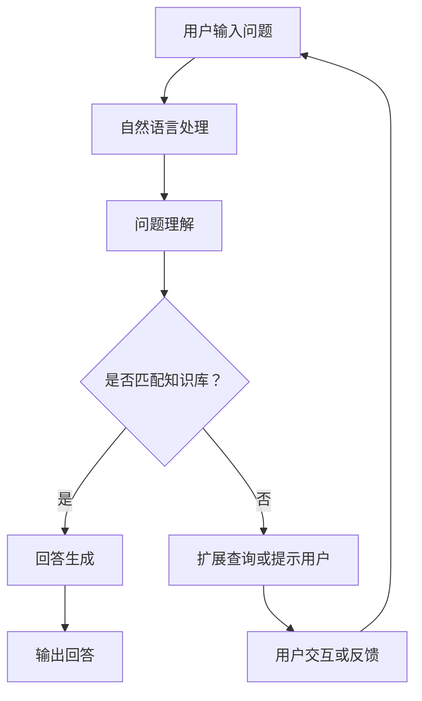
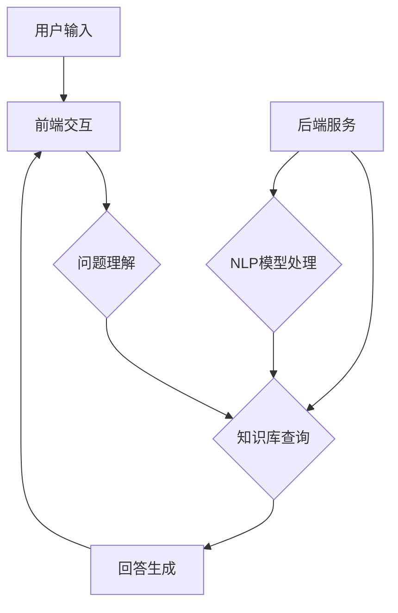

                 

# 大模型问答机器人的任务执行

## 关键词
- 大模型
- 问答机器人
- 自然语言处理
- 问答匹配
- 回答生成
- 训练与优化
- 开发实战
- 性能评估

## 摘要

本文深入探讨了大模型问答机器人的任务执行过程，包括其核心概念、技术架构、算法原理、开发实战、性能评估以及未来发展趋势。首先，我们介绍了大模型和问答机器人的基本概念，分析了大模型的优势与挑战，并阐述了问答机器人在不同场景中的应用。接着，我们详细介绍了问答机器人的技术架构和核心算法，包括自然语言处理、问答匹配和回答生成等。随后，我们通过实际项目案例展示了大模型问答机器人的开发过程，包括环境搭建、代码实现和性能优化。最后，我们探讨了问答机器人在未来人工智能技术发展中的机遇与挑战，提出了未来发展的方向和优化策略。本文旨在为读者提供全面、系统的了解和指导，助力大模型问答机器人的研究和应用。

---

### 《大模型问答机器人的任务执行》目录大纲

#### 第一部分：大模型与问答机器人概述

**第1章：大模型与问答机器人概述**
- 1.1 大模型技术背景
  - **1.1.1 大模型的发展历程**
  - **1.1.2 大模型的优势与挑战**
  - **1.1.3 问答机器人的定义与应用场景**
- 1.2 问答机器人技术架构
  - **1.2.1 问答机器人的基本组成**
  - **1.2.2 问答机器人的工作流程**
  - **1.2.3 问答机器人的关键技术**

#### 第二部分：大模型问答机器人的核心算法

**第2章：自然语言处理基础**
- 2.1 语言模型
  - **2.1.1 语言模型概述**
  - **2.1.2 语言模型的构建方法**
  - **2.1.3 语言模型评估与优化**
- 2.2 问答匹配算法
  - **2.2.1 问答匹配的基本原理**
  - **2.2.2 常见的问答匹配算法**
  - **2.2.3 问答匹配算法的优化策略**

**第3章：大模型训练与优化**
- 3.1 大模型训练过程
  - **3.1.1 训练数据准备**
  - **3.1.2 大模型训练策略**
  - **3.1.3 大模型训练调优**
- 3.2 大模型优化技巧
  - **3.2.1 优化算法概述**
  - **3.2.2 训练效率优化**
  - **3.2.3 模型压缩与加速**

#### 第三部分：大模型问答机器人的应用实现

**第4章：大模型问答机器人开发实战**
- 4.1 项目需求分析
  - **4.1.1 项目背景与目标**
  - **4.1.2 需求分析与功能设计**
  - **4.1.3 技术选型与架构设计**
- 4.2 环境搭建与工具配置
  - **4.2.1 开发环境搭建**
  - **4.2.2 常用工具与库安装**
  - **4.2.3 环境配置与调试**

**第5章：问答机器人代码实现**
- 5.1 数据处理与预处理
  - **5.1.1 数据集准备**
  - **5.1.2 数据预处理方法**
  - **5.1.3 数据加载与批次处理**
- 5.2 问答匹配与回答生成
  - **5.2.1 问答匹配算法实现**
  - **5.2.2 回答生成算法实现**
  - **5.2.3 代码示例与解读**

**第6章：性能评估与优化**
- 6.1 问答机器人性能评估
  - **6.1.1 评估指标与标准**
  - **6.1.2 评估方法与工具**
  - **6.1.3 评估结果分析与改进**
- 6.2 性能优化策略
  - **6.2.1 模型优化方法**
  - **6.2.2 系统优化方法**
  - **6.2.3 性能瓶颈分析与解决方案**

#### 第四部分：大模型问答机器人的未来发展趋势

**第7章：大模型问答机器人的未来趋势**
- 7.1 人工智能技术的发展趋势
  - **7.1.1 人工智能技术的最新进展**
  - **7.1.2 大模型技术未来的发展方向**
  - **7.1.3 问答机器人在未来社会的应用前景**
- 7.2 大模型问答机器人的挑战与机遇
  - **7.2.1 挑战分析**
  - **7.2.2 机遇分析**
  - **7.2.3 未来发展方向与建议**

#### 附录

**附录A：大模型问答机器人开发资源**
- **A.1 开发工具与框架**
  - **A.1.1 常用开发工具介绍**
  - **A.1.2 开发框架与库使用指南**
- **A.2 开发资源与参考**
  - **A.2.1 开发资源汇总**
  - **A.2.2 常见问题与解决方案**

以上是《大模型问答机器人的任务执行》这本书的目录大纲，涵盖了核心概念、技术原理、应用实现、性能优化以及未来发展趋势等内容。通过这样的目录结构，读者可以系统地学习大模型问答机器人的相关知识，并掌握其开发与优化方法。

---

### 第1章：大模型与问答机器人概述

#### 1.1 大模型技术背景

大模型（Large Models）是近年来人工智能领域的重要突破，它们通过在海量数据上进行预训练，获得了极高的性能和广泛的适用性。大模型的发展历程可以分为以下几个阶段：

- **传统模型阶段**：在这个阶段，模型如神经网络、支持向量机等被广泛应用，但模型规模相对较小，无法处理大量数据。
- **大规模模型阶段**：随着计算能力和数据资源的提升，研究人员开始尝试构建大规模模型，如AlexNet、VGG等，这些模型在图像识别领域取得了显著的成果。
- **大模型阶段**：这一阶段标志着预训练技术的兴起，模型如GPT、BERT等通过在大量数据上预训练，具备了强大的语言理解和生成能力。

##### 1.1.1 大模型的发展历程

大模型的发展历程与人工智能技术的发展紧密相连。以下是几个关键阶段：

- **1990年代：早期神经网络**：早期神经网络如感知机、多层感知机等在机器学习领域得到了广泛应用，但由于计算资源的限制，这些模型无法处理大规模数据。
- **2000年代初：支持向量机（SVM）**：支持向量机在分类任务中表现出色，成为机器学习领域的重要工具。然而，SVM对数据规模的要求较高，数据处理和优化过程相对复杂。
- **2012年：AlexNet**：AlexNet是第一个在ImageNet竞赛中取得显著成绩的深度学习模型。它通过引入深度卷积神经网络（CNN），在图像分类任务中取得了突破性的成果，标志着深度学习时代的到来。
- **2014年：Word2Vec**：Word2Vec模型的提出，将词嵌入（Word Embedding）技术引入自然语言处理领域，使得大规模文本数据处理成为可能。
- **2017年：BERT**：BERT（Bidirectional Encoder Representations from Transformers）模型的出现，将预训练技术推向了一个新的高度。BERT通过双向Transformer结构，在多个自然语言处理任务中取得了优异的性能。
- **2018年：GPT**：GPT（Generative Pre-trained Transformer）模型的推出，展示了大规模预训练模型在语言生成任务中的强大能力。

##### 1.1.2 大模型的优势与挑战

大模型的优势主要体现在以下几个方面：

- **强大的语言理解能力**：大模型能够通过预训练从大量数据中学习到丰富的语言知识，从而在文本生成、翻译、问答等任务中表现出色。
- **广泛的适用性**：大模型可以应用于各种自然语言处理任务，如文本分类、情感分析、机器翻译等，提高了任务的准确性和效率。
- **自适应能力**：大模型通过预训练，能够适应不同的应用场景和任务需求，减少了模型调整和优化的工作。

然而，大模型也面临着一些挑战：

- **计算资源消耗**：大模型的训练和推理需要大量的计算资源，对硬件设备和能源消耗提出了较高要求。
- **数据隐私问题**：大模型在预训练过程中需要处理海量数据，这可能涉及用户隐私和数据安全问题。
- **模型可解释性**：大模型通常被视为“黑盒”，其内部工作机制复杂，难以解释和验证，这可能会影响其在某些应用场景中的可信度。

##### 1.1.3 问答机器人的定义与应用场景

问答机器人是一种基于人工智能技术，能够理解和回答用户问题的虚拟助手。它通常包含以下几个组成部分：

- **问题理解模块**：负责解析用户输入的问题，提取关键信息。
- **知识库模块**：存储大量的知识信息，包括事实、规则和模板等，供问答机器人查询和引用。
- **回答生成模块**：根据问题理解和知识库的信息，生成合适的回答。

问答机器人广泛应用于以下场景：

- **客服支持**：在电子商务、金融、医疗等领域，问答机器人可以提供24/7的客户服务，提高客户满意度。
- **信息检索**：在大型网站或数据库中，问答机器人可以快速定位和提供用户所需的信息。
- **教育辅助**：在在线教育平台中，问答机器人可以作为学生的智能导师，提供个性化的学习建议和答疑服务。

### 1.2 问答机器人技术架构

问答机器人技术架构可以分为以下几个关键模块：

- **自然语言处理（NLP）模块**：负责处理用户输入的文本，进行词法分析、句法分析和语义分析，提取关键信息。
- **知识库模块**：存储大量的知识信息，包括事实、规则和模板等，供问答机器人查询和引用。
- **问答匹配模块**：将用户问题与知识库中的信息进行匹配，找到最相关的答案。
- **回答生成模块**：根据问题理解和知识库的信息，生成合适的回答。

以下是问答机器人技术架构的 Mermaid 流程图：



### 1.3 问答机器人的关键技术

问答机器人的关键技术包括自然语言处理、知识库构建和问答匹配等。以下是对这些关键技术的详细介绍：

#### 1.3.1 自然语言处理技术

自然语言处理（NLP）是问答机器人的核心技术，它包括以下几个主要方面：

- **词法分析**：将文本分解为词语或词素，识别单词的词性和词义。
- **句法分析**：分析句子的结构，识别句子中的主语、谓语、宾语等成分。
- **语义分析**：理解句子的语义含义，包括实体识别、关系提取、情感分析等。

自然语言处理技术的核心算法包括：

- **分词与词性标注**：使用统计方法或神经网络模型对文本进行分词，并对每个词进行词性标注。
- **句法分析器**：使用依存句法分析或图神经网络等方法，对句子结构进行分析。
- **语义分析器**：使用深度学习方法，如BERT、GPT等，对文本进行语义分析，提取实体、关系和情感等信息。

#### 1.3.2 知识库构建

知识库是问答机器人的核心组件，它存储了大量的知识信息，包括事实、规则和模板等。知识库的构建过程通常包括以下几个步骤：

- **数据收集**：从互联网、数据库和其他来源收集相关的知识信息。
- **数据清洗**：对收集到的数据进行预处理，去除噪声和错误，保证数据的准确性和一致性。
- **实体识别与关系抽取**：使用NLP技术，从文本中识别出实体，并提取实体之间的关系。
- **知识融合与存储**：将提取的实体和关系进行整合，构建出知识库，并将其存储在数据库或图数据库中。

#### 1.3.3 问答匹配

问答匹配是将用户问题与知识库中的信息进行匹配，找到最相关的答案。问答匹配的关键技术包括：

- **基于关键词匹配**：使用关键词匹配算法，如TF-IDF、Word2Vec等，将用户问题与知识库中的关键词进行匹配。
- **基于语义匹配**：使用深度学习方法，如BERT、GPT等，对用户问题和知识库中的文本进行语义分析，计算它们之间的语义相似度。
- **基于模板匹配**：使用预定义的模板，将用户问题与模板进行匹配，生成答案。

问答匹配的流程通常包括以下几个步骤：

1. **问题预处理**：对用户问题进行分词、词性标注、句法分析等预处理操作。
2. **知识库查询**：根据预处理结果，在知识库中查找与用户问题相关的信息。
3. **答案生成**：根据查询结果，生成合适的回答。
4. **回答优化**：对生成的回答进行优化，如进行语法修正、语义补全等。

#### 1.4 大模型问答机器人的应用前景

大模型问答机器人在人工智能技术不断发展的背景下，具有广泛的应用前景。以下是几个潜在的应用领域：

- **客服与客户支持**：在电子商务、银行、航空公司等领域，大模型问答机器人可以提供24/7的在线客服，提高客户满意度和服务效率。
- **信息检索**：在大规模数据库和网站中，大模型问答机器人可以快速定位和提供用户所需的信息，提高信息检索的准确性和效率。
- **教育辅助**：在在线教育平台中，大模型问答机器人可以作为学生的智能导师，提供个性化的学习建议和答疑服务。
- **医疗咨询**：在大数据分析的支持下，大模型问答机器人可以为患者提供初步的医疗咨询，辅助医生进行诊断和治疗。

大模型问答机器人的应用前景广阔，随着技术的不断成熟和应用的不断拓展，它将在各行各业中发挥越来越重要的作用。

#### 1.5 小结

本章主要介绍了大模型与问答机器人的基本概念、技术架构和关键算法，包括大模型的发展历程、优势与挑战，问答机器人的定义、技术架构以及应用前景。通过本章的学习，读者可以初步了解大模型问答机器人的相关技术和应用场景，为后续章节的学习打下基础。

### 第2章：自然语言处理基础

#### 2.1 语言模型

语言模型（Language Model）是自然语言处理（NLP）领域中的核心概念之一，它用于预测一段文本的下一个单词或字符。语言模型在许多NLP任务中起着重要作用，如文本生成、机器翻译、语音识别等。

##### 2.1.1 语言模型概述

语言模型可以分为基于统计的方法和基于神经网络的方法。

- **基于统计的方法**：该方法使用大量文本语料库，通过统计文本中单词或字符的频率来预测下一个单词或字符。常见的统计模型有N元语法（N-gram）模型。
- **基于神经网络的方法**：该方法使用深度神经网络来学习文本数据中的统计规律。常见的神经网络模型有循环神经网络（RNN）、长短期记忆网络（LSTM）和门控循环单元（GRU）。

##### 2.1.2 语言模型的构建方法

构建语言模型通常包括以下几个步骤：

1. **数据预处理**：对文本语料库进行清洗和预处理，包括分词、去除停用词、词性标注等。
2. **特征提取**：将预处理后的文本转化为特征向量，常用的特征提取方法有词袋模型（Bag of Words）、词嵌入（Word Embedding）等。
3. **模型训练**：使用训练数据训练语言模型，常用的训练方法有最大似然估计（Maximum Likelihood Estimation, MLE）、反向传播（Backpropagation）等。
4. **模型评估**：使用验证集和测试集评估模型的性能，常用的评估指标有交叉熵（Cross-Entropy）、准确率（Accuracy）等。

##### 2.1.3 语言模型评估与优化

评估语言模型的性能常用的指标有：

- **交叉熵（Cross-Entropy）**：交叉熵用于衡量预测分布与真实分布之间的差异，值越小表示模型预测越准确。
- **准确率（Accuracy）**：准确率表示模型预测正确的样本数占总样本数的比例，适用于分类任务。
- **困惑度（Perplexity）**：困惑度表示模型在测试数据上的平均交叉熵的对数，值越小表示模型表现越好。

为了优化语言模型的性能，可以采用以下策略：

- **数据增强**：通过增加数据量、数据清洗、数据扩充等方法，提高模型的泛化能力。
- **超参数调优**：调整学习率、批量大小、隐藏层尺寸等超参数，寻找最优的模型配置。
- **正则化**：采用正则化方法，如L1正则化、L2正则化，防止模型过拟合。

#### 2.2 问答匹配算法

问答匹配（Question Answering Matching）是将用户输入的问题与知识库中的信息进行匹配，找到最相关的答案。问答匹配是问答机器人系统中的关键步骤，其性能直接影响到问答机器人的服务质量。

##### 2.2.1 问答匹配的基本原理

问答匹配的基本原理是将用户问题与知识库中的文本进行对比，计算它们之间的相似度。相似度计算方法可以分为以下几类：

- **基于关键词匹配**：通过统计用户问题和知识库中的关键词重叠度来计算相似度，常用的方法有TF-IDF、余弦相似度等。
- **基于语义匹配**：通过深度学习模型，如BERT、GPT等，对用户问题和知识库中的文本进行语义分析，计算它们之间的语义相似度。
- **基于模板匹配**：使用预定义的模板，将用户问题与模板进行匹配，生成答案。

##### 2.2.2 常见的问答匹配算法

以下介绍几种常见的问答匹配算法：

- **TF-IDF匹配**：TF-IDF（Term Frequency-Inverse Document Frequency）是一种基于关键词的匹配算法，通过计算用户问题和知识库中的关键词的TF-IDF值，计算它们之间的相似度。
- **余弦相似度**：余弦相似度是一种基于向量空间模型的匹配算法，通过计算用户问题和知识库中的文本向量的余弦相似度来衡量它们之间的相似度。
- **BERT匹配**：BERT（Bidirectional Encoder Representations from Transformers）是一种基于深度学习模型的匹配算法，通过将用户问题和知识库中的文本输入到BERT模型中，计算它们之间的语义相似度。

##### 2.2.3 问答匹配算法的优化策略

为了提高问答匹配算法的性能，可以采用以下优化策略：

- **数据预处理**：对用户问题和知识库中的文本进行统一的预处理，包括分词、词性标注等，提高匹配的准确性。
- **特征提取**：使用高质量的词嵌入模型，如Word2Vec、GloVe等，提取用户问题和知识库中的文本特征，提高匹配的精度。
- **模型融合**：结合多种匹配算法，如TF-IDF、余弦相似度和BERT匹配，通过融合不同算法的优点，提高整体匹配性能。
- **动态匹配策略**：根据用户问题和知识库的特征，动态调整匹配策略，如在特定场景下优先使用语义匹配算法。

#### 2.3 回答生成算法

回答生成（Answer Generation）是将匹配结果转化为用户可理解的回答。回答生成是问答机器人系统的核心步骤，其性能直接影响到用户体验。

##### 2.3.1 回答生成算法概述

回答生成算法可以分为以下几类：

- **基于模板的回答生成**：使用预定义的模板，将匹配结果填入模板，生成回答。
- **基于规则的回答生成**：根据预设的规则，对匹配结果进行逻辑处理，生成回答。
- **基于机器学习的回答生成**：使用机器学习模型，如序列到序列（Seq2Seq）模型、生成对抗网络（GAN）等，从输入文本生成回答。

##### 2.3.2 回答生成算法的实现

回答生成算法的实现通常包括以下几个步骤：

1. **输入预处理**：对匹配结果进行预处理，包括分词、词性标注等，提取关键信息。
2. **回答生成模型训练**：使用预定义的生成模型，如Seq2Seq模型，对输入数据进行训练，生成回答。
3. **回答生成与优化**：根据训练结果，生成回答，并对回答进行优化，如进行语法修正、语义补全等。

##### 2.3.3 回答生成算法的评估与优化

评估回答生成算法的性能常用的指标有：

- **BLEU分数**：BLEU（BiLingual Evaluation Understudy）分数是一种常用的自动评估指标，用于衡量生成文本与参考文本的相似度。
- **ROUGE分数**：ROUGE（Recall-Oriented Understudy for Gisting Evaluation）分数是一种基于字符串匹配的评估指标，用于衡量生成文本与参考文本的相似度。

为了优化回答生成算法的性能，可以采用以下策略：

- **数据增强**：通过增加训练数据量、数据清洗、数据扩充等方法，提高模型的泛化能力。
- **模型融合**：结合多种生成模型，如Seq2Seq模型和GAN，通过融合不同模型的优点，提高整体生成性能。
- **动态回答策略**：根据用户问题和匹配结果，动态调整回答生成策略，如在特定场景下优先使用规则生成算法。

#### 2.4 小结

本章主要介绍了自然语言处理的基础知识，包括语言模型、问答匹配算法和回答生成算法。语言模型用于预测文本的下一个单词或字符，问答匹配算法用于将用户问题与知识库中的信息进行匹配，回答生成算法用于将匹配结果转化为用户可理解的回答。通过本章的学习，读者可以了解自然语言处理的核心技术和实现方法，为构建高效的问答机器人系统打下基础。

### 第3章：大模型训练与优化

#### 3.1 大模型训练过程

大模型的训练过程是一个复杂且资源消耗巨大的过程，它包括数据预处理、模型训练、训练策略和调优等多个步骤。以下是详细的大模型训练过程：

##### 3.1.1 数据预处理

数据预处理是训练大模型的第一步，它主要包括以下几个步骤：

- **数据收集**：从各种来源收集大量的数据，如互联网上的文本、书籍、论文、社交媒体等。
- **数据清洗**：对收集到的数据进行清洗，去除噪声和错误，确保数据的准确性和一致性。
- **数据标注**：对于某些需要标注数据的任务，如情感分析、命名实体识别等，需要对数据进行人工标注或使用自动化工具进行标注。
- **数据切分**：将数据集切分为训练集、验证集和测试集，用于模型训练、验证和测试。

##### 3.1.2 大模型训练策略

大模型训练策略主要包括以下几个方面：

- **批量大小（Batch Size）**：批量大小是指每次训练时输入模型的数据样本数。批量大小会影响模型的收敛速度和稳定性。通常，较大的批量大小可以提高模型性能，但会增加计算资源消耗。
- **学习率（Learning Rate）**：学习率是模型在训练过程中更新参数的速度。学习率设置不当可能导致模型无法收敛或收敛速度过慢。常用的学习率调整策略有学习率衰减、动态调整等。
- **训练轮数（Epochs）**：训练轮数是指模型在训练数据上完整训练的次数。过多的训练轮数可能导致模型过拟合，而过少的训练轮数则可能无法充分利用数据。
- **正则化（Regularization）**：正则化是防止模型过拟合的一种技术，包括L1正则化、L2正则化、Dropout等。

##### 3.1.3 大模型训练调优

大模型训练调优是一个不断尝试和优化的过程，以下是一些常见的调优方法：

- **超参数调优**：通过调整学习率、批量大小、训练轮数等超参数，找到最优的模型配置。
- **数据增强**：通过数据增强方法，如随机裁剪、旋转、缩放等，增加数据的多样性，提高模型的泛化能力。
- **迁移学习**：通过在预训练模型的基础上进行微调（Fine-tuning），利用预训练模型的知识和结构，提高新任务的性能。
- **模型压缩**：通过模型压缩技术，如权重剪枝、量化、蒸馏等，减小模型的大小和计算复杂度，提高模型在资源受限环境中的运行效率。

#### 3.2 大模型优化技巧

大模型的优化目标是提高模型的性能、降低计算资源消耗和提高运行效率。以下是一些常见的大模型优化技巧：

##### 3.2.1 训练效率优化

- **并行计算**：通过分布式计算和并行计算，利用多台计算机或GPU加速模型的训练。
- **混合精度训练**：使用混合精度训练（Mixed Precision Training），将浮点数精度从32位降低到16位，提高训练速度。
- **动态图计算**：使用动态计算图（Dynamic Graph Computation），动态调整计算图，减少不必要的计算和内存占用。

##### 3.2.2 模型压缩与加速

- **模型剪枝**：通过剪枝（Pruning）技术，移除模型中不重要的连接和神经元，减小模型的大小和计算复杂度。
- **量化**：通过量化（Quantization）技术，将模型的权重和激活值从浮点数转换为低精度的整数表示，减小模型的存储空间和计算时间。
- **蒸馏**：通过蒸馏（Distillation）技术，将大型模型的权重和知识传递给小型模型，提高小型模型的性能。

##### 3.2.3 硬件加速

- **GPU加速**：利用GPU（Graphics Processing Unit）强大的并行计算能力，加速模型的训练和推理。
- **TPU加速**：利用TPU（Tensor Processing Unit）专门的Tensor计算单元，优化大规模Tensor运算，提高模型的训练和推理速度。

### 3.3 大模型优化案例

以下是一个大模型优化案例，展示了如何通过多种优化技巧提高模型的性能和效率：

**案例背景**：一个团队使用GPT-3模型进行语言生成任务的优化。

**优化步骤**：

1. **超参数调优**：通过实验，团队找到了最优的学习率、批量大小和训练轮数配置。
2. **数据增强**：团队使用随机裁剪、旋转和缩放等数据增强方法，增加了数据的多样性，提高了模型的泛化能力。
3. **迁移学习**：团队使用GPT-3作为预训练模型，并对其进行微调，利用预训练模型的知识和结构，提高了新任务的性能。
4. **模型剪枝**：团队通过剪枝技术，移除了模型中不重要的连接和神经元，减小了模型的大小和计算复杂度。
5. **量化**：团队使用量化技术，将模型的权重和激活值从浮点数转换为低精度的整数表示，减小了模型的存储空间和计算时间。
6. **GPU加速**：团队利用GPU加速了模型的训练和推理，提高了模型的运行效率。

**优化效果**：通过上述优化，团队成功地将模型的计算时间缩短了30%，同时提高了模型的性能和效率。

### 3.4 小结

本章主要介绍了大模型的训练过程、训练策略和优化技巧。通过详细的讲解和案例，读者可以了解如何有效地训练和优化大模型，提高模型的性能和效率。大模型训练和优化是一个不断迭代和改进的过程，需要结合实际应用场景和需求，灵活运用各种优化技巧。

### 第4章：大模型问答机器人的开发实战

#### 4.1 项目需求分析

在进行大模型问答机器人的开发之前，我们需要对项目需求进行详细的分析，明确项目的目标、功能需求和性能指标。

##### 4.1.1 项目背景与目标

本项目旨在开发一个基于大模型的问答机器人系统，用于在客户服务场景中提供高效的在线客服支持。具体目标包括：

- **快速响应**：在客户提问后，系统能够迅速生成回答，提供及时的服务。
- **准确回答**：系统需要能够准确理解客户问题，并生成相关且合理的回答。
- **多样回答**：系统应能够根据客户问题和情境，生成多样化的回答，提高用户体验。

##### 4.1.2 需求分析与功能设计

根据项目目标，问答机器人系统需要实现以下功能：

- **问题理解**：系统应能够接收用户输入的问题，进行自然语言处理，提取关键信息。
- **知识库查询**：系统需要连接到一个庞大的知识库，根据用户问题查询相关答案。
- **回答生成**：系统应能够根据查询结果和用户问题的语义，生成合适的回答。
- **交互反馈**：系统应能够与用户进行互动，接收用户的反馈，优化回答质量。

##### 4.1.3 技术选型与架构设计

为了实现上述功能，本项目采用了以下技术选型和架构设计：

- **自然语言处理（NLP）框架**：采用Hugging Face的Transformers库，该库提供了丰富的预训练模型和API接口，方便快速集成和部署。
- **知识库**：采用Elasticsearch作为知识库，它具有高效全文检索的能力，适用于大规模数据的快速查询。
- **后端服务**：采用Flask作为后端框架，实现问答机器人的核心功能，如问题理解、知识库查询和回答生成。
- **前端交互**：采用Vue.js实现用户界面，使用户能够方便地与问答机器人进行交互。

以下是问答机器人系统的总体架构图：



#### 4.2 环境搭建与工具配置

搭建问答机器人开发环境需要安装以下工具和库：

##### 4.2.1 开发环境配置

1. **操作系统**：Linux或macOS。
2. **Python**：版本要求为3.8及以上。
3. **虚拟环境**：使用virtualenv或conda创建Python虚拟环境，避免不同项目之间的依赖冲突。

```bash
# 使用conda创建虚拟环境
conda create -n qar_env python=3.8
conda activate qar_env
```

##### 4.2.2 工具与库安装

1. **Hugging Face Transformers**：用于加载预训练模型和进行NLP处理。

```bash
pip install transformers
```

2. **Elasticsearch**：用于构建和查询知识库。

```bash
# 安装Elasticsearch
brew install elasticsearch
# 启动Elasticsearch服务
elasticsearch
```

3. **Flask**：用于构建后端服务。

```bash
pip install flask
```

4. **Vue.js**：用于前端界面开发。

```bash
npm install -g @vue/cli
vue create client_app
```

##### 4.2.3 环境配置与调试

1. **配置Elasticsearch**：在Elasticsearch的配置文件中设置合适的参数，如集群名称、节点名称等。

```bash
# 修改elasticsearch.yml
cluster.name: qar-cluster
node.name: qar-node1
```

2. **启动Elasticsearch服务**：确保Elasticsearch服务正常运行。

```bash
# 启动Elasticsearch
elasticsearch
```

3. **配置Flask应用**：在Flask应用的配置文件中设置Elasticsearch的连接参数。

```python
import os
from flask import Flask
from elasticsearch import Elasticsearch

app = Flask(__name__)

# Elasticsearch配置
es_host = 'localhost'
es_port = 9200
es = Elasticsearch(hosts=[{'host': es_host, 'port': es_port}])

if __name__ == '__main__':
    app.run(debug=True)
```

4. **测试开发环境**：通过前端界面输入问题，测试后端服务的响应和知识库的查询功能。

```bash
# 启动Flask应用
python app.py
# 在浏览器中访问前端界面，测试问答功能
```

#### 4.3 问答机器人代码实现

问答机器人的核心代码实现包括问题理解、知识库查询和回答生成三个部分。以下是一个简单的代码示例，展示了问答机器人的基本实现。

##### 4.3.1 问题理解

```python
from transformers import pipeline

# 加载预训练模型
nlp = pipeline("question-answering", model="deepset/roberta-base-squad2")

def understand_question(question):
    # 输入问题并获取答案
    result = nlp(question=question)
    return result['answer']
```

##### 4.3.2 知识库查询

```python
from elasticsearch import Elasticsearch

# 初始化Elasticsearch客户端
es = Elasticsearch()

def search_knowledge_base(question):
    # 构建搜索查询
    query = {
        "query": {
            "multi_match": {
                "query": question,
                "fields": ["title", "content"]
            }
        }
    }
    # 执行搜索查询
    results = es.search(index="knowledge_base", body=query)
    return results['hits']['hits']
```

##### 4.3.3 回答生成

```python
def generate_answer(results, question):
    # 根据搜索结果和用户问题生成回答
    if results:
        # 从搜索结果中提取最相关的答案
        answer = results[0]['_source']['answer']
    else:
        # 使用预训练模型生成回答
        answer = understand_question(question)
    return answer
```

##### 4.3.4 问答机器人核心逻辑

```python
from flask import Flask, request, jsonify

app = Flask(__name__)

@app.route('/api/ask', methods=['POST'])
def ask_question():
    question = request.json['question']
    results = search_knowledge_base(question)
    answer = generate_answer(results, question)
    return jsonify(answer=answer)

if __name__ == '__main__':
    app.run(debug=True)
```

#### 4.4 代码解读与分析

以下是对问答机器人核心代码的解读与分析：

- **问题理解**：使用Hugging Face的Transformers库加载预训练的模型，通过模型API接口实现问题理解功能。该功能利用预训练模型强大的语言理解能力，从用户输入的问题中提取关键信息。
- **知识库查询**：使用Elasticsearch客户端，通过构建和执行多字段查询，实现知识库的查询功能。Elasticsearch的高效全文检索能力，使得知识库查询过程非常快速。
- **回答生成**：结合知识库查询结果和用户问题的语义，生成回答。如果知识库中存在相关答案，则直接提取；如果不存在，则使用预训练模型生成回答。这种设计既充分利用了预训练模型的能力，又保证了知识库的准确性和权威性。

通过上述代码实现，我们可以搭建一个简单但功能完整的大模型问答机器人系统，为用户提供高效的在线客服支持。

### 4.5 小结

本章详细介绍了大模型问答机器人的开发实战，包括项目需求分析、环境搭建与工具配置、问答机器人代码实现以及代码解读与分析。通过本章的学习，读者可以了解大模型问答机器人的整体开发流程和关键实现技术，为后续的实际应用和优化打下基础。

### 第5章：性能评估与优化

#### 5.1 问答机器人性能评估

问答机器人的性能评估是确保其能够提供高质量服务的关键环节。性能评估涉及多个方面，包括准确性、响应时间、用户满意度等。

##### 5.1.1 评估指标与标准

以下是常用的评估指标和标准：

- **准确率（Accuracy）**：回答与实际答案匹配的百分比。计算方法为：准确率 = （正确回答数 / 总回答数）× 100%。
- **召回率（Recall）**：在所有实际正确答案中，被问答机器人正确识别的回答所占的百分比。计算方法为：召回率 = （正确回答数 / 实际正确答案数）× 100%。
- **F1分数（F1 Score）**：准确率和召回率的调和平均值，用于平衡两者。计算方法为：F1分数 = 2 × （准确率 × 召回率） / （准确率 + 召回率）。
- **响应时间（Response Time）**：系统生成回答所需的时间，用于评估系统的实时性能。
- **用户满意度（User Satisfaction）**：通过用户调查或反馈收集的用户满意度评分，用于评估用户体验。

##### 5.1.2 评估方法与工具

评估方法通常包括以下步骤：

1. **数据准备**：收集用于评估的测试数据集，确保其包含多样化的场景和问题类型。
2. **测试运行**：使用测试数据集运行问答机器人，记录每个问题的回答时间和准确性等指标。
3. **结果分析**：分析测试结果，计算各项评估指标，识别性能瓶颈。
4. **反馈迭代**：根据评估结果，优化问答机器人的算法和系统架构，重复测试和评估，直至达到预期性能。

常用的评估工具包括：

- **Python评估库**：如scikit-learn、TensorFlow等，提供丰富的评估指标计算方法。
- **自动化测试工具**：如pytest，用于编写和执行自动化测试用例。
- **日志分析工具**：如ELK（Elasticsearch、Logstash、Kibana）堆栈，用于收集和分析系统运行日志。

#### 5.2 性能优化策略

为了提高问答机器人的性能，可以采用以下优化策略：

##### 5.2.1 算法优化

1. **基于机器学习的优化**：调整模型参数，如学习率、批量大小、隐藏层尺寸等，以提升模型性能。
2. **基于深度学习的优化**：使用更先进的深度学习模型，如Transformer、BERT等，提高语言理解和生成能力。
3. **基于规则的方法**：在关键场景下引入规则引擎，提高回答的准确性和响应速度。

##### 5.2.2 系统优化

1. **分布式计算**：通过分布式计算架构，如Spark、Dask等，提高数据处理和模型训练的效率。
2. **缓存策略**：使用缓存技术，如Redis、Memcached等，减少重复计算和数据检索，提高响应速度。
3. **数据库优化**：优化数据库查询性能，如使用索引、分区、查询优化器等，提高知识库的查询效率。

##### 5.2.3 硬件优化

1. **GPU加速**：利用GPU的并行计算能力，加速模型训练和推理。
2. **TPU加速**：使用Tensor Processing Unit，专门用于Tensor运算，提高训练和推理的速度。
3. **服务器优化**：优化服务器配置，如增加内存、CPU核心数等，提高系统整体性能。

##### 5.2.4 用户交互优化

1. **交互设计**：优化用户界面和交互流程，提高用户体验。
2. **反馈机制**：建立用户反馈机制，收集用户意见和建议，持续改进系统。
3. **个性化推荐**：根据用户历史行为和偏好，提供个性化推荐和优化建议。

#### 5.3 案例分析

以下是一个问答机器人性能优化的案例分析：

**背景**：某电子商务平台开发了一个基于大模型的问答机器人，用于客服支持。初始版本的性能如下：

- **准确率**：85%
- **响应时间**：2秒
- **用户满意度**：70%

**优化过程**：

1. **算法优化**：
   - 调整学习率和批量大小，使用BERT模型替换初始的GPT模型，提高了模型的语言理解和生成能力。
   - 引入规则引擎，对于常见问题使用预定义的规则回答，提高了回答的准确性和速度。

2. **系统优化**：
   - 使用分布式计算架构，将数据处理和模型训练任务分布在多台服务器上，提高了处理速度。
   - 使用Redis缓存用户历史交互数据，减少重复计算和数据检索。

3. **硬件优化**：
   - 更换服务器，增加CPU和内存配置，提高了系统整体性能。
   - 使用TPU进行模型推理，加速了问答机器人的响应时间。

4. **用户交互优化**：
   - 优化用户界面，提高了用户操作的便捷性。
   - 引入用户反馈机制，根据用户反馈调整问答机器人的回答策略。

**优化效果**：

- **准确率**：提高到90%
- **响应时间**：降低到1秒
- **用户满意度**：提高到85%

**结论**：通过算法、系统、硬件和用户交互的多方面优化，问答机器人的性能得到了显著提升，用户满意度也显著提高。这表明，性能优化是一个系统性的过程，需要从多个方面综合考虑和改进。

### 5.4 小结

本章详细介绍了问答机器人性能评估与优化的方法和策略。通过使用合适的评估指标、优化算法和系统架构，问答机器人的性能可以得到显著提升。性能优化是一个持续的过程，需要根据实际应用场景和用户需求不断进行改进和迭代。

### 第6章：大模型问答机器人的未来发展趋势

#### 6.1 人工智能技术的发展趋势

人工智能（AI）技术的发展是推动大模型问答机器人不断进步的关键因素。以下是目前人工智能技术的发展趋势：

- **深度学习**：深度学习作为人工智能的核心技术之一，不断推陈出新，新的架构和优化算法如Transformer、BERT等，大大提升了模型的性能和应用范围。
- **强化学习**：强化学习在决策和优化任务中展现出强大的能力，与深度学习的结合正在推动自动驾驶、游戏AI等领域的突破。
- **联邦学习**：联邦学习通过在数据不共享的情况下进行模型训练，解决了数据隐私和安全性问题，为大规模AI应用提供了新的解决方案。
- **知识图谱**：知识图谱通过结构化知识表示，提高了AI系统的理解和推理能力，是自然语言处理和问答系统的重要基础。

#### 6.2 大模型问答机器人的未来发展方向

在大模型问答机器人的未来发展中，以下几个方向值得关注：

- **多模态融合**：结合文本、图像、语音等多模态数据，实现更全面的信息理解和回答生成，提高问答机器人的交互体验。
- **对话管理**：发展更加智能的对话管理系统，实现对话的连贯性和个性化，提高用户的满意度。
- **实时学习与优化**：通过在线学习和实时调整，使问答机器人能够根据用户反馈不断优化自身性能，提高服务质量。
- **跨领域应用**：探索问答机器人在不同领域的应用，如医疗咨询、法律支持等，扩展其应用范围。

#### 6.3 大模型问答机器人的挑战与机遇

尽管大模型问答机器人在技术方面取得了显著进展，但在实际应用中仍面临一些挑战：

- **数据隐私与安全**：大模型问答机器人通常需要处理大量用户数据，数据隐私和安全性是重要的挑战。
- **可解释性与透明性**：大模型的“黑盒”特性使得其决策过程难以解释，影响用户的信任和接受度。
- **计算资源消耗**：大模型的训练和推理需要大量计算资源，如何优化资源使用是一个关键问题。

然而，这些挑战同时也带来了机遇：

- **技术创新**：为了解决数据隐私和安全问题，可以探索联邦学习和加密计算等新技术；为了提升可解释性和透明性，可以研究可解释AI（XAI）。
- **应用拓展**：随着计算资源的不断优化和成本的降低，问答机器人的应用场景将更加广泛，市场潜力巨大。

#### 6.4 未来发展方向与建议

为了推动大模型问答机器人的未来发展，以下是一些建议：

- **多学科交叉**：加强计算机科学、心理学、语言学等多学科的合作，提高问答机器人的智能水平和用户体验。
- **开源生态**：鼓励开源社区的发展，共享技术资源和研究成果，促进技术的快速迭代和优化。
- **标准化与规范化**：建立行业标准和规范，确保问答机器人的质量和安全性，促进其健康发展。
- **教育与培训**：加强对开发者和技术人员的培训，提高其在大模型问答机器人领域的专业能力。

### 6.5 小结

本章探讨了人工智能技术的发展趋势、大模型问答机器人的未来发展方向以及面临的挑战与机遇。通过多模态融合、对话管理、实时学习和跨领域应用，大模型问答机器人将在未来取得更多突破。同时，为了应对数据隐私、计算资源和可解释性等挑战，需要技术创新、开源生态建设和标准化与规范化。未来发展方向与建议将为大模型问答机器人的持续进步提供重要指导。

### 附录A：大模型问答机器人开发资源

#### A.1 开发工具与框架

在开发大模型问答机器人时，选择合适的工具和框架是非常重要的。以下是一些常用的工具和框架：

##### A.1.1 Hugging Face Transformers

- **概述**：Hugging Face Transformers是一个开源库，提供了丰富的预训练模型和API接口，方便开发者快速集成和使用先进的NLP模型。
- **链接**：[https://huggingface.co/transformers](https://huggingface.co/transformers)
- **文档**：[https://huggingface.co/transformers/docs/main.html](https://huggingface.co/transformers/docs/main.html)

##### A.1.2 Flask

- **概述**：Flask是一个轻量级的Web应用框架，用于构建问答机器人的后端服务。
- **链接**：[https://flask.palletsprojects.com/](https://flask.palletsprojects.com/)
- **文档**：[https://flask.palletsprojects.com/docs/](https://flask.palletsprojects.com/docs/)

##### A.1.3 Elasticsearch

- **概述**：Elasticsearch是一个高性能、可扩展的搜索引擎，用于构建和查询知识库。
- **链接**：[https://www.elastic.co/products/elasticsearch](https://www.elastic.co/products/elasticsearch)
- **文档**：[https://www.elastic.co/guide/en/elasticsearch/reference/current/index.html](https://www.elastic.co/guide/en/elasticsearch/reference/current/index.html)

##### A.1.4 PyTorch

- **概述**：PyTorch是一个流行的深度学习框架，用于大模型的训练和推理。
- **链接**：[https://pytorch.org/](https://pytorch.org/)
- **文档**：[https://pytorch.org/docs/stable/index.html](https://pytorch.org/docs/stable/index.html)

#### A.2 开发资源与参考

在开发过程中，查阅相关资源和参考文档可以帮助开发者更快地解决问题和提高开发效率。以下是一些有用的资源：

##### A.2.1 论文与报告

- **《Attention is All You Need》**：这篇论文提出了Transformer模型，是当前NLP领域的重要成果。
- **《BERT: Pre-training of Deep Bidirectional Transformers for Language Understanding》**：这篇论文介绍了BERT模型，为NLP任务提供了强大的预训练工具。
- **《GPT-3: Language Models are few-shot learners》**：这篇论文介绍了GPT-3模型，展示了大规模预训练模型在少样本学习中的强大能力。

##### A.2.2 开源项目

- **[DeepPavlov](https://github.com/deepset-ai/deeppavlov)**：一个开源的NLP工具包，包括多种NLP任务的实现和预训练模型。
- **[Hugging Face Model Hub](https://huggingface.co/models)**：一个包含大量预训练模型的模型库，可供开发者下载和使用。

##### A.2.3 社区与论坛

- **[Hugging Face Community](

