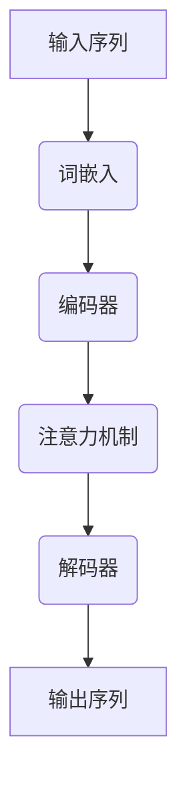
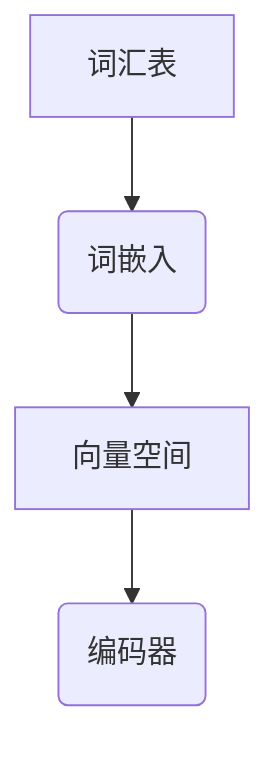
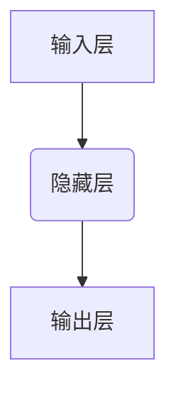
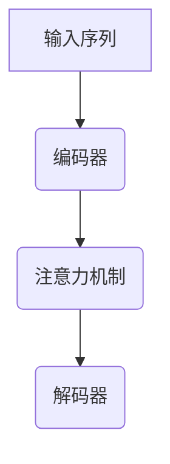

                 

# 《大语言模型原理基础与前沿 图文联合训练》

关键词：大语言模型、自然语言处理、图文联合训练、多模态交互、生成任务

摘要：
本文系统地介绍了大语言模型的原理基础与前沿研究，包括其发展历程、基本原理、核心概念与架构、训练与优化方法，以及图文联合训练的前沿研究。通过详细阐述大模型在生成任务、序列标注任务中的应用，以及未来发展趋势，本文旨在为读者提供一个全面、深入的视角，探讨大语言模型在人工智能领域的广泛应用和未来发展。

## 目录大纲

- **第一部分：大语言模型基础理论**
  - 第1章：大语言模型概述
    - 1.1 大语言模型的发展历程
    - 1.2 大语言模型的基本原理
    - 1.3 大语言模型与自然语言处理的关系
    - 1.4 大语言模型的应用领域
  - 第2章：大语言模型核心概念与架构
    - 2.1 词嵌入技术
    - 2.2 神经网络基础
    - 2.3 注意力机制
    - 2.4 编码器-解码器架构
  - 第3章：大语言模型训练与优化
    - 3.1 预训练方法
    - 3.2 迁移学习与微调
    - 3.3 训练优化算法
    - 3.4 模型压缩与加速
  - 第4章：大语言模型的前沿研究
    - 4.1 图文联合训练
    - 4.2 大模型的多模态交互
    - 4.3 大模型在生成任务中的应用
    - 4.4 大模型在序列标注任务中的应用
  - 第5章：大语言模型的数学模型
    - 5.1 概率图模型
    - 5.2 生成模型
    - 5.3 对抗生成网络
    - 5.4 贝叶斯模型
  - 第6章：大语言模型项目实战
    - 6.1 项目背景与需求分析
    - 6.2 环境搭建与工具准备
    - 6.3 数据预处理
    - 6.4 模型设计与训练
    - 6.5 模型评估与优化
    - 6.6 项目部署与维护
  - 第7章：大语言模型的未来发展趋势
    - 7.1 大模型技术的发展趋势
    - 7.2 大语言模型在不同领域的应用前景
    - 7.3 大语言模型面临的挑战与应对策略
- **第二部分：大语言模型实战与探索**
  - 附录A：大语言模型开发工具与资源
  - 附录B：大语言模型数学公式汇总
  - 附录C：大语言模型开发指南

## 第一部分：大语言模型基础理论

### 第1章：大语言模型概述

#### 1.1 大语言模型的发展历程

大语言模型（Large Language Model，简称LLM）的发展历程可以追溯到20世纪50年代。当时，随着计算机科学的兴起，自然语言处理（Natural Language Processing，简称NLP）作为人工智能的一个分支开始受到关注。早期的NLP研究主要集中在规则驱动的方法，如语法分析、词性标注等。这些方法依赖于大量的手工编写的规则，但受限于计算能力和数据规模，效果有限。

进入20世纪80年代，统计方法开始在NLP领域崭露头角。其中，N-gram模型是最具代表性的工作之一。N-gram模型通过统计相邻词出现的频率来预测下一个词的概率。这一方法在文本生成和语言建模方面取得了显著进展，但由于其短序列依赖性，无法捕捉长距离依赖关系。

随着计算能力的提升和大规模数据集的出现，20世纪90年代，隐藏马尔可夫模型（Hidden Markov Model，HMM）和条件随机场（Conditional Random Field，CRF）等序列模型得到了广泛应用。这些模型通过隐变量和概率分布来处理序列数据，虽然在某些任务上取得了较好效果，但仍然受限于序列建模的复杂性。

21世纪初，深度学习（Deep Learning）的兴起为NLP带来了革命性的变化。循环神经网络（Recurrent Neural Network，RNN）及其变种长短时记忆网络（Long Short-Term Memory，LSTM）和门控循环单元（Gated Recurrent Unit，GRU）在处理序列数据方面表现出色，解决了传统序列模型难以捕捉长距离依赖的问题。

2017年，Google提出了Transformer模型，这是一种基于自注意力机制（Self-Attention Mechanism）的全连接模型。Transformer模型在机器翻译、文本分类等任务上取得了突破性成果，标志着大语言模型的诞生。随后，BERT（Bidirectional Encoder Representations from Transformers）模型进一步提升了Transformer模型的表现，通过双向编码器的方式捕捉上下文信息。

近年来，随着计算资源和数据规模的不断增加，大语言模型的规模和性能也在持续提升。GPT-3（Generative Pre-trained Transformer 3）等模型参数量达到千亿级别，展现出了强大的语言理解和生成能力。

#### 1.2 大语言模型的基本原理

大语言模型的基本原理主要基于深度学习和注意力机制。深度学习通过多层神经网络结构，逐层提取特征，从而学习到复杂的语义信息。而注意力机制则是在处理序列数据时，通过计算不同位置之间的相关性，使模型能够关注到重要的信息。

以下是一个简单的Mermaid流程图，展示了一个大语言模型的基本架构：

#### 1.3 大语言模型与自然语言处理的关系

大语言模型在自然语言处理（NLP）中扮演着核心角色。传统的NLP方法通常依赖于规则和手工特征工程，而大语言模型通过预训练和微调，能够自动学习到丰富的语言特征，从而在多种NLP任务中表现出色。

以下是一些典型的NLP任务及其与大语言模型的关系：

- **文本分类**：大语言模型通过学习文本的语义信息，能够有效地对文本进行分类。
- **命名实体识别**：大语言模型能够识别文本中的命名实体，如人名、地名等。
- **机器翻译**：大语言模型通过捕捉语言的上下文关系，能够实现高质量的机器翻译。
- **问答系统**：大语言模型能够理解用户的问题，并生成相应的回答。
- **文本生成**：大语言模型能够根据输入的文本或提示，生成新的文本。

#### 1.4 大语言模型的应用领域

大语言模型在多个领域得到了广泛应用，以下是一些典型的应用领域：

- **智能客服**：通过大语言模型，可以构建智能客服系统，实现自动化的客户服务。
- **内容审核**：大语言模型可以用于识别和过滤不良内容，如垃圾邮件、恶意评论等。
- **教育辅导**：大语言模型可以为学生提供个性化的辅导和解答问题。
- **医疗辅助**：大语言模型可以辅助医生进行疾病诊断和治疗方案推荐。
- **法律应用**：大语言模型可以用于法律文本的生成、分析和解读。

### 第2章：大语言模型核心概念与架构

#### 2.1 词嵌入技术

词嵌入（Word Embedding）是将词汇映射到高维向量空间的技术，通过词嵌入，模型能够学习到词汇的语义信息。词嵌入技术在大语言模型中起着至关重要的作用。

以下是一个简单的Mermaid流程图，展示了一个词嵌入的过程：

词嵌入技术可以分为两类：基于统计的方法和基于神经网络的方法。

- **基于统计的方法**：如N-gram模型和GloVe（Global Vectors for Word Representation）。N-gram模型通过统计相邻词的频率来生成词向量，而GloVe通过优化全局损失函数来学习词向量。

- **基于神经网络的方法**：如Word2Vec和GloVe。Word2Vec是一种基于神经网络的模型，通过预测上下文词来学习词向量，而GloVe是一种基于矩阵分解的方法，通过优化全局损失函数来学习词向量。

#### 2.2 神经网络基础

神经网络（Neural Network）是一种模拟生物神经系统的计算模型，通过多层神经网络结构，模型能够学习到复杂的特征表示。

以下是一个简单的Mermaid流程图，展示了一个前馈神经网络的结构：

神经网络的核心组成部分包括：

- **神经元**：神经网络中的基本单元，通过权重连接到其他神经元。
- **激活函数**：对神经元的输出进行非线性变换，如ReLU（Rectified Linear Unit）和Sigmoid函数。
- **损失函数**：用于评估模型预测值与真实值之间的差距，如交叉熵损失函数和均方误差损失函数。

常见的神经网络模型包括：

- **前馈神经网络**：信息从输入层直接传递到输出层。
- **循环神经网络**（RNN）：能够处理序列数据，通过隐藏状态传递信息。
- **卷积神经网络**（CNN）：擅长处理图像等二维数据。

#### 2.3 注意力机制

注意力机制（Attention Mechanism）是一种在神经网络中引入对输入序列的局部关注机制，能够提高模型在处理序列数据时的表现。

以下是一个简单的Mermaid流程图，展示了一个注意力机制的工作原理：

注意力机制的核心思想是，通过计算输入序列中各个位置的重要性，为每个位置分配权重，从而在输出时能够更加关注重要信息。

常见的注意力机制模型包括：

- **自注意力机制**：在编码器和解码器之间引入自注意力机制，能够提高模型对输入序列的理解能力。
- **交互注意力机制**：在编码器和解码器之间

