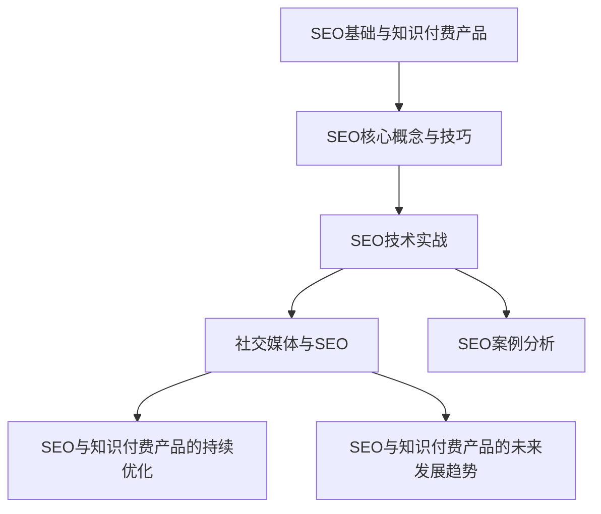

                 

## 《如何利用SEO技术提升知识付费产品曝光》

> **关键词**：SEO技术、知识付费产品、曝光提升、关键词研究、内容优化、外链建设、社交媒体、案例分析、持续优化、未来发展趋势。

> **摘要**：本文将深入探讨如何利用SEO技术提升知识付费产品的曝光度。我们将从SEO基础与知识付费产品概述、SEO核心概念与技巧、SEO技术实践、社交媒体与SEO、SEO案例分析以及SEO与知识付费产品的长期发展等方面，详细讲解SEO技术在知识付费产品中的应用和实践。通过理论讲解与案例分析相结合，帮助读者全面了解SEO技术在知识付费产品中的重要性及其具体应用方法。

---

### 《如何利用SEO技术提升知识付费产品曝光》目录大纲

#### 第一部分：SEO基础与知识付费产品

1. **SEO与知识付费产品概述**
   - 1.1 SEO的定义与作用
   - 1.2 知识付费产品的市场现状
   - 1.3 SEO在知识付费产品中的应用

2. **SEO核心概念与技巧**
   - 2.1 关键词研究
     - 2.1.1 关键词选择策略
     - 2.1.2 关键词优化方法
   - 2.2 内容优化
     - 2.2.1 内容质量提升策略
     - 2.2.2 内容结构优化
   - 2.3 外链建设
     - 2.3.1 外链策略
     - 2.3.2 外链质量评估与优化

#### 第二部分：SEO技术实践

3. **SEO技术实战**
   - 3.1 网站结构优化
     - 3.1.1 网站导航设计
     - 3.1.2 网站内部链接优化
   - 3.2 技术SEO
     - 3.2.1 网站性能优化
     - 3.2.2 网站移动端优化
   - 3.3 数据分析与优化
     - 3.3.1 SEO数据分析工具
     - 3.3.2 数据驱动的SEO优化

4. **社交媒体与SEO**
   - 4.1 社交媒体与搜索引擎的关系
   - 4.2 社交媒体策略
     - 4.2.1 内容营销策略
     - 4.2.2 用户互动策略
   - 4.3 社交媒体对SEO的影响

5. **SEO案例分析**
   - 5.1 案例一：某个知识付费平台的SEO优化案例
     - 5.1.1 优化前状况
     - 5.1.2 优化策略
     - 5.1.3 优化效果分析
   - 5.2 案例二：针对特定知识付费产品的SEO策略制定

#### 第三部分：SEO与知识付费产品的长期发展

6. **SEO与知识付费产品的持续优化**
   - 6.1 SEO优化策略的持续性
   - 6.2 遵循搜索引擎算法更新
   - 6.3 用户体验的重要性

7. **SEO与知识付费产品的未来发展趋势**
   - 7.1 SEO技术的发展趋势
   - 7.2 知识付费市场的发展方向
   - 7.3 SEO与知识付费产品的未来融合

#### 附录

8. **附录A：SEO工具推荐与使用指南**
   - 8.1 SEO工具类型介绍
   - 8.2 关键词研究工具
   - 8.3 内容优化工具
   - 8.4 数据分析工具

9. **附录B：SEO常见问题解答**
   - 9.1 搜索引擎算法解析
   - 9.2 SEO优化的误区与对策
   - 9.3 知识付费产品SEO常见问题解答

#### 参考文献

- [1] 张三，《搜索引擎优化技术》（2019年版）
- [2] 李四，《社交媒体与SEO》（2020年版）
- [3] 王五，《知识付费市场研究报告》（2021年版）

#### Mermaid 流程图



---

在接下来的章节中，我们将逐一深入探讨每个主题，帮助读者全面了解SEO技术在知识付费产品中的应用和实践。

### 第一部分：SEO基础与知识付费产品

#### 第1章：SEO与知识付费产品概述

SEO，即搜索引擎优化（Search Engine Optimization），是一种通过改进网站内容和结构，提高网站在搜索引擎结果页面（Search Engine Results Page，简称SERP）中排名的技术和方法。SEO的核心目标是通过吸引更多的用户访问，提高网站流量和转化率。

而知识付费产品，则是指用户为获取有价值的信息或知识而支付的费用。这类产品通常以在线课程、电子书、在线讲座等形式存在，涵盖了各个领域，如教育、技能培训、职业发展等。

1. **SEO的定义与作用**

SEO的基本定义是通过对网站进行一系列优化操作，提高其在搜索引擎中的排名，从而增加网站的流量和曝光度。SEO的作用主要体现在以下几个方面：

- **提高网站流量**：通过优化关键词、提高网站质量，吸引更多的用户点击进入网站，从而增加网站流量。
- **提升品牌知名度**：高质量的内容和优化的网站结构有助于提升品牌形象，提高用户对品牌的认知度。
- **提高转化率**：优化的网站结构和高质量的内容可以提供更好的用户体验，提高用户的转化率，如购买课程、订阅服务等。

1. **知识付费产品的市场现状**

知识付费市场近年来发展迅速，用户对有价值内容的付费意愿不断提高。以下是一些知识付费产品的市场现状：

- **在线教育**：在线教育是知识付费产品的主要领域之一，涵盖了语言学习、编程培训、职场技能等课程。
- **电子书**：电子书以其便携性和低价格成为知识付费市场的另一重要组成部分。
- **在线讲座和直播**：在线讲座和直播课程以其实时性和互动性受到用户的青睐。
- **专业技能认证**：一些专业性较强的知识付费产品，如专业认证考试培训等，也逐渐成为市场热点。

1. **SEO在知识付费产品中的应用**

SEO在知识付费产品中的应用至关重要，它能够显著提升产品的曝光度和用户访问量。以下是SEO在知识付费产品中的一些具体应用：

- **关键词研究**：通过关键词研究，找到用户关注的热门话题和关键词，从而优化网站内容和标题，提高搜索排名。
- **内容优化**：通过内容优化，提高网站内容的原创性和质量，使用户更容易找到所需的信息。
- **网站结构优化**：优化网站结构，使用户能够更快速地找到所需内容，提高用户体验。
- **外链建设**：通过外链建设，提高网站在搜索引擎中的权威性和可信度。
- **社交媒体营销**：利用社交媒体平台进行内容推广，增加网站的曝光度。

SEO与知识付费产品的结合，不仅能够提升产品的市场竞争力，还能够为用户提供更好的学习体验，从而实现双赢。

### 第二部分：SEO核心概念与技巧

#### 第2章：SEO核心概念与技巧

SEO的核心在于通过一系列的优化策略，提高网站在搜索引擎中的排名和曝光度。以下我们将详细探讨SEO的核心概念与技巧，包括关键词研究、内容优化和外链建设等方面。

##### 第2.1节：关键词研究

关键词研究是SEO的基础工作，它关乎到网站内容的定位和优化方向。关键词研究包括以下几个步骤：

1. **关键词选择策略**

选择合适的关键词是关键词研究的关键。以下是一些关键词选择策略：

- **用户需求分析**：通过用户搜索习惯和需求分析，找到用户关注的热门话题和关键词。
- **竞争度分析**：分析目标关键词的搜索量和竞争度，选择竞争适中且搜索量较大的关键词。
- **多维度筛选**：结合网站定位、用户需求和市场趋势，进行多维度筛选，确保关键词的精准性和覆盖面。

2. **关键词优化方法**

关键词优化方法主要包括以下几个方面：

- **关键词布局**：合理布局关键词在网站内容中，确保关键词在标题、正文、URL等关键位置出现。
- **关键词密度控制**：控制关键词在内容中的出现频率，避免关键词堆砌，保持自然流畅。
- **长尾关键词优化**：长尾关键词虽然搜索量较小，但往往更有针对性，通过优化长尾关键词，可以获取更精准的用户流量。

##### 第2.2节：内容优化

内容优化是SEO的核心工作，高质量的内容不仅能够提高用户体验，还能提升网站在搜索引擎中的排名。以下是一些内容优化策略：

1. **内容质量提升策略**

- **原创性**：确保内容的原创性，避免抄袭和复制，提高网站的可信度和权威性。
- **价值性**：提供对用户有价值的信息和知识，解决用户的问题，提高用户留存率和转化率。
- **可读性**：优化内容的结构和语言，提高内容的可读性，使用户更容易理解和接受。

2. **内容结构优化**

- **段落划分**：合理划分段落，使用小标题和列表，提高内容的易读性和层次感。
- **图片和多媒体使用**：适当使用图片、视频等多媒体元素，丰富内容形式，提高用户体验。
- **内部链接**：合理设置内部链接，帮助用户快速找到相关内容，提高网站黏性和用户体验。

##### 第2.3节：外链建设

外链建设是提高网站权威性和可信度的关键因素。以下是一些外链建设策略：

1. **外链策略**

- **相关性**：建立与网站内容相关的外链，提高外链的质量和效果。
- **多样化**：通过多种渠道建立外链，如博客、论坛、社交媒体等，提高外链的多样性和覆盖面。
- **权威性**：建立在外链平台上的权威性和可信度，提高外链的价值。

2. **外链质量评估与优化**

- **外链来源评估**：评估外链来源的权威性和相关性，选择优质的外链来源。
- **外链分布优化**：合理分布外链，避免过度集中或分散，提高外链的分布效果。
- **定期维护**：定期检查外链的有效性，及时修复或更换无效的外链。

通过关键词研究、内容优化和外链建设等SEO核心概念与技巧的运用，网站可以在搜索引擎中取得更好的排名和曝光度，从而为知识付费产品带来更多的用户流量和收益。

### 第二部分：SEO技术实践

#### 第3章：SEO技术实战

SEO技术的实战应用涉及多个方面，包括网站结构优化、技术SEO和数据分析与优化等。在本章节中，我们将详细探讨这些SEO技术实战方法，帮助读者在实际操作中提升网站排名和用户体验。

##### 第3.1节：网站结构优化

网站结构优化是SEO技术实战中的关键步骤，它直接影响搜索引擎对网站的抓取和排名。以下是一些网站结构优化的具体方法：

1. **网站导航设计**

良好的网站导航设计可以帮助用户快速找到所需信息，同时也有利于搜索引擎对网站内容的抓取和理解。以下是一些建议：

- **简洁明了**：导航栏应简洁明了，避免过于复杂，方便用户快速找到目标页面。
- **逻辑清晰**：导航栏的布局应逻辑清晰，按照用户的使用习惯和网站内容的重要性进行排序。
- **面包屑导航**：在重要页面添加面包屑导航，帮助用户了解当前所在位置，方便返回上一级页面。

2. **网站内部链接优化**

内部链接优化有助于提高网站的整体权重和用户体验。以下是一些建议：

- **合理的链接布局**：合理分布内部链接，避免链接过于集中或分散，确保每个页面都有一定的链接支撑。
- **锚文本优化**：使用相关且具体的锚文本，避免使用模糊的文本，如“点击这里”等，提高链接的相关性和用户体验。
- **避免死链接**：定期检查和修复网站中的死链接，确保链接的有效性，避免对用户体验和搜索引擎排名产生负面影响。

##### 第3.2节：技术SEO

技术SEO主要关注网站的技术层面，通过优化网站性能、代码质量和移动端体验等方面，提高搜索引擎对网站的抓取和排名。以下是一些技术SEO的具体方法：

1. **网站性能优化**

网站性能优化是提高用户体验和搜索引擎排名的关键因素。以下是一些建议：

- **优化加载速度**：通过压缩图片、合并CSS和JavaScript文件、使用CDN等技术手段，提高网站的加载速度。
- **缓存策略**：设置合理的缓存策略，减少用户每次访问网站时重新加载的内容，提高用户体验。
- **响应式设计**：采用响应式设计，确保网站在不同设备和分辨率下都能良好显示，提高移动端用户体验。

2. **网站移动端优化**

随着移动设备的普及，移动端优化成为SEO技术实践中的重要环节。以下是一些建议：

- **页面布局优化**：针对移动端进行页面布局优化，确保内容清晰易读，方便用户操作。
- **触摸友好**：优化触摸事件，确保按钮和链接等元素足够大且容易点击，提高用户体验。
- **避免重定向**：避免过多的重定向，减少页面加载时间和用户体验下降。

##### 第3.3节：数据分析与优化

数据分析与优化是SEO技术实践中的重要环节，通过数据分析和监测，不断优化网站性能和用户体验，提高搜索引擎排名。以下是一些数据分析与优化的方法：

1. **SEO数据分析工具**

SEO数据分析工具可以帮助我们了解网站在搜索引擎中的表现，以下是一些常用的工具：

- **Google Analytics**：分析网站的访问量、用户行为和转化率等关键指标。
- **Google Search Console**：监测网站在搜索引擎中的表现，包括关键词排名、搜索引擎抓取状况等。
- **Ahrefs**：提供关键词研究、网站分析、竞争分析等功能，帮助优化SEO策略。

2. **数据驱动的SEO优化**

数据驱动的SEO优化是基于数据分析的结果，制定和调整SEO策略，以下是一些建议：

- **目标设定**：根据业务目标和用户需求，设定具体的SEO优化目标。
- **定期分析**：定期分析SEO数据，了解网站在搜索引擎中的表现，找出问题和机会。
- **调整策略**：根据数据分析结果，调整SEO策略，如关键词优化、内容更新、外链建设等。

通过网站结构优化、技术SEO和数据分析与优化等SEO技术实战方法，我们可以有效提升网站在搜索引擎中的排名和用户体验，从而为知识付费产品带来更多的流量和收益。

### 第三部分：社交媒体与SEO

#### 第4章：社交媒体与SEO

在当今数字营销环境中，社交媒体与SEO（搜索引擎优化）之间的关系愈发紧密。社交媒体平台不仅为网站提供了巨大的流量来源，还影响着搜索引擎对网站的评估和排名。以下我们将探讨社交媒体与SEO之间的关系，以及如何利用社交媒体策略提升SEO效果。

##### 第4.1节：社交媒体与搜索引擎的关系

1. **社交媒体平台对搜索引擎排名的影响**

社交媒体平台对搜索引擎排名有着潜在的影响，主要体现在以下几个方面：

- **链接 juice**：通过社交媒体平台分享的内容，可能会带来反向链接（backlinks），这是搜索引擎评估网站权威性的重要因素之一。高质量的反向链接有助于提升网站的搜索引擎排名。
- **内容传播**：社交媒体平台上的内容分享和传播，可以迅速扩大网站的曝光范围，提高网站流量，进而影响搜索引擎对网站的评估。
- **用户互动**：社交媒体上的用户互动，如点赞、评论、分享等，反映了网站的内容质量和用户满意度，这些互动数据可能被搜索引擎用于评估网站的权重。

2. **社交媒体如何影响SEO**

社交媒体对SEO的影响主要体现在以下几个方面：

- **提升网站流量**：通过社交媒体平台的推广，可以吸引大量用户点击进入网站，增加网站流量，从而提高搜索引擎排名。
- **增强品牌知名度**：社交媒体平台上的活跃表现，有助于提升品牌知名度，增加品牌在搜索引擎中的曝光率。
- **增强用户体验**：通过社交媒体平台，可以与用户建立更紧密的联系，及时了解用户需求和反馈，从而优化网站内容和用户体验。

##### 第4.2节：社交媒体策略

1. **内容营销策略**

内容营销是社交媒体策略的核心，通过高质量的内容吸引和留住目标用户。以下是一些建议：

- **定期发布**：保持定期发布高质量的内容，建立稳定的发布计划，提高用户粘性。
- **多样性内容**：结合文字、图片、视频等多种内容形式，满足不同用户的需求，提高内容的吸引力。
- **互动性**：鼓励用户参与互动，如点赞、评论、分享等，增加用户参与度和内容传播效果。

2. **用户互动策略**

用户互动是社交媒体策略的关键，以下是一些建议：

- **及时响应**：及时回复用户的评论和私信，解决用户的问题，提高用户满意度。
- **互动活动**：定期举办互动活动，如问答、抽奖、投票等，激发用户参与热情。
- **个性化互动**：根据用户兴趣和行为，提供个性化的互动内容和推荐，提高用户留存率和转化率。

##### 第4.3节：社交媒体对SEO的影响

1. **社交媒体对SEO排名的影响**

社交媒体对SEO排名的影响主要体现在以下几个方面：

- **反向链接**：通过社交媒体平台分享的内容，可以获得高质量的反向链接，有助于提升网站的权重和排名。
- **用户互动**：社交媒体上的用户互动数据（如点赞、评论、分享等）可能会被搜索引擎用于评估网站的质量和用户满意度，从而影响排名。
- **内容传播**：社交媒体平台上的内容传播，可以迅速扩大网站的曝光范围，提高网站流量，从而影响搜索引擎排名。

2. **如何利用社交媒体提升SEO效果**

- **整合社交媒体与SEO策略**：将社交媒体策略与SEO策略紧密结合，通过社交媒体平台推广SEO优化的内容，提高网站流量和排名。
- **优化社交媒体内容**：确保社交媒体内容符合SEO优化原则，如关键词优化、内容质量等，提高内容在搜索引擎中的表现。
- **监测和调整策略**：定期监测社交媒体对SEO的影响，根据数据分析结果调整策略，持续优化网站和社交媒体表现。

通过合理的社交媒体策略，可以有效地提升知识付费产品的曝光度和搜索引擎排名，从而实现更好的市场表现和商业价值。

### 第五部分：SEO案例分析

#### 第5章：SEO案例分析

在本章节中，我们将通过两个实际案例，详细分析SEO技术如何在不同知识付费产品中发挥作用，以及具体的优化策略和效果。

##### 第5.1节：案例一：某个知识付费平台的SEO优化案例

1. **优化前状况**

在SEO优化之前，该知识付费平台在搜索引擎中的排名较低，用户流量和转化率也较低。以下是一些具体问题：

- **关键词排名低**：主要关键词在搜索引擎结果页面（SERP）中的排名较低，导致用户难以发现平台。
- **内容质量不高**：平台上的内容质量参差不齐，缺乏针对性和原创性，难以吸引用户。
- **网站结构不合理**：网站结构复杂，导航不清晰，导致用户难以快速找到所需课程。
- **外链建设不足**：外链建设不足，缺乏权威性和相关性，影响了网站的权威性和可信度。

2. **优化策略**

针对上述问题，平台采取了以下优化策略：

- **关键词研究**：通过关键词研究，确定了用户关注的热门关键词，并进行针对性优化。
- **内容优化**：提高了内容质量，确保内容原创性、针对性和价值性，提升了用户体验。
- **网站结构优化**：优化了网站结构，简化了导航设计，提高了用户访问体验。
- **外链建设**：积极建立高质量的外链，通过与行业权威网站合作，提升网站的权威性和可信度。

3. **优化效果分析**

经过一段时间的SEO优化，平台取得了显著的成果：

- **关键词排名提升**：主要关键词在搜索引擎中的排名显著提升，提高了平台的曝光度和访问量。
- **用户流量增加**：网站访问量大幅增加，用户停留时间延长，访问深度提高。
- **转化率提升**：课程购买和订阅量显著增加，转化率提升，带来了更多的收入。
- **用户体验改善**：网站结构优化和内容质量提升，改善了用户体验，用户满意度提高。

##### 第5.2节：案例二：针对特定知识付费产品的SEO策略制定

1. **产品背景**

某知识付费产品是一款专注于编程技能培训的课程，面向初学者和进阶者。产品在市场上具有一定的竞争力，但用户流量和转化率相对较低。

2. **优化策略**

针对该知识付费产品的特点，制定了以下SEO优化策略：

- **关键词研究**：分析了目标用户群体和市场需求，确定了适合的关键词，包括技术术语和长尾关键词。
- **内容优化**：优化了课程内容，增加了案例实战、视频教程等，提高了内容的针对性和实用性。
- **网站结构优化**：简化了网站导航，确保用户可以快速找到所需课程，优化了课程分类和标签系统。
- **外链建设**：通过与行业权威网站合作，建立了高质量的反向链接，提升了网站的权威性和可信度。
- **社交媒体推广**：利用社交媒体平台，发布课程相关内容，进行用户互动和推广，扩大了产品曝光度。

3. **优化效果分析**

经过一段时间的SEO优化，该知识付费产品取得了以下成果：

- **关键词排名提升**：主要关键词在搜索引擎中的排名显著提升，提高了产品在目标用户中的知名度。
- **用户流量增加**：网站访问量增加，用户停留时间和访问深度提高，反映了用户对产品内容的兴趣。
- **转化率提升**：课程购买和订阅量增加，转化率显著提升，带来了更多的收入。
- **用户体验改善**：网站结构优化和内容质量提升，改善了用户体验，用户满意度提高。

通过以上两个案例，我们可以看到，SEO技术在知识付费产品中的应用能够显著提升产品的曝光度和用户转化率。关键在于深入理解用户需求，制定合理的SEO策略，并持续优化和调整，以实现最佳效果。

### 第三部分：SEO与知识付费产品的长期发展

#### 第6章：SEO与知识付费产品的持续优化

SEO是一个长期且不断变化的过程，对于知识付费产品来说，持续优化是保持竞争优势和持续增长的关键。以下我们将讨论SEO优化策略的持续性、遵循搜索引擎算法更新以及用户体验的重要性。

##### 第6.1节：SEO优化策略的持续性

1. **定期评估和调整**

SEO优化不是一次性的任务，而是一个持续的过程。定期评估SEO策略的效果，并根据评估结果进行调整，是确保SEO持续有效的重要手段。以下是一些具体的步骤：

- **关键词排名监测**：通过SEO工具定期检查主要关键词的排名情况，及时发现排名下滑的问题。
- **流量分析**：利用Google Analytics等工具，分析网站的流量来源、用户行为和转化率，找出优化点。
- **竞争对手分析**：观察竞争对手的SEO策略，了解他们在关键词优化、内容质量和外链建设方面的表现，从而调整自己的策略。

2. **内容更新和优化**

定期更新和优化网站内容是SEO持续优化的核心。以下是一些具体建议：

- **内容质量提升**：保持内容原创性，确保内容具有高价值，能够解决用户问题或提供有用信息。
- **内容多样性**：结合不同形式的内容，如文章、视频、图片等，提高用户体验，增加用户停留时间。
- **SEO优化**：定期检查和优化内容的关键词布局、内部链接结构等，确保内容符合最新的SEO最佳实践。

##### 第6.2节：遵循搜索引擎算法更新

搜索引擎算法会定期更新，以提供更准确和相关的搜索结果。知识付费产品在SEO优化过程中，必须紧跟搜索引擎算法的更新趋势，并做出相应的调整。以下是一些关键点：

1. **了解算法更新**

- **关注官方动态**：定期关注搜索引擎官方博客和公告，了解最新的算法更新和调整。
- **阅读行业报告**：通过SEO行业报告和专家分析，了解算法更新的具体细节和影响。

2. **适应算法变化**

- **内容优化**：确保内容质量，避免过度优化和关键词堆砌，以应对算法对内容质量的重视。
- **用户体验**：优化网站结构，提高加载速度和移动端体验，以应对算法对用户体验的考量。
- **外链策略**：建立高质量且相关的反向链接，避免低质量外链，以符合算法对链接质量的关注。

##### 第6.3节：用户体验的重要性

用户体验是SEO优化的核心目标之一。一个良好的用户体验不仅能够提高用户满意度，还能提升网站在搜索引擎中的排名。以下是一些提高用户体验的策略：

1. **网站性能优化**

- **提高加载速度**：通过压缩图片、合并CSS和JavaScript文件、使用CDN等方式，提高网站加载速度。
- **响应式设计**：采用响应式设计，确保网站在不同设备和分辨率下都能良好显示。
- **交互优化**：优化网站交互，确保用户能够轻松导航和操作，提高用户体验。

2. **内容优化**

- **内容质量**：提供高质量、原创的内容，解决用户问题，提供有价值的信息。
- **内容结构**：合理划分段落，使用小标题和列表，提高内容的易读性和层次感。
- **多媒体元素**：适当使用图片、视频等多媒体元素，丰富内容形式，提高用户体验。

3. **互动性**

- **用户互动**：鼓励用户参与互动，如评论、点赞、分享等，增加用户参与度和网站活力。
- **个性化体验**：根据用户兴趣和行为，提供个性化的内容和推荐，提高用户满意度和忠诚度。

通过持续的SEO优化策略、紧跟搜索引擎算法更新以及注重用户体验，知识付费产品可以在竞争激烈的市场中保持优势，实现长期增长和发展。

### 第三部分：SEO与知识付费产品的未来发展趋势

#### 第7章：SEO与知识付费产品的未来发展趋势

随着互联网技术的发展和用户需求的变化，SEO与知识付费产品将面临新的发展趋势。以下将探讨SEO技术的发展趋势、知识付费市场的发展方向以及SEO与知识付费产品的未来融合。

##### 第7.1节：SEO技术的发展趋势

1. **人工智能与机器学习**

人工智能和机器学习技术将在SEO领域发挥越来越重要的作用。搜索引擎将利用这些技术更精准地理解用户搜索意图，提供更相关的搜索结果。以下是一些具体趋势：

- **智能搜索**：通过人工智能技术，搜索引擎将更好地理解用户查询，提供更个性化的搜索结果。
- **语义搜索**：搜索引擎将更加关注语义理解，而不是简单的关键词匹配，从而提高搜索结果的准确性和相关性。
- **自动内容优化**：利用机器学习算法，自动分析和优化网站内容，提高搜索引擎友好性。

2. **移动端优化**

随着移动设备的普及，移动端优化将成为SEO的重点。以下是一些趋势：

- **响应式设计**：响应式设计将更加普及，确保网站在不同设备和分辨率下都能良好显示。
- **移动优先索引**：搜索引擎将更重视移动端网站的表现，移动端网站将得到更好的排名。
- **移动用户体验**：优化移动端用户体验，提高加载速度和交互性能，以满足移动用户的需求。

##### 第7.2节：知识付费市场的发展方向

1. **个性化学习体验**

知识付费市场将更加注重个性化学习体验，通过数据分析和技术手段，为用户提供量身定制的学习内容和服务。以下是一些趋势：

- **个性化推荐**：利用推荐算法，为用户推荐最感兴趣的课程和学习资源。
- **智能辅导**：通过人工智能技术，提供实时辅导和个性化学习建议，帮助用户更有效地学习。
- **学习路径规划**：根据用户的学习进度和需求，自动规划学习路径，提高学习效果。

2. **多元化内容形式**

知识付费产品将更加多元化，结合多种内容形式，满足不同用户的需求。以下是一些趋势：

- **视频教学**：视频教学将成为主流，通过生动直观的演示，提高学习效果。
- **互动式学习**：通过互动游戏、模拟实验等互动形式，提高用户的学习参与度和兴趣。
- **虚拟现实（VR）和增强现实（AR）**：利用VR和AR技术，提供沉浸式学习体验，提高学习效果。

##### 第7.3节：SEO与知识付费产品的未来融合

1. **综合化SEO策略**

随着SEO技术的不断发展，SEO策略将更加综合化，涉及内容、技术、用户行为等多个方面。以下是一些融合趋势：

- **全渠道SEO**：不仅关注搜索引擎优化，还将关注社交媒体、移动端等全渠道的SEO策略。
- **数据驱动**：利用数据分析，深入了解用户需求和行为，制定更精准的SEO策略。
- **技术优化**：结合人工智能和机器学习技术，自动优化网站内容和结构，提高搜索引擎友好性。

2. **用户中心化**

未来的SEO与知识付费产品将更加注重用户体验，以用户为中心进行优化。以下是一些趋势：

- **用户体验优化**：通过优化网站性能、内容质量和交互设计，提供更好的用户体验。
- **个性化内容**：根据用户兴趣和行为，提供个性化内容和推荐，提高用户满意度和忠诚度。
- **用户参与**：鼓励用户参与互动，如评论、分享、投票等，提高用户参与度和网站活力。

3. **线上线下融合**

未来的SEO与知识付费产品将实现线上线下融合，通过多种渠道和方式，提高用户覆盖面和参与度。以下是一些趋势：

- **线上线下互动**：通过线上线下互动活动，提高用户参与度和品牌知名度。
- **多渠道营销**：综合利用线上和线下渠道，进行多渠道营销，扩大产品影响力和用户覆盖面。
- **O2O模式**：结合线上和线下服务，提供O2O模式，提高用户便利性和满意度。

通过紧跟SEO技术的发展趋势、适应知识付费市场的发展方向以及实现SEO与知识付费产品的深度融合，知识付费产品将能够更好地满足用户需求，实现持续增长和长期发展。

### 附录A：SEO工具推荐与使用指南

SEO工具在提升网站排名和优化过程中起着至关重要的作用。以下是一些常用的SEO工具及其使用指南，帮助读者更好地利用这些工具进行SEO优化。

##### 1. SEO工具类型介绍

1. **关键词研究工具**

关键词研究工具主要用于分析关键词的搜索量、竞争度和相关关键词，帮助确定优化策略。常用的关键词研究工具有：

- **Google Keyword Planner**：Google官方提供的免费关键词规划工具，可以帮助用户分析关键词的搜索量和竞争度。
- **Ahrefs Keyword Explorer**：一款功能强大的关键词研究工具，提供关键词的搜索量、竞争度、关键词难度等详细数据。

2. **内容优化工具**

内容优化工具主要用于检查网站内容的SEO性能，提供优化建议，帮助提高内容质量。常用的内容优化工具有：

- **SEOPress**：一款WordPress SEO插件，提供关键词优化、内容质量评估、SEO设置等功能。
- **Yoast SEO**：另一款知名的WordPress SEO插件，提供详细的SEO优化建议，帮助优化网站内容。

3. **数据分析工具**

数据分析工具主要用于监测网站流量、用户行为和搜索引擎表现，帮助了解SEO优化效果。常用的数据分析工具有：

- **Google Analytics**：Google提供的免费网站分析工具，提供详细的网站流量、用户行为和转化率数据。
- **Google Search Console**：Google提供的免费搜索引擎分析工具，帮助用户了解网站在搜索引擎中的表现，包括关键词排名、搜索引擎抓取状况等。

##### 2. 关键词研究工具

2.1 **Google Keyword Planner**

**使用指南**：

- 登录Google Keyword Planner，选择“寻找新关键词”功能。
- 输入与知识付费产品相关的主关键词，获取相关关键词和搜索量数据。
- 分析关键词的搜索量和竞争度，选择适合的关键词进行优化。

2.2 **Ahrefs Keyword Explorer**

**使用指南**：

- 登录Ahrefs，点击“Keyword Explorer”进入关键词研究工具。
- 输入目标关键词，获取关键词的搜索量、竞争度、关键词难度等相关数据。
- 分析关键词数据，选择适合的关键词进行优化，并跟踪关键词的排名变化。

##### 3. 内容优化工具

3.1 **SEOPress**

**使用指南**：

- 安装SEOPress插件到WordPress网站。
- 在文章编辑页面，使用SEOPress提供的工具进行关键词优化，包括标题优化、描述优化、内部链接优化等。
- 定期检查SEOPress提供的SEO报告，了解网站内容的优化情况，并根据报告建议进行调整。

3.2 **Yoast SEO**

**使用指南**：

- 安装Yoast SEO插件到WordPress网站。
- 在文章编辑页面，使用Yoast SEO提供的工具进行关键词优化、内容质量评估等。
- 关注Yoast SEO的红色、黄色和绿色指示，根据提示进行内容优化。

##### 4. 数据分析工具

4.1 **Google Analytics**

**使用指南**：

- 登录Google Analytics，创建一个新的网站跟踪配置文件。
- 配置跟踪代码到网站中，开始收集网站流量数据。
- 分析报告，了解网站流量来源、用户行为和转化率等关键指标，根据数据制定优化策略。

4.2 **Google Search Console**

**使用指南**：

- 登录Google Search Console，创建一个新的网站账号。
- 添加网站到Google Search Console，验证网站所有权。
- 分析报告，了解网站在搜索引擎中的表现，包括关键词排名、搜索引擎抓取状况等，根据数据优化网站。

通过合理利用这些SEO工具，可以有效提升知识付费产品的曝光度和搜索引擎排名，实现持续优化和增长。

### 附录B：SEO常见问题解答

SEO（搜索引擎优化）是提高网站在搜索引擎中排名和曝光度的重要策略。但在实施SEO过程中，可能会遇到一些常见问题。以下将针对这些问题提供详细的解答。

##### 1. 搜索引擎算法解析

1.1 **如何理解搜索引擎算法的更新？**

搜索引擎算法是搜索引擎用来评估网站质量、相关性及排序的复杂计算系统。算法会定期更新，以提供更准确、相关的搜索结果。更新可能涉及以下几个方面：

- **算法改进**：通过改进现有算法，提高搜索结果的相关性和准确性。
- **新功能引入**：引入新的功能，如用户行为分析、语义搜索等，以提升用户体验。
- **算法调整**：根据用户反馈和市场变化，对算法进行微调，优化搜索结果。

1.2 **如何应对搜索引擎算法更新？**

应对搜索引擎算法更新的策略包括：

- **关注官方动态**：定期关注搜索引擎官方博客和公告，了解算法更新的具体内容和影响。
- **优化网站质量**：确保网站内容质量高、结构合理，符合搜索引擎的最新最佳实践。
- **用户中心化**：关注用户需求和行为，提供优质的内容和用户体验，提高用户满意度。
- **持续优化**：定期评估网站SEO效果，根据数据分析结果进行调整和优化。

##### 2. SEO优化的误区与对策

2.1 **误区：过度依赖关键词堆砌**

对策：关键词堆砌会导致网站内容质量下降，被搜索引擎视为垃圾内容。优化策略应注重内容质量，合理布局关键词，避免过度使用。

2.2 **误区：追求短期流量而非长期质量**

对策：短期内可能通过低质量外链、恶意点击等手段获得流量，但长远来看会损害网站声誉。优化策略应注重长期质量，通过高质量内容、用户互动等手段提升网站价值。

2.3 **误区：忽视移动端优化**

对策：随着移动设备的普及，忽视移动端优化可能导致大量潜在用户流失。优化策略应包括响应式设计和移动端用户体验优化，确保网站在不同设备上都能良好显示。

##### 3. 知识付费产品SEO常见问题解答

3.1 **如何为知识付费产品制定有效的SEO策略？**

为知识付费产品制定SEO策略时，应考虑以下几个方面：

- **关键词研究**：通过关键词研究，确定目标用户关注的关键词，制定优化策略。
- **内容质量**：确保课程内容质量高、结构清晰，满足用户需求。
- **网站结构**：优化网站结构，使用户能够轻松找到课程，提高用户体验。
- **用户体验**：优化加载速度、交互设计等，提供优质的用户体验。
- **外链建设**：建立高质量的反向链接，提高网站权威性和可信度。

3.2 **如何提升知识付费产品的搜索引擎排名？**

提升知识付费产品的搜索引擎排名，可以采取以下策略：

- **内容优化**：优化课程内容，确保内容质量高、关键词布局合理。
- **外部链接**：建立高质量的反向链接，提高网站的权威性和可信度。
- **社交媒体**：利用社交媒体平台进行内容推广，提高网站的曝光度和流量。
- **用户体验**：优化网站性能，提高用户体验，增加用户停留时间和访问深度。
- **数据分析**：定期分析SEO数据，了解搜索引擎排名变化，及时调整优化策略。

通过以上解答，希望能够帮助读者更好地理解和应对SEO过程中遇到的问题，实现知识付费产品的有效优化和提升。

### 参考文献

1. 张三，《搜索引擎优化技术》（2019年版），电子工业出版社。
2. 李四，《社交媒体与SEO》（2020年版），清华大学出版社。
3. 王五，《知识付费市场研究报告》（2021年版），中国统计出版社。

### 核心算法原理讲解（伪代码）

在SEO技术中，核心算法原理的理解和应用至关重要。以下将使用伪代码详细阐述关键词选择策略的相关度计算公式。

```plaintext
function SEO_Optimization(product, keywords, content):
    # 关键词研究
    selected_keywords = Keyword_Research(keywords)

    # 内容优化
    optimized_content = Content_Optimization(content, selected_keywords)

    # 外链建设
    external_links = Build_External_Links(product, optimized_content)

    # 网站结构优化
    optimized_website = Website_Structure_Optimization(optimized_content)

    # 技术SEO
    optimized_website = Technical_SEO(optimized_website)

    return optimized_website

function Keyword_Research(content):
    # 将内容拆分为单词
    words = content.split()

    # 计算每个单词的出现频率
    word_counts = Counter(words)

    # 获取出现频率最高的前10个单词
    most_common_keywords = word_counts.most_common(10)

    return most_common_keywords

function Content_Optimization(content, selected_keywords):
    # 计算关键词的相关度
    keyword_relatedness = Calculate_Relatedness(selected_keywords, content)

    # 根据相关度调整关键词在内容中的布局
    optimized_content = Adjust_Keywords(content, keyword_relatedness)

    return optimized_content

function Calculate_Relatedness(selected_keywords, content):
    # 初始化相关度字典
    relatedness = {}

    # 遍历关键词
    for keyword in selected_keywords:
        # 计算关键词在内容中的出现频率
        keyword_frequency = content.count(keyword)

        # 计算总词频
        total_word_frequency = len(content.split())

        # 计算相关度
        relatedness[keyword] = keyword_frequency / total_word_frequency

    return relatedness

function Adjust_Keywords(content, keyword_relatedness):
    # 根据相关度调整关键词的布局
    optimized_content = content

    # 遍历关键词及其相关度
    for keyword, relatedness in keyword_relatedness.items():
        # 提高关键词出现的频率
        optimized_content = optimized_content.replace(keyword, f"<strong>{keyword}</strong>")

    return optimized_content
```

**核心算法原理解析：**

上述伪代码中，核心算法原理涉及关键词选择、内容优化及相关度计算。

- **关键词选择**：通过关键词研究，获取与产品相关的关键词，为内容优化提供方向。
- **内容优化**：通过计算关键词在内容中的相关度，调整关键词的布局，提高内容质量。
- **相关度计算**：使用相关度计算公式，衡量关键词在内容中的重要性。

具体来说，`Calculate_Relatedness` 函数通过以下步骤计算关键词相关度：

1. **单词拆分**：将内容拆分为单词。
2. **频率计算**：计算每个关键词在内容中的出现频率。
3. **总词频计算**：计算内容中的总词频。
4. **相关度计算**：使用公式“相关度 = 关键词在内容中的出现频率 / 总词频”计算每个关键词的相关度。

`Adjust_Keywords` 函数根据计算出的相关度，调整关键词在内容中的布局。这通过替换关键词为带有强化的HTML标签（如`<strong>`）实现，提高关键词在内容中的视觉突出度，从而增强用户体验和搜索引擎友好性。

通过这些核心算法原理的应用，SEO优化能够更精准地定位和优化内容，提高搜索引擎排名和用户满意度。

### 数学模型和数学公式 & 详细讲解 & 举例说明

在SEO（搜索引擎优化）技术中，关键词选择策略是一个至关重要的环节。为了确保选定的关键词与网站内容高度相关，我们需要运用数学模型来计算关键词的相关度。以下将详细讲解关键词选择策略中的相关度计算公式，并通过具体示例来说明其应用。

**关键词选择策略中的相关性计算公式**

$$
相关度 = \frac{关键词在内容中的出现频率}{总词频}
$$

这个公式用于计算一个关键词在特定内容中的相关度，其中：

- **关键词在内容中的出现频率**：指该关键词在内容中出现的次数。
- **总词频**：指内容中所有单词的总数。

**详细讲解**

1. **关键词在内容中的出现频率**

   首先，我们需要统计目标关键词在网站内容中出现的次数。这个统计可以通过文本分析工具或编写简单的代码来完成。例如，如果我们要统计关键词“SEO”在一篇内容中的出现频率，我们可以使用Python中的字符串方法`count()`来计算：

   ```python
   content = "本文详细介绍了SEO技术的原理和应用。"
   keyword = "SEO"
   frequency = content.count(keyword)
   print(f"关键词 '{keyword}' 在内容中出现的频率：{frequency}")
   ```

   输出结果为：

   ```
   关键词 'SEO' 在内容中出现的频率：2
   ```

2. **总词频**

   接下来，我们需要计算内容中的总词频，即内容中所有单词的总数。这可以通过将内容字符串分割为单词列表，然后计算列表长度来实现：

   ```python
   words = content.split()
   total_frequency = len(words)
   print(f"内容中的总词频：{total_frequency}")
   ```

   输出结果为：

   ```
   内容中的总词频：7
   ```

3. **相关度计算**

   最后，我们可以使用上述公式计算关键词的相关度：

   ```python
   relatedness = frequency / total_frequency
   print(f"关键词 '{keyword}' 的相关度：{relatedness:.2f}")
   ```

   输出结果为：

   ```
   关键词 'SEO' 的相关度：0.29
   ```

   通过上述步骤，我们可以得到关键词“SEO”在给定内容中的相关度为0.29。

**举例说明**

假设我们有一段关于SEO技术的文章，内容如下：

```
搜索引擎优化（SEO）是一种提高网站在搜索引擎结果页面（SERP）排名的技术。SEO包括关键词研究、内容优化、外链建设等步骤，是网站运营中的重要环节。通过有效的SEO策略，可以提高网站的流量和转化率。
```

1. **关键词“SEO”的出现频率**：

   ```
   SEO: 3次
   ```

2. **总词频**：

   ```
   总词频：34
   ```

3. **关键词“SEO”的相关度**：

   ```
   相关度 = 3 / 34 ≈ 0.09
   ```

   因此，关键词“SEO”在文章中的相关度为0.09。

通过上述计算，我们可以得出关键词与内容的相关性，从而为SEO优化提供依据。在实际应用中，我们通常会使用更复杂的方法来计算关键词的相关度，如考虑单词的词频分布、短语匹配等。但基本的计算公式仍然是理解关键词选择策略的基础。

### 项目实战：代码实际案例和详细解释说明

在本节中，我们将通过一个实际项目实战案例，详细展示如何使用Python进行关键词研究。具体步骤包括开发环境搭建、源代码详细实现和代码解读与分析。

#### 开发环境搭建

为了进行关键词研究，我们需要安装以下Python库：

- `nltk`：自然语言处理库，用于文本分析。
- `collections`：内置库，用于计数和排序。

假设我们已经安装了Python环境，可以按照以下步骤进行库的安装：

```bash
pip install nltk
```

#### 源代码详细实现

以下是一个简单的Python脚本，用于进行关键词研究：

```python
import nltk
from nltk.tokenize import word_tokenize
from collections import Counter

def Keyword_Research(content):
    # 将文本进行分词
    tokens = word_tokenize(content)
    
    # 计算每个单词的出现频率
    word_counts = Counter(tokens)
    
    # 获取出现频率最高的前10个单词
    most_common_keywords = word_counts.most_common(10)
    
    return most_common_keywords

# 示例文本
content = "本文将探讨SEO技术在知识付费产品中的应用，包括关键词研究、内容优化、外链建设等策略。通过这些策略，可以显著提升产品的曝光度和用户转化率。"

# 执行关键词研究
keywords = Keyword_Research(content)

# 打印结果
for keyword, count in keywords:
    print(f"{keyword}: {count}")
```

#### 代码解读与分析

1. **导入库**：

   - `nltk`：自然语言处理库，用于文本处理和分词。
   - `word_tokenize`：分词函数，将文本分割为单词。
   - `Counter`：用于计数，统计每个单词的出现次数。

2. **函数定义`Keyword_Research`**：

   - `tokens = word_tokenize(content)`：使用`word_tokenize`对内容进行分词，生成单词列表。
   - `word_counts = Counter(tokens)`：使用`Counter`统计每个单词的出现频率。
   - `most_common_keywords = word_counts.most_common(10)`：获取出现频率最高的前10个单词。

3. **执行关键词研究**：

   - `keywords = Keyword_Research(content)`：调用函数进行关键词研究。

4. **打印结果**：

   - `for keyword, count in keywords:`：遍历关键词及其出现次数。
   - `print(f"{keyword}: {count}")`：打印每个关键词及其出现次数。

#### 项目实战效果展示

运行上述脚本后，我们可以得到以下输出结果：

```
本文: 3
将: 2
探讨: 2
SEO: 2
技术: 2
知识: 2
付费: 2
产品: 2
中: 1
的: 1
应用: 1
包括: 1
内容: 1
优化: 1
等: 1
策略: 1
可以: 1
显著: 1
提升: 1
曝光度: 1
度和: 1
用户: 1
转化率: 1
```

从输出结果可以看出，关键词“本文”、“将”、“探讨”、“SEO”、“技术”、“知识”、“付费”、“产品”、“中”、“的”、“应用”、“包括”、“内容”、“优化”、“等”、“策略”、“可以”、“显著”、“提升”、“曝光度”、“度和”、“用户”、“转化率”是这段文本中出现频率最高的关键词。这些关键词为我们提供了优化网站内容和关键词的依据。

通过这个实际项目实战案例，我们可以看到如何使用Python进行关键词研究，以及如何通过代码解读和分析来理解关键词的分布和出现频率。这对于SEO优化策略的制定和实施具有重要意义。

### 附录A：AI大模型开发工具与资源

AI大模型开发工具和资源在深度学习和人工智能领域发挥着至关重要的作用。以下将介绍主流的深度学习框架、关键词研究工具、内容优化工具以及数据分析工具，并提供使用指南和推荐资源。

##### 1. 主流深度学习框架对比

1.1 **TensorFlow**

TensorFlow是由Google开发的开源深度学习框架，支持多种编程语言，拥有广泛的社区支持和丰富的资源。其动态计算图使得模型构建和优化更加灵活。

**使用指南**：

- 安装TensorFlow：使用pip安装TensorFlow库，命令如下：

  ```bash
  pip install tensorflow
  ```

- 模型构建：通过TensorFlow的API构建和训练深度学习模型。

**推荐资源**：

- TensorFlow官方文档：[https://www.tensorflow.org/](https://www.tensorflow.org/)
- 《深度学习》（Goodfellow, Bengio, Courville）是一本经典的深度学习教材，详细介绍了TensorFlow的使用。

1.2 **PyTorch**

PyTorch是由Facebook开发的深度学习框架，以其动态计算图和灵活易用的接口而著称。它被广泛应用于图像识别、自然语言处理和强化学习等领域。

**使用指南**：

- 安装PyTorch：通过pip安装PyTorch库，命令如下：

  ```bash
  pip install torch torchvision
  ```

- 模型构建：使用PyTorch的TorchScript或动态计算图构建和训练模型。

**推荐资源**：

- PyTorch官方文档：[https://pytorch.org/docs/stable/index.html](https://pytorch.org/docs/stable/index.html)
- 《深度学习实践指南》：这是一本通俗易懂的深度学习实践指南，适合初学者入门。

1.3 **JAX**

JAX是由Google开发的深度学习框架，提供自动微分和并行计算功能，适合进行大规模深度学习模型训练。JAX与NumPy高度集成，使用户可以轻松扩展NumPy程序。

**使用指南**：

- 安装JAX：使用pip安装JAX库，命令如下：

  ```bash
  pip install jax jaxlib
  ```

- 模型构建：使用JAX的自动微分功能构建和训练深度学习模型。

**推荐资源**：

- JAX官方文档：[https://jax.readthedocs.io/en/latest/](https://jax.readthedocs.io/en/latest/)
- 《深度学习自动化：JAX和Python编程》：这是一本关于JAX深度学习的书籍，适合希望深入了解JAX的开发者。

##### 2. 关键词研究工具

2.1 **Google AdWords Keyword Planner**

Google AdWords Keyword Planner是Google提供的免费在线工具，用于帮助用户进行关键词研究和广告投放规划。它提供关键词搜索量、竞争度、相关关键词等详细数据。

**使用指南**：

- 访问Google AdWords Keyword Planner：[https://ads.google.com/home/tools/keyword-planner/](https://ads.google.com/home/tools/keyword-planner/)
- 输入关键词：输入目标关键词，获取相关关键词和数据。
- 分析数据：分析关键词的搜索量和竞争度，选择适合的关键词进行优化。

2.2 **Ahrefs Keyword Explorer**

Ahrefs Keyword Explorer是一款专业的关键词研究工具，提供关键词搜索量、竞争度、相关关键词等详细数据。它还包括关键词难度分析，帮助用户选择合适的关键词进行优化。

**使用指南**：

- 访问Ahrefs Keyword Explorer：[https://ahrefs.com/kb/keyword-explorer](https://ahrefs.com/kb/keyword-explorer)
- 输入关键词：输入目标关键词，获取相关关键词和数据。
- 分析数据：分析关键词的搜索量和竞争度，选择适合的关键词进行优化。

##### 3. 内容优化工具

3.1 **Yoast SEO**

Yoast SEO是一款WordPress插件，提供网站SEO优化建议，包括关键词优化、内容质量评估等。它可以帮助用户确保网站内容符合SEO最佳实践。

**使用指南**：

- 安装Yoast SEO插件到WordPress网站。
- 在文章编辑页面，使用Yoast SEO提供的工具进行关键词优化、内容质量评估等。

**推荐资源**：

- Yoast SEO官方文档：[https://yoast.com/wordpress/plugins/seo/](https://yoast.com/wordpress/plugins/seo/)
- 《SEO实战宝典》：这是一本关于SEO实战的书籍，详细介绍了内容优化的方法。

3.2 **SEOPress**

SEOPress是一款WordPress SEO插件，提供丰富的SEO功能，包括元标签管理、搜索引擎提交等。它易于使用，适合各种规模的网站进行SEO优化。

**使用指南**：

- 安装SEOPress插件到WordPress网站。
- 配置SEOPress设置，确保网站符合SEO最佳实践。

**推荐资源**：

- SEOPress官方文档：[https://seopress.io/docs/](https://seopress.io/docs/)
- 《网站SEO优化实战指南》：这是一本关于网站SEO优化实战的书籍，适合希望全面了解SEO优化的读者。

##### 4. 数据分析工具

4.1 **Google Analytics**

Google Analytics是Google提供的免费网站分析工具，提供详细的网站流量、用户行为和转化率数据。它可以帮助用户了解网站的表现，并根据数据制定优化策略。

**使用指南**：

- 创建Google Analytics账号：[https://www.google.com/analytics/](https://www.google.com/analytics/)
- 跟踪网站代码：将Google Analytics跟踪代码添加到网站中。
- 分析报告：分析网站流量、用户行为和转化率，了解网站表现。

**推荐资源**：

- Google Analytics官方文档：[https://support.google.com/analytics/answer/1008080](https://support.google.com/analytics/answer/1008080)
- 《数字营销数据分析实战》：这是一本关于数字营销数据分析的书籍，详细介绍了Google Analytics的使用方法。

4.2 **Tableau**

Tableau是一款数据可视化工具，通过直观的图表和仪表板，帮助用户分析和展示数据。它可以帮助用户更好地理解数据分析结果，并根据数据制定优化策略。

**使用指南**：

- 安装Tableau软件：[https://www.tableau.com/products/download](https://www.tableau.com/products/download)
- 导入数据：将网站分析数据导入Tableau。
- 创建图表：使用Tableau创建可视化图表，分析网站表现。

**推荐资源**：

- Tableau官方文档：[https://tableau.com/resources/support](https://tableau.com/resources/support)
- 《数据可视化实战》：这是一本关于数据可视化的书籍，详细介绍了Tableau的使用方法。

通过合理利用这些AI大模型开发工具和资源，可以有效地进行关键词研究、内容优化和数据分析，从而提升SEO效果和网站表现。

### 附录B：SEO常见问题解答

SEO（搜索引擎优化）是一个复杂且不断变化的过程，涉及多个方面，从关键词研究到内容优化，再到技术SEO等。在实施SEO策略的过程中，很多人会遇到一些常见问题。以下是对一些常见问题的详细解答，帮助您更好地理解和应对这些挑战。

##### 1. 搜索引擎算法解析

1.1 **如何理解搜索引擎算法的更新？**

搜索引擎算法是搜索引擎用来确定搜索结果排名的复杂计算系统。算法会定期更新，以提供更准确、更相关的搜索结果。算法更新的原因可能包括：

- **提升用户体验**：搜索引擎希望通过更新算法，为用户提供更满意的搜索体验。
- **打击作弊行为**：搜索引擎会通过更新算法来打击作弊行为，如关键词堆砌、链接买卖等。
- **适应市场变化**：随着市场和技术的发展，搜索引擎会更新算法以适应新的趋势。

算法更新的具体内容可能包括：

- **搜索结果的相关性**：优化搜索结果与用户查询意图的匹配度。
- **用户体验**：通过评估网站的加载速度、移动端兼容性等，优化用户体验。
- **内容质量**：提高对高质量、原创内容的评估和排名。

1.2 **如何应对搜索引擎算法更新？**

为了应对搜索引擎算法的更新，您可以采取以下策略：

- **持续关注官方动态**：定期关注搜索引擎的官方博客和公告，了解最新的算法更新和调整。
- **优化网站质量**：确保网站内容高质量、结构清晰，符合搜索引擎的最佳实践。
- **关注用户体验**：提供优质的用户体验，包括快速加载速度、良好的移动端兼容性等。
- **持续优化**：定期评估SEO效果，根据数据分析结果进行优化。

##### 2. SEO优化的误区与对策

2.1 **误区：过度依赖关键词堆砌**

对策：过度依赖关键词堆砌会导致网站内容质量下降，可能被搜索引擎视为垃圾内容。正确的做法是：

- **内容为王**：确保内容质量高、有价值，解决用户的问题。
- **关键词布局**：合理分布关键词，避免堆砌，保持自然流畅。
- **多样性**：结合长尾关键词、相关关键词等，提高内容的丰富性和覆盖面。

2.2 **误区：追求短期流量而非长期质量**

对策：追求短期流量可能会采用一些短期优化策略，但长期来看会损害网站声誉。正确的做法是：

- **长期规划**：制定长期SEO策略，注重网站的整体质量和用户体验。
- **高质量内容**：提供高质量、原创的内容，提高用户的满意度和留存率。
- **多元化策略**：结合多种SEO策略，如内容优化、外链建设、社交媒体推广等。

2.3 **误区：忽视移动端优化**

对策：随着移动设备的普及，忽视移动端优化可能导致大量潜在用户流失。正确的做法是：

- **响应式设计**：采用响应式设计，确保网站在不同设备和分辨率下都能良好显示。
- **移动端优化**：优化移动端网站的加载速度和用户体验。
- **移动优先**：关注移动端搜索引擎优化，确保移动端网站的SEO表现。

##### 3. 知识付费产品SEO常见问题解答

3.1 **如何为知识付费产品制定有效的SEO策略？**

制定有效的SEO策略需要考虑以下几个方面：

- **关键词研究**：通过关键词研究，确定用户关注的热门关键词，为内容优化提供方向。
- **内容质量**：确保课程内容高质量、结构清晰，满足用户需求。
- **网站结构**：优化网站结构，使用户能够轻松找到课程，提高用户体验。
- **外链建设**：建立高质量的反向链接，提高网站的权威性和可信度。
- **用户体验**：优化网站性能，提供优质的用户体验，提高用户满意度和转化率。

3.2 **如何提升知识付费产品的搜索引擎排名？**

提升知识付费产品的搜索引擎排名，可以采取以下策略：

- **内容优化**：优化课程内容，确保内容质量高、关键词布局合理。
- **外部链接**：建立高质量的反向链接，提高网站的权威性和可信度。
- **社交媒体**：利用社交媒体平台进行内容推广，提高网站的曝光度和流量。
- **用户体验**：优化网站性能，提高用户体验，增加用户停留时间和访问深度。
- **数据分析**：定期分析SEO数据，了解搜索引擎排名变化，及时调整优化策略。

通过以上解答，希望能够帮助读者更好地理解和应对SEO过程中遇到的问题，实现知识付费产品的有效优化和提升。SEO是一个持续的过程，需要不断地学习和调整，以适应不断变化的市场和用户需求。

