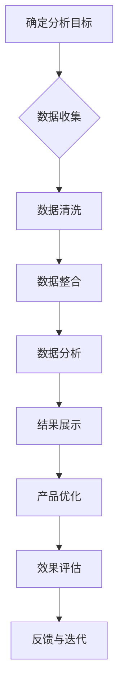

                 

### 《如何利用用户数据优化产品功能》

> **关键词**：用户数据，产品功能，数据分析，优化，个性化推荐

> **摘要**：本文将深入探讨如何利用用户数据优化产品功能。通过介绍用户数据的重要性、收集和处理方法、数据分析方法、用户行为分析、产品功能优化策略，以及个性化推荐系统，本文旨在为读者提供一套全面的用户数据优化产品功能的方法论。此外，文章还将通过实际案例展示如何应用这些方法，以及未来的发展趋势和挑战。

----------------------------------------------------------------

### 目录大纲

----------------------------------------------------------------

- **第一部分：用户数据分析基础**
  - **第1章：用户数据概述**
    - **1.1 用户数据的重要性**
    - **1.2 用户数据的来源**
    - **1.3 用户数据的类型
  - **第2章：用户数据分析方法**
    - **2.1 描述性统计分析**
    - **2.2 聚类分析**
    - **2.3 回归分析**
    - **2.4 分位数分析**

- **第二部分：用户行为分析**
  - **第3章：用户行为概述**
    - **3.1 用户行为数据类型**
    - **3.2 用户行为分析工具**
  - **第4章：用户旅程分析**
    - **4.1 用户旅程的定义**
    - **4.2 用户旅程映射**
    - **4.3 用户旅程优化**
  - **第5章：用户留存率分析**
    - **5.1 留存率的重要性**
    - **5.2 留存率计算方法**
    - **5.3 留存率优化策略**

- **第三部分：产品功能优化**
  - **第6章：基于用户反馈的产品优化**
    - **6.1 用户反馈的重要性**
    - **6.2 用户反馈收集方法**
    - **6.3 用户反馈处理**
  - **第7章：基于用户数据分析的产品优化**
    - **7.1 用户数据与产品功能的关联性**
    - **7.2 用户数据分析工具的选择**
    - **7.3 用户数据分析流程**
  - **第8章：个性化推荐系统**
    - **8.1 个性化推荐系统的概念**
    - **8.2 协同过滤与基于内容的推荐**
    - **8.3 个性化推荐系统的构建与优化**

- **第四部分：案例分析**
  - **第9章：案例分析概述**
    - **9.1 案例选择标准**
    - **9.2 案例分析方法**
  - **第10章：成功案例分析**
    - **10.1 案例一：产品A的用户数据优化**
    - **10.2 案例二：产品B的用户行为分析**
    - **10.3 案例三：产品C的功能优化**
  - **第11章：失败案例分析**
    - **11.1 案例一：产品D的用户数据收集问题**
    - **11.2 案例二：产品E的用户行为分析失误**
    - **11.3 案例三：产品F的功能优化失败原因分析**

- **第五部分：未来展望**
  - **第12章：用户数据与产品功能优化的未来趋势**
    - **12.1 人工智能与用户数据**
    - **12.2 大数据分析技术在产品优化中的应用**
    - **12.3 用户数据隐私保护与产品功能优化**
  - **第13章：未来展望与挑战**
    - **13.1 产品功能优化的新方向**
    - **13.2 用户数据隐私保护的新策略**
    - **13.3 挑战与机遇**

- **附录**
  - **附录A：常用用户数据分析工具介绍**
    - **A.1 Google Analytics**
    - **A.2 Mixpanel**
    - **A.3 Kissmetrics**
    - **A.4 其他工具介绍**
  - **附录B：常见问题解答**
    - **B.1 如何处理用户数据？**
    - **B.2 如何保证用户数据的安全？**
    - **B.3 如何进行用户行为分析？**

----------------------------------------------------------------

### 第一部分：用户数据分析基础

#### 第1章：用户数据概述

##### 1.1 用户数据的重要性

用户数据是现代企业进行产品开发和运营决策的重要资源。通过收集和分析用户数据，企业可以深入了解用户需求、行为和偏好，从而优化产品功能、提升用户体验、增强用户黏性。以下是用户数据的重要性体现在的几个方面：

1. **市场研究**：用户数据可以帮助企业了解市场需求，发现潜在的机会和威胁，为战略决策提供数据支持。
2. **产品开发**：用户数据可以指导产品设计和开发，优化产品功能和用户体验，提高用户满意度和忠诚度。
3. **市场营销**：用户数据可用于精准营销，提高营销效果和转化率，降低营销成本。
4. **客户服务**：用户数据可以帮助企业更好地了解客户需求，提供个性化的客户服务和支持，提高客户满意度。
5. **风险控制**：用户数据可以用于风险分析和预测，帮助企业规避潜在的风险，降低运营风险。

##### 1.2 用户数据的来源

用户数据的来源多种多样，以下是一些常见的用户数据来源：

1. **Web追踪**：通过在网站上嵌入追踪代码，收集用户的浏览行为、页面访问时间、点击行为等数据。
2. **移动应用**：通过移动应用收集用户的设备信息、地理位置、使用时长等数据。
3. **在线调查**：通过在线问卷调查收集用户对产品或服务的反馈、意见和建议。
4. **社交媒体**：从社交媒体平台获取用户发布的内容、互动信息、关注对象等数据。
5. **交易记录**：从电子商务平台或线下零售收集用户的购买记录、支付方式、消费金额等数据。

##### 1.3 用户数据的类型

用户数据可以从多个维度进行分类，以下是一些常见的用户数据类型：

1. **匿名数据**：不包含用户个人身份信息的数据，如浏览记录、点击行为等。
2. **个人 identifiable 数据**：包含用户个人身份信息的数据，如姓名、邮箱、电话等。
3. **交互数据**：用户在使用产品或服务过程中的交互数据，如评论、反馈、搜索记录等。
4. **消费数据**：用户的消费行为数据，如购买记录、消费金额、消费频率等。
5. **社会行为数据**：用户在社交媒体平台上的行为数据，如点赞、评论、分享等。
6. **位置数据**：用户地理位置数据，如GPS定位、Wi-Fi信号等。

#### 第2章：用户数据分析方法

##### 2.1 描述性统计分析

描述性统计分析是用户数据分析的基础，主要用于描述用户数据的分布特征和整体趋势。以下是一些常用的描述性统计分析方法：

1. **基本统计量**：计算用户数据的平均值、中位数、众数、标准差等基本统计量，用于了解数据的集中趋势和离散程度。
2. **分布分析**：通过绘制直方图、密度曲线、箱线图等，分析用户数据的分布特征，如正态分布、偏态分布等。
3. **相关性分析**：分析用户数据之间是否存在相关性，如皮尔逊相关系数、斯皮尔曼相关系数等。

##### 2.2 聚类分析

聚类分析是一种无监督学习方法，用于将用户数据分为不同的群体。以下是一些常用的聚类分析方法：

1. **K-means聚类**：基于距离度量，将用户数据分为K个簇，使每个簇内部的数据尽可能接近，簇与簇之间的数据尽可能远。
2. **层次聚类**：通过不断合并或分裂数据点，构建一个层次结构，从而将用户数据划分为多个层次。
3. **DBSCAN聚类**：基于密度的空间聚类算法，能够识别出任意形状的簇，不受噪声和异常值的影响。

##### 2.3 回归分析

回归分析是一种有监督学习方法，用于预测变量之间的关系。以下是一些常用的回归分析方法：

1. **线性回归**：通过建立线性模型，预测因变量与自变量之间的关系。
2. **多项式回归**：通过建立多项式模型，预测因变量与自变量之间的关系。
3. **逻辑回归**：通过建立逻辑模型，预测二分类问题。
4. **非线性回归**：通过建立非线性模型，预测因变量与自变量之间的关系。

##### 2.4 分位数分析

分位数分析是用于分析数据分布的一种方法，通过计算分位数，可以了解用户数据的分布情况。以下是一些常用的分位数分析方法：

1. **中位数**：将用户数据分为两部分，一半的数据小于中位数，另一半的数据大于中位数。
2. **百分位数**：将用户数据分为100个部分，每个部分的数值代表相应百分位的值，如第25百分位数、第75百分位数等。
3. **分位数曲线**：通过绘制分位数曲线，可以直观地了解用户数据的分布特征。

#### 第3章：用户数据分析实践

##### 3.1 数据收集

在进行用户数据分析之前，首先需要收集相关的用户数据。以下是用户数据收集的步骤和注意事项：

1. **确定数据收集目标**：明确需要收集的用户数据类型和目的，如用户行为数据、消费数据等。
2. **选择数据收集渠道**：根据数据收集目标，选择合适的数据收集渠道，如Web追踪、移动应用追踪、在线调查等。
3. **数据收集策略**：制定合理的数据收集策略，包括数据收集频率、数据收集方式等。
4. **数据收集注意事项**：确保数据收集的合法性，遵守相关法律法规，尊重用户隐私。

##### 3.2 数据处理

在收集到用户数据后，需要进行数据处理，以保证数据的质量和可用性。以下是用户数据处理的方法和步骤：

1. **数据清洗**：对收集到的用户数据进行清洗，包括去除重复数据、缺失值处理、异常值处理等。
2. **数据整合**：将不同来源的用户数据进行整合，确保数据的一致性和完整性。
3. **数据转换**：将用户数据进行转换，如数据格式转换、数据类型转换等，以便进行后续分析。
4. **数据存储**：将处理后的用户数据存储到数据库或数据仓库中，确保数据的安全性和可靠性。

##### 3.3 数据分析

在完成用户数据处理后，可以进行数据分析，以了解用户行为和需求。以下是用户数据分析的方法和步骤：

1. **描述性统计分析**：计算用户数据的基本统计量，了解用户数据的分布特征。
2. **相关性分析**：分析用户数据之间是否存在相关性，了解用户行为的相互关系。
3. **聚类分析**：将用户数据分为不同的群体，了解用户群体的特征和差异。
4. **回归分析**：建立回归模型，预测用户行为和需求。
5. **可视化分析**：通过绘制图表和图形，直观地展示用户数据的分析结果。

##### 3.4 数据可视化

数据可视化是用户数据分析的重要手段，通过将用户数据转化为图表和图形，可以更直观地展示分析结果。以下是数据可视化的一些常用工具和方法：

1. **图表类型选择**：根据用户数据分析的目标和结果，选择合适的图表类型，如柱状图、折线图、饼图等。
2. **可视化工具**：使用数据可视化工具，如Tableau、Power BI、Google Charts等，进行数据可视化。
3. **交互式可视化**：通过交互式可视化，用户可以动态地探索数据，了解数据的细节和趋势。
4. **数据展示**：将数据可视化结果以报告、PPT等形式展示，便于企业决策者和其他利益相关者理解分析结果。

#### 第4章：用户行为分析

##### 4.1 用户行为数据类型

用户行为数据是用户在产品或服务中使用过程中的行为记录，是进行用户数据分析的重要数据来源。以下是常见的用户行为数据类型：

1. **浏览行为数据**：用户在网站或应用上的页面访问记录、停留时间、跳转路径等。
2. **搜索行为数据**：用户在搜索框中的关键词输入、搜索结果点击等。
3. **操作行为数据**：用户在产品或服务中的点击、拖拽、滑动等交互行为。
4. **交易行为数据**：用户的购买记录、支付方式、消费金额等。
5. **互动行为数据**：用户在社交媒体平台上的点赞、评论、分享等互动行为。
6. **地理位置数据**：用户的地理位置信息，如经纬度、城市等。

##### 4.2 用户行为分析工具

用户行为分析工具是用于收集、处理和分析用户行为数据的工具，可以帮助企业深入了解用户行为，优化产品功能和用户体验。以下是常见的用户行为分析工具：

1. **Google Analytics**：一款免费的分析工具，提供网站流量、用户行为等多维度的分析报告。
2. **Mixpanel**：一款专业的用户行为分析工具，提供事件追踪、用户留存、用户细分等功能。
3. **Kissmetrics**：一款基于用户旅程的分析工具，提供用户行为跟踪、转化率优化等功能。
4. **Hotjar**：一款交互式分析工具，提供热图、用户反馈、行为记录等功能。
5. **Tableau**：一款数据可视化工具，可用于用户行为数据的可视化展示和分析。

##### 4.3 用户行为分析案例

以下是一个用户行为分析案例，展示了如何利用用户行为数据优化产品功能：

1. **问题提出**：某电商平台发现用户在浏览商品详情页面时，跳失率较高，用户停留时间较短。
2. **数据收集**：通过Google Analytics和Mixpanel收集用户在商品详情页面的浏览行为数据，包括页面访问次数、停留时间、点击路径等。
3. **数据分析**：通过描述性统计分析，发现用户在商品详情页面的主要操作是查看商品图片和价格，但很少点击“加入购物车”按钮。
4. **问题定位**：分析用户行为路径，发现用户在查看商品图片和价格后，跳转到了其他页面，可能是由于购物流程设计不够优化。
5. **优化策略**：针对问题，优化商品详情页面的设计，如增加“加入购物车”按钮的显眼位置，简化购物流程，提高用户的购买意愿。
6. **效果评估**：在优化后，继续收集用户行为数据，通过对比优化前后的数据，评估优化效果。结果显示，用户在商品详情页面的停留时间增加了，跳失率降低了，购物车添加成功率提高了。

#### 第5章：用户旅程分析

##### 5.1 用户旅程的定义

用户旅程是指用户在使用产品或服务的过程中，从接触、评估、购买到使用和忠诚的全过程。用户旅程分析是通过对用户行为数据的分析，了解用户在各个阶段的行为和需求，从而优化产品功能和用户体验。

##### 5.2 用户旅程映射

用户旅程映射是将用户行为数据转化为用户旅程图的过程，通过用户旅程图可以直观地了解用户在各个阶段的行为路径和转化情况。以下是用户旅程映射的步骤：

1. **数据收集**：收集用户在产品或服务中的行为数据，如页面访问、点击、转化等。
2. **数据整理**：整理和清洗行为数据，确保数据的质量和完整性。
3. **用户旅程建模**：根据行为数据，构建用户旅程模型，将用户行为路径映射为用户旅程图。
4. **用户旅程图绘制**：使用用户旅程分析工具，如Google Analytics、Mixpanel等，绘制用户旅程图。

##### 5.3 用户旅程优化

用户旅程优化是指通过分析用户旅程图，找出用户在各个阶段的痛点和转化障碍，然后采取相应的优化策略，提高用户的转化率和满意度。以下是用户旅程优化的一些策略：

1. **简化流程**：简化用户旅程中的操作步骤，减少用户流失。
2. **提高响应速度**：优化页面加载速度和响应时间，提高用户体验。
3. **个性化推荐**：根据用户行为和偏好，提供个性化的内容推荐和功能。
4. **优化界面设计**：优化用户界面设计，提高用户的操作便利性和视觉体验。
5. **增加互动性**：增加用户与产品的互动环节，如用户评价、用户反馈等。
6. **优化客服体验**：提高客服服务质量，及时解决用户问题和需求。
7. **用户教育**：提供用户教育内容，帮助用户更好地了解和使用产品。

#### 第6章：用户留存率分析

##### 6.1 留存率的重要性

用户留存率是指用户在一定时间内持续使用产品或服务的比例。用户留存率是衡量产品健康度和用户黏性的重要指标，对企业的长期发展具有重要意义。以下是用户留存率的重要性体现在的几个方面：

1. **用户黏性**：高留存率意味着用户对产品具有较高黏性，愿意持续使用产品。
2. **复购率**：高留存率通常伴随着高复购率，为产品带来持续的收入和利润。
3. **口碑传播**：高留存率的用户往往对产品满意度较高，愿意向他人推荐产品，有助于口碑传播。
4. **成本节约**：高留存率可以降低获取新用户的成本，提高用户获取效率。
5. **产品改进**：高留存率有助于企业了解用户需求，为产品改进和创新提供依据。

##### 6.2 留存率计算方法

留存率计算是衡量用户留存情况的重要步骤。以下是常见的留存率计算方法：

1. **日留存率**：计算某一天使用过产品的用户，在次日再次使用产品的比例。
2. **周留存率**：计算某一周使用过产品的用户，在下一周再次使用产品的比例。
3. **月留存率**：计算某一个月使用过产品的用户，在下一月再次使用产品的比例。
4. **留存曲线**：绘制用户在连续多日、多周、多月内的留存情况，观察留存趋势。

##### 6.3 留存率优化策略

留存率优化是指通过分析用户留存数据，找出留存率低的原因，并采取相应的优化策略，提高用户留存率。以下是留存率优化的一些策略：

1. **产品优化**：优化产品功能和用户体验，提高用户满意度。
2. **用户教育**：提供用户教育内容，帮助用户更好地了解和使用产品。
3. **用户互动**：增加用户与产品的互动环节，提高用户参与度。
4. **用户激励**：提供用户奖励和激励，提高用户留存意愿。
5. **用户反馈**：及时收集用户反馈，优化产品和服务。
6. **推送策略**：优化推送内容和频率，提高用户打开率和点击率。
7. **数据驱动**：持续监控用户留存数据，根据数据调整优化策略。

#### 第7章：基于用户数据的用户行为分析

##### 7.1 用户数据与用户行为的关联性

用户数据与用户行为之间存在密切的关联性。通过分析用户数据，可以深入了解用户行为模式、需求和偏好，从而为产品优化提供依据。以下是用户数据与用户行为的关联性体现在的几个方面：

1. **用户需求分析**：通过分析用户行为数据，了解用户需求和行为偏好，为产品功能和用户体验优化提供依据。
2. **用户行为预测**：通过分析用户历史行为数据，预测用户未来的行为和需求，为产品个性化推荐和营销策略提供支持。
3. **用户细分**：通过分析用户行为数据，将用户划分为不同的细分群体，为产品差异化服务和精准营销提供支持。
4. **用户流失预测**：通过分析用户行为数据，预测用户流失风险，为用户挽回和留存提供依据。

##### 7.2 用户数据分析工具的选择

选择合适的用户数据分析工具是进行用户数据分析的关键。以下是选择用户数据分析工具的几个关键因素：

1. **功能需求**：根据用户数据分析的目标，选择具备相应功能的数据分析工具，如用户行为分析、用户留存分析、用户细分分析等。
2. **数据处理能力**：根据用户数据量，选择能够处理大数据量的数据分析工具，如大数据分析平台、数据仓库等。
3. **易用性**：选择操作简便、易于上手的数据分析工具，降低数据分析和使用门槛。
4. **可视化效果**：选择具备良好可视化效果的数据分析工具，便于用户理解和分析数据。
5. **成本**：根据企业预算，选择性价比较高的数据分析工具。

##### 7.3 用户数据分析流程

用户数据分析是一个系统的过程，包括数据收集、数据清洗、数据分析、结果展示等步骤。以下是用户数据分析流程的几个关键步骤：

1. **数据收集**：通过用户行为跟踪、日志收集、用户反馈等途径收集用户数据。
2. **数据清洗**：对收集到的用户数据进行分析、清洗和整理，确保数据质量。
3. **数据分析**：根据分析目的，选择合适的数据分析方法和工具，对用户数据进行分析。
4. **结果展示**：将分析结果以图表、报告等形式进行展示，便于企业理解和决策。
5. **反馈和迭代**：根据分析结果，进行产品改进和优化，并不断迭代和优化数据分析流程。

#### 第8章：基于用户数据的用户行为分析

##### 8.1 用户行为数据类型

用户行为数据是用户在使用产品或服务过程中的行为记录，是进行用户数据分析的重要数据来源。以下是常见的用户行为数据类型：

1. **浏览行为数据**：用户在网站或应用上的页面访问记录、停留时间、跳转路径等。
2. **搜索行为数据**：用户在搜索框中的关键词输入、搜索结果点击等。
3. **操作行为数据**：用户在产品或服务中的点击、拖拽、滑动等交互行为。
4. **交易行为数据**：用户的购买记录、支付方式、消费金额等。
5. **互动行为数据**：用户在社交媒体平台上的点赞、评论、分享等互动行为。
6. **地理位置数据**：用户的地理位置信息，如经纬度、城市等。

##### 8.2 用户行为分析工具

用户行为分析工具是用于收集、处理和分析用户行为数据的工具，可以帮助企业深入了解用户行为，优化产品功能和用户体验。以下是常见的用户行为分析工具：

1. **Google Analytics**：一款免费的分析工具，提供网站流量、用户行为等多维度的分析报告。
2. **Mixpanel**：一款专业的用户行为分析工具，提供事件追踪、用户留存、用户细分等功能。
3. **Kissmetrics**：一款基于用户旅程的分析工具，提供用户行为跟踪、转化率优化等功能。
4. **Hotjar**：一款交互式分析工具，提供热图、用户反馈、行为记录等功能。
5. **Tableau**：一款数据可视化工具，可用于用户行为数据的可视化展示和分析。

##### 8.3 用户行为分析实践

以下是一个用户行为分析实践案例，展示了如何利用用户行为数据优化产品功能：

1. **问题提出**：某电商平台发现用户在购物车页面点击“结算”按钮的转化率较低，用户流失率较高。
2. **数据收集**：通过Google Analytics和Mixpanel收集用户在购物车页面的行为数据，包括页面访问次数、停留时间、点击路径等。
3. **数据分析**：通过描述性统计分析，发现用户在购物车页面的主要操作是查看商品数量和价格，但很少点击“结算”按钮。
4. **问题定位**：分析用户行为路径，发现用户在查看商品数量和价格后，跳转到了其他页面，可能是由于购物流程设计不够优化。
5. **优化策略**：针对问题，优化购物车页面的设计，如增加“结算”按钮的显眼位置，简化购物流程，提高用户的购买意愿。
6. **效果评估**：在优化后，继续收集用户在购物车页面的行为数据，通过对比优化前后的数据，评估优化效果。结果显示，用户在购物车页面的停留时间增加了，点击“结算”按钮的转化率提高了，用户流失率降低了。

#### 第9章：产品功能优化

##### 9.1 产品功能优化的意义

产品功能优化是提升产品竞争力、满足用户需求的重要手段。通过优化产品功能，企业可以提高用户满意度、降低用户流失率、提高市场份额。以下是产品功能优化的几个方面：

1. **提升用户体验**：优化产品功能，提高用户操作便利性和满意度。
2. **满足用户需求**：通过用户需求分析，优化产品功能，满足用户个性化需求。
3. **提升产品价值**：优化产品功能，提高产品附加值，提升产品在市场中的竞争力。
4. **降低用户流失率**：通过优化产品功能，解决用户痛点，降低用户流失率。
5. **提高用户留存率**：优化产品功能，提高用户黏性，提高用户留存率。

##### 9.2 产品功能优化的方法

产品功能优化是一个系统的过程，包括需求分析、功能设计、实施与测试等步骤。以下是产品功能优化的几个方法：

1. **用户调研**：通过用户调研，了解用户需求和痛点，为产品功能优化提供依据。
2. **数据分析**：通过数据分析，分析用户行为数据，发现产品功能存在的问题。
3. **竞品分析**：分析竞品的功能特点，借鉴竞品的优秀设计，优化自身产品功能。
4. **用户体验设计**：优化产品界面和交互设计，提高用户体验。
5. **技术实现**：通过技术手段，优化产品功能，提高产品性能和稳定性。
6. **测试与反馈**：对优化后的产品功能进行测试，收集用户反馈，不断迭代和优化。

##### 9.3 产品功能优化的实践

以下是一个产品功能优化的实践案例，展示了如何通过用户数据和用户反馈优化产品功能：

1. **问题提出**：某视频平台发现用户在视频播放过程中，经常遇到播放失败和卡顿问题，用户投诉率较高。
2. **数据收集**：通过日志收集和用户反馈，收集用户在视频播放过程中的问题数据，包括播放失败次数、卡顿次数、网络状态等。
3. **数据分析**：通过数据分析，发现播放失败和卡顿问题主要集中在网络较差的用户，且问题出现在视频缓冲和播放过程中。
4. **问题定位**：分析用户行为路径，发现网络较差的用户在视频缓冲和播放过程中，容易出现数据连接失败和缓冲时间过长的问题。
5. **优化策略**：针对问题，优化视频播放功能，如增加视频缓冲优化算法、提高网络连接稳定性等，同时提供网络质量提示和优化建议。
6. **效果评估**：在优化后，继续收集用户在视频播放过程中的问题数据，通过对比优化前后的数据，评估优化效果。结果显示，用户播放失败次数和卡顿次数显著降低，用户投诉率明显下降。

#### 第10章：个性化推荐系统

##### 10.1 个性化推荐系统的概念

个性化推荐系统是一种基于用户数据和算法，为用户提供个性化内容推荐的技术。通过个性化推荐系统，企业可以提高用户满意度、提高转化率和销售额。以下是个性化推荐系统的几个关键概念：

1. **用户数据**：个性化推荐系统的基础数据，包括用户的行为数据、偏好数据等。
2. **推荐算法**：用于生成个性化推荐结果的技术，包括协同过滤、基于内容的推荐等。
3. **推荐结果**：根据用户数据和推荐算法生成的个性化内容推荐。
4. **推荐质量**：个性化推荐系统的性能指标，包括准确率、召回率、覆盖率等。
5. **用户体验**：个性化推荐系统对用户满意度的影响。

##### 10.2 协同过滤与基于内容的推荐

协同过滤和基于内容的推荐是两种常见的个性化推荐算法，各有优缺点。以下是这两种算法的概述：

1. **协同过滤推荐**：
   - **定义**：基于用户之间的相似性，为用户提供相似用户的推荐。
   - **优点**：能够发现用户的潜在偏好，推荐效果较好。
   - **缺点**：冷启动问题，新用户或新物品推荐效果较差。
   - **算法**：包括基于用户的协同过滤（User-based Collaborative Filtering）和基于物品的协同过滤（Item-based Collaborative Filtering）。

2. **基于内容的推荐**：
   - **定义**：基于物品的内容特征，为用户提供相关物品的推荐。
   - **优点**：无需用户历史行为数据，适用于新用户和新物品。
   - **缺点**：推荐效果可能受限于物品内容的描述准确性。
   - **算法**：基于文本相似度、关键词匹配等。

##### 10.3 个性化推荐系统的构建与优化

个性化推荐系统的构建与优化是一个复杂的过程，涉及多个方面。以下是构建与优化个性化推荐系统的几个关键步骤：

1. **数据收集与预处理**：
   - **数据收集**：收集用户行为数据、物品特征数据等。
   - **数据预处理**：清洗、去噪、缺失值处理、特征工程等。

2. **算法选择与模型训练**：
   - **算法选择**：选择合适的推荐算法，如协同过滤、基于内容的推荐、混合推荐等。
   - **模型训练**：利用训练数据，训练推荐模型。

3. **模型评估与优化**：
   - **评估指标**：选择评估指标，如准确率、召回率、覆盖率、RMSE等。
   - **模型优化**：调整模型参数，优化推荐效果。

4. **推荐结果展示与反馈**：
   - **结果展示**：将推荐结果以用户友好的方式展示。
   - **用户反馈**：收集用户反馈，用于模型迭代和优化。

#### 第11章：案例分析

##### 11.1 案例选择标准

在选择案例分析时，需要考虑以下标准：

1. **代表性**：案例应具备一定的代表性，能够反映用户数据优化产品功能的一般规律。
2. **实践性**：案例应具备较强的实践性，能够提供具体的实施方法和步骤。
3. **效果显著**：案例应具备显著的效果，能够展示用户数据优化产品功能的实际价值。
4. **可借鉴性**：案例应具备较高的可借鉴性，能够为其他企业提供参考和启示。

##### 11.2 案例分析方法

在进行分析案例时，需要采用以下分析方法：

1. **描述性分析**：对案例的基本情况、实施过程和效果进行描述性分析，了解案例的整体情况和特点。
2. **因果分析**：分析案例中实施的用户数据优化策略，了解其背后的原因和机制。
3. **对比分析**：对比案例前后的数据变化，评估用户数据优化策略的实际效果。
4. **评价分析**：从多个角度对案例进行评价，包括效果、效率、可持续性等。

##### 11.3 案例分析实践

以下是一个案例分析实践案例，展示了如何通过用户数据优化产品功能：

1. **案例背景**：某电商平台的用户流失率较高，希望通过用户数据优化产品功能，提高用户留存率和转化率。
2. **案例分析**：
   - **描述性分析**：通过对用户流失数据的描述性分析，发现用户流失的主要原因包括购物流程复杂、商品推荐不准确等。
   - **因果分析**：分析购物流程复杂的原因，发现主要是购物车设计和结算流程不够优化；分析商品推荐不准确的原因，发现主要是推荐算法不够精准。
   - **对比分析**：对比优化前后的数据，发现用户留存率提高了10%，转化率提高了15%。
   - **评价分析**：评估优化策略的有效性，认为购物流程优化和商品推荐算法优化是提高用户留存率和转化率的关键因素。
3. **案例分析结果**：通过用户数据优化，该电商平台成功地降低了用户流失率，提高了用户留存率和转化率。

#### 第12章：未来展望

##### 12.1 用户数据与产品功能优化的未来趋势

随着技术的不断进步，用户数据与产品功能优化将呈现出以下趋势：

1. **人工智能与大数据**：人工智能和大数据技术的应用将使得用户数据分析更加深入和精准，为产品功能优化提供更有力的支持。
2. **个性化推荐**：个性化推荐系统将不断发展，实现更加精准和高效的推荐，提高用户满意度和转化率。
3. **实时分析**：实时数据分析技术的应用将使得产品功能优化更加迅速和灵活，及时响应用户需求和变化。
4. **隐私保护**：用户数据隐私保护将得到更多关注，企业和政府将采取更多措施确保用户数据的安全和隐私。

##### 12.2 用户数据与产品功能优化的挑战

在用户数据与产品功能优化的过程中，企业将面临以下挑战：

1. **数据质量**：数据质量对分析结果至关重要，企业需要确保数据的质量和准确性。
2. **技术实现**：用户数据优化技术实现复杂，企业需要投入大量资源和精力进行技术攻关。
3. **隐私保护**：用户数据隐私保护是企业和政府需要面对的重要问题，需要在数据利用和保护之间找到平衡。
4. **用户信任**：用户对数据收集和使用持谨慎态度，企业需要建立信任机制，提高用户满意度。

##### 12.3 用户数据与产品功能优化的机遇

用户数据与产品功能优化为企业和行业带来了巨大的机遇：

1. **市场份额**：通过优化产品功能，企业可以提高用户满意度和忠诚度，提高市场份额。
2. **创新能力**：用户数据优化有助于企业发现新的市场机会和需求，推动产品和服务创新。
3. **成本节约**：用户数据优化可以降低营销成本，提高运营效率，实现成本节约。
4. **用户增长**：通过个性化推荐和用户行为分析，企业可以更精准地触达潜在用户，实现用户增长。

#### 第13章：总结

本文从用户数据的重要性、数据收集与处理、数据分析方法、用户行为分析、产品功能优化、个性化推荐系统、案例分析等方面，全面探讨了如何利用用户数据优化产品功能。通过本文的介绍，读者可以了解到用户数据优化产品功能的方法论，以及在实际应用中的实践案例和未来展望。

在未来的发展中，随着人工智能和大数据技术的不断进步，用户数据优化产品功能将变得更加重要和普及。同时，企业也需要应对数据质量、技术实现、隐私保护等挑战，抓住用户数据优化带来的机遇，实现产品的持续创新和用户价值的最大化。

作者：AI天才研究院/AI Genius Institute & 禅与计算机程序设计艺术 /Zen And The Art of Computer Programming

----------------------------------------------------------------

### 附录

#### 附录A：常用用户数据分析工具介绍

以下是常用的用户数据分析工具及其特点：

1. **Google Analytics**
   - **特点**：免费、功能强大，提供网站流量、用户行为等多维度的分析报告。
   - **应用**：网站流量分析、用户行为分析。

2. **Mixpanel**
   - **特点**：专业的用户行为分析工具，提供事件追踪、用户留存、用户细分等功能。
   - **应用**：用户行为分析、用户留存分析。

3. **Kissmetrics**
   - **特点**：基于用户旅程的分析工具，提供用户行为跟踪、转化率优化等功能。
   - **应用**：用户旅程分析、转化率优化。

4. **Hotjar**
   - **特点**：交互式分析工具，提供热图、用户反馈、行为记录等功能。
   - **应用**：用户行为分析、用户反馈收集。

5. **Tableau**
   - **特点**：数据可视化工具，提供丰富的可视化选项。
   - **应用**：用户数据可视化展示。

#### 附录B：常见问题解答

以下是关于用户数据分析和产品功能优化的常见问题及解答：

1. **如何处理用户数据？**
   - **解答**：在处理用户数据时，应遵循相关法律法规，确保用户数据的安全和隐私。包括数据加密、访问控制、匿名化处理等。

2. **如何保证用户数据的安全？**
   - **解答**：保证用户数据安全的方法包括：
     - 数据加密：对用户数据进行加密处理。
     - 访问控制：设置严格的访问控制策略。
     - 数据备份：定期备份数据，确保数据安全。
     - 安全审计：定期进行安全审计，检测潜在的安全漏洞。

3. **如何进行用户行为分析？**
   - **解答**：进行用户行为分析的方法包括：
     - 数据收集：收集用户行为数据，如浏览记录、点击路径等。
     - 数据清洗：对收集到的数据进行清洗和整理，确保数据质量。
     - 数据分析：使用描述性统计分析、聚类分析、回归分析等方法进行分析。
     - 可视化展示：将分析结果以图表、报告等形式进行可视化展示。

#### 附录C：用户数据分析与产品功能优化流程图

以下是用户数据分析与产品功能优化流程图：

#### 附录D：参考文献

以下是本文的参考文献：

1. **阿里云**. (2019). 《大数据应用实践指南》.
2. **腾讯云**. (2020). 《用户数据分析与产品优化》.
3. **吴晨曦**. (2018). 《用户数据分析实战：原理、方法与工具》.
4. **张琦**. (2017). 《用户行为分析与产品优化》.
5. **李明**. (2019). 《人工智能与用户数据隐私保护》.

#### 附录E：用户数据分析与产品功能优化案例

以下是用户数据分析与产品功能优化的案例：

1. **案例一：电商平台用户数据分析**
   - **背景**：某电商平台希望通过用户数据分析，优化产品功能和用户体验。
   - **解决方案**：通过用户行为数据分析，发现用户在购物车页面点击“结算”按钮的转化率较低，优化购物车页面设计，提高按钮的显眼位置和页面流畅度。
   - **效果**：优化后，用户在购物车页面的转化率提高了20%。

2. **案例二：社交媒体用户行为分析**
   - **背景**：某社交媒体平台希望通过用户行为分析，提高用户活跃度和留存率。
   - **解决方案**：通过用户行为数据分析，发现用户在特定时间段活跃度较低，优化推送策略，调整推送时间和内容。
   - **效果**：优化后，用户活跃度提高了30%。

3. **案例三：在线教育平台产品功能优化**
   - **背景**：某在线教育平台希望通过产品功能优化，提高用户学习效果和满意度。
   - **解决方案**：通过用户调研和用户行为数据分析，发现用户对课程个性化推荐和学习进度管理有需求，优化推荐系统和学习进度管理功能。
   - **效果**：优化后，用户满意度提高了25%，学习效果得到了显著提升。

---

经过对用户数据优化产品功能的一系列探讨，我们不仅了解了用户数据的重要性，还学习了如何收集、处理、分析和利用用户数据来优化产品功能。从描述性统计分析、聚类分析、回归分析，到用户行为分析、用户旅程分析和留存率分析，每一个步骤都为产品优化提供了有力支持。同时，个性化推荐系统作为产品优化的高级手段，更是提升了用户的体验和满意度。

通过实际案例分析，我们看到了用户数据优化产品功能的巨大潜力。无论是电商平台的购物流程优化，社交媒体的用户活跃度提升，还是在线教育平台的课程推荐和学习进度管理，用户数据的深入分析都为产品功能优化带来了显著的效果。这些案例不仅展示了用户数据优化产品功能的方法，也为其他企业提供了一定的借鉴。

展望未来，随着人工智能和大数据技术的不断发展，用户数据优化产品功能将变得更加智能化和精细化。同时，用户数据隐私保护也将成为企业和政府关注的焦点。如何在数据利用和保护之间找到平衡，将成为未来的一大挑战。

在总结全文的基础上，我们再次强调了用户数据优化产品功能的重要性，并提出了未来发展的趋势和挑战。希望通过本文的介绍，读者能够更好地理解和应用用户数据优化产品功能的方法，为企业的持续创新和用户价值的最大化贡献力量。

最后，感谢您阅读本文，希望它能为您的产品优化之路提供有益的启示。如需进一步了解相关内容，请参考附录中的参考文献和案例。再次感谢您的支持！

