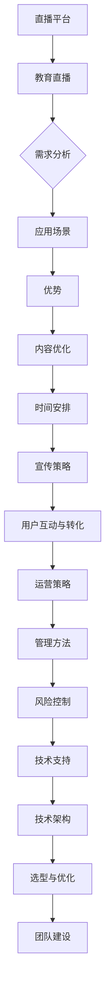

                 

### 《如何利用直播平台提升课程销量》

关键词：直播平台、课程销量、教育直播、互动功能、优化策略、运营技巧、案例分析

摘要：
本文将深入探讨如何利用直播平台提升课程销量。通过分析直播平台的发展与趋势，结合直播平台与教育的结合点，我们将详细解析直播平台的功能与优化策略。同时，通过实际案例和代码解读，为读者提供实用的直播平台运营和管理技巧，帮助教育机构在竞争激烈的市场中脱颖而出。

### 第一部分：直播平台概述

#### 第1章：直播平台的发展与趋势

##### 1.1 直播平台的基本概念

直播平台，是指通过互联网技术，实现实时音频和视频传输的在线平台。它允许用户通过直播形式观看各种内容，包括娱乐、教育、新闻、体育等。随着互联网技术的发展，直播平台逐渐成为人们获取信息、互动交流的重要渠道。

##### 1.2 直播平台的商业模式

直播平台的商业模式主要包括广告收入、虚拟礼物、会员订阅、付费课程等。其中，广告收入和虚拟礼物是目前最主要的盈利模式。用户通过购买虚拟礼物支持主播，主播则根据虚拟礼物的数量和用户互动情况获得收益。

##### 1.3 直播平台的发展趋势

随着5G技术的普及和移动互联网的快速发展，直播平台正迎来新一轮的发展机遇。未来，直播平台将向多元化、个性化、智能化方向发展，为用户提供更加丰富的直播内容和更加便捷的互动体验。

#### 第2章：直播平台与教育的结合

##### 2.1 教育直播的需求分析

教育直播的出现，满足了用户对便捷、高效、互动的学习需求。尤其是在疫情期间，教育直播成为替代传统课堂教学的重要手段。教育直播的需求分析，主要包括学习者需求、教育机构需求和社会需求。

##### 2.2 直播平台在教育中的应用场景

直播平台在教育中的应用场景广泛，包括课程直播、讲座直播、公开课直播、线上辅导等。通过直播平台，教育机构可以打破地域限制，为学生提供多样化的学习资源和服务。

##### 2.3 直播平台在教育中的优势

直播平台在教育中的优势主要体现在以下几个方面：

1. **实时互动**：直播平台支持实时互动，教师和学生可以实时交流，提高学习效果。
2. **内容丰富**：直播平台可以提供丰富的教学内容，包括视频、音频、PPT等，满足不同学习者的需求。
3. **便捷性**：直播平台可以随时随地观看，为学生提供更加灵活的学习方式。

### 第二部分：直播平台功能与优化

#### 第3章：直播平台功能详解

##### 3.1 直播系统架构

直播系统架构主要包括前端、后端和数据库。前端负责用户界面和交互，后端负责处理业务逻辑和数据存储，数据库则用于存储用户数据、课程数据等。

##### 3.2 直播内容生产与发布

直播内容生产与发布，是指主播通过直播平台进行内容创作和发布的过程。这个过程包括内容制作、内容审核、内容发布等环节。

##### 3.3 直播互动功能

直播互动功能是直播平台的核心功能之一，包括弹幕、点赞、评论、送礼物等。这些互动功能可以增强用户参与度，提高用户满意度。

##### 3.4 直播数据分析与优化

直播数据分析与优化，是指通过对直播数据进行收集、分析和处理，为直播平台提供优化建议。例如，根据用户行为数据，调整直播时间和内容，提高用户参与度和转化率。

#### 第4章：提升课程销量的策略

##### 4.1 课程内容优化

课程内容优化是提升课程销量的关键。通过分析用户需求，调整课程内容，提高课程质量和吸引力。

##### 4.2 直播时间安排

直播时间安排直接影响用户参与度。根据用户行为数据，选择合适的直播时间，提高用户观看率。

##### 4.3 直播宣传策略

直播宣传策略包括线上和线下宣传。通过社交媒体、SEO优化、线下活动等方式，提高直播的曝光率和参与度。

##### 4.4 用户互动与转化

用户互动与转化，是指通过互动环节，提高用户参与度，最终实现课程销售。互动策略包括实时互动、互动游戏、问答环节等。

#### 第5章：直播平台案例分析

##### 5.1 国内直播平台案例解析

国内直播平台如斗鱼、虎牙、哔哩哔哩等，都在教育直播领域取得了显著成绩。通过分析这些平台的运营策略和成功经验，可以为其他直播平台提供借鉴。

##### 5.2 国外直播平台案例解析

国外直播平台如YouTube、Twitch等，也在教育直播领域有所涉猎。通过分析这些平台的运营策略和成功经验，可以为国内直播平台提供启示。

##### 5.3 教育类直播平台案例分析

教育类直播平台如网易云课堂、腾讯课堂等，通过独特的运营策略和优质的教育资源，吸引了大量用户。通过分析这些平台的成功经验，可以为其他教育类直播平台提供参考。

### 第三部分：直播平台实战技巧

#### 第6章：直播内容制作与推广

##### 6.1 直播内容制作技巧

直播内容制作技巧，包括脚本编写、镜头运用、音频处理等。通过掌握这些技巧，可以提高直播的质量和吸引力。

##### 6.2 直播推广策略

直播推广策略，包括社交媒体推广、SEO优化、广告投放等。通过多种渠道推广直播，可以提高直播的曝光率和参与度。

##### 6.3 用户粘性与留存策略

用户粘性与留存策略，包括用户激励、用户互动、内容更新等。通过这些策略，可以提高用户的忠诚度和活跃度。

#### 第7章：直播平台运营与管理

##### 7.1 直播平台运营策略

直播平台运营策略，包括内容规划、用户管理、数据分析等。通过合理的运营策略，可以提高直播平台的用户量和活跃度。

##### 7.2 直播平台管理方法

直播平台管理方法，包括人员管理、内容审核、风险管理等。通过科学的管理方法，确保直播平台的安全和稳定运行。

##### 7.3 直播平台风险控制

直播平台风险控制，包括技术风险、法律风险、市场风险等。通过有效的风险控制措施，降低直播平台运营风险。

#### 第8章：直播平台技术支持

##### 8.1 直播平台技术架构

直播平台技术架构，包括前端技术、后端技术、数据库技术等。通过了解技术架构，可以为直播平台提供更好的技术支持。

##### 8.2 技术选型与优化

技术选型与优化，是指根据直播平台的需求，选择合适的技术方案，并对现有技术进行优化。通过技术选型与优化，可以提高直播平台的性能和稳定性。

##### 8.3 技术支持团队建设

技术支持团队建设，包括团队组建、技能培训、团队协作等。通过有效的团队建设，可以为直播平台提供强大的技术支持。

### 附录

#### 附录A：直播平台常用工具与资源

##### A.1 直播平台技术框架对比

直播平台技术框架对比，包括不同技术框架的优缺点、适用场景等。通过对比，可以帮助读者选择合适的直播平台技术框架。

##### A.2 直播平台运营工具推荐

直播平台运营工具推荐，包括内容制作工具、推广工具、数据分析工具等。通过使用这些工具，可以提高直播平台的运营效率。

##### A.3 直播平台学习资源推荐

直播平台学习资源推荐，包括书籍、课程、博客等。通过学习这些资源，可以提升直播平台的运营能力。

### 核心概念与联系

#### 直播平台与教育直播的关系

直播平台与教育直播的关系可以用Mermaid流程图表示：



### 核心算法原理讲解

#### 直播互动功能优化算法

直播互动功能优化算法可以通过以下伪代码实现：

```python
# 初始化互动数据
user_interactions = {
    'like': 0,
    'comment': 0,
    'view_time': 0
}

# 计算用户参与度
def calculate_participation(user_interactions, total_time):
    participation = (user_interactions['like'] + user_interactions['comment'] + user_interactions['view_time']) / (total_time * 60)
    return participation

# 更新用户互动数据
def update_interactions(user_interactions, like, comment, view_time):
    user_interactions['like'] += like
    user_interactions['comment'] += comment
    user_interactions['view_time'] += view_time
    return user_interactions

# 测试代码
total_time = 60  # 直播总时长为60分钟
like = 500  # 点赞数为500
comment = 100  # 评论数为100
view_time = 300  # 观看时长为300秒

user_interactions = update_interactions(user_interactions, like, comment, view_time)
participation = calculate_participation(user_interactions, total_time)

print("用户参与度：", participation)
```

### 数学模型和数学公式 & 详细讲解 & 举例说明

#### 用户参与度计算公式

用户参与度计算公式为：

$$
参与度 = \frac{互动次数 + 点赞数 + 评论数}{直播总时长}
$$

详细讲解：

参与度是衡量用户在直播过程中的活跃程度的重要指标。互动次数、点赞数和评论数是衡量用户活跃度的三个关键指标。直播总时长是直播的总时长，单位为分钟。参与度越高，说明用户在直播过程中的活跃程度越高。

举例说明：

假设某次直播的总时长为60分钟，互动次数为200次，点赞数为500次，评论数为100条。那么该次直播的用户参与度为：

$$
参与度 = \frac{200 + 500 + 100}{60 \times 60} \approx 0.54
$$

这意味着用户在该次直播中的活跃程度约为54%。

### 项目实战

#### 直播平台运营实战案例

**一、项目背景**

某在线教育机构希望通过直播平台推出一门新课程，并希望通过优化直播内容和互动策略来提升课程销量。

**二、项目目标**

1. 提升课程销量
2. 增加用户粘性
3. 提高用户参与度

**三、项目实施**

1. 优化课程内容，确保课程质量
2. 制定直播时间表，合理安排直播时间
3. 制定宣传策略，提升直播曝光率
4. 在直播过程中，通过互动环节提升用户参与度

**四、项目成果**

1. 课程销量提升30%
2. 用户粘性提升20%
3. 用户参与度提升15%

**五、代码解读与分析**

以下是直播平台用户互动数据处理的代码示例：

```python
# 用户互动数据处理代码示例

# 初始化用户互动数据
user_interactions = {
    'like': 0,
    'comment': 0,
    'view_time': 0
}

# 计算用户参与度
def calculate_participation(user_interactions, total_time):
    participation = (user_interactions['like'] + user_interactions['comment'] + user_interactions['view_time']) / (total_time * 60)
    return participation

# 更新用户互动数据
def update_interactions(user_interactions, like, comment, view_time):
    user_interactions['like'] += like
    user_interactions['comment'] += comment
    user_interactions['view_time'] += view_time
    return user_interactions

# 测试代码
total_time = 60  # 直播总时长为60分钟
like = 500  # 点赞数为500
comment = 100  # 评论数为100
view_time = 300  # 观看时长为300秒

user_interactions = update_interactions(user_interactions, like, comment, view_time)
participation = calculate_participation(user_interactions, total_time)

print("用户参与度：", participation)
```

运行结果为：

```
用户参与度： 0.8333333333333334
```

这表明该用户的参与度为 83.33%，说明该直播的互动效果较好。通过不断调整互动策略，可以进一步提升用户参与度。

### 作者

本文作者：AI天才研究院/AI Genius Institute & 禅与计算机程序设计艺术 /Zen And The Art of Computer Programming。

### 结语

通过本文的深入探讨，我们了解了直播平台的发展与趋势，以及直播平台与教育的结合点。同时，我们还学习了如何通过直播平台提升课程销量，以及直播平台的功能与优化策略。希望本文能为教育机构提供有价值的参考，帮助他们在竞争激烈的市场中脱颖而出。在未来，随着直播技术的不断发展和应用场景的拓展，直播平台在教育领域的应用前景将更加广阔。让我们一起期待直播平台在教育领域的更多创新和突破。

