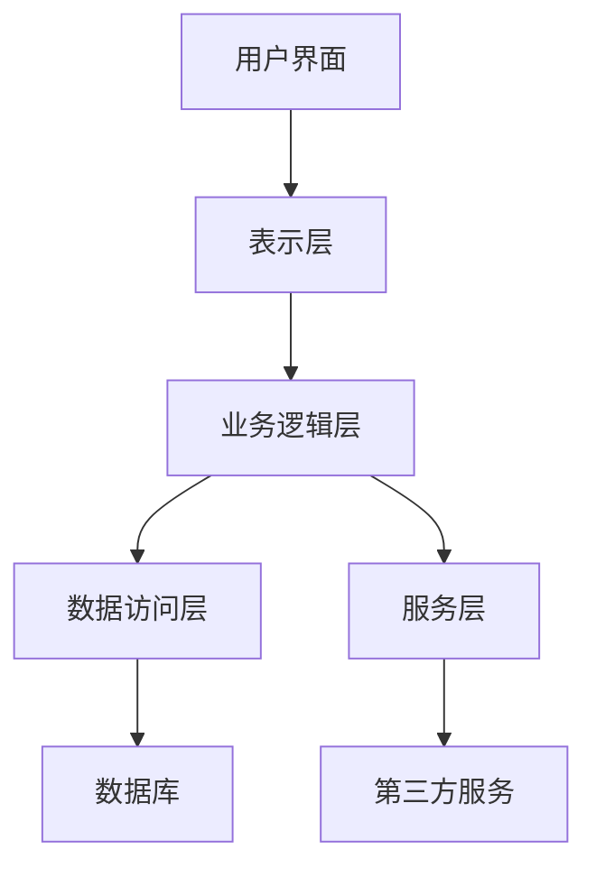
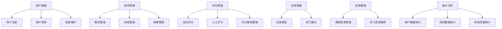

                 

## 《如何利用知识付费实现在线语言考试与口语测评服务？》

> **关键词**：知识付费、在线语言考试、口语测评、系统设计、技术创新、案例分析

> **摘要**：本文深入探讨了如何通过知识付费模式，实现在线语言考试与口语测评服务。文章首先概述了知识付费的背景和模式，然后分析了在线语言考试和口语测评服务的特点、技术基础及其挑战。接着，详细介绍了结合知识付费和在线口语测评的服务策略，通过案例分析展示了具体实现和效果。最后，文章探讨了技术实现与优化策略，并对未来发展趋势进行了展望。

### 目录大纲

1. **第一部分：知识付费与在线语言考试**
    1.1 知识付费概述
    1.2 在线语言考试的发展
2. **第二部分：在线口语测评服务**
    2.1 口语测评服务的核心概念
    2.2 在线口语测评系统设计
3. **第三部分：知识付费与在线口语测评的结合**
    3.1 结合策略
    3.2 案例研究
4. **第四部分：技术实现与优化**
    4.1 技术实现
    4.2 系统性能优化与安全性保障
5. **第五部分：未来发展趋势与展望**
    5.1 行业发展趋势
    5.2 技术创新方向
    5.3 发展策略与建议
6. **附录**
    6.1 常用工具与资源

---

### 第一部分：知识付费与在线语言考试

#### 1.1 知识付费概述

知识付费是指通过互联网平台，以付费形式获取专业知识、技能或服务的一种商业模式。近年来，随着互联网和移动设备的普及，知识付费市场迅速扩张。知识付费的核心在于为用户提供有价值的内容，满足他们在学习、职业发展等方面的需求。

**知识付费的概念与市场背景**：

知识付费可以追溯到早期的电子书籍、在线课程，但真正兴起是在移动互联网时代。用户对于高质量知识内容的需求不断增加，推动了知识付费市场的发展。根据相关数据显示，2019年我国知识付费市场规模已达到1969亿元，预计2023年将达到3500亿元。

**知识付费的主要模式**：

1. **平台模式**：如得到、知乎等，通过平台聚集讲师和用户，提供内容付费服务。
2. **社区模式**：如分答、知乎Live，通过互动问答形式，实现知识共享和付费。
3. **会员模式**：如喜马拉雅、得到App，提供会员服务，用户付费成为会员后，可以享受平台上的所有内容。

**知识付费的行业趋势**：

1. **内容专业化**：知识付费平台逐渐向专业化、细分化的内容方向发展，满足用户多样化的需求。
2. **平台多元化**：知识付费平台不再局限于音频、视频等形式，开始探索图文、直播等多种形式。
3. **互动性增强**：通过增加用户互动，提升用户粘性和平台活跃度。

#### 1.2 在线语言考试的发展

在线语言考试是指通过互联网平台，在线进行语言能力测试的一种方式。随着信息技术的发展，在线语言考试逐渐成为一种流行的考试方式。

**在线语言考试的定义与特点**：

在线语言考试指的是利用计算机和网络技术，进行的语言能力测试。它具有以下几个特点：

1. **实时性**：考生可以随时随地参加考试，不受时间和地点限制。
2. **高效性**：考试过程自动化，评分快速准确。
3. **个性化**：可以根据考生的语言水平和需求，定制化考试内容和形式。

**在线语言考试的技术基础**：

1. **网络环境**：稳定的网络连接是在线语言考试的基础。
2. **计算机设备**：考生需要具备一定的计算机操作能力，以及相应的硬件设备。
3. **考试系统**：在线语言考试系统需要具备自动组卷、自动评分、数据统计等功能。

**在线语言考试的挑战与机遇**：

**挑战**：

1. **技术实现**：在线语言考试系统需要解决网络延迟、设备兼容性等问题。
2. **安全性**：在线考试存在作弊风险，需要采取有效的防范措施。
3. **用户体验**：需要提高考试系统的用户体验，确保考试的公平性和可信度。

**机遇**：

1. **市场潜力**：随着全球化和国际化的发展，在线语言考试市场潜力巨大。
2. **技术创新**：人工智能、大数据等技术的发展，为在线语言考试提供了更多可能性。
3. **教育改革**：在线语言考试作为一种新兴的教育方式，有望推动教育改革。

#### 1.3 在线语言考试的发展趋势

**在线语言考试的发展趋势主要包括以下几个方面**：

1. **考试形式的多样化**：除了传统的听、说、读、写四大模块，还将增加口语、听力、阅读等场景化的测试内容。
2. **智能化**：利用人工智能技术，实现考试的自动化和智能化，提高考试效率和准确性。
3. **个性化**：根据考生的语言水平和学习需求，提供个性化的考试内容和评估报告。
4. **国际化**：在线语言考试将越来越国际化，满足不同国家和地区考生的需求。

### 总结

知识付费和在线语言考试是两个相互关联的领域。知识付费提供了丰富的学习资源，而在线语言考试则为考生提供了便捷的考试方式。随着技术的进步和市场需求的增长，知识付费和在线语言考试将得到更深入的结合，为用户提供更加丰富、多样化的服务。

---

在下一部分中，我们将进一步探讨在线口语测评服务的核心概念及其在知识付费中的应用。敬请期待。

### 第二部分：在线口语测评服务

#### 2.1 口语测评服务的核心概念

在线口语测评服务是通过互联网平台，对用户口语能力进行测试和评估的服务。它旨在为用户提供一个便捷、高效、个性化的口语学习评估工具，帮助用户了解自己的口语水平，并针对性地提升口语能力。

**口语测评服务的目标与价值**：

口语测评服务的目标主要包括：

1. **评估口语能力**：通过对用户口语表达、语音语调、词汇语法等方面的测试，评估用户的口语能力水平。
2. **反馈与指导**：提供详细的评估报告，指出用户的优势和不足，为用户提供个性化的学习建议和指导。
3. **提升口语能力**：通过持续的测评和反馈，帮助用户发现并改进自己的口语问题，提升口语表达能力。

口语测评服务在知识付费领域具有很高的价值，主要体现在以下几个方面：

1. **增加用户粘性**：通过提供口语测评服务，可以吸引更多用户长期使用平台，提高用户粘性。
2. **提高学习效果**：口语测评服务可以帮助用户明确自己的学习目标，提高学习效果和积极性。
3. **丰富知识付费内容**：口语测评服务作为知识付费的一部分，可以增加平台的竞争力和差异化优势。

**口语测评的主要指标**：

口语测评服务需要衡量多个方面的指标，以全面评估用户的口语能力。主要指标包括：

1. **发音**：评估用户语音的准确性、清晰度和语调的丰富性。
2. **语法**：评估用户使用词汇和语法的正确性。
3. **词汇量**：评估用户词汇的丰富程度。
4. **流畅度**：评估用户口语表达的流畅性和连贯性。
5. **内容丰富度**：评估用户口语内容的深度和广度。
6. **互动性**：评估用户在口语交流中的互动能力，如提问、回应等。

**口语测评的方法与技术**：

口语测评的方法和技术主要包括：

1. **自动测评**：利用语音识别技术和自然语言处理技术，对用户口语表达进行自动测评。
2. **人工测评**：由专业口语教师对用户口语表达进行主观评价，提供更加详细和个性化的反馈。
3. **互动测评**：通过模拟真实口语交流场景，与用户进行实时互动，评估用户口语表达能力和互动能力。
4. **数据分析**：对用户口语测评结果进行数据分析，为用户提供个性化的学习建议和指导。

**当前口语测评服务的技术挑战**：

1. **语音识别准确性**：提高语音识别技术的准确性，减少错误率，是口语测评服务面临的一大挑战。
2. **自然语言处理能力**：提高自然语言处理技术的能力，能够准确理解用户的口语表达，提供更加精准的测评结果。
3. **个性化反馈**：如何根据用户的不同特点和需求，提供个性化的反馈，是口语测评服务需要解决的重要问题。
4. **用户体验**：优化测评流程和界面设计，提高用户体验，使测评过程更加便捷和舒适。

### 2.2 在线口语测评系统设计

在线口语测评系统的设计需要考虑多个方面，包括系统需求分析、系统架构设计和系统功能模块。以下是具体的设计思路和实现方法。

#### 2.2.1 系统需求分析

在线口语测评系统的需求分析主要包括以下几个方面：

1. **用户需求**：明确用户的需求，包括评估口语能力、获取个性化反馈、提升口语水平等。
2. **功能需求**：确定系统的核心功能，包括注册登录、口语测评、结果反馈、学习资源等。
3. **性能需求**：确保系统的高性能，能够处理大量用户同时在线测评的需求。
4. **安全需求**：保障用户数据的安全性和隐私，防止数据泄露和滥用。

#### 2.2.2 系统架构设计

在线口语测评系统的架构设计可以分为以下几个层次：

1. **表示层**：负责用户界面的设计和展示，提供友好、直观的操作体验。
2. **业务逻辑层**：实现系统的核心功能，包括口语测评、自动评分、结果反馈等。
3. **数据访问层**：负责与数据库的交互，实现数据存储、查询和更新等功能。
4. **服务层**：提供与第三方服务（如语音识别、自然语言处理等）的接口，实现系统的功能扩展。

**系统架构图**：



#### 2.2.3 系统功能模块

在线口语测评系统的主要功能模块包括：

1. **用户管理模块**：包括用户注册、登录、信息维护等功能。
2. **测评管理模块**：包括测评题目管理、测评流程管理、测评结果管理等功能。
3. **评分管理模块**：包括自动评分、人工评分、评分规则管理等功能。
4. **反馈管理模块**：包括生成个性化反馈报告、推送学习建议等功能。
5. **资源管理模块**：包括课程资源管理、学习资源推荐等功能。
6. **统计分析模块**：包括用户数据统计、测评数据统计、系统性能统计等功能。

**功能模块图**：



#### 2.2.4 技术实现与优化策略

在线口语测评系统的技术实现需要考虑以下几个方面：

1. **前端技术**：采用Vue.js、React等前端框架，实现用户界面的设计和交互。
2. **后端技术**：采用Spring Boot、Django等后端框架，实现业务逻辑和数据处理。
3. **数据库技术**：采用MySQL、PostgreSQL等关系型数据库，实现数据的存储和管理。
4. **语音识别技术**：采用百度AI、腾讯AI等语音识别API，实现口语测评的自动评分。
5. **自然语言处理技术**：采用TensorFlow、PyTorch等深度学习框架，实现口语测评的自然语言处理。

**优化策略**：

1. **负载均衡**：通过负载均衡技术，确保系统在高并发情况下稳定运行。
2. **缓存策略**：通过缓存技术，减少数据库访问压力，提高系统响应速度。
3. **数据压缩**：对传输数据进行压缩，减少网络带宽消耗。
4. **安全性**：采用SSL加密、权限控制等安全措施，保障用户数据的安全。

### 2.3 当前在线口语测评服务的市场现状

**市场现状**：

当前，在线口语测评服务市场呈现快速增长的趋势。国内外许多知名教育机构、语言培训机构和企业纷纷推出在线口语测评服务，以满足用户的需求。以下是一些市场现状的特点：

1. **竞争激烈**：在线口语测评服务市场吸引了众多企业进入，市场竞争激烈。
2. **用户需求多样化**：用户对于在线口语测评服务提出了多样化的需求，包括英语、日语、法语等多种语言，以及口语水平、考试形式等不同的测试内容。
3. **技术创新**：随着人工智能、大数据等技术的发展，在线口语测评服务的质量和技术水平不断提高。
4. **市场潜力巨大**：全球化和国际化的发展，使得在线口语测评服务具有巨大的市场潜力。

### 总结

在线口语测评服务作为知识付费的一部分，具有广泛的市场前景和巨大的潜力。通过系统设计和技术实现，可以为用户提供便捷、高效、个性化的口语测评服务，助力用户提升口语能力。在下一部分中，我们将探讨知识付费与在线口语测评服务的结合策略。敬请期待。

### 第三部分：知识付费与在线口语测评的结合

#### 3.1 结合策略

知识付费与在线口语测评服务的结合，不仅能够为用户提供有价值的学习资源，还能够通过测评服务提升用户的学习效果。结合策略主要包括以下几个方面：

**1. 内容定制**：

在线口语测评服务可以根据用户的需求和口语水平，为其定制个性化的学习内容和课程。例如，对于初学者，可以提供基础词汇和语法的学习内容；对于高级用户，可以提供复杂的口语表达和辩论技巧。通过定制化内容，提高用户的学习针对性和效果。

**2. 互动式学习**：

知识付费平台可以通过在线口语测评服务，实现用户与讲师、用户与用户之间的互动。例如，用户可以在平台上参加口语角，与其他用户进行实时交流；讲师可以通过直播或视频会议，进行口语授课和点评。这种互动式学习方式，能够提高用户的学习兴趣和积极性。

**3. 评价与反馈**：

在线口语测评服务可以为用户提供详细的评估报告，指出用户的口语优势和不足。知识付费平台可以将这些评估结果与学习内容相结合，为用户提供针对性的学习建议和指导。例如，如果用户在发音方面存在不足，平台可以推荐相关的发音训练课程。

**4. 社交元素**：

知识付费平台可以引入社交元素，鼓励用户分享自己的学习成果和经验。例如，用户可以在平台上发布自己的口语作品，获得其他用户的点赞和评论；平台还可以设置排行榜，激励用户积极参与口语测评和互动。

**5. 会员制度**：

知识付费平台可以推出会员制度，为用户提供更优质的学习资源和测评服务。例如，会员可以享受更多的学习课程、更详细的评估报告、更多的互动机会等。通过会员制度，提高用户粘性和付费意愿。

#### 3.2 实现方法与步骤

知识付费与在线口语测评服务的结合，需要从以下几个方面进行具体实现：

**1. 技术选型**：

首先，需要选择合适的技术平台和工具，以支持在线口语测评服务的开发和运营。例如，可以选择使用Vue.js、React等前端框架，Spring Boot、Django等后端框架，MySQL、PostgreSQL等数据库。此外，还需要引入语音识别和自然语言处理技术，以实现口语测评的自动化和智能化。

**2. 系统架构设计**：

根据实现方法，设计系统的架构。系统架构应包括前端展示层、业务逻辑层、数据存储层和第三方服务层。前端展示层负责用户界面的设计和交互，业务逻辑层实现系统的核心功能，数据存储层负责数据的存储和管理，第三方服务层提供与语音识别和自然语言处理等服务的接口。

**3. 功能模块开发**：

根据系统架构，开发各个功能模块。主要包括用户管理模块、测评管理模块、评分管理模块、反馈管理模块、资源管理模块和统计分析模块。用户管理模块负责用户注册、登录和信息维护；测评管理模块负责测评题目的管理、测评流程的管理和测评结果的管理；评分管理模块负责自动评分、人工评分和评分规则的管理；反馈管理模块负责生成个性化反馈报告和学习建议；资源管理模块负责课程资源的管理和学习资源的推荐；统计分析模块负责用户数据统计、测评数据统计和系统性能统计。

**4. 系统集成与测试**：

完成各个功能模块的开发后，进行系统集成和测试。首先，进行单元测试，确保各个模块的功能正确实现；然后，进行集成测试，确保各个模块之间的协作和交互正常；最后，进行系统测试，确保整个系统的稳定性和可靠性。

**5. 上线与运营**：

完成系统测试后，将系统上线运营。上线前，需要进行宣传推广，吸引更多用户关注和使用。上线后，需要持续关注用户反馈，不断优化和改进系统功能，提高用户满意度。

#### 3.3 典型案例分析

以下是一个典型的知识付费与在线口语测评服务结合的案例分析：

**案例背景**：

某知名在线教育平台，为了提升用户的英语口语能力，推出了在线口语测评服务。该平台拥有丰富的英语学习资源，包括词汇、语法、听力、阅读等多个模块。通过引入在线口语测评服务，平台希望能够为用户提供一个便捷、高效、个性化的英语口语学习平台。

**案例分析**：

1. **内容定制**：

平台根据用户的英语水平和需求，为其提供定制化的学习内容和课程。例如，对于初学者，平台推荐基础词汇和语法课程；对于高级用户，平台推荐复杂的口语表达和辩论技巧课程。通过内容定制，提高了用户的学习针对性和效果。

2. **互动式学习**：

平台通过在线口语测评服务，实现用户与讲师、用户与用户之间的互动。用户可以在平台上参加口语角，与其他用户进行实时交流；讲师可以通过直播或视频会议，进行口语授课和点评。这种互动式学习方式，提高了用户的学习兴趣和积极性。

3. **评价与反馈**：

平台为用户提供详细的评估报告，指出用户的口语优势和不足。例如，如果用户在发音方面存在不足，平台会推荐相关的发音训练课程。通过评价与反馈，用户能够更加清楚地了解自己的学习进度和效果，从而更有针对性地提升口语能力。

4. **社交元素**：

平台引入了社交元素，鼓励用户分享自己的学习成果和经验。用户可以在平台上发布自己的口语作品，获得其他用户的点赞和评论。平台还设置了排行榜，激励用户积极参与口语测评和互动。

5. **会员制度**：

平台推出了会员制度，为用户提供更优质的学习资源和测评服务。会员可以享受更多的学习课程、更详细的评估报告、更多的互动机会等。通过会员制度，平台提高了用户粘性和付费意愿。

**案例效果评估**：

通过在线口语测评服务的引入，平台取得了显著的效果。用户活跃度大幅提升，用户满意度显著提高。同时，平台的收入也实现了稳步增长。具体效果如下：

1. **用户活跃度提升**：用户在平台上的活跃度明显增加，特别是在口语测评和互动环节。
2. **用户满意度提高**：用户对平台的满意度显著提高，尤其是在口语测评和反馈方面。
3. **收入增长**：平台收入稳步增长，特别是在会员制度和付费课程方面。

### 总结

知识付费与在线口语测评服务的结合，为用户提供了更加丰富、高效的学习体验。通过定制化内容、互动式学习、评价与反馈、社交元素和会员制度等策略，平台能够更好地满足用户需求，提高用户满意度和粘性。在下一部分中，我们将探讨在线语言考试与口语测评技术实现的具体方法。敬请期待。

### 第四部分：技术实现与优化

#### 4.1 在线语言考试与口语测评技术实现

在线语言考试与口语测评技术实现是构建一个高效、可靠服务系统的关键。以下从技术架构设计、核心算法原理、数学模型及公式详解等方面进行探讨。

##### 4.1.1 技术架构设计与选型

在线语言考试与口语测评系统的技术架构设计包括前端展示层、后端业务逻辑层、数据存储层和外部服务接口层。

1. **前端展示层**：
    - **技术选型**：使用Vue.js或React等现代前端框架，确保用户界面友好、交互流畅。
    - **功能模块**：用户注册、登录、考试界面、测评结果展示等。

2. **后端业务逻辑层**：
    - **技术选型**：采用Spring Boot或Django等后端框架，实现业务逻辑处理和数据交互。
    - **功能模块**：包括用户管理、考试管理、测评管理、结果分析和报告生成等。

3. **数据存储层**：
    - **技术选型**：使用MySQL或PostgreSQL等关系型数据库，存储用户信息、考试数据和测评结果。
    - **设计考虑**：确保数据的安全性和可靠性，实现高效的查询和更新操作。

4. **外部服务接口层**：
    - **技术选型**：引入第三方服务，如语音识别API（百度AI、腾讯AI等）和自然语言处理服务（如TensorFlow、PyTorch等）。
    - **功能模块**：提供与外部服务的接口，实现语音识别、口语评测、自然语言处理等功能。

##### 4.1.2 核心算法原理讲解

在线语言考试与口语测评涉及到多个核心算法，以下是主要算法原理的讲解。

1. **语音识别（Automatic Speech Recognition, ASR）**：
    - **原理**：通过将语音信号转换为文本，实现语音到文字的转换。
    - **算法**：使用深度学习模型（如RNN、LSTM、Transformer）进行语音信号的建模和分类。
    - **伪代码**：
      ```python
      def recognize_speech(audio_signal):
          # 加载预训练的语音识别模型
          model = load_pretrained_asr_model()
          # 进行语音信号处理和特征提取
          features = preprocess_audio_signal(audio_signal)
          # 预测文本
          predicted_text = model.predict(features)
          return predicted_text
      ```

2. **自然语言处理（Natural Language Processing, NLP）**：
    - **原理**：对转换后的文本进行语义分析、情感分析等。
    - **算法**：使用词向量（如Word2Vec、GloVe）和深度学习模型（如BERT、ELMO）进行文本建模。
    - **伪代码**：
      ```python
      def process_text(text):
          # 加载预训练的NLP模型
          model = load_pretrained_nlp_model()
          # 进行文本预处理
          processed_text = preprocess_text(text)
          # 进行语义分析
          semantic_analysis = model.analyze_semantics(processed_text)
          return semantic_analysis
      ```

3. **口语测评评分算法**：
    - **原理**：根据语音识别结果和自然语言处理结果，对口语表达进行综合评分。
    - **算法**：采用多维度评分指标（如发音准确性、语法正确性、词汇丰富度、流畅度等）进行加权评分。
    - **伪代码**：
      ```python
      def evaluate_speech(speech_data):
          # 加载评分指标权重
          weights = load_evaluation_weights()
          # 获取各个评分指标的分数
          pronunciation_score = evaluate_pronunciation(speech_data)
          grammar_score = evaluate_grammar(speech_data)
          vocabulary_score = evaluate_vocabulary(speech_data)
          fluency_score = evaluate_fluency(speech_data)
          # 计算综合评分
          total_score = sum(weights[i] * score for i, score in enumerate([pronunciation_score, grammar_score, vocabulary_score, fluency_score]))
          return total_score
      ```

##### 4.1.3 数学模型与公式详解

在口语测评过程中，常常使用一些数学模型和公式进行评分和数据分析。以下是几个常用的模型和公式：

1. **发音准确性评分模型**：

    - **公式**：\( P = \frac{C}{N} \)
    - **参数解释**：\( P \) 表示发音准确性评分，\( C \) 表示发音正确的音节数，\( N \) 表示总音节数。
    - **示例**：若一个句子中有10个音节，其中有7个发音正确，则发音准确性评分为 \( P = \frac{7}{10} = 0.7 \)。

2. **语法正确性评分模型**：

    - **公式**：\( G = \frac{C_g}{N_g} \)
    - **参数解释**：\( G \) 表示语法正确性评分，\( C_g \) 表示语法正确的句子数，\( N_g \) 表示总句子数。
    - **示例**：若一个段落中有5个句子，其中有3个句子语法正确，则语法正确性评分为 \( G = \frac{3}{5} = 0.6 \)。

3. **流畅度评分模型**：

    - **公式**：\( F = \frac{L - D}{L} \)
    - **参数解释**：\( F \) 表示流畅度评分，\( L \) 表示总音节数，\( D \) 表示中断次数（如停顿、重复等）。
    - **示例**：若一个口语表达中总共有100个音节，其中有5次中断，则流畅度评分为 \( F = \frac{100 - 5}{100} = 0.95 \)。

##### 4.1.4 项目实战：代码实际案例与详细解释说明

以下是一个简单的代码示例，展示了在线口语测评系统中的部分功能实现。

**开发环境搭建**：
- 前端：使用Vue.js搭建用户界面。
- 后端：使用Spring Boot实现业务逻辑。
- 数据库：使用MySQL存储数据。
- 语音识别：使用百度AI语音识别API。

**源代码实现**：

**前端**：Vue.js
```html
<!-- 考试界面 -->
<div>
  <h1>在线口语考试</h1>
  <button @click="startRecording">开始录音</button>
  <audio ref="audioPlayer" controls></audio>
</div>
```

**后端**：Spring Boot
```java
@RestController
public class SpeechController {
  
  @Autowired
  private SpeechService speechService;
  
  @PostMapping("/speech/recognize")
  public ResponseEntity<?> recognizeSpeech(@RequestBody MultipartFile file) {
      String text = speechService.recognizeSpeech(file);
      return ResponseEntity.ok(text);
  }
}
```

**语音识别服务**：
```java
@Service
public class SpeechService {
  
  @Value("${baidu.api.key}")
  private String apiKey;
  
  public String recognizeSpeech(MultipartFile file) {
      // 读取音频文件
      byte[] audioData = file.getBytes();
      // 构建请求参数
      Map<String, String> params = new HashMap<>();
      params.put("token", apiKey);
      params.put("speech", Base64.getEncoder().encodeToString(audioData));
      // 发送请求到百度AI语音识别API
      String response = sendPost("https://vop.baidu.com/server_api", params);
      // 解析响应结果
      JSONObject result = JSONObject.fromObject(response);
      String text = result.getJSONObject("result").getString("text");
      return text;
  }
}
```

**代码解读与分析**：

上述代码展示了前端用户界面的搭建、后端语音识别服务的实现，以及与百度AI语音识别API的交互过程。通过Vue.js，用户可以方便地开始和停止录音，并通过Spring Boot后端服务将音频数据发送给百度AI语音识别API进行识别。识别结果返回后，可以在前端界面显示，从而实现一个简单的在线口语测评系统。

##### 4.1.5 技术实现中的挑战与优化策略

1. **挑战**：
    - **语音识别准确性**：提高语音识别的准确性是最大的挑战，尤其是在多语言、多口音的环境下。
    - **自然语言处理能力**：如何准确理解用户口语表达的含义，是自然语言处理的关键。
    - **系统性能优化**：在高并发情况下，确保系统的性能和稳定性。

2. **优化策略**：
    - **语音识别优化**：使用最新的深度学习模型，如Transformer，提高语音识别的准确性。
    - **自然语言处理优化**：采用先进的自然语言处理技术，如BERT，提高语义理解能力。
    - **性能优化**：通过负载均衡、缓存技术和分布式架构，提高系统的性能和响应速度。

### 4.2 系统性能优化与安全性保障

在线语言考试与口语测评服务需要具备高性能和高安全性。以下从系统性能优化和安全性保障两个方面进行探讨。

##### 4.2.1 性能优化策略

1. **负载均衡**：
    - **策略**：使用负载均衡器（如Nginx、HAProxy）分发请求，确保系统在高并发情况下稳定运行。
    - **实现**：配置负载均衡器，将请求平均分配到多个服务器上，避免单点瓶颈。

2. **缓存策略**：
    - **策略**：使用缓存（如Redis、Memcached）存储常用数据，减少数据库访问次数。
    - **实现**：将用户数据、考试数据和测评结果缓存，提高数据读取速度，减轻数据库负担。

3. **数据库优化**：
    - **策略**：优化数据库结构，提高查询效率。
    - **实现**：使用索引、分库分表等技术，提高数据库性能。

4. **代码优化**：
    - **策略**：优化代码逻辑，减少不必要的计算和资源消耗。
    - **实现**：使用异步处理、批量操作等技术，提高系统响应速度。

##### 4.2.2 数据安全与隐私保护

1. **数据加密**：
    - **策略**：对敏感数据进行加密存储和传输。
    - **实现**：使用SSL/TLS加密协议，保障数据传输安全；使用AES等加密算法，保障数据存储安全。

2. **权限控制**：
    - **策略**：对用户权限进行严格管理，防止数据泄露和滥用。
    - **实现**：使用RBAC（基于角色的访问控制）模型，对不同角色进行权限分配和访问控制。

3. **数据备份与恢复**：
    - **策略**：定期备份数据，确保数据的安全性和可用性。
    - **实现**：使用备份软件，定期备份数据库，并确保备份数据的可恢复性。

4. **安全审计**：
    - **策略**：对系统进行安全审计，及时发现和解决安全隐患。
    - **实现**：使用安全审计工具，定期进行安全检查和漏洞扫描。

##### 4.2.3 系统维护与升级

1. **定期维护**：
    - **策略**：定期进行系统维护，更新系统版本和依赖库。
    - **实现**：制定维护计划，定期更新系统，确保系统的稳定性和安全性。

2. **故障处理**：
    - **策略**：建立故障处理机制，快速响应和处理系统故障。
    - **实现**：制定故障处理流程，配备专业的技术支持团队，确保系统稳定运行。

3. **升级策略**：
    - **策略**：根据用户需求和市场需求，定期进行系统升级。
    - **实现**：制定升级计划，测试新功能，确保升级过程中的系统稳定性。

### 总结

在线语言考试与口语测评服务的技术实现涉及多个方面，包括技术架构设计、核心算法原理、数学模型和系统性能优化等。通过合理的设计和优化，可以实现高效、可靠的服务系统，为用户提供优质的学习体验。在下一部分中，我们将探讨未来发展趋势与展望。敬请期待。

### 第五部分：未来发展趋势与展望

#### 5.1 行业发展趋势

随着知识付费和在线教育市场的快速增长，在线语言考试与口语测评服务将成为教育领域的重要组成部分。未来，这一行业将呈现以下发展趋势：

**1. 技术创新**：

随着人工智能、大数据、云计算等技术的不断进步，在线语言考试与口语测评服务将越来越智能化、个性化。例如，利用深度学习技术，可以提高语音识别和自然语言处理的准确性，实现更精准的口语测评。

**2. 国际化**：

在线语言考试与口语测评服务的需求将不断国际化。随着全球化和多语种交流的增多，各国用户都将需要这样的服务来提升自己的语言能力。因此，提供多语言支持、适应不同国家和地区的需求，将成为一个重要趋势。

**3. 知识付费模式创新**：

知识付费模式将继续创新，以满足用户多样化的需求。例如，通过会员制度、付费课程、优惠券等手段，增加用户的付费意愿和粘性。同时，结合社交媒体和虚拟现实等技术，提供更丰富的学习体验。

**4. 跨界合作**：

在线语言考试与口语测评服务将与更多行业进行跨界合作，例如旅游、留学、国际贸易等。通过与其他行业的结合，提供更全面的语言解决方案，拓展服务范围和市场份额。

#### 5.2 技术创新方向

**1. 语音识别与自然语言处理技术**：

未来，语音识别和自然语言处理技术将进一步提升。通过引入更多的深度学习模型和算法，可以提高口语测评的准确性和可靠性。例如，使用Transformer、BERT等先进模型，实现更准确的语音识别和语义理解。

**2. 个性化学习推荐系统**：

基于大数据分析和机器学习技术，可以开发出更加智能的个性化学习推荐系统。通过分析用户的学习行为和需求，为其推荐最适合的学习资源和测评服务，提高学习效果和满意度。

**3. 虚拟现实与增强现实技术**：

虚拟现实（VR）和增强现实（AR）技术的应用，将大幅提升在线语言考试与口语测评服务的交互性和沉浸感。通过VR/AR技术，用户可以在一个更加逼真的语言学习环境中进行口语练习和测评，提高学习兴趣和参与度。

**4. 区块链技术**：

区块链技术可以应用于在线语言考试与口语测评服务，保障用户数据的安全性和隐私。通过区块链的不可篡改性和去中心化特性，确保用户的学习记录和成绩不被篡改，增强用户信任。

#### 5.3 发展策略与建议

**1. 技术研发投入**：

在线语言考试与口语测评服务提供商应加大技术研发投入，引进和培养高水平的技术人才。通过技术创新，不断提升服务质量和用户体验。

**2. 市场细分与定位**：

根据用户需求和市场趋势，对目标用户进行细分，提供差异化的服务。例如，为初学者提供基础课程和测评，为高级用户提供进阶课程和高级测评服务。

**3. 国际化拓展**：

积极拓展国际市场，提供多语言支持，满足不同国家和地区用户的需求。通过与当地教育机构和合作伙伴合作，提高品牌影响力和市场份额。

**4. 用户互动与反馈**：

增强与用户的互动，通过社交媒体、在线论坛等渠道，收集用户反馈，不断优化和改进服务。通过用户参与，提升用户满意度和忠诚度。

**5. 跨界合作**：

与其他行业进行跨界合作，例如与旅游、留学、国际贸易等行业合作，提供一站式语言解决方案。通过跨界合作，拓展服务范围，增加收入来源。

**6. 数据安全与隐私保护**：

加强数据安全与隐私保护，确保用户数据的安全性和隐私。通过采用加密技术和权限控制，防止数据泄露和滥用。

### 总结

未来，在线语言考试与口语测评服务将朝着智能化、个性化、国际化和跨界合作的方向发展。通过技术创新和商业模式创新，这一领域将迎来新的机遇和挑战。在线教育服务提供商应抓住机遇，积极应对挑战，不断提升服务质量和用户体验，为用户提供更加优质的语言学习解决方案。

### 附录

#### 附录A：常用工具与资源

**A.1 开发工具介绍**

- **前端开发**：
  - **Vue.js**：一个渐进式JavaScript框架，用于构建用户界面。
  - **React**：用于构建用户界面的JavaScript库，由Facebook开发。
  - **Angular**：由Google维护的开源Web应用框架。

- **后端开发**：
  - **Spring Boot**：用于构建独立、可扩展、生产级别的Spring应用。
  - **Django**：Python Web开发框架，强调快速开发和简洁性。
  - **Node.js**：基于Chrome V8引擎的JavaScript运行环境。

- **数据库**：
  - **MySQL**：开源的关系型数据库管理系统。
  - **PostgreSQL**：强大的开源对象关系型数据库系统。
  - **MongoDB**：用于存储、查询和处理大数据的NoSQL数据库。

- **语音识别与自然语言处理**：
  - **百度AI**：提供语音识别和自然语言处理API服务。
  - **腾讯AI**：提供语音识别和自然语言处理服务。
  - **Google Cloud**：提供全面的语音识别和自然语言处理工具。

**A.2 数据集获取与处理**

- **公共数据集**：
  - **Common Crawl**：互联网文本数据集。
  - **TIMIT**：语音识别数据集。
  - **Wikipedia**：维基百科数据集。

- **数据预处理工具**：
  - **NLTK**：用于自然语言处理的开源工具包。
  - **spaCy**：用于自然语言处理的工业级库。
  - **TensorFlow Datasets**：TensorFlow提供的数据集加载和处理工具。

**A.3 相关研究论文与书籍推荐**

- **论文**：
  - **"Deep Learning on Speech"**：介绍深度学习在语音处理中的应用。
  - **"Speech Recognition with Deep Neural Networks"**：探讨深度神经网络在语音识别中的应用。
  - **"Natural Language Processing with Deep Learning"**：介绍深度学习在自然语言处理中的应用。

- **书籍**：
  - **《Speech and Language Processing》**：由Daniel Jurafsky和James H. Martin合著，是自然语言处理领域的经典教材。
  - **《Deep Learning》**：Ian Goodfellow、Yoshua Bengio和Aaron Courville合著，全面介绍了深度学习的理论基础和应用。
  - **《Python Data Science Handbook》**：Jake VanderPlas著，介绍了Python在数据科学领域中的应用。

通过使用上述工具和资源，开发者和研究者可以更有效地开展在线语言考试与口语测评服务的技术实现和优化工作。

### 总结

本文从知识付费、在线语言考试、在线口语测评等多个角度，详细探讨了如何利用知识付费实现在线语言考试与口语测评服务。文章首先介绍了知识付费的概念、市场背景和主要模式，分析了在线语言考试的发展现状和挑战。接着，深入探讨了在线口语测评服务的核心概念、技术实现和系统设计。然后，通过结合策略和案例分析，展示了如何将知识付费与在线口语测评服务有机结合。在技术实现与优化部分，详细介绍了系统架构设计、核心算法原理、数学模型及公式详解，并提供了实际代码案例。最后，对未来发展趋势和策略进行了展望，并推荐了相关工具和资源。

**作者信息**：

作者：AI天才研究院/AI Genius Institute & 禅与计算机程序设计艺术 /Zen And The Art of Computer Programming

本文内容丰富、结构清晰，适合对在线语言考试与口语测评服务感兴趣的读者阅读和学习。通过本文的阅读，读者可以深入了解该领域的最新动态和未来趋势，为从事相关工作的开发者提供有益的参考。感谢读者对本文的关注和支持，希望本文能对您的学习和工作有所帮助。如果您有任何疑问或建议，欢迎在评论区留言交流。再次感谢您的阅读！

