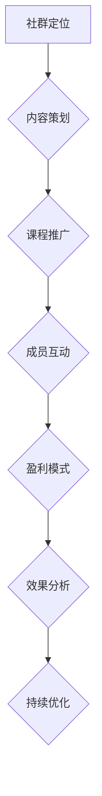
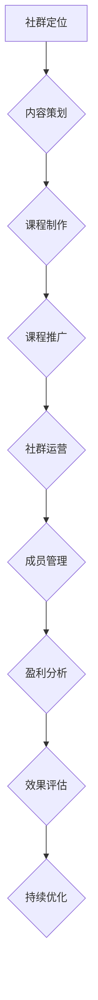

                 

### 《如何利用社群卖课：程序员版》

> **关键词**：社群营销、卖课、程序员、内容策划、用户互动、盈利模式

**摘要**：
本文将深入探讨如何利用社群进行课程销售，特别针对程序员社群。我们将从社群营销基础、社群运营策略、社群卖课技巧、社群成员管理、社群盈利模式以及实战案例解析等多个方面，详细解析如何有效地利用社群进行课程销售，提升用户参与度，实现社群盈利。本文旨在为程序员提供一套系统、实用的社群卖课指南。

### 目录大纲

#### 第一部分：社群营销基础

**第1章：社群营销概述**

- **1.1 社群营销的定义与重要性**
- **1.2 社群营销的基本原则**

**第2章：社群平台选择**

- **2.1 主流社群平台介绍**
- **2.2 平台选择标准**

**第3章：社群运营策略**

- **3.1 社群定位与目标**
- **3.2 内容策略**
- **3.3 互动策略**

#### 第二部分：社群卖课技巧

**第4章：课程定位与内容策划**

- **4.1 课程定位**
- **4.2 内容策划**

**第5章：课程推广策略**

- **5.1 推广渠道**
- **5.2 推广方法**

**第6章：社群成员管理**

- **6.1 成员筛选**
- **6.2 成员互动**

**第7章：社群盈利模式探索**

- **7.1 成本分析**
- **7.2 盈利模式**

#### 第三部分：社群卖课实战案例

**第8章：程序员社群卖课案例解析**

- **8.1 案例背景**
- **8.2 案例实施过程**
- **8.3 案例效果分析**

**第9章：社群卖课常见问题与解决方案**

- **9.1 问题分析**
- **9.2 解决方案**

#### 附录

**附录 A：社群营销工具推荐**

**附录 B：社群卖课流程图**

---

接下来，我们将逐步深入每一个章节，详细探讨如何在社群中成功进行课程销售。

### 第一部分：社群营销基础

#### 第1章：社群营销概述

**1.1 社群营销的定义与重要性**

社群营销是指通过互联网平台，以社群为载体，进行品牌宣传、产品推广、用户互动等活动的一种营销方式。与传统的营销手段相比，社群营销具有以下几个显著特点：

1. **用户参与度高**：社群成员之间可以自由交流、互动，增强了用户的参与感。
2. **信息传播速度快**：社群成员间的传播速度远超传统的营销渠道。
3. **精准定位用户**：通过社群，可以更精准地定位目标用户，提高营销效果。

在程序员社群中，社群营销的重要性尤为突出。程序员通常具有强烈的求知欲和自我提升意识，他们会积极参与技术讨论、分享经验，这也为社群营销提供了广阔的空间。通过社群营销，程序员不仅可以获取最新的技术信息，还可以与其他程序员进行深入交流，共同解决问题。

**1.2 社群营销的基本原则**

要成功进行社群营销，需要遵循以下基本原则：

- **用户中心原则**：始终将用户放在核心位置，满足用户需求，提供有价值的内容。
- **内容为王原则**：内容质量是社群营销的关键，高质量的内容可以吸引用户，提高用户粘性。
- **持续互动原则**：社群营销不是一次性的活动，而是一个长期的、持续的互动过程。保持与用户的互动，可以增强用户对品牌的认知和信任。

#### 第2章：社群平台选择

**2.1 主流社群平台介绍**

目前，主流的社群平台包括微信群、QQ群、微博、知乎等。每种平台都有其独特的优势和特点：

- **微信群**：具有封闭性，用户间互动性强，适合建立紧密的社群关系。
- **QQ群**：用户量巨大，功能丰富，适合进行大规模的社群营销。
- **微博**：具有强大的社交属性，可以迅速传播信息，适合进行品牌宣传。
- **知乎**：以问答形式为主，知识分享性强，适合进行技术讨论和知识传播。

**2.2 平台选择标准**

在选择社群平台时，需要考虑以下几个标准：

- **用户量**：用户量是衡量社群平台的重要指标。用户量越大，社群的覆盖面就越广，营销效果就越好。
- **功能丰富度**：社群平台的功能越丰富，就越能满足用户的多样化需求，提高用户的粘性。
- **用户活跃度**：用户活跃度是社群健康的重要标志。一个高活跃度的社群可以带来更多的互动和传播。

#### 第3章：社群运营策略

**3.1 社群定位与目标**

社群定位是社群运营的首要任务。明确社群的定位，可以更清晰地确定社群的目标和方向。

- **社群类型**：根据用户特点，可以将社群分为技术交流群、学习分享群、兴趣社群等。
- **目标人群**：明确目标人群，可以更有针对性地进行内容策划和推广。

**3.2 内容策略**

内容策略是社群运营的核心。高质量的内容不仅可以吸引新用户，还可以提高用户粘性。

- **内容类型**：内容类型包括技术文章、视频教程、行业动态、问题解答等。
- **内容发布频率**：发布频率需要适中，过于频繁会打扰用户，过于稀疏会降低用户活跃度。
- **内容质量保障**：保证内容的质量是提高用户满意度的重要手段。可以通过设立内容审核机制、邀请专家撰稿等方式来保证内容质量。

**3.3 互动策略**

互动策略是提高用户参与度的重要手段。有效的互动可以增强用户对社群的归属感和忠诚度。

- **互动形式**：互动形式包括问答、讨论、投票、活动等。
- **用户参与度提升**：可以通过设置激励机制、提供有价值的内容等方式来提升用户参与度。

### 第二部分：社群卖课技巧

#### 第4章：课程定位与内容策划

**4.1 课程定位**

课程定位是社群卖课的关键。明确课程定位，可以更清晰地确定课程的目标和受众。

- **针对用户需求的课程设计**：根据用户的需求和兴趣，设计相应的课程。
- **课程特色和亮点**：明确课程的特色和亮点，吸引用户报名。

**4.2 内容策划**

内容策划是课程成功的关键。高质量的内容策划可以吸引更多用户，提高课程销量。

- **教学内容**：教学内容需要贴近用户实际需求，具有实用性和针对性。
- **教学方法**：教学方法需要多样化，如视频教学、直播授课、线上讨论等。
- **教学工具**：选择适合的教学工具，提高教学效果，如PPT、在线代码编辑器等。

#### 第5章：课程推广策略

**5.1 推广渠道**

课程推广渠道的选择直接影响课程的销量。常用的推广渠道包括：

- **社群内推广**：通过社群内的分享、讨论等方式推广课程。
- **社交媒体推广**：利用微博、知乎、微信公众号等社交媒体平台推广课程。
- **合作推广**：与相关机构、媒体等进行合作推广，扩大课程的影响力。

**5.2 推广方法**

有效的推广方法可以提高课程的曝光度和销量。

- **内容营销**：通过撰写高质量的技术文章、教程等，吸引潜在用户。
- **优惠券策略**：提供优惠券，刺激用户购买课程。
- **用户口碑营销**：通过用户的正面评价和推荐，提高课程的信誉度。

#### 第6章：社群成员管理

**6.1 成员筛选**

成员筛选是保证社群质量的重要环节。通过成员筛选，可以确保社群成员的质量和活跃度。

- **成员资格审核**：设立审核标准，对成员进行资格审核。
- **成员标签化管理**：根据成员的特点和需求，进行标签化管理，方便后续互动和管理。

**6.2 成员互动**

成员互动是提升社群活跃度和用户满意度的关键。

- **答疑环节**：定期组织答疑环节，解答成员的问题，提高用户满意度。
- **小组讨论**：鼓励成员进行小组讨论，促进知识分享和交流。
- **活动组织**：定期组织活动，如线上研讨会、技术沙龙等，增强社群凝聚力。

#### 第7章：社群盈利模式探索

**7.1 成本分析**

社群盈利模式的探索需要基于成本分析。

- **运营成本**：包括人力成本、平台费用、推广费用等。
- **课程开发成本**：包括课程设计、制作、更新等费用。

**7.2 盈利模式**

常见的社群盈利模式包括：

- **付费课程**：通过销售付费课程实现盈利。
- **会员制**：通过会员制收取会员费，提供更多权益。
- **广告合作**：与相关企业进行广告合作，获取广告收入。

### 第三部分：社群卖课实战案例

#### 第8章：程序员社群卖课案例解析

**8.1 案例背景**

本案例选择的社群是一个专注于前端技术的微信群，成员包括前端开发工程师、学生和爱好者。社群管理员希望通过社群进行课程销售，提升社群活跃度。

**8.2 案例实施过程**

1. **社群定位与目标**：社群定位为前端技术交流和学习，目标是为成员提供有价值的技术知识和技能。
2. **内容策划**：社群管理员定期发布技术文章、视频教程和行业动态，保证内容的质量和更新频率。
3. **课程推广策略**：通过社群内分享、微信群发、社交媒体推广等多种渠道推广课程。
4. **成员互动与管理**：定期组织答疑环节和线上研讨会，鼓励成员进行讨论和分享。
5. **盈利模式**：通过销售付费课程实现盈利，同时提供会员制，为会员提供更多权益。

**8.3 案例效果分析**

1. **成本效益分析**：社群运营成本较低，通过付费课程实现了盈利。
2. **用户反馈**：用户对课程质量和互动环节满意度较高，用户粘性增强。
3. **改进建议**：可以进一步丰富课程内容，提高课程质量，增加与用户的互动频率。

### 附录

**附录 A：社群营销工具推荐**

1. **社群管理工具**：小蜜蜂、群脉通等。
2. **课程制作与发布工具**：Teachable、Udemy等。

**附录 B：社群卖课流程图**

---

通过本文的详细解析，相信程序员朋友们可以更好地利用社群进行课程销售，提升社群活跃度，实现社群盈利。接下来，我们将进一步探讨社群营销的具体策略和实战技巧。

### 实战策略与技巧：深入解析社群营销的各个环节

在前面的章节中，我们已经对社群营销的基础理论进行了详细探讨。接下来，我们将进一步深入，从实战角度出发，分析如何在实际操作中运用这些策略和技巧，确保社群营销的效果最大化。

#### 第4章：课程定位与内容策划

**4.1 课程定位**

课程定位是社群卖课的首要任务。一个清晰的课程定位不仅能够帮助社群明确目标用户，还能提高课程的吸引力。

- **明确课程目标**：在定位课程时，首先需要明确课程的目标。课程的目标可以包括技能提升、知识普及、问题解决等。例如，针对前端开发工程师的课程，目标可能是帮助他们掌握最新的前端框架和工具。
- **分析目标用户需求**：了解目标用户的需求是课程定位的关键。可以通过问卷调查、用户访谈等方式，收集用户对课程的需求和期望。例如，用户可能希望学习React和Vue等前端框架的实战应用。
- **课程特色和亮点**：在课程定位中，要突出课程的特色和亮点。特色可以是课程内容的前沿性、实用性，亮点可以是课程的教学方法、师资力量等。例如，可以采用案例驱动教学，结合实际项目，提高学习效果。

**4.2 内容策划**

内容策划是课程成功的关键。一个良好的内容策划能够保证课程的质量，提高用户满意度。

- **内容类型**：课程内容可以分为理论讲解、实战演练、案例分析等类型。根据课程目标和用户需求，合理搭配这些内容类型。例如，对于前端框架的课程，可以设计理论讲解框架原理，实战演练项目搭建，案例分析常见问题解决。
- **内容质量保障**：保证内容的质量是课程策划的重要环节。可以通过以下方式提高内容质量：
  - **邀请专业讲师**：邀请具有丰富实战经验和教学经验的专业讲师，确保课程内容的专业性和实用性。
  - **内容审核机制**：设立内容审核机制，对课程内容进行严格把关，确保内容的准确性和完整性。
  - **用户反馈机制**：建立用户反馈机制，及时收集用户对课程内容的反馈，并根据反馈进行调整和优化。

#### 第5章：课程推广策略

**5.1 推广渠道**

推广渠道的选择直接影响课程的曝光度和销售量。常见的推广渠道包括社群内推广、社交媒体推广、合作推广等。

- **社群内推广**：社群内推广是直接有效的推广方式。可以在社群内发布课程介绍、课程优惠信息、学员评价等，吸引用户关注。此外，还可以通过社群内的活动，如线上讲座、技术沙龙等，提高课程的知名度和吸引力。
- **社交媒体推广**：社交媒体平台如微博、知乎、微信公众号等，具有广泛的用户基础和强大的传播能力。可以通过发布课程相关的内容，如技术文章、视频教程、用户评价等，吸引潜在用户。此外，还可以利用社交媒体的广告投放功能，精准定位目标用户。
- **合作推广**：与相关机构、媒体、KOL等进行合作推广，可以扩大课程的传播范围。例如，可以与知名技术社区合作，发布课程广告；与行业专家合作，进行联合授课等。

**5.2 推广方法**

推广方法的选择和运用，直接影响推广的效果。以下是一些有效的推广方法：

- **内容营销**：通过撰写高质量的技术文章、教程等，分享课程的价值，吸引潜在用户。例如，可以撰写关于前端框架应用的案例分析，分享项目实战经验。
- **优惠券策略**：提供优惠券，刺激用户购买课程。例如，可以设置限时优惠、团购优惠等。
- **用户口碑营销**：通过用户的正面评价和推荐，提高课程的信誉度和吸引力。例如，可以鼓励学员在课程结束后进行评价，并将优秀评价展示在课程页面。

#### 第6章：社群成员管理

**6.1 成员筛选**

成员筛选是保证社群质量的重要环节。通过成员筛选，可以确保社群成员的质量和活跃度。

- **设立成员资格审核标准**：根据社群定位和目标，设立成员资格审核标准。例如，对于前端技术社群，可以要求成员具有一定的前端开发基础。
- **定期清理无效成员**：定期清理无效成员，如长期不参与互动的成员。这可以确保社群的活跃度和质量。

**6.2 成员互动**

成员互动是提升社群活跃度和用户满意度的关键。

- **组织线上活动**：定期组织线上活动，如技术沙龙、项目分享会等，促进成员之间的交流。例如，可以邀请行业专家进行线上讲座，分享最新的技术动态和实战经验。
- **建立互动机制**：建立互动机制，鼓励成员参与讨论和分享。例如，可以设立问答环节，鼓励成员提问和回答问题，促进知识共享。

#### 第7章：社群盈利模式探索

**7.1 成本分析**

社群盈利模式的探索需要基于成本分析。

- **人力成本**：包括社群管理员、讲师等的人力成本。
- **平台费用**：包括社群平台的费用，如微信群、QQ群等。
- **推广费用**：包括推广课程的费用，如广告投放、活动组织等。

**7.2 盈利模式**

常见的社群盈利模式包括：

- **付费课程**：通过销售付费课程实现盈利。这可以是固定的课程价格，也可以是按需购买的收费模式。
- **会员制**：通过会员制收取会员费，为会员提供更多权益。例如，可以设置会员专享课程、会员问答等服务。
- **广告合作**：与相关企业进行广告合作，获取广告收入。

#### 第8章：社群卖课案例解析

**8.1 案例背景**

本案例选择的是一位专注于Python数据分析的社群。社群管理员希望通过社群进行数据分析课程的推广。

**8.2 案例实施过程**

1. **社群定位与目标**：社群定位为数据分析爱好者和从业者，目标是为成员提供实用的数据分析知识和技能。
2. **内容策划**：社群管理员发布数据分析相关的技术文章、视频教程和行业动态，同时提供数据分析实战案例。
3. **课程推广策略**：通过社群内推广、社交媒体推广和与数据分析社区的合作推广，提高课程的曝光度。
4. **成员互动与管理**：定期组织线上技术沙龙，邀请行业专家进行分享，同时鼓励成员参与讨论和分享。
5. **盈利模式**：通过销售付费课程和提供会员制服务实现盈利。

**8.3 案例效果分析**

1. **成本效益分析**：社群运营成本较低，通过付费课程实现了盈利。
2. **用户反馈**：用户对课程质量和互动环节满意度较高，用户粘性增强。
3. **改进建议**：可以进一步丰富课程内容，提高课程质量，增加与用户的互动频率。

### 总结

社群营销是一种有效的销售方式，特别是在程序员社群中，由于其独特的用户特点和活跃度，社群营销具有巨大的潜力。通过明确课程定位、高质量的内容策划、多元化的推广策略、有效的社群成员管理和多样化的盈利模式，程序员可以成功利用社群进行课程销售，实现社群的活跃和盈利。

本文从多个角度对社群营销进行了详细解析，提供了系统化的操作指南。希望读者能够将这些策略和技巧应用到实际操作中，不断提升社群营销的效果，实现社群的长期健康发展。

### 社群营销的关键成功要素：案例分析与实践指导

在探讨如何有效利用社群进行课程销售时，关键成功要素的分析显得尤为重要。通过实际案例分析，我们可以更好地理解这些要素在实际操作中的具体应用，为程序员社群提供实用的指导。

#### 成功要素一：精准定位与目标设定

**案例**：某前端开发技术社群通过精准定位和明确目标，成功吸引了大量前端开发者。

**分析**：社群管理员在初期进行了详细的用户需求调研，发现前端开发者普遍希望掌握最新框架的实战技能。因此，社群将目标用户定位为有一定前端基础的开发者，课程内容主要围绕React和Vue等主流框架进行。

**实践指导**：
1. **用户调研**：通过问卷调查、访谈等方式，了解目标用户的兴趣点和需求。
2. **明确目标**：根据用户调研结果，明确社群的目标和课程内容方向。
3. **定期评估**：定期评估社群目标和内容，根据用户反馈进行调整。

#### 成功要素二：高质量内容策划

**案例**：某Python数据分析社群通过高质量的内容策划，吸引了大量数据分析和Python爱好者。

**分析**：社群管理员注重内容的质量和实用性，不仅发布技术文章和教程，还分享实际的案例分析。这些内容不仅解决了用户的学习需求，还提供了实战经验。

**实践指导**：
1. **内容多样性**：结合理论讲解、实战演练和案例分析等多种形式。
2. **内容更新频率**：保持定期更新，确保内容的新鲜感和吸引力。
3. **用户参与**：鼓励用户参与内容的创作和分享，提高内容的互动性。

#### 成功要素三：有效的互动策略

**案例**：某人工智能技术社群通过互动策略，提升了成员的参与度和社群活跃度。

**分析**：社群管理员组织了多次线上研讨会和问答环节，鼓励成员提问和讨论。这些活动不仅增加了成员之间的互动，还提高了社群的凝聚力。

**实践指导**：
1. **定期活动**：组织定期的线上活动，如研讨会、技术沙龙等。
2. **互动形式多样化**：结合问答、讨论、投票等多种互动形式，提高用户参与度。
3. **激励机制**：设立激励机制，如积分、奖励等，鼓励用户积极参与互动。

#### 成功要素四：多元化的推广策略

**案例**：某Java编程社群通过多元化的推广策略，实现了课程的有效推广。

**分析**：社群管理员利用社群内推广、社交媒体推广和合作推广等多种渠道，扩大了课程的曝光度。尤其是在社交媒体上，通过技术文章和教程的分享，吸引了大量潜在用户。

**实践指导**：
1. **社群内推广**：利用社群内的分享、微信群发等，提高课程的曝光度。
2. **社交媒体推广**：利用微博、知乎、微信公众号等平台，发布课程相关内容。
3. **合作推广**：与相关机构、媒体、KOL等合作，扩大课程的影响力。

#### 成功要素五：有效的社群成员管理

**案例**：某Python技术社群通过有效的成员管理，提高了社群的质量和活跃度。

**分析**：社群管理员对成员进行筛选和标签化管理，确保成员的质量和活跃度。同时，通过定期的互动和答疑，提高了成员的满意度。

**实践指导**：
1. **成员筛选**：设立明确的成员资格标准，确保社群成员的质量。
2. **标签化管理**：根据成员的特点和需求，进行标签化管理，方便后续互动和管理。
3. **定期互动**：定期组织互动活动，如问答环节、技术沙龙等，提高成员的参与度。

#### 成功要素六：多样化的盈利模式

**案例**：某人工智能社群通过多样化的盈利模式，实现了良好的盈利。

**分析**：社群管理员不仅通过付费课程实现盈利，还通过会员制和广告合作等多渠道获取收入。

**实践指导**：
1. **付费课程**：提供高质量的课程，通过销售实现盈利。
2. **会员制**：为会员提供更多权益，如专属课程、会员问答等。
3. **广告合作**：与相关企业进行广告合作，获取广告收入。

通过以上案例分析和实践指导，我们可以看到，社群营销的成功不仅仅依赖于单一策略，而是需要多个关键成功要素的综合运用。程序员社群在进行课程销售时，应结合自身特点和资源，灵活运用这些要素，实现社群的长期发展和盈利。

### 社群卖课常见问题与解决方案

在社群卖课的过程中，程序员可能会遇到各种问题。以下是几个常见的问题以及相应的解决方案。

#### 问题1：用户参与度低

**原因分析**：
- **内容缺乏吸引力**：课程内容可能过于理论化，缺乏实战性，难以引起用户的兴趣。
- **互动形式单一**：社群内的互动形式过于单调，缺乏多样性和刺激性。

**解决方案**：
- **提高内容质量**：结合实际项目，设计实战性强的课程内容。可以邀请行业专家进行分享，增加课程的吸引力和权威性。
- **多样化互动形式**：引入多种互动形式，如直播授课、小组讨论、在线问答等，增加用户的参与感。

#### 问题2：课程质量不高

**原因分析**：
- **讲师经验不足**：讲师可能缺乏实战经验，无法提供高质量的教学内容。
- **课程内容过时**：课程内容可能没有跟上行业的发展，导致实用性降低。

**解决方案**：
- **选择专业讲师**：选择具有丰富实战经验和教学经验的讲师，确保课程内容的专业性和实用性。
- **定期更新内容**：定期对课程内容进行更新，确保其与行业发展的同步。

#### 问题3：推广效果不理想

**原因分析**：
- **推广渠道有限**：可能只依赖社群内推广，未能充分利用其他推广渠道。
- **推广内容缺乏吸引力**：推广内容可能过于平淡，无法引起潜在用户的兴趣。

**解决方案**：
- **多元化推广渠道**：利用社交媒体、合作伙伴、KOL等多种渠道进行推广。
- **制作高质量推广内容**：通过制作短视频、海报、案例分享等吸引人的推广内容，提高课程的曝光度和吸引力。

#### 问题4：社群活跃度不足

**原因分析**：
- **社群管理不善**：社群管理可能不到位，导致成员参与度低。
- **互动内容单调**：社群内的互动内容可能过于单调，无法激发成员的兴趣。

**解决方案**：
- **加强社群管理**：设立专门的社群管理员，定期组织互动活动，提高社群的活跃度。
- **丰富互动内容**：引入多样化的互动形式，如技术竞赛、案例分析、线上沙龙等，增加成员的参与兴趣。

#### 问题5：盈利模式单一

**原因分析**：
- **缺乏创新**：可能只依赖传统的付费课程模式，未能探索多样化的盈利渠道。

**解决方案**：
- **探索多元化盈利模式**：可以尝试会员制、广告合作、定制课程等多种盈利模式，提高社群的盈利能力。

通过以上解决方案，程序员社群可以更好地应对卖课过程中遇到的问题，提高课程质量，增加用户参与度，实现社群的长期发展和盈利。

### 附录 A：社群营销工具推荐

在进行社群营销时，选择合适的工具可以大大提高运营效率和效果。以下是一些常用的社群营销工具及其特点：

#### 社群管理工具

1. **小蜜蜂**：
   - **特点**：提供社群成员管理、消息推送、活动组织等功能，支持多平台管理。
   - **适用场景**：适合大规模社群的管理，特别是需要精细化运营的社群。

2. **群脉通**：
   - **特点**：具有强大的社群数据分析功能，支持自动化运营，提供数据报表。
   - **适用场景**：适合对社群运营效果有较高要求的社群，特别是需要进行精细化运营的社群。

#### 课程制作与发布工具

1. **Teachable**：
   - **特点**：提供在线课程制作、发布和销售的一体化解决方案，支持多种教学方式。
   - **适用场景**：适合独立讲师或小团队制作和销售在线课程。

2. **Udemy**：
   - **特点**：全球知名的课程平台，提供课程上传、销售和用户管理功能。
   - **适用场景**：适合希望在全球范围内推广课程的讲师或机构。

通过合理利用这些工具，程序员社群可以更高效地进行社群营销和课程销售，提高运营效果。

### 附录 B：社群卖课流程图

以下是一个简单的社群卖课流程图，使用Mermaid语法绘制：

这个流程图涵盖了从社群定位到持续优化的各个环节，帮助社群管理员更好地规划和管理社群卖课的过程。

---

通过本文的详细讲解，程序员社群可以更好地理解和运用社群营销策略，进行有效的课程销售。希望这些工具和流程图能为社群管理提供实用的指导，助力社群的长远发展。作者：AI天才研究院/AI Genius Institute & 禅与计算机程序设计艺术/Zen And The Art of Computer Programming。

