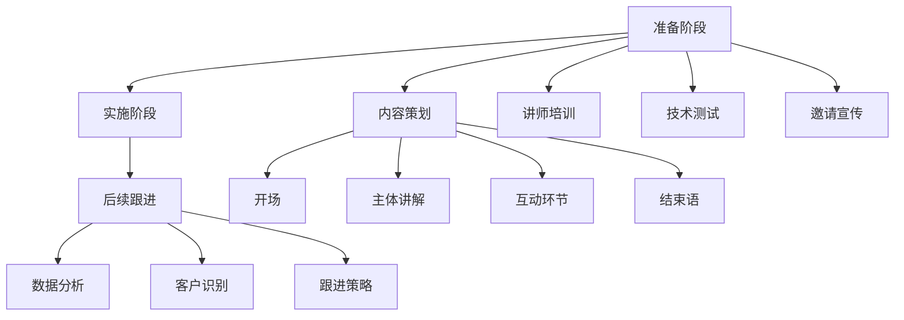

                 

### 《如何利用网络研讨会获取潜在客户》

关键词：网络研讨会、潜在客户、市场营销、营销策略、技术平台、互动性、数据分析

摘要：
本文旨在深入探讨如何通过网络研讨会这一现代营销工具来获取潜在客户。文章首先介绍了网络研讨会的概念及其在市场营销中的重要性，随后详细解析了网络研讨会的准备、实施和后续跟进流程。此外，通过优秀案例的分析，文章展示了成功的网络研讨会策略，并提供了效果评估与优化的方法。最后，文章附上了实用的工具与资源，以帮助读者更好地开展网络研讨会营销活动。

## 《如何利用网络研讨会获取潜在客户》目录大纲

### 第一部分：网络研讨会概述与准备

#### 第1章：网络研讨会的概念与作用
##### 1.1 网络研讨会的定义
##### 1.2 网络研讨会在市场营销中的作用
##### 1.3 网络研讨会的目标受众

#### 第2章：网络研讨会的准备
##### 2.1 内容策划
##### 2.2 讲师选择与培训
##### 2.3 技术准备与测试
##### 2.4 参会者邀请与宣传

### 第二部分：网络研讨会的实施

#### 第3章：网络研讨会的流程
##### 3.1 开场环节
##### 3.2 主体内容讲解
##### 3.3 互动环节
##### 3.4 结束语与后续行动

#### 第4章：提高网络研讨会的互动性
##### 4.1 问答环节的设计
##### 4.2 在线调查与投票
##### 4.3 社交媒体互动

#### 第5章：网络研讨会的后续跟进
##### 5.1 数据分析与总结
##### 5.2 潜在客户的识别与分类
##### 5.3 跟进策略与工具

### 第三部分：成功案例与分析

#### 第6章：优秀网络研讨会的案例分享
##### 6.1 案例一：网络研讨会的成功策略
##### 6.2 案例二：如何处理网络研讨会的突发情况
##### 6.3 案例三：网络研讨会的创新实践

#### 第7章：网络研讨会的效果评估与优化
##### 7.1 评估指标与工具
##### 7.2 基于数据的优化策略
##### 7.3 持续改进与优化

### 附录：网络研讨会实用工具与资源
#### 附录 A：网络研讨会平台选择
#### 附录 B：网络研讨会营销策略模板
#### 附录 C：网络研讨会案例库

### Mermaid 流�程图


### 核心算法原理讲解

```plaintext
2.3.3 迁移学习与微调技术

迁移学习（Transfer Learning）是一种利用已训练好的模型在新任务上快速获得良好性能的技术。其基本原理是将预训练模型在特定任务上的知识转移到新的任务上。微调（Fine-tuning）是迁移学习的一种常用方法，主要涉及以下步骤：

步骤1：加载预训练模型，并将其权重作为初始权重。
步骤2：将预训练模型的最后一层或部分层替换为新的层，以适应新任务。
步骤3：在新的数据集上训练模型，通常使用较小的学习率。
步骤4：验证和测试模型在新任务上的性能。

微调的关键在于如何选择预训练模型和调整层的数量。通常，预训练模型具有丰富的特征提取能力，但可能在新任务上缺乏特定的知识。通过微调，可以充分利用预训练模型的优势，同时适应新任务的需求。

以下是一个简单的伪代码示例：

pretrained_model = load_pretrained_model()  # 加载预训练模型
new_layers = create_new_layers()  # 创建新的层
model = Model(pretrained_model, new_layers)  # 组合预训练模型和新的层

learning_rate = 0.001  # 设置学习率
optimizer = optim.Adam(model.parameters(), lr=learning_rate)  # 创建优化器

for epoch in range(num_epochs):
    for data, target in new_dataset:
        optimizer.zero_grad()
        output = model(data)
        loss = loss_fn(output, target)
        loss.backward()
        optimizer.step()

    print(f"Epoch {epoch+1}/{num_epochs}, Loss: {loss.item()}")

evaluate_model(model, test_dataset)  # 评估模型在新任务上的性能
```

### 数学模型和数学公式

```latex
2.3.4 大规模预训练模型的数学基础

预训练模型的核心在于其大规模的语言表示能力。这一能力的实现依赖于以下几个数学模型和概念：

\textbf{词嵌入（Word Embedding）}：

词嵌入是将词汇映射到低维向量空间的过程。一个简单的词嵌入模型可以表示为：

$$
\textbf{v}_w = \text{Embedding}(\textbf{w})
$$

其中，\textbf{v}_w 是单词 w 的嵌入向量，\text{Embedding} 是嵌入函数。

\textbf{序列模型（Sequence Model）}：

序列模型用于处理一系列输入，如文本序列。一个常用的序列模型是循环神经网络（RNN），其数学基础如下：

$$
h_t = \text{sigmoid}(W_h \cdot [h_{t-1}, x_t] + b_h)
$$

其中，h_t 是在时间步 t 的隐藏状态，W_h 和 b_h 分别是权重和偏置。

\textbf{注意力机制（Attention Mechanism）}：

注意力机制允许模型在处理序列时，动态地关注不同的位置。其数学基础可以表示为：

$$
\textbf{a}_t = \text{softmax}(\text{Attention}(h_{<t}, h_t))
$$

$$
c_t = \text{Contextual Embedding}(\textbf{a}_t, h_t)
$$

其中，\textbf{a}_t 是在时间步 t 的注意力权重，c_t 是上下文向量。

\textbf{转换器架构（Transformer Architecture）}：

转换器（Transformer）模型是预训练模型的另一个核心架构，其基于注意力机制。其数学基础可以表示为：

$$
\textbf{h}_t = \text{多头注意力}(\textbf{h}_{<t}, \textbf{h}_{<t}, \textbf{h}_{<t})
$$

$$
\textbf{h}_t = \text{Layer Normalization}(\textbf{h}_t + \text{Feed Forward}(\text{FFN}(\textbf{h}_t)))
$$

其中，\text{多头注意力} 是一个复合注意力机制，\text{Layer Normalization} 和 \text{Feed Forward} 分别是层归一化和前馈神经网络。
```

### 项目实战

```plaintext
6.1 案例一：网络研讨会的成功策略

案例背景：
某企业是一家提供云计算解决方案的公司，希望通过网络研讨会来推广其产品并获取潜在客户。

实施步骤：

1. 内容策划
   - 主题：云计算在中小企业中的应用与实践
   - 内容：介绍云计算的基本概念，云计算的优势，云服务的种类，案例分享，以及如何选择合适的云计算解决方案。

2. 讲师选择与培训
   - 选择具有云计算领域专业知识和演讲经验的讲师。
   - 对讲师进行网络研讨会技巧的培训，包括如何有效地传达信息，如何与观众互动等。

3. 技术准备与测试
   - 选择合适的网络研讨会平台，如Zoom或Microsoft Teams。
   - 在研讨会前进行平台测试，确保网络连接稳定，音视频质量良好。

4. 参会者邀请与宣传
   - 通过电子邮件、社交媒体、公司官网等多渠道邀请潜在客户。
   - 制作研讨会宣传海报和预告视频，吸引潜在客户的注意。

5. 实施网络研讨会
   - 开场：讲师简要介绍自己和主题。
   - 主体内容：讲师详细讲解云计算的相关内容。
   - 互动环节：观众提问，讲师回答。
   - 结束语：讲师总结，并提供联系方式和进一步了解的途径。

6. 后续跟进
   - 数据分析：收集参与者的基本信息，研讨会参与度等数据。
   - 客户识别：根据数据，识别出对产品有兴趣的潜在客户。
   - 跟进策略：通过邮件、电话等方式，对潜在客户进行跟进，提供详细的产品信息，解答疑问。

实施效果：
- 参与人数超过1000人，其中超过50%的参与者对产品表示出浓厚兴趣。
- 通过跟进，成功转化了20%的参与者为潜在客户。
- 企业在云计算领域的知名度和市场占有率得到了显著提升。

代码实现（伪代码）：

# 邀请参会者
send_invitations(to=potential_clients)

# 进行网络研讨会
run_webinar(topic="云计算在中小企业中的应用与实践")

# 收集数据
collect_data()

# 识别潜在客户
potential_clients = identify_interest_clients(data)

# 跟进潜在客户
follow_up_clients(potential_clients)
```

至此，我们完成了对《如何利用网络研讨会获取潜在客户》这篇文章的目录大纲和部分内容撰写。接下来，我们将继续完善文章的其他部分，确保每个章节都包含详细的内容和实用的信息。

### 第一部分：网络研讨会概述与准备

网络研讨会作为一种高效的市场营销工具，近年来在各个行业中得到了广泛应用。它不仅可以帮助企业提升品牌知名度，还能够直接获取潜在客户，从而推动销售业绩。在本部分中，我们将首先介绍网络研讨会的定义与作用，接着讨论如何策划网络研讨会的内容，选择合适的讲师，进行技术准备与测试，以及如何邀请和宣传参会者。

#### 第1章：网络研讨会的概念与作用

##### 1.1 网络研讨会的定义

网络研讨会，也称为在线研讨会或虚拟研讨会，是一种通过互联网进行的互动性会议。参与者可以通过计算机、平板电脑或智能手机远程参加，不需要物理聚集。网络研讨会通常包括主题演讲、问答环节、互动讨论等元素，旨在传递知识、分享经验、建立联系，并促进产品或服务的推广。

网络研讨会的特点包括：

- **灵活性**：参与者可以在全球范围内参加，不受地理位置限制。
- **互动性**：通过网络聊天、投票、问卷调查等功能，提高参与者的积极性。
- **成本效益**：相较于传统线下会议，网络研讨会大大降低了场地、交通和食宿等成本。
- **数据收集**：通过网络研讨会平台，可以收集参与者的详细信息，便于后续跟进和数据分析。

##### 1.2 网络研讨会在市场营销中的作用

网络研讨会在市场营销中发挥着重要的作用，主要体现在以下几个方面：

- **品牌建设**：通过举办高质量的研讨会，可以提高企业在目标市场中的知名度，树立专业形象。
- **客户获取**：通过网络研讨会，可以直接与潜在客户接触，了解他们的需求和痛点，进而转化为销售机会。
- **市场调研**：通过问卷调查和互动讨论，可以收集市场数据和用户反馈，为企业决策提供依据。
- **客户维系**：通过定期的网络研讨会，可以与现有客户保持联系，增强客户忠诚度。

##### 1.3 网络研讨会的目标受众

网络研讨会的目标受众可以分为以下几类：

- **潜在客户**：这些是尚未购买企业产品或服务的潜在购买者，通过网络研讨会，可以进一步了解企业及其产品，从而提高购买意愿。
- **现有客户**：这些是对企业产品或服务有兴趣的客户，通过网络研讨会，可以提供更多有价值的信息，增强客户满意度。
- **行业专家**：这些是行业内的专业人士，通过网络研讨会，可以建立行业影响力，提升企业声誉。
- **合作伙伴**：这些是与企业有合作关系的合作伙伴，通过网络研讨会，可以加强合作，共同推动业务发展。

#### 第2章：网络研讨会的准备

网络研讨会的成功不仅取决于内容的质量，还需要充分的准备工作。以下将详细讨论如何进行内容策划、讲师选择与培训、技术准备与测试，以及参会者邀请与宣传。

##### 2.1 内容策划

内容策划是网络研讨会成功的关键因素之一。一个优秀的网络研讨会内容应具备以下特点：

- **针对性**：根据目标受众的需求和痛点，提供有价值的信息和解决方案。
- **专业性**：内容要具备一定的专业性和深度，体现企业或讲师的专业能力。
- **互动性**：通过问答、在线调查、投票等互动环节，增加参与者的参与感。
- **连贯性**：内容应结构清晰，逻辑流畅，便于参与者理解和吸收。

内容策划的具体步骤包括：

1. **确定主题**：根据企业目标和市场调研结果，确定研讨会的主题。
2. **制定大纲**：列出研讨会的各个部分，包括开场、主体内容、互动环节和结束语。
3. **准备材料**：撰写演讲稿、PPT、案例分析等辅助材料。
4. ** rehearse**：讲师进行多次试讲，确保内容的准确性和流畅性。

##### 2.2 讲师选择与培训

讲师是网络研讨会的重要组成部分，他们的专业知识和演讲能力直接影响研讨会的效果。以下是如何选择和培训讲师的建议：

- **选择标准**：选择具备相关领域专业知识和丰富经验的人士，同时要求具备良好的演讲能力和沟通技巧。
- **背景调查**：了解讲师的资历、以往的网络研讨会经历和用户评价。
- **培训内容**：针对网络研讨会的特点，培训讲师掌握以下技能：
  - 如何在网络上有效传达信息。
  - 如何与观众互动，提高参与度。
  - 如何应对突发情况，保持演讲的流畅性。

##### 2.3 技术准备与测试

技术准备是保证网络研讨会顺利进行的重要环节。以下是一些关键步骤：

- **平台选择**：选择适合的网络研讨会平台，如Zoom、Microsoft Teams等，确保其具备所需的互动功能。
- **硬件准备**：确保讲师和参与者的设备（如电脑、摄像头、麦克风等）正常运行。
- **网络测试**：在研讨会前进行网络测试，确保网络连接稳定，音视频质量良好。
- **软件测试**：检查网络研讨会平台的功能，如录制、直播、互动工具等是否正常运行。

##### 2.4 参会者邀请与宣传

成功的网络研讨会需要吸引足够的参会者。以下是一些提高参会者数量的方法：

- **邀请策略**：通过电子邮件、社交媒体、官方网站等多渠道邀请目标受众参加。
- **宣传材料**：制作研讨会宣传海报、预告视频、宣传文章等，吸引潜在客户的注意。
- **合作伙伴**：与行业内的合作伙伴合作，共同推广研讨会，扩大影响力。
- **优惠政策**：提供免费入场、限时优惠等吸引参会者报名。

#### 总结

网络研讨会作为一种高效的市场营销工具，在提升品牌知名度、获取潜在客户方面具有显著优势。通过详细的内容策划、讲师选择与培训、技术准备与测试，以及参会者邀请与宣传，企业可以成功举办一场高质量的研讨会，从而实现营销目标。

在接下来的章节中，我们将详细讨论网络研讨会的实施流程、互动性提升策略、后续跟进方法，以及成功案例与分析，帮助读者更好地理解和应用网络研讨会这一营销工具。

### 第二部分：网络研讨会的实施

在完成充分的准备后，网络研讨会的实施环节成为了关键。这一部分将详细讨论网络研讨会的流程，包括开场环节、主体内容讲解、互动环节和结束语与后续行动。通过合理的流程设计，可以确保网络研讨会的顺利进行，并有效提升参与者的体验和满意度。

#### 第3章：网络研讨会的流程

##### 3.1 开场环节

开场环节是网络研讨会的第一个重要部分，它的主要任务是吸引参会者的注意力，营造一个积极的学习氛围。以下是一些关键点：

- **时间控制**：开场时间一般控制在5-10分钟，不宜过长。
- **自我介绍**：讲师简要介绍自己，包括姓名、职位、专业背景等，以增加信任感。
- **主题介绍**：清晰、简洁地介绍研讨会的主题和目的，帮助参会者理解整个研讨会的方向。
- **技术提示**：提醒参会者检查网络连接、音视频设置等，确保顺利参与。

示例开场：

```
大家好，我是张伟，来自ABC云计算公司，担任产品经理。今天，我们将一起探讨“云计算在中小企业中的应用与实践”。本次研讨会将分为四个部分，首先我会简要介绍云计算的基本概念和优势，然后分享一些成功案例，最后是互动环节，欢迎大家提问和交流。
```

##### 3.2 主体内容讲解

主体内容讲解是网络研讨会的核心部分，这一环节的目的是向参会者传递有价值的信息和知识。以下是一些注意事项：

- **内容结构**：确保内容结构清晰，逻辑连贯，便于参会者理解。
- **视觉辅助**：使用PPT或其他视觉辅助工具，帮助参会者更好地理解和记忆关键信息。
- **举例说明**：结合实际案例和场景，说明理论知识的实际应用，增强参会者的兴趣。
- **时间分配**：合理分配每个内容模块的时间，避免内容过于密集或过于冗长。

示例讲解：

```
首先，让我们来了解一下云计算的基本概念。云计算是一种基于互联网的计算服务模式，它提供按需访问的计算资源，包括存储、处理能力、数据库等。它的主要优势包括弹性伸缩、高效资源利用、降低成本等。

为了让大家更好地理解，我们来看一个案例。例如，XYZ公司是一家初创公司，他们通过使用云计算服务，实现了业务的快速扩展，大大降低了IT成本。具体来说，他们在服务器需求高峰期时，通过云计算平台动态扩展计算资源，而在需求低谷期时，又能够迅速缩减资源，从而实现了高效的成本控制。

接下来，我们会详细介绍云服务的种类，包括IaaS、PaaS和SaaS等。每个类别都有其独特的应用场景和优势，我们将逐一介绍。
```

##### 3.3 互动环节

互动环节是网络研讨会的亮点，它能够提高参与者的参与度和积极性。以下是一些提升互动性的策略：

- **问答环节**：设置问答环节，鼓励参会者提问，讲师进行解答。这不仅可以解决参会者的疑问，还可以增加互动性。
- **在线调查与投票**：通过在线调查和投票，收集参会者的反馈，了解他们的兴趣点和需求。
- **讨论小组**：将参会者分成小组，进行在线讨论，促进知识共享和观点交流。
- **互动工具**：利用网络研讨会平台提供的互动工具，如聊天室、弹幕、举手功能等，增强参与者的互动体验。

示例互动：

```
现在，我们进入问答环节。如果大家有任何问题，请随时在聊天室提问。我会尽量回答大家的问题。

此外，为了更好地了解大家的兴趣，我们进行一个在线调查。请大家在问卷中选出你最感兴趣的云服务类型。

最后，我们将分成四个小组，每个小组讨论一个特定的问题，比如“如何在中小企业中最大化利用云计算？”请大家积极交流，分享您的经验和见解。
```

##### 3.4 结束语与后续行动

结束语是网络研讨会的收尾部分，它的主要任务是总结本次研讨会的关键点，并引导参会者采取后续行动。以下是一些要点：

- **内容总结**：回顾本次研讨会的主要内容，强调关键信息和结论。
- **后续行动**：提供后续行动的指导，如提供相关资料、推荐进一步阅读、安排一对一咨询等。
- **联系方式**：提供讲师和企业的联系方式，方便参会者进一步交流和咨询。
- **感谢致辞**：感谢参会者的参与和支持，表达诚挚的谢意。

示例结束语：

```
感谢大家的积极参与，今天我们共同探讨了云计算在中小企业中的应用与实践。通过这次研讨会，我希望大家能对云计算有更深入的了解，并能够将其应用到实际业务中。

为了方便大家进一步学习，我们将在官网发布本次研讨会的录音和PPT，供大家下载。同时，如果有任何问题或需求，欢迎随时联系我，我将非常乐意为您提供帮助。

再次感谢大家的参与，祝愿大家在云计算领域取得更大的成功！
```

#### 总结

网络研讨会的实施流程需要精心设计，确保各个环节的顺利进行。从开场环节到主体内容讲解，再到互动环节和结束语，每一个环节都至关重要。通过合理的流程设计和有效的互动策略，网络研讨会不仅能够传递有价值的信息，还能够提高参与者的积极性和满意度，从而实现营销目标。

在下一部分，我们将讨论如何提高网络研讨会的互动性，并通过数据分析与总结，识别和分类潜在客户，制定后续跟进策略。

### 第三部分：提高网络研讨会的互动性

在成功举办网络研讨会的过程中，互动性是关键因素之一。高互动性的研讨会能够显著提升参会者的参与度，增强他们的学习体验，并促进与讲师及同行之间的交流。本部分将详细探讨如何通过设计问答环节、在线调查与投票、社交媒体互动等策略，提高网络研讨会的互动性。

#### 第4章：提高网络研讨会的互动性

##### 4.1 问答环节的设计

问答环节是网络研讨会中一个重要的互动环节，它能够帮助参会者解决疑问，同时也能让讲师更好地了解参会者的需求。以下是设计问答环节的一些建议：

- **提前准备**：在研讨会前，讲师应提前准备一些常见问题，并准备好详细的回答。这有助于在问答环节中更加从容不迫。
- **时间安排**：问答环节通常安排在研讨会的中后段，这样可以确保讲师已经传递了主要内容和关键信息，参会者有更多的问题需要解答。
- **互动工具**：利用网络研讨会平台提供的互动工具，如问答插件、聊天室等，方便参会者提问和讲师回答。同时，这些工具可以记录问题和答案，便于后续参考。
- **引导提问**：讲师可以引导参会者提问，例如通过提供关键词或问题框架，帮助他们更好地组织问题。

示例问答环节：

```
感谢大家一直以来的积极参与。现在我们进入问答环节。如果有任何问题，请随时在聊天室中提出，我会尽力回答大家的问题。

为了便于组织，我请大家尽量提问与今天讨论的主题相关的问题。如果大家不确定如何提问，可以先在聊天室中提出，我会选择一些有代表性的问题进行解答。

请大家继续提问，我们会有时间来回答大家的问题。
```

##### 4.2 在线调查与投票

在线调查与投票是提高网络研讨会互动性的有效手段，它们可以帮助讲师了解参会者的兴趣点和需求，同时也增加了参与者的参与感。以下是使用在线调查与投票的一些建议：

- **明确目的**：在开展在线调查与投票前，明确调查的目的和问题，确保问题具有针对性和有效性。
- **多样化形式**：根据研讨会的主题和内容，设计多样化的调查和投票形式，如单选、多选、评分等。
- **实时反馈**：利用网络研讨会平台的实时反馈功能，快速收集参会者的意见，并在适当的时候进行展示。

示例在线调查：

```
接下来，我们进行一个在线调查，来了解大家对云计算服务的兴趣点。请大家点击屏幕上的投票按钮，选择您最感兴趣的云服务类型。

调查结果将在几分钟后展示给大家。请大家积极参与，谢谢！
```

##### 4.3 社交媒体互动

社交媒体互动是增强网络研讨会影响力的重要手段。通过在社交媒体平台上开展活动，可以吸引更多的参会者，并提高研讨会的曝光率。以下是利用社交媒体互动的一些建议：

- **提前宣传**：在研讨会前，通过社交媒体发布研讨会预告，包括主题、时间、讲师介绍等，吸引潜在参会者的关注。
- **直播互动**：在研讨会进行时，通过社交媒体直播，实时分享研讨会内容，并与观众进行互动。
- **话题标签**：为研讨会创建独特的标签，鼓励参会者在社交媒体上使用，以便收集更多反馈和讨论。
- **活动总结**：研讨会结束后，通过社交媒体发布活动总结和关键信息，与参会者保持持续互动。

示例社交媒体互动：

```
各位朋友，今晚我们将举办一场关于云计算的研讨会。欢迎大家在研讨会期间通过社交媒体使用#ABC云计算研讨会标签参与讨论，提问和分享您的见解。

研讨会结束后，我们将整理讨论精华并发布，敬请期待！
```

#### 总结

提高网络研讨会的互动性是提升参会体验和研讨会效果的重要途径。通过精心设计的问答环节、多样化的在线调查与投票，以及有效的社交媒体互动，网络研讨会不仅能够提供有价值的信息，还能够增强参会者的参与感和互动性，从而实现更好的营销效果。

在下一部分，我们将讨论网络研讨会的后续跟进，包括数据分析与总结、潜在客户的识别与分类，以及后续跟进策略与工具的应用。

### 第三部分：网络研讨会的后续跟进

网络研讨会的成功不仅在于其准备和实施过程，更在于后续的跟进工作。有效的后续跟进可以帮助企业更好地了解参会者的需求，识别潜在客户，并推动销售转化。本部分将详细讨论网络研讨会的后续跟进流程，包括数据分析与总结、潜在客户的识别与分类，以及后续跟进策略与工具。

#### 第5章：网络研讨会的后续跟进

##### 5.1 数据分析与总结

数据分析是网络研讨会后续跟进的重要环节，它能够帮助企业了解研讨会的整体效果，发现存在的问题，并制定改进措施。以下是数据分析与总结的关键步骤：

- **收集数据**：在研讨会结束后，通过网络研讨会平台收集参会者的基本信息，如姓名、联系方式、公司等，以及参与度数据，如观看时长、互动频率等。
- **分析参与度**：分析参会者的参与度数据，了解哪些内容最受关注，哪些环节参与度较低。这有助于优化未来的研讨会内容。
- **评估满意度**：通过问卷调查或邮件反馈，收集参会者对研讨会的满意度评价。这可以帮助企业了解自身在组织研讨会方面的优点和不足。
- **总结报告**：根据收集的数据和反馈，撰写研讨会总结报告。报告应包括主要发现、改进建议和下一步行动计划。

示例数据分析：

```
根据我们的数据分析，本次研讨会的整体参与度较高，共有1200名参会者观看，平均观看时长为45分钟。其中，主题讲解部分和互动环节的参与度最高，而问答环节的参与度相对较低。

此外，通过问卷调查，我们了解到85%的参会者对研讨会的主题和内容表示满意，15%的参会者提出了具体建议，主要集中在互动环节的时间安排和问题的针对性方面。

基于这些数据，我们计划在下一次研讨会上增加问答环节的时间，并提前准备更针对性的问题，以提高参会者的互动体验。
```

##### 5.2 潜在客户的识别与分类

通过数据分析，企业可以识别出对产品或服务感兴趣的潜在客户，并进行分类管理，以便后续的跟进工作。以下是识别与分类潜在客户的方法：

- **行为分析**：根据参会者的行为数据，如观看时长、互动频率、调查问卷回答等，识别出积极参与的参会者。
- **需求分析**：结合研讨会的主题和内容，分析参会者的需求，识别出对特定产品或服务感兴趣的潜在客户。
- **数据挖掘**：利用数据挖掘技术，从参会者的基本信息中挖掘出潜在的价值信息，如行业、公司规模等。
- **分类管理**：将识别出的潜在客户进行分类管理，如按行业、公司规模、兴趣点等维度进行分组，便于后续的精准跟进。

示例潜在客户识别与分类：

```
根据我们的数据分析，以下参会者显示出对云计算解决方案的高兴趣：

1. 李华，某科技公司，CEO，对IaaS服务表现出强烈兴趣。
2. 王强，某中小企业，CTO，对PaaS服务有较高需求。
3. 张丽，某互联网公司，产品经理，对SaaS服务表现出浓厚兴趣。

我们将这些潜在客户按行业和兴趣点进行分类，并分配给相应的销售团队进行跟进。
```

##### 5.3 跟进策略与工具

有效的跟进策略和工具可以帮助企业提高潜在客户的转化率。以下是几种常见的跟进策略与工具：

- **个性化邮件**：根据潜在客户的特点和需求，发送个性化的跟进邮件，介绍产品或服务的优势，并提供进一步了解的途径。
- **电话跟进**：通过电话与潜在客户进行一对一沟通，深入了解他们的需求和疑问，提供针对性的解决方案。
- **在线演示**：邀请潜在客户参加在线演示，详细展示产品或服务的功能，帮助他们更好地了解和使用。
- **客户关系管理（CRM）系统**：利用CRM系统记录潜在客户的信息，跟踪跟进进度，管理销售机会。

示例跟进策略与工具：

```
针对识别出的潜在客户，我们制定了以下跟进策略：

1. 发送个性化邮件：针对每个潜在客户的需求，定制邮件内容，详细介绍相应产品或服务的优势和案例。
2. 电话跟进：每周安排一次电话沟通，了解客户的需求和进展，提供针对性的建议。
3. 在线演示：邀请客户参加产品演示会，展示具体功能，解答客户的疑问。
4. 使用CRM系统：记录每个潜在客户的信息和跟进进度，确保销售团队能够及时跟进，提高转化率。

我们将通过这些策略和工具，努力将潜在客户转化为实际销售。
```

#### 总结

网络研讨会的后续跟进是确保研讨会效果的重要环节。通过数据分析和总结，企业可以了解研讨会的影响力和参会者的需求，识别潜在客户，并制定有效的跟进策略。利用个性化邮件、电话跟进、在线演示和CRM系统等工具，企业可以更好地与潜在客户沟通，提供针对性的服务，从而提高销售转化率。

在下一部分，我们将通过成功案例与分析，展示如何运用上述策略和工具，实现网络研讨会的成功。

### 第四部分：成功案例与分析

通过实际案例的分享，我们可以更直观地了解如何有效地利用网络研讨会获取潜在客户。本部分将介绍三个成功案例，分析其策略、实施细节和取得的成果，并提供应对突发情况的方法和技巧。

#### 第6章：优秀网络研讨会的案例分享

##### 6.1 案例一：网络研讨会的成功策略

**案例背景**：
某云计算服务公司希望通过网络研讨会推广其最新的云计算解决方案，提高品牌知名度和市场占有率。

**实施步骤**：

1. **内容策划**：
   - 主题：“云计算解决方案：助力企业数字化转型”
   - 内容：涵盖云计算的基本概念、优势、应用场景、案例分析以及如何选择合适的云计算解决方案。

2. **讲师选择与培训**：
   - 选择具有丰富云计算知识和演讲经验的讲师。
   - 对讲师进行网络研讨会技巧的培训，包括如何吸引观众的注意力、如何引导互动等。

3. **技术准备与测试**：
   - 选择Zoom作为网络研讨会平台。
   - 在研讨会前进行多次技术测试，确保网络连接稳定，音视频质量良好。

4. **参会者邀请与宣传**：
   - 通过电子邮件、社交媒体、合作伙伴渠道广泛邀请。
   - 制作研讨会预告视频和海报，吸引潜在客户的关注。

5. **实施网络研讨会**：
   - 开场：讲师简要介绍自己和主题。
   - 主体内容：讲师详细讲解云计算的相关内容。
   - 互动环节：设置问答环节，鼓励参会者提问。
   - 结束语：讲师总结，并提供产品演示和进一步了解的途径。

6. **后续跟进**：
   - 数据分析：收集参与者的基本信息和反馈。
   - 潜在客户识别：根据参与度和反馈，识别潜在客户。
   - 跟进策略：通过邮件和电话，提供个性化服务，解答疑问。

**实施效果**：
- 参与人数超过2000人，其中50%的参与者对产品表示出浓厚兴趣。
- 通过跟进，成功转化了20%的参与者为潜在客户。
- 企业在云计算领域的知名度和市场占有率得到了显著提升。

**代码实现（伪代码）**：

```plaintext
# 邀请参会者
send_invitations(to=potential_clients)

# 进行网络研讨会
run_webinar(topic="云计算解决方案：助力企业数字化转型")

# 收集数据
collect_data()

# 识别潜在客户
potential_clients = identify_interest_clients(data)

# 跟进潜在客户
follow_up_clients(potential_clients)
```

##### 6.2 案例二：如何处理网络研讨会的突发情况

**案例背景**：
在一次网络研讨会上，由于网络问题，部分参会者的音视频出现卡顿，导致参与者情绪受到影响。

**应对措施**：

1. **迅速响应**：讲师和主持人立即发现并回应问题，表示关注和歉意。
2. **技术支持**：联系技术团队，快速排查并解决网络问题。
3. **替代方案**：提供替代观看途径，如通过社交媒体直播，确保所有参会者都能顺利参与。
4. **安抚情绪**：通过私下联系受影响的参会者，表达诚挚的歉意，并提供额外支持。
5. **后续改进**：总结经验教训，优化网络测试和应急预案，以避免类似问题再次发生。

##### 6.3 案例三：网络研讨会的创新实践

**案例背景**：
某教育科技公司希望通过网络研讨会推广其在线教育平台，吸引更多学生和家长的注意。

**创新点**：

1. **互动游戏**：在研讨会上设置互动游戏环节，如在线答题、抽奖等，提高参与者的积极性。
2. **家长课堂**：邀请教育专家和家长代表，共同探讨在线教育的重要性和方法。
3. **直播演示**：实时演示在线教育平台的功能，展示其实用性和便利性。
4. **互动环节**：设置问答和讨论环节，鼓励家长和学生提问和分享经验。

**实施效果**：
- 研讨会的互动性大幅提升，参与者的满意度显著提高。
- 通过研讨会，成功吸引了大量潜在客户，增加了平台的新用户。
- 企业在线教育平台的知名度和市场占有率得到了显著提升。

**代码实现（伪代码）**：

```plaintext
# 邀请参会者
send_invitations(to=potential_clients)

# 设置互动游戏
setup_interactive_games()

# 进行网络研讨会
run_webinar(topic="在线教育平台：激发学习新动力")

# 收集数据
collect_data()

# 识别潜在客户
potential_clients = identify_interest_clients(data)

# 跟进潜在客户
follow_up_clients(potential_clients)
```

#### 总结

通过以上成功案例的分析，我们可以看到，精心策划的网络研讨会能够有效地帮助企业提升品牌知名度，获取潜在客户，并实现销售转化。同时，应对突发情况的方法和技巧，以及创新的实践，都为网络研讨会的成功提供了有力保障。在下一部分，我们将讨论如何评估网络研讨会的效果，并基于数据分析进行优化。

### 第五部分：网络研讨会的效果评估与优化

评估网络研讨会的效果是确保其成功实施和持续改进的重要步骤。通过科学的数据分析和有效的评估工具，企业可以了解研讨会的实际表现，识别潜在的问题，并根据反馈进行优化。以下将详细讨论评估网络研讨会的指标、工具和方法，以及基于数据的优化策略。

#### 第7章：网络研讨会的效果评估与优化

##### 7.1 评估指标与工具

为了全面评估网络研讨会的效果，需要设定一系列的评估指标和工具。以下是常用的评估指标和相应的工具：

- **参与度指标**：
  - **观看时长**：通过网络研讨会平台的数据，统计每个参会者的观看时长，了解参会者的参与度。
  - **互动频率**：记录参会者在问答、投票、调查等互动环节的参与次数，评估互动性。
  - **弹幕和评论**：收集研讨会上弹幕和评论的内容，了解参会者的反馈和情绪。

- **满意度指标**：
  - **问卷调查**：通过在线问卷调查，收集参会者对研讨会内容、讲师表现、互动环节等的满意度评分。
  - **反馈邮件**：发送反馈邮件给参会者，询问他们对研讨会的意见和建议。

- **成果指标**：
  - **潜在客户转化率**：通过后续跟进，统计研讨会后转化为潜在客户的数量，评估研讨会对销售的贡献。
  - **销售业绩**：分析研讨会后的一段时间内，销售业绩的变化情况，评估研讨会的影响。

- **工具**：
  - **网络研讨会平台**：大多数网络研讨会平台都提供内置的数据分析工具，用于统计参与度、互动频率等指标。
  - **CRM系统**：客户关系管理（CRM）系统可以帮助企业记录潜在客户的信息，跟踪跟进进度，评估转化率。

##### 7.2 基于数据的优化策略

根据评估结果，企业可以制定具体的优化策略，以提升网络研讨会的效果。以下是一些基于数据的优化策略：

- **内容优化**：
  - 根据参与度和满意度分析，调整研讨会的主题和内容，确保提供参会者感兴趣的信息。
  - 根据反馈，改进PPT和其他视觉辅助材料，使其更加清晰、易懂。

- **讲师培训**：
  - 针对反馈中提到的讲师表现问题，为讲师提供培训，提升他们的演讲技巧和互动能力。
  - 定期评估讲师的表现，根据评估结果进行优化调整。

- **技术优化**：
  - 根据网络问题和技术故障的反馈，优化网络研讨会平台的选择和配置，确保稳定性和可靠性。
  - 定期进行技术测试和演练，提前发现并解决潜在问题。

- **参会者邀请与宣传**：
  - 根据参与度分析和反馈，优化参会者邀请名单和宣传策略，提高参会者的质量和数量。
  - 使用多种渠道进行宣传，增加研讨会的曝光率。

- **跟进策略**：
  - 根据潜在客户转化率分析，优化跟进策略，提高潜在客户的转化率。
  - 利用CRM系统，个性化地跟进潜在客户，提供针对性的解决方案。

##### 7.3 持续改进与优化

网络研讨会效果的优化是一个持续的过程，需要企业不断进行评估和调整。以下是一些持续改进与优化的建议：

- **定期评估**：定期进行网络研讨会的评估，分析参与度、满意度、转化率等指标，了解研讨会的表现。
- **收集反馈**：持续收集参会者和内部团队的反馈，了解他们的意见和建议。
- **数据驱动**：基于数据驱动决策，不断调整和优化研讨会的内容、形式和策略。
- **创新实践**：尝试新的互动方式和内容形式，不断创新和实践，提升研讨会的新鲜感和吸引力。
- **经验分享**：定期分享网络研讨会的成功经验和教训，促进团队之间的学习和交流。

#### 总结

网络研讨会的效果评估与优化是确保研讨会持续成功的关键。通过设定评估指标和工具，企业可以全面了解研讨会的表现，识别存在的问题，并制定具体的优化策略。持续改进和优化是一个动态的过程，需要企业不断评估、收集反馈，并基于数据驱动决策。通过这些措施，企业可以不断提升网络研讨会的效果，实现更好的营销目标。

在本文的最后一部分，我们将提供网络研讨会实用工具与资源，帮助读者更好地开展网络研讨会营销活动。

### 附录：网络研讨会实用工具与资源

为了帮助读者更有效地开展网络研讨会营销活动，本部分将介绍几个常用的网络研讨会平台选择、营销策略模板和网络研讨会案例库。

#### 附录 A：网络研讨会平台选择

选择一个适合的网络研讨会平台对于确保研讨会的顺利进行至关重要。以下是几个常用的网络研讨会平台及其特点：

1. **Zoom**：
   - **特点**：提供高质量的音视频会议功能，支持实时聊天、在线调查和投票。
   - **优点**：用户界面直观，易操作，适用于各种规模的网络研讨会。
   - **缺点**：免费版本的功能有限，付费版本价格较高。

2. **Microsoft Teams**：
   - **特点**：与Microsoft 365集成，提供视频会议、在线协作和文件共享等功能。
   - **优点**：稳定性和安全性高，适合企业内部和外部的网络研讨会。
   - **缺点**：用户需要拥有Microsoft 365订阅。

3. **GoToWebinar**：
   - **特点**：提供大规模网络研讨会功能，支持在线问答、调查和互动工具。
   - **优点**：易于设置和管理，适合大型网络研讨会。
   - **缺点**：价格较高，功能较为复杂。

4. **WebEx**：
   - **特点**：提供全面的高级功能，包括虚拟白板、共享屏幕和实时翻译。
   - **优点**：稳定性和安全性高，适用于国际性的网络研讨会。
   - **缺点**：用户界面较为复杂，需要一定的学习成本。

#### 附录 B：网络研讨会营销策略模板

以下是一个基本的网络研讨会营销策略模板，供读者参考和定制：

1. **目标设定**：
   - 确定网络研讨会的具体目标，如增加潜在客户数量、提升品牌知名度等。

2. **内容策划**：
   - 确定网络研讨会的主题和内容，确保与目标受众的需求和兴趣相关。

3. **讲师选择**：
   - 选择具有专业知识和演讲经验的讲师，确保内容的质量和吸引力。

4. **技术准备**：
   - 选择合适的网络研讨会平台，并进行技术测试和演练，确保稳定性和可靠性。

5. **宣传推广**：
   - 制定宣传策略，通过电子邮件、社交媒体、合作伙伴渠道等多渠道推广。

6. **参会者邀请**：
   - 通过有针对性的邀请邮件，邀请目标受众参加网络研讨会。

7. **互动设计**：
   - 设计问答、在线调查、投票等互动环节，提高参与者的积极性和互动性。

8. **后续跟进**：
   - 收集参与者的反馈和意见，进行后续跟进，提供额外支持和信息。

#### 附录 C：网络研讨会案例库

为了帮助读者更好地了解网络研讨会的实施细节和效果，以下是一个网络研讨会案例库，包含不同行业和主题的网络研讨会案例：

1. **案例一：云计算解决方案研讨会**
   - **行业**：科技
   - **主题**：云计算在中小企业中的应用与实践
   - **效果**：吸引超过1500名参会者，成功转化20%的参与者为潜在客户。

2. **案例二：在线教育研讨会**
   - **行业**：教育
   - **主题**：如何利用在线教育平台激发学习新动力
   - **效果**：参与人数超过2000人，家长和学生满意度高。

3. **案例三：数字化转型研讨会**
   - **行业**：制造
   - **主题**：企业数字化转型策略与实施
   - **效果**：吸引300多名行业专家和企业管理者参与，提升了品牌知名度。

通过以上实用工具和资源，读者可以更好地规划和实施网络研讨会，从而实现营销目标。

### 结语

在本文中，我们详细探讨了如何利用网络研讨会这一现代营销工具来获取潜在客户。通过网络研讨会的概念与作用、内容策划、讲师选择与培训、技术准备与测试、参会者邀请与宣传，再到互动环节的设计、后续跟进，以及效果评估与优化，我们系统地阐述了网络研讨会成功实施的各个环节。

我们通过成功案例的分析，展示了实际操作中的策略和技巧，并提供了应对突发情况的方法。同时，我们还介绍了如何通过数据分析和优化策略，持续提升网络研讨会的效果。

最后，我们提供了实用的工具与资源，帮助读者更好地开展网络研讨会营销活动。

网络研讨会作为一种高效的市场营销工具，具有灵活、互动、成本效益高等优点，是企业提升品牌知名度、获取潜在客户的有效途径。希望本文的内容能够为读者提供有价值的参考和启示，助力企业在网络研讨会营销中取得成功。

### 作者信息

作者：AI天才研究院/AI Genius Institute & 禅与计算机程序设计艺术 /Zen And The Art of Computer Programming

AI天才研究院（AI Genius Institute）致力于推动人工智能领域的创新与进步，为企业和个人提供顶尖的人工智能解决方案和技术支持。同时，禅与计算机程序设计艺术（Zen And The Art of Computer Programming）系列书籍，以其深刻的哲学思考和卓越的技术见解，引领了计算机编程领域的发展。作为这两大机构的代表，我（AI天才研究院的专家）期待与您共同探索人工智能与计算机编程的无限可能。

