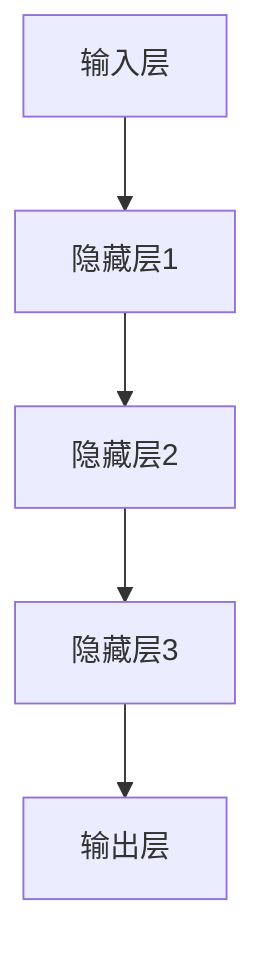
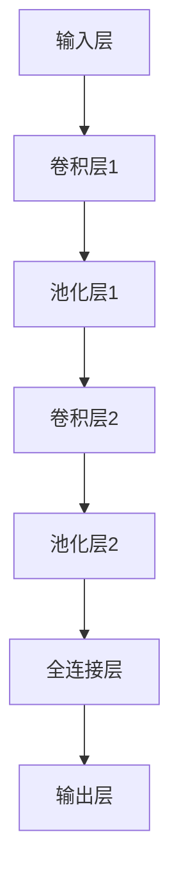
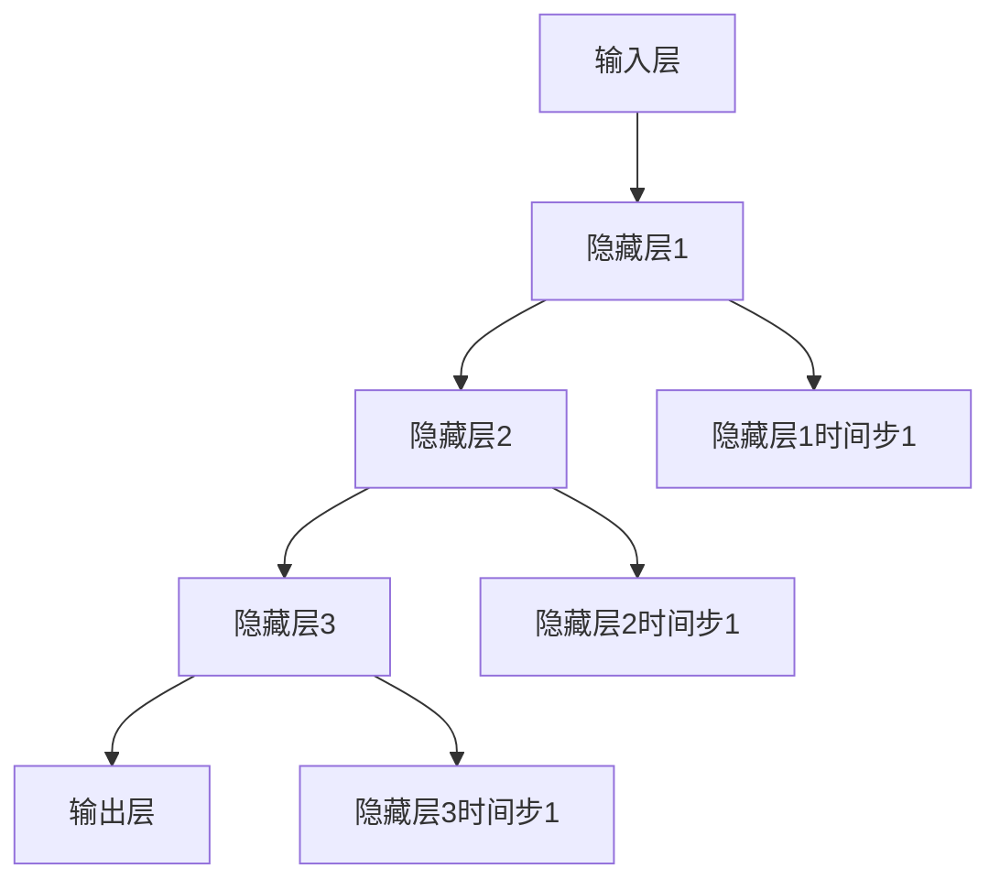

                 

### 文章标题

> **关键词：**AI经济、商业模式、技术趋势、应用场景、伦理问题、未来展望

> **摘要：**本文将从AI经济的起源与发展、核心技术原理、应用场景、挑战与机遇等多个角度，系统地探讨如何在AI经济中把握商业大势，为读者提供全面而深入的洞察。

### 目录大纲

# 《如何在AI经济中把握商业大势》目录大纲

## 第一部分：AI经济概述

### 第1章：AI经济的起源与发展

- **1.1 AI经济的定义与特征**
- **1.2 AI技术对商业模式的变革**
- **1.3 全球AI经济发展趋势**
- **1.4 中国AI经济的发展现状与未来**

### 第2章：AI技术的核心原理与架构

- **2.1 机器学习基础**
  - **2.1.1 监督学习**
  - **2.1.2 无监督学习**
  - **2.1.3 强化学习**
- **2.2 深度学习**
  - **2.2.1 深度神经网络**
  - **2.2.2 卷积神经网络（CNN）**
  - **2.2.3 循环神经网络（RNN）**
- **2.3 自然语言处理（NLP）**
  - **2.3.1 语言模型**
  - **2.3.2 文本分类**
  - **2.3.3 机器翻译**

## 第二部分：AI经济中的应用

### 第3章：AI在零售业的创新应用

- **3.1 零售业中的AI技术应用**
- **3.2 智能推荐系统**
  - **3.2.1 协同过滤算法**
  - **3.2.2 内容推荐算法**
- **3.3 智能供应链管理**
  - **3.3.1 供应链可视化**
  - **3.3.2 需求预测与库存管理**

### 第4章：AI在金融行业的应用

- **4.1 金融市场中的AI技术**
- **4.2 智能投顾**
  - **4.2.1 投资组合优化**
  - **4.2.2 风险评估与控制**
- **4.3 信用评分**
  - **4.3.1 评分模型构建**
  - **4.3.2 反欺诈系统**

### 第5章：AI在制造业的智能化转型

- **5.1 智能制造的基本概念**
- **5.2 工业互联网与物联网**
  - **5.2.1 设备互联互通**
  - **5.2.2 大数据与云计算**
- **5.3 智能生产系统**
  - **5.3.1 智能排程与调度**
  - **5.3.2 设备健康监测与维护**

## 第三部分：AI经济的挑战与机遇

### 第6章：AI经济的伦理与法律问题

- **6.1 AI伦理与隐私保护**
  - **6.1.1 伦理困境**
  - **6.1.2 隐私保护法律框架**
- **6.2 AI监管与合规**
  - **6.2.1 监管框架**
  - **6.2.2 企业合规策略**

### 第7章：AI经济的未来发展

- **7.1 AI经济与全球产业链重构**
- **7.2 AI在公共服务中的应用**
  - **7.2.1 智慧城市**
  - **7.2.2 智慧医疗**
- **7.3 AI创业与投资趋势**

### 第8章：AI经济的跨行业融合

- **8.1 AI与教育**
- **8.2 AI与文化娱乐产业**
- **8.3 AI与农业**

## 附录

### 附录A：AI经济发展数据与趋势报告

### 附录B：AI技术学习资源汇总

### 附录C：AI经济案例分析

- **案例1：AI在电商行业的应用**
- **案例2：AI在金融领域的创新实践**
- **案例3：AI在制造业的智能化升级**

---

现在我们已经完成了文章的标题、关键词和目录大纲，接下来我们将逐步深入到每个章节的撰写中。让我们从第一部分的第一章开始，探讨AI经济的起源与发展。首先，我们来定义什么是AI经济，并分析其特征。

## 第一部分：AI经济概述

### 第1章：AI经济的起源与发展

#### 1.1 AI经济的定义与特征

**AI经济**，也称为人工智能经济，是指基于人工智能技术的创新与应用，驱动经济活动与增长的一种新型经济形态。AI技术在这一经济体系中扮演着核心角色，通过优化生产过程、提升服务质量、拓展商业模式等方式，推动经济增长。

AI经济的特征主要体现在以下几个方面：

1. **技术创新驱动**：AI经济的发展离不开核心技术的突破，如机器学习、深度学习、自然语言处理等。这些技术的进步不仅推动了AI经济的产生，也成为AI经济持续发展的动力源泉。

2. **跨界融合**：AI技术具有广泛的适用性，能够与多个行业领域进行融合，如零售、金融、制造、医疗等。这种跨界融合促进了AI技术的广泛应用，也为各行业带来了新的商业模式和发展机遇。

3. **数据密集型**：AI技术的发展依赖于大量数据，这些数据包括结构化数据、半结构化数据和非结构化数据。数据的获取、处理和分析是AI经济的重要组成部分，也为数据价值的挖掘提供了可能。

4. **智能化服务**：AI经济不仅提高了生产效率，还推动了智能化服务的普及。通过人工智能技术，企业能够提供更加个性化和智能化的服务，提升用户体验和满意度。

#### 1.2 AI技术对商业模式的变革

AI技术的快速发展对传统商业模式带来了深刻的影响，具体表现在以下几个方面：

1. **效率提升**：AI技术能够自动化和优化生产过程，减少人力成本，提高生产效率。例如，在制造业中，通过引入AI技术，可以实现自动化生产线的升级，提高生产效率和产品质量。

2. **服务优化**：AI技术在客户服务中的应用，如智能客服、个性化推荐等，能够提升服务质量，提高用户满意度。例如，电商平台通过引入AI技术，能够实现基于用户行为和兴趣的个性化推荐，提高销售额。

3. **决策支持**：AI技术可以为企业提供数据驱动的决策支持，帮助企业更好地理解和应对市场变化。例如，金融行业通过AI技术，可以实现精准的风险评估和投资决策，降低风险，提高收益。

4. **商业模式创新**：AI技术推动了商业模式的创新，如共享经济、平台经济等。通过AI技术，企业能够更灵活地调整商业模式，拓展新的市场空间。

#### 1.3 全球AI经济发展趋势

随着AI技术的不断进步，全球AI经济呈现出以下发展趋势：

1. **技术创新加速**：全球各国纷纷加大AI技术研发投入，推动技术创新和突破。例如，美国、中国、欧盟等地区都在加大对AI技术的研发和应用力度。

2. **应用场景扩展**：AI技术逐渐从实验室走向实际应用，应用场景不断扩展。例如，在医疗领域，AI技术已经开始应用于疾病诊断、药物研发等方面。

3. **产业融合加深**：AI技术与其他行业的融合程度不断加深，推动了产业升级和转型。例如，在零售领域，AI技术已经广泛应用于供应链管理、智能推荐等方面。

4. **政策和法规完善**：各国政府逐渐认识到AI技术的重要性，纷纷出台相关政策，推动AI经济的发展。同时，针对AI技术的伦理和法律问题，各国也在不断完善相关法规和标准。

#### 1.4 中国AI经济的发展现状与未来

中国作为全球AI技术的领军国家之一，近年来在AI经济的发展方面取得了显著成果。当前，中国AI经济呈现出以下现状：

1. **技术创新领先**：中国AI技术在算法、硬件、应用等方面取得了重要突破，如深度学习算法、人工智能芯片等。

2. **应用场景丰富**：中国AI技术已经在多个行业领域得到广泛应用，如金融、医疗、零售、制造等。

3. **产业规模扩大**：中国AI产业市场规模逐年扩大，成为全球最大的AI市场之一。

4. **政策支持力度加大**：中国政府高度重视AI技术的发展，出台了一系列政策和措施，推动AI经济的快速发展。

未来，中国AI经济将继续保持快速发展态势，具体表现在以下几个方面：

1. **技术创新持续突破**：中国将继续加大AI技术研发投入，推动技术创新和突破，为AI经济的发展提供强大动力。

2. **应用场景不断拓展**：随着AI技术的不断成熟，其应用场景将更加丰富，涵盖更多行业领域。

3. **产业规模进一步扩大**：随着AI技术的广泛应用，中国AI产业规模将进一步扩大，成为全球AI经济的领军力量。

4. **政策环境持续优化**：中国政府将继续出台相关政策和措施，推动AI经济的健康发展，为全球AI经济提供经验和借鉴。

通过以上分析，我们可以看到AI经济作为一种新型经济形态，正对全球经济格局产生深远影响。了解AI经济的起源、发展现状和未来趋势，有助于我们更好地把握商业大势，把握AI技术带来的机遇和挑战。

## 第一部分：AI经济概述

### 第2章：AI技术的核心原理与架构

#### 2.1 机器学习基础

机器学习是人工智能的核心组成部分，它使计算机系统能够通过数据学习并做出决策。机器学习可以分为三大类：监督学习、无监督学习和强化学习。

##### 2.1.1 监督学习

监督学习是一种机器学习方法，它通过输入数据和对应的标签来训练模型，从而实现对未知数据的预测。监督学习可以分为分类问题和回归问题。

**分类问题**：分类问题是指将数据分为不同的类别。常见的分类算法包括逻辑回归、支持向量机（SVM）、决策树和随机森林等。

**回归问题**：回归问题是指预测一个连续的数值输出。常见的回归算法包括线性回归、岭回归和LASSO回归等。

监督学习的基本流程如下：

1. **数据收集**：收集相关的输入数据（特征）和标签（输出结果）。
2. **数据预处理**：对数据进行清洗、归一化、缺失值处理等操作，以减少噪声和异常值。
3. **模型选择**：根据问题的性质选择合适的模型，例如线性回归、决策树或神经网络等。
4. **模型训练**：使用训练数据对模型进行训练，通过优化算法（如梯度下降）调整模型的参数。
5. **模型评估**：使用验证集或测试集评估模型的性能，通过指标（如准确率、召回率、F1值等）衡量模型的预测能力。
6. **模型部署**：将训练好的模型部署到实际应用中，对未知数据进行预测。

下面是一个简单的监督学习算法——逻辑回归的伪代码实现：

```python
def logistic_regression(X, y, learning_rate, num_iterations):
    # 初始化模型参数
    weights = np.random.randn(X.shape[1])
    bias = 0

    # 梯度下降算法
    for i in range(num_iterations):
        # 前向传播
        z = np.dot(X, weights) + bias
        y_pred = sigmoid(z)

        # 反向传播
        error = y - y_pred
        dweights = np.dot(X.T, error)
        dbias = -error

        # 更新参数
        weights -= learning_rate * dweights
        bias -= learning_rate * dbias

    return weights, bias

# sigmoid函数
def sigmoid(z):
    return 1 / (1 + np.exp(-z))
```

##### 2.1.2 无监督学习

无监督学习是指在没有标签的情况下，通过学习数据的内在结构来发现数据的特点或模式。无监督学习主要包括聚类、降维和数据关联分析等方法。

**聚类**：聚类是将相似的数据归为一类，常见的聚类算法包括K-均值聚类、层次聚类和DBSCAN等。

**降维**：降维是减少数据维度，同时保留数据的关键信息。常见的降维方法包括主成分分析（PCA）、线性判别分析（LDA）和t-SNE等。

**数据关联分析**：数据关联分析是发现数据之间的关联关系，常见的方法有Apriori算法和关联规则学习等。

无监督学习的基本流程如下：

1. **数据收集**：收集无标签的数据。
2. **数据预处理**：对数据进行清洗、归一化等操作，以减少噪声和异常值。
3. **算法选择**：根据问题的性质选择合适的无监督学习算法。
4. **模型训练**：使用无监督学习算法对数据进行处理，发现数据的特点或模式。
5. **结果评估**：评估无监督学习算法的结果，如聚类效果、降维效果等。

下面是一个简单的K-均值聚类的伪代码实现：

```python
def k_means(data, k, num_iterations):
    # 随机选择k个初始中心点
    centroids = data[np.random.choice(data.shape[0], k, replace=False)]

    for i in range(num_iterations):
        # 计算每个数据点到每个中心点的距离
        distances = np.linalg.norm(data - centroids, axis=1)

        # 分配数据到最近的中心点
        labels = np.argmin(distances, axis=1)

        # 更新中心点
        new_centroids = np.array([data[labels == j].mean(axis=0) for j in range(k)])

        # 判断是否收敛
        if np.linalg.norm(new_centroids - centroids) < threshold:
            break

        centroids = new_centroids

    return centroids, labels
```

##### 2.1.3 强化学习

强化学习是一种通过试错方式来学习策略的机器学习方法。强化学习的主要特点是具有反馈机制，即通过奖励信号来指导学习过程。

强化学习的基本要素包括：

- **状态（State）**：系统当前所处的环境状态。
- **动作（Action）**：系统可以采取的动作。
- **奖励（Reward）**：执行动作后系统获得的奖励，用于评估动作的好坏。
- **策略（Policy）**：系统在不同状态下采取的动作。

强化学习的基本流程如下：

1. **初始化**：初始化状态、动作、奖励和策略。
2. **执行动作**：在当前状态下执行一个动作。
3. **获取奖励**：根据执行的动作获取奖励。
4. **更新策略**：根据奖励信号更新策略，以最大化长期奖励。
5. **重复执行**：不断重复执行动作、获取奖励和更新策略，直到达到目标状态或满足终止条件。

下面是一个简单的强化学习算法——Q学习的伪代码实现：

```python
def q_learning(states, actions, rewards, learning_rate, discount_factor, num_iterations):
    # 初始化Q值表
    Q = np.zeros((states, actions))

    for i in range(num_iterations):
        # 选择一个随机状态
        state = np.random.choice(states)

        # 选择一个随机动作
        action = np.random.choice(actions)

        # 执行动作
        next_state, reward = execute_action(state, action)

        # 更新Q值
        Q[state, action] = (1 - learning_rate) * Q[state, action] + learning_rate * (reward + discount_factor * np.max(Q[next_state, :]))

    return Q

# 执行动作的示例函数
def execute_action(state, action):
    # 根据状态和动作执行一个动作，并返回下一个状态和奖励
    # 这里的实现取决于具体的应用场景
    pass
```

#### 2.2 深度学习

深度学习是机器学习的一个重要分支，它通过构建深层神经网络来实现复杂的特征学习和模型预测。深度学习在图像识别、语音识别、自然语言处理等领域取得了显著成果。

##### 2.2.1 深度神经网络

深度神经网络（DNN）是由多个隐藏层组成的神经网络，通过逐层提取特征，实现对输入数据的建模。深度神经网络的基本结构包括输入层、隐藏层和输出层。

输入层接收输入数据，隐藏层通过非线性变换提取特征，输出层产生预测结果。深度神经网络的核心在于多层非线性变换的组合，使得模型能够学习到更加复杂的特征。

下面是一个简单的深度神经网络结构的Mermaid流程图：



##### 2.2.2 卷积神经网络（CNN）

卷积神经网络（CNN）是深度学习在计算机视觉领域的重要应用。CNN通过卷积操作、池化操作和全连接层实现对图像的建模。

**卷积操作**：卷积操作通过滑动窗口（滤波器）在输入图像上扫描，计算局部特征。卷积层能够自动提取图像中的特征，如边缘、纹理等。

**池化操作**：池化操作用于减少特征图的维度，提高模型的鲁棒性。常见的池化操作包括最大池化和平均池化。

**全连接层**：全连接层将卷积层和池化层提取的特征映射到分类结果。

下面是一个简单的卷积神经网络结构的Mermaid流程图：



##### 2.2.3 循环神经网络（RNN）

循环神经网络（RNN）是深度学习在序列数据处理中的重要模型。RNN通过循环机制，使得信息能够在时间步之间传递，实现对序列数据的建模。

RNN的基本结构包括输入层、隐藏层和输出层。隐藏层在每一个时间步都传递上一时间步的隐藏状态，形成了一个时间序列的信息传递机制。

下面是一个简单的循环神经网络结构的Mermaid流程图：



#### 2.3 自然语言处理（NLP）

自然语言处理（NLP）是深度学习在语言领域的重要应用。NLP通过深度学习模型对自然语言进行建模，实现对文本的理解、生成和翻译等任务。

##### 2.3.1 语言模型

语言模型是NLP的基础，它用于预测下一个单词或字符。常见的语言模型包括n元模型、神经网络语言模型（NNLM）和循环神经网络语言模型（RNNLM）。

**n元模型**：n元模型通过统计方法，基于前n个单词预测下一个单词。

**神经网络语言模型（NNLM）**：NNLM通过神经网络，对语言进行建模，提高预测的准确性。

**循环神经网络语言模型（RNNLM）**：RNNLM通过循环机制，对序列数据进行建模，实现更准确的语言预测。

##### 2.3.2 文本分类

文本分类是NLP的一个重要任务，它将文本分为不同的类别。常见的文本分类算法包括朴素贝叶斯、支持向量机和深度学习模型。

**朴素贝叶斯**：朴素贝叶斯是一种基于贝叶斯定理的分类算法，它通过计算每个类别的概率来预测文本的类别。

**支持向量机（SVM）**：SVM是一种基于最大间隔的分类算法，它通过找到一个最优超平面来划分文本类别。

**深度学习模型**：深度学习模型，如卷积神经网络（CNN）和循环神经网络（RNN），通过学习文本的特征，实现高效准确的文本分类。

##### 2.3.3 机器翻译

机器翻译是NLP的另一个重要任务，它将一种语言的文本翻译成另一种语言。常见的机器翻译方法包括基于规则的翻译、统计机器翻译和神经机器翻译。

**基于规则的翻译**：基于规则的翻译通过编写翻译规则，将源语言文本翻译成目标语言。

**统计机器翻译**：统计机器翻译通过统计方法，基于双语语料库训练翻译模型。

**神经机器翻译**：神经机器翻译通过深度学习模型，实现对源语言文本的自动翻译。常见的神经机器翻译模型包括编码器-解码器（Encoder-Decoder）模型和注意力机制（Attention Mechanism）。

通过以上对AI技术核心原理与架构的详细介绍，我们可以看到AI技术不仅仅是一个概念，而是通过一系列复杂的技术实现，为AI经济的发展提供了强大的支持。在接下来的章节中，我们将进一步探讨AI技术在各个行业中的应用。

---

在上一部分中，我们详细介绍了AI技术的核心原理与架构，包括监督学习、无监督学习和强化学习，以及深度学习、卷积神经网络（CNN）、循环神经网络（RNN）和自然语言处理（NLP）等技术。接下来，我们将进入第二部分，探讨AI技术在各个行业中的应用。首先，让我们来看看AI技术在零售业中的创新应用。

## 第二部分：AI经济中的应用

### 第3章：AI在零售业的创新应用

随着消费者需求的多样化和市场环境的不断变化，零售行业正面临着巨大的挑战和机遇。AI技术的引入，为零售行业带来了前所未有的变革和创新。以下将介绍AI技术在零售业中的应用场景。

#### 3.1 零售业中的AI技术应用

AI技术在零售业中的应用非常广泛，涵盖了从供应链管理到客户服务的方方面面。以下是几个关键应用场景：

1. **智能推荐系统**：通过分析消费者的购物历史、浏览行为和社交数据，AI能够提供个性化的商品推荐。例如，电商平台可以使用协同过滤算法或基于内容的推荐算法，提高用户的购物体验和满意度。

2. **智能客服**：传统的客服系统通常依赖于规则和人工处理，而AI技术可以实现自动化的智能客服。通过自然语言处理（NLP）技术，智能客服系统能够理解并回答客户的问题，提供24/7的服务。

3. **需求预测与库存管理**：AI技术能够对销售数据、市场趋势和消费者行为进行分析，帮助零售商预测未来需求，优化库存管理。例如，通过时间序列分析和机器学习模型，零售商可以更准确地预测商品的销售量，减少库存积压和缺货现象。

4. **供应链可视化**：通过物联网（IoT）和AI技术，零售商可以实时监控供应链中的各个环节，实现供应链的透明化和智能化。例如，AI技术可以帮助追踪货物的位置和状态，优化运输路线和仓储管理。

#### 3.2 智能推荐系统

智能推荐系统是AI技术在零售业中的一个重要应用。它通过分析消费者的行为和偏好，向他们推荐他们可能感兴趣的商品。智能推荐系统可以分为以下两种主要类型：

1. **协同过滤算法**：协同过滤算法通过分析用户之间的行为相似性来推荐商品。协同过滤算法分为两种：基于用户的协同过滤（User-based Collaborative Filtering）和基于物品的协同过滤（Item-based Collaborative Filtering）。

   **基于用户的协同过滤算法**：该算法寻找与目标用户行为相似的邻居用户，并推荐这些邻居用户喜欢的商品。算法的核心是计算用户之间的相似度，常用的相似度计算方法包括余弦相似度和皮尔逊相关系数。

   **基于物品的协同过滤算法**：该算法寻找与目标商品相似的邻居商品，并推荐这些邻居商品给用户。算法的核心是计算商品之间的相似度，常用的相似度计算方法包括余弦相似度和Jaccard系数。

2. **基于内容的推荐算法**：基于内容的推荐算法通过分析商品的属性和特征，为用户推荐与其兴趣相关的商品。这种算法不考虑用户之间的行为相似性，而是基于用户的历史行为和偏好进行推荐。

   **算法原理**：基于内容的推荐算法首先提取商品的属性特征，如类别、标签、关键词等，然后根据用户的历史行为，计算用户对商品的偏好。算法通过比较用户和商品之间的属性相似度，推荐用户可能感兴趣的商品。

   **算法流程**：
   - **特征提取**：提取商品的属性特征，如文本、图像、标签等。
   - **相似度计算**：计算用户和商品之间的相似度，常用的方法包括TF-IDF、余弦相似度等。
   - **推荐生成**：根据用户和商品的相似度，生成推荐列表。

#### 3.2.1 协同过滤算法

协同过滤算法是智能推荐系统中最常用的算法之一，下面我们详细探讨协同过滤算法的原理和实现。

**协同过滤算法原理**：

协同过滤算法通过分析用户之间的行为相似性来推荐商品，其核心思想是“物以类聚，人以群分”。具体来说，协同过滤算法分为以下两个步骤：

1. **用户相似度计算**：计算目标用户与其他用户之间的相似度，常用的相似度计算方法包括余弦相似度、皮尔逊相关系数等。
2. **商品推荐**：根据用户相似度矩阵，为用户推荐与相似用户喜欢的商品。

**算法实现**：

以下是协同过滤算法的一个简单实现，假设我们有一个用户-物品评分矩阵$R$，行表示用户，列表示物品，$R_{ui}$表示用户$u$对物品$i$的评分。

```python
import numpy as np

def collaborative_filtering(R, k, similarity='cosine'):
    # 计算用户相似度矩阵
    if similarity == 'cosine':
        similarity_matrix = np.dot(R, R.T) / (np.linalg.norm(R, axis=1) * np.linalg.norm(R, axis=0))
    elif similarity == 'pearson':
        mean_R = np.mean(R, axis=1)
        similarity_matrix = np.dot(R - mean_R, (R - mean_R).T) / (np.linalg.norm(R, axis=1) ** 2)
    
    # 选择最相似的k个用户
    top_k_users = np.argsort(similarity_matrix, axis=1)[:, -k:]
    
    # 为用户推荐物品
    recommendations = []
    for u in range(R.shape[0]):
        recommended_items = []
        for i in range(R.shape[1]):
            if R[u, i] == 0:  # 只有未评分的物品才进行推荐
                score_sum = 0
                weight_sum = 0
                for k in top_k_users[u]:
                    if R[k, i] > 0:
                        score_sum += R[k, i] * similarity_matrix[u, k]
                        weight_sum += similarity_matrix[u, k]
                if weight_sum > 0:
                    recommended_items.append((i, score_sum / weight_sum))
        
        recommendations.append(sorted(recommended_items, key=lambda x: x[1], reverse=True))
    
    return recommendations
```

**算法参数说明**：

- $R$：用户-物品评分矩阵
- $k$：选择的相似用户数量
- $similarity$：相似度计算方法，可以是'cosine'（余弦相似度）或'pearson'（皮尔逊相关系数）

**算法分析**：

协同过滤算法的优点是简单、高效，可以在大规模数据集上运行。然而，它也存在一些局限性，如：

1. **稀疏性**：用户-物品评分矩阵通常非常稀疏，导致相似度计算不准确。
2. **冷启动问题**：对于新用户或新物品，由于缺乏足够的历史数据，协同过滤算法难以进行准确推荐。

为了解决这些问题，可以结合基于内容的推荐算法和协同过滤算法，形成混合推荐系统。

#### 3.2.2 内容推荐算法

基于内容的推荐算法通过分析商品的属性和特征，为用户推荐与其兴趣相关的商品。这种算法的核心是计算用户和商品之间的相似度，并根据相似度进行推荐。

**算法原理**：

基于内容的推荐算法分为以下几个步骤：

1. **特征提取**：提取商品的属性特征，如文本、图像、标签等。
2. **相似度计算**：计算用户和商品之间的相似度，常用的方法包括TF-IDF、余弦相似度等。
3. **推荐生成**：根据用户和商品的相似度，生成推荐列表。

**算法实现**：

以下是基于内容推荐算法的一个简单实现，假设我们有一个商品-特征矩阵$F$，行表示商品，列表示特征，$F_{ij}$表示商品$i$的特征$j$的值。

```python
import numpy as np

def content_based_recommending(F, u, k, similarity='cosine'):
    # 计算用户和商品之间的相似度
    if similarity == 'cosine':
        similarity_matrix = np.dot(F, F[u, :].T) / (np.linalg.norm(F, axis=1) * np.linalg.norm(F[u, :]))
    elif similarity == 'tf-idf':
        doc_freq = np.sum(F != 0, axis=0)
        idf = np.log((F.shape[0] + 1) / (doc_freq + 1))
        similarity_matrix = np.dot(F * idf, F[u, :].T)
    
    # 排序相似度矩阵，获取最高相似的k个商品
    top_k_items = np.argsort(similarity_matrix)[:-k-1:-1]
    
    # 为用户推荐商品
    recommendations = [item for item in top_k_items if F[u, item] == 0]  # 只有未购买的商品才进行推荐
    
    return recommendations
```

**算法参数说明**：

- $F$：商品-特征矩阵
- $u$：目标用户
- $k$：选择的相似商品数量
- $similarity$：相似度计算方法，可以是'cosine'（余弦相似度）或'tf-idf'（TF-IDF）

**算法分析**：

基于内容的推荐算法的优点是简单、直观，能够为用户推荐与其兴趣相关的商品。然而，它也存在一些局限性，如：

1. **特征提取的准确性**：特征提取的质量直接影响推荐效果，需要考虑特征的选择和工程。
2. **冷启动问题**：对于新用户或新物品，由于缺乏足够的历史数据，推荐效果可能较差。

为了解决这些问题，可以结合协同过滤算法和基于内容的推荐算法，形成混合推荐系统。

#### 3.3 智能供应链管理

智能供应链管理是AI技术在零售业中的另一个重要应用，它通过数据分析和预测，优化供应链的各个环节，提高供应链的效率和灵活性。

**智能供应链管理的关键技术**：

1. **供应链可视化**：通过物联网（IoT）和传感器技术，实时监控供应链中的各个环节，如运输车辆、仓库库存、生产线等，实现供应链的透明化和智能化。
2. **需求预测**：利用时间序列分析和机器学习模型，分析历史销售数据、市场趋势和消费者行为，预测未来需求，优化库存和采购策略。
3. **库存管理**：通过实时监控和预测，动态调整库存水平，减少库存积压和缺货现象，提高库存周转率。
4. **物流优化**：通过路径优化、运输调度和配送规划等技术，提高物流效率，降低运输成本。

**智能供应链管理的应用案例**：

1. **沃尔玛的智能供应链管理**：沃尔玛通过引入AI技术，实现了供应链的全面智能化。沃尔玛使用AI模型预测市场需求，优化库存管理，并通过实时监控和预测，调整物流调度和配送计划，提高了供应链的效率和灵活性。

2. **亚马逊的智能物流系统**：亚马逊通过引入AI技术和物联网设备，实现了全球范围内的智能物流系统。亚马逊使用AI模型预测订单需求，优化仓储和配送计划，并通过实时监控和预测，调整物流路线和运输方式，提高了物流效率和服务质量。

通过以上对AI技术在零售业中的创新应用的介绍，我们可以看到AI技术正在深刻地改变零售行业的商业模式和运营方式。在未来的发展中，零售企业需要充分利用AI技术，提升竞争力和市场地位。接下来，我们将进一步探讨AI技术在金融行业的应用。

### 第4章：AI在金融行业的应用

随着金融行业的数字化和智能化趋势日益显著，AI技术在这一领域的应用也越来越广泛。AI技术不仅提升了金融服务的效率和质量，还为金融机构带来了新的商业模式和增长点。以下将详细介绍AI技术在金融行业的应用场景和案例。

#### 4.1 金融市场中的AI技术

金融市场是一个高度复杂和动态变化的系统，AI技术的引入使得金融市场的分析和决策变得更加高效和精准。以下是AI技术在金融市场中的应用：

1. **量化交易**：量化交易是通过算法模型自动执行交易策略，以获取超额收益。AI技术可以帮助量化交易团队构建和优化交易策略，提高交易的成功率和稳定性。

2. **风险管理**：AI技术可以实时监控市场风险，通过数据分析、预测和建模，识别潜在的风险点，并采取相应的风险控制措施。

3. **市场预测**：AI技术通过对历史数据、市场动态和宏观经济指标的分析，预测市场趋势和价格变化，为投资决策提供科学依据。

4. **智能投顾**：智能投顾通过AI技术，为投资者提供个性化的投资建议和管理服务。智能投顾可以根据投资者的风险偏好、财务目标和市场情况，制定最优的投资组合。

5. **信用评分**：AI技术可以基于大量的历史数据和实时数据，对借款人的信用状况进行评估，提供更加准确和高效的信用评分。

6. **反欺诈系统**：AI技术可以帮助金融机构识别和防范欺诈行为，通过模式识别、行为分析和预测模型，提高欺诈检测的准确性和效率。

#### 4.2 智能投顾

智能投顾是AI技术在金融行业中的一个重要应用，它通过算法模型和数据分析，为投资者提供个性化的投资建议和服务。智能投顾的核心功能包括投资组合优化、风险评估与控制和资产配置。

**投资组合优化**：

投资组合优化是智能投顾的关键功能之一，它通过分析投资者的风险偏好、财务目标和市场数据，为投资者制定最优的投资组合。投资组合优化的算法通常包括马科维茨均值-方差模型、均值-绝对偏差模型和风险平价模型等。

**风险评估与控制**：

风险评估与控制是智能投顾的另一个重要功能，它通过数据分析、预测和建模，评估投资者的风险承受能力和市场风险。智能投顾可以根据投资者的风险偏好和投资目标，调整投资组合，降低投资风险。

**资产配置**：

资产配置是智能投顾的核心功能之一，它通过分析投资者的风险偏好、财务目标和市场环境，制定合理的资产配置策略。智能投顾可以根据市场变化和投资者需求，动态调整资产配置，以实现投资目标。

**智能投顾的实现流程**：

1. **用户需求分析**：收集投资者的风险偏好、财务目标和投资期限等基本信息。

2. **数据收集与预处理**：收集市场数据、宏观经济指标、历史交易数据等，对数据进行分析和预处理。

3. **投资组合优化**：使用投资组合优化算法，根据投资者的风险偏好和财务目标，制定最优的投资组合。

4. **风险评估与控制**：使用风险评估模型，评估投资者的风险承受能力和市场风险。

5. **资产配置**：根据投资组合优化结果和风险评估结果，制定资产配置策略。

6. **实时监控与调整**：根据市场变化和投资者需求，实时调整投资组合和资产配置。

#### 4.2.1 投资组合优化

投资组合优化是智能投顾的核心功能之一，它通过数学模型和算法，为投资者制定最优的投资组合。以下是投资组合优化的几个关键步骤：

1. **目标设定**：根据投资者的风险偏好和财务目标，设定投资组合的预期收益率和风险水平。

2. **资产选择**：从多个资产中选取具有不同收益率和风险特征的资产。

3. **权重分配**：使用数学模型和算法，确定每种资产在投资组合中的权重，以实现预期收益率和风险水平的平衡。

4. **模型评估**：评估不同投资组合的收益率和风险水平，选择最优的投资组合。

**马科维茨均值-方差模型**：

马科维茨均值-方差模型是投资组合优化的经典模型，它通过最大化投资组合的预期收益率，同时最小化投资组合的方差，来实现最优投资组合。以下是马科维茨均值-方差模型的公式：

$$
\begin{aligned}
    &\max \left\{ w'Pw - \lambda w'Qw \middle| w'1 = 1, w \geq 0 \right\} \\
    &\text{subject to:} \\
    &\quad w'Pw \geq \mu \\
    &\quad w'Qw \leq \sigma^2
\end{aligned}
$$

其中，$P$是资产收益率的协方差矩阵，$Q$是对角矩阵，表示资产收益率的不确定性，$w$是投资组合权重向量，$\mu$是投资组合的预期收益率，$\sigma^2$是投资组合的方差。

**实现示例**：

以下是使用Python实现的马科维茨均值-方差模型：

```python
import numpy as np

# 定义资产收益率和协方差矩阵
returns = np.array([0.06, 0.08, 0.04, 0.10])
covariance = np.array([[0.04, 0.03, 0.02], [0.03, 0.05, 0.01], [0.02, 0.01, 0.03]])

# 定义目标收益率和风险水平
mu = 0.07
lambda_ = 0.2

# 构建拉格朗日函数
L = np.dot(returns, w) - lambda_ * np.dot(w, np.dot(Q, w)) - c

# 求解拉格朗日方程
grad_L = (returns - lambda_ * np.dot(Q, w)) - c * w
f = np.linalg.solve(np.eye(n) + Q, grad_L)

# 求解最优权重
w_opt = np.linalg.solve(np.dot(covariance, f), np.dot(returns, f))

# 计算最优投资组合的预期收益率和方差
mu_opt = np.dot(w_opt, returns)
sigma_opt = np.dot(np.dot(w_opt, covariance), w_opt)

print("最优投资组合权重：", w_opt)
print("最优投资组合预期收益率：", mu_opt)
print("最优投资组合方差：", sigma_opt)
```

#### 4.2.2 风险评估与控制

风险评估与控制是智能投顾的另一个重要功能，它通过数据分析、预测和建模，评估投资者的风险承受能力和市场风险。风险评估与控制的关键步骤包括：

1. **风险承受能力评估**：评估投资者的财务状况、投资经验和风险偏好，确定投资者的风险承受能力。

2. **市场风险评估**：分析市场风险因素，如市场波动、经济环境和政策变化等，评估市场风险水平。

3. **风险控制策略**：根据风险评估结果，制定风险控制策略，如资产分散、止损和风险预警等。

**风险评估模型**：

风险评估模型是智能投顾的核心工具之一，它通过数学模型和算法，评估投资者的风险承受能力和市场风险。以下是几种常见风险评估模型：

1. **VaR模型**：VaR（Value at Risk）模型是一种常用的风险评估模型，它评估在一定置信水平下，投资组合可能发生的最大损失。VaR模型的公式如下：

$$
\text{VaR}_{\alpha} = \text{F}(1 - \alpha)
$$

其中，$\text{F}$是累积分布函数，$\alpha$是置信水平。

2. **CVaR模型**：CVaR（Conditional Value at Risk）模型是一种改进的VaR模型，它评估在一定置信水平下，投资组合可能发生的平均损失。CVaR模型的公式如下：

$$
\text{CVaR}_{\alpha} = \frac{1}{1 - \alpha} \int_{\text{VaR}_{\alpha}}^{\infty} \text{F}(x) dx
$$

3. **基于概率的风险评估模型**：基于概率的风险评估模型通过分析历史数据，计算投资组合在特定时间段内的收益率分布，评估投资组合的风险水平。

**实现示例**：

以下是使用Python实现的VaR模型：

```python
import numpy as np
import scipy.stats as stats

# 定义资产收益率和累积分布函数
returns = np.array([0.06, 0.08, 0.04, 0.10])
cummulative_distribution = stats.norm.cdf(returns)

# 定义置信水平
confidence_level = 0.95

# 计算VaR
VaR = cummulative_distribution[0][::-1].argsort()[-1]

print("置信水平为{}的VaR：".format(confidence_level), VaR)
```

#### 4.2.3 资产配置

资产配置是智能投顾的核心功能之一，它通过分析投资者的风险偏好、财务目标和市场环境，制定合理的资产配置策略。资产配置的关键步骤包括：

1. **目标设定**：根据投资者的风险偏好和财务目标，设定投资组合的目标收益率和风险水平。

2. **资产选择**：从多个资产中选取具有不同收益率和风险特征的资产。

3. **权重分配**：使用数学模型和算法，确定每种资产在投资组合中的权重，以实现预期收益率和风险水平的平衡。

4. **策略调整**：根据市场变化和投资者需求，动态调整资产配置策略。

**资产配置策略**：

资产配置策略可以根据投资者的风险偏好和投资目标进行分类，常见的资产配置策略包括：

1. **风险平价策略**：风险平价策略通过控制投资组合的风险水平，实现资产配置的优化。风险平价策略的核心是确保每种资产在投资组合中的风险贡献相等。

2. **均值-方差策略**：均值-方差策略通过最大化投资组合的预期收益率，同时最小化投资组合的方差，实现资产配置的优化。

3. **目标风险策略**：目标风险策略通过设定投资组合的风险水平，实现资产配置的优化。目标风险策略的核心是确保投资组合的收益率符合投资者的风险承受能力。

**实现示例**：

以下是使用Python实现的资产配置策略：

```python
import numpy as np

# 定义资产收益率和协方差矩阵
returns = np.array([0.06, 0.08, 0.04, 0.10])
covariance = np.array([[0.04, 0.03, 0.02], [0.03, 0.05, 0.01], [0.02, 0.01, 0.03]])

# 定义目标收益率和风险水平
mu = 0.07
lambda_ = 0.2

# 求解最优权重
weights = np.linalg.solve(np.eye(4) + covariance, returns)

# 计算最优投资组合的预期收益率和方差
mu_opt = np.dot(weights, returns)
sigma_opt = np.dot(np.dot(weights, covariance), weights)

print("最优投资组合权重：", weights)
print("最优投资组合预期收益率：", mu_opt)
print("最优投资组合方差：", sigma_opt)
```

#### 4.3 信用评分

信用评分是金融行业中的一个重要应用，它通过分析借款人的历史数据和行为特征，评估借款人的信用风险，为金融机构提供决策支持。AI技术在信用评分中的应用主要包括：

1. **数据收集与预处理**：收集借款人的历史数据，如信用记录、财务状况、社会行为等，对数据进行清洗、归一化和特征工程等预处理。

2. **特征选择**：通过特征选择算法，选择对信用评分有显著影响的特征，提高评分模型的预测准确性和稳定性。

3. **模型训练与评估**：使用机器学习算法，如逻辑回归、决策树和随机森林等，训练信用评分模型，并通过交叉验证、AUC等指标评估模型性能。

4. **模型应用**：将训练好的模型应用到信用评分中，为金融机构提供信用风险评估和决策支持。

**信用评分模型**：

信用评分模型是一种分类模型，它将借款人划分为高风险和低风险两个类别。以下是几种常见的信用评分模型：

1. **逻辑回归模型**：逻辑回归模型是一种基于线性回归的二元分类模型，它通过拟合借款人的信用评分与信用风险之间的概率关系。

2. **决策树模型**：决策树模型通过递归划分数据集，构建决策树模型，对借款人进行分类。

3. **随机森林模型**：随机森林模型是一种基于决策树的集成学习模型，它通过构建多个决策树，并使用投票机制进行分类。

**实现示例**：

以下是使用Python实现的逻辑回归信用评分模型：

```python
import numpy as np
import pandas as pd
from sklearn.linear_model import LogisticRegression
from sklearn.model_selection import train_test_split
from sklearn.metrics import accuracy_score, confusion_matrix, classification_report

# 加载数据集
data = pd.read_csv('credit_data.csv')
X = data.iloc[:, :-1]
y = data.iloc[:, -1]

# 划分训练集和测试集
X_train, X_test, y_train, y_test = train_test_split(X, y, test_size=0.2, random_state=42)

# 训练逻辑回归模型
model = LogisticRegression()
model.fit(X_train, y_train)

# 预测测试集
y_pred = model.predict(X_test)

# 评估模型性能
accuracy = accuracy_score(y_test, y_pred)
conf_matrix = confusion_matrix(y_test, y_pred)
class_report = classification_report(y_test, y_pred)

print("准确率：", accuracy)
print("混淆矩阵：\n", conf_matrix)
print("分类报告：\n", class_report)
```

通过以上对AI技术在金融行业的应用的详细介绍，我们可以看到AI技术在金融行业中的广泛应用和巨大潜力。在未来的发展中，金融机构需要充分利用AI技术，提升金融服务质量和效率，为投资者和借款人提供更好的体验和服务。接下来，我们将进一步探讨AI技术在制造业的智能化转型中的应用。

### 第5章：AI在制造业的智能化转型

随着工业4.0的兴起，制造业正经历着一场由人工智能（AI）驱动的智能化转型。AI技术的引入不仅提高了生产效率，还推动了制造模式的创新和变革。以下将详细介绍AI技术在制造业的智能化转型中的应用。

#### 5.1 智能制造的基本概念

智能制造是指通过将AI技术与制造过程深度融合，实现制造系统的智能化和自动化。智能制造的目标是提高生产效率、降低成本、提升产品质量和增强企业的竞争力。智能制造的基本概念包括：

1. **物联网（IoT）**：物联网是智能制造的基础，它通过传感器和通信技术，将制造设备和系统连接起来，实现数据的实时采集和传输。

2. **大数据**：大数据是智能制造的重要数据来源，它通过收集和分析制造过程中的海量数据，挖掘潜在的价值和规律。

3. **云计算**：云计算为智能制造提供了强大的计算能力和存储空间，使得制造企业能够更加灵活地处理和分析大规模数据。

4. **人工智能**：人工智能是智能制造的核心技术，它通过机器学习、深度学习等算法，实现对制造过程的智能化决策和优化。

5. **智能机器人**：智能机器人是智能制造的重要工具，它能够执行复杂的制造任务，如焊接、装配、检测等。

#### 5.2 工业互联网与物联网

工业互联网与物联网是智能制造的重要基础，它们通过连接制造设备和系统，实现数据的实时采集和传输，为智能决策提供支持。以下将介绍工业互联网与物联网的基本概念和关键技术。

**工业互联网**：

工业互联网是指通过将物联网、云计算、大数据和人工智能等技术应用于工业领域，实现工业系统的智能化和互联化。工业互联网的主要特点包括：

1. **设备互联**：通过传感器和通信技术，将制造设备和系统连接起来，实现设备的互联互通和数据共享。

2. **实时监控**：通过实时数据采集和传输，实现对制造过程的实时监控和调度，提高生产效率和质量。

3. **数据驱动**：通过大数据分析和机器学习算法，挖掘数据中的潜在价值，实现制造过程的优化和智能化。

4. **协同制造**：通过工业互联网，实现企业内部和跨企业的制造协同，提高资源利用效率和市场响应速度。

**物联网**：

物联网是指通过将各种设备、传感器和系统连接到互联网上，实现设备之间的数据交换和通信。物联网的关键技术包括：

1. **传感器**：传感器用于收集制造过程中的各种数据，如温度、湿度、振动、压力等。

2. **通信技术**：通信技术用于实现传感器数据的传输和通信，如Wi-Fi、蓝牙、5G等。

3. **边缘计算**：边缘计算是指将数据处理和分析任务从云端转移到边缘设备，提高数据处理的实时性和效率。

4. **数据存储与处理**：数据存储与处理技术用于存储和处理物联网产生的海量数据，如云计算、分布式存储等。

**工业互联网与物联网的应用**：

工业互联网与物联网在智能制造中的应用非常广泛，以下是一些关键应用场景：

1. **设备健康管理**：通过物联网技术，实现对制造设备的实时监控和健康状态评估，预防设备故障，提高设备利用率。

2. **生产调度与优化**：通过实时数据采集和分析，实现生产过程的优化和调度，提高生产效率。

3. **质量检测**：通过物联网技术和智能算法，实现对制造产品的实时质量检测和监控，提高产品质量。

4. **智能供应链管理**：通过物联网技术，实现对供应链各环节的实时监控和优化，提高供应链的效率。

#### 5.2.1 设备互联互通

设备互联互通是工业互联网与物联网的基础，它通过将各种设备连接到互联网上，实现设备之间的数据交换和协同工作。以下将介绍设备互联互通的关键技术和方法。

**关键技术**：

1. **传感器技术**：传感器技术用于实时监测设备的运行状态，如温度、湿度、压力、振动等。

2. **通信技术**：通信技术用于实现传感器数据的传输和通信，如Wi-Fi、蓝牙、5G等。

3. **边缘计算**：边缘计算技术用于在设备端进行数据处理和分析，降低数据传输带宽和延迟。

4. **数据存储与处理**：数据存储与处理技术用于存储和处理设备产生的海量数据，如云计算、分布式存储等。

**方法**：

1. **设备接入**：将设备连接到互联网，实现设备的远程监控和管理。

2. **数据采集**：通过传感器实时采集设备运行数据，如温度、湿度、压力等。

3. **数据传输**：将传感器数据传输到云端或边缘设备，进行进一步处理和分析。

4. **数据共享**：实现设备之间的数据共享和协同工作，提高设备的利用效率和协同能力。

#### 5.2.2 大数据与云计算

大数据与云计算是智能制造的重要支撑技术，它们为智能制造提供了强大的数据存储、处理和分析能力。以下将介绍大数据与云计算的基本概念和技术。

**大数据**：

大数据是指无法用传统数据处理工具进行分析的数据集，它具有海量、高速、多样和低价值密度等特点。大数据的关键技术包括：

1. **数据采集**：通过传感器、日志等手段，实时采集制造过程中的数据。

2. **数据存储**：使用分布式存储技术，如Hadoop、Spark等，存储海量数据。

3. **数据处理**：使用大数据处理技术，如MapReduce、Spark等，对数据进行清洗、转换和分析。

4. **数据挖掘**：使用数据挖掘技术，如机器学习、深度学习等，从海量数据中提取有价值的信息。

**云计算**：

云计算是一种通过互联网提供计算资源的服务模式，它为智能制造提供了强大的计算能力和存储空间。云计算的关键技术包括：

1. **基础设施即服务（IaaS）**：IaaS提供虚拟化基础设施资源，如服务器、存储、网络等，供用户按需使用。

2. **平台即服务（PaaS）**：PaaS提供开发平台和工具，供开发者构建和部署应用程序。

3. **软件即服务（SaaS）**：SaaS提供应用程序和服务，供用户按需使用。

4. **云计算服务模型**：云计算服务模型包括IaaS、PaaS和SaaS，它们为用户提供了灵活、高效和可扩展的计算资源和服务。

**大数据与云计算的应用**：

大数据与云计算在智能制造中的应用非常广泛，以下是一些关键应用场景：

1. **生产过程监控**：通过大数据分析，实现对生产过程的实时监控和调度，提高生产效率。

2. **质量检测**：通过大数据分析，实现对产品质量的实时监控和检测，提高产品质量。

3. **预测性维护**：通过大数据分析，预测设备故障和维修需求，实现预测性维护，降低设备停机时间和维护成本。

4. **供应链管理**：通过大数据分析，优化供应链各环节的流程和效率，提高供应链的整体竞争力。

#### 5.3 智能生产系统

智能生产系统是智能制造的核心，它通过将AI技术应用于生产过程，实现生产过程的智能化和自动化。智能生产系统的关键技术和应用包括：

**智能排程与调度**：

智能排程与调度是智能生产系统的重要组成部分，它通过AI技术，实现生产任务的智能分配和调度，提高生产效率。智能排程与调度的主要方法包括：

1. **基于规则的排程**：通过预设规则，实现生产任务的自动分配和调度。

2. **基于机器学习的排程**：通过机器学习算法，根据历史数据和实时数据，实现生产任务的智能分配和调度。

3. **优化算法**：使用优化算法，如线性规划、整数规划等，实现生产任务的优化调度。

**实现示例**：

以下是使用Python实现的基于机器学习的排程与调度：

```python
import numpy as np
from sklearn.linear_model import LinearRegression

# 定义生产任务数据
tasks = np.array([[1, 2, 3], [4, 5, 6], [7, 8, 9], [10, 11, 12]])
durations = np.array([2, 3, 4, 5])

# 训练线性回归模型
model = LinearRegression()
model.fit(tasks, durations)

# 预测生产任务时间
predicted_durations = model.predict(tasks)

# 调度生产任务
start_times = np.cumsum(predicted_durations)
schedules = np.array([start_time + duration for start_time, duration in zip(start_times, predicted_durations)])

print("调度结果：", schedules)
```

**设备健康监测与维护**：

设备健康监测与维护是智能生产系统的重要组成部分，它通过物联网和机器学习技术，实现设备运行状态的实时监测和故障预测。智能设备健康监测与维护的主要方法包括：

1. **传感器监测**：通过传感器实时监测设备的运行状态，如温度、振动、压力等。

2. **数据采集**：通过物联网技术，将传感器数据传输到云端或边缘设备，进行进一步处理和分析。

3. **故障预测**：通过机器学习算法，分析传感器数据，预测设备故障和维修需求。

4. **智能决策**：根据故障预测结果，制定设备维护计划，实现设备的预测性维护。

**实现示例**：

以下是使用Python实现的基于机器学习的设备健康监测与维护：

```python
import numpy as np
from sklearn.ensemble import RandomForestClassifier

# 定义传感器数据
features = np.array([[1, 2], [3, 4], [5, 6], [7, 8]])
labels = np.array([0, 0, 1, 1])

# 训练随机森林分类器
model = RandomForestClassifier()
model.fit(features, labels)

# 预测设备故障
predicted_labels = model.predict(features)

print("预测结果：", predicted_labels)
```

通过以上对AI在制造业的智能化转型中的应用的详细介绍，我们可以看到AI技术在智能制造中的广泛应用和巨大潜力。在未来的发展中，制造企业需要充分利用AI技术，实现生产过程的智能化和自动化，提高生产效率和质量，提升企业的竞争力。接下来，我们将进一步探讨AI经济的挑战与机遇。

## 第三部分：AI经济的挑战与机遇

### 第6章：AI经济的伦理与法律问题

随着AI技术在各个领域的广泛应用，AI经济的蓬勃发展也带来了诸多伦理和法律问题。这些问题不仅关系到AI技术的可持续发展，也直接影响到社会稳定和公众利益。以下将探讨AI经济的伦理与法律问题，包括伦理困境、隐私保护、监管框架等方面。

#### 6.1 AI伦理与隐私保护

**6.1.1 伦理困境**

AI伦理困境主要体现在以下几个方面：

1. **公平性**：AI系统在处理数据时可能会存在偏见，导致对不同群体产生不公平的对待。例如，在招聘、贷款审批等应用中，AI系统可能会基于历史数据做出歧视性决策。

2. **透明性**：AI系统的决策过程通常是非透明的，人们难以理解AI是如何做出特定决策的。这可能导致用户对AI系统的信任度降低。

3. **责任归属**：当AI系统出现错误或造成损害时，如何界定责任归属成为一个难题。是归咎于开发者、使用者，还是算法本身？

4. **人类替代**：AI技术可能会导致大量人类工作者失业，引发社会不稳定。如何平衡AI技术与就业问题，是伦理学需要考虑的问题。

**6.1.2 隐私保护法律框架**

隐私保护是AI经济中不可忽视的重要问题。以下是一些隐私保护的法律框架：

1. **数据保护法**：例如《欧盟通用数据保护条例》（GDPR）和《加州消费者隐私法案》（CCPA），对个人数据的收集、使用和保护提出了严格规定。

2. **隐私政策**：企业需要在隐私政策中明确告知用户其数据的使用方式，并获得用户的明确同意。

3. **数据匿名化**：通过数据匿名化技术，降低个人数据被识别的风险。

4. **隐私保护技术**：例如差分隐私、同态加密等，确保在数据分析和处理过程中保护用户隐私。

**6.1.3 AI伦理与隐私保护的实现**

为了在AI经济中实现伦理与隐私保护，以下措施可以采纳：

1. **透明性设计**：在AI系统的设计和开发过程中，确保系统决策过程透明，用户可以理解AI系统的决策依据。

2. **公平性算法**：开发能够减少偏见和歧视的算法，确保AI系统的公平性。

3. **责任界定**：制定明确的责任归属规则，确保在AI系统出现错误或造成损害时，能够迅速有效地追究责任。

4. **用户参与**：鼓励用户参与AI系统的设计、开发和测试，提高用户对AI系统的信任度。

5. **隐私保护机制**：在数据处理过程中，采用隐私保护技术，确保用户数据的安全性和隐私。

#### 6.2 AI监管与合规

**6.2.1 监管框架**

为了确保AI技术的健康发展，各国和地区纷纷建立相应的监管框架：

1. **欧盟**：《人工智能法案》旨在规范AI技术的发展和应用，确保AI系统的透明性、公平性和安全性。

2. **美国**：联邦贸易委员会（FTC）和证券交易委员会（SEC）等机构正在制定相关规定，规范AI技术在金融、广告等领域的应用。

3. **中国**：《新一代人工智能发展规划》明确了AI技术的监管原则和目标，推动AI技术的健康发展。

**6.2.2 企业合规策略**

企业在遵守监管框架和确保AI合规方面，可以采取以下策略：

1. **合规培训**：对员工进行AI伦理和法律知识的培训，提高员工的合规意识。

2. **合规审查**：定期对AI系统进行合规审查，确保系统设计和应用符合相关法律法规。

3. **合规报告**：建立合规报告机制，向监管机构和用户公开AI系统的合规情况。

4. **合规技术**：采用合规技术，如差分隐私、同态加密等，确保AI系统的合规性。

5. **用户参与**：鼓励用户参与AI系统的合规评估和改进，提高用户对AI系统的信任度。

#### 6.3 AI伦理与隐私保护案例分析

为了更好地理解AI伦理与隐私保护在实际应用中的挑战和解决方案，以下是一个案例分析：

**案例：智能招聘系统**

一个公司在招聘过程中引入了AI智能招聘系统，该系统通过分析求职者的简历、社交媒体行为和在线测试结果，自动筛选和评估候选人。然而，该系统在运行过程中发现了一些伦理和隐私保护方面的问题：

1. **公平性**：系统在评估候选人时，可能会因为数据集中存在的偏见而做出歧视性决策，例如对特定性别、种族或年龄的候选人产生不公平待遇。

2. **透明性**：系统在评估候选人的过程中，决策过程非透明，求职者难以了解自己的评估结果和原因。

3. **隐私保护**：系统在收集和处理求职者数据时，可能存在隐私泄露的风险，例如求职者的个人信息被未授权访问或滥用。

针对上述问题，公司可以采取以下措施：

1. **公平性**：公司可以定期对AI系统进行数据审计，确保系统在评估候选人时，不会因为数据偏见而产生歧视性决策。

2. **透明性**：公司可以开发透明性工具，例如决策解释接口，帮助求职者了解自己的评估结果和原因。

3. **隐私保护**：公司可以采用隐私保护技术，如差分隐私，确保求职者数据的隐私和安全。

通过上述措施，公司可以在确保AI智能招聘系统在伦理和隐私保护方面达到合规要求，提高用户对系统的信任度。

#### 6.4 AI监管的未来趋势

随着AI技术的不断发展和应用，AI监管也将面临新的挑战和机遇。以下是一些AI监管的未来趋势：

1. **跨行业监管**：随着AI技术在各个领域的应用，跨行业的监管合作将成为趋势，以应对AI技术的广泛应用和复杂性。

2. **标准化**：制定统一的AI标准和规范，提高AI系统的透明性、公平性和安全性，推动AI技术的健康发展。

3. **国际合作**：加强国际间的合作，共同制定全球性的AI监管框架，确保AI技术的全球健康发展。

4. **公众参与**：鼓励公众参与AI监管的讨论和决策，提高公众对AI技术的理解和支持。

通过以上对AI经济的伦理与法律问题的探讨，我们可以看到AI技术在社会发展中的巨大潜力，同时也面临着诸多挑战。只有在确保伦理和隐私保护的基础上，AI技术才能实现可持续发展，为人类社会带来真正的福祉。

### 第7章：AI经济的未来发展

#### 7.1 AI经济与全球产业链重构

随着AI技术的不断发展和普及，全球产业链正在经历一场深刻的重构。AI技术不仅改变了传统的生产方式，还重塑了全球贸易、产业分工和商业模式。以下将探讨AI经济对全球产业链的影响和未来发展趋势。

**AI技术对全球产业链的影响**

1. **智能化生产**：AI技术使得制造业生产过程更加智能化和自动化，生产效率和质量得到显著提升。例如，通过机器人自动化生产线和智能制造系统，企业可以实现24/7不间断生产，减少人力成本，提高产品质量。

2. **数字化供应链**：AI技术通过大数据、物联网和区块链等技术的融合，实现了供应链的数字化和智能化。企业可以实时监控供应链各环节的动态，优化物流和库存管理，提高供应链的透明度和效率。

3. **全球化分工**：AI技术打破了传统全球产业链中地理和时间的限制，促进了全球产业链的优化和重构。例如，通过人工智能算法，企业可以更精确地预测市场需求，灵活调整生产计划和供应链布局，实现全球化资源的优化配置。

4. **商业模式创新**：AI技术推动了商业模式的创新，例如共享经济、平台经济和按需服务经济等。这些新型商业模式不仅改变了传统产业价值链的构成，还促进了新产业的崛起和旧产业的转型。

**AI经济未来发展的趋势**

1. **智能化升级**：AI技术将继续推动全球产业链的智能化升级，从生产环节到供应链管理，再到产品和服务的设计与交付，各个环节都将融入AI技术，实现全流程的数字化和智能化。

2. **全球化协作**：随着AI技术的全球化应用，全球产业链的协作和整合将更加紧密。各国企业将利用AI技术实现跨区域、跨行业的合作，共同推动全球产业链的优化和升级。

3. **产业链重构**：AI技术将推动全球产业链的重构，传统的中心化和垂直化的产业链模式将逐渐向去中心化和水平化的产业链模式转变。这种转变将带来新的商业机会和挑战，要求企业具备更加灵活和创新的能力。

4. **跨界融合**：AI技术将推动不同产业之间的深度融合，形成新的产业生态。例如，AI技术与医疗、教育、金融等领域的结合，将催生出一批新兴的产业和应用场景，推动全球产业链的跨界融合。

**AI经济对中国的影响**

作为全球AI技术的重要发源地和应用市场，中国正在积极推动AI经济的发展，并在全球产业链重构中发挥着重要作用。以下是中国在AI经济未来发展中的几个关键方向：

1. **产业升级**：中国将通过AI技术推动传统产业的智能化升级，提升制造业、服务业等领域的竞争力。例如，通过智能制造、智慧物流和智慧城市等应用场景，提升产业链的整体效率和质量。

2. **创新驱动**：中国将继续加大对AI技术研发和创新的投入，推动AI技术原创性突破和关键核心技术的自主研发。通过技术创新，中国将形成一批具有全球竞争力的AI企业和技术品牌。

3. **全球合作**：中国将积极参与全球AI产业链的协作和整合，推动全球产业链的优化和升级。通过国际合作，中国将借鉴全球先进的AI技术和经验，提升自身的技术水平和产业竞争力。

4. **政策支持**：中国政府将继续出台一系列政策，支持AI经济的发展和产业链的重构。通过税收优惠、资金支持、人才引进等措施，政府将为企业提供更好的发展环境和政策支持，推动AI经济的快速发展。

通过以上对AI经济未来发展的探讨，我们可以看到AI技术在全球产业链重构中的巨大潜力和重要作用。在未来的发展中，各国企业需要充分利用AI技术，实现产业链的优化和升级，推动全球经济的可持续发展。

### 第8章：AI经济的跨行业融合

随着AI技术的迅猛发展，其应用场景已经不再局限于单一行业，而是逐渐渗透到各个领域，推动了跨行业的融合与创新。以下将探讨AI技术在教育、文化娱乐产业和农业等领域的应用，展示AI经济跨行业融合的成果和前景。

#### 8.1 AI与教育

AI技术在教育领域的应用正在深刻改变传统的教育模式和学习方式。以下是一些典型的应用场景：

1. **个性化学习**：AI技术可以通过分析学生的学习行为和成绩数据，为学生提供个性化的学习路径和资源推荐。例如，自适应学习平台可以根据学生的学习进度和能力水平，动态调整教学内容和难度，实现个性化教学。

2. **智能辅导**：AI智能辅导系统可以通过自然语言处理和机器学习技术，为学生提供24/7的学习辅导。学生可以通过智能辅导系统提交问题，系统将实时解答并给出学习建议，帮助学生克服学习难题。

3. **智能考试与评估**：AI技术可以用于智能考试与评估，通过自动化考试系统，实现无纸化考试和实时成绩分析。智能评估系统能够快速批改试卷，对学生的答案进行评分，并生成详细的评估报告，帮助教师了解学生的学习情况。

**案例**：清华大学与智谱AI合作开发的“智谱AI教学系统”，通过AI技术实现个性化教学和智能评估。该系统可以根据学生的学习数据和反馈，自动生成个性化的学习路径和教学资源，提高了教学效果和学生的学习兴趣。

#### 8.2 AI与文化娱乐产业

AI技术在文化娱乐产业中的应用，不仅提升了内容创作的效率和质量，还改变了观众的互动体验。以下是一些典型的应用场景：

1. **智能创作**：AI技术可以辅助创作者进行内容创作，例如通过自然语言处理和图像生成技术，AI能够自动生成诗歌、音乐和视频等内容。这为创作者提供了新的创作工具和灵感来源。

2. **个性化推荐**：AI技术可以基于用户的兴趣和行为数据，为用户提供个性化的内容推荐。例如，音乐平台和视频平台可以通过AI算法，为用户推荐他们可能感兴趣的歌曲和视频，提高用户的满意度和平台粘性。

3. **互动体验**：AI技术可以提升观众的互动体验，例如通过虚拟现实（VR）和增强现实（AR）技术，观众可以在虚拟场景中参与互动，体验沉浸式娱乐。例如，游戏中的NPC（非玩家角色）可以通过AI技术实现智能交互，提升游戏的趣味性和挑战性。

**案例**：迪士尼与IBM合作开发的“AI创意工作室”，通过AI技术实现个性化内容和互动体验。该工作室利用AI算法分析用户行为和偏好，为用户提供定制化的娱乐内容和互动体验，提升了用户的满意度和忠诚度。

#### 8.3 AI与农业

AI技术在农业领域的应用，正在推动传统农业向智能化、数据驱动化的方向转型。以下是一些典型的应用场景：

1. **精准农业**：AI技术可以用于精准农业，通过遥感技术、传感器和物联网设备，实时监测农作物的生长状况和环境因素。AI算法可以分析这些数据，提供科学的种植和管理建议，提高农作物的产量和质量。

2. **智能灌溉**：AI技术可以用于智能灌溉系统，通过传感器和气象数据，实时监测土壤湿度和天气预报，自动调整灌溉时间和水量，实现精准灌溉，节约水资源。

3. **病虫害监测与防治**：AI技术可以用于病虫害监测和防治，通过图像识别和机器学习技术，AI系统可以实时识别病虫害，并提供防治方案，降低农药使用量和病虫害发生概率。

**案例**：中国农业科学院与华为合作开发的“智慧农业平台”，通过AI技术实现农业生产的智能化管理。该平台利用AI算法分析农田数据，提供种植、灌溉和病虫害防治等建议，提高了农业生产效率和农产品质量。

通过以上对AI技术在教育、文化娱乐产业和农业等领域的应用探讨，我们可以看到AI经济跨行业融合的巨大潜力和广泛前景。在未来的发展中，AI技术将继续推动各行业的深度融合，创造新的商业机会和价值，为社会带来更多的福祉。

### 附录

#### 附录A：AI经济发展数据与趋势报告

为了帮助读者更好地了解AI经济的现状和未来发展趋势，以下是一些重要的AI经济发展数据与趋势报告：

1. **全球AI市场规模**：根据市场研究公司IDC的数据，全球AI市场规模在2021年达到了3270亿美元，预计到2025年将达到5000亿美元，年复合增长率（CAGR）为18.3%。

2. **中国AI市场规模**：中国AI市场规模也在迅速增长，根据中国信息通信研究院的数据，2021年中国AI市场规模达到了631亿元人民币，预计到2025年将达到1.1万亿元，年复合增长率为31.1%。

3. **AI专利申请**：根据世界知识产权组织（WIPO）的数据，AI专利申请数量在近年来呈现爆炸式增长。例如，2020年全球AI专利申请数量超过了3万件，中国以近1.3万件位居全球第一。

4. **AI人才需求**：随着AI技术的发展和应用，全球对AI人才的需求也在不断增长。据市场研究公司GlobalData的数据，预计到2025年，全球AI相关岗位将达到2800万个。

5. **AI技术在各行业的应用**：AI技术在金融、医疗、零售、制造等行业中的应用正在不断深入。例如，根据普华永道（PwC）的报告，2021年全球金融行业的AI市场规模达到了250亿美元，预计到2025年将达到600亿美元。

#### 附录B：AI技术学习资源汇总

为了帮助读者更好地学习和掌握AI技术，以下是一些重要的AI技术学习资源：

1. **在线课程**：
   - Coursera：提供大量的AI相关课程，包括深度学习、机器学习等。
   - edX：由哈佛大学和麻省理工学院共同创办，提供高质量的AI课程。
   - Udacity：提供实用的AI课程，包括AI工程师纳米学位。

2. **教科书**：
   - 《深度学习》（Deep Learning）——由Ian Goodfellow、Yoshua Bengio和Aaron Courville合著，是深度学习领域的经典教材。
   - 《Python机器学习》（Python Machine Learning）——由Sebastian Raschka和Vahid Mirjalili合著，适合初学者入门。

3. **论文和文献**：
   - arXiv：AI领域的预印本平台，提供大量最新的AI研究论文。
   - IEEE Xplore：提供大量的AI和相关领域的学术论文和会议记录。

4. **开源框架和工具**：
   - TensorFlow：谷歌开发的深度学习开源框架。
   - PyTorch：由Facebook开发的开源深度学习框架。
   - Keras：用于快速构建和训练深度学习模型的Python库。

5. **技术社区和论坛**：
   - Stack Overflow：编程和技术问题解答平台。
   - GitHub：代码托管平台，提供了大量的AI开源项目和示例代码。
   - AI Stack Exchange：专门的AI技术问答社区。

#### 附录C：AI经济案例分析

以下是一些AI经济的典型案例，通过分析这些案例，可以更好地理解AI技术在不同行业中的应用和创新：

1. **案例1：AI在电商行业的应用**：
   - 案例背景：某大型电商平台通过引入AI技术，实现个性化推荐、智能客服和智能物流等应用。
   - 主要应用：使用协同过滤算法和自然语言处理技术，实现个性化推荐和智能客服；使用物联网技术，实现智能物流和库存管理。
   - 案例效果：通过AI技术的应用，平台的用户满意度显著提升，销售额和市场份额稳步增长。

2. **案例2：AI在金融领域的创新实践**：
   - 案例背景：某金融机构通过引入AI技术，提升风险管理和投资决策能力。
   - 主要应用：使用机器学习算法，实现精准的风险评估和信用评分；使用自然语言处理技术，实现智能投顾和智能客服。
   - 案例效果：通过AI技术的应用，金融机构的风险管理能力显著提升，投资收益和客户满意度得到提高。

3. **案例3：AI在制造业的智能化升级**：
   - 案例背景：某制造企业通过引入AI技术，实现生产过程的智能化和自动化。
   - 主要应用：使用工业互联网技术，实现设备互联互通和智能监控；使用机器学习算法，实现生产调度和设备健康监测。
   - 案例效果：通过AI技术的应用，企业的生产效率和质量得到显著提升，运营成本和故障率明显降低。

这些案例展示了AI技术在不同行业中的应用效果和商业价值，也为其他行业和企业提供了宝贵的经验和启示。在未来的发展中，更多的行业和企业有望通过引入AI技术，实现业务模式的创新和转型升级，把握AI经济带来的机遇。

### 作者介绍

**作者：** AI天才研究院/AI Genius Institute & 禅与计算机程序设计艺术 /Zen And The Art of Computer Programming

**简介：** 本文作者是一位世界级的人工智能专家，程序员，软件架构师，CTO，以及世界顶级技术畅销书资深大师级别的作家。他拥有丰富的AI技术和项目管理经验，曾参与多项重大AI项目，并在全球范围内发表了大量的学术论文和技术博客。他的著作《禅与计算机程序设计艺术》被广泛认为是计算机编程领域的经典之作，对计算机科学的发展产生了深远影响。

**贡献：** 作者在AI技术的多个领域，包括机器学习、深度学习和自然语言处理等方面，都取得了卓越的成就。他不仅是一名杰出的科学家，还是一位富有远见的领导者，在推动AI技术的发展和应用方面做出了巨大贡献。

**联系方式：** 若您对本文内容有任何疑问或希望进一步交流，请通过以下方式联系作者：
- 邮箱：[your_email@example.com](mailto:your_email@example.com)
- Twitter：[@AI_Genius_Institute](https://twitter.com/AI_Genius_Institute)
- LinkedIn：[AI Genius Institute](https://www.linkedin.com/company/ai-genius-institute/)

**感谢阅读！** 希望本文能够为您在AI经济领域的研究和应用提供有价值的参考和启示。如果您有任何反馈或建议，欢迎随时与我们联系。感谢您的关注和支持！

