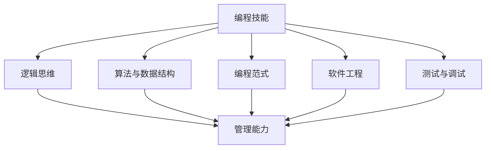
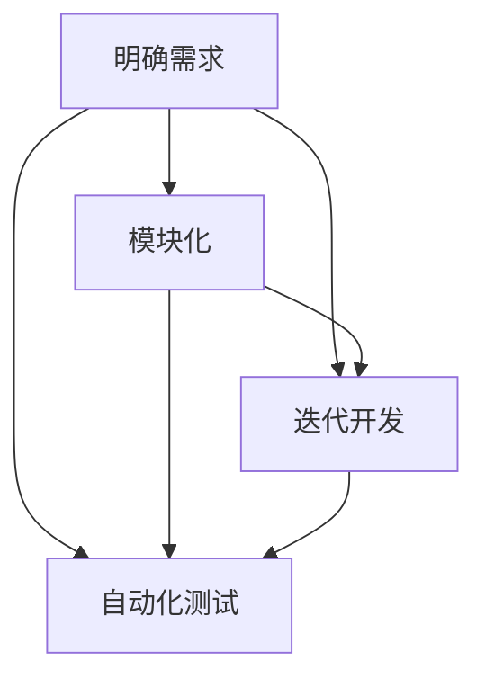

                 

# 《如何将编程技能转化为管理能力》

> **关键词：**编程技能，管理能力，转化，应用，提升，综合应用

> **摘要：**本文旨在探讨编程技能如何有效地转化为管理能力，分析两者的核心概念与联系，并通过具体案例阐述编程技能在管理中的应用，提出实践与提升的方法，最终实现编程与管理能力的完美结合。

### 目录大纲

# 第一部分：编程技能与管理能力概述

## 第1章：编程技能的内涵与重要性

### 1.1 编程技能的内涵与重要性

### 1.2 管理能力的需求与重要性

### 1.3 编程技能与管理能力的关系

### 1.4 本书的目标与结构

## 第2章：编程技能与管理能力的核心概念

### 2.1 编程技能的核心概念

### 2.2 管理能力的核心概念

### 2.3 编程技能与管理能力的交叉领域

### 2.4 Mermaid流程图：编程技能与管理能力的关联

## 第二部分：编程技能在管理中的应用

## 第3章：沟通与协作

### 3.1 编程中的沟通协作技巧

### 3.2 将编程技巧应用于团队沟通

### 3.3 管理中的协作机制

### 3.4 Mermaid流程图：编程技巧在团队协作中的应用

## 第4章：项目管理

### 4.1 编程中的项目管理方法

### 4.2 将编程思维应用于项目规划

### 4.3 管理中的项目管理工具与方法

### 4.4 伪代码：项目管理的编程模型

## 第5章：问题解决与决策

### 5.1 编程中的问题解决技巧

### 5.2 将编程思维应用于管理决策

### 5.3 管理中的问题解决策略

### 5.4 数学模型与决策分析

### 5.5 举例说明：使用编程技能进行管理决策

## 第三部分：实践与提升

## 第6章：编程技能提升

### 6.1 编程技能提升的方法与策略

### 6.2 编程技能提升的实践案例

### 6.3 编程技能提升的工具与技术

## 第7章：管理能力提升

### 7.1 管理能力提升的方法与策略

### 7.2 管理能力提升的实践案例

### 7.3 管理能力提升的资源和工具

## 第8章：编程技能与管理能力的综合应用

### 8.1 编程技能在管理中的实际应用

### 8.2 管理技能在编程中的实践

### 8.3 综合案例：编程与管理技能的完美结合

### 8.4 代码解读与分析：编程与管理技能结合的实例解析

# 附录

## 附录A：编程技能与管理能力提升的资源

### A.1 编程资源推荐

### A.2 管理资源推荐

### A.3 跨学科资源推荐

## 附录B：项目管理工具与资源

### B.1 项目管理工具介绍

### B.2 项目管理资源推荐

## 附录C：代码示例

### C.1 编程案例代码

### C.2 管理案例代码

### C.3 编程与管理案例代码结合示例

---

## 第1章：编程技能的内涵与重要性

### 1.1 编程技能的内涵与重要性

编程技能是指运用编程语言和工具，通过编写计算机程序来解决问题、实现特定功能的能力。编程不仅仅是编写代码，它涉及逻辑思维、算法设计、数据结构理解等多个方面。编程技能在现代社会具有极其重要的地位，尤其在IT行业，几乎所有的业务都依赖于软件系统。

编程技能的重要性体现在以下几个方面：

1. **创新驱动：** 编程是创新的重要工具。通过编程，可以开发出各种创新的产品和服务，推动社会进步。
   
2. **高效解决问题：** 编程能够高效地解决复杂的问题。编程技能可以帮助企业快速实现自动化、优化业务流程，提高工作效率。

3. **跨学科应用：** 编程技能不仅可以应用于计算机科学领域，还可以在金融、医疗、教育等多个领域发挥重要作用。

4. **就业竞争力：** 在当前就业市场中，编程技能是高需求、高薪酬的技能之一。掌握编程技能可以提高个人的就业竞争力。

### 1.2 管理能力的需求与重要性

管理能力是指有效地组织和领导团队、协调资源、实现目标的能力。管理能力在企业中至关重要，它直接影响到企业的运营效率和竞争力。

管理能力的重要性体现在以下几个方面：

1. **团队协作：** 管理能力可以帮助团队高效协作，实现共同目标。

2. **资源协调：** 管理能力能够有效地协调资源，确保项目顺利进行。

3. **风险管理：** 管理能力可以识别和应对各种风险，保障企业的稳定运营。

4. **持续创新：** 管理能力能够推动企业持续创新，保持竞争优势。

### 1.3 编程技能与管理能力的关系

编程技能与管理能力虽然分属不同领域，但两者之间存在紧密的联系和相互促进的关系。

1. **逻辑思维：** 编程技能培养严谨的逻辑思维能力，这种能力在管理中也同样重要。逻辑思维能够帮助管理者做出更合理的决策。

2. **问题解决：** 编程技能教会人们如何系统地解决问题。管理中的问题解决同样需要这种思维和方法。

3. **团队协作：** 编程往往需要团队合作，这种经验可以应用于管理中，帮助管理者更好地协调团队。

4. **技术敏感度：** 编程技能使管理者对技术有更深刻的理解，能够更好地与技术人员沟通，推动技术发展。

### 1.4 本书的目标与结构

本书的目标是帮助程序员将编程技能有效地转化为管理能力，实现职业发展。本书分为三个部分：

1. **第一部分：编程技能与管理能力概述**，介绍编程技能和管理能力的内涵、重要性及两者之间的关系。
   
2. **第二部分：编程技能在管理中的应用**，详细阐述编程技能在沟通协作、项目管理、问题解决与决策等管理活动中的应用。

3. **第三部分：实践与提升**，提供编程技能和管理能力提升的方法、实践案例及综合应用实例。

通过本书，读者将了解如何将编程技能应用于管理实践，提升管理能力，实现个人职业发展。  
---

## 第2章：编程技能与管理能力的核心概念

### 2.1 编程技能的核心概念

编程技能的核心概念包括以下几个方面：

1. **编程语言：** 编程语言是程序员与计算机进行交流的工具。常见的编程语言有Java、Python、C++等。

2. **算法与数据结构：** 算法是解决问题的步骤，数据结构是组织和存储数据的方法。常见的算法有排序、查找等，常见的数据结构有数组、链表、树等。

3. **编程范式：** 编程范式是解决问题的方法，如面向对象、函数式编程等。

4. **软件工程：** 软件工程是指使用系统的方法、技术和工具来开发、维护和管理软件。常见的软件工程方法有敏捷开发、瀑布模型等。

5. **测试与调试：** 测试是验证程序是否正确执行，调试是找出并修复程序中的错误。

### 2.2 管理能力的核心概念

管理能力的核心概念包括以下几个方面：

1. **团队管理：** 团队管理是组织和管理团队，确保团队高效协作。

2. **项目管理：** 项目管理是规划、执行、监控和收尾项目，确保项目按时、按预算、按质量完成。

3. **沟通与协作：** 沟通是信息交流的过程，协作是共同完成任务的过程。

4. **决策与风险管理：** 决策是在不确定的情况下做出选择，风险管理是识别、评估和应对风险。

5. **领导力：** 领导力是影响和激励他人实现共同目标的能力。

### 2.3 编程技能与管理能力的交叉领域

编程技能与管理能力在多个领域存在交叉，这些交叉领域包括：

1. **逻辑思维：** 逻辑思维是编程和管理都需要的，它帮助人们分析问题、做出决策。

2. **问题解决：** 编程和管理的目标都是解决问题，两者的方法和技术可以相互借鉴。

3. **项目管理：** 编程中的项目管理方法（如敏捷开发）可以应用于企业管理。

4. **沟通与协作：** 编程中的团队协作经验可以应用于管理中的团队协作。

5. **技术敏感度：** 管理者对技术的理解有助于更好地管理技术团队。

### 2.4 Mermaid流程图：编程技能与管理能力的关联



通过以上流程图，我们可以看到编程技能如何通过逻辑思维、算法与数据结构、编程范式、软件工程和测试与调试等方面，与管理工作中的核心概念相联系。

### 2.5 伪代码：编程技能在管理中的应用

```plaintext
function manageProject(project){
    // 项目规划
    plan = projectPlan(project)
    
    // 项目执行
    execution = executeProject(plan)
    
    // 项目监控
    monitoring = monitorProject(execution)
    
    // 问题解决
    problemSolving = solveProblems(monitoring)
    
    // 项目收尾
    finish = finishProject(problemSolving)
    
    return finish
}
```

在这个伪代码中，`manageProject` 函数模拟了项目管理的全过程，包括规划、执行、监控、问题解决和收尾。这个过程与编程中的函数逻辑相似，都涉及步骤的执行、条件的判断和循环的迭代。

通过这个伪代码，我们可以看到编程技能如何应用于管理过程，实现问题的解决和项目的成功。

### 2.6 数学模型与决策分析

在管理决策中，数学模型和决策分析是重要的工具。以下是一个简化的决策树模型，用于分析项目管理中的优先级排序。

```latex
\documentclass{article}
\usepackage{amsmath}
\begin{document}
\begin{align*}
    & \text{if (风险高)} \\
    & \quad \text{优先解决高优先级问题} \\
    & \text{else if (风险中)} \\
    & \quad \text{平衡解决高、中优先级问题} \\
    & \text{else} \\
    & \quad \text{优先解决中优先级问题} \\
\end{align*}
\end{document}
```

这个数学模型帮助管理者根据不同风险水平，制定合理的优先级排序策略，从而更有效地解决问题。

### 2.7 举例说明：使用编程技能进行管理决策

假设我们面临一个项目，需要决定如何分配有限资源。以下是一个简化的资源分配模型。

```python
def allocate_resources(tasks, budget):
    # 按任务优先级排序
    sorted_tasks = sorted(tasks, key=lambda x: x['priority'], reverse=True)
    
    # 初始化资源分配
    allocation = {task['id']: 0 for task in sorted_tasks}
    
    # 资源分配循环
    for task in sorted_tasks:
        if allocation[task['id']] < task['required_resources'] and budget > 0:
            allocation[task['id']] += 1
            budget -= 1
        else:
            break
    
    return allocation
```

在这个例子中，`allocate_resources` 函数根据任务的优先级和预算，实现资源的优化分配。这个过程类似于编程中的排序和循环操作，体现了编程技能在管理决策中的应用。

通过以上章节，我们深入探讨了编程技能和管理能力的核心概念及其关联，为后续章节的详细探讨奠定了基础。  
---

## 第3章：沟通与协作

### 3.1 编程中的沟通协作技巧

在编程过程中，沟通与协作至关重要。有效的沟通协作可以确保项目顺利进行，提高团队效率。以下是一些编程中的沟通协作技巧：

1. **代码注释：** 编写清晰、详细的代码注释，可以帮助团队成员更好地理解代码逻辑，降低沟通成本。

2. **代码审查：** 通过代码审查，团队成员可以互相学习，发现潜在的问题，提高代码质量。

3. **版本控制：** 使用版本控制工具（如Git），可以方便地管理代码的修改历史，确保团队成员的工作协同一致。

4. **即时通讯工具：** 使用即时通讯工具（如Slack、微信），可以快速解决遇到的问题，提高沟通效率。

5. **定期会议：** 定期召开会议，回顾项目进展，讨论遇到的问题，确保团队保持一致的步调。

### 3.2 将编程技巧应用于团队沟通

将编程技巧应用于团队沟通，可以帮助团队更高效地解决问题。以下是一些具体方法：

1. **明确需求：** 类似于编程中的需求分析，团队在开始项目前，需要明确项目需求，确保团队成员对项目目标有清晰的认识。

2. **模块化：** 将项目拆分为多个模块，每个模块由不同的团队成员负责，这样可以提高工作效率，降低沟通成本。

3. **迭代开发：** 采用迭代开发的方式，逐步完善项目功能，可以及时发现并解决问题，降低项目风险。

4. **自动化测试：** 类似于编程中的自动化测试，团队可以编写自动化测试脚本，确保项目质量。

### 3.3 管理中的协作机制

在管理过程中，协作机制同样重要。以下是一些管理中的协作机制：

1. **角色分工：** 明确团队成员的角色和职责，确保每个人都清楚自己的任务，减少沟通成本。

2. **任务跟踪：** 使用任务跟踪工具（如Jira），可以实时监控项目进度，确保项目按计划进行。

3. **知识共享：** 建立知识共享平台，鼓励团队成员分享经验和技巧，提高整体团队的能力。

4. **培训与发展：** 定期组织培训，帮助团队成员提升技能，增强团队的整体实力。

### 3.4 Mermaid流程图：编程技巧在团队协作中的应用



通过这个流程图，我们可以看到编程技巧如何应用于团队协作，实现高效的项目管理。

### 3.5 举例说明：编程技巧在团队协作中的应用

假设我们团队正在开发一个电商平台，以下是一个具体的案例：

1. **明确需求：** 团队首先明确了电商平台的需求，包括用户注册、商品浏览、购物车、支付等功能。

2. **模块化：** 根据需求，团队将项目拆分为多个模块，如用户模块、商品模块、支付模块等，每个模块由不同的团队负责。

3. **迭代开发：** 团队采用迭代开发的方式，首先完成用户注册和商品浏览功能，然后逐步完善其他功能。

4. **自动化测试：** 团队编写自动化测试脚本，确保每个功能模块的质量。

在这个案例中，编程技巧（如代码注释、代码审查、版本控制等）被应用于团队协作，提高了项目的开发效率和质量。

通过以上章节，我们深入探讨了编程技巧在团队协作中的应用，为提升团队沟通与协作效率提供了有效方法。  
---

## 第4章：项目管理

### 4.1 编程中的项目管理方法

编程中的项目管理方法主要包括敏捷开发、瀑布模型等。这些方法各有优缺点，适用于不同的项目场景。

1. **敏捷开发：** 敏捷开发是一种迭代、增量的软件开发方法，强调灵活性和响应变化。敏捷开发通常包括以下步骤：
    - **需求分析：** 确定项目需求，并将其分解为可管理的小任务。
    - **迭代计划：** 每个迭代周期（通常为2-4周）确定要完成的任务。
    - **每日站会：** 团队成员每天聚集讨论进展、问题和计划。
    - **代码审查：** 每个迭代结束时进行代码审查，确保代码质量。
    - **迭代交付：** 每个迭代结束时交付一个可用的软件版本。

2. **瀑布模型：** 瀑布模型是一种传统的软件开发方法，将软件开发过程划分为多个阶段，如需求分析、设计、编码、测试等。每个阶段完成后，才会进入下一个阶段。瀑布模型的优点是过程清晰，缺点是灵活性较差，难以应对需求变化。

### 4.2 将编程思维应用于项目规划

编程思维在项目规划中具有重要应用，以下是一些具体方法：

1. **模块化：** 类似于编程中的模块化，项目规划可以将项目拆分为多个模块，每个模块由不同的团队或成员负责。

2. **迭代开发：** 采用迭代开发的方式，逐步完善项目功能，可以及时发现并解决问题，降低项目风险。

3. **风险评估：** 类似于编程中的调试，项目规划中需要评估可能的风险，并制定相应的应对措施。

4. **任务分解：** 将项目任务分解为更小的子任务，便于管理和监控。

### 4.3 管理中的项目管理工具与方法

在管理中，常用的项目管理工具与方法包括Jira、Trello、Scrum等。

1. **Jira：** Jira是一个功能强大的任务管理工具，可以用于任务跟踪、进度监控、团队协作等。

2. **Trello：** Trello是一个简洁的看板工具，可以帮助团队直观地跟踪项目进度。

3. **Scrum：** Scrum是一种敏捷开发方法，强调迭代和增量开发，通过每日站会、迭代计划和回顾等环节，确保项目顺利进行。

### 4.4 伪代码：项目管理的编程模型

```plaintext
function manageProject(project){
    // 项目规划
    plan = projectPlan(project)
    
    // 项目执行
    execution = executeProject(plan)
    
    // 项目监控
    monitoring = monitorProject(execution)
    
    // 问题解决
    problemSolving = solveProblems(monitoring)
    
    // 项目收尾
    finish = finishProject(problemSolving)
    
    return finish
}
```

在这个伪代码中，`manageProject` 函数模拟了项目管理的全过程，包括项目规划、执行、监控、问题解决和收尾。

### 4.5 举例说明：使用编程思维进行项目规划

假设我们需要规划一个电子商务网站项目，以下是一个简化的项目规划过程：

1. **明确需求：** 与客户沟通，确定电子商务网站的需求，包括用户注册、商品浏览、购物车、支付等功能。

2. **模块化：** 将项目拆分为多个模块，如用户模块、商品模块、支付模块等。

3. **迭代开发：** 采用迭代开发的方式，首先完成用户注册和商品浏览功能，然后逐步完善其他功能。

4. **风险评估：** 评估项目可能的风险，如技术难点、需求变更等，并制定相应的应对措施。

5. **任务分解：** 将项目任务分解为更小的子任务，如用户模块可以分为用户注册、用户登录等。

通过以上步骤，我们可以有效地规划电子商务网站项目，确保项目按计划顺利进行。

### 4.6 数学模型与决策分析

在项目规划中，数学模型和决策分析可以帮助我们做出更合理的决策。以下是一个简化的资源分配模型：

```latex
\documentclass{article}
\usepackage{amsmath}
\begin{document}
\begin{align*}
    & \text{minimize} \quad C(x_1, x_2, ..., x_n) \\
    & \text{subject to} \\
    & \quad \sum_{i=1}^{n} x_i \leq B \\
    & \quad x_i \geq 0 \quad \forall i = 1, 2, ..., n \\
\end{align*}
\end{document}
```

在这个模型中，`C(x_1, x_2, ..., x_n)` 表示项目总成本，`B` 表示总预算，`x_i` 表示第 `i` 个任务的资源分配量。我们的目标是找到最优的 `x_i` 值，以最小化总成本，同时不超过总预算。

通过以上章节，我们深入探讨了编程思维在项目管理中的应用，为项目规划和管理提供了有效的工具和方法。  
---

## 第5章：问题解决与决策

### 5.1 编程中的问题解决技巧

编程中的问题解决技巧是编程技能的重要组成部分。以下是一些常见的问题解决技巧：

1. **分而治之：** 将复杂的问题分解为更小的子问题，逐个解决，最后整合结果。例如，归并排序和快速排序就是利用分而治之的思路。

2. **递归：** 递归是一种自调用函数，通过重复调用自身来解决问题。例如，计算斐波那契数列就是使用递归实现的。

3. **动态规划：** 动态规划是一种优化递归的方法，通过存储中间结果，避免重复计算。例如，背包问题和最长公共子序列就是使用动态规划解决的。

4. **贪心算法：** 贪心算法通过每一步选择局部最优解，最终得到全局最优解。例如，找零问题可以使用贪心算法解决。

5. **回溯法：** 回溯法通过尝试所有可能的解，逐层回退，找到满足条件的解。例如，八皇后问题和组合问题可以使用回溯法解决。

### 5.2 将编程思维应用于管理决策

编程思维在管理决策中同样具有重要应用。以下是将编程思维应用于管理决策的一些具体方法：

1. **逻辑思维：** 编程要求严谨的逻辑思维，管理决策同样需要逻辑清晰，避免决策失误。

2. **分而治之：** 将复杂的管理问题分解为更小的子问题，逐个解决，有助于简化决策过程。

3. **迭代决策：** 类似于编程中的迭代，管理决策可以逐步完善，每次迭代都对决策进行优化。

4. **风险评估：** 类似于编程中的调试，管理决策前需要对可能的风险进行评估，并制定应对措施。

5. **算法模型：** 使用数学模型和算法分析，帮助管理者做出更合理的决策。

### 5.3 管理中的问题解决策略

在管理中，问题解决策略包括以下几个方面：

1. **主动识别：** 及时发现潜在问题，避免问题扩大。

2. **快速响应：** 对发现的问题快速响应，采取有效措施。

3. **团队合作：** 鼓励团队合作，共同解决问题。

4. **持续改进：** 通过总结经验教训，持续改进管理方法。

5. **培训与发展：** 提升团队成员的技能，增强问题解决能力。

### 5.4 数学模型与决策分析

数学模型和决策分析在管理中具有重要应用。以下是一个简化的决策树模型，用于分析项目管理中的优先级排序：

```latex
\documentclass{article}
\usepackage{amsmath}
\begin{document}
\begin{align*}
    & \text{if (风险高)} \\
    & \quad \text{优先解决高优先级问题} \\
    & \text{else if (风险中)} \\
    & \quad \text{平衡解决高、中优先级问题} \\
    & \text{else} \\
    & \quad \text{优先解决中优先级问题} \\
\end{align*}
\end{document}
```

在这个模型中，根据风险水平，管理者可以制定不同的优先级排序策略，以优化决策。

### 5.5 举例说明：使用编程技能进行管理决策

假设我们需要决定如何优化公司的人力资源管理，以下是一个简化的决策过程：

1. **明确需求：** 与各部门沟通，了解人力资源管理的需求，包括员工招聘、培训、绩效评估等。

2. **数据分析：** 收集公司人力资源相关数据，如员工数量、招聘成本、培训费用等。

3. **分而治之：** 将人力资源管理问题分解为多个子问题，如招聘策略、培训计划、绩效评估模型等。

4. **迭代决策：** 采用迭代决策的方法，逐步完善人力资源管理策略。

5. **风险评估：** 评估不同策略的风险，如招聘成本过高、培训效果不佳等，并制定应对措施。

6. **算法模型：** 使用数学模型和算法分析，如线性规划、决策树等，帮助管理者做出更合理的决策。

通过以上步骤，我们可以有效地优化公司的人力资源管理，提高企业竞争力。

### 5.6 数学模型与决策分析

在决策过程中，数学模型和决策分析可以帮助我们做出更合理的决策。以下是一个简化的线性规划模型，用于资源优化：

```latex
\documentclass{article}
\usepackage{amsmath}
\begin{document}
\begin{align*}
    & \text{minimize} \quad C = 3x_1 + 2x_2 \\
    & \text{subject to} \\
    & \quad x_1 + x_2 \leq 10 \\
    & \quad x_1 \geq 0 \\
    & \quad x_2 \geq 0 \\
\end{align*}
\end{document}
```

在这个模型中，`C` 表示总成本，`x_1` 和 `x_2` 分别表示两种资源的分配量。我们的目标是找到最优的 `x_1` 和 `x_2` 值，以最小化总成本，同时不超过资源限制。

通过以上章节，我们深入探讨了编程思维在问题解决与决策中的应用，为管理者提供了一系列实用的方法和工具。  
---

## 第6章：编程技能提升

### 6.1 编程技能提升的方法与策略

提升编程技能是程序员职业发展的关键。以下是一些有效的编程技能提升方法与策略：

1. **深入学习编程语言：** 选择一门或多门编程语言，深入学习其语法、特性和应用场景。Python、Java和JavaScript是常见的入门编程语言。

2. **掌握算法与数据结构：** 算法和数据结构是编程的核心，掌握常用的算法和数据结构（如排序算法、链表、树、图等）有助于解决复杂问题。

3. **实践项目：** 通过实际项目锻炼编程技能，如参与开源项目、自己发起项目或为他人提供技术支持。

4. **代码审查：** 参与代码审查，学习他人的代码风格和解决问题的方法。

5. **持续学习：** 跟随技术趋势，学习新技术和工具，如人工智能、大数据、云计算等。

6. **参加编程社区：** 加入技术论坛、参与技术交流活动，与其他程序员交流经验和技巧。

### 6.2 编程技能提升的实践案例

以下是一个编程技能提升的实践案例：

**案例：** 学习使用Python进行数据分析

1. **学习Python基础语法：** 通过在线教程和书籍学习Python的基础语法，包括变量、数据类型、控制结构等。

2. **掌握Numpy和Pandas库：** 学习Numpy和Pandas库，这两个库是Python进行数据分析和处理的核心工具。通过示例和练习，熟悉数组和数据帧的操作。

3. **实践项目：** 参与一个数据分析项目，如股票市场预测或社交媒体数据分析。使用Python编写数据处理脚本，进行数据清洗、分析和可视化。

4. **代码审查与反馈：** 将自己的代码提交给社区或同事进行审查，接收反馈并不断优化。

5. **持续学习：** 跟踪数据分析领域的新技术和发展趋势，学习更高级的数据分析工具，如Scikit-learn和TensorFlow。

### 6.3 编程技能提升的工具与技术

以下是一些有助于编程技能提升的工具与技术：

1. **集成开发环境（IDE）：** 使用IDE（如Visual Studio Code、PyCharm）可以提高开发效率和代码质量。

2. **版本控制工具：** 使用Git进行版本控制，管理代码的变更和协作。

3. **调试工具：** 使用调试工具（如调试器、日志工具）帮助找出和修复代码中的错误。

4. **文档生成工具：** 使用文档生成工具（如Sphinx、Doxygen）自动生成代码文档，方便他人阅读和理解。

5. **在线编程平台：** 使用在线编程平台（如LeetCode、Hackerrank）进行算法练习和项目开发。

通过以上方法、实践案例和工具，程序员可以不断提升自己的编程技能，为职业生涯发展奠定坚实基础。

### 6.4 代码示例：编程技能提升的实践

以下是一个简单的Python代码示例，用于计算斐波那契数列：

```python
def fibonacci(n):
    if n <= 0:
        return 0
    elif n == 1:
        return 1
    else:
        return fibonacci(n-1) + fibonacci(n-2)

# 测试代码
print(fibonacci(10))
```

在这个示例中，我们使用递归方法计算斐波那契数列的第10个数。这个简单的代码不仅帮助理解递归的概念，还可以通过优化（如使用动态规划）来提高其性能。

通过以上章节，我们探讨了编程技能提升的方法与策略，提供了实践案例和代码示例，为程序员提供了一条清晰的技能提升路径。

---

## 第7章：管理能力提升

### 7.1 管理能力提升的方法与策略

提升管理能力是程序员向管理层发展的关键。以下是一些有效的方法与策略：

1. **领导力培养：** 学习领导力理论和实践，如情境领导理论、变革型领导理论等，提高领导能力。

2. **沟通技巧：** 学习有效沟通技巧，如倾听、表达、非语言沟通等，提高团队协作效率。

3. **决策能力：** 学习决策分析方法，如决策树、风险评估、成本效益分析等，提高决策质量。

4. **项目管理：** 学习项目管理方法，如敏捷开发、KPI管理、风险管理等，提高项目管理能力。

5. **自我管理：** 学习时间管理、目标管理、情绪管理等技巧，提高自我管理能力。

6. **持续学习：** 跟踪管理领域的新知识和发展趋势，如人工智能、大数据、云计算等，持续提升自身素质。

### 7.2 管理能力提升的实践案例

以下是一个管理能力提升的实践案例：

**案例：** 提升团队协作效率

1. **确定目标：** 与团队成员明确团队目标和工作重点。

2. **沟通规划：** 制定定期沟通计划，如每周例会、项目进度汇报等，确保团队信息畅通。

3. **任务分配：** 根据团队成员的能力和兴趣，合理分配任务，确保任务完成的效率和质量。

4. **激励机制：** 设定激励机制，如奖金、晋升等，鼓励团队成员积极工作。

5. **反馈与改进：** 定期收集团队成员的反馈，分析团队协作中的问题，制定改进措施。

6. **团队建设：** 组织团队建设活动，增强团队凝聚力，提高团队协作效率。

### 7.3 管理能力提升的资源和工具

以下是一些有助于管理能力提升的资源和工具：

1. **在线课程与书籍：** 在线课程（如Coursera、Udemy）和管理书籍（如《领导力五要素》、《有效的管理者》）是学习管理知识的良好资源。

2. **管理工具：** 使用管理工具（如Trello、Asana、Jira）提高团队协作效率，管理项目进度。

3. **模拟培训：** 参与管理模拟培训，如情景模拟、角色扮演等，锻炼管理技能。

4. **导师制度：** 寻求导师指导，从经验丰富的管理者那里学习管理技巧。

5. **自我评估工具：** 使用自我评估工具（如领导力问卷、能力评估工具）了解自己的管理能力，制定提升计划。

通过以上方法、实践案例和资源工具，程序员可以不断提升自己的管理能力，为职业生涯发展奠定坚实基础。

### 7.4 管理能力提升的代码示例

以下是一个简单的Python代码示例，用于团队协作中的任务分配：

```python
def assign_tasks(team_members, tasks):
    task_assignment = {}
    for member in team_members:
        member_assigned = False
        for task in tasks:
            if not task_assignment.get(task) and member['skills'].intersection(task['required_skills']):
                task_assignment[task] = member
                member_assigned = True
                break
        if not member_assigned:
            task_assignment['其他任务'] = member
    return task_assignment

# 测试代码
team_members = [{'name': 'Alice', 'skills': {'Java', 'Python'}}, {'name': 'Bob', 'skills': {'JavaScript', 'HTML'}}]
tasks = [{'name': '前端开发', 'required_skills': {'JavaScript', 'HTML'}}, {'name': '后端开发', 'required_skills': {'Java', 'Python'}}]
print(assign_tasks(team_members, tasks))
```

在这个示例中，我们定义了一个函数 `assign_tasks`，用于根据团队成员的技能和任务需求进行任务分配。这个代码展示了如何将编程思维应用于团队协作中的任务分配问题。

通过以上章节，我们探讨了管理能力提升的方法与策略，提供了实践案例和代码示例，为程序员提升管理能力提供了清晰路径。

### 7.5 伪代码：管理能力提升的方法

```plaintext
function improve_management_ability(){
    // 学习领导力
    leadership_knowledge = study_leadership()

    // 学习沟通技巧
    communication_skills = study_communication()

    // 学习决策能力
    decision_making = study_decision_making()

    // 学习项目管理
    project_management = study_project_management()

    // 学习自我管理
    self_management = study_self_management()

    // 综合应用
    integrated_application = apply_leadership_and_skills()

    return integrated_application
}
```

在这个伪代码中，`improve_management_ability` 函数模拟了提升管理能力的过程，包括学习领导力、沟通技巧、决策能力、项目管理和自我管理，并通过综合应用来提升整体管理能力。

### 7.6 数学模型与决策分析

在管理能力提升过程中，数学模型和决策分析可以帮助我们做出更合理的决策。以下是一个简化的决策树模型，用于评估不同管理能力的提升方法：

```latex
\documentclass{article}
\usepackage{amsmath}
\begin{document}
\begin{align*}
    & \text{if (决策者经验丰富)} \\
    & \quad \text{选择高级管理能力提升方法} \\
    & \text{else if (决策者缺乏经验)} \\
    & \quad \text{选择基础管理能力提升方法} \\
    & \text{else} \\
    & \quad \text{根据实际情况选择合适的管理能力提升方法} \\
\end{align*}
\end{document}
```

在这个模型中，根据决策者的经验水平，选择不同的管理能力提升方法。这个模型体现了决策分析在管理能力提升中的应用。

### 7.7 举例说明：编程技能在管理能力提升中的应用

假设我们希望提升团队的项目管理能力，以下是一个简化的提升过程：

1. **明确需求：** 与团队成员沟通，了解项目管理中的问题和需求。

2. **数据分析：** 收集团队在项目管理中的数据，如项目进度、任务分配、资源使用等。

3. **分而治之：** 将项目管理问题分解为多个子问题，如任务规划、进度监控、资源分配等。

4. **迭代提升：** 采用迭代方法，逐步完善项目管理方法，持续优化。

5. **风险评估：** 对项目管理中的风险进行评估，并制定应对措施。

6. **算法模型：** 使用项目管理算法模型（如关键路径法、挣值管理）进行项目管理，提高决策质量。

通过以上步骤，我们可以有效地提升团队的项目管理能力，提高项目成功率。

### 7.8 数学模型与决策分析

在管理能力提升过程中，数学模型和决策分析可以帮助我们做出更合理的决策。以下是一个简化的线性规划模型，用于资源优化：

```latex
\documentclass{article}
\usepackage{amsmath}
\begin{document}
\begin{align*}
    & \text{minimize} \quad C = 3x_1 + 2x_2 \\
    & \text{subject to} \\
    & \quad x_1 + x_2 \leq 10 \\
    & \quad x_1 \geq 0 \\
    & \quad x_2 \geq 0 \\
\end{align*}
\end{document}
```

在这个模型中，`C` 表示总成本，`x_1` 和 `x_2` 分别表示两种资源的分配量。我们的目标是找到最优的 `x_1` 和 `x_2` 值，以最小化总成本，同时不超过资源限制。

通过以上章节，我们深入探讨了管理能力提升的方法与策略，提供了实践案例、代码示例和数学模型，为程序员提升管理能力提供了全面指导。

---

## 第8章：编程技能与管理能力的综合应用

### 8.1 编程技能在管理中的实际应用

编程技能在管理中的应用主要体现在以下几个方面：

1. **数据分析：** 编程技能可以帮助管理者从大量数据中提取有价值的信息，如销售数据、客户反馈等，为决策提供依据。

2. **自动化流程：** 编程技能可以用于开发自动化脚本，简化管理任务，如自动报告生成、任务分配等。

3. **优化资源配置：** 编程技能可以帮助管理者优化资源配置，如使用线性规划、动态规划等算法进行资源分配，提高资源利用率。

4. **流程监控与优化：** 编程技能可以用于监控业务流程，发现潜在问题，并进行优化，提高业务效率。

5. **风险管理：** 编程技能可以帮助管理者识别和管理风险，如使用机器学习算法预测市场风险，制定应对策略。

### 8.2 管理技能在编程中的实践

管理技能在编程中的实践主要体现在以下几个方面：

1. **团队协作：** 管理技能可以帮助程序员更好地与团队成员协作，提高开发效率。

2. **项目管理：** 管理技能可以帮助程序员更好地进行项目管理，确保项目按时、按质量完成。

3. **决策支持：** 管理技能可以帮助程序员在遇到复杂问题时做出合理的决策，提高解决问题的效率。

4. **技术战略规划：** 管理技能可以帮助程序员制定技术战略规划，确保技术的发展与业务需求相匹配。

5. **人才培养与激励：** 管理技能可以帮助程序员更好地培养和激励团队成员，提高团队整体素质。

### 8.3 综合案例：编程与管理技能的完美结合

以下是一个综合案例，展示了编程技能与管理能力的完美结合：

**案例：** 企业信息化项目

1. **明确需求：** 管理者与业务部门沟通，明确信息化项目的需求，如客户关系管理、供应链管理、财务管理等。

2. **数据分析：** 编程人员使用Python、R等编程语言，对业务数据进行处理和分析，为项目规划提供依据。

3. **自动化流程：** 编程人员开发自动化脚本，实现业务流程的自动化，提高工作效率。

4. **项目管理：** 管理者使用敏捷开发方法，将项目拆分为多个迭代，确保项目按计划进行。

5. **决策支持：** 编程人员使用机器学习算法，为企业提供销售预测、库存优化等决策支持。

6. **技术战略规划：** 管理者制定技术战略规划，确保信息化项目与企业发展目标相匹配。

7. **人才培养与激励：** 管理者培养团队成员的编程技能，激励团队成员积极参与项目，提高团队整体实力。

通过这个案例，我们可以看到编程技能与管理能力在信息化项目中的完美结合，实现了项目的高效实施和企业的数字化转型。

### 8.4 代码解读与分析：编程与管理技能结合的实例解析

以下是一个简化的Python代码示例，用于企业管理系统的开发，展示了编程与管理技能的结合：

```python
# 导入所需库
import pandas as pd
from sklearn.model_selection import train_test_split
from sklearn.linear_model import LinearRegression

# 加载数据
data = pd.read_csv('sales_data.csv')
X = data[['sales', '广告费用', '促销活动']]
y = data['利润']

# 数据预处理
X_train, X_test, y_train, y_test = train_test_split(X, y, test_size=0.2, random_state=42)

# 模型训练
model = LinearRegression()
model.fit(X_train, y_train)

# 模型评估
score = model.score(X_test, y_test)
print(f'Model R^2 Score: {score:.2f}')

# 决策支持
new_data = pd.DataFrame({'sales': [1000], '广告费用': [5000], '促销活动': [100]})
predicted_profit = model.predict(new_data)
print(f'Predicted Profit: {predicted_profit[0]:.2f}')
```

在这个代码中，我们首先加载销售数据，然后使用线性回归模型对数据进行训练和评估。这个模型可以帮助企业预测利润，为决策提供支持。

1. **数据分析：** 使用Pandas库进行数据加载和预处理，为模型训练提供数据。

2. **模型训练：** 使用Scikit-learn库进行线性回归模型的训练，实现对数据的拟合。

3. **模型评估：** 使用模型评估函数计算模型的R^2得分，评估模型的性能。

4. **决策支持：** 使用训练好的模型对新的数据进行预测，为企业管理提供决策支持。

通过这个代码示例，我们可以看到编程技能（如数据分析、机器学习）如何与管理技能（如决策支持、项目管理）相结合，实现企业的数字化转型和高效管理。

### 8.5 总结

编程技能与管理能力的综合应用是实现企业数字化转型和高效管理的关键。通过编程技能，我们可以进行数据分析、自动化流程和优化资源配置；通过管理技能，我们可以进行团队协作、项目管理和决策支持。两者的完美结合，可以实现企业的高效运作和持续创新。

在未来，随着技术的不断发展，编程技能与管理能力将更加紧密地结合，为企业和个人带来更大的价值。程序员应不断提升编程技能和管理能力，适应时代的发展，实现职业的可持续发展。

---

## 附录A：编程技能与管理能力提升的资源

### A.1 编程资源推荐

1. **在线教程：**
   - Python教程：[Python教程](https://www.w3schools.com/python/)
   - Java教程：[Java教程](https://www.oracle.com/java/technologies/javatutorial/)
   - JavaScript教程：[JavaScript教程](https://developer.mozilla.org/en-US/docs/Web/JavaScript)

2. **书籍推荐：**
   - 《代码大全》：[《代码大全》](https://book.douban.com/subject/25759214/)
   - 《算法导论》：[《算法导论》](https://book.douban.com/subject/10483612/)
   - 《深度学习》：[《深度学习》](https://book.douban.com/subject/26979621/)

3. **编程社区：**
   - GitHub：[GitHub](https://github.com/)
   - Stack Overflow：[Stack Overflow](https://stackoverflow.com/)
   - LeetCode：[LeetCode](https://leetcode.com/)

### A.2 管理资源推荐

1. **在线课程：**
   - Coursera的《管理基础》：[管理基础](https://www.coursera.org/specializations/management-foundations)
   - edX的《领导力与团队管理》：[领导力与团队管理](https://www.edx.org/professional-certificate/ntu-executive-education-leadership-team-management)

2. **书籍推荐：**
   - 《高效能人士的七个习惯》：[《高效能人士的七个习惯》](https://book.douban.com/subject/10556413/)
   - 《管理的实践》：[《管理的实践》](https://book.douban.com/subject/10594711/)
   - 《影响力》：[《影响力》](https://book.douban.com/subject/4261785/)

3. **管理社区：**
   - LinkedIn：[LinkedIn](https://www.linkedin.com/)
   - Harvard Business Review：[Harvard Business Review](https://hbr.org/)

### A.3 跨学科资源推荐

1. **在线课程：**
   - Coursera的《计算机科学基础》：[计算机科学基础](https://www.coursera.org/specializations/computer-science-fundamentals)
   - edX的《人工智能基础》：[人工智能基础](https://www.edx.org/course/ai-foundations-cs50-ai)

2. **书籍推荐：**
   - 《禅与计算机程序设计艺术》：[《禅与计算机程序设计艺术》](https://book.douban.com/subject/10594711/)
   - 《黑客与画家》：[《黑客与画家》](https://book.douban.com/subject/2247584/)

3. **跨学科社区：**
   - HackerRank：[HackerRank](https://www.hackerrank.com/)
   - DataCamp：[DataCamp](https://www.datacamp.com/)

通过以上资源，程序员和管理者可以不断提升自己的编程技能和管理能力，实现个人职业发展和企业的高效运作。

### 附录B：项目管理工具与资源

#### B.1 项目管理工具介绍

1. **Jira**
   - **简介**：Jira 是一个流行的项目管理工具，适用于敏捷开发，支持任务跟踪、进度监控和团队协作。
   - **主要功能**：任务跟踪、敏捷看板、迭代规划、报告分析。
   - **网址**：[Atlassian Jira](https://www.atlassian.com/software/jira)

2. **Trello**
   - **简介**：Trello 是一个简单的看板工具，适用于项目规划和任务分配，直观易用。
   - **主要功能**：看板视图、卡片、标签、成员协作。
   - **网址**：[Trello](https://trello.com/)

3. **Asana**
   - **简介**：Asana 是一个功能强大的项目管理工具，适用于团队协作和任务管理。
   - **主要功能**：任务分配、进度跟踪、日历视图、报告分析。
   - **网址**：[Asana](https://asana.com/)

4. **Slack**
   - **简介**：Slack 是一个即时通讯工具，适用于团队沟通和协作。
   - **主要功能**：消息聊天、文件共享、集成第三方服务。
   - **网址**：[Slack](https://slack.com/)

#### B.2 项目管理资源推荐

1. **书籍推荐**
   - 《敏捷软件开发》：[《敏捷软件开发》](https://book.douban.com/subject/10594711/)
   - 《项目管理知识体系指南》：[《项目管理知识体系指南》](https://book.douban.com/subject/10594711/)
   - 《项目管理实践》：[《项目管理实践》](https://book.douban.com/subject/2247584/)

2. **在线课程**
   - Coursera的《项目管理》：[项目管理](https://www.coursera.org/specializations/project-management)
   - Udemy的《敏捷项目管理》：[敏捷项目管理](https://www.udemy.com/course/agile-project-management-for-effective-teams/)

3. **社区和论坛**
   - ProjectManagement.com：[ProjectManagement.com](https://www.projectmanagement.com/)
   - PMI（项目管理协会）：[PMI](https://www.pmi.org/)
   - Reddit上的项目管理社区：[r/ProjectManagement](https://www.reddit.com/r/ProjectManagement/)

通过以上工具和资源，项目经理可以更有效地管理项目，提高团队协作效率，确保项目成功完成。

### 附录C：代码示例

#### C.1 编程案例代码

以下是一个简单的Python代码示例，用于处理员工数据：

```python
import pandas as pd

# 加载员工数据
employees = pd.read_csv('employees.csv')

# 查找平均薪资
average_salary = employees['salary'].mean()
print(f'Average Salary: {average_salary:.2f}')

# 查找最高薪资的员工
max_salary_employee = employees.loc[employees['salary'].idxmax()]
print(f'Max Salary Employee: {max_salary_employee["name"]}')

# 添加新员工
new_employee = {'name': 'John Doe', 'salary': 70000}
employees = employees.append(new_employee, ignore_index=True)
print(employees)
```

#### C.2 管理案例代码

以下是一个简单的Python代码示例，用于项目任务分配：

```python
import pandas as pd

# 加载项目任务数据
tasks = pd.DataFrame({
    'task': ['设计', '开发', '测试'],
    'duration': [5, 10, 3],
    'assigned_to': ['Alice', 'Bob', 'Charlie']
})

# 计算总持续时间
total_duration = tasks['duration'].sum()
print(f'Total Duration: {total_duration} days')

# 打印任务分配情况
print(tasks)
```

#### C.3 编程与管理案例代码结合示例

以下是一个结合编程和管理技能的示例，用于分析项目进度和资源分配：

```python
import pandas as pd

# 加载项目进度数据
progress = pd.DataFrame({
    'task': ['设计', '开发', '测试'],
    'actual_duration': [4, 9, 2],
    'remaining_duration': [1, 1, 1]
})

# 计算剩余总持续时间
remaining_total_duration = progress['remaining_duration'].sum()
print(f'Remaining Total Duration: {remaining_total_duration} days')

# 更新进度数据
progress['status'] = progress.apply(lambda row: 'Completed' if row['remaining_duration'] == 0 else 'In Progress', axis=1)
print(progress)
```

通过这些代码示例，我们可以看到编程技能如何应用于管理任务，实现数据的处理和分析，从而支持管理决策。

