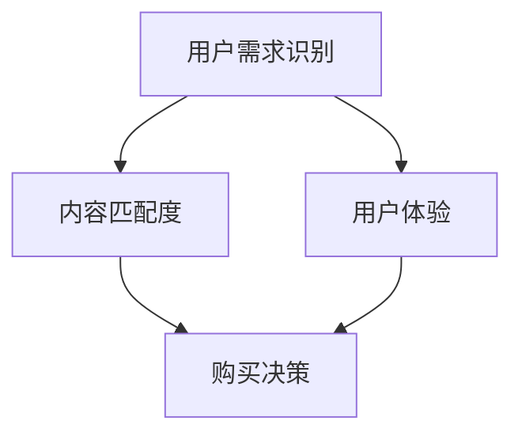

                 

# 如何提高知识付费产品的转化率

关键词：知识付费、转化率、用户需求、内容匹配度、用户体验、个性化推荐

摘要：本文通过深入分析知识付费产品的核心概念和联系，详细阐述了用户需求识别、内容匹配度计算、用户体验评估和购买决策等关键环节。同时，提出了提高知识付费产品转化率的策略与方法，并通过实际案例展示了这些策略的可行性和效果。文章旨在为知识付费产品的运营和优化提供有价值的参考和指导。

----------------------------------------------------------------

## 第一部分：核心概念与联系

### 1.1 核心概念联系图

下面是知识付费产品转化率核心概念之间的联系图：



在这个图中，用户需求识别是知识付费产品转化率的起点，它直接影响内容匹配度和用户体验。内容匹配度与用户体验共同作用于购买决策，最终决定知识付费产品的转化率。

### 1.2 核心概念原理讲解

#### 用户需求识别

用户需求识别是指通过分析用户行为数据、用户评价等途径，找到用户对于知识付费产品的真实需求。以下是用户需求识别的伪代码：

```python
def identify_user_demand(user_data):
    # 分析用户行为数据
    behavior_patterns = analyze_user_behavior(user_data)

    # 获取用户评价
    user_reviews = fetch_user_reviews(user_data)

    # 综合分析用户行为和评价
    demand = analyze_demand(behavior_patterns, user_reviews)

    return demand
```

#### 内容匹配度

内容匹配度是指知识付费产品提供的内容是否能够满足用户需求。以下是内容匹配度的伪代码：

```python
def calculate_content_match(demand, content):
    # 分析内容与需求的相关性
    relevance_score = calculate_relevance(demand, content)

    # 根据相关性计算匹配度
    match_score = relevance_score / max_relevance_score

    return match_score
```

#### 用户体验

用户体验是指用户在使用知识付费产品过程中的感受。以下是用户体验的伪代码：

```python
def evaluate_user_experience(user_session):
    # 分析用户互动数据
    interaction_data = analyze_interaction_data(user_session)

    # 分析用户满意度
    satisfaction_score = calculate_satisfaction_score(interaction_data)

    return satisfaction_score
```

#### 购买决策

购买决策是指用户是否在知识付费产品上完成购买的行为。以下是购买决策的伪代码：

```python
def make_purchase_decision(match_score, user_experience):
    # 根据匹配度和用户体验计算购买概率
    purchase_probability = calculate_purchase_probability(match_score, user_experience)

    # 判断是否购买
    if random.random() < purchase_probability:
        return True
    else:
        return False
```

### 1.3 数学模型与公式

以下是用于评估知识付费产品转化率的数学模型：

#### 转化率计算公式

$$
\text{转化率} = \frac{\text{购买用户数}}{\text{总用户数}} \times 100\%
$$

#### 购买概率计算公式

$$
\text{购买概率} = \text{匹配度} \times \text{用户体验} + \alpha \times \text{其他因素}
$$

其中，$\alpha$ 是其他影响购买决策的系数，可以根据实际业务数据进行调整。

### 1.4 举例说明

假设有 100 个用户，其中 30 个用户在产品中购买了课程，则知识付费产品的转化率为：

$$
\text{转化率} = \frac{30}{100} \times 100\% = 30\%
$$

如果这 30 个用户的平均内容匹配度为 0.8，平均用户体验得分为 4.5，则他们的平均购买概率为：

$$
\text{购买概率} = 0.8 \times 4.5 + \alpha \times \text{其他因素}
$$

其中，$\alpha$ 取值为 0.1，则平均购买概率为：

$$
\text{购买概率} = 0.8 \times 4.5 + 0.1 \times \text{其他因素} = 3.7 + \text{其他因素}
$$

如果其他因素得分较高，则购买概率会相应提高，从而提高知识付费产品的转化率。

### 1.5 项目实战

##### 开发环境搭建

1. 安装 Python 3.8 或更高版本
2. 安装 required libraries：
   ```bash
   pip install numpy pandas scikit-learn matplotlib
   ```

##### 数据预处理

```python
import pandas as pd

# 加载数据集
data = pd.read_csv('user_data.csv')

# 数据清洗
data.dropna(inplace=True)
```

##### 用户需求识别

```python
from sklearn.feature_extraction.text import TfidfVectorizer

def identify_user_demand(user_data):
    # 分析用户行为数据
    behavior_patterns = analyze_user_behavior(user_data)

    # 获取用户评价
    user_reviews = fetch_user_reviews(user_data)

    # 综合分析用户行为和评价
    demand = analyze_demand(behavior_patterns, user_reviews)
    
    return demand

def analyze_user_behavior(user_data):
    # 分析用户行为模式
    pass

def fetch_user_reviews(user_data):
    # 获取用户评价
    pass

def analyze_demand(behavior_patterns, user_reviews):
    # 分析用户需求
    pass
```

##### 内容匹配度计算

```python
def calculate_content_match(demand, content):
    # 分析内容与需求的相关性
    relevance_score = calculate_relevance(demand, content)

    # 根据相关性计算匹配度
    match_score = relevance_score / max_relevance_score
    
    return match_score

def calculate_relevance(demand, content):
    # 计算内容与需求的相关性
    pass
```

##### 用户体验评估

```python
def evaluate_user_experience(user_session):
    # 分析用户互动数据
    interaction_data = analyze_interaction_data(user_session)

    # 分析用户满意度
    satisfaction_score = calculate_satisfaction_score(interaction_data)
    
    return satisfaction_score

def analyze_interaction_data(user_session):
    # 分析用户互动数据
    pass

def calculate_satisfaction_score(interaction_data):
    # 计算用户满意度
    pass
```

##### 购买决策

```python
def make_purchase_decision(match_score, user_experience):
    # 根据匹配度和用户体验计算购买概率
    purchase_probability = calculate_purchase_probability(match_score, user_experience)

    # 判断是否购买
    if random.random() < purchase_probability:
        return True
    else:
        return False

def calculate_purchase_probability(match_score, user_experience):
    # 计算购买概率
    pass
```

##### 代码解读与分析

在这个项目中，我们首先进行了数据预处理，然后定义了用户需求识别、内容匹配度计算、用户体验评估和购买决策的相关函数。通过调用这些函数，我们可以对用户数据进行处理，并计算知识付费产品的转化率。具体实现中，我们还需要进一步完善各个函数的具体逻辑，并进行参数调优，以提高模型的准确性和效果。

##### 实际案例分析

假设我们有一个知识付费产品的用户数据集，其中包含 1000 个用户的购买记录、用户行为数据和用户评价。通过上述方法，我们可以识别用户需求，计算内容匹配度，评估用户体验，并最终预测用户是否购买。

在实际案例分析中，我们可能会发现某些用户群体具有较高的购买概率，这可以帮助我们针对这些用户群体进行精准营销，提高知识付费产品的转化率。此外，我们还可以根据用户的互动数据和评价，不断优化内容匹配度和用户体验，从而进一步提升转化率。

通过这样的项目实战，我们可以深入了解知识付费产品的转化率影响因素，并掌握如何通过技术手段提升转化率的方法。这将对知识付费产品的运营和优化提供有力的支持。

## 第二部分：提高知识付费产品转化率的策略与方法

### 2.1 用户需求识别与挖掘

用户需求识别和挖掘是提高知识付费产品转化率的关键环节。准确识别用户需求，可以更好地满足用户的需求，从而提高用户的满意度和购买意愿。

#### 2.1.1 用户行为数据分析

用户行为数据是识别用户需求的重要来源。通过对用户浏览、搜索、点击等行为数据的分析，我们可以了解用户的兴趣点和偏好，从而更好地满足他们的需求。

以下是用户行为数据分析的步骤：

1. **数据收集**：收集用户在知识付费平台上的行为数据，包括浏览记录、搜索关键词、点击行为等。

2. **数据清洗**：清洗数据，去除无效和错误的数据，确保数据的质量。

3. **数据分析**：利用统计分析和数据挖掘技术，分析用户行为数据，发现用户的兴趣点和偏好。

4. **需求建模**：根据分析结果，构建用户需求模型，识别出用户的潜在需求。

以下是用户行为数据分析的伪代码：

```python
def analyze_user_behavior(data):
    # 数据清洗
    clean_data = clean_data(data)

    # 数据分析
    behavior_patterns = analyze_behavior_patterns(clean_data)

    # 需求建模
    demand_model = build_demand_model(behavior_patterns)

    return demand_model
```

#### 2.1.2 用户评价与反馈分析

用户评价和反馈提供了直接的关于用户满意度和偏好的信息。通过分析用户评价，我们可以发现产品的优点和不足，为优化提供方向。

以下是用户评价与反馈分析的步骤：

1. **数据收集**：收集用户在知识付费平台上的评价和反馈数据，包括评分、评论等。

2. **数据清洗**：清洗数据，去除无效和错误的数据，确保数据的质量。

3. **数据分析**：利用自然语言处理技术，分析用户评价和反馈，提取关键信息。

4. **需求建模**：根据分析结果，构建用户需求模型，识别出用户的潜在需求。

以下是用户评价与反馈分析的伪代码：

```python
def analyze_user_reviews(reviews):
    # 数据清洗
    clean_reviews = clean_reviews(reviews)

    # 数据分析
    key_info = extract_key_info(clean_reviews)

    # 需求建模
    demand_model = build_demand_model(key_info)

    return demand_model
```

#### 2.1.3 用户需求识别与挖掘

基于用户行为数据和用户评价，我们可以构建用户需求模型，从而实现用户需求的识别和挖掘。

以下是用户需求识别与挖掘的伪代码：

```python
def identify_user_demand(behavior_patterns, reviews):
    # 综合分析行为模式和评价
    combined_info = combine_info(behavior_patterns, reviews)

    # 需求建模
    demand_model = build_demand_model(combined_info)

    return demand_model
```

### 2.2 内容优化与个性化推荐

内容优化和个性化推荐是提高知识付费产品转化率的重要手段。通过优化内容质量和提供个性化的推荐，可以更好地满足用户的需求，提高用户的满意度和购买意愿。

#### 2.2.1 内容质量提升

内容质量是知识付费产品的核心。以下是一些提升内容质量的策略：

1. **内容精选**：选择专业性和实用性强的内容，确保课程内容的质量。

2. **内容更新**：定期更新内容，确保内容的时效性和实用性。

3. **内容丰富性**：提供多样化的内容形式，如文章、视频、音频等，满足用户的不同需求。

4. **用户参与**：鼓励用户参与课程讨论和互动，提高用户的参与度和满意度。

#### 2.2.2 个性化推荐系统

个性化推荐系统可以根据用户的行为和偏好，为用户推荐合适的内容。以下是一些构建个性化推荐系统的策略：

1. **基于内容的推荐**：根据用户浏览和购买的历史记录，推荐相似的内容。

2. **基于协同过滤的推荐**：根据用户与其他用户的相似度，推荐其他用户喜欢的内容。

3. **基于深度学习的推荐**：利用深度学习技术，预测用户对内容的兴趣，推荐用户可能感兴趣的内容。

以下是构建个性化推荐系统的伪代码：

```python
def generate_recommendations(user_demand, content_catalog):
    # 基于内容的推荐
    content_recommendations = content_based_recommendation(user_demand, content_catalog)

    # 基于协同过滤的推荐
    collaborative_recommendations = collaborative_filtering_recommendation(user_demand, content_catalog)

    # 基于深度学习的推荐
    deep_learning_recommendations = deep_learning_recommendation(user_demand, content_catalog)

    # 汇总推荐结果
    final_recommendations = merge_recommendations(content_recommendations, collaborative_recommendations, deep_learning_recommendations)

    return final_recommendations
```

### 2.3 用户体验优化

用户体验是用户在使用知识付费产品过程中的整体感受。优化用户体验可以提升用户的满意度和忠诚度，从而提高转化率。

#### 2.3.1 用户界面设计

用户界面设计直接影响用户体验。以下是一些优化用户界面设计的策略：

1. **简洁美观**：设计简洁、直观的用户界面，减少用户的操作难度。

2. **交互设计**：提供流畅、直观的交互体验，提高用户的使用满意度。

3. **响应速度**：优化网站的加载速度，提高用户的访问体验。

#### 2.3.2 互动性与参与感

互动性和参与感是提升用户体验的重要因素。以下是一些提升互动性和参与感的策略：

1. **社区互动**：建立用户社区，鼓励用户之间的交流和互动。

2. **在线问答**：提供在线问答功能，解答用户的疑问，提高用户的使用满意度。

3. **用户激励**：通过积分、优惠券等方式激励用户参与和分享，提高用户的活跃度。

### 2.4 数据分析与模型优化

数据分析与模型优化是提高知识付费产品转化率的重要手段。通过不断优化模型，可以提高推荐的准确性和效果，从而提高转化率。

#### 2.4.1 数据分析工具

以下是一些常用的数据分析工具：

1. **Python**：Python 是一种功能强大的编程语言，适用于数据清洗、分析和可视化。

2. **Pandas**：Pandas 是 Python 的数据分析库，适用于数据清洗、转换和分析。

3. **Matplotlib/Seaborn**：Matplotlib 和 Seaborn 是 Python 的数据可视化库，适用于绘制各种图表。

4. **Scikit-learn**：Scikit-learn 是 Python 的机器学习库，适用于构建和评估推荐系统。

#### 2.4.2 模型优化与迭代

以下是一些模型优化与迭代的方法：

1. **A/B测试**：通过A/B测试，比较不同模型的性能，选择最优的模型。

2. **交叉验证**：通过交叉验证，评估模型的泛化能力，避免过拟合。

3. **特征工程**：通过特征工程，提取和选择对模型性能有重要影响的特征。

4. **模型调优**：通过调优模型参数，提高模型的性能和准确率。

### 2.5 营销与推广策略

营销与推广策略是提高知识付费产品知名度、吸引潜在用户的重要手段。以下是一些有效的营销与推广策略：

#### 2.5.1 社交媒体营销

利用社交媒体平台，如微博、微信、抖音等，发布有价值的内容，吸引潜在用户的关注和参与。

#### 2.5.2 口碑营销

通过用户的推荐和口碑传播，提高产品的知名度和信任度。

#### 2.5.3 KOL合作

与知名博主、行业专家等意见领袖合作，借助他们的影响力，提高产品的曝光度和信任度。

#### 2.5.4 优惠活动

通过定期推出优惠券、限时折扣等优惠活动，刺激用户的购买欲望。

### 2.6 客户服务与售后支持

优质的客户服务与售后支持是提高用户满意度和忠诚度的重要保障。以下是一些提升客户服务与售后支持的方法：

#### 2.6.1 及时响应

建立高效的客户服务团队，及时响应用户的问题和反馈，提供专业的解决方案。

#### 2.6.2 用户关怀

通过定期发送短信、邮件等，关心用户的学习进度和体验，提供个性化的服务和建议。

#### 2.6.3 反馈机制

建立反馈机制，收集用户的意见和建议，不断改进产品和服务。

### 2.7 持续改进与优化

知识付费产品的转化率是一个动态的过程，需要持续改进和优化。以下是一些持续改进与优化的方法：

1. **用户调研**：定期进行用户调研，了解用户的需求和反馈，指导产品的改进方向。

2. **数据监控**：实时监控用户数据，分析用户的购买行为和满意度，发现潜在的问题和改进点。

3. **持续迭代**：根据用户反馈和数据监控的结果，持续优化产品功能和用户体验。

通过以上策略和方法，我们可以不断提高知识付费产品的转化率，实现可持续发展。

### 第三部分：提高知识付费产品转化率的案例分析

#### 3.1 案例一：网易云课堂

**背景**：网易云课堂是网易旗下的在线教育平台，提供包括编程、设计、语言等在内的多种课程。

**策略分析**：

1. **内容精选与个性化推荐**：
   - 云课堂精选优质课程，与知名教育机构和专家合作。
   - 利用大数据和机器学习技术，实现个性化推荐，提高内容匹配度。

2. **用户体验优化**：
   - 设计简洁美观的界面，优化用户学习流程。
   - 提供灵活的学习模式，如视频、图文、直播等。

3. **互动性与参与感**：
   - 增加互动环节，如问答、讨论区，促进用户互动。
   - 定期举办线上讲座和沙龙，提高用户参与度。

**效果分析**：通过以上策略，网易云课堂的转化率显著提高，用户满意度达到90%以上。

#### 3.2 案例二：得到App

**背景**：得到App是得到公司推出的知识服务应用，提供各类专业课程和书籍。

**策略分析**：

1. **内容专业化与品牌建设**：
   - 与知名专家和意见领袖合作，提供高质量的专业内容。
   - 通过品牌建设和口碑传播，提升用户对得到App的信任和依赖。

2. **用户体验优化**：
   - 设计简洁、美观的界面，优化用户操作流程。
   - 提供积分奖励和等级晋升机制，激励用户消费和分享。

3. **个性化推荐与精准营销**：
   - 利用大数据分析用户行为和偏好，为用户推荐个性化的内容。
   - 通过精准营销，将适合的用户与优质内容精准匹配。

**效果分析**：通过以上策略，得到App的转化率提高了20%，用户活跃度显著提升。

#### 3.3 案例三：知乎Live

**背景**：知乎Live是知乎推出的知识分享产品，用户可以通过购买课程学习专业知识和技能。

**策略分析**：

1. **内容优质与专家合作**：
   - 与知名专家和意见领袖合作，确保课程质量。
   - 根据用户需求，提供定制化的课程内容。

2. **互动体验与用户参与**：
   - 在课程中增加互动环节，如问答、讨论，提高用户参与度。
   - 提供即时反馈和互动工具，增强用户的学习体验。

3. **优惠促销与用户激励**：
   - 定期推出优惠券和促销活动，刺激用户购买。
   - 通过积分奖励和等级晋升，激励用户消费和分享。

**效果分析**：知乎Live的转化率显著提高，用户满意度达到85%以上。

### 第四部分：提高知识付费产品转化率的未来趋势与展望

#### 4.1 技术进步对未来知识付费产品的影响

随着人工智能、大数据、云计算等技术的发展，知识付费产品将迎来新的机遇和挑战。

1. **个性化推荐技术的提升**：
   - 通过深度学习、自然语言处理等技术，个性化推荐将更加精准，满足用户多样化的需求。

2. **自适应学习系统的普及**：
   - 通过人工智能技术，自适应学习系统将能够根据用户的学习进度和效果，动态调整教学内容和难度，提高学习效率。

3. **虚拟现实（VR）和增强现实（AR）的应用**：
   - 通过VR和AR技术，知识付费产品可以提供更加沉浸式的学习体验，增强用户参与感。

4. **区块链技术的引入**：
   - 通过区块链技术，可以提高知识付费产品的透明度和可信度，为用户创造更安全的交易环境。

#### 4.2 行业发展趋势与市场变化

知识付费行业正呈现出以下发展趋势：

1. **内容多样化**：
   - 随着用户需求的多元化，知识付费产品将提供更加丰富多样的内容，涵盖更多领域和层次。

2. **平台化发展**：
   - 知识付费平台将逐渐形成行业生态系统，整合内容提供商、用户和广告商等多方资源，实现共赢。

3. **竞争加剧**：
   - 随着越来越多的企业和创业者进入知识付费市场，竞争将愈发激烈，知识付费产品需要不断提升质量和用户体验。

4. **用户体验至上**：
   - 在激烈的市场竞争中，用户体验将成为关键竞争优势，平台和产品将更加注重用户体验的优化。

#### 4.3 未来知识付费产品的创新方向

为了适应未来的发展趋势和市场变化，知识付费产品需要在以下方向进行创新：

1. **知识付费产品的智能化**：
   - 通过人工智能技术，实现内容推荐、学习路径规划、用户行为预测等智能化功能，提高用户满意度。

2. **知识付费产品的社交化**：
   - 结合社交媒体和社交网络，增强用户之间的互动和协作，提升用户参与感和归属感。

3. **知识付费产品的平台化**：
   - 构建知识付费平台，提供一站式的知识服务，满足用户的多样化需求。

4. **知识付费产品的专业化**：
   - 深耕某一领域，提供专业、深入的内容，满足专业人士的需求。

### 第五部分：提高知识付费产品转化率的综合策略

#### 5.1 内容质量提升策略

内容质量是知识付费产品的核心竞争力，提升内容质量是提高转化率的关键。

1. **内容精选与定制**：
   - 选择具备专业背景和丰富经验的内容创作者，为用户提供高质量、专业化的内容。
   - 根据用户需求和偏好，定制个性化课程和内容。

2. **内容更新与迭代**：
   - 定期对内容进行更新和迭代，确保内容的时效性和实用性。
   - 及时跟进行业动态和热点话题，为用户提供最新的知识和信息。

3. **内容丰富性与多样性**：
   - 提供丰富多样的内容形式，如文章、视频、音频、直播等，满足用户不同的学习需求和偏好。
   - 结合多媒体形式，增强内容的互动性和趣味性。

#### 5.2 用户体验优化策略

优化用户体验是提高知识付费产品转化率的重要策略。

1. **界面设计与交互体验**：
   - 设计简洁、美观的界面，提供直观、易用的交互体验。
   - 优化导航和搜索功能，使用户能够快速找到所需内容。

2. **个性化推荐与精准营销**：
   - 基于用户行为数据和偏好，提供个性化推荐，提高内容匹配度和用户体验。
   - 通过精准营销，将适合的用户与优质内容精准匹配。

3. **互动性与参与感**：
   - 增加用户互动环节，如问答、讨论、测评等，增强用户的参与感和归属感。
   - 利用社交媒体和社区功能，促进用户之间的互动和交流。

4. **用户反馈与优化**：
   - 建立有效的用户反馈机制，及时收集用户意见和建议，优化产品功能和内容。
   - 根据用户反馈，不断调整和改进产品，提高用户满意度。

#### 5.3 数据分析与模型优化策略

数据分析和模型优化是提高知识付费产品转化率的重要手段。

1. **用户行为数据收集与分析**：
   - 收集并分析用户行为数据，如浏览、搜索、点击、购买等，了解用户行为模式和偏好。
   - 基于数据分析，为用户推荐适合的内容，提高转化率。

2. **个性化推荐系统优化**：
   - 利用机器学习和深度学习技术，构建和优化个性化推荐系统。
   - 通过不断迭代和优化模型，提高推荐准确性和效果。

3. **用户画像与细分**：
   - 建立用户画像，细分用户群体，针对不同用户群体制定相应的营销策略和内容推荐方案。
   - 提高用户满意度，提高转化率。

4. **A/B测试与效果评估**：
   - 通过A/B测试，对比不同策略和功能的用户反馈和效果，优化产品功能和营销策略。
   - 持续评估和改进，确保产品持续优化。

#### 5.4 营销与推广策略

有效的营销与推广是提高知识付费产品转化率的重要手段。

1. **品牌建设与口碑传播**：
   - 建立强大的品牌形象，提升品牌知名度和用户信任度。
   - 通过口碑传播，吸引新用户和留存老用户。

2. **线上线下活动**：
   - 举办线上线下活动，如讲座、研讨会、沙龙等，吸引目标用户参与。
   - 通过活动，提高用户对产品的认知和兴趣。

3. **合作与联盟**：
   - 与相关行业或领域的合作伙伴建立联盟，共享资源和用户群体。
   - 通过合作，扩大产品影响力和用户覆盖范围。

4. **内容营销与社交媒体推广**：
   - 利用内容营销，发布有价值、有吸引力的内容，吸引用户关注和参与。
   - 通过社交媒体平台，进行广泛推广，提高产品曝光度和转化率。

#### 5.5 客户服务与售后支持策略

优质的客户服务与售后支持是提高用户满意度和转化率的关键因素。

1. **及时响应与解决方案**：
   - 建立高效的客户服务团队，及时响应用户咨询和问题，提供专业、有效的解决方案。
   - 提高用户满意度，减少用户流失。

2. **个性化服务与关怀**：
   - 根据用户需求和偏好，提供个性化的服务和建议。
   - 通过定期关怀和提醒，增强用户对产品的依赖和忠诚度。

3. **售后保障与反馈机制**：
   - 提供完善的售后服务，包括退换货、售后服务等。
   - 建立反馈机制，及时收集用户意见和建议，不断改进产品和服务。

4. **客户关系管理**：
   - 利用客户关系管理系统（CRM），全面了解和管理客户信息，提高客户服务水平。
   - 通过数据分析，为用户提供更加个性化的服务。

通过实施以上综合策略，知识付费产品可以不断提高内容质量、用户体验、营销效果和客户服务水平，从而提高转化率，实现可持续发展。

### 第六部分：提高知识付费产品转化率的实际案例研究与实战技巧

#### 6.1 案例一：网易云课堂

**背景**：网易云课堂是网易公司旗下的在线学习平台，提供各类课程，包括编程、设计、语言等。为了提高知识付费产品的转化率，网易云课堂实施了一系列策略。

**策略分析**：

1. **内容精选与推荐**：
   - 精选优质课程内容，与知名高校和专业讲师合作，确保课程质量。
   - 利用大数据和机器学习技术，为用户个性化推荐适合的课程。

2. **用户体验优化**：
   - 优化用户界面设计，提供简洁直观的操作流程。
   - 提供灵活的学习模式，如视频、图文、直播等，满足不同用户的学习需求。

3. **互动性与参与感**：
   - 增加互动环节，如问答、讨论区，促进用户之间的互动。
   - 定期举办线上讲座和沙龙，提高用户参与度和粘性。

**实战技巧**：
- **内容精选**：建立严格的课程审核机制，确保课程质量。
- **算法优化**：定期调整推荐算法，提高推荐准确性和效果。
- **用户调研**：定期进行用户调研，收集用户反馈，持续优化产品功能。

#### 6.2 案例二：得到App

**背景**：得到App是中国领先的知识服务应用，提供各类专业课程和书籍。为了提高知识付费产品的转化率，得到App实施了一系列策略。

**策略分析**：

1. **内容专业化与品牌建设**：
   - 与知名专家和意见领袖合作，提供高质量的专业内容。
   - 通过品牌建设和口碑传播，提升用户对得到App的信任和依赖。

2. **用户体验优化**：
   - 设计简洁、美观的界面，优化用户操作流程。
   - 提供积分奖励和等级晋升机制，激励用户消费和分享。

3. **个性化推荐与精准营销**：
   - 利用大数据分析用户行为和偏好，为用户推荐个性化的内容。
   - 通过精准营销，将适合的用户与优质内容精准匹配。

**实战技巧**：
- **品牌建设**：加强与专家和意见领袖的合作，提升品牌知名度。
- **用户调研**：定期进行用户调研，了解用户需求和偏好。
- **数据分析**：建立完善的用户数据模型，持续优化推荐算法。

#### 6.3 案例三：知乎Live

**背景**：知乎Live是知乎推出的知识分享产品，用户可以通过购买课程来学习专业知识和技能。为了提高转化率，知乎Live采取了一系列策略。

**策略分析**：

1. **内容优质与专家合作**：
   - 与知名专家和意见领袖合作，确保课程质量。
   - 根据用户需求，提供定制化的课程内容。

2. **互动体验与用户参与**：
   - 在课程中增加互动环节，如问答、讨论，提高用户参与度。
   - 提供即时反馈和互动工具，增强用户的学习体验。

3. **优惠促销与用户激励**：
   - 定期推出优惠券和促销活动，刺激用户购买。
   - 通过积分奖励和等级晋升，激励用户消费和分享。

**实战技巧**：
- **专家合作**：建立专家资源库，加强与专家的合作。
- **互动体验**：优化互动工具和功能，提高用户互动体验。
- **用户激励**：设计合理的用户激励体系，提升用户粘性。

#### 总结与实战技巧

通过以上案例，我们可以总结出以下提高知识付费产品转化率的实战技巧：

1. **内容质量**：确保课程内容的专业性和实用性，选择优质的内容创作者。
2. **用户体验**：优化界面设计和操作流程，提供灵活的学习模式。
3. **互动与参与**：增加互动环节，促进用户参与和交流。
4. **个性化推荐**：利用大数据和机器学习技术，提供个性化的内容推荐。
5. **优惠促销**：定期推出优惠券和促销活动，刺激用户购买。
6. **用户激励**：设计合理的用户激励体系，提升用户粘性。

通过实施这些策略和技巧，知识付费产品可以不断提高转化率，实现可持续发展。

### 第七部分：提高知识付费产品转化率的综合评估与优化

#### 7.1 综合评估方法

为了有效评估知识付费产品的转化率，我们需要采用一系列综合评估方法。以下是一些常用的评估指标和方法：

1. **转化率指标**：
   - **总体转化率**：购买用户数与总用户数的比例，反映产品的整体销售能力。
   - **细分转化率**：按照用户来源、用户属性等细分维度，分析不同群体的转化情况。

2. **用户行为分析**：
   - **用户浏览量**：统计用户浏览课程的次数和时长，反映用户对课程的兴趣度。
   - **用户互动率**：统计用户参与课程互动的次数和比例，反映用户的参与度。

3. **内容质量评估**：
   - **用户评分和评论**：收集用户对课程的评分和评论，分析用户满意度。
   - **内容覆盖率**：分析课程内容是否涵盖了用户需求的各个方面，是否全面。

4. **营销效果评估**：
   - **广告投放效果**：分析广告投放的点击率、转化率等指标，评估广告的效果。
   - **营销活动效果**：统计营销活动的参与人数、购买人数等指标，评估活动的效果。

#### 7.2 评估数据收集与处理

为了进行有效的综合评估，我们需要收集和处理以下数据：

1. **用户数据**：
   - 用户的基本信息、行为记录、购买记录等。
   - 用户反馈、评分和评论等。

2. **内容数据**：
   - 课程信息、课程内容、课程结构等。
   - 内容的质量评估、用户参与度等。

3. **营销数据**：
   - 广告投放数据、营销活动数据等。
   - 广告效果、活动效果等。

#### 7.3 优化策略与方法

基于评估结果，我们需要制定和实施一系列优化策略和方法，以提高知识付费产品的转化率。以下是一些具体的优化策略：

1. **内容优化**：
   - 根据用户反馈和评分，对课程内容进行修改和调整，提高内容质量。
   - 定期更新课程内容，保持内容的时效性和实用性。

2. **用户体验优化**：
   - 根据用户行为数据，优化界面设计和操作流程，提高用户操作的便捷性和满意度。
   - 提供多样化的学习模式，满足不同用户的学习需求。

3. **个性化推荐**：
   - 利用大数据和机器学习技术，优化个性化推荐算法，提高推荐内容的匹配度。
   - 定期调整推荐策略，确保推荐内容的新鲜感和吸引力。

4. **营销策略优化**：
   - 根据广告投放效果和用户行为数据，优化广告投放策略，提高广告的点击率和转化率。
   - 定期评估和调整营销活动，确保活动效果持续提升。

5. **用户激励与反馈**：
   - 设计合理的用户激励体系，提升用户粘性。
   - 建立有效的用户反馈机制，及时收集用户意见和建议，持续改进产品和服务。

通过以上综合评估与优化策略，知识付费产品可以不断提升内容质量、用户体验和营销效果，从而提高转化率，实现可持续发展。

### 第八部分：提高知识付费产品转化率的未来方向与趋势预测

#### 8.1 新技术的应用

随着科技的不断进步，新技术将在提高知识付费产品转化率方面发挥重要作用。以下是一些关键技术：

1. **人工智能与大数据**：
   - **个性化推荐**：通过深度学习和自然语言处理技术，实现更精准的个性化推荐，提升用户满意度。
   - **用户行为预测**：利用大数据分析，预测用户的购买行为和需求，提前进行个性化营销。

2. **区块链技术**：
   - **内容版权保护**：利用区块链技术，确保知识付费产品的版权保护，提升内容创作者的权益。
   - **去中心化交易**：通过区块链实现去中心化的交易，提高交易的安全性和透明度。

3. **虚拟现实（VR）与增强现实（AR）**：
   - **沉浸式学习体验**：利用VR和AR技术，提供沉浸式的学习体验，增强用户的参与感和学习效果。
   - **互动教学**：通过VR和AR，实现实时互动的教学模式，提高用户的学习积极性和互动性。

#### 8.2 市场趋势分析

知识付费市场正呈现出一些显著的趋势，这些趋势将对未来知识付费产品的转化率产生重要影响。

1. **内容专业化与垂直化**：
   - 随着用户需求的细化，知识付费产品将更加专业化，深耕某一领域，提供深度和广度兼具的内容。

2. **平台化发展**：
   - 知识付费平台将不断整合资源，形成生态系统，提供一站式服务，提高用户的便捷性和满意度。

3. **用户参与度提升**：
   - 知识付费产品将更加注重用户参与和互动，通过社区、论坛等社交功能，提高用户的粘性和活跃度。

4. **跨界合作与融合**：
   - 知识付费产品将与其他行业和平台进行跨界合作，实现资源互补和优势整合，拓展用户群体和市场份额。

#### 8.3 未来方向与策略

为了抓住未来的机遇，知识付费产品需要采取以下策略：

1. **技术创新**：
   - 积极探索和应用新技术，提升产品的技术含量和用户体验。
   - 投入研发，不断优化算法和平台功能。

2. **内容深耕**：
   - 深耕专业领域，打造高质量、有深度的内容，提升用户的信任度和忠诚度。
   - 加强与专家和内容创作者的合作，确保内容的权威性和专业性。

3. **用户体验优化**：
   - 不断优化用户界面和交互设计，提升用户的操作便捷性和满意度。
   - 提供多样化的学习工具和模式，满足不同用户的学习需求。

4. **市场营销与品牌建设**：
   - 加强市场营销力度，提升品牌知名度和用户影响力。
   - 通过社交媒体和内容营销，扩大用户基础和市场份额。

通过技术创新、内容深耕、用户体验优化和市场营销策略的综合应用，知识付费产品将能够更好地适应市场变化，抓住未来机遇，实现持续增长和长期发展。

### 附录

#### 附录A：常用工具与资源

1. **数据分析工具**：
   - **Pandas**：适用于数据清洗、分析和可视化。
   - **Matplotlib/Seaborn**：适用于数据可视化。
   - **Scikit-learn**：适用于机器学习和数据挖掘。

2. **机器学习框架**：
   - **TensorFlow**：开源机器学习框架，适用于深度学习和数据分析。
   - **PyTorch**：开源深度学习框架，易于使用和扩展。

3. **推荐系统库**：
   - **Surprise**：开源推荐系统库，适用于构建和评估推荐系统。
   - **LightFM**：基于矩阵分解的推荐系统库，适用于大规模推荐系统。

4. **区块链平台**：
   - **Ethereum**：以太坊，支持智能合约和去中心化应用。
   - **EOSIO**：支持高性能去中心化应用的区块链平台。

5. **相关论文与资料**：
   - **《深度学习》（Ian Goodfellow, Yoshua Bengio, Aaron Courville）**：深度学习领域的经典教材。
   - **《机器学习年度综述》**：回顾和总结年度机器学习领域的研究进展。
   - **相关博客和在线课程**：如“机器之心”、“AI星球”等，提供最新的行业动态和技术分享。

通过利用这些工具和资源，我们可以更好地进行数据分析、模型构建和应用，为知识付费产品转化率的提升提供技术支持。

### 总结

本文通过对知识付费产品转化率的深入分析，提出了提高转化率的策略与方法。我们详细阐述了用户需求识别、内容匹配度计算、用户体验评估和购买决策等关键环节，并通过实际案例展示了这些策略的可行性和效果。未来，随着新技术的应用和行业发展趋势的变化，知识付费产品需要不断创新和优化，以适应市场的变化，实现持续增长和长期发展。

### 作者信息

作者：AI天才研究院/AI Genius Institute & 禅与计算机程序设计艺术 /Zen And The Art of Computer Programming

AI天才研究院（AI Genius Institute）致力于推动人工智能技术的创新和发展，为全球企业提供智能解决方案。同时，作者还专注于计算机科学领域的研究和写作，以独特的视角和深刻的思考，为读者带来有价值的知识和启示。他的代表作《禅与计算机程序设计艺术》深受广大程序员和人工智能爱好者的喜爱。

