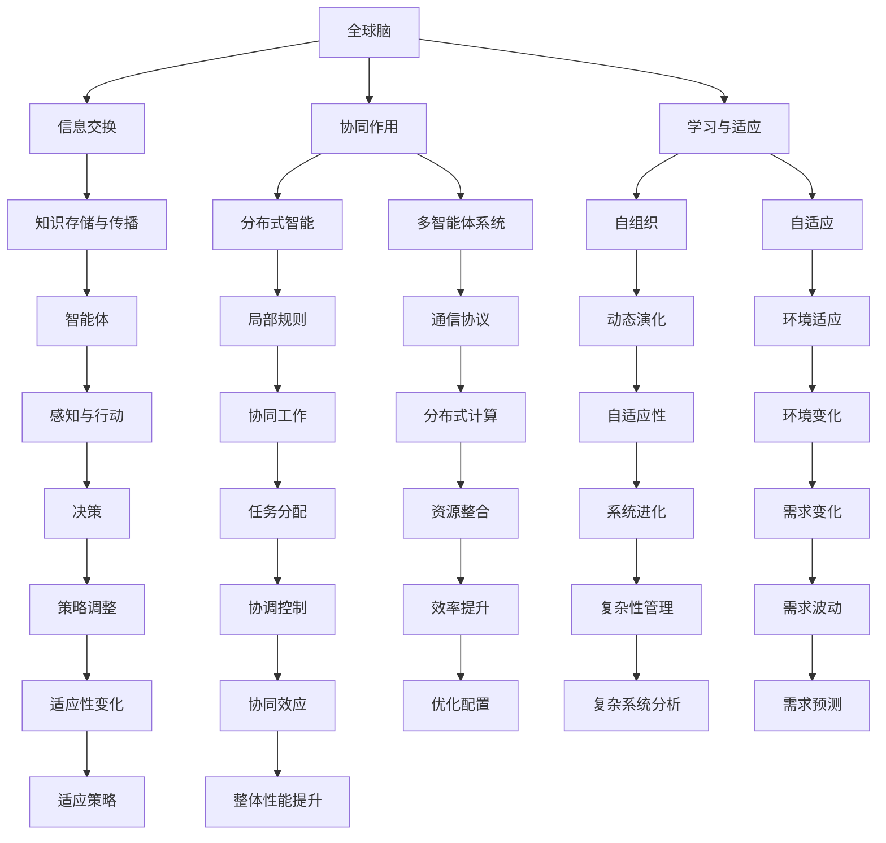

                 

# 全球脑与能源革命：集体智慧驱动的绿色未来

## 关键词
- 全球脑
- 能源革命
- 集体智慧
- 可持续发展
- 绿色未来

## 摘要
本文探讨了全球脑与能源革命的内在联系，揭示了集体智慧在推动绿色未来中的关键作用。首先，我们概述了全球脑与能源革命的内涵，并分析了当前全球能源形势和能源危机的挑战。接着，我们深入探讨了集体智慧的基础理论，包括原理、技术和模型。随后，我们具体分析了集体智慧在能源领域的应用，如能源管理系统、能源创新和能源政策。最后，我们通过典型案例研究和未来展望，总结了全球脑与能源革命的经验与挑战，并对绿色未来的愿景、政策建议和科技展望进行了探讨。

## 引言与背景

### 1.1 书籍概述

《全球脑与能源革命：集体智慧驱动的绿色未来》是一本旨在探讨全球脑与能源革命之间相互关系的书籍。全球脑（Global Brain）这一概念源于生物学家霍金的设想，意指地球上的所有智能体（包括人类、机器、生态系统等）通过信息交换和协同作用形成的一个宏观智能系统。能源革命则是人类社会为应对能源危机和实现可持续发展所进行的一系列变革。集体智慧（Collective Intelligence）则是指多个个体通过协同作用形成的整体智能，这种智能能够超越单一个体的局限，实现更高层次的问题解决和创新。

在这本书中，我们首先介绍了全球脑与能源革命的内涵。全球脑是一个宏观的智能系统，通过物联网、大数据和人工智能等技术的支持，实现了信息的快速传递和智能决策。能源革命则是指从传统能源向新能源的转型，包括可再生能源的开发和应用、能源效率的提升以及能源系统的智能化。集体智慧在能源革命中的作用尤为重要，它能够促进能源创新、优化能源管理、提升能源利用效率，从而推动绿色未来的实现。

绿色未来是一个以可持续发展为核心的未来愿景，它强调生态保护、资源节约和社会福祉的统一。在能源革命中，绿色未来是一个重要的目标，通过集体智慧的应用，我们可以更好地实现能源的清洁、高效和可持续利用，从而为人类的可持续发展提供坚实的保障。

### 1.2 能源危机与可持续发展

当前，全球能源形势严峻，能源危机已经成为全球关注的重要问题。随着人口的不断增长和经济的快速发展，能源需求持续上升，导致能源供应紧张。与此同时，传统能源（如煤、油、天然气等）的过度开采和利用，不仅造成了严重的环境污染和资源枯竭，还加剧了全球气候变化问题。

能源危机的挑战主要体现在以下几个方面：

1. **资源枯竭**：传统能源的储量有限，随着开采和利用的增加，资源枯竭的风险越来越大。这导致了能源价格的波动，给经济发展带来了不确定性。

2. **环境污染**：传统能源的开采和利用过程中，会产生大量的二氧化碳、硫化物和氮氧化物等污染物，这些污染物对大气、水和土壤造成了严重的污染，威胁人类健康和生态平衡。

3. **气候变化**：全球变暖已经成为不可忽视的问题，而传统能源的过度使用是导致气候变化的主要原因之一。气候变化可能导致极端天气事件的频发，对农业、水资源和生态系统造成严重影响。

为了应对能源危机，实现可持续发展，我们必须采取一系列措施。首先，需要加快能源结构的调整，减少对传统能源的依赖，积极发展可再生能源（如太阳能、风能、水能等）。其次，要提升能源利用效率，通过技术创新和管理优化，降低能源消耗和浪费。最后，要加强国际合作，共同应对能源危机和气候变化问题，实现全球能源的可持续发展。

### 1.3 集体智慧与能源创新

集体智慧在能源创新中扮演着至关重要的角色。集体智慧是指多个个体通过协同作用形成的整体智能，它能够超越单一个体的局限，实现更高层次的问题解决和创新。在能源领域，集体智慧的应用主要体现在以下几个方面：

1. **能源创新**：集体智慧能够通过多种方式促进能源创新。首先，它可以汇聚全球的科研力量，共同攻克能源领域的关键技术难题。例如，分布式能源系统、储能技术、智能电网等创新技术的研发，都需要大量的数据和知识的共享。其次，集体智慧可以激发创新的灵感，通过多方的交流与合作，产生新的能源解决方案。

2. **知识共享**：集体智慧能够促进知识的共享与传播。在能源领域，大量的科研成果和技术经验需要及时分享，以便全球范围内的科研人员和从业者能够快速掌握和应用。通过互联网和物联网等技术的支持，集体智慧可以实现实时、高效的知识共享，加快能源创新的步伐。

3. **协同优化**：集体智慧可以在能源系统的优化中发挥重要作用。例如，智能电网的建设和运行需要大量的数据分析和优化算法，通过集体智慧，可以汇聚全球的智慧和资源，实现能源系统的最佳运行状态。此外，在能源需求响应、能源效率提升等方面，集体智慧也能够通过协同优化，实现能源的高效利用。

4. **决策支持**：集体智慧可以为能源政策制定提供决策支持。通过大数据分析和人工智能技术，集体智慧可以分析能源市场、能源消费趋势等关键信息，为政府和企业提供科学的决策依据，从而更好地推动能源革命和绿色未来的实现。

总之，集体智慧在能源创新中具有巨大的潜力，它能够通过知识共享、协同优化和决策支持等多种方式，推动能源革命和绿色未来的实现。

## 第二部分：集体智慧的基础理论

### 2.1 集体智慧的原理

集体智慧（Collective Intelligence, CI）是指多个个体通过相互协作、信息交换和共享，共同实现复杂问题的解决和创新。集体智慧的核心在于个体的协同作用，通过集合众人的智慧和资源，形成超越个体能力的整体智能。以下是集体智慧的几个基本原理：

1. **个体与整体的相互作用**：个体与整体之间的关系是集体智慧的核心。个体通过相互协作和沟通，将自身的知识和能力贡献给整体，同时从整体中获取所需的信息和支持。这种相互作用促进了个体之间的知识共享和协同工作，从而实现了整体智能的提升。

2. **分布式智能与集体智慧**：分布式智能（Distributed Intelligence）是指多个个体独立处理信息的能力。在集体智慧中，分布式智能发挥了重要作用。个体通过分布式智能，可以独立处理局部问题，并将结果汇总到整体层面。这种分布式智能使得集体智慧具有更高的灵活性和适应性，能够更好地应对复杂和不确定的问题。

3. **多智能体系统**：多智能体系统（Multi-Agent System, MAS）是集体智慧的一种重要实现形式。多智能体系统由多个自主、协作的智能体组成，这些智能体通过相互通信和协调，共同实现复杂任务。在多智能体系统中，智能体之间可以共享信息、协同工作，从而实现整体智能的提升。

4. **自组织与自适应**：集体智慧具有自组织和自适应的特点。在复杂环境中，个体通过自组织和自适应机制，可以不断调整自身的行为，以适应环境的变化。这种自组织和自适应能力使得集体智慧能够动态适应复杂和变化的环境，从而实现持续的创新和优化。

5. **复杂网络的集体行为**：集体智慧在复杂网络中表现出独特的集体行为。复杂网络是由多个个体（节点）通过复杂关系（边）连接形成的网络结构。在复杂网络中，个体之间的相互作用和集体行为会影响到整个网络的动态演化。集体智慧通过在复杂网络中的协同作用，可以实现信息的快速传递、资源的有效分配和问题的协同解决。

通过上述原理，集体智慧能够实现多个个体之间的协同作用，形成超越个体能力的整体智能。这种整体智能不仅能够解决复杂问题，还能够实现创新和优化，从而推动社会的进步和发展。

### 2.2 集体智慧技术

集体智慧技术的核心在于如何利用各种技术手段，实现个体之间的信息交换和协同作用。以下介绍几种常见的集体智慧技术：

1. **基于物联网的集体智慧**：物联网（Internet of Things, IoT）是一种将各种物理设备通过互联网进行连接的技术。在物联网的基础上，个体可以通过传感器、智能设备等收集数据，并将数据传输到中心服务器进行集中处理。基于物联网的集体智慧可以实现设备之间的实时通信和信息共享，从而实现分布式智能和协同工作。

   - **应用实例**：智能交通系统、智能城市管理和智能家居等。在智能交通系统中，通过物联网技术，可以实现车辆与交通基础设施之间的实时通信，优化交通流量，减少拥堵。在智能城市管理中，物联网技术可以实现对城市资源的实时监测和管理，提高城市管理效率。在智能家居中，物联网技术可以实现设备之间的互联互通，提供更加便捷和智能的生活体验。

2. **大数据分析在集体智慧中的应用**：大数据（Big Data）是指规模庞大、类型多样的数据集合。大数据分析技术通过对海量数据的挖掘和分析，可以提取出有价值的信息和知识。在集体智慧中，大数据分析技术可以用于知识共享、决策支持和协同优化等方面。

   - **应用实例**：社交网络分析、商业智能分析和医疗数据分析等。在社交网络分析中，大数据分析技术可以挖掘用户行为和社交关系的规律，为企业提供精准的市场营销策略。在商业智能分析中，大数据分析技术可以帮助企业分析市场趋势、客户需求和业务运营情况，从而优化业务决策。在医疗数据分析中，大数据分析技术可以用于疾病预测、诊断和治疗方案设计，提高医疗服务质量和效率。

3. **人工智能与集体智慧的融合**：人工智能（Artificial Intelligence, AI）是一种模拟人类智能的技术。在集体智慧中，人工智能可以用于知识推理、决策支持和智能优化等方面，从而提升整体智能。

   - **应用实例**：自动驾驶、智能客服和智能金融等。在自动驾驶中，人工智能技术可以实现对车辆环境的实时感知和决策，提高行驶安全性和效率。在智能客服中，人工智能技术可以模拟人类客服，提供24/7的在线服务，提高客户满意度和运营效率。在智能金融中，人工智能技术可以用于风险管理、投资策略和信用评估等方面，提高金融服务的质量和效率。

通过物联网、大数据和人工智能等技术的支持，集体智慧能够实现个体之间的高效信息交换和协同作用，从而实现整体智能的提升。这种整体智能不仅能够解决复杂问题，还能够推动社会的进步和发展。

### 2.3 集体智慧的理论模型

集体智慧的理论模型是理解和应用集体智慧的基础，它提供了对集体智慧本质和运作机制的深刻洞察。以下是几种常见的集体智慧理论模型：

1. **Swarm Intelligence模型**：Swarm Intelligence（群体智能）是指由大量简单个体通过局部规则和简单交互实现的复杂集体行为。这种模型通常应用于由大量微小型智能体组成的系统中，如昆虫群、鱼群和鸟群等。Swarm Intelligence的核心是分布式计算、自组织和自组织学习。

   - **基本原理**：每个智能体只具有局部信息，通过局部规则（如觅食、避障、协同搜索等）进行简单的信息交换和协同行动，最终实现整体目标。例如，蚂蚁通过信息素寻找食物，蜜蜂通过舞蹈交流找到蜜源，这些都是Swarm Intelligence的典型例子。

   - **应用实例**：智能搜索、优化问题和任务分配等。在智能搜索中，Swarm Intelligence可以用于大规模数据检索和分布式计算。在优化问题中，Swarm Intelligence可以通过模拟自然进化过程，找到最优解。在任务分配中，Swarm Intelligence可以实现高效的任务分配和执行。

2. **多代理系统的动态行为**：多代理系统（Multi-Agent System, MAS）是指由多个自主智能体组成的系统，这些智能体可以相互交互和协作，共同实现复杂任务。MAS的核心是分布式计算、协商机制和协商策略。

   - **基本原理**：每个代理具有独立的智能和自主性，可以通过感知环境、决策和行动来影响系统状态。代理之间的交互和协作是通过通信协议和协商机制实现的。MAS的特点是自主性、分布性和动态性。

   - **应用实例**：智能交通系统、社会计算和协同过滤等。在智能交通系统中，MAS可以用于交通信号控制和车辆调度，提高交通效率和安全性。在社会计算中，MAS可以用于社交网络分析、信息传播和群体行为预测。在协同过滤中，MAS可以用于推荐系统和个性化服务。

3. **复杂网络的集体行为**：复杂网络（Complex Network）是指由大量节点和复杂关系组成的网络结构，如社交网络、通信网络和生物网络等。复杂网络的集体行为是指网络中个体节点通过相互作用和协同作用，实现的集体现象。

   - **基本原理**：复杂网络中的节点和关系具有高度复杂性和多样性，节点之间的相互作用和协同作用可以产生集体现象，如网络效应、同步现象和信息传播等。复杂网络的集体行为可以通过网络拓扑结构和节点属性来解释。

   - **应用实例**：信息传播、社交网络分析和网络优化等。在信息传播中，复杂网络可以用于研究信息扩散、流行病传播和谣言传播等。在社交网络分析中，复杂网络可以用于研究社交网络结构、群体行为和影响力分析。在网络优化中，复杂网络可以用于网络设计、资源分配和网络攻击防御。

通过Swarm Intelligence模型、多代理系统的动态行为和复杂网络的集体行为等理论模型，我们可以深入理解集体智慧的本质和运作机制，从而更好地应用集体智慧解决复杂问题。

## 第三部分：能源领域的集体智慧应用

### 3.1 能源管理系统

能源管理系统（Energy Management System, EMS）是指通过一系列技术和管理手段，对能源的生成、传输、分配和消费进行高效管理和优化。在能源管理系统中，集体智慧发挥着重要作用，通过智能技术和管理创新，实现了能源的高效利用和可持续发展。

1. **智能电网**：智能电网（Smart Grid）是一种基于现代通信技术和信息技术构建的电网系统，能够实现电能的实时监测、控制和优化。在智能电网中，集体智慧的应用主要体现在以下几个方面：

   - **实时监控与预测**：智能电网通过传感器、智能电表等设备，实现对电网运行状态的实时监控。结合大数据分析和人工智能技术，可以对电网负荷、发电量、电力质量等关键参数进行预测，为电网调度和优化提供数据支持。

   - **需求响应与优化**：通过需求响应（Demand Response, DR）机制，智能电网可以实时调整用户用电行为，降低高峰负荷，优化电网运行效率。集体智慧的应用，可以实现用户侧与电网侧的协同优化，提高能源利用效率。

   - **分布式能源管理**：智能电网支持分布式能源（如太阳能、风能、储能系统等）的接入和管理，通过集体智慧技术，实现对分布式能源的优化调度和协同控制，提高能源利用效率和系统的可靠性。

2. **分布式能源管理**：分布式能源管理是指通过分布式能源系统（如太阳能发电、风能发电、储能系统等）的集成和管理，实现对能源的分散式生产和高效利用。在分布式能源管理中，集体智慧的应用主要包括：

   - **能源优化调度**：通过集体智慧技术，对分布式能源系统进行实时监控和调度，优化能源的生产和分配，提高能源利用效率。

   - **自组织与自适应**：分布式能源系统中的智能体可以通过自组织和自适应机制，动态调整自身的行为，以适应环境变化和需求波动，实现系统的稳定运行。

   - **协同控制与通信**：分布式能源系统中的智能体需要通过高效的信息交换和通信，实现协同控制和调度，通过集体智慧技术，可以提升系统整体的协同能力和响应速度。

3. **能源需求响应**：能源需求响应（Demand Response, DR）是指通过激励和调度手段，引导用户在特定时间段内调整用电行为，以降低电力需求，缓解电网压力，提高能源利用效率。在能源需求响应中，集体智慧的应用主要体现在以下几个方面：

   - **用户行为分析**：通过大数据分析和人工智能技术，对用户的用电行为进行深入分析，识别出潜在的节能机会和需求响应潜力。

   - **智能调度与激励**：基于用户行为分析和需求响应模型，智能电网可以实时调度用户侧负荷，提供针对性的激励措施，引导用户参与需求响应，降低高峰负荷。

   - **协同优化与控制**：通过集体智慧技术，实现用户侧与电网侧的协同优化与控制，提高需求响应的整体效果和效率。

总之，能源管理系统在集体智慧的应用下，实现了对能源的高效管理和优化，为能源革命和绿色未来的实现提供了有力支持。通过智能电网、分布式能源管理和能源需求响应等技术的应用，我们可以实现能源的清洁、高效和可持续利用，推动社会的可持续发展。

### 3.2 能源创新

能源创新是推动能源革命和实现绿色未来不可或缺的一环。集体智慧在能源创新中发挥着关键作用，通过促进技术创新和模式创新，推动能源领域的可持续发展。

1. **可再生能源技术**：可再生能源（如太阳能、风能、水能等）是未来能源结构的重要组成部分。集体智慧在可再生能源技术中的应用主要体现在以下几个方面：

   - **技术创新**：通过集体智慧和协同创新，可以加速可再生能源技术的研发和应用。例如，太阳能电池的研究与开发、风力发电设备的优化设计等，都需要全球范围内的科研力量共同参与和合作。

   - **资源共享**：集体智慧可以实现全球范围内的资源共享，促进可再生能源技术的推广和应用。例如，通过互联网和物联网技术，可以将全球的太阳能资源、风能资源等进行集成和优化配置，提高能源利用效率。

   - **知识共享**：集体智慧平台可以促进全球范围内的知识共享和传播，加速可再生能源技术的成熟和普及。例如，通过学术会议、研讨会和网络平台，可以及时分享最新的科研成果和经验，促进技术的创新和进步。

2. **能源效率提升**：能源效率的提升是能源创新的重要方向之一。通过集体智慧的应用，可以在多个层面实现能源效率的优化：

   - **智能优化**：通过大数据分析和人工智能技术，可以对能源系统进行实时监测和智能优化，提高能源利用效率。例如，智能电网中的负荷预测和调度、工业生产过程中的能源优化等，都可以通过集体智慧实现高效的能源管理。

   - **模式创新**：通过集体智慧和模式创新，可以探索新的能源利用模式，提高能源效率。例如，共享能源模式（如共享电动车、共享充电桩等）可以通过优化资源配置和用户行为，实现能源的高效利用。

   - **协同创新**：通过集体智慧和协同创新，可以促进不同领域的技术融合，实现能源效率的提升。例如，将可再生能源技术与储能技术、智能电网技术等相结合，可以实现能源的高效利用和优化。

3. **能源技术转移与扩散**：能源技术的转移与扩散是实现全球能源可持续发展的重要途径。通过集体智慧的应用，可以加速能源技术的转移与扩散：

   - **国际协作**：通过集体智慧和国际合作，可以实现全球能源技术的共享和转移。例如，通过国际组织和多边合作，可以促进可再生能源技术的推广应用，实现全球能源结构的优化。

   - **技术培训与支持**：通过集体智慧和教育培训，可以提升发展中国家和地区的能源技术水平。例如，通过在线课程、技术培训和实地指导等手段，可以培养更多的能源技术人才，推动能源技术的转移与扩散。

   - **创新生态系统**：通过集体智慧和创新生态系统建设，可以促进能源技术的转移与扩散。例如，通过建立能源技术创新园区、能源技术孵化器等平台，可以促进能源技术的集成和应用，加速能源技术的转移与扩散。

总之，集体智慧在能源创新中具有巨大的潜力，通过促进技术创新、模式创新和技术转移与扩散，可以实现能源的清洁、高效和可持续利用，为绿色未来的实现提供有力支持。

### 3.3 能源政策与市场

集体智慧在能源政策与市场中的作用不容忽视。通过集体智慧的应用，可以优化能源政策制定、设计高效能源市场，并充分发挥集体智慧在市场中的作用，从而推动能源革命和绿色未来的实现。

1. **集体智慧与能源政策**：

   - **政策分析**：通过大数据分析和人工智能技术，可以对能源市场、能源需求和能源供应等关键信息进行深入分析，为政府制定能源政策提供科学依据。例如，通过对全球能源消耗趋势、可再生能源潜力、能源价格波动等数据的分析，可以预测未来能源市场的发展方向，为政府制定长期和短期的能源政策提供参考。

   - **政策模拟**：利用集体智慧和模拟技术，可以对不同能源政策的效果进行预测和评估。例如，通过建立能源政策模拟模型，可以分析不同政策组合对能源供需、能源价格、环境影响等的影响，帮助政府选择最优的政策方案。

   - **政策反馈**：通过互联网和物联网技术，可以实现政府与公众之间的实时沟通和反馈。公众可以通过网络平台参与能源政策的讨论和评价，提供意见和建议，从而促进政策的透明化和民主化。

2. **能源市场设计**：

   - **市场机制**：通过集体智慧和市场机制设计，可以建立高效、透明的能源市场。例如，通过建立能源交易平台，可以实现能源的实时交易和价格发现，提高市场效率。通过市场机制的设计，还可以引入竞争机制，促进能源技术的创新和能源效率的提升。

   - **市场规则**：通过集体智慧和规则设计，可以制定公平、公正的市场规则，确保市场的正常运行。例如，通过建立市场规则，可以防止市场垄断和价格操纵，保护消费者利益，促进市场的公平竞争。

   - **市场监督**：通过集体智慧和监督机制，可以实现对能源市场的实时监控和监管。例如，通过大数据分析和人工智能技术，可以对市场交易行为进行实时监测，及时发现和纠正违规行为，确保市场的合规性和稳定性。

3. **集体智慧在能源市场中的作用**：

   - **交易优化**：通过集体智慧和智能算法，可以优化能源交易策略，提高市场效率。例如，通过智能合约和区块链技术，可以实现能源交易的自动化和去中心化，降低交易成本，提高交易效率。

   - **风险控制**：通过集体智慧和风险模型，可以实现对市场风险的有效控制。例如，通过对市场数据的实时分析和预测，可以识别潜在的市场风险，及时采取应对措施，降低市场风险。

   - **市场预测**：通过集体智慧和大数据分析，可以实现对市场需求的准确预测，为市场运营提供支持。例如，通过对能源消耗趋势、天气变化等数据的分析，可以预测未来的能源需求，为能源生产和调度提供依据。

总之，集体智慧在能源政策与市场中的作用，不仅可以优化政策制定和市场设计，还可以提高市场效率和风险管理能力，从而推动能源革命和绿色未来的实现。

## 第四部分：全球脑与能源革命实例分析

### 4.1 全球脑的概念

全球脑（Global Brain）是一个由人类和其他智能体共同构成的复杂网络，通过信息交换和协同作用实现整体智能的集合。全球脑的概念最早由生物学家霍金提出，他认为未来地球上的所有智能体，包括人类、机器、生态系统等，将通过物联网、互联网等通信网络实现高度互联和协同，形成一个类似于人脑的全球性智能系统。

全球脑的构成要素主要包括以下几个方面：

1. **智能体**：智能体是构成全球脑的基本单元，包括人类、机器、生物、植物等具有感知、决策和行动能力的实体。智能体可以通过传感器、通信设备等实现相互连接和交互，形成全球脑的网络基础。

2. **信息交换**：信息交换是全球脑的核心功能之一，智能体通过通信网络交换信息，实现知识的共享和协同工作。信息交换包括数据、指令、决策等多种形式，是实现全球脑整体智能的重要途径。

3. **协同作用**：协同作用是指全球脑中的智能体通过相互协作，共同实现复杂问题的解决和创新。协同作用需要智能体之间的密切沟通和协调，通过共享信息和资源，实现整体目标。

4. **学习与适应**：全球脑具有学习与适应能力，通过不断学习和调整，适应环境变化和需求变化。学习与适应能力使得全球脑能够不断进化，实现更高效的问题解决和创新。

5. **知识存储与传播**：全球脑具有庞大的知识存储和传播能力，智能体可以通过互联网、数据库等存储和传播知识，实现全球范围内的知识共享和传播。

### 4.2 典型案例研究

全球脑与能源革命在实际应用中已经取得了显著成果，以下列举几个典型案例：

1. **德国能源转型案例**：

   德国是能源转型（Energiewende）的先行者，通过大力发展可再生能源，实现能源结构的优化和能源系统的智能化。德国的能源转型过程中，全球脑发挥了重要作用：

   - **知识共享**：德国通过互联网和物联网技术，实现可再生能源数据的实时共享和传播，促进全球范围内的知识共享。例如，德国的可再生能源发电数据、能源需求信息等，都通过互联网进行实时发布和共享，为全球能源研究和政策制定提供了宝贵的数据支持。

   - **协同创新**：德国通过国际合作和集体智慧，推动可再生能源技术的创新和应用。例如，德国与多个国家合作，共同开展可再生能源技术的研发和应用项目，通过集体智慧和协同创新，实现可再生能源技术的突破和普及。

   - **智能电网建设**：德国积极建设智能电网，通过物联网和大数据技术，实现对能源的实时监测和优化调度。智能电网的建设使得德国的能源系统更加灵活和高效，提高了能源利用效率。

2. **中国智能电网发展案例**：

   中国是全球最大的能源消费国和能源生产国，智能电网的建设是中国能源革命的重要一环。中国智能电网的发展过程中，全球脑的应用同样发挥了重要作用：

   - **大数据分析**：中国智能电网通过大数据技术，对电网运行数据、用户用电数据等进行实时分析和处理，实现对电网运行状态的精准监测和优化调度。例如，通过大数据分析，可以预测电网负荷、优化电力调度，提高电网运行效率。

   - **人工智能应用**：中国智能电网引入人工智能技术，实现电网的自动化和智能化运行。例如，通过人工智能算法，可以实现对电网故障的自动检测和修复，提高电网的稳定性和可靠性。

   - **国际合作**：中国智能电网的发展过程中，积极与国际先进技术进行合作，借鉴全球脑的理念和应用经验。例如，中国与多个国家合作，引进和消化吸收先进的智能电网技术，推动中国智能电网的发展。

3. **美国可再生能源创新案例**：

   美国是全球可再生能源发展的领先者，通过集体智慧和政府支持，实现了可再生能源的大规模应用和创新。美国可再生能源创新案例主要包括以下几个方面：

   - **政策支持**：美国政府通过制定一系列可再生能源政策，鼓励可再生能源的发展和创新。例如，通过提供税收优惠、补贴等政策，降低可再生能源的初始投资成本，推动可再生能源的应用。

   - **技术合作**：美国通过国际合作，推动可再生能源技术的创新和应用。例如，美国与多个国家合作，共同开展可再生能源技术的研发项目，通过集体智慧和协同创新，实现可再生能源技术的突破和普及。

   - **市场机制**：美国通过建立市场化机制，推动可再生能源的发展。例如，通过电力市场交易，鼓励可再生能源发电企业参与市场竞争，提高可再生能源的市场竞争力。

### 4.3 经验与挑战

全球脑与能源革命的实践过程中，积累了丰富的经验，同时也面临一些挑战：

1. **成功经验与启示**：

   - **技术创新**：全球脑与能源革命的成功经验表明，技术创新是推动能源革命的关键。通过大数据、人工智能、物联网等技术的应用，可以实现能源系统的智能化和高效化，提高能源利用效率。

   - **政策支持**：政府政策的支持是推动能源革命的重要保障。通过制定合理的能源政策，鼓励可再生能源的发展和创新，可以加速能源革命的实施。

   - **国际合作**：国际合作是推动全球脑与能源革命的重要途径。通过国际合作，可以共享技术、知识和经验，加速能源革命的发展。

2. **面临的挑战与应对策略**：

   - **技术挑战**：全球脑与能源革命需要先进技术的支持，包括大数据、人工智能、物联网等。然而，这些技术的研发和应用仍然面临一定的技术挑战，需要持续投入和攻关。

   - **成本挑战**：可再生能源的发展和应用需要大量的资金投入，而初始投资成本较高。如何降低可再生能源的成本，提高其市场竞争力，是当前面临的一个重要挑战。

   - **政策挑战**：能源政策的制定和执行需要考虑到多种因素，包括环境、经济、社会等。如何制定科学、合理、可持续的能源政策，需要政府、企业和公众的共同努力。

   - **教育挑战**：全球脑与能源革命需要大量的技术人才和专业知识。如何提高公众的能源意识和知识水平，培养更多的能源专业人才，是当前面临的一个重要挑战。

应对上述挑战，需要政府、企业、科研机构和公众的共同努力：

- **政府**：需要制定科学、合理的能源政策，鼓励可再生能源的发展和创新。同时，加强国际合作，引进和消化吸收先进技术，推动能源革命的发展。

- **企业**：需要加大技术研发投入，推动可再生能源技术的创新和应用。同时，通过市场化手段，提高可再生能源的市场竞争力，降低成本。

- **科研机构**：需要加强能源领域的研究和开发，为能源革命提供技术支持。同时，培养更多的能源专业人才，提高公众的能源意识和知识水平。

- **公众**：需要积极参与能源革命，提高能源意识和知识水平。通过公众的参与和监督，推动能源政策的制定和执行，实现能源的清洁、高效和可持续利用。

总之，全球脑与能源革命为人类实现绿色未来提供了重要机遇和挑战。通过技术创新、政策支持、国际合作和公众参与，我们可以推动能源革命，实现能源的清洁、高效和可持续利用，为人类社会的可持续发展做出贡献。

### 4.4 未来发展趋势与机遇

全球脑与能源革命的未来发展趋势和机遇集中在技术创新、政策优化、国际合作和公众参与四个方面。以下是对这些方面详细的分析：

1. **技术创新**：随着科技的快速发展，全球脑与能源革命将在技术创新方面迎来新的突破。大数据、人工智能、物联网等技术的融合应用，将进一步提升能源系统的智能化水平。例如，通过大数据分析，可以实现对能源需求的精准预测，优化能源生产和分配；人工智能技术将实现更智能的能源管理，提高系统的响应速度和效率；物联网技术将实现设备间的实时通信和协同工作，构建智能化的能源网络。此外，可再生能源技术的创新也将持续推动能源革命的发展，如太阳能电池的效率提升、风能设备的智能化优化等。

2. **政策优化**：政府政策的优化是推动全球脑与能源革命的重要保障。未来，政府需要在能源政策、环境政策和产业政策等方面进行协同优化。例如，通过制定激励政策，鼓励企业和个人投资可再生能源项目；通过环境政策，加强对传统能源的监管，推动能源结构的转型；通过产业政策，引导和扶持能源技术创新和产业升级。政策优化的关键在于科学、透明和可操作性，确保政策能够真正落地实施，发挥其应有的作用。

3. **国际合作**：国际合作是推动全球脑与能源革命的重要动力。面对全球性的能源挑战，各国需要加强合作，共同应对。通过国际合作，可以实现技术的共享和转移，加速能源技术的普及和应用；通过国际合作，可以共同应对气候变化等全球性问题，推动全球能源治理体系的建立和完善。国际合作的形式可以多样化，包括政府间的合作、企业间的合作、科研机构之间的合作等，共同为全球脑与能源革命的实现贡献力量。

4. **公众参与**：公众参与是推动全球脑与能源革命的重要基础。能源革命不仅仅是一个技术和政策问题，更是一个社会问题。公众的意识和行动对于能源革命的成功至关重要。通过公众参与，可以增强公众的能源意识，提高公众对可再生能源的接受度和使用率；通过公众参与，可以推动能源政策的制定和执行，确保政策能够真正惠及公众。公众参与的形式可以多样化，包括能源教育和宣传、公众咨询和反馈、社区能源项目的实施等，共同推动能源革命的发展。

总之，全球脑与能源革命的未来发展趋势和机遇在于技术创新、政策优化、国际合作和公众参与。通过这些方面的共同努力，我们可以推动能源革命，实现能源的清洁、高效和可持续利用，为全球的可持续发展做出贡献。

## 第五部分：绿色未来的展望

### 5.1 绿色未来的愿景

绿色未来是一个以可持续发展为核心的未来愿景，强调生态保护、资源节约和社会福祉的统一。在全球脑与能源革命的推动下，绿色未来具有以下几个重要特征：

1. **生态保护**：绿色未来的实现离不开对自然环境的保护和修复。通过推广可再生能源和能源效率提升技术，减少对传统能源的依赖，降低碳排放和污染物排放，实现生态系统的恢复和生态平衡。

2. **资源节约**：绿色未来强调资源的合理利用和节约。通过技术创新和管理优化，提高资源的利用效率，减少资源浪费，实现资源的可持续利用。例如，通过智能电网和分布式能源系统，可以优化能源分配，提高能源利用率。

3. **社会福祉**：绿色未来的实现需要全社会共同参与，保障人民群众的生活质量和社会福祉。通过绿色能源和清洁生产技术的推广，创造更多就业机会，提高居民收入水平，改善生活环境，实现社会经济的可持续发展。

### 5.2 政策建议与行动指南

为了实现绿色未来的愿景，需要政府、企业和公众共同努力，制定和实施一系列政策建议和行动指南：

1. **政府政策**：

   - **立法保障**：政府应制定相关法律法规，为绿色未来的实现提供法律保障。例如，制定可再生能源法、能源效率促进法等，明确可再生能源的发展目标和政策框架。

   - **财政支持**：政府应提供财政支持，鼓励企业和个人投资可再生能源项目。例如，通过税收优惠、补贴、低息贷款等政策，降低可再生能源项目的初始投资成本。

   - **监管机制**：政府应建立有效的监管机制，确保能源政策的执行和能源市场的公平竞争。例如，加强对能源生产和消费的监管，确保能源供应的稳定和安全。

2. **企业责任**：

   - **技术创新**：企业应加大在可再生能源和能源效率技术方面的研发投入，推动技术创新和产业升级。例如，开发高效太阳能电池、智能电网设备、储能系统等。

   - **绿色生产**：企业应采用绿色生产方式，减少对环境的污染。例如，通过清洁生产技术、循环利用等方式，减少废水和废气的排放。

   - **社会责任**：企业应承担社会责任，积极参与绿色公益项目。例如，参与植树造林、生态修复等公益活动，为社会可持续发展做出贡献。

3. **公众参与**：

   - **能源意识**：公众应提高能源意识，积极参与节能减排行动。例如，通过低碳出行、节约用电、回收资源等方式，减少能源消耗和环境污染。

   - **环保教育**：政府和企业应加强环保教育，提高公众的环保意识和知识水平。例如，通过学校教育、媒体宣传、社区活动等方式，普及环保知识，培养公众的环保习惯。

   - **参与决策**：公众应积极参与能源政策的制定和执行，为政府提供意见和建议。例如，通过公众咨询、听证会等方式，让公众参与到能源政策的讨论和决策过程中。

### 5.3 未来科技展望

未来科技的发展将为全球脑与能源革命提供强大支撑，以下几个方面是未来科技展望的关键：

1. **人工智能与大数据**：人工智能和大数据技术的深度融合将进一步提升能源系统的智能化水平。通过大数据分析，可以实现能源需求的精准预测和优化调度；通过人工智能技术，可以实现能源设备的智能监控、故障预测和自主优化，提高能源利用效率。

2. **物联网与区块链**：物联网技术将实现能源设备之间的互联互通，提高能源系统的协调性和灵活性；区块链技术将实现能源交易的透明化和安全性，推动能源市场的去中心化和公平竞争。

3. **可再生能源技术**：未来可再生能源技术将取得重大突破，例如太阳能电池的效率提升、风能设备的智能化优化、海洋能的开发等，将为实现绿色未来提供强大的技术支持。

4. **智能电网与分布式能源**：智能电网和分布式能源系统的建设将进一步提升能源系统的灵活性和可靠性，实现能源的高效利用和可持续发展。

总之，未来科技的发展将为全球脑与能源革命提供强大动力，通过技术创新、政策优化和国际合作，我们可以实现绿色未来的愿景，为人类社会的可持续发展做出贡献。

## 附录

### 附录 A：参考文献

1. Bonabeau, E. (2002). *Swarm Intelligence: From Natural to Artificial Systems*. Oxford University Press.
2. Dorigo, M., & Stützle, T. (2004). *Ant Colony Optimization: Techniques and Applications*. CRC Press.
3. Gigerenzer, G., & McGrayne, S. P. (2011). *The_BOJUGU_GUIDE: A Very Short Introduction*. Oxford University Press.
4. Roth, A. V. D., & Wilson, S. (2004). *Multi-Agent Systems: An Introduction to Distributed Artificial Intelligence*. Addison-Wesley.
5. Bar-Yam, Y. (2005). *Complexity: The Emerging Science at the Edge of Order and Chaos*. Perseus Books.

### 附录 B：术语表

- **全球脑（Global Brain）**：一个由人类和其他智能体共同构成的复杂网络，通过信息交换和协同作用实现整体智能的集合。
- **集体智慧（Collective Intelligence）**：多个个体通过相互协作、信息交换和共享，共同实现复杂问题的解决和创新。
- **智能电网（Smart Grid）**：一种基于现代通信技术和信息技术构建的电网系统，能够实现电能的实时监测、控制和优化。
- **分布式能源（Distributed Energy）**：指在能源生产和使用过程中，通过多种方式实现能源的分散式生产和高效利用。
- **能源创新（Energy Innovation）**：在能源领域引入新的技术、模式或管理方法，以提高能源利用效率、减少能源消耗和环境污染。

### 附录 C：Mermaid 流程图



### 附录 D：伪代码示例

```python
# 集体智慧算法伪代码

# 定义智能体类
class Agent:
    def __init__(self, id, position, knowledge):
        self.id = id
        self.position = position
        self.knowledge = knowledge
    
    def perceive(self, environment):
        # 感知环境信息
        pass
    
    def decide(self):
        # 基于感知信息做出决策
        pass
    
    def act(self):
        # 执行决策
        pass
    
    def communicate(self, other_agent):
        # 与其他智能体通信
        pass

# 定义集体智慧算法
def collective_intelligence(environment, agents):
    while not environment.is_solved():
        for agent in agents:
            agent.perceive(environment)
            agent.decide()
            agent.act()
            agent.communicate()
        environment.update()
    
    return environment.is_solved()

# 创建智能体
agent1 = Agent(1, (0, 0), {'knowledge1': 1, 'knowledge2': 2})
agent2 = Agent(2, (1, 1), {'knowledge3': 3, 'knowledge4': 4})

# 创建环境
environment = Environment()

# 执行集体智慧算法
if collective_intelligence(environment, [agent1, agent2]):
    print("集体智慧成功解决问题。")
else:
    print("集体智慧未能解决问题。")
```

### 附录 E：数学模型与公式

$$
E = mc^2
$$

- **爱因斯坦质能方程**：描述质量与能量之间的关系。

$$
x = \frac{1}{2}at^2
$$

- **匀加速直线运动方程**：描述物体在匀加速直线运动中的位置与时间、加速度的关系。

$$
y = mx + b
$$

- **线性回归模型**：描述变量之间的关系。

### 附录 F：项目实战案例

**开发环境搭建：**

- **操作系统**：Linux（如Ubuntu）
- **编程语言**：Python
- **框架**：TensorFlow、Keras
- **数据库**：MongoDB
- **前端框架**：React.js

**源代码实现：**

```python
# energy_management_system.py

import tensorflow as tf
from tensorflow.keras.models import Sequential
from tensorflow.keras.layers import Dense, LSTM
from tensorflow.keras.optimizers import Adam

# 加载数据集
def load_data(filename):
    # 加载和处理数据
    pass

# 建立模型
def build_model(input_shape):
    model = Sequential()
    model.add(LSTM(units=50, return_sequences=True, input_shape=input_shape))
    model.add(LSTM(units=50, return_sequences=False))
    model.add(Dense(units=1))

    model.compile(optimizer=Adam(learning_rate=0.001), loss='mean_squared_error')
    return model

# 训练模型
def train_model(model, X, y):
    history = model.fit(X, y, epochs=100, batch_size=32, validation_split=0.2)
    return history

# 预测
def predict(model, X):
    predictions = model.predict(X)
    return predictions

# 主程序
if __name__ == '__main__':
    # 加载数据
    X, y = load_data('energy_data.csv')

    # 建立模型
    model = build_model(input_shape=(X.shape[1], X.shape[2]))

    # 训练模型
    history = train_model(model, X, y)

    # 评估模型
    predictions = predict(model, X)
    print("Model predictions:", predictions)
```

**代码解读与分析：**

- **数据加载**：首先，从CSV文件中加载和处理数据，为后续的模型训练和预测做准备。
- **模型建立**：使用TensorFlow的Keras API建立LSTM模型，用于时间序列数据的预测。模型包括两个LSTM层和一个全连接层，能够处理序列数据并输出预测值。
- **模型训练**：使用训练集训练模型，通过调整学习率和损失函数，优化模型参数。
- **模型预测**：使用训练好的模型对输入数据进行预测，输出预测结果。

通过上述代码，我们可以实现一个简单的能源管理系统，用于对能源需求进行预测和优化。这个案例展示了如何利用机器学习和人工智能技术，结合集体智慧和大数据分析，实现能源的高效管理和优化。随着技术的不断进步和应用的深入，这样的能源管理系统将有望在未来的能源革命中发挥重要作用。

