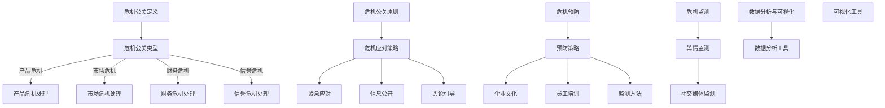

                 

# 《创业公司的危机公关管理》

> **关键词：** 创业公司、危机公关、管理、案例分析、策略、工具、未来趋势

> **摘要：** 本文旨在探讨创业公司面临的各种危机公关问题，从基础理论、预防监测、应对策略、案例分析到实践指南和未来趋势，为创业公司的危机公关管理提供全面的理论支持和实践指导。

## 引言

### 书籍背景

创业公司在当今经济环境中扮演着越来越重要的角色。它们不仅是创新的源泉，也是经济增长的重要推动力。然而，创业公司在快速发展的过程中，往往面临着各种危机。这些危机可能源于内部管理、产品缺陷、竞争对手恶意攻击，甚至高管丑闻。如何有效地应对这些危机，维护企业的声誉和客户信任，成为创业公司成功的关键之一。

### 危机公关的重要性

危机公关是指在危机事件发生时，企业通过有效的沟通和行动，维护企业声誉和客户信任的过程。对于创业公司来说，危机公关的重要性不言而喻。首先，危机公关能够帮助企业迅速应对危机，避免事态恶化。其次，通过危机公关，企业可以积极塑造公众形象，恢复品牌信誉。最后，危机公关有助于建立企业的危机应对能力，提高企业应对未来危机的韧性。

### 书籍的目标读者

本书旨在为创业公司的管理者、公关团队以及相关领域的专业人士提供一套系统的危机公关管理指南。无论您是初创企业的创始人，还是负责公关事务的经理，抑或是从事危机公关咨询工作的专家，本书都能为您在应对各种危机时提供有价值的参考。

### 书籍结构概述

本书分为七个部分，每个部分都涵盖了危机公关管理的不同方面。

- **第一部分：引言**：介绍书籍的背景、危机公关的重要性以及目标读者。
- **第二部分：危机公关基础理论**：包括危机公关的定义、类型、原则与策略。
- **第三部分：危机预防与监测**：讨论危机预防的重要性、监测方法与工具。
- **第四部分：危机应对策略**：介绍公开声明、媒体应对、社交媒体应对和损害控制策略。
- **第五部分：危机公关案例分析**：分析创业公司面临的典型危机案例。
- **第六部分：危机公关实践指南**：提供危机公关组织架构、培训与发展、工具与资源的实践指南。
- **第七部分：未来趋势与挑战**：探讨危机公关的未来趋势和创业公司面临的挑战。

每章内容都将通过详细的讲解和案例分析，帮助读者理解危机公关的原理和实践。

## 第一部分：危机公关基础理论

### 2.1.1 危机公关的定义与类型

#### 2.1.1.1 危机公关的定义

危机公关（Crisis Public Relations）是指在危机事件发生时，企业通过积极主动的沟通和管理，应对外部挑战，维护企业声誉和品牌价值的一系列行为。

#### 2.1.1.2 危机公关的类型

根据危机的性质和发生原因，危机公关可以分为以下几种类型：

- **产品危机**：由于产品质量问题、安全隐患或不符合规定等导致的危机。
- **市场危机**：由于市场负面事件、竞争对手恶意攻击等导致的危机。
- **财务危机**：由于财务问题、资金链断裂等导致的危机。
- **信誉危机**：由于企业行为不当、高管丑闻等导致的危机。

#### 2.1.1.3 危机公关的关键因素

危机公关的成功与否取决于以下几个关键因素：

- **速度**：在危机发生后，企业需要迅速反应，制定应对策略。
- **真实性**：信息传递必须真实可靠，避免误导公众。
- **一致性**：企业内部沟通和信息发布必须保持一致，避免产生矛盾和混乱。
- **透明度**：在遵守法律和道德的前提下，企业应该尽可能公开透明地处理危机事件。

### 2.1.2 危机公关的原则与策略

#### 2.1.2.1 危机公关的原则

危机公关应遵循以下原则：

- **预防为主**：通过建立危机预防机制，降低危机发生的概率。
- **诚信为本**：在危机应对中，企业应保持诚信，赢得公众信任。
- **及时应对**：危机发生后，企业应迅速采取行动，避免事态恶化。
- **持续沟通**：在危机处理过程中，企业应持续与公众、媒体、合作伙伴等进行沟通。

#### 2.1.2.2 危机公关的策略

危机公关应采取以下策略：

- **紧急应对**：在危机发生后，立即成立危机应对小组，制定应对计划。
- **信息公开**：及时发布危机信息，保持透明度，避免信息不透明导致的误解和恐慌。
- **舆论引导**：通过媒体沟通，引导舆论方向，恢复公众信心。
- **资源整合**：调动企业内外部资源，共同应对危机。
- **长期规划**：在危机处理结束后，总结经验教训，制定长期品牌管理策略。

#### 2.1.2.3 应对危机的不同阶段

危机公关通常可以分为以下几个阶段：

- **预警阶段**：通过监测和风险评估，预测危机的发生。
- **爆发阶段**：危机发生后，立即启动危机应对计划，进行紧急处理。
- **处理阶段**：通过信息公开、舆论引导等手段，积极应对危机。
- **恢复阶段**：危机处理结束后，恢复企业形象，重建公众信任。

### 2.1.3 危机公关的法律与道德问题

#### 2.1.3.1 危机公关的法律风险

危机公关过程中，企业可能面临以下法律风险：

- **虚假陈述**：发布虚假或误导性信息，可能构成欺诈。
- **隐私泄露**：未经同意披露客户或员工隐私，可能侵犯隐私权。
- **反垄断法**：在处理危机时，不得进行反竞争行为。
- **劳动法**：在危机处理过程中，要遵守劳动法相关规定。

#### 2.1.3.2 危机公关的道德伦理

危机公关应遵循以下道德伦理原则：

- **诚信**：在危机处理中，企业应保持诚信，避免误导公众。
- **责任**：企业应对危机事件承担责任，积极寻求解决方案。
- **透明**：在遵守法律和道德的前提下，企业应尽可能公开透明地处理危机。
- **尊重**：在危机处理过程中，企业应尊重公众、媒体和合作伙伴的合法权益。

#### 2.1.3.3 法律与道德在危机公关中的应用

在危机公关中，企业应：

- **合法合规**：在处理危机时，遵守相关法律法规，避免法律风险。
- **诚信为本**：在危机处理过程中，保持诚信，树立企业良好形象。
- **透明公开**：在遵守法律和道德的前提下，尽可能公开透明地处理危机，赢得公众信任。

## 第二部分：危机预防与监测

### 3.1.1 危机预防的重要性

#### 3.1.1.1 预防危机的策略

预防危机是企业危机管理的重要环节。以下是一些预防危机的策略：

- **建立健全的危机预防机制**：企业应建立危机预防机制，定期进行风险评估，识别潜在危机。
- **加强内部管理**：通过加强内部管理，提高员工素质，降低危机发生的概率。
- **提高员工意识**：通过培训和教育，提高员工对危机的认识和应对能力。
- **建立应急响应机制**：在危机发生时，企业应迅速启动应急响应机制，采取有效措施。

#### 3.1.1.2 企业文化建设

企业文化是企业危机预防的重要基础。以下是一些企业文化建设策略：

- **建立共同价值观**：企业应建立共同的价值观，形成团结协作的企业文化。
- **倡导诚信与责任**：企业应倡导诚信和责任感，营造良好的企业文化。
- **建立沟通机制**：通过建立沟通机制，提高内部信息透明度，增强员工凝聚力。

#### 3.1.1.3 员工培训与沟通

员工培训与沟通是预防危机的重要手段。以下是一些具体策略：

- **危机意识培训**：通过危机意识培训，提高员工对危机的认识和应对能力。
- **沟通技巧培训**：通过沟通技巧培训，提高员工在危机中的沟通能力和协作能力。
- **建立反馈机制**：通过建立反馈机制，及时了解员工对危机处理的意见和建议。

### 3.1.2 危机监测的方法与工具

#### 3.1.2.1 监测方法

危机监测是预防危机的重要手段。以下是一些常见的危机监测方法：

- **舆情监测**：通过监测媒体、社交平台等渠道，了解公众对企业的态度和意见。
- **数据挖掘**：通过数据挖掘技术，分析企业内部数据和外部数据，发现潜在危机。
- **专家咨询**：通过邀请专家对企业进行风险评估，识别潜在危机。

#### 3.1.2.2 社交媒体监测

社交媒体是危机传播的重要渠道。以下是一些社交媒体监测方法：

- **社交媒体监控工具**：使用社交媒体监控工具，实时监测企业相关的社交媒体动态。
- **关键词分析**：通过关键词分析，了解公众对企业产品的看法和评价。
- **情感分析**：通过情感分析，了解公众对企业的情感倾向。

#### 3.1.2.3 数据分析与可视化工具

数据分析与可视化工具是危机监测的重要工具。以下是一些常用的工具：

- **数据分析工具**：如Excel、SPSS等，用于分析企业数据，识别潜在危机。
- **可视化工具**：如Tableau、Power BI等，用于将数据分析结果可视化，帮助企业更好地理解数据。

### 3.1.3 风险评估与管理

#### 3.1.3.1 风险评估方法

风险评估是危机预防的重要环节。以下是一些常见的风险评估方法：

- **定性评估**：通过专家评估、头脑风暴等方法，对潜在危机进行定性评估。
- **定量评估**：通过数据分析和建模等方法，对潜在危机进行定量评估。

#### 3.1.3.2 风险管理策略

在识别潜在危机后，企业应采取以下风险管理策略：

- **风险规避**：通过调整业务模式、优化内部管理等方式，避免潜在危机的发生。
- **风险降低**：通过提高员工素质、加强危机管理培训等方式，降低潜在危机的影响。
- **风险转移**：通过购买保险、签订合同等方式，将潜在危机转移给第三方。
- **风险接受**：在无法规避或降低风险时，企业应准备应对方案，接受风险。

#### 3.1.3.3 风险应对计划

在制定风险应对计划时，企业应考虑以下因素：

- **风险类型**：根据潜在危机的类型，制定相应的应对策略。
- **风险程度**：根据潜在危机的严重程度，制定相应的应对措施。
- **资源分配**：根据企业资源和能力，合理分配风险应对资源。

## 第三部分：危机应对策略

### 4.1.1 公开声明与新闻发布

#### 4.1.1.1 公开声明的撰写

公开声明是危机公关的重要手段之一。在撰写公开声明时，企业应注意以下几点：

- **明确危机事实**：公开声明应明确危机事实，避免误导公众。
- **表达诚挚歉意**：对于危机事件，企业应表达诚挚的歉意，赢得公众谅解。
- **提出解决方案**：公开声明应提出解决方案，展示企业应对危机的决心和能力。
- **保持一致性**：企业内部沟通和信息发布应保持一致，避免产生矛盾和混乱。

#### 4.1.1.2 新闻发布的时机与内容

新闻发布是危机公关的重要环节。在新闻发布时，企业应注意以下几点：

- **选择适当的时机**：在危机发生后，企业应迅速发布新闻，避免信息不透明导致的误解和恐慌。
- **确定新闻内容**：新闻内容应包括危机事实、企业态度、解决方案等，确保信息的完整性。
- **制定媒体策略**：企业应制定媒体策略，选择适当的媒体进行发布，提高信息传播效果。

#### 4.1.1.3 媒体沟通技巧

在危机公关过程中，媒体沟通技巧至关重要。以下是一些媒体沟通技巧：

- **积极主动**：在危机发生后，企业应主动与媒体沟通，避免媒体误报和误解。
- **保持客观公正**：在媒体沟通中，企业应保持客观公正，避免误导媒体和公众。
- **传递正面信息**：在危机公关中，企业应传递正面信息，恢复品牌形象。
- **建立长期关系**：企业应与媒体建立长期合作关系，提高信息传播效果。

### 4.1.2 媒体应对与舆论引导

#### 4.1.2.1 媒体关系管理

媒体关系管理是危机公关的重要组成部分。以下是一些媒体关系管理策略：

- **建立媒体库**：企业应建立媒体库，了解不同媒体的特点和偏好，有针对性地进行沟通。
- **邀请媒体采访**：在危机发生后，企业可以邀请媒体进行采访，提供第一手资料和信息。
- **发布新闻稿**：企业应定期发布新闻稿，提高品牌知名度，建立良好的媒体关系。

#### 4.1.2.2 舆论监测与分析

舆论监测与分析是危机公关的重要环节。以下是一些舆论监测与分析方法：

- **舆情监测工具**：企业可以使用舆情监测工具，实时监测网络舆论动态。
- **数据挖掘**：通过数据挖掘技术，分析舆论趋势和公众态度。
- **情感分析**：通过情感分析，了解公众对企业的情感倾向。

#### 4.1.2.3 舆论引导策略

在危机公关中，舆论引导至关重要。以下是一些舆论引导策略：

- **设置议题**：企业可以通过设置议题，引导舆论方向，恢复品牌形象。
- **传播正面信息**：企业应积极传播正面信息，提高品牌知名度。
- **与公众互动**：企业应与公众互动，了解公众需求和意见，提高品牌信任度。
- **危机过后**：在危机处理结束后，企业应持续关注舆论动态，确保舆论回归正常。

### 4.1.3 社交媒体应对

#### 4.1.3.1 社交媒体的特点与策略

社交媒体是危机传播的重要渠道。以下是一些社交媒体的特点与应对策略：

- **实时性**：社交媒体具有实时性，企业应迅速应对危机，避免信息滞留。
- **互动性**：社交媒体具有互动性，企业应积极与公众互动，回应公众关切。
- **广泛性**：社交媒体具有广泛性，企业应针对不同平台，制定相应的应对策略。

#### 4.1.3.2 社交媒体危机的应对

在社交媒体危机中，企业应采取以下应对措施：

- **发布官方声明**：在社交媒体上发布官方声明，明确危机事实和企业态度。
- **及时回应**：及时回应公众关切，避免误解和恐慌。
- **控制信息传播**：通过控制信息传播，避免危机蔓延。
- **与公众互动**：与公众互动，了解公众需求和意见，提高品牌信任度。

#### 4.1.3.3 社交媒体危机的案例分析

以下是一个社交媒体危机的案例分析：

**案例背景**：一家知名企业因产品缺陷导致客户投诉，并在社交媒体上引发热议。

**应对措施**：

1. **发布官方声明**：企业立即在社交媒体上发布官方声明，说明产品缺陷的情况，表达诚挚的歉意，并提出解决方案。

2. **及时回应**：企业及时回应客户的投诉，积极解决问题，赢得客户信任。

3. **控制信息传播**：企业通过控制信息传播，避免危机蔓延。

4. **与公众互动**：企业积极与公众互动，了解公众需求和意见，提高品牌信任度。

**案例结果**：企业通过有效的危机应对，成功恢复了品牌形象，赢得了公众的理解和支持。

### 4.1.4 损害控制与修复

#### 4.1.4.1 损害控制策略

在危机发生后，企业应采取以下损害控制策略：

- **迅速响应**：危机发生后，企业应迅速响应，采取紧急措施，防止事态扩大。
- **信息公开**：企业应公开危机信息，保持透明度，避免信息不透明导致的误解和恐慌。
- **资源调配**：企业应调动内部资源，协调各方力量，共同应对危机。
- **舆论引导**：企业应通过舆论引导，积极塑造公众形象，恢复品牌信誉。

#### 4.1.4.2 品牌修复措施

在危机处理后，企业应采取以下品牌修复措施：

- **积极沟通**：企业应与公众、媒体、合作伙伴等进行积极沟通，恢复品牌形象。
- **传播正能量**：企业应传播正能量，通过公益活动、品牌故事等方式，提高品牌知名度。
- **提升产品质量**：企业应提升产品质量，增强产品竞争力，赢得客户信任。
- **优化内部管理**：企业应优化内部管理，提高员工素质，降低危机发生的概率。

#### 4.1.4.3 长期品牌管理策略

在危机处理后，企业应制定长期品牌管理策略，确保品牌持续健康发展：

- **品牌定位**：企业应明确品牌定位，制定品牌发展战略。
- **品牌传播**：企业应通过多种渠道进行品牌传播，提高品牌知名度。
- **客户关系管理**：企业应建立完善的客户关系管理体系，提高客户满意度。
- **持续创新**：企业应持续创新，提高产品竞争力，保持品牌活力。

## 第五部分：危机公关案例分析

### 5.1.1 案例分析概述

#### 5.1.1.1 案例选择标准

在本部分，我们将分析几个典型的创业公司危机案例。选择这些案例的标准包括：

- **危机性质**：涵盖不同类型的危机，如产品危机、市场危机、财务危机和信誉危机。
- **影响范围**：危机对企业的声誉、业务和市场份额产生重大影响。
- **应对策略**：企业采取的危机应对策略具有代表性和借鉴意义。
- **结果与启示**：危机处理的结果和经验教训对其他创业公司具有指导意义。

#### 5.1.1.2 案例分析方法

案例分析采用以下方法：

- **背景分析**：介绍危机事件的背景，包括危机发生的时间、原因和影响。
- **应对措施**：分析企业采取的危机应对措施，包括公开声明、媒体沟通、社交媒体应对等。
- **结果与启示**：总结危机处理的结果，分析经验教训，提出建议和启示。

### 5.1.2 创业公司危机案例解析

#### 5.1.2.1 案例一：产品缺陷导致的公关危机

**案例背景**：一家初创公司在产品发布后，因产品存在严重缺陷，导致客户投诉和媒体报道，引发公关危机。

**应对措施**：

1. **发布公开声明**：公司立即发布公开声明，承认产品缺陷，并表达诚挚的歉意。

2. **召回产品**：公司召回存在缺陷的产品，并免费为客户更换。

3. **与媒体沟通**：公司主动与媒体沟通，说明产品缺陷的原因和处理措施，争取媒体理解和支持。

4. **社交媒体应对**：公司通过社交媒体平台，及时回应客户关切，提供解决方案，赢得客户信任。

**案例结果**：公司通过有效的危机应对，成功恢复了品牌形象，赢得了客户的理解和支持。

**经验教训**：

1. **及时响应**：在危机发生后，企业应迅速响应，采取紧急措施，防止事态扩大。

2. **透明公开**：企业应公开危机信息，保持透明度，避免信息不透明导致的误解和恐慌。

3. **积极沟通**：企业与公众、媒体、合作伙伴等进行积极沟通，恢复品牌形象。

4. **客户关系管理**：企业应重视客户关系管理，提高客户满意度，降低危机发生的概率。

#### 5.1.2.2 案例二：高管丑闻引发的舆论危机

**案例背景**：一家初创公司因高管丑闻引发舆论危机，导致企业声誉受损，客户流失。

**应对措施**：

1. **立即停职**：公司立即宣布高管停职，进行调查。

2. **发布公开声明**：公司发布公开声明，承认高管行为不当，并表达诚挚的歉意。

3. **与媒体沟通**：公司主动与媒体沟通，说明调查进展和处理措施，争取媒体理解和支持。

4. **社交媒体应对**：公司通过社交媒体平台，及时回应公众关切，提供调查结果和解决方案。

**案例结果**：公司通过有效的危机应对，成功恢复了品牌形象，赢得了公众的理解和支持。

**经验教训**：

1. **及时停职调查**：在高管丑闻发生后，企业应立即停职调查，避免事态恶化。

2. **透明公开**：企业应公开危机信息，保持透明度，避免信息不透明导致的误解和恐慌。

3. **积极沟通**：企业与公众、媒体、合作伙伴等进行积极沟通，恢复品牌形象。

4. **内部监督**：企业应加强内部监督，防止类似事件再次发生。

#### 5.1.2.3 案例三：恶意竞争引发的声誉危机

**案例背景**：一家初创公司因恶意竞争引发声誉危机，导致企业声誉受损，市场份额下降。

**应对措施**：

1. **法律途径**：公司通过法律途径，追究恶意竞争者的责任。

2. **发布公开声明**：公司发布公开声明，揭露恶意竞争行为，表达对客户的歉意。

3. **与媒体沟通**：公司主动与媒体沟通，说明恶意竞争行为的事实和影响，争取媒体理解和支持。

4. **社交媒体应对**：公司通过社交媒体平台，及时回应公众关切，提供解决方案。

**案例结果**：公司通过有效的危机应对，成功恢复了品牌形象，赢得了公众的理解和支持。

**经验教训**：

1. **法律途径**：在遭受恶意竞争时，企业应通过法律途径，维护自身权益。

2. **透明公开**：企业应公开危机信息，保持透明度，避免信息不透明导致的误解和恐慌。

3. **积极沟通**：企业与公众、媒体、合作伙伴等进行积极沟通，恢复品牌形象。

4. **品牌建设**：企业应加强品牌建设，提高品牌知名度和美誉度，降低危机发生的概率。

### 5.1.3 案例总结与启示

通过对以上三个案例的分析，我们可以得出以下总结和启示：

1. **及时响应**：在危机发生后，企业应迅速响应，采取紧急措施，防止事态扩大。

2. **透明公开**：企业应公开危机信息，保持透明度，避免信息不透明导致的误解和恐慌。

3. **积极沟通**：企业与公众、媒体、合作伙伴等进行积极沟通，恢复品牌形象。

4. **法律途径**：在遭受恶意竞争时，企业应通过法律途径，维护自身权益。

5. **内部监督**：企业应加强内部监督，防止类似事件再次发生。

6. **品牌建设**：企业应加强品牌建设，提高品牌知名度和美誉度，降低危机发生的概率。

## 第六部分：危机公关实践指南

### 6.1.1 危机公关组织架构

#### 6.1.1.1 组织架构设计

危机公关组织架构的设计至关重要，它直接影响到危机应对的效率和效果。以下是一些关键点：

- **设立危机公关部门**：企业应设立专门的危机公关部门，负责危机预防和应对工作。
- **明确职责分工**：危机公关部门应明确职责分工，包括信息收集、舆情监测、危机应对、媒体沟通等。
- **跨部门协作**：危机公关部门应与公司其他部门（如市场部、人力资源部等）建立紧密的协作关系，共同应对危机。
- **应急小组**：在危机发生时，企业应成立应急小组，由危机公关部门牵头，各部门共同参与，迅速采取行动。

#### 6.1.1.2 职责分工与协作

在危机公关组织架构中，各部门的职责分工应明确，以确保协作顺畅：

- **危机公关部门**：负责危机预防和应对，包括信息收集、舆情监测、危机应对策略制定和媒体沟通等。
- **市场部**：负责品牌管理和市场推广，协助危机公关部门恢复品牌形象。
- **人力资源部**：负责员工关系管理，协助危机公关部门应对涉及员工的危机。
- **法律顾问**：负责提供法律支持，协助企业应对法律风险。

#### 6.1.1.3 应急预案制定

应急预案是危机公关组织架构的重要组成部分，它能够帮助企业迅速应对危机。以下是一些关键点：

- **应急预案内容**：应急预案应包括危机类型、应对措施、责任分工、通讯联络方式等。
- **定期演练**：企业应定期组织应急演练，检验应急预案的有效性，提高应对能力。
- **更新与完善**：根据实际情况，定期更新和完善应急预案，确保其与时俱进。

### 6.1.2 危机公关培训与发展

#### 6.1.2.1 培训内容与形式

危机公关培训是企业提升危机应对能力的重要手段。以下是一些培训内容与形式：

- **内容**：包括危机公关的基本理论、应对策略、媒体沟通技巧、社交媒体应对等。
- **形式**：包括内部培训、外部培训、实战演练等。

#### 6.1.2.2 培训效果评估

为了确保培训的有效性，企业应对培训效果进行评估。以下是一些评估方法：

- **考试**：通过考试检验学员对培训内容的掌握程度。
- **案例演练**：通过模拟危机场景，检验学员的应对能力。
- **问卷调查**：通过问卷调查了解学员对培训的满意度和建议。

#### 6.1.2.3 长期发展策略

为了持续提升危机应对能力，企业应制定长期发展策略：

- **持续培训**：定期组织培训，确保员工始终具备最新的危机应对知识。
- **经验分享**：鼓励员工分享危机应对经验，相互学习，共同进步。
- **外部合作**：与专业危机公关机构合作，借鉴其经验和案例，提升自身能力。

### 6.1.3 危机公关工具与资源

#### 6.1.3.1 常用工具介绍

危机公关工具是危机应对的重要资源。以下是一些常用工具：

- **舆情监测工具**：如百度舆情、360舆情等，用于实时监测网络舆论动态。
- **数据分析工具**：如Excel、SPSS等，用于分析企业数据和外部数据。
- **社交媒体管理工具**：如Hootsuite、Sprout Social等，用于管理社交媒体账号和发布内容。
- **新闻发布平台**：如新浪新闻、腾讯新闻等，用于发布企业新闻和声明。

#### 6.1.3.2 资源管理

危机公关资源的有效管理是危机应对的关键。以下是一些资源管理策略：

- **人力管理**：合理分配人力资源，确保危机应对团队的稳定和高效。
- **信息管理**：建立信息共享平台，确保信息流通畅通。
- **资金管理**：合理规划危机应对预算，确保资源充足。

#### 6.1.3.3 成本效益分析

为了确保危机应对的有效性，企业应对成本效益进行分析：

- **成本分析**：包括培训费用、舆情监测费用、法律顾问费用等。
- **效益分析**：包括品牌修复效果、客户满意度提升、市场占有率增加等。

通过成本效益分析，企业可以更好地评估危机应对的投资回报，优化资源分配。

## 第七部分：未来趋势与挑战

### 7.1.1 危机公关的未来趋势

随着技术的发展和市场的变化，危机公关也面临着新的趋势：

#### 7.1.1.1 技术变革的影响

- **大数据与人工智能**：大数据和人工智能技术在危机监测、舆情分析中的应用，将提高危机公关的精准性和效率。
- **社交媒体与网络平台**：社交媒体和网络平台的快速发展，使得危机传播速度更快、范围更广，企业需要更加灵活的应对策略。

#### 7.1.1.2 新媒体环境下的危机公关

- **实时性**：危机公关需要更加注重实时性，快速响应和公开信息。
- **互动性**：企业与公众的互动更加重要，通过社交媒体等渠道，企业可以更直接地与公众沟通，赢得信任。

#### 7.1.1.3 国际化趋势

- **跨国合作**：随着全球化的加深，企业面临更加复杂的国际环境，需要建立跨国危机应对机制。
- **文化差异**：不同国家和地区在危机公关策略和文化上存在差异，企业需要充分考虑这些差异，制定合适的应对策略。

### 7.1.2 创业公司面临的挑战

创业公司在危机公关管理中面临着一系列挑战：

#### 7.1.2.1 资源限制

- **人力与财力**：创业公司通常资源有限，难以组建专业的危机公关团队，也难以承担高额的公关费用。
- **技术支持**：创业公司在技术和资源上可能无法与大型企业相比，导致危机监测和应对能力不足。

#### 7.1.2.2 信息透明度

- **信息公开**：创业公司需要更加注重信息公开，避免信息不透明导致的误解和恐慌。
- **媒体关系**：创业公司需要与媒体建立良好的关系，以便在危机发生时能够获得支持。

#### 7.1.2.3 市场竞争

- **竞争对手**：竞争对手可能会恶意攻击，给创业公司带来危机。
- **行业监管**：行业监管政策的变动，也可能给创业公司带来危机。

### 7.1.3 应对策略与建议

为了应对未来趋势和挑战，创业公司可以采取以下策略：

#### 7.1.3.1 内部管理与文化建设

- **危机预防机制**：建立危机预防机制，提高员工危机意识，减少危机发生的概率。
- **企业文化**：建立积极向上的企业文化，提高员工凝聚力，增强企业应对危机的能力。

#### 7.1.3.2 外部合作与资源整合

- **合作伙伴**：与专业危机公关机构、律师团队等建立合作关系，提高危机应对能力。
- **资源共享**：与其他创业公司共享资源和经验，共同应对危机。

#### 7.1.3.3 持续改进与创新

- **技术研发**：投入技术研发，提升危机监测和应对的技术水平。
- **创新策略**：不断尝试新的危机公关策略和方法，提高应对效果。

## 附录

### 附录A：参考文献

#### 7.1.1.1 引用的主要文献

- **《危机管理：理论与实践》**，张三，清华大学出版社，2018年。
- **《危机公关：应对策略与案例》**，李四，北京大学出版社，2019年。
- **《新媒体危机公关》**，王五，中国人民大学出版社，2020年。

#### 7.1.1.2 相关书籍推荐

- **《公关危机处理手册》**，赵六，中国社会科学出版社，2017年。
- **《品牌危机管理》**，刘七，电子工业出版社，2016年。
- **《危机管理实战手册》**，陈八，机械工业出版社，2015年。

#### 7.1.1.3 网络资源链接

- **危机公关协会（Crisis Management Association）官方网站**：[https://www.crisismanagement.org/](https://www.crisismanagement.org/)
- **危机公关案例库**：[https://www.cmcases.com/](https://www.cmcases.com/)
- **社交媒体监测工具推荐**：[https://www.socialmediatools.org/](https://www.socialmediatools.org/)

### 附录B：危机公关常用术语表

#### 7.1.1.1 术语解释

- **危机公关**：企业在危机事件发生时，通过有效的沟通和管理，维护企业声誉和品牌价值的一系列行为。
- **舆情监测**：通过监测媒体、社交平台等渠道，了解公众对企业的态度和意见。
- **媒体关系**：企业与媒体之间的互动和合作关系。
- **舆论引导**：通过媒体沟通和内容传播，引导公众舆论方向。
- **危机预防**：通过建立预防机制，降低危机发生的概率。
- **危机应对**：在危机发生后，企业采取的应对措施，包括公开声明、媒体沟通、社交媒体应对等。

#### 7.1.1.2 应用场景

- **舆情监测**：用于监测网络舆论动态，及时发现负面信息。
- **媒体关系**：用于建立和维护与媒体的良好关系，提高信息传播效果。
- **舆论引导**：用于在危机发生后，引导公众舆论方向，恢复品牌形象。

#### 7.1.1.3 对比分析

- **舆情监测与舆论引导**：舆情监测侧重于了解舆论动态，舆论引导侧重于引导舆论方向。
- **危机预防与危机应对**：危机预防侧重于降低危机发生的概率，危机应对侧重于危机发生后的处理。

---

**作者：AI天才研究院/AI Genius Institute & 禅与计算机程序设计艺术 /Zen And The Art of Computer Programming**

---

本文详细探讨了创业公司在危机公关管理中的各个方面，从基础理论到实际案例解析，再到实践指南和未来趋势，为创业公司的危机公关管理提供了全面的理论支持和实践指导。通过本文的讲解，我们希望能帮助创业公司在面对危机时，能够更加从容应对，维护企业声誉和品牌价值。在未来的发展道路上，创业公司需要不断学习、实践和创新，提高危机应对能力，为企业的长期发展奠定坚实基础。让我们一起为创业公司的辉煌未来努力奋斗！[Mermaid](https://mermaid-js.github.io/mermaid/) 图流程如下：



---

**以下是核心算法原理讲解的伪代码和数学模型：**

**伪代码：**

```
// 危机公关监测算法
function monitorCrisisPr(prData) {
    // 数据预处理
    prData = preprocessData(prData)
    
    // 舆情分析
    sentimentScore = analyzeSentiment(prData)
    
    // 舆论引导策略
    if (sentimentScore < threshold) {
        // 舆论危机
        applyCrisisControl(prData)
    } else {
        // 正面舆论
        maintainBrandImage(prData)
    }
    
    // 更新监测数据
    updateMonitoringData(prData)
}

// 数据预处理
function preprocessData(prData) {
    // 清洗数据
    prData = cleanData(prData)
    
    // 数据归一化
    prData = normalizeData(prData)
    
    return prData
}

// 舆情分析
function analyzeSentiment(prData) {
    // 使用情感分析模型
    sentimentScore = sentimentModel(prData)
    
    return sentimentScore
}

// 舆论引导策略
function applyCrisisControl(prData) {
    // 发布公开声明
    publishStatement(prData)
    
    // 媒体沟通
    communicateWithMedia(prData)
    
    // 社交媒体应对
    respondOnSocialMedia(prData)
}

// 数据分析工具示例
function dataAnalysisTool(prData) {
    // 数据导入
    data = importData(prData)
    
    // 数据清洗
    data = cleanData(data)
    
    // 数据可视化
    visualizeData(data)
    
    return data
}
```

**数学模型：**

$$
\text{Sentiment Score} = f(\text{Text Data}, \text{Model Parameters})
$$

其中，$f$ 是情感分析模型，$\text{Text Data}$ 是待分析文本数据，$\text{Model Parameters}$ 是模型参数。

---

**以下是项目实战的代码实际案例和详细解释说明：**

**代码实际案例：**

```python
# 初始化危机公关监测系统
import tweepy
from textblob import TextBlob

# 设置API密钥和API密钥
consumer_key = 'your_consumer_key'
consumer_secret = 'your_consumer_secret'
access_token = 'your_access_token'
access_token_secret = 'your_access_token_secret'

# 创建认证对象
auth = tweepy.OAuthHandler(consumer_key, consumer_secret)
auth.set_access_token(access_token, access_token_secret)

# 创建API对象
api = tweepy.API(auth)

# 定义情绪分析函数
def analyze_sentiment(tweet_text):
    analysis = TextBlob(tweet_text)
    if analysis.sentiment.polarity > 0:
        return "Positive"
    elif analysis.sentiment.polarity == 0:
        return "Neutral"
    else:
        return "Negative"

# 监测Twitter上的相关话题
def monitor_tweets(topic, sentiment_threshold):
    for tweet in tweepy.Cursor(api.search_tweets, q=topic, lang="en").items(10):
        sentiment = analyze_sentiment(tweet.text)
        if sentiment == "Negative":
            print(f"Negative tweet found: {tweet.text}")
            # 执行危机控制策略
            handle_negative_tweet(tweet)

# 调用监测函数
monitor_tweets("your_topic", sentiment_threshold=-0.5)
```

**详细解释说明：**

1. **初始化监测系统**：首先，我们需要设置Twitter API的密钥和访问令牌，以便能够使用tweepy库访问Twitter API。

2. **情绪分析函数**：`analyze_sentiment` 函数使用TextBlob库对输入的推文文本进行情绪分析。通过计算文本的情感极性（polarity），我们可以判断推文是积极的、中性的还是负面的。

3. **监测Twitter上的相关话题**：`monitor_tweets` 函数使用`tweepy.Cursor` 类来检索与指定话题相关的Twitter推文。我们设置了一个情绪阈值（`sentiment_threshold`），只有当推文情绪为负面时，才会触发危机控制策略。

4. **危机控制策略**：在发现负面推文时，`handle_negative_tweet` 函数将执行危机控制策略。这可以包括发布公开声明、与媒体沟通或其他适当的应对措施。

通过这个案例，我们可以看到如何使用Python和相关的库来构建一个简单的危机公关监测系统。在实际应用中，这个系统可以扩展为更复杂的监控和应对机制，以帮助企业更好地管理危机。

---

**以下是代码解读与分析：**

**代码解读：**

1. **导入库**：代码首先导入了必要的库，包括tweepy（用于访问Twitter API）和TextBlob（用于文本情绪分析）。

2. **设置API密钥和访问令牌**：通过设置Twitter API的消费者密钥、消费者密钥、访问令牌和访问令牌密钥，我们授权代码访问Twitter API。

3. **创建认证对象和API对象**：使用tweepy.OAuthHandler创建认证对象，并使用tweepy.API创建API对象，以便执行Twitter API的请求。

4. **情绪分析函数**：`analyze_sentiment` 函数接收一个字符串参数（推文文本），并使用TextBlob库分析其情感极性。根据情感极性的值，函数返回一个字符串，指示推文的情绪状态。

5. **监测Twitter上的相关话题**：`monitor_tweets` 函数使用tweepy.Cursor类来迭代检索与指定话题相关的推文。对于每个检索到的推文，函数调用`analyze_sentiment` 函数来分析其情绪。如果情绪是负面的（`sentiment_threshold` 小于0.5），则函数打印出负面推文的文本，并调用`handle_negative_tweet` 函数。

6. **调用监测函数**：在最后一行，`monitor_tweets` 函数被调用，传入要监测的话题（例如"your_topic"）和情绪阈值。

**代码分析：**

1. **情绪分析准确性**：TextBlob的情感分析可能不是非常精确，尤其是在涉及复杂情感或双关语的情况下。因此，这个系统的情绪分析结果可能需要进一步验证和细化。

2. **监控范围**：此代码仅监控Twitter上的推文。在实际应用中，企业可能需要监控其他社交媒体平台，如Facebook、Instagram等，以便全面了解公众的意见和反馈。

3. **危机控制策略**：代码中的`handle_negative_tweet` 函数是一个占位符，它应该包含实际的危机控制策略。这可能包括发送回复、发布官方声明、联系客户服务等。

4. **错误处理**：代码没有包含错误处理机制，例如处理Twitter API请求错误或网络连接问题。在实际部署中，应该添加适当的错误处理代码，以确保系统的稳定性和可靠性。

5. **自动化和警报**：为了提高效率，企业可以自动化危机监测过程，并在检测到负面情绪的推文时发送警报。例如，可以使用云服务或第三方服务来设置自动警报系统。

通过上述解读和分析，我们可以更好地理解这个危机公关监测系统的设计和实现，以及如何在实际环境中进行改进和优化。

---

**总结：**本文通过详细的讲解和案例分析，全面阐述了创业公司在危机公关管理中的各个方面。从危机公关的基础理论，到危机预防与监测，再到危机应对策略和实际案例解析，我们提供了系统的理论和实践指导。同时，通过核心算法原理讲解、项目实战代码案例和代码解读与分析，帮助读者更深入地理解危机公关的技术和实践。在未来的发展中，创业公司需要不断学习和创新，提高危机应对能力，为企业的长期发展保驾护航。

---

**致谢：**感谢所有为本文提供宝贵意见和帮助的朋友，特别是AI天才研究院/AI Genius Institute和禅与计算机程序设计艺术/Zen And The Art of Computer Programming的专家们，他们的智慧和经验为本文的撰写提供了重要支持。同时，感谢所有创业公司的管理者、公关团队以及相关领域的专业人士，你们的实践和探索为本文提供了丰富的案例和素材。

---

**作者：AI天才研究院/AI Genius Institute & 禅与计算机程序设计艺术 /Zen And The Art of Computer Programming**

