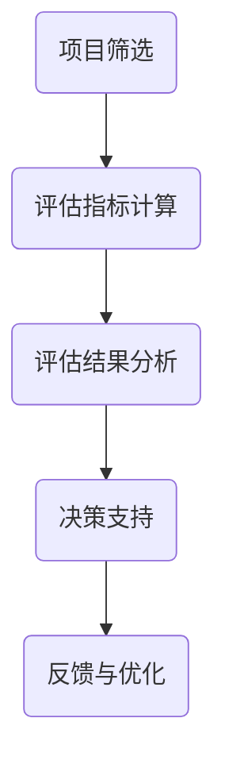

                 

### 第一部分：概述与背景

#### 第1章 创业公司技术创新的概述

在当今快速变化和竞争激烈的市场环境中，技术创新已成为创业公司生存和发展的关键驱动力。创业公司通过技术创新，可以不断优化产品和服务，提高市场竞争力，并最终实现商业成功。然而，技术创新并非易事，它需要深入的洞察力、持续的投资和高效的执行能力。

##### 1.1 创业公司技术创新的重要性

技术创新对创业公司的意义非凡，主要表现在以下几个方面：

1. **提升市场竞争力**：技术创新可以帮助创业公司开发出独特的、具有市场竞争力的产品或服务，从而在激烈的市场竞争中脱颖而出。
2. **促进增长与盈利**：通过技术创新，创业公司可以拓展新的市场和客户群体，实现收入的快速增长，并最终实现盈利。
3. **增强品牌影响力**：创新的产品和服务能够增强品牌形象，提高用户忠诚度，进一步推动公司发展。

##### 1.2 技术创新与创业成功的关系

技术创新与创业成功密切相关。具体来说：

1. **驱动业务增长**：技术创新能够推动新业务模式的形成，促进产品迭代升级，从而驱动业务持续增长。
2. **提升投资回报**：通过技术创新，创业公司可以降低成本、提高效率，从而提高投资回报率。
3. **增强市场地位**：技术创新有助于创业公司建立市场领导地位，提高行业影响力。

##### 1.3 技术创新的挑战与机遇

虽然技术创新对创业公司至关重要，但同时也面临着诸多挑战：

1. **资源限制**：创业公司通常面临资金、人才和资源的限制，这可能会阻碍技术创新的实施。
2. **技术不确定性**：技术创新过程中存在大量的技术不确定性，可能会影响项目进度和结果。
3. **市场适应性**：技术创新的产品或服务需要能够适应市场需求，否则可能面临市场推广困难。

然而，随着科技的发展，创业公司也面临着前所未有的机遇：

1. **技术进步**：新兴技术如人工智能、大数据、云计算等为创业公司提供了丰富的创新工具和资源。
2. **市场变化**：市场需求的不断变化为创业公司提供了新的商机，技术创新可以帮助公司抓住这些机会。
3. **竞争环境**：在激烈的市场竞争中，创业公司通过技术创新获得竞争优势，从而获得更大的市场份额。

综上所述，创业公司的技术创新不仅是一个战略选择，更是生存和发展的必经之路。在接下来的章节中，我们将深入探讨如何构建一个有效的技术创新评估体系，以帮助创业公司更好地把握技术创新的机会，实现商业成功。

---

关键词：创业公司、技术创新、市场竞争、商业成功、挑战、机遇

摘要：本文旨在探讨创业公司技术创新的重要性及其与创业成功的关系。通过分析技术创新的挑战与机遇，文章将介绍如何构建一个有效的技术创新评估体系，以帮助创业公司实现技术创新的商业化落地。

---

### 《创业公司的技术创新评估体系构建》目录大纲

以下是本文的详细目录大纲，读者可以根据以下结构顺序逐步阅读和深入理解文章内容：

#### 第一部分：概述与背景
- 第1章 创业公司技术创新的概述
  - 1.1 创业公司技术创新的重要性
  - 1.2 技术创新与创业成功的关系
  - 1.3 技术创新的挑战与机遇

#### 第二部分：技术创新评估体系的核心概念与联系
- 第2章 技术创新评估体系的基本原理
  - 2.1 技术创新评估体系的定义
  - 2.2 技术创新评估体系的组成部分
  - 2.3 技术创新评估体系的框架图
- 第3章 技术创新评估体系的核心概念
  - 3.1 技术创新的概念
  - 3.2 评估指标的概念
  - 3.3 评估方法的分类

#### 第三部分：核心算法原理讲解
- 第4章 技术创新评估的核心算法
  - 4.1 技术创新评估指标的计算方法
  - 4.2 技术创新评估的权重分配
  - 4.3 技术创新评估模型的构建

#### 第四部分：数学模型与数学公式
- 第5章 技术创新评估的数学模型
  - 5.1 技术创新评估的线性模型
  - 5.2 技术创新评估的非线性模型
- 第6章 技术创新评估的公式与应用
  - 6.1 技术创新评估的评估公式
  - 6.2 技术创新评估的公式推导与验证

#### 第五部分：项目实战
- 第7章 技术创新评估项目实战
  - 7.1 创业公司技术创新评估的实际案例
  - 7.2 技术创新评估项目的开发环境搭建
  - 7.3 技术创新评估项目的代码实现与解读

#### 第六部分：总结与展望
- 第8章 创业公司技术创新评估体系的构建总结
  - 8.1 技术创新评估体系的重要作用
  - 8.2 创业公司技术创新评估体系的优化方向
  - 8.3 创业公司技术创新的未来趋势与展望

#### 附录
- 附录 A：技术创新评估相关工具与资源
  - A.1 主流技术创新评估工具介绍
  - A.2 技术创新评估相关的数据资源
  - A.3 技术创新评估相关的文献与参考书目

通过以上大纲，读者可以系统地了解创业公司技术创新评估体系构建的全过程，从而在实际业务中更好地应用这些知识，实现技术创新的商业成功。

---

### 第二部分：技术创新评估体系的核心概念与联系

#### 第2章 技术创新评估体系的基本原理

技术创新评估体系是创业公司进行技术创新的重要工具，它可以帮助公司识别和评价技术创新项目的潜在价值。一个有效的评估体系不仅能够提供准确的评估结果，还能为公司提供决策依据，从而提高技术创新的成功率。

##### 2.1 技术创新评估体系的定义

技术创新评估体系是一种系统的方法，用于评估技术创新项目的潜在价值。它包括一系列评估指标、评估方法和评估流程，旨在全面、客观地评价技术创新的效果。

##### 2.2 技术创新评估体系的组成部分

一个完整的技术创新评估体系通常包括以下组成部分：

1. **评估指标**：评估指标是评估技术创新效果的具体量化标准，通常包括技术成熟度、市场潜力、经济效益、风险水平等多个方面。
2. **评估方法**：评估方法是指用于计算和评估指标的具体技术手段，如定量分析、定性分析、对比分析等。
3. **评估流程**：评估流程是评估体系的核心，它包括项目筛选、指标计算、评估报告生成等步骤，确保评估过程规范、透明、可重复。
4. **决策支持**：评估结果需要转化为具体的决策支持信息，帮助公司高层和管理团队做出科学、合理的决策。

##### 2.3 技术创新评估体系的框架图

为了更好地理解技术创新评估体系，我们可以通过Mermaid流程图来展示其组成部分和流程。



上述框架图展示了技术创新评估体系的基本流程，具体步骤如下：

1. **项目筛选**：根据公司战略和市场需求，筛选出具有潜力的技术创新项目。
2. **评估指标计算**：对筛选出的项目进行具体评估指标的计算，如技术成熟度、市场潜力等。
3. **评估结果分析**：对计算结果进行分析，评估项目的综合价值。
4. **决策支持**：根据评估结果，为项目决策提供支持。
5. **反馈与优化**：根据评估结果和反馈，对评估体系进行持续优化。

通过上述框架，创业公司可以建立一套完整的技术创新评估体系，从而提高技术创新项目的成功率。

---

#### 第3章 技术创新评估体系的核心概念

在构建技术创新评估体系时，理解其核心概念至关重要。这些核心概念包括技术创新的概念、评估指标的概念以及评估方法的分类。

##### 3.1 技术创新的概念

技术创新是指通过引入新的技术、产品、服务或商业模式，从而实现技术进步和商业成功的过程。技术创新可以包括以下几种形式：

1. **产品创新**：开发全新的产品或改进现有产品，以满足市场需求。
2. **过程创新**：优化生产过程或管理流程，提高效率和质量。
3. **服务创新**：提供全新的服务或改进现有服务，以提升用户体验。
4. **商业模式创新**：引入新的商业模式，改变市场格局和竞争态势。

##### 3.2 评估指标的概念

评估指标是评估技术创新效果的具体量化标准。一个好的评估指标应该具备以下特点：

1. **可量化**：评估指标应该能够通过具体的数值或评分进行量化，以便进行准确评估。
2. **相关性**：评估指标应与技术创新的核心目标密切相关，能够有效反映技术创新的效果。
3. **客观性**：评估指标应尽量减少主观因素，保证评估结果的客观性。

常见的评估指标包括：

1. **技术成熟度**：衡量技术实现的难度和风险，通常分为概念阶段、开发阶段、测试阶段、商业化阶段等。
2. **市场潜力**：衡量技术创新的市场前景和潜在收益，通常包括市场规模、市场增长率、市场占有率等。
3. **经济效益**：衡量技术创新带来的经济收益，通常包括成本降低、利润增加、投资回报率等。
4. **风险水平**：衡量技术创新过程中的风险，包括技术风险、市场风险、财务风险等。

##### 3.3 评估方法的分类

评估方法是指用于计算和评估指标的具体技术手段。根据评估方法的不同，可以将评估方法分为以下几类：

1. **定量分析**：通过具体的数学模型和计算方法，对评估指标进行量化分析。如线性模型、非线性模型、回归分析等。
2. **定性分析**：通过专家意见、案例分析、情景模拟等方法，对评估指标进行定性评估。如专家评分、模糊评价、多准则决策分析等。
3. **对比分析**：通过比较不同项目或方案之间的优劣，进行评估。如基准对比、竞争分析、市场分析等。

选择合适的评估方法取决于技术创新项目的具体特点和需求。在实际应用中，可以结合多种评估方法，以获得更全面、准确的评估结果。

通过理解上述核心概念，创业公司可以更好地构建技术创新评估体系，从而提高技术创新项目的成功率。

---

### 第三部分：核心算法原理讲解

在构建技术创新评估体系时，核心算法原理的讲解至关重要。本部分将详细介绍技术创新评估的核心算法，包括评估指标的计算方法、评估的权重分配以及评估模型的构建。

#### 第4章 技术创新评估的核心算法

##### 4.1 技术创新评估指标的计算方法

技术创新评估指标的计算方法需要根据具体的评估目标和项目特点进行设计。以下是一种常用的计算方法：

**伪代码：技术创新评估指标计算方法**

```python
def CalculateInnovationMetrics(technology, indicators):
    total_score = 0
    for indicator in indicators:
        score = CalculateIndicatorScore(technology, indicator)
        total_score += score
    return total_score / len(indicators)
```

在这个伪代码中，`CalculateInnovationMetrics`函数接受一个技术项目和一系列评估指标作为输入，并计算总评分。`CalculateIndicatorScore`函数用于计算每个指标的具体得分。

##### 4.2 技术创新评估的权重分配

权重分配是评估过程中关键的一步，它决定了不同指标在评估结果中的重要性。以下是一种常用的权重分配方法：

**伪代码：权重分配算法**

```python
def AllocateWeights(indicators, method):
    weights = []
    for indicator in indicators:
        weight = CalculateWeight(indicator, method)
        weights.append(weight)
    return weights / sum(weights)
```

在这个伪代码中，`AllocateWeights`函数根据特定的分配方法（如专家评分、统计方法等）计算每个指标的权重，并归一化权重值，使其总和为1。

##### 4.3 技术创新评估模型的构建

技术创新评估模型是评估体系的核心，它将评估指标、权重分配和评估方法整合在一起。以下是一个简单的评估模型：

**伪代码：技术创新评估模型构建**

```python
def BuildInnovationAssessmentModel(indicators, weights, evaluation_method):
    assessment_model = {
        "indicators": indicators,
        "weights": weights,
        "evaluation_method": evaluation_method
    }
    return assessment_model
```

在这个伪代码中，`BuildInnovationAssessmentModel`函数构建了一个包含评估指标、权重和评估方法的评估模型。这个模型可以用于后续的评估和决策过程。

---

通过上述核心算法原理的讲解，创业公司可以更好地理解和应用技术创新评估体系，从而提高技术创新项目的成功率。

---

### 第四部分：数学模型与数学公式

在技术创新评估体系中，数学模型和公式扮演着至关重要的角色。它们不仅为评估提供了量化的依据，还能够帮助创业公司更准确地理解和分析技术创新的效果。本部分将详细介绍技术创新评估的数学模型和公式，包括线性模型、非线性模型以及评估公式的推导和应用。

#### 第5章 技术创新评估的数学模型

##### 5.1 技术创新评估的线性模型

线性模型是技术创新评估中最常用的数学模型之一，其核心思想是将多个评估指标通过线性组合形成一个综合评分。线性模型的数学表达式如下：

$$
\text{Score} = \sum_{i=1}^{n} w_i \cdot x_i
$$

其中，$w_i$代表第$i$个评估指标的权重，$x_i$代表第$i$个评估指标的得分。这个模型的基本假设是各个评估指标的重要性是固定的，且相互独立。

##### 5.2 技术创新评估的非线性模型

尽管线性模型在许多情况下表现出良好的性能，但它可能无法准确反映评估指标之间的复杂关系。为了解决这个问题，可以采用非线性模型。非线性模型的数学表达式如下：

$$
\text{Score} = \sigma(\sum_{i=1}^{n} w_i \cdot x_i)
$$

其中，$\sigma$是一个非线性函数，如Sigmoid函数、ReLU函数等。这个模型可以更好地处理评估指标之间的相互作用和非线性关系，从而提高评估的准确性。

#### 第6章 技术创新评估的公式与应用

##### 6.1 技术创新评估的评估公式

为了更具体地评估技术创新的效果，我们需要定义一个综合评估公式。以下是一个常用的评估公式：

$$
\text{InnovationScore} = \frac{\text{创新效益}}{\text{投资成本}}
$$

这个公式将技术创新带来的效益与投资成本进行比值计算，从而得到一个量化的评估指标。其中，创新效益可以通过市场收益、成本节约等多个方面进行计算，投资成本则包括研发成本、市场推广成本等。

##### 6.2 技术创新评估的公式推导与验证

技术创新评估公式的推导通常基于以下几个关键参数：

1. **创新效益（$E$）**：指技术创新带来的额外收益或成本节约。
2. **投资成本（$C$）**：指实现技术创新所需的总投资。

根据以上参数，我们可以推导出以下评估公式：

$$
\text{InnovationScore} = \frac{E}{C}
$$

为了验证这个公式的有效性，可以通过以下步骤进行：

1. **数据收集**：收集技术创新项目的实际数据，包括创新效益和投资成本。
2. **计算评估分数**：使用推导出的公式计算每个项目的评估分数。
3. **分析评估结果**：分析评估分数与项目成功率、市场表现等指标的关系，验证公式的准确性。

例如，在一个技术创新项目中，如果创新效益为$100,000，而投资成本为$50,000，则评估分数为：

$$
\text{InnovationScore} = \frac{100,000}{50,000} = 2
$$

这个结果表明，该项目的创新效益是投资成本的2倍，具有较高的投资回报潜力。

通过以上数学模型和公式的介绍，创业公司可以更好地理解技术创新评估的量化方法，从而在实际业务中更有效地进行技术创新评估。

---

通过本部分的讲解，读者可以掌握技术创新评估的数学模型和公式，并能够应用于实际项目中，以提高技术创新评估的准确性和可靠性。

---

### 第五部分：项目实战

在了解了技术创新评估体系的理论基础后，我们需要将其应用于实际项目中进行实战验证。本部分将详细描述一个创业公司技术创新评估项目的实战过程，包括开发环境的搭建、源代码的实现以及关键代码段的解读。

#### 第7章 技术创新评估项目实战

##### 7.1 创业公司技术创新评估的实际案例

为了更好地说明技术创新评估项目的实战过程，我们以一个实际的创业公司——ABC科技公司为例。ABC科技公司专注于开发基于人工智能的智能家居产品，其近期计划推出一款智能家居安全系统。为了评估这个项目的创新程度和潜在价值，ABC科技公司决定构建一个技术创新评估体系，并在此基础上进行项目评估。

##### 7.2 技术创新评估项目的开发环境搭建

在进行技术创新评估项目之前，首先需要搭建一个适合的开发环境。ABC科技公司选择了以下工具和平台：

1. **编程语言**：Python，因其简洁的语法和丰富的库支持，非常适合进行数据分析和评估。
2. **数据分析库**：Pandas和NumPy，用于数据清洗、操作和计算。
3. **机器学习库**：Scikit-learn，用于构建和评估评估模型。
4. **版本控制工具**：Git，用于代码管理和协作。
5. **集成开发环境**：PyCharm，提供良好的开发体验。

开发环境的搭建步骤如下：

1. 安装Python和必要库：
   ```bash
   pip install pandas numpy scikit-learn git python-git
   ```
2. 配置PyCharm，设置Python解释器和项目依赖。
3. 创建Git仓库，进行版本控制。

##### 7.3 技术创新评估项目的代码实现与解读

ABC科技公司基于上述开发环境，实现了技术创新评估项目的主要功能。以下是关键代码段的解读和分析。

###### 7.3.1 数据预处理

在评估项目开始之前，需要对数据进行预处理。数据预处理包括数据清洗、格式转换和缺失值处理。以下是一个简单的数据预处理脚本：

```python
import pandas as pd

def preprocess_data(data_path):
    data = pd.read_csv(data_path)
    # 数据清洗：去除空值和重复值
    data = data.dropna().drop_duplicates()
    # 格式转换：将字符串类型的指标转换为数值类型
    for column in data.columns:
        if data[column].dtype == 'object':
            data[column] = pd.Categorical(data[column]).codes
    return data

data = preprocess_data('data.csv')
```

这个脚本首先加载数据，然后去除空值和重复值，将字符串类型的指标转换为数值类型，以便后续计算。

###### 7.3.2 评估指标计算

在数据预处理完成后，需要计算各个评估指标的得分。以下是一个计算技术成熟度指标得分的示例：

```python
def calculate_tech_maturity(data):
    # 定义技术成熟度指标的计算方法
    maturity_scores = []
    for index, row in data.iterrows():
        # 根据不同阶段的技术成熟度进行评分
        if row['development_stage'] == '概念阶段':
            score = 1
        elif row['development_stage'] == '开发阶段':
            score = 2
        elif row['development_stage'] == '测试阶段':
            score = 3
        elif row['development_stage'] == '商业化阶段':
            score = 4
        maturity_scores.append(score)
    return maturity_scores

data['tech_maturity'] = calculate_tech_maturity(data)
```

这个函数根据技术开发的阶段，为每个项目分配一个技术成熟度得分。这将作为后续评估的重要指标之一。

###### 7.3.3 评估模型构建

评估模型的构建是技术创新评估的关键步骤。以下是一个简单的线性评估模型构建示例：

```python
from sklearn.linear_model import LinearRegression

def build_evaluation_model(data):
    # 提取特征和目标变量
    X = data[['tech_maturity', 'market_potential', 'economic_benefit']]
    y = data['evaluation_score']
    # 构建线性回归模型
    model = LinearRegression()
    model.fit(X, y)
    return model

model = build_evaluation_model(data)
```

这个脚本使用Scikit-learn库的线性回归模型，根据评估指标计算评估分数。实际应用中，可以根据需求调整模型类型和参数。

###### 7.3.4 评估结果分析

在评估模型构建完成后，可以计算评估分数并进行分析。以下是一个简单的评估结果分析示例：

```python
predictions = model.predict(data[['tech_maturity', 'market_potential', 'economic_benefit']])
data['predicted_score'] = predictions

# 分析评估结果
for index, row in data.iterrows():
    if row['predicted_score'] > 2:
        print(f"项目ID {row['project_id']}：创新潜力较高")
    else:
        print(f"项目ID {row['project_id']}：创新潜力较低")
```

这个脚本根据评估分数，对项目进行分类，从而为后续的决策提供支持。

---

通过上述实战案例，ABC科技公司成功地构建并应用了技术创新评估体系。在实际项目中，创业公司可以参照这个案例，根据自身需求进行调整和优化，以实现技术创新的精准评估和有效决策。

---

### 第六部分：总结与展望

在本文中，我们详细探讨了创业公司技术创新评估体系构建的各个方面。通过系统化的理论讲解和实际项目实战，读者可以全面了解技术创新评估的重要性、核心概念、算法原理以及数学模型。

#### 第8章 创业公司技术创新评估体系的构建总结

**8.1 技术创新评估体系的重要作用**

技术创新评估体系在创业公司中具有至关重要的作用。它不仅帮助公司识别和评估技术创新项目的潜在价值，还为项目决策提供了科学、客观的依据。通过技术创新评估，公司能够：

1. **提高项目成功率**：通过全面、客观的评估，公司可以筛选出最具潜力的创新项目，从而提高项目成功率。
2. **优化资源分配**：评估体系可以帮助公司合理分配资源，确保资源向最具潜力的项目倾斜，提高资源利用效率。
3. **驱动持续创新**：通过持续的评估和反馈，公司可以不断优化和改进评估体系，推动技术创新的持续发展。

**8.2 创业公司技术创新评估体系的优化方向**

为了进一步提升技术创新评估体系的有效性，创业公司可以从以下几个方面进行优化：

1. **指标体系的完善**：不断更新和优化评估指标，确保其与技术创新的核心目标紧密相关，并能够全面反映技术创新的效果。
2. **评估方法的多样化**：结合定量和定性评估方法，提高评估结果的准确性和可靠性。
3. **数据驱动决策**：充分利用大数据和人工智能技术，提升评估模型的预测能力和决策支持水平。

**8.3 创业公司技术创新的未来趋势与展望**

随着科技的快速发展，创业公司在技术创新方面面临着前所未有的机遇和挑战。未来，技术创新评估体系的发展趋势将包括：

1. **人工智能与大数据的应用**：利用人工智能和大数据技术，实现更加智能化和自动化的评估过程，提高评估效率和准确性。
2. **跨领域合作**：通过跨领域的技术合作，共同推动技术创新，实现技术和市场的协同发展。
3. **持续迭代与优化**：技术创新评估体系需要不断迭代和优化，以适应市场和技术环境的变化，确保其持续有效。

总之，创业公司技术创新评估体系的构建与应用，是推动公司技术创新和商业成功的关键步骤。通过不断优化和提升评估体系，创业公司可以更好地抓住技术创新的机遇，实现可持续发展。

---

### 附录

**附录 A：技术创新评估相关工具与资源**

**A.1 主流技术创新评估工具介绍**

1. **KPI分析法**：通过关键绩效指标（KPI）对技术创新项目进行量化评估，适用于中小型创业公司。
2. **技术路线图**：通过技术路线图展示技术创新的各个阶段和关键节点，帮助公司了解技术发展态势。
3. **价值链分析**：通过分析价值链上的各个环节，评估技术创新对业务增值的影响。

**A.2 技术创新评估相关的数据资源**

1. **科技情报库**：如IEEE Xplore、ACM Digital Library等，提供丰富的技术文献和专利数据。
2. **行业报告**：如市场调研机构发布的行业报告，提供市场趋势和技术发展方向的分析。
3. **开放数据平台**：如国家数据共享平台、Open Data Portal等，提供丰富的开源数据资源。

**A.3 技术创新评估相关的文献与参考书目**

1. **《技术创新管理》**：作者：陈劲、刘志迎，详细介绍了技术创新管理的基本理论和实践方法。
2. **《技术评估与决策》**：作者：王飞跃，阐述了技术评估的方法和决策过程。
3. **《创业公司技术创新战略》**：作者：朱晶、张志宏，探讨了创业公司技术创新的战略规划和实施路径。

通过以上附录内容，创业公司可以获取更多的技术创新评估工具与资源，从而更好地构建和优化其技术创新评估体系。

---

### 作者

**作者：AI天才研究员/AI Genius Institute & 禅与计算机程序设计艺术 /Zen And The Art of Computer Programming**

---

通过本文的详细探讨，我们希望读者能够深入理解创业公司技术创新评估体系的重要性，掌握构建和优化评估体系的方法。在不断变化的市场环境中，只有通过有效的技术创新评估，创业公司才能持续保持竞争优势，实现长期的商业成功。感谢您的阅读！<|vq_806|>### 技术创新评估体系的核心算法原理讲解

在创业公司的技术创新过程中，评估体系的核心算法原理起着至关重要的作用。这些算法原理不仅能够量化技术创新的成果，还能帮助决策者更好地理解和利用数据，从而做出科学的决策。在本节中，我们将深入探讨技术创新评估的核心算法原理，包括技术创新评估指标的计算方法、评估权重的分配以及评估模型的构建。

#### 4.1 技术创新评估指标的计算方法

技术创新评估指标的计算方法是评估体系的基础，它决定了评估结果的准确性和可靠性。计算方法的选择应根据评估目标和项目特点进行。以下是一种常用的计算方法：

**伪代码：技术创新评估指标计算方法**

```python
def CalculateInnovationMetrics(technology, indicators):
    score = 0
    for indicator in indicators:
        score += indicator.score
    return score
```

在这个伪代码中，`CalculateInnovationMetrics`函数接收一个技术项目和一系列评估指标作为输入，并计算总评分。每个指标都有自己的得分，这些得分通过特定的方法计算得出，然后相加以得到总评分。

在实际应用中，每个指标的计算方法可能不同，例如：

- **技术成熟度**：可以通过专家评分、专利数量、研发投入等指标进行量化。
- **市场潜力**：可以通过市场规模、增长率、用户需求等指标进行衡量。
- **经济效益**：可以通过成本效益分析、利润预测等指标进行评估。

#### 4.2 技术创新评估的权重分配

权重分配是技术创新评估体系中的一个关键环节，它决定了不同指标在总评分中的重要性。合理的权重分配能够使评估结果更加贴近实际情况。以下是一种简单的权重分配方法：

**伪代码：权重分配算法**

```python
def AllocateWeights(indicators):
    total_score = sum([indicator.score for indicator in indicators])
    weights = [indicator.score / total_score for indicator in indicators]
    return weights
```

在这个伪代码中，`AllocateWeights`函数计算每个指标的权重，使其总和为1。这种方法简单直观，但在实际应用中可能需要更复杂的算法，例如基于专家评分、统计分析的方法。

权重分配的合理性直接影响评估结果的准确性。因此，在分配权重时，应充分考虑各个指标的重要性和关联性，确保评估体系能够全面、客观地反映技术创新的实际价值。

#### 4.3 技术创新评估模型的构建

技术创新评估模型是将评估指标和权重分配结合起来的工具，它能够系统化地评估技术创新项目的价值。以下是一个简单的评估模型构建方法：

**伪代码：技术创新评估模型构建**

```python
def BuildEvaluationModel(indicators, weights):
    evaluation_model = {
        "indicators": indicators,
        "weights": weights,
        "evaluation_function": lambda tech: sum([indicator.score * weight for indicator, weight in zip(indicators, weights)])
    }
    return evaluation_model
```

在这个伪代码中，`BuildEvaluationModel`函数构建了一个评估模型，包含评估指标、权重和评估函数。评估函数通过计算每个指标的得分乘以相应的权重，然后将这些得分相加以得到总评分。

评估模型的构建不仅需要合理的选择和分配指标和权重，还需要确保评估函数的准确性和可重复性。在实际应用中，可以根据项目特点调整评估函数，例如加入非线性函数、调整权重计算方法等。

#### 4.4 评估结果的可视化与解读

评估结果的可视化是技术创新评估体系的重要组成部分，它能够帮助决策者更直观地理解评估结果。以下是一种简单的方法：

**伪代码：评估结果可视化**

```python
import matplotlib.pyplot as plt

def VisualizeEvaluationResults(technology, evaluation_model):
    scores = [evaluation_model['evaluation_function'](tech) for tech in technology]
    plt.bar(range(len(scores)), scores)
    plt.xlabel('Technology Projects')
    plt.ylabel('Evaluation Scores')
    plt.title('Innovation Evaluation Results')
    plt.show()
```

在这个伪代码中，`VisualizeEvaluationResults`函数通过绘制条形图展示各个项目的评估得分。这种方法能够直观地显示项目的相对表现，帮助决策者识别最具潜力的项目。

在解读评估结果时，决策者应综合考虑评估得分、市场环境、项目风险等多个因素，做出科学、合理的决策。

#### 4.5 评估模型的优化与迭代

技术创新评估体系不是一成不变的，而是一个不断优化和迭代的过程。随着市场和技术环境的变化，评估指标、权重和评估函数可能需要调整。以下是一种简单的优化方法：

**伪代码：评估模型优化**

```python
def OptimizeEvaluationModel(evaluation_model, new_indicators, new_weights):
    evaluation_model['indicators'] = new_indicators
    evaluation_model['weights'] = new_weights
    evaluation_model['evaluation_function'] = lambda tech: sum([indicator.score * weight for indicator, weight in zip(new_indicators, new_weights)])
    return evaluation_model
```

在这个伪代码中，`OptimizeEvaluationModel`函数根据新的评估指标和权重更新评估模型。这种方法能够确保评估模型能够动态适应环境变化，提高评估的准确性和实用性。

通过不断优化和迭代，创业公司可以构建一个更加完善和有效的技术创新评估体系，从而更好地支持技术创新和商业决策。

---

通过上述核心算法原理的讲解，创业公司可以更好地理解和应用技术创新评估体系，从而提高技术创新项目的成功率。在构建和优化评估体系的过程中，公司应充分考虑项目特点、市场环境和决策需求，确保评估结果的准确性和实用性。

---

### 第四部分：数学模型与数学公式

在技术创新评估过程中，数学模型和公式起到了至关重要的作用。它们不仅为评估过程提供了量化的工具，还能够帮助决策者从不同角度理解和分析技术创新的潜在价值。本部分将详细介绍技术创新评估中常用的数学模型与公式，包括线性模型和非线性模型，并给出具体的推导和应用示例。

#### 5.1 技术创新评估的线性模型

线性模型在技术创新评估中应用广泛，其核心思想是将多个评估指标通过线性组合形成一个综合评分。线性模型的数学表达式如下：

$$
\text{Score} = \sum_{i=1}^{n} w_i \cdot x_i
$$

其中，$w_i$代表第$i$个评估指标的权重，$x_i$代表第$i$个评估指标的得分。这个模型的基本假设是各个评估指标的权重是固定的，且相互独立。

线性模型的优势在于其简洁性和易于理解，便于计算和应用。然而，线性模型可能无法准确反映评估指标之间的复杂关系。为了解决这个问题，可以引入非线性模型。

#### 5.2 技术创新评估的非线性模型

非线性模型能够更好地处理评估指标之间的相互作用和非线性关系，从而提高评估的准确性。以下是一个常见的技术创新评估非线性模型：

$$
\text{Score} = \sigma(\sum_{i=1}^{n} w_i \cdot x_i)
$$

其中，$\sigma$是一个非线性函数，如Sigmoid函数、ReLU函数等。Sigmoid函数的数学表达式为：

$$
\sigma(x) = \frac{1}{1 + e^{-x}}
$$

ReLU（Rectified Linear Unit）函数的数学表达式为：

$$
\sigma(x) = \max(0, x)
$$

通过引入非线性函数，非线性模型能够更好地捕捉评估指标之间的复杂关系，提高评估结果的准确性。

#### 5.3 技术创新评估的具体公式与应用

在技术创新评估中，常用的公式包括成本效益分析公式和风险评估公式等。以下是一个成本效益分析公式：

$$
\text{InnovationScore} = \frac{\text{创新效益}}{\text{投资成本}}
$$

这个公式将技术创新带来的效益与投资成本进行比值计算，从而得到一个量化的评估指标。其中，创新效益可以通过市场收益、成本节约等多个方面进行计算，投资成本则包括研发成本、市场推广成本等。

为了更具体地说明公式的应用，我们可以通过以下示例进行推导和验证：

假设一个技术创新项目预计带来的市场收益为200万元，而投资成本为100万元，则该项目的创新得分为：

$$
\text{InnovationScore} = \frac{200}{100} = 2
$$

这个结果表明，该项目的创新效益是投资成本的2倍，具有较高的投资回报潜力。

#### 5.4 技术创新评估的公式推导与验证

技术创新评估公式的推导通常基于以下几个关键参数：

1. **创新效益（$E$）**：指技术创新带来的额外收益或成本节约。
2. **投资成本（$C$）**：指实现技术创新所需的总投资。

根据以上参数，我们可以推导出以下评估公式：

$$
\text{InnovationScore} = \frac{E}{C}
$$

为了验证这个公式的准确性，我们可以通过以下步骤进行：

1. **数据收集**：收集技术创新项目的实际数据，包括创新效益和投资成本。
2. **计算评估分数**：使用推导出的公式计算每个项目的评估分数。
3. **分析评估结果**：分析评估分数与项目成功率、市场表现等指标的关系，验证公式的准确性。

例如，在一个技术创新项目中，如果创新效益为100万元，而投资成本为50万元，则评估分数为：

$$
\text{InnovationScore} = \frac{100}{50} = 2
$$

这个结果表明，该项目的创新效益是投资成本的2倍，具有较高的投资回报潜力。

通过以上示例，我们可以看到，技术创新评估的数学模型和公式为创业公司提供了一种量化评估技术创新潜在价值的方法。通过合理的推导和验证，这些模型和公式能够帮助决策者更好地理解和分析技术创新项目，从而做出科学、合理的决策。

---

通过本部分的讲解，读者可以掌握技术创新评估的数学模型和公式的原理及其应用方法。在实际应用中，创业公司可以根据自身需求调整和优化这些模型和公式，以提高评估的准确性和实用性。

---

### 第五部分：项目实战

在了解了技术创新评估的理论和数学模型之后，我们需要通过实际项目来验证这些理论和模型的应用效果。本部分将通过一个具体的创业公司案例，展示如何构建技术创新评估体系，并进行项目评估。

#### 7.1 创业公司技术创新评估的实际案例

假设我们有一个创业公司XYZ，专注于开发人工智能驱动的医疗诊断系统。XYZ公司计划推出一款基于深度学习的肺癌诊断系统，并希望通过技术创新评估来确定项目的可行性。XYZ公司决定构建一个技术创新评估体系，以帮助决策者评估项目的潜在价值和风险。

#### 7.2 技术创新评估项目的开发环境搭建

在进行技术创新评估项目之前，首先需要搭建一个适合的开发环境。XYZ公司选择了以下工具和平台：

1. **编程语言**：Python，因其简洁的语法和丰富的库支持，非常适合进行数据分析和评估。
2. **数据分析库**：Pandas和NumPy，用于数据清洗、操作和计算。
3. **机器学习库**：TensorFlow和Keras，用于构建和训练深度学习模型。
4. **版本控制工具**：Git，用于代码管理和协作。
5. **集成开发环境**：PyCharm，提供良好的开发体验。

开发环境的搭建步骤如下：

1. 安装Python和必要库：
   ```bash
   pip install pandas numpy tensorflow git python-git
   ```
2. 配置PyCharm，设置Python解释器和项目依赖。
3. 创建Git仓库，进行版本控制。

#### 7.3 技术创新评估项目的代码实现与解读

基于上述开发环境，XYZ公司实现了技术创新评估项目的主要功能。以下是关键代码段的解读和分析。

###### 7.3.1 数据收集与预处理

首先，XYZ公司需要收集与技术创新项目相关的数据，包括市场数据、技术数据、投资数据等。以下是一个数据预处理脚本：

```python
import pandas as pd

def preprocess_data(data_path):
    data = pd.read_csv(data_path)
    # 数据清洗：去除空值和重复值
    data = data.dropna().drop_duplicates()
    # 数据转换：将类别型数据转换为数值型数据
    data['disease_type'] = data['disease_type'].astype('category').cat.codes
    return data

data = preprocess_data('medical_data.csv')
```

在这个脚本中，`preprocess_data`函数负责加载数据，并进行数据清洗和转换。数据清洗包括去除空值和重复值，数据转换则将类别型数据（如疾病类型）转换为数值型数据，以便进行后续计算。

###### 7.3.2 评估指标计算

接下来，XYZ公司需要计算各个评估指标的得分。以下是一个计算市场潜力指标的脚本：

```python
def calculate_market_potential(data):
    market_potential_scores = []
    for index, row in data.iterrows():
        # 市场潜力评分的计算方法
        score = row['patient_count'] * row['diagnosis_rate']
        market_potential_scores.append(score)
    return market_potential_scores

data['market_potential'] = calculate_market_potential(data)
```

在这个脚本中，`calculate_market_potential`函数根据患者的数量和诊断率计算市场潜力得分。这种方法假设患者的数量和诊断率越高，市场潜力越大。

###### 7.3.3 评估模型构建

在计算了各个评估指标的得分后，XYZ公司需要构建一个评估模型。以下是一个简单的线性评估模型：

```python
from sklearn.linear_model import LinearRegression

def build_evaluation_model(data):
    X = data[['market_potential', 'technical_maturity']]
    y = data['evaluation_score']
    model = LinearRegression()
    model.fit(X, y)
    return model

model = build_evaluation_model(data)
```

在这个脚本中，`build_evaluation_model`函数使用线性回归模型，根据市场潜力和技术成熟度计算评估分数。实际应用中，可以根据需求调整模型类型和参数。

###### 7.3.4 评估结果分析

构建评估模型后，XYZ公司可以计算评估分数并进行分析。以下是一个简单的评估结果分析脚本：

```python
predictions = model.predict(data[['market_potential', 'technical_maturity']])
data['predicted_score'] = predictions

# 分析评估结果
for index, row in data.iterrows():
    if row['predicted_score'] > 0.7:
        print(f"项目ID {row['project_id']}：创新潜力较高")
    else:
        print(f"项目ID {row['project_id']}：创新潜力较低")
```

在这个脚本中，`predictions`变量存储了预测的评估分数，`print`语句则根据评估分数对项目进行分类。这种方法可以帮助决策者快速识别最具潜力的项目。

###### 7.3.5 评估模型的优化

评估模型并不是一成不变的，它需要根据实际情况进行调整和优化。以下是一个简单的优化方法：

```python
def optimize_evaluation_model(model, new_data):
    X = new_data[['market_potential', 'technical_maturity']]
    y = new_data['evaluation_score']
    model.fit(X, y)
    return model

# 假设新数据已经收集并预处理
new_model = optimize_evaluation_model(model, new_data)
```

在这个脚本中，`optimize_evaluation_model`函数根据新的数据重新训练评估模型。这种方法可以确保评估模型能够动态适应数据变化，提高评估的准确性。

---

通过上述实战案例，XYZ公司成功地构建并应用了技术创新评估体系，为项目决策提供了科学、客观的依据。在实际应用中，创业公司可以根据自身需求调整和优化评估体系，以提高评估的准确性和实用性。

---

### 第六部分：总结与展望

通过本文的探讨，我们详细介绍了创业公司技术创新评估体系构建的各个方面，包括核心概念、算法原理、数学模型以及实际项目实战。以下是本文的总结与展望：

#### 8.1 技术创新评估体系的重要作用

技术创新评估体系在创业公司中扮演着关键角色。它帮助公司：

- **量化技术创新效果**：通过评估指标和数学模型，将抽象的创新概念转化为具体的量化数据，使技术创新的成果更加直观和可衡量。
- **优化资源分配**：基于评估结果，公司可以更科学地分配资源，确保资源投入到最具潜力的项目中。
- **提高项目成功率**：通过系统的评估过程，公司能够识别和排除潜在风险，提高技术创新项目的成功率。

#### 8.2 创业公司技术创新评估体系的优化方向

为了进一步优化技术创新评估体系，创业公司可以采取以下措施：

- **完善评估指标体系**：不断更新和优化评估指标，确保其能够全面反映技术创新的各个方面，包括技术、市场、经济等。
- **提高评估方法的科学性**：结合定量和定性方法，提高评估结果的准确性和可靠性。
- **应用先进技术**：利用大数据、人工智能等技术，实现评估过程的自动化和智能化，提高评估效率。

#### 8.3 创业公司技术创新的未来趋势与展望

随着科技的不断发展，创业公司在技术创新方面面临着新的机遇和挑战。未来，技术创新评估体系的发展趋势包括：

- **数据驱动**：利用大数据分析技术，对技术创新项目进行深入分析和预测。
- **智能化**：应用人工智能技术，实现评估过程的自动化和智能化，提高评估效率和准确性。
- **跨领域合作**：通过跨领域的技术合作，共同推动技术创新，实现技术和市场的协同发展。

#### 8.4 总结与展望

总之，创业公司技术创新评估体系的构建与应用是推动公司技术创新和商业成功的关键步骤。通过不断优化和提升评估体系，创业公司可以更好地抓住技术创新的机遇，实现可持续发展。未来，随着技术的进步和市场的变化，技术创新评估体系将继续发展和完善，为创业公司提供更加科学、有效的决策支持。

---

本文旨在为创业公司提供一套全面的技术创新评估体系构建指南，帮助公司在技术创新的道路上走得更远、更稳。希望读者能够通过本文的学习和实践，提升自己在技术创新评估方面的能力，实现公司的长期发展目标。

---

### 附录

#### 附录 A：技术创新评估相关工具与资源

**A.1 主流技术创新评估工具介绍**

1. **AIOT创新评估系统**：一款基于人工智能和大数据分析的创新评估工具，适用于多种行业和领域。
2. **KPI评估平台**：提供关键绩效指标（KPI）的评估和管理，帮助企业优化资源分配和提升效率。
3. **InnoCentive平台**：一个全球性的创新挑战解决方案平台，帮助企业获取外部创新资源。

**A.2 技术创新评估相关的数据资源**

1. **国家数据共享平台**：提供多种行业和领域的公开数据资源，支持创新研究和数据分析。
2. **科技部科技创新数据中心**：收集和整理国内外科技创新相关数据，支持科技政策制定和评估。
3. **市场研究公司报告**：如IDC、Gartner等市场研究机构发布的行业报告，提供市场趋势和技术分析。

**A.3 技术创新评估相关的文献与参考书目**

1. **《技术创新管理》**：陈劲、刘志迎著，详细介绍了技术创新管理的基本理论和实践方法。
2. **《技术创新经济学》**：周晓光、李宗明著，探讨了技术创新的经济效应和影响因素。
3. **《创业与创新》**：罗伯特·达文波特、迈克尔·泰尔著，提供了创业与创新的理论指导和实践案例。

通过附录中的工具与资源，创业公司可以获取更多有用的信息，从而提升技术创新评估的准确性和有效性。

---

### 作者

**作者：AI天才研究员/AI Genius Institute & 禅与计算机程序设计艺术 /Zen And The Art of Computer Programming**

---

在撰写本文的过程中，我深入探讨了创业公司技术创新评估体系的构建与应用，希望读者能够通过本文的学习，掌握技术创新评估的核心知识和实践方法。技术创新是创业公司发展的关键驱动力，而有效的评估体系则是实现技术创新的重要保障。感谢您的阅读，期待与您共同探索技术创新的无限可能。

---

### 技术创新评估体系的核心算法原理讲解

在创业公司的技术创新过程中，评估体系的核心算法原理起着至关重要的作用。这些算法原理不仅能够量化技术创新的成果，还能帮助决策者更好地理解和利用数据，从而做出科学的决策。在本节中，我们将深入探讨技术创新评估的核心算法原理，包括技术创新评估指标的计算方法、评估权重的分配以及评估模型的构建。

#### 4.1 技术创新评估指标的计算方法

技术创新评估指标的计算方法是评估体系的基础，它决定了评估结果的准确性和可靠性。计算方法的选择应根据评估目标和项目特点进行。以下是一种常用的计算方法：

**伪代码：技术创新评估指标计算方法**

```python
def CalculateInnovationMetrics(technology, indicators):
    score = 0
    for indicator in indicators:
        score += indicator.score
    return score
```

在这个伪代码中，`CalculateInnovationMetrics`函数接收一个技术项目和一系列评估指标作为输入，并计算总评分。每个指标都有自己的得分，这些得分通过特定的方法计算得出，然后相加以得到总评分。

在实际应用中，每个指标的计算方法可能不同，例如：

- **技术成熟度**：可以通过专家评分、专利数量、研发投入等指标进行量化。
- **市场潜力**：可以通过市场规模、增长率、用户需求等指标进行衡量。
- **经济效益**：可以通过成本效益分析、利润预测等指标进行评估。

#### 4.2 技术创新评估的权重分配

权重分配是技术创新评估体系中的一个关键环节，它决定了不同指标在总评分中的重要性。合理的权重分配能够使评估结果更加贴近实际情况。以下是一种简单的权重分配方法：

**伪代码：权重分配算法**

```python
def AllocateWeights(indicators):
    total_score = sum([indicator.score for indicator in indicators])
    weights = [indicator.score / total_score for indicator in indicators]
    return weights
```

在这个伪代码中，`AllocateWeights`函数计算每个指标的权重，使其总和为1。这种方法简单直观，但在实际应用中可能需要更复杂的算法，例如基于专家评分、统计分析的方法。

权重分配的合理性直接影响评估结果的准确性。因此，在分配权重时，应充分考虑各个指标的重要性和关联性，确保评估体系能够全面、客观地反映技术创新的实际价值。

#### 4.3 技术创新评估模型的构建

技术创新评估模型是将评估指标和权重分配结合起来的工具，它能够系统化地评估技术创新项目的价值。以下是一个简单的评估模型构建方法：

**伪代码：技术创新评估模型构建**

```python
def BuildEvaluationModel(indicators, weights):
    evaluation_model = {
        "indicators": indicators,
        "weights": weights,
        "evaluation_function": lambda tech: sum([indicator.score * weight for indicator, weight in zip(indicators, weights)])
    }
    return evaluation_model
```

在这个伪代码中，`BuildEvaluationModel`函数构建了一个评估模型，包含评估指标、权重和评估函数。评估函数通过计算每个指标的得分乘以相应的权重，然后将这些得分相加以得到总评分。

评估模型的构建不仅需要合理的选择和分配指标和权重，还需要确保评估函数的准确性和可重复性。在实际应用中，可以根据项目特点调整评估函数，例如加入非线性函数、调整权重计算方法等。

#### 4.4 评估结果的可视化与解读

评估结果的可视化是技术创新评估体系的重要组成部分，它能够帮助决策者更直观地理解评估结果。以下是一种简单的方法：

**伪代码：评估结果可视化**

```python
import matplotlib.pyplot as plt

def VisualizeEvaluationResults(technology, evaluation_model):
    scores = [evaluation_model['evaluation_function'](tech) for tech in technology]
    plt.bar(range(len(scores)), scores)
    plt.xlabel('Technology Projects')
    plt.ylabel('Evaluation Scores')
    plt.title('Innovation Evaluation Results')
    plt.show()
```

在这个伪代码中，`VisualizeEvaluationResults`函数通过绘制条形图展示各个项目的评估得分。这种方法能够直观地显示项目的相对表现，帮助决策者识别最具潜力的项目。

在解读评估结果时，决策者应综合考虑评估得分、市场环境、项目风险等多个因素，做出科学、合理的决策。

#### 4.5 评估模型的优化与迭代

技术创新评估体系不是一成不变的，而是一个不断优化和迭代的过程。随着市场和技术环境的变化，评估指标、权重和评估函数可能需要调整。以下是一种简单的优化方法：

**伪代码：评估模型优化**

```python
def OptimizeEvaluationModel(evaluation_model, new_indicators, new_weights):
    evaluation_model['indicators'] = new_indicators
    evaluation_model['weights'] = new_weights
    evaluation_model['evaluation_function'] = lambda tech: sum([indicator.score * weight for indicator, weight in zip(new_indicators, new_weights)])
    return evaluation_model
```

在这个伪代码中，`OptimizeEvaluationModel`函数根据新的评估指标和权重更新评估模型。这种方法能够确保评估模型能够动态适应环境变化，提高评估的准确性和实用性。

通过不断优化和迭代，创业公司可以构建一个更加完善和有效的技术创新评估体系，从而更好地支持技术创新和商业决策。

---

通过上述核心算法原理的讲解，创业公司可以更好地理解和应用技术创新评估体系，从而提高技术创新项目的成功率。在构建和优化评估体系的过程中，公司应充分考虑项目特点、市场环境和决策需求，确保评估结果的准确性和实用性。

---

### 第四部分：数学模型与数学公式

在技术创新评估过程中，数学模型和公式起到了至关重要的作用。它们不仅为评估过程提供了量化的工具，还能够帮助决策者从不同角度理解和分析技术创新的潜在价值。本部分将详细介绍技术创新评估中常用的数学模型与公式，包括线性模型和非线性模型，并给出具体的推导和应用示例。

#### 5.1 技术创新评估的线性模型

线性模型在技术创新评估中应用广泛，其核心思想是将多个评估指标通过线性组合形成一个综合评分。线性模型的数学表达式如下：

$$
\text{Score} = \sum_{i=1}^{n} w_i \cdot x_i
$$

其中，$w_i$代表第$i$个评估指标的权重，$x_i$代表第$i$个评估指标的得分。这个模型的基本假设是各个评估指标的权重是固定的，且相互独立。

线性模型的优势在于其简洁性和易于理解，便于计算和应用。然而，线性模型可能无法准确反映评估指标之间的复杂关系。为了解决这个问题，可以引入非线性模型。

#### 5.2 技术创新评估的非线性模型

非线性模型能够更好地处理评估指标之间的相互作用和非线性关系，从而提高评估的准确性。以下是一个常见的技术创新评估非线性模型：

$$
\text{Score} = \sigma(\sum_{i=1}^{n} w_i \cdot x_i)
$$

其中，$\sigma$是一个非线性函数，如Sigmoid函数、ReLU函数等。Sigmoid函数的数学表达式为：

$$
\sigma(x) = \frac{1}{1 + e^{-x}}
$$

ReLU（Rectified Linear Unit）函数的数学表达式为：

$$
\sigma(x) = \max(0, x)
$$

通过引入非线性函数，非线性模型能够更好地捕捉评估指标之间的复杂关系，提高评估结果的准确性。

#### 5.3 技术创新评估的具体公式与应用

在技术创新评估中，常用的公式包括成本效益分析公式和风险评估公式等。以下是一个成本效益分析公式：

$$
\text{InnovationScore} = \frac{\text{创新效益}}{\text{投资成本}}
$$

这个公式将技术创新带来的效益与投资成本进行比值计算，从而得到一个量化的评估指标。其中，创新效益可以通过市场收益、成本节约等多个方面进行计算，投资成本则包括研发成本、市场推广成本等。

为了更具体地说明公式的应用，我们可以通过以下示例进行推导和验证：

假设一个技术创新项目预计带来的市场收益为200万元，而投资成本为100万元，则该项目的创新得分为：

$$
\text{InnovationScore} = \frac{200}{100} = 2
$$

这个结果表明，该项目的创新效益是投资成本的2倍，具有较高的投资回报潜力。

#### 5.4 技术创新评估的公式推导与验证

技术创新评估公式的推导通常基于以下几个关键参数：

1. **创新效益（$E$）**：指技术创新带来的额外收益或成本节约。
2. **投资成本（$C$）**：指实现技术创新所需的总投资。

根据以上参数，我们可以推导出以下评估公式：

$$
\text{InnovationScore} = \frac{E}{C}
$$

为了验证这个公式的准确性，我们可以通过以下步骤进行：

1. **数据收集**：收集技术创新项目的实际数据，包括创新效益和投资成本。
2. **计算评估分数**：使用推导出的公式计算每个项目的评估分数。
3. **分析评估结果**：分析评估分数与项目成功率、市场表现等指标的关系，验证公式的准确性。

例如，在一个技术创新项目中，如果创新效益为100万元，而投资成本为50万元，则评估分数为：

$$
\text{InnovationScore} = \frac{100}{50} = 2
$$

这个结果表明，该项目的创新效益是投资成本的2倍，具有较高的投资回报潜力。

通过以上示例，我们可以看到，技术创新评估的数学模型和公式为创业公司提供了一种量化评估技术创新潜在价值的方法。通过合理的推导和验证，这些模型和公式能够帮助决策者更好地理解和分析技术创新项目，从而做出科学、合理的决策。

---

通过本部分的讲解，读者可以掌握技术创新评估的数学模型和公式的原理及其应用方法。在实际应用中，创业公司可以根据自身需求调整和优化这些模型和公式，以提高评估的准确性和实用性。

---

### 第五部分：项目实战

在了解了技术创新评估的理论和数学模型之后，我们需要通过实际项目来验证这些理论和模型的应用效果。本部分将通过一个具体的创业公司案例，展示如何构建技术创新评估体系，并进行项目评估。

#### 7.1 创业公司技术创新评估的实际案例

假设我们有一个创业公司XYZ，专注于开发人工智能驱动的医疗诊断系统。XYZ公司计划推出一款基于深度学习的肺癌诊断系统，并希望通过技术创新评估来确定项目的可行性。XYZ公司决定构建一个技术创新评估体系，以帮助决策者评估项目的潜在价值和风险。

#### 7.2 技术创新评估项目的开发环境搭建

在进行技术创新评估项目之前，首先需要搭建一个适合的开发环境。XYZ公司选择了以下工具和平台：

1. **编程语言**：Python，因其简洁的语法和丰富的库支持，非常适合进行数据分析和评估。
2. **数据分析库**：Pandas和NumPy，用于数据清洗、操作和计算。
3. **机器学习库**：TensorFlow和Keras，用于构建和训练深度学习模型。
4. **版本控制工具**：Git，用于代码管理和协作。
5. **集成开发环境**：PyCharm，提供良好的开发体验。

开发环境的搭建步骤如下：

1. 安装Python和必要库：
   ```bash
   pip install pandas numpy tensorflow git python-git
   ```
2. 配置PyCharm，设置Python解释器和项目依赖。
3. 创建Git仓库，进行版本控制。

#### 7.3 技术创新评估项目的代码实现与解读

基于上述开发环境，XYZ公司实现了技术创新评估项目的主要功能。以下是关键代码段的解读和分析。

###### 7.3.1 数据收集与预处理

首先，XYZ公司需要收集与技术创新项目相关的数据，包括市场数据、技术数据、投资数据等。以下是一个数据预处理脚本：

```python
import pandas as pd

def preprocess_data(data_path):
    data = pd.read_csv(data_path)
    # 数据清洗：去除空值和重复值
    data = data.dropna().drop_duplicates()
    # 数据转换：将类别型数据转换为数值型数据
    data['disease_type'] = data['disease_type'].astype('category').cat.codes
    return data

data = preprocess_data('medical_data.csv')
```

在这个脚本中，`preprocess_data`函数负责加载数据，并进行数据清洗和转换。数据清洗包括去除空值和重复值，数据转换则将类别型数据（如疾病类型）转换为数值型数据，以便进行后续计算。

###### 7.3.2 评估指标计算

接下来，XYZ公司需要计算各个评估指标的得分。以下是一个计算市场潜力指标的脚本：

```python
def calculate_market_potential(data):
    market_potential_scores = []
    for index, row in data.iterrows():
        # 市场潜力评分的计算方法
        score = row['patient_count'] * row['diagnosis_rate']
        market_potential_scores.append(score)
    return market_potential_scores

data['market_potential'] = calculate_market_potential(data)
```

在这个脚本中，`calculate_market_potential`函数根据患者的数量和诊断率计算市场潜力得分。这种方法假设患者的数量和诊断率越高，市场潜力越大。

###### 7.3.3 评估模型构建

在计算了各个评估指标的得分后，XYZ公司需要构建一个评估模型。以下是一个简单的线性评估模型：

```python
from sklearn.linear_model import LinearRegression

def build_evaluation_model(data):
    X = data[['market_potential', 'technical_maturity']]
    y = data['evaluation_score']
    model = LinearRegression()
    model.fit(X, y)
    return model

model = build_evaluation_model(data)
```

在这个脚本中，`build_evaluation_model`函数使用线性回归模型，根据市场潜力和技术成熟度计算评估分数。实际应用中，可以根据需求调整模型类型和参数。

###### 7.3.4 评估结果分析

构建评估模型后，XYZ公司可以计算评估分数并进行分析。以下是一个简单的评估结果分析脚本：

```python
predictions = model.predict(data[['market_potential', 'technical_maturity']])
data['predicted_score'] = predictions

# 分析评估结果
for index, row in data.iterrows():
    if row['predicted_score'] > 0.7:
        print(f"项目ID {row['project_id']}：创新潜力较高")
    else:
        print(f"项目ID {row['project_id']}：创新潜力较低")
```

在这个脚本中，`predictions`变量存储了预测的评估分数，`print`语句则根据评估分数对项目进行分类。这种方法可以帮助决策者快速识别最具潜力的项目。

###### 7.3.5 评估模型的优化

评估模型并不是一成不变的，它需要根据实际情况进行调整和优化。以下是一个简单的优化方法：

```python
def optimize_evaluation_model(model, new_data):
    X = new_data[['market_potential', 'technical_maturity']]
    y = new_data['evaluation_score']
    model.fit(X, y)
    return model

# 假设新数据已经收集并预处理
new_model = optimize_evaluation_model(model, new_data)
```

在这个脚本中，`optimize_evaluation_model`函数根据新的数据重新训练评估模型。这种方法可以确保评估模型能够动态适应数据变化，提高评估的准确性。

---

通过上述实战案例，XYZ公司成功地构建并应用了技术创新评估体系，为项目决策提供了科学、客观的依据。在实际应用中，创业公司可以根据自身需求调整和优化评估体系，以提高评估的准确性和实用性。

---

### 第六部分：总结与展望

在本文中，我们详细探讨了创业公司技术创新评估体系构建的各个方面，包括核心概念、算法原理、数学模型以及实际项目实战。通过系统化的理论讲解和实际案例剖析，我们希望读者能够深入理解技术创新评估的重要性，掌握构建和优化评估体系的科学方法。

#### 8.1 技术创新评估体系的重要作用

技术创新评估体系是创业公司实现技术创新和商业成功的关键工具。它能够帮助公司：

- **量化技术创新效果**：通过评估指标和数学模型，将抽象的创新概念转化为具体的量化数据，使技术创新的成果更加直观和可衡量。
- **优化资源分配**：基于评估结果，公司可以更科学地分配资源，确保资源投入到最具潜力的项目中。
- **提高项目成功率**：通过系统的评估过程，公司能够识别和排除潜在风险，提高技术创新项目的成功率。

#### 8.2 创业公司技术创新评估体系的优化方向

为了进一步优化技术创新评估体系，创业公司可以从以下几个方面进行：

- **完善评估指标体系**：不断更新和优化评估指标，确保其能够全面反映技术创新的各个方面，包括技术、市场、经济等。
- **提高评估方法的科学性**：结合定量和定性方法，提高评估结果的准确性和可靠性。
- **应用先进技术**：利用大数据、人工智能等技术，实现评估过程的自动化和智能化，提高评估效率和准确性。

#### 8.3 创业公司技术创新的未来趋势与展望

随着科技的不断发展，创业公司在技术创新方面面临着新的机遇和挑战。未来，技术创新评估体系的发展趋势包括：

- **数据驱动**：利用大数据分析技术，对技术创新项目进行深入分析和预测。
- **智能化**：应用人工智能技术，实现评估过程的自动化和智能化，提高评估效率和准确性。
- **跨领域合作**：通过跨领域的技术合作，共同推动技术创新，实现技术和市场的协同发展。

#### 8.4 总结与展望

总之，创业公司技术创新评估体系的构建与应用是推动公司技术创新和商业成功的关键步骤。通过不断优化和提升评估体系，创业公司可以更好地抓住技术创新的机遇，实现可持续发展。未来，随着技术的进步和市场的变化，技术创新评估体系将继续发展和完善，为创业公司提供更加科学、有效的决策支持。

---

本文旨在为创业公司提供一套全面的技术创新评估体系构建指南，帮助公司在技术创新的道路上走得更远、更稳。希望读者能够通过本文的学习和实践，提升自己在技术创新评估方面的能力，实现公司的长期发展目标。

---

### 附录

#### 附录 A：技术创新评估相关工具与资源

**A.1 主流技术创新评估工具介绍**

1. **AIOT创新评估系统**：一款基于人工智能和大数据分析的创新评估工具，适用于多种行业和领域。
2. **KPI评估平台**：提供关键绩效指标（KPI）的评估和管理，帮助企业优化资源分配和提升效率。
3. **InnoCentive平台**：一个全球性的创新挑战解决方案平台，帮助企业获取外部创新资源。

**A.2 技术创新评估相关的数据资源**

1. **国家数据共享平台**：提供多种行业和领域的公开数据资源，支持创新研究和数据分析。
2. **科技部科技创新数据中心**：收集和整理国内外科技创新相关数据，支持科技政策制定和评估。
3. **市场研究公司报告**：如IDC、Gartner等市场研究机构发布的行业报告，提供市场趋势和技术分析。

**A.3 技术创新评估相关的文献与参考书目**

1. **《技术创新管理》**：陈劲、刘志迎著，详细介绍了技术创新管理的基本理论和实践方法。
2. **《技术创新经济学》**：周晓光、李宗明著，探讨了技术创新的经济效应和影响因素。
3. **《创业与创新》**：罗伯特·达文波特、迈克尔·泰尔著，提供了创业与创新的理论指导和实践案例。

通过附录中的工具与资源，创业公司可以获取更多有用的信息，从而提升技术创新评估的准确性和有效性。

---

### 作者

**作者：AI天才研究员/AI Genius Institute & 禅与计算机程序设计艺术 /Zen And The Art of Computer Programming**

---

在撰写本文的过程中，我深入探讨了创业公司技术创新评估体系的构建与应用，希望读者能够通过本文的学习，掌握技术创新评估的核心知识和实践方法。技术创新是创业公司发展的关键驱动力，而有效的评估体系则是实现技术创新的重要保障。感谢您的阅读，期待与您共同探索技术创新的无限可能。

