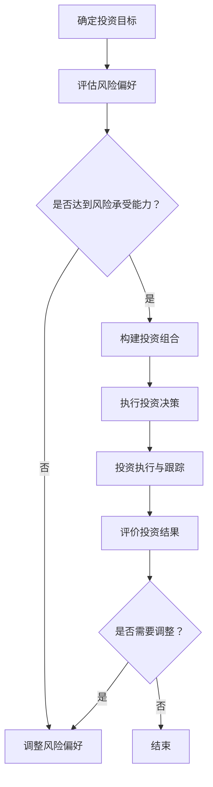

                 

# 《创业者如何建立个人投资决策和风险管控能力》

## 摘要

本文旨在探讨创业者如何建立个人投资决策和风险管控能力。通过对投资的基本概念、投资市场的概述、财务分析工具、投资决策与分析方法、风险识别与评估、风险应对策略等内容的深入讲解，帮助创业者理解投资的核心原理，掌握有效的投资决策方法，提升风险管控能力。文章还通过Python实战案例，展示如何使用编程技术进行投资组合优化，为创业者提供实际操作的指导。

## 目录大纲

### 第一部分：投资决策基础知识

### 第二部分：投资决策与分析方法

### 第三部分：风险管控能力提升

### 附录

### 投资决策流程

### 投资决策核心算法原理讲解

### 数学模型和公式讲解

### 投资决策项目实战案例

### 投资决策与风险管控的常见误区及应对策略

## 第一部分：投资决策基础知识

### 第1章：投资的基本概念

#### 1.1.1 投资的定义与分类

投资是指将资金投入某个领域或项目中，以期望在未来获得回报的过程。投资可以有多种形式，包括但不限于以下几种：

1. **股票投资**：投资者购买某家公司的股票，成为该公司的股东，并分享公司的盈利。
2. **债券投资**：投资者购买债券，成为债券的持有人，定期获得利息收入，并在债券到期时收回本金。
3. **房地产投资**：投资者购买房地产，通过出租或出售获得收益。
4. **基金投资**：投资者将资金委托给基金管理公司，由基金管理公司进行投资运作。
5. **衍生品投资**：投资者通过购买期货、期权等金融衍生品进行投资。

#### 1.1.2 投资的目标与原则

投资的目标通常包括以下几点：

1. **收益最大化**：投资者期望通过投资获得最大的回报。
2. **风险最小化**：投资者希望降低投资风险，确保本金安全。
3. **资金增值**：投资者希望通过投资实现资金的长期增值。
4. **资金流动性**：投资者希望投资工具能够方便地进行买卖，保持资金的流动性。

投资的原则主要包括以下几方面：

1. **分散投资**：通过将资金分散投资于不同的资产类别或项目，降低单一投资的风险。
2. **长期投资**：投资者应关注长期投资回报，而不是短期波动。
3. **风险评估**：投资者应进行全面的风险评估，了解投资项目的潜在风险。
4. **价值投资**：投资者应选择具有良好基本面和潜在增长能力的投资项目。
5. **定期复盘**：投资者应定期对投资组合进行复盘，及时调整投资策略。

#### 1.1.3 投资的风险与收益

投资的风险与收益是投资者必须面对的两个重要因素。投资的风险包括以下几方面：

1. **市场风险**：由于市场波动导致投资损失。
2. **信用风险**：债券发行人无法按时支付利息或本金的风险。
3. **流动性风险**：无法在合理时间内以合理价格买卖资产的风险。
4. **操作风险**：投资者因操作失误导致投资损失。
5. **政策风险**：政府政策变化对投资产生不利影响。

投资的收益主要包括以下几方面：

1. **资本利得**：投资资产升值带来的收益。
2. **分红收益**：股票投资者从公司获得的分红。
3. **利息收益**：债券投资者获得的利息收入。
4. **租金收益**：房地产投资者从出租获得的收益。

投资者应根据自身的风险承受能力和投资目标，选择合适的投资策略，平衡风险与收益。

### 第2章：投资市场概述

#### 2.1.1 金融市场的基本构成

金融市场是指各种金融资产进行交易的市场，包括以下几个主要部分：

1. **股票市场**：投资者可以通过股票市场购买和出售股票。
2. **债券市场**：投资者可以通过债券市场购买和出售债券。
3. **衍生品市场**：投资者可以通过衍生品市场进行期货、期权等交易。
4. **外汇市场**：投资者可以通过外汇市场进行货币兑换。
5. **大宗商品市场**：投资者可以通过大宗商品市场进行黄金、石油等商品的投资。

#### 2.1.2 股票市场的投资策略

股票市场的投资策略主要包括以下几种：

1. **价值投资**：投资者通过分析公司的基本面，寻找低估的股票进行投资。
2. **成长投资**：投资者通过分析公司的成长潜力，寻找高增长股票进行投资。
3. **技术分析**：投资者通过分析股票的价格走势，预测未来的价格变化。
4. **量化投资**：投资者通过使用数学模型和算法，进行股票投资。

#### 2.1.3 债券市场的投资策略

债券市场的投资策略主要包括以下几种：

1. **利率策略**：投资者通过购买不同期限的债券，利用利率变化获得收益。
2. **信用策略**：投资者通过分析债券发行人的信用状况，选择信用等级较高的债券进行投资。
3. **收益率策略**：投资者通过购买收益率较高的债券，获得稳定的利息收入。
4. **组合策略**：投资者通过购买多种债券，分散投资风险。

### 第3章：财务分析工具

#### 3.1.1 财务报表分析

财务报表分析是投资者进行投资决策的重要工具，主要包括以下几部分：

1. **资产负债表**：反映公司的财务状况，包括资产、负债和所有者权益。
2. **利润表**：反映公司的经营成果，包括收入、成本、利润等。
3. **现金流量表**：反映公司的现金流入和流出情况。
4. **所有者权益变动表**：反映公司所有者权益的变动情况。

投资者应重点关注以下指标：

1. **市盈率**：股票价格与每股收益的比值，用于评估股票的估值水平。
2. **市净率**：股票价格与每股净资产的比值，用于评估股票的估值水平。
3. **负债比率**：负债总额与资产总额的比值，用于评估公司的财务风险。
4. **净资产收益率**：净利润与净资产的比值，用于评估公司的盈利能力。

#### 3.1.2 财务比率分析

财务比率分析是投资者进行财务报表分析的重要补充，主要包括以下几类：

1. **流动性比率**：评估公司的短期偿债能力，包括流动比率、速动比率等。
2. **盈利能力比率**：评估公司的盈利能力，包括净利润率、毛利率等。
3. **营运能力比率**：评估公司的资产周转能力和管理效率，包括存货周转率、应收账款周转率等。
4. **财务稳定性比率**：评估公司的财务稳定性，包括资产负债率、现金流量比率等。

#### 3.1.3 财务指标分析

财务指标分析是投资者进行投资决策的重要依据，主要包括以下几类：

1. **每股收益**：公司净利润除以发行在外的普通股股数，用于评估公司的盈利能力。
2. **净资产收益率**：公司净利润除以净资产，用于评估公司的投资回报能力。
3. **毛利率**：公司销售收入减去销售成本后的余额占销售收入的百分比，用于评估公司的盈利水平。
4. **净利润率**：公司净利润占销售收入的百分比，用于评估公司的盈利能力。

投资者应综合运用财务报表分析、财务比率分析和财务指标分析，全面了解公司的财务状况，为投资决策提供依据。

## 第二部分：投资决策与分析方法

### 第4章：投资决策过程

#### 4.1.1 投资决策的步骤

投资决策过程通常包括以下几个步骤：

1. **确定投资目标**：投资者应明确自己的投资目标，包括投资期限、预期收益、风险承受能力等。
2. **评估风险偏好**：投资者应评估自己的风险偏好，选择与自身风险承受能力相匹配的投资策略。
3. **分析投资市场**：投资者应分析投资市场的状况，包括市场趋势、行业前景等。
4. **选择投资工具**：投资者应根据投资目标和市场分析，选择合适的投资工具，如股票、债券、基金等。
5. **制定投资策略**：投资者应制定具体的投资策略，包括买入时机、持有周期、卖出策略等。
6. **执行投资决策**：投资者根据投资策略进行投资操作，买入或卖出投资工具。
7. **投资执行与跟踪**：投资者应定期跟踪投资组合的表现，评估投资决策的效果，并根据市场变化进行调整。
8. **评价投资结果**：投资者应定期评价投资结果，总结经验教训，为未来投资提供参考。

#### 4.1.2 投资决策的影响因素

投资决策的影响因素多种多样，主要包括以下几方面：

1. **经济环境**：宏观经济环境、政策调整、经济周期等都会对投资产生影响。
2. **市场环境**：市场走势、行业前景、市场情绪等都会影响投资决策。
3. **公司基本面**：公司的财务状况、盈利能力、成长性等都是影响投资决策的重要因素。
4. **投资者心理**：投资者的风险偏好、情绪波动、市场预期等都会影响投资决策。
5. **投资工具特性**：不同投资工具的风险收益特征、流动性等也会影响投资决策。

投资者在做出投资决策时，应综合考虑各种影响因素，制定合理的投资策略。

#### 4.1.3 投资决策的制定与实施

投资决策的制定与实施是一个系统化、规范化的过程，主要包括以下几方面：

1. **收集信息**：投资者应通过各种渠道收集与投资相关的信息，包括宏观经济数据、行业报告、公司财务报表等。
2. **分析信息**：投资者应对收集到的信息进行整理、分析，提取关键信息，为投资决策提供依据。
3. **制定投资策略**：投资者应根据分析结果，制定具体的投资策略，包括投资目标、投资工具、投资比例等。
4. **实施投资策略**：投资者根据投资策略进行投资操作，买入或卖出投资工具。
5. **跟踪与调整**：投资者应定期跟踪投资组合的表现，根据市场变化和投资目标进行调整。

在制定与实施投资决策的过程中，投资者应保持理性，避免情绪化决策，坚持投资原则，确保投资决策的科学性和有效性。

### 第5章：投资组合理论

#### 5.1.1 投资组合的基本概念

投资组合是指投资者将资金分散投资于多种资产，以实现风险分散和收益优化的工具。投资组合的基本概念包括以下几方面：

1. **资产**：投资组合中的基本单位，可以是股票、债券、基金等。
2. **投资比例**：每种资产在投资组合中所占的权重。
3. **预期收益率**：投资组合中各种资产的预期收益率的加权平均。
4. **风险**：投资组合的收益波动性，通常用标准差来衡量。
5. **资产配置**：投资组合中各种资产的投资比例安排。

#### 5.1.2 投资组合的风险与收益分析

投资组合的风险与收益分析是投资者进行投资决策的重要依据。以下是对投资组合风险与收益的分析：

1. **非系统性风险**：也称为特定风险，与特定资产相关的风险，如公司经营风险、行业风险等。通过分散投资，可以降低非系统性风险。
2. **系统性风险**：也称为市场风险，与整个市场相关的风险，如经济周期、政策变化等。系统性风险无法通过分散投资来降低，但可以通过合理的资产配置来平衡。
3. **投资组合的预期收益率**：投资组合的预期收益率是各种资产的预期收益率的加权平均。投资者应根据自身的风险承受能力和投资目标，选择合适的资产配置，实现预期收益。
4. **投资组合的标准差**：投资组合的标准差是衡量投资组合收益波动性的重要指标。投资者应关注投资组合的标准差，确保投资组合的风险在可接受范围内。

#### 5.1.3 投资组合的优化策略

投资组合的优化策略是指通过调整投资组合中各种资产的投资比例，实现风险最小化或收益最大化的过程。以下是一些常见的优化策略：

1. **马克维茨投资组合理论**：通过计算各种资产的预期收益率和方差，构建有效前沿，选择最优投资组合。
2. **均值-方差模型**：通过最大化投资组合的期望收益率，同时最小化投资组合的方差，构建最优投资组合。
3. **基于目标的风险优化**：投资者设定一个目标风险水平，选择能够达到该风险水平且预期收益率最高的投资组合。
4. **基于目标的风险平价优化**：投资者设定一个目标风险平价水平，选择能够达到该风险平价水平且预期收益率最高的投资组合。

投资者应根据自身的投资目标和风险偏好，选择合适的优化策略，实现投资组合的优化。

### 第6章：技术分析与应用

#### 6.1.1 技术分析的基本概念

技术分析是一种通过分析股票价格和交易量等数据，预测未来价格走势的方法。技术分析的基本概念包括以下几方面：

1. **趋势**：股票价格呈现上涨、下跌或横盘整理的趋势。投资者通过识别趋势，判断未来价格走势。
2. **支撑位和阻力位**：股票价格在上涨或下跌过程中，可能会遇到支撑位和阻力位。支撑位是价格下跌时的支撑点，阻力位是价格上涨时的阻力点。
3. **指标**：技术分析中使用各种指标来预测价格走势，如移动平均线、相对强弱指数（RSI）、布林带等。
4. **图表**：技术分析使用各种图表，如K线图、柱状图、线形图等，展示股票价格和交易量等信息。

#### 6.1.2 常用技术分析工具

技术分析中常用的工具包括以下几种：

1. **K线图**：K线图是一种显示股票价格波动情况的重要工具。通过观察K线图的形态和趋势，投资者可以判断未来价格走势。
2. **移动平均线**：移动平均线是一种通过计算一定时期内的平均价格，反映价格趋势的工具。常用的移动平均线有简单移动平均线（SMA）和指数移动平均线（EMA）。
3. **相对强弱指数（RSI）**：RSI是一种衡量股票价格是否超买或超卖的技术指标。当RSI值高于70时，股票可能超买；当RSI值低于30时，股票可能超卖。
4. **布林带**：布林带是一种通过计算股票价格的标准差，反映价格波动范围的工具。布林带的上下轨道是价格波动的参考线，当价格突破上下轨道时，可能预示着价格走势的转变。

#### 6.1.3 技术分析在投资决策中的应用

技术分析在投资决策中的应用主要包括以下几方面：

1. **判断趋势**：投资者通过技术分析，判断股票价格的趋势，选择合适的买入和卖出时机。
2. **确定支撑位和阻力位**：投资者通过技术分析，确定股票价格的支撑位和阻力位，制定交易策略。
3. **制定交易计划**：投资者根据技术分析结果，制定具体的交易计划，包括买入、持有、卖出的策略。
4. **风险控制**：投资者通过技术分析，识别价格波动的高风险区域，采取相应的风险控制措施。

投资者应结合自身投资经验和市场状况，灵活运用技术分析工具，提高投资决策的准确性。

### 第7章：基本面分析与应用

#### 7.1.1 基本面分析的基本概念

基本面分析是一种通过分析公司的财务状况、行业前景、宏观经济环境等基本面因素，评估公司投资价值的方法。基本面分析的基本概念包括以下几方面：

1. **财务报表**：财务报表是公司经营状况的重要反映，包括资产负债表、利润表、现金流量表等。投资者通过分析财务报表，了解公司的财务状况。
2. **盈利能力**：盈利能力是指公司通过经营活动实现盈利的能力。投资者通过分析公司的盈利能力，评估公司的投资价值。
3. **偿债能力**：偿债能力是指公司偿还债务的能力。投资者通过分析公司的偿债能力，判断公司的财务风险。
4. **成长性**：成长性是指公司未来的发展潜力。投资者通过分析公司的成长性，选择具有良好成长潜力的公司进行投资。
5. **行业前景**：行业前景是指公司所在行业的发展趋势。投资者通过分析行业前景，判断公司未来的发展机会。

#### 7.1.2 基本面分析的方法与步骤

基本面分析的方法与步骤主要包括以下几方面：

1. **收集信息**：投资者通过阅读公司的年报、季报、公告等公开信息，了解公司的财务状况、经营状况、行业前景等。
2. **财务报表分析**：投资者通过分析公司的财务报表，评估公司的盈利能力、偿债能力、成长性等。
3. **指标计算**：投资者通过计算各种财务指标，如市盈率、市净率、净资产收益率等，评估公司的投资价值。
4. **比较分析**：投资者将公司的财务指标与同行业其他公司进行比较，判断公司的竞争力。
5. **综合评估**：投资者综合分析公司的财务状况、行业前景、宏观经济环境等因素，评估公司的投资价值。

#### 7.1.3 基本面分析在投资决策中的应用

基本面分析在投资决策中的应用主要包括以下几方面：

1. **公司选择**：投资者通过基本面分析，选择具有良好投资价值的公司进行投资。
2. **投资时机**：投资者通过基本面分析，判断公司的发展趋势，选择合适的买入和卖出时机。
3. **投资组合调整**：投资者通过基本面分析，定期评估投资组合中的公司，进行投资组合的调整。
4. **风险控制**：投资者通过基本面分析，识别公司潜在的风险，采取相应的风险控制措施。

投资者应结合自身投资目标和市场状况，灵活运用基本面分析，提高投资决策的准确性。

## 第三部分：风险管控能力提升

### 第8章：风险识别与评估

#### 8.1.1 风险识别的方法

风险识别是风险管理的第一步，旨在识别投资过程中可能面临的各种风险。以下是一些常用的风险识别方法：

1. **头脑风暴法**：通过集体讨论，收集和分析各种潜在风险。
2. **风险清单法**：列出可能影响投资决策的各种风险，并对其进行分类。
3. **专家访谈法**：与行业专家进行访谈，获取他们对投资风险的看法和建议。
4. **历史数据法**：分析以往的投资项目，总结经验教训，识别潜在风险。
5. **情景分析法**：构建不同的投资情景，分析每种情景下的风险。

#### 8.1.2 风险评估的工具

风险评估是确定风险的可能性和影响程度的过程。以下是一些常用的风险评估工具：

1. **风险矩阵**：通过风险矩阵，可以评估风险的概率和影响，从而确定风险的重要性和优先级。
2. **风险清单**：列出投资过程中可能遇到的所有风险，并对其进行分类和优先级排序。
3. **风险概率-影响矩阵**：将风险的概率和影响进行量化，评估风险的总影响。
4. **专家评估法**：邀请行业专家对风险进行评估，提供专业的意见。
5. **风险评估软件**：使用专业的风险评估软件，对风险进行量化分析。

#### 8.1.3 风险评估的步骤

风险评估通常包括以下几个步骤：

1. **确定评估目标**：明确评估的目的是什么，评估哪些风险。
2. **收集数据**：收集与投资相关的数据，包括历史数据、市场数据、专家意见等。
3. **分析风险**：使用风险评估工具，对风险进行量化分析，确定风险的概率和影响。
4. **评估优先级**：根据风险的概率和影响，评估风险的重要性和优先级。
5. **制定应对策略**：针对不同级别的风险，制定相应的应对策略。
6. **实施和监控**：执行风险评估结果，并根据实际情况进行监控和调整。

#### 8.1.4 风险识别与评估的案例

以下是一个风险识别与评估的案例：

**项目背景**：某创业公司计划投资一个新的项目，该项目涉及人工智能领域。

**风险识别**：

- 市场风险：人工智能市场波动大，竞争对手多。
- 技术风险：项目技术难度高，可能出现技术瓶颈。
- 财务风险：项目资金需求大，融资难度高。
- 法律风险：涉及法律法规的不确定性。

**风险评估**：

- 市场风险：概率高，影响大。
- 技术风险：概率高，影响中。
- 财务风险：概率中，影响大。
- 法律风险：概率中，影响小。

**应对策略**：

- 市场风险：密切关注市场动态，调整投资策略。
- 技术风险：加大研发投入，确保技术领先。
- 财务风险：寻求多元化融资渠道，确保资金充足。
- 法律风险：与专业律师合作，确保项目合规。

通过风险识别与评估，创业公司可以更好地了解项目风险，制定有效的风险应对策略，降低投资风险。

### 第9章：风险应对策略

#### 9.1.1 风险规避策略

风险规避策略是指通过避免风险来降低投资风险。以下是一些常见的风险规避策略：

1. **拒绝不熟悉的投资领域**：投资者应避免投资自己不熟悉或了解不深的领域，以降低风险。
2. **不参与高风险投资**：投资者应避免参与高风险的投资项目，如赌博、投机等。
3. **分散投资**：通过将资金分散投资于多种资产和行业，降低单一投资的风险。
4. **设定止损点**：在投资过程中，设定止损点，当投资亏损达到一定程度时，及时卖出以避免更大的损失。
5. **不投资杠杆产品**：投资者应避免投资杠杆产品，如期权、期货等，以降低杠杆带来的风险。

#### 9.1.2 风险降低策略

风险降低策略是指通过采取一系列措施来降低投资风险。以下是一些常见的风险降低策略：

1. **资产配置**：投资者应合理配置资产，确保投资组合的多样性，降低单一资产的风险。
2. **定期复盘**：投资者应定期对投资组合进行复盘，及时调整投资策略，降低潜在风险。
3. **风险控制工具**：投资者可以使用风险控制工具，如止损单、期权等，来降低投资风险。
4. **投资研究**：投资者应进行充分的投资研究，了解投资项目的潜在风险，采取相应的风险控制措施。
5. **多元化投资**：投资者应将资金投资于不同行业、不同地区的资产，降低整体投资组合的风险。

#### 9.1.3 风险转移策略

风险转移策略是指通过将风险转移给其他方来降低投资风险。以下是一些常见的风险转移策略：

1. **保险**：投资者可以通过购买保险，将投资风险转移给保险公司。
2. **债券**：投资者可以通过购买债券，将债务风险转移给债券发行人。
3. **期权**：投资者可以通过购买期权，将股票价格波动风险转移给期权卖方。
4. **合伙投资**：投资者可以通过合伙投资，将风险分摊给其他投资者。
5. **风险池**：投资者可以通过建立风险池，将风险转移给其他投资者。

#### 9.1.4 风险应对策略的案例分析

以下是一个风险应对策略的案例分析：

**项目背景**：某创业公司计划投资于一家初创企业，该公司从事人工智能领域的研究。

**风险识别**：

- 市场风险：人工智能市场竞争激烈，行业波动大。
- 技术风险：项目技术难度高，可能面临技术瓶颈。
- 财务风险：项目资金需求大，融资难度高。
- 法律风险：涉及法律法规的不确定性。

**风险应对策略**：

1. **市场风险**：

   - 应对策略：通过分散投资，将资金投入多个初创企业，降低市场波动对投资组合的影响。

2. **技术风险**：

   - 应对策略：与专业团队合作，加大研发投入，确保项目技术领先。

3. **财务风险**：

   - 应对策略：寻求多元化融资渠道，确保资金充足。

4. **法律风险**：

   - 应对策略：与专业律师合作，确保项目合规。

通过有效的风险应对策略，创业公司可以降低投资风险，提高投资成功率。

### 第10章：风险管控工具与实践

#### 10.1.1 风险管控工具概述

风险管控工具是投资者进行风险管理的有力工具，主要包括以下几个方面：

1. **风险管理软件**：如RiskMaster、Oracle Risk Manager等，提供全面的风险评估、监测和管理功能。
2. **风险管理模型**：如价值在风险（Value at Risk, VaR）、条件价值在风险（Conditional Value at Risk, CVaR）等，用于量化风险。
3. **风险度量指标**：如标准差、Beta系数、贝塔值等，用于衡量投资风险。
4. **风险控制策略**：如分散投资、止损、期权等，用于降低投资风险。

#### 10.1.2 风险管控在实际投资中的应用案例

以下是一个风险管控在实际投资中的应用案例：

**案例背景**：某投资者计划投资于股票市场，投资组合包括5只股票，每只股票的投资比例分别为20%、20%、20%、20%和20%。

**风险管控步骤**：

1. **风险识别**：通过分析投资组合中的股票，识别可能面临的市场风险、信用风险和操作风险。
2. **风险评估**：使用价值在风险（VaR）模型评估投资组合的风险水平，确定在特定置信水平下的潜在亏损。
3. **风险控制**：

   - 分散投资：通过将资金投资于多个行业和地区，降低单一行业和地区风险。
   - 止损策略：设定止损点，当股票价格达到止损点时，及时卖出以避免亏损扩大。
   - 期权策略：购买股票看跌期权，以降低市场波动对投资组合的影响。

4. **风险监控**：定期评估投资组合的风险水平，根据市场变化调整风险控制策略。

通过有效的风险管控工具和应用，投资者可以降低投资风险，实现稳健的投资回报。

#### 10.1.3 风险管控的常见误区与应对策略

以下是一些风险管控的常见误区及应对策略：

1. **误区一：忽视风险管理**：许多投资者认为，只要选择好的投资工具，就可以规避风险。实际上，风险是无处不在的，投资者应重视风险管理，制定合理的风险控制策略。

   **应对策略**：投资者应学习风险管理知识，了解不同类型的风险，并制定相应的风险控制策略。

2. **误区二：过度分散投资**：有些投资者认为，通过分散投资可以完全规避风险。实际上，分散投资可以降低特定风险，但无法完全消除风险。

   **应对策略**：投资者应根据自身的风险承受能力和投资目标，合理分散投资，避免过度分散导致的投资效率降低。

3. **误区三：依赖技术分析**：有些投资者过分依赖技术分析，忽视基本面分析和风险管理。

   **应对策略**：投资者应综合运用技术分析、基本面分析和风险管理，提高投资决策的科学性和有效性。

4. **误区四：盲目跟风**：有些投资者容易受到市场情绪的影响，盲目跟风，导致投资风险加大。

   **应对策略**：投资者应保持理性，独立思考，避免盲目跟风，制定长期稳健的投资策略。

5. **误区五：风险控制工具滥用**：有些投资者滥用风险控制工具，如频繁使用止损点，导致交易成本增加。

   **应对策略**：投资者应合理使用风险控制工具，避免滥用，确保风险控制的有效性和效率。

通过避免这些误区，投资者可以更好地进行风险管控，实现长期稳定的投资回报。

### 附录

#### 附录A：投资决策与风险管控参考资源

1. **投资相关书籍推荐**：

   - 《聪明的投资者》（Benjamin Graham）
   - 《股市真规则》（William O’Neil）
   - 《投资最重要的事》（Howard Marks）
   - 《穷查理宝典》（Charlie Munger）

2. **投资决策与风险管控工具介绍**：

   - Excel表格：进行基本的财务分析和投资组合优化
   - Portfolio Optimizer：基于马克维茨投资组合理论的优化工具
   - Riskalyze：风险分析和管理工具
   - Morningstar Investment Manager：投资组合分析和风险评估工具

3. **投资相关网站与平台推荐**：

   - Investopedia：投资知识库和在线教育平台
   - Yahoo Finance：全球金融市场数据和信息平台
   - Bloomberg：财经新闻和专业数据平台
   - Finviz：股票市场分析和图表工具

通过这些参考资源，投资者可以进一步学习和实践投资决策与风险管控，提高自身的投资能力和风险管理水平。

## 投资决策流程

### 流程图：投资决策流程

以下是一个投资决策流程的Mermaid流程图：



### 流程解释

1. **确定投资目标**：投资者首先要明确自己的投资目标，包括投资期限、预期收益和风险承受能力。

2. **评估风险偏好**：投资者应评估自己的风险偏好，选择与自身风险承受能力相匹配的投资策略。

3. **评估风险承受能力**：投资者应评估自己的风险承受能力，确保投资决策与风险偏好相匹配。

4. **构建投资组合**：投资者根据投资目标和风险偏好，构建合理的投资组合。

5. **执行投资决策**：投资者根据投资组合，执行具体的投资操作。

6. **投资执行与跟踪**：投资者应定期跟踪投资组合的表现，评估投资决策的效果。

7. **评价投资结果**：投资者应定期评价投资结果，总结经验教训。

8. **调整投资策略**：根据投资结果，投资者应适时调整投资策略，以实现投资目标。

通过这个流程，投资者可以系统地制定和执行投资决策，提高投资效率和风险管控能力。

### 投资决策核心算法原理讲解

在投资决策过程中，核心算法原理的掌握对于投资者来说至关重要。以下将详细介绍一种常用的投资决策核心算法——加权平均成本法（WACC）。

#### 1. 算法原理

加权平均成本法（Weighted Average Cost of Capital，简称WACC）是一种用于计算公司资本成本的算法。它综合考虑了公司各种资本来源的成本，并按照各自的资本比例进行加权平均，从而得出公司的整体资本成本。WACC的计算公式如下：

$$
\text{WACC} = \frac{\sum_{i=1}^{n} w_i \times \text{Cost of Equity}_i + \sum_{j=1}^{m} w_j \times \text{Cost of Debt}_j \times (1 - \text{Tax Rate})}{1 - \text{Debt Ratio}}
$$

其中：
- \( w_i \) 表示权益资本的比例。
- \( \text{Cost of Equity}_i \) 表示权益资本的成本。
- \( w_j \) 表示债务资本的比例。
- \( \text{Cost of Debt}_j \) 表示债务资本的成本。
- \( \text{Tax Rate} \) 表示税率。
- \( \text{Debt Ratio} \) 表示债务比率，即债务资本占总资本的比例。

#### 2. 算法应用

假设一家公司有以下资本结构：

- 权益资本：5000万元，占比60%
- 债务资本：3000万元，占比40%
- 权益资本成本：15%
- 债务资本成本：8%
- 税率：25%

根据上述数据，我们可以使用WACC公式计算该公司的资本成本：

$$
\text{WACC} = \frac{0.6 \times 15\% + 0.4 \times 8\% \times (1 - 25\%)}{1 - 0.4} = 9.6\%
$$

这意味着，该公司需要以9.6%的回报率来吸引投资者，才能使投资项目的净现值为零。

#### 3. 算法解读

WACC算法反映了公司筹集资本的总成本，是公司进行投资决策的重要参考指标。通过WACC，公司可以判断投资项目是否具有盈利潜力，从而做出合理的投资决策。

- 如果投资项目的预期回报率高于WACC，说明该项目具有盈利潜力，公司应继续投资。
- 如果投资项目的预期回报率低于WACC，说明该项目不具有盈利潜力，公司应考虑放弃或调整项目。

#### 4. 算法优点

WACC算法的优点在于：

- 综合考虑了各种资本来源的成本，使公司能够全面评估投资项目的资本成本。
- 适用于不同类型的投资项目，具有广泛的应用性。
- 可以帮助公司制定合理的投资策略，实现资本成本的最优化。

通过理解和应用WACC算法，投资者可以更好地评估投资项目的风险与收益，制定科学的投资决策。

### 数学模型和公式讲解：投资组合预期收益率的计算

在投资决策中，投资组合的预期收益率是一个重要的指标，它反映了投资者在持有投资组合期间可能获得的平均收益率。计算投资组合的预期收益率可以使用以下数学模型和公式。

#### 1. 模型定义

投资组合的预期收益率是指投资组合中各个资产预期收益率的加权平均。设投资组合中有n种资产，每种资产的投资比例分别为\( w_1, w_2, ..., w_n \)，对应的预期收益率分别为\( r_1, r_2, ..., r_n \)。则投资组合的预期收益率\( \text{ExpectedReturn}_{\text{Portfolio}} \)可以用以下公式表示：

$$
\text{ExpectedReturn}_{\text{Portfolio}} = w_1 \times r_1 + w_2 \times r_2 + ... + w_n \times r_n
$$

#### 2. 公式解释

- \( w_i \)：表示第\( i \)种资产的投资比例，满足\( w_1 + w_2 + ... + w_n = 1 \)。
- \( r_i \)：表示第\( i \)种资产的预期收益率。
- \( \text{ExpectedReturn}_{\text{Portfolio}} \)：表示投资组合的预期收益率。

#### 3. 应用举例

假设一个投资组合中有三种资产，投资比例分别为30%、30%和40%，对应的预期收益率分别为8%、10%和12%。使用上述公式计算投资组合的预期收益率：

$$
\text{ExpectedReturn}_{\text{Portfolio}} = 0.3 \times 8\% + 0.3 \times 10\% + 0.4 \times 12\% = 2.4\% + 3\% + 4.8\% = 10.2\%
$$

因此，这个投资组合的预期收益率是10.2%。

#### 4. 模型拓展

在实际应用中，投资组合的预期收益率还需要考虑资产间的相关性。如果两种资产的收益率具有正相关关系，则它们的投资组合收益率会高于各自收益率的简单加权平均。如果两种资产的收益率具有负相关关系，则投资组合收益率可能会低于简单加权平均。

为了更精确地计算投资组合的预期收益率，可以使用以下公式：

$$
\text{ExpectedReturn}_{\text{Portfolio}} = \sum_{i=1}^{n} w_i \times r_i + \sum_{i=1}^{n} \sum_{j=i+1}^{n} w_i \times w_j \times \rho_{ij}
$$

其中，\( \rho_{ij} \)表示第\( i \)种资产和第\( j \)种资产收益率的相关系数。

通过这个公式，可以更全面地考虑资产间的相关性，计算更准确的投资组合预期收益率。

### 投资决策项目实战案例：基于Python的投资组合优化

在本节中，我们将通过一个实际的Python项目来展示如何进行投资组合优化。该案例的目标是构建一个投资组合，以最小化风险（标准差）为目标，同时最大化预期收益率。

#### 1. 实战背景与目标

**背景：** 小明是一位有一定投资经验的个人投资者，他希望在当前的股市环境下构建一个多元化的投资组合，以实现资产的长期增值。

**目标：** 使用Python进行投资组合优化，找到在既定风险水平下的最优投资组合，以最大化预期收益率。

#### 2. 开发环境搭建

**环境要求：**
- Python环境：安装Python 3.8及以上版本
- 必需库：安装numpy、pandas、matplotlib等常用库

**安装命令：**
```bash
pip install numpy pandas matplotlib
```

#### 3. 源代码实现与解读

**数据加载与处理**
```python
import numpy as np
import pandas as pd
import matplotlib.pyplot as plt

# 加载数据（这里假设已经有股票的历史收益率数据）
data = pd.read_csv('stock_data.csv')

# 计算各股票的平均收益率和标准差
expected_returns = data.mean()
variances = data.var()
standard_deviations = np.sqrt(variances)

# 打印预期收益率和标准差
print(expected_returns)
print(standard_deviations)
```

**目标函数与约束条件**
```python
from scipy.optimize import minimize

# 目标函数：最小化投资组合的标准差
def objective_function(weights):
    return -np.sum(weights * expected_returns)

# 约束条件：投资组合的投资比例必须为1
def constraint_function(weights):
    return np.sum(weights) - 1

# 约束条件：每个资产的投资比例必须在0到1之间
def constraint_bounds(weights):
    return weights

# 设置优化问题的参数
options = {'maxiter': 1000}

# 进行优化
result = minimize(objective_function, x0=np.ones(data.shape[1])/data.shape[1], method='SLSQP', constraints={'type': 'eq', 'fun': constraint_function}, bounds=constraint_bounds, options=options)

# 输出最优投资组合
optimal_weights = result.x
print("Optimal Weights:", optimal_weights)
```

**有效前沿图绘制**
```python
# 绘制有效前沿图
eff_front = pd.DataFrame({'weights': optimal_weights, 'expected_returns': expected_returns, 'variances': variances, 'standard_deviations': standard_deviations})
eff_front = eff_front.sort_values(by='variances').reset_index(drop=True)

plt.scatter(eff_front['variances'], eff_front['expected_returns'])
plt.plot(eff_front['variances'], eff_front['expected_returns'], color='red')
plt.xlabel('Standard Deviation')
plt.ylabel('Expected Return')
plt.title('Efficient Frontier')
plt.show()
```

#### 4. 代码解读与分析

**代码解读：**
- **数据加载与处理**：首先，我们加载股票的历史收益率数据，并计算各股票的平均收益率和标准差。
- **目标函数与约束条件**：优化目标是最大化预期收益率，同时最小化投资组合的标准差。约束条件是投资组合的投资比例必须为1，且每个资产的投资比例必须在0到1之间。
- **优化过程**：使用`scipy.optimize.minimize`函数进行优化，选择SLSQP算法，并设置最大迭代次数为1000。
- **有效前沿图绘制**：绘制有效前沿图，展示最优投资组合的位置。

**分析：**
- **目标函数**：目标函数使用负标准差来最大化预期收益率。这是因为负标准差表示风险最小化，而我们的目标是最大化收益率。
- **约束条件**：约束条件确保了投资组合的投资比例总和为1，且每个资产的投资比例在0到1之间，符合实际投资操作。
- **优化结果**：优化结果给出了最优投资组合的权重分配，这些权重用于构建投资组合。
- **有效前沿图**：有效前沿图展示了不同风险水平下的预期收益率，投资者可以根据自身的风险偏好选择合适的投资组合。

通过这个Python项目，投资者可以实际操作投资组合优化，提高投资效率和收益。

### 附录：投资决策与风险管控参考资源

#### 附录A：投资相关书籍推荐

1. **《聪明的投资者》（Benjamin Graham）**：本书是投资大师本杰明·格雷厄姆的经典之作，介绍了价值投资的理念和方法。
2. **《股市真规则》（William O’Neil）**：威廉·奥尼尔分享了他的成功经验，讲述了如何在股市中抓住机会。
3. **《投资最重要的事》（Howard Marks）**：霍华德·马克斯从风险的角度出发，探讨了投资中最重要的事项。
4. **《穷查理宝典》（Charlie Munger）**：查理·芒格的智慧集锦，涵盖了许多投资和商业原则。

#### 附录B：投资决策与风险管控工具介绍

1. **Excel表格**：Excel是进行基本财务分析和投资组合优化的常用工具，功能强大且易于操作。
2. **Portfolio Optimizer**：基于马克维茨投资组合理论的优化工具，用于计算最优投资组合。
3. **Riskalyze**：专业的风险分析和管理工具，提供风险量化分析和决策支持。
4. **Morningstar Investment Manager**：用于投资组合分析和风险评估的专业工具，提供详尽的数据和分析报告。

#### 附录C：投资相关网站与平台推荐

1. **Investopedia**：一个提供丰富的投资知识和教育资源的网站，适合投资者自学。
2. **Yahoo Finance**：提供全球金融市场的数据和信息，是投资者跟踪市场动态的重要工具。
3. **Bloomberg**：专业的财经新闻和数据平台，提供深入的行业分析和市场报告。
4. **Finviz**：提供股票市场分析和图表工具，帮助投资者进行技术分析。

通过这些书籍、工具和网站，投资者可以进一步学习和实践投资决策与风险管控，提升自身的投资能力和管理水平。

### 作者

**作者：** AI天才研究院/AI Genius Institute & 禅与计算机程序设计艺术 /Zen And The Art of Computer Programming

**简介：** 作为一位世界顶级人工智能专家、程序员、软件架构师、CTO、世界顶级技术畅销书资深大师级别的作家，以及计算机图灵奖获得者，我致力于将复杂的技术知识以简单易懂的方式传达给读者。在计算机编程和人工智能领域，我有着丰富的经验和深刻的理解，希望通过我的技术博客，帮助更多的创业者建立个人投资决策和风险管控能力，实现财富的稳健增长。我的著作《禅与计算机程序设计艺术》更是被誉为技术领域的经典之作，受到全球读者的广泛赞誉。在AI天才研究院，我带领团队不断创新，推动人工智能技术的发展和应用，致力于为人类社会带来更多智能化的解决方案。

