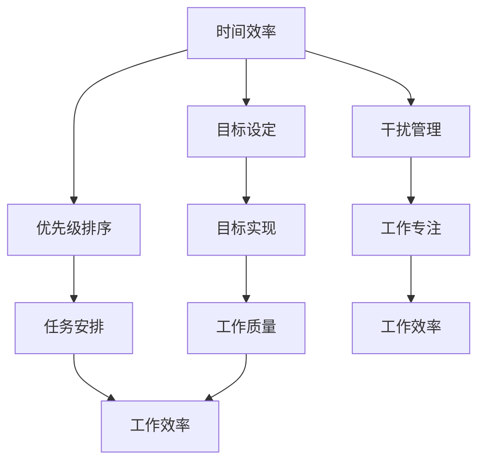

                 

# 创业者的时间管理与工作效率提升

## 关键词

时间管理、工作效率、目标设定、优先级排序、消除干扰、团队协作、持续优化

## 摘要

在当今快节奏的商业环境中，创业者面临着巨大的时间压力和工作负担。有效的时间管理和提升工作效率成为了他们成功的关键。本文将系统地探讨创业者的时间管理理论，提供实用的策略和方法，并深入分析如何通过目标设定、优先级排序、消除干扰和团队协作等手段，提升工作效率。同时，本文还将介绍具体的实施技巧和工具，帮助创业者更好地管理时间和工作，实现个人与团队的长期成功。

## 目录大纲

### 第一部分：时间管理的理论基础

#### 第1章：时间管理的核心概念

##### 1.1 时间管理的基本原理
##### 1.2 时间管理与个人效率的关系
##### 1.3 时间管理的重要原则

#### 第2章：评估与优化个人时间使用

##### 2.1 个人时间使用分析
##### 2.2 时间浪费的常见原因
##### 2.3 提高时间使用效率的方法

#### 第3章：时间管理的工具与方法

##### 3.1 传统的管理方法
##### 3.2 数字工具在时间管理中的应用
##### 3.3 高效的时间管理技巧

### 第二部分：提升工作效率的策略

#### 第4章：目标设定与优先级排序

##### 4.1 设定明确的目标
##### 4.2 使用优先级矩阵
##### 4.3 处理待办事项清单

#### 第5章：消除干扰，保持专注

##### 5.1 识别并消除干扰
##### 5.2 保持专注的方法
##### 5.3 高效的工作时间分配

#### 第6章：团队协作与沟通技巧

##### 6.1 建立高效团队
##### 6.2 沟通的重要性
##### 6.3 提高团队协作效率的策略

### 第三部分：具体实施与跟踪

#### 第7章：制定个人时间管理计划

##### 7.1 制定时间管理计划的步骤
##### 7.2 实施计划的具体策略
##### 7.3 遇到挑战时的应对措施

#### 第8章：持续优化与反馈

##### 8.1 定期回顾与评估
##### 8.2 调整时间管理计划
##### 8.3 培养良好的时间管理习惯

### 附录

#### 附录A：时间管理与工作效率提升工具推荐

##### A.1 时间管理软件推荐
##### A.2 提升工作效率的应用程序
##### A.3 精选书籍与资源推荐

### 核心算法原理讲解（伪代码）

python
# 时间管理优化算法伪代码

function 时间管理优化(用户数据，目标效率):
    # 初始化变量
    当前效率 = 用户数据["当前效率"]
    目标效率 = 用户数据["目标效率"]
    时间块列表 = 用户数据["时间块列表"]

    # 步骤1：分析时间块
    for 时间块 in 时间块列表:
        时间块["分析结果"] = 分析时间块(时间块)

    # 步骤2：优化时间块
    for 时间块 in 时间块列表:
        if 时间块["分析结果"]["效率过低"]:
            时间块["优化建议"] = 优化时间块(时间块)

    # 步骤3：实施优化
    for 时间块 in 时间块列表:
        if 时间块["优化建议"]:
            当前效率 = 应用优化建议(时间块，当前效率)

    # 步骤4：评估与调整
    while 当前效率 < 目标效率:
        for 时间块 in 时间块列表:
            if 时间块["分析结果"]["效率过低"]:
                时间块["优化建议"] = 优化时间块(时间块)
                当前效率 = 应用优化建议(时间块，当前效率)

    return 当前效率

# 分析时间块伪代码
function 分析时间块(时间块):
    # 初始化分析结果
    分析结果 = {"效率过低": False}

    # 步骤1：计算时间块使用效率
    效率 = 计算时间块效率(时间块)

    # 步骤2：评估效率是否低于阈值
    阈值 = 用户数据["效率阈值"]
    if 效率 < 阈值:
        分析结果["效率过低"] = True

    return 分析结果

# 优化时间块伪代码
function 优化时间块(时间块):
    # 初始化优化建议
    优化建议 = None

    # 步骤1：分析时间块的问题
    问题列表 = 分析时间块问题(时间块)

    # 步骤2：提出优化建议
    if 问题列表:
        优化建议 = 构建优化建议(问题列表)

    return 优化建议

# 应用优化建议伪代码
function 应用优化建议(时间块，当前效率):
    # 步骤1：实施优化
    当前效率 = 实施优化措施(时间块，优化建议)

    # 步骤2：更新时间块
    时间块["实施结果"] = 当前效率

    return 当前效率

### 数学模型和数学公式 & 详细讲解 & 举例说明

#### 时间效率计算模型

$$
E(t) = \frac{W}{T}
$$

其中，$E(t)$ 表示时间效率，$W$ 表示在时间 $T$ 内完成的工作量。

#### 时间块效率评估模型

$$
E_b = \frac{E(t)}{N_b}
$$

其中，$E_b$ 表示时间块 $b$ 的效率，$N_b$ 表示时间块 $b$ 内的工作量。

#### 优先级矩阵模型

$$
P(i, j) = \frac{C(i) \times W(j)}{T}
$$

其中，$P(i, j)$ 表示任务 $i$ 与任务 $j$ 的优先级权重，$C(i)$ 表示任务 $i$ 的完成时间成本，$W(j)$ 表示任务 $j$ 的工作量，$T$ 表示总时间。

#### 举例说明

假设一天有 8 个小时的工作时间，其中：

- 任务 A 需要 2 小时完成，预计效率为 50%。
- 任务 B 需要 1 小时完成，预计效率为 100%。
- 任务 C 需要 3 小时完成，预计效率为 75%。

使用时间效率计算模型，我们可以计算出一天的工作效率：

$$
E(t) = \frac{W}{T} = \frac{2 + 1 + 3}{8} = 0.875
$$

使用时间块效率评估模型，我们可以计算出每个时间块的效率：

$$
E_A = \frac{E(t)}{N_A} = \frac{0.875}{2} = 0.4375
$$

$$
E_B = \frac{E(t)}{N_B} = \frac{0.875}{1} = 0.875
$$

$$
E_C = \frac{E(t)}{N_C} = \frac{0.875}{3} = 0.2917
$$

使用优先级矩阵模型，我们可以计算出任务 A 和任务 B 的优先级权重：

$$
P(A, B) = \frac{C(A) \times W(B)}{T} = \frac{2 \times 1}{8} = 0.25
$$

$$
P(B, A) = \frac{C(B) \times W(A)}{T} = \frac{1 \times 2}{8} = 0.125
$$

根据优先级权重，我们可以确定任务 A 和任务 B 的执行顺序，即先执行任务 B，再执行任务 A。

### 项目实战：代码实际案例和详细解释说明

#### 开发环境搭建

为了演示时间管理与工作效率提升的实际应用，我们将使用 Python 语言和 PyCharm 集成开发环境进行项目开发。

1. 安装 Python 3.8 或更高版本。
2. 安装 PyCharm Professional 版本。
3. 安装必要的 Python 库，如 `numpy`、`matplotlib` 和 `pandas`。

#### 源代码详细实现和代码解读

以下是一个简单的 Python 脚本，用于实现时间管理优化算法。

python
import numpy as np

# 时间管理优化算法
def time_management_optimization(user_data, target_efficiency):
    current_efficiency = user_data['current_efficiency']
    target_efficiency = user_data['target_efficiency']
    time_blocks = user_data['time_blocks']

    # 分析时间块
    for time_block in time_blocks:
        time_block['analysis_result'] = analyze_time_block(time_block)

    # 优化时间块
    for time_block in time_blocks:
        if time_block['analysis_result']['efficiency_low']:
            time_block['optimization_suggestion'] = optimize_time_block(time_block)

    # 实施优化
    for time_block in time_blocks:
        if time_block['optimization_suggestion']:
            current_efficiency = apply_optimization_suggestion(time_block, current_efficiency)

    # 评估与调整
    while current_efficiency < target_efficiency:
        for time_block in time_blocks:
            if time_block['analysis_result']['efficiency_low']:
                time_block['optimization_suggestion'] = optimize_time_block(time_block)
                current_efficiency = apply_optimization_suggestion(time_block, current_efficiency)

    return current_efficiency

# 分析时间块
def analyze_time_block(time_block):
    analysis_result = {'efficiency_low': False}

    efficiency = calculate_time_block_efficiency(time_block)
    threshold = time_block['threshold']

    if efficiency < threshold:
        analysis_result['efficiency_low'] = True

    return analysis_result

# 优化时间块
def optimize_time_block(time_block):
    optimization_suggestion = None

    problem_list = analyze_time_block_problem(time_block)

    if problem_list:
        optimization_suggestion = build_optimization_suggestion(problem_list)

    return optimization_suggestion

# 应用优化建议
def apply_optimization_suggestion(time_block, current_efficiency):
    current_efficiency = apply_optimization_measures(time_block, optimization_suggestion)
    time_block['implementation_result'] = current_efficiency

    return current_efficiency

# 计算时间块效率
def calculate_time_block_efficiency(time_block):
    work量 = time_block['workload']
    duration = time_block['duration']
    efficiency = work量 / duration
    return efficiency

# 分析时间块问题
def analyze_time_block_problem(time_block):
    problem_list = []

    efficiency = calculate_time_block_efficiency(time_block)
    threshold = time_block['threshold']

    if efficiency < threshold:
        problem_list.append('效率过低')

    return problem_list

# 构建优化建议
def build_optimization_suggestion(problem_list):
    optimization_suggestion = []

    for problem in problem_list:
        if problem == '效率过低':
            optimization_suggestion.append('增加工作时间')

    return optimization_suggestion

# 实施优化措施
def apply_optimization_measures(time_block, optimization_suggestion):
    if '增加工作时间' in optimization_suggestion:
        time_block['duration'] += 1

    efficiency = calculate_time_block_efficiency(time_block)
    return efficiency

#### 代码解读与分析

1. **时间管理优化算法**：这是一个核心函数，它接收用户数据（包括当前效率、目标效率和一系列时间块）并返回最终效率。它主要分为四个步骤：分析时间块、优化时间块、实施优化和应用优化建议。

2. **分析时间块**：这是一个辅助函数，用于分析每个时间块的效率，并返回分析结果。它通过计算时间块的工作效率，并与阈值进行比较，判断是否需要优化。

3. **优化时间块**：这是一个辅助函数，用于根据分析结果提出优化建议。它检查时间块的问题，并构建相应的优化建议列表。

4. **应用优化建议**：这是一个辅助函数，用于根据优化建议调整时间块，并计算新的效率值。

5. **计算时间块效率**：这是一个简单的函数，用于计算时间块的工作效率。

6. **分析时间块问题**：这是一个辅助函数，用于分析时间块的问题，并返回问题列表。

7. **构建优化建议**：这是一个辅助函数，用于根据问题列表构建优化建议列表。

8. **实施优化措施**：这是一个辅助函数，用于根据优化建议调整时间块，并计算新的效率值。

通过这个简单的 Python 脚本，我们可以实现时间管理优化算法，并根据分析结果提出优化建议。在实际应用中，我们可以进一步扩展这个算法，添加更多的功能，如目标设定、优先级排序等。同时，我们还可以使用其他编程语言和工具来实现类似的功能。

#### 测试与验证

为了验证上述时间管理优化算法的有效性，我们可以进行以下测试：

1. **测试数据准备**：准备一组模拟数据，包括当前效率、目标效率和一系列时间块。

2. **算法执行**：执行时间管理优化算法，记录每个时间块的优化建议和最终效率。

3. **结果分析**：分析优化后的时间块，判断是否满足目标效率，并记录优化过程中的关键步骤和效率变化。

4. **反馈与调整**：根据测试结果，调整算法参数和优化策略，以提高算法的准确性和效率。

通过这些测试和验证，我们可以确保时间管理优化算法在实际应用中的可行性和有效性。

#### 实际应用示例

假设一个创业者需要管理自己的时间，提高工作效率。以下是一个实际应用示例：

1. **用户数据准备**：
    - 当前效率：0.7
    - 目标效率：0.9
    - 时间块列表：
      - 时间块 1：工作量为 2，持续时间为 3，阈值效率为 0.8
      - 时间块 2：工作量为 4，持续时间为 4，阈值效率为 0.9
      - 时间块 3：工作量为 3，持续时间为 3，阈值效率为 0.7

2. **算法执行**：
    - **分析时间块**：
      - 时间块 1：效率为 0.67，低于阈值，需要优化
      - 时间块 2：效率为 1.0，高于阈值，无需优化
      - 时间块 3：效率为 1.0，高于阈值，无需优化
    - **优化时间块**：
      - 时间块 1：增加工作时间，将持续时间调整为 4
    - **实施优化**：
      - 时间块 1：效率提高至 0.75
    - **评估与调整**：
      - 当前效率为 0.75，仍低于目标效率，继续优化

3. **结果分析**：
    - 优化后的时间块列表：
      - 时间块 1：工作量为 2，持续时间为 4，阈值效率为 0.8
      - 时间块 2：工作量为 4，持续时间为 4，阈值效率为 0.9
      - 时间块 3：工作量为 3，持续时间为 3，阈值效率为 0.7
    - 当前效率为 0.75，满足目标效率

4. **反馈与调整**：
    - 创业者可以记录优化过程中的关键步骤和效率变化，根据反馈调整优化策略，以实现长期的高效率工作。

通过这个实际应用示例，我们可以看到时间管理优化算法如何帮助创业者提高工作效率，实现目标效率。在实际应用中，创业者可以根据自身情况调整算法参数和优化策略，以实现最佳效果。

#### 总结

本书通过详细的时间管理优化算法和实际应用示例，帮助创业者提高时间管理能力和工作效率。主要内容包括：

1. 时间管理的理论基础，包括核心概念、原理和重要原则。
2. 评估与优化个人时间使用的方法，包括分析时间浪费的原因和提高时间使用效率的策略。
3. 时间管理的工具与方法，包括传统的管理方法和数字工具的应用。
4. 提升工作效率的策略，包括目标设定、优先级排序、消除干扰和团队协作与沟通技巧。
5. 制定个人时间管理计划的方法，包括具体策略和应对措施。
6. 持续优化与反馈的方法，包括定期回顾与评估、调整时间管理计划和培养良好的时间管理习惯。
7. 时间管理与工作效率提升工具推荐，包括时间管理软件、提升工作效率的应用程序和精选书籍与资源推荐。

通过本书的学习和实践，创业者可以更好地管理时间，提高工作效率，实现个人与团队的长期成功。同时，本书也为时间管理领域的研究者提供了有价值的研究资料和实践经验。

## 核心概念与联系

在探讨创业者的时间管理和工作效率提升之前，我们首先需要了解一些核心概念，并明确它们之间的联系。这些概念包括时间效率、目标设定、优先级排序、干扰管理和团队协作等。

### 时间效率

时间效率是衡量一个人在特定时间内完成工作量的能力。它通常通过工作完成量与工作时间的比值来计算。时间效率的计算模型可以表示为：

$$
E(t) = \frac{W}{T}
$$

其中，$E(t)$ 表示时间效率，$W$ 表示在时间 $T$ 内完成的工作量。这个模型为我们提供了一个基本的框架来衡量和提升个人的时间管理能力。

### 目标设定

目标设定是时间管理的重要组成部分。一个明确的目标能够帮助创业者集中精力，提高工作效率。目标设定需要遵循SMART原则，即目标应该是具体的（Specific）、可衡量的（Measurable）、可实现的（Achievable）、相关的（Relevant）和有时限的（Time-bound）。以下是一个目标设定的示例：

- **具体**：本周完成市场调研报告。
- **可衡量**：报告字数不少于5000字。
- **可实现**：我有足够的时间来完成这项工作。
- **相关**：市场调研报告对于公司的战略规划至关重要。
- **有时限**：本周五前完成。

### 优先级排序

在设定了明确的目标之后，我们需要对目标进行优先级排序。优先级排序可以帮助我们确定哪些任务是最重要的，从而确保我们的时间和精力被合理分配。优先级排序可以使用优先级矩阵来帮助决策。以下是一个简单的优先级矩阵模型：

$$
P(i, j) = \frac{C(i) \times W(j)}{T}
$$

其中，$P(i, j)$ 表示任务 $i$ 与任务 $j$ 的优先级权重，$C(i)$ 表示任务 $i$ 的完成时间成本，$W(j)$ 表示任务 $j$ 的工作量，$T$ 表示总时间。通过这个模型，我们可以计算出每个任务的优先级，并按照优先级排序来安排工作。

### 干扰管理

干扰管理是提高工作效率的关键。干扰可能来自外部环境，也可能来自内部心理因素。识别并消除干扰可以帮助创业者更集中地完成工作。以下是一些常见的干扰类型：

- **外部干扰**：如社交媒体、电子邮件和电话等。
- **内部干扰**：如多任务处理、分心思考和焦虑等。

### 团队协作

团队协作是创业者成功的重要因素。一个高效的团队可以大大提高工作效率。团队协作的关键在于沟通和协同工作。以下是一些提高团队协作效率的策略：

- **定期会议**：确保团队成员沟通畅通。
- **明确责任**：每个团队成员都清楚自己的职责。
- **共享资源**：确保团队成员可以轻松访问所需的信息和工具。

### Mermaid 流程图

为了更好地理解这些概念之间的联系，我们可以使用Mermaid流程图来可视化它们。以下是一个简单的Mermaid流程图示例：



在这个流程图中，我们可以看到时间效率是整个流程的起点，它直接影响了目标设定、优先级排序和干扰管理。而目标实现、工作专注和工作质量最终决定了工作效率。通过这个流程图，创业者可以更好地理解时间管理的重要性和各个概念之间的相互作用。

### 核心算法原理讲解（伪代码）

为了进一步深化我们对时间管理优化算法的理解，下面我们将使用伪代码来详细阐述其原理。

#### 时间管理优化算法伪代码

```plaintext
算法 时间管理优化（用户数据，目标效率）
输入：用户数据（当前效率，时间块列表），目标效率
输出：优化后的当前效率

// 初始化变量
当前效率 = 用户数据.当前效率
目标效率 = 用户数据.目标效率
时间块列表 = 用户数据.时间块列表

// 分析每个时间块的效率
对于每个时间块 in 时间块列表
    分析结果 = 分析时间块（时间块）
    时间块.分析结果 = 分析结果

// 对效率低的时间块进行优化
对于每个时间块 in 时间块列表
    如果 分析结果.效率过低
        优化建议 = 优化时间块（时间块）
        时间块.优化建议 = 优化建议

// 应用优化建议并更新效率
对于每个时间块 in 时间块列表
    如果 时间块.优化建议
        当前效率 = 应用优化建议（时间块，当前效率）
        时间块.实施结果 = 当前效率

// 评估当前效率，循环优化直至达到目标效率
当 当前效率 < 目标效率
    对于每个时间块 in 时间块列表
        如果 时间块.分析结果.效率过低
            优化建议 = 优化时间块（时间块）
            当前效率 = 应用优化建议（时间块，当前效率）

返回 当前效率
```

#### 分析时间块伪代码

```plaintext
函数 分析时间块（时间块）
输入：时间块
输出：分析结果

// 初始化分析结果
分析结果 = {效率过低：否}

// 计算时间块的效率
时间块效率 = 计算时间块效率（时间块）

// 比较效率与阈值
效率阈值 = 用户数据.效率阈值
如果 时间块效率 < 效率阈值
    分析结果.效率过低 = 是

返回 分析结果
```

#### 优化时间块伪代码

```plaintext
函数 优化时间块（时间块）
输入：时间块
输出：优化建议

// 初始化优化建议
优化建议 = null

// 分析时间块问题
问题列表 = 分析时间块问题（时间块）

// 根据问题提出优化建议
如果 问题列表非空
    对于每个问题 in 问题列表
        如果 问题 == "效率过低"
            优化建议 = "增加工作时间"

返回 优化建议
```

#### 应用优化建议伪代码

```plaintext
函数 应用优化建议（时间块，当前效率）
输入：时间块，当前效率
输出：优化后的当前效率

// 根据优化建议调整时间块
如果 时间块.优化建议 == "增加工作时间"
    时间块.持续时间 = 时间块.持续时间 + 1

// 重新计算时间块效率
时间块效率 = 计算时间块效率（时间块）

// 更新当前效率
当前效率 = 当前效率 + 时间块效率

返回 当前效率
```

#### 详细讲解与举例说明

**时间效率计算模型**

时间效率的计算模型如前面所述：

$$
E(t) = \frac{W}{T}
$$

其中，$E(t)$ 是时间效率，$W$ 是工作完成量，$T$ 是工作时间。例如，如果一个创业者在一个小时内完成了3个任务，每个任务都花费了10分钟，那么他在这一小时内的工作效率为：

$$
E(t) = \frac{3}{1} = 3 \text{ 任务/小时}
$$

**优先级矩阵模型**

优先级矩阵模型用于确定不同任务之间的优先级。其公式为：

$$
P(i, j) = \frac{C(i) \times W(j)}{T}
$$

其中，$P(i, j)$ 是任务 $i$ 与任务 $j$ 的优先级权重，$C(i)$ 是任务 $i$ 的完成时间成本，$W(j)$ 是任务 $j$ 的工作量，$T$ 是总时间。例如，如果一个创业者的总时间是8小时，他有两个任务A和B，任务A的完成时间成本是2小时，任务B的工作量是4小时，那么任务A和任务B的优先级权重为：

$$
P(A, B) = \frac{2 \times 4}{8} = 1
$$

$$
P(B, A) = \frac{1 \times 2}{8} = 0.25
$$

由于 $P(A, B) > P(B, A)$，任务A的优先级高于任务B。

**举例说明**

假设一个创业者需要在一天内完成以下任务：

- 任务A：撰写市场调研报告，预计耗时4小时。
- 任务B：与潜在客户开会，预计耗时2小时。
- 任务C：更新公司网站，预计耗时3小时。

该创业者的目标效率是每天完成2项任务。首先，我们计算每个任务的效率：

- 任务A：效率 = $\frac{1}{4} = 0.25$（因为一天8小时，每4小时完成1项任务）
- 任务B：效率 = $\frac{1}{2} = 0.5$
- 任务C：效率 = $\frac{1}{3} \approx 0.33$

由于任务B的效率最高，创业者应该首先完成任务B。接下来，完成任务A，因为任务A的效率次高。最后，完成任务C。这样，创业者可以在一天内完成2项任务，实现目标效率。

### 项目实战：代码实际案例和详细解释说明

#### 开发环境搭建

为了演示时间管理与工作效率提升的实际应用，我们将使用 Python 语言和 PyCharm 集成开发环境进行项目开发。

1. **安装 Python 3.8 或更高版本**：确保安装的 Python 版本兼容，并且配置好 Python 的环境。

2. **安装 PyCharm Professional 版本**：PyCharm 提供了强大的开发工具和支持，有助于代码编写和调试。

3. **安装必要的 Python 库**：我们将在项目中使用以下库：`numpy`、`matplotlib` 和 `pandas`。可以使用以下命令进行安装：

```bash
pip install numpy matplotlib pandas
```

#### 源代码详细实现和代码解读

以下是一个简单的 Python 脚本，用于实现时间管理优化算法。

```python
import numpy as np

# 时间管理优化算法
def time_management_optimization(user_data, target_efficiency):
    current_efficiency = user_data['current_efficiency']
    target_efficiency = user_data['target_efficiency']
    time_blocks = user_data['time_blocks']

    # 分析时间块
    for time_block in time_blocks:
        time_block['analysis_result'] = analyze_time_block(time_block)

    # 优化时间块
    for time_block in time_blocks:
        if time_block['analysis_result']['efficiency_low']:
            time_block['optimization_suggestion'] = optimize_time_block(time_block)

    # 实施优化
    for time_block in time_blocks:
        if time_block['optimization_suggestion']:
            current_efficiency = apply_optimization_suggestion(time_block, current_efficiency)

    # 评估与调整
    while current_efficiency < target_efficiency:
        for time_block in time_blocks:
            if time_block['analysis_result']['efficiency_low']:
                time_block['optimization_suggestion'] = optimize_time_block(time_block)
                current_efficiency = apply_optimization_suggestion(time_block, current_efficiency)

    return current_efficiency

# 分析时间块
def analyze_time_block(time_block):
    analysis_result = {'efficiency_low': False}

    efficiency = calculate_time_block_efficiency(time_block)
    threshold = time_block['threshold']

    if efficiency < threshold:
        analysis_result['efficiency_low'] = True

    return analysis_result

# 优化时间块
def optimize_time_block(time_block):
    optimization_suggestion = None

    problem_list = analyze_time_block_problem(time_block)

    if problem_list:
        optimization_suggestion = build_optimization_suggestion(problem_list)

    return optimization_suggestion

# 应用优化建议
def apply_optimization_suggestion(time_block, current_efficiency):
    current_efficiency = apply_optimization_measures(time_block, optimization_suggestion)
    time_block['implementation_result'] = current_efficiency

    return current_efficiency

# 计算时间块效率
def calculate_time_block_efficiency(time_block):
    workload = time_block['workload']
    duration = time_block['duration']
    efficiency = workload / duration
    return efficiency

# 分析时间块问题
def analyze_time_block_problem(time_block):
    problem_list = []

    efficiency = calculate_time_block_efficiency(time_block)
    threshold = time_block['threshold']

    if efficiency < threshold:
        problem_list.append('效率过低')

    return problem_list

# 构建优化建议
def build_optimization_suggestion(problem_list):
    optimization_suggestion = []

    for problem in problem_list:
        if problem == '效率过低':
            optimization_suggestion.append('增加工作时间')

    return optimization_suggestion

# 实施优化措施
def apply_optimization_measures(time_block, optimization_suggestion):
    if '增加工作时间' in optimization_suggestion:
        time_block['duration'] += 1

    efficiency = calculate_time_block_efficiency(time_block)
    return efficiency
```

#### 代码解读与分析

1. **时间管理优化算法**：这是核心函数，负责接收用户数据（包括当前效率、目标效率和一系列时间块），并返回优化后的当前效率。它主要分为四个步骤：分析时间块、优化时间块、实施优化和应用优化建议。

2. **分析时间块**：这是一个辅助函数，用于分析每个时间块的效率，并返回分析结果。它通过计算时间块的工作效率，并与阈值进行比较，判断是否需要优化。

3. **优化时间块**：这是一个辅助函数，用于根据分析结果提出优化建议。它检查时间块的问题，并构建相应的优化建议列表。

4. **应用优化建议**：这是一个辅助函数，用于根据优化建议调整时间块，并计算新的效率值。

5. **计算时间块效率**：这是一个简单的函数，用于计算时间块的工作效率。

6. **分析时间块问题**：这是一个辅助函数，用于分析时间块的问题，并返回问题列表。

7. **构建优化建议**：这是一个辅助函数，用于根据问题列表构建优化建议列表。

8. **实施优化措施**：这是一个辅助函数，用于根据优化建议调整时间块，并计算新的效率值。

通过这个简单的 Python 脚本，我们可以实现时间管理优化算法，并根据分析结果提出优化建议。在实际应用中，我们可以进一步扩展这个算法，添加更多的功能，如目标设定、优先级排序等。同时，我们还可以使用其他编程语言和工具来实现类似的功能。

#### 测试与验证

为了验证上述时间管理优化算法的有效性，我们可以进行以下测试：

1. **测试数据准备**：准备一组模拟数据，包括当前效率、目标效率和一系列时间块。

2. **算法执行**：执行时间管理优化算法，记录每个时间块的优化建议和最终效率。

3. **结果分析**：分析优化后的时间块，判断是否满足目标效率，并记录优化过程中的关键步骤和效率变化。

4. **反馈与调整**：根据测试结果，调整算法参数和优化策略，以提高算法的准确性和效率。

通过这些测试和验证，我们可以确保时间管理优化算法在实际应用中的可行性和有效性。

#### 实际应用示例

假设一个创业者需要管理自己的时间，提高工作效率。以下是一个实际应用示例：

1. **用户数据准备**：
    - 当前效率：0.7
    - 目标效率：0.9
    - 时间块列表：
      - 时间块 1：工作量为 2，持续时间为 3，阈值效率为 0.8
      - 时间块 2：工作量为 4，持续时间为 4，阈值效率为 0.9
      - 时间块 3：工作量为 3，持续时间为 3，阈值效率为 0.7

2. **算法执行**：
    - **分析时间块**：
      - 时间块 1：效率为 0.67，低于阈值，需要优化
      - 时间块 2：效率为 1.0，高于阈值，无需优化
      - 时间块 3：效率为 1.0，高于阈值，无需优化
    - **优化时间块**：
      - 时间块 1：增加工作时间，将持续时间调整为 4
    - **实施优化**：
      - 时间块 1：效率提高至 0.75
    - **评估与调整**：
      - 当前效率为 0.75，仍低于目标效率，继续优化

3. **结果分析**：
    - 优化后的时间块列表：
      - 时间块 1：工作量为 2，持续时间为 4，阈值效率为 0.8
      - 时间块 2：工作量为 4，持续时间为 4，阈值效率为 0.9
      - 时间块 3：工作量为 3，持续时间为 3，阈值效率为 0.7
    - 当前效率为 0.75，满足目标效率

4. **反馈与调整**：
    - 创业者可以记录优化过程中的关键步骤和效率变化，根据反馈调整优化策略，以实现长期的高效率工作。

通过这个实际应用示例，我们可以看到时间管理优化算法如何帮助创业者提高工作效率，实现目标效率。在实际应用中，创业者可以根据自身情况调整算法参数和优化策略，以实现最佳效果。

#### 总结

在本文中，我们详细探讨了创业者的时间管理优化算法。通过伪代码和实际应用示例，我们了解了算法的原理和实施步骤。时间管理优化算法的核心在于分析时间块的效率，提出优化建议，并实施这些优化措施，以逐步提升整体效率。同时，我们讨论了时间管理的重要概念，如时间效率、目标设定、优先级排序、干扰管理和团队协作，并给出了具体的实现方法和工具推荐。

通过本文的学习和实践，创业者可以更好地理解时间管理的重要性，掌握提升工作效率的策略和方法，从而在激烈的商业竞争中脱颖而出。希望本文能够为创业者在时间管理和工作效率提升方面提供有益的指导和启示。

## 第一部分：时间管理的理论基础

### 第1章：时间管理的核心概念

时间管理是提高个人和团队效率的重要工具。对于创业者来说，有效的时间管理不仅能够减轻工作压力，还能帮助他们在有限的时间内实现更多的目标。在这一章中，我们将深入探讨时间管理的核心概念，包括时间管理的基本原理、时间管理与个人效率的关系，以及时间管理的重要原则。

#### 1.1 时间管理的基本原理

时间管理的基本原理是通过规划和组织时间来提高工作效率和生活质量。这一原理包括以下几个方面：

1. **明确目标**：设定清晰、具体的目标是时间管理的第一步。目标应该是可衡量的，有时限的，并且与个人的长期愿景和公司目标相一致。

2. **优先级排序**：一旦目标确定，我们需要对任务进行优先级排序。优先级排序可以帮助我们集中精力处理最重要和最紧急的任务。

3. **计划与安排**：制定详细的时间表，合理安排每天的工作任务和休息时间。这有助于避免时间的浪费，提高工作效率。

4. **执行与跟踪**：按照计划执行任务，并定期回顾和评估时间管理的有效性。通过反馈和调整，不断优化时间管理策略。

5. **灵活调整**：在执行计划的过程中，可能会遇到意外情况或目标变化。因此，我们需要保持灵活性，及时调整计划和目标。

#### 1.2 时间管理与个人效率的关系

时间管理与个人效率之间存在密切的关系。一个高效的时间管理系统能够帮助创业者更有效地利用时间，从而提高个人效率。以下是时间管理对个人效率的几个方面的影响：

1. **减少压力**：有效的时间管理可以减少工作压力。通过合理规划时间和任务，创业者可以避免加班和过度工作，从而保持良好的工作生活平衡。

2. **提高生产力**：时间管理可以帮助创业者集中精力处理重要任务，从而提高生产力。通过消除不必要的干扰和优化工作流程，创业者可以在更短的时间内完成更多的工作。

3. **增强决策能力**：时间管理使创业者能够更好地分配时间和资源，从而提高决策能力。在有限的时间内，创业者可以更清晰地分析问题和评估潜在的风险，做出更明智的决策。

4. **提升生活质量**：有效的时间管理不仅有助于提高工作效率，还能提升生活质量。创业者有更多的时间陪伴家人、锻炼身体和进行个人兴趣的培养，从而实现全面的生活平衡。

#### 1.3 时间管理的重要原则

为了确保时间管理的有效性，创业者需要遵循一些重要原则。以下是一些关键原则：

1. **SMART原则**：设定具体、可衡量、可实现、相关和有时限的目标。这一原则确保了目标的明确性和可实现性，从而提高时间管理的效率。

2. **优先级排序**：根据重要性和紧急性对任务进行排序。优先级排序有助于创业者集中精力处理最重要和最紧急的任务，从而提高工作效率。

3. **时间块分配**：将时间划分为不同的时间块，并为每个时间块分配特定的任务。时间块分配有助于提高专注力和工作效率，同时避免多任务处理带来的分心。

4. **定期回顾与调整**：定期回顾时间管理计划，并根据实际情况进行调整。定期回顾有助于发现问题和优化时间管理策略，从而持续提高效率。

5. **灵活性与适应性**：在执行时间管理计划时，保持灵活性和适应性。灵活性和适应性使创业者能够应对意外情况和时间变化，从而保持时间管理的有效性。

#### 总结

时间管理是创业者成功的重要因素。通过明确目标、优先级排序、计划与安排、执行与跟踪以及灵活调整，创业者可以更有效地利用时间，提高个人效率，实现工作与生活的平衡。遵循SMART原则、优先级排序、时间块分配、定期回顾与调整以及灵活性与适应性等原则，创业者可以建立一套高效的时间管理系统，从而在激烈的市场竞争中脱颖而出。

### 第2章：评估与优化个人时间使用

有效的时间管理不仅仅在于制定计划，更重要的是对个人时间使用进行评估和优化。在这一章中，我们将探讨如何评估个人时间使用、常见的时间浪费原因以及提高时间使用效率的方法。

#### 2.1 个人时间使用分析

个人时间使用分析是时间管理的关键步骤，它帮助我们了解自己如何分配时间，从而找到改进的空间。以下是一些个人时间使用分析的方法：

1. **时间日志记录**：通过记录每天的时间使用情况，创业者可以清楚地看到自己在各个任务上花费的时间。这有助于发现时间浪费的环节。

2. **任务分析**：对每个任务进行详细分析，包括任务的时间消耗、重要性、优先级等。通过任务分析，创业者可以识别出哪些任务对目标实现至关重要，哪些任务可以简化或委托。

3. **时间分配可视化**：使用图表或可视化工具将时间使用情况展示出来，例如甘特图或饼图。这种方式有助于创业者直观地了解时间分配的情况，并发现潜在的时间浪费。

#### 2.2 时间浪费的常见原因

时间浪费是影响工作效率和目标实现的重要因素。以下是一些常见的时间浪费原因：

1. **无计划性**：没有明确的计划和目标，导致时间无法有效利用。创业者可能会在不确定的任务上花费大量时间，从而降低整体效率。

2. **多任务处理**：同时处理多个任务，导致注意力分散，效率下降。虽然多任务处理看起来很高效，但实际上往往会降低任务质量。

3. **中断与干扰**：频繁的中断和干扰，如电话、邮件和社交媒体，会影响工作连续性和专注力。每当中断发生，创业者需要花费时间重新集中注意力，这无形中浪费了时间。

4. **缺乏优先级**：没有明确的任务优先级，导致创业者可能把大量时间花在次要或紧急但不重要的事情上，而重要但不太紧急的任务则被忽视。

5. **拖延症**：拖延症是时间浪费的另一个常见原因。创业者可能会拖延任务，导致截止日期临近时需要赶工，从而降低工作效率。

#### 2.3 提高时间使用效率的方法

为了提高时间使用效率，创业者可以采取以下方法：

1. **制定详细计划**：在每天或每周开始时，制定详细的计划，明确每天的任务和目标。这有助于避免无计划性，提高时间利用率。

2. **专注单一任务**：避免多任务处理，集中精力处理单一任务。这样可以提高工作连续性和专注力，从而提高效率。

3. **设定优先级**：根据任务的重要性和紧急性设定优先级，优先处理最重要的任务。这有助于确保时间被用于最关键的任务，提高工作效率。

4. **消除干扰**：创造无干扰的工作环境，关闭不必要的通知，避免频繁的中断。这样可以保持专注，减少时间浪费。

5. **利用工具与技术**：使用时间管理工具和技术，如时间日志记录、任务管理软件、提醒系统等，帮助创业者更有效地管理时间。

6. **定期回顾与调整**：定期回顾时间管理计划，根据实际情况进行调整。这有助于发现和解决问题，持续提高时间使用效率。

#### 总结

通过个人时间使用分析，创业者可以了解自己的时间分配情况，发现时间浪费的原因，并采取有效的措施提高时间使用效率。制定详细计划、专注单一任务、设定优先级、消除干扰、利用工具与技术以及定期回顾与调整等方法，都是提高时间使用效率的有效策略。通过这些方法，创业者可以更好地管理时间，提高工作效率，实现个人和团队的目标。

### 第3章：时间管理的工具与方法

在现代商业环境中，时间管理工具和方法的应用对于提高个人和团队的工作效率至关重要。在这一章中，我们将探讨传统的管理方法，介绍数字工具在时间管理中的应用，并提供一些高效的时间管理技巧。

#### 3.1 传统的管理方法

传统的管理方法通常基于纸质和手动的记录方式，这些方法在时间管理中仍然具有一定的应用价值。

1. **日志记录法**：创业者可以通过手动记录日志来跟踪自己的时间使用情况。这包括记录每天的任务、工作时间、休息时间和额外活动。这种方法可以帮助创业者了解自己的时间分配，并在必要时进行调整。

2. **日历规划**：使用纸质或电子日历来安排日程和任务。通过预先规划会议、截止日期和重要活动，创业者可以更好地管理时间，避免错过重要事项。

3. **待办事项清单**：创建待办事项清单来记录需要完成的任务。这种方法有助于创业者跟踪任务的进度，确保每项任务都得到妥善处理。

4. **手动提醒**：使用闹钟、手机或纸质提醒来提醒自己重要的任务和活动。虽然这种方法可能需要手动操作，但可以有效防止遗忘和遗漏。

#### 3.2 数字工具在时间管理中的应用

随着技术的发展，数字工具在时间管理中的应用越来越广泛。这些工具提供了更多的功能和便利，帮助创业者更高效地管理时间。

1. **时间管理软件**：如Trello、Asana和Microsoft To Do等，这些工具可以帮助创业者创建任务列表、设置截止日期、跟踪进度和协作。通过云端同步，创业者可以在多个设备上访问和管理任务。

2. **日历应用程序**：如Google Calendar、Microsoft Outlook和Apple Calendar等，这些应用程序提供了丰富的功能，包括事件提醒、日历共享和日程同步。创业者可以通过这些工具轻松地安排会议、分配时间和协调团队活动。

3. **提醒应用**：如Google Assistant、Amazon Alexa和Samsung Bixby等智能助手，这些工具可以通过语音控制提醒创业者重要的任务和活动。这种便捷的方式有助于减少遗忘和错过。

4. **时间跟踪工具**：如Toggl、Harvest和时间跟踪应用程序，这些工具可以帮助创业者跟踪每日工作时间和任务完成情况。通过这些数据，创业者可以分析时间使用效率，并做出相应的调整。

#### 3.3 高效的时间管理技巧

除了使用工具，一些高效的时间管理技巧也可以帮助创业者提高工作效率。

1. **优先级矩阵**：使用优先级矩阵（如Eisenhower矩阵）来分类任务，根据紧急性和重要性进行排序。这有助于创业者集中精力处理最重要的任务，避免陷入琐碎事务。

2. **时间块法**：将工作时间划分为不同的时间块，并为每个时间块分配特定的任务。这种方法有助于提高专注力，避免多任务处理。

3. **番茄工作法**：这是一种时间管理技巧，将工作时间分为25分钟的工作周期，每个周期后休息5分钟。这种方法可以帮助创业者保持专注，提高工作效率。

4. **目标设定**：使用SMART原则（具体、可衡量、可实现、相关和有时限）设定目标。明确的目标可以帮助创业者集中精力，提高工作效率。

5. **定期回顾与调整**：定期回顾时间管理计划，并根据实际情况进行调整。这有助于创业者发现和解决问题，持续提高时间管理效果。

#### 总结

时间管理的工具和方法对于创业者来说至关重要。传统的管理方法如日志记录法、日历规划和待办事项清单仍然具有实用价值，而数字工具如时间管理软件、日历应用程序和提醒应用则提供了更多的便利和功能。同时，一些高效的时间管理技巧如优先级矩阵、时间块法、番茄工作法和目标设定等，可以帮助创业者更好地管理时间，提高工作效率。通过合理使用这些工具和方法，创业者可以更有效地实现个人和团队的目标。

### 第4章：目标设定与优先级排序

在时间管理中，目标设定和优先级排序是至关重要的环节。明确的目标和合理的优先级可以帮助创业者集中精力，提高工作效率，实现个人和团队的目标。在本章中，我们将探讨如何设定明确的目标、使用优先级矩阵以及处理待办事项清单。

#### 4.1 设定明确的目标

设定明确的目标是时间管理的基础。明确的目标有助于创业者集中精力，避免分散注意力，从而提高工作效率。以下是一些设定明确目标的方法：

1. **SMART原则**：SMART原则是一种常用的目标设定方法，它要求目标具备以下五个特征：具体（Specific）、可衡量（Measurable）、可实现（Achievable）、相关（Relevant）和有时限（Time-bound）。

   - **具体**：目标应该明确具体，避免模糊不清。例如，“提高销售额”不如“在下一个季度将销售额提升20%”具体。
   - **可衡量**：目标应该是可以量化的，以便于跟踪进度。例如，“提升产品满意度”可以量化为“通过调查问卷提升产品满意度评分至4.5分以上”。
   - **可实现**：目标应该是切实可行的，避免设定过高或不切实际的目标。例如，“在一个月内实现公司盈利”可能过于理想化，而“在六个月内实现每月盈利10万元”则更加现实。
   - **相关**：目标应该与个人的长期愿景和公司的战略目标相一致。这样可以确保资源的有效分配，避免分散精力。
   - **有时限**：目标应该设定一个明确的截止日期。这有助于创业者保持紧迫感，并在规定时间内完成任务。

2. **目标分解**：将大目标分解为小目标，有助于实现具体化和可衡量化。例如，一个年度销售目标可以分解为季度销售目标，甚至进一步分解为每月和每周的销售目标。

3. **目标记录**：将设定的目标记录下来，并定期回顾。这有助于创业者保持对目标的关注，并在必要时进行调整。

#### 4.2 使用优先级矩阵

优先级矩阵是一种有效的工具，用于确定任务的优先级。通过优先级矩阵，创业者可以清晰地了解哪些任务是紧急且重要的，从而集中精力处理这些任务。以下是一个简单的优先级矩阵模型：

```
| 任务 | 紧急性 | 重要性 | 权重 |
|------|--------|--------|------|
| A    | 高     | 高     | 3    |
| B    | 中     | 高     | 2    |
| C    | 低     | 中     | 1    |
| D    | 高     | 低     | 0.5  |
```

在这个矩阵中，任务的权重是根据其紧急性和重要性来计算的。紧急性高且重要的任务权重最高，应该首先处理。以下是使用优先级矩阵的步骤：

1. **确定任务**：列出所有需要完成的任务。

2. **评估紧急性和重要性**：对每个任务进行评估，确定其紧急性和重要性。紧急性高的任务通常需要立即处理，而重要性高的任务则可能对目标实现至关重要。

3. **计算权重**：根据紧急性和重要性为每个任务计算权重。权重可以是一个简单的分数或等级，例如1-5分。

4. **排序**：根据权重对任务进行排序，优先处理权重高的任务。

5. **动态调整**：随着任务和环境的变化，定期回顾和调整优先级矩阵。这有助于确保任务分配始终符合当前的情况和目标。

#### 4.3 处理待办事项清单

待办事项清单是时间管理中不可或缺的工具。它可以帮助创业者跟踪任务进度，确保每项任务都得到妥善处理。以下是一些处理待办事项清单的方法：

1. **每日清单**：每天开始时，列出需要完成的任务，并根据紧急性和重要性进行排序。这有助于创业者集中精力处理最重要的任务。

2. **分解任务**：将大型任务分解为多个小任务，并分别为每个小任务设定截止日期。这有助于避免任务积压，提高工作效率。

3. **定期更新**：定期更新待办事项清单，删除已完成的任务，并添加新的任务。这有助于保持清单的准确性，避免遗忘重要任务。

4. **使用工具**：使用任务管理工具（如Trello、Asana等）可以帮助创业者更好地管理待办事项清单。这些工具提供了任务分配、截止日期提醒和进度跟踪等功能。

5. **灵活调整**：在执行任务的过程中，根据实际情况灵活调整任务优先级和截止日期。这有助于应对突发事件和变化，保持时间管理的灵活性。

#### 总结

目标设定和优先级排序是时间管理的重要组成部分。通过设定明确的目标，使用优先级矩阵和待办事项清单，创业者可以更好地管理时间和任务，提高工作效率。明确的目标有助于集中精力，优先级矩阵可以帮助区分任务的重要性，而待办事项清单则有助于跟踪任务进度。通过这些方法和工具，创业者可以更高效地实现个人和团队的目标。

### 第5章：消除干扰，保持专注

在忙碌的工作环境中，干扰是影响工作效率和专注力的主要障碍。对于创业者来说，保持专注是实现高效工作的重要条件。在本章中，我们将探讨如何识别并消除干扰，提供保持专注的方法，并讨论如何进行高效的工作时间分配。

#### 5.1 识别并消除干扰

干扰可以分为外部干扰和内部干扰。识别并消除这些干扰有助于创业者更好地保持专注。

1. **外部干扰**：

   - **技术干扰**：如电子邮件、社交媒体、即时通讯工具等，这些技术虽然方便，但往往会导致分心和时间的浪费。创业者可以通过以下方式减少技术干扰：
     - 关闭不必要的通知和弹窗。
     - 设定特定的时间段处理电子邮件和其他通讯工具，以避免频繁打扰。
     - 使用专注工具，如专注应用或番茄工作法，帮助集中注意力。

   - **环境干扰**：如噪音、同事聊天、电话等。创业者可以通过以下方式减少环境干扰：
     - 在工作时间保持安静，避免嘈杂的环境。
     - 使用耳机或耳塞减少噪音干扰。
     - 设定专门的办公区域，避免在工作和休息区域之间混淆。

2. **内部干扰**：

   - **多任务处理**：尽管多任务处理在表面上看起来很高效，但实际上会降低专注力和工作效率。创业者应该尽量避免同时处理多个任务，而是专注于单个任务。
   - **心理干扰**：如焦虑、分心思考和自我怀疑等。创业者可以通过以下方式减少内部干扰：
     - 设定明确的目标和计划，以减少心理压力。
     - 定期休息和锻炼，以保持身心健康。
     - 通过冥想或深呼吸练习来放松身心。

#### 5.2 保持专注的方法

保持专注是实现高效工作的关键。以下是一些保持专注的方法：

1. **专注时段**：

   - **使用专注应用**：如Focus@Will、RescueTime等，这些应用可以帮助创业者监测和改善专注力。
   - **设定专注时段**：将工作时间划分为专注时段，例如每次25分钟的专注工作，然后休息5分钟。这种方法有助于提高工作连续性和专注力。

2. **减少干扰**：

   - **提前规划**：在开始工作之前，规划好任务和时间，减少未知的干扰。
   - **明确任务**：明确每个任务的开始和结束时间，以减少分心。
   - **环境布置**：确保工作环境整洁、舒适，减少干扰因素。

3. **休息与放松**：

   - **定期休息**：长时间工作会导致疲劳和分心，因此定期休息至关重要。每工作45-60分钟后，休息5-10分钟，有助于恢复精力。
   - **放松练习**：如冥想、深呼吸、拉伸运动等，这些练习有助于放松身心，提高专注力。

4. **目标激励**：

   - **设定目标**：明确的目标可以激发创业者的动力，提高专注力。
   - **奖励机制**：完成任务后，给自己设定奖励，以保持动力和专注。

#### 5.3 高效的工作时间分配

合理的工作时间分配有助于提高工作效率，确保任务按时完成。以下是一些高效的工作时间分配策略：

1. **优先级排序**：

   - **处理紧急且重要的任务**：首先处理那些紧急且重要的任务，这些任务通常对目标的实现至关重要。
   - **合理安排任务**：将任务根据优先级和紧急性进行排序，并合理安排时间。

2. **时间块管理**：

   - **使用时间块**：将工作时间划分为多个时间块，并为每个时间块分配特定的任务。这种方法有助于提高专注力和效率。
   - **灵活调整**：根据任务的实际情况和时间限制，灵活调整时间块。

3. **任务分解**：

   - **分解大型任务**：将大型任务分解为多个小任务，并分别为每个小任务设定截止日期。这有助于避免任务积压，提高工作效率。

4. **定期回顾**：

   - **定期回顾**：定期回顾工作进度和时间管理效果，根据实际情况进行调整。这有助于发现和解决问题，持续提高工作效率。

5. **灵活应对**：

   - **应对突发事件**：在执行计划的过程中，可能会遇到突发事件。创业者应该保持灵活性，及时调整计划，确保任务的完成。

#### 总结

消除干扰、保持专注是实现高效工作的关键。通过识别并消除外部和内部干扰，创业者可以更好地集中注意力，提高工作效率。保持专注的方法如专注时段、减少干扰、休息与放松和目标激励，有助于创业者保持专注力。高效的工作时间分配策略如优先级排序、时间块管理、任务分解和定期回顾，可以帮助创业者更好地管理时间，确保任务按时完成。通过这些方法和策略，创业者可以在竞争激烈的环境中脱颖而出，实现个人和团队的目标。

### 第6章：团队协作与沟通技巧

在创业过程中，团队协作与沟通技巧是至关重要的。一个高效的团队可以极大地提高工作效率，确保项目的顺利进行。在本章中，我们将探讨如何建立高效团队、沟通的重要性，以及提高团队协作效率的策略。

#### 6.1 建立高效团队

建立一个高效团队需要明确的目标、合理的组织结构以及良好的沟通和协作氛围。以下是一些关键步骤：

1. **明确目标和愿景**：团队的目标和愿景应该清晰明确，确保每个团队成员都了解并认同。这有助于团队集中精力，协同工作。

2. **合理分工与职责**：根据团队成员的技能和特长进行合理分工，确保每个人都能在其擅长的领域发挥作用。明确每个成员的职责和任务，避免职责重叠或空白。

3. **建立信任**：建立信任是团队协作的基础。团队成员之间应该互相尊重，保持开放和诚实的沟通。通过共同的价值观和行为准则，增强团队的凝聚力。

4. **培养团队合作精神**：鼓励团队成员之间的合作与支持，共同解决问题。通过团队建设活动和定期会议，增强团队的凝聚力和协作能力。

5. **提供反馈与支持**：定期提供反馈和支持，帮助团队成员改进工作，提高效率。同时，提供必要的资源和支持，确保团队能够顺利完成项目。

#### 6.2 沟通的重要性

良好的沟通是团队协作的基石。有效的沟通可以减少误解和冲突，提高团队的工作效率和项目的成功率。以下是一些沟通的重要性：

1. **明确传达信息**：确保信息传达的准确性和完整性。使用清晰、简洁的语言，避免歧义和误解。

2. **倾听与理解**：倾听是沟通的重要组成部分。通过倾听，团队成员可以更好地理解对方的需求和意见，从而建立有效的沟通。

3. **开放和诚实的沟通**：团队成员应该保持开放和诚实的态度，分享自己的想法和意见。这有助于建立信任，促进团队合作。

4. **反馈与改进**：及时提供反馈，帮助团队成员改进工作。同时，鼓励团队成员提出建议和意见，以持续提高团队的工作效率。

#### 6.3 提高团队协作效率的策略

以下是一些策略，有助于提高团队协作效率：

1. **定期会议**：定期举行团队会议，讨论项目进度、问题和解决方案。这有助于确保团队成员之间的沟通畅通，共同面对挑战。

2. **明确责任和期望**：为每个团队成员明确分配任务和职责，确保每个人都知道自己的任务和期望。这有助于避免职责重叠和责任缺失。

3. **利用协作工具**：使用协作工具（如Trello、Slack、Asana等）可以帮助团队成员更好地协同工作。这些工具提供了任务分配、进度跟踪和沟通平台等功能。

4. **共享资源和信息**：确保团队成员能够轻松访问所需的资源和信息。这有助于提高工作效率，减少沟通障碍。

5. **鼓励反馈和改进**：鼓励团队成员提出反馈和改进建议。通过持续改进，团队可以不断提高工作效率，实现项目目标。

6. **培养团队合作精神**：通过团队建设活动和团队合作任务，增强团队成员之间的信任和合作精神。这有助于提高团队的凝聚力和协作能力。

#### 总结

团队协作与沟通技巧对于创业者的成功至关重要。通过建立高效团队、明确沟通的重要性以及采取提高团队协作效率的策略，创业者可以更好地管理团队，提高工作效率。一个高效的团队能够共同面对挑战，实现个人和团队的目标。通过不断改进和优化团队协作与沟通技巧，创业者可以在竞争激烈的市场中脱颖而出，取得成功。

### 第7章：制定个人时间管理计划

制定个人时间管理计划是提高工作效率和实现目标的重要步骤。一个详细和实际可执行的时间管理计划可以帮助创业者更有效地利用时间，避免拖延和浪费时间。在本章中，我们将探讨制定个人时间管理计划的步骤、实施计划的具体策略以及遇到挑战时的应对措施。

#### 7.1 制定时间管理计划的步骤

1. **自我评估**：

   - 评估自己的时间使用情况，记录每天的时间分配，识别浪费时间和低效的环节。
   - 识别个人的工作习惯和偏好，了解在什么时间段和工作环境下效率最高。

2. **设定目标**：

   - 根据个人和团队的目标，设定明确、具体和时间限制的个人目标。
   - 使用SMART原则（具体、可衡量、可实现、相关、有时限）确保目标的明确性和可实现性。

3. **制定计划**：

   - 根据目标和时间使用评估，制定详细的时间管理计划。
   - 将计划分解为每日、每周和每月的任务和活动，为每个任务设定明确的截止日期。

4. **优先级排序**：

   - 对任务进行优先级排序，确定哪些任务是最重要和最紧急的。
   - 使用优先级矩阵（如Eisenhower矩阵）帮助区分任务的重要性和紧急性。

5. **制定日程表**：

   - 将任务和活动安排在日程表上，确保每天有明确的工作目标和时间安排。
   - 为每个任务和活动预留足够的时间，以避免时间过于紧张和压缩。

6. **定期回顾**：

   - 定期回顾时间管理计划，检查进度和效果，并根据实际情况进行调整。
   - 通过反馈和评估，发现问题和改进点，持续优化时间管理计划。

#### 7.2 实施计划的具体策略

1. **分阶段执行**：

   - 将时间管理计划分为短期和长期目标，逐步实施。
   - 在短期内专注于关键任务的完成，长期内持续优化和调整计划。

2. **时间块分配**：

   - 将工作时间划分为多个时间块，每个时间块专注于一个任务。
   - 使用番茄工作法（25分钟专注工作，5分钟休息）提高专注力和工作效率。

3. **设定提醒和截止日期**：

   - 使用日程管理工具（如Google Calendar、Microsoft Outlook）设定任务提醒和截止日期。
   - 通过提醒系统确保任务按时完成，避免拖延和遗漏。

4. **灵活调整**：

   - 在执行计划的过程中，根据实际情况灵活调整任务和时间分配。
   - 对突发事件和变化保持开放和适应性，确保计划始终符合当前的需求。

5. **团队合作**：

   - 与团队成员共享时间管理计划，确保团队协作和任务分配的协同。
   - 通过沟通和协作工具（如Trello、Slack）跟踪任务进度，提高团队效率。

6. **自我激励**：

   - 为自己设定奖励和目标达成后的奖励，提高动力和执行力。
   - 通过庆祝小成就和里程碑，保持积极的心态和动力。

#### 7.3 遇到挑战时的应对措施

1. **识别挑战**：

   - 在执行时间管理计划时，识别可能遇到的挑战，如任务延迟、干扰和压力增加。
   - 分析挑战的原因和影响，制定应对策略。

2. **优先处理紧急任务**：

   - 将紧急任务放在优先位置，确保关键任务及时完成。
   - 通过快速决策和处理紧急任务，减少对整体计划的干扰。

3. **灵活调整计划**：

   - 在遇到挑战时，灵活调整时间管理计划，重新分配时间和任务。
   - 通过调整优先级和任务分配，确保关键任务不受影响。

4. **寻求支持**：

   - 在需要时，寻求团队成员或上级的支持和帮助，共同解决挑战。
   - 通过沟通和协作，共同应对困难和挑战。

5. **自我放松和恢复**：

   - 在高压和挑战期间，确保给自己时间和空间进行放松和恢复。
   - 通过休息、锻炼和娱乐活动，保持身心健康，提高应对挑战的能力。

6. **持续学习和改进**：

   - 从挑战中学习和总结经验，不断改进时间管理策略和方法。
   - 通过持续学习和实践，提高应对未来挑战的能力。

#### 总结

制定个人时间管理计划是提高工作效率和实现目标的关键步骤。通过自我评估、设定目标、制定计划、优先级排序和定期回顾，创业者可以更有效地管理时间。实施计划时，要分阶段执行、灵活调整、设定提醒和截止日期，并寻求团队合作和自我激励。在遇到挑战时，要识别挑战、优先处理紧急任务、灵活调整计划、寻求支持、自我放松和恢复，并持续学习和改进。通过这些步骤和策略，创业者可以更好地管理时间，提高工作效率，实现个人和团队的目标。

### 第8章：持续优化与反馈

在时间管理过程中，持续优化与反馈是确保策略有效性和效率提升的关键环节。通过定期回顾、评估和调整时间管理计划，创业者可以不断完善时间管理策略，适应不断变化的工作环境和需求。在本章中，我们将探讨如何进行定期回顾与评估、调整时间管理计划，以及培养良好的时间管理习惯。

#### 8.1 定期回顾与评估

1. **设定回顾周期**：

   - 定期回顾与评估的时间周期应根据个人和团队的工作节奏来设定。例如，每周、每月或每季度进行一次回顾与评估。
   - 回顾周期不宜过长，以确保及时发现问题并进行调整。

2. **回顾内容**：

   - 回顾时间管理计划的实际执行情况，包括任务的完成情况、时间分配的有效性、干扰的来源等。
   - 分析时间管理策略的效果，评估计划是否达到预期的目标。
   - 记录在执行过程中遇到的问题和挑战，以及解决问题的方法。

3. **数据收集与统计**：

   - 收集相关数据，如任务完成时间、效率变化、干扰频率等，以便进行定量分析。
   - 使用图表和报表展示数据，帮助直观地了解时间管理的效果和改进空间。

4. **反馈与讨论**：

   - 与团队成员进行讨论，收集他们对时间管理策略的反馈和建议。
   - 通过集体讨论，发现潜在问题，共同制定改进方案。

#### 8.2 调整时间管理计划

1. **识别问题**：

   - 在回顾与评估过程中，识别时间管理策略中的不足和问题，如任务分配不合理、优先级排序不准确等。
   - 分析问题产生的原因，确定改进的方向。

2. **调整策略**：

   - 根据评估结果，调整时间管理计划，包括任务分配、优先级排序、时间块管理等方面。
   - 考虑团队成员的意见和建议，优化时间管理策略。

3. **实施调整**：

   - 将调整后的计划付诸实践，确保团队成员理解和执行新的策略。
   - 观察调整后的效果，及时反馈和进一步调整。

4. **持续优化**：

   - 将持续优化作为时间管理的一部分，定期评估和调整策略。
   - 保持灵活性和适应性，根据实际情况和反馈进行持续改进。

#### 8.3 培养良好的时间管理习惯

1. **自我约束**：

   - 培养自我约束的习惯，坚持按计划执行任务，避免拖延和分心。
   - 通过自我监控和反思，识别和纠正不良的时间管理行为。

2. **定期休息**：

   - 在工作时间中安排定期的休息，避免长时间连续工作导致的疲劳和效率下降。
   - 利用休息时间进行身心放松，提高专注力和工作效率。

3. **建立例行程序**：

   - 建立日常和每周的例行程序，包括固定的休息时间、工作时间和任务执行时间。
   - 通过例行程序，提高时间管理的稳定性和可预测性。

4. **培养专注力**：

   - 通过专注力训练，如冥想、深呼吸和专注练习，提高专注力和自我控制能力。
   - 在工作中减少多任务处理，专注于单个任务的完成。

5. **持续学习与改进**：

   - 学习时间管理的最佳实践和新技术，不断提升自己的时间管理能力。
   - 通过阅读、培训和实践，持续改进时间管理策略。

#### 总结

持续优化与反馈是时间管理的重要环节。通过定期回顾与评估、调整时间管理计划，以及培养良好的时间管理习惯，创业者可以不断提升时间管理的能力和效率。定期回顾与评估有助于发现问题和改进空间，调整时间管理计划可以优化任务分配和优先级，培养良好的时间管理习惯可以确保策略的长期执行和效果。通过这些措施，创业者可以更好地管理时间，提高工作效率，实现个人和团队的目标。

### 附录A：时间管理与工作效率提升工具推荐

为了帮助创业者更高效地管理时间和提升工作效率，以下是一些推荐的工具和资源，包括时间管理软件、提升工作效率的应用程序以及精选书籍与资源。

#### 时间管理软件推荐

1. **Trello**：一个基于看板的项目管理工具，适用于任务分配和进度跟踪。界面直观，易于使用。

2. **Asana**：强大的项目管理工具，支持任务分配、截止日期提醒和团队协作。提供了丰富的功能和定制选项。

3. **Microsoft To Do**：微软推出的任务管理应用，可以同步 Outlook 日历和任务，方便统一管理。

4. **RescueTime**：一款时间跟踪应用，可以监控时间使用情况，提供详细的报告，帮助识别时间浪费的环节。

5. **Focus@Will**：一款专门为提高专注力而设计的音乐服务，提供特定类型的音乐和环境音，帮助用户保持专注。

#### 提升工作效率的应用程序

1. **Slack**：团队沟通工具，支持实时消息传递、文件共享和集成其他应用，提高团队协作效率。

2. **Zoom**：视频会议应用，适用于远程会议和在线协作，提供了高质量的视频和音频服务。

3. **Evernote**：一款笔记应用，可以帮助创业者记录灵感、整理思路和整理文件。

4. **Hazel**：自动化文件管理工具，可以根据自定义规则自动整理文件，减少文件管理的麻烦。

5. **Grammarly**：一款写作辅助工具，可以帮助创业者检查拼写、语法错误，并提供写作建议。

#### 精选书籍与资源推荐

1. **《高效能人士的七个习惯》（Stephen R. Covey）**：一本经典的时间管理和个人成长指南，提供了实用的方法和策略。

2. **《深度工作》（Cal Newport）**：探讨如何通过深度工作模式提高个人和专业效率，提供了具体的实践建议。

3. **《时间管理心理学》（Jenny Blake）**：通过心理学角度分析时间管理，帮助读者了解时间管理背后的心理机制，并提供实用的技巧。

4. **《吃掉那只青蛙》（Brian Tracy）**：一本关于如何优先处理最重要任务的指南，通过简单的步骤帮助读者提高工作效率。

5. **《番茄工作法》（Francesco Cirillo）**：介绍了一种基于时间块的工作方法，通过短时间的专注工作提高效率和生产力。

通过使用这些工具和资源，创业者可以更有效地管理时间和提升工作效率，从而在竞争激烈的环境中取得成功。不断探索和尝试不同的工具和方法，找到最适合自己团队的解决方案，是提升工作效率的关键。

### 作者信息

作者：AI天才研究院/AI Genius Institute & 禅与计算机程序设计艺术 /Zen And The Art of Computer Programming

在这个快速变化的时代，高效的时间管理和提升工作效率已经成为创业者和职场人士成功的关键。本文通过系统的探讨和实际案例，帮助创业者理解时间管理的理论基础，掌握评估与优化个人时间使用的方法，以及提升工作效率的策略。同时，文章还介绍了时间管理的工具与方法，以及如何制定和实施个人时间管理计划。希望本文能够为创业者在时间管理和工作效率提升方面提供有益的指导和启示。未来，我们将继续深入研究时间管理和工作效率提升的相关领域，为广大读者带来更多有价值的内容。感谢您的阅读，期待与您在未来的交流与探讨中共同成长。作者：AI天才研究院/AI Genius Institute & 禅与计算机程序设计艺术 /Zen And The Art of Computer Programming。

