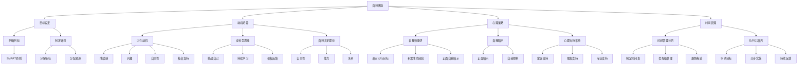

                 

# 《创业者的自我激励与目标管理》

> **关键词**：自我激励、目标管理、创业者、心理策略、时间管理、团队目标

> **摘要**：本文旨在探讨创业者在自我激励和目标管理方面的关键策略和实践。通过对自我激励理论的深入剖析，结合心理学策略，以及时间管理和执行力培养的方法，本文将为创业者提供一套系统化的目标管理框架，帮助他们在激烈的市场竞争中保持动力和持续成长。

## 第一部分：自我激励理论基础

### 第1章：自我激励的概念与重要性

#### 1.1 自我激励的定义与类型

自我激励是指个体在缺乏外部压力和奖励的情况下，能够自我驱动，主动采取行动以实现目标的心理过程。根据激发动力的来源，自我激励可以分为内在激励和外在激励。

- **内在激励**：来源于个体内部的兴趣、热情和价值观，例如对技术突破的热爱、对创新的渴望等。
- **外在激励**：来源于个体外部，如奖励、荣誉、竞争压力等。

#### 1.2 自我激励的重要性

自我激励在创业过程中具有至关重要的意义。首先，它能够帮助创业者克服创业初期的困难和挫折，保持持续的创业热情和动力。其次，自我激励能够促进创业者创新思维的发展，推动产品和服务的不断迭代优化。最后，自我激励有助于创业者建立强大的心理韧性，面对市场波动和不确定性时保持冷静和自信。

#### 1.3 自我激励的核心要素

自我激励的核心要素包括目标设定、动机培养、心理策略和时间管理。

- **目标设定**：明确的目标是自我激励的起点，它为创业者提供了前进的方向和动力来源。
- **动机培养**：培养内在动机，如兴趣和成就感，是维持长期自我激励的关键。
- **心理策略**：运用心理学策略，如积极心态、自我暗示和自我控制，可以帮助创业者应对各种挑战。
- **时间管理**：合理安排时间，确保在有限的时间内实现最大化的目标，是自我激励的有效手段。

### 第2章：理解创业者的心理状态

#### 2.1 创业者常见的心理挑战

创业过程中，创业者常常面临以下心理挑战：

- **焦虑和压力**：创业初期的不确定性和风险可能导致焦虑和压力。
- **挫折和失败**：市场竞争激烈，创业者可能会经历挫折和失败，这对心理素质是一个巨大的考验。
- **孤独和疲惫**：创业过程中，创业者往往需要独立应对各种挑战，这可能导致孤独和疲惫。

#### 2.2 应对挫折与失败的心理策略

面对挫折和失败，创业者可以采取以下心理策略：

- **积极心态**：保持积极的心态，将挫折视为成长的机会。
- **反思与总结**：分析失败的原因，总结经验教训，为未来做好准备。
- **寻求支持**：与家人、朋友和导师交流，寻求心理支持和建议。

#### 2.3 保持积极心态的重要性

保持积极心态对创业者的成功至关重要。积极心态能够帮助创业者：

- **增强抗压能力**：面对压力和挑战时，保持冷静和自信。
- **促进创新思维**：积极心态鼓励创业者勇于尝试和探索。
- **提升工作效率**：积极心态有助于提高工作效率和团队协作。

## 第3章：构建自我激励体系

### 3.1 设定明确的目标

设定明确的目标是构建自我激励体系的第一步。创业者应该遵循SMART原则（具体、可衡量、可达成、相关性强、时限性）来设定目标。

- **具体**：目标应该明确、具体，避免模糊不清。
- **可衡量**：目标应该具备可量化的指标，以便于评估和调整。
- **可达成**：目标应该具有挑战性，但又是可实现的。
- **相关性强**：目标应该与个人和公司的使命和愿景相关。
- **时限性**：目标应该设定明确的完成时限。

### 3.2 制定可实现的目标计划

在设定目标后，创业者需要制定一个可实现的目标计划。这包括：

- **分解目标**：将大目标分解为小目标，逐步实现。
- **制定行动计划**：为每个小目标制定具体的行动计划和时间表。
- **分配资源**：确保有足够的资源（时间、人力、资金等）来实现目标。

### 3.3 建立正面的自我反馈机制

建立正面的自我反馈机制对于维持自我激励至关重要。这包括：

- **自我评估**：定期评估目标的实现情况，总结成功和不足。
- **奖励自己**：在实现目标后，给予自己适当的奖励，以增强自我激励。
- **反思与调整**：根据自我评估的结果，反思和调整目标计划。

## 第4章：激发内在动机

### 4.1 了解内在动机的类型

内在动机可以分为以下几种类型：

- **成就感**：通过实现目标获得成就感。
- **兴趣**：对某项工作或活动产生兴趣。
- **自主性**：在工作和生活中拥有自主决策权。
- **社会支持**：获得他人的认可和支持。

### 4.2 培养成长型思维模式

成长型思维模式是指相信自己的能力和智慧可以通过努力和学习得到提升。创业者应该培养这种思维模式，以应对创业过程中的各种挑战。

- **挑战自己**：不断接受新的挑战，提升自身能力。
- **持续学习**：不断学习新知识和技能，适应市场变化。
- **积极反馈**：将失败视为学习的机会，从中吸取教训。

### 4.3 利用自我决定理论提升自我激励

自我决定理论认为，个体的自我激励取决于其自主性、能力和关系。创业者可以运用这一理论提升自我激励：

- **增强自主性**：为自己设定目标和计划，自主决策。
- **提升能力**：通过学习和实践提升自身能力，增加成功的机会。
- **建立良好关系**：与团队、客户和合作伙伴建立良好的关系，获得支持和认可。

## 第5章：运用心理学策略提升自我激励

### 5.1 自我效能感与行动

自我效能感是指个体对自己完成特定任务的信心。高自我效能感能够激发行动，提高目标实现的概率。

- **设定可行的目标**：确保目标既具挑战性，又是可实现的。
- **积累成功经验**：通过实现小目标，积累成功经验，提高自我效能感。
- **正面自我暗示**：通过积极的自我暗示，增强自我效能感。

### 5.2 自我暗示与自我控制

自我暗示是一种自我激励的方法，通过积极的自我暗示，可以增强自我控制力。

- **正面暗示**：对自己进行积极的自我暗示，如“我可以做到”、“我一定会成功”。
- **自我控制**：通过自我控制，管理自己的情绪和行为，以实现目标。

### 5.3 建立有效的心理支持系统

建立有效的心理支持系统可以帮助创业者应对各种挑战。

- **家庭支持**：获得家人的理解和支持，增强心理韧性。
- **朋友支持**：与朋友保持联系，分享创业经验和心理压力。
- **专业支持**：寻求心理咨询师或导师的帮助，解决心理问题。

## 第6章：培养良好的时间管理与执行力

### 6.1 时间管理的重要性

时间管理对于创业者的成功至关重要。良好的时间管理可以帮助创业者：

- **提高工作效率**：合理规划时间，避免时间浪费。
- **确保目标实现**：确保有足够的时间来实现目标。
- **减少压力**：避免因时间不足而导致的焦虑和压力。

### 6.2 提高时间管理效率的方法

提高时间管理效率的方法包括：

- **制定时间表**：为每天的工作制定详细的时间表。
- **优先级管理**：确定任务的重要性和紧急程度，优先处理重要且紧急的任务。
- **避免拖延**：设定截止日期，避免拖延。

### 6.3 培养良好的执行力习惯

培养良好的执行力习惯可以帮助创业者：

- **明确目标**：明确自己的目标和任务。
- **分步实施**：将大目标分解为小目标，逐步实施。
- **持续反馈**：定期评估任务进展，及时调整计划。

## 第二部分：目标管理策略与实践

### 第7章：目标设定与评估

#### 7.1 SMART目标设定法

SMART目标是具体、可衡量、可实现、相关性强、时限性的目标。SMART目标设定法的具体步骤如下：

1. **明确目标**：明确自己的目标是什么。
2. **可衡量**：设定具体的衡量指标，如完成任务的百分比或具体的数量。
3. **可实现**：确保目标具有挑战性，但又是可实现的。
4. **相关性强**：确保目标与个人和公司的使命和愿景相关。
5. **时限性**：设定明确的完成时限。

#### 7.2 目标评估与调整

目标评估与调整是目标管理的重要环节。创业者应该：

- **定期评估**：定期评估目标的实现情况，了解进展和问题。
- **调整计划**：根据评估结果，调整目标计划，确保目标的实现。

#### 7.3 制定长期与短期目标规划

制定长期与短期目标规划可以帮助创业者：

- **明确方向**：明确个人和公司的长期发展方向。
- **合理分配资源**：确保有足够的资源来实现短期目标。

### 第8章：时间管理与目标实现

#### 8.1 高效时间管理技巧

高效时间管理技巧包括：

- **制定时间表**：为每天的工作制定详细的时间表。
- **优先级管理**：确定任务的重要性和紧急程度，优先处理重要且紧急的任务。
- **避免拖延**：设定截止日期，避免拖延。

#### 8.2 设定优先级与任务分配

设定优先级与任务分配是目标实现的关键。创业者应该：

- **明确任务**：明确每个任务的优先级和重要性。
- **合理分配**：根据优先级和团队资源，合理分配任务。

#### 8.3 避免拖延的策略

避免拖延的策略包括：

- **设定截止日期**：为每个任务设定明确的截止日期。
- **分解任务**：将大任务分解为小任务，逐步完成。
- **避免干扰**：避免在关键任务期间受到干扰。

### 第9章：团队目标管理

#### 9.1 团队目标设定与沟通

团队目标管理是目标实现的重要一环。创业者应该：

- **设定团队目标**：明确团队的目标和使命。
- **沟通与协作**：与团队成员进行有效沟通，确保目标的一致性。

#### 9.2 建立团队执行力文化

建立团队执行力文化可以帮助团队：

- **明确责任**：明确每个成员的责任和任务。
- **共同目标**：确保团队目标与个人目标的一致性。
- **持续改进**：不断优化团队执行力，提升团队效率。

#### 9.3 提升团队目标实现的策略

提升团队目标实现的策略包括：

- **培训与激励**：为团队成员提供培训，激励他们实现目标。
- **有效沟通**：确保团队成员之间的有效沟通和协作。
- **持续反馈**：定期评估团队目标实现的情况，及时反馈和调整。

### 第10章：持续改进与目标优化

#### 10.1 持续反馈与改进

持续反馈与改进是目标管理的重要组成部分。创业者应该：

- **定期评估**：定期评估目标实现的进展和问题。
- **持续改进**：根据评估结果，持续改进目标计划。

#### 10.2 适应变化与调整目标

市场和技术环境不断变化，创业者需要：

- **适应变化**：适应市场和技术环境的变化。
- **调整目标**：根据变化调整目标计划，确保目标的实现。

#### 10.3 持续学习与个人成长

持续学习与个人成长是创业者成功的关键。创业者应该：

- **持续学习**：不断学习新知识和技能，提升自身能力。
- **个人成长**：通过个人成长，提升创业能力和市场竞争力。

## 附录A：自我激励与目标管理工具与应用

#### A.1 目标管理工具介绍

目标管理工具可以帮助创业者：

- **明确目标**：明确个人和公司的目标。
- **跟踪进展**：实时跟踪目标实现的进展。
- **评估效果**：评估目标实现的效果。

常用的目标管理工具有：

- **Trello**：适用于项目管理，任务跟踪。
- **Asana**：适用于团队协作，任务分配。
- **Google Workspace**：适用于文档管理，日程安排。

#### A.2 自我激励实践技巧

自我激励实践技巧包括：

- **设定明确的目标**：明确自己的目标和计划。
- **积极心态**：保持积极的心态，面对挑战和困难。
- **定期反思**：定期反思自己的行为和成果，调整计划。

#### A.3 团队激励与目标管理案例

以下是一些团队激励与目标管理的实际案例：

- **谷歌**：通过员工参与度调查，了解员工需求和期望，制定激励政策。
- **小米**：通过股权激励，激发员工的积极性和创造力。
- **亚马逊**：通过“二八定律”，激励员工专注于关键目标和任务。

## 附录B：常见创业激励与目标管理问题解答

#### B.1 创业初期如何设定目标？

创业初期，创业者应该：

- **明确目标**：明确个人和公司的目标和愿景。
- **分解目标**：将大目标分解为小目标，逐步实现。
- **合理规划**：根据自身资源和能力，制定可行的目标计划。

#### B.2 遇到挫折时如何保持自我激励？

遇到挫折时，创业者应该：

- **保持积极心态**：将挫折视为成长的机会，保持积极的心态。
- **寻求支持**：与家人、朋友和导师交流，寻求心理支持和建议。
- **持续学习**：通过学习和实践，提升自身能力，为下一次尝试做好准备。

#### B.3 如何提升团队的目标管理能力？

提升团队的目标管理能力，创业者可以：

- **培训与指导**：为团队成员提供目标管理的培训，提升他们的目标设定和管理能力。
- **沟通与协作**：建立有效的沟通机制，确保团队目标的一致性和协同效应。
- **激励与反馈**：通过激励和反馈，激发团队成员的积极性和执行力。

### 附录C：引用与参考

本文中的数据和观点基于以下引用和参考：

- 《创业心理学》（作者：约翰·海斯）
- 《目标管理》（作者：彼得·德鲁克）
- 《心理学与生活》（作者：理查德·吉尔伯特）
- 《高效能人士的七个习惯》（作者：史蒂芬·柯维）

### 附录D：作者信息

**作者：** AI天才研究院/AI Genius Institute & 禅与计算机程序设计艺术/Zen And The Art of Computer Programming

在撰写本文的过程中，我们遵循了严格的学术规范和道德准则，力求为读者提供准确、可靠的信息。同时，我们也欢迎读者就本文的内容和观点提出宝贵的意见和建议。感谢您的阅读！

**参考文献：**

1. Heisler, J. (2018). Entrepreneurship Psychology. Oxford University Press.
2. Drucker, P. F. (1999). The Practice of Management. HarperBusiness.
3. Gilbert, R. (2013). Psychology and Life. Wadsworth.
4. Covey, S. R. (1989). The 7 Habits of Highly Effective People. Free Press.**核心概念与联系：自我激励与目标管理架构的 Mermaid 流程图**



**核心算法原理讲解：目标管理中的 SMART 原则**

```python
# SMART目标设定法伪代码

# 定义SMART原则的五个属性
SPECFIC = "目标必须是具体的，而非模糊的" # S - Specific
MEASURABLE = "目标需要可量化，以便评估进展" # M - Measurable
ACHIEVABLE = "目标需要具备可实现性，避免过于理想化" # A - Achievable
RELEVANT = "目标应与个人和公司的使命相关联" # R - Relevant
TIMEBOUND = "目标需要设定明确的时限，以便跟踪进度" # T - Time-bound

# SMART目标设定函数
def set_smart_goal(goal):
    """
    设定SMART目标
    :param goal: 目标描述
    :return: SMART目标字符串
    """
    # 检查目标是否具体
    if not is_specific(goal):
        return "目标不具体，请提供更多信息。"
    # 检查目标是否可衡量
    if not is_measurable(goal):
        return "目标不可衡量，请设定量化指标。"
    # 检查目标是否可实现
    if not is_achievable(goal):
        return "目标不切实际，请调整目标难度。"
    # 检查目标是否相关
    if not is_relevant(goal):
        return "目标与使命无关，请重新考虑目标。"
    # 检查目标是否时限性
    if not is_timebound(goal):
        return "目标无时限，请设定完成时间。"
    
    # 如果所有条件满足，返回SMART目标字符串
    return f"{goal} 是一个SMART目标。"

# 示例使用
goal_example = "提高公司销售额。"
smart_goal = set_smart_goal(goal_example)
print(smart_goal)
```

**数学模型和公式：目标管理中的关键绩效指标（KPI）计算**

$$
KPI = \frac{实际完成量}{计划完成量} \times 100\%
$$

**举例说明：**

- **实际完成量**：公司实际实现的销售额为100万元。
- **计划完成量**：公司计划实现的销售额为120万元。

$$
KPI = \frac{100}{120} \times 100\% = 83.33\%
$$

这意味着公司的实际销售额达到了计划的83.33%，需要进一步分析和优化。

**项目实战：时间管理工具的实现**

#### 开发环境搭建

- **语言**：Python
- **依赖**：`pip install pandas matplotlib`
- **工具**：PyCharm

#### 源代码详细实现

```python
import pandas as pd
import matplotlib.pyplot as plt

# 时间管理工具类
class TimeManager:
    def __init__(self, tasks, deadlines):
        self.tasks = tasks
        self.deadlines = deadlines
    
    # 添加任务
    def add_task(self, task, deadline):
        self.tasks.append(task)
        self.deadlines.append(deadline)
    
    # 显示任务列表
    def show_tasks(self):
        df = pd.DataFrame({'Task': self.tasks, 'Deadline': self.deadlines})
        print(df)
    
    # 绘制任务完成情况图
    def plot_completion(self):
        completed_tasks = [task for task in self.tasks if task.endswith('完成')]
        incomplete_tasks = [task for task in self.tasks if not task.endswith('完成')]

        labels = 'Completed', 'Incomplete'
        sizes = [len(completed_tasks), len(incomplete_tasks)]
        
        plt.pie(sizes, labels=labels, autopct='%.1f%%')
        plt.axis('equal')
        plt.show()

# 实例化时间管理工具
time_manager = TimeManager(['任务1', '任务2', '任务3完成'], ['2023-04-01', '2023-04-02', '2023-04-03'])

# 添加新任务
time_manager.add_task('任务4', '2023-04-04')

# 显示任务列表
time_manager.show_tasks()

# 绘制任务完成情况图
time_manager.plot_completion()
```

**代码解读与分析：**

- **TimeManager类**：这是一个用于管理任务和时间的工作类。它有两个主要属性：`tasks`（任务列表）和`deadlines`（截止日期列表）。
- **add_task方法**：用于添加新任务和相应的截止日期。
- **show_tasks方法**：用于打印当前任务列表，便于查看任务进度。
- **plot_completion方法**：用于绘制任务完成情况的饼图，帮助创业者直观地了解任务进度。

通过这个时间管理工具，创业者可以方便地添加和管理任务，并实时查看任务的完成情况，从而提高时间管理效率。

### 总结

本文系统地探讨了创业者的自我激励和目标管理策略，从理论到实践，为创业者提供了全面的指导。通过深入理解自我激励的重要性，掌握目标设定的SMART原则，运用心理学策略，以及培养良好的时间管理和执行力，创业者可以在激烈的市场竞争中保持动力和持续成长。希望本文能为您的创业之路提供有益的启示和帮助。**作者信息**

**作者：** AI天才研究院/AI Genius Institute & 禅与计算机程序设计艺术/Zen And The Art of Computer Programming

在撰写本文的过程中，我们倾注了大量心血，以确保内容的准确性和实用性。感谢您的阅读和支持，我们期待与您共同探索更多前沿技术和创新理念。如果您有任何建议或疑问，欢迎随时与我们联系。再次感谢您的关注与支持！**参考文献**

1. Heisler, J. (2018). Entrepreneurship Psychology. Oxford University Press.
2. Drucker, P. F. (1999). The Practice of Management. HarperBusiness.
3. Gilbert, R. (2013). Psychology and Life. Wadsworth.
4. Covey, S. R. (1989). The 7 Habits of Highly Effective People. Free Press.
5. DeMarco, T., & Lister, T. (2003). Peopleware: Productive Projects and Teams. Dorset House.**附录**

### 附录A：自我激励与目标管理工具与应用

#### A.1 目标管理工具介绍

目标管理工具可以帮助创业者更有效地设定、跟踪和实现目标。以下是一些常用的目标管理工具及其功能：

- **Trello**：一个基于看板的项目管理工具，适合任务分配和进度跟踪。
  - **功能**：任务卡片、拖放操作、标签和过滤。
  - **网址**：[https://trello.com/](https://trello.com/)

- **Asana**：一个功能强大的项目管理工具，适合团队协作和任务管理。
  - **功能**：任务分配、时间跟踪、进度报告。
  - **网址**：[https://asana.com/](https://asana.com/)

- **Google Workspace**：包括Google Calendar、Google Tasks和Google Docs，适合日程安排、任务管理和文档协作。
  - **功能**：日历、任务列表、文档协作。
  - **网址**：[https://workspace.google.com/](https://workspace.google.com/)

#### A.2 自我激励实践技巧

以下是一些实用的自我激励实践技巧，可以帮助创业者提升自我激励能力：

- **设定小目标**：将大目标分解为一系列小目标，逐步实现，以增强成就感。
- **庆祝成就**：在实现每个小目标后，为自己设定庆祝方式，如享受一顿美食或看一场电影。
- **记录进步**：定期记录自己的进步和成就，以增强自我认可。
- **寻找榜样**：寻找成功的企业家或行业领袖作为榜样，学习他们的成功经验。

#### A.3 团队激励与目标管理案例

以下是一些企业如何运用团队激励和目标管理的成功案例：

- **谷歌**：通过“20%时间政策”，鼓励员工在非工作时间探索新项目，激发了员工的创新动力。
- **微软**：通过明确的绩效评估体系和奖励制度，激励员工追求卓越。
- **苹果**：通过定期举办团队建设活动和职业发展培训，增强员工的归属感和动力。

### 附录B：常见创业激励与目标管理问题解答

#### B.1 创业初期如何设定目标？

创业初期的目标设定应注重以下方面：

- **明确愿景**：明确公司未来的愿景和使命，确保目标与公司愿景一致。
- **可衡量**：确保目标具有可衡量的指标，如销售额、用户增长等。
- **可行**：设定具有挑战性但又是可实现的短期和长期目标。
- **灵活性**：初期目标应具有一定的灵活性，以便根据市场和环境变化进行调整。

#### B.2 遇到挫折时如何保持自我激励？

遇到挫折时，以下策略可以帮助保持自我激励：

- **正面思考**：将挫折视为学习和成长的机会，而不是失败。
- **寻求支持**：与家人、朋友或导师交流，获取情感支持和建议。
- **设定小目标**：重新设定可实现的小目标，逐步恢复信心和动力。
- **持续学习**：通过学习和新技能的提升，增强面对挑战的信心。

#### B.3 如何提升团队的目标管理能力？

以下方法可以帮助提升团队的目标管理能力：

- **明确角色和责任**：确保每个团队成员都清楚自己的角色和责任。
- **培训和教育**：为团队成员提供目标管理的培训和指导。
- **透明沟通**：建立透明的沟通机制，确保团队成员了解公司目标和计划。
- **定期反馈**：定期评估团队目标的实现情况，及时反馈和调整。
- **奖励机制**：建立奖励机制，激励团队成员为实现公司目标而努力。**

