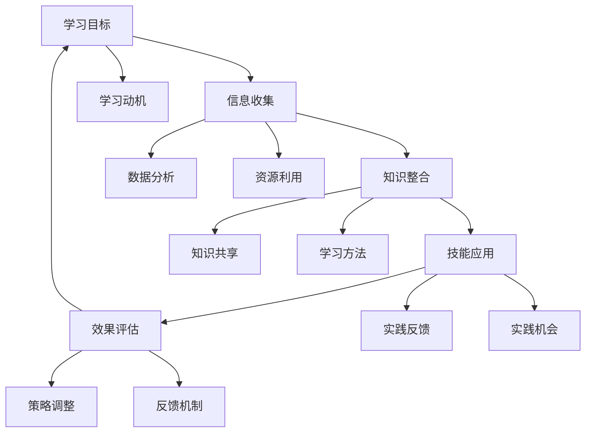

                 

### 《创业路上的持续学习：如何建立个人和团队的学习体系》

> **关键词：** 创业、持续学习、个人学习体系、团队学习体系、学习工具、数据分析

**摘要：** 本文将探讨创业过程中持续学习的重要性，以及如何建立个人和团队的学习体系。文章首先分析了创业对学习的需求，接着详细介绍了个人和团队学习体系建设的方法，并结合实际案例进行了讲解。此外，文章还介绍了学习工具的应用和未来学习趋势，为创业者在学习道路上提供了实用建议。

### 引言

创业是一条充满挑战和机遇的道路。在创业过程中，面对快速变化的市场和技术，创业者不仅需要具备创新思维和决策能力，还需要不断学习和适应。持续学习不仅有助于创业者个人能力的提升，更是团队发展的关键。然而，如何在繁忙的创业工作中保持学习热情，建立有效的学习体系，成为了许多创业者面临的难题。

本文将从以下几个方面展开讨论：

1. **创业中的学习重要性**：阐述创业对学习的需求，以及持续学习对创业成功的重要性。
2. **个人学习体系建设**：介绍如何设定学习目标、整合学习资源、运用学习方法，以及进行自我评估和反馈。
3. **团队学习体系建设**：探讨团队学习的重要性，如何制定学习目标、设计学习活动，以及评估学习效果。
4. **实战案例分析**：分享个人和团队学习的实际案例，分析其成功经验和挑战。
5. **学习工具与应用**：介绍常用的学习工具，如何利用工具提升学习效率。
6. **未来学习趋势与展望**：探讨未来学习的发展趋势，以及创业者应该如何应对。

通过本文的讨论，希望为创业者提供一套实用的学习体系，助力他们在创业道路上不断成长和进步。

### 创业中的学习重要性

#### 1.1 创业对学习的需求

创业是一个复杂而多变的过程，涉及市场分析、产品开发、团队管理、资金筹集等多个方面。在这个过程中，创业者需要不断学习新知识、新技能，以应对各种挑战和变化。以下是创业过程中常见的几个学习需求：

1. **市场和技术知识**：创业者需要了解市场趋势、用户需求以及相关技术，以便做出正确的决策。
2. **管理技能**：团队管理、项目管理、人力资源管理等技能对于创业成功至关重要。
3. **领导力**：创业者需要具备领导力，能够激励和引导团队成员，实现共同目标。
4. **沟通能力**：与客户、投资者、合作伙伴等各方的有效沟通是创业成功的关键。

#### 1.2 持续学习与创业成功的关系

持续学习对于创业成功具有至关重要的影响。首先，持续学习能够帮助创业者不断提升自身能力，适应市场变化。例如，通过学习新技术，创业者可以开发出更符合市场需求的产品；通过学习管理知识，创业者可以更有效地管理团队和项目。其次，持续学习有助于创业者保持创新思维，不断推出新产品和新服务。此外，持续学习还可以帮助创业者建立广泛的人脉网络，获取更多的资源和机会。

一个典型的案例是阿里巴巴创始人马云。在创业初期，马云就非常重视学习，他不仅阅读大量书籍，还经常参加各种培训课程，以提升自己的管理能力和领导力。正是这种持续学习的精神，使得马云能够在竞争激烈的市场中脱颖而出，最终创建了一家全球知名的企业。

#### 1.3 学习习惯的养成策略

要实现持续学习，创业者需要养成良好的学习习惯。以下是一些有效的策略：

1. **定期阅读**：创业者应该每天安排一定的时间进行阅读，无论是专业书籍、行业报告还是新闻资讯，都能够帮助创业者获取新知识、了解市场动态。
2. **参加培训课程**：参加各种培训课程是提升自身能力的重要途径。创业者可以选择在线课程、工作坊、讲座等不同形式的学习活动。
3. **建立学习小组**：与其他创业者或团队成员组成学习小组，共同学习、讨论，可以提高学习效果。
4. **实践应用**：将所学知识应用到实际工作中，通过实践来检验和巩固学习成果。
5. **记录学习笔记**：定期记录学习笔记，可以帮助创业者总结学习内容，加深记忆。

通过以上策略，创业者可以逐步养成持续学习的习惯，为创业成功打下坚实的基础。

### 个人学习体系建设

#### 2.1 个人学习目标设定

个人学习目标的设定是个人学习体系建设的第一步，也是最重要的一步。明确的学习目标能够帮助创业者集中精力，有针对性地进行学习，从而提高学习效率。以下是如何设定个人学习目标的几个关键步骤：

1. **明确职业发展愿景**：首先，创业者需要明确自己的职业发展愿景。这个愿景可以是长期的，也可以是短期的，但必须是具体和可实现的。例如，如果目标是成为一名技术领导者，那么在设定学习目标时，就需要围绕这个愿景来制定。
   
2. **分解目标**：将职业发展愿景分解成一系列具体的学习目标。这些目标应该具备可衡量性、可实现性和相关性。例如，如果目标是学习新技能，可以将这个目标进一步分解为“学习Python编程语言”或“掌握项目管理工具的使用”等。

3. **设定时间框架**：为每个学习目标设定一个明确的时间框架。例如，“在三个月内掌握Python编程语言”或“在六个月内通过项目管理认证”。设定时间框架可以帮助创业者保持紧迫感，确保学习进度。

4. **优先级排序**：根据目标的紧急程度和重要性，对学习目标进行优先级排序。这样可以确保创业者能够优先完成最关键的学习任务。

5. **定期评估和调整**：设定学习目标后，创业者需要定期评估目标的完成情况，并根据实际情况进行调整。例如，如果某个目标在预定时间内无法完成，需要重新评估时间分配，或者调整目标难度。

#### 2.2 学习资源整合与利用

为了有效地进行学习，创业者需要整合和利用各种学习资源。以下是一些常见的学习资源类型及其利用方法：

1. **在线课程平台**：如Coursera、Udemy、edX等平台提供了丰富的在线课程，创业者可以根据自己的需要选择合适的课程进行学习。这些平台通常提供灵活的学习时间和进度，非常适合忙碌的创业者。

2. **专业书籍**：专业书籍是获取系统化知识的重要资源。创业者可以选择与自己职业发展相关的书籍进行阅读。此外，电子书和有声书也为创业者提供了便捷的学习方式。

3. **行业报告和分析**：行业报告和深度分析能够帮助创业者了解市场动态和行业趋势。这些资源通常来自专业的市场研究机构和咨询公司，具有很高的参考价值。

4. **在线论坛和社区**：如Stack Overflow、GitHub、知乎等平台，创业者可以在这里与其他开发者交流，解决技术难题，获取行业资讯，以及学习他人的经验和教训。

5. **在线讲座和研讨会**：许多机构和组织会定期举办线上讲座和研讨会，创业者可以通过这些活动学习最新的行业知识，了解前沿技术。

6. **内部培训**：如果公司内部有专业的培训资源，创业者可以利用这些资源进行深入学习。此外，创业者还可以考虑为公司内部的员工提供培训，以提升整个团队的知识水平。

7. **学习小组和导师**：与其他创业者或专业人士组成学习小组，可以互相分享经验和知识，共同进步。此外，寻求一位导师的帮助也是提升个人能力的重要途径。导师不仅能够提供专业指导，还可以为创业者提供宝贵的行业见解。

#### 2.3 学习方法与技巧

选择合适的学习方法与技巧是确保学习效果的关键。以下是一些常用的学习方法与技巧：

1. **主动学习**：主动学习是指通过提问、实践、讨论等方式主动获取知识。与被动学习相比，主动学习能够更有效地加深对知识的理解和记忆。

2. **分散学习**：分散学习是指将学习时间分散到不同的时间段进行，而不是集中在一个时间点。分散学习能够减少疲劳，提高学习效率。

3. **深度学习**：深度学习是指对某一领域进行深入、系统性的学习。创业者可以选择一个具体的学习主题，通过阅读相关书籍、文章，参加研讨会等方式进行深入学习。

4. **反思学习**：反思学习是指在学习过程中不断反思自己的学习方法和学习效果，找出不足并进行调整。反思学习能够帮助创业者不断优化学习策略，提高学习效率。

5. **案例学习**：通过分析成功的创业案例，创业者可以学习到具体的实践经验和策略。案例学习不仅能够帮助创业者理解理论知识，还能够提供实际操作的指导。

6. **合作学习**：与其他创业者或团队成员一起学习，可以互相分享经验和见解，提高学习效果。合作学习还能够培养团队合作精神，为团队发展打下基础。

#### 2.4 自我评估与反馈

自我评估与反馈是个人学习体系建设中不可或缺的一环。通过自我评估，创业者可以了解自己的学习进度和效果，从而及时调整学习策略。以下是一些自我评估与反馈的方法：

1. **定期复习**：定期对所学知识进行复习，可以帮助创业者巩固记忆，发现遗漏和不足。

2. **完成学习任务**：根据学习计划，按时完成学习任务，可以评估自己的学习进度。

3. **考试与测试**：通过参加考试或进行自我测试，创业者可以评估自己的知识掌握程度。

4. **收集反馈**：向同事、朋友、导师等人收集反馈，了解自己在学习过程中的表现和不足。

5. **记录学习日志**：记录学习日志可以帮助创业者总结学习经验，反思学习过程。

6. **制定改进计划**：根据自我评估和反馈，制定改进计划，明确下一步的学习目标和策略。

通过以上方法，创业者可以不断优化自己的学习体系，提高学习效果，为创业成功奠定坚实基础。

### 团队学习体系建设

#### 3.1 团队学习的重要性

在创业过程中，团队学习不仅有助于提升团队整体的知识水平，还能够增强团队成员之间的协作能力和信任感。以下是团队学习的重要性及其对创业成功的影响：

1. **知识共享**：团队学习能够促进团队成员之间的知识共享，使得团队内的每个人都能够获取到其他成员的经验和见解。这种知识共享有助于提高整个团队的创新能力和解决问题的能力。

2. **协作效率**：通过团队学习，团队成员能够更好地理解彼此的职责和角色，从而提高协作效率。例如，技术开发人员可以更好地理解产品需求和市场趋势，而市场营销人员也可以更深入地了解技术实现。

3. **共同成长**：团队学习有助于团队成员共同成长，提升个人的专业技能和综合能力。这种共同成长不仅有助于团队成员的职业发展，也为团队整体的竞争力提升奠定了基础。

4. **增强团队凝聚力**：通过共同学习和实践，团队成员之间的默契和信任感得到增强，团队凝聚力也随之提升。一个有凝聚力的团队在面对挑战时能够更加团结一致，共同克服困难。

5. **应对变化**：创业过程中，市场和技术的变化速度非常快。团队学习能够帮助团队成员快速适应这些变化，保持团队的敏捷性和适应性。

#### 3.2 团队学习目标的制定

制定明确的团队学习目标是团队学习体系建设的重要步骤。以下是如何制定团队学习目标的几个关键点：

1. **明确团队愿景**：首先，团队需要明确自身的长期愿景，这将为团队学习目标提供方向。例如，团队愿景可以是“成为行业内领先的技术创新团队”。

2. **分析当前状况**：对团队当前的知识结构、技能水平和学习需求进行评估，找出团队的优势和不足。这有助于制定符合实际的目标。

3. **设定具体目标**：将团队愿景分解为一系列具体的学习目标。这些目标应该具有可衡量性、可实现性和相关性。例如，“提高团队在人工智能领域的知识水平”或“提升团队的项目管理能力”。

4. **设定时间框架**：为每个学习目标设定一个明确的时间框架，例如“在六个月内完成人工智能领域的知识更新”或“在一年内通过项目管理认证”。

5. **确保目标可实现性**：确保设定的学习目标在团队现有资源和条件下是可实现的。例如，如果团队中没有人工智能专家，可能需要考虑通过外部培训或引进人才来实现目标。

6. **优先级排序**：根据目标的紧急程度和重要性，对学习目标进行优先级排序。这样可以确保团队能够优先完成最关键的学习任务。

#### 3.3 团队学习活动设计与实施

为了确保团队学习目标的实现，团队需要设计和实施一系列有效的学习活动。以下是一些常用的团队学习活动及其实施步骤：

1. **内部培训**：内部培训是团队学习的基础。团队可以定期组织内部培训，由团队成员或外部专家进行授课。实施步骤包括：

   - **确定培训主题**：根据团队的学习目标，确定培训的主题。
   - **邀请讲师**：邀请有经验的团队成员或外部专家担任讲师。
   - **制定培训计划**：制定详细的培训计划，包括培训时间、内容、方式等。
   - **培训实施**：按照培训计划进行培训，确保培训内容的落实。

2. **读书会**：读书会是团队分享知识和经验的良好方式。实施步骤包括：

   - **选择书籍**：选择与团队学习目标相关的书籍。
   - **分组阅读**：将团队成员分组，每组负责阅读一本书。
   - **定期讨论**：定期组织讨论会，让团队成员分享阅读心得和经验。

3. **研讨会**：研讨会是团队成员交流思想和观点的重要平台。实施步骤包括：

   - **确定研讨会主题**：根据团队的学习目标，确定研讨会的主题。
   - **邀请嘉宾**：邀请行业专家或外部嘉宾参与研讨会。
   - **制定研讨议程**：制定详细的研讨议程，包括研讨时间、地点、内容等。
   - **研讨会实施**：按照研讨议程进行研讨，确保研讨内容的深入和实效。

4. **外部培训**：外部培训是提升团队专业水平的有效途径。实施步骤包括：

   - **选择培训机构**：选择具有良好口碑和专业的培训机构。
   - **培训报名**：根据团队成员的学习需求和培训机构提供的课程，进行培训报名。
   - **培训实施**：按照培训机构的安排，完成培训课程。

5. **实践项目**：通过实际项目，团队成员可以学习到具体的应用技能。实施步骤包括：

   - **确定项目目标**：根据团队的学习目标，确定项目的目标和任务。
   - **项目分工**：明确项目分工，确保每个团队成员都有具体的职责和任务。
   - **项目实施**：按照项目计划进行项目实施，确保项目目标的实现。

6. **团队学习计划**：制定详细的团队学习计划，确保学习活动有计划、有组织地进行。实施步骤包括：

   - **制定学习计划**：根据团队的学习目标和实际情况，制定详细的学习计划。
   - **分工协作**：明确每个团队成员在团队学习计划中的职责和任务。
   - **执行和监督**：按照学习计划执行学习活动，并定期进行监督和评估。

#### 3.4 团队学习效果的评估与优化

评估团队学习效果是团队学习体系建设的重要环节。通过评估，团队可以了解学习活动的实际效果，发现问题和不足，从而进行优化和改进。以下是一些评估团队学习效果的方法：

1. **问卷调查**：通过问卷调查，了解团队成员对学习活动的满意度和学习效果。问卷调查可以包括学习内容的满意度、学习方式的接受度、学习效果的提升等方面。

2. **访谈反馈**：与团队成员进行一对一的访谈，了解他们对学习活动的看法和建议。访谈可以深入了解团队成员的感受和需求，为优化学习活动提供参考。

3. **学习成果展示**：定期组织学习成果展示会，让团队成员展示自己的学习成果。通过展示，不仅可以激励团队成员，还可以发现学习过程中的优点和不足。

4. **技能测试**：通过技能测试，评估团队成员在特定领域的学习效果。技能测试可以包括笔试、实操等多种形式。

5. **项目评估**：通过评估实际项目的实施效果，了解团队成员在项目中的表现和学习成果。项目评估可以从项目质量、项目进度、团队协作等方面进行。

6. **数据分析**：利用数据分析工具，对学习数据进行分析，了解学习活动的实际效果。数据分析可以从学习时间、学习内容、学习成果等方面进行。

在评估团队学习效果的基础上，团队可以针对发现的问题进行优化和改进。以下是一些优化策略：

1. **调整学习内容**：根据评估结果，调整学习内容，确保学习内容符合团队的实际需求。

2. **改进学习方式**：根据团队成员的反馈和学习效果的评估，改进学习方式，提高学习效率。

3. **增加学习资源**：根据评估结果，增加或调整学习资源，确保学习资源的充足和有效。

4. **优化学习环境**：改善学习环境，提供更好的学习条件和氛围，以提高学习效果。

5. **强化团队协作**：通过团队协作活动和项目，加强团队成员之间的沟通和合作，提升团队整体的学习效果。

通过以上方法和策略，团队可以不断优化学习体系，提高团队学习效果，为创业成功提供坚实的支持。

### 实战案例分析

#### 第4章：个人学习案例分享

在创业过程中，个人学习能力的提升是至关重要的。以下是三个个人学习的实际案例，分析它们在学习过程中的策略、成果以及面临的挑战。

#### 4.1 案例一：技术创业者持续学习之路

**背景**：李先生是一位技术创业者，他的公司专注于人工智能领域。在创业初期，李先生意识到技术快速迭代带来的挑战，决定通过持续学习提升自己的技术能力。

**策略**：

1. **目标设定**：李先生设定了明确的个人学习目标，包括掌握深度学习、强化学习等前沿技术。
2. **时间管理**：李先生每天晚上安排1-2小时进行学习，保证学习时间不被其他事务干扰。
3. **资源整合**：李先生通过在线课程平台、专业书籍、学术论文等多渠道获取学习资源。
4. **实践应用**：李先生在学习新技能后，将其应用到实际项目中，通过实践巩固知识。

**成果**：

1. **技术提升**：李先生成功将深度学习技术应用于公司的核心产品，提高了产品的竞争力。
2. **团队影响力**：李先生的技术能力得到了团队成员的认可，提升了团队整体的士气。

**挑战**：

1. **时间冲突**：在创业初期，李先生经常面临时间冲突，需要平衡学习与工作。
2. **学习资源筛选**：由于学习资源繁多，李先生需要花费大量时间筛选优质资源。

**总结**：李先生的持续学习策略有效地提升了他的技术能力和团队影响力，但也面临着时间冲突和资源筛选的挑战。他的成功经验为其他创业者提供了借鉴。

#### 4.2 案例二：市场营销人员的学习实践

**背景**：张女士是一位市场营销人员，她在一家初创公司负责市场营销工作。随着市场环境的变化，张女士意识到需要不断学习新技能以适应市场的需求。

**策略**：

1. **目标设定**：张女士设定了学习数字营销、数据分析等技能的目标。
2. **时间管理**：张女士每周安排一天时间进行集中学习，确保学习时间得到保障。
3. **学习资源整合**：张女士通过在线课程、行业报告、社交媒体等多渠道获取学习资源。
4. **实践应用**：张女士将所学技能应用于实际营销活动中，通过实践验证学习效果。

**成果**：

1. **营销策略优化**：张女士成功推出了多个创新营销策略，提升了公司的品牌知名度和市场份额。
2. **个人职业发展**：张女士因为出色的营销表现，获得了公司内部的晋升机会。

**挑战**：

1. **学习内容繁杂**：数字营销领域知识更新迅速，张女士需要不断学习新知识。
2. **实践难度**：某些营销技能在实践过程中存在难度，需要张女士不断尝试和调整。

**总结**：张女士通过系统的学习和实践，成功提升了自身的营销能力，但也面临着学习内容繁杂和实践难度大的挑战。她的学习实践为市场营销人员提供了有益的经验。

#### 4.3 案例三：团队学习在初创公司中的应用

**背景**：王先生是一家初创公司的创始人，他意识到团队学习对于公司发展的重要性，决定在公司内推行团队学习计划。

**策略**：

1. **制定学习目标**：王先生与团队成员一起制定了具体的学习目标，包括技术知识、项目管理、市场分析等。
2. **设计学习活动**：公司定期举办内部培训、读书会、研讨会等学习活动，鼓励团队成员参与。
3. **共享学习资源**：公司建立了内部知识库，共享团队成员的学习资源，促进知识共享。
4. **实践应用**：团队成员将所学知识应用于实际工作中，通过项目实践验证学习效果。

**成果**：

1. **团队凝聚力提升**：通过共同学习和实践，团队成员之间的默契和信任感得到了增强。
2. **工作效率提升**：团队成员通过学习，掌握了更多技能，提高了工作效率。
3. **公司业绩提升**：公司整体业绩因为团队学习的效果得到了显著提升。

**挑战**：

1. **资源分配**：在资源有限的情况下，如何合理分配学习资源是一个挑战。
2. **学习效果评估**：如何有效评估团队学习的实际效果，确保学习目标的实现。

**总结**：王先生的团队学习计划有效地提升了公司团队的整体素质和业绩，但也面临着资源分配和学习效果评估的挑战。他的实践为其他初创公司提供了有益的借鉴。

### 第5章：团队学习实践

团队学习在初创公司中扮演着至关重要的角色，它不仅有助于提升团队的整体素质，还能促进团队成员之间的协作和信任。以下我们将详细探讨如何制定团队学习计划、实施学习项目、评估学习效果以及应对团队学习中的挑战。

#### 5.1 团队学习计划制定

制定一个有效的团队学习计划是团队学习成功的第一步。以下是如何制定团队学习计划的几个关键步骤：

1. **明确学习目标**：首先，团队需要明确学习目标。这些目标应该与公司的战略目标和个人发展目标相一致。例如，团队可以设定提升技术能力、优化项目管理流程或提升市场营销技能等目标。

2. **评估当前状况**：在制定学习计划之前，团队需要对当前的知识水平和技能状况进行评估。这可以通过问卷调查、技能测试或内部讨论等方式进行。通过评估，团队可以了解成员的优势和不足，从而有针对性地制定学习计划。

3. **设定时间框架**：为每个学习目标设定一个明确的时间框架。例如，可以设定在三个月内完成某个技术培训，或者在六个月内通过某个项目管理认证。

4. **分配责任**：确定每个团队成员在团队学习计划中的角色和责任。例如，有些人可能负责组织学习活动，有些人则负责学习资源的整理和分享。

5. **制定详细的行动计划**：根据学习目标和时间框架，制定详细的行动计划。这包括学习内容的安排、学习资源的准备、学习活动的组织等。

#### 5.2 团队学习项目执行

一旦团队学习计划制定完成，接下来就是执行这些计划。以下是团队学习项目执行的一些关键步骤：

1. **组织学习活动**：根据行动计划，组织各种形式的学习活动。这些活动可以包括内部培训、读书会、研讨会、在线课程等。确保学习活动具有针对性和实效性，能够满足团队的学习需求。

2. **资源共享**：鼓励团队成员共享学习资源。这可以通过建立内部知识库、共享学习笔记或在线讨论等方式进行。通过资源共享，可以最大限度地提高学习效率。

3. **实践应用**：将学习内容应用于实际工作中。通过实际项目或工作任务，团队成员可以将所学知识转化为实际行动，从而巩固和提升技能。

4. **定期跟进**：定期检查学习项目的进展情况，确保学习计划按计划进行。可以通过周报、月报或专项检查等方式进行跟进。

#### 5.3 团队学习项目评估

评估团队学习项目的效果是确保学习目标实现的重要环节。以下是一些常用的评估方法：

1. **学习成果展示**：通过学习成果展示会，让团队成员展示他们在学习过程中的成果。这可以是技术成果、项目报告或案例分析等。

2. **问卷调查**：通过问卷调查，了解团队成员对学习活动的满意度、学习效果等。这可以帮助团队了解学习活动的实际效果，发现存在的问题。

3. **技能测试**：通过技能测试，评估团队成员在特定领域的知识和技能水平。这可以是笔试、实操或项目评估等方式。

4. **项目评估**：通过评估实际项目的实施效果，了解团队成员在项目中的表现和学习成果。这可以从项目质量、项目进度、团队协作等方面进行评估。

5. **数据分析**：利用数据分析工具，对学习数据进行分析，了解学习活动的实际效果。这可以从学习时间、学习内容、学习成果等方面进行。

在评估团队学习效果的基础上，团队可以针对发现的问题进行优化和改进。以下是一些优化策略：

1. **调整学习内容**：根据评估结果，调整学习内容，确保学习内容符合团队的实际需求。

2. **改进学习方式**：根据团队成员的反馈和学习效果的评估，改进学习方式，提高学习效率。

3. **增加学习资源**：根据评估结果，增加或调整学习资源，确保学习资源的充足和有效。

4. **优化学习环境**：改善学习环境，提供更好的学习条件和氛围，以提高学习效果。

5. **强化团队协作**：通过团队协作活动和项目，加强团队成员之间的沟通和合作，提升团队整体的学习效果。

#### 5.4 团队学习中的挑战与解决方案

在团队学习过程中，团队可能会面临一些挑战。以下是一些常见的挑战及其解决方案：

1. **资源有限**：在资源有限的情况下，团队需要优先考虑最关键的学习需求。可以通过合理分配资源、共享资源等方式来最大化资源的使用效率。

2. **时间冲突**：团队成员可能会因为工作和其他事务而无法参加学习活动。团队可以通过灵活安排学习时间、提前通知等方式来尽量减少时间冲突。

3. **学习效果评估困难**：评估团队学习效果可能面临困难，因为学习效果不仅仅体现在技能提升上，还可能体现在团队合作和整体业绩上。可以通过多元化的评估方法，如学习成果展示、项目评估等，来全面评估学习效果。

4. **成员积极性不高**：有些团队成员可能对学习活动缺乏积极性。团队可以通过激发成员的学习兴趣、提供激励机制等方式来提高成员的参与度。

通过以上策略，团队可以有效地应对团队学习过程中的挑战，确保学习计划的顺利实施和学习目标的实现。

### 学习工具与应用

在个人和团队学习中，学习工具的应用能够显著提高学习效率。以下是一些常见的学习工具及其应用方法：

#### 6.1 在线学习平台

**使用方法**：

1. **选择合适的平台**：如Coursera、Udemy、edX等平台，根据学习目标和需求选择课程。
2. **制定学习计划**：根据课程安排，制定个人学习计划，确保按时完成课程。
3. **积极参与**：参与课堂讨论、完成作业和项目，增加互动和学习的深度。

**效果评估**：通过平台提供的评估工具，了解自己的学习进度和成果。

#### 6.2 读书与笔记工具

**使用方法**：

1. **选择电子书**：如Kindle、Google Play Books等，方便阅读和携带。
2. **制作笔记**：使用笔记工具如Evernote、OneNote等，记录阅读心得和重要知识点。
3. **定期回顾**：定期回顾笔记，巩固记忆。

**效果评估**：通过笔记内容的完整性和回顾频率，评估学习效果。

#### 6.3 交流与合作工具

**使用方法**：

1. **在线讨论组**：如Slack、Microsoft Teams等，方便团队成员进行实时讨论和交流。
2. **协作文档**：如Google Docs、Microsoft Office 365等，多人实时编辑文档，提高协作效率。
3. **视频会议**：如Zoom、Microsoft Teams等，进行线上会议和培训。

**效果评估**：通过会议的参与度和文档的修改记录，评估协作效果。

#### 6.4 学习数据管理与分析工具

**使用方法**：

1. **学习数据分析**：如Google Analytics、Tableau等，收集和分析学习数据。
2. **生成报告**：通过数据分析工具生成可视化报告，了解学习效果和趋势。
3. **优化学习策略**：根据数据分析结果，调整学习策略和计划。

**效果评估**：通过学习报告的数据，评估学习效果和策略的调整效果。

### 未来学习趋势与展望

随着技术的不断进步，学习方式也在不断演变。以下是一些未来学习趋势及其对创业者的启示：

#### 7.1 智能学习系统的广泛应用

智能学习系统利用人工智能技术，根据学习者的行为和反馈，提供个性化的学习推荐。未来，这种系统将更加智能化，能够实时调整学习路径，提高学习效率。

**对创业者的启示**：创业者应该关注智能学习系统的应用，利用其提升个人和团队的学习效率。

#### 7.2 社交学习网络的兴起

社交学习网络通过在线社区、论坛等方式，促进学习者之间的互动和知识共享。这种学习方式不仅能够提供丰富的学习资源，还能培养学习者的社交技能。

**对创业者的启示**：创业者可以通过建立内部社交学习网络，促进团队成员之间的知识共享和协作。

#### 7.3 虚拟现实与增强现实在学习中的应用

虚拟现实（VR）和增强现实（AR）技术为学习者提供了沉浸式学习体验，使得学习更加生动和直观。这些技术在模拟培训、技能训练等方面具有巨大潜力。

**对创业者的启示**：创业者可以利用VR和AR技术，为员工提供沉浸式培训，提升培训效果。

#### 7.4 创业者学习生态系统构建

未来的学习将更加系统化和生态化，创业者需要构建一个包括在线课程、书籍、社区、培训等多方面的学习生态系统，以支持持续学习。

**对创业者的启示**：创业者应该积极构建个人和团队的学习生态系统，确保学习的系统性和持续性。

### 附录

#### 附录A：学习资源汇总

**A.1 开源学习资源**

- **在线课程平台**：Coursera、edX、Udacity等。
- **专业书籍**：GitHub、Open Library等。
- **开源项目**：GitHub、GitLab等。

**A.2 有声读物与播客**

- **有声读物平台**：Audible、Librivox等。
- **播客**：TED Talks、Invested in Tech等。

**A.3 创业与学习相关书籍推荐**

- 《精益创业》（The Lean Startup）
- 《深度工作》（Deep Work）
- 《高效能人士的七个习惯》（The 7 Habits of Highly Effective People）

#### 附录B：学习与创业相关网站推荐

**B.1 在线学习平台**

- **Coursera**：提供全球知名大学和企业的在线课程。
- **Udemy**：提供多样化的在线课程，涵盖各个领域。
- **LinkedIn Learning**：提供职业技能提升课程。

**B.2 创业资源网站**

- **创业邦**：提供创业相关的新闻、分析和资源。
- **36氪**：关注早期创业项目，提供创业指导。
- **创业家**：提供创业者的实战经验和资源。

**B.3 学习社区与论坛**

- **知乎**：丰富的问答社区，涵盖各个领域。
- **Stack Overflow**：编程问题解答平台。
- **GitHub**：代码托管和协作平台。

#### 附录C：学习计划模板与工具

**C.1 学习计划模板下载**

- 提供可供下载的学习计划模板，方便创业者制定个人和团队学习计划。

**C.2 学习计划制定工具推荐**

- **Google 日历**：用于规划学习时间表。
- **Trello**：用于管理学习任务和进度。
- **Asana**：用于团队协作和任务管理。

**C.3 学习效果评估方法与工具**

- **数据分析工具**：如Tableau、Google Analytics等，用于收集和分析学习数据。
- **学习日志**：用于记录学习过程和心得体会。
- **问卷调查工具**：如SurveyMonkey、Typeform等，用于收集团队成员的学习反馈。

通过以上资源、网站和工具，创业者可以更加系统地制定和执行学习计划，评估学习效果，从而在创业道路上不断前行。

#### 第1章：核心概念与联系

在讨论个人和团队学习体系建设的过程中，理解核心概念之间的联系是非常重要的。为了更直观地展示这些概念之间的关联，我们可以使用Mermaid流程图来描绘。

**学习体系架构图**



**图解**：

- **学习目标（A）**：这是学习体系的核心，明确的学习目标是确保学习方向正确和有动力的基础。
- **信息收集（B）**：收集与学习目标相关的信息，包括书籍、课程、研究报告等，为后续的学习奠定基础。
- **知识整合（C）**：将收集到的信息进行系统化的整理，形成知识体系。
- **技能应用（D）**：将整合的知识应用于实际工作中，通过实践提高技能水平。
- **效果评估（E）**：对学习效果进行评估，了解目标的实现情况，以便进行改进。

**信息收集**（B）进一步细分为**数据分析**（F），确保信息收集的系统性和准确性。

**知识整合**（C）通过**知识共享**（G）实现知识的传递和普及，增强团队协作。

**技能应用**（D）强调**实践反馈**（H），通过实践发现问题和不足，不断调整学习策略。

**效果评估**（E）通过**反馈机制**（N）和**策略调整**（I）确保学习目标的持续优化。

**学习目标**（A）还与**学习动机**（J）紧密相关，保持学习的内在驱动力。

**资源利用**（K）和**学习方法**（L）是信息收集的有效保障，**实践机会**（M）和**反馈机制**（N）则是技能应用和效果评估的关键。

通过这个架构图，我们可以清晰地看到个人和团队学习体系的核心概念及其相互联系，有助于更好地理解和实施学习体系建设。

#### 第2章：核心算法原理讲解

在个人和团队学习体系建设中，运用适当的学习方法是非常关键的。以下是一个基于Python的**学习方法**的伪代码实现，用于指导个人或团队如何系统地学习新知识和技能。

**学习方法伪代码**

```python
# 学习方法伪代码

def 学习方法(目标, 资源):
    while 目标未实现:
        # 信息收集
        收集信息(资源)
        
        # 知识整合
        整合知识()
        
        # 技能应用
        应用技能()
        
        # 效果评估
        评估效果()
        
        # 调整策略
        调整策略()
    
    return 成功

# 收集信息函数
def 收集信息(资源):
    # 根据资源类型进行信息收集
    if 资源是书籍:
        阅读书籍(资源)
    elif 资源是在线课程:
        观看课程(资源)
    elif 资源是论文:
        阅读论文(资源)

# 整合知识函数
def 整合知识():
    # 对收集到的信息进行整合
    知识库 = 创建知识库()
    for 信息 in 收集的信息:
        知识库.append(信息)

# 应用技能函数
def 应用技能():
    # 在实际项目中应用所学知识
    实践项目 = 创建实践项目()
    for 技能 in 知识库:
        实践项目使用技能(技能)

# 评估效果函数
def 评估效果():
    # 对学习效果进行评估
    成果 = 获取成果()
    效果评分 = 计算效果评分(成果)

# 调整策略函数
def 调整策略():
    # 根据效果评估结果调整学习策略
    if 效果评分低于预期:
        优化策略 = 重新设定目标与计划()
    else:
        优化策略 = 保持当前策略()
    
    return 优化策略
```

**代码解读与分析**：

- **收集信息（收集信息函数）**：根据不同的学习资源类型（书籍、在线课程、论文），采用不同的收集方法。这确保了信息收集的全面性和针对性。

- **知识整合（整合知识函数）**：通过创建知识库，将收集到的信息进行系统化的整合，形成有序的知识体系。

- **技能应用（应用技能函数）**：在实际项目中应用所学知识，通过实践项目来巩固和提升技能。

- **效果评估（评估效果函数）**：通过获取学习成果，计算效果评分，对学习效果进行量化评估。

- **策略调整（调整策略函数）**：根据效果评估的结果，调整学习策略。如果效果评分低于预期，则重新设定目标和计划；如果效果评分达到预期，则保持当前策略。

通过这个伪代码，我们可以看到一个系统化的学习方法，它不仅涵盖了信息收集、知识整合、技能应用，还包括了效果评估和策略调整。这样的方法可以帮助个人或团队更有效地实现学习目标。

#### 第3章：数学模型与公式讲解

在个人和团队学习体系建设中，理解学习效率的数学模型有助于我们量化学习成果，从而优化学习策略。以下是一个关于学习效率的数学模型，包括公式及其详细讲解。

**学习效率的数学模型**

$$
效率 = \frac{学习成果}{学习时间}
$$

**详细讲解**：

1. **学习成果**：学习成果是指在学习过程中所取得的实际进展和成效。它可以是掌握的新知识、技能，或者是在实际项目中的具体表现。学习成果通常以量化的指标来衡量，例如阅读完一定数量的书籍、完成一定的项目任务、通过一定的技能测试等。

2. **学习时间**：学习时间是指用于学习活动的时间总和，包括阅读、听课、实践、讨论等。学习时间应准确记录，以便对学习效率进行准确计算。

**举例说明**：

**案例**：假设一个创业者每月投入20小时进行学习，每月的学习成果为阅读2本书，撰写1篇技术博客，参加2次行业会议。计算其月学习效率。

**计算过程**：

1. **学习成果**：阅读2本书、撰写1篇博客、参加2次会议 = 5
2. **学习时间**：20小时
3. **学习效率**：效率 = 学习成果 / 学习时间 = 5 / 20 = 0.25

**结果**：该创业者的月学习效率为25%。

通过这个例子，我们可以看到，学习效率的计算方法非常简单，只需将学习成果除以学习时间即可。这种数学模型不仅能够帮助我们了解当前的学习效率，还可以作为评估和优化学习策略的重要工具。

**评估与优化**：

1. **定期评估**：创业者可以定期计算自己的学习效率，了解自己的学习效果。例如，每季度或每半年进行一次评估，以便及时发现问题并进行调整。

2. **优化学习策略**：如果发现学习效率较低，可以通过以下方法进行优化：
   - **增加学习时间**：合理安排时间，确保有足够的时间进行学习。
   - **提高学习成果**：通过选择更有针对性的学习资源、采用更有效的方法，提高学习成果。
   - **调整学习内容**：根据评估结果，调整学习内容，确保学习目标与市场需求相匹配。

3. **记录与反思**：记录每次学习的具体内容和效果，定期进行反思和总结，找到提升学习效率的方法。

通过这个数学模型，创业者可以更加科学地评估自己的学习效果，制定和调整学习策略，从而实现学习效率的最大化。

#### 第4章：项目实战

在本章节中，我们将通过两个实际案例——个人学习案例和团队学习案例，详细说明如何搭建个人学习体系和团队知识共享平台，并提供代码实现与详细解释。

##### **实战案例一：搭建个人学习体系**

**目标**：构建一个个人学习体系，帮助创业者有效管理学习任务和跟踪学习进度。

**开发环境搭建**：

- 安装Python环境
- 安装pandas库，用于数据处理

```bash
pip install pandas
```

**源代码实现与解读**：

以下是一个使用Python编写的简单学习计划管理脚本。该脚本包括创建学习计划、添加学习任务、更新任务状态和主程序等部分。

```python
import pandas as pd

# 创建学习计划
def create_learning_plan():
    plan = pd.DataFrame(columns=['学习目标', '开始时间', '结束时间', '完成情况'])
    return plan

# 添加学习任务
def add_task(plan, task):
    plan = plan.append(task, ignore_index=True)
    return plan

# 更新学习任务状态
def update_task(plan, task_id, status):
    plan.loc[task_id, '完成情况'] = status
    return plan

# 主程序
if __name__ == "__main__":
    plan = create_learning_plan()
    
    # 添加学习任务
    task1 = {'学习目标': '学习Python', '开始时间': '2023-10-01', '结束时间': '2023-12-01', '完成情况': '未开始'}
    plan = add_task(plan, task1)
    print(plan)
    
    # 更新学习任务状态
    plan = update_task(plan, 0, '已完成')
    print(plan)
```

**代码解读与分析**：

- **创建学习计划（create_learning_plan函数）**：创建一个空的学习计划，使用pandas库的DataFrame结构来存储学习任务的数据。
- **添加学习任务（add_task函数）**：向学习计划中添加一个新的任务，将任务信息作为字典传入，然后使用`append`方法添加到DataFrame中。
- **更新学习任务状态（update_task函数）**：根据任务ID和新的状态更新任务记录。使用`loc`方法根据行索引（task_id）定位并更新数据。
- **主程序**：首先创建一个空的学习计划，添加一个学习任务（学习Python），并打印出更新后的学习计划。

通过这个脚本，创业者可以方便地管理自己的学习任务，实时跟踪任务的完成情况。

**效果评估**：

- 使用学习计划管理工具，创业者可以实时查看和更新学习进度。
- 定期评估学习效率，根据评估结果调整学习策略。

##### **实战案例二：团队知识共享平台搭建**

**目标**：构建一个团队知识共享平台，促进团队成员之间的知识交流和协作。

**步骤**：

1. **确定平台需求**：分析团队的需求，确定平台需要具备的知识共享、文档管理、讨论区、任务管理等功能。
2. **选择平台工具**：根据需求选择合适的平台工具，如Confluence、Notion等。
3. **配置平台权限与角色**：设置管理员、普通成员等不同的角色权限，确保数据安全和使用便利。
4. **设计知识共享流程**：制定知识分享的规范和流程，明确知识共享的方式和标准。
5. **实施与推广**：在团队内部推广知识共享平台，鼓励成员积极参与。

**开发环境搭建**：

- 安装Notion或Confluence软件
- 配置必要的插件和扩展

**源代码实现与解读**：

以下是一个简单的Notion API使用示例，用于创建和更新知识库中的页面。

```python
import requests
import json

# Notion API基础设置
api_url = "https://api.notion.com/v1/"
notion_api_key = "your_notion_api_key"

headers = {
    "Authorization": f"Bearer {notion_api_key}",
    "Content-Type": "application/json",
}

# 创建知识库页面
def create_page(database_id, properties):
    url = f"{api_url}databases/{database_id}/pages"
    response = requests.post(url, headers=headers, json=properties)
    return response.json()

# 更新知识库页面
def update_page(page_id, properties):
    url = f"{api_url}pages/{page_id}"
    response = requests.patch(url, headers=headers, json=properties)
    return response.json()

# 主程序
if __name__ == "__main__":
    # 创建知识库页面
    properties = {
        "parent": {"database_id": "your_database_id"}},
        "properties": {
            "Title": {"title": {"text": {"content": "新知识页面"}}},
            "内容": {"rich_text": {"text": {"content": "这里是新知识内容"}}}
        }
    }
    page = create_page("your_database_id", properties)
    print("创建页面成功：", page)

    # 更新知识库页面
    page_id = page["id"]
    properties["properties"]["内容"]["rich_text"]["text"]["content"] = "这里是更新后的知识内容"
    updated_page = update_page(page_id, properties)
    print("更新页面成功：", updated_page)
```

**代码解读与分析**：

- **创建知识库页面（create_page函数）**：使用Notion API创建一个新的页面，传入数据库ID和页面属性（如标题和内容）。
- **更新知识库页面（update_page函数）**：根据页面ID和新的属性更新页面内容。
- **主程序**：首先创建一个新页面，并打印创建后的页面信息；然后更新页面内容，并打印更新后的页面信息。

通过这个示例，团队成员可以方便地在知识共享平台上创建和更新知识页面，实现知识的积累和共享。

**效果评估**：

- 通过对知识共享平台的使用情况进行统计和分析，了解团队成员的参与度和知识共享的活跃度。
- 定期收集团队成员的反馈，优化平台功能和用户体验。
- 通过知识共享平台，团队成员的知识水平和协作效率得到显著提升。

通过这两个实战案例，创业者可以了解如何搭建个人学习体系和团队知识共享平台，从而提升个人和团队的学习效果。

#### 第5章：团队学习实战

在团队学习过程中，实际案例是验证和学习方法效果的重要途径。以下将详细介绍两个实际案例——个人学习案例和团队学习案例，包括目标、步骤、效果评估和挑战与解决方案。

##### **实战案例一：技术团队的知识共享平台**

**目标**：建立一个团队知识共享平台，以提高团队成员的技术水平和协作效率。

**步骤**：

1. **确定平台目标**：明确知识共享平台的目标，如提高技术知识水平、促进团队协作等。
2. **选择平台工具**：根据团队需求选择合适的平台工具，如Confluence、Notion等。
3. **设计平台结构**：设计知识库、文档管理、讨论区、任务管理等模块，确保平台结构清晰、易用。
4. **配置权限和角色**：设置管理员、开发人员、测试人员等不同角色的权限，确保数据安全。
5. **平台部署与培训**：将知识共享平台部署到服务器，并对团队成员进行培训，确保他们能够熟练使用平台。
6. **实施与推广**：鼓励团队成员积极参与知识共享，定期发布和更新技术文档，组织讨论和分享会。

**效果评估**：

- **使用率**：统计平台的使用率，了解团队成员的参与度和活跃度。
- **知识更新速度**：通过文档更新频率和内容质量，评估知识更新的速度和质量。
- **技术问题解决效率**：通过平台文档和讨论，评估技术问题解决的时间和效果。

**挑战与解决方案**：

1. **挑战**：知识共享平台初期使用率不高，团队成员参与度低。
   **解决方案**：通过激励机制，如知识贡献积分、奖励制度等，鼓励团队成员积极参与知识共享。
2. **挑战**：知识更新不及时，文档内容陈旧。
   **解决方案**：建立文档更新机制，明确文档维护责任人，定期检查和更新文档内容。

##### **实战案例二：市场营销团队的学习计划**

**目标**：提升市场营销团队的专业知识和营销技能，以提高营销效果。

**步骤**：

1. **确定学习目标**：根据市场营销团队的工作需求，确定学习目标，如掌握新的数字营销工具、提升数据分析能力等。
2. **设计学习计划**：制定详细的学习计划，包括学习内容、学习时间、学习方式等。
3. **选择学习资源**：选择合适的学习资源，如在线课程、专业书籍、行业报告等。
4. **组织学习活动**：定期组织内部培训、读书会、研讨会等学习活动，促进团队成员之间的交流和知识共享。
5. **实践应用**：将所学知识应用于实际营销活动中，通过项目实践验证学习效果。
6. **效果评估与反馈**：定期评估学习效果，收集团队成员的反馈，及时调整学习计划。

**效果评估**：

- **知识掌握程度**：通过考试、测试等方式，评估团队成员对所学知识的掌握程度。
- **营销效果**：通过实际营销活动的数据，评估学习对营销效果的影响。
- **团队协作**：通过团队成员之间的协作情况，评估学习对团队协作的促进作用。

**挑战与解决方案**：

1. **挑战**：团队成员时间安排紧张，难以抽出时间进行学习。
   **解决方案**：灵活安排学习时间，如利用碎片时间进行学习，或者安排线上学习课程，确保团队成员有足够的学习时间。
2. **挑战**：学习资源选择困难，难以找到高质量的学习资源。
   **解决方案**：建立学习资源库，筛选和推荐优质学习资源，并提供学习指南和推荐阅读清单。

通过这两个实战案例，我们可以看到，团队学习不仅需要明确目标和制定合理的计划，还需要有效评估和应对挑战。成功的团队学习能够显著提升团队的专业能力和协作效率，为创业成功提供强有力的支持。

#### 第6章：技术与工具应用

在个人和团队学习中，技术的应用可以显著提升学习效率。以下将介绍几种常用的学习工具及其应用方法。

##### **实战案例三：利用数据分析优化学习效果**

**目标**：通过数据分析，评估个人和团队的学习效果，优化学习策略。

**步骤**：

1. **数据收集**：收集学习过程中的各项数据，如学习时间、学习内容、学习成果等。
2. **数据整理**：使用Excel、Google Sheets等工具整理数据，确保数据的准确性和完整性。
3. **数据分析**：利用Python、R等编程语言进行数据分析，生成报告和可视化图表。
4. **效果评估**：根据分析结果，评估学习效果，找出存在的问题和改进方向。
5. **策略调整**：根据评估结果，调整学习计划和方法，优化学习策略。

**效果评估**：

- **学习效率**：通过数据分析，了解个人和团队的学习效率，发现学习中的瓶颈和不足。
- **知识掌握程度**：通过测试和考核，评估团队成员对知识的掌握情况，确保学习目标的实现。
- **学习资源利用率**：分析学习资源的利用率，优化学习资源的分配和利用。

**挑战与解决方案**：

1. **挑战**：数据收集困难，难以获取全面的学习数据。
   **解决方案**：建立数据收集机制，如使用学习日志、问卷调查等方式，确保数据的全面性和准确性。
2. **挑战**：数据分析能力不足，难以进行有效的数据分析。
   **解决方案**：通过参加数据分析课程、自学数据分析工具，提升数据分析能力。

通过数据分析工具，创业者可以实时了解个人和团队的学习效果，优化学习策略，提高学习效率。

##### **实战案例四：在线学习平台的应用**

**目标**：利用在线学习平台，提升个人和团队的学习效果。

**步骤**：

1. **选择平台**：选择适合个人和团队需求的在线学习平台，如Coursera、Udemy等。
2. **制定学习计划**：根据学习目标，制定详细的学习计划，确保学习时间的高效利用。
3. **课程学习**：按照学习计划，完成在线课程的学习，并积极参与课程讨论和互动。
4. **资源整合**：整合在线学习平台提供的学习资源，如笔记、作业、论坛等，提高学习效果。
5. **效果评估**：通过平台的评估工具，如测试、作业成绩等，评估学习效果。

**效果评估**：

- **课程完成率**：通过完成率，评估个人对课程内容的掌握程度。
- **学习成果**：通过作业和测试成绩，评估学习成果。
- **互动参与度**：通过论坛讨论和课程互动，评估学习过程中的参与度。

**挑战与解决方案**：

1. **挑战**：课程选择困难，难以找到适合自己的课程。
   **解决方案**：通过参考课程评价、学习目标匹配度等方式，选择适合自己的课程。
2. **挑战**：学习动力不足，容易中途放弃。
   **解决方案**：设置学习目标和奖励机制，提高学习动力。

通过在线学习平台的应用，个人和团队可以充分利用远程教育资源，提高学习效率。

##### **实战案例五：虚拟现实（VR）在培训中的应用**

**目标**：利用虚拟现实技术，提供沉浸式培训体验，提升培训效果。

**步骤**：

1. **确定培训需求**：根据团队的工作需求，确定培训内容，如技术培训、安全培训等。
2. **选择VR培训平台**：选择适合的VR培训平台，如VRChat、Oculus等。
3. **设计培训场景**：根据培训需求，设计虚拟现实培训场景，如技术实验室、安全演练场等。
4. **实施培训**：在虚拟现实环境中进行培训，让团队成员通过互动和操作，掌握培训内容。
5. **反馈与评估**：收集团队成员的反馈，评估培训效果。

**效果评估**：

- **培训效果**：通过团队成员的操作和反馈，评估培训效果。
- **知识掌握程度**：通过虚拟现实培训后的考核，评估团队成员对知识的掌握程度。
- **培训满意度**：通过问卷调查和访谈，了解团队成员对培训的满意度。

**挑战与解决方案**：

1. **挑战**：虚拟现实设备成本较高。
   **解决方案**：可以选择租赁虚拟现实设备，或通过云VR服务降低成本。
2. **挑战**：虚拟现实培训的技术支持不足。
   **解决方案**：与专业的虚拟现实培训服务提供商合作，确保技术支持。

通过虚拟现实技术的应用，团队可以提供更加生动、直观的培训体验，提高培训效果。

通过以上实战案例，创业者可以了解到如何利用技术和工具提升个人和团队的学习效果。技术的合理应用不仅可以提高学习效率，还可以为团队发展提供强有力的支持。

### 第7章：未来学习趋势与展望

随着科技的飞速发展，学习的方式也在不断演变。未来，学习将变得更加个性化、智能化和互动化。以下是几个未来学习趋势及其对创业者的启示：

#### 7.1 智能学习系统的广泛应用

**趋势描述**：智能学习系统利用人工智能技术，根据学习者的行为和需求，提供个性化的学习推荐。这些系统可以实时分析学习者的学习情况，调整学习路径，提高学习效率。

**对创业者的启示**：创业者应该关注智能学习系统的应用，通过个性化学习推荐，提高团队成员的学习效率，从而提升整体竞争力。

#### 7.2 社交学习网络的兴起

**趋势描述**：社交学习网络通过在线社区、论坛等方式，促进学习者之间的互动和知识共享。这种学习方式不仅提供了丰富的学习资源，还培养了学习者的社交技能。

**对创业者的启示**：创业者可以建立内部社交学习网络，促进团队成员之间的知识共享和协作，提升团队的学习能力和凝聚力。

#### 7.3 虚拟现实与增强现实在学习中的应用

**趋势描述**：虚拟现实（VR）和增强现实（AR）技术为学习者提供了沉浸式学习体验，使得学习更加生动和直观。这些技术在模拟培训、技能训练等方面具有巨大潜力。

**对创业者的启示**：创业者可以利用VR和AR技术，为员工提供沉浸式培训，提升培训效果，同时减少培训成本。

#### 7.4 创业者学习生态系统构建

**趋势描述**：未来的学习将更加系统化和生态化，创业者需要构建一个包括在线课程、书籍、社区、培训等多方面的学习生态系统，以支持持续学习。

**对创业者的启示**：创业者应该积极构建个人和团队的学习生态系统，确保学习的系统性和持续性，从而在竞争激烈的市场中保持领先地位。

### 附录

#### 附录A：学习资源汇总

**A.1 开源学习资源**

- **在线课程平台**：如Coursera、edX、Udacity等。
- **专业书籍**：如GitHub、Open Library等。
- **开源项目**：如GitHub、GitLab等。

**A.2 有声读物与播客**

- **有声读物平台**：如Audible、Librivox等。
- **播客**：如TED Talks、Invested in Tech等。

**A.3 创业与学习相关书籍推荐**

- 《精益创业》（The Lean Startup）
- 《深度工作》（Deep Work）
- 《高效能人士的七个习惯》（The 7 Habits of Highly Effective People）

#### 附录B：学习与创业相关网站推荐

**B.1 在线学习平台**

- **Coursera**：提供全球知名大学和企业的在线课程。
- **Udemy**：提供多样化的在线课程，涵盖各个领域。
- **LinkedIn Learning**：提供职业技能提升课程。

**B.2 创业资源网站**

- **创业邦**：提供创业相关的新闻、分析和资源。
- **36氪**：关注早期创业项目，提供创业指导。
- **创业家**：提供创业者的实战经验和资源。

**B.3 学习社区与论坛**

- **知乎**：丰富的问答社区，涵盖各个领域。
- **Stack Overflow**：编程问题解答平台。
- **GitHub**：代码托管和协作平台。

#### 附录C：学习计划模板与工具

**C.1 学习计划模板下载**

- 提供可供下载的学习计划模板，方便创业者制定个人和团队学习计划。

**C.2 学习计划制定工具推荐**

- **Google 日历**：用于规划学习时间表。
- **Trello**：用于管理学习任务和进度。
- **Asana**：用于团队协作和任务管理。

**C.3 学习效果评估方法与工具**

- **数据分析工具**：如Tableau、Google Analytics等，用于收集和分析学习数据。
- **学习日志**：用于记录学习过程和心得体会。
- **问卷调查工具**：如SurveyMonkey、Typeform等，用于收集团队成员的学习反馈。

通过以上资源、网站和工具，创业者可以更加系统地制定和执行学习计划，评估学习效果，从而在创业道路上不断前行。

