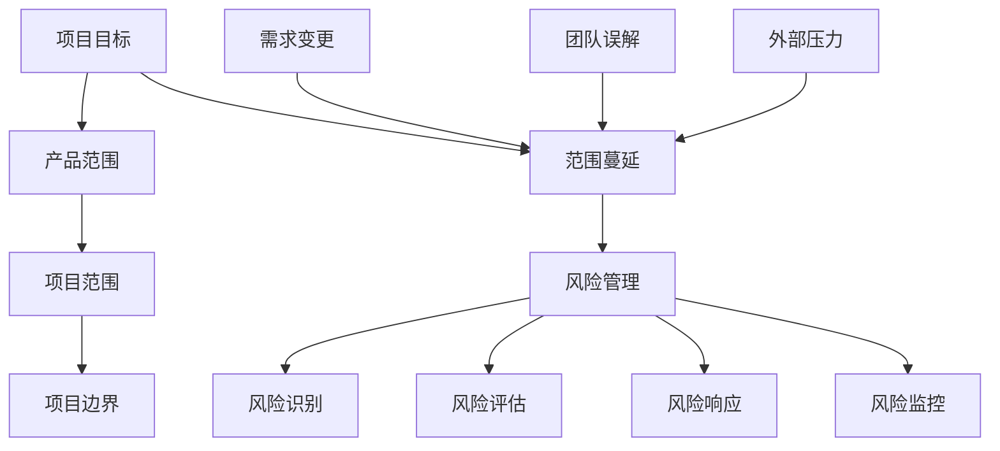
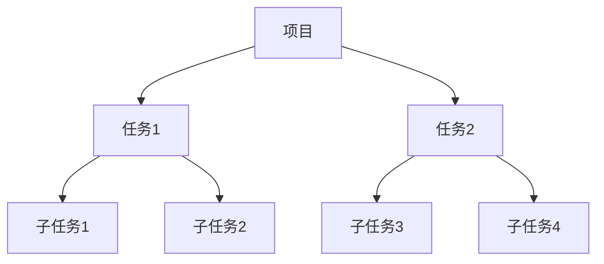
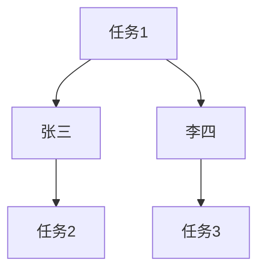
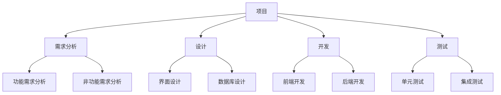
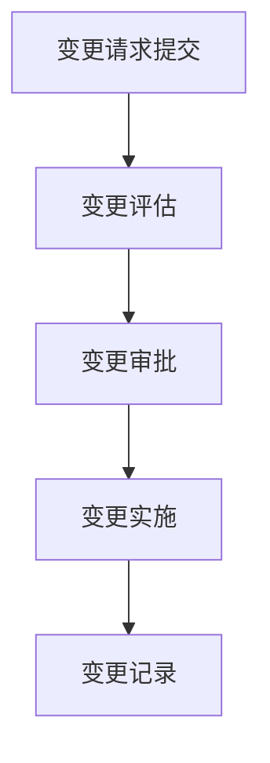

                 

### 引言

创业项目范围管理是一个至关重要的领域，它决定了创业项目能否在预期的时间和预算内成功交付。在创业环境中，资源的有限性和市场的不确定性使得有效的范围管理成为项目成功的关键因素。本文将探讨如何进行有效的创业项目范围管理，旨在为创业团队提供实用的指导和建议。

首先，我们将会定义创业项目范围管理的核心概念，包括其定义、重要性、核心组成部分和范围蔓延的风险管理。接着，我们将深入讨论项目范围的规划与定义，包括项目范围规划、创建项目范围文档和验证与确认项目范围。

随后，本文将介绍创业项目范围管理的工具与技术，包括工作分解结构（WBS）、产品分解和责任分配矩阵等。这些工具和技术将帮助团队更有效地管理项目范围，并防止范围蔓延。

在探讨挑战与解决方案部分，我们将分析范围蔓延的挑战，并提出预防与控制范围蔓延的措施。此外，我们将讨论处理范围变更的流程和分析方法。

文章的第四部分将重点讨论创业项目范围管理中的沟通与协作，强调有效沟通和团队协作在项目成功中的重要性。

为了更好地理解理论，本文还将通过一个案例研究来展示创业项目范围管理的实际应用。最后，我们将总结最佳实践和未来趋势，并提出对创业项目范围管理的整体总结和展望。

通过逐步分析和推理，本文希望为读者提供一个全面、深入和实用的创业项目范围管理指南。让我们开始这次探索之旅吧！

### 第1章：创业项目范围管理的核心概念

#### 1.1 创业项目范围管理的定义与重要性

创业项目范围管理是指确保项目团队在项目生命周期内清晰地理解和定义项目的范围，从而有效地管理项目的工作内容和成果。具体来说，它包括规划、定义、验证和确认项目的范围，以及管理项目范围的变更。

**定义：** 创业项目范围管理是项目管理的一个关键过程组，它涉及确定、记录、控制及管理项目及其交付成果的范围。这个范围包括项目的目标、可交付成果、任务和活动，以及项目的边界和限制条件。

**重要性：** 创业项目范围管理对于创业项目的成功至关重要，原因如下：

1. **明确目标和期望：** 范围管理帮助团队明确项目的目标和期望，确保所有团队成员都朝着同一方向努力。
2. **资源优化：** 通过清晰的范围定义，团队可以更有效地分配资源，避免资源浪费。
3. **风险管理：** 范围管理有助于识别和预防范围蔓延，减少项目风险。
4. **项目控制：** 清晰的项目范围有助于项目团队控制项目进展，确保项目在预算和时间限制内完成。
5. **客户满意：** 明确的项目范围有助于满足客户的期望，提高客户满意度。

#### 1.2 创业项目的核心组成部分

为了更好地理解创业项目范围管理，我们需要了解创业项目的核心组成部分，这些组成部分共同定义了项目的范围：

1. **产品目标：** 产品目标是项目要实现的具体结果，它通常是一个具体的、可度量的目标。例如，开发一款具有特定功能的手机应用。
2. **产品范围：** 产品范围是定义产品或服务的边界，它包括产品的功能、性能和限制条件。例如，一款手机应用的产品范围可能包括用户注册、登录、个人信息管理等功能。
3. **项目范围：** 项目范围是项目团队需要完成的所有工作内容的集合，包括产品开发、测试、部署和维护等任务。
4. **项目边界：** 项目边界是指项目所涉及的工作范围和责任范围的界限，它定义了项目的起点和终点。例如，一个项目的边界可能包括从需求分析到产品发布的一系列活动。

**示例：** 假设一个创业团队要开发一款社交媒体应用，其产品目标可能是“创建一个让用户可以轻松分享照片和视频的社交媒体平台”。这个目标明确了项目的方向。产品范围可能包括用户注册、照片上传、视频播放、评论互动等功能。项目范围则涵盖了需求分析、设计、开发、测试、部署和维护等所有相关任务。项目边界可能从需求收集开始，到应用上线结束。

#### 1.3 范围蔓延与风险管理

**范围蔓延的定义：** 范围蔓延是指在项目执行过程中，未经控制的项目范围扩大，导致项目任务增加、时间延长和成本超支。范围蔓延通常是由于项目需求的不明确、变更管理不当或客户需求的变化引起的。

**范围蔓延的识别与预防：**

- **识别：** 通过定期审查项目文档、会议记录和变更请求，项目团队可以识别范围蔓延的迹象。例如，频繁的需求变更、不断增加的任务列表和超出的预算都可能表明范围蔓延的发生。
- **预防：** 预防范围蔓延的策略包括：
  - **明确的范围定义：** 在项目初期，团队需要明确项目范围，并将其文档化。
  - **变更控制流程：** 制定并执行严格的变更控制流程，确保所有变更都经过评估和审批。
  - **客户沟通：** 保持与客户的持续沟通，确保他们了解项目的范围和限制。

**风险管理：** 范围蔓延对项目的影响可能包括延误、成本超支和质量下降。为了有效管理范围蔓延的风险，项目团队可以采取以下策略：

- **风险识别：** 通过项目规划和范围管理过程，识别可能导致范围蔓延的风险。
- **风险评估：** 评估每个风险的严重程度和可能性，确定优先级。
- **风险响应：** 制定应对策略，包括预防措施和应急计划。
- **风险监控：** 在项目执行过程中持续监控风险，并调整策略以应对新的风险。

通过实施有效的范围管理策略，创业团队可以降低范围蔓延的风险，确保项目在既定的范围、时间和预算内成功交付。

### 1.4 范围蔓延与风险管理的深度探讨

**范围蔓延的概念：** 范围蔓延（Scope Creep）是指在项目执行过程中，项目范围未经批准而不断扩大的现象。这种现象可能导致项目时间延长、成本增加、资源浪费，甚至导致项目失败。范围蔓延通常源于以下几个方面：

1. **需求变更：** 项目初期需求不够明确或需求随着项目进展而不断变化。
2. **外部压力：** 客户或利益相关者对项目提出新的需求或修改原有需求。
3. **团队误解：** 项目团队成员对项目范围的理解不一致，导致执行过程中产生偏差。
4. **项目管理不善：** 缺乏有效的变更控制流程和沟通机制。

**识别范围蔓延：** 项目团队需要定期审查项目文档、会议记录和变更请求，以识别范围蔓延的迹象。以下是一些常见的范围蔓延迹象：

- **不断增加的任务列表：** 项目任务持续增加，没有明确的截止日期。
- **超出的预算和时间：** 项目预算和时间超出预期，没有合理的解释。
- **频繁的需求变更：** 项目需求频繁变更，导致项目进展受阻。
- **资源紧张：** 项目资源（如人力、时间、预算）紧张，无法按计划完成任务。

**预防范围蔓延的策略：**

1. **明确范围定义：** 在项目初期，团队需要明确项目范围，并将其文档化。这包括详细记录项目的目标、可交付成果、任务和活动，以及项目的边界。
2. **变更控制流程：** 制定并执行严格的变更控制流程，确保所有变更都经过评估和审批。这包括变更请求的提交、评估、批准和文档记录。
3. **客户沟通：** 保持与客户的持续沟通，确保他们了解项目的范围和限制。定期更新客户关于项目进展和变更的信息，避免误解和额外的需求。
4. **项目管理培训：** 提供项目管理培训，提高团队成员对项目范围管理的认识和技能。

**风险管理：** 范围蔓延是一种典型的项目风险，它可能导致项目失败。为了有效管理范围蔓延的风险，项目团队可以采取以下策略：

1. **风险识别：** 在项目规划和范围管理过程中，识别可能导致范围蔓延的风险。例如，需求变更、客户压力、团队误解等。
2. **风险评估：** 评估每个风险的严重程度和可能性，确定优先级。这有助于团队集中资源应对最关键的风险。
3. **风险响应：** 制定应对策略，包括预防措施和应急计划。例如，对于需求变更，可以制定明确的变更评估和审批流程。
4. **风险监控：** 在项目执行过程中持续监控风险，并调整策略以应对新的风险。定期审查项目文档和变更记录，确保范围蔓延得到有效控制。

通过实施这些策略，项目团队可以降低范围蔓延的风险，确保项目在既定的范围、时间和预算内成功交付。

### 1.5 范围蔓延的影响及控制策略

**范围蔓延的影响：**

范围蔓延对创业项目的影响是多方面的，主要包括以下几个方面：

1. **时间延长：** 范围蔓延导致项目任务增加，从而延长项目的完成时间。这不仅会影响项目的进度，还可能导致项目延期交付。
2. **成本增加：** 范围蔓延可能导致项目成本超支。由于任务增加，需要额外投入人力、时间和资源，从而增加了项目的总成本。
3. **质量下降：** 范围蔓延可能使项目团队忙于处理新增的任务，导致对原有任务的关注度降低，从而影响项目的质量。
4. **资源紧张：** 范围蔓延可能导致项目资源（如人力、时间、预算）的紧张，影响项目的正常推进。

**控制策略：**

为了有效控制范围蔓延，项目团队可以采取以下策略：

1. **变更控制流程：** 制定并严格执行变更控制流程。所有范围的变更必须经过评估和审批，确保变更的合理性和必要性。
2. **范围文档更新：** 定期更新项目范围文档，确保其与项目的实际情况保持一致。这有助于项目团队更好地理解和管理项目范围。
3. **定期评审：** 定期召开项目评审会议，审查项目进展和变更情况。这有助于及时发现范围蔓延的迹象，并采取相应的措施。
4. **风险管理：** 加强风险管理，识别和评估可能导致范围蔓延的风险，并制定相应的应对策略。
5. **客户沟通：** 保持与客户的良好沟通，确保他们对项目范围和变更有清晰的了解。这有助于减少因需求变更导致的范围蔓延。
6. **资源优化：** 合理分配项目资源，避免资源过度紧张。通过优化资源利用，可以减少因资源不足导致的范围蔓延。

通过实施这些控制策略，项目团队可以更好地管理项目范围，降低范围蔓延的风险，确保项目在既定的范围、时间和预算内成功交付。

### 1.6 创业项目范围管理的核心概念联系图

为了更好地理解创业项目范围管理的核心概念，我们可以使用Mermaid流程图来展示这些概念之间的联系。



**说明：**

- **项目目标（A）**：确定项目要实现的具体结果。
- **产品范围（B）**：定义产品或服务的边界和功能。
- **项目范围（C）**：项目团队需要完成的所有工作内容。
- **项目边界（D）**：项目的起点和终点，定义项目的范围。
- **范围蔓延（E）**：未经控制的项目范围扩大，导致项目风险增加。
- **风险管理（F）**：识别、评估、响应和监控项目风险。
- **需求变更（G）**、**团队误解（H）**、**外部压力（I）**：可能导致范围蔓延的原因。
- **风险识别（J）**、**风险评估（K）**、**风险响应（L）**、**风险监控（M）**：风险管理的主要步骤。

通过这个Mermaid流程图，我们可以清晰地看到创业项目范围管理的各个核心概念之间的联系，有助于项目团队更好地理解和应用这些概念。

### 1.7 核心算法原理讲解

在创业项目范围管理中，核心算法原理的应用可以帮助项目团队更精确地识别和应对范围蔓延问题。以下是一个简单的伪代码示例，用于评估项目风险和预防范围蔓延。

```plaintext
function assessProjectRisk(scopeChangeList, riskThreshold):
    riskScore = 0
    for change in scopeChangeList:
        if change.importance > riskThreshold:
            riskScore += 1
        if change.frequency > riskThreshold:
            riskScore += 1
        if change.cost > riskThreshold:
            riskScore += 1
    return riskScore

function preventScopeCreep(scopeChangeList, riskManagementPlan):
    for change in scopeChangeList:
        if assessProjectRisk(change, riskThreshold) > 0:
            if riskManagementPlan.include("Change Control"):
                approveChange(change)
            if riskManagementPlan.include("Resource Allocation"):
                reallocateResources(change)
            if riskManagementPlan.include("Communication"):
                updateStakeholders(change)
        else:
            rejectChange(change)

function approveChange(change):
    # Update scope document
    # Re-plan project timeline
    # Re-allocate resources

function reallocateResources(change):
    # Identify available resources
    # Prioritize critical tasks
    # Adjust team assignments

function updateStakeholders(change):
    # Send notifications
    # Hold meetings
    # Provide updates on change impact
```

**说明：**

- **风险阈值（riskThreshold）**：设定一个风险阈值，用于判断范围变更是否会导致高风险。
- **范围变更列表（scopeChangeList）**：包含所有已识别的范围变更。
- **风险评分（riskScore）**：根据范围变更的重要程度、频率和成本计算风险评分。
- **风险管理计划（riskManagementPlan）**：定义预防范围蔓延的策略和措施。

通过这个伪代码，项目团队可以有效地评估项目风险，并采取相应的措施预防范围蔓延。这有助于确保项目在既定的范围、时间和预算内成功交付。

### 第2章：创业项目范围的规划与定义

#### 2.1 项目范围规划

项目范围规划是创业项目范围管理的重要步骤，它帮助项目团队明确项目的目标和范围，从而确保项目能够按计划进行。项目范围规划的过程包括以下几个方面：

1. **项目目标定义：** 首先，团队需要明确项目的目标，这些目标应该是具体的、可度量的，并与企业的战略目标相一致。例如，开发一款具有特定功能的手机应用，以满足市场需求。
2. **项目范围定义：** 在明确项目目标后，团队需要详细定义项目的范围，包括项目的可交付成果、任务和活动。项目范围定义应该尽可能详细，以便团队在执行过程中有明确的指导。
3. **项目边界确定：** 项目边界是指项目的起点和终点，它定义了项目的范围和责任。明确项目边界有助于避免项目范围蔓延和资源浪费。
4. **范围文档编制：** 编制项目范围文档，记录项目目标、范围和边界。范围文档是项目团队的重要参考文件，有助于确保所有成员对项目范围有共同的理解。

**项目范围规划的过程：**

1. **需求收集：** 通过与客户、利益相关者和团队成员进行交流，收集项目需求。
2. **需求分析：** 分析收集到的需求，确定项目目标和范围。
3. **范围定义：** 根据需求分析结果，明确项目的范围和可交付成果。
4. **边界确定：** 确定项目的边界，明确项目的起点和终点。
5. **范围文档编制：** 编制项目范围文档，记录项目目标、范围和边界。
6. **范围验证：** 通过与利益相关者的沟通，验证项目范围的准确性。
7. **范围确认：** 确认项目范围的可行性，确保项目能够在既定的范围内完成。

**范围规划的工具与方法：**

1. **工作分解结构（WBS）：** 工作分解结构是一种层次化的项目范围分解方法，它将项目任务分解为更小、更易于管理的部分。WBS有助于团队明确项目任务，并确保所有任务都被包含在项目范围内。
2. **产品分解：** 产品分解是将产品需求分解为具体的任务和功能模块。通过产品分解，团队可以更好地理解产品的功能，并确保所有功能都被纳入项目范围内。
3. **责任分配矩阵：** 责任分配矩阵是一种用于分配项目任务和责任的工具。它将项目任务与团队成员相关联，确保每个任务都有明确的负责人。

通过使用这些工具和方法，项目团队可以更有效地规划项目范围，确保项目在既定的范围内顺利执行。

### 2.2 创建项目范围文档

项目范围文档是创业项目范围管理的重要组成部分，它为项目团队提供了明确的指导，确保所有成员对项目的目标和范围有共同的理解。以下是创建项目范围文档的步骤和内容：

**步骤：**

1. **确定文档结构：** 首先，团队需要确定项目范围文档的结构，包括文档的章节、标题和内容。
2. **编写文档内容：** 根据文档结构，编写项目范围文档的内容，包括项目目标、范围、边界、任务和责任分配等。
3. **文档审核与修改：** 完成初稿后，团队成员和利益相关者对文档进行审核，提出修改意见，并进行修改。
4. **文档批准：** 审核修改后的文档需要得到项目主管或利益相关者的批准，确保文档的正式性和权威性。
5. **文档更新与维护：** 项目执行过程中，文档需要定期更新和维护，以反映项目实际进展和变更。

**内容：**

1. **项目简介：** 包括项目背景、目标、范围和关键里程碑。
2. **项目范围：** 详细描述项目的范围，包括项目的可交付成果、任务和活动。
3. **项目边界：** 明确项目的起点和终点，定义项目的责任范围。
4. **任务列表：** 列出项目的主要任务，包括任务的描述、负责人和截止日期。
5. **责任分配：** 使用责任分配矩阵，将项目任务分配给团队成员，确保每个任务都有明确的负责人。
6. **里程碑计划：** 制定项目的里程碑计划，包括关键任务的完成时间和交付日期。
7. **变更管理流程：** 描述项目的变更管理流程，包括变更请求的提交、评估、批准和文档记录。

通过创建详细的项目范围文档，项目团队可以确保项目在既定的范围内顺利执行，并有效管理项目变更。

### 2.3 验证与确认项目范围

**范围验证：** 范围验证是确保项目范围符合客户和利益相关者需求的重要步骤。验证过程包括以下几个方面：

1. **利益相关者参与：** 邀请客户和利益相关者参与范围验证，确保他们对项目的范围有共同的理解。
2. **范围文档审查：** 审查项目范围文档，检查其是否符合项目目标和需求。
3. **会议讨论：** 通过会议讨论，与利益相关者沟通，确保他们对项目的范围和目标有清晰的认识。
4. **问题反馈：** 收集利益相关者的问题和反馈，及时解决范围验证过程中发现的问题。

**范围确认：** 范围确认是确保项目范围可行和可执行的重要步骤。确认过程包括以下几个方面：

1. **技术可行性分析：** 对项目的技术可行性进行分析，确保项目团队具备实现项目目标所需的技能和资源。
2. **资源评估：** 评估项目所需的资源，包括人力、时间和预算，确保资源充足。
3. **风险分析：** 识别项目可能面临的风险，并制定相应的应对策略。
4. **里程碑确认：** 确认项目的关键里程碑，确保项目团队能够在规定的时间内完成项目任务。

通过范围验证和确认，项目团队可以确保项目范围符合客户和利益相关者的需求，并在既定的范围内可执行，从而降低项目风险，提高项目成功率。

### 2.4 范围变更管理

范围变更管理是创业项目范围管理的关键部分，它涉及识别、评估、批准和管理项目范围内的变更。有效的范围变更管理有助于确保项目在既定的范围、时间和预算内成功交付。

**变更请求的提交：** 项目团队和利益相关者可以通过变更请求（Change Request）的形式提出变更。变更请求应包括变更的描述、原因、预期影响和所需资源等信息。

**变更评估：** 项目团队对变更请求进行评估，确定变更的紧急程度、影响和可行性。评估过程包括以下几个方面：

1. **变更影响分析：** 分析变更对项目范围、进度、成本和资源的影响。
2. **风险评估：** 评估变更可能带来的风险，并制定相应的应对策略。
3. **成本评估：** 评估变更所需的额外成本，包括人力、时间和预算。
4. **优先级排序：** 根据变更的影响和紧急程度，对变更请求进行优先级排序。

**变更批准：** 变更请求需要经过项目主管或变更控制委员会的批准。批准过程应遵循严格的变更控制流程，确保变更的合理性和必要性。

**变更实施：** 一旦变更获得批准，项目团队应立即开始实施变更。变更实施包括以下几个方面：

1. **更新范围文档：** 更新项目范围文档，记录变更的内容和影响。
2. **调整项目计划：** 根据变更影响，调整项目计划，包括时间表、资源分配和任务安排。
3. **执行变更：** 实施变更所需的任务和活动，确保变更能够顺利执行。

**变更记录：** 变更记录是范围变更管理的重要部分，它包括变更请求、评估报告、批准文件和变更实施记录等。良好的变更记录有助于项目团队跟踪变更的历史和影响，并为未来项目提供参考。

通过实施有效的范围变更管理，项目团队可以更好地控制项目范围，确保项目在既定的范围、时间和预算内成功交付。

### 2.5 项目范围管理工具与技术

在创业项目中，使用合适的工具和技术可以大大提高项目范围管理的效率和质量。以下是一些常用的项目范围管理工具和技术：

#### 工作分解结构（WBS）

工作分解结构（Work Breakdown Structure, WBS）是一种层次化的项目范围分解方法，它将项目任务分解为更小、更易于管理的部分。WBS有助于项目团队明确项目的任务和责任，确保所有任务都被包含在项目范围内。

**应用场景：** WBS适用于各种类型的项目，特别是那些包含大量复杂任务的工程项目。

**结构：**


**示例：** 在一个软件开发项目中，WBS可能包括以下层级：
1. 项目
2. 需求分析
   - 功能需求
   - 非功能需求
3. 设计
   - 界面设计
   - 数据库设计
4. 开发
   - 前端开发
   - 后端开发
5. 测试
   - 单元测试
   - 集成测试
6. 部署
   - 系统部署
   - 系统上线

#### 产品分解

产品分解是将产品需求分解为具体的任务和功能模块。这种方法有助于项目团队更好地理解产品的功能和实现方式，确保所有功能都被纳入项目范围内。

**应用场景：** 产品分解适用于软件开发、硬件设计和创新产品开发等。

**步骤：**
1. 确定产品需求。
2. 将产品需求分解为功能模块。
3. 将功能模块分解为具体的任务。

**示例：** 在开发一款社交媒体应用时，产品分解可能包括以下步骤：
1. 确定产品需求：
   - 用户注册
   - 文章发布
   - 评论互动
   - 消息系统
2. 将产品需求分解为功能模块：
   - 用户模块
   - 内容模块
   - 社交模块
   - 消息模块
3. 将功能模块分解为具体的任务：
   - 用户模块：
     - 用户注册功能
     - 用户登录功能
     - 用户信息管理功能
   - 内容模块：
     - 文章发布功能
     - 文章编辑功能
     - 文章评论功能
   - 社交模块：
     - 关注功能
     - 互动功能
     - 社交圈功能
   - 消息模块：
     - 发送消息功能
     - 消息通知功能

#### 责任分配矩阵

责任分配矩阵（Responsibility Assignment Matrix, RAM）是一种用于分配项目任务和责任的工具。它将项目任务与团队成员相关联，确保每个任务都有明确的负责人。

**应用场景：** 责任分配矩阵适用于各种类型的项目，特别是那些需要明确任务责任和沟通的项目。

**结构：**


**示例：** 在一个软件开发项目中，责任分配矩阵可能包括以下内容：
- 任务1：张三（负责人），李四（协作者）
- 任务2：李四（负责人），张三（协作者）
- 任务3：王五（负责人）

通过使用这些工具和技术，项目团队可以更有效地规划和管理项目范围，确保项目在既定的范围、时间和预算内成功交付。

### 第3章：创业项目范围管理的工具与技术

在创业项目中，有效的范围管理工具与技术是确保项目顺利进行的关键。本章将详细介绍几种常用的工具和技术，包括工作分解结构（WBS）、产品分解和责任分配矩阵等，并探讨这些工具在范围管理中的应用和优势。

#### 3.1 工作分解结构（WBS）

工作分解结构（Work Breakdown Structure，WBS）是一种层次化的项目范围分解方法，它将项目任务分解为更小、更易于管理的部分。WBS不仅有助于项目团队明确项目的任务和责任，还能确保所有任务都被包含在项目范围内。

**应用场景：**

WBS适用于各种类型的项目，尤其是那些包含大量复杂任务的工程项目、软件开发项目和大型建筑项目。

**结构：**

WBS通常由以下几个层级组成：

1. **项目：** 项目的整体范围和目标。
2. **主要任务：** 项目的关键任务或阶段。
3. **子任务：** 主任务下的更小任务或活动。
4. **子子任务：** 子任务下的更细分的工作单元。

**示例：**

假设一个软件开发项目，其WBS结构可能如下：



**优势：**

- **清晰的任务分解：** WBS将复杂的项目任务分解为更小的单元，使项目团队能够明确每个任务的责任和完成时间。
- **便于任务跟踪：** 通过WBS，项目团队可以轻松地跟踪任务的进展情况，确保项目按时完成。
- **资源优化：** WBS有助于合理分配资源，避免资源浪费和重复工作。

#### 3.2 产品分解

产品分解是将产品需求分解为具体的任务和功能模块。这种方法有助于项目团队更好地理解产品的功能和实现方式，确保所有功能都被纳入项目范围内。

**应用场景：**

产品分解适用于软件开发、硬件设计和创新产品开发等领域，特别是那些涉及多个功能模块的项目。

**步骤：**

1. **确定产品需求：** 通过与客户和利益相关者的交流，收集并确定产品的需求。
2. **分解为功能模块：** 将产品需求分解为功能模块，每个模块代表一个主要功能。
3. **细分为具体任务：** 将功能模块进一步分解为具体的任务和活动。

**示例：**

在一个社交媒体应用开发项目中，产品分解步骤如下：

1. **确定产品需求：**
   - 用户注册
   - 文章发布
   - 评论互动
   - 消息系统
2. **分解为功能模块：**
   - 用户模块
   - 内容模块
   - 社交模块
   - 消息模块
3. **细分为具体任务：**
   - 用户模块：
     - 用户注册功能
     - 用户登录功能
     - 用户信息管理功能
   - 内容模块：
     - 文章发布功能
     - 文章编辑功能
     - 文章评论功能
   - 社交模块：
     - 关注功能
     - 互动功能
     - 社交圈功能
   - 消息模块：
     - 发送消息功能
     - 消息通知功能

**优势：**

- **功能清晰：** 通过产品分解，项目团队可以清晰地了解产品的各个功能模块，有助于提高开发效率。
- **任务明确：** 产品分解确保每个功能模块都有具体的任务和负责人，有助于任务分配和进度跟踪。
- **易于管理：** 产品分解有助于项目团队更好地管理项目范围，降低范围蔓延的风险。

#### 3.3 责任分配矩阵

责任分配矩阵（Responsibility Assignment Matrix，RAM）是一种用于分配项目任务和责任的工具。它将项目任务与团队成员相关联，确保每个任务都有明确的负责人。

**应用场景：**

责任分配矩阵适用于各种类型的项目，特别是那些需要明确任务责任和沟通的项目，如软件开发、市场营销和项目管理等。

**结构：**

责任分配矩阵通常以表格形式呈现，包含任务列和团队成员列。每个交叉点表示一个任务和成员之间的关系，用符号或颜色表示任务负责人的身份。

**示例：**


**优势：**

- **明确责任：** 通过责任分配矩阵，项目团队可以清晰地了解每个任务的责任人，确保任务执行到位。
- **促进协作：** 责任分配矩阵有助于团队成员之间建立良好的沟通和协作，提高工作效率。
- **便于追踪：** 责任分配矩阵使项目团队能够轻松地跟踪任务进展和责任人，确保项目按时完成。

#### 3.4 工具与技术总结

创业项目范围管理的工具与技术多种多样，不同的工具适用于不同的应用场景。以下是对本章介绍的几种工具和技术的总结：

- **工作分解结构（WBS）：** 适用于复杂项目，清晰的任务分解和便于任务跟踪。
- **产品分解：** 适用于功能复杂的项目，功能清晰和任务明确。
- **责任分配矩阵：** 适用于明确任务责任和促进协作。

通过合理选择和运用这些工具和技术，项目团队可以更有效地管理项目范围，确保项目在既定的范围、时间和预算内成功交付。

### 3.5 范围确认会议

范围确认会议是创业项目范围管理中的一个重要环节，其目的是确保项目团队和利益相关者对项目范围和目标的共识。以下是如何组织有效的范围确认会议的步骤和关键点：

**步骤：**

1. **准备会议议程：** 在会议前，明确会议的目的、议程和预期成果。议程应包括项目范围概述、范围文档审查、变更讨论和共识达成等环节。
2. **邀请利益相关者：** 邀请与项目范围相关的利益相关者参加会议，包括项目团队、客户、产品经理、项目经理和关键干系人。
3. **会议开始：** 开场介绍会议目的和议程，确保所有参与者对会议目标有共同的理解。
4. **范围文档审查：** 审查项目范围文档，讨论文档中的内容，包括项目的目标、范围、边界和任务等。
5. **变更讨论：** 讨论任何已识别的变更请求，评估其对项目范围的影响，并决定是否批准。
6. **共识达成：** 通过讨论和协商，确保所有参与者对项目范围和目标有共识，并记录共识的结果。
7. **会议结束：** 总结会议成果，明确后续行动项和责任，确保所有参与者对下一步行动有清晰的了解。

**关键点：**

1. **透明沟通：** 确保会议过程中所有参与者都有机会表达意见和提出问题，促进透明沟通。
2. **明确记录：** 会议讨论的结果应被明确记录，包括共识的内容和后续行动项，确保所有参与者对结果有共同的理解。
3. **定期召开：** 范围确认会议应定期召开，以跟踪项目范围的变更和进展。
4. **参与广泛：** 确保会议邀请的利益相关者代表范围广泛，确保项目的需求和理解能够得到全面的支持。
5. **文档更新：** 会议结束后，及时更新项目范围文档，确保文档反映最新的共识和变更。

通过组织有效的范围确认会议，项目团队可以确保项目范围和目标得到明确和广泛的共识，减少范围蔓延的风险，提高项目成功的可能性。

### 3.6 变更管理流程

在创业项目中，变更管理是确保项目顺利推进和控制项目范围蔓延的关键环节。一个有效的变更管理流程可以帮助项目团队及时识别、评估和处理项目中的变更请求。以下是一个典型的变更管理流程及其各个步骤的详细说明：

**变更管理流程：**

1. **变更请求提交：**
   - **步骤：** 项目团队成员或利益相关者发现项目范围需要变更时，应提交变更请求（Change Request，CR）。
   - **内容：** 变更请求应包括变更的描述、原因、预期影响、所需资源以及优先级等信息。
   - **工具：** 可以使用电子表格、项目管理软件或变更请求模板来记录和提交变更请求。

2. **变更评估：**
   - **步骤：** 项目团队对提交的变更请求进行评估，确定变更的紧急程度、影响和可行性。
   - **内容：** 评估过程应包括变更影响分析、成本评估、资源评估和风险评估等。
   - **工具：** 可以使用评估表格、风险评估模型等工具来帮助评估变更请求。

3. **变更审批：**
   - **步骤：** 变更请求需要经过项目主管或变更控制委员会（Change Control Board，CCB）的批准。
   - **内容：** 变更审批过程应遵循严格的变更控制流程，确保变更的合理性和必要性。
   - **工具：** 可以使用审批流程软件或变更审批表格来记录和跟踪变更审批过程。

4. **变更实施：**
   - **步骤：** 一旦变更获得批准，项目团队应立即开始实施变更。
   - **内容：** 变更实施包括更新范围文档、调整项目计划、执行变更任务等。
   - **工具：** 可以使用项目管理软件或变更日志来记录变更实施过程和进度。

5. **变更记录：**
   - **步骤：** 记录变更请求、评估报告、批准文件和变更实施记录等，以备后续参考。
   - **内容：** 变更记录应包括变更请求编号、变更描述、评估结果、批准日期、实施进度等信息。
   - **工具：** 可以使用变更记录表格、项目管理软件或变更日志来记录和管理变更。

**变更管理流程图：**



**示例：**

假设在一个软件开发项目中，项目团队发现需要新增一个功能模块。以下是变更管理流程的详细步骤：

1. **变更请求提交：** 产品经理提交一个变更请求，描述新增功能模块的需求、预期影响和所需资源。
2. **变更评估：** 项目团队对变更请求进行评估，确定变更的紧急程度和影响，评估结果认为该变更对项目有一定影响。
3. **变更审批：** 变更请求提交给变更控制委员会，经过讨论和评估，委员会批准该变更。
4. **变更实施：** 项目团队开始实施变更，包括更新项目计划、调整任务分配和开发新的功能模块。
5. **变更记录：** 记录变更请求的编号、描述、评估结果、批准日期、实施进度等信息，以备后续参考。

通过实施有效的变更管理流程，项目团队可以更好地控制项目变更，确保项目在既定的范围、时间和预算内成功交付。

### 3.7 范围管理计划

范围管理计划是创业项目范围管理的核心组成部分，它为项目团队提供了一个详细的指南，用于规划和管理项目范围。以下是一个典型的范围管理计划的步骤和内容：

**步骤：**

1. **确定范围管理目标：** 明确项目的范围管理目标，包括确保项目在既定的范围、时间和预算内完成，以及提高项目成功率和客户满意度。
2. **定义范围管理过程：** 确定项目的范围管理过程，包括范围规划、定义、验证、确认和变更管理。
3. **分配范围管理责任：** 明确项目团队成员和利益相关者的范围管理职责，确保每个任务都有明确的负责人。
4. **制定范围管理策略：** 根据项目特点和需求，制定相应的范围管理策略，如范围分解、任务分配、变更控制等。
5. **制定范围管理工具与方法：** 选择合适的范围管理工具和方法，如工作分解结构（WBS）、责任分配矩阵等，并说明如何使用这些工具和方法。
6. **制定范围管理计划文档：** 编写范围管理计划文档，记录上述步骤和内容，确保所有团队成员和利益相关者对范围管理计划有共同的理解。
7. **范围管理计划审批：** 范围管理计划需要经过项目主管或利益相关者的审批，确保计划的可行性和有效性。
8. **范围管理计划执行与监控：** 按照范围管理计划执行项目范围管理任务，并定期监控范围管理计划的执行情况，确保项目在既定的范围内顺利推进。

**内容：**

1. **范围管理目标：** 详细描述项目的范围管理目标，如确保项目在既定的范围内按时完成、提高项目成功率和客户满意度等。
2. **范围管理过程：** 说明项目的范围管理过程，包括范围规划、定义、验证、确认和变更管理，以及每个过程的详细步骤。
3. **范围管理策略：** 阐述项目团队将如何制定和实施范围管理策略，如范围分解、任务分配、变更控制等。
4. **范围管理工具与方法：** 介绍项目团队将使用的范围管理工具与方法，如工作分解结构（WBS）、责任分配矩阵等，并说明如何使用这些工具和方法。
5. **范围管理计划文档：** 记录范围管理计划的所有步骤和内容，包括范围管理目标、过程、策略和工具方法，确保项目团队和利益相关者对范围管理计划有共同的理解。
6. **范围管理计划审批：** 记录范围管理计划的审批过程，包括审批人、审批日期和审批意见等，确保计划的可行性和有效性。
7. **范围管理计划执行与监控：** 描述项目团队将如何执行范围管理计划，并定期监控范围管理计划的执行情况，确保项目在既定的范围内顺利推进。

通过制定和实施范围管理计划，项目团队可以更好地管理项目范围，确保项目在既定的范围、时间和预算内成功交付。

### 第4章：创业项目范围管理中的挑战与解决方案

#### 4.1 范围蔓延的挑战

在创业项目范围管理中，范围蔓延（Scope Creep）是一个普遍且严重的挑战。范围蔓延指的是未经批准的项目范围扩大，导致项目任务增加、时间延长和成本超支。以下是范围蔓延的几个主要挑战：

1. **需求变化：** 在项目执行过程中，客户或利益相关者可能会提出新的需求或修改原有需求，这些变更可能导致项目范围扩大。
2. **沟通不畅：** 如果项目团队与客户、利益相关者之间的沟通不畅，可能会导致需求理解不一致，进而引发范围蔓延。
3. **项目管理不善：** 缺乏有效的项目管理流程和变更控制机制，可能导致项目团队在面对变更时无法及时响应，从而引发范围蔓延。
4. **资源不足：** 项目团队资源不足，特别是在人力和时间资源紧张的情况下，难以有效控制项目范围。
5. **技术复杂性：** 项目技术复杂性高，可能导致项目范围难以准确界定，从而增加范围蔓延的风险。

#### 4.2 预防与控制范围蔓延

为了有效预防和控制范围蔓延，项目团队可以采取以下策略：

1. **明确项目范围：** 在项目初期，项目团队应与客户和利益相关者明确项目范围，确保所有人对项目的目标和范围有共同的理解。
2. **变更控制流程：** 制定严格的变更控制流程，确保所有范围变更都经过评估和批准。这包括变更请求的提交、评估、批准和文档记录。
3. **持续沟通：** 保持与客户和利益相关者的持续沟通，确保他们对项目的范围和变更有清晰的了解。定期更新项目进度和变更信息，避免误解和额外的需求。
4. **风险管理：** 识别和评估可能导致范围蔓延的风险，并制定相应的预防措施和应对策略。通过定期审查和监控风险，及时应对范围蔓延的迹象。
5. **资源优化：** 合理分配项目资源，确保项目团队能够在既定的时间内完成项目任务。通过优化资源利用，减少因资源不足导致的范围蔓延。
6. **项目管理培训：** 提供项目管理培训，提高团队成员对项目范围管理的认识和技能。通过培训，项目团队能够更好地应对范围蔓延的挑战。

#### 4.3 处理范围变更

在创业项目中，范围变更（Scope Change）是不可避免的。有效的范围变更处理策略可以帮助项目团队确保项目在既定的范围、时间和预算内成功交付。以下是如何处理范围变更的步骤：

1. **变更请求提交：** 一旦发现项目范围需要变更，项目团队成员或利益相关者应提交变更请求，详细描述变更的原因、预期影响和所需资源。
2. **变更评估：** 项目团队对变更请求进行评估，包括变更的影响分析、成本评估和资源评估等。评估过程应遵循严格的变更控制流程。
3. **变更批准：** 变更请求需要经过项目主管或变更控制委员会（Change Control Board，CCB）的批准。批准过程应确保变更的合理性和必要性。
4. **变更实施：** 一旦变更获得批准，项目团队应立即开始实施变更。变更实施包括更新项目计划、任务分配和资源调整等。
5. **变更记录：** 记录变更请求、评估报告、批准文件和变更实施记录等，以备后续参考。变更记录应包括变更请求编号、变更描述、评估结果、批准日期和实施进度等信息。

通过有效的范围变更处理策略，项目团队可以更好地控制项目范围，确保项目在既定的范围、时间和预算内成功交付。

### 4.4 处理范围变更的详细步骤

在创业项目中，范围变更是一项常见的任务，它涉及到对项目范围的调整，以适应新的需求或情况。为了确保范围变更的有效性和可控性，以下是一个详细的处理范围变更的步骤：

**步骤1：识别变更请求**

- **识别变更需求：** 项目团队或利益相关者发现项目范围需要调整时，应首先识别变更的需求。这可以通过定期的项目评审会议、客户反馈、市场变化或技术进步等方式实现。
- **记录变更请求：** 将变更请求文档化，记录变更请求的详细信息，包括变更的描述、理由、影响范围（如时间、成本、资源等）和所需的资源投入。

**步骤2：评估变更请求**

- **评估影响：** 项目团队对变更请求进行评估，确定变更对项目各个方面（如时间、成本、质量、风险等）的影响。评估过程中，可以使用风险评估矩阵、成本效益分析等方法来帮助决策。
- **征求意见：** 如果有必要，项目团队可以征求其他相关利益相关者的意见，如项目经理、产品经理、技术专家等，确保评估的全面性和准确性。

**步骤3：制定变更计划**

- **确定变更策略：** 根据评估结果，项目团队应制定相应的变更策略。这包括确定如何实施变更（如是否调整项目计划、分配额外资源等），以及如何管理变更过程中可能出现的问题。
- **制定变更计划：** 编制变更计划文档，详细描述变更的执行步骤、责任分配、时间表和资源需求。

**步骤4：变更审批**

- **提交变更申请：** 项目团队将变更请求和变更计划提交给变更控制委员会（Change Control Board，CCB）或项目主管进行审批。
- **审批变更：** CCB或项目主管对变更申请进行审查和批准。审批过程中，会考虑变更的必要性、可行性和对项目整体的影响。

**步骤5：实施变更**

- **执行变更：** 一旦变更获得批准，项目团队开始实施变更。执行过程中，应严格按照变更计划进行操作，确保变更的顺利进行。
- **监控变更：** 在变更实施过程中，项目团队应持续监控变更的进展和效果，确保变更按照计划进行。如果发现任何问题或偏差，应立即采取纠正措施。

**步骤6：变更记录**

- **记录变更：** 将变更请求、评估报告、批准文件、变更实施记录等文档化，并纳入项目文档库。这些记录将作为项目档案，为未来项目的变更管理提供参考。

**步骤7：后续跟踪**

- **跟踪变更效果：** 变更实施后，项目团队应持续跟踪变更的效果，评估变更是否达到预期目标，以及变更对项目整体的影响。
- **总结经验教训：** 对变更过程进行总结和反思，识别成功和不足之处，为未来的变更管理提供经验和教训。

通过以上详细的步骤，项目团队可以有效地处理范围变更，确保项目在既定的范围、时间和预算内成功交付。

### 4.5 范围变更的影响分析

在创业项目中，范围变更的影响分析是确保变更合理性和可控性的关键步骤。以下是如何进行范围变更的影响分析：

**步骤1：识别变更类型**

- **初始变更：** 项目启动后，利益相关者提出的需求变更或范围扩展。
- **修正变更：** 项目执行过程中，因项目进展或外部因素（如技术变更、市场变化等）导致的变更。
- **紧急变更：** 项目面临紧急情况（如安全问题、法律要求等）时需要立即执行的变更。

**步骤2：评估变更需求**

- **需求分析：** 通过与利益相关者的沟通，了解变更需求的背景和原因。收集变更的详细描述、预期目标和影响范围。
- **成本效益分析：** 评估变更所需的资源投入（如人力、时间、成本等），以及变更带来的潜在收益和风险。

**步骤3：影响分析**

- **时间影响：** 评估变更对项目进度的影响，包括延期时间、关键路径的改变等。
- **成本影响：** 分析变更对项目预算的影响，包括额外成本、成本节约或成本超支。
- **资源影响：** 考虑变更对项目资源的重新分配和调整，包括人员、设备、材料等。
- **质量影响：** 评估变更对项目质量的影响，包括产品质量、测试覆盖率、客户满意度等。
- **风险影响：** 分析变更带来的新风险，如技术复杂性增加、市场变化、法律合规性等。

**步骤4：制定应对策略**

- **变更方案：** 根据影响分析结果，制定相应的变更方案。包括变更的实施步骤、时间表、资源需求和管理策略。
- **风险评估：** 对变更方案进行风险评估，识别潜在的风险，并制定相应的应对措施。

**步骤5：变更审批**

- **提交变更请求：** 项目团队将变更请求和评估报告提交给变更控制委员会（CCB）或项目主管进行审批。
- **审批变更：** CCB或项目主管根据变更方案和风险评估结果，对变更请求进行审查和批准。审批过程中，会考虑变更的必要性、可行性和对项目整体的影响。

**步骤6：变更实施**

- **执行变更：** 一旦变更获得批准，项目团队开始实施变更。执行过程中，应严格按照变更计划和风险管理策略进行操作。
- **监控变更：** 在变更实施过程中，项目团队应持续监控变更的进展和效果，确保变更按照计划进行。如果发现任何问题或偏差，应立即采取纠正措施。

通过以上步骤，项目团队可以全面评估范围变更的影响，确保变更的合理性和可控性，从而在既定的范围、时间和预算内成功交付项目。

### 4.6 预防与控制范围蔓延的方法

在创业项目中，预防与控制范围蔓延是确保项目成功的关键。以下是一些有效的策略和方法，用于防止和应对范围蔓延：

**1. 明确项目范围：**
   - **定义明确的目标：** 项目启动时，与利益相关者明确项目的具体目标和范围，确保所有人对项目范围有共同的理解。
   - **文档化范围：** 将项目范围文档化，包括项目的可交付成果、任务和活动，以及项目的边界。这将有助于团队成员和利益相关者随时查阅。

**2. 变更控制流程：**
   - **建立变更控制委员会：** 设立变更控制委员会（CCB），负责审批所有范围变更。确保所有变更请求都经过评估和批准，防止未经授权的变更。
   - **严格的变更审批：** 对于任何变更请求，必须经过详细的评估和审批流程，确保变更的必要性和合理性。

**3. 沟通与协作：**
   - **持续沟通：** 保持与利益相关者的定期沟通，确保项目需求和变更的透明度。及时更新项目进度和变更信息，减少误解和额外的需求。
   - **跨职能团队：** 组建跨职能团队，确保项目团队成员来自不同的部门，能够从不同角度理解和控制项目范围。

**4. 风险管理：**
   - **识别风险：** 在项目初期，识别可能导致范围蔓延的风险，包括需求变更、资源不足、技术复杂性等。
   - **制定应对策略：** 针对识别的风险，制定预防措施和应对策略，确保项目能够在面临风险时保持稳定。

**5. 资源优化：**
   - **合理分配资源：** 确保项目团队在资源分配上合理，避免资源紧张导致范围蔓延。
   - **优先级管理：** 在资源有限的情况下，优先处理关键任务和活动，确保项目主要目标得到实现。

**6. 客户参与：**
   - **客户反馈：** 定期收集客户反馈，确保他们的需求得到满足，同时避免不必要的变更。
   - **客户参与度：** 通过客户参与度管理，确保客户了解项目的范围和限制，减少因客户需求变化导致的范围蔓延。

**7. 持续监控：**
   - **项目评审：** 定期进行项目评审，检查项目进度和范围，及时发现和应对可能的范围蔓延迹象。
   - **变更日志：** 维护变更日志，记录所有变更请求、评估结果和审批过程，确保变更得到有效控制。

通过实施这些策略和方法，项目团队可以更好地预防和控制范围蔓延，确保项目在既定的范围、时间和预算内成功交付。

### 4.7 案例研究：某创业公司范围蔓延的预防和控制

在本案例中，我们将探讨某创业公司在其软件开发项目中遇到的范围蔓延问题，以及他们如何通过有效的预防和控制策略来解决这些问题。

**案例背景：**

某创业公司计划开发一款企业级客户关系管理（CRM）系统。项目初期，公司明确了项目的目标：开发一款功能全面、易于使用的CRM系统，以帮助企业客户更好地管理其销售、市场和客户服务流程。项目团队由产品经理、项目经理、软件开发人员和测试人员组成。

**范围蔓延的迹象：**

在项目执行过程中，项目团队发现以下迹象表明范围蔓延正在发生：

1. **需求不断增加：** 客户不断提出新的功能需求，如增强报告功能、定制化界面和集成第三方服务。
2. **项目延期：** 项目进度逐渐落后，导致交付时间延长。
3. **成本超支：** 项目预算不断被突破，团队开始面临资源紧张的问题。

**预防和控制策略：**

1. **明确项目范围：**
   - 项目团队与客户进行了详细的沟通，明确了CRM系统的核心功能和基本需求，并将其文档化。
   - 制定了详细的项目范围文档，包括可交付成果、任务列表和边界定义。

2. **变更控制流程：**
   - 建立了变更控制委员会（CCB），负责评估和批准所有范围变更请求。
   - 对于任何变更请求，团队进行了严格的评估，包括时间、成本和资源影响，并确保所有变更都经过审批。

3. **持续沟通：**
   - 定期召开项目评审会议，与客户沟通项目进展和变更情况。
   - 使用项目管理软件实时更新项目文档，确保团队成员和利益相关者对项目范围有共同的理解。

4. **风险管理：**
   - 识别和评估了可能导致范围蔓延的风险，如需求变更和资源不足。
   - 针对每个风险，制定了预防措施和应对策略，如制定更灵活的变更控制流程和提前准备备用资源。

5. **资源优化：**
   - 对项目资源进行了重新分配，确保关键任务和活动得到优先处理。
   - 与第三方服务提供商合作，利用外部资源来补充项目团队的能力。

6. **客户参与度管理：**
   - 提高客户的参与度，使其更清楚地了解项目的范围和限制，减少因需求变更导致的范围蔓延。

**案例结果：**

通过实施上述预防和控制策略，项目团队成功遏制了范围蔓延：

1. **项目进度恢复：** 项目团队重新调整了项目计划，确保项目按计划进行，避免了进一步的延期。
2. **成本控制：** 通过优化资源利用和有效管理变更，项目成本得到了有效控制，避免了预算超支。
3. **客户满意度提升：** 客户对项目的进展和变更有了更好的理解和掌控，客户满意度显著提升。

**案例启示：**

本案例表明，通过有效的预防和控制策略，创业公司可以成功地管理项目范围，避免范围蔓延带来的负面影响。关键在于明确的范围定义、严格的变更控制流程、持续沟通和有效的风险管理。通过这些策略，项目团队能够在有限的资源下，实现项目目标并满足客户需求。

### 第5章：创业项目范围管理中的沟通与协作

#### 5.1 沟通的重要性

在创业项目范围管理中，沟通是确保项目成功的关键因素之一。有效的沟通可以促进团队成员之间的协作，确保所有人对项目的目标、范围和进展有共同的理解。以下将讨论沟通在范围管理中的作用、常见的沟通障碍以及如何克服这些障碍。

**沟通在范围管理中的作用：**

1. **确保范围明确：** 通过有效的沟通，项目团队可以确保所有成员对项目的目标和范围有共同的理解，从而避免范围蔓延。
2. **促进团队协作：** 沟通可以帮助团队成员更好地协作，共同解决问题和应对挑战，确保项目按计划进行。
3. **提高客户满意度：** 与客户的持续沟通有助于项目团队更好地了解客户需求，确保项目交付的产品或服务能够满足客户的期望。
4. **风险管理：** 通过沟通，项目团队可以及时发现和解决潜在的问题和风险，降低项目失败的风险。

**常见的沟通障碍：**

1. **信息不对称：** 项目团队成员或利益相关者之间可能存在信息不对称，导致对项目的理解不一致。
2. **语言障碍：** 团队成员可能来自不同的背景和文化，导致语言障碍和沟通困难。
3. **时间差异：** 分布在不同时区的团队成员可能面临沟通困难，影响项目的进展。
4. **优先级冲突：** 项目团队成员可能在任务优先级上存在冲突，导致沟通效率低下。

**如何克服沟通障碍：**

1. **建立明确的沟通机制：** 项目团队应建立明确的沟通机制，包括定期会议、邮件更新、即时通讯工具等，确保信息及时传递。
2. **使用可视化工具：** 通过图表、流程图和演示文稿等可视化工具，帮助团队成员更好地理解和传达信息。
3. **提供培训：** 提供沟通技巧和跨文化培训，提高团队成员的沟通能力。
4. **鼓励反馈：** 鼓励团队成员提供反馈，确保沟通渠道畅通，及时解决问题。
5. **分配沟通责任：** 明确团队成员的沟通责任，确保每个任务都有明确的沟通责任人，提高沟通效率。

通过有效的沟通策略，项目团队可以克服沟通障碍，确保项目范围管理的顺利进行，从而提高项目的成功率。

### 5.2 有效沟通的策略

在创业项目范围管理中，有效的沟通策略对于项目的成功至关重要。以下是一些关键策略，帮助项目团队提高沟通效率，确保项目目标、范围和进展得到有效传达和执行。

**1. 明确沟通目标**

在每次沟通之前，明确沟通的目标和预期成果。确保所有参与者都了解沟通的主题和目的，避免沟通过程中的误解和混淆。

**2. 选择适当的沟通工具**

根据沟通内容和目标，选择合适的沟通工具。例如，对于复杂的信息，可以采用演示文稿或图表来传达；对于实时沟通，可以使用即时通讯工具或电话会议。

**3. 持续沟通**

保持与团队成员和利益相关者的持续沟通，确保信息的及时传递和问题的快速解决。定期召开项目会议、更新项目文档，以及利用沟通工具保持项目信息的同步。

**4. 鼓励双向沟通**

鼓励团队成员之间进行双向沟通，不仅表达自己的观点，也要倾听他人的意见。这有助于建立团队间的信任和理解，减少冲突和误解。

**5. 提供反馈渠道**

为团队成员提供反馈渠道，让他们能够提出问题、意见和建议。通过这种方式，可以及时发现和解决潜在的问题，提高项目沟通的透明度和效率。

**6. 明确责任和角色**

在沟通中明确每个成员的责任和角色，确保每个任务都有明确的负责人。这有助于提高沟通的效率，确保项目任务的顺利执行。

**7. 跨文化沟通**

对于跨国团队，重视跨文化沟通的重要性。了解团队成员的文化背景和沟通习惯，采用适合的文化敏感沟通方式，以减少沟通障碍。

通过实施这些有效沟通策略，项目团队可以更好地协调工作，确保项目范围管理的顺利进行，从而提高项目的成功率。

### 5.3 团队协作与共识建设

在创业项目范围管理中，团队协作和共识建设是确保项目成功的关键因素。一个高效的团队可以通过协作和共识，确保项目目标清晰、任务明确，并在项目执行过程中克服各种挑战。以下是如何促进团队协作和共识建设的方法：

**1. 明确团队目标**

确保所有团队成员都明确项目的目标和预期成果。通过定期的团队会议和目标回顾，确保团队成员对项目的方向和目标保持一致。

**2. 分配明确的角色和责任**

为每个团队成员分配明确的角色和责任，确保每个任务都有负责人。这有助于提高团队的效率和责任感，避免任务重叠和责任不清的问题。

**3. 促进开放和诚实的沟通**

鼓励团队成员之间进行开放和诚实的沟通，建立信任和尊重。定期举行团队会议，分享项目进展、问题和解决方案，确保所有成员都对项目的进展有清晰的了解。

**4. 建立团队规范**

制定团队规范和价值观，确保团队成员在合作过程中遵守共同的规则和行为准则。这有助于建立团队文化，提高协作效率。

**5. 利用协作工具**

使用协作工具（如Trello、Jira、Slack等）来跟踪项目进度、任务分配和沟通。这些工具可以帮助团队成员实时更新项目信息，确保协作的顺畅进行。

**6. 促进跨职能合作**

鼓励跨职能团队的协作，确保团队成员能够从不同的角度看待项目问题和挑战。这有助于提高团队的创新能力和解决问题的能力。

**7. 定期团队建设活动**

组织定期的团队建设活动，如团队建设游戏、培训课程和社交活动，增强团队成员之间的互动和信任。这有助于建立团队凝聚力和协作精神。

**8. 共识建设**

通过团队讨论和共识建设会议，确保所有成员对项目的目标、范围和策略有共同的理解。共识建设有助于减少误解和冲突，提高团队的合作效率。

通过实施这些方法，项目团队可以更好地协作，建设共识，确保项目在既定的范围、时间和预算内成功交付。

### 第6章：创业项目范围管理的案例研究

#### 6.1 案例背景介绍

本案例研究将探讨一家创业公司——SmartCo——在开发其智能健康监测设备项目中的范围管理实践。SmartCo是一家专注于智能健康监测设备的初创公司，旨在通过创新的技术帮助用户更好地管理自己的健康状况。项目目标是开发一款能够实时监测用户心率、血压和睡眠质量的可穿戴设备，并为其提供数据分析和管理功能。

**项目挑战：**

在项目启动阶段，SmartCo面临以下几个主要挑战：

1. **需求不确定性：** 由于市场对智能健康监测设备的需求不断变化，客户的需求也变得不确定。
2. **资源限制：** 作为一家初创公司，SmartCo在人力、时间和预算方面存在资源限制。
3. **技术复杂性：** 开发智能健康监测设备需要复杂的技术支持，包括生物传感器技术、数据分析算法和无线通信模块等。

#### 6.2 项目范围管理实践

为了应对这些挑战，SmartCo采取了一系列范围管理实践：

1. **明确项目目标：** 项目团队与公司高层和管理层进行了深入沟通，明确了项目的目标，即开发一款功能全面、用户友好的智能健康监测设备。

2. **需求收集与整理：** 项目团队通过市场调研、用户访谈和竞品分析，收集了潜在用户的需求。这些需求被整理成一份详细的需求文档，并进行了优先级排序。

3. **范围文档编制：** 基于需求文档，项目团队编制了一份详细的项目范围文档，包括项目的可交付成果、任务列表和边界定义。该文档作为项目范围管理的基准，用于后续的项目执行和变更控制。

4. **范围验证：** 项目团队与客户和利益相关者进行了多次会议，验证了项目范围的准确性。通过这些会议，项目团队确保了所有利益相关者对项目范围和目标有共同的理解。

5. **变更管理：** 项目团队建立了严格的变更控制流程，任何需求变更都必须经过评估和批准。在项目执行过程中，项目团队定期审查变更请求，确保变更的必要性和合理性。

#### 6.3 范围确认

为了确保项目范围的确认，SmartCo采取以下措施：

1. **里程碑评审：** 项目团队在项目的关键里程碑点进行评审，评估项目进展和范围实现情况。每次评审都邀请利益相关者参与，确保项目范围符合预期。

2. **持续沟通：** 项目团队与客户和利益相关者保持了持续的沟通，确保项目进展和变更信息透明。通过定期的项目更新会议，项目团队及时解决了客户的需求变化和技术挑战。

3. **范围变更控制：** 对于任何范围变更，项目团队都进行了严格的评估和批准。确保每个变更都对项目目标、范围和预算有明确的影响分析。

#### 6.4 案例分析与讨论

通过以上范围管理实践，SmartCo在项目范围内成功交付了智能健康监测设备。以下是案例分析的几个关键点：

1. **需求管理：** 通过明确的需求收集和整理，SmartCo确保了项目开发的方向和用户需求的一致性。有效的需求管理有助于避免项目范围的蔓延。

2. **范围文档的重要性：** 范围文档作为项目范围管理的基准，为项目团队提供了明确的指导。它有助于确保所有成员对项目目标和范围有共同的理解。

3. **变更控制：** 严格的变更控制流程确保了项目在既定的范围内进行。任何需求变更都经过仔细评估和批准，避免了不必要的时间和资源浪费。

4. **利益相关者沟通：** 通过持续的利益相关者沟通，项目团队确保了项目的透明度和客户满意度。利益相关者的参与有助于及时发现和解决问题。

讨论部分，可以从以下几个方面展开：

- **范围管理的成功因素：** 分析SmartCo范围管理的成功因素，如明确的项目目标、有效的需求管理、严格的变更控制和持续的沟通。
- **范围管理的改进空间：** 提出SmartCo在范围管理中可能存在的改进空间，如更精细的范围定义、更灵活的变更管理流程等。
- **范围管理的经验教训：** 总结SmartCo范围管理的经验教训，为其他创业项目提供借鉴。

通过这个案例研究，我们可以看到，有效的范围管理对于创业项目的成功至关重要。SmartCo在项目范围管理中的实践为我们提供了一个实用的参考，帮助其他创业团队更好地管理项目范围，确保项目在既定的范围、时间和预算内成功交付。

### 第7章：创业项目范围管理的最佳实践与未来趋势

#### 7.1 最佳实践总结

在创业项目范围管理的实践中，已经有许多成功的案例和经验教训可以总结。以下是一些关键的最佳实践，这些实践对于确保项目在既定的范围、时间和预算内成功交付至关重要：

1. **明确项目目标：** 在项目启动阶段，与利益相关者明确项目目标，确保所有人对项目方向和期望有共同的理解。

2. **需求管理：** 通过市场调研、用户访谈和竞品分析，收集并整理需求，确保项目开发的方向和用户需求一致。

3. **范围文档编制：** 编制详细的项目范围文档，包括项目的可交付成果、任务列表和边界定义。范围文档是项目执行和变更管理的基准。

4. **范围验证与确认：** 通过利益相关者会议和里程碑评审，验证和确认项目范围的准确性，确保项目范围符合预期。

5. **变更控制：** 建立严格的变更控制流程，任何需求变更都经过评估和批准，确保变更的必要性和合理性。

6. **持续沟通：** 保持与利益相关者的持续沟通，确保项目进展和变更信息透明，及时发现和解决问题。

7. **资源优化：** 合理分配项目资源，避免资源浪费和过度紧张，确保项目团队能够高效工作。

8. **风险管理：** 识别和评估可能导致范围蔓延的风险，并制定相应的预防措施和应对策略。

通过实施这些最佳实践，创业项目团队可以更好地管理项目范围，降低范围蔓延的风险，确保项目在既定的范围内成功交付。

#### 7.2 未来趋势探讨

随着技术的不断进步和市场环境的变化，创业项目范围管理的未来趋势也在不断演变。以下是一些值得关注的未来趋势：

1. **数字化和自动化工具：** 随着人工智能和机器学习技术的发展，范围管理的工具和方法将变得更加智能化和自动化。例如，使用AI算法自动识别和评估范围变更的影响。

2. **敏捷范围管理：** 敏捷开发方法在创业项目中越来越受欢迎。未来，敏捷范围管理将成为主流，注重快速响应需求变化，灵活调整项目范围。

3. **数据驱动决策：** 数据分析将成为范围管理的重要工具。通过大数据分析和预测模型，项目团队可以更准确地预测需求变化和项目风险，从而更有效地管理项目范围。

4. **跨领域协作：** 随着全球化的发展，创业项目团队将越来越多地由来自不同领域和文化背景的成员组成。跨领域协作和沟通将成为范围管理的重要趋势。

5. **可持续发展：** 创业项目将更加注重可持续发展和环境责任。项目范围管理将纳入更多的可持续发展目标和指标，确保项目对社会和环境的影响最小化。

6. **区块链技术的应用：** 区块链技术在范围管理中的应用有望提高项目透明度和安全性，确保变更记录的可追溯性和不可篡改性。

通过关注这些未来趋势，创业项目团队可以更好地适应市场变化，提高项目范围管理的效率和效果，从而在竞争中脱颖而出。

### 7.3 结论与展望

创业项目范围管理是确保项目成功交付的关键因素。通过明确项目目标、需求管理、范围文档编制、范围验证与确认、变更控制和持续沟通等最佳实践，项目团队可以更好地管理项目范围，降低范围蔓延的风险。未来，随着数字化、自动化工具的普及和敏捷开发方法的兴起，创业项目范围管理将变得更加智能化和灵活。我们期待项目团队能够不断探索和创新，提高项目范围管理的效率和效果，推动创业项目的成功。希望本文能为创业项目范围管理提供有价值的指导和启示。

### 附录A：创业项目范围管理常用工具与资源

#### A.1 工具介绍

**1. 工作分解结构（WBS）：**
   - **定义：** WBS是一种层次化的项目范围分解方法，将项目任务分解为更小、更易于管理的部分。
   - **特点：** 结构清晰，便于任务分配和进度跟踪。
   - **使用场景：** 适用于各种类型的项目，尤其是复杂项目。

**2. 责任分配矩阵（RAM）：**
   - **定义：** RAM是一种用于分配项目任务和责任的工具，将项目任务与团队成员相关联。
   - **特点：** 明确责任，促进协作，提高工作效率。
   - **使用场景：** 适用于需要明确任务责任的项目，如软件开发、市场营销等。

**3. 项目管理软件：**
   - **定义：** 项目管理软件是一种用于规划、跟踪和报告项目进展的工具。
   - **特点：** 功能丰富，支持多种项目管理方法，便于团队协作。
   - **使用场景：** 适用于各类项目，如创业项目、软件开发项目、建筑项目等。

**4. 产品分解工具：**
   - **定义：** 产品分解工具用于将产品需求分解为具体的任务和功能模块。
   - **特点：** 功能明确，便于任务分配和项目跟踪。
   - **使用场景：** 适用于产品开发项目，如软件开发、硬件设计等。

#### A.2 资源推荐

**1. 参考书籍：**
   - **《项目管理知识体系指南（PMBOK指南）》**
     - 作者：美国项目管理协会（PMI）
     - 评价：权威的项目管理指南，涵盖项目范围管理的各个方面。

   - **《敏捷项目管理：实践指南》**
     - 作者：麦克·哈特（Mike Cohn）
     - 评价：介绍敏捷开发方法在项目范围管理中的应用。

   - **《创业项目实战：从0到1的创业之路》**
     - 作者：史蒂夫·布兰克（Steve Blank）
     - 评价：提供创业项目管理的实战经验和策略。

**2. 在线资源：**
   - **PMI官方网站（www.pmi.org）：** 提供项目管理知识、工具和资源。
   - **敏捷联盟官方网站（www.agilealliance.org）：** 提供敏捷开发方法和资源。
   - **GitHub（www.github.com）：** 提供开源项目代码和文档，有助于学习和实践项目范围管理。
   - **Project Management Templates（www.projectmanagementtemplates.com）：** 提供各种项目管理模板和工具。

通过使用这些工具和资源，项目团队可以更好地进行创业项目范围管理，提高项目的成功率和效率。

### 结尾

感谢您阅读《如何进行有效的创业项目范围管理》这篇文章。通过本文，我们详细探讨了创业项目范围管理的核心概念、规划与定义、工具与技术、挑战与解决方案，以及沟通与协作的重要性。我们通过案例研究展示了范围管理的实际应用，并总结了最佳实践和未来趋势。希望这些内容能帮助您更好地理解创业项目范围管理，并在实际项目中取得成功。

最后，再次感谢您的阅读。我们期待您的反馈和建议，以便我们不断改进和完善我们的内容。祝您在创业项目范围管理方面取得卓越的成绩！作者：AI天才研究院/AI Genius Institute & 禅与计算机程序设计艺术/Zen And The Art of Computer Programming。

