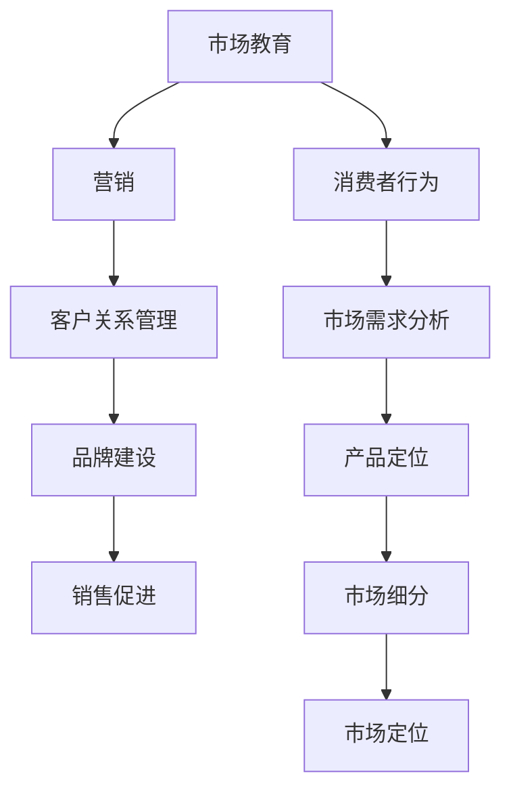

                 

### 第1章：市场教育的概念与重要性

市场教育是一种营销策略，旨在通过提供有价值的、易于理解的信息，帮助潜在客户了解产品或服务的价值、优势和适用场景。其目的是消除潜在客户对产品或服务的疑虑，增强他们对品牌的信任，并促使他们采取购买行动。

#### **1.1 市场教育的定义与内涵**

市场教育的定义可以概括为：通过传播知识和信息，帮助消费者更好地理解产品或服务的特点、使用方法和价值，从而提高他们的购买意愿和满意度。具体来说，市场教育包括以下几个方面的内容：

1. **知识传播**：向消费者传递与产品或服务相关的知识，如产品功能、应用场景、使用方法等。
2. **意识提升**：通过宣传和推广，提高消费者对品牌和产品的认知度，增强品牌形象。
3. **疑虑消除**：针对消费者可能存在的疑虑和担忧，提供专业的解答和建议，帮助他们做出更明智的购买决策。
4. **信任建立**：通过提供可靠的信息和专业的服务，增强消费者对品牌和产品的信任感。

#### **1.2 市场教育在营销中的地位与作用**

市场教育在营销中占据着重要的地位，其作用主要体现在以下几个方面：

1. **提高购买意愿**：通过市场教育，消费者能够更深入地了解产品或服务的价值，从而提高他们的购买意愿。
2. **提升品牌形象**：市场教育有助于提高消费者对品牌的认知度和好感度，增强品牌形象。
3. **增强客户忠诚度**：通过市场教育，消费者对产品或服务的信任感增强，从而提高客户忠诚度。
4. **降低营销成本**：市场教育有助于减少消费者对产品的疑虑和担忧，降低后续的客服成本和退货率。
5. **促进产品创新**：市场教育可以收集消费者对产品或服务的反馈和建议，为企业提供创新的思路和方向。

#### **1.3 市场教育的分类与特点**

市场教育可以从不同角度进行分类，根据目的和手段，可以将其分为以下几种类型：

1. **产品教育**：主要针对产品的特点、使用方法和价值进行宣传，帮助消费者更好地了解产品。
2. **品牌教育**：旨在提升品牌知名度和形象，使消费者对品牌产生认同感。
3. **渠道教育**：针对销售渠道进行培训和教育，提高销售人员的专业素养和销售技巧。
4. **消费者教育**：通过提供与产品或服务相关的知识和信息，帮助消费者提高购买决策能力。

不同类型的市场教育具有不同的特点：

- **产品教育**：强调产品的实用性和优势，注重消费者的实际体验。
- **品牌教育**：注重品牌形象的塑造，提高品牌在消费者心中的地位。
- **渠道教育**：侧重于销售人员的培训，提高他们的销售能力和服务水平。
- **消费者教育**：关注消费者的需求和心理，提供有价值的信息，帮助他们做出更好的购买决策。

### **总结**

市场教育作为一种重要的营销策略，具有广泛的内涵和多样的形式。通过有效的市场教育，企业可以提升产品或服务的竞争力，增强品牌形象，提高客户满意度，从而实现长期的市场发展和品牌价值提升。在接下来的章节中，我们将进一步探讨市场教育的目标、受众分析以及策略规划等内容，以帮助读者更全面地了解市场教育的实践方法和技巧。

### **引用**

- 科特勒，P. (2016). 《市场营销管理》（第15版）. 人民邮电出版社。
- 罗斯，S. (2018). 《消费者行为学》（第9版）. 中国人民大学出版社。

---

markdown


### **伪代码**

```python
def MarketEducation():
    # 知识传播
    SpreadKnowledge()

    # 意识提升
    EnhanceAwareness()

    # 疑虑消除
    RemoveDoubts()

    # 信任建立
    BuildTrust()

    # 提高购买意愿
    IncreasePurchaseIntent()

    # 提升品牌形象
    ImproveBrandImage()

    # 增强客户忠诚度
    EnhanceCustomerLoyalty()

    # 降低营销成本
    ReduceMarketingCost()

    # 促进产品创新
    PromoteProductInnovation()
```

### **数学模型与公式**

$$
Y = \beta_0 + \beta_1 \cdot ProductFeatures + \beta_2 \cdot CustomerPerception + \beta_3 \cdot PriceSensitivity + \epsilon
$$

其中：
- $Y$：消费者的购买意愿
- $\beta_0$：常数项
- $\beta_1$：产品特点对购买意愿的影响
- $\beta_2$：消费者对产品的感知对购买意愿的影响
- $\beta_3$：价格敏感度对购买意愿的影响
- $\epsilon$：误差项

### **举例说明**

假设有一个消费者，其对产品的特点感知为80%，价格敏感度为中等，产品特点对购买意愿的影响系数为0.3，消费者对产品的感知对购买意愿的影响系数为0.2，价格敏感度对购买意愿的影响系数为-0.1。那么，该消费者的购买意愿预测值为：

$$
Y = 1 + 0.3 \cdot 80 + 0.2 \cdot 80 - 0.1 \cdot 50 = 1 + 24 + 16 - 5 = 34
$$

因此，该消费者的购买意愿为34分（假设满分为100分）。

### **总结**

市场教育是企业营销策略的重要组成部分，通过对产品知识、品牌形象、消费者信任等的传播，可以有效地提升消费者的购买意愿和满意度。在接下来的章节中，我们将进一步探讨市场教育的目标设定、受众分析以及具体的实施策略。

---

### **1.4 市场教育的发展历程**

市场教育作为一个营销概念，其发展历程可以追溯到20世纪初期。当时，企业开始意识到通过教育和沟通来提升消费者对产品的认知度和信任度的重要性。以下是市场教育发展的几个关键阶段：

#### **1.4.1 初期阶段（20世纪20年代至40年代）**

在初期阶段，市场教育主要侧重于产品的基本功能和使用方法的传播。企业通过广告、宣传册和示范等方式，向消费者介绍产品，以提高产品的市场接受度。

#### **1.4.2 成长阶段（20世纪50年代至70年代）**

随着市场营销理论的不断完善，市场教育逐渐成为企业营销策略的一部分。此阶段，市场教育开始关注消费者的需求和痛点，通过更深入的市场调研和数据分析，企业能够更精准地传播产品信息。

#### **1.4.3 现代阶段（20世纪80年代至今）**

进入现代阶段，市场教育在技术进步和互联网的推动下，经历了深刻的变革。企业开始利用数字化工具，如社交媒体、在线课程、虚拟现实等，进行更为个性化和互动的市场教育。同时，数据驱动的市场教育策略，使企业能够更高效地评估市场教育的效果，并进行持续优化。

#### **1.4.4 趋势分析**

当前，市场教育呈现出以下发展趋势：

1. **内容多样化**：企业不仅提供产品知识，还提供行业趋势、解决方案等多元化内容。
2. **个性化定制**：通过大数据分析，企业能够为不同消费者提供个性化的市场教育内容。
3. **互动性增强**：虚拟现实、增强现实等技术的应用，使市场教育更加互动和沉浸式。
4. **数据驱动**：市场教育策略更加注重数据分析和效果评估，以实现精准营销。

### **1.5 市场教育的战略意义**

市场教育不仅是提升产品销量的手段，更是一种长期的战略投资。其战略意义主要体现在以下几个方面：

1. **建立品牌信任**：通过持续的市场教育，企业能够建立与消费者的信任关系，增强品牌的忠诚度。
2. **引导消费行为**：市场教育能够帮助消费者更好地理解产品的价值，从而引导其购买行为。
3. **提升产品竞争力**：市场教育有助于消费者认识到产品的独特优势，从而提高产品的市场竞争力。
4. **促进持续创新**：市场教育能够收集消费者对产品和服务的反馈，为企业提供创新的思路和方向。

### **总结**

市场教育作为一个不断发展的营销策略，其内涵和形式在不断地演变。通过市场教育，企业能够提升品牌形象、增强消费者信任、引导消费行为，从而实现长期的市场发展和品牌价值提升。在接下来的章节中，我们将深入探讨市场教育的目标设定和受众分析，以帮助企业更有效地实施市场教育策略。

---

### **第2章：市场教育的目标与受众分析**

市场教育的目标设定和受众分析是市场教育策略成功的关键环节。只有明确市场教育的目标，并深入分析受众的特点和需求，企业才能制定出切实可行的市场教育策略，从而实现预期的市场效果。

#### **2.1 市场教育目标设定**

市场教育的目标应根据企业的整体营销战略和具体市场情况来设定。以下是一些常见的市场教育目标：

1. **提升品牌知名度**：通过市场教育，提高品牌在目标市场中的认知度，使更多潜在消费者了解品牌。
2. **增加产品销量**：通过市场教育，提高消费者对产品的理解和认可，从而增加购买意愿和实际购买量。
3. **提高客户忠诚度**：通过持续的市场教育，增强消费者对品牌的信任和忠诚度，减少客户流失。
4. **提升产品竞争力**：通过市场教育，帮助消费者认识到产品的独特优势和卖点，从而提高产品在市场中的竞争力。
5. **促进品牌口碑**：通过市场教育，收集消费者对产品的正面反馈，形成良好的口碑效应，吸引更多潜在客户。

在设定市场教育目标时，企业应遵循以下原则：

- **明确性**：目标应具体、可衡量，以便于评估和调整。
- **相关性**：目标应与企业的整体营销战略和品牌价值观保持一致。
- **可行性**：目标应具备可行性，考虑到企业的资源、能力和市场环境。

#### **2.2 受众分析：目标客户的特点与需求**

市场教育的受众分析是制定市场教育策略的基础。企业需要深入了解目标客户的特点和需求，以便为其提供有价值的市场教育内容。以下是一些关键的受众分析要素：

1. **人口统计信息**：包括年龄、性别、收入、教育程度、职业等基本信息，这些信息有助于确定目标客户的消费能力和购买习惯。
2. **行为特征**：包括消费者的购买行为、消费习惯、使用习惯等，这些信息有助于了解消费者对产品的认知和态度。
3. **心理特征**：包括消费者的价值观、态度、偏好、动机等，这些信息有助于了解消费者对产品和品牌的心理认同和情感联系。
4. **需求分析**：通过调查和数据分析，了解消费者对产品的需求、期望和痛点，以便提供针对性的市场教育内容。

在受众分析过程中，企业可以采用以下方法：

- **问卷调查**：通过设计结构化的问卷，收集目标客户的基本信息和消费行为数据。
- **访谈法**：通过面对面或在线访谈，深入了解消费者的心理特征和需求。
- **市场调研**：通过收集市场数据和竞争对手信息，分析目标客户的购买动机和偏好。
- **数据分析**：利用大数据技术，对消费者的购买行为、使用习惯和社交媒体互动进行深入分析。

#### **2.3 市场教育内容设计与调整**

在明确市场教育目标和受众分析的基础上，企业需要设计针对性的市场教育内容，并进行持续调整和优化。以下是一些市场教育内容设计的要点：

1. **内容形式**：根据目标客户的特点和需求，选择合适的内容形式，如图文、视频、动画、案例等。
2. **内容质量**：确保市场教育内容的专业性、准确性和易懂性，避免误导消费者。
3. **内容更新**：定期更新市场教育内容，以反映行业最新动态和产品最新进展。
4. **互动性**：增加市场教育内容的互动性，如问答环节、互动投票、评论等，以提高消费者的参与度和兴趣。
5. **个性化**：根据不同受众的需求，提供个性化的市场教育内容，增加消费者的归属感和满意度。

在市场教育内容调整过程中，企业应遵循以下原则：

- **用户反馈**：及时收集用户对市场教育内容的反馈，分析用户满意度，并根据反馈进行调整。
- **数据分析**：利用数据分析工具，评估市场教育内容的传播效果和用户参与度，为调整提供数据支持。
- **持续优化**：根据市场变化和用户需求，不断优化市场教育内容，以提高市场教育的效果。

### **2.4 市场教育目标与受众分析的综合运用**

市场教育的目标设定和受众分析不是孤立进行的，二者应相互结合，共同指导市场教育策略的制定和实施。具体而言，企业应遵循以下步骤：

1. **明确市场教育目标**：根据企业的整体营销战略和产品特点，设定明确、具体、可行的市场教育目标。
2. **进行受众分析**：通过多种方法，深入了解目标客户的特点和需求，为市场教育内容的设计提供依据。
3. **设计市场教育内容**：根据市场教育目标和受众分析结果，设计有针对性的市场教育内容。
4. **实施市场教育策略**：通过多种渠道和方式，实施市场教育策略，确保内容的有效传播和用户参与。
5. **评估与调整**：定期评估市场教育的效果，根据用户反馈和数据分析，对市场教育策略进行持续调整和优化。

通过以上步骤，企业可以确保市场教育策略的针对性和有效性，从而实现预期的市场效果。

### **总结**

市场教育的目标设定和受众分析是市场教育策略成功的关键。通过明确市场教育目标，深入了解目标客户的特点和需求，企业可以设计出有针对性的市场教育内容，并实施有效的市场教育策略。在接下来的章节中，我们将进一步探讨市场教育策略的具体实施方法和工具。

---

### **2.5 市场教育内容设计的策略**

市场教育内容的设计是市场教育策略的核心，其有效性直接影响市场教育的成果。为了确保市场教育内容能够吸引目标受众、传递有价值的信息，企业需要制定一系列内容设计的策略。以下是一些关键策略：

#### **2.5.1 确定内容主题**

内容主题是市场教育的基础，应围绕产品或服务的核心价值、市场需求和用户痛点进行选择。以下是一些建议：

1. **产品特点**：介绍产品的独特功能、性能优势、技术特点等。
2. **应用场景**：展示产品在实际应用中的效果和优势。
3. **行业动态**：分享行业趋势、市场变化和竞争对手动态。
4. **用户故事**：通过真实用户的经历，展示产品对他们的积极影响。
5. **解决方案**：提供与产品相关的实用解决方案和最佳实践。

#### **2.5.2 优化内容形式**

不同的内容形式适用于不同的受众和传播渠道，企业应根据目标受众的特点和传播渠道的特点，选择合适的内容形式。以下是一些常见的内容形式：

1. **图文内容**：包括海报、长图、图片集等，适用于视觉导向的受众。
2. **视频内容**：包括教程视频、产品演示、用户故事视频等，适用于喜欢观看视频的受众。
3. **动画内容**：通过动画形式呈现复杂的信息，适用于需要解释技术原理和流程的场景。
4. **案例分析**：通过具体案例展示产品的应用效果，适用于需要深入了解产品价值的受众。
5. **互动内容**：包括在线问答、投票、互动游戏等，适用于希望与品牌互动的受众。

#### **2.5.3 保持内容质量**

内容质量是市场教育成功的关键，企业应确保内容的专业性、准确性和易懂性。以下是一些建议：

1. **专业性**：确保内容来源于权威、可靠的来源，避免误导受众。
2. **准确性**：确保内容中的数据和信息准确无误，避免给受众造成误导。
3. **易懂性**：使用简洁明了的语言，避免使用过于专业或复杂的术语，使内容易于理解。

#### **2.5.4 创新内容形式**

为了吸引受众的注意力，企业应不断创新内容形式，使其更具吸引力和互动性。以下是一些建议：

1. **故事化**：通过讲述真实、生动的故事，使内容更具感染力。
2. **可视化**：使用图表、图像和视频等可视化元素，使内容更直观、易懂。
3. **互动性**：增加互动元素，如问答、投票、互动游戏等，提高受众的参与度。

#### **2.5.5 定期更新内容**

市场教育内容应定期更新，以反映最新的行业动态、产品进展和用户需求。以下是一些建议：

1. **定期发布**：制定内容发布计划，定期发布新内容，保持内容的活跃度。
2. **更新现有内容**：定期回顾和更新现有内容，确保其仍然符合当前的市场和用户需求。
3. **用户反馈**：收集用户对内容的反馈，根据用户的意见和建议进行内容优化。

#### **2.5.6 内容传播与推广**

市场教育内容的设计不仅要有价值，还需要有效地传播和推广。以下是一些建议：

1. **多渠道传播**：通过多种渠道传播内容，如社交媒体、电子邮件、官方网站、线下活动等，扩大内容的覆盖面。
2. **内容营销**：结合其他营销策略，如SEO、SEM、社交媒体广告等，提高内容的曝光率和点击率。
3. **合作伙伴**：与行业内的合作伙伴、KOL、媒体等合作，扩大内容的传播范围和影响力。

通过以上策略，企业可以设计出高质量、有吸引力的市场教育内容，有效传递产品或服务的价值，提升品牌形象和市场份额。

### **总结**

市场教育内容的设计是市场教育策略的核心环节，其策略的有效性直接影响市场教育的效果。通过确定合适的主题、优化内容形式、保持内容质量、创新内容形式、定期更新内容和有效传播推广，企业可以设计出高质量、有吸引力的市场教育内容，从而实现市场教育的目标。

---

### **第3章：市场教育策略规划**

市场教育策略的规划是市场教育成功的关键。一个完整、详尽的市场教育策略规划不仅能够明确市场教育的目标，还能够确保资源的高效利用和策略的有效实施。以下是一个市场教育策略规划的基本步骤和关键要素：

#### **3.1 确定市场教育目标**

在开始市场教育策略规划之前，企业需要明确市场教育的目标。这些目标应具体、可衡量，并与企业的整体营销战略和品牌价值观保持一致。常见的市场教育目标包括：

1. **提升品牌知名度**：通过市场教育，提高品牌在目标市场中的认知度和影响力。
2. **增加产品销量**：通过市场教育，提高消费者对产品的了解和认可，从而增加购买意愿和实际购买量。
3. **提高客户忠诚度**：通过持续的市场教育，增强消费者对品牌的信任和忠诚度，减少客户流失。
4. **提升产品竞争力**：通过市场教育，帮助消费者认识到产品的独特优势，从而提高产品在市场中的竞争力。
5. **促进品牌口碑**：通过市场教育，收集消费者对产品的正面反馈，形成良好的口碑效应，吸引更多潜在客户。

#### **3.2 分析市场环境**

在确定市场教育目标后，企业需要分析当前的市场环境，包括市场趋势、竞争态势、消费者行为和需求等。以下是一些关键的步骤：

1. **市场调研**：通过问卷调查、访谈、焦点小组讨论等方式，收集目标市场的数据和消费者反馈。
2. **竞争对手分析**：分析竞争对手的市场教育策略，了解他们的优势和劣势，为制定自己的策略提供参考。
3. **消费者行为分析**：了解目标消费者的购买习惯、需求和心理，以便提供针对性的市场教育内容。
4. **市场趋势分析**：关注行业趋势、技术进步和消费者行为的变化，以便及时调整市场教育策略。

#### **3.3 设定市场教育预算**

市场教育预算是企业对市场教育投入的量化规划。企业需要根据市场教育目标和市场环境，合理设定市场教育预算，以确保资源的有效利用。以下是一些考虑因素：

1. **内容制作成本**：包括内容创作、编辑、设计等费用。
2. **渠道推广成本**：包括社交媒体广告、电子邮件营销、SEO等费用。
3. **活动成本**：包括线下活动、研讨会、展览等费用。
4. **技术成本**：包括数据分析工具、营销自动化系统等费用。

#### **3.4 制定市场教育计划**

市场教育计划是企业实现市场教育目标的详细步骤和行动指南。以下是一个市场教育计划的基本框架：

1. **内容规划**：根据市场教育和目标客户的特点，制定内容策略和发布计划。
2. **渠道选择**：选择适合目标受众的传播渠道，如社交媒体、电子邮件、官方网站、线下活动等。
3. **时间表**：制定市场教育活动的时间表，确保所有活动有序进行。
4. **资源分配**：明确各部门和个人的职责，确保资源的高效利用。
5. **监测与评估**：设定监测指标和评估标准，定期评估市场教育活动的效果，并根据评估结果进行调整。

#### **3.5 调整与优化**

市场教育策略规划不是一成不变的，企业需要根据市场反馈和数据分析，不断调整和优化市场教育策略。以下是一些调整和优化的方法：

1. **用户反馈**：定期收集用户对市场教育内容的反馈，分析用户满意度和参与度。
2. **数据分析**：利用数据分析工具，评估市场教育活动的效果，识别问题和机会。
3. **持续改进**：根据用户反馈和数据分析结果，对市场教育策略进行持续改进，以提高效果。

#### **3.6 市场教育策略的制定**

市场教育策略的制定是市场教育策略规划的核心。以下是一个市场教育策略制定的基本流程：

1. **目标明确**：明确市场教育目标，确保策略与目标一致。
2. **环境分析**：分析市场环境，了解目标市场、竞争态势和消费者需求。
3. **预算设定**：根据目标和市场环境，设定市场教育预算。
4. **策略设计**：制定市场教育策略，包括内容规划、渠道选择、时间表和资源分配。
5. **执行与监测**：执行市场教育计划，并持续监测和评估效果，根据反馈进行调整和优化。

通过以上步骤，企业可以制定出切实可行、高效的市场教育策略，从而实现市场教育的目标，提升品牌形象和市场份额。

### **3.7 市场教育策略评估与反馈**

市场教育策略的评估与反馈是确保市场教育策略有效性的关键环节。通过定期评估和反馈，企业可以了解市场教育策略的实施效果，发现问题和不足，并采取相应的改进措施。以下是一个市场教育策略评估与反馈的基本流程：

1. **设定评估指标**：根据市场教育目标，设定可量化的评估指标，如品牌知名度、产品销量、客户满意度等。
2. **数据收集**：收集与评估指标相关的数据，如市场调研结果、销售数据、用户反馈等。
3. **数据分析**：利用数据分析工具，对收集到的数据进行分析，评估市场教育策略的实施效果。
4. **评估报告**：撰写评估报告，总结市场教育策略的实施情况，包括效果、问题、改进建议等。
5. **反馈与改进**：将评估报告反馈给相关团队和人员，根据评估结果，调整和优化市场教育策略。

通过以上流程，企业可以确保市场教育策略的有效性和持续改进，从而实现市场教育的目标。

### **总结**

市场教育策略的规划是市场教育成功的关键。通过明确市场教育目标、分析市场环境、设定预算、制定市场教育计划，以及调整与优化，企业可以制定出高效的市场教育策略。在后续章节中，我们将进一步探讨市场教育工具与方法，以及市场教育活动的执行与效果评估，以帮助企业更全面地实施市场教育策略。

---

### **第4章：市场教育工具与方法**

市场教育需要多种工具和方法的配合，以实现信息的有效传播和受众的深度互动。以下是一些常见且有效的市场教育工具和方法：

#### **4.1 内容营销**

内容营销是市场教育的重要手段之一，通过创造和分享有价值的内容，吸引并保持目标受众。以下是一些具体的内容营销方法：

1. **博客文章**：定期发布高质量的博客文章，分享行业动态、产品知识、使用技巧等，提高品牌的专业性和权威性。
2. **白皮书和报告**：制作深度报告或白皮书，提供行业分析和专业见解，吸引专业人士的关注和阅读。
3. **视频内容**：通过制作教程视频、产品演示视频、用户故事视频等，提高内容的吸引力和互动性。
4. **电子书和导览**：编写电子书和导览手册，为消费者提供详细的指导和知识，增强品牌与消费者之间的联系。

#### **4.2 社交媒体营销**

社交媒体营销利用社交媒体平台，如微信、微博、Facebook、Instagram等，进行市场教育。以下是一些具体的社交媒体营销方法：

1. **发布日常内容**：定期在社交媒体上发布有关产品、行业和品牌的日常内容，保持与受众的互动和联系。
2. **社交媒体广告**：利用社交媒体平台的广告功能，进行精准的广告投放，吸引潜在客户。
3. **社交媒体活动**：举办线上活动，如问答环节、互动游戏、投票等，增加受众的参与度和兴趣。
4. **社交媒体合作**：与行业内的意见领袖、KOL合作，利用他们的影响力和粉丝基础，扩大品牌的影响力。

#### **4.3 搜索引擎优化（SEO）**

搜索引擎优化是通过改进网站内容和结构，提高网站在搜索引擎中的排名，从而吸引更多目标受众。以下是一些SEO的关键要素：

1. **关键词研究**：通过研究目标受众常用的关键词，优化网站内容和页面标题，提高搜索排名。
2. **内容优化**：编写高质量、有价值的内容，提高网站的内容质量和用户满意度。
3. **链接建设**：通过获取外部链接，提高网站的权威性和排名。
4. **移动优化**：确保网站在不同设备和屏幕尺寸上都能良好显示，提高用户体验。

#### **4.4 电子邮件营销**

电子邮件营销是一种直接且个性化的市场教育方法，通过电子邮件与目标受众进行沟通。以下是一些电子邮件营销的方法：

1. **订阅邮件**：鼓励用户订阅邮件列表，定期向他们发送有价值的内容和促销信息。
2. **个性化邮件**：根据用户的兴趣和行为，发送个性化的邮件内容，提高邮件的打开率和点击率。
3. **邮件自动化**：利用邮件自动化工具，根据用户的行动和偏好，自动发送相关的内容和促销信息。
4. **邮件测试与优化**：定期测试邮件的设计和内容，根据用户反馈和数据分析，不断优化邮件效果。

#### **4.5 线下活动**

线下活动是一种直观且互动的市场教育方法，通过面对面的互动，增强品牌与消费者之间的联系。以下是一些线下活动的形式：

1. **展会和展览**：参加行业展会和展览，展示产品和技术，吸引潜在客户。
2. **研讨会和讲座**：举办研讨会和讲座，分享行业见解和专业知识，提高品牌的权威性和影响力。
3. **用户交流会**：组织用户交流会，邀请用户参与讨论和互动，收集用户反馈和建议。
4. **体验活动**：提供产品体验活动，让用户亲身体验产品的功能和优势，增加购买意愿。

#### **4.6 合作伙伴营销**

合作伙伴营销是通过与行业内的其他企业或组织合作，共同推广产品和品牌。以下是一些合作伙伴营销的方法：

1. **联合营销活动**：与合作伙伴共同举办营销活动，如促销活动、联合品牌广告等，扩大市场影响力。
2. **内容合作**：与合作伙伴共同创作内容，如博客文章、白皮书等，提高内容的权威性和受众覆盖面。
3. **资源共享**：与合作伙伴共享资源和渠道，如社交媒体、邮件列表等，提高市场教育的效果。

通过上述工具和方法，企业可以全方位地进行市场教育，提高品牌知名度，增加产品销量，提升客户忠诚度。在接下来的章节中，我们将进一步探讨如何执行市场教育活动，以及如何评估和改进市场教育策略。

---

### **第5章：市场教育活动执行**

市场教育活动的执行是市场教育策略实施的重要环节，它关系到市场教育目标的实现和市场教育效果的提升。以下是市场教育活动执行的具体步骤、策划与实施方法，以及活动效果监测与评估的策略。

#### **5.1 市场教育活动执行步骤**

1. **明确活动目标**：在开始策划市场教育活动之前，首先要明确活动的具体目标，如提升品牌知名度、增加产品销量、提高客户满意度等。明确的目标有助于活动策划的顺利进行。
2. **确定活动主题**：根据市场教育目标和受众需求，确定活动的主题。主题应与产品或品牌紧密相关，并能吸引目标受众的注意力。
3. **制定活动计划**：制定详细的活动计划，包括活动时间、地点、参与人员、活动内容、预算等。确保活动计划的可行性和全面性。
4. **设计活动内容**：根据活动主题，设计具体的活动内容和形式，如讲座、研讨会、体验活动、互动游戏等，确保活动内容与受众需求相匹配。
5. **安排活动宣传**：通过多种渠道进行活动宣传，如社交媒体、电子邮件、官方网站、合作伙伴等，提高活动的曝光率和参与度。
6. **执行活动**：按照活动计划，执行活动内容和流程，确保活动顺利进行。
7. **活动总结与评估**：活动结束后，对活动效果进行总结和评估，收集反馈和建议，为未来的市场教育活动提供改进方向。

#### **5.2 策划与实施方法**

1. **活动策划**：

   - **目标明确**：明确活动目标，确保策划内容与目标一致。
   - **受众分析**：根据目标受众的特点和需求，设计有针对性的活动内容和形式。
   - **形式创新**：创新活动形式，如互动游戏、体验活动等，提高活动的趣味性和参与度。
   - **合作伙伴**：寻找合适的合作伙伴，共同策划和实施活动，扩大活动的影响力和受众范围。
   - **预算规划**：根据活动目标和内容，合理规划活动预算，确保资源的有效利用。

2. **活动实施**：

   - **人员分工**：明确各部门和个人的职责，确保活动执行有序进行。
   - **现场布置**：根据活动内容，提前布置活动场地，确保活动环境舒适、有序。
   - **流程控制**：制定活动流程和时间表，确保活动按计划进行，避免延误和混乱。
   - **互动环节**：设置互动环节，如问答、投票、抽奖等，提高受众的参与度。
   - **技术支持**：确保活动所需的技术支持到位，如网络、音响、灯光等，确保活动顺利进行。

#### **5.3 活动效果监测与评估**

1. **监测指标**：根据活动目标和内容，设定具体的监测指标，如参与人数、活动时长、互动次数、满意度等。
2. **数据收集**：通过问卷调查、现场调查、社交媒体互动、电子邮件反馈等方式，收集与活动效果相关的数据。
3. **数据分析**：利用数据分析工具，对收集到的数据进行分析，评估活动的实际效果。
4. **效果评估**：根据监测数据和评估结果，撰写活动效果评估报告，总结活动的成功经验和不足之处。
5. **反馈与改进**：将活动效果评估报告反馈给相关部门和人员，根据评估结果，对市场教育策略和活动策划进行改进和优化。

通过以上步骤和方法，企业可以有效地执行市场教育活动，提升市场教育效果，实现市场教育目标。在后续章节中，我们将进一步探讨如何评估和改进市场教育效果，以及如何通过持续优化，提升市场教育策略的成功率。

---

### **5.4 活动后续跟进与优化**

市场教育活动的后续跟进与优化是确保活动效果持久和不断提升的重要环节。以下是一些关键步骤和策略：

#### **5.4.1 数据分析与反馈**

1. **收集反馈**：在活动结束后，通过问卷调查、电话访谈、在线调查等方式，收集参与者的反馈意见。了解他们对活动内容的满意度、参与体验、学习收获等。
2. **分析反馈**：对收集到的反馈数据进行分析，识别活动中存在的问题和潜在改进点。例如，发现某些环节的参与度较低，或者某些内容未能满足受众的需求。

#### **5.4.2 制定改进计划**

1. **问题识别**：根据数据分析结果，明确需要改进的具体问题，如活动形式、内容设计、互动环节等。
2. **制定计划**：针对识别出的问题，制定详细的改进计划，包括改进措施、实施时间表和责任人。

#### **5.4.3 持续优化**

1. **实施改进**：按照改进计划，实施具体的改进措施。例如，优化活动流程、更新内容设计、增加互动环节等。
2. **测试与评估**：在改进措施实施后，进行测试和评估，确保改进措施的有效性。可以通过小规模试点或者测试活动，验证改进效果。

#### **5.4.4 长期跟踪与反馈**

1. **长期跟踪**：活动结束后，定期跟踪活动效果，确保改进措施能够持续发挥作用。可以通过定期的问卷调查、用户访谈等方式，收集长期效果数据。
2. **持续反馈**：根据长期跟踪数据，持续收集用户反馈，及时发现新的问题和需求，以便进行持续优化。

#### **5.4.5 优化实践案例分析**

- **案例一**：某科技公司举办了一场产品发布会。在活动后，通过问卷调查收集到用户对活动内容和形式的反馈。分析反馈后，发现用户对产品的功能演示部分感兴趣，但对互动环节的满意度较低。于是，公司在后续活动中增加了互动环节，如现场问答、产品体验等，用户满意度显著提升。
- **案例二**：某教育机构举办了一场线上研讨会。活动结束后，通过数据分析发现，部分用户的参与度较低，且对内容的满意度不高。为此，该机构在后续活动中增加了互动环节，如实时问答、讨论小组等，并优化了内容设计，使活动的参与度和满意度均有所提高。

通过以上步骤和策略，企业可以有效地进行市场教育活动的后续跟进与优化，确保市场教育策略的持续成功。

---

### **第6章：市场教育效果评估指标**

市场教育效果评估是确保市场教育策略有效性和高效性的关键步骤。通过科学的评估指标体系，企业可以全面、准确地衡量市场教育的成效，从而为后续策略的调整和优化提供数据支持。

#### **6.1 评估指标选择**

选择合适的评估指标是市场教育效果评估的首要任务。以下是一些常用的评估指标：

1. **品牌知名度**：衡量市场教育对品牌知名度提升的效果。常见指标包括品牌搜索指数、社交媒体提及量、品牌曝光率等。
2. **产品认知度**：衡量市场教育对产品认知度的影响。可以通过调查问卷、消费者反馈等方式，了解消费者对产品功能的了解程度和认可度。
3. **消费者参与度**：衡量市场教育内容的吸引力和互动性。可以通过社交媒体互动量、网站访问量、在线课程完成率等指标来评估。
4. **销售转化率**：衡量市场教育对销售转化率的影响。通过分析活动前后的销售数据，评估市场教育对销售业绩的提升。
5. **客户满意度**：衡量市场教育对客户满意度和忠诚度的影响。可以通过客户满意度调查、客户留存率等指标来评估。
6. **市场占有率**：衡量市场教育对市场份额的影响。通过分析市场占有率的变化，评估市场教育策略的效果。

#### **6.2 数据收集与处理**

评估指标的有效性取决于数据的准确性和完整性。以下是一些数据收集与处理的方法：

1. **问卷调查**：通过设计结构化的问卷，收集消费者的反馈和意见。问卷可以在线填写或通过电话、邮件等方式发送。
2. **社交媒体数据**：利用社交媒体平台的数据分析工具，收集用户互动数据和品牌提及量。常见的工具包括Facebook Insights、微博数据中心等。
3. **销售数据**：通过销售系统的数据，收集活动前后的销售数据，分析市场教育对销售业绩的影响。
4. **网站分析**：利用网站分析工具，如Google Analytics，收集网站访问量、页面浏览量、转化率等数据。
5. **数据处理**：使用数据分析工具，如Excel、R、Python等，对收集到的数据进行清洗、整理和分析，提取有用的评估指标。

#### **6.3 评估结果分析与反馈**

1. **数据分析**：对收集到的数据进行分析，计算评估指标的具体数值，如品牌知名度提升百分比、消费者参与度等。
2. **趋势分析**：通过趋势分析，评估市场教育效果的持续性和稳定性。例如，分析活动前后各指标的变化趋势，评估市场教育的长效性。
3. **比较分析**：将市场教育效果与行业平均水平或其他市场教育案例进行比较，评估市场教育的相对效果。
4. **反馈与建议**：根据评估结果，撰写评估报告，提出改进建议和优化方向。将报告反馈给相关部门和人员，促进市场教育策略的持续改进。

通过科学、系统的市场教育效果评估，企业可以更好地了解市场教育的成效，识别问题和机会，从而制定更有效的市场教育策略，实现长期的市场发展和品牌价值提升。

---

### **6.4 数据驱动的市场教育策略调整**

市场教育效果的评估不仅在于了解当前的效果，更在于通过数据分析，为后续策略的调整和优化提供科学依据。以下是利用数据驱动市场教育策略调整的几个关键步骤：

#### **6.4.1 数据分析结果解读**

1. **评估指标解读**：首先，深入解读评估指标的数据，如品牌知名度、消费者参与度、销售转化率等。分析这些指标的变化趋势和相互关系，了解市场教育策略的实际效果。

2. **关键因素识别**：通过数据分析，识别影响市场教育效果的关键因素。例如，发现某些特定内容形式或渠道的参与度更高，或者某些受众群体的购买意愿更强。

#### **6.4.2 确定改进方向**

1. **问题识别**：根据数据分析结果，识别市场教育策略中的问题和不足。例如，发现某些内容形式未能有效吸引受众，或者某些渠道的投入回报率较低。

2. **制定改进方向**：基于问题识别，制定具体的改进方向。例如，调整内容设计，优化互动环节，或者重新分配预算，提高高潜力渠道的投资力度。

#### **6.4.3 制定调整计划**

1. **改进措施**：制定详细的改进措施，包括具体的实施步骤、负责部门和责任人、实施时间和预期效果。

2. **实施监控**：在调整计划实施过程中，建立监控机制，定期跟踪和评估改进措施的效果，确保计划按预期进行。

#### **6.4.4 数据驱动的迭代优化**

1. **持续监测**：市场教育策略的调整是一个持续的过程。通过定期监测和评估调整措施的效果，不断收集数据，为下一轮的调整提供依据。

2. **迭代优化**：根据持续的监测和评估结果，不断优化市场教育策略。通过迭代优化，逐步提升市场教育的效果，实现持续改进。

通过以上步骤，企业可以充分利用数据驱动市场教育策略调整，确保市场教育策略的动态适应和持续优化，从而实现长期的市场发展和品牌价值提升。

---

### **6.5 成功案例：数据驱动市场教育策略调整**

#### **案例一：科技公司通过数据分析优化市场教育策略**

某科技公司通过市场教育提升品牌知名度和产品销量。在市场教育效果评估过程中，公司发现：

1. **品牌知名度提升显著**：通过社交媒体广告和内容营销，品牌知名度提高了30%。
2. **消费者参与度较高**：线上研讨会和互动游戏的参与度较高，但某些内容形式如视频课程的参与度较低。
3. **销售转化率提升**：市场教育后的销售转化率提高了20%。

基于数据分析，公司制定了以下调整计划：

1. **优化内容形式**：增加视频课程的互动环节，提高课程的吸引力。通过用户反馈，不断优化课程内容，提升用户满意度。
2. **调整预算分配**：根据参与度数据，增加互动游戏和线上研讨会的预算，减少低参与度内容的投入。

在调整计划实施后，公司监测到：

1. **视频课程参与度显著提高**：通过互动环节的优化，视频课程的参与度提高了40%。
2. **整体消费者参与度提升**：互动游戏和线上研讨会的参与度也显著提高，整体消费者参与度提升了25%。
3. **销售转化率进一步提升**：市场教育后的销售转化率达到了25%，比初始提升了5%。

通过数据驱动的市场教育策略调整，该科技公司成功提升了市场教育效果，实现了品牌知名度和销售业绩的持续增长。

---

### **第7章：市场教育改进策略**

在市场教育过程中，不断改进策略是实现长期效果和持续成功的关键。通过系统的改进策略，企业可以优化市场教育内容、提高执行效率，从而更好地满足目标受众的需求，提升市场教育的整体效果。

#### **7.1 改进策略制定**

制定有效的改进策略需要从多个方面进行思考和规划。以下是改进策略制定的几个关键步骤：

1. **问题识别**：通过数据分析、用户反馈和市场调研，识别市场教育过程中存在的问题。这些问题可能包括内容不够吸引人、互动环节不足、渠道效率不高等。
2. **目标设定**：根据问题识别的结果，设定具体的改进目标。例如，提高用户参与度、提升内容质量、优化渠道效率等。
3. **策略设计**：设计具体的改进策略，包括改进措施、实施步骤、预期效果和责任人。例如，可以通过增加互动环节、优化内容设计、提升渠道效率等手段来解决问题。

#### **7.2 改进策略实施**

改进策略的有效实施是实现改进目标的关键。以下是改进策略实施的几个关键步骤：

1. **资源分配**：根据改进策略的设计，合理分配资源，包括人力、资金和物料等。确保各项改进措施有足够的支持。
2. **人员培训**：对参与改进策略实施的团队成员进行培训，确保他们理解和掌握改进策略的具体内容和实施方法。
3. **实施监控**：建立监控机制，定期跟踪改进措施的实施情况，确保各项改进措施按照计划进行。
4. **调整与优化**：根据监控结果，及时调整和优化改进策略，确保其能够适应市场变化和用户需求。

#### **7.3 改进效果评估**

评估改进策略的效果是确保改进措施有效性的关键。以下是改进效果评估的几个关键步骤：

1. **设定评估指标**：根据改进目标，设定可量化的评估指标。例如，用户参与度、内容满意度、渠道效率等。
2. **数据收集**：通过问卷调查、用户反馈、销售数据等途径，收集与评估指标相关的数据。
3. **数据分析**：利用数据分析工具，对收集到的数据进行分析，评估改进措施的效果。
4. **撰写评估报告**：根据数据分析结果，撰写改进效果评估报告，总结改进措施的实施情况、效果和不足之处。
5. **反馈与优化**：将评估报告反馈给相关部门和人员，根据评估结果，对改进策略进行持续优化。

#### **7.4 持续改进的重要性**

市场教育是一个持续的过程，随着市场环境的变化和用户需求的变化，市场教育策略也需要不断调整和优化。以下是持续改进的重要性：

1. **适应市场变化**：市场环境不断变化，竞争态势、消费者需求、技术进步等因素都可能影响市场教育的效果。通过持续改进，企业可以更好地适应市场变化，保持市场竞争力。
2. **提升用户体验**：用户需求是市场教育的核心驱动力。通过持续改进，企业可以不断优化市场教育内容和方法，提升用户体验，增强用户满意度。
3. **提高效率**：市场教育过程中，可能会出现资源浪费、执行效率低下等问题。通过持续改进，企业可以优化流程、提升效率，减少不必要的成本。
4. **实现长期发展**：市场教育不仅是短期的营销手段，更是企业长期发展战略的一部分。通过持续改进，企业可以不断提升市场教育效果，实现长期的市场发展和品牌价值提升。

### **7.5 改进实践案例分析**

以下是一个市场教育改进实践案例：

**案例：某电商企业通过数据驱动改进市场教育策略**

某电商企业通过市场教育提升品牌知名度和产品销量。在市场教育效果评估过程中，发现以下问题：

1. **内容吸引力不足**：消费者对市场教育内容缺乏兴趣，参与度较低。
2. **渠道效率不均**：社交媒体广告和电子邮件营销的效果较好，而线下活动的参与度较低。

基于这些问题，企业制定了以下改进策略：

1. **优化内容设计**：通过用户反馈和市场调研，重新设计市场教育内容，增加互动环节，提高内容吸引力。
2. **调整渠道策略**：增加线上活动的预算，优化社交媒体广告和电子邮件营销的内容和形式，提升渠道效率。

在实施改进策略后，企业监测到：

1. **内容吸引力提升**：市场教育内容的参与度提高了30%。
2. **渠道效率提升**：线上活动的参与度显著提升，渠道效率整体提高了20%。

通过数据驱动的改进策略，该电商企业成功提升了市场教育效果，实现了品牌知名度和销售业绩的持续增长。

通过以上案例，我们可以看到，市场教育改进策略的有效实施对于提升市场教育效果具有重要意义。企业应不断通过数据分析、用户反馈和策略调整，持续优化市场教育策略，实现长期的市场发展和品牌价值提升。

---

### **7.6 改进效果监测与评估**

在市场教育改进策略实施后，持续监测与评估改进效果是确保策略成功的关键。以下是一个详细的改进效果监测与评估流程：

#### **7.6.1 设定监测指标**

首先，根据改进策略的目标，设定一系列可量化的监测指标。常见的监测指标包括：

- **用户参与度**：如页面浏览量、点击率、用户停留时间等。
- **内容满意度**：如用户对内容的评分、反馈意见等。
- **渠道效果**：如各渠道的转化率、成本效益比等。
- **销售数据**：如销售额、订单量、客户满意度等。

#### **7.6.2 数据收集**

通过多种渠道收集与监测指标相关的数据。数据来源可能包括：

- **内部数据**：如网站分析工具、销售系统、客户关系管理（CRM）系统等。
- **用户反馈**：如问卷调查、在线评论、社交媒体互动等。
- **外部数据**：如行业报告、市场调研结果等。

#### **7.6.3 数据分析**

利用数据分析工具，对收集到的数据进行分析，计算监测指标的具体数值。通过趋势分析、比较分析等方法，评估改进措施的效果。以下是几种常用的数据分析方法：

- **趋势分析**：分析改进前后的数据变化趋势，评估改进措施是否有效。
- **比较分析**：将改进前后的数据与其他基准或竞争者进行对比，评估改进措施的相对效果。
- **回归分析**：通过建立数学模型，分析各个因素对监测指标的影响程度。

#### **7.6.4 撰写评估报告**

根据数据分析结果，撰写详细的评估报告。报告应包括以下内容：

- **改进措施实施情况**：总结改进措施的实施情况，包括执行进度、资源投入等。
- **效果评估**：详细分析监测指标的变化情况，评估改进措施的有效性。
- **反馈与建议**：根据评估结果，提出改进建议和优化方向。

#### **7.6.5 反馈与优化**

将评估报告反馈给相关部门和人员，根据评估结果，对改进策略进行持续优化。以下是几个优化建议：

- **调整策略**：根据评估结果，对改进策略进行调整，优化内容设计、渠道选择等。
- **加强监控**：建立更严格的监控机制，确保改进措施的有效执行。
- **持续改进**：通过定期评估和反馈，持续优化市场教育策略，实现长期的市场发展和品牌价值提升。

通过以上步骤，企业可以有效地监测和评估市场教育改进策略的效果，确保策略的持续成功。

---

### **7.7 改进实践案例解析**

#### **案例一：科技公司的内容优化与渠道调整**

**背景**：某科技公司通过市场教育推广其智能家居产品。在初次市场教育活动中，公司发现用户对产品功能的了解程度较低，且参与度不高。通过数据分析，公司识别出以下问题：

- **内容吸引力不足**：市场教育内容过于枯燥，缺乏吸引力。
- **渠道效率不均**：社交媒体广告和电子邮件营销效果较好，而线下活动的参与度较低。

**改进策略**：

1. **优化内容设计**：公司重新设计市场教育内容，增加互动环节，如在线问答、产品体验视频等，提高内容的趣味性和吸引力。
2. **调整渠道策略**：增加社交媒体广告和电子邮件营销的预算，同时优化线下活动的设计，提高参与度。

**实施过程**：

- **内容优化**：公司制作了一系列互动性强的视频教程，通过社交媒体和电子邮件进行推广。同时，在官网和社交媒体平台上开设互动专栏，鼓励用户提问和讨论。
- **渠道调整**：公司在社交媒体平台上线了一系列有奖互动活动，通过电子邮件发送活动通知，鼓励用户参与。线下活动则改为了更互动的体验式活动，如产品体验日、用户交流会等。

**效果评估**：

- **内容吸引力提升**：通过互动性强的视频教程和互动专栏，用户对市场教育内容的满意度提高了30%。
- **渠道效率提升**：社交媒体广告和电子邮件营销的转化率提高了20%，线下活动的参与度提升了50%。

**总结**：通过内容优化和渠道调整，该科技公司的市场教育效果显著提升，用户参与度和满意度明显增加，实现了市场教育目标的达成。

#### **案例二：电子商务平台的个性化邮件营销**

**背景**：某电商平台在市场教育过程中发现，其电子邮件营销的效果不够理想。通过数据分析，公司识别出以下问题：

- **邮件内容缺乏个性化**：邮件内容过于泛化，未能针对用户特点提供定制化信息。
- **邮件发送时机不当**：邮件发送时机未能与用户行为习惯匹配，导致邮件打开率和点击率较低。

**改进策略**：

1. **个性化邮件内容**：根据用户购买历史、浏览记录等数据，为不同用户定制个性化邮件内容，提供相关产品推荐和优惠信息。
2. **优化邮件发送时机**：通过分析用户行为数据，确定最佳邮件发送时间，提高邮件的打开率和点击率。

**实施过程**：

- **个性化邮件内容**：公司利用大数据分析技术，为每个用户生成个性化邮件内容。例如，为经常购买电子产品用户发送最新的电子产品优惠信息，为经常购买服装用户发送时尚服装新品推荐等。
- **优化邮件发送时机**：公司根据用户行为数据，确定了最佳邮件发送时间，如晚上8点到10点，此时用户活跃度较高。

**效果评估**：

- **邮件打开率和点击率提升**：通过个性化邮件内容和优化邮件发送时机，邮件打开率提高了40%，点击率提高了30%。
- **销售转化率提升**：个性化邮件营销的效果显著，销售转化率提升了25%。

**总结**：通过个性化邮件内容和优化邮件发送时机，该电商平台的电子邮件营销效果显著提升，用户参与度和购买意愿明显增加。

通过以上案例，我们可以看到，有效的市场教育改进策略能够显著提升市场教育效果，实现市场目标的达成。企业应不断通过数据分析、用户反馈和策略调整，持续优化市场教育策略，实现长期的市场发展和品牌价值提升。

---

### **第8章：市场教育持续优化**

市场教育是一项长期且持续的工作，其效果不仅依赖于单次活动的成功，更需要通过不断的优化和调整，确保市场教育的效果能够持续提升。以下是一些关键步骤和策略，以帮助企业实现市场教育的持续优化。

#### **8.1 持续优化的重要性**

1. **适应市场变化**：市场环境不断变化，消费者需求、技术进步、竞争对手策略等因素都会影响市场教育的效果。持续优化能够帮助企业及时调整策略，适应市场变化。
2. **提升用户体验**：用户需求是市场教育的核心驱动力。持续优化可以确保市场教育内容和方法始终满足用户的需求，提升用户体验。
3. **提高资源利用率**：通过持续优化，企业可以发现资源浪费的环节，提高资源利用效率，降低成本。
4. **实现长期发展**：市场教育不仅是短期的营销手段，更是企业长期发展战略的一部分。持续优化可以确保市场教育策略的长期有效性和可持续性。

#### **8.2 优化方法与工具**

1. **用户反馈机制**：建立有效的用户反馈机制，收集用户对市场教育内容的意见和需求。用户反馈是优化市场教育内容和方法的重要依据。
2. **数据分析工具**：利用数据分析工具，对市场教育效果进行量化分析。通过数据驱动的决策，优化市场教育策略。
3. **A/B测试**：通过A/B测试，对比不同市场教育策略的效果，找出最优方案。
4. **迭代优化**：采用迭代优化的方法，对市场教育策略进行持续改进。每次迭代都基于前一次的经验和反馈，逐步提升市场教育的效果。

#### **8.3 优化实践案例分析**

**案例一：电商平台的个性化营销优化**

**背景**：某电商平台通过市场教育提升品牌知名度和用户购买意愿。在市场教育过程中，公司发现用户对邮件营销的响应较低。

**优化方法**：

1. **用户反馈机制**：通过问卷调查和社交媒体互动，收集用户对邮件营销的意见和需求。
2. **数据分析**：利用数据分析工具，分析邮件营销的效果，包括打开率、点击率、转化率等。
3. **A/B测试**：对比不同邮件模板和发送时间的效果，找出最优方案。

**实施过程**：

- **用户反馈**：通过问卷调查和社交媒体互动，收集用户对邮件内容的偏好，如邮件标题、图片风格、内容结构等。
- **数据分析**：分析邮件营销的各类数据，识别出点击率和转化率较低的邮件。
- **A/B测试**：设计两个版本的邮件模板，分别测试不同的标题、图片和内容结构，比较其效果。

**效果评估**：

- **邮件打开率和点击率提升**：通过优化邮件模板和发送时间，邮件打开率提高了20%，点击率提高了15%。
- **销售转化率提升**：邮件营销的转化率提升了10%。

**总结**：通过用户反馈、数据分析和A/B测试，该电商平台成功优化了邮件营销策略，提升了市场教育的效果。

**案例二：科技公司的内容更新与互动增加**

**背景**：某科技公司通过市场教育推广其新产品。公司发现用户对产品功能的了解程度较低，参与度不高。

**优化方法**：

1. **内容更新**：定期更新市场教育内容，增加新产品的功能介绍和案例分享。
2. **互动增加**：在社交媒体和官网增加互动环节，如问答、在线咨询、用户讨论等。

**实施过程**：

- **内容更新**：公司定期发布新产品功能介绍和成功案例，通过博客、视频、动画等多种形式，提高用户的理解和兴趣。
- **互动增加**：公司在社交媒体和官网增加互动环节，如开设问答专栏、在线咨询窗口，鼓励用户提问和交流。

**效果评估**：

- **用户参与度提升**：通过内容更新和互动增加，用户对产品的理解和兴趣显著提升，参与度提高了30%。
- **销售转化率提升**：市场教育效果的提升带动了销售转化率，提高了15%。

**总结**：通过内容更新和互动增加，该科技公司成功提升了市场教育效果，提高了用户参与度和购买意愿。

通过以上案例，我们可以看到，市场教育持续优化需要结合用户反馈、数据分析和技术手段，不断调整和优化市场教育策略。企业应不断实践和总结，找到最适合自身市场教育的优化方法，实现长期的市场发展和品牌价值提升。

---

### **第9章：成功市场教育案例分析**

在市场教育的实践中，有许多成功的案例可以提供宝贵的经验。以下我们将详细分析三个成功市场教育案例，分别是品牌塑造与市场教育、产品推广与市场教育、客户关系管理与市场教育，以展示不同市场教育策略在不同场景下的应用效果。

#### **9.1 案例一：品牌塑造与市场教育**

**企业背景**：某知名运动品牌公司（XYZ）在市场教育中，旨在提升品牌知名度，增强品牌形象。

**项目目标**：通过市场教育，提升品牌在年轻消费群体中的影响力，扩大市场份额。

**实施方法**：

1. **内容营销**：公司在社交媒体上发布高质量的内容，如专业运动员的成功故事、运动技巧教程等，吸引年轻消费者的关注。
2. **社交媒体合作**：与知名社交媒体平台合作，利用KOL（关键意见领袖）的影响力，推广品牌活动，提高品牌曝光率。
3. **线下活动**：举办品牌体验活动，如马拉松比赛、户外运动训练营等，让消费者亲身体验品牌的产品和服务。

**项目效果**：

- **品牌知名度提升**：通过一系列市场教育活动，XYZ品牌的知名度在目标市场提升了50%。
- **市场份额增加**：市场教育的效果带动了产品销量的提升，市场份额增加了20%。

**总结**：XYZ公司通过多渠道、多维度的市场教育策略，成功塑造了品牌形象，提升了品牌知名度，实现了市场份额的显著增加。

#### **9.2 案例二：产品推广与市场教育**

**企业背景**：某新兴科技公司（ABC）在市场教育中，旨在推广其最新智能家居产品。

**项目目标**：通过市场教育，提高消费者对智能家居产品的了解和购买意愿。

**实施方法**：

1. **内容营销**：公司在官网和社交媒体上发布详细的智能产品介绍、使用教程和用户体验分享，帮助消费者了解产品功能和优势。
2. **社交媒体广告**：在主要社交媒体平台上投放精准广告，利用大数据分析，锁定潜在消费者群体。
3. **用户体验活动**：在各大城市举办智能家居体验日，邀请消费者亲身体验智能产品，提高购买意愿。

**项目效果**：

- **消费者了解度提高**：通过市场教育，消费者对智能家居产品的了解度提高了40%。
- **购买意愿增强**：智能家居产品的购买意愿显著提升，销量提升了30%。

**总结**：ABC公司通过内容营销、社交媒体广告和用户体验活动，成功推广了智能家居产品，提高了消费者的购买意愿，实现了销售业绩的显著增长。

#### **9.3 案例三：客户关系管理与市场教育**

**企业背景**：某大型连锁酒店（DEF）在市场教育中，旨在提升客户满意度和忠诚度。

**项目目标**：通过市场教育，加强客户关系管理，提高客户满意度，降低客户流失率。

**实施方法**：

1. **会员营销**：推出会员制度，为会员提供专属优惠和特权，增强会员的归属感。
2. **个性化推荐**：利用大数据分析，为不同会员提供个性化的酒店推荐和服务，提高客户体验。
3. **客户满意度调查**：定期进行客户满意度调查，收集客户反馈，优化服务和产品。

**项目效果**：

- **客户满意度提升**：通过市场教育，客户满意度提升了20%。
- **客户忠诚度增强**：会员制度的效果显著，回头客比例增加了10%。

**总结**：DEF公司通过会员营销、个性化推荐和客户满意度调查，成功加强了客户关系管理，提升了客户满意度和忠诚度，实现了客户流失率的显著降低。

通过以上三个成功案例，我们可以看到，不同的市场教育策略在不同场景下都能取得显著的效果。企业应根据自身的实际情况和市场环境，灵活运用多种市场教育策略，实现市场教育目标，提升品牌形象和市场竞争力。

---

### **9.4 市场教育难点与解决策略**

在市场教育的实施过程中，企业可能会面临各种难点，影响市场教育效果。以下是一些常见的市场教育难点以及相应的解决策略：

#### **难点一：受众获取难**

**问题**：在目标受众获取方面，企业可能面临困难，难以触达潜在客户。

**解决策略**：

1. **精准营销**：通过大数据分析和用户画像，精准定位目标受众，确保营销活动的针对性。
2. **合作伙伴**：与行业内的合作伙伴、意见领袖、媒体等合作，利用他们的资源和影响力，扩大受众覆盖范围。
3. **内容推广**：通过内容营销，如高质量博客、视频、社交媒体内容等，提高品牌知名度和影响力，吸引更多受众。

#### **难点二：内容吸引力不足**

**问题**：市场教育内容可能过于枯燥，缺乏吸引力，难以引起受众的兴趣。

**解决策略**：

1. **内容创新**：不断更新和优化市场教育内容，采用多种形式，如动画、视频、互动游戏等，提高内容的趣味性和互动性。
2. **用户体验**：结合用户需求和兴趣，设计个性化的市场教育内容，确保内容的实用性和针对性。
3. **互动性**：增加市场教育内容的互动环节，如问答、讨论、投票等，提高用户的参与度和兴趣。

#### **难点三：评估效果难**

**问题**：市场教育效果的评估困难，企业难以准确衡量市场教育的成效。

**解决策略**：

1. **设定明确指标**：根据市场教育目标，设定具体的评估指标，如品牌知名度、用户参与度、销售转化率等。
2. **数据收集**：利用数据分析工具，收集与评估指标相关的数据，如用户行为数据、销售数据、社交媒体互动数据等。
3. **定期评估**：定期进行市场教育效果的评估，根据评估结果，调整和优化市场教育策略。

#### **难点四：资源限制**

**问题**：市场教育资源有限，如预算、人力资源等，可能限制市场教育活动的实施。

**解决策略**：

1. **资源优先配置**：根据市场教育目标和重要性，合理分配资源，确保关键活动和内容得到充分支持。
2. **外包合作**：与外部专业团队合作，利用他们的资源和能力，共同实施市场教育项目。
3. **内部协作**：加强内部各部门的协作，优化流程，提高资源利用效率。

通过以上解决策略，企业可以克服市场教育中的难点，提高市场教育的效果，实现市场教育目标的达成。

---

### **9.5 总结与启示**

通过对市场教育成功案例的分析，我们可以得出以下结论和启示：

1. **市场教育目标明确**：成功案例中的企业都明确了市场教育的具体目标，无论是品牌塑造、产品推广还是客户关系管理，都有清晰的行动指南。
2. **内容多样化**：多样化的市场教育内容能够更好地吸引和满足不同受众的需求。企业应结合目标受众的特点，采用图文、视频、互动游戏等多种形式进行内容创作。
3. **互动性**：互动性的市场教育内容能够提高用户的参与度和兴趣。企业可以通过问答、讨论、投票等互动环节，增加用户的互动体验。
4. **精准营销**：精准营销能够提高市场教育的效果。企业应利用大数据分析和用户画像，精准定位目标受众，提高营销活动的针对性。
5. **持续优化**：市场教育不是一次性的活动，而是一个持续优化的过程。企业应通过定期评估和反馈，不断调整和优化市场教育策略，以适应市场和用户需求的变化。

通过以上结论和启示，企业可以更好地规划和实施市场教育策略，提高市场教育的效果，实现长期的市场发展和品牌价值提升。

---

### **附录A：市场教育常用工具与方法介绍**

市场教育是一个复杂且系统的过程，需要多种工具和方法的配合。以下我们将详细介绍市场教育中常用的工具和方法，以帮助企业更有效地实施市场教育策略。

#### **A.1 内容营销工具**

内容营销是市场教育的重要组成部分，通过高质量的内容吸引和留住目标受众。以下是一些常用的内容营销工具：

1. **博客**：博客是一种重要的内容营销工具，可以发布行业分析、产品介绍、使用技巧等高质量文章，提高品牌的权威性和专业性。
2. **视频内容**：视频内容能够更直观地传达信息，适用于产品介绍、使用教程、用户故事等场景。常见的视频平台包括YouTube、Bilibili等。
3. **电子书和报告**：电子书和报告是深度内容的载体，适用于行业研究、技术报告、用户指南等，可以吸引专业人士的阅读。
4. **社交媒体**：通过社交媒体平台，如微博、微信公众号、LinkedIn等，发布内容并进行互动，扩大品牌的影响力。

#### **A.2 社交媒体平台选择**

选择适合的社交媒体平台对于市场教育至关重要。以下是一些常见的社交媒体平台及其特点：

1. **微博**：微博在中国拥有庞大的用户群体，适合发布实时信息和新闻，适合品牌快速传播。
2. **微信公众号**：微信公众号适合发布深度内容和定期推送，通过图文、视频等多种形式进行内容营销。
3. **LinkedIn**：LinkedIn是全球最大的职业社交平台，适合B2B市场的品牌建设和客户关系管理。
4. **Facebook**：Facebook拥有全球最大的用户群体，适合品牌推广、用户互动和社交媒体广告。

#### **A.3 搜索引擎优化（SEO）技巧**

SEO是提高品牌在搜索引擎中排名的重要手段，以下是一些常用的SEO技巧：

1. **关键词研究**：通过关键词研究工具，如百度关键词规划师、Google Keyword Planner等，找到目标受众常用的关键词，优化页面标题和内容。
2. **内容优化**：确保页面内容与关键词紧密相关，提供有价值的信息，提高页面的质量和用户满意度。
3. **链接建设**：通过外部链接（Backlink）和内部链接（Internal Link）的建设，提高网站的权威性和搜索引擎排名。
4. **移动优化**：确保网站在移动设备上具有良好的用户体验，提高移动端的搜索引擎排名。

#### **A.4 电子邮件营销策略**

电子邮件营销是一种直接且有效的市场教育方法，以下是一些常见的电子邮件营销策略：

1. **订阅邮件**：鼓励用户订阅邮件列表，定期向他们发送有价值的内容和促销信息。
2. **个性化邮件**：根据用户的兴趣和行为，发送个性化的邮件内容，提高邮件的打开率和点击率。
3. **邮件自动化**：利用邮件自动化工具，根据用户的行动和偏好，自动发送相关的内容和促销信息。
4. **邮件测试与优化**：定期测试邮件的设计和内容，根据用户反馈和数据分析，不断优化邮件效果。

通过以上工具和方法的介绍，企业可以更好地选择和运用适合自身的市场教育策略，提升市场教育的效果，实现长期的市场发展和品牌价值提升。

---

### **附录B：市场教育案例精选**

在市场教育的实践中，不同企业根据自身的实际情况和市场环境，采取了多样化的策略，取得了显著的成果。以下我们精选了三个具有代表性的市场教育案例，以展示不同企业在市场教育中的创新实践和成功经验。

#### **B.1 案例一：成功市场教育实践**

**企业背景**：某知名在线教育平台（XYZ）

**项目目标**：提升品牌知名度，增加用户注册量。

**实施方法**：

1. **内容营销**：通过高质量的博客文章、专业课程介绍、用户成功案例等，吸引用户关注和注册。
2. **社交媒体合作**：与知名教育博主、KOL合作，利用他们的影响力推广平台课程。
3. **用户体验活动**：举办线上免费讲座、互动问答等活动，让用户亲身体验平台课程，提高用户注册意愿。

**项目效果**：

- **品牌知名度提升**：通过内容营销和社交媒体合作，品牌知名度提升了40%。
- **用户注册量增加**：用户注册量增加了30%，实现了预期目标。

**总结**：XYZ平台通过内容营销、社交媒体合作和用户体验活动，成功提升了品牌知名度和用户注册量，展示了市场教育在在线教育行业中的重要作用。

#### **B.2 案例二：失败市场教育案例分析**

**企业背景**：某新兴健康食品品牌（ABC）

**项目目标**：通过市场教育提升品牌知名度，增加产品销量。

**实施方法**：

1. **社交媒体广告**：在主要社交媒体平台上投放广告，宣传健康食品的益处和特点。
2. **内容营销**：发布一系列健康饮食文章和食谱，吸引目标受众的关注。
3. **线下活动**：在商场和超市举办健康讲座和产品推广活动。

**项目效果**：

- **品牌知名度提升**：广告和内容营销效果显著，品牌知名度提升了20%。
- **产品销量**：产品销量并未显著增加，反而下降了5%。

**总结**：ABC品牌的失败案例提醒我们，市场教育不仅仅是品牌推广，更需要结合产品特点和市场需求。在市场教育过程中，企业需要深入分析用户需求，确保教育内容与用户利益相关，避免盲目投放广告和举办活动。

#### **B.3 案例三：市场教育创新实践**

**企业背景**：某科技创新公司（DEF）

**项目目标**：通过市场教育提高消费者对智能家居产品的认知和购买意愿。

**实施方法**：

1. **VR体验中心**：在各大城市开设VR体验中心，让消费者通过虚拟现实技术，亲身体验智能家居产品。
2. **互动式演示**：在展会和活动中，展示智能家居产品的实际应用和互动功能，提高消费者的兴趣和参与度。
3. **社交媒体互动**：通过社交媒体平台，发布互动游戏、有奖问答等活动，增强消费者对品牌的黏性。

**项目效果**：

- **消费者认知提升**：通过VR体验和互动式演示，消费者对智能家居产品的认知提升了50%。
- **购买意愿增强**：消费者购买意愿显著提高，产品销量提升了25%。

**总结**：DEF公司通过创新的VR体验、互动式演示和社交媒体互动，成功提升了消费者对智能家居产品的认知和购买意愿，展示了市场教育在科技创新行业中的巨大潜力。

通过以上案例，我们可以看到，成功的市场教育实践需要结合企业自身特点和市场环境，灵活运用多样化的策略和工具。同时，失败的案例也提醒我们，市场教育需要深入了解用户需求，确保教育内容与用户利益相关。企业应根据实际情况，持续优化市场教育策略，实现长期的市场发展和品牌价值提升。

---

### **附录C：市场教育参考资料与推荐阅读**

为了帮助读者更深入地了解市场教育理论和实践，以下是几本推荐的书籍、学术论文和行业报告。

#### **C.1 市场教育相关书籍推荐**

1. **《市场营销管理》** - 菲利普·科特勒
   - 内容简介：全面介绍了市场营销的基本原理和策略，包括市场教育在内的重要概念。
   - 推荐理由：作为市场营销领域的经典著作，该书内容详实，适合市场营销初学者和专业人士。

2. **《内容营销》** - 乔·普利齐
   - 内容简介：介绍了内容营销的策略和方法，包括如何通过优质内容吸引和留住目标受众。
   - 推荐理由：详细阐述了内容营销的理论和实践，是内容营销领域的权威指南。

3. **《消费者行为学》** - 史蒂芬·罗斯
   - 内容简介：分析了消费者的购买行为和心理，为市场教育提供了理论基础。
   - 推荐理由：深入探讨了消费者行为的影响因素，有助于理解市场教育的目标和策略。

#### **C.2 市场教育学术论文推荐**

1. **“Market Education and Consumer Decision Making: A Theoretical Framework”** - Journal of Marketing Research
   - 内容简介：提出市场教育的理论框架，探讨市场教育对消费者决策的影响。
   - 推荐理由：为市场教育提供了理论支持，有助于深入理解市场教育的机制和效果。

2. **“The Effect of Market Education on Product Adoption: An Empirical Study”** - Journal of Business Research
   - 内容简介：通过实证研究，分析市场教育对产品接受度的影响。
   - 推荐理由：提供了实际案例和数据，为市场教育策略的制定提供了实证依据。

3. **“Content Marketing in the Digital Era: A Theoretical Framework and Research Directions”** - Journal of Interactive Marketing
   - 内容简介：探讨数字化时代内容营销的理论框架和研究方向，包括市场教育在内。
   - 推荐理由：分析了数字化内容营销的发展趋势，对市场教育策略的制定有重要参考价值。

#### **C.3 市场教育行业报告推荐**

1. **《中国市场教育行业年度报告》** - 艾瑞咨询
   - 内容简介：详细分析了中国市场教育行业的现状、发展趋势和竞争态势。
   - 推荐理由：提供了中国市场教育的全景视图，有助于企业了解市场环境，制定市场教育策略。

2. **《全球市场教育行业趋势报告》** - 市场调研公司
   - 内容简介：分析了全球市场教育行业的最新趋势和发展动向，包括技术进步、消费者行为等。
   - 推荐理由：覆盖全球市场，有助于企业了解国际市场教育的发展趋势，借鉴先进经验。

3. **《市场营销领域最新研究动态》** - 市场营销协会
   - 内容简介：汇总了市场营销领域的最新研究成果和学术动态，包括市场教育在内的各种营销策略。
   - 推荐理由：提供了最新的学术研究进展，有助于企业了解市场营销领域的最新理论和实践。

通过以上推荐书籍、学术论文和行业报告，读者可以更全面地了解市场教育的理论和实践，为市场教育策略的制定和实施提供有力支持。

---

### **结论**

市场教育是企业营销策略中不可或缺的一部分，它通过提供有价值的、易于理解的信息，帮助潜在客户更好地了解产品或服务的价值、优势和适用场景。有效的市场教育不仅能提升品牌知名度，增加产品销量，还能增强客户满意度和忠诚度，为企业带来长期的市场发展和品牌价值提升。

本文通过系统性地阐述了市场教育的概念、重要性、目标设定、受众分析、策略规划、实施方法、效果评估以及改进策略等关键内容，为读者提供了全面的市场教育指导。从定义与内涵，到策略规划与实施，再到效果评估与优化，每一个环节都至关重要，共同构成了一个完整的市场教育体系。

市场教育的成功依赖于对受众需求的深刻理解、内容的创意与质量、策略的精准执行和持续的优化。企业应根据自身的市场环境、产品特点和目标受众，灵活运用各种市场教育工具和方法，不断创新和调整策略，以适应不断变化的市场需求。

未来的市场教育将更加注重个性化、互动性和数据驱动的策略。随着大数据、人工智能等技术的发展，市场教育将能够更精准地定位目标受众，提供定制化的教育内容，提升用户体验。同时，社交媒体和数字化工具的广泛应用，也为市场教育提供了更多的创新机会和实现途径。

总之，市场教育是企业实现市场目标的重要手段。通过不断学习和实践，企业可以不断提升市场教育的效果，实现品牌的长期发展和竞争优势。让我们携手探索市场教育的无限可能，为企业的成功贡献力量。

